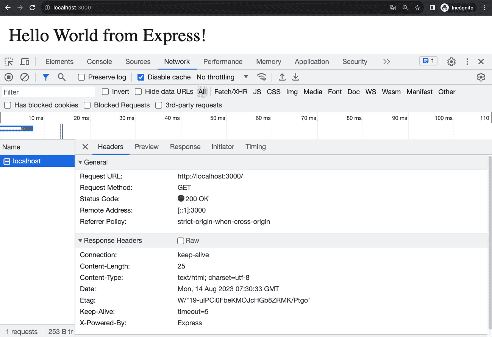
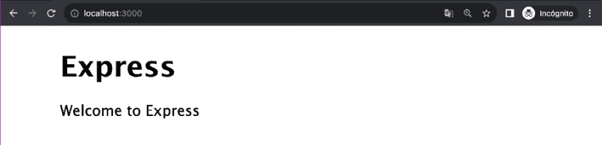
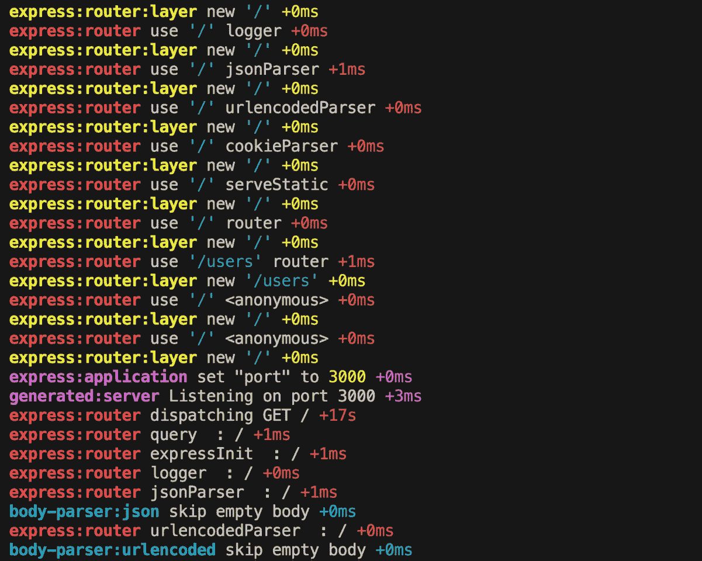
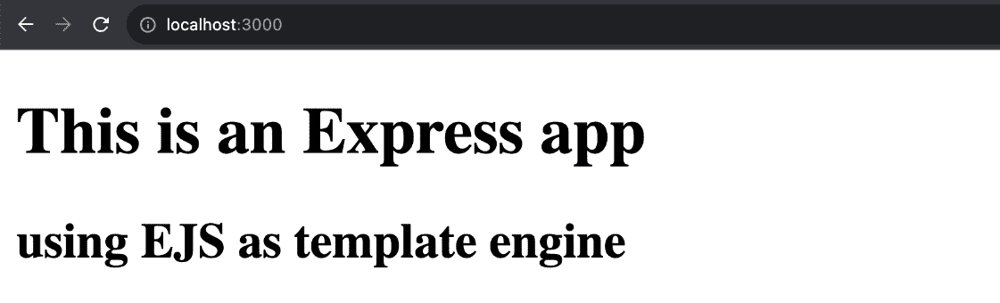
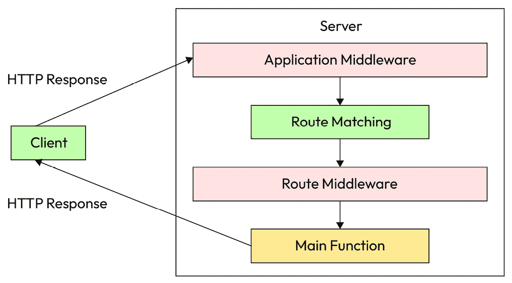
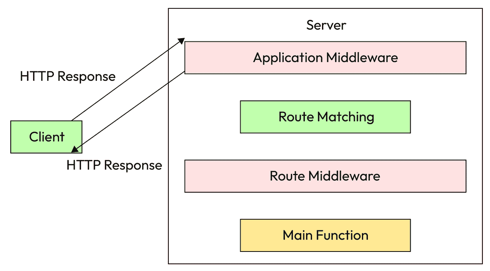
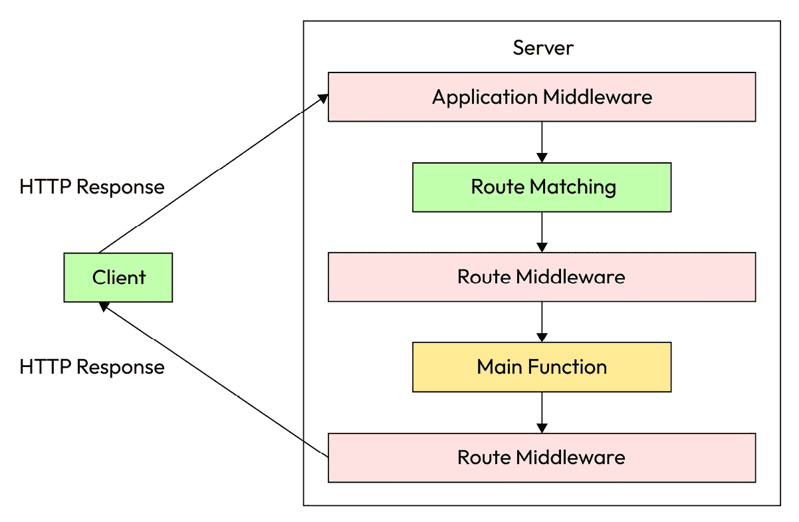

# 第十章：使用 Express 构建 Web 应用程序

Express 是最流行的 JavaScript 网络框架，并且多年来一直是事实上的标准。它是一个非常简约的框架，非常容易学习，并且为构建网络应用提供了很多灵活性。

在本章中，我们将从一个最基本的“Hello World”应用程序开始，构建一个坚实且经过良好测试的 REST API 应用程序。我们将详细探讨 Express 的所有关键组件，包括请求和响应、中间件和路由。我们还将学习如何使用最常用的 Express 中间件以及如何构建自己的中间件。

总结一下，以下是本章我们将探讨的主要主题：

+   为你的项目提供静态文件服务

+   使用模板引擎构建服务器端渲染的着陆页

+   使用 Express 构建典型的 CRUD REST API 应用程序

+   使用最常用的 Express 中间件，包括第三方库

+   构建自己的中间件

# 技术要求

本章的代码文件可以在 [`github.com/PacktPublishing/NodeJS-for-Beginners`](https://github.com/PacktPublishing/NodeJS-for-Beginners) 找到

查看本章在 [`youtu.be/8QyDZVa7CNg`](https://youtu.be/8QyDZVa7CNg) 中的代码执行视频

# 熟悉 Express 库

Express 在其自己的网站上 ([`expressjs.com/`](https://expressjs.com/)) 如下定义：

快速、无偏见、简约的 Node.js 网络框架

所以，好消息是我们有很多自由度来构建我们的应用程序。坏消息是我们必须做出很多决定，我们必须小心不要犯错误。

与其他网络框架相比，Express 非常简约，因此当需要时，我们必须添加第三方库或构建自己的抽象。Express 有一个非常活跃的社区，因此我们可以找到很多库来解决常见问题。

此外，官方文档质量很高，有很多资源可以学习更多关于 Express 的知识，这使得 Express 成为初学者的绝佳选择。

由于 Express 是一个无偏见的框架，当你遵循教程或课程时，你会发现代码有时并不一致，也不遵循相同的模式。这是因为你在 Express 中有很多自由度，随着时间的推移，你将发展出自己的模式，并找到最适合你的构建应用程序的方式。

在这本书中，我们将使用 Express 版本 4.18.3，但任何 Express 4.x 版本都应该是可以的。我们将使用 Node.js 版本 20.11.0。这两个都是写作时的最新版本。

## 安装 Express

要安装 Express，我们必须在新的 Node.js 项目中运行以下命令：

```js
npm install express@4
```

你不需要任何额外的配置；只需安装它，你就可以开始了。

## Hello World

让我们从简单的例子开始，一个 Hello World 应用程序。创建一个名为 `helloWorld.js` 的新文件，并添加以下代码：

```js
import express from 'express'
const app = express()
const port = 3000
app.get('/', (req, res) => {
  res.send('Hello World from Express!')
})
app.listen(port, () => {
  console.log(`Hello World app listening on port ${port}`)
})
```

非常简单，对吧？让我们来分解一下：

1.  我们导入 Express 库并创建 Express 应用程序的一个实例。

1.  我们为`/`根路径定义一个路由，并发送包含文本`Hello World` `from Express!`的响应。

1.  我们启动服务器并监听端口`3000`。

要运行应用程序，我们使用以下命令：

```js
node helloWorld.js
```

如果一切正常，你应该看到以下输出：

```js
Hello World app listening on port 3000
```

现在，如果你打开你的浏览器并转到`http://localhost:3000`，你应该看到文本**Hello World from Express!**，如下面的截图所示：



图 10.1 – 显示简单 Express 项目的 Web 浏览器截图

## 使用生成器

Express 有一个命令行工具可以生成基本的应用程序。要使用它，我们必须运行以下命令：

```js
npx express-generator@4
```

这将生成一个包含许多文件和文件夹的新应用程序。我建议你创建一个新的文件夹并在那里运行命令，这样你就不会弄乱你的当前项目。

执行时的输出应该类似于以下内容：

```js
   create : public/
   create : public/javascripts/
   create : public/images/
   create : public/stylesheets/
   create : public/stylesheets/style.css
   create : routes/
   create : routes/index.js
   create : routes/users.js
   create : views/
   create : views/error.jade
   create : views/index.jade
   create : views/layout.jade
   create : app.js
   create : package.json
   create : bin/
   create : bin/www
   install dependencies:
     $ npm install
   run the app:
     $ DEBUG=generated:* npm start
```

然后下一步是安装依赖项：

```js
npm install
```

最后，我们可以启动应用程序：

```js
npm start
```

如果一切正常，你应该看到以下输出：

```js
> generated@0.0.0 start
> node ./bin/www
GET / 304 125.395 ms - -
GET /stylesheets/style.css 304 1.265 ms - -
GET / 304 11.043 ms - -
GET /stylesheets/style.css 304 0.396 ms - -
GET /ws 404 11.822 ms - 1322
```

如果你通过浏览器访问`http://localhost:3000`，你应该看到以下页面：



图 10.2 – 显示使用`express-generator`生成的 Express 应用的 Web 浏览器截图

随意探索生成的代码，但如果你对某些内容不理解也不要担心，因为接下来的章节中我们会涵盖所有重要的部分。请注意，路由[`localhost:3000/users`](http://localhost:3000/users)也是正常工作的，如果你尝试其他路由，你会得到一个 404 错误，例如[`localhost:3000/invented`](http://localhost:3000/invented)。

## 调试

现在，让我展示 Express 生成器包含的另一个酷功能，我们将在我们的项目中稍后使用。如果你在终端输出中使用命令`DEBUG=* npm start`或`set DEBUG=* && npm start`（如果你使用 Windows），输出将更加详细，你会看到关于请求和响应的很多信息：



图 10.3 – 终端截图

这是因为 Express 和许多其他依赖项使用`debug`库([`www.npmjs.com/package/debug`](https://www.npmjs.com/package/debug))来记录信息。通过使用`DEBUG=*`环境变量，我们告诉调试库打印与所有命名空间相关的信息。但我们可以更加选择性地限制范围，例如，通过使用`DEBUG=express:* npm start`环境变量。

现在，我们已经对 Express 有了基本的了解，是时候探索我们如何使用模板引擎来渲染发送到浏览器的 HTML 页面了。

# 理解模板引擎

在*第九章*中，我们学习了**单页应用程序**（**SPAs**）和服务器端渲染之间的区别。

Express 提供了一种使用模板引擎渲染 HTML 页面的方法。这是使用 Express 构建服务器端渲染应用程序的关键特性。

## 选择模板引擎

我们必须做的第一件事是选择一个模板引擎。有许多选项可供选择。历史上最受欢迎的选项是 Jade([`www.npmjs.com/package/jade`](https://www.npmjs.com/package/jade))，但它的名字已被改为 Pug([`www.npmjs.com/package/pug`](https://www.npmjs.com/package/pug))。您可以通过搜索这两个名字来找到许多教程和示例。

我个人更喜欢**嵌入式 JavaScript 模板**（**ejs**）([`www.npmjs.com/package/ejs`](https://www.npmjs.com/package/ejs))，因为它简单且文档齐全。随着时间的推移，您将更加熟悉模板引擎，并能够选择最适合您需求的那个。

## 渲染模板

因此，回到我们的 hello world 示例，让我们创建一个名为`helloWorldTemplate.js`的新文件，并添加以下代码：

```js
import express from ('express')
const app = express()
const port = 3000
app.set('view engine', 'ejs')
app.get('/', (req, res) => {
  res.render('index', {
    title: 'This is an Express app',
    subtitle: 'using EJS as template engine'})
})
app.listen(port, () => {
  console.log(`Application running in http://localhost:${port}`)
})
```

现在，我们必须创建一个名为`views`的新文件夹，在其中创建一个名为`index.ejs`的新文件，内容如下：

```js
<!DOCTYPE html>
<html lang="en">
<head>
  <meta charset="UTF-8">
  <title><%= title %></title>
</head>
<body>
  <h1><%= title %></h1>
  <h2><%= subtitle %></h2>
</body>
</html>
```

如您所见，模板引擎使用`<%=`和`%>`标签来插入值。在这种情况下，我们将`title`变量传递给模板。

最后，我们必须安装`ejs`依赖项：

```js
npm install ejs@3
```

然后我们按照以下方式启动应用程序：

```js
node helloWorldTemplate.js
```

如果您在浏览器中访问`http://localhost:3000`，您应该看到以下内容显示：



图 10.4 – 显示为最终用户渲染的模板的 Web 浏览器截图。

此外，如果您访问`view-source:http://localhost:3000/`，您将看到 Express 发送到浏览器的原始 HTML：

```js
<!DOCTYPE html>
<html lang="en">
<head>
  <meta charset="UTF-8">
  <title>This is an Express app</title>
</head>
<body>
  <h1>This is an Express app</h1>
  <h2>using EJS as template engine</h2>
</body>
</html>
```

如您所见，模板引擎正在为我们插入值并生成 HTML。

## 理解这个过程

现在，让我们理解代码中实际发生的事情：

```js
app.set('view engine', 'ejs')
```

前面的行告诉 Express 我们将使用`ejs`作为我们的模板引擎，因此现在我们可以使用`res.render`来渲染模板。

```js
res.render('index', {
    title: 'This is an Express app',
    subtitle: 'using EJS as template engine'
})
```

在前面的代码中，`res.render`方法接收两个参数。第一个参数是模板的名称，在这种情况下，`index`（`views/index.ejs`），第二个参数是我们想要在模板中插入的数据。

然后模板引擎将用我们在`res.render`方法的第二个参数中传递的值替换`<%= title %>`和`<%= subtitle %>`标签。

在现实世界的应用程序中，我们传递给模板的数据将是动态的；例如，我们从数据库或外部 API 获取的数据。但就目前而言，我们将使用静态数据以使示例简单。

在下一节中，我们将学习如何利用请求对象构建更丰富和强大的应用程序。

# 掌握请求

在*第九章*中，我们学习了关于 HTTP 请求和响应的所有理论。在这里，我们将介绍如何使用 Express 来处理这些请求。

在本节中，我们将专注于以下伪代码片段：

```js
import express from ('express')
const app = express()
app.method(route, handler)
```

我们有三个元素需要理解：

+   `method`，即我们想要处理的 HTTP 方法，例如`GET`、`POST`、`PUT`、`DELETE`等等

+   `route`，即我们想要处理的路径，例如`/`、`/users`或`/users/:id`

+   `handler`，即当`method`和`route`匹配时将被执行的回调函数

## HTTP 方法

Express 为每种 HTTP 方法提供了一个方法。有很多种方法（`get`、`post`、`put`、`head`、`delete`、`options`、`trace`、`copy`、`lock`、`mkcol`、`move`、`purge`、`propfind`、`proppatch`、`unlock`、`report`、`mkactivity`、`checkout`、`merge`、`m-search`、`notify`、`subscribe`、`unsubscribe`、`patch`、`search`和`connect`）。

最常见的是`get`、`post`、`put`和`delete`，因此我们将重点关注它们：

```js
app.get ('/', () => {})
app.post('/', () => {})
app.put('/', () => {})
app.delete('/', () => {})
```

如果你想在同一个路由中管理所有 HTTP 方法，你可以使用`all`方法：

```js
app.all('/', () => {})
```

## 路由

路由非常灵活，可以是动态的。我们可以用不同的方式定义它们，包括正则表达式。

### 静态路径

静态路径是定义路由最常见的方式。它们用于处理对特定路径的请求，例如`/`、`/users`或`/user/me`：

```js
app.get('/', () => {})
app.get('/users', () => {})
app.get('/user/me', () => {})
```

### 动态参数

动态参数用于处理对特定路径的请求。我们可以使用`:`字符来定义一个动态参数，例如`/users/:id`或`/users/:id/profile`：

```js
app.get('/users/:id', () => {})
```

在这种情况下，`:id`是一个动态参数，因此它可以与任何值匹配，包括`/users/1`、`/users/peter`、`/users/jane-doe`等等。

你甚至可以将静态和动态参数结合起来，例如`/users/:id/profile`：

```js
app.get('/users/:id/profile', () => {})
```

上述示例将解析对`/users/1/profile`、`/users/peter/profile`、`/users/jane-doe/profile`等路径的请求。

这种模式在交通应用中相当常见，例如，你可以有一个像`/users/:id/rides/:rideId`这样的路由来获取特定行程的详细信息，或者当你使用像`/flights/from/:originCity/to/:destinationCity`这样的路由预订航班时。Express 将为`req.params`对象提供动态参数的值：

```js
app.get('/users/:id', (req, res) => {
    const { originCity, destinationCity } = req.params
    res.send(`You are flying from ${originCity} to ${destinationCity}`)
})
```

### 可选参数

可选参数用于处理对特定路径的请求，但该参数是可选的。这可以通过使用`?`字符来完成，例如`/invoice/:id?`：

```js
app.get('/invoice/:id?', (req, res) => {
    const id = parseInt(req.params.id)
    if (id) {
        res.send(`You are looking for the invoice with id ${id}`)
    } else {
        res.send(`You are looking for all the invoices`)
    }
})
```

在这种情况下，`:id`参数是可选的，因此它可以与`/invoice`、`/invoice/167`、`/invoice/G123S8123SD123MJ`等匹配。

### 正则表达式

我们可以使用正则表达式来定义路由。当我们想要使用可预测的模式匹配路由时，这非常有用——例如，`/.*fly$/` 将识别以 `fly` 结尾的任何文本：

```js
app.get(/.*fly$/, (req, res) => {
  res.send(`Match with any route that ends with fly`)
})
```

前面的路由将匹配 `/butterfly`、`/dragonfly`、`/fly`、`/mcfly` 等等。让我们创建一个不那么奇特示例：

```js
app.get('/msg/:id/:action(edit|delete)', (req, res, next) => {
  res.send(`You request the action ${req.params.action} for the message ${req.params.id}`);
});
```

在这种情况下，路由将匹配 `/msg/1/edit`、`/msg/1/delete` 等等。

注意

如果你不太熟悉正则表达式，不要担心：你可以使用其他选项来定义你的路由。但如果你想更深入地探索正则表达式，我建议你尝试 *正则表达式 101* ([`regex101.com/`](https://regex101.com/))。

### 查询参数

在 *第九章* 中，我们学习了 URL 的不同部分，并看到查询参数是以 `?` 开头的部分。这些用于向服务器发送额外信息。例如，在 URL `/films?category=scifi&director=George+Lucas` 中，我们发送了两个查询参数，`category` 和 `director`。

我们可以在 `req.query` 对象中捕获查询参数，并在我们的路由中使用它们：

```js
app.get('/films', (req, res) => {
    const { category, director } = req.query
    res.send(`You are looking for films with category ${category} and director ${director}`)
})
```

重要的是要注意，查询参数是可选的，这意味着请求可能根本不包含任何查询参数。在这种情况下，`req.query` 对象将是空的。

注意

URL 片段（即 `/mypath#fragment`）不是请求的一部分，浏览器也不会将其作为此类包含，因此我们无法捕获它们。有关更多信息，请参阅 https://github.com/expressjs/express/issues/1083。

### 顺序的重要性

路由是按照你定义的顺序注册的，这允许 Express 避免路由之间的冲突。让我们看一个例子：

```js
app.get('/users/:id', () => {
    res.send(`You are looking for the user with id ${req.params.id}`)
})
app.get('/users/me', () => {
    res.send(`You are looking for the current user`)
})
```

如果你尝试访问 `/users/me`，你会得到消息 `You are looking for the user with id me`，因为 `/users/:id` 路由是首先注册的，所以它会匹配 `/users/me`，而 `me` 的值将被存储在 `req.params.id` 属性中。

你可以通过调整路由的顺序来解决这个问题：

```js
app.get('/users/me', () => {})
app.get('/users/:id', () => {})
```

在大型项目中，如果你没有良好的策略来定义路由，这可能会成为一个问题。这也是在项目中包含自动化测试以避免意外配置路由错误的好理由。

## 处理器

处理器是在请求与路由匹配时执行的函数。虽然处理器是一个带有三个参数（`req`、`res` 和 `next`）的简单函数，但它承担着处理请求响应或委派请求给其他处理器的重大责任：

```js
app.get('/', (req, res, next) => {
    res.send("Hello World")
})
```

让我们更详细地看看处理器的参数。

### 请求

请求对象（`req`）包含有关请求的所有信息，包括参数、IP、头部、主体等。如果你使用其他扩展 Express 功能的库，你经常会在这个对象中找到更多属性。

你可以在 Express 文档中找到更多关于请求对象的信息（[`expressjs.com/en/4x/api.html#req`](https://expressjs.com/en/4x/api.html#req)）。

### response

响应对象 (`res`) 包含处理请求响应的所有方法，包括简单的 `send` 或 `json` 方法，以及更复杂的方法，如下载或重定向。

在下一节中，我们将学习更多关于响应对象的功能。

### next

下一个函数 (`next`) 用于将请求委派给下一个处理器。当你想要将处理器的逻辑拆分成多个函数或委派错误管理时，这很有用。

我们将在接下来的两个章节中学习这两种策略，届时我们将讨论中间件模式和掌握响应。

在下一节中，我们将学习如何利用响应对象，以及如何根据许多不同的场景自定义响应，例如 HTTP 重定向、HTTP 头部定制等。

# 掌握响应

响应是服务器在请求之后与客户端通信的方式，因此理解如何管理它们至关重要。在本节中，我们将学习如何添加头部、状态码、重定向、发送数据和发送文件。

当你开始构建更复杂的应用程序时，你将发现可用的方法。你可以在 Express 文档中找到更多关于响应对象的信息（[`expressjs.com/en/4x/api.html#res`](https://expressjs.com/en/4x/api.html#res)）。

## 头部管理

头部用于发送关于响应的额外信息。Express 通过 `set` 方法处理头部，它接受两个参数，即头部的名称和值：

```js
app.get('/', (req, res, next) => {
    res.set('Content-Type', 'text/html')
    res.send("<h1>Hello World</h1>")
})
```

在前面的示例中，我们将 `Content-Type` 头部设置为 `text/html`，这样浏览器就会知道响应是一个 HTML 文档，并将其渲染为 HTML。

### 多个头部

你也可以通过传递一个对象作为第一个参数来使用 `set` 方法同时设置多个头部：

```js
app.get('/', (req, res, next) => {
    res.set({
        'Content-Type': 'text/html',
        'x-powered-by': 'Unicorns and rainbows'
    })
    res.send("<h1>Hello World</h1>")
})
```

在前面的代码中，我们设置了两个头部，`Content-Type` 和 `x-powered-by`。

### 删除头部

你可以使用 `removeHeader` 方法来删除头部，它接受头部名称作为第一个参数：

```js
app.get('/', (req, res, next) => {
    res.set({
        'Content-Type': 'text/html',
        'x-powered-by': 'Unicorns and rainbows'
    })
    res.removeHeader('x-powered-by')
    res.send("<h1>Hello World</h1>")
})
```

在前面的示例中，我们正在移除之前语句中刚刚添加的 `x-powered-by` 头部。

## 状态码

状态码是一个表示响应状态的数字。它用于将请求的状态传达给客户端。使用正确的状态码非常重要，因为它是我们之前讨论的 HTTP 协议的一部分，见 *第九章*。

你可以使用 `status` 方法来管理状态码，它接受状态码作为第一个参数：

```js
app.get('/', (req, res, next) => {
    res.status(200)
    res.send("<h1>Hello World</h1>")
})
```

在前面的示例中，我们将状态码设置为 `200`，这意味着请求成功。默认情况下，如果你没有设置状态码，Express 会将其设置为 `200`。

### 方法链式调用

你可以将 `status` 方法与其他方法链式调用，例如 `set` 或 `send`：

```js
app.get('/', (req, res, next) => {
    res.status(200).set('Content-Type', 'text/html').send("<h1>Hello World</h1>")
})
```

### 仅发送状态码

如果你只想发送状态码，可以使用 `sendStatus` 方法，它将状态码作为第一个参数接收：

```js
app.get('/', (req, res, next) => {
    res.sendStatus(500)
})
```

在前面的例子中，我们发送了 `500` 状态码，这意味着请求没有成功。

## 重定向

你可以使用 `redirect` 方法将请求重定向到另一个 URL，它将 URL 作为第一个参数接收：

```js
app.get('/', (req, res, next) => {
    res.redirect('https://ulisesgascon.com/')
})
```

在前面的例子中，我们将请求重定向到 [`ulisesgascon.com`](https://ulisesgascon.com)。

重定向的默认状态码是 `302`，但你可以通过指定状态码作为第一个参数来更改它：

```js
app.get('/', (req, res, next) => {
    res.redirect(301, 'https://ulisesgascon.com/')
})
```

`redirect` 方法也接受相对 URL，因此你可以将请求重定向到应用程序中的另一个路由：

```js
app.get('/', (req, res, next) => {
    res.redirect('/about')
})
```

你甚至可以将 URL 重定向到更高的层级：

```js
app.get('/about/me', (req, res, next) => {
    res.redirect('..')
})
```

在这种情况下，请求将被重定向到 `/about`，类似于在终端中执行 `cd..`。

你还可以使用 `back` 方法将请求重定向到引用 URL。如果请求中没有引用头，则请求将被重定向到 `/`：

```js
app.get('/', (req, res, next) => {
    res.redirect('back')
})
```

## 发送数据

在本章的开头，我们看到了如何使用 `res.render` 来渲染模板，但还有其他方法可以将数据发送到客户端。最常见的方法是使用 `send` 方法，它将数据作为参数接收。这可以是任何类型的数据，包括缓冲区：

```js
app.get('/', (req, res, next) => {
    res.send("Hello World")
})
```

### 使用 res.send()

在底层，`send` 方法会将数据转换为字符串，并将 `Content-Type` 头设置为 `text/html`，除非你使用 `res.set()` 指定其他内容。它还会包含 `Content-Length`。

如果你使用缓冲区，`Content-Type` 将被设置为 `application/octet-stream`，`Content-Length` 将被设置为缓冲区的长度，但你可以通过使用 `res.set()` 来更改这些设置：

```js
app.get('/', (req, res, next) => {
    res.set('Content-Type', 'text/html')
    res.send(Buffer.from('<p>Hello World</p>'))
})
```

### 使用 res.json()

如果你想要发送 JSON 数据，可以直接使用 `json` 方法，它将数据作为第一个参数接收。它将设置 `Content-Type` 头为 `application/json` 并为你进行数据的序列化：

```js
app.get('/', (req, res, next) => {
    res.json({message: 'Hello World'})
})
```

这是最常见的发送 JSON 数据的方式，但你也可以使用 `send` 方法并设置 `Content-Type` 头为 `application/json`，自行进行数据的序列化：

```js
app.get('/', (req, res, next) => {
    res.set('Content-Type', 'application/json')
    res.send(JSON.stringify({message: 'Hello World'}))
})
```

如果你想要使用不同的字符串化库，例如 `fast-json-stringify` ([`www.npmjs.com/package/fast-json-stringify`](https://www.npmjs.com/package/fast-json-stringify))，这将非常有用。

## 发送文件

你可以通过使用 `sendFile` 方法将文件发送到客户端，它将文件路径作为第一个参数接收：

```js
app.get('/report', (req, res, next) => {
    res.sendFile('/path/to/file.txt')
})
```

在前面的示例中，我们将 `/path/to/file.txt` 文件发送到客户端。这种方法提供了巨大的灵活性，包括一个回调来管理可能出现的错误。请参阅文档 ([`expressjs.com/en/4x/api.html#res.sendFile`](http://expressjs.com/en/4x/api.html#res.sendFile)) 获取更多信息。

发送文件的另一种方式是使用 `res.download()` 方法，它将文件路径作为第一个参数接收：

```js
app.get('/report', (req, res, next) => {
    res.attachment('/path/to/file.txt')
})
```

此方法将设置 `Content-Disposition` 标头为 `attachment`，并将 `Content-Type` 标头设置为 `application/octet-stream`，除非您使用 `res.set()` 指定其他内容。此方法提供了巨大的灵活性，包括一个回调来管理可能出现的错误。您可以查看文档 ([`expressjs.com/en/4x/api.html#res.download`](http://expressjs.com/en/4x/api.html#res.download)) 获取更多信息。

在下一节中，我们将了解中间件模式有多么强大，以及我们如何利用它来构建更复杂的应用程序。Express 基于中间件模式，因此理解它非常重要，因为它将使我们能够轻松扩展 Express 的功能。

# 使用中间件模式

Express 的核心是中间件模式，它允许您通过添加将在请求-响应周期中执行的功能来扩展框架的功能。中间件函数按照它们添加到应用程序中的顺序执行，并且可以将它们添加到应用程序或路由中。



图 10.5 – 从应用中间件到主函数的中间件模式完整流程

我们可以将中间件模式理解为一条管道，其中请求通过管道传递，每个中间件函数都可以修改请求和响应，并将请求传递给管道中的下一个中间件函数。中间件函数还可以通过向客户端发送响应来结束请求-响应周期。



图 10.6 – 仅限于应用中间件的中间件模式

我们可以向应用程序添加一个全局中间件，以验证请求是否经过认证。当用户正确认证后，我们可以将请求传递给管道中的下一个中间件函数，如果用户未认证，我们可以通过向客户端发送包含错误信息的响应来结束请求-响应周期。


图 10.7 – 从应用中间件到路由中间件的中间件模式

我们还可以向路由添加一个中间件函数，例如验证用户是否有适当的权限访问该路由，如果有，则可以将请求传递给管道中的下一个中间件函数；如果用户没有适当的权限，我们可以通过向客户端发送错误消息来结束请求-响应周期。



图 10.8 – 从应用程序中间件到主函数的中间件模式完整流程

当中间件的主要功能出现任何问题，如异常，导致中间件无法继续进行请求-响应周期时，错误中间件可以接管控制权，并向客户端发送错误消息。

如您所见，中间件模式相当复杂，但同时也非常强大，因为它使我们能够轻松地抽象和重用代码。我们可以将请求解析为一系列函数，其中每个函数在需要时可以接管控制权，这样我们就可以很好地隔离适当的业务逻辑。

## 理解作用域

因此，中间件函数有三个可能的作用域：

+   **全局中间件**：这将针对应用程序接收到的所有请求执行。

+   **路由中间件**：这将针对接收到的所有请求执行。

+   **错误中间件**：当中间件函数抛出错误时将执行。

## 中间件结构

那么，让我们看看中间件函数的结构：

```js
const middleware(req, res, next) {}
```

基本上，中间件函数接收三个参数：请求对象、响应对象和下一个函数。

现在让我们详细看看我们可以用中间件函数做什么。

### 向请求添加上下文

中间件函数的一个非常常见的用途是向请求对象添加上下文。想法是扩展请求对象，添加额外的属性，这些属性将被管道中的下一个中间件函数使用。让我们看一个例子：

```js
const detectLangMiddleware(req, res, next) {
    req.lang = req.headers['accept-language'] || 'en'
    next()
}
```

在前面的示例中，我们正在向请求对象添加一个名为`lang`的新属性。该属性可以被管道中的下一个中间件函数作为`req.lang`使用。

这是一个非常简单的例子，但相当常见，用于创建简单且易于组合的中间件函数。

如您所见，`detectLangMiddleware`正在使用`next()`来让 Express 知道中间件已完成且没有错误。在这种情况下，如果我们不调用`next()`，应用程序将永远挂起。

### 管理响应

中间件函数的另一个常见用途是管理响应。例如，我们可以添加一个中间件函数，如果用户正在使用 Internet Explorer，则将用户重定向到[`updatemybrowser.org/`](https://updatemybrowser.org/)：

```js
const legacyBrowsersMiddleware(req, res, next) {
    if (req.headers['user-agent'].includes('MSIE')) {
        res.redirect('https://updatemybrowser.org/')
    } else {
        next()
    }
}
```

如您所见，如果用户正在使用 Internet Explorer，他们将被重定向到 [`updatemybrowser.org/`](https://updatemybrowser.org/)。我们不调用 `next()`，因为我们不想继续进行请求-响应周期，因为我们已经使用 `res.redirect()` 向客户端发送了响应。

如果用户没有使用 Internet Explorer，我们将调用 `next()` 以继续进行常规的请求-响应周期。

### 额外配置

在 *第三章* 中，我们学习了闭包的工作原理。使用闭包向中间件函数添加额外配置是很常见的。让我们看看一个例子：

```js
const detectLangMiddleware = defaultLang => (req, res, next) => {
    req.lang = req.headers['accept-language'] || defaultLang
    next()
}
```

在前面的代码中，我们将中间件函数从 `before` 改为使用闭包接收默认语言作为参数，因此我们不需要默认使用 `en`。

因此，现在这个中间件函数将按以下方式执行：

```js
import { detectLangMiddleware } from './utils'
// With the closure
app.use(detectLangMiddleware('es'))
// without the closure
app.use(detectLangMiddleware)
```

这是一种常见的中间件函数模式，需要额外的配置，例如本例中的默认语言，或者令牌等。

### 测试

这种中间件模式的另一个优点是，我们可以轻松地对中间件函数进行单元测试，因为它们只是接收请求、响应和下一个函数作为参数并执行它们的函数。我们可以模拟请求和响应，并模拟下一个函数以检查中间件是否正常工作。

我们将在本章的后面部分更详细地介绍这一点，但在此期间，您可以检查我名为 `user-language-middleware` 的库 ([`www.npmjs.com/package/user-language-middleware`](https://www.npmjs.com/package/user-language-middleware))。完整的测试套件可以在 [`github.com/UlisesGascon/user-language-middleware/blob/main/__tests__/userLanguageMiddleware.test.js`](https://github.com/UlisesGascon/user-language-middleware/blob/main/__tests__/userLanguageMiddleware.test.js) 找到，以更熟悉中间件函数的测试。

## 向应用程序添加中间件

您可以使用 `app.use()` 方法向应用程序添加中间件。此方法接收一个中间件函数作为参数，并将为应用程序接收到的所有请求执行：

```js
app.use(legacyBrowsersMiddleware)
```

注意，中间件函数的顺序很重要，因为它们将以它们被添加到应用程序中的相同顺序执行。

## 向路由添加中间件

您可以通过使用 `app.METHOD()` 方法而不是 `app.use()` 来以与向应用程序添加相同的方式向路由添加中间件：

```js
app.get('/users', legacyBrowsersMiddleware, (req, res) => {
    res.send('Hello world')
})
```

因此，`legacyBrowsersMiddleware` 只会在 `GET /users` 路由上执行，如果 `legacyBrowsersMiddleware` 调用 `next()`，则管道中的下一个中间件函数将被执行，在这种情况下是 `(req, res) => { res.send('Hello world') }`。

是的，我们自从本章开始就一直使用这种模式！确实可以说 *所有路由都是 Express 中的中间件函数*。

### 中间件链式调用

你可以在同一个 `app.METHOD()` 方法中链式调用中间件函数，只需添加以下内容：

```js
app.get('/users', legacyBrowsersMiddleware, detectLangMiddleware, (req, res) => {
    res.send('Hello world')
})
```

这在大型应用中非常常见，其中有很多中间件函数按照特定顺序执行。审查中间件函数的顺序是一个好习惯，以避免意外的行为，如果它们在多个路由中使用，则需要将它们迁移到应用级别，并根据需要调整业务逻辑。

## Express 中常用的中间件

从历史上看，Express 团队已经在框架中包含了一些中间件函数，但自从 Express 4 以来，大多数中间件函数已经移动到外部包中。然而，框架中仍然包含了一些中间件函数。

### 静态文件

Express 包含一个中间件函数，用于从目录中提供静态文件。这对于提供 Web 应用的静态资源，如图像、CSS 文件或 JavaScript 文件非常有用：

```js
app.use(express.static('public'))
```

你也可以使用多个目录来提供静态文件：

```js
app.use(express.static('public'))
app.use(express.static('files'))
```

### 错误处理

Express 包含一个用于处理错误的中间件函数。这个中间件函数必须是管道中的最后一个，并且它必须接收四个参数而不是三个。第一个参数是错误，第二个是请求，第三个是响应，第四个是下一个函数：

```js
app.use((err, req, res, next) => {
    console.error(err.stack)
    res.status(500).send('Ohh! The Server needs some love')
})
```

如果你在任何中间件函数中遇到错误，你可以调用 `next(err)`，这样这个中间件函数就会被执行，就像你在路由处理程序中抛出错误时一样。让我们看看它是如何工作的：

```js
import express from 'express'
const app = express()
const port = 3000
app.get('/next-error', (req, res, next) => {
    next(new Error('Ohh! Something went wrong'))
})
app.get('/throw-error', (req, res) => {
    throw new Error('Ohh! Something went wrong')
})
app.use((err, req, res, next) => {
    console.error(err.stack)
    res.status(500).send('Ohh! The Server needs some love')
})
app.listen(port, () => {
  console.log(`running at http://localhost:${port}`)
})
```

如果你现在访问 [`localhost:3000/next-error`](http://localhost:3000/next-error) 或 [`localhost:3000/throw-error`](http://localhost:3000/throw-error)，你会看到错误处理中间件函数正在接管控制。

在下一节中，我们将继续学习中间件模式，但我们将关注生态系统中可用的第三方中间件函数。目前，有大量的中间件函数可以在你的 Express 应用程序中使用，因此了解如何正确使用它们非常重要。虽然使用第三方中间件函数可以节省大量时间和精力，但你必须小心，因为这意味着为你的项目添加更多的依赖项。

# 使用第三方中间件

你可以在你的 Express 应用程序中使用许多第三方中间件函数。让我们看看如何安装和使用它们。

最受欢迎的中间件函数之一是 `body-parser` ([`www.npmjs.com/package/body-parser`](https://www.npmjs.com/package/body-parser))。基本上，它将解析传入请求的 HTTP 主体，并将其作为 `req.body` 属性提供。

使用以下方式使用 `npm` 安装它：

```js
npm install body-parser@1
```

然后你可以导入它并在你的应用中使用它。创建一个名为 `echo_payload.js` 的新文件，并包含以下内容：

```js
import express from 'express'
import bodyParser from 'body-parser'
const app = express()
const port = 3000
app.use(bodyParser.json())
app.post('/echo', (req, res) => {
    // Echo the request body
    res.json(req.body)
})
app.listen(port, () => {
  console.log(`running at http://localhost:${port}`)
})
```

现在用 `node echo_payload.js` 运行应用，然后使用 `curl` 或类似的工具向 `/echo` 路由发送 POST 请求：

```js
curl -X POST -H "Content-Type: application/json" -d '{"name":"John"}' http://localhost:3000/echo
```

你将看到响应与你在请求体中发送的相同 JSON。

# 摘要

在本章中，我们学习了 Express 的多种用途，包括如何创建基本服务器、如何添加路由、如何添加静态文件以及如何使用模板。

此外，我们还学习了中间件模式的工作原理以及我们如何创建自己的中间件并在应用程序的不同级别使用它。我们还检查了一些第三方中间件，包括`body-parser`。

在下一章中，我们将学习如何深入测试我们的第一个 API。我们将涵盖如何测试路由和存储，并创建一个我们将开发在接下来的章节中的稳固 API。

# 进一步阅读

+   Express 文档：[`expressjs.com/`](https://expressjs.com/)

+   *Express，联合大会* 由道格·威尔逊撰写：[`www.youtube.com/watch?v=HxGt_3F0ULg`](https://www.youtube.com/watch?v=HxGt_3F0ULg)

+   *Node.js 基金会将 Express 添加为孵化器项目*：[`nodejs.medium.com/node-js-foundation-to-add-express-as-an-incubator-project-225fa3008f70`](https://nodejs.medium.com/node-js-foundation-to-add-express-as-an-incubator-project-225fa3008f70)

# 第四部分：使用 Node.js 构建稳固的 Web 应用程序

在 *第四部分*，我们将一起使用 Express 和 MongoDB 作为主要栈来构建一个 Web 应用程序。你将通过在项目中实现它们来学习高级主题，如错误处理或安全性，同时学习所有理论和最佳实践来确保你的 Web 应用程序安全。

本部分包括以下章节：

+   *第十一章*, *从零开始构建 Web 应用程序项目*

+   *第十二章*, *使用 MongoDB 进行数据持久化*

+   *第十三章*, *使用 Passport.js 进行用户身份验证和授权*

+   *第十四章*, *Node.js 中的错误处理*

+   *第十五章*, *保护 Web 应用程序*
