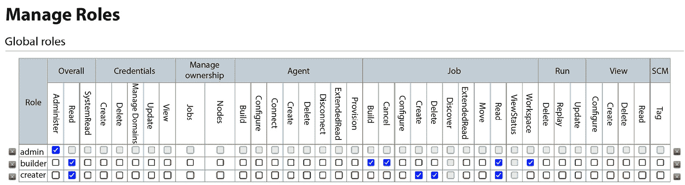
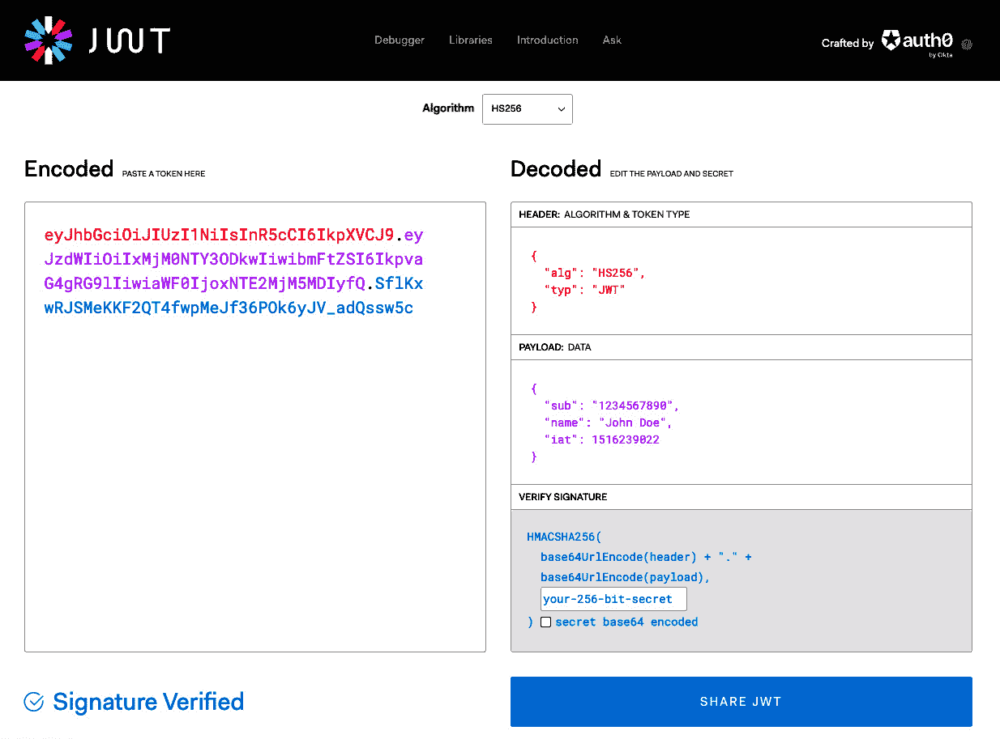
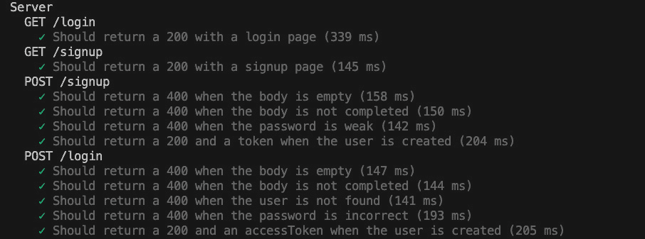
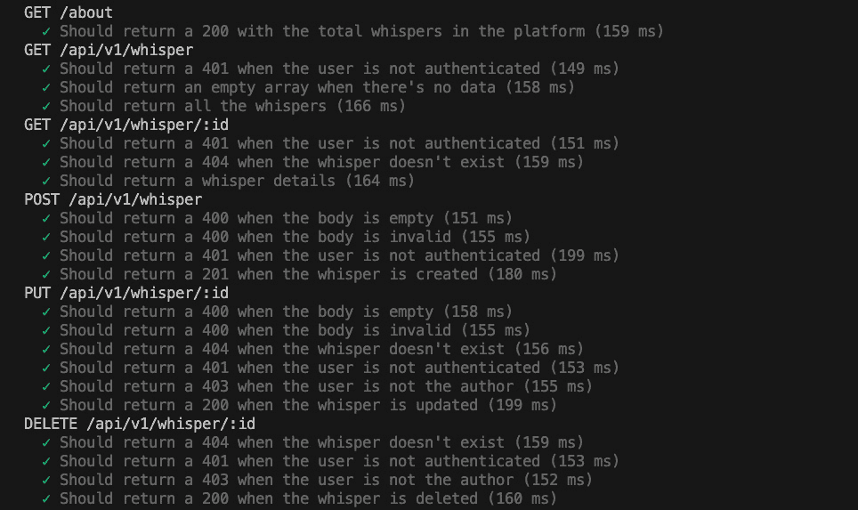
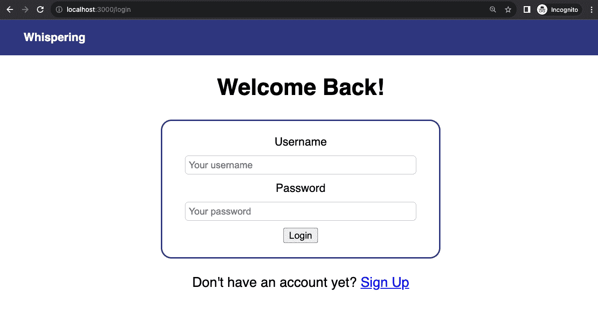
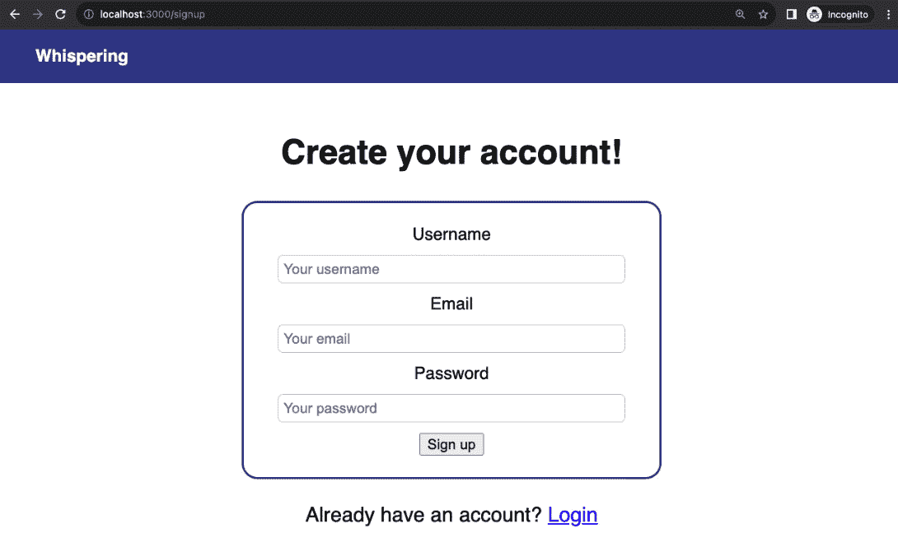
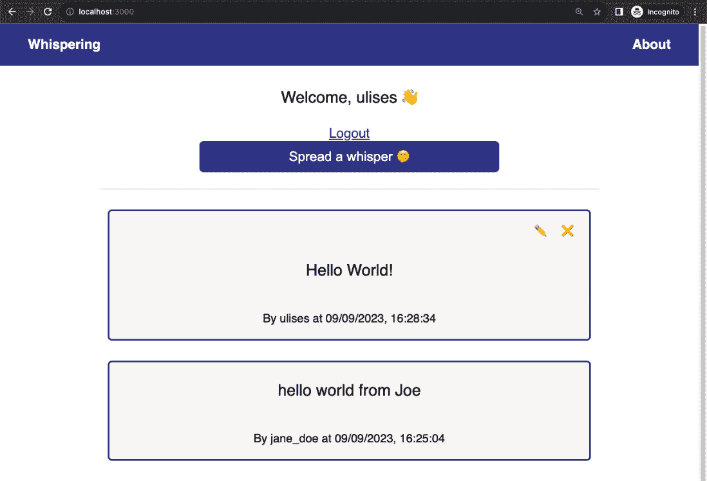
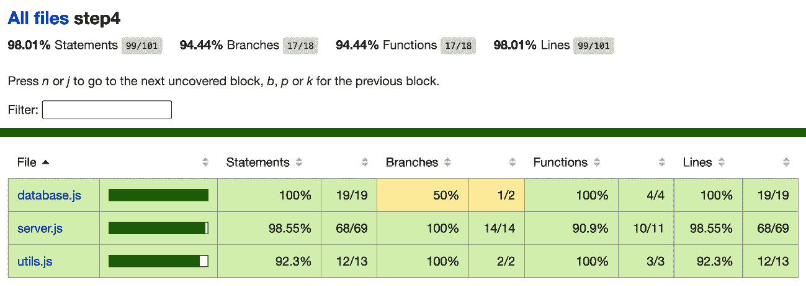

# 第十三章：使用 Passport.js 进行用户认证和授权

在本章中，我们将学习在现代 Web 应用程序中认证和授权是如何工作的。我们将探索许多安全机制背后的加密技术，并学习如何使用**JSON Web Tokens**（**JWT**）在我们的 Web 应用程序中实现这些概念。我们还将了解如何使用 Passport.js 扩展我们的认证策略，包括第三方提供者如 Facebook 或 Spotify。

在本章结束时，我们将通过迭代上一章中生成的代码，在我们的 Web 应用程序项目中实现认证和授权。我们还将学习如何具体测试它们。

总结一下，以下是本章我们将探讨的主要主题：

+   Web 应用程序中认证和授权的工作原理

+   如何在我们的 Web 应用程序中使用 JWT 进行用户认证

+   我们需要了解的加密基础知识，以便理解现代认证和授权机制

+   了解 Passport.js 的工作原理以及如何使用它在我们的 Web 应用程序中实现与第三方提供者（如 Facebook 或 Spotify）的认证

+   如何使用 JWT 和 Express 将认证和授权层添加到任何 Web 项目中

# 技术要求

为了跟随本章，以下是一些建议：

您应该熟悉我们在上一章中生成的代码，因为这是我们对上一章生成代码的迭代

+   在您的机器上安装了 Node.js 20.11.0

+   一个代码编辑器，例如 Visual Studio Code

+   已经设置并运行了 Docker

+   一个现代 Web 浏览器，例如 Chrome 或 Firefox

本章的代码文件可以在[`github.com/PacktPublishing/NodeJS-for-Beginners`](https://github.com/PacktPublishing/NodeJS-for-Beginners)找到

查看本章的代码演示视频，视频链接为[`youtu.be/mdE5eXS5enM`](https://youtu.be/mdE5eXS5enM)

# 理解现代认证和授权

**认证**和**授权**是两个经常被混淆的不同概念。认证涉及确认用户的身份，而授权涉及验证他们拥有的特定访问权限。在本章中，我们将探讨如何在“将认证和授权添加到我们的 Web 应用程序”部分中实现这两个概念。

## 认证

HTTP 协议的一个重大挑战是它是无状态的。这意味着服务器不会保留任何关于客户端的信息。每个请求都是独立的，因此我们需要设计和提供机制，使我们能够知道执行请求的用户是谁。这是认证过程的主要目标。

在 Web 应用程序中实现认证有许多方法。最常见的方法是使用用户名和密码，同时也有许多库可以帮助我们实现这一机制以及不同的实现方法。

我们可以将大部分工作委托给第三方提供商，例如 *Auth0*，或者我们自己来实现。

在本章中，我们将探讨如何使用 *Passport.js 库* 和 *JSON Web 令牌 (JWT)* 在我们的 Web 应用程序中实现身份验证。

## 授权

我们需要实现一种明确的方式来确定用户是否有权执行某些操作，例如创建新帖子或删除旧帖子。即使是访问特定页面这样简单的事情，也需要我们实现一种确定用户是否有权访问的方法。

在身份验证部分投入大量精力，但忘记授权方面是很常见的情况。从历史上看，互联网初期的 Web 系统较为简单，我们没有为每个用户分配很多角色，所以我们更关注你是谁，而不是你是否应该能够执行某些操作。今天，构建复杂的系统是很常见的，最终会有访问控制表来定义动作和角色之间的关系。例如，我们可以参考 *图 13.1* 中描述的基于角色的授权策略插件。使用这个插件，我们可以轻松理解和更新角色与潜在活动之间的关系。例如，**构建者**角色可以取消作业但不能配置它们。



图 13.1 – 来自 [`github.com/jenkinsci/role-strategy-plugin`](https://github.com/jenkinsci/role-strategy-plugin) 的 Web 浏览器截图，可在 MIT 许可下获得

没有正确考虑授权是一个非常常见的错误，可能会导致严重的安全问题。例如，如果我们忘记实现授权部分，我们可能会得到一个允许任何用户访问任何页面或执行任何操作的 Web 应用程序。这是一个非常危险的情况，可能会导致安全风险。

我们将在本章的 *将身份验证和授权添加到我们的 Web 应用程序* 部分中从实际角度探讨这个主题，看看如何在我们的 Web 应用程序中实现适当的授权策略。

既然我们已经清楚地理解了身份验证和授权之间的区别，让我们来探讨如何在我们的 Web 应用程序中实现它们。在下一节中，我们将学习如何使用 JWT 在我们的 Web 应用程序中验证用户。

# JWT 简述

在 Web 应用程序中实现身份验证最流行的方法之一是使用 JWT。

因此，让我们看看一些定义：

JSON Web Token 是一个提议的互联网标准，用于创建带有可选签名和/或可选加密的数据，其有效载荷包含断言一定数量声明的 JSON。这些令牌可以使用私有密钥或公私钥进行签名。

(JSON Web Token, [`en.wikipedia.org/wiki/JSON_Web_Token`](https://en.wikipedia.org/wiki/JSON_Web_Token))

JSON Web Tokens 是一种开放、行业标准的 RFC 7519 方法，用于在双方之间安全地表示声明。

(JWT, [`jwt.io/`](https://jwt.io/))

因此，基本上，**JWT**是一个包含信息（*声明*）的字符串（*JSON*），并使用一个密钥进行签名。这个过程确保 JWT 内的信息保持安全且不可篡改，允许在后续请求中进行验证。尽管这听起来可能是一个简单的概念，但深入了解会揭示许多复杂性和考虑因素，必须首先理解。

让我们列出我们期望支持的某些最关键的功能，以了解其背后的复杂性：

+   任何人都可以向我们的服务器发送请求，因此我们默认不能信任任何请求。

+   任何人都可以尝试操纵请求，因此我们需要实现一个机制，允许我们验证请求没有被操纵。

+   我们需要实现一个机制，允许我们验证请求，而无需在服务器上存储任何信息。这样我们就可以无问题地扩展我们的应用，甚至可以在多个服务器上使用相同的 JWT。

## 该过程

简而言之，用户将使用用户名和密码进行认证，然后服务器将返回一个 JWT。用户将在每个请求中发送 JWT，服务器将验证 JWT 以认证用户。

## 理论

JWT 是一个包含用户信息（如姓名、角色等）的字符串，并使用一个密钥进行签名。因此，服务器可以使用密钥验证 JWT，并从中提取用户信息。任何修改 JWT 的尝试都将使签名无效，因此服务器将拒绝请求。

因此，为了正确地签名令牌，我们首先需要了解密码学的基础知识。

## 密码学 101

要使 JWT 工作，我们需要了解两件事：哈希和签名。

### 哈希

**哈希**是一个过程，它接受一个字符串并返回一个固定长度的字符串。此算法作为一个单向函数工作，因此我们可以对字符串进行哈希，但我们不能从哈希中获取原始字符串。

下面是一个使用 Node.js 中的`SHA256`算法对字符串进行哈希的示例：

```js
import crypto from 'crypto';
const hash = crypto.createHash('sha256');
hash.update('Hello World');
console.log(hash.digest('hex'));
// a591a6d40bf420404a011733cfb7b190d62c65bf0bcda32b57b277d9ad9f146e
```

我们将在本章的“向我们的 Web 应用添加认证和授权”部分稍后使用此算法来哈希用户的密码。

### 签名

**签名**是一个过程，它接受一个字符串和一个密钥，并返回一个新的字符串。此算法作为一个双向函数工作，因此我们可以对字符串进行签名，然后我们可以使用密钥验证签名。

### 广泛使用

这种使用哈希和签名的模式在许多不同的软件领域都非常常见。例如，当一个新的 Node.js 版本发布时，Node.js 团队将发布每个二进制文件的哈希值。这允许我们下载二进制文件，然后使用 Node.js 团队发布的哈希值来验证文件的哈希值。如果哈希值相同，那么我们可以确信文件没有被修改。

在发布哈希文件之前，会对文件进行签名，因此我们可以使用 Node.js 团队成员的公钥来验证签名。如果签名有效，那么我们可以确信哈希文件没有被修改。

例如，以下链接是 Node v20.11.0 的文件 shasum ([`nodejs.org/dist/v20.11.0/SHASUMS256.txt.asc`](https://nodejs.org/dist/v20.11.0/SHASUMS256.txt.asc))。以下代码块是文件的内容（为了节省空间已省略）以了解其工作原理：

```js
-----BEGIN PGP SIGNED MESSAGE-----
Hash: SHA256
 f76a47616ceb47b9766cb7182ec6b53100192349de6a8aebb11f3abce045748f  node-v20.11.0-aix-ppc64.tar.gz
...
 dce7cd4b62a721d783ce961e9f70416ac63cf9cdc87b01f6be46540201333b1e  win-x86/node_pdb.zip
-----BEGIN PGP SIGNATURE-----
iQGzBAEBCA...aig9KO/s=
=B/OP
-----END PGP SIGNATURE-----
```

如您所见，文件包含两部分（消息和签名）并使用`-----BEGIN PGP SIGNED MESSAGE-----`到`-----BEGIN PGP SIGNATURE-----`来分隔。这有助于我们验证文件的真实性——基本上，我们可以验证一个 Node.js 发布者创建了此文件，并且内容没有被篡改，即使下载文件的服务器被攻破。

消息本身包含每个二进制文件的哈希值，因此我们可以下载`node-v20.11.0-aix-ppc64.tar.gz`文件并检查文件内容是否与消息中发布的哈希值相同，即`f76a47616ceb47b9766cb7182ec6b53100192349de6a8aebb11f3abce045748f`。如果哈希值相同，那么我们可以确信文件没有被修改。这允许我们安全地分发信息。

重要注意事项

使用 JWT 时，我们将使用类似的模式，但我们将使用不同的算法来签名内容。您可以在 RFC 7518 中找到支持的算法列表 ([`tools.ietf.org/html/rfc7518#section-3.1`](https://tools.ietf.org/html/rfc7518#section-3.1))。

## JWT 结构

JWT 是一个由点分隔成三部分的字符串。每一部分都使用*base64*编码。这三部分如下：

+   **标题**：包含有关令牌类型和用于签名令牌的算法的信息

+   **有效载荷**：包含我们想要存储在令牌中的声明（信息）

+   **签名**：包含用于验证令牌的令牌签名

签名是使用密钥对标题和有效载荷进行签名的结果。最好的部分是，我们可以使用密钥来验证签名，因此我们可以在服务器上不需要存储任何信息的情况下验证令牌。此外，信息是使用 base64 编码的，因此任何人都可以解码并阅读它，但我们无法修改它。

有一个重要的事情需要提及，那就是你绝不应该在有效载荷中存储敏感信息，因为任何人都可以解码并读取它。这包括用户的密码和银行账户详情以及其他敏感信息。

## JWT.io

处理 JWT 的最佳工具之一是 JWT Debugger ([`jwt.io/`](https://jwt.io/))（见 *图 13**.2*）。这个网站允许我们编码和解码 JWT，以及验证令牌的签名。你可以用它来尝试或调试你的 JWT。



图 13.2 – 网络浏览器截图，展示如何解析和验证编码后的令牌

在进入本章的下一节之前，你可以随意尝试并探索它的工作原理。

在下一节中，我们将学习 Passport.js 的工作原理以及如何在我们 web 应用程序中使用它来实现与第三方提供者（如 Facebook 或 Spotify）的身份验证。

# 理解 Passport.js 基础知识

**Passport.js** 是一个出色的库，广泛用于在 Node.js 应用程序中实现身份验证。Passport.js 的官方网站将这个库定义为如下：

Passport 是 Node.js 的身份验证中间件。它极其灵活且模块化，可以无缝地集成到任何基于 Express 的 web 应用程序中。一套全面的策略支持使用用户名和密码、Facebook、Twitter 等进行身份验证。

(Passport.js, [`www.passportjs.org/`](http://www.passportjs.org/))

在本质上，Passport.js 是一个中间件 ([`expressjs.com/en/guide/using-middleware.html`](https://expressjs.com/en/guide/using-middleware.html))，我们将将其包含到我们的 Express 应用程序中，以提供多种不同的策略来实现身份验证。拥有这样的策略选择，我们可以选择最适合我们需求的一个。我们可以使用这个库轻松实现社交登录功能（如 Facebook、Twitter、Spotify、GitHub 以及更多，超过 500 种策略）以及典型的用户名/密码登录。

在下一节中，我们将迭代我们的 web 应用程序中的代码，以包含我们在本章中迄今为止所学到的身份验证和授权机制。

# 将身份验证和授权添加到我们的 web 应用程序中

在本节中，我们将向我们的 web 应用程序添加身份验证和授权。我们将使用 jsonwebtoken 库来实现身份验证部分，并使用自定义中间件来实现授权部分。

## 克隆基础项目

身份验证和授权的添加并不复杂，但跟随起来相当长，所以对于本章，您可以下载项目[`github.com/PacktPublishing/NodeJS-for-Beginners/archive/refs/heads/main.zip`](https://github.com/PacktPublishing/NodeJS-for-Beginners/archive/refs/heads/main.zip)并访问`step4`文件夹。实现已就绪，但我将评论自上一章（`step3`文件夹）以来我们所做的最相关更改，以便您能轻松跟踪我们所做的工作。

## 设置

我们的第一步是探索文件夹，安装依赖项，配置环境，并启动基础设施。这可以通过运行以下命令来完成：

1.  使用`npm i`安装依赖项。

1.  更新密钥，在根文件夹中添加`.env`文件，内容如下：

    ```js
    MONGODB_URI=mongodb://localhost:27017/whispering-database
    PORT=3000
    SALT_ROUNDS=10
    JWT_SECRET=Tu1fo3mO0PcAvjq^q3wQ24BXNI8$9R
    Run npm run infra:stop && npm run infra:start.
    ```

1.  运行`npm run infra:stop && npm run infra:start`。

现在，基础设施和配置已就绪，但在我们开始对应用程序进行更多更改之前，建议运行一些测试。

## 运行测试

接下来，我们需要运行一些测试以确保代码按预期工作，通过在终端中输入`npm run test`。

### 新增测试

我们可以看到，我们有一些与登录/注册相关的新路由以及针对它们的特定测试。当我们执行测试时，我们会看到测试消息（描述）在说明路由预期做什么以及我们希望通过测试做什么方面是清晰且一目了然的，即使我们还不熟悉代码：



图 13.3 – 终端截图展示了如何测试路由

我们应该能认出这些测试，因为我们已经在上一章中处理了这些路由。但如果我们继续滚动查看测试输出，我们应该会看到还添加了新的测试。

### 更新测试

之前的测试已更新，包括与 JWT 进行身份验证的路由的新测试用例：



图 13.4 – 终端截图显示测试通过以及如何通过描述轻松跟踪正在测试的内容

如您所见，测试中的用例涵盖了更多与身份验证和授权相关的场景，例如“当用户未进行身份验证时应返回 401”和“当用户不是作者时应返回 403”。

## UI 更改

但总体而言，最重要的变化与 UI 相关，因为我们现在有新的路由和视图用于登录/注册等。因此，我们可以通过运行`npm run start`来启动应用程序

### 登录

您可以在`http://localhost:3000/login`处输入凭据进行登录，此时后端 API 将返回一个 JWT，您可以使用它进行任何 CRUD 操作的身份验证。



图 13.5 – 展示用户可以输入用户名和密码的登录页面的网页浏览器截图

### 注册

您可以随时在 `http://localhost:3000/signup` 创建新账户。此操作将在数据库中生成新用户，并且后端将返回一个 JWT，您可以使用它来执行 CRUD 操作并验证您对 API 的访问。



图 13.6 – 展示用户可以创建新账户或使用现有凭据登录的网页浏览器截图

重要提示

服务器已定义有关用户名、电子邮件和密码的某些规则。因此，例如，您可以使用以下值：

+   用户名：`nodejs`

+   邮箱：`demo@demo.com`

+   密码：`aA1#dt$tu`

### CRUD 操作

如前所述，了解授权的工作方式非常重要。因此，以下是我们的业务逻辑规则：

+   任何已登录的用户都可以看到 Whispering 平台上的所有 whispers。

+   您只能修改或删除您创建的 whispers。

这些明确的规则将帮助我们构建一个涵盖所有场景的授权系统，因此，例如，您将无法删除其他用户创建的 whispers。在某些应用程序中，这种方法可能非常复杂，例如 Google Drive 或 Facebook。在这些场景中，拥有一个设置良好且文档齐全的权限矩阵非常有用。GitLab 提供了一个很好的例子（[`docs.gitlab.com/ee/user/permissions.html`](https://docs.gitlab.com/ee/user/permissions.html)）



图 13.7 – 展示所有 whispers 及其从 UI 交互按钮的主页的网页浏览器截图

如您所见，我们只能修改我们创建的 whispers，但此选项在视觉上对其他 whispers 不可用。

虽然 UI 是管理授权的关键因素，但我们需要确保后端也正确地管理其部分的授权，因此它不会允许用户修改或删除其他用户的 whispers。为了确保应用程序能够防止这些场景（如修改其他用户的 whispers），强烈建议添加特定的测试用例。检查测试套件用例，因为我们已经包括了涵盖`403` `Forbidden`响应的这些场景。

## 添加的依赖项

我们包括了以下依赖项：

+   **Bcrypt** ([`www.npmjs.com/package/bcrypt`](https://www.npmjs.com/package/bcrypt))：这是一个库，将帮助我们安全地将密码存储在数据库中。

+   **Jsonwebtoken** ([`www.npmjs.com/package/jsonwebtoken`](https://www.npmjs.com/package/jsonwebtoken))：这是一个帮助我们生成和解析 JWTs 的实用工具。

+   **Validator** ([`www.npmjs.com/package/validator`](https://www.npmjs.com/package/validator))：这是一个我们用来验证字符串的库。基本上，我们可以用它来清理从用户那里接收到的输入，包括电子邮件地址、URL、电话号码等。

这些依赖项将在以后用于正确构建我们的应用程序。在 Node.js 项目中依赖第三方库是很常见的。最重要的是要确保我们使用的是没有已知漏洞的高质量外部依赖项，正如我们在*第六章**.*中学到的。

## 前端的变化

我们添加了一个名为`public/auth.js`的新文件来管理用户登录或使用平台注册时的表单提交。在发送请求后，我们将 JWT 存储在本地存储中，这样我们就可以轻松地恢复 JWT，即使我们刷新页面：

```js
fetch('/login', {
    method: 'POST',
    headers: {
        'Content-Type': 'application/json'
    },
    body: JSON.stringify({
        username,
        password
    })
})
.then(response => {
    if(response.status !== 200) {
        throw new Error("Invalid credentials")
    }
    return response.json()
})
.then(({accessToken}) => {
    localStorage.setItem('accessToken', accessToken);
    window.location.href = '/';
})
```

通过之前的更改，我们现在使用`POST` HTTP 方法将用户名和密码发送到`/login`路由。作为响应，我们期望包含访问令牌的 JSON 数据，我们将将其存储在本地存储中，以保持会话持久性，以防用户刷新页面。最后，我们将用户重定向到主页，因为身份验证已成功完成。

我们还在`public/app.js`中添加了 JWT，以针对 API 的任何 CRUD 操作进行请求：

```js
const fetchAllWhispers = () => fetch('http://localhost:3000/api/v1/whisper', {
    headers: {Authentication: `Bearer ${accessToken}`}
}).then((response) => response.json())
```

如您所见，每个请求都包含带有`Bearer TOKEN`值的`Authentication`头，这是对后端进行身份验证的预期方式。我们还使用 JWT 来获取用户名，并在 Whispers 视图中在 UI 中显示它。

此外，我们还禁用了 Whisper 视图中当前用户不是创建它们的用户时的编辑/删除按钮：

```js
`<article data-id="${whisper.id}">
    <div class="actions" ${controlEdition(whisper, user)}>
        <button data-action="edit"></button>
        <button data-action="delete"></button>
    </div>
</article>`
```

`controlEdition`函数可以根据作者隐藏/显示操作：

```js
const controlEdition = (whisper, user) => {
    if(whisper.author.id === user.id) {
        return ''
    } else {
        return 'style="display:none;"'
    }
}
```

既然我们已经清楚前端部分所做的更改，现在是时候跳转到后端部分并审查在数据库中正确管理用户身份验证数据所需进行的更改。我们将从存储的更改开始。

## 添加了新的用户存储

最相关的更改添加到了`database.js`文件中，其中为用户添加了一个新的模式。我们现在包括更高级的验证和转换。用户有`username`、`email`和`password`属性：

```js
const userSchema = new mongoose.Schema({
  //...
  password: {
    type: String,
    required: [true, 'Password is required'],
    minlength: [8, 'Password must be at least 8 characters long'],
    validate: {
      validator: checkPasswordStrength
    }
  }
  //...
})
```

在`password`的情况下，我们通过在`utils.js`工具文件中添加的新函数增加了额外的验证。这个新函数使用正则表达式来验证密码强度（至少八个字符，至少一个字母，一个数字和一个特殊字符）：

```js
export function checkPasswordStrength(password) {
   const strengthRegex = /^(?=.*[A-Za-z])(?=.*\d)(?=.*[@$!%*#?&])[A-Za-z\d@$!%*#?&]{8,}$/
   return strengthRegex.test(password)
}
```

现在，`whisperSchema`模式与`User`有关联，因为每个 whisper 都属于特定的作者：

```js
const whisperSchema = new mongoose.Schema({
  author: { type: mongoose.Schema.Types.ObjectId, ref: 'User' },
  message: String,
  updatedDate: {
    type: Date,
    default: Date.now
  },
  creationDate: {
    type: Date,
    default: Date.now
  }
})
```

我们可以在 `stores/whisper.js` 中看到这种关系是如何发生的，因为我们可以在查询中填充数据：

```js
const getAll = () => Whisper.find().populate('author', 'username')
const getById = id => Whisper.findById({ _id: id }).populate('author', 'username')
const create = async (message, authorId ) => {
  const whisper = new Whisper({ message, author: authorId })
  await whisper.save()
  return whisper
}
```

### 密码管理

作为 `database.js` 中正确密码管理的一部分，我们将使用 `bcrypt` 库，特别是 `pre` 中间件，在将密码存储到数据库之前对其进行哈希处理。`pre` 中间件是一个在执行特定操作（如保存）之前被触发的函数。您可以在官方文档([`mongoosejs.com/docs/middleware.html#pre`](https://mongoosejs.com/docs/middleware.html#pre))中找到很好的示例。

```js
userSchema.pre('save', async function (next) {
  const user = this
  if (user.isModified('password')) {
    const salt = await bcrypt.genSalt()
    user.password = await bcrypt.hash(user.password, salt)
  }
  next()
})
```

同样，在同一个 `database.js` 文件中，我们将添加一个新的函数来比较用户存储的密码与用户在请求中发送的密码：

```js
userSchema.methods.comparePassword = async function (candidatePassword) {
  const user = this
  return await bcrypt.compare(candidatePassword, user.password)
}
```

这样我们就可以安全地存储和比较密码，永远不会以纯文本形式存储。

## JWT 工具

我们现在使用 `jsonwebtoken` 库来完成此目的进行身份验证。

在 `utils.js` 文件中，我们添加了一个生成 JWT 的函数：

```js
export function generateToken (data) {
   return jwt.sign({
      data: data
    }, process.env.JWT_SECRET, { expiresIn: '1h' })
}
```

我们还添加了一个解析 JWT 的函数；在我们的情况下，是一个 Express 中间件，它将解析 JWT 并将用户添加到请求中：

```js
export function requireAuthentication (req, res, next) {
   const token = req.headers.authentication
   if (!token) {
      res.status(401).json({ error: 'No token provided' })
      return
   }
   try {
      const accessToken = token.split(' ')[1]
      const decoded = jwt.verify(accessToken, process.env.JWT_SECRET)
      req.user = decoded.data
      next()
   } catch (err) {
      res.status(401).json({ error: 'Invalid token' })
   }
}
```

如您所见，我们使用 `JWT_SECRET` 来签名和验证 JWT。这个环境变量存储在 `.env` 文件中，因此我们可以在任何环境中轻松更改它。此外，我们为 JWT 设置了 1 小时的过期时间，在此之后，用户将需要再次进行身份验证。短过期时间相当常见，这样如果令牌真的被泄露，它被用于造成伤害的时间就会有限。这是一种非常流行的安全措施，可以与刷新令牌([`auth0.com/learn/refresh-tokens`](https://auth0.com/learn/refresh-tokens))结合使用，以实现更稳健的实现。

如果令牌已被修改或密钥不匹配，那么 `jwt.verify` 函数将抛出错误，因此我们可以捕获它并向用户返回错误。如果令牌已过期，也会发生相同的情况。

如果令牌有效，我们将用户添加到请求中，这样我们就可以在下一个中间件或路由处理程序中使用它。

这完成了身份验证部分——我们现在可以在我们的 Web 应用程序中验证用户了！需要注意的是，我们不会在服务器上存储任何信息，因此我们可以无任何问题地扩展我们的应用程序，但这也存在一些缺点，我们将在*第十五章*中探讨。

## 添加新路由

现在我们有了实现身份验证所需的所有工具，因此我们可以包含新的路由。在我们的例子中，我们将包含以下路由：

+   使用 `GET /login` 向用户渲染登录视图：

    ```js
    app.get('/login', (req, res) => {
      res.render('login')
    })
    ```

+   使用 `POST /login` 处理登录请求，存储新用户，并返回 JWT：

    ```js
    app.post('/login', async (req, res) => {
      try {
        const { username, password } = req.body
        const foundUser = await user.getUserByCredentials(username, password)
        const accessToken = generateToken({ username, id: foundUser._id})
        res.json({ accessToken})
      } catch ( err ){
        res.status(400).json({ error: err.message })
      }
    })
    ```

+   使用 `GET /signup` 向用户渲染注册视图：

    ```js
    app.get('/signup', (req, res) => {
      res.render('signup')
    })
    ```

+   使用 `POST /signup` 处理注册请求并返回 JWT：

    ```js
    app.post('/signup', async (req, res) => {
      try {
        const { username, password, email } = req.body
        const newUser = await user.create(username, password, email)
        const accessToken = generateToken({ username, id: newUser._id})
        res.json({ accessToken})
      } catch ( err ){
        res.status(400).json({ error: err.message })
      }
    })
    ```

+   然后，我们还需要更新需要认证的路由，以使用 `require` **认证** 中间件，并修改内部逻辑以确保授权得到适当管理。例如，用户不应能够修改/删除其他用户的 whisper：

    ```js
    app.put('/api/v1/whisper/:id', requireAuthentication, async (req, res) => {
      const { message } = req.body
      const id = req.params.id
      if (!message) {
        res.sendStatus(400)
        return
      }
      const storedWhisper = await whisper.getById(id)
      if (!storedWhisper) {
        res.sendStatus(404)
        return
      }
      if(storedWhisper.author.id !== req.user.id) {
        res.sendStatus(403)
        return
      }
      await whisper.updateById(id, message)
      res.sendStatus(200)
    })
    ```

如你所见，我们使用 `requireAuthentication` 中间件来确保用户已认证，然后检查用户是否是我们试图修改的 whisper 的作者。如果用户不是作者，则返回 `403` `禁止` 错误。

在测试中，我们还涵盖了其他一些场景，例如当未找到 whisper 时。在这些情况下，我们预计在每个情况下都应返回适当的 HTTP 错误代码。

## 改进的测试工具

我们修改了测试工具，包括用户的有效固定值，这样我们就有了预定义的用户，我们可以使用它们来测试认证功能。

此外，我们还包含了用于测试的示例 whisper，这样我们就可以使用它们来测试授权部分。

最后，我们包含了一些包含每个用户有效 JWT 的固定值，这样我们就可以使用它们来测试授权部分。

你可以在 `tests/utils.js` 文件中详细检查更改。

## 测试用例更改

关于测试用例，我们更新了它们以包括新路由并测试授权部分。你可以在 `tests/server.test.js` 文件中详细检查更改。

通常，现在大多数路由都包括特定的测试用例来测试授权部分，确保授权得到适当管理。

我们为每个路由添加了测试用例来测试未认证用户的请求：

```js
it('Should return a 401 when the user is not authenticated', async () => {
  const response = await supertest(app)
  .delete(`/api/v1/whisper/${existingId}`)
  expect(response.status).toBe(401)
  expect(response.body.error).toBe('No token provided')
})
```

此外，在某些路由中，我们添加了测试用例来测试授权部分，以确保授权得到适当管理：

```js
it('Should return a 403 when the user is not the author', async () => {
  const response = await supertest(app)
  .delete(`/api/v1/whisper/${existingId}`)
  .set('Authentication', `Bearer ${secondUser.token}`)
  expect(response.status).toBe(403)
})
```

总体而言，许多测试被修改以包含具有特定 Bearer 令牌的 JWT，形式为 `` .set('Authentication', ` ````Bearer ${firstUser.token}`)``。

## 测试覆盖率

如果我们使用 `npm run test:coverage` 运行测试，我们可以详细看到更改如何影响测试覆盖率。如果你检查 `coverage/lcov-report/index.html` 文件，你可以看到覆盖的详细信息：



图 13.8 – 带有测试覆盖率报告的网页浏览器截图

总体而言，覆盖率相当好（在 94-98%之间），但我们可以看到有一些行没有被覆盖。我们可以改进测试以覆盖它们，但这些是边缘情况。

# 摘要

在本章中，我们有机会了解在 Web 应用程序中认证和授权是如何工作的。我们使用 JWT 实现了认证部分，使用自定义中间件实现了授权部分。

此外，我们还详细探讨了 JWT 的工作原理以及如何在 Node.js 应用程序中实现它们。

最后，我们向我们的网络应用添加了身份验证和授权功能，因此我们现在可以验证用户，并确保用户只能修改/删除他们创建的 whispers。

在下一章中，我们将更详细地学习如何正确管理我们的网络应用以及任何 Node.js 应用或库中的错误。

# 进一步阅读

+   *100 秒内了解* *Session vs Token Authentication*：[`www.youtube.com/watch?v=UBUNrFtufWo`](https://www.youtube.com/watch?v=UBUNrFtufWo)

+   *身份验证：比你想象的要简单*：[`www.youtube.com/watch?v=h6wBYWWdyYQ`](https://www.youtube.com/watch?v=h6wBYWWdyYQ)

+   *《JWT 手册》由 *Auth0* 提供*：[`auth0.com/resources/ebooks/jwt-handbook`](https://auth0.com/resources/ebooks/jwt-handbook)*

+   *100 秒了解 Auth0 // 以及使用 Next.js 身份验证教程的进阶*：[`www.youtube.com/watch?v=yufqeJLP1rI`](https://www.youtube.com/watch?v=yufqeJLP1rI)
