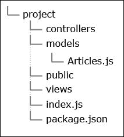

# 第三章：使用 Node.js 和 AngularJS 编写博客应用程序

在本章中，我们将使用 Node.js 和 AngularJS 构建一个博客应用程序。我们的系统将支持添加、编辑和删除文章，因此将有一个控制面板。MongoDB 或 MySQL 数据库将处理信息的存储，Express 框架将用作网站的基础。它将向最终用户交付 JavaScript、CSS 和 HTML，并提供一个访问数据库的 API。我们将使用 AngularJS 构建用户界面并控制管理页面上的客户端逻辑。

本章将涵盖以下主题：

+   AngularJS 基础知识

+   选择和初始化数据库

+   使用 AngularJS 实现应用程序的客户端部分

# 探索 AngularJS

**AngularJS** 是由 Google 开发的一个开源的客户端 JavaScript 框架。它功能丰富，文档齐全。它几乎已经成为单页应用程序开发的标准框架。AngularJS 的官方网站 [`angularjs.org`](http://angularjs.org) 提供了结构良好的文档。由于该框架被广泛使用，因此有很多文章和视频教程形式的材料。作为一个 JavaScript 库，它与 Node.js 协作得很好。在本章中，我们将构建一个带有控制面板的简单博客。

在我们开始开发应用程序之前，让我们首先了解一下这个框架。AngularJS 让我们对页面上的数据有了非常好的控制。我们不必考虑从 DOM 中选择元素并填充它们的值。幸运的是，由于可用的数据绑定，我们可以在 JavaScript 部分更新数据，并在 HTML 部分看到变化。反之亦然。一旦我们在 HTML 部分做了更改，我们就会在 JavaScript 部分得到新的值。该框架有一个强大的依赖注入器。有一些预定义的类用于执行 AJAX 请求和管理路由。

您还可以阅读由 Peter Bacon Darwin 和 Pawel Kozlowski 编著，由 Packt Publishing 出版的《Mastering Web Development with AngularJS》。

## 引导 AngularJS 应用程序

要引导一个 AngularJS 应用程序，我们需要将 `ng-app` 属性添加到我们的某些 HTML 标签中。选择正确的一个非常重要。如果某个地方有 `ng-app`，这意味着所有子节点都将由框架处理。通常的做法是将该属性放在 `<html>` 标签上。在下面的代码中，我们有一个包含 ng-app 的简单 HTML 页面：

```js
<html ng-app>
    <head>
        <script src="img/angular.min.js"></script>
    </head>
    <body>
        ...
    </body>
</html>
```

非常常见的是，我们会将一个值应用到属性上。这将是一个模块名称。我们会在开发我们的博客应用的控制面板时这样做。有自由将`ng-app`放置在我们想要的位置意味着我们可以决定我们的标记的哪一部分将由 AngularJS 控制。这是好的，因为如果我们有一个巨大的 HTML 文件，我们真的不想花费资源解析整个文档。当然，我们可能需要手动引导我们的逻辑，当我们页面上有多个 AngularJS 应用时，这是必要的。

## 使用指令和控制器

在 AngularJS 中，我们可以实现模型-视图-控制器（Model-View-Controller）模式。控制器作为数据（模型）和用户界面（视图）之间的粘合剂。在框架的上下文中，控制器只是一个简单的函数。例如，以下 HTML 代码说明了控制器只是一个简单的函数：

```js
<html ng-app>
    <head>
        <script src="img/angular.min.js"></script>
        <script src="img/HeaderController.js"></script>
    </head>
    <body>
        <header ng-controller="HeaderController">
            <h1>{{title}}</h1>
        </header>
    </body>
</html>
```

在页面的`<head>`中，我们添加了库的精简版本和`HeaderController.js`；一个将包含我们控制器代码的文件。我们还在 HTML 标记中设置了`ng-controller`属性。控制器的定义如下：

```js
function HeaderController($scope) {
  $scope.title = "Hello world";
}
```

每个控制器都有自己的影响区域。这个区域被称为作用域。在我们的例子中，`HeaderController`定义了`{{title}}`变量。AngularJS 有一个出色的依赖注入系统。幸运的是，由于这个机制，`$scope`参数会自动初始化并传递给我们的函数。`ng-controller`属性被称为指令，即一个对 AngularJS 有意义的属性。我们可以使用很多指令。这可能是框架的强项之一。我们可以在模板中直接实现复杂逻辑，例如数据绑定、过滤或模块化。

## 数据绑定

数据绑定是一个在模型更改后自动更新视图的过程。正如我们之前提到的，我们可以在应用程序的 JavaScript 部分更改一个变量，HTML 部分将自动更新。我们不需要创建 DOM 元素的引用或附加事件监听器。一切由框架处理。让我们继续并详细说明之前的例子，如下：

```js
<header ng-controller="HeaderController">
  <h1>{{title}}</h1>
  <a href="#" ng-click="updateTitle()">change title</a>
</header>
```

添加了一个链接，并包含`ng-click`指令。`updateTitle`函数是在控制器中定义的函数，如下代码片段所示：

```js
function HeaderController($scope) {
  $scope.title = "Hello world";
  $scope.updateTitle = function() {
    $scope.title = "That's a new title.";
  }
}
```

我们不关心 DOM 元素和`{{title}}`变量在哪里。我们只需更改`$scope`的一个属性，一切就会正常工作。当然，当然会有这样的情况，我们会遇到`<input>`字段，并希望绑定它们的值。如果是这种情况，那么可以使用`ng-model`指令。我们可以如下看到：

```js
<header ng-controller="HeaderController">
  <h1>{{title}}</h1>
  <a href="#" ng-click="updateTitle()">change title</a>
  <input type="text" ng-model="title" />
</header>
```

输入字段中的数据绑定到相同的`title`变量。这次，我们不需要编辑控制器。AngularJS 自动更改`h1`标签的内容。

## 使用模块封装逻辑

有控制器真是太好了。然而，将所有内容都放在全局定义的函数中并不是一个好的实践。这就是为什么使用模块系统是好的。以下代码展示了如何定义一个模块：

```js
angular.module('HeaderModule', []);
```

第一个参数是模块的名称，第二个参数是一个包含模块依赖项的数组。依赖项指的是其他模块、服务或我们可以在模块内部使用的自定义项。它也应该设置为`ng-app`指令的值。到目前为止的代码可以转换为以下代码片段：

```js
angular.module('HeaderModule', [])
.controller('HeaderController', function($scope) {
  $scope.title = "Hello world";
  $scope.updateTitle = function() {
    $scope.title = "That's a new title.";
  }
});
```

因此，第一行定义了一个模块。我们可以链式调用模块的不同方法，其中之一就是`controller`方法。按照这种方法，即把我们的代码放在模块内部，我们将封装逻辑。这是一个良好架构的标志。当然，使用模块，我们可以访问不同的功能，例如过滤器、自定义指令和自定义服务。

## 使用过滤器准备数据

当我们想要在向用户展示之前准备数据时，过滤器非常有用。比如说，如果我们需要提到标题，一旦它的长度超过 20 个字符，就将其转换为大写：

```js
angular.module('HeaderModule', [])
.filter('customuppercase', function() {
  return function(input) {
    if(input.length > 20) {
      return input.toUpperCase();
    } else {
      return input;
    }
  };
})
.controller('HeaderController', function($scope) {
  $scope.title = "Hello world";
  $scope.updateTitle = function() {
    $scope.title = "That's a new title.";
  }
});
```

这就是自定义过滤器`customuppercase`的定义。它接收输入并执行简单的检查。它返回的，就是用户最终看到的内容。以下是如何在 HTML 中使用这个过滤器的示例：

```js
<h1>{{title | customuppercase}}</h1>
```

当然，我们可以为每个变量添加多个过滤器。有一些预定义的过滤器可以限制长度，例如 JavaScript 到 JSON 的转换或日期格式化。

## 依赖注入

依赖管理有时可能非常困难。我们可能需要将一切分成不同的模块/组件。它们有很好的 API 编写，并且有很好的文档。然而，很快我们可能会意识到我们需要创建很多对象。依赖注入通过提供我们需要的，即时解决问题。我们已经在实际操作中看到了这一点。传递给我们的控制器的`$scope`参数实际上是由 AngularJS 的`injector`创建的。要获取某个依赖项，我们需要在某个地方定义它，并让框架知道它。我们这样做如下：

```js
angular.module('HeaderModule', [])
.factory("Data", function() {
  return {
    getTitle: function() {
      return "A better title.";
    }
  }
})
.controller('HeaderController', function($scope, Data) {
  $scope.title = Data.getTitle();
  $scope.updateTitle = function() {
    $scope.title = "That's a new title.";
  }
});
```

`Module`类有一个名为`factory`的方法。它注册了一个新的服务，这个服务可以稍后作为依赖项使用。该函数返回一个只有一个方法的对象，即`getTitle`。当然，服务的名称应该与控制器参数的名称匹配。否则，AngularJS 将无法找到依赖项的来源。

## 在 AngularJS 上下文中的模型

在众所周知的模型-视图-控制器（Model-View-Controller）模式中，模型是存储应用程序数据的部分。AngularJS 没有定义模型的特定工作流程。`$scope`变量可以被视为一个模型。我们将在当前作用域附加的属性中保存数据。稍后，我们可以使用`ng-model`指令并将属性绑定到 DOM 元素。我们已经在前面的章节中看到了它是如何工作的。框架可能不会提供模型的传统形式，但它是这样设计的，以便我们可以编写自己的实现。AngularJS 与纯 JavaScript 对象一起工作的事实，使得这项任务变得容易实现。

## 关于 AngularJS 的结语

AngularJS 是领先的框架之一，不仅因为它是由谷歌制作的，而且因为它非常灵活。我们可以只使用它的一小部分，或者使用其庞大的功能集合构建一个坚实的架构。

# 选择和初始化数据库

要构建一个博客应用程序，我们需要一个数据库来存储已发布的文章。在大多数情况下，数据库的选择取决于当前项目。有一些因素，如性能和可扩展性，我们应该记住。为了更好地查看可能的解决方案，我们将查看两个最受欢迎的数据库：**MongoDB**和**MySQL**。第一个是一个 NoSQL 类型的数据库。根据维基百科上关于 NoSQL 数据库的条目([`en.wikipedia.org/wiki/NoSQL`](http://en.wikipedia.org/wiki/NoSQL))：

> *"NoSQL 或非仅 SQL 数据库提供了一种以不同于关系数据库中使用的表格关系的方式对数据进行存储和检索的机制。"*

换句话说，它比 SQL 数据库更简单，并且通常以键值类型存储信息。通常，此类解决方案用于处理和存储大量数据。当需要灵活的模式或想要使用 JSON 时，这也是一个非常流行的方法。它实际上取决于我们正在构建的系统类型。在某些情况下，MySQL 可能是一个更好的选择，而在其他情况下，MongoDB。在我们的示例博客中，我们将使用两者。

为了做到这一点，我们需要一个连接到数据库服务器并接受查询的层。为了使事情更有趣，我们将创建一个只有一个 API 的模块，但可以在两种数据库模型之间切换。

## 使用 MongoDB 的 NoSQL

让我们从 MongoDB 开始。在我们开始存储信息之前，我们需要一个运行的 MongoDB 服务器。可以从数据库的官方网站下载[`www.mongodb.org/downloads`](https://www.mongodb.org/downloads)。

我们不会手动处理与数据库的通信。有一个专门为 Node.js 开发的驱动程序。它被称为`mongodb`，我们应该将其包含在我们的`package.json`文件中。通过`npm install`成功安装后，驱动程序将可用于我们的脚本。我们可以如下检查：

```js
"dependencies": {
  "mongodb": "1.3.20"
}
```

我们将坚持使用 Model-View-Controller 架构，并在名为`Articles`的模型中进行数据库相关操作。我们可以如下查看：

```js
var crypto = require("crypto"),
    type = "mongodb",
    client = require('mongodb').MongoClient,
    mongodb_host = "127.0.0.1",
    mongodb_port = "27017",
    collection;

module.exports = function() {
    if(type == "mongodb") {
        return {
            add: function(data, callback) { ... },
            update: function(data, callback) { ... },
            get: function(callback) { ... },
            remove: function(id, callback) { ... }
        }
    } else {
        return {
            add: function(data, callback) { ... },
            update: function(data, callback) { ... },
            get: function(callback) { ... },
            remove: function(id, callback) { ... }
        }
    }
}
```

它从定义一些 MongoDB 连接的依赖项和设置开始。第一行需要`crypto`模块。我们将使用它为每篇文章生成唯一的 ID。`type`变量定义了当前访问的是哪个数据库。第三行初始化 MongoDB 驱动程序。我们将使用它与数据库服务器进行通信。之后，我们设置连接的主机和端口，最后是一个全局的`collection`变量，它将保持对文章集合的引用。在 MongoDB 中，集合类似于 MySQL 中的表。下一个逻辑步骤是建立数据库连接并执行所需的操作，如下所示：

```js
connection = 'mongodb://';
connection += mongodb_host + ':' + mongodb_port;
connection += '/blog-application';
client.connect(connection, function(err, database) {
  if(err) {
    throw new Error("Can't connect");
  } else {
    console.log("Connection to MongoDB server successful.");
      collection = database.collection('articles');
    }
}); 
```

我们传递主机和端口，驱动程序将完成其他所有工作。当然，处理错误（如果有）并抛出异常是一个好习惯。在我们的情况下，这尤其必要，因为没有数据库中的信息，前端就没有东西可以显示。该模块的其余部分包含添加、编辑、检索和删除记录的方法：

```js
return {
  add: function(data, callback) {
    var date = new Date();
    data.id = crypto.randomBytes(20).toString('hex');
    data.date = date.getFullYear() + "-" + date.getMonth() + "-" + date.getDate();
    collection.insert(data, {}, callback || function() {});
  },
  update: function(data, callback) {
    collection.update(
            {ID: data.id}, 
            data, 
            {}, 
            callback || function(){ }
        ); 
    },
    get: function(callback) {
        collection.find({}).toArray(callback);
    },
    remove: function(id, callback) {
        collection.findAndModify(
            {ID: id}, 
            [], 
            {}, 
            {remove: true}, 
            callback
        );
    }
}
```

`add`和`update`方法接受`data`参数。这是一个简单的 JavaScript 对象。例如，请看以下代码：

```js
{
  title: "Blog post title",
  text: "Article's text here ..."
}
```

记录通过自动生成的唯一`id`进行标识。`update`方法需要它来找出要编辑哪个记录。所有方法都有回调。这很重要，因为这个模块旨在作为一个黑盒使用，也就是说，我们应该能够创建其实例，操作数据，并在最后继续应用程序的其他逻辑。

## 使用 MySQL

我们将使用 MySQL 类型的数据库。我们将在已经工作的`Articles.js`模型中添加几行代码。想法是有一个类支持两个数据库，就像两个不同的选项。最后，我们应该能够通过简单地更改变量的值从其中一个切换到另一个。类似于 MongoDB，我们需要首先安装数据库才能使用它。官方下载页面是[`www.mysql.com/downloads`](http://www.mysql.com/downloads)。

MySQL 需要另一个 Node.js 模块。它应该再次添加到`package.json`文件中。我们可以如下查看该模块：

```js
"dependencies": {
  "mongodb": "1.3.20",
  "mysql": "2.0.0"
}
```

类似于 MongoDB 解决方案，我们首先需要连接到服务器。为此，我们需要知道**主机**、**用户名**和**密码**字段的值。并且因为数据是有组织地存储在数据库中的，所以需要一个数据库名称。在 MySQL 中，我们将数据放入不同的数据库中。因此，以下代码定义了所需的变量：

```js
var mysql = require('mysql'),
    mysql_host = "127.0.0.1",
    mysql_user = "root",
    mysql_password = "",
    mysql_database = "blog_application",
    connection;
```

之前的例子中**密码**字段留空，但我们应该设置我们系统的正确值。MySQL 数据库要求我们在开始保存数据之前定义一个表及其字段。因此，以下代码是本章中使用的表的简短转储：

```js
CREATE TABLE IF NOT EXISTS `articles` (
  `id` int(11) NOT NULL AUTO_INCREMENT,
  `title` longtext NOT NULL,
  `text` longtext NOT NULL,
  `date` varchar(100) NOT NULL,
  PRIMARY KEY (`id`)
) ENGINE=InnoDB  DEFAULT CHARSET=utf8 AUTO_INCREMENT=1 ;
```

一旦我们设置了数据库及其表，我们就可以继续进行数据库连接，如下所示：

```js
connection = mysql.createConnection({
    host: mysql_host,
    user: mysql_user,
    password: mysql_password
});
connection.connect(function(err) {
    if(err) {
        throw new Error("Can't connect to MySQL.");
    } else {
        connection.query("USE " + mysql_database, function(err, rows, fields) {
            if(err) {
                throw new Error("Missing database.");
            } else {
                console.log("Successfully selected database.");
            }
        })
    }
});
```

驱动程序提供了一个连接到服务器并执行查询的方法。第一个执行的查询选择数据库。如果一切正常，你应该在你的控制台中看到**成功选择数据库**的输出。一半的工作已经完成。我们现在需要做的是复制第一个 MongoDB 实现中返回的方法。我们需要这样做，因为当我们切换到 MySQL 使用时，使用该类的代码将不会工作。而我们所说的复制是指它们应该有相同的名称，并且应该接受相同的参数。

如果我们一切都做得正确，最终我们的应用程序将支持两种类型的数据库。我们只需要更改`type`变量的值：

```js
return {
    add: function(data, callback) {
        var date = new Date();
        var query = "";
        query += "INSERT INTO articles (title, text, date) VALUES (";
        query += connection.escape(data.title) + ", ";
        query += connection.escape(data.text) + ", ";
        query += "'" + date.getFullYear() + "-" + date.getMonth() + "-" + date.getDate() + "'";
        query += ")";
        connection.query(query, callback);
    },
    update: function(data, callback) {
        var query = "UPDATE articles SET ";
        query += "title=" + connection.escape(data.title) + ", ";
        query += "text=" + connection.escape(data.text) + " ";
        query += "WHERE id='" + data.id + "'";
        connection.query(query, callback);
    },
    get: function(callback) {
        var query = "SELECT * FROM articles ORDER BY id DESC";
        connection.query(query, function(err, rows, fields) {
            if(err) {
                throw new Error("Error getting.");
            } else {
                callback(rows);
            }
        });
    },
    remove: function(id, callback) {
        var query = "DELETE FROM articles WHERE id='" + id + "'";
        connection.query(query, callback);
    }
}
```

代码比第一个 MongoDB 变体生成的代码要长一些。这是因为我们需要从传递的数据中构建 MySQL 查询。请记住，我们必须转义传递给模块的信息。这就是为什么我们使用`connection.escape()`。有了这些代码行，我们的模型就完成了。现在我们可以添加、编辑、删除或获取数据。让我们继续展示文章的部分给用户。

# 使用 Angular 开发客户端

假设数据库中已有一些数据，我们准备将其展示给用户。到目前为止，我们只开发了模型，即负责信息访问的类。在本书的上一章中，我们学习了 Express。为了简化过程，我们在这里再次使用它。我们需要首先更新`package.json`文件，并将其包含在框架中，如下所示：

```js
"dependencies": {
  "express": "3.4.6",
  "jade": "0.35.0",
  "mongodb": "1.3.20",
  "mysql": "2.0.0"
}
```

我们还添加了**Jade**，因为我们打算将其用作模板语言。现在使用纯 HTML 编写标记并不是很高效。通过使用模板引擎，我们可以将数据和 HTML 标记分开，这使得我们的应用程序结构更加清晰。Jade 的语法与 HTML 有些类似。我们可以编写不需要关闭的标签：

```js
body
  p(class="paragraph", data-id="12").
    Sample text here
  footer
    a(href="#").
      my site
```

上述代码片段被转换成以下代码片段：

```js
<body>
  <p data-id="12" class="paragraph">Sample text here</p>
  <footer><a href="#">my site</a></footer>
</body>
```

Jade 依赖于内容中的缩进来区分标签。

让我们从以下截图所示的项目结构开始：



我们将已经编写的类`Articles.js`放在了`models`目录中。公共目录将包含 CSS 样式，以及所有必要的客户端 JavaScript：AngularJS 库、AngularJS 路由模块和我们的自定义代码。

我们将跳过一些关于以下代码的解释，因为我们已经在上一章中介绍过了。我们的`index.js`文件看起来如下所示：

```js
var express = require('express');
var app = express();
var articles = require("./models/Articles")();

app.set('views', __dirname + '/views');
app.set('view engine', 'jade');
app.use(express.static(__dirname + '/public'));

app.use(function(req, res, next) {
    req.articles = articles;
    next();
});

app.get('/api/get', require("./controllers/api/get"));
app.get('/', require("./controllers/index"));

app.listen(3000);
console.log('Listening on port 3000');
```

在开始时，我们引入了 Express 框架和我们的模型。也许在控制器内部初始化模型会更好，但在这个例子中并不必要。紧接着，我们为 Express 设置了一些基本选项并定义了我们自己的中间件。它只有一个任务要做，那就是将模型附加到请求对象上。我们这样做是因为请求对象会被传递给所有的路由处理器。在我们的例子中，这些处理器实际上是控制器。所以，`Articles.js` 通过 `req.articles` 属性在所有地方都可以访问。在脚本末尾，我们放置了两个路由。第二个路由捕获来自用户的常规请求。第一个路由 `/api/get` 则更有趣。我们想在 AngularJS 之上构建我们的前端。因此，存储在数据库中的数据不应进入 Node.js 部分，而应在客户端使用 Google 的框架。为了实现这一点，我们将创建用于获取、添加、编辑和删除记录的路由/控制器。所有这些都将由 AngularJS 执行的 HTTP 请求来控制。换句话说，我们需要一个 API。

在我们开始使用 Angular 之前，让我们看看 `/controllers/api/get.js` 控制器：

```js
module.exports = function(req, res, next) {
  req.articles.get(function(rows) {
    res.send(rows);
  });
}
```

主要工作由我们的模型完成，响应由 Express 处理。这很好，因为我们传递了一个 JavaScript 对象（实际上 `rows` 是一个对象数组），框架会自动设置响应头。为了测试结果，我们可以用 `node index.js` 运行应用程序，并打开 `http://localhost:3000/api/get`。如果没有记录在数据库中，我们将得到一个空数组。如果有，存储的文章将被返回。所以，这就是我们应该从 AngularJS 控制器内部击中的 URL，以获取信息。

`/controller/index.js` 控制器的代码也只有几行。我们可以看到以下代码：

```js
module.exports = function(req, res, next) {  
  res.render("list", { app: "" });
}
```

它简单地渲染了存储在 `list.jade` 文件中的列表视图。该文件应保存在 `/views` 目录中。但在我们查看其代码之前，我们将检查另一个文件，该文件作为所有页面的基础。Jade 有一个叫做*块*的不错特性。我们可以定义不同的部分并将它们组合成一个模板。以下是我们的 `layout.jade` 文件：

```js
doctype html
html(ng-app="#{app}")
  head
    title Blog
    link(rel='stylesheet', href='/style.css')    
    script(src='/angular.min.js')
    script(src='/angular-route.min.js')
  body
    block content
```

这个模板只传递了一个变量，即 `#{app}`。我们稍后会需要它来初始化管理模块。`angular.min.js` 和 `angular-route.min.js` 文件应从官方 AngularJS 网站下载，并放置在 `/public` 目录中。页面主体包含一个名为 `content` 的块占位符，稍后我们将用文章列表填充它。以下是 `list.jade` 文件：

```js
extends layout
block content
  .container(ng-controller="BlogCtrl")
    section.articles
      article(ng-repeat="article in articles")
       h2 
         {{article.title}}
         br
          small published on {{article.date}}
        p {{article.text}}
  script(src='/blog.js')
```

开头两行将两个模板合并到一个页面中。Express 框架将 Jade 模板转换为 HTML，并服务于用户的浏览器。从那里，客户端 JavaScript 接管控制。我们使用`ng-controller`指令表示`div`元素将由名为`BlogCtrl`的 AngularJS 控制器控制。相同的类应该有一个变量`articles`，其中包含来自数据库的信息`.` `ng-repeat`遍历数组并向用户显示内容`.` `blog.js`类包含控制器的代码：

```js
function BlogCtrl($scope, $http) {
  $scope.articles = [
    { title: "", text: "Loading ..."}
  ];
  $http({method: 'GET', url: '/api/get'})
  .success(function(data, status, headers, config) {
    $scope.articles = data;
    })
    .error(function(data, status, headers, config) {
      console.error("Error getting articles.");
  });
}
```

控制器有两个依赖项。第一个依赖项`,` `$scope,` 指向当前视图。我们在那里分配的任何属性都作为变量在我们的 HTML 标记中可用。最初，我们只添加了一个元素，它没有标题，但有文本。这显示出来是为了表明我们仍在从数据库中加载文章。第二个依赖项，`$http`，提供了一个 API，用于执行 HTTP 请求。因此，我们只需查询`/api/get`，获取数据，并将其传递给`$scope`依赖项。其余的工作由 AngularJS 及其神奇的双向数据绑定来完成。为了使应用程序更有趣，我们将添加一个搜索字段，如下所示：

```js
// views/list.jade
header
  .search
    input(type="text", placeholder="type a filter here", ng-model="filterText")
  h1 Blog
  hr
```

`ng-model`指令将输入字段的值绑定到我们`$scope`依赖项内的一个变量。然而，这次我们不需要编辑我们的控制器，只需将相同的变量作为过滤器应用到`ng-repeat`：

```js
article(ng-repeat="article in articles | filter:filterText")
```

因此，显示的文章将根据用户的输入进行筛选。这两个简单的添加，但页面上确实有一些真正有价值的东西。AngularJS 的过滤器可以非常强大。

# 实现控制面板

控制面板是我们管理博客文章的地方。在继续处理用户界面之前，在后台需要做一些事情。具体如下：

```js
app.set("username", "admin");
app.set("password", "pass");
app.use(express.cookieParser('blog-application'));
app.use(express.session());
```

应将前面的代码行添加到`/index.js`中。我们的管理应该受到保护，所以前两行定义了我们的凭证。我们使用 Express 作为数据存储，简单地创建键值对。稍后，如果我们需要用户名，我们可以使用`app.get("username")`来获取它。接下来的两行启用了会话支持。我们需要它是因为登录过程。

我们添加了一个中间件，它将文章附加到`request`对象上。我们将对当前用户的身份状态做同样处理，如下所示：

```js
app.use(function(req, res, next) {
    if((
        req.session && 
        req.session.admin === true
    ) || (
        req.body &&
        req.body.username === app.get("username") &&
        req.body.password === app.get("password")
    )) {
        req.logged = true;
        req.session.admin = true;
    };
    next();
});
```

我们的`if`语句有点长，但它告诉我们用户是否已登录。第一部分检查是否创建了会话，第二部分检查用户是否提交了包含正确用户名和密码的表单。如果这些表达式为`true`，则我们将变量`logged`附加到`request`对象上，并创建一个在后续请求中有效的会话。

在主应用程序的文件中，我们只需要一个东西。一些将处理控制面板操作的路由。在以下代码中，我们定义了它们以及所需的路由处理程序：

```js
var protect = function(req, res, next) {
    if(req.logged) {
        next();
    } else {
        res.send(401, 'No Access.');
    }
}
app.post('/api/add', protect, require("./controllers/api/add"));
app.post('/api/edit', protect, require("./controllers/api/edit"));
app.post('/api/delete', protect , require("./controllers/api/delete"));
app.all('/admin', require("./controllers/admin"));
```

以`/api`开头的三个路由将使用`Articles.js`模型来添加、编辑和从数据库中删除文章。这些操作应该是受保护的。我们将添加一个中间件函数来处理这个问题。如果`req.logged`变量不可用，它将简单地响应一个`401 - Unauthorized`状态码。最后一个路由`/admin`有一点不同，因为它显示了一个登录表单。以下是为创建新文章创建的控制器：

```js
module.exports = function(req, res, next) {
  req.articles.add(req.body, function() {
    res.send({success: true});
  });
}
```

我们将大部分逻辑转移到前端，所以这里也只有几行。这里有趣的是，我们直接将`req.body`传递给模型。它实际上包含了用户提交的数据。以下代码展示了`req.articles.add`方法在 MongoDB 实现中的样子：

```js
add: function(data, callback) {
  data.ID = crypto.randomBytes(20).toString('hex');
  collection.insert(data, {}, callback || function() {});
}
```

MySQL 实现如下：

```js
add: function(data, callback) {
    var date = new Date();
    var query = "";
    query += "INSERT INTO articles (title, text, date) VALUES (";
    query += connection.escape(data.title) + ", ";
    query += connection.escape(data.text) + ", ";
    query += "'" + date.getFullYear() + "-" + date.getMonth() + "-" + date.getDate() + "'";
    query += ")";
    connection.query(query, callback);
}
```

在这两种情况下，我们都需要在传递的数据对象中包含`title`和`text`。幸运的是，由于 Express 的`bodyParser`中间件，这就是我们在`req.body`对象中拥有的。我们可以直接将其转发到模型。其他路由处理程序几乎相同：

```js
// api/edit.js
module.exports = function(req, res, next) {
  req.articles.update(req.body, function() {
    res.send({success: true});
  });
}
```

我们改变的是`Articles.js`类的处理方法。它不是`add`而是`update`。同样的技术也应用于路由中删除文章的操作。我们可以这样看到：

```js
// api/delete.js
module.exports = function(req, res, next) {
  req.articles.remove(req.body.id, function() {
    res.send({success: true});
  });
}
```

我们需要删除的不是请求的整个主体，而是记录的唯一 ID。每个 API 方法都会发送`{success: true}`作为响应。当我们处理 API 请求时，我们应该始终返回一个响应。即使出了问题。

在 Node.js 部分，我们最后要讨论的是负责管理面板用户界面的控制器，即`.controllers/admin.js`文件：

```js
module.exports = function(req, res, next) {
  if(req.logged) {
    res.render("admin", { app: "admin" });
  } else {
    res.render("login", { app: "" });
  }
}
```

有两个模板被渲染：`/views/admin.jade`和`/views/login.jade`。根据我们在`/index.js`中设置的变量，脚本决定显示哪一个。如果用户未登录，则将登录表单发送到浏览器，如下所示：

```js
extends layout
block content
  .container
    header
      h1 Administration
     hr
    section.articles
      article
        form(method="post", action="/admin")
        span Username:
        br
        input(type="text", name="username")
        br
        span Password:
        br
        input(type="password", name="password")
        br
        br
        input(type="submit", value="login")
```

这里没有 AngularJS 代码。我们只有那个古老的 HTML 表单，它通过 POST 将数据提交到相同的 URL——`/admin`。如果用户名和密码正确，`.logged`变量将被设置为`true`，控制器将渲染其他模板：

```js
extends layout
block content
  .container
    header
      h1 Administration
      hr
      a(href="/") Public
      span  | 
      a(href="#/") List
      span  | 
      a(href="#/add") Add
    section(ng-view)
  script(src='/admin.js')
```

控制面板需要几个视图来处理所有操作。AngularJS 有一个出色的路由模块，它与标签型 URL 一起工作，即类似于`/admin#/add`的 URL。同一个模块需要一个占位符来处理不同的部分。在我们的案例中，这是一个`section`标签。`ng-view`属性告诉框架这是一个为该逻辑准备的元素。在模板的末尾，我们添加了一个外部文件，它包含了控制面板所需的全部客户端 JavaScript 代码。

虽然应用程序的客户端部分只需要加载文章，但控制面板需要更多的功能。使用 AngularJS 的模块化系统是很好的。我们需要路由和视图发生变化，因此需要`ngRoute`模块作为依赖项。此模块未添加到主`angular.min.js`构建中。它放在`angular-route.min.js`文件中。以下代码显示了我们的模块是如何开始的：

```js
var admin = angular.module('admin', ['ngRoute']);
admin.config(['$routeProvider', 
  function($routeProvider) {
    $routeProvider
    .when('/', {})
    .when('/add', {})
    .when('/edit/:id', {})
    .when('/delete/:id', {})
    .otherwise({
          redirectTo: '/'
      });
  }
]);
```

我们通过将 URL 映射到特定路由来配置路由器。目前，路由只是空对象，但我们将很快解决这个问题。每个控制器都需要向应用程序的 Node.js 部分发出 HTTP 请求。如果我们有一个这样的服务并在整个代码中使用它，那将很好。以下是一个示例：

```js
admin.factory('API', function($http) {
  var request = function(method, url) {
    return function(callback, data) {
      $http({method: method, url: url, data: data})
      .success(callback)
        .error(function(data, status, headers, config) {
          console.error("Error requesting '" + url + "'.");
      });
    }
  }
  return {
    get: request('GET', '/api/get'),
    add: request('POST', '/api/add'),
    edit: request('POST', '/api/edit'),
    remove: request('POST', '/api/delete')
  }
});
```

AngularJS 最好的事情之一是它与纯 JavaScript 对象一起工作。没有不必要的抽象，也没有扩展或继承特殊类。我们正在使用`.factory`方法创建一个简单的 JavaScript 对象。它有四个可以调用的方法：`get`、`add`、`edit`和`remove`。每个方法都调用在辅助方法`request`中定义的函数。该服务只有一个依赖项，即`$http`。我们已经知道这个模块；它很好地处理 HTTP 请求。我们将查询的 URL 与我们在 Node.js 部分定义的相同。

现在，让我们创建一个控制器，该控制器将显示数据库中当前存储的文章。首先，我们应该用以下对象替换空的路由对象`.when('/', {})`：

```js
.when('/', {
  controller: 'ListCtrl',
  template: '\
    <article ng-repeat="article in articles">\
      <hr />\
      <strong>{{article.title}}</strong><br />\
       (<a href="#/edit/{{article.id}}">edit</a>)\
       (<a href="#/delete/{{article.id}}">remove</a>)\
      </article>\
  '
})
```

对象必须包含一个控制器和一个模板。模板不过是几行 HTML 标记。它看起来有点像客户端用来显示文章的模板。区别在于用于编辑和删除的链接。JavaScript 不允许在字符串定义中使用换行符。行尾的反斜杠可以防止语法错误，这些错误最终会被浏览器抛出。以下是为控制器编写的代码。它再次在模块中定义：

```js
admin.controller('ListCtrl', function($scope, API) {
  API.get(function(articles) {
    $scope.articles = articles;
  });
});
```

这里是 AngularJS 依赖注入的美丽之处。我们自定义的服务`API`会自动初始化并传递给控制器。`.get`方法从数据库中获取文章。稍后，我们将信息发送到当前的`$scope`依赖项，双向数据绑定完成剩余的工作。文章显示在页面上。

使用 AngularJS 的工作非常简单，以至于我们可以将控制器组合在一起，在同一个地方添加和编辑。让我们将路由对象存储在一个外部变量中，如下所示：

```js
var AddEditRoute = {
  controller: 'AddEditCtrl',
    template: '\
      <hr />\
      <article>\
        <form>\
       <span>Title</spna><br />\
       <input type="text" ng-model="article.title"/><br />\
        <span>Text</spna><br />\
        <textarea rows="7" ng-model="article.text"></textarea>\
        <br /><br />\
        <button ng-click="save()">save</button>\
        </form>\
      </article>\
  '
};
```

然后，将其分配给两个路由，如下所示：

```js
.when('/add', AddEditRoute)
.when('/edit/:id', AddEditRoute)
```

模板只是一个带有必要字段和按钮的表单，该按钮调用控制器中的`save`方法。注意，我们将输入字段和文本区域绑定到了`$scope`依赖项内部的变量上。这很有用，因为我们不需要访问 DOM 来获取值。我们可以这样看到：

```js
admin.controller(
  'AddEditCtrl', 
  function($scope, API, $location, $routeParams) {
    var editMode = $routeParams.id ? true : false;
    if(editMode) {
      API.get(function(articles) {
        articles.forEach(function(article) {
          if(article.id == $routeParams.id) {
            $scope.article = article;
          }
        });
      });
    }
    $scope.save = function() {
      APIeditMode ? 'edit' : 'add' {
        $location.path('/');
      }, $scope.article);	
    }
})
```

控制器接收四个依赖项。我们已经了解了`$scope`和`API`。当我们要更改当前路由，或者说，将用户重定向到另一个视图时，使用`$location`依赖项。`$routeParams`依赖项用于从 URL 中获取参数。在我们的例子中，`/edit/:id`是一个包含变量的路由。在代码内部，`id`在`$routeParams.id`中可用。文章的添加和编辑使用相同的表单。因此，通过简单的检查，我们知道用户当前正在做什么。如果用户处于编辑模式，那么我们将根据提供的`id`获取文章并填写表单。否则，字段为空，将创建新的记录。

删除文章可以通过类似的方法完成，即添加一个路由对象并定义一个新的控制器。我们可以这样看待删除操作：

```js
.when('/delete/:id', {
  controller: 'RemoveCtrl',
  template: ' '
})
```

在这种情况下，我们不需要模板。一旦文章从数据库中删除，我们将用户重定向到列表页面。我们必须调用 API 的`remove`方法。以下是`RemoveCtrl`控制器的外观：

```js
admin.controller(
  'RemoveCtrl', 
  function($scope, $location, $routeParams, API) {
    API.remove(function() {
      $location.path('/');
    }, $routeParams);
  }
);
```

之前的代码描述了与上一个控制器相同的依赖项。这次，我们只是简单地将`$routeParams`依赖项转发给 API。因为它是一个纯 JavaScript 对象，所以一切按预期工作。

# 摘要

在本章中，我们通过使用 Node.js 编写应用程序的后端，构建了一个简单的博客。我们编写的数据库通信模块可以与 MongoDB 或 MySQL 数据库协同工作，并存储文章。博客的客户端部分和控制面板是用 AngularJS 开发的。然后，我们使用内置的 HTTP 和路由机制定义了一个自定义服务。

Node.js 与 AngularJS 配合得很好，主要是因为两者都是用 JavaScript 编写的。我们发现 AngularJS 是为了支持开发者而构建的。它消除了所有那些无聊的任务，例如 DOM 元素引用、附加事件监听器等。它是现代客户端编码堆栈的一个很好的选择。

在下一章中，我们将看到如何使用 Socket.IO 编程实时聊天，它是涵盖 WebSockets 通信的流行解决方案之一。
