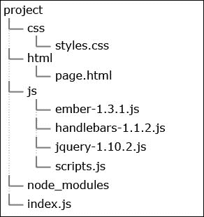
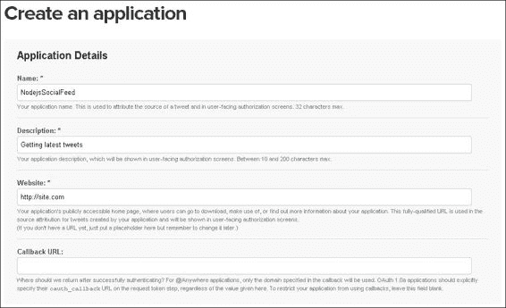
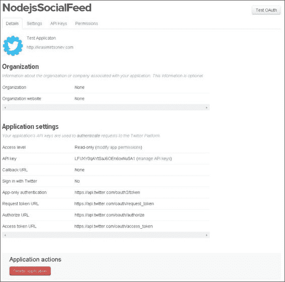
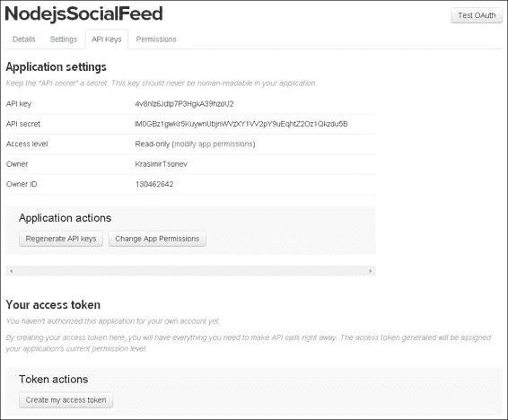
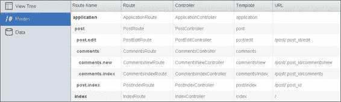
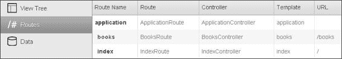
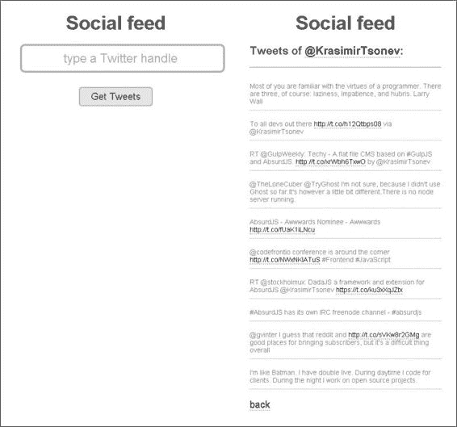
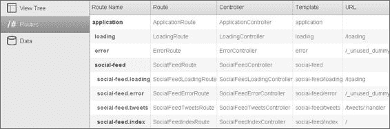

# 第七章. 使用 Ember.js 显示社交动态

在上一章中，我们学习了如何创建一个命令行工具，用于将照片上传到 Flickr。在这一章中，我们将与最受欢迎的社交网络之一：**Twitter** 进行通信。我们将创建一个应用，根据用户名获取最新的推文并在屏幕上显示。Node.js 将负责与 Twitter API 的通信，而 Ember.js 将负责用户界面。以下是本章我们将涵盖的一些主题的简要列表：

+   Ember.js 框架简介

+   与 Twitter 的 API 通信

+   将 Node.js 与 Ember.js 连接以获取推文

# 准备应用

我们在前面几章中已经讨论了应用。对于这个应用，我们需要一个 Node.js 服务器，它将提供必要的 HTML、CSS 和 JavaScript 代码。以下是我们从它开始的 `package.json` 文件：

```js
{
  "name": "TwitterFeedShower",
  "description": "Show Twitter feed",
  "version": "0.0.1",
  "dependencies": {
    "twit": "*"
  },
  "main": "index.js"
}
```

只有一个依赖项，那就是将连接到 Twitter 的模块。在 `package.json` 文件所在的同一文件夹中运行 `npm install` 后，该模块将出现在新创建的 `node_modules` 目录中。

下一步是创建 HTML、CSS 和 JavaScript 的文件夹，并将必要的文件放入这些文件夹中。此外，创建包含我们的 Node.js 服务器代码的 `index.js` 主文件。最后，我们的项目目录应该看起来像以下图示：



项目的 CSS 样式将存放在 `css/styles.css` 中。模板将放置在 `html/page` html 文件中，自定义 JavaScript 代码将编写在 `js/scripts.js` 中。其他的 `.js` 文件是 Ember.js 本身及其两个依赖：jQuery 和 Handlebars。

# 运行服务器并交付资源

在 第五章，*使用 Backbone.js 创建待办事项应用*中，我们使用 Backbone.js 创建了一个应用，并使用了两个辅助函数：`serveAssets` 和 `respond`。这些函数的目的是读取我们的 HTML、CSS 和 JavaScript 文件，并将它们作为响应发送到浏览器。我们在这里将再次使用它们。

让我们先定义全局变量，如下所示：

```js
var http = require('http'),
  fs = require('fs'),
  port = 3000,
  files = [],
  debug = true;
```

`http`模块提供了创建和运行 Node.js 服务器的方法，而`fs`模块负责从文件系统中读取文件。我们将监听端口 3000，`files`变量将缓存读取文件的文件内容。当`debug`设置为`true`时，资产将在每次请求时读取。如果它是`false`，其内容只会在第一次请求时获取，但未来的每个响应都将包含相同的代码。我们这样做是因为在我们开发应用程序时，我们不希望停止并运行我们的服务器只是为了看到 HTML 脚本的更改。每次请求时读取文件确保我们看到的都是最新版本。然而，当我们在生产环境中运行应用程序时，这被认为是一种不良做法。

让我们继续，使用以下代码运行服务器：

```js
var app = http.createServer(function (req, res) {
  if(req.url.indexOf("/tweets/") === 0) {
    // ... getting tweets
  } else {
    serveAssets(req, res);
  }
}).listen(port, '127.0.0.1');
console.log("Server listening on port " + port);
```

我们传递给`http.createServer`的回调函数接受两个参数：`request`和`response`对象。我们的 Node.js 应用程序部分将负责两件事。第一件事是提供必要的 HTML、CSS 和 JavaScript，第二件事是从 Twitter 获取推文。因此，我们检查 URL 是否以`/tweets`开头，如果是，我们将以不同的方式处理请求。否则，将调用`serveAssets`，如下所示：

```js
var serveAssets = function(req, res) {
  var file = req.url === '/' ? 'html/page.html' : req.url;
  if(!files[file] || debug) {
    try {
      files[file] = {
        content: fs.readFileSync(__dirname + "/" + file),
        ext: file.split(".").pop().toLowerCase()
      }
    } catch(err) {
      res.writeHead(404, {'Content-Type': 'plain/text'});
      res.end('Missing resource: ' + file);
      return;
    }
  }
  respond(files[file], res);
}
```

在这个函数中，我们正在获取请求的文件路径，并将从文件系统中读取文件。除了文件内容外，我们还将获取其扩展名，这是正确设置响应头所必需的。这一操作在`respond`方法中完成，如下所示：

```js
var respond = function(file, res) {
  var contentType;
  switch(file.ext) {
    case "css": contentType = "text/css"; break;
    case "html": contentType = "text/html"; break;
    case "js": contentType = "application/javascript"; break;
    case "ico": contentType = "image/ico"; break;
    default: contentType = "text/plain";
  }
  res.writeHead(200, {'Content-Type': contentType});
  res.end(file.content);
}
```

这很重要，因为我们如果不提供`Content-Type`，浏览器可能无法正确解释响应。

关于资产服务的所有内容就到这里了。让我们继续，从 Twitter 获取信息。

# 根据用户名获取推文

在我们编写从 Twitter API 请求数据的代码之前，我们需要注册一个新的 Twitter 应用程序。首先，我们应该打开[`dev.twitter.com`](https://dev.twitter.com/)并使用我们的 Twitter**用户名**和**密码**登录。之后，我们需要加载[`dev.twitter.com/apps/new`](https://dev.twitter.com/apps/new)并填写表格。它应该看起来像下面的截图：



我们可以留空**回调 URL**字段。**网站**字段可以填写我们的个人或公司网站的地址。我们应该接受表格下面的条款和条件，并点击**创建 Twitter 应用程序**。我们接下来将看到的页面应该类似于下面的截图：



我们需要的信息位于第三个标签页：**API 密钥**。一旦点击它，Twitter 将显示**API 密钥**和**API 密钥**字段，如下面的截图所示：



此外，我们还将通过点击**创建我的访问令牌**按钮生成访问令牌和访问令牌密钥。通常，数据不会立即显示。因此，我们应该稍等片刻，并在必要时刷新页面。生成的文档应类似于以下截图：


我们将复制**访问令牌**和**访问令牌密钥**的值。将此类敏感信息从应用程序代码中移除是一个好习惯，因为我们的程序可能会从一个地方转移到另一个地方。将数据放置在外部配置文件中通常可以完成这项工作。

一旦我们有了这四个字符串，我们就能与 Twitter 的 API 进行通信。以下变量位于我们的 `index.js` 文件顶部：

```js
var Twit = require('twit');
var T = new Twit({
  consumer_key: '...',
  consumer_secret: '...',
  access_token: '...',
  access_token_secret: '...'
});
var numOfTweets = 10;
```

`T` 变量实际上是一个 Twitter 客户端，我们将用它来请求数据。我们在服务器上留了一个查询 Twitter API 的位置。现在，让我们将必要的代码放入 `index.js` 文件中，如下所示：

```js
var app = http.createServer(function (req, res) {
  if(req.url.indexOf("/tweets/") === 0) {
    var handle = req.url.replace("/tweets/", "");
    T.get("statuses/user_timeline", { screen_name: handle, count: numOfTweets }, function(err, reply) {
      res.writeHead(200, {'Content-Type': 'application/json'});
      res.end(JSON.stringify(reply));
    });
  } else {
    serveAssets(req, res);
  }
}).listen(port, '127.0.0.1');
```

我们需要执行的请求是 `http://localhost:3000/tweets/KrasimirTsonev`。URL 的最后一部分是用户的 Twitter 名称。因此，`if` 语句变为 `true`，因为地址以 `/tweets/` 开头。我们提取用户名到一个名为 `handle` 的变量中。之后，这个变量被发送到 Twitter API 的 `statuses/user_timeline` 资源。请求的结果直接通过字符串化的 JSON 发送到浏览器。

在总结的要点中，我们项目的 Node.js 部分提供了所有 HTML、CSS 和 JavaScript 代码。除此之外，它接受一个 Twitter 名称，并返回用户的最新推文。

# 发现 Ember.js

Ember.js 是当今最受欢迎的客户端 JavaScript 框架之一。它拥有庞大的社区，其功能得到了很好的文档记录。Ember.js 因其架构而聚集了越来越多的粉丝。该库使用模型-视图-控制器设计模式，这使得它易于理解，因为该模式几乎在所有编程语言中都被广泛使用。它还与 REST API 协作良好（我们将在第十一章第十一章。编写 REST API 中构建此类 API），并消除了编写样板代码的任务。

## 了解 Ember.js 的依赖项

Ember.js 框架有以下两个依赖项：

+   **jQuery**

+   **Handlebars**

第一个是目前 Web 上最常用的 JavaScript 工具。它提供了选择和操作 `DOM` 元素的方法，以及许多辅助函数，如 `forEach` 或 `map`，这些可以帮助我们更快地工作。该库还通过提供一个单一的 API 解决了一些 **跨浏览器** 问题。例如，如果我们想要向一个元素附加事件监听器，我们需要在 Internet Explorer 中使用 `attachEvent`，而在其他浏览器中使用 `addEventListener`。jQuery 提供了一个简单的 `.on` 方法，它封装了这个功能。它会检查当前浏览器并调用正确的函数。除此之外，我们还可以使用 `.get` 或 `.post` 函数，这些函数执行 AJAX 请求。

**Handlebars** 是一个模板引擎库。它通过添加表达式和自定义标签扩展了 HTML 语法。它与我们在 第二章 中使用的另一个模板语言 **Jade** 类似，*使用 Node.js 和 Express 开发基本网站*。不同之处在于这次我们将使用应用程序客户端部分的模板。例如：

```js
<script type="text/x-handlebars" data-template-name="say-hello">
  <div class="content">{{name}}</div>
</script>
```

这是一个 Handlebar 使用的模板定义。它定义在一个 `<script>` 标签中，因为浏览器会忽略其中的内容，并且它不会被渲染为 `DOM` 树的一部分。其中有一个表达式：`{{name}}`。通常，模板会填充信息，并将这些标记部分替换为实际数据。Handlebar 所做的是获取 `script` 标签的值。然后，它将解析它。找到的表达式将被执行，并将结果返回给开发者。

# 理解 Ember.js

在我们继续编写我们的小型应用程序的实际代码之前，我们将学习 Ember.js 中最重要的组件。

## 探索 Ember.js 中的类和对象

和每个框架一样，Ember.js 有预定义的对象和类，这些都在我们的掌控之中。在大多数情况下，我们会扩展它们，并只编写应用程序的一部分自定义逻辑。所有可用的类都在 `Ember` 命名空间下。这意味着每次我们想要使用框架的某个部分时，我们都需要通过 `Ember.` 语法。例如，在以下代码中展示的类扩展：

```js
App.Person = Ember.Object.extend({
  firstname: '',
  lastname: '',
  hi: function() {
    var name = this.get("firstname") + " " + this.get("lastname");
    alert("Hello, my name is " + name);
  }
});
var person = App.Person.create();
person.set("firstname", "John");
person.set("lastname", "Black");
person.hi();
```

我们定义了一个名为 `Person` 的类。它有两个属性和一个仅显示屏幕上消息的功能。就在那之后，我们创建了该类的实例并调用了该方法。在 Ember.js 中，类的属性通过 `.get` 和 `.set` 方法访问。在先前的例子中，我们仍然可以使用 `this.firstname` 而不是 `this.get("firstname")`，但这并不完全正确。在 `.set` 和 `.get` 方法中，Ember.js 进行了一些必要的计算，以实现数据绑定和计算属性等特性。如果我们直接访问变量，库可能没有机会完成其工作。

## 计算属性

根据定义，**计算属性**是属性，它们通过执行一个函数来获取其值。让我们继续使用之前的例子。而不是每次都连接 `firstname` 和 `lastname`，我们将创建一个计算属性 `name`，它将返回所需的字符串。我们可以在以下代码中看到这一点：

```js
App.Person = Ember.Object.extend({
  firstname: '',
  lastname: '',
  hi: function() {
    alert("Hello, my name is " + this.get("name"));
  },
    name: function() {
        return this.get("firstname") + " " + this.get("lastname");
    }.property("firstname", "lastname")
});
var person = App.Person.create();
person.set("firstname", "John");
person.set("lastname", "Black");
person.hi();
```

我们仍然会使用 `.get` 方法访问一个属性，但这次它的值是由一个函数计算得出的。如果我们需要在显示之前格式化数据，这可能会非常有帮助。了解我们可以使用计算属性来设置值是很好的。默认情况下，它们是只读的，但我们可以将它们转换为接受和处理数据，如下所示：

```js
name: function(key, value) {
  if (arguments.length > 1) {
        var nameParts = value.split(/\s+/);
        this.set('firstname', nameParts[0]);
        this.set('lastname',  nameParts[1]);
    }
    return this.get("firstname") + " " + this.get("lastname");
}.property("firstname", "lastname")
```

## 路由器

路由过程更像是其他客户端框架的扩展。然而，在 Ember.js 中，所有内容都是围绕它们构建的。**路由器**是一个类，它将页面的 URL 转换为一系列嵌套模板。这些模板中的每一个都与一个提供数据的模型相连接。

```js
App = Ember.Application.create();
App.Router.map(function() {
  this.resource('post', { path: '/post/:post_id' }, function() {
    this.route('edit', { path: '/edit' });
    this.resource('comments', function() {
      this.route('new');
    });
  });
});
```

```js
edit route. That's because the name of the path is the same as the route name.
```

我们可以将路由器视为我们逻辑的起点。每个路由和资源都有自己的类和控制器与之关联。好消息是，我们实际上并不需要定义它们，因为框架会为我们完成这项工作。我们经常需要通过设置一些属性来修改它们的实现；然而，通常情况下，我们可以自由地保留默认建议的版本。一旦我们开始使用 Ember.js，我们会发现有很多类是自动创建的。有时，跟踪它们可能有点困难。有一个名为 **Ember Inspector** 的 Google Chrome 扩展程序。它实际上是开发者工具面板中的一个新标签页。检查器可以显示我们的应用程序中正在发生的事情。例如，之前的代码产生了以下结果：



如我们所见，有几个路由和控制器可用。应用程序有一个默认路由，以及主 **帖子** 资源的路由。这个扩展程序非常有用，因为它显示了类的确切名称。Ember.js 有严格的命名约定，我们应该能够自己找出这些名称，但这个扩展程序仍然很方便。

如果我们想在评论区的控制器中添加一些逻辑，那么我们应该使用以下代码：

```js
App.CommentsController = Ember.ObjectController.extend({
  // ...
});
```

我们应该记住，我们实际上正在修改类的定义。框架会自动创建它的实例。

## 视图和模板

我们已经提到 Ember.js 使用 Handlebars 来实现模板功能。一个简单的模板定义看起来像以下代码：

```js
<script type="text/x-handlebars" data-template-name="post/index">
  <section>
    <h1>{{title}}</h1>
    <p>{{text}}</p>
  </section>
</script>
```

这是一个脚本标签以及 HTML 标记。每个模板都有一个与其关联的`view`类。通常，开发者不会扩展`view`类。它在需要大量处理用户事件或创建自定义组件的情况下使用。在底层，`view`类将原始浏览器事件转换为在应用程序上下文中具有意义的事件。例如，我们可能有以下模板：

```js
<script type="text/x-handlebars" data-template-name="say-hello">
  Hello, <b>{{view.name}}</b>
</script>
```

其对应的视图实例如下所示：

```js
var view = Ember.View.create({
  templateName: "say-hello",
  name: "user",
  click: function(evt) {
    alert("Clicked.");
  }
});
view.append();
```

我们正在处理文本的点击事件。通过使用`.append`方法，视图被添加到`<body>`元素中，但还有`.appendTo`方法，可以将我们的自定义 HTML 添加到所需的任何`DOM`元素中。

## 模型

Ember.js 中的每个路由都有一个关联的模型，它是一个存储持久状态的对象。我们在路由的类中设置我们的模型。有一个名为`model`的钩子，它应该返回我们的数据。通常，我们将以异步方式获取应用程序的数据。对于此类情况，我们可以返回一个 JavaScript 承诺。

```js
App.PostRoute = Ember.Route.extend({
  model: function() {
    return Ember.$.getJSON("/posts.json");
  }
});
```

与特定路由链接的模板根据模型渲染其 HTML。因此，我们可以使用表示`.model`方法结果的属性的表达式。例如，请看以下代码：

```js
<script type="text/x-handlebars" data-template-name="post/index">
  <section>
    <h1>{{title}}</h1>
    <p>{{text}}</p>
  </section>
</script>

App.PostIndexRoute = Ember.Route.extend({
  model: function() {
    return {
      title: "Title of the post",
      text: "Text of the post"
    }
  }
})
```

## 控制器

在 Ember.js 的上下文中，**控制器**是装饰你的模型的显示逻辑的类。理想情况下，它们将存储不需要存储在数据库中的数据。只有在信息需要显示时才需要。与模型一样，框架为每个路由定义了一个不同的控制器类。假设我们正在开发一个在线书店。我们可以有一个类似于以下代码的路由：

```js
App.Router.map(function() {
  this.route("books");
});
```

我们只有一个路由，但定义了三个控制器。我们可以通过使用 Google Chrome 的扩展程序看到它们。查看以下屏幕截图：



在`BooksRoute`类中，我们将定义我们的模型，并在`BooksController`中创建计算属性以更好地显示书籍。控制器也是处理来自浏览器的事件的地方。最初，这些事件由视图捕获，但如果未定义`View`或没有事件处理程序，则将事件传递给控制器。

这些是每个 Ember.js 应用程序最重要的组件。现在，让我们继续构建我们的小型项目——一个用于从 Twitter 获取消息的单页应用程序。

# 编写 Ember.js

项目的客户端包含两个屏幕。第一个屏幕显示一个输入字段和一个按钮，用户应在其中输入 Twitter 用户名。第二个屏幕显示推文。我们可以在以下屏幕截图中看到这一点：



图像的左侧显示第一页，右侧显示用户的推文。

## 定义模板

`html/page.html` 文件是我们的主文件，是应用程序的基础，也将是用户看到的第一个页面。它包含以下代码：

```js
<!doctype html>
<html>
    <head>
        <title>Get Twitter Feed</title>
        <link rel="stylesheet" type="text/css" href="css/styles.css">
    </head>
    <body>

        <script src="img/jquery-1.10.2.js"></script>
        <script src="img/handlebars-1.1.2.js"></script>
        <script src="img/ember-1.3.1.js"></script>
        <script src="img/scripts.js"></script>
    </body>
</html>
```

这是我们开始的基本 HTML 标记。Ember.js 的依赖项包括 `js/scripts.js` 文件，该文件将包含我们的自定义逻辑。我们将在之后定义的模板将被放置在 `<body>` 标签内。以下模板是第一个。它是应用程序的主模板：

```js
<script type="text/x-handlebars" data-template-name="social-feed">
    <div class="wrapper">
        <h1>Social feed</h1>
        <section>
            {{outlet}}
        </section>
    </div>
</script>
```

我们只有一个表达式：`{{outlet}}`。这是一个 Ember.js 特定的表达式，它告诉框架我们希望子视图在哪里渲染。注意模板的名称：`social-feed`。在定义路由时，我们将使用相同的名称。

我们将用于第一个屏幕（包含输入字段）的 HTML 代码如下：

```js
<script type="text/x-handlebars" data-template-name="social-feed/index">
    {{input 
        type="text" 
        value=handle 
        placeholder="type a Twitter handle"
    }}
    <a href="javascript:void(0);" class="get-tweets-button" {{action getTweets}}>Get Tweets</a>
</script>
```

模板的名称是 `social-feed/index`。通过 `/index`，我们表示这是名为 `social-feed` 的路由的默认模板。`{{input}}` 标签是 Ember.js 辅助函数，稍后将被转换为 `<input>` 元素。`type` 和 `placeholder` 属性与常规 HTML 中的含义相同。然而，这里的 `value` 扮演着另一个角色。注意 `value` 没有被双引号包围。这是因为 `handle` 关键字实际上是路由控制器的属性，并且我们有两个向数据绑定。还使用了另一个表达式：`{{action}}`，它接受一个方法名，这个方法也是控制器的一部分。它将响应用户的点击事件。

我们将要定义的最新模板是显示推文的模板。我们可以如下看到该模板：

```js
<script type="text/x-handlebars" data-template-name="social-feed/tweets">
    <h3>Tweets of {{{formattedHandle}}}:</h3>
    <hr />
    <ul>
    {{#each}}
        <li>{{formatTweet text}}</li>
    {{/each}}
    </ul>
    {{#link-to 'social-feed.index'}}back{{/link-to}}
</script>
```

`{{{formattedHandle}}}` 辅助函数将被替换为链接到用户的 Twitter 个人资料。因为有三个括号，所以 `formatedHandle` 的值将包含在 HTML 中。如果我们只使用双括号，handlebars 将显示数据作为字符串，而不是作为 HTML 标记。使用了 `{{#each}}` 辅助函数。这就是我们将遍历获取的推文并显示其内容的方式。最后，我们将使用 `{{#link-to}}` 辅助函数生成链接到第一个屏幕。

# 定义路由

通常，Ember.js 应用程序以创建全局命名空间开始，然后定义路由。`js/scripts.js` 以以下代码开始：

```js
App = Ember.Application.create();
App.Router.map(function() {
  this.resource('social-feed', { path: '/' }, function() {
    this.route("tweets", { path: '/tweets/:handle' });
  });
});
```

创建了一个资源和一个路由。该路由对包含动态段的路由做出响应。让我们检查 Ember.js Chrome 扩展中的控制器和模板的名称。以下截图显示了创建的确切类：



Ember.js 默认定义了几个路由：`application`、`loading` 和 `error`。第一个是主项目路由。如果我们在两个路由之间有异步转换，可以使用 `LoadingRoute` 和 `ErrorRoute`。如果我们从外部资源加载模型数据并想以某种方式指示这个过程，这些子状态非常有用。

# 处理用户输入并移动到第二个屏幕

我们需要为 `social-feed/index` 模板定义一个控制器。如果屏幕上的按钮被点击，它将把用户转移到第二个屏幕。除此之外，我们还将获取输入元素中输入的 Twitter 句柄。我们定义控制器如下：

```js
App.SocialFeedIndexController = Ember.Controller.extend({
  handle: '',
  actions: {
    getTweets: function() {
      if(this.get('handle') !== '') {
        window.location.href = "#/tweets/" + this.get('handle');
        this.set('handle', '');
      } else {
        alert("Please type a Twitter handle.");
      }
    }
  }
});
```

注意，我们正在清除 `handle` 属性的值——`this.set('handle', '')`。我们这样做是因为用户稍后将返回该视图并希望输入新的用户名。作为补充，我们可以扩展负责该模板的视图，并在模板添加到 DOM 树后，将浏览器的焦点带到该字段。

```js
App.SocialFeedIndexView = Ember.View.extend({
  didInsertElement: function() {
    this.$('input').focus();
  }
});
```

# 显示推文

我们有一个响应 JSON 格式推文列表的 URL 地址。存在相应的控制器和路由类，这些类默认由 Ember.js 定义。然而，我们需要设置一个模型并从浏览器的地址中获取句柄，因此我们将创建自己的类。这可以从以下内容中看到：

```js
App.SocialFeedTweetsRoute = Ember.Route.extend({
  model: function(params) {
    this.set('handle', params.handle);
    return Ember.$.getJSON('/tweets/' + params.handle);
  },
  setupController: function(controller, model) {
    controller.set("model", model);
         controller.set("handle", this.get('handle'));
    }
});

App.SocialFeedTweetsController = Ember.ArrayController.extend({
  handle: '',
  formattedHandle: function() {
    return "<a href='http://twitter.com/" + this.handle + "'>@" + this.handle + '</a>';
  }.property('handle')
});
```

URL 的动态部分通过 `params` 参数传递到路由的 `model` 函数中。我们将获取字符串并将其设置为类的属性。稍后，当我们设置控制器时，我们能够将它与模型一起传递。`setupController` 函数是一个钩子，它在路由初始化期间运行。正如我们在本章开头所说，控制器的主要作用是装饰模型。我们的控制器只做了一件事——定义一个计算属性，在 `<a>` 标签中打印用户的 Twitter 句柄。控制器还扩展了 `Ember.ArrayController`，它提供了一种发布对象集合的方法。

如果我们回顾几页并查看 `social-feed/tweets` 模板，我们会看到我们可以使用以下代码来显示推文：

```js
{{#each}}
  <li>{{formatTweet text}}</li>
{{/each}}
```

通常，我们只会使用 `{{text}}` 而不是 `{{formatTweet text}}`。我们所做的是使用自定义定义的辅助函数，它将推文文本格式化。我们需要这样做，因为推文可能包含 URL，我们希望将它们转换为有效的 HTML 链接。我们可以在控制器中这样做并定义另一个计算属性，但我们将它作为 Handlebars 辅助函数来做。我们可以如下看到：

```js
 Ember.Handlebars.registerBoundHelper('formatTweet', function(value) {
  var exp = /(\b(https?|ftp|file):\/\/[-A-Z0-9+&@#\/%?=~_|!:,.;]*[-A-Z0-9+&@#\/%=~_|])/ig;
    return new Handlebars.SafeString(value.replace(exp, "<a href='$1'>$1</a>"));
});
```

我们使用正则表达式将 URL 转换为 `<a>` 标签。

随着最新代码行的完成，我们的 `js/script.js` 文件已经完成，我们可以使用该应用程序来获取任何 Twitter 用户的最新推文。

# 摘要

在本章中，我们学习了如何使用 Node.js 与 Ember.js。我们成功创建了一个完全工作的应用程序，该应用程序显示了 Twitter 上发布的消息。外部模块完成了基本工作，这再次证明 Node.js 生态系统确实非常灵活，并提供了我们开发一流网络应用程序所需的一切。现代客户端框架，如 Ember.js、AngularJS 或 Backbone.js，预计将接收 JSON，而 Node.js 能够提供它。

在下一章中，我们将了解如何使用 Node.js 来优化我们的项目任务并提升我们的编码性能。
