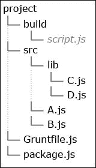
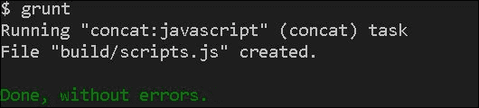
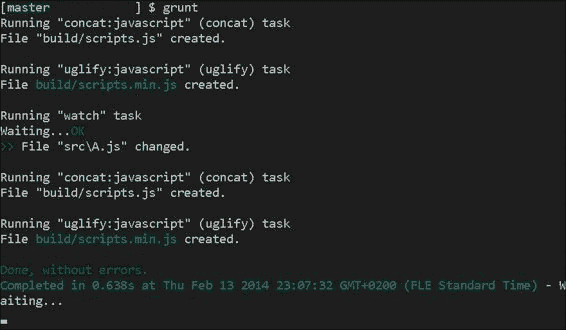
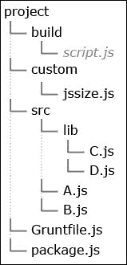
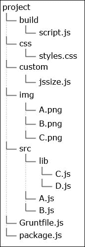
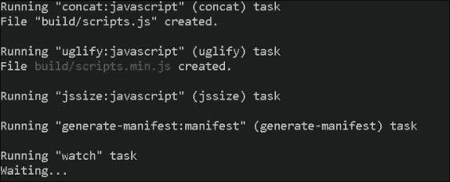
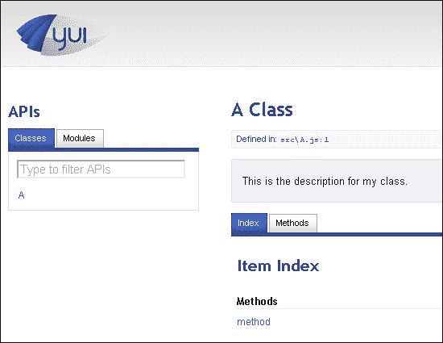
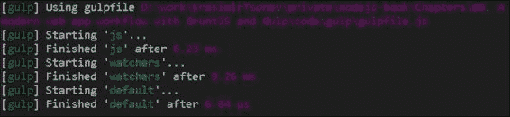

# 第八章：使用 Grunt 和 Gulp 开发 Web 应用工作流程

在前面的几章中，我们学习了如何使用 Node.js 与最流行的客户端 JavaScript 框架，如 AngularJS 和 Ember.js 一起使用。我们学习了如何运行一个功能齐全的 Web 服务器和构建命令行工具。

在本章中，我们将探索任务运行器的世界。Grunt 和 Gulp 是两个广泛使用的模块，它们拥有一个坚实的插件集合。

# 介绍任务运行器

应用程序在本质上通常是复杂的。越来越多的逻辑被放入浏览器中，并且用许多行 JavaScript 代码编写。新的 CSS3 特性和原生浏览器动画性能的改进导致大量的 CSS 代码。当然，最后我们仍然希望将事物分开。确保所有内容都放置在不同的文件夹和文件中。否则，我们的代码将难以维护。我们可能需要生成 `manifest.json`，使用预处理器，或者简单地从一处复制文件到另一处。幸运的是，有一些工具可以使我们的生活变得更简单。**任务运行器**接受指令并执行某些操作。它使我们能够设置监视器并监视文件的变化。这对于我们有一个复杂的设置和许多方面要处理的情况非常有帮助。

目前，有两个流行的 Node.js 任务运行器：Grunt 和 Gulp。它们之所以被广泛使用，是因为为它们编写的特定插件；模块本身没有很多功能；然而，如果我们将它们与外部插件结合使用，它们就变成了我们的好朋友。甚至像 Twitter 或 Adobe 这样的公司也在详细阐述它们。

# 探索 Grunt

**Grunt** 是一个 Node.js 模块，这意味着它是通过 Node.js 软件包管理器安装的。要开始使用，我们需要安装 Grunt 的命令行工具。

```js
npm install -g grunt-cli

```

```js
Gruntfile.js file:
```

```js
module.exports = function(grunt) {
  grunt.initConfig({
    concat:{
    }
  });
  grunt.registerTask('default', ['concat']);
}
```

```js
package.json file should look like:
```

```js
{
  "name": "GruntjsTest",
  "version": "0.0.1",
  "description": "GruntjsTest",
  "dependencies": {},
  "devDependencies": {
    "grunt-contrib-concat": "0.3.0"
  }
}
```

运行 `npm install` 后，我们将能够通过调用 `grunt.loadNpmTasks` (`grunt-contrib-concat`) 来请求插件。还有一个 `grunt.loadTasks` 方法用于自定义任务。现在，让我们继续并运行我们的第一个 Grunt 脚本。

## 连接文件

连接操作是最常见的操作之一。它与 CSS 样式相同。拥有许多文件意味着更多的服务器请求，这可能会降低应用程序的性能。`grunt-contrib-concat` 插件就是为了帮助解决这个问题。它接受源文件的 `glob` 模式和目标路径。它会遍历所有文件夹，找到匹配模式的文件，并将它们合并。让我们为我们的小型实验准备一个文件夹。



`build/scripts.js` 文件将由 Grunt 生成。因此，我们不需要创建它。向 `src` 文件夹中的文件添加一些内容。我们的 `Gruntfile.js` 文件应该包含以下代码：

```js
module.exports = function(grunt) {
  grunt.initConfig({
    concat: {
      javascript: {
        src: 'src/**/*.js',
        dest: 'build/scripts.js'
      }
    }
  });
  grunt.loadNpmTasks('grunt-contrib-concat');
  grunt.registerTask('default', ['concat']);
}
```

`concat` 任务包含一个 `javascript` 对象，该对象包含合并的配置。源值实际上是一个 `glob` 模式，它匹配 `src` 文件夹及其子文件夹中的所有 JavaScript 文件。我们在 第六章，*使用 Node.js 作为命令行工具*中使用了 `glob` 模块。使用前面的代码，我们可以在我们的终端中运行 `grunt` 命令。我们将得到以下截图所示的结果：



`scripts.js` 文件应该生成在 `build` 目录中，并包含 `src` 文件夹中的所有文件。

非常常见的情况是我们最终会调试编译后的文件。这主要是因为它是我们在浏览器中使用的文件，所有内容都保存在一起，所以我们实际上看不到错误是从哪里开始的。在这种情况下，在每份文件的内容之前添加一些文本是很好的。这将使我们能够看到代码的原始目的地。`Gruntfile.js` 文件的新内容如下：

```js
module.exports = function(grunt) {
  grunt.initConfig({
    concat: {
      javascript: {
        options: {
          process: function(src, filepath) {
            return '// Source: ' + filepath + '\n' + src;
          }
        },
        src: 'src/**/*.js',
        dest: 'build/scripts.js'
      }
    }
  });
  grunt.loadNpmTasks('grunt-contrib-concat');
  grunt.registerTask('default', ['concat']);
}
```

因此，我们传递一个自定义的 `process` 函数。它接受文件的文本内容和其路径。它应该返回我们想要合并的代码。在我们的例子中，我们只是在顶部添加了一个简短的注释。

## 压缩你的代码

**压缩**是一个使我们的代码变得更小的过程。它使用智能算法来替换我们的变量和函数的名称。它还删除了不必要的空格和制表符。这对于优化来说非常重要，因为它通常可以将文件大小减少一半。Grunt 的插件 `grunt-contrib-uglify` 提供了这项功能。让我们使用上一页的示例代码，并按如下方式修改我们的 `Gruntfile.js` 文件：

```js
module.exports = function(grunt) {
  grunt.initConfig({
    concat: {
      javascript: {
        options: {
          process: function(src, filepath) {
            return '// Source: ' + filepath + '\n' + src;
          }
        },
        src: 'src/**/*.js',
        dest: 'build/scripts.js'
      }
    },
    uglify: {
      javascript: {
        files: {
          'build/scripts.min.js': '<%= concat.javascript.dest %>'
        }
      }
    }
  });
  grunt.loadNpmTasks('grunt-contrib-concat');
  grunt.loadNpmTasks('grunt-contrib-uglify');
  grunt.registerTask('default', ['concat', 'uglify']);
}
```

在前面的代码中，我们执行以下重要任务：

+   我们将 `grunt-contrib-uglify` 添加到我们的 `package.json` 文件中

+   我们运行 `npm install` 以获取 `node_modules` 目录中的模块

+   最后，我们定义了最小化的选项

在前面的代码中，我们设置了一个名为 `uglify` 的新任务。它的属性 `files` 包含我们想要执行的转换的哈希。键是目标路径，值是源文件。在我们的例子中，源文件是另一个任务的输出，这样我们就可以直接使用 `<% %>` 分隔符。我们能够设置确切的路径，但使用分隔符做这件事要灵活得多。这是因为我们可能会得到一个非常长的 Grunt 文件，而且总是保持代码可维护性是很好的。如果我们只有一个地方有目的地，我们就能够纠正它，而无需在其他地方重复相同的更改。

注意，我们定义的任务相互依赖，即它们应该按特定顺序运行。否则，我们将收到意外的结果。就像我们的例子中，`concat` 任务在 `uglify` 之前执行。这是因为第二个任务需要第一个任务的结果。

## 监视文件变化

Grunt 在为我们做一些事情方面真的很出色。然而，如果我们每次更改一些文件时都必须运行它，那就有点烦人了。让我们看看上一节的情况。我们有一堆 JavaScript 脚本，想要将它们合并到一个文件中。如果我们使用编译版本，那么每次我们修改源文件时都必须运行连接操作。在这种情况下，最好的做法是设置一个监视器——一个监视我们的文件系统并触发特定任务的作业。一个名为`grunt-contrib-watch`的插件为我们做了这件事。将其添加到我们的`package.json`文件中，然后再次运行`npm install`以本地安装它。我们的文件只需要在配置中有一个条目。以下代码显示了新的监视属性：

```js
module.exports = function(grunt) {
  grunt.initConfig({
    concat: {
      javascript: {
        options: {
          process: function(src, filepath) {
            return '// Source: ' + filepath + '\n' + src;
          }
        },
        src: 'src/**/*.js',
        dest: 'build/scripts.js'
      }
    },
    uglify: {
      javascript: {
        files: {
          'build/scripts.min.js': '<%= concat.javascript.dest %>'
        }
      }
    },
    watch: {
      javascript: {
        files: ['<%= concat.javascript.src %>'],
        tasks: ['concat:javascript', 'uglify']
      }
    }
  });
  grunt.loadNpmTasks('grunt-contrib-concat');
  grunt.loadNpmTasks('grunt-contrib-uglify');
  grunt.loadNpmTasks('grunt-contrib-watch');
  grunt.registerTask('default', ['concat', 'uglify', 'watch']);
}
```

在`concat`和`uglify`之后添加了一个`watch`任务。请注意，该插件需要两个选项。第一个选项是`files`，它包含我们想要监控的文件，第二个选项是`tasks`，它定义了将要运行的过程。我们还在执行`concat`任务的特定部分。目前，我们只有一个要连接的文件，但如果我们处理一个大型项目，我们可能有几种类型的文件，甚至可能有不同的 JavaScript 源。因此，始终指定我们的定义是很好的，特别是对于监控的`glob`模式。我们真的不希望运行不必要的任务。例如，如果某些 CSS 文件已更改，我们通常不会连接 JavaScript。

如果我们使用前面代码中显示的设置并运行 Grunt，我们将看到以下截图所示的输出：



有很好的日志记录显示了确切发生了什么。所有任务都运行了，`src\A.js`文件已更改。立即，`concat`和`uglify`插件被启动。

## 忽略文件

有时，我们将有一些不应该在整个过程中占用一部分的文件，例如，拥有一个 CSS 文件不应该与其他文件连接。Grunt 为这种情况提供了解决方案。比如说，我们想要跳过`src/lib/D.js`中的 JavaScript。我们应该更新我们的`GruntFile.js`文件并更改任务的`src`属性：

```js
concat: {
  javascript: {
    options: {
      process: function(src, filepath) {
        return '// Source: ' + filepath + '\n' + src;
      }
    },
    src: ['src/**/*.js', '!src/lib/D.js'],
    dest: 'build/scripts.js'
  }
}
```

我们需要做的只是使用一个数组而不是一个单独的字符串。值前面的感叹号告诉 Grunt 我们想要忽略这个文件。

## 创建我们自己的任务

Grunt 拥有大量的插件，我们可能会找到我们想要的东西。然而，有些情况下我们需要为我们的项目定制一些东西。在这种情况下，我们需要一个自定义任务。比如说，我们需要保存编译后的 JavaScript 文件的大小。我们应该访问`build/scripts.js`，检查其大小，并将其写入硬盘上的一个文件。

我们首先需要一个新的目录来存放我们的任务，如下面的截图所示：



注意`custom`文件夹和`jssize.js`文件。它的名称可能不会与新任务的名称匹配，但将它们保持同步是一个好的实践。在编写实际执行工作的代码之前，我们将更改我们的配置以触发任务。到目前为止，我们使用了`grunt.loadNpmTasks`来指示在处理过程中将使用的模块。然而，我们的脚本不是 Node.js 的包管理的一部分，我们必须使用`grunt.loadTasks`。该方法接受包含我们的文件的文件夹的路径，如下面的代码行所示：

```js
grunt.loadNpmTasks('grunt-contrib-concat');
grunt.loadNpmTasks('grunt-contrib-uglify');
grunt.loadNpmTasks('grunt-contrib-watch');
grunt.loadTasks('custom');
```

`custom`目录中的所有文件都将被检索并注册为有效的、可用的插件。现在我们可以将我们的`jssize`任务添加到默认任务列表中，以便它与其他任务一起运行，如下所示：

```js
grunt.registerTask('default', ['concat', 'uglify', 'jssize', 'watch']);
```

最后，我们将在传递给`grunt.initConfig`函数的对象中添加一个新的条目，如下所示：

```js
jssize: {
  javascript: {
    check: 'build/scripts.js',
    dest: 'build/size.log'
  }
}
```

由于这是我们自己的任务，我们可以传递我们认为必要的任何内容。在我们的情况下，这是我们想要获取大小的文件以及我们将保存结果的路径。

Grunt 任务实际上是一个通过接受 Grunt 的 API 对象导出函数的 Node.js 模块。以下是`custom/jssize.js`文件的内容：

```js
var fs = require('fs');
module.exports = function(grunt) {
    grunt.registerMultiTask('jssize', 'Checks the JavaScript file size', function() {
        var fileToCheck = this.data.check;
        var destination = this.data.dest;
        var stat = fs.statSync(fileToCheck);
        var result = 'Filesize of ' + fileToCheck + ': ';
        result += stat.size + 'bytes';
        grunt.file.write(destination, result);
    });
};
```

关键时刻是`grunt.registerMultiTask`方法。第一个参数是任务的名称。这非常重要，因为在`Gruntfile.js`文件中也使用了相同的字符串。紧接着，我们传递一个描述和匿名函数。该函数的主体包含完成任务的真正逻辑。我们定义的配置在`this.data`对象中可用。文件大小检查是通过`grunt.file` API 完成的。

## 生成缓存清单文件

我们发现了如何创建我们自己的 Grunt 任务。让我们写一些有趣的东西。让我们为项目生成一个缓存清单文件。

**缓存清单**文件是我们用来指示我们的 Web 应用程序静态资源的声明性文件。这可能是我们的 CSS 文件、图像、HTML 模板、视频文件或保持一致的东西。这是一个巨大的优化技巧，因为浏览器将不会从网络而是从用户的设备加载这些资源。如果我们需要更新已缓存的文件，我们应该更改清单。

目前，我们只有 JavaScript 文件。让我们添加一些图像和一个 CSS 文件。进行必要的更改，使我们的项目文件夹看起来如下所示：



`styles.css`的内容并不重要。`img`文件夹中的图像也不重要。我们只需要不同的文件来测试。接下来，我们必须将我们的任务添加到`Gruntfile.js`中。我们将使用`generate-manifest`作为名称，如下面的代码片段所示：

```js
'generate-manifest': {
  manifest: {
    dest: 'cache.manifest',
    files: [
      'build/*.js',
      'css/styles.css',
      'img/*.*'
    ]
  }
}
```

```js
grunt.registerTask('default', ['concat', 'uglify', 'jssize', 'generate-manifest', 'watch']);
```

注意，我们正在传递几个 `glob` 模式；这些是我们想要添加的文件。在配置中描述每一个单独的文件会花费太多时间，我们可能会忘记一些东西。Grunt 有一个非常有效的 API 方法，`grunt.file.expand`，它接受 `glob` 模式并返回匹配的文件。我们剩余的任务是组合清单文件的内容并将其保存到磁盘上。我们将注册新的任务并填充 `content` 变量，该变量稍后将被写入文件，如下所示：

```js
module.exports = function(grunt) {
    grunt.registerMultiTask('generate-manifest', 'Generate manifest file', function() {

        var content = '',
          self = this,
          d = new Date();

        content += 'CACHE MANIFEST\n';
        content += '# created on: ' + d.toString() + '\n';
        content += '# id: ' + Math.floor((Math.random()*1000000000)+1) + '\n';

        var files = grunt.file.expand(this.data.files);
        for(var i=0; i<files.length; i++) {
            content += '/' + files[i] + '\n';
        }
        grunt.file.write(this.data.dest, content, {});

    });
};
```

在自定义任务中依赖 Grunt API 是一项良好的实践。因为它保持了应用程序的一致性，因为我们只依赖于一个模块——Grunt。在前面的代码中，我们使用了 `grunt.file.expand`，这是我们之前在代码中讨论过的，以及 `grunt.file.write`，它将清单的内容保存到磁盘。

为了提供一个可工作的清单，缓存文件应该以 `CACHE MANIFEST` 开头。这就是我们为什么在开头添加它的原因。同时，在生成日期上包含也是一项良好的实践。随机生成的 `id` 简化了应用程序开发的过程。

如前所述，浏览器将提供文件的缓存版本，直到缓存清单文件被更改。每次设置不同的 `id` 都会迫使浏览器获取文件的最新版本。然而，在生产环境中，这应该被移除。要使用缓存清单文件，请在我们的 HTML 页面中添加一个特殊属性，如下所示：

```js
<html manifest="cache.appcache">
```

如果一切顺利，我们应该看到如下截图所示的结果：



因此，缓存清单的内容如下：

```js
CACHE MANIFEST
# created on: Fri Feb 14 2014 23:40:46 GMT+0200 (FLE Standard Time)
# id: 585038007
/build/scripts.js
/build/scripts.min.js
/css/styles.css
/img/A.png
/img/B.png
/img/C.png
```

## 记录我们的代码

我们知道代码应该有文档。但很多时候，这会花费太多时间且很枯燥。有一些好的实践我们可以使用。其中之一是将注释写入代码，并使用这些注释生成文档。遵循这种方法，我们应该使我们的代码更容易被同事理解。Grunt 插件 `grunt-contrib-yuidoc` 将帮助我们创建 `.doc` 文件。将其添加到我们的 `package.json` 并运行 `npm install`。再次，我们只需要更新我们的 `Gruntfile.js` 文件。

```js
yuidoc: {
  compile: {
    name: 'Project',
    description: 'Description',
    options: {
      paths: 'src/',
      outdir: 'docs/'
    }
  }
}
...
grunt.registerTask('default', ['concat', 'uglify', 'jssize', 'generate-manifest', 'yuidoc', 'watch']);
```

有一个 `paths` 属性显示源代码，以及一个 `outdir` 属性显示文档将被保存的位置。如果我们运行 Grunt 并导航到我们的目录，我们会看到没有任何列表。这是因为我们没有在代码中添加任何注释。打开 `src/A.js` 并放置以下代码：

```js
/**
* This is the description for my class.
*
* @class A
*/
var A = {
  /**
  * My method description. Like other pieces of your comment blocks,
  * this can span multiple lines.
  *
  * @method method
  */
  method: function() {

  }
};
```

重新启动任务后，我们将在文档中看到 **A 类**，如下面的截图所示：



# 发现 Gulp

**Gulp** 是一个已经相当流行的构建系统。它与 Grunt 几乎是相同的概念。我们能够创建为我们做些事情的任务。当然，有很多插件。实际上，大多数主要的 Grunt 插件在 Gulp 中都有等效的插件。然而，也有一些差异，以下将提到这些差异。

+   存在一个配置文件，但它被称为 `gulpfile.js`

+   Gulp 使用流来处理文件，这意味着它不会创建任何临时文件或文件夹。这可能会导致任务运行器的性能更好。

+   Gulp 遵循 `code-over-configuration` 原则，也就是说，当我们设置 Gulp 任务时，过程更像是在编码而不是在编写配置。这使得 Gulp 对开发者来说更加友好。

## 安装 Gulp 和获取插件

与 Grunt 一样，Gulp 可在 Node.js 的包管理器中找到。

```js
npm install -g gulp

```

上述命令行将全局设置任务运行器。一旦安装完成，我们就可以运行 `gulp` 命令。当然，我们应该在包含 `gulpfile.js` 文件的目录中执行此操作。

Gulp 的插件也是 Node.js 模块。例如，`gulp-concat` 与 `grunt-contrib-concat` 相同，而 `gulp-uglify` 是 `grunt-contrib-uglify` 的替代品。在 `package.json` 文件中描述它们是一个好习惯。没有像 `grunt.loadNpmTasks` 这样的函数。我们可以直接引入模块。

## 使用 Gulp 进行连接和压缩

让我们使用我们已有的代码。`src` 文件夹中有一系列 JavaScript 文件，我们希望将它们连接起来。任务运行器还应生成一个压缩版本并监视文件的变化。我们需要几个模块，以下是我们的 `package.json` 文件看起来像：

```js
{
  "name": "GulpTest",
  "version": "0.0.1",
  "description": "GulpTest",
  "dependencies": {},
  "devDependencies": {
    "gulp": "3.5.2",
    "gulp-concat": "2.1.7",
    "gulp-uglify": "0.2.0",
    "gulp-rename": "1.0.0"
  }
}
```

需要 `gulp` 命令是因为我们需要访问 Gulp 的 API。`gulp-concat` 插件将连接文件，而 `gulp-uglify` 将压缩结果。使用 `gulp-rename` 插件是因为我们必须提供两个文件——一个适合阅读的文件和一个压缩的文件，即 `build/scripts.js` 和 `build/scripts.min.js`。

以下代码是 `gulpfile.js` 文件的内容：

```js
var gulp = require('gulp');
var concat = require('gulp-concat');
var uglify = require('gulp-uglify');
var rename = require('gulp-rename');
gulp.task('js', function() {
  gulp.src('./src/**/*.js')
  .pipe(concat('scripts.js'))
  .pipe(gulp.dest('./build/'))
  .pipe(rename({suffix: '.min'}))
  .pipe(uglify())
  .pipe(gulp.dest('./build/'))
});

gulp.task('watchers', function() {
  gulp.watch('src/**/*.js', ['js']);
});

gulp.task('default', ['js', 'watchers']);
```

使用 Grunt 时，我们需要对任务运行器和其配置结构有一些更深入的了解。而使用 Gulp，情况则略有不同。我们通常使用 Node.js 模块以及它们公共 API 的使用。脚本从插件定义和 `gulp` 对象的定义开始。一个任务是通过使用 `gulp.task` 方法定义的。第一个参数是任务的名称，第二个参数是一个函数。此外，我们也可以传递一个表示其他任务的字符串数组来代替函数。

类似地，就像在 Grunt 中一样，我们有一个`default`入口。这次，我们将任务分为两部分：JavaScript 操作和监视器。几乎每个 Gulp 任务都以`gulp.src`开始，以`gulp.dest`结束。第一个方法接受`glob`模式，显示需要转换的文件。`gulp.dest`插件将结果保存到期望的位置。它们之间的所有动作实际上都是接收和输出流的模块。在我们的例子中，`js`任务从`src`目录及其子文件夹中获取所有文件，将它们连接起来，并将结果保存到`build`文件夹。我们继续通过重命名文件、压缩它，并将它保存在同一位置。在项目文件夹中运行`gulp`后，我们的终端输出应该如下所示：



当然，我们应该在构建目录中查看`scripts.js`和`scripts.min.js`文件。

## 创建自己的 Gulp 插件

Gulp 插件的开发几乎与创建 Grunt 插件相同。我们需要一个新的 Node.js 模块，具有适当的 API。区别在于我们接收一个流，然后应该输出这个流。这可能会有一点难以编码，因为我们需要理解流是如何工作的。幸运的是，有一个辅助包可以简化这个过程。我们将使用`through2`——Node.js 流 API 的一个小型包装器。因此，我们的`package.json`文件随着以下内容略有增长：

```js
{
  "name": "GulpTest",
  "version": "0.0.1",
  "description": "GulpTest",
  "dependencies": {},
  "devDependencies": {
    "gulp": "3.5.2",
    "gulp-concat": "2.1.7",
    "gulp-uglify": "0.2.0",
    "gulp-rename": "1.0.0",
    "through2": "0.4.1"
  }
}
```

让我们创建相同的`jssize`任务。它只需要做一项工作：测量连接文件的文件大小。我们可以重新创建`custom`目录，并在其中放置一个空的`jssize.js`文件。我们的 Gulp 文件还需要进行快速修正。在顶部，我们按照以下方式引入新创建的模块：

```js
var jssize = require('./custom/jssize');
```

我们必须将第一个`gulp.dest('./build/')`命令的输出通过管道传输到`jssize`插件。以下片段显示了完成的任务：

```js
gulp.task('js', function() {
  gulp.src('./src/**/*.js')
  .pipe(concat('scripts.js'))
  .pipe(gulp.dest('./build/'))
  .pipe(jssize())
  .pipe(rename({suffix: '.min'}))
  .pipe(uglify())
  .pipe(gulp.dest('./build/'));
});
```

现在，让我们看看以下代码中我们的插件看起来如何：

```js
var through2 = require('through2');
var path = require('path');
var fs = require("fs");
module.exports = function () {
    function transform (file, enc, next) {
        var stat = fs.statSync(file.path);
        var result = 'Filesize of ' + path.basename(file.path) + ': ';
        result += stat.size + 'bytes';
        fs.writeFileSync(__dirname + '/../build/size.log', result);
        this.push(file);
        next();
    }
    return through2.obj(transform);
};
```

`through2.obj`对象返回一个用于 Gulp 管道的流。处理流就像处理块一样。换句话说，我们不会一次性收到整个文件，而是反复收到文件的部分，直到我们得到全部数据。`through2`对象简化了过程，并直接给我们提供了对整个文件的访问。因此，`transform`方法接受文件、其编码以及一个我们需要在完成工作后调用的函数。否则，链将被停止，下一个插件将无法完成其任务。生成`size.log`文件的实际代码与 Grunt 版本中使用的相同。

# 摘要

在本章中，我们学习了如何使用任务运行器。这些工具通过简化常见任务使我们的生活变得更轻松。作为网页开发者，我们可能希望将生产代码连接和压缩，而像 Grunt 和 Gulp 这样的模块可以很好地处理这些琐碎的操作。广泛的插件和强大的 Node.js 社区鼓励使用任务运行器，并彻底改变了我们的工作流程。

在下一章中，我们将深入探讨测试驱动开发，并了解 Node.js 如何处理这些过程。
