# 第九章：使用 Node.js 自动化测试

在上一章中，我们学习了如何使用 Grunt 和 Gulp 自动化我们的开发过程。这两个 Node.js 模块拥有大量的插件，我们几乎可以在任何情况下使用它们。在本章中，我们将讨论测试的重要性以及如何将其集成到我们的工作流程中。以下是我们将要涵盖的主题列表：

+   流行测试方法

+   Jasmine 框架

+   Mocha 框架

+   使用 PhantomJS 和 DalekJS 进行测试

# 理解编写测试的重要性

在开发软件时，我们编写的代码可以放入浏览器中运行，作为桌面程序运行，或者作为 Node.js 脚本启动。在这些所有情况下，我们都期望得到特定的结果。每一行代码都有其重要性，我们需要知道最终产品是否能够完成工作。通常，我们会调试我们的应用程序，也就是说，我们编写程序的一部分并运行它。通过监控输出或其行为，我们评估一切是否正常，或者是否存在问题。然而，这种方法很耗时，尤其是如果项目很大。对应用程序的每个功能进行迭代需要花费大量的时间和金钱。自动测试在这种情况下很有帮助。从架构的角度来看，测试非常重要。这是因为当系统复杂，模块之间存在众多关系时，添加新功能或引入重大更改就变得困难。

我们实际上无法保证修改后一切都会像以前一样工作。因此，与其依赖手动测试，不如创建可以为我们完成这项工作的脚本。编写测试有以下几个主要好处：

+   这证明了我们的软件是稳定的，并且按预期工作。

+   这可以节省大量时间，因为我们不必反复进行手动测试。

+   代码编写得不好，有很多依赖关系，很难进行测试。在这些大多数情况下编写测试会导致更好的代码。

+   如果我们有一个稳固的测试套件，我们就可以在不用担心损坏任何东西的情况下扩展系统。

+   如果测试覆盖了应用程序的所有功能，那么它们可以用作应用程序的文档。

# 选择测试方法

存在少数流行的编写测试的方法。让我们看看它们是什么，以及它们之间的区别。

## 测试驱动开发

**测试驱动开发**（**TDD**）是一个依赖于重复短周期开发过程的过程。换句话说，我们在编写实现的同时编写测试。周期越短，越好。以下图表显示了 TDD 流程：

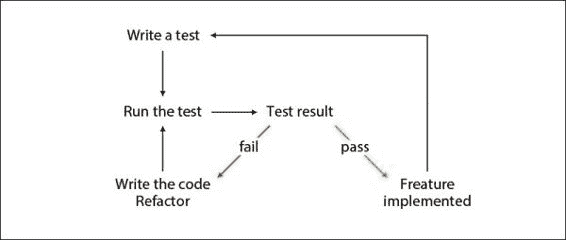

在我们编写实际为我们完成工作的代码之前，我们需要准备一个测试。当然，在第一次运行后，测试将失败，因为没有实现任何内容。因此，我们需要确保测试通过所有循环。一旦发生这种情况，我们可能会花一些时间重构到目前为止所做的工作，并继续进行下一个方法、类或功能。请注意，一切围绕着测试旋转，这真的是一件好事，因为这是我们定义代码应该做什么的地方。有了这个基础，我们可以避免交付不必要的代码。我们还可以确保实现符合要求。

## 行为驱动开发

**行为驱动开发**（**BDD**）与 TDD 类似。事实上，如果项目很小，我们实际上无法发现它们之间的区别。这种方法的理念是更多地关注规范和应用程序的过程，而不是实际的代码。例如，如果我们用 TDD 测试一个在 Twitter 上发布消息的模块，我们可能会问以下问题：

+   消息是否为空？

+   消息长度是否小于 140 个符号？

+   Ajax 请求是否正确执行？

+   返回的 JSON 是否包含某些字段？

然而，使用 BDD，我们只问以下问题：

+   消息是否已发送到 Twitter？

这两个过程是相互关联的，正如我们所说的，有时它们之间根本没有任何区别。我们应该记住的是，BDD 关注代码正在做什么，而 TDD 关注代码是如何做的。

# 测试分类

你可能需要编写几种不同的测试，这些测试通过提供输入并期望特定输出来评估我们的系统。然而，它们也会在不同的部分进行这种评估。了解它们的名称是很有帮助的，如下列所示：

+   **单元测试**：单元测试对应用程序的单个部分进行检查；它关注一个单元。我们经常在编写此类测试时遇到困难，因为我们无法将代码拆分成单元；这通常是一个坏信号。如果没有明确定义的模块，我们就无法进行此类测试。将逻辑分配到不同的单元不仅有助于测试，还有助于程序的总体稳定性。让我们用以下图表来说明这个问题：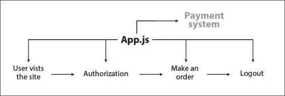

    让我们假设我们有一个电子商务网站，该网站向我们的用户销售产品。在上面的图表中，登录、订购和注销等流程由一个类处理，该类在`App.js`文件中定义。是的，它工作。我们可能达到目标并成功完成循环，但这绝对不是可单元测试的，因为没有单元。如果我们将责任分割到不同的类中，会更好，如下面的图表所示：

    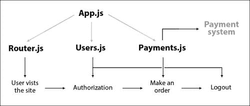

    我们继续使用`App.js`，它仍然控制一切。然而，整个流程的不同部分被分配到三个类中：`Router`、`Users`和`Payments`。现在，我们能够编写单元测试。

+   **集成测试**：集成测试为多个单元或组件输出结果。如果我们看前面的例子，集成测试将模拟整个订购产品的过程，即登录、购买和登出。通常，集成测试会使用系统的几个模块，并确保这些模块能正确协同工作。

+   **功能测试**：功能测试与集成测试密切相关，并关注系统中的特定功能。它可能涉及多个模块或组件。

+   **系统测试**：系统测试在不同的环境中测试我们的程序。在 Node.js 的上下文中，这可能是在不同的操作系统上运行我们的脚本并监控输出时。有时会有差异，如果我们想全球分布我们的工作，我们需要确保我们的程序与最流行的系统兼容。

+   **压力或性能测试**：这些测试评估我们的应用程序超出定义的规范，并显示我们的代码对高流量或复杂查询的反应。当决定程序的架构或选择框架时，它们非常有帮助。

有一些其他类型的测试，但前面提到的测试方法是最受欢迎的。没有关于要编写哪些测试的严格政策。当然，有良好的实践，但我们应该关注的是编写可测试的代码。没有任何事情比一个完全被测试覆盖的应用程序更好。

由于测试是开发过程中的一个非常重要的部分，有一些框架专门针对编写测试。通常，当我们使用框架时，我们需要以下两个工具：

+   **测试运行器**：这是框架的一部分，用于运行我们的测试并显示它们是否通过或失败。

+   **断言**：这些方法用于实际的检查，也就是说，如果我们需要检查一个变量是否为`true`，我们可以写`expect(active).toBe(true)`而不是仅仅`if(active === true)`。这对读者更好，也能防止一些奇怪的情况；例如，如果我们想检查一个变量是否已定义，下面代码中的`if`语句返回`true`，因为`status`变量有一个值，而这个值是`null`。实际上，我们是在询问`status`变量是否已初始化，如果我们以这种方式留下测试，我们将得到错误的结果。这就是为什么我们需要一个具有适当测试方法的断言库。以下代码是显示`status`变量实际上已定义且其类型为`object`的示例：

    ```js
    var status = null;
    if(typeof status != "undefined") {
        console.log("status is defined");
    } else {
        console.log("status is not defined");
    }
    ```

# 使用 Jasmine

Jasmine 是一个用于测试 JavaScript 代码的框架。它作为 Node.js 模块和库提供，我们可以在浏览器中使用它。它自带断言方法。

## 安装 Jasmine

我们将使用框架的 Node.js 版本。它是一个模块，因此可以通过 Node.js 包管理器`npm`进行安装，如下面的代码行所示：

```js
npm install jasmine-node -g

```

上述命令将在全局设置 Jasmine，因此我们可以在我们选择的每个目录中运行`jasmine-node`。测试可以组织到放在一个文件夹或子文件夹中的不同文件中。唯一的要求是文件名以`spec.js`结尾，例如`testing-payments.spec.js`或`testing-authorization.spec.js`。

## 定义测试模块

在我们编写实际测试之前，让我们定义我们想要构建的应用程序。假设我们需要一个 Node.js 模块，它可以读取文件并找到其中的特定单词。以下是我们开始的基本文件结构：

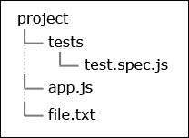

测试应用程序的代码将放在`tests/test.spec.js`中，逻辑的实现将在`app.js`中，我们将从中读取的文件将是`file.txt`。让我们打开`file.txt`文件并在其中添加以下文本：

```js
The quick brown fox jumps over the lazy dog.
```

这是一个用于测试打字机键的短语。它包含英语字母表中的所有字母，非常适合我们的小型项目。

## 遵循测试驱动开发的概念

任务很简单，我们可能只需要大约 20 行代码就能解决。当然，我们可以将所有代码封装在一个函数中并执行所有操作。缺点是如果出现问题，我们无法检测问题发生的位置。这就是为什么我们将逻辑分成两部分，并以下述方式分别测试它们：

+   读取文件内容

+   在文件内容中搜索特定单词

正如我们在本章开头所解释的，我们将先编写测试，然后观察它失败，接着编写`app.js`的代码。

## 测试文件读取过程

编写测试，就像任何其他任务一样，可能会具有挑战性。有时，我们无法确定要测试什么以及要排除什么。存在一条未明说的规则，建议用户避免开发其他开发者已测试的功能——在我们的例子中，我们不需要测试文件是否成功读取。如果我们这样做，它将看起来像我们在测试 Node.js 的文件系统 API，这是不必要的。

每个用 Jasmine 编写的测试都以`describe`子句开始。将以下代码添加到`tests/test.spec.js`中：

```js
describe("Testing the reading of the file's content.", function() {
  // ...
});
```

我们正在添加有意义的信息，告诉我们将要测试什么。`it`的第二个参数再次是一个函数。不同之处在于它接受一个参数，即另一个函数。我们在完成检查后需要调用它。许多 JavaScript 脚本都是异步的，而`done`回调帮助我们处理此类操作。

上述代码块包括`app.js`模块并验证结果。`expect`方法接受一个断言的主题，接下来的链式方法执行实际的检查。

我们已经有了测试，所以我们可以执行它。运行`jasmine-node ./tests`，你将看到以下结果：


测试用例通过了。`app.js`文件是空的，但即使如此，Node.js 也不会失败。`app`变量的值实际上是一个空对象。让我们继续，并尝试想象我们需要的方法。在以下代码中，我们添加了一个额外的代码块来测试模块的`read`API 方法：

```js
describe("Testing the reading of the file's content.", function() {
  it("should create an instance of app.js", function(done) {
    var app = require("../app.js");
    expect(app).toBeDefined();
    done();
  });
  it("should read the file", function(done) {
    var app = require("../app.js");
    var content = app.read("./file.txt");
    expect(content).toBe("The quick brown fox jumps over the lazy dog.");
    done();
  });
});
```

第一个`it`运行良好，但第二个引发了一个错误。这是因为`app.js`中没有内容。我们没有在那里定义`read`方法。错误显示在下述屏幕截图：

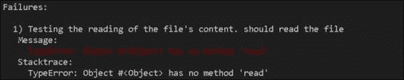

注意，我们可以清楚地看到出了什么问题。如果有人出于某种原因删除或重命名了使用的方法，这个测试将失败。即使函数存在，我们也期望看到特定的结果来验证模块的工作。

现在，我们必须开始编写应用程序的实际代码。我们应该使测试通过。将以下代码放在`app.js`中：

```js
module.exports = {
  read: function(filePath) {

  }
}
```

如果我们运行测试，它将失败，但原因不同，这是因为`read`方法中没有逻辑。以下屏幕截图是控制台的结果：

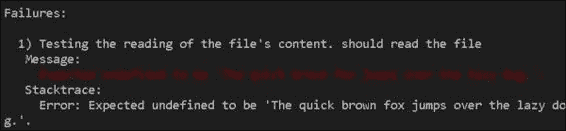

这次`read`方法被定义了，但它没有返回任何内容，`expect(content).toBe("The quick brown fox jumps over the lazy dog.")`失败了。让我们使用 Node.js 文件 API 读取`file.txt`并返回其内容：

```js
var fs = require('fs');
module.exports = {
  read: function(filePath) {
    return fs.readFileSync(filePath).toString();
  }
}
```

现在，测试的颜色是绿色，这表明模块有我们使用的方法，并且该方法返回了我们期望的结果，如以下屏幕截图所示：


## 在文件内容中查找字符串

通过使用相同的方法，我们将实现应用程序的第二部分：在文件中查找单词。以下是我们将开始的新的`describe`代码块：

```js
describe("Testing if the file contains certain words", function() {
  it("should contains 'brown'", function(done) {
    var app = require("../app.js");
    var found = app.check("brown", "The quick brown fox jumps over the lazy dog.");
    expect(found).toBe(true);
    done();
  });
});
```

我们需要一个接受两个参数的`check`方法。第一个是我们想要查找的单词，第二个是包含它的字符串。请注意，我们没有使用`read`方法。我们的想法是单独测试该函数，并确保它正常工作。这是一个非常重要的步骤，因为它使我们的`check`方法通用。它不受匹配文件内部文本的想法的限制；然而，它确实匹配字符串内部的文本。如果我们不使用测试驱动的工作流程，我们可能会得到一个同时执行这两个操作的功能：读取文件和扫描其内容。然而，在我们的情况下，我们可以使用从数据库或通过 HTTP 请求获取的文本的相同模块。而且，如果我们发现我们的模块没有找到特定的单词，我们将知道问题出在`check`函数上，因为它被单独作为单元测试。

以下是新方法的代码：

```js
var fs = require('fs');
module.exports = {
  read: function(filePath) {
    return fs.readFileSync(filePath).toString();
  },
  check: function(word, content) {
    return content.indexOf(word) >= 0 ? true : false;
  }
}
```

如下截图所示，测试现在通过了三个断言：

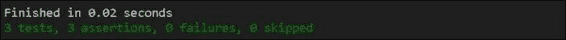

## 编写集成测试

我们迄今为止编写的测试是单元测试，即它们测试了我们应用程序的两个单元。现在，让我们添加一个集成测试。同样，我们需要一个失败的测试来使用该模块。因此，我们开始于以下代码：

```js
describe("Testing the whole module", function() {
  it("read the file and search for 'lazy'", function(done) {
    var app = require("../app.js");
    app.read("./file.txt")
    expect(app.check("lazy")).toBe(true);
    done();
  });
});
```

注意，我们并没有将文件内容保存在一个临时变量中，也没有将其传递给 `check` 方法。实际上，我们对文件的实际内容不感兴趣。我们只关心它是否包含特定的字符串。因此，我们的模块应该处理这种情况并保留其中的文本。前面的测试失败，并显示以下消息：

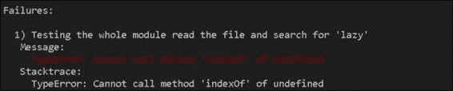

以下是我们使 `app.js` 按照预期工作的所需更改：

```js
var fs = require('fs');
module.exports = {
  fileContent: '',
  read: function(filePath) {
    var content = fs.readFileSync(filePath).toString();
    this.fileContent = content;
    return content;
  },
  check: function(word, content) {
    content = content || this.fileContent;
    return content.indexOf(word) >= 0 ? true : false;
  }
}
```

我们将简单地将在一个名为 `fileContent` 的局部变量中存储文本。请注意，我们正在谨慎地做出更改并保留 `read` 方法的返回逻辑。这是必需的，因为有一个测试需要这个功能。这显示了 TDD 的另一个好处。我们确保在包含我们的修改之前，代码以原始形式工作。在复杂系统或应用程序中，这一点非常重要，没有测试，这将非常难以实现。最终结果又是一个带有绿色消息的截图：

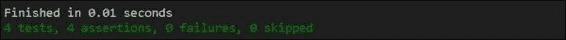

# 使用 Mocha 进行测试

Mocha 是一个比 Jasmine 更先进的测试框架。它更可配置，支持 TDD 或 BDD 测试，并且甚至有几种类型的报告器。它也非常受欢迎，适用于在浏览器中进行客户端使用，这使得它成为我们测试的一个很好的候选者。

## 安装

与 Jasmine 类似，我们需要 Node.js 的包管理器来安装 Mocha。通过运行以下命令，框架将被全局设置：

```js
npm install -g mocha

```

安装完成后，我们可以运行 `mocha ./tests`。默认情况下，该工具会搜索 JavaScript 文件并尝试运行它们。这里，让我们使用与 Jasmine 相同的示例并通过 Mocha 运行它。实际上，它使用相同的 `describe` 和 `it` 块语法。然而，它没有自己的断言库。实际上，有一个名为 `assert` 的内置 Node.js 模块用于此类目的。还有其他开发者开发的库，例如 `should.js`、`chai` 或 `expect.js`。

它们在某些方面有所不同，但执行相同的任务：检查实际值和预期值，如果它们不匹配则抛出错误。之后，框架捕获错误并显示结果。

## 使用 Mocha 翻译我们的示例

一切都相同，只是将 `expect` 模块调用替换为 `assert.equal`。我们使用了 `assert.fail` 来通知框架存在问题。以下是一些其他的 `describe` 块：

```js
describe("Testing if the file contains certain words", function() {
  it("should contains 'brown'", function(done) {
    var app = require("../app.js");
    var found = app.check("brown", "The quick brown fox jumps over the lazy dog.");
    assert.equal(found, true);
    done();
  });
});
describe("Testing the whole module", function() {
  it("read the file and search for 'lazy'", function(done) {
    var app = require("../app.js");
    app.read("./file.txt")
    assert.equal(app.check("lazy"), true);
    done();
  });
});
```

随着最新的更改，测试应该通过，我们应该看到以下截图：


## 选择报告器

当我们谈到报告器时，Mocha 非常灵活。报告器是框架中显示结果的那个部分。我们有几十种选项可以选择。为了设置报告器的类型，我们应该在命令行中使用`-R`选项，例如，与 Jasmine 的报告器最接近的是`dot`类型，如下面的截图所示：

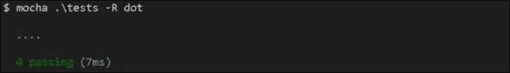

为了查看有关通过或失败的测试的更详细的信息，我们可以使用`spec`报告器，如下面的截图所示：

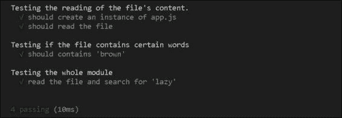

也有一个看起来像着陆飞机（`landing`类型）的报告器，如下面的截图所示：

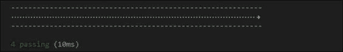

# 使用无头浏览器进行测试

到目前为止，我们学习了如何测试我们的代码。我们可以编写一个模块、类或库，如果它有一个 API，我们就可以测试它。然而，如果我们需要测试用户界面，这会变得有点复杂。像 Jasmine 和 Mocha 这样的框架可以运行我们编写的代码，但不能访问页面、点击按钮或发送表单；至少，不能单独完成。对于这种测试，我们需要使用无头浏览器。无头浏览器是一个没有用户界面的网络浏览器。有一种方法可以程序化地控制它并执行诸如访问 DOM 元素、点击链接和填写表单等操作。我们能够做与使用真实浏览器相同的事情。这为我们提供了一个真正不错的工具来测试用户界面。在接下来的几页中，我们将看到如何使用无头浏览器。

## 编写我们的测试主题

为了探索这种测试的可能性，我们需要一个简单的网站。让我们创建两个页面。第一个将包含一个输入字段和一个按钮。当第一个页面上的按钮被点击时，将访问第二个页面。页面的`h1`标签标题将根据字段中写入的文本而改变。创建一个新的目录，并在`app.js`文件中插入以下代码：

```js
var http = require('http');
var url = require('url');
var port = 3000;
var pageA = '\
  <h1>First page</h1>\
  <form>\
    <input type="text" name="title" />\
    <input type="submit" />\
  </form>\
';
var pageB = '\
  <h1>{title}</h1>\
  <a href="/">back</a>\
';
http.createServer(function (req, res) {
  var urlParts = url.parse(req.url, true);
  var query = urlParts.query;
  res.writeHead(200, {'Content-Type': 'text/html'});
  if(query.title) {
    res.end(pageB.replace('{title}', query.title));
  } else {
    res.end(pageA);
  }
}).listen(port, '127.0.0.1');
console.log('Server running at http://127.0.0.1:' + port);
```

我们只需要两个 Node.js 原生模块来启动我们的服务器。`http`模块运行服务器，而`url`模块从 URL 获取`GET`参数。页面的标记存储在简单的变量中。在 HTTP 请求的处理程序中有一个检查，如果`pageA`上的表单被提交，则服务`pageB`。如果我们用`node app.js`运行服务器，我们将看到页面看起来如何，如下面的截图所示：

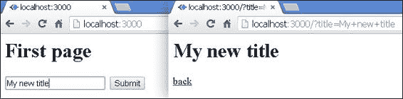

注意，在文本字段中输入的文本被设置为第二页的标题。我们还有一个**返回**按钮可以用来返回主页。我们有一个主题要运行我们的测试。我们将定义我们需要验证的操作如下：

+   页面是否正确渲染？我们应该检查`pageA`的标签是否实际上在页面上。

+   我们应该在文本字段中添加一些字符串并提交表单。

+   新加载的页面的标题应该与我们输入的文本相匹配。

+   我们应该能够点击 **后退** 按钮并返回主页。

## 使用 PhantomJS 进行测试

我们知道我们的应用程序应该如何工作，所以让我们编写测试。我们将使用的无头浏览器是 **PhantomJS**。访问 [`phantomjs.org`](http://phantomjs.org) 并下载适合您操作系统的包。就像我们对 Node.js 所做的那样，我们将编写我们的测试在 JavaScript 文件中，并在命令行中运行它。假设我们的文件结构如下所示：

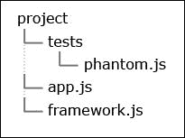

请记住，PhantomJS 不是一个 Node.js 模块。我们为 PhantomJS 编写的 JavaScript 代码并不完全等同于有效的 Node.js 代码。我们不能直接使用原生模块，例如 `assert`。此外，它没有集成测试运行器或测试框架。它是一个基于 **Webkit** 的浏览器，但可以通过命令行或代码进行控制。它看起来像是二进制的，一旦安装，我们就能在我们的终端中运行 `phantom ./tests/phantom.js` 命令。测试代码将打开 `http://127.0.0.1:3000` 并与那里的页面进行交互。当然，JavaScript 社区开发了工具，可以将测试框架如 Jasmine 或 Mocha 与 PhantomJS 结合使用，但我们在本章中不会使用它们。我们将编写自己的小型实用工具——这就是 `framework.js` 文件的作用。

### 开发微型测试框架

最终结果应该是一个简单的函数，可以直接使用，例如 Jasmine 中的 `describe` 或 `it`。它还应该有一个类似于断言库的东西，这样我们就不必使用常规的 `if-else` 语句或手动报告失败的测试。在下面的代码中，我们可以看到正确的实现：

```js
var test = function(description, callback) {
  console.log(description);
  callback(function(subject) {
    return {
      toBe: function(value) {
        if(subject !== value) {
          console.log("! Expect '" + subject + "' to be '" + value + "'.")
        }
      },
      toBeDefined: function() {
        if(typeof subject === 'undefined') {
          console.log("! Expect '" + subject + "' to be defined")
          }
      }
    }
  });
}
```

该函数接受描述和函数。第一个参数只是打印到控制台，这表明我们将要测试什么。紧接着，我们调用传递的 `callback` 函数，并使用另一个函数作为参数，该函数充当断言库的角色。它接受测试的主题，并对其执行两个方法：`toBe` 和 `toBeDefined`。以下是一个简单的用法：

```js
test("make a simple test", function(expect) {
  var variable = { property: 'value' };
  expect(true).toBe(true);
  expect(1).toBe(0);
  expect(variable.property).toBeDefined()
  expect(variable.missing).toBeDefined()
});
```

如果我们运行前面的代码，结果将如以下截图所示：

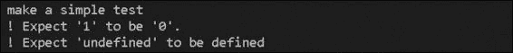

### 理解 PhantomJS 的工作原理

PhantomJS 接受用 JavaScript 编写的指令。我们可以将它们保存到文件中，并通过使用 `phantom` 命令在命令行中执行。让我们看看下面的代码片段：

```js
var page = require('webpage').create();
var url = 'http://127.0.0.1:3000';
page.onConsoleMessage = function(msg) {
  // ...
};
page.onLoadFinished = function(status) {
  // ...
};
page.open(url);
```

`page` 变量是对 PhantomJS API 的访问。有一个 `open` 方法，它加载一个新的页面。我们主要对来自无头浏览器的两个事件感兴趣。第一个事件是 `onConsoleMessage`，当加载的页面使用 `console` 命令时触发，例如 `console.log` 或 `console.error`。第二个事件 `onLoadFinished` 也相当重要。我们有一个在页面加载时被调用的函数。这就是我们应该放置测试的地方。除了监听事件外，我们还将使用以下两个其他方法：

+   `injectJs`：此方法需要我们硬盘上文件的路径。传递的文件被包含在页面中。我们还可以使用 `includeJs`，它执行相同的功能，但它从外部源加载文件。

+   `Evaluate`：此方法接受一个在当前加载的页面上下文中执行的功能。这很重要，因为我们需要检查某些元素是否在 DOM 树中。我们需要通过填写文本字段和点击按钮来与之交互。

### 编写实际测试

在我们开始使用 PhantomJS 之前，我们需要用 `node ./app.js` 运行我们的应用程序。这样做，我们正在运行一个监听特定端口的服务器。PhantomJS 将向该服务器发送请求。现在，让我们按照以下方式开始填写 `tests/phantom.js` 文件：

```js
var page = require('webpage').create();
var url = 'http://127.0.0.1:3000';
page.onConsoleMessage = function(msg) {
  console.log("\t" + msg);
};
page.onLoadFinished = function(status) {
  console.log("phantom: load finished");
  page.injectJs('./framework.js');
   phantom.exit();
};
page.open(url);
```

正如我们已经讨论过的，我们能够创建一个 `page` 变量并打开特定的 URL。在我们的例子中，我们使用测试应用程序的地址。`onConsoleMessage` 监听器只是将消息打印到我们的终端。当页面加载时，我们注入我们的微单元测试框架。这意味着我们能够在页面上下文中调用 `test` 函数。如果我们用 `phantom ./tests/phantom.js` 运行脚本，我们将得到以下结果：

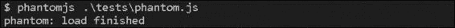

前面的截图显示了确切应该发生的事情。浏览器访问页面并触发 `onLoadFinished`。调用 `phantom.exit()` 很重要；否则，PhantomJS 的进程将保持活跃。

`framework.js` 文件被注入到页面中，我们可以编写第一个测试，即检查标题是否包含**第一页**，填写测试字段，并提交表单：

```js
page.onLoadFinished = function(status) {
  console.log("phantom: load finished");
  page.injectJs('./framework.js');
  page.evaluate(function() {
    test("should open the first page", function(expect) {
      expect(document).toBeDefined();
      expect(document.querySelector('h1').innerHTML).toBe('First page');
      document.querySelector('input[type="text"]').value = 'Phantom test';
      document.querySelector('form').submit();
    });
  });
  phantom.exit();
};
```

由 `evaluate` 方法执行的功能是在页面上下文中运行的，因此它能够访问通常的文档对象。我们能够使用 `getElementById`、`querySelector` 或 `submit` 方法。现在获得的脚本结果如下截图所示：

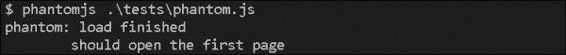

现在变得有趣了。确实，表单已经提交，但我们立即调用了 `phantom.exit()`，这终止了我们的脚本。如果我们去掉它，浏览器将保持活跃状态，并且 `onLoadFinished` 事件将再次触发，因为新页面已成功加载。然而，脚本失败，因为下一页上没有文本框或 `form` 元素。我们需要评估另一个函数。以下是一个可能的解决方案：

```js
var steps = [
  function() {
    test("should open the first page", function(expect) {
      expect(document).toBeDefined();
      expect(document.querySelector('h1').innerHTML).toBe('First page');
      document.querySelector('input[type="text"]').value = 'Phantom test';
      document.querySelector('form').submit();
    });
  },
  function() {
    test("should land on the second page", function(expect) {
      expect(document).toBeDefined();
      expect(document.querySelector('h1').innerHTML).toBe('Phantom test');
        var link = document.querySelector('a');
        var event = document.createEvent('MouseEvents');
        event.initMouseEvent('click', true, true, window, 1, 0, 0);
        link.dispatchEvent(event);
    });
  },
  function() {
    test("should return to the home page", function(expect) {
      expect(document.querySelector('h1').innerHTML).toBe('First page');
    });
  }
];
page.onLoadFinished = function(status) {
  console.log("phantom: load finished");
  page.injectJs('./framework.js');
  page.evaluate(steps.shift());
  if(steps.length == 0) {
    console.log("phantom: browser terminated");
    phantom.exit();
  }
};
```

`steps` 数组是一个全局变量，它包含了一系列需要评估的函数。在每次 `onLoadFinished` 事件发生时，我们会获取这些函数中的一个，直到 `steps` 数组为空。这就是我们调用 `phantom.exit()` 的地方，如下面的截图所示：

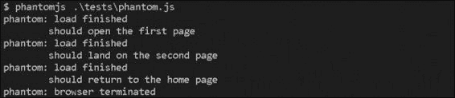

PhantomJS 打开主页。它在文本框中输入 **Phantom 测试** 并提交表单。然后，在下一页，它检查标题是否包含有效值，当你点击 **返回链接** 按钮时，它会再次加载上一页。

# 使用 DalekJS 进行测试

到目前为止，我们学习了如何测试我们的 JavaScript 代码。之后，我们发现了如何使用 Phantom.js 编写用户界面测试。所有这些都非常有用，但如果我们能运行一个真实的浏览器并控制它，那就更好了。使用 DalekJS 就可以实现这一点。这是一个非常棒的 Node.js 模块，它附带了一个命令行界面工具和针对主要浏览器（如 Google Chrome、Firefox 和 Internet Explorer）的子模块。

让我们看看一切是如何工作的，并使用以下命令安装 DalekJS 的命令行工具：

```js
npm install -g dalek-cli

```

```js
package.json file looks:
```

```js
{
  "name": "project",
  "description": "description",
  "version": "0.0.1",
  "devDependencies": {
    "dalekjs": "*",
    "dalek-browser-chrome": "*"
  }
}
```

一个快速的 `npm install` 命令将创建一个包含所有依赖项的 `node_modules` 目录。DalekJS 在 [`dalekjs.com`](http://dalekjs.com) 上有详细的文档。它指出我们可以加载页面、填写表单并点击不同的 DOM 元素。它还附带了自己的测试 API，因此我们不必担心这一点。我们必须编写的测试实际上非常简短。以下 `tests/dalek.js` 的内容：

```js
var url = 'http://127.0.0.1:3000';
var title = 'DalekJS test';
module.exports = {
  'should interact with the application': function (test) {
    test
    .open(url)
    .assert.text('h1', 'First page', 'The title is "First page"')
    .type('input[type="text"]', title)
    .submit('form')
    .assert.text('h1', title, 'The title is "' + title + '"')
    .click('a')
    .assert.text('h1', 'First page', 'We are again on the home page')
    .done()
  }
};
```

再次，我们将向 `http://127.0.0.1:3000` 发送请求，并期望在页面上看到某些元素。我们还会在文本框中输入一些文本（使用 `type` 方法）并提交表单（使用 `submit` 方法）。要运行测试，我们需要输入以下命令：

```js
dalek .\tests\dalek.js -b chrome

```

如果我们省略 `-b` 参数，DalekJS 将使用 Phantom.js。这是库的默认浏览器类型。当在终端中启动前面的命令时，将打开一个新的 Google Chrome 浏览器实例。它执行我们在测试中定义的内容，然后关闭浏览器。为了使示例工作，我们需要通过执行 `node ./app.js` 来运行应用程序。结果将报告到控制台，如下面的截图所示：

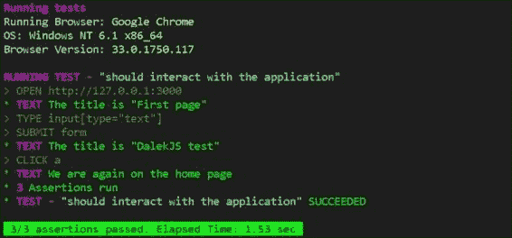

我们甚至可以截取当前浏览器的截图。这只需要简单地调用 `screenshot` API 方法，如下面的代码片段所示：

```js
test
.open(url)
.assert.text('h1', 'First page', 'The title is "First page"')
.type('input[type="text"]', title)
.submit('form')
.assert.text('h1', title, 'The title is "' + title + '"')
.screenshot('./screen.jpg')
.click('a')
.assert.text('h1', 'First page', 'We are again on the home page')
.done()
```

在前面的代码中，我们正在截取第二页的屏幕截图，即表单提交后加载的页面。

# 摘要

在本章中，我们看到了测试的重要性。幸运的是，Node.js 生态系统中提供了许多优秀的工具。例如，Jasmine 和 Mocha 这样的框架使我们的工作更加轻松。像 Phantom.js 这样的工具通过自动化测试并将我们的代码置于浏览器环境中，节省了大量时间。使用 DalekJS，我们甚至可以直接在 Firefox、Google Chrome 或 Internet Explorer 中运行测试。

在下一章中，我们将了解如何编写灵活和模块化的 CSS。Node.js 为编写大量 CSS 的前端开发者提供了几个优秀的模块。
