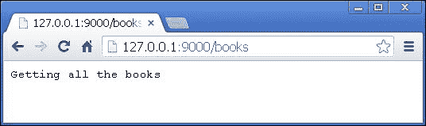
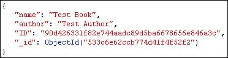

# 第十一章。编写 REST API

在上一章中，我们学习了如何优化我们的 CSS 编写。我们了解了最流行的架构概念，并检查了可用的 CSS 预处理器。本章是关于使用 Node.js 构建 REST API。我们将：

+   运行 Web 服务器

+   实现路由机制

+   处理传入的请求

+   发送适当的响应

# 发现 REST 和 API

**REST**代表**表示性状态转移**，它是 Web 的一种架构原则。在大多数情况下，我们在服务器上有资源需要创建、检索、更新或删除。REST API 提供了执行所有这些操作的方法。每个资源都有自己的 URI，根据请求方法，会发生不同的操作。例如，假设我们需要管理我们的社交网络中的用户。要检索特定用户的信息，我们将向`/user/23`地址执行`GET`请求，其中数字`23`是用户的 ID。要更新数据，我们将向同一 URL 发送`PUT`请求，要删除记录，我们将发送`DELETE`请求。`POST`请求保留用于创建新资源。换句话说，服务器上的资源管理是通过使用`GET`、`POST`、`PUT`和`DELETE`方法向精心选择的地址发送 HTTP 请求来实现的，这些方法通常被称为**HTTP 动词**。许多公司采用这种架构，因为它简单、通过 HTTP 协议工作，并且具有高度的可扩展性。当然，还有不同的方法，如 SOAP 或 CORBA，但我们有更多的规则要遵循，并且机器之间的通信通常很复杂。

根据维基百科，**应用程序编程接口（API**）指定了某些软件组件应该如何相互交互。API 通常是我们的程序对外可见的部分。

在本章中，我们将构建一个。这是一个简单的在线图书库的 API。资源是书籍，它们将通过 REST API 进行访问。

# 开发在线图书馆——REST API

REST API 的开发与其他 Node.js 应用程序的开发相同。我们需要制定计划，并逐一仔细实现不同的组件。

## 定义 API 部分

在开始一个新项目之前有一个计划总是好的。所以，让我们定义 API 服务器的主要部分如下：

+   **路由器**：我们知道 Node.js 从端口开始监听并接受 HTTP 请求。因此，我们需要一个类来处理它们并将请求传递到正确的逻辑。

+   **处理器**：这是我们将放置逻辑的地方。它将处理请求并准备响应。

+   **响应器**：我们还需要一个类，它将结果发送到浏览器。API 通常需要以不同的格式响应。例如，XML 和 JSON。

## 编写基础

Node.js 经常被用来构建 REST API。此外，因为它是一个常见任务，所以我们有几种可能的方法。甚至有现成的模块，如`rest.js`或`restify`。然而，我们将从头开始构建我们的 REST API，因为它将更有趣、更具挑战性。我们将首先运行一个 Node.js 服务器。让我们创建一个空目录，并将以下代码放入`index.js`文件中：

```js
var http = require('http');
var router = function(req, res) {
  res.end('API response');
}
http.createServer(router).listen('9000', '127.0.0.1');
console.log('API listening');
```

如果我们使用`node ./index.js`运行脚本，我们就能打开`http://127.0.0.1:9000`并在屏幕上看到**API 响应**。所有传入的请求都会通过一个函数。这就是我们的路由器所在的位置。

## 实现 API 路由器

在几乎每个基于 Web 的 Node.js 应用程序中，路由器扮演着主要角色之一。这是因为它是程序的入口点。这是 URL 映射到逻辑和请求处理的地方。对于 REST API 的路由器应该稍微复杂一些，因为它不仅应该处理常见的`GET`和`POST`请求，还应该处理`PUT`和`DELETE`请求。除了我们的`index.js`，我们还需要另一个名为`router.js`的文件。因此，将以下代码添加到`router.js`文件中：

```js
var routes = [];
module.exports = {
  register: function(method, route, handler) {
    routes.push({ method: method, route: route, handler: handler });
  },
  process: function(req, res, next) {
    // ...
  }
}
```

模块导出一个包含两个方法的对象。第一个方法（`register`）将记录存储在`routes`变量中。第二个方法（`process`）将被用作`index.js`中`createServer`方法的处理器。以下代码演示了如何使用我们的路由器：

```js
var http = require('http');
var router = require('./router');
http.createServer(router.process).listen('9000', '127.0.0.1');
console.log('API listening');
```

`register`方法的第一参数将是 HTTP 动词作为字符串：`GET`、`POST`、`PUT`或`DELETE`。`route`参数将是一个正则表达式，最后一个参数，如果表达式与当前 URL 匹配，将调用一个函数。

`process`方法将执行几件事情。它将对当前请求运行定义的正则表达式。它还将做几件其他事情，如下所述：

+   从 URL 中获取`GET`参数

+   获取与请求一起传递的`POST`/`PUT`参数

+   支持动态 URL

所述的所有这些事情都可以在`router`变量外部实现，但因为是常见任务，我们可能会在几个地方用到它们，所以我们将它们添加到以下代码中。以下代码是路由器`process`方法的完整代码：

```js
process: function(req, res, next) {
  var urlInfo = url.parse(req.url, true);
  var info = {
    get: urlInfo.query,
    post: {},
    path: urlInfo.pathname,
    method: req.method
  }
  for(var i=0; i<routes.length; i++) {
    var r = routes[i];
    var match = info.path.match(r.route);
    if((info.method === r.method || '' === r.method) && match) {
      info.match = match;
      if(info.method === 'POST' || info.method === 'PUT') {
        processRequest(req, function(body) {
          info.post = body;
          r.handler(req, res, info);
        });
      } else {
        r.handler(req, res, info);
      }
      return;
    }
  }
  res.end('');
}
```

有一个`info`对象持有我们讨论过的数据。我们遍历了所有路由，并尝试找到一个具有方法和正则表达式匹配的路由。我们还检查了请求方法是否为`POST`或`PUT`，并获取了发送的信息。最后，如果没有匹配的路由，我们发送一个空字符串。为了使前面的代码正常工作，我们需要定义两个变量和一个函数，这些都在以下代码中完成：

```js
var url = require('url');
var qs = require('querystring');
var processRequest = function(req, callback) {
  var body = '';
    req.on('data', function (data) {
        body += data;
    });
    req.on('end', function () {
        callback(qs.parse(body));
    });
}
```

实体`url`和`querystring`是 Node.js 的本地模块。`processRequest`变量是必需的，因为 Node.js 以不同的方式处理`POST`/`PUT`参数。

通过使用前面的代码，我们能够添加路由并检查它们是否正常工作。例如，查看`index.js`文件中的以下代码：

```js
router.register('GET', /\/books(.+)?/, function(req, res, info) {
  console.log(info);
  res.end('Getting all the books')
});
```

在这里，我们使用`node ./index.js`启动服务器并向`http://127.0.0.1:9000/books`发送请求。屏幕上显示的结果是文本`获取所有书籍`，如下所示截图：



你也会在我们的终端中看到以下输出：


没有发送数据，所以`get`和`post`属性是空的。现在，让我们使用以下路由：

```js
router.register('POST', /\/book(.+)?/, function(req, res, info) {
  console.log(info);
  res.end('New book created')
});
```

我们应该确保我们的 API 正确地接受`POST`和`GET`请求；我们可以通过使用此路由来实现。如果我们向`http://127.0.0.1:9000/book?notification=no`发送包含数据`name=Node.js blueprints&author=Krasimir Tsonev`的`POST`请求，我们将得到以下结果：


我们的路由器还有一件事要做。它处理动态 URL。我们所说的“动态”是指像`/book/523/edit`这样的 URL，其中`523`是书籍的唯一 ID，它可以不同，我们想要在一个特定的处理器中处理所有这类请求，如下所示：

```js
router.register('GET', /\/book\/(.+)\/(.+)?/, function(req, res, info) {
  console.log(info);
  res.end('Getting specific book')
});
```

这里的关键点是正则表达式。有两个捕获括号。第一个代表书籍的 ID，第二个代表我们想要执行的操作，例如`edit`或`delete`。`127.0.0.1:9000/book/523/edit`的响应如下所示截图：


如我们所见，`523`和`edit`是`match`属性的一部分，我们可以轻松地获取它们。我们可以通过添加一些额外的辅助方法来改进我们的路由器。为每种不同类型的请求提供方法是一个好的实践。以下代码显示了这些方法的样子：

```js
get: function(route, handler) { 
  this.register('GET', route, handler); 
},
post: function(route, handler) { 
  this.register('POST', route, handler); 
},
put: function(route, handler) { 
  this.register('PUT', route, handler); 
},
del: function(route, handler) { 
  this.register('DELETE', route, handler); 
},
all: function(route, handler) { 
  this.register('', route, handler); 
}
```

我们现在可以写`router.get(/\/book\/(.+)\/(.+)?/...`，而不是`router.register('GET', /\/book\/(.+)\/(.+)?/...`，这稍微好一些。如果我们需要处理特定的 URL 但不关心`request`方法，可以使用`all`函数。在 Express 框架中，我们也有`get`、`post`、`put`、`delete`和`all`方法。

## 编写响应器

在编写我们的小型 REST API 库的逻辑之前，我们需要一个合适的响应器，即一个我们将用来将结果发送到浏览器的类。当我们谈论一个作为 API 工作的服务器时，有一些非常重要的事情需要我们注意。除了数据，我们必须发送一个适当的 HTTP 状态码。例如，如果一切正常，则为`200`，如果资源缺失，则为`404`。

我们的响应器将被保存在与`index.js`和`router.js`相同的目录中的`responder.js`文件中。模块以以下代码开始：

```js
module.exports = function(res) {
  return {
    c: 200,
    code: function(c) {
      this.c = c;
      return this;
    },
    send: function(content) {
      res.end(content.toString('utf8'));
      this.c = 200;
      return this;
    }
  }
}
```

该模块需要响应对象以便将结果发送到浏览器。`code` 方法设置状态码。我们可以获取最新使用的路由并将其转换为以下代码：

```js
var responder = require('./responder');
router.get(/\/book\/(.+)\/(.+)?/, function(req, res, info) {
  console.log(info);
  responder(res).code(200).send('Getting specific book');
});
```

在本章的开头，我们提到 API 应该能够以不同的格式响应。我们必须在响应器中添加一些方法来实现这一点：

```js
json: function(o) {
  res.writeHead(this.c, {'Content-Type': 'application/json; charset=utf-8'});
  return this.send(JSON.stringify(o));
},
html: function(content) {
  res.writeHead(this.c, {'Content-Type': 'text/html; charset=utf-8'});
  return this.send(content);
},
css: function(content) {
  res.writeHead(this.c, {'Content-Type': 'text/css; charset=utf-8'});
  return this.send(content);
},
js: function(content) {
  res.writeHead(this.c, {'Content-Type': 'application/javascript; charset=utf-8'});
  return this.send(content);
},
text: function(content) {
  res.writeHead(this.c, {'Content-Type': 'text/plain; charset=utf-8'});
  return this.send(content);
}
```

通过添加这些函数，我们实际上能够提供 JSON、HTML、CSS、JavaScript 和纯文本。类向浏览器发送一个包含状态码、`Content-Type` 和 `charset` 的头信息。响应器的所有方法都返回类本身，因此我们可以将它们链接起来。

# 与数据库一起工作

在 第三章，*使用 Node.js 和 AngularJS 编写博客应用程序*中，我们使用了 MongoDB 和 MySQL。我们学习了如何从这些数据库中读取、写入、编辑和删除记录。本章我们也使用 MongoDB。我们将数据存储在名为 `books` 的集合中。为了使用数据库驱动程序，我们需要创建一个 `package.json` 文件，并在其中放入以下内容：

```js
{
  "name": "projectname",
  "description": "description",
  "version": "0.0.1",
  "dependencies": {
    "mongodb": "1.3.20"
    "request": "2.34.0"

  }
}
```

运行 `npm install` 后，我们将能够通过使用 `node_modules` 目录中安装的驱动程序连接到 MongoDB 服务器。我们需要与数据库交互的代码与 第三章，*使用 Node.js 和 AngularJS 编写博客应用程序*中使用的代码相同，如下所示：

```js
var crypto = require("crypto"),
    client = require('mongodb').MongoClient,
  mongodb_host = "127.0.0.1",
  mongodb_port = "27017",
  collection;

var connection = 'mongodb://';
connection += mongodb_host + ':' + mongodb_port;
connection += '/library';
client.connect(connection, function(err, database) {
  if(err) {
    throw new Error("Can't connect.");
  } else {
    console.log("Connection to MongoDB server successful.");
      collection = database.collection('books');
    }
});
```

将使用 `crypto` 模块为新创建的记录生成一个唯一的 ID。已经初始化了一个 MongoDB 客户端。它连接到服务器，并将 `collection` 变量指向 `books` 集合。这就是我们所需要的。现在我们可以管理我们书籍的记录了。

## 创建新记录

将新书添加到数据库应通过 `POST` 请求进行。以下代码是处理此任务的路由：

```js
router.post(/\/book/, function(req, res, info) {
  var book = info.post;
  book.ID = crypto.randomBytes(20).toString('hex');
  if(typeof book.name == 'undefined') {
    responder(res).code(400).json({error: 'Missing name.'});
  } else if(typeof book.author == 'undefined') {
    responder(res).code(400).json({error: 'Missing author.'});
  } else {
    collection.insert(book, {}, function() {
      responder(res).code(201.json({message: 'Record created successful.'});  
    });  
  }
});
```

添加新书的 URL 是 `/book`。它可以通过 `POST` 方法访问。预期的参数是 `name` 和 `author`。请注意，如果这些中的任何一个缺失，我们将设置状态码为 `400`。`400` 表示 `Bad request`。如果用户忘记传递它们，我们应该通知他们具体出了什么问题。在设计 API 时，这非常重要。使用我们服务的开发者应该知道为什么他们没有得到适当的响应。通常，设计良好的 API 可以在没有文档的情况下使用。这是因为它们的方法提供了足够的信息。

这本书的数据是以 JSON 格式编写的，浏览器接收到的答案也是以 JSON 格式发送的。以下截图是数据库中保存的记录预览：



## 编辑记录

为了实现编辑，我们将使用 `PUT` 方法。我们还需要定义一个动态路由。以下代码创建了路由和适当的处理程序：

```js
router.put(/\/book\/(.+)?/, function(req, res, info) {
  var book = info.post;
  if(typeof book.name === 'undefined') {
    responder(res).code(400).json({error: 'Missing name.'});
  } else if(typeof book.author === 'undefined') {
    responder(res).code(400).json({error: 'Missing author.'});
  } else {
    var ID = info.match[1];
    collection.find({ID: ID}).toArray(function(err, records) {
      if(records && records.length > 0) {
        book.ID = ID;
        collection.update({ID: ID}, book, {}, function() {
          responder(res).code(200).json({message: 'Record updated successful.'});
          });
      } else {
        responder(res).code(400).json({error: 'Missing record.'});    
      }
    });
  }
});
```

除了对缺失的`name`和`author`进行检查外，我们还需要确保在 URL 中使用的 ID 存在于我们的数据库中。如果不存在的，应该发送适当的错误信息。

## 删除记录

记录的删除与编辑非常相似。我们还需要一个动态路由。当我们有书籍的 ID 时，我们可以检查它是否真的存在，如果存在，则简单地从数据库中删除它。查看以下实现，它执行了我们刚才描述的操作：

```js
router.del(/\/book\/(.+)?/, function(req, res, info) {
  var ID = info.match[1];
  collection.find({ID: ID}).toArray(function(err, records) {
    if(records && records.length > 0) {
      collection.findAndModify({ID: ID}, [], {}, {remove: true}, function() {
        responder(res).code(200).json({message: 'Record removed successfully.'});
        });
    } else {
      responder(res).code(400).json({error: 'Missing record.'});    
    }
  });
});
```

## 显示所有书籍

这可能是最简单的 API 方法，我们必须要实现。这里有一个对数据库的查询，结果直接传递给响应者。以下代码定义了一个名为`books`的路由，用于从数据库中获取所有记录：

```js
router.get(/\/books/, function(req, res, info) {
  collection.find({}).toArray(function(err, records) {
    if(!err) {
      responder(res).code(200).json(records);
    } else {
      responder(res).code(200).json([]);
    }  
  });
});
```

## 添加默认路由

我们应该有一个默认路由，即当用户输入错误的 URL 或仅访问 API 的根地址时将被发送的页面。为了捕获所有类型的请求，我们使用路由器的`all`方法：

```js
router.all('', function(req, res, info) {
  var html = '';
  html += 'Available methods:<br />';
  html += '<ul>';
  html += '<li>GET /books</li>';
  html += '<li>POST /book</li>';
  html += '<li>PUT /book/[id]</li>';
  html += '<li>DELETE /book/[id]</li>';
  html += '</ul>';
  responder(res).code(200).html(html);
});
```

我们构建了一个简单的 HTML 标记并发送给用户。该路由的正则表达式只是一个空字符串，它可以匹配任何内容。我们还在使用`.all`函数，它可以处理任何类型的请求。请注意，我们需要在所有其他路由之后添加此路由；否则，如果它位于开头，所有请求都将流向那里。

# 测试 API

为了确保一切正常工作，我们将编写一些测试，涵盖上一节中提到的所有方法。在第九章《使用 Node.js 自动化测试》中，我们学习了 Jasmine 和 Mocha 测试框架。以下测试套件使用 Jasmine。我们还需要一个额外的模块来执行 HTTP 请求。该模块称为`request`，我们可以使用`npm install request`或将其添加到我们的`package.json`文件中。以下是与测试 API 相关的步骤和代码：

1.  让我们先测试创建一个新的数据库记录：

    ```js
    var request = require('request');
    var endpoint = 'http://127.0.0.1:9000/';
    var bookID = '';
    describe("Testing API", function() {
      it("should create a new book record", function(done) {
        request.post({ 
          url: endpoint + '/book', 
          form: {
            name: 'Test Book',
            author: 'Test Author'
          }
        }, function (e, r, body) {
          expect(body).toBeDefined();
          expect(JSON.parse(body).message).toBeDefined();
          expect(JSON.parse(body).message).toBe('Record created successfully.');
          done();
        });
      });
    });
    ```

    我们使用模块的`.post`方法。所需数据附加到`form`属性。我们还期望接收到包含特定消息的 JSON 对象。

1.  要获取数据库中的所有书籍，我们需要向`http://127.0.0.1:9000/books`发起请求：

    ```js
    it("should get all the books", function(done) {
      request.get({ 
        url: endpoint + '/books'
      }, function (e, r, body) {
        var books = JSON.parse(body);
        expect(body).toBeDefined();
        expect(books.length > 0).toBeDefined();
        bookID = books[0].ID;
        expect(bookID).toBeDefined();
        done();
      });
    });
    ```

1.  编辑和删除操作与`POST`和`GET`请求相似，只是我们传递了一个 ID。而且，我们是从上一个测试中获取集合中所有记录的地方得到的：

    ```js
    it("should edit", function(done) {
      request.put({ 
        url: endpoint + '/book/' + bookID, 
        form: {
          name: 'New name',
          author: 'New author'
        }
      }, function (e, r, body) {
        expect(body).toBeDefined();
        expect(JSON.parse(body).message).toBeDefined();
        expect(JSON.parse(body).message).toBe('Record updated successfully.');
        done();
      });
    });
    it("should delete a book", function(done) {
      request.del({ 
        url: endpoint + '/book/' + bookID
      }, function (e, r, body) {
        expect(body).toBeDefined();
        expect(JSON.parse(body).message).toBeDefined();
        expect(JSON.parse(body).message).toBe('Record removed successfully.');
        done();
      });
    });
    ```

# 摘要

在本章中，我们构建了一个 REST API 来存储有关书籍的信息。Node.js 处理此类任务很好，因为它有易于工作的原生模块。我们成功覆盖了`GET`、`POST`、`PUT`和`DELETE`请求，创建了一个管理简单在线图书馆的接口。

在本书的下一章和最后一章中，我们将构建一个桌面应用程序。我们将学习如何使用 Node.js 不仅限于 Web 项目，还可以用于桌面程序。到下一章结束时，我们应该有一个用 Node.js 编写的可工作的文件浏览器。
