# 第十二章：调试 Node.js

JavaScript 和 Node.js 的异步特性使得调试过程变得复杂。与传统的同步代码执行不同，Node.js 的异步行为引入了复杂性，即使是经验丰富的开发者也可能感到挑战。然而，在过去十年中，Node.js 作为一项技术已经显著成熟。随着这种成熟，调试能力和设施也同步提高，为开发者提供了更强大的工具和方法来排查应用程序。

在本章中，我们将探讨我们可以采取的各种步骤来使我们的应用程序更容易调试。通过实施最佳实践并采用结构化的编码方法，我们可以减轻与异步编程相关的固有困难。我们还将深入研究可用于调试 Node.js 应用程序的现代工具，例如内置调试器、各种第三方调试工具和高级日志记录技术。

此外，我们还将介绍如何利用 Node.js 的诊断报告功能，这是 Node.js 最新版本中引入的一个强大工具。该功能提供了对应用程序失败时状态的深入了解，使得定位问题的根本原因变得更加容易。到本章结束时，你将全面了解有效调试 Node.js 应用程序所需的策略和工具，确保开发过程更加顺畅，生产环境更加稳定。

本章将涵盖以下内容：

+   使用 Chrome DevTools 诊断问题

+   使用 Node.js 记录日志

+   启用调试日志

+   启用 Node.js 内核调试日志

+   增加堆栈跟踪大小

+   创建诊断报告

# 技术要求

对于本章，你需要确保 Node.js 22 已经安装并且可在你的终端路径中访问。你可以使用以下命令测试已安装的 Node.js 版本和路径：

```js
$ node --version
v22.9.0
```

你还需要访问编辑器和浏览器。对于 *使用 Chrome DevTools 诊断问题* 的配方，你需要安装 Google Chrome，你可以从 [`www.google.com/chrome/`](https://www.google.com/chrome/) 下载。

# 使用 Chrome DevTools 诊断问题

Node.js 通过 **--inspect** 进程标志提供强大的调试工具，使我们能够通过 Chrome DevTools 界面调试和性能分析我们的 Node.js 进程。这种集成是由 Chrome DevTools 协议实现的，它促进了 Node.js 和 Chrome DevTools 之间的通信。该协议的存在使得可以创建与 Chrome DevTools 无缝集成的工具，从而在不同的环境中提供统一的调试体验。

在这个菜谱中，我们将学习如何利用 Chrome DevTools 诊断和解决 Web 应用程序中的问题。我们将涵盖如何设置调试环境、连接到 Node.js 进程以及浏览 Chrome DevTools 的各种功能。这包括检查变量、设置断点和逐步执行我们的代码。

重要提示

**node --debug** 和 **node --debug-brk** 是自 Node.js v6.3.0 以来已弃用的 Node.js 标志。**node --inspect** 和 **node --inspect-brk** 是这些旧标志的现代等效标志，应替换这些旧标志使用。

## 准备工作

在这个菜谱中，我们将调试一个使用 Express 构建的简单 Web 服务器。在我们开始菜谱之前，让我们准备一下：

1.  首先，让我们设置一个目录和这个菜谱所需的文件：

    ```js
    $ mkdir debugging-with-chrome
    $ cd debugging-with-chrome
    $ npm init --yes
    $ npm install express
    $ touch server.js random.js
    ```

1.  将以下源代码添加到 **server.js** 中以创建我们的 Web 服务器：

    ```js
    const express = require('express');
    const app = express();
    const random = require('./random');
    app.get('/:number', (req, res) => {
      const number = req.params.number;
      res.send(random(number).toString());
    });
    app.listen(3000, () => {
      console.log('Server listening on port 3000');
    });
    ```

1.  将以下源代码添加到 **random.js** 中。这将是我们通过服务器交互的本地模块：

    ```js
    module.exports = (n) => {
      const randomNumber = Math.floor(Math.random() * n) + '1';
      return randomNumber;
    };
    ```

现在我们有一个准备调试的应用程序，我们可以继续到菜谱步骤。

## 如何操作…

在这个菜谱中，我们将使用 Chrome DevTools ([`developer.chrome.com/docs/devtools`](https://developer.chrome.com/docs/devtools)) 来调试我们应用程序中的一个路由。我们期望应用程序会响应一个介于 **0** 和我们在路由中指定的数字之间的随机数。例如，**http://localhost:3000/10** 应该返回一个介于 **1** 和 **10** 之间的随机数。

使用 **$ node server.js** 启动程序，并导航到 **http://localhost:3000/10**。刷新端点几次，你应该会注意到程序通常会响应一个大于 **10** 的数字。这表明我们的程序中存在一个错误；因此，让我们进行调试以尝试理解为什么这个错误会发生：

1.  首先，我们需要启用调试器启动我们的程序。为此，我们需要将 **--inspect** 参数传递给我们的 Node.js 进程：

    ```js
    $ node --inspect server.js
    Debugger listening on ws://127.0.0.1:9229/35fa7c65-62a5-48b4-8428-9a414ec28afe
    For help, see: https://nodejs.org/en/docs/inspector
    Server listening on port 3000
    ```

1.  不要直接点击输出中指定的链接，而是导航到 Google Chrome 中的 **chrome://inspect/#devices**。预期会看到以下输出：

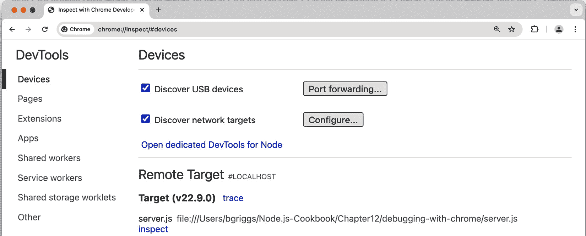

图 12.1 – Google Chrome 检查器设备界面截图

1.  注意到 **server.js** 显示为 **远程目标**。点击 **检查** 链接，Chrome DevTools 窗口应该打开，如图下所示：

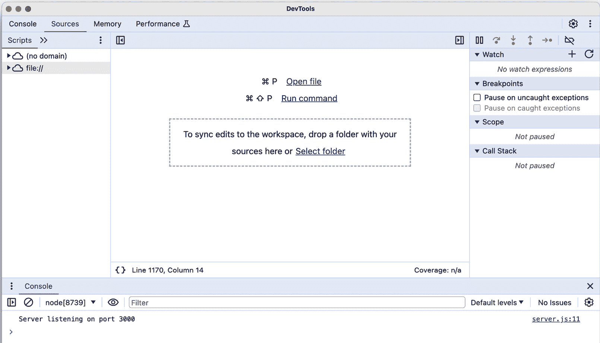

图 12.2 – Chrome DevTools 界面截图

1.  点击窗口右下角的 **server.js**。这应该确保我们的 **server.js** 文件已打开：

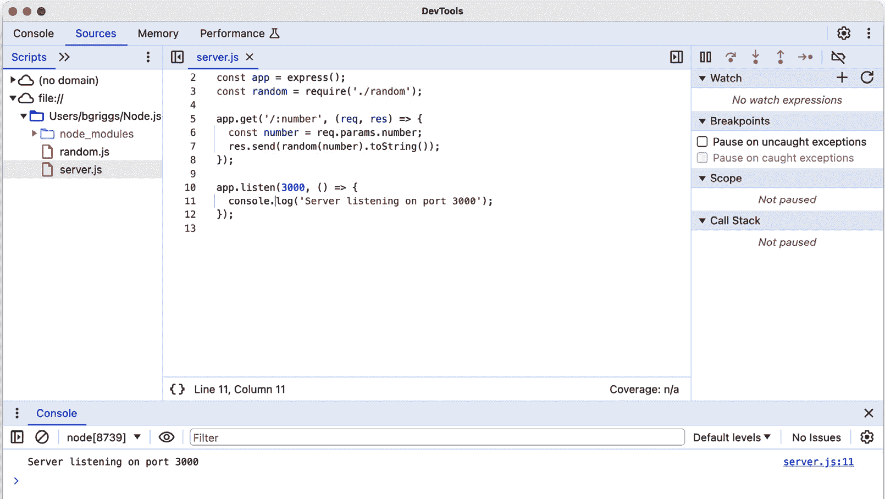

图 12.3 – Chrome DevTools 界面截图，显示 server.js 文件

1.  现在，我们可以添加一个断点。点击我们代码左侧的行号列中的数字 **7**。应该会在数字旁边出现一个小红圈。如果你点击右上角的 **显示调试器**，你应该会在 **断点** 窗格中看到断点列表。Chrome DevTools 界面应该看起来如下所示：

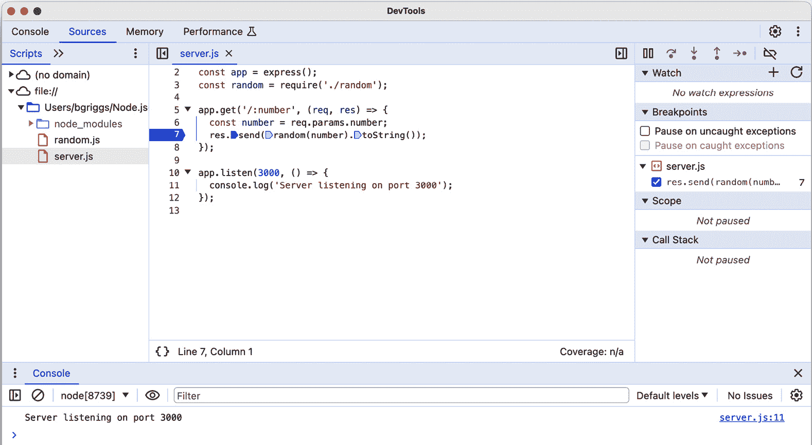

图 12.4 – Chrome DevTools 屏幕截图，显示在 server.js 文件中注册的断点

1.  现在，让我们打开一个新的常规浏览器窗口，并导航到 **http://localhost:3000/10**。请求将会挂起，因为它触发了我们在 *第 7 行* 注册的断点。

1.  返回 Chrome DevTools。你应该注意到界面右上角有一个工具提示，显示为 **暂停在断点**。此外，在界面的右侧，你应该看到一个 **调用堆栈** 窗格，它详细说明了调用帧：

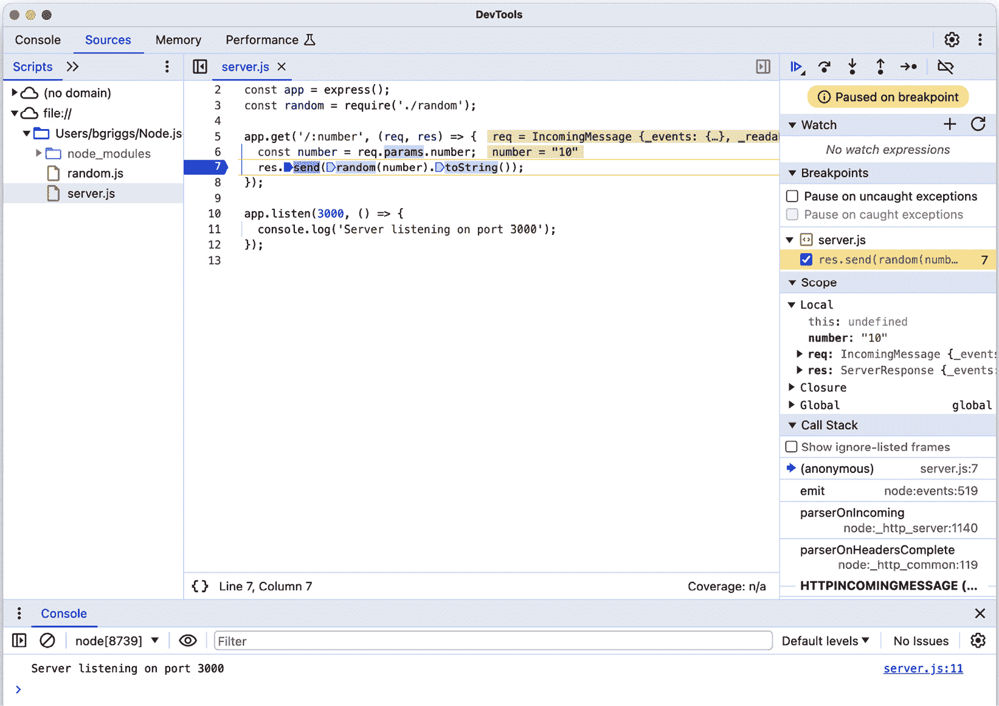

图 12.5 – Chrome DevTools 界面截图，显示在断点处暂停

1.  调试器正在等待我们采取行动。我们可以选择进入或退出下一个指令。让我们进入函数。为此，点击指向圆圈的向下箭头图标（这些图标位于 **暂停在断点** 消息的上方）。当你悬停在每个图标上时，会出现一个工具提示，描述图标的操作。一旦你进入，你会看到我们已经进入了我们的 **random.js** 文件：

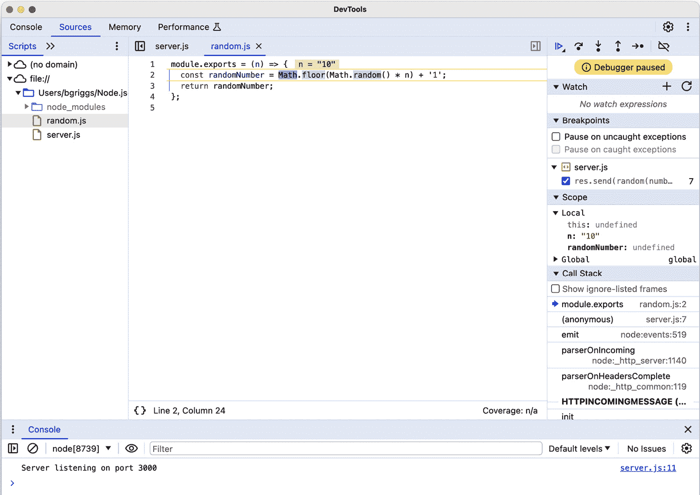

图 12.6 – Chrome DevTools 界面截图，显示 random.js 文件

1.  当我们在 **random.js** 中时，我们可以悬停在值上以检查它们是否是我们预期的。我们可以看到 **n = 10**，正如预期的那样。

1.  跳过函数（通过点击底部有点的半圆形箭头）然后检查 **randomNumber** 的值。在屏幕截图中，生成的随机数是 **11**，大于 **10**。这有助于我们确定错误出在我们上一行的 **randomNumber** 逻辑中。现在我们已经确定了错误的行，更容易定位错误。注意我们添加的是字符串 **'1'** 而不是数字 **1**：

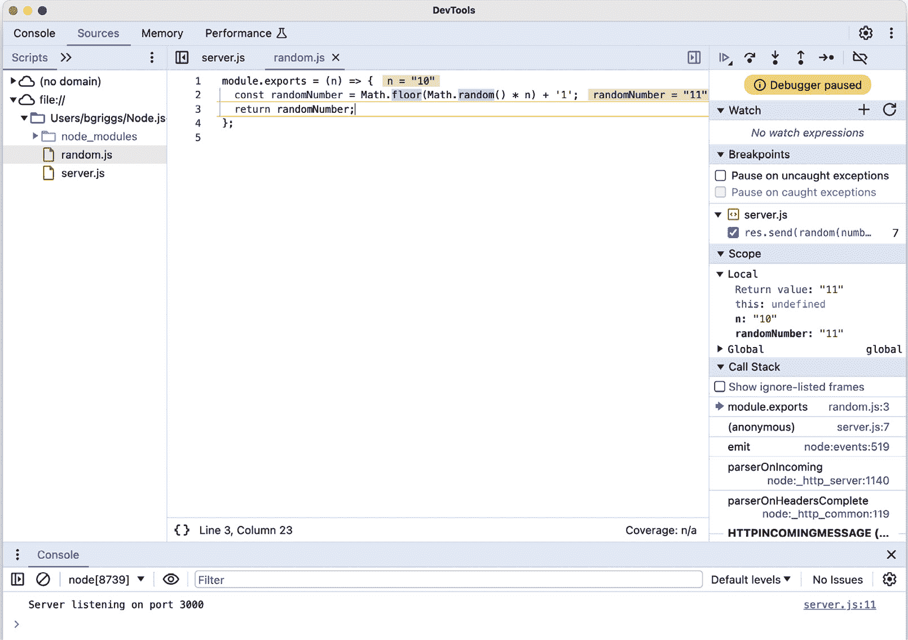

图 12.7 – Chrome DevTools 界面截图，显示悬停时的变量值

我们已经学习了如何使用 Chrome DevTools 暂停和逐行执行代码。我们还了解到我们可以检查变量值。

## 它是如何工作的…

调试 Node.js 应用程序的能力由 V8 JavaScript 引擎提供。当我们向 node 进程传递 **--inspect** 参数时，Node.js 进程开始监听调试客户端。具体来说，是 V8 检查器打开一个接受 WebSocket 连接的端口。WebSocket 连接允许客户端和 V8 检查器进行交互。

在 Chrome DevTools 窗口的顶部，你会看到一个以 **devtools://** 开头的 URI。这是一个由 Google Chrome 浏览器识别的协议，指示 Google Chrome 打开 Chrome DevTools 用户界面。

在配方中，我们在 Chrome DevTools 窗口中设置了一个断点。当遇到注册断点的代码行时，事件循环（JavaScript 线程）将暂停。然后 V8 检查器将通过 WebSocket 连接向客户端发送一条消息。V8 检查器的消息详细说明了程序的位置和状态。客户端可以根据接收到的信息更新其状态。

同样，如果用户选择进入一个函数，将向 V8 检查器发送一个命令，指示它暂时恢复脚本的执行，之后再次暂停。像之前一样，V8 检查器会向客户端发送一条消息，详细说明新的位置和状态。

注意

Node.js 还提供了一个我们可以使用的标志，用于在启动时暂停应用程序。此功能使我们能够在任何代码执行之前设置断点。它还可以在调试应用程序设置阶段发生的错误时提供帮助。此功能可以通过 **--inspect-brk** 标志启用。以下是如何使用 **--inspect-brk** 标志启动 **server.js** 的示例：**$ node --** **inspect-brk server.js** 。

## 更多内容...

Node.js 提供了一个命令行检查器，当没有图形用户界面访问时，这可能非常有用。

### 使用命令行检查器进行调试

我们可以使用基于命令行的调试器，通过以下命令从配方中运行应用程序：

```js
$ node inspect server.js
```

此命令将使我们进入调试模式，并输出 **server.js** 的前三条行：

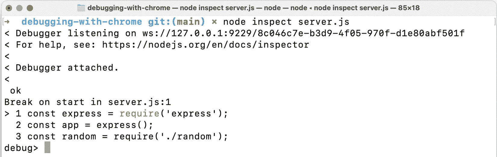

图 12.8 – 显示 Node.js 检查器的终端窗口

当使用 **node inspect** 时，程序将在第一行暂停，以便你可以在任何代码执行之前设置断点和配置调试器。

调试模式提供了一系列命令和函数，我们可以使用它们来逐步调试我们的程序。你可以通过输入 **help** 并按 *Enter* 键来输出这些命令的完整列表。

其中一个功能是 **list()** 函数，它将列出指定数量的后续行。例如，我们可以输入 **list(11)** 来输出我们程序的所有十二行：

```js
debug> list(11)
> 1 const express = require('express');
  2 const app = express();
  3 const random = require('./random');
  4
  5 app.get('/:number', (req, res) => {
  6   const number = req.params.number;
  7   res.send(random(number).toString());
  8 });
  9
10 app.listen(3000, () => {
11   console.log('Server listening on port 3000');
12 });
```

我们可以使用 **setBreakpoint()** 函数设置断点。我们必须向此函数提供我们希望设置断点的行号。此函数也有一个简写：**sb()**。

让我们在第 *7* 行设置一个断点，通过输入 **setBreakpoint(7)** 或 **sb(7)**：

```js
debug> setBreakpoint(7)
  2 const app = express();
  3 const random = require('./random');
  4
  5 app.get('/:number', (req, res) => {
  6   const number = req.params.number;
> 7   res.send(random(number).toString());
  8 });
  9
10 app.listen(3000, () => {
11   console.log('Server listening on port 3000');
12 });
```

箭头 ( **>** ) 表示在第 *7* 行已设置断点。

程序仍然处于暂停状态。我们可以通过输入继续命令，**cont**，来指示进程开始运行。这也有一个简写命令，**c**：

```js
debug> cont
< Server listening on port 3000
<
```

在输入 **cont** 命令后，我们的程序将开始运行。我们的断点位于请求处理函数内部。让我们在新终端窗口中使用 **cURL** 发送一个请求：

```js
$ curl http://localhost:3000/10
```

命令将会挂起，因为它已经触发了位于 **server.js** 第 *7* 行的断点。如果我们回到调试会话，我们会看到调试器已经检测到已达到断点：

```js
break in server.js:7
  5 app.get('/:number', (req, res) => {
  6   const number = req.params.number;
> 7   res.send(random(number).toString());
  8 });
  9
```

现在，要进入函数，我们输入 **step** 命令：

```js
debug> step
break in random.js:2
  1 module.exports = (n) => {
> 2   const randomNumber = Math.floor(Math.random() * n) + '1';
  3   return randomNumber;
  4 };
```

这涉及到 **random.js** 文件。请注意，命令行调试实用程序提供了一个类似于 Chrome DevTools 的接口，只是没有图形用户界面。

我们可以使用 **exec** 命令打印出当前作用域中的引用。输入 **exec n** 来输出 **n** 的值：

```js
debug> exec n
'10'
```

现在，我们可以使用 **next** 命令进入下一行：

```js
debug> next
break in random.js:3
  1 module.exports = (n) => {
  2   const randomNumber = Math.floor(Math.random() * n) + '1';
> 3   return randomNumber;
  4 };
  5
```

我们可以输出 **randomNumber** 的值，这将帮助我们识别错误的逻辑：

```js
debug> exec randomNumber
'71'
```

现在，使用 **out** 命令退出。这将带我们回到 **server.js** 文件，但现在暂停在 **toString()** 方法上：

```js
debug> out
break in server.js:7
  5 app.get('/:number', (req, res) => {
  6   const number = req.params.number;
> 7   res.send(random(number).toString());
  8 });
  9
```

当你在函数中达到断点或暂停执行，并希望跳过函数的其余部分以返回调用者时，你可以使用 **out** 命令。要退出调试器，你可以输入 **.exit** 或输入 *Ctrl* + *C* 两次。

我们现在已经学会了如何使用命令行调试器逐步执行代码并输出引用值。

### TypeScript 的调试

使用 TypeScript，在浏览器中运行的代码是编译后的 JavaScript，这可能会使调试变得困难。源映射通过将编译后的代码映射回你的原始 TypeScript 代码来解决此问题，使你能够更有效地使用 Chrome DevTools 进行调试。

源映射文件是将编译后的 JavaScript 代码映射回原始 TypeScript 代码的文件。这允许你直接在 Chrome DevTools 中调试原始 TypeScript 代码，使得设置断点和理解错误变得更加容易。要在 TypeScript 中启用源映射，你需要在 **tsconfig.json** 文件中启用它们：

```js
  "compilerOptions": {
    "sourceMap": true,
    ...
  }
```

将 **sourceMap** 设置为 **true** 指示 TypeScript 编译器为你的编译后的 JavaScript 文件生成源映射。

一旦您启用了源映射并编译了您的 TypeScript 代码，您就可以使用 Chrome DevTools 来利用它们。启用源映射后，您的原始 TypeScript 文件将列出，您可以直接在 TypeScript 代码中打开这些文件并设置断点。当您遇到断点或错误时，Chrome DevTools 将显示您的原始 TypeScript 代码中的对应行。

## 参见

+   本章中的 *使用 Node.js 进行日志记录* 菜谱

+   本章中的 *启用调试日志* 菜谱

# 使用 Node.js 进行日志记录

**日志记录**是理解应用程序内部工作原理的关键工具。通过在代码中战略性地放置日志语句，您可以在应用程序执行的各个点上获得有关其行为和状态的宝贵见解。这在诊断问题时特别有用，因为日志可以提供对崩溃或失败前发生情况的回顾性视图——帮助您更有效地识别根本原因。

除了故障排除之外，日志记录还有多种用途。例如，您可以使用日志收集和分析有关应用程序使用模式的数据。通过记录对您的 Web 应用程序端点的每次访问，您可以聚合这些日志以确定最常访问的端点。这些信息可以帮助您优化性能，改善用户体验，并就未来的开发优先事项做出明智的决定。

在这个菜谱中，我们将深入探讨使用 **Pino** ([`www.npmjs.com/package/pino`](https://www.npmjs.com/package/pino)) 进行日志记录，这是一个基于 JSON 的高性能日志记录器，既快速又轻量。Pino 特别适合 Node.js 应用程序，提供了一种简化方式来生成易于解析和分析的结构化日志。我们将介绍如何设置 Pino，将其集成到您的应用程序中，并使用它来生成有意义的日志。

## 准备工作

为了演示使用 Pino 进行日志记录，我们将使用 Express.js 创建一个服务器：

1.  首先，创建一个名为 **logging-with-pino** 的新目录，初始化我们的项目，然后安装 **express** 模块：

    ```js
    $ mkdir logging-with-pino
    $ cd logging-with-pino
    $ npm init --yes
    ```

1.  我们将创建一些文件，我们将使用它们来演示一些基本的 Pino 日志记录功能：

    ```js
    $ touch log.js logToFile.js redactLog.js
    ```

我们将探讨如何将 Pino 日志记录添加到我们的 Express.js 服务器中。

## 如何操作…

在这个菜谱中，我们将使用 **logging-with-pino** 模块来演示使用 Pino 进行日志记录：

1.  首先，开始安装 **pino** 模块：

    ```js
    $ npm install pino
    ```

1.  首先，我们将向我们的 **log.js** 文件添加一些基本的日志记录，以演示 Pino 的用法。在 **log.js** 中，首先导入 Pino 并初始化日志记录器：

    ```js
    const pino = require('pino');
    const logger = pino();
    ```

1.  初始化 Pino 后，我们可以开始记录消息。Pino 支持许多不同的日志级别，包括 **info**、**warn**、**error** 和 **debug**。让我们添加这些日志消息中的每一个：

    ```js
    logger.info('This is an info message');
    logger.warn('This is a warning message');
    logger.error('This is an error message');
    logger.debug('This is a debug message');
    ```

1.  在您的终端中运行以下命令：

    ```js
    $ node log.js
    {"level":30,"time":1715650619079,"pid":11107,"hostname":"bgriggs-mac","msg":"This is an info message"}
    {"level":40,"time":1715650619079,"pid":11107,"hostname":"bgriggs-mac","msg":"This is a warning message"}
    {"level":50,"time":1715650619079,"pid":11107,"hostname":"bgriggs-mac","msg":"This is an error message"}
    ```

    注意，我们只看到了四条消息中的三条。这是因为 Pino 的默认日志级别是**info**。这意味着除非您将日志级别更改为**debug**或**更低**，否则使用 debug 记录的消息将不会显示。

1.  让我们调整 Pino 日志记录器的配置。我们将日志级别设置为**debug**，这样我们就可以看到所有消息：

    ```js
    const logger = pino({
      level: 'debug'
    });
    ```

1.  在您的终端中，重新运行**log.js**程序：

    ```js
    $ node log.js
    {"level":30,"time":1715650992560,"pid":11344,"hostname":"bgriggs-mac","msg":"This is an info message"}
    {"level":40,"time":1715650992561,"pid":11344,"hostname":"bgriggs-mac","msg":"This is a warning message"}
    {"level":50,"time":1715650992561,"pid":11344,"hostname":"bgriggs-mac","msg":"This is an error message"}
    {"level":20,"time":1715650992561,"pid":11344,"hostname":"bgriggs-mac","msg":"This is a debug message"}
    ```

1.  让我们使输出看起来更易于阅读。为此，我们可以使用**pino-pretty**：

    ```js
    $ node log.js | npx pino-pretty
    npm WARN exec The following package was not found and will be installed: pino-pretty@11.0.0
    [02:57:10.042] INFO (11785): This is an info message
    [02:57:10.042] WARN (11785): This is a warning message
    [02:57:10.042] ERROR (11785): This is an error message
    [02:57:10.042] DEBUG (11785): This is a debug message
    ```

1.  接下来，让我们学习如何使用 Pino 将日志记录到文件。为此，我们将在**logToFile.js**中工作。将以下内容添加以配置 Pino 使用流将日志写入名为**app.log**的文件。我们还将添加一条消息，以便我们可以看到文件正在被写入：

    ```js
    const fs = require('node:fs');
    const pino = require('pino');
    const stream = fs.createWriteStream('app.log');
    const logger = pino(stream);
    logger.info('This is an info message');
    ```

1.  在您的终端中，运行**logToFile.js**程序，完成后，您应该能够看到已写入文件的消息：

    ```js
    $ node logToFile.js
    $ cat app.log
    {"level":30,"time":1715651351046,"pid":11554,"hostname":"bgriggs-mac","msg":"This is an info message"}
    ```

1.  最后，让我们演示一下 Pino 的日志编辑功能：Pino 允许您从日志中编辑敏感信息，以保护敏感数据。您可以指定要编辑属性的路径。将以下内容添加到**redactLog.js**：

    ```js
    const pino = require('pino');
    const logger = pino({
        redact: ['user.password', 'user.ip']
      });
      logger.info({
        user: {
            name: 'Jane Doe',
            password: 'secret',
            ip: '192.168.1.1'
        }
    }, 'User login');
    ```

1.  运行**redactLog.js**文件。我们期望看到我们指定的密码和 IP 值已被编辑：

    ```js
    $ node redactLog.js
    {"level":30,"time":1715658998631,"pid":4583,"hostname":"Bethanys-MacBook-Pro.local","user":{"name":"Jane Doe","password":"[Redacted]","ip":"[Redacted]"},"msg":"User login"}
    ```

我们现在已经演示了 Pino 日志的一些关键功能。

## 它是如何工作的...

**Pino** 是一个高性能且开销低的 Node.js 日志库，旨在简洁快速，适用于高吞吐量应用程序。它默认以 JSON 格式输出日志，这有助于轻松解析和与日志处理系统兼容。这种结构化格式包括基本细节，如时间戳、日志级别和消息内容。

在配方中，我们开始集成 Pino 模块，这是通过安装并将其导入应用程序中完成的。一旦 Pino 集成，就会实例化一个日志实例。该实例作为所有日志活动进行的中心机制。使用此日志记录器，开发者可以在各种严重级别上生成日志。每个级别都允许日志记录器根据其重要性对消息进行分类，有助于根据严重性快速识别和解决问题。可能的日志级别如下：

+   **致命**

+   **错误**

+   **警告**

+   **信息**

+   **调试**

+   **跟踪**

## 还有更多...

Pino 可以通过中间件集成到各种 Web 框架中，以最小的努力增强日志记录功能。例如，**express-pino-logger**中间件将日志对象添加到 Express.js 应用程序的每个传入请求中。此日志对象可通过请求对象上的**log**属性（**req.log**）访问。每个日志对象在每个请求中都是唯一的，并包含有关请求的数据，包括一个唯一标识符。

以下示例演示了如何将 Pino 集成到 Express.js 应用程序中，以提供 JSON 日志记录：

```js
const express = require('express');
const pino = require('pino');
const expressPino = require('express-pino-logger');
const logger = pino();
const app = express();
app.use(expressPino({ logger }));
app.get('/', (req, res) => {
  req.log.info('Handling request');
  res.send('Hello World');
});
app.listen(3000, () => {
  logger.info('Server is running on port 3000');
});
```

除了 Express.js 之外，Pino 还可以通过 Pino GitHub 组织提供的各种中间件和插件与其他流行的 Web 框架集成：

+   **express-pino-logger**：Express.js 中间件用于 Pino，如前例所示（[`github.com/pinojs/express-pino-logger`](https://github.com/pinojs/express-pino-logger)）

+   **hapi-pino**：一个用于 Pino 的 Hapi 插件（[`github.com/pinojs/hapi-pino`](https://github.com/pinojs/hapi-pino)）

+   **koa-pino**：一个用于 Pino 的 Koa.js 中间件（[`github.com/pinojs/koa-pino-logger`](https://github.com/pinojs/koa-pino-logger)）

+   **restify**：一个用于 Pino 的 Restify 中间件（[`github.com/pinojs/restify-pino-logger`](https://github.com/pinojs/restify-pino-logger)）

此外，Pino 的日志功能已内置到 **Fastify** Web 框架中，只需通过简单的配置启用日志即可：

```js
 const fastify = require('fastify')({
  logger: true,
});
```

## 参见

+   在 *第五章* 的 *消费 Node.js 模块* 菜谱

+   *第六章*

+   本章中的 *启用调试日志* 菜谱

# 启用调试日志

**debug** 是一个流行的库，被许多流行的框架使用，包括 Express.js Web 框架和 Mocha 测试框架。**debug** 是一个基于 Node.js 运行时本身使用的调试技术的 JavaScript 调试实用工具。它提供了一种简单灵活的方式来管理调试日志，允许您动态地启用或禁用调试，而无需更改应用程序代码。通过使用 **debug**，您可以选择性地控制应用程序不同部分的日志记录，使其更容易诊断问题并理解应用程序流程。

在这个菜谱中，我们将了解如何在 Express.js 应用程序上启用调试日志。

## 准备工作

我们将创建一个 Express.js Web 应用程序，我们可以在此上启用调试日志：

1.  创建一个新的目录并初始化我们的项目：

    ```js
    $ mkdir express-debug-app
    $ cd express-debug-app
    $ npm init --yes
    $ npm install express
    ```

1.  现在，我们将创建一个名为 **server.js** 的单个文件：

    ```js
    $ touch server.js
    ```

1.  将以下代码添加到 **server.js**：

    ```js
    const express = require('express');
    const app = express();
    app.get('/', (req, res) => res.send('Hello World!'));
    app.listen(3000, () => {
      console.log('Server listening on port 3000');
    });
    ```

现在我们有了应用程序，我们准备启用调试日志。

## 如何操作…

在这个菜谱中，我们将启用我们的应用程序的调试日志：

1.  要开启调试日志，使用以下命令启动您的服务器：

    ```js
    $ DEBUG=* node server.js
    ```

1.  您应该在终端窗口中看到以下颜色编码的输出：

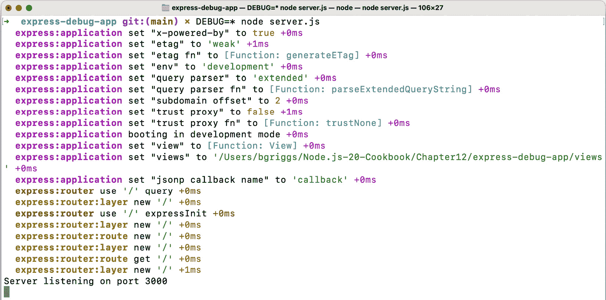

图 12.9 – 显示 Web 服务器调试日志的终端窗口截图

1.  在您的浏览器中导航到 **http://localhost:3000** 发送请求到我们的服务器。您应该看到描述您请求的日志消息已被输出：

    ```js
      express:router dispatching GET / +1s
      express:router query  : / +1ms
      express:router expressInit  : / +0ms
    ```

1.  使用 *Ctrl* + *C* 停止您的服务器。

1.  现在，我们还可以过滤要输出的调试日志。我们将过滤以仅查看 Express.js 路由操作。为此，使用以下命令重新启动您的服务器：

    ```js
    $ DEBUG=express:router* node server.js
    ```

1.  预期在您的终端窗口中看到以下输出。注意，只有 Express.js 路由操作被输出：


图 12.10 – 显示 Web 服务器过滤后的调试日志的终端窗口截图

1.  使用 **debug** 模块对您的代码进行度量是可能的。我们可以通过扩展我们的程序来实现这一点。首先，将配方中使用的 **server.js** 文件复制到一个新文件，并安装 **debug** 模块：

    ```js
    $ cp server.js debug-server.js
    $ npm install debug
    ```

1.  将 **debug-server.js** 修改为以下内容。我们在 *第 3 行* 导入了 **debug** 模块，并在 *第 6 行* 添加了一个 **debug** 调用：

    ```js
    const express = require('express');
    const app = express();
    const debug = require('debug')('my-server');
    app.get('/', (req, res) => {
      debug('HTTP GET request to /');
      res.send('Hello World!');
    });
    app.listen(3000, () => {
      console.log('Server listening on port 3000');
    });
    ```

1.  使用以下命令启动您的应用程序，然后导航到 **http://localhost:3000** 。预期在您的终端窗口中看到我们的 **HTTP GET 请求到 /** 的日志消息：

    ```js
    $ DEBUG=my-server node debug-server.js
    Server listening on port 3000
     my-server HTTP GET request to / +0ms
    ```

    注意，我们的日志消息前面有 **my-server** 。这是我们的日志消息的命名空间，我们在创建调试日志函数时声明了它。

我们现在已经学会了如何在我们的应用程序中启用调试日志。我们还学会了如何过滤日志。

## 它是如何工作的...

我们首先在启动命令中添加 **DEBUG=***。此语法将名为 **DEBUG** 的环境变量传递给我们的 Node.js 进程，我们可以在应用程序内部通过 **process.env.DEBUG** 访问它。

我们将值设置为 ***** ，这启用了所有日志。稍后，我们通过设置 **DEBUG=express:router*** 来过滤日志。内部，**debug** 模块将我们设置的值转换为正则表达式。

Express.js 内部使用 **debug** 模块来对其代码进行度量。

默认的调试配置不适合生产环境日志记录。默认的调试日志旨在可读，因此有颜色编码。在生产环境中，您应该传递给您的进程 **DEBUG_COLORS=no** 值以移除实现颜色编码的 ANSI 代码。这将使输出更容易被机器读取。

## 相关内容

+   *第五章* 的 *消费 Node.js 模块* 配方

+   本章的 *使用 Node.js 进行日志记录* 配方

+   本章的 *启用 Node.js 核心调试日志* 配方

# 启用 Node.js 核心调试日志

当您在应用程序中调试某些问题时，了解 Node.js 的内部结构和它如何处理您的程序执行可能会有所帮助。Node.js 提供了调试日志，我们可以启用它们来帮助我们理解 Node.js 内部正在发生什么。

这些核心调试日志可以通过名为 **NODE_DEBUG** 的环境变量启用。在配方中，我们将设置 **NODE_DEBUG** 环境变量，以便我们可以记录 Node.js 的内部行为。

## 准备工作

我们需要创建一个应用程序，以便我们可以启用 Node.js 核心调试日志：

1.  我们将创建一个简单的基于 Express.js 的服务器，包含一个路由：

    ```js
    $ mkdir core-debug-logs
    $ cd core-debug-logs
    $ npm init --yes
    $ npm install express
    $ touch server.js
    ```

1.  在 **server.js** 中添加以下内容：

    ```js
    const express = require('express');
    const app = express();
    app.get('/', (req, res) => {
      res.send('Hello World!');
    });
    app.listen(3000, () => {
      console.log('Server listening on port 3000');
      setInterval(() => {
        console.log('Server listening...');
      }, 3000);
    });
    ```

现在我们有一个准备好的应用程序，我们可以启用核心调试日志，以便我们能够看到 Node.js 运行时级别发生的事情。

## 如何做到这一点...

在这个配方中，我们将启用应用程序的 Node.js 核心调试日志：

1.  我们只需要将 **NODE_DEBUG** 变量设置为我们要记录的内部标志。内部标志与 Node.js 的特定子系统相对应，例如定时器或 HTTP。要启用“定时器”核心调试日志，使用以下命令启动你的服务器：

    ```js
    $ NODE_DEBUG=timer node server.js
    ```

1.  观察程序输出的额外日志。我们可以看到关于我们每 3,000 毫秒执行一次的 **setInterval()** 函数的额外信息：

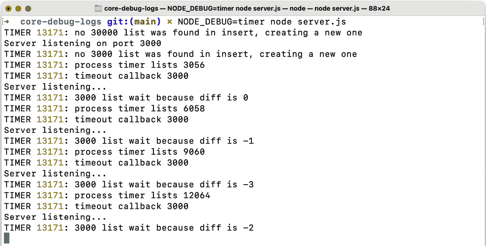

图 12.11 – 显示 Node.js 核心定时器调试信息的终端窗口截图

前面的 **TIMER** 日志语句是从 Node.js 核心定时器的内部实现中派生出的额外调试信息，可以在[`github.com/nodejs/node/blob/master/lib/internal/timers.js`](https://github.com/nodejs/node/blob/master/lib/internal/timers.js) 找到。

1.  我们现在将启用 **http** 模块的内核调试日志。使用以下命令重新启动你的服务器：

    ```js
    $ NODE_DEBUG=http node server.js
    ```

1.  在浏览器中导航到 **http://localhost:3000**。你应该会看到关于你的 HTTP 请求输出的内部日志：

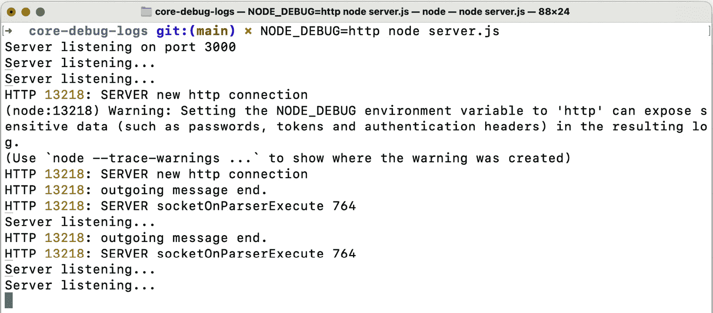

图 12.12 – 显示 Node.js 核心 HTTP 调试信息的终端窗口截图

我们现在已经学会了如何使用 **NODE_DEBUG** 环境变量来启用 Node.js 内部的日志记录。

## 它是如何工作的...

在配方中，我们将 **NODE_DEBUG** 环境变量设置为 **timer** 和 **http** 子系统。**NODE_DEBUG** 环境变量可以设置为以下 Node.js 子系统：

+   **child_process**

+   **cluster**

+   **esm**

+   **fs**

+   **http**

+   **https**

+   **http2**

+   **module**

+   **net**

+   **repl**

+   **source_map**

+   **stream**

+   **test_runner**

+   **timer**

+   **tls**

+   **worker**

也可以通过 **NODE_DEBUG** 环境变量启用多个子系统的调试日志。要启用多个子系统日志，可以将它们作为逗号分隔的列表传递。例如，要同时启用 **http** 和 **timer** 子系统，你需要提供以下命令：

```js
$ NODE_DEBUG=http,timer node server.js
```

每个日志消息的输出包括子系统/命名空间，然后是 **进程标识符**（ **PID** ），然后是日志消息。

在这个配方中，我们首先启用了“定时器”核心调试日志。在我们的程序中，我们有一个 **setInterval()** 函数，它每 3,000 毫秒将 **Server listening...** 消息打印到 **stdout**。内核调试日志提供了关于我们内部创建间隔定时器的见解。

类似地，当我们启用了 **http** 核心模块调试日志时，我们可以跟踪 HTTP 请求期间内部发生的情况。**http** 调试日志在描述服务器接收和响应 HTTP 请求时发生的动作方面相当直观且易于阅读。

扩展 NODE_DEBUG

可以使用 Node.js 核心模块的 **util.debuglog()** 方法来记录您自己的调试日志，您可以通过 **NODE_DEBUG** 环境变量来启用这些日志。然而，这通常不推荐。更可取的是使用本章中介绍的第三方 **debug** 模块。**debug** 模块提供了额外的日志功能，包括时间戳和彩色编码，而开销最小。

## 参见

+   本章的 *使用 Chrome DevTools 调试 Node.js* 配方

+   本章的 *使用 Node.js 记录日志* 配方

+   本章的 *启用调试日志* 配方

# 增加堆栈跟踪大小

**堆栈跟踪**，有时也称为 **堆栈回溯**，定义为堆栈帧的列表。当您的 Node.js 进程遇到错误时，会显示堆栈跟踪，详细说明遇到错误的函数以及调用它的函数。默认情况下，Node.js 的 V8 引擎将返回 10 个堆栈帧。

在调试某些错误时，拥有超过 10 个堆栈帧可能很有用。然而，存储堆栈帧数量的增加可能会带来性能成本。跟踪额外的堆栈帧会导致我们的应用程序消耗更多的内存。有关更多详细信息，您可以参考此链接：[`v8.dev/docs/stack-trace-api`](https://v8.dev/docs/stack-trace-api)。

在这个配方中，我们将增加堆栈跟踪的大小。

## 准备工作

1.  首先，我们应该为我们的应用程序创建一个目录。我们将使用 **express** 模块来编写程序，因此我们还需要初始化我们的项目目录：

    ```js
    $ mkdir stack-trace-app
    $ cd stack-trace-app
    $ npm init --yes
    $ npm install express
    ```

1.  我们需要为这个配方准备几个文件：

    ```js
    $ touch server.js routes.js
    ```

1.  将以下内容添加到 **server.js**：

    ```js
    const express = require('express');
    const routes = require('./routes');
    const app = express();
    app.use(routes);
    app.listen(3000, () => {
      console.log('Server listening on port 3000');
    });
    ```

1.  然后，将以下内容添加到 **routes.js**：

    ```js
    const express = require('express');
    const router = new express.Router();
    router.get('/', (req, res) => {
      res.send(recursiveContent());
    });
    function recursiveContent (content, i = 10) {
      --i;
      if (i !== 0) {
        return recursiveContent(content, i);
      } else {
        return content.undefined_property;
      }
    }
    module.exports = router;
    ```

**recursiveContent()** 函数的目的是强制创建函数调用，但在更大、更复杂的应用程序中，自然可能超过堆栈帧限制。

现在我们有一个将超过默认调用栈限制的应用程序，我们可以继续到配方步骤。

## 如何做到这一点…

在这个配方中，我们将学习如何使用 **--stack-trace-limit** 进程标志启用额外的堆栈帧：

1.  首先，运行服务器：

    ```js
    $ node server.js
    Server listening on port 3000
    ```

1.  现在，在浏览器中，导航到 **http://localhost:3000**。或者，您也可以使用 **cURL** 向端点发送请求。

1.  注意我们看到了以下堆栈跟踪输出：

    ```js
    TypeError: Cannot read properties of undefined (reading 'undefined_property')
        at recursiveContent (/Users/bgriggs/Node.js-Cookbook/Chapter12/stack-trace-app/routes.js:13:20)
        at recursiveContent (/Users/bgriggs/Node.js-Cookbook/Chapter12/stack-trace-app/routes.js:11:12)
        at recursiveContent (/Users/bgriggs/Node.js-Cookbook/Chapter12/stack-trace-app/routes.js:11:12)
        at recursiveContent (/Users/bgriggs/Node.js-Cookbook/Chapter12/stack-trace-app/routes.js:11:12)
        at recursiveContent (/Users/bgriggs/Node.js-Cookbook/Chapter12/stack-trace-app/routes.js:11:12)
        at recursiveContent (/Users/bgriggs/Node.js-Cookbook/Chapter12/stack-trace-app/routes.js:11:12)
        at recursiveContent (/Users/bgriggs/Node.js-Cookbook/Chapter12/stack-trace-app/routes.js:11:12)
        at recursiveContent (/Users/bgriggs/Node.js-Cookbook/Chapter12/stack-trace-app/routes.js:11:12)
        at recursiveContent (/Users/bgriggs/Node.js-Cookbook/Chapter12/stack-trace-app/routes.js:11:12)
        at recursiveContent (/Users/bgriggs/Node.js-Cookbook/Chapter12/stack-trace-app/routes.js:11:12)
    ```

1.  我们现在可以使用 **--stack-trace-limit** 标志重新启动我们的应用程序。我们将将其设置为 **20**：

    ```js
    $ node --stack-trace-limit=20 server.js
    Server listening on port 3000
    ```

1.  现在，再次导航或发送请求到 **http://localhost:3000**。观察我们现在有更多的堆栈跟踪帧：

    ```js
    ...
        at recursiveContent (/Users/bgriggs/Node.js-Cookbook/Chapter12/stack-trace-app/routes.js:11:12)
        at /Users/bgriggs/Node.js-Cookbook/Chapter12/stack-trace-app/routes.js:5:12
        at Layer.handle [as handle_request] (/Users/bgriggs/Node.js-Cookbook/Chapter12/stack-trace-app/node_modules/express/lib/router/layer.js:95:5)
        at next (/Users/bgriggs/Node.js-Cookbook/Chapter12/stack-trace-app/node_modules/express/lib/router/route.js:149:13)
        at Route.dispatch (/Users/bgriggs/Node.js-Cookbook/Chapter12/stack-trace-app/node_modules/express/lib/router/route.js:119:3)
        at Layer.handle [as handle_request] (/Users/bgriggs/Node.js-Cookbook/Chapter12/stack-trace-app/node_modules/express/lib/router/layer.js:95:5)
        at /Users/bgriggs/Node.js-Cookbook/Chapter12/stack-trace-app/node_modules/express/lib/router/index.js:284:15
        at Function.process_params (/Users/bgriggs/Node.js-Cookbook/Chapter12/stack-trace-app/node_modules/express/lib/router/index.js:346:12)
        at next (/Users/bgriggs/Node.js-Cookbook/Chapter12/stack-trace-app/node_modules/express/lib/router/index.js:280:10)
        at Function.handle (/Users/bgriggs/Node.js-Cookbook/Chapter12/stack-trace-app/node_modules/express/lib/router/index.js:175:3)
        at router (/Users/bgriggs/Node.js-Cookbook/Chapter12/stack-trace-app/node_modules/express/lib/router/index.js:47:12)
    ```

1.  通过扩展返回的堆栈帧数量，我们可以看到 **recursiveContent()** 函数在 **routes.js** 中的 *第 5 行* 被调用。这有助于我们意识到程序失败的原因是因为我们没有定义内容并将其传递给我们的 **recursiveContent()** 函数。

我们已经学习了如何返回额外的堆栈跟踪，以及这些如何帮助我们调试我们的应用程序。

## 它是如何工作的…

在配方中，我们使用了 **--stack-trace-limit** 标志。此标志指示 V8 JavaScript 引擎保留更多堆栈。当发生错误时，堆栈跟踪将显示使用标志设置的限制之前的函数调用。在配方中，我们将此扩展到 20 个堆栈帧。

注意，您也可以在应用程序代码中设置此限制。以下行将堆栈跟踪限制设置为 **20** :

```js
Error.stackTraceLimit = 20;
```

还可以将堆栈跟踪限制设置为 **Infinity** ，这意味着将保留所有之前的函数调用：

```js
Error.stackTraceLimit = Infinity
```

存储额外的堆栈跟踪会带来 CPU 和内存使用方面的性能成本。您应考虑这可能对您的应用程序产生的影响。

## 还有更多…

异步堆栈跟踪是通过 V8 JavaScript 引擎更新添加到 Node.js 12 的；这些可以帮助我们调试我们的异步函数。

异步堆栈跟踪帮助我们调试程序中的异步函数。让我们看看一个异步堆栈跟踪的例子：

1.  创建一个名为 **async-stack-trace.js** 的文件：

    ```js
    $ touch async-stack-trace.js
    ```

1.  将以下内容添加到 **async-stack-trace.js** :

    ```js
    foo().then(
      () => console.log('success'),
      (error) => console.error(error.stack)
    );
    async function foo () {
      await bar();
    }
    async function bar () {
      await Promise.resolve();
      throw new Error('Fail');
    }
    ```

    该程序包含一个异步函数 **foo()** ，它等待一个名为 **bar()** 的函数。**bar()** 函数自动解析 **Promise** 并抛出错误。

1.  在 Node.js 12 之前的 Node.js 版本中，程序将返回以下堆栈跟踪：

    ```js
    $ node async-stack-trace.js
    Error: Fail
        at bar (/Users/bgriggs/Node.js-Cookbook/Chapter12/stack-trace-app/async-stack-trace.js:15:9)
        at process.runNextTicks [as _tickCallback] (internal/process/task_queues.js:52:5)
        at Function.Module.runMain (internal/modules/cjs/loader.js:880:11)
        at internal/main/run_main_module.js:21:11
    (internal/bootstrap/node.js:623:3)
    ```

    注意，跟踪只是告诉我们错误发生在 **bar()** 函数中，随后是一些内部函数调用，例如 **process._tickCallback()** 。在 Node.js 12 之前，堆栈跟踪无法有效地报告异步函数调用。请注意，堆栈帧没有显示 **bar()** 函数是由 **foo()** 调用的。

1.  然而，多亏了更新的 V8 引擎，Node.js 12 及更高版本允许异步堆栈跟踪。现在，当我们用 Node.js 22 运行相同的程序时，我们将得到以下堆栈输出：

    ```js
    $ node async-stack-trace.js
    Error: Fail
        at bar (/Users/bgriggs/Node.js-Cookbook/Chapter12/stack-trace-app/async-stack-trace.js:15:9)
        at async foo (/Users/bgriggs/Node.js-Cookbook/Chapter12/stack-trace-app/async-stack-trace.js:9:3)
    ```

在 Node.js 的新版本中，堆栈跟踪可以显示 **bar()** 函数是由一个名为 **foo()** 的异步函数调用的。

## 参见

+   本章的 *使用 Node.js 记录日志* 配方

+   本章的 *启用 Node.js 核心调试日志* 配方

+   本章的 *创建诊断报告* 配方

# 创建诊断报告

自 Node.js v11.8.0 版本以来，诊断报告工具一直隐藏在进程标志之后。诊断报告工具允许您在需要时或当某些事件发生时生成包含诊断数据的报告。可能生成报告的情况包括当您的应用程序崩溃，或者当您的应用程序出现性能缓慢或 CPU 使用率高时。

诊断报告与 Java Core 文件具有类似的作用。诊断报告包含有助于诊断应用程序问题的数据和信息。报告的信息包括 Node.js 版本、触发报告的事件、堆栈跟踪等。

从历史上看，诊断报告工具作为一个名为 **node-report** 的 **npm** 模块提供。但是，为了提高采用率并增强核心诊断功能，它已被合并到 Node.js 核心中。

在这个菜谱中，我们将学习如何启用和配置诊断报告工具，并在我们的应用程序中发生未捕获异常时生成报告。

## 准备工作

要开始，我们需要准备我们的目录和一些文件。

1.  首先，让我们创建一个名为 **diagnostic-report** 的目录：

    ```js
    $ mkdir diagnostic-report
    $ cd diagnostic-report
    ```

1.  现在，让我们创建一个名为 **server.js** 的文件来保存我们的服务器：

    ```js
    $ touch server.js
    ```

1.  让我们再创建一个目录来存储报告：

    ```js
    $ mkdir reports
    ```

现在，我们已经准备好进入菜谱步骤。

## 如何操作...

在这个菜谱中，我们将使用诊断报告工具创建关于未处理错误的报告。我们将为报告设置自定义的目录和文件名。我们还将检查生成的报告以获取有关未处理错误的信息：

1.  首先，让我们将我们需要用于菜谱的核心 Node.js 模块导入到 **server.js** :

    ```js
    const http = require('node:http');
    const path = require('node:path');
    ```

1.  现在，让我们设置我们的诊断报告要捕获的目录：

    ```js
    process.report.directory = path.join(__dirname, 'reports');
    process.report.filename = 'my-diagnostic-report.json';
    ```

1.  现在，我们将向一个网络服务器发送请求，但我们将故意指定一个无效的协议。将以下行添加到 **server.js** :

    ```js
    http.get('hello://localhost:3000', (response) => {});
    ```

1.  现在，如果我们运行应用程序，我们应该期望看到以下未捕获的 **ERR_INVALID_PROTOCOL** 错误：

    ```js
    $ node server.js
    node:_http_client:183
        throw new ERR_INVALID_PROTOCOL(protocol, expectedProtocol);
        ^
    TypeError [ERR_INVALID_PROTOCOL]: Protocol "hello:" not supported. Expected "http:"
        at new ClientRequest (node:_http_client:183:11)
        at request (node:http:103:10)
        at Object.get (node:http:114:15)
        at Object.<anonymous> (/Users/bgriggs/Node.js-Cookbook/Chapter12/diagnostic-report/server.js:7:6)
        at Module._compile (node:internal/modules/cjs/loader:1358:14)
        at Module._extensions..js (node:internal/modules/cjs/loader:1416:10)
        at Module.load (node:internal/modules/cjs/loader:1208:32)
        at Module._load (node:internal/modules/cjs/loader:1024:12)
        at Function.executeUserEntryPoint [as runMain] (node:internal/modules/run_main:174:12)
        at node:internal/main/run_main_module:28:49 {
      code: 'ERR_INVALID_PROTOCOL'
    }
    Node.js v22.9.0
    ```

1.  要启用诊断报告功能，我们需要使用 **--report-uncaught-exception** 标志启动 Node.js 进程。期望在输出中看到以下片段，显示已创建报告：

    ```js
    $ node --report-uncaught-exception server.js
    ...
    Writing Node.js report to file: my-diagnostic-report.json
    Node.js report completed
    Node.js v22.9.0
    ```

1.  现在，我们可以查看报告。它应该已经在 **reports** 目录中创建，名称为 **my-diagnostic-report.json** 。在您的编辑器中打开该文件。

1.  在文件顶部识别 **event** 和 **trigger** 属性，并观察它提供了有关触发错误的事件的详细信息：

    ```js
        "event": "Exception",
        "trigger": "Exception",
    ```

1.  在文件更下方，识别 **javascriptStack** 属性。它应该提供错误的堆栈跟踪：

    ```js
    "javascriptStack": {
        "message": "TypeError [ERR_INVALID_PROTOCOL]: Protocol \"hello:\" not supported. Expected \"http:\"",
        "stack": [
          "at new ClientRequest (node:_http_client:183:11)",
          "at request (node:http:103:10)",
          "at Object.get (node:http:114:15)",
          "at Object.<anonymous> (/Users/bgriggs/Node.js-Cookbook/Chapter12/diagnostic-report/server.js:7:6)",
          "at Module._compile (node:internal/modules/cjs/loader:1358:14)",
          "at Module._extensions..js (node:internal/modules/cjs/loader:1416:10)",
          "at Module.load (node:internal/modules/cjs/loader:1208:32)",
          "at Module._load (node:internal/modules/cjs/loader:1024:12)",
          "at Function.executeUserEntryPoint [as runMain] (node:internal/modules/run_main:174:12)"
        ],
        "errorProperties": {
          "code": "ERR_INVALID_PROTOCOL"
        }
      }
    ```

现在，我们已经学会了如何在未捕获的异常上启用诊断报告工具，以及如何检查报告以获取诊断信息。

## 它是如何工作的...

诊断报告实用程序可以在某些条件下将诊断摘要写入文件。该实用程序内置在 Node.js 核心中，可以通过向 Node.js 进程传递以下命令行标志之一来启用：

+   **--report-uncaught-exception**：如食谱中所述，它会在未捕获的异常上触发崩溃。

+   **--report-on-signal**：这用于配置在哪个信号上触发报告，例如 **SIGUSR1**、**SIGUSR2**、**SIGINT** 或 **SIGTERM**。默认为 **SIGUSR2**。

+   **--report-on-fatalerror**：在致命错误（如内存不足错误）上触发报告。

注意，你也可以使用以下行在你的应用程序内部触发报告的生成：

```js
process.report.writeReport();
```

在这个食谱中，我们首先通过在程序中分配 **process.report.directory** 和 **process.report.filename** 变量来设置一个自定义目录。这些也可以通过 **--report-directory** 和 **--report-filename** 命令行参数来设置。请注意，你可能希望将时间戳附加到文件名上——否则，报告可能会被覆盖。

目录和文件名都不是必需设置的。当省略目录时，报告将在我们从其中启动 Node.js 进程的目录中生成。当省略指定的文件名时，实用程序将默认创建一个具有以下命名约定的文件：**report.20181126.091102.8480.0.001.json**。

## 参见

+   本章中的 *启用 Node.js 核心调试日志* 食谱

+   本章中的 *增加堆栈跟踪输出* 食谱
