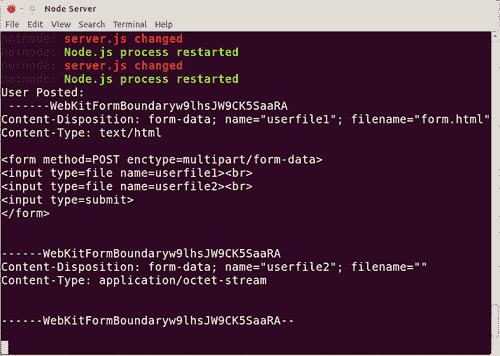

# 第二章：探索 HTTP 对象

在本章中，我们将涵盖：

+   处理 POST 数据

+   处理文件上传

+   使用 Node 作为 HTTP 客户端

+   实现下载节流

# 介绍

在上一章中，我们使用`http`模块创建了一个 Web 服务器。现在我们将探讨一些与简单地从服务器向客户端推送内容之外的一些相关用例。前三个示例将探讨如何通过客户端发起的 HTTP POST（和 PUT）请求接收数据，最后一个示例将演示如何对出站数据流进行节流。

# 处理 POST 数据

如果我们想要接收 POST 数据，我们必须指示服务器如何接受和处理 POST 请求。在 PHP 中，我们可以无缝访问我们的 POST 值`$_POST['fieldname']`，因为它会阻塞，直到数组值被填充。相比之下，Node 提供了与 HTTP 数据流的低级交互，允许我们与传入的消息体接口，完全由开发人员将该流转换为可用数据。

## 准备工作

让我们创建一个准备好我们的代码的`server.js`文件，以及一个名为`form.html`的 HTML 文件，其中包含以下代码：

```js
<form method=post>
  <input type=text name=userinput1><br>
  <input type=text name=userinput2><br>
  <input type=submit>
</form>

```

### 提示

对于我们的目的，我们将把`form.html`放在与`server.js`相同的文件夹中，尽管这通常不是推荐的做法。通常，我们应该将我们的公共代码放在与服务器代码不同的文件夹中。

## 如何做...

我们将为我们的服务器提供 GET 和 POST 请求。让我们从 GET 开始，通过要求`http`模块并通过`createServer`加载`form.html`进行服务：

```js
var http = require('http');
var form = require('fs').readFileSync('form.html');
http.createServer(function (request, response) {
  if (request.method === "GET") {
    response.writeHead(200, {'Content-Type': 'text/html'});
    response.end(form);
  }
}).listen(8080);

```

我们在初始化时同步加载`form.html`，而不是在每个请求上访问磁盘。如果我们导航到`localhost:8080`，我们将看到一个表单。但是，如果我们填写我们的表单，什么也不会发生，因为我们需要处理 POST 请求：

```js
  if (request.method === "POST") {
  	var postData = '';
request.on('data', function (chunk) {
    		postData += chunk;
 	}).on('end', function() {
 	   console.log('User Posted:\n' + postData);
  	   response.end('You Posted:\n' + postData);
});
  }

```

一旦表单完成并提交，浏览器和控制台将输出从客户端发送的原始查询字符串。将`postData`转换为对象提供了一种与提交的信息进行交互和操作的简单方法。`querystring`模块有一个`parse`方法，可以将查询字符串转换为对象，由于表单提交以查询字符串格式到达，我们可以使用它将我们的数据转换为对象，如下所示：

```js
var http = require('http');
var querystring = require('querystring');
var util = require('util');
var form = require('fs').readFileSync('form.html');

http.createServer(function (request, response) {
  if (request.method === "POST") {
    var postData = '';
    request.on('data', function (chunk) {
      postData += chunk;
    }).on('end', function () {
      var postDataObject = querystring.parse(postData);
      console.log('User Posted:\n', postData);
      response.end('You Posted:\n' + util.inspect(postDataObject));
    });

  }
  if (request.method === "GET") {
    response.writeHead(200, {'Content-Type': 'text/html'});
    response.end(form);
  }
}).listen(8080);

```

注意`util`模块。我们需要它来使用其`inspect`方法，以简单地将我们的`postDataObject`输出到浏览器。

最后，我们将保护我们的服务器免受内存超载攻击。

### 提示

**保护 POST 服务器**

V8（因此 Node）具有基于处理器架构和操作系统约束的虚拟内存限制。这些限制远远超出了大多数用例的需求。然而，如果我们不限制我们的 POST 服务器将接受的数据量，我们可能会使自己暴露于一种拒绝服务攻击。如果没有保护，一个非常大的 POST 请求可能会导致我们的服务器显著减速甚至崩溃。

为了实现这一点，我们将为最大可接受的数据大小设置一个变量，并将其与我们的`postData`变量不断增长的长度进行比较。

```js
var http = require('http');
var querystring = require('querystring');
var util = require('util');
var form = require('fs').readFileSync('form.html');
var maxData = 2 * 1024 * 1024; //2mb
http.createServer(function (request, response) {
  if (request.method === "POST") {
    var postData = '';
    request.on('data', function (chunk) {
      postData += chunk;
      if (postData.length > maxData) {
        postData = '';
        this.pause();
        response.writeHead(413); // Request Entity Too Large
        response.end('Too large');
      }
    }).on('end', function () {
      if (!postData) { response.end(); return; } //prevents empty post requests from crashing the server
      var postDataObject = querystring.parse(postData);

      console.log('User Posted:\n', postData);

      response.end('You Posted:\n' + util.inspect(postDataObject));

    });
//rest of our code....

```

## 它是如何工作的...

一旦我们知道服务器已经发出了 POST 请求（通过检查`request.method`），我们通过`request`对象上的`data`事件监听器将我们的传入数据聚合到我们的`postData`变量中。但是，如果我们发现提交的数据超过了我们的`maxData`限制，我们将清除我们的`postData`变量，并`pause`传入流，阻止客户端进一步传入数据。使用`stream.destroy`而不是`stream.pause`似乎会干扰我们的响应机制。一旦流暂停了一段时间，它就会被 v8 的垃圾收集器自动从内存中删除。

然后我们发送一个`413 Request Entity Too Large`的 HTTP 头。在`end`事件监听器中，只要`postData`没有因超过`maxData`（或者一开始就不是空的）而被清除，我们就使用`querystring.parse`将我们的 POST 消息体转换成一个对象。从这一点开始，我们可以执行任意数量的有趣活动：操作、分析、传递到数据库等等。然而，对于这个例子，我们只是将`postDataObject`输出到浏览器，将`postData`输出到控制台。

## 还有更多...

如果我们希望我们的代码看起来更加优雅，而且我们不太关心处理 POST 数据流，我们可以使用一个用户自定义（非核心）模块来为我们的语法增添一些便利。

### 使用 connect.bodyParser 访问 POST 数据

Connect 是 Node 的一个出色的中间件框架，提供了一个方法框架，为常见的服务器任务提供了更高级别的抽象。Connect 实际上是 Express Web 框架的基础，将在第六章中讨论，*使用 Express 加速开发*

Connect 捆绑的一个中间件是`bodyParser`。通过将`connect.bodyParser`链接到普通的回调函数，我们突然可以通过`request.body`访问 POST 数据（当数据通过 POST 请求发送时，它被保存在消息体中）。结果，`request.body`与我们在配方中生成的`postDataObject`完全相同。

首先，让我们确保已安装 Connect：

```js
npm install connect 

```

我们需要使用`connect`来代替`http`，因为它为我们提供了`createServer`的功能。要访问`createServer`方法，我们可以使用`connect.createServer`，或者简写版本，即`connect`。Connect 允许我们通过将它们作为参数传递给`createServer`方法来将多个中间件组合在一起。以下是如何使用 Connect 实现类似的行为，就像在配方中一样：

```js
var connect = require('connect');
var util = require('util');
var form = require('fs').readFileSync('form.html');
connect(connect.limit('64kb'), connect.bodyParser(),
  function (request, response) {
    if (request.method === "POST") {
      console.log('User Posted:\n', request.body);
      response.end('You Posted:\n' + util.inspect(request.body));
    }
    if (request.method === "GET") {
      response.writeHead(200, {'Content-Type': 'text/html'});
      response.end(form);
    }
  }).listen(8080);

```

请注意，我们不再直接使用`http`模块。我们将`connect.limit`作为第一个参数传递，以实现主要示例中实现的相同的`maxData`限制。

接下来，我们传入`bodyParser`，允许`connect`为我们检索 POST 数据，将数据对象化为`request.body`。最后，有我们的回调函数，除了用于将我们的数据对象（现在是`request.body`）回显到控制台和浏览器的代码之外，我们剥离了所有以前的 POST 功能。这是我们与原始配方略有不同的地方。

在配方中，我们将原始的`postData`返回到控制台，而在这里我们返回`request.body`对象。要使用 Connect 输出原始数据，要么需要无意义地拆解我们的对象以重新组装原始查询字符串，要么需要扩展`bodyParser`函数。这就是使用第三方模块的权衡之处：我们只能轻松地与模块作者期望我们交互的信息进行交互。

让我们来看一下内部情况。如果我们启动一个没有任何参数的`node`实例，我们可以访问 REPL（Read-Eval-Print-Loop），这是 Node 的命令行环境。在 REPL 中，我们可以写：

```js
console.log(require('connect').bodyParser.toString()); 

```

如果我们查看输出，我们会看到它的`connect.bodyParser`函数代码，并且应该能够轻松地从`connect.bodyParser`代码中识别出我们的配方中的基本元素。

## 参见

+   *处理文件上传*在本章中讨论

+   *通过 AJAX 进行浏览器-服务器传输*在第三章中讨论，*数据序列化处理*

+   *初始化和使用会话*在第六章中讨论，*使用 Express 加速开发*

# 处理文件上传

我们无法像处理其他 POST 数据那样处理上传的文件。当文件输入以表单形式提交时，浏览器会将文件处理成**多部分消息**。

多部分最初是作为一种电子邮件格式开发的，允许将多个混合内容组合成一条消息。如果我们直觉地尝试接收上传作为流并将其写入文件，我们将得到一个充满多部分数据而不是文件本身的文件。我们需要一个多部分解析器，其编写超出了一篇食谱的范围。因此，我们将使用众所周知且经过考验的`formidable`模块将我们的上传数据转换为文件。

## 准备工作

让我们为存储上传文件创建一个新的`uploads`目录，并准备修改我们上一个食谱中的`server.js`文件。

我们还需要安装`formidable`，如下所示：

```js
npm install formidable@1.x.x 

```

最后，我们将对上一个食谱中的`form.html`进行一些更改：

```js
<form method=POST enctype=multipart/form-data>
  <input type=file name=userfile1><br>
  <input type=file name=userfile2><br>
  <input type=submit>
</form>

```

我们已经包含了一个`enctype`属性为`multipart/form-data`，以向浏览器表示表单将包含上传数据，并用文件输入替换了文本输入。

## 操作步骤...

让我们看看当我们使用修改后的表单从上一个食谱中上传文件到服务器时会发生什么。让我们上传`form.html`本身作为我们的文件：



我们的 POST 服务器只是将原始的 HTTP 消息主体记录到控制台中，这种情况下是多部分数据。我们在表单上有两个文件输入。虽然我们只上传了一个文件，但第二个输入仍然包含在多部分请求中。每个文件都由`Content-Type`HTTP 头的次要属性中设置的预定义边界分隔。我们需要使用`formidable`来解析这些数据，提取其中包含的每个文件。

```js
var http = require('http');
var formidable = require('formidable');
var form = require('fs').readFileSync('form.html');

http.createServer(function (request, response) {
  if (request.method === "POST") {
    var incoming = new formidable.IncomingForm();
    incoming.uploadDir = 'uploads';
    incoming.on('file', function (field, file) {
      if (!file.size) { return; }
      response.write(file.name + ' received\n');
    }).on('end', function () {
      response.end('All files received');
    });
    incoming.parse(request);
  }
  if (request.method === "GET") {
    response.writeHead(200, {'Content-Type': 'text/html'});
    response.end(form);
  }
}).listen(8080);

```

我们的 POST 服务器现在已经成为一个上传服务器。

## 它是如何工作的...

我们创建一个`formidable IncomingForm`类的新实例，并告诉它在哪里上传文件。为了向用户提供反馈，我们可以监听我们的`incoming`实例。`IncomingForm`类会发出自己的高级事件，因此我们不是监听`request`对象的事件并在数据到来时处理数据，而是等待`formidable`解析多部分消息中的文件，然后通过其自定义的`file`事件通知我们。

`file`事件回调为我们提供了两个参数：`field`和`file`。`file`参数是一个包含有关上传文件信息的对象。我们使用这个来过滤空文件（通常是由空输入字段引起的），并获取文件名，然后向用户显示确认。当`formidable`完成解析多部分消息时，它会发送一个`end`事件，我们在其中结束响应。

## 还有更多...

我们可以从浏览器中发布不仅仅是简单的表单字段和值。让我们来看看如何从浏览器传输文件到服务器。

### 使用 formidable 接受所有 POST 数据

`formidable`不仅处理上传的文件，还会处理一般的 POST 数据。我们只需要为`field`事件添加一个监听器，以处理同时包含文件和用户数据的表单。

```js
 incoming.on('file', function (field, file) {
      response.write(file.name + ' received\n');
    })
    .on('field', function (field, value) {
      response.write(field + ' : ' + value + '\n');
    })
    .on('end', function () {
      response.end('All files received');
    });

```

无需手动实现字段数据大小限制，因为`formidable`会为我们处理这些。但是，我们可以使用`incoming.maxFieldsSize`更改默认设置，这允许我们限制所有字段的总字节数。这个限制不适用于文件上传。

### 使用 formidable 保留文件名

当`formidable`将我们的文件放入`uploads`目录时，它会为它们分配一个由随机生成的十六进制数字组成的名称。这可以防止同名文件被覆盖。但是如果我们想知道哪些文件是哪些，同时保留唯一文件名的优势呢？我们可以在`fileBegin`事件中修改`formidable`命名每个文件的方式，如下面的代码所示：

```js
  if (request.method === "POST") {
  var incoming = new formidable.IncomingForm();
  incoming.uploadDir = 'uploads';
   incoming.on('fileBegin', function (field, file) {
    if (file.name){
      file.path += "-" + file.name;
    } //...rest of the code
  }).on('file', function (field, file) {
//...rest of the code

```

我们已经将原始文件名附加到`formidable`分配的随机文件名的末尾，并用破折号分隔它们。现在我们可以轻松地识别我们的文件。然而，对于许多情况来说，这可能并不是必要的，因为我们可能会将文件信息输出到数据库，并将其与随机生成的名称进行交叉引用。

### 通过 PUT 上传

也可以通过 HTTP PUT 请求上传文件。虽然我们每次只能发送一个文件，但在服务器端我们不需要进行任何解析，因为文件将直接流向我们的服务器，这意味着更少的服务器端处理开销。如果我们可以通过将表单的`method`属性从`POST`更改为`PUT`来实现这一点就太好了，但遗憾的是不行。然而，由于即将到来的`XMLHttpRequest Level 2`（xhr2），我们现在可以在一些浏览器中通过 JavaScript 传输二进制数据（参见[`www.caniuse.com/#search=xmlhttprequest%202)`](http://www.caniuse.com/#search=xmlhttprequest%202)）。我们使用文件元素上的`change`事件监听器来获取文件指针，然后打开一个 PUT 请求并发送文件。以下是用于`form.html`的代码，我们将其保存为`put_upload_form.html`：

```js
<form id=frm>
  <input type=file id=userfile name=userfile><br>
  <input type=submit>
</form>
<script>
(function () {
  var userfile = document.getElementById('userfile'),
    frm = document.getElementById('frm'),
    file;
  userfile.addEventListener('change', function () {
    file = this.files[0];
  });
  frm.addEventListener('submit', function (e) {
    e.preventDefault();
    if (file) {
      var xhr = new XMLHttpRequest();
      xhr.file = file;
      xhr.open('put', window.location, true);
      xhr.setRequestHeader("x-uploadedfilename", file.fileName || file.name);
      xhr.send(file);
      file = '';
      frm.reset();
    }
  });
}());
</script>

```

在表单和文件输入中添加了`Id`，同时删除了`method`和`enctype`属性。我们只使用一个文件元素，因为我们只能在一个请求中发送一个文件，尽管示例可以扩展为异步流式传输多个文件到我们的服务器。

我们的脚本为文件输入元素附加了一个`change`监听器。当用户选择文件时，我们能够捕获文件的指针。在提交表单时，我们阻止默认行为，检查是否选择了文件，初始化`xhr`对象，向我们的服务器打开一个 PUT 请求，设置自定义标头以便稍后获取文件名，并将文件发送到我们的服务器。我们的服务器代码如下：

```js
var http = require('http');
var fs = require('fs');
var form = fs.readFileSync('put_upload.html');
http.createServer(function (request, response) {
  if (request.method === "PUT") {
    var fileData = new Buffer(+request.headers['content-length']);
    var bufferOffset = 0;
    request.on('data', function(chunk) {
      chunk.copy(fileData, bufferOffset);
      bufferOffset += chunk.length;
    }).on('end', function() {
        var rand = (Math.random()*Math.random())
                          .toString(16).replace('.','');
      var to = 'uploads/' + rand + "-" +
                     request.headers['x-uploadedfilename'];
      fs.writeFile(to, fileData, function(err) {
        if (err) { throw err; }
	  console.log('Saved file to ' + to);
        response.end();
      });
    });
  }
  if (request.method === "GET") {
  response.writeHead(200, {'Content-Type': 'text/html'});
  response.end(form);
  }
}).listen(8080);

```

我们的 PUT 服务器遵循了*处理 POST 数据*中简单 POST 服务器的类似模式。我们监听数据事件并将块拼接在一起。然而，我们不是将我们的数据串联起来，而是必须将我们的块放入缓冲区，因为缓冲区可以处理包括二进制在内的任何数据类型，而字符串对象总是将非字符串数据强制转换为字符串格式。这会改变底层二进制，导致文件损坏。一旦触发了`end`事件，我们会生成一个类似于`formidable`命名约定的随机文件名，并将文件写入我们的`uploads`文件夹。

### 注意

这个*通过 PUT 上传*的演示在旧版浏览器中无法工作，因此在生产环境中应提供替代方案。支持此方法的浏览器包括 IE 10 及以上版本、Firefox、Chrome、Safari、iOS 5+ Safari 和 Android 浏览器。然而，由于浏览器供应商对相同功能的实现不同，示例可能需要一些调整以实现跨浏览器兼容性。

## 另请参阅

+   *在第八章中讨论的发送电子邮件* 第八章，*集成网络范式*

+   *在本章中讨论的将 Node 用作 HTTP 客户端*。

# 使用 Node 作为 HTTP 客户端

HTTP 对象不仅提供了服务器功能，还为我们提供了客户端功能。在这个任务中，我们将使用`http.get`和`process`通过命令行动态获取外部网页。

## 准备就绪

我们不是在创建服务器，因此在命名约定中，我们应该为我们的新文件使用不同的名称，让我们称之为`fetch.js`。

## 如何做...

`http.request`允许我们发出任何类型的请求（例如 GET、POST、DELETE、OPTION 等），但对于 GET 请求，我们可以使用`http.get`方法进行简写，如下所示：

```js
var http = require('http');
var urlOpts = {host: 'www.nodejs.org', path: '/', port: '80'};
http.get(urlOpts, function (response) {
  response.on('data', function (chunk) {
    console.log(chunk.toString());
  });
});

```

基本上我们已经完成了。

```js
node fetch.js 

```

如果我们运行上述命令，我们的控制台将输出`nodejs.org`的 HTML。然而，让我们用一些交互和错误处理来填充它，如下所示的代码所示：

```js
var http = require('http');
var url = require('url');
var urlOpts = {host: 'www.nodejs.org', path: '/', port: '80'};
if (process.argv[2]) {
  if (!process.argv[2].match('http://')) {
    process.argv[2] = 'http://' + process.argv[2];
  }
  urlOpts = url.parse(process.argv[2]);
}
http.get(urlOpts, function (response) {
  response.on('data', function (chunk) {
    console.log(chunk.toString());
  });
}).on('error', function (e) {
  console.log('error:' + e.message);
});

```

现在我们可以像这样使用我们的脚本：

```js
node fetch.js www.google.com 

```

## 它是如何工作的...

`http.get`接受一个定义我们所需请求条件的对象。我们为此目的定义了一个名为`urlOpts`的变量，并将我们的主机设置为[www.nodejs.org](http://www.nodejs.org)。我们使用`process.argv`属性检查是否通过命令行指定了网址。像`console`一样，`process`是一个在 Node 运行环境中始终可用的全局变量。`process.argv[2]`是第三个命令行参数，`node`和`fetch.js`分别分配给`[0]`和`[1]`。

如果`process.argv[2]`存在（也就是说，如果已经指定了地址），我们会追加`http://`。如果不存在（`url.parse`需要它），则用`url.parse`的输出替换我们默认的`urlOpts`中的对象。幸运的是，`url.parse`返回一个具有与`http.get`所需属性相同的对象。

作为客户端，我们与服务器对我们的响应进行交互，而不是与客户端对我们的请求进行交互。因此，在`http.get`回调中，我们监听`response`上的`data`事件，而不是（与我们的服务器示例一样）`request`。随着`response`数据流的到达，我们将块输出到控制台。

## 还有更多...

让我们探索一下`http.get`的底层`http.request`方法的一些可能性。

### 发送 POST 请求

我们需要启动我们的`server.js`应用程序来接收我们的 POST 请求。让我们创建一个新文件，将其命名为`post.js`，我们将使用它来向我们的 POST 服务器发送 POST 请求。

```js
var http = require('http');
var urlOpts = {host: 'localhost', path: '/', port: '8080', method: 'POST'};
var request = http.request(urlOpts, function (response) {
    response.on('data', function (chunk) {
      console.log(chunk.toString());
    });
  }).on('error', function (e) {
    console.log('error:' + e.stack);
  });
process.argv.forEach(function (postItem, index) {
  if (index > 1) { request.write(postItem + '\n'); }
});
request.end();

```

由于我们使用的是更通用的`http.request`，我们必须在`urlOpts`变量中定义我们的 HTTP 动词。我们的`urlOpts`变量还指定了服务器为`localhost:8080`（我们必须确保我们的 POST 服务器正在运行，以便此代码能够工作）。

与以前一样，我们在`response`对象的`data`回调中设置了一个事件监听器。`http.request`返回一个`clientRequest`对象，我们将其加载到一个名为`request`的变量中。这是一个新声明的变量，它保存了从`http.request`方法返回的`clientRequest`对象。

在我们的事件监听器之后，我们使用 Ecmascript 5 的`forEach`方法循环遍历命令行参数（在 Node 中是安全的，但在浏览器中还不是）。在运行此脚本时，`node`和`post.js`将分别是第 0 个和第 1 个参数，因此我们在发送任何参数作为 POST 数据之前检查数组索引是否大于 1。我们使用`request.write`发送数据，类似于我们在构建服务器时使用`response.write`。尽管它使用了回调，但`forEach`不是异步的（它会阻塞直到完成），因此只有在处理完每个元素后，我们的 POST 数据才会被写入，我们的请求才会结束。这是我们使用它的方式：

```js
node post.js foo=bar&x=y&anotherfield=anothervalue 

```

### 作为客户端的多部分文件上传

我们将使用*处理文件上传*中的上传服务器来接收来自我们上传客户端的文件。为了实现这一点，我们必须处理多部分数据格式。为了告知服务器客户端打算发送多部分数据，我们将`content-type`头设置为`multipart/form-data`，并添加一个名为`boundary`的额外属性，这是一个自定义命名的分隔符，用于分隔多部分数据中的文件。

```js
var http = require('http');
var fs = require('fs');
var urlOpts = { host: 'localhost', path: '/', port: '8080', method: 'POST'};
var boundary = Date.now();
urlOpts.headers = {
  'Content-Type': 'multipart/form-data; boundary="' + boundary + '"'
};

```

我们在这里也需要`fs`模块，因为我们稍后将需要加载我们的文件。

我们将我们的`boundary`设置为当前的 Unix 时间（1970 年 1 月 1 日午夜以来的毫秒数）。我们不需要再以这种格式使用`boundary`，所以让我们用所需的多部分双破折号（`--`）前缀更新它，并设置我们的`http.request`调用：

```js
boundary = "--" + boundary;
var request = http.request(urlOpts, function (response) {
    response.on('data', function (chunk) {
      console.log(chunk.toString());
    });
  }).on('error', function (e) {
    console.log('error:' + e.stack);
  });

```

我们希望能够将多部分数据流式传输到服务器，这些数据可能由多个文件编译而成。如果我们同时尝试将这些文件流式传输并将它们同时编译成多部分格式，数据很可能会从不同的文件流中混合在一起，顺序难以预测，变得无法解析。因此，我们需要一种方法来保留数据顺序。

我们可以一次性构建所有内容，然后将其发送到服务器。然而，一个更有效（并且类似于 Node 的）的解决方案是，通过逐步将每个文件组装成多部分格式来构建多部分消息，同时在构建时即时流式传输多部分数据。

为了实现这一点，我们可以使用一个自迭代的函数，从`end`事件回调中调用每个递归，以确保每个流都被单独捕获并按顺序进行。

```js
(function multipartAssembler(files) {
  var f = files.shift(), fSize = fs.statSync(f).size;
  fs.createReadStream(f)
    .on('end', function () {
      if (files.length) { multipartAssembler(files); return; //early finish}
	//any code placed here wont execute until no files are left
	//due to early return from function.
    });
}(process.argv.splice(2, process.argv.length)));

```

这也是一个自调用函数，因为我们已经将它从声明更改为表达式，通过在其周围加括号。然后我们通过附加括号来调用它，同时传入命令行参数，指定要上传的文件：

```js
node upload.js file1 file2 fileN 

```

我们在`process.argv`数组上使用`splice`来删除前两个参数（即`node`和`upload.js`）。结果作为我们的`files`参数传递到我们的`multipartAssembler`函数中。

在我们的函数内部，我们立即将第一个文件从`files`数组中移除，并将其加载到变量`f`中，然后将其传递到`createReadStream`中。一旦读取完成，我们将任何剩余的文件再次通过我们的`multipartAssembler`函数，并重复该过程，直到数组为空。现在让我们用多部分的方式来完善我们的自迭代函数，如下所示：

```js
(function multipartAssembler(files) {
  var f = files.shift(), fSize = fs.statSync(f).size,
	progress = 0;
  fs.createReadStream(f)
    .once('open', function () {
      request.write(boundary + '\r\n' +
                   'Content-Disposition: ' +
                   'form-data; name="userfile"; filename="' + f + '"\r\n' +
                   'Content-Type: application/octet-stream\r\n' +
                   'Content-Transfer-Encoding: binary\r\n\r\n');
    }).on('data', function(chunk) {
      request.write(chunk);
      progress += chunk.length;
      console.log(f + ': ' + Math.round((progress / fSize) * 10000)/100 + '%');
    }).on('end', function () {
      if (files.length) { multipartAssembler(files); return; //early finish }
      request.end('\r\n' + boundary + '--\r\n\r\n\r\n');    
    });
}(process.argv.splice(2, process.argv.length)));

```

我们在`content-type`头部中首先设置了预定义边界的部分。每个部分都需要以一个头部开始，我们利用`open`事件来发送这个头部。

`content-disposition`有三个部分。在这种情况下，第一部分将始终是`form-data`。第二部分定义了字段的名称（例如，文件输入的`name`属性）和原始文件名。`content-type`可以设置为任何相关的 mime。然而，通过将所有文件设置为`application/octet-stream`并将`content-transfer-encoding`设置为`binary`，如果我们只是将文件保存到磁盘而没有任何中间处理，我们可以安全地以相同的方式处理所有文件。我们在每个多部分头部的末尾使用双 CRLF（`\r\n\r\n`）来结束我们的`request.write`。

还要注意，我们在`multipartAssembler`函数的顶部分配了一个新的`progress`变量。我们使用这个变量来通过将到目前为止接收到的块数（`progress`）除以总文件大小（`fSize`）来确定上传的相对百分比。这个计算是在我们的`data`事件回调中执行的，我们也在那里将每个块流到服务器上。

在我们的`end`事件中，如果没有更多的文件需要处理，我们将以与其他边界分区相同的最终多部分边界结束请求，除了它有前导和尾随斜杠。

## 另请参阅

+   *使用真实数据：获取热门推文* 在第三章中讨论了*使用数据序列化*

# 实施下载限速

对于传入的流，Node 提供了`pause`和`resume`方法，但对于传出的流则不然。基本上，这意味着我们可以在 Node 中轻松地限制上传速度，但下载限速需要更有创意的解决方案。

## 准备工作

我们需要一个新的`server.js`以及一个很大的文件来提供服务。使用`dd`命令行程序，我们可以生成一个用于测试的文件。

```js
dd if=/dev/zero of=50meg count=50 bs=1048576 

```

这将创建一个名为`50meg`的 50MB 文件，我们将提供服务。

### 提示

对于一个类似的 Windows 工具，可以用来生成一个大文件，请查看[`www.bertel.de/software/rdfc/index-en.html`](http://www.bertel.de/software/rdfc/index-en.html)。

## 如何做...

为了尽可能简单，我们的下载服务器将只提供一个文件，但我们将以一种方式来实现，可以轻松地插入一些路由代码来提供多个文件。首先，我们将需要我们的模块并设置一个`options`对象来设置文件和速度设置。

```js
var http = require('http');
var fs = require('fs');

var options = {}
options.file = '50meg';
options.fileSize = fs.statSync(options.file).size;
options.kbps = 32;

```

如果我们正在提供多个文件，我们的 `options` 对象将大部分是多余的。但是，在这里我们使用它来模拟用户确定的文件选择概念。在多文件情况下，我们将根据请求的 URL 加载特定文件信息。

### 注意

要了解这个方法如何配置以服务和限制多个文件，请查看 第一章 中的路由方法，*制作 Web 服务器*

`http` 模块用于服务器，而 `fs` 模块用于创建 `readStream` 并获取我们文件的大小。

我们将限制一次发送多少数据，但首先我们需要获取数据。所以让我们创建我们的服务器并初始化一个 `readStream`。

```js
http.createServer(function(request, response) {
  var download = Object.create(options);
  download.chunks = new Buffer(download.fileSize);
  download.bufferOffset = 0;

  response.writeHeader(200, {'Content-Length': options.fileSize});

   fs.createReadStream(options.file)
    .on('data', function(chunk) {  
      chunk.copy(download.chunks,download.bufferOffset);
      download.bufferOffset += chunk.length;
    })
    .once('open', function() {
    	 //this is where the throttling will happen
     });    
}).listen(8080);

```

我们已经创建了我们的服务器并指定了一个叫做 `download` 的新对象，它继承自我们的 `options` 对象。我们向我们的请求绑定的 `download` 对象添加了两个属性：一个 `chunks` 属性，它在 `readStream` 数据事件监听器中收集文件块，以及一个 `bufferOffset` 属性，它将用于跟踪从磁盘加载的字节数。

现在我们所要做的就是实际的限流。为了实现这一点，我们只需每秒从我们的缓冲区中分配指定数量的千字节，从而实现指定的每秒千字节。我们将为此创建一个函数，它将放在 `http.createServer` 之外，并且我们将称我们的函数为 `throttle`。

```js
function throttle(download, cb) {
  var chunkOutSize = download.kbps * 1024,
      timer = 0;

  (function loop(bytesSent) {
    var remainingOffset;
    if (!download.aborted) {
      setTimeout(function () {      
        var bytesOut = bytesSent + chunkOutSize;

        if (download.bufferOffset > bytesOut) {
          timer = 1000;         
          cb(download.chunks.slice(bytesSent,bytesOut));
          loop(bytesOut);
          return;
        }

        if (bytesOut >= download.chunks.length) {
            remainingOffset = download.chunks.length - bytesSent;
            cb(download.chunks.slice(remainingOffset,bytesSent));
            return;
        }

          loop(bytesSent); //continue to loop, wait for enough data
      },timer);
    }  
   }(0));

   return function () { //return a function to handle an abort scenario
    download.aborted = true;
   };

}

```

`throttle` 与每个服务器请求上创建的 `download` 对象交互，根据我们预定的 `options.kbps` 速度分配每个块。对于第二个参数（`cb`），`throttle` 接受一个功能回调。`cb` 反过来接受一个参数，即 `throttle` 确定要发送的数据块。我们的 `throttle` 函数返回一个方便的函数，用于在中止时结束循环，避免无限循环。我们通过在服务器回调中调用我们的 `throttle` 函数来初始化下载限流时钟，当 `readStream` 打开时。

```js
//...previous code
  fs.createReadStream(options.file)
      .on('data', function (chunk) {  
        chunk.copy(download.chunks,download.bufferOffset);
        download.bufferOffset += chunk.length;
      })
      .once('open', function () {
         var handleAbort = throttle(download, function (send) {
                       			      response.write(send);
                           		    });

         request.on('close', function () {
            handleAbort();
         }); 
       });    

}).listen(8080);

```

## 它是如何工作的...

这个方法的关键是我们的 `throttle` 函数。让我们来看看它。为了实现指定的速度，我们每秒发送一定大小的数据块。大小由所需的每秒千字节数量确定。因此，如果 `download.kbps` 是 32，我们将每秒发送 32 KB 的数据块。

缓冲区以字节为单位工作，所以我们设置一个新变量叫做 `chunkOutSize`，并将 `download.kbps` 乘以 1024 以实现适当的块大小（以字节为单位）。接下来，我们设置一个 `timer` 变量，它被传递给 `setTimeout`。它首先设置为 `0` 有两个原因。首先，它消除了不必要的初始 1000 毫秒开销，使我们的服务器有机会立即发送第一块数据（如果可用）。其次，如果 `download.chunks` 缓冲区不足以满足 `chunkOutSize` 的需求，嵌入的 `loop` 函数在不改变 `timer` 的情况下进行递归。这会导致 CPU 实时循环，直到缓冲区加载足够的数据以传递一个完整的块（这个过程应该在一秒钟内完成）。

一旦我们有了第一个块的足够数据，`timer` 就设置为 1000，因为从这里开始我们希望每秒推送一个块。

`loop` 是我们限流引擎的核心。它是一个自递归函数，它使用一个参数 `bytesSent` 调用自身。`bytesSent` 参数允许我们跟踪到目前为止发送了多少数据，并且我们使用它来确定从我们的 `download.chunks` 缓冲区中切出哪些字节，使用 `Buffer.slice`。`Buffer.slice` 接受两个参数，`start` 和 `end`。这两个参数分别由 `bytesSent` 和 `bytesOut` 实现。`bytesOut` 也用于与 `download.bufferOffset` 对比，以确保我们加载了足够的数据以便发送一个完整的块。

如果有足够的数据，我们继续将`timer`设置为 1000，以启动我们的每秒一个块的策略，然后将`download.chunks.slice`的结果传递给`cb`，这将成为我们的`send`参数。

回到服务器内部，我们的`send`参数被传递到`throttle`回调中的`response.write`，因此每个块都被流式传输到客户端。一旦我们将切片的块传递给`cb`，我们调用`loop(bytesOut)`进行新的迭代（因此`bytesOut`变成`bytesSent`），然后我们从函数中返回，以防止进一步执行。

`bytesOut`第三次出现的地方是在`setTimeout`回调的第二个条件语句中，我们将其与`download.chunks.length`进行比较。这对于处理最后一块数据很重要。我们不希望在最后一块数据发送后再次循环，如果`options.kbps`不能完全整除总文件大小，最后的`bytesOut`将大于缓冲区的大小。如果未经检查地传递给`slice`方法，这将导致对象越界（`oob`）错误。

因此，如果`bytesOut`等于或大于分配给`download.chunks`缓冲区的内存（即我们文件的大小），我们将从`download.chunks`缓冲区中切片剩余的字节，并在不调用`loop`的情况下从函数中返回，有效地终止递归。

为了防止连接意外关闭时出现无限循环（例如在连接失败或客户端中止期间），`throttle`返回另一个函数，该函数在`handleAbort`变量中捕获并在`response`的`close`事件中调用。该函数简单地向`download`对象添加一个属性，表示下载已中止。这在`loop`函数的每次递归中都会进行检查。只要`download.aborted`不是`true`，它就会继续迭代，否则循环会提前停止。

### 注意

操作系统上有（可配置的）限制，定义了可以同时打开多少文件。我们可能希望在生产下载服务器中实现缓存，以优化文件系统访问。有关 Unix 系统上的文件限制，请参阅[`www.stackoverflow.com/questions/34588/how-do-i-change-the-number-of-open-files-limit-in-linux`](http://www.stackoverflow.com/questions/34588/how-do-i-change-the-number-of-open-files-limit-in-linux)。

### 启用断点续传

如果连接中断，或用户意外中止下载，客户端可以通过向服务器发送`Range` HTTP 头来发起恢复请求。`Range`头可能如下所示：

```js
Range: bytes=512-1024

```

当服务器同意处理`Range`头时，它会发送`206 Partial Content`状态，并在响应中添加`Content-Range`头。如果整个文件大小为 1 MB，对先前的`Range`头的`Content-Range`回复可能如下所示：

```js
Content-Range: bytes 512-1024/1024

```

请注意，在`Content-Range`头中`bytes`后面没有等号（=）。我们可以将对象传递给`fs.createReadStream`的第二个参数，指定从哪里开始和结束读取。由于我们只是处理恢复，因此只需要设置`start`属性。

```js
//requires, options object, throttle function, create server etc...
download.readStreamOptions = {};
download.headers = {'Content-Length': download.fileSize};
download.statusCode = 200;
  if (request.headers.range) {
    download.start = request.headers.range.replace('bytes=','').split('-')[0];
    download.readStreamOptions = {start: +download.start};
    download.headers['Content-Range'] = "bytes " + download.start + "-" + 											     download.fileSize + "/" + 												     download.fileSize;
    download.statusCode = 206; //partial content
  }
  response.writeHeader(download.statusCode, download.headers);
  fs.createReadStream(download.file, download.readStreamOptions)
//...rest of the code....

```

通过向`download`添加一些属性，并使用它们有条件地响应`Range`头，我们现在可以处理恢复请求。

## 另请参阅

+   *设置路由器*讨论在第一章中，*制作 Web 服务器*

+   *在内存中缓存内容以进行即时交付*讨论在第一章中，*制作 Web 服务器*

+   *通过 TCP 通信*讨论在第八章中，*集成网络范式*
