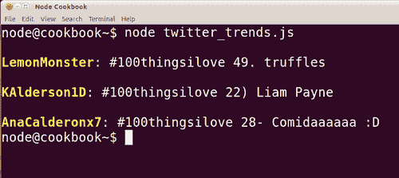

# 第三章：使用数据序列化

在本章中，我们将涵盖：

+   将对象转换为 JSON，然后再转换回来

+   将对象转换为 XML，然后再转换回来

+   通过 AJAX 进行浏览器-服务器传输

+   使用真实数据：获取热门推文

# 介绍

如果我们想让第三方安全地访问原始数据，我们可以使用序列化将其发送到请求者能够理解的格式中。在本章中，我们将研究两种著名标准中的数据序列化，JSON 和 XML。

# 将对象转换为 JSON，然后再转换回来

JSON（JavaScript 对象表示法）与 JavaScript 对象非常相关，因为它是 JavaScript 的子集。这项任务将演示如何使用 JSON 转换的构建块：`JSON.parse`和`JSON.stringify`。

## 准备工作

我们需要创建两个名为`profiles.js`和`json_and_back.js`的新文件。

## 如何做...

让我们创建一个对象，稍后将其转换为 JSON。

```js
module.exports = {
  ryan : {
           name: "Ryan Dahl",
           irc:'ryah',
           twitter:'ryah',
           github:'ry',
           location:'San Francisco, USA',
           description: "Creator of node.js"
          },
  isaac : {
            name: "Isaac Schlueter",
            irc:'isaacs',
            twitter:'izs',
            github:'isaacs',
            location:'San Francisco, USA',
            description: "Author of npm, core contributor"
           },
  bert : {
           name: "Bert Belder",
           irc:'piscisaureus',
           twitter:'piscisaureus',
           github:'piscisaureus',
           location:'Netherlands',
           description: "Windows support, overall contributor"
          },
  tj : {
          name: "TJ Holowaychuk",
          irc:'tjholowaychuk',
          twitter:'tjholowaychuk',
          github:'visionmedia',
          location:'Victoria, BC, Canada',
          description: "Author of express, jade and other popular modules"
          },
  felix : {
          name: "Felix Geisendorfer",
          irc:'felixge',
          twitter:'felixge',
          github:'felixge',
          location:'Berlin, Germany',
          description: "Author of formidable, active core developer"
          }
};

```

这个对象包含了 Node 社区一些领先成员的个人资料信息（尽管它并不全面，甚至不包含所有的核心开发团队）。这里需要注意的一点是使用了`module.exports`。我们将在第九章中看到更多关于这个的内容，*编写自己的模块*。我们在这里使用`module.exports`来模块化我们的`profiles`对象，以保持我们的代码整洁。我们可以将任何表达式加载到`module.exports`中，将其保存为一个单独的文件（在我们的情况下，我们将称之为`profiles.js`），并在我们的主文件中使用`require`来动态加载它进行初始化。

```js
var profiles = require('./profiles'); // note the .js suffix is optional

```

整洁而清晰。为了将我们的`profiles`对象转换为 JSON 表示，我们使用`JSON.stringify`，它将返回由 JSON 数据组成的字符串。我们将使用`replace`从根本上改变我们的对象（现在是一个字符串）。

```js
profiles = JSON.stringify(profiles).replace(/name/g, 'fullname');

```

在这里，我们调用了`replace`，使用全局`g`选项的正则表达式来将我们的 JSON 字符串中的每个`name`更改为`fullname`。

但等等！似乎出现了某种错误。Felix 的姓缺少一个分音符！让我们通过将我们的 JSON 数据转换回对象，并通过修改重新指定的`fullname`属性的值来纠正他的名字：

```js
profiles = JSON.parse(profiles);
profiles.felix.fullname = "Felix Geisendörfer";
console.log(profiles.felix);

```

当我们运行我们的应用程序时，`console.log`将输出以下内容：

```js
{ fullname: 'Felix Geisendörfer',
  irc: 'felixge',
  twitter: 'felixge',
  github: 'felixge',
  location: 'Berlin, Germany',
  description: 'Author of formidable, active core developer' }

```

第一个键现在是`fullname`，而`Geisendörfer`的拼写是正确的。

## 它是如何工作的...

首先，我们有一个日常的 JavaScript 对象，我们将其序列化为 JSON 表示。我们还在我们的 JSON 字符串上调用`String.replace`方法，将每个`name`的出现更改为`fullname`。

以这种方式使用 replace 并不是一个明智的做法，因为任何`name`的出现都会被替换。字符串中很容易有其他地方可能存在`name`，这样会意外地被替换。我们在这里使用`replace`来确认配置文件已经成为 JSON 字符串，因为我们无法在对象上使用`replace`。

然后，我们使用`JSON.parse`将修改后的 JSON 字符串转换回对象。为了测试我们的键确实从`name`转换为`fullname`，并确认我们再次使用对象，我们通过`profiles.felix.fullname`纠正`felix`配置文件，然后将`profiles.felix`记录到控制台。

## 还有更多...

JSON 是一种非常灵活和多功能的跨平台通信工具。让我们看看标准的更高级应用。

### 构建 JSONP 响应

JSONP（带填充的 JSON）是一个跨域策略的变通方法，允许开发人员与其他域上的资源进行接口。它涉及在客户端定义一个回调函数，通过它的第一个参数处理 JSON，然后将这个回调函数的名称作为查询参数传递给`script`元素的`src`属性，该元素指向另一个域上的 web 服务。然后，web 服务返回 JSON 数据，包装在一个根据客户端设置的查询参数命名的函数中。可能更容易通过代码来说明这一点。

```js
<html>
<head>
<script>
  var who = 'ryan';
  function cb(o) {
    alert(o.name + ' : ' + o.description);
  }
  var s = document.createElement('script');
  s.src = 'http://localhost:8080/?callback=cb&who=' + who;
  document.getElementsByTagName("head")[0].appendChild(s);
</script>
</head>
</html>

```

我们定义了一个名为`cb`的函数，它以一个对象作为参数，然后输出`name`和`description`属性。在此之前，我们设置了一个名为`who`的变量，它将被传递给服务器以为我们获取特定的数据。然后，我们动态注入一个新的脚本元素，将`src`设置为一个象征性的第三方域（为了方便演示，是 localhost），并添加`callback`和`who`查询参数。`callback`的值与我们的函数`cb`函数的名称匹配。我们的服务器使用此参数将 JSON 包装在函数调用中。

```js
var http = require('http');
var url = require('url');
var profiles = require('./profiles');

http.createServer(function (request, response) {
  var urlObj = url.parse(request.url, true), 
    cb = urlObj.query.callback, who = urlObj.query.who,
    profile;

  if (cb && who) {
    profile = cb + "(" + JSON.stringify(profiles[who]) + ")";
    response.end(profile);
  }

}).listen(8080);

```

我们创建一个服务器，提取`callback`和`who`查询参数，并写一个包含传递我们的 JSON 数据作为参数的函数调用的响应。这个脚本由我们的客户端加载，其中调用`cb`函数并将 JSON 作为对象接收到函数中（因为它看起来像一个对象）。

### 安全和 JSONP

由于 JSONP 使用脚本注入，任何脚本都可以插入到我们的页面中。因此，强烈建议只在受信任的来源使用此方法。不受信任的来源可能在页面上运行恶意代码。

## 另请参阅

+   *在本章中讨论的通过 AJAX 进行浏览器-服务器传输*

+   *在本章中讨论的使用真实数据：获取热门推文*

# 将对象转换为 XML，然后再转回来

由于 JSON 是 JavaScript 对象的基于字符串的表示，因此在两者之间进行转换是简单的。但是，XML 不方便处理。尽管如此，可能有时我们不得不使用它，例如，如果 API 只能使用 XML，或者如果我们与要求 XML 支持的项目签约。

有各种非核心 XML 解析器可用。其中一个解析器是非核心模块`xml2js`。`xml2js`的前提是，使用 JavaScript 中的对象比使用 XML 更合适。`xml2js`为我们提供了一个基础，让我们通过将 XML 转换为 JavaScript 对象来与 XML 交互。

在这个任务中，我们将编写一个函数，使用前一个配方中的`profiles`对象来创建一个有效的 XML 字符串，然后将其通过`xml2js`，从而将其转换回对象。

## 准备工作

在开始之前，让我们创建我们的文件`xml_and_back.js`，确保我们的单独模块化的`profiles.js`也在同一个目录中。我们还应该安装`xml2js`。

```js
npm install xml2js 

```

## 如何做...

首先，我们需要引入我们的`profiles`对象以及`xml2js`：

```js
var profiles = require('./profiles');
var xml2js = new (require('xml2js')).Parser();

```

请注意，我们不仅仅需要`xml2js`模块，还初始化了它的`Parser`方法的一个新实例，并将其加载为我们的`xml2js`变量。这与`xml2js`模块的工作方式有关。我们必须创建一个新的`Parser`实例，以便将一段 XML 解析为一个对象。由于我们的代码相对简单，我们可能会在需要时进行初始化工作。

就像 XML 具有树状结构一样，对象可以在其中嵌套对象。我们需要一个函数，可以循环遍历我们的对象和所有子对象，将所有属性转换为父 XML 节点，将所有非对象值转换为文本 XML 节点：

```js
function buildXml(rootObj, rootName) {
  var xml = "<?xml version='1.0' encoding='UTF-8'?>\n";
  rootName = rootName || 'xml';
  xml += "<" + rootName + ">\n";
  (function traverse(obj) {
    Object.keys(obj).forEach(function (key) {
     var open = "<" + key + ">",
        close = "</" + key + ">\n",
        isTxt = (obj[key]
          && {}..toString.call(obj[key]) !== "[object Object]");

      xml += open;

      if (isTxt) {
        xml += obj[key];
        xml += close;
        return;
      }

      xml += "\n";
      traverse(obj[key]);
      xml += close;
    });
  }(rootObj));

  xml += "</" + rootName + ">";
  return xml;
}

```

`buildXml`接受两个参数，对象和一个字符串来命名第一个根 XML 节点，并返回表示我们对象的 XML 数据的字符串。

让我们将所有`name`的出现替换为`fullname`，就像我们的*将对象转换为 JSON，然后再转回来*配方中一样。

```js
profiles = buildXml(profiles, 'profiles').replace(/name/g, 'fullname');
console.log(profiles); // <-- show me the XML!

```

现在我们将`profiles`转回为一个对象，使用重命名的`fullname`属性来更正 Felix Geisendörfer 的名字，然后将 Felix 记录到控制台上以显示它已经生效。

```js
xml2js.parseString(profiles, function (err, obj) {
  profiles = obj;
  profiles.felix.fullname = "Felix Geisendörfer";
  console.log(profiles.felix);
});

```

`xml2js.parseString`接受 XML（此时保存在`profiles`变量中）并将其组装成一个对象，作为其回调中的`obj`参数传递。

## 它是如何工作的...

JavaScript 对象是一个键值存储，而 XML 是一种以资源为中心的标记语言。在 XML 中，键和值可以用两种方式表示：要么作为父节点和子节点，要么作为 XML 节点上的属性。我们将我们的键和值转换为父节点和子节点，主要是因为单个 XML 节点充满了大量的属性，而有效的 XML 似乎违反了 XML 的精神。

我们通过`buildXml`实现了我们的转换，它是一个包装另一个自调用递归函数`traverse`的函数。我们这样做是为了利用 JavaScript 中的闭包原理，它允许我们在内部和外部函数之间共享变量。这使我们能够使用外部的`xml`变量来组装我们的序列化 XML。

在我们的外部函数中，我们从`<?xml?>`声明开始，设置所需的`version`属性和可选的`encoding`属性为`UTF-8`。我们还将`traverse`渲染的任何输出都包装在一个以我们的`rootName`参数命名的结束和关闭标签中。因此，在我们的情况下，`buildXml`将以下内容放入我们的`xml`变量中：

```js
<?xml version='1.0' encoding='UTF-8'?>
<profiles>
	<!-- Traverse XML Output Here -->
</profiles>

```

如果`rootName`丢失，我们默认为`<xml>`作为根节点。我们的`traverse`内部函数接受一个参数，即要转换为 XML 的对象。我们将`rootObj`传递给调用括号：

```js
(function traverse(obj) {
	// traverse function code here...
  }(rootObj));  // ? passing in our root object parameter

```

`traverse`使用`forEach`循环遍历此对象的键，通过`forEach`回调的第一个参数访问每个键。我们使用每个`key`的名称来生成 XML 标签的开头和结尾，并将`open`标签附加到我们共享的`xml`变量上。然后我们检查我们的`isTxt`变量，它测试嵌套对象并在不是对象时返回`true`（假设它必须是文本）。如果`isTxt`为`true`，我们输出当前属性的值并从`forEach`回调返回，继续到下一个属性。这就是我们获取文本节点的方式——值。否则，我们在`xml`中附加一个换行符，并在子对象上调用`traverse`，通过完全相同的过程进行，只是这次它嵌入在父`traverse`函数中。一旦我们嵌套调用`traverse`返回，我们就在`xml`中附加`close`标签，我们的`traverse`函数就完成了。最后，我们的外部函数附加了关闭根节点标签，并返回所有生成的 XML。

## 还有更多...

我们可以进一步调整我们的代码，以更好地与`xml2js`库集成，通过将其对某些 XML 特性的解释反映到 JavaScript 对象等价物中。我们还可以将其扩展为将更复杂的 JavaScript 对象转换为有效的 XML。

### 包含数组和函数的对象

除了对象和字符串之外，对象属性还可以包含函数和数组。就目前而言，我们的方法将这些解释为文本，对于数组，输出一个逗号分隔的值列表，并在文本节点中返回函数的内容。

这并不理想，所以我们将修改我们的`traverse`函数来处理这些类型：

```js
  (function traverse(obj) {
    Object.keys(obj).forEach(function (key) {
     var open = "<" + key + ">",
        close = "</" + key + ">\n",
        nonObj = (obj[key]  
          && {}.toString.call(obj[key]) !== "[object Object]"),
        isArray = Array.isArray(obj[key]),
        isFunc =(typeof obj[key] === "function");

      if (isArray) {
        obj[key].forEach(function (xmlNode) {
          var childNode = {};
          childNode[key] = xmlNode;
          traverse(childNode);
        });
        return;
      }

      xml += open;      
      if (nonObj) {
        xml += (isFunc) ? obj[key]() : obj[key];
        xml += close;
        return;
      }
//rest of traverse function

```

我们将保存我们修改后的代码为`xml_with_arrays_and_functions.js`。为了语义上的完整，我们将`isTxt`重命名为`nonObj`，并添加了两个更多的测试变量，`isArray`和`isFunc`。如果我们遍历的对象的值是一个数组，我们创建一个临时的`childNode`对象，然后将其传回`traverse`。我们对数组的每个值都做同样的操作，每次创建一个新的`childNode`对象，其中键相同但值是下一个数组元素。这有效地创建了多个相同名称的子节点。

为了测试数组支持，让我们将`profiles.js`文件复制到`profiles_with_arrays_and_functions.js`，并要求它而不是`profiles.js`。Ryan Dahl 还推送到另一个 Github 帐户：joyent。所以让我们用 Github 帐户的数组更新他的个人资料：

```js
module.exports = {
  ryan : {
           name: "Ryan Dahl",
           irc:"ryah",
           twitter:"ryah",
           github:["ry","joyent"],
           location:"San Francisco, USA",
           description: "Creator of node.js"
          },
//...rest of profiles...

```

现在，如果我们这样做：

```js
profiles = buildXml(profiles, 'profiles');
console.log(profiles); // <-- show me the XML!

```

看一下输出，我们会发现 Ryan 有两个 Github XML 节点：

```js
<?xml encoding='UTF-8'?>
<profiles>
<ryan>
<name>Ryan Dahl</name>
<irc>ryah</irc>
<twitter>ryah</twitter>
<github>ry</github>
<github>joyent</github>
<location>San Francisco, USA</location>
<description>Creator of node.js</description>
</ryan>
<!-- REST OF THE XML OUTPUT -->

```

我们的另一个变量`isFunc`在`nonObj`条件语句内进行检查。我们用它来确定我们是应该只将对象属性的文本添加到我们的`xml`变量中，还是调用对象属性以获得其返回值。Bert 的 IRC、Twitter 和 Github 帐户都是一样的，所以让我们添加从他的 Github 值中提取 IRC 和 Twitter 值的方法：

```js
//...prior profiles code.
bert : {
           name: "Bert Belder",
           irc:function () { return this.github; },
           twitter:function () { return this.github; },
           github:"piscisaureus",
           location:"Netherlands",
           description: "Windows support, overall contributor"
          },
//..rest of profiles code...

```

如果我们从对象构建 XML，然后使用`xml2js`将其转换回对象，这些属性不应再是函数，而应该是函数/方法的返回值：

```js
xml2js.parseString(profiles, function (err, obj) {
  profiles = obj;
  console.log(profiles.bert);
});

```

输出将如下所示：

```js
{ name: 'Bert Belder',
  irc: 'piscisaureus',
  twitter: 'piscisaureus',
  github: 'piscisaureus',
  location: 'Netherlands',
  description: 'Windows support, overall contributor' }

```

### 生成 XML 属性

在 XML 中，我们可以用父节点、子节点和文本节点来表示数据关系，也可以使用属性。如果我们想让我们的`buildXml`函数能够处理 XML 属性，我们需要一个约定来定义对象中的属性。在从 XML 转换为对象时，`xml2js`通过添加一个包含特殊`@`属性的对象来解释属性，该对象又包含属性的另一个子对象。通过在`buildXml`中实现相同的约定，我们可以使我们的代码与`xml2js`很好地配合。让我们取`profiles_with_arrays_and_functions.js`中的`profiles`对象，并进一步更新`location`属性如下：

```js
module.exports = {
  ryan : {
		//ryans other keys here...
           location:{'@':{city: 'San Francisco',country: 'USA'}},
           description: 'Creator of node.js'
          },
  isaac : {
		//isaacs other keys here...
            location:{'@':{city: 'San Francisco',country: 'USA'}},
            description: 'Author of npm, core contributor'
           },
  bert : {
		//berts other keys here...
           location:{'@':{country: 'Netherlands'}},
           description: 'Windows support, overall contributor'
          },
  tj: {}, //<-- TJs keys
  felix: {}, //<-- Felix's keys
};

```

我们将其保存为`profiles_with_attributes.js`，并在`xml_and_back_with_arrays_and_functions.js`代码中更改`profiles`变量的`require`位置，保存为`xml_and_back_with_attributes.js`：

```js
var profiles = require('./profiles_with_attributes');

```

让我们编写另一个函数，应该放在`buildXml`函数内部来处理我们的属性：

```js
function attributes(obj, key) {
    if (obj[key].hasOwnProperty("@")) {
     xml = xml.substr(0, xml.length – 1); //remove the “>” part of open tag

     Object.keys(obj[key]['@']).forEach(function (attrKey) {
        xml += ' ' + attrKey + '="' + obj[key]['@'][attrKey] + '"';
      });

     xml += ">"; // add the “>” back on

     delete obj[key]['@']; //remove the key so it isn't traversed as an object
    }
  }

```

我们的新`attributes`函数应该放在我们的`buildXml`函数内，并且将在`traverse`内部调用，就在我们将键的`open`标签变量添加到`xml`变量之后，以及在检查`nonObj`节点之前：

```js
(function traverse(obj) {
  //...prior traverse function code...
  xml += open;
  attributes(obj, key);
  If (nonObj) {
  //rest of traverse function code...

```

我们将当前由我们的`traverse`函数处理的对象和键传递进去，检查`obj`的这个特定属性是否包含一个名为`@`的属性。我们还在隐式地检查我们当前对象键的值是否本身是一个对象，因为只有对象才有属性。

当前的属性`@`属性对应于当前标签。因此，如果找到一个`@`属性，我们会删除`xml`的最后一个字符（这将是一个右尖括号`>`），并循环遍历我们子对象（`obj[key][@]`）的键，将每个键及其值添加到最后的`open`标签中，以便附加到`xml`，完成后重新添加右尖括号。如果我们将`@`对象留在`profiles`对象中，它将稍后被传回`traverse`函数，导致以下行为：

```js
<@>
<city>San Francisco</city>
<country>USA</country>
</@>

```

我们不想要那样，所以我们最后删除了对象中的`attributes`子对象。在我们的`buildXml`函数下面，我们有以下代码：

```js
profiles = buildXml(profiles, 'profiles').replace(/name/g, 'fullname');
console.log(profiles; //show me the xml!

```

这将把`name`键更改为`fullname`，并将我们的 XML 输出到控制台，呈现出带有属性的`location`标签。

```js
<ryan>
<fullname>Ryan Dahl</fullname>
<irc>ryah</irc>
<twitter>ryah</twitter>
<github>ry</github>
<github>joyent</github>
<location city="San Francisco" country="USA">
</location>
<description>Creator of node.js</description>
</ryan>
<!-- rest of the XML output -->

```

### 文本值与属性声明并列

我们的属性解决方案揭示了另一个问题。没有办法让带属性的节点包含文本节点，因为我们将字符串类型转换为文本节点，但使用对象来声明属性。`xml2js`通过`charkey`属性解决了这个问题的敌意。通过以下代码，我们可以完全兼容`xml2js`：

```js
//previous code
      if (key === '#') { //explicit text
        xml += obj[key] + '\n';
        return;
      }
      xml += open;
      attributes(obj, key);
      if (nonObj) {
//rest of the code

```

现在这个困境已经解决，我们可以明确地添加包含文本节点的属性节点，就像这样：

```js
//prior profiles
 tj : {
          name: "TJ Holowaychuk",
          irc:"tjholowaychuk",
          twitter:"tjholowaychuk",
          github:"visionmedia",
          location:{'@':{city: 'Victoria',country: 'Canada'},region: {'#' :'British Columbia','@':{type:'province'}}},
          description: "Author of express, jade and other popular modules"
          },
//rest of profiles

```

这导致：

```js
<irc>tjholowaychuk</irc>
<twitter>tjholowaychuk</twitter>
<github>visionmedia</github>
<github s="special">
</github>
<location city="Victoria" country="Canada">
<region type="province">
British Columbia
</region>
</location>
<description>Author of express, jade and other popular modules</description>
</tj>

```

## 另请参阅

+   *在本章中讨论的将对象转换为 JSON 然后再转换回来*

+   本章讨论了*通过 AJAX 进行浏览器-服务器传输*

+   本章讨论了*使用真实数据：获取热门推文*

# 通过 AJAX 进行浏览器-服务器传输

我们可以通过 AJAX 直接将新内容加载到页面中，而不是为每个内容请求加载新页面，从而增强用户体验。

在本示例中，我们将根据用户请求将序列化数据传输到浏览器，然后与我们的客户端数据进行交互。我们将在浏览器中实现一个配置文件查看器，该查看器以 JSON 或 XML 格式检索所选配置文件，并输出该配置文件的键值或父子节点。

## 准备工作

我们将继续使用我们的`profiles.js`对象模块（来自本章的前两个示例）。对于 XML 传递，我们还将从*将对象转换为 XML 并再次转换*示例中获取我们的`buildXml`函数，并将其转换为一个简单的模块（就像我们在上一个示例中对`profiles`对象所做的那样）：

```js
module.exports = function buildXml(rootObj, rootName) {
//..buildXml function code
}

```

我们将将此保存为`buildXml.js`并将其放在一个文件夹中，该文件夹中包含我们的`profiles.js`文件的副本，以及两个新创建的文件：`server.js`和`index.html`。

## 如何做...

让我们从我们的`index.html`文件开始。我们将快速实现一个粗略的布局，用于我们的个人资料查看器，包括一个带有两个`select`元素的`form`，一个用于输出格式化对象数据的`div`，以及一个用于呈现原始序列化数据的`textarea`元素。

```js
<!doctype html>
<html>
<head>
<script src=http://ajax.googleapis.com/ajax/libs/jquery/1.7.1/jquery.min.js>
</script>
<style>
#frm, #raw {display:block; float:left; width:210px}
#raw {height:150px; width:310px; margin-left:0.5em}
</style>
</head>
<body>
<form id=frm>
Profile: <select id=profiles>
		 <option></option>
		 </select> <br>
Format:<select id=formats>
		  <option value=json> JSON </option>
		  <option value=xml> XML </option>
		  </select><br> <br>
<div id=output></div>
</form>  
<textarea id=raw></textarea>
</body>
</html>

```

请注意，我们已经包含了 jQuery 以获得跨浏览器的好处，特别是在 AJAX 请求的领域。我们将很快在客户端脚本中使用 jQuery，但首先让我们制作我们的服务器。

对于我们的模块，我们将需要`http，path`和`fs`以及我们自定义的`profiles`和`buildXml`模块。为了使我们的代码工作，我们需要在我们的服务器中托管`index.html`，以防止跨域策略错误。

```js
var http = require('http');
var fs = require('fs');
var path = require('path');
var profiles = require('./profiles');
var buildXml = require('./buildXml');

var index = fs.readFileSync('index.html');
var routes,
  mimes = {xml: "application/xml", json: "application/json"};

```

我们还定义了`routes`和`mimes`变量，以便我们可以回答来自客户端的特定数据请求，并附上正确的`Content-Type`标头。我们将创建两个路由，一个将提供配置文件名称列表，另一个将指示对特定配置文件的请求。

```js
routes = {
  'profiles': function (format) {
    return output(Object.keys(profiles), format);
  },
  '/profile': function (format, basename) {
    return output(profiles[basename], format, basename);
  }
};

```

我们刚刚在`routes`中提到的`output`函数应放置在`routes`对象上方，并且看起来像以下代码：

```js
function output(content, format, rootNode) {
  if (!format || format === 'json') {
    return JSON.stringify(content);
  }
  if (format === 'xml') {
    return buildXml(content, rootNode);
  }
}

```

要完成我们的服务器，我们只需调用`http.createServer`并在回调中与我们的`routes`对象进行交互，在找不到路由的情况下输出`index.html`：

```js
http.createServer(function (request, response) {
  var dirname = path.dirname(request.url), 
    extname = path.extname(request.url), 
    basename = path.basename(request.url, extname); 
    extname = extname.replace('.',''); //remove period 

  response.setHeader("Content-Type", mimes[extname] || 'text/html');

  if (routes.hasOwnProperty(dirname)) {
    response.end(routesdirname);
    return;
  }
  if (routes.hasOwnProperty(basename)) {
    response.end(routesbasename);
    return;
  }
  response.end(index);
}).listen(8080);

```

最后，我们需要编写我们的客户端代码，以通过 AJAX 与我们的服务器进行交互，该代码应放置在我们的`index.html`文件的`#raw`文本区域的下方的脚本标签中，但在`</body>`标签的上方（以确保 HTML 元素在脚本执行之前已加载）：

```js
<script>
$.get('http://localhost:8080/profiles',
  function (profile_names) {
    $.each(profile_names, function (i, pname) {
      $('#profiles').append('<option>' + pname + '</option>');
    });
  }, 'json');
$('#formats, #profiles').change(function () {
  var format = $('#formats').val();
  $.get('http://localhost:8080/profile/' + $('#profiles').val() + '.' + format,
    function (profile, stat, jqXHR) {
      var cT = jqXHR.getResponseHeader('Content-Type');
      $('#raw').val(profile);
      $('#output').html('');
      if (cT === 'application/json') {
        $.each($.parseJSON(profile), function (k, v) {
          $('#output').append('<b>' + k + '</b> : ' + v + '<br>');
        });
        return;
      }

      if (cT === 'application/xml') {
        profile = jqXHR.responseXML.firstChild.childNodes;
        $.each(profile,
          function (k, v) {
            if (v && v.nodeType === 1) {
              $('#output').append('<b>' + v.tagName + '</b> : ' +
		   v.textContent + '<br>');
            }
          });

      }
    }, 'text');

});
</script>

```

## 它是如何工作的...

让我们从服务器开始。在我们的`http.createServer`回调中，我们设置了适当的标头，并检查`routes`对象是否具有指定的目录名。如果`routes`中存在目录名，我们将其作为函数调用，并传入`basename`和`extname`（我们使用`extname`来确定所需的格式）。在没有目录名匹配的情况下，我们检查是否存在与`basename`匹配的属性。如果有，我们调用它并传入扩展名（如果有）。如果这两个测试都不成立，我们只需输出我们的`index.html`文件的内容。

我们的两个路由是`profiles`和`/profile`，后者有一个前导斜杠，对应于`path.dirname`返回路径的目录名的方式。我们的`/profile`路由旨在允许包含所请求的配置文件和格式的子路径。例如，`http://localhost:8080/profile/ryan.json`将以 JSON 格式返回 Ryan 的配置文件（如果未给出扩展名，则默认为 JSON 格式）。

`profiles`和`/profile`方法都利用我们的自定义`output`函数，该函数使用`format`参数（最初在`http.createServer`回调中为`extname`）从传递给它的`content`生成 JSON（使用`JSON.stringify`）或 XML（使用我们自己的`buildXml`函数）。`output`还接受一个条件性的第三个参数，该参数传递给`buildXml`以定义生成的 XML 的`rootNode`。

在客户端，我们要做的第一件事是调用 jQuery 的`$.get`方法获取`http://localhost:8080/profiles`。这会导致服务器调用`route`对象上的`profiles`方法。这将调用我们的`output`函数，并传入来自我们的`profiles.js`对象的顶级属性数组。由于我们没有在`$.get`中指定扩展名，`output`函数将默认为 JSON 格式，并将`JSON.stringify`的结果传递给`response.end`。

回到客户端，我们在第一个`$.get`调用中的第三个参数是`'json'`，这确保`$.get`将传入的数据解释为 JSON，并将其转换为对象。对象作为`$.get`的回调函数的第一个参数（`$.get`的第二个参数）传递给我们命名为`profile_names`的函数。我们使用 jQuery 的`$.each`循环遍历`profile_names`，通过将 jQuery 的`append`方法应用于元素，并在循环`$.each`时将每个配置文件名称添加到`<option>`元素中，从而填充第一个`select`元素（`#profiles`）。

接下来，我们为我们的两个`select`元素应用一个监听器（`change`），其回调根据用户的选择组装一个 URL，并将此 URL 传递给另一个使用`$.get`的 AJAX 请求。

这次在服务器端，调用`/profile route`方法，将对应的配置文件从我们的`profiles`对象传递给`output`。此属性将包含所请求个人的配置文件信息的对象。

在我们的第二个`$.get`调用中，我们将第三个参数设置为`'text'`。这将强制 jQuery 不自动将传入的数据解释为 JSON 或 XML。这给了我们更多的控制，并使得更容易将原始数据输出到`textarea`中。在`$.get`回调中，我们使用`jqXHR`参数来确定`Content-Type`，以查看我们是否有 JSON 或 XML。我们根据其类型（Object 或 XMLObject）循环返回的数据，并将其附加到我们的`#output div`中。

## 还有更多...

我们还可以在浏览器中将我们的对象转换为 JSON 和 XML，然后将它们发送到服务器，我们可以再次将它们作为对象进行交互。

### 从客户端发送序列化数据到服务器

让我们扩展我们的示例，使用我们的浏览器界面将新配置文件添加到服务器上的`profiles`对象中。

从`index.html`开始（我们将其复制到`add_profile_index.html` - 我们还将`server.js`复制到`add_profile_server.js`），让我们添加一个名为`#add`的表单，并对其进行样式设置。这是表单：

```js
<form id=add>
<div><label>profile name</label><input name="profileName"></div>
<div><label>name</label><input name="name"></div>
<div><label>irc</label><input name="irc"></div>
<div><label>twitter</label><input name="twitter"></div>
<div><label>github</label><input name="github"></div>
<div><label>location</label><input name="location"></div>
<div><label>description</label><input name="description"></div>
<div><button>Add</button></div>
</form>

```

还有一些额外的样式：

```js
<style>
#frm, #raw {display:block; float:left; width:210px}
#raw {height:150px; width:310px; margin-left:0.5em}
#add {display:block; float:left; margin-left:1.5em}
#add div {display:table-row}
#add label {float:left; width:5.5em}
div button {float:right}
</style>

```

我们将在客户端使用我们的`buildXml`函数（我们在*将对象转换为 XML 并再次转换回来*中创建了`buildXml`）。这个函数已经在我们的服务器上可用，所以我们将它转换为字符串，并在服务器启动时提供一个路由供客户端访问：

```js
var index = fs.readFileSync('add_profile_index.html');
var buildXmljs = buildXml.toString();
var routes,
  mimes = {
   js: "application/JavaScript",
   json: "application/json",
   xml: "application/xml"
  };
routes = {
  'profiles': function (format) {
    return output(Object.keys(profiles), format);
  },
  '/profile': function (format, basename) {
    return output(profiles[basename], format, basename);
  },
  'buildXml' : function(ext) {
    if (ext === 'js') { return buildXmljs; }
  }
};

```

我们还更新了我们的`mimes`对象，准备交付`application/javascript Content-Type`，并修改了索引变量以使用我们的新的`add_profile_index.html`文件。回到客户端代码，我们通过在头部部分包含另一个`<script>`标签来获取我们的`buildXml`函数：

```js
<script src=buildXml.js></script>

```

我们将我们对服务器的初始`$.get`调用（用于获取`select`元素的所有配置文件名称）包装在一个名为`load`的函数中。这使我们能够在添加配置文件后动态重新加载配置文件名称：

```js
function load() {
$.get('http://localhost:8080/profiles',
  function (profile_names) {
    $.each(profile_names, function (i, pname) {
      $('#profiles').append('<option>' + pname + '</option>');
    });

  }, 'json');
}
load();

```

现在我们为`#add`表单定义一个处理程序：

```js
$('#add').submit(function(e) {
  var output, obj = {}, format = $('#formats').val();
  e.preventDefault();
  $.each($(this).serializeArray(), function(i,nameValPair) {
    obj[nameValPair.name] = nameValPair.value; //form an object
  });  
  output = (format === 'json') ? JSON.stringify(obj) : buildXml(obj,'xml');

  $.ajax({ type: 'POST', url: '/', data: output,
    contentrendingTopicsype: 'application/' + format, dataType: 'text',
    success: function(response) {
      $('#raw').val(response);
      $('#profiles').html('<option></option>');
      load();
    }
  });
}); 

```

我们的处理程序从表单输入构建一个对象，将其序列化为指定格式。它使用`jQuery.ajax`将序列化数据发送到我们的服务器，然后重新加载配置文件。在我们的服务器上，我们将编写一个处理 POST 请求的函数：

```js
function addProfile(request,cb) {
  var newProf, profileName, pD = ''; //post data
  request
    .on('data', function (chunk) { pD += chunk; })
    .on('end',function() {
      var contentrendingTopicsype = request.headers['content-type'];
      if (contentrendingTopicsype === 'application/json') {
        newProf = JSON.parse(pD);
      }

      if (contentrendingTopicsype === 'application/xml') {
        xml2js.parseString(pD, function(err,obj) {
          newProf = obj;  
        });
      }
      profileName = newProf.profileName;
      profiles[profileName] = newProf;    
      delete profiles[profileName].profileName;
      cb(output(profiles[profileName],
        contentrendingTopicsype.replace('application/', ''), profileName));
});
}

```

为了使我们的新`addProfile`函数工作，我们需要包含`xml2js`模块，该模块用于将序列化的 XML 转换回对象。因此，除了我们所有的初始变量，我们还添加了以下内容：

```js
var xml2js = new (require('xml2js')).Parser();

```

在第二章的第一个食谱中，*探索 HTTP 对象*，在处理 POST 数据时，`addProfile`将所有传入的数据汇编在一起。在`end`事件中，我们使用适合其类型的方法将序列化数据转换为对象。我们将这个对象添加到我们的`profiles`对象中，使用`profileName`属性作为子对象的键。一旦我们添加了对象，我们就会`delete`冗余的`profileName`属性。

为了将数据返回给客户端，`addProfile`函数调用回调（cb）参数，传入我们自定义的`output`函数，该函数将根据指定的格式返回序列化数据（通过在`Content-Type`头上使用`replace`确定）。

我们像这样在我们的服务器中包含我们的`addProfile`函数：

```js
http.createServer(function (request, response) {
//initial server variables...
  if (request.method === 'POST') {
    addProfile(request, function(output) {
      response.end(output);
    });
    return;
  }
//..rest of the server code (GET handling..)

```

在我们的`addProfile`回调函数中，我们只需使用从`output`函数返回的数据结束响应，通过`output`参数访问这个数据，这个参数在`addProfile`回调中定义。新的配置文件只保存在操作内存中，所以在服务器重新启动时会丢失。如果我们要将这些数据存储在磁盘上，理想情况下我们会希望将其保存在数据库中，这将在下一章*与数据库交互*中讨论。

## 另请参阅

+   *设置路由*在第一章中讨论，制作 Web 服务器

+   *处理 POST 数据*在第二章中讨论，探索 HTTP 对象

+   *将对象转换为 JSON 然后再转换回来*在本章中讨论

+   *将对象转换为 XML 然后再转换回来*在本章中讨论

# 处理真实数据：获取热门推文

许多在线实体将他们的响应数据格式化为 JSON 和 XML，以在他们的应用程序编程接口（API）中向第三方开发人员公开相关信息，这些开发人员随后可以将这些数据集成到他们的应用程序中。

一个这样的在线实体是 Twitter。在这个食谱中，我们将制作一个命令行应用程序，向 Twitter 的 REST 服务发出两个请求。第一个将检索 Twitter 上当前最受欢迎的话题，第二个将返回关于 Twitter 上最热门话题的最新推文。

## 准备工作

让我们创建一个文件，命名为`twitter_trends.js`。我们可能还希望安装第三方`colors`模块，使我们的输出更加美观：

npm install colors

## 如何做...

我们需要`http`模块来进行请求，并且需要`colors`模块来在控制台输出中添加一些颜色：

```js
var http = require('http');
var colors = require('colors');

```

我们将在另一个 GET 请求内部进行 GET 请求。在这些请求之间，我们将处理 JSON 数据，要么传递到后续请求，要么输出到控制台。为了遵循 DRY（不要重复自己）的精神，并演示如何避免意大利面代码，我们将抽象出我们的 GET 请求和 JSON 处理到一个名为`makeCall`的函数中。

```js
function makeCall(urlOpts, cb) {
  http.get(urlOpts, function (response) { //make a call to the twitter API  
    trendingTopics.jsonHandler(response, cb);
  }).on('error', function (e) {
    console.log("Connection Error: " + e.message);
  });
}
}

```

注意`trendingTopics`及其`jsonHandler`方法的神秘出现。`trendingTopics`是一个将为我们的 Twitter 交互提供所有设置和方法的对象。`jsonHandler`是`trendingTopics`对象上的一个方法，用于接收响应流并将 JSON 转换为对象。

我们需要为我们对趋势和推文 API 的调用设置选项，以及一些与 Twitter 交互相关的功能。因此，在我们的`makeCall`函数之上，我们将创建`trendingTopics`对象，如下所示：

```js
var trendingTopics = module.exports = {
  trends: {
    urlOpts: {
      host: 'api.twitter.com',
      path: '/1/trends/1.json', //1.json provides global trends,
      headers: {'User-Agent': 'Node Cookbook: Twitter Trends'}
    }
  },
  tweets: {
    maxResults: 3, //twitter applies this very loosely for the "mixed" type
    resultsType: 'realtime', //choice of mixed, popular or realtime
    language: 'en', //ISO 639-1 code
    urlOpts: {
      host: 'search.twitter.com',
      headers: {'User-Agent': 'Node Cookbook: Twitter Trends'}
    }
  },
  jsonHandler: function (response, cb) {
    var json = '';
    response.setEncoding('utf8');
    if (response.statusCode === 200) {
      response.on('data', function (chunk) {
        json += chunk;
      }).on('end', function () {
        cb(JSON.parse(json));
      });
    } else {
      throw ("Server Returned statusCode error: " + response.statusCode);
    }
  },
  tweetPath: function (q) {
    var p = '/search.json?lang=' + this.tweets.language + '&q=' + q +
        '&rpp=' + this.tweets.maxResults + '&include_entities=true' +
        '&with_twitter_user_id=true&result_type=' +
        this.tweets.resultsType;
    this.tweets.urlOpts.path = p;
  }
};

```

在创建`trendingTopics`变量时，我们还将对象转换为模块，同时将其加载到`module.exports`中。看看我们如何在*还有更多...*部分中使用它。

在我们的`trendingTopics`对象中，我们有`trends`和`tweets`对象以及两个方法：`jsonHandler`和`tweetPath`。

最后，我们将调用我们的`makeCall`函数来请求来自 Twitter 趋势 API 的全球热门趋势，将返回的 JSON 转换为对象，并使用该对象来确定请求关于最热门话题的推文的路径，使用另一个嵌入的`makeCall`调用。

```js
makeCall(trendingTopics.trends.urlOpts, function (trendsArr) {
  trendingTopics.tweetPath(trendsArr[0].trends[0].query);
  makeCall(trendingTopics.tweets.urlOpts, function (tweetsObj) {
    tweetsObj.results.forEach(function (tweet) {
      console.log("\n" + tweet.from_user.yellow.bold + ': ' + tweet.text);
    });
  });
});

```

## 工作原理...

让我们来分析一下`trendingTopics`对象。`trends`和`tweets`提供了与 Twitter API 相关的设置。对于`trends`来说，这只是一个 URL 选项对象，稍后将传递给`http.get`。在`tweets`对象中，我们有 URL 对象以及一些其他属性，涉及我们可以在对 Twitter 搜索 API 的 REST 调用中设置的选项。

### Twitter API 和 User-Agent 头

请注意，我们已经费心设置了`User-Agent`头。这是由于 Twitter API 政策，对缺少`User-Agent`字符串的惩罚是降低速率限制。

我们在`trendingTopics`对象上的`jsonHandler`方法接受`response`和`cb`（回调）参数。`trendingTopics.jsonHandler`使用`http.get`调用中的`response`对象来捕获传入数据流到一个变量（`json`）中。当流结束时，使用`response`上的`end`事件监听器来检测，`cb`调用转换后的 JSON 作为参数。`trendingTopics.jsonHandler`的回调找到了它的方式进入`makeCall`的回调。

`makeCall`抽象地结合了 GET 请求和 JSON 处理，并提供了一个带有单个参数的回调函数，该参数是 Twitter 返回的解析 JSON 数据（在本例中，它是一个对象数组）。

在外部的`makeCall`调用中，我们将参数命名为`trendsArr`，因为 Twitter 将其 JSON 数据返回在一个数组包装器中。我们使用`trendsArr`来定位 Twitter 的顶级趋势的查询片段表示，并将其传递给我们的`trendingTopics`对象的最终方法：`trendingTopics.tweetPath`。该方法以查询片段（`q`）作为其单个参数。然后，它使用此参数以及`trendingTopics.tweets`中的选项来构建最终的 Search API 路径。它将此路径注入到`trendingTopics.tweets`的`urlOpts`对象中，然后传递到内部的`makeCall`调用中。

在内部的`makeCall`调用中，我们将参数命名为`tweetsArr`。这是一个包含推文数据的对象数组，是对前一个对 Trend API 的调用中返回的 Twitter 搜索 API 的查询的顶级趋势的响应。我们使用可变的`forEach`（ES5）循环函数循环遍历数组，处理通过循环传递的每个元素作为`tweet`。

`tweetsArr`数组中包含很多数据，如时间信息，转发次数等。但是，我们只对推文的内容和发推者感兴趣。因此，我们将每个`tweet`的`from_user`和`text`属性记录到控制台上：



这也是`colors`模块派上用场的地方，因为在`console.log`中我们有`tweet.from_user.yellow.bold`。颜色不是 Twitter 返回的对象的属性，而是`colors`模块执行的一些技巧，提供了一个易于使用的界面来为控制台文本设置样式。

## 还有更多...

让我们来看看如何使用基于 XML 的服务。

### 将 Google 热门趋势与 Twitter 推文进行交叉引用

可以注意到，热门推文往往受到 Twitter 社区内部产生的时尚影响。Google 热门趋势是另一个热门信息的来源。它提供最热门搜索的每小时更新。

我们可以扩展我们的示例来访问和处理 Google 的热门趋势 XML 原子源，并将顶部结果集成到我们的 Twitter 搜索 API 请求中。为此，让我们创建一个名为`google_trends.twitter.js`的新文件。将 XML 数据作为 JavaScript 对象处理很好，因此我们将在本章的*将对象转换为 XML，然后再次转换为对象*配方中引入非核心的`xml2js`，以及`http，colors`和我们自己的`trendingTopics`模块。

```js
var http = require('http');
var xml2js = new (require('xml2js')).Parser(); 
var colors = require('colors'); //for prettifying the console output
var trendingTopics = require('./twitter_trends'); //load trendingTopics obj

```

现在我们将通过使用 EcmaScript 5 的`Object.create`方法从中继承来扩展我们的`trendingTopics`对象。

```js
var hotTrends = Object.create(trendingTopics, {trends: {value: {urlOpts: {
    host: 'www.google.com',
    path: '/trends/hottrends/atom/hourly',
    headers: {'User-Agent': 'Node Cookbook: Twitter Trends'}
  }
    }}});

hotTrends.xmlHandler = function (response, cb) {
  var hotTrendsfeed = '';
  response.on('data', function (chunk) {
    hotTrendsfeed += chunk;
  }).on('end', function () {
    xml2js.parseString(hotTrendsfeed, function (err, obj) {
      if (err) { throw (err.message); }
      xml2js.parseString(obj.entry.content['#'],
	function (err, obj) {
        if (err) { throw (err.message); }
        cb(encodeURIComponent(obj.li[0].span.a['#']));
      });
    });
  });
};

```

我们声明了一个名为`hotTrends`的变量，并使用`Object.create`来初始化一个`trendingTopics`的实例，通过属性声明对象（`Object.create`的第二个参数）重新实例化了`trends`属性。这意味着`trends`不再是一个继承属性，而是属于`hotTrends`，当将其添加到新的`hotTrends`对象时，我们没有覆盖`trendingTopics`中的`trends`属性。

然后我们添加了一个新的方法：`hotTrends.xmlHandler`。这将所有传入的块组合成`hotTrendsfeed`变量。一旦流结束，它会调用`xml2js.parseString`并将`hotTrendsfeed`中包含的 XML 传递给它。在第一个`parseString`方法的回调中，我们再次调用`xml2js.parseString`。为什么？因为我们必须解析两组 XML，或者说一组 XML 和一组格式良好的 HTML。（如果我们前往[`www.google.com/trends/hottrends/atom/hourly`](http://www.google.com/trends/hottrends/atom/hourly)，它将被呈现为 HTML。如果我们查看源代码，然后会看到一个包含嵌入式 HTML 内容的 XML 文档。）

Google 的热门趋势 XML 源以 HTML 的形式包含在其`content` XML 节点中。

HTML 被包裹在`CDATA`部分中，因此第一次不会被`xml2js`解析。因此，我们创建了一个新的`Parser`，然后通过`obj.entry.content['#']`解析 HTML。

最后，`hotTrends.xmlHandler`方法在第二个嵌入的`xml2js`回调中完成，其中执行了它自己的回调参数（cb），生成了从 HTML 中的顶部列表项元素生成的查询片段。

现在我们只需要对`makeCall`进行一些调整：

```js
function makeCall(urlOpts, handler, cb) {
  http.get(urlOpts, function (response) { //make a call to the twitter api  
    handler(response, cb);
  }).on('error', function (e) {
    console.log("Connection Error: " + e.message);
  });
}

makeCall(hotTrends.trends.urlOpts, hotTrends.xmlHandler, function (query) {
  hotTrends.tweetPath(query);
  makeCall(hotTrends.tweets.urlOpts, hotTrends.jsonHandler, function (tweetsObj) {
    tweetsObj.results.forEach(function (tweet) {
      console.log("\n" + tweet.from_user.yellow.bold + ': ' + tweet.text);
    });
  });
});

```

由于我们现在处理 JSON 和 XML，我们在`makeCall`函数声明中添加了另一个参数：`handler`。`handler`参数允许我们指定是使用继承的`jsonHander`方法还是我们补充的`xmlHandler`方法。

当我们调用外部的`makeCall`时，我们传入`hotTrends.xmlHandler`，将参数命名为`query`。这是因为我们直接传入了由`xmlHandler`生成的查询片段，而不是从 Twitter 返回的数组。这直接传递到`tweetPath`方法中，因此更新了`hotTrends.tweets.urlOpts`对象的`path`属性。

我们将`hotTrends.tweets.urlOpts`传递给第二个`makeCall`，这次将`handler`参数设置为`hotTrends.jsonHandler`。

第二个`makeCall`回调的行为与主要的配方完全相同。它将推文输出到控制台。但是这次，它基于 Google 热门趋势输出推文。

## 另请参阅

+   *在第二章中讨论了使用 Node 作为 HTTP 客户端，探索 HTTP 对象

+   *在本章中讨论的*将对象转换为 JSON，然后再次转换为对象*

+   *在本章中讨论的*将对象转换为 XML，然后再次转换为对象*
