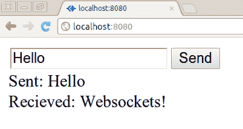

# 第五章：超越 AJAX：使用 WebSocket

在本章中，我们将涵盖：

+   创建 WebSocket 服务器

+   使用`socket.io`实现无缝回退

+   通过`socket.io`传输的回调

+   创建实时小部件

# 介绍

HTTP 并不适用于许多开发人员今天创建的实时网络应用程序。因此，已经发现了各种各样的解决方法来模拟服务器和客户端之间的双向，不间断的通信的想法。

WebSocket 不会模仿这种行为，它们提供了这种行为。WebSocket 通过剥离 HTTP 连接来工作，使其成为持久的类似 TCP 的交换，从而消除了 HTTP 引入的所有开销和限制。

当浏览器和服务器都支持 WebSocket 时，HTTP 连接被剥离（或升级）。浏览器通过 GET 标头与服务器通信来发现这一点。只有较新的浏览器（IE10+，Google Chrome 14，Safari 5，Firefox 6）支持 WebSocket。

WebSocket 是一个新协议。JavaScript 与 Node 框架通常足够灵活和低级，可以从头开始实现协议，或者无法实现的话，可以编写 C/C++模块来处理更晦涩或革命性的逻辑。幸运的是，我们不需要编写自己的协议实现，开源社区已经提供了。

在本章中，我们将使用一些第三方模块来探索 Node 和 WebSocket 强大组合的潜力。

# 创建 WebSocket 服务器

对于这个任务，我们将使用非核心的`websocket`模块来创建一个纯 WebSocket 服务器，该服务器将接收并响应来自浏览器的 WebSocket 请求。

## 准备就绪

我们将为我们的项目创建一个新文件夹，其中将包含两个文件：`server.js`和`client.html. server.js`。它们提供了服务器端的 websocket 功能并提供`client.html`文件。对于服务器端的 WebSocket 功能，我们还需要安装`websocket`模块：

```js
npm install websocket 

```

### 注意

有关`websocket`模块的更多信息，请参见[`www.github.com/Worlize/WebSocket-Node`](https://www.github.com/Worlize/WebSocket-Node)。

## 如何做...

WebSocket 是 HTTP 升级。因此，WebSocket 服务器在 HTTP 服务器之上运行。因此，我们将需要`http`和`websocket`服务器，另外我们还将加载我们的`client.html`文件（我们将很快创建）和`url`模块：

```js
var http = require('http');
var WSServer = require('websocket').server;
var url = require('url');
var clientHtml = require('fs').readFileSync('client.html');

```

现在让我们创建 HTTP 服务器，并将其提供给一个新的 WebSocket 服务器：

```js
var plainHttpServer = http.createServer(function (request, response) {
    response.writeHead(200, {'Content-type' : 'text/html'});
    response.end(clientHtml);
  }).listen(8080);

var webSocketServer = new WSServer({httpServer: plainHttpServer});

var accept = [ 'localhost', '127.0.0.1' ];

```

### 注意

我们将我们的 HTTP 服务器绑定到端口 8080，因为绑定到低于 1000 的端口需要 root 访问权限。这意味着我们的脚本必须以 root 权限执行，这是一个坏主意。有关如何安全地绑定到 HTTP 端口（80）的更多信息，请参见第十章，*搞定它*。

我们还创建了一个新的数组，称为`accept`。我们在 WebSocket 服务器内部使用它来限制哪些起始站点可以连接。在我们的示例中，我们只允许来自 localhost 或 127.0.0.1 的连接。如果我们正在进行实时主机，我们将在`accept`数组中包括指向我们服务器的任何域。

现在我们有了`webSocketServer`实例，我们可以侦听其`request`事件并做出相应的响应：

```js
webSocketServer.on('request', function (request) {
  request.origin = request.origin || '*'; //no origin? Then use * as wildcard.
  if (accept.indexOf(url.parse(request.origin).hostname) === -1) {
    request.reject();
    console.log('disallowed ' + request.origin);
    return;
  }

  var websocket = request.accept(null, request.origin);

  websocket.on('message', function (msg) {
    console.log('Recieved "' + msg.utf8Data + '" from ' + request.origin);
    if (msg.utf8Data === 'Hello') {
      websocket.send('WebSockets!');
    }
  });

  websocket.on('close', function (code, desc) {
   console.log('Disconnect: ' + code + ' - ' + desc);
  });

});

```

在我们的`request`事件回调中，我们有条件地接受请求，然后监听`message`和`close`事件，如果来自客户端的消息是`Hello`，则用**WebSockets!**做出响应。

现在对于客户端，我们将放置以下 HTML 结构：

```js
<html>
<head>
</head>
<body>
<input id=msg><button id=send>Send</button>
<div id=output></div>

<script>
//client side JavaScript will go here
</script>

</body>
</html>

```

我们的`script`标签的内容应如下所示：

```js
<script>
(function () {
  var ws = new WebSocket("ws://localhost:8080"),
    output = document.getElementById('output'),
    send = document.getElementById('send');

  function logStr(eventStr, msg) {
    return '<div>' + eventStr + ': ' + msg + '</div>';
  }  

  send.addEventListener('click', function () 
      var msg = document.getElementById('msg').value;
      ws.send(msg);
      output.innerHTML += logStr('Sent', msg);
  });

  ws.onmessage = function (e) {
    output.innerHTML += logStr('Recieved', e.data);
  };

  ws.onclose = function (e) {
    output.innerHTML += logStr('Disconnected', e.code + '-' + e.type);
  };

  ws.onerror = function (e) {
    output.innerHTML += logStr('Error', e.data);
  };  

}());

</script>

```

如果我们使用`node server.js`初始化我们的服务器，然后将我们的（支持 WebSocket 的）浏览器指向`http://localhost:8080`，在文本框中输入`Hello`，然后单击**发送**。终端控制台将输出：

```js
Recieved "Hello" from http://localhost:8080 

```

我们的浏览器将显示**Hello**已发送和**WebSockets!**已接收，如下面的屏幕截图所示：



我们可以使用我们的文本框发送任何我们想要的字符串到我们的服务器，但只有**Hello**会得到响应。

## 它是如何工作的...

在`server.js`中，当我们需要`websocket`模块的`server`方法时，我们将构造函数加载到`WSServer`中（这就是为什么我们将第一个字母大写）。我们使用`new`初始化`WSServer`，并传入我们的`plainHttpServer`，将其转换为一个启用了 WebSocket 的服务器。

HTTP 服务器仍然会提供普通的 HTTP 请求，但当它接收到 WebSocket 连接握手时，`webSocketServer`会开始建立与客户端的持久连接。

一旦`client.html`文件在浏览器中加载（由`server.js`中的 HTTP 服务器提供），并且内联脚本被执行，WebSocket 升级请求就会发送到服务器。

当服务器收到 WebSocket 升级请求时，`webSocketServer`会触发一个`request`事件，我们会使用我们的`accept`数组来仔细检查，然后决定是否响应。

我们的`accept`数组保存了一个白名单，允许与我们的 WebSocket 服务器进行接口交互的主机。只允许已知来源使用我们的 WebSocket 服务器，我们可以获得一些安全性。

在`webSocketServer request`事件中，使用`url.parse`解析`request.origin`以检索`origin` URL 的主机名部分。如果在我们的`accept`白名单中找不到主机名，我们就调用`request.reject`。

如果我们的源主机通过了，我们就从`request.accept`创建一个`websocket`变量。`request.accept`的第一个参数允许我们定义一个自定义子协议。我们可以使用多个具有不同子协议的`request.accepts`创建一个 WebSocket 数组，这些子协议代表不同的行为。在初始化客户端时，我们将传递一个包含该子协议的额外参数（例如，`new WebSocket("ws://localhost:8080", 'myCustomProtocol')`）。但是，我们传递`null`，因为对于我们的目的，不需要这样的功能。第二个参数允许我们通知`request.accept`我们希望允许的主机（还有第三个参数可用于传递 cookie）。

对于从客户端接收的每条消息，`WebSocket`都会发出一个`message`事件。这是我们将接收到的数据记录到`console`并检查传入消息是否为`Hello`的地方。如果是，我们使用`WebSocket.send`方法向客户端回复**WebSockets!**。

最后，我们监听`close`事件，通知`console`连接已经被终止。

## 还有更多...

WebSockets 对于高效、低延迟的实时 Web 应用有很大潜力，但兼容性可能是一个挑战。让我们看看 WebSockets 的其他用途，以及让 WebSockets 在 Firefox 中工作的技巧。

### 支持旧版 Firefox 浏览器

Firefox 6 到 11 版本支持 WebSockets。但是，它们使用供应商前缀，因此我们的`client.html`将无法在这些 Firefox 版本上运行。

为了解决这个问题，我们只需在`client.html`文件中的脚本前面添加以下内容：

```js
window.WebSocket = window.WebSocket || window.MozWebSocket;

```

如果`WebSocket` API 不存在，我们尝试`MozWebSocket`。

### 创建基于 Node 的 WebSocket 客户端

`websocket`模块还允许我们创建一个 WebSocket 客户端。我们可能希望将 Node 与现有的 WebSocket 服务器进行接口，这主要是为浏览器客户端（如果不是，最好创建一个简单的 TCP 服务器。参见第八章，*集成网络范式*）。

因此，让我们在`client.html`中使用 Node 实现相同的功能。我们将在同一目录中创建一个新文件，命名为`client.js`：

```js
var WSClient = require('websocket').client;

new WSClient()

  .on('connect', function (connection) {
    var msg = 'Hello';

    connection.send(msg);
    console.log('Sent: ' + msg);

    connection.on('message', function (msg) {
      console.log("Received: " + msg.utf8Data);
    }).on('close', function (code, desc) {
      console.log('Disconnected: ' + code + ' - ' + desc);
    }).on('error', function (error) {
      console.log("Error: " + error.toString());
    });

  })
  .on('connectFailed', function (error) {
    console.log('Connect Error: ' + error.toString());
  })
  .connect('ws://localhost:8080/', null, 'http://localhost:8080');

```

为了简洁起见，我们只是简单地将我们的`msg`变量硬编码，尽管我们可以使用`process.stdin`或`process.argv`来输入自定义消息。我们使用`websocket`模块的`client`方法初始化一个新的客户端。然后我们立即开始监听`connect`和`connectFailed`事件。

在两个`on`方法之后，我们链接`connect`方法。第一个参数是我们的 WebSocket 服务器，第二个是协议（记住，在我们的配方中，对于`request.accept`，我们有一个空协议），第三个定义了`request.origin`的值。

来源保护旨在防止仅从浏览器中起作用的攻击。因此，尽管我们可以在浏览器之外制造来源，但它并不构成同样的威胁。最大的威胁来自于对高流量站点进行 JavaScript 注入攻击，这可能导致大量未经授权的连接来自意外来源，从而导致**拒绝服务**。请参阅第七章, *实施安全、加密和认证*。

## 另请参阅

+   *在本章中讨论了使用 socket.io 进行无缝回退*

+   *提供静态文件* 第一章, 创建 Web 服务器

# 使用 socket.io 进行无缝回退

旧版浏览器不支持 WebSocket。因此，为了提供类似的体验，我们需要回退到各种浏览器/插件特定的技术，以模拟 WebSocket 功能，以最大程度地利用已弃用浏览器的能力。

这显然是一个雷区，需要数小时的浏览器测试，有时还需要对专有协议（例如 IE 的`Active X htmlfile`对象）有高度具体的了解。

`socket.io`为服务器和客户端提供了类似 WebSocket 的 API，以在各种浏览器中（包括旧版 IE 5.5+和移动端 iOS Safari、Android 浏览器）创建最佳实时体验。

除此之外，它还提供了便利功能，比如断开连接发现，允许自动重新连接，自定义事件，命名空间，通过网络调用回调（参见下一个配方*通过 socket.io 传输回调*），以及其他功能。

在这个配方中，我们将重新实现先前的任务，以实现高兼容性的 WebSocket 类型应用程序。

## 准备工作

我们将创建一个新的文件夹，其中包含新的`client.html`和`server.js`文件。我们还将安装`socket.io`模块：

```js
npm install socket.io 

```

## 如何做...

与`websocket`模块一样，`socket.io`可以附加到 HTTP 服务器（尽管对于`socket.io`来说并不是必需的）。让我们创建`http`服务器并加载`client.html`。在`server.js`中，我们写道：

```js
var http = require('http');
var clientHtml = require('fs').readFileSync('client.html');

var plainHttpServer = http.createServer(function (request, response) {
    response.writeHead(200, {'Content-type' : 'text/html'});
    response.end(clientHtml);
  }).listen(8080);

```

现在是`socket.io`部分（仍在`server.js`中）：

```js
var io = require('socket.io').listen(plainHttpServer);

io.set('origins', ['localhost:8080', '127.0.0.1:8080']) ;

io.sockets.on('connection', function (socket) {
  socket.on('message', function (msg) {
    if (msg === 'Hello') {
      socket.send('socket.io!');
    }
  });
});

```

这是服务器端，现在让我们创建我们的`client.html`文件：

```js
<html>
<head>
</head>
<body>
<input id=msg><button id=send>Send</button>
<div id=output></div>

<script src="img/socket.io.js"></script>
<script>
(function () {
  var socket = io.connect('ws://localhost:8080'),
    output = document.getElementById('output'),
    send = document.getElementById('send');

  function logStr(eventStr, msg) {
    return '<div>' + eventStr + ': ' + msg + '</div>';
  } 
  socket.on('connect', function () {
    send.addEventListener('click', function () {
      var msg = document.getElementById('msg').value;
      socket.send(msg);
      output.innerHTML += logStr('Sent', msg);
    });

    socket.on('message', function (msg) {
      output.innerHTML += logStr('Recieved', msg);
    });

  });

}());
</script>
</body>
</html>

```

最终产品基本上与上一个配方相同，只是它还可以在不兼容 WebSocket 的旧浏览器中无缝运行。我们输入`Hello`，按下**发送**按钮，服务器回复**socket.io!**。

## 它是如何工作的...

我们不再将 HTTP 服务器传递给选项对象，而是简单地将其传递给`listen`方法。

我们使用`io.set`来定义我们的来源白名单，`socket.io`为我们完成了繁重的工作。

接下来，我们监听`io.sockets`上的`connection`事件，这为我们提供了一个客户端的`socket`（就像`request.accept`在上一个配方中生成了我们的`WebSocket`连接一样）。

在`connection`中，我们监听`socket`上的`message`事件，检查传入的`msg`是否为`Hello`。如果是，我们会回复`socket.io!`。

当`socket.io`初始化时，它开始通过 HTTP 提供客户端代码。因此，在我们的`client.html`文件中，我们从`/socket.io/socket.io.js`加载`socket.io.js`客户端脚本。

客户端的`socket.io.js`提供了一个全局的`io`对象。通过调用它的`connect`方法并提供我们服务器的地址，我们可以获得相关的`socket`。

我们向服务器发送我们的`Hello msg`，并通过`#output div`元素告诉服务器我们已经这样做了。

当服务器收到`Hello`时，它会回复`socket.io!`，这会触发客户端的`message`事件回调。

现在我们有了`msg`参数（与我们的`msg Hello`变量不同），其中包含来自服务器的消息，因此我们将其输出到我们的`#output div`元素。

## 还有更多...

`socket.io`建立在标准的 WebSocket API 之上。让我们探索一些`socket.io`的附加功能。

### 自定义事件

`socket.io`允许我们定义自己的事件，而不仅仅是`message, connect`和`disconnect`。我们以相同的方式监听自定义事件（使用`on`），但使用`emit`方法来初始化它们。

让我们从服务器向客户端`emit`一个自定义事件，然后通过向服务器发出另一个自定义事件来响应客户端。

我们可以使用与我们的配方相同的代码，我们将更改的唯一部分是`server.js`中`connection`事件监听器回调的内容（我们将其复制为`custom_events_server.js`）和`client.html`中`connect`事件处理程序的内容（我们将其复制为`custom_events_client.html`）。

因此，对于我们的服务器代码：

```js
//require http, load client.html, create plainHttpServer
//require and initialize socket.io, set origin rules

io.sockets.on('connection', function (socket) {
  socket.emit('hello', 'socket.io!');
  socket.on(''helloback, function (from) {
    console.log('Received a helloback from ' + from);
  });
});

```

我们的服务器发出一个`hello`事件，向新连接的客户端发送`socket.io!`，并等待来自客户端的`helloback`事件。

因此，我们相应地修改`custom_events_client.html`中的 JavaScript：

```js
//html structure, #output div, script[src=/socket.io/socket.io.js] tag
socket.on('connect', function () {
  socket.on('hello', function (msg) {
    output.innerHTML += '<div>Hello ' + msg + '</div>';
    socket.emit('helloback', 'the client');
  });
});

```

当我们收到`hello`事件时，我们记录到我们的`#output div`（其中将显示`Hello socket.io!`），并向服务器`emit`一个`helloback`事件，将客户端作为预期的`from`参数传递。

### 命名空间

使用`socket.io`，我们可以描述命名空间或路由，然后在客户端通过`io.connect`访问它们的 URL：

```js
io.connect('ws://localhost:8080/namespacehere');

```

**命名空间**允许我们在共享相同上下文的同时创建不同的范围。在`socket.io`中，命名空间用作为多个目的共享单个 WebSocket（或其他传输）连接的一种方式。请参阅[`en.wikipedia.org/wiki/Namespace`](http://en.wikipedia.org/wiki/Namespace)和[`en.wikipedia.org/wiki/Namespace_(computer_science)`](http://en.wikipedia.org/wiki/Namespace_(computer_science))。

通过一系列`io.connect`调用，我们能够定义多个 WebSocket 路由。但是，这不会创建多个连接到我们的服务器。`socket.io`将它们多路复用（或组合）为一个连接，并在服务器内部管理命名空间逻辑，这样成本就会低得多。

我们将通过将代码从第三章“使用 AJAX 在浏览器和服务器之间传输数据”中讨论的*数据序列化*的配方升级为基于`socket.io`的应用程序来演示命名空间。

首先，让我们创建一个文件夹，称之为`namespacing`，并将原始的`index.html, server.js, buildXml.js`和`profiles.js`文件复制到其中。`Profiles.js`和`buildXml.js`是支持文件，所以我们可以不管它们。

我们可以简化我们的`server.js`文件，删除与`routes`和`mimes`有关的所有内容，并将`http.createServer`回调减少到其最后的`response.end`行。我们不再需要 path 模块，因此我们将删除它，并最终将我们的服务器包装在`socket.io listen`方法中：

```js
var http = require('http');
var fs = require('fs');
var profiles = require('./profiles');
var buildXml = require('./buildXml');
var index = fs.readFileSync('index.html');
var io = require('socket.io').listen(
    http.createServer(function (request, response) {
      response.end(index);
    }).listen(8080)
  );

```

为了声明我们的命名空间及其连接处理程序，我们使用`of`如下：

```js
io.of('/json').on('connection', function (socket) {
  socket.on('profiles', function (cb) {
    cb(Object.keys(profiles));
  });

  socket.on('profile', function (profile) {
    socket.emit('profile', profiles[profile]);
  });
});

io.of('/xml').on('connection', function (socket) {
  socket.on('profile', function (profile) {
    socket.emit('profile', buildXml(profiles[profile]));
  });
});

```

在我们的`index.html`文件中，我们包括`socket.io.js`，并连接到命名空间：

```js
<script src=socket.io/socket.io.js></script>
<script>
(function () {  // open anonymous function to protect global scope
  var formats = {
    json: io.connect('ws://localhost:8080/json'),
    xml: io.connect('ws://localhost:8080/xml')
  };
formats.json.on('connect', function () {
  $('#profiles').html('<option></option>');
   this.emit('profiles', function (profile_names) {
      $.each(profile_names, function (i, pname) {
       $('#profiles').append('<option>' + pname + '</option>');
      });
   });
});

$('#profiles, #formats').change(function () {
  var socket = formats[$('#formats').val()];  
  socket.emit('profile', $('#profiles').val());
});

formats.json.on('profile', function(profile) {
    $('#raw').val(JSON.stringify(profile));
    $('#output').html('');
    $.each(profile, function (k, v) {
          $('#output').append('<b>' + k + '</b> : ' + v + '<br>');
        });
});

formats.xml.on('profile', function(profile) {
      $('#raw').val(profile);
      $('#output').html('');
       $.each($(profile)[1].nextSibling.childNodes,
          function (k, v) {
            if (v && v.nodeType === 1) {
              $('#output').append('<b>' + v.localName + '</b> : '
		     + v.textContent + '<br>');
            }
          });  
}());

```

一旦连接，服务器将使用`profile_names`数组发出`profiles`事件，我们的客户端接收并处理它。我们的客户端向相关命名空间发出自定义`profile`事件，并且每个命名空间套接字都会监听来自服务器的`profile`事件，并根据其格式进行处理（由命名空间确定）。

命名空间允许我们分离关注点，而无需使用多个`socket.io`客户端（由于多路复用）。与 WebSocket 中的子协议概念类似，我们可以将某些行为限制在某些命名空间中，从而使我们的代码更易读，并减轻多方面实时 Web 应用程序中涉及的心理复杂性。

## 另请参阅

+   *在本章中讨论的创建 WebSocket 服务器*

+   *在本章中讨论的通过 socket.io 传输回调*

+   *在本章中讨论的创建实时小部件*

# 通过 socket.io 传输回调

使用`socket.io`，我们可以通过 WebSockets（或相关的回退）执行回调函数。该函数在客户端定义，但在服务器端调用（反之亦然）。这可以是在客户端和服务器之间共享处理资源和功能的非常强大的方式。

在这个配方中，我们将创建一种让服务器调用客户端函数的方法，该函数可以对一个数字进行平方，并且让客户端调用一个将句子的 Base64 编码（[`en.wikipedia.org/wiki/Base64`](http://en.wikipedia.org/wiki/Base64)）发送回客户端的服务器端函数。

## 准备工作

我们只需要创建一个新文件夹，其中包括新的`client.html`和`server.js`文件。

## 如何做...

在我们的服务器上，与以前一样，我们加载我们的`http`模块和`client.html`文件，创建我们的 HTTP 服务器，附加`socket.io`，并设置`origins`策略。

```js
var http = require('http');
var clientHtml = require('fs').readFileSync('client.html');

var plainHttpServer = http.createServer(function (request, response) {
    response.writeHead(200, {'Content-type' : 'text/html'});
    response.end(clientHtml);
  }).listen(8080);

var io = require('socket.io').listen(plainHttpServer);
io.set('origins', ['localhost:8080', '127.0.0.1:8080']);

```

接下来，在我们的`connection`事件处理程序中，我们监听来自客户端的自定义事件`give me a number`，并从服务器`emit`一个自定义事件`give me a sentence`。

```js
io.sockets.on('connection', function (socket) {

  socket.on('give me a number', function (cb) {
    cb(4);
  });

  socket.emit('give me a sentence', function (sentence) {
    socket.send(new Buffer(sentence).toString('base64'));
  });

});

```

在我们的`client.html`文件中：

```js
<html>
<head> </head>
<body>
<div id=output></div>
<script src="img/socket.io.js"></script>
<script>
  var socket = io.connect('http://localhost:8080'),
    output = document.getElementById('output');

  function square(num) {
    output.innerHTML = "<div>" + num + " x " + num + " is "
						   + (num * num) + "</div>";
  }

  socket.on('connect', function () {  
    socket.emit('give me a number', square);

    socket.on('give me a sentence', function (cb) {
      cb('Ok, here is a sentence.');
    });

   socket.on('message', function (msg) {
      output.innerHTML += '<div>Recieved: ' + msg + '</div>';
    });
  });

</script>
</body> </html>

```

## 它是如何工作的...

连接后立即，服务器和客户端都会相互`emit`一个自定义的`socket.io`事件。

有关自定义`socket.io`事件，请参阅上一个配方*与 socket.io 无缝回退*的*还有更多..*部分。

对于客户端和服务器，当我们将函数作为`emit, socket.io`的第二个参数传递时，`socket.io`会在相应的事件监听器的回调中创建一个特殊的参数（`cb`）。在这种情况下，`cb`不是实际的函数（如果是，它将在调用它的上下文中简单运行），而是一个内部的`socket.io`函数，它将参数传递回到电线的另一侧的`emit`方法。然后`emit`将这些参数传递给它的回调函数，从而在本地上下文中执行函数。

我们知道这些函数在自己的上下文中运行。如果服务器端的`give me a sentence`回调在客户端上执行，它将失败，因为浏览器中没有`Buffer`对象。如果`give me a number`在服务器上运行，它将失败，因为 Node 中没有 DOM（文档对象模型）（也就是说，没有 HTML，因此没有`document`对象和`document.getElementById`方法）。

## 还有更多...

`socket.io`可以成为更高级专业化框架的良好基础。

### 使用 Nowjs 共享函数

Nowjs 将`socket.io`的回调功能推断为更简单的 API，允许我们通过客户端上的全局`now`对象和服务器上的`everyone.now`对象共享函数。让我们获取`now`模块：

```js
npm install now 

```

设置 Nowjs 让人不寒而栗：

```js
var http = require('http');
var clientHtml = require('fs').readFileSync('now_client.html');

var plainHttpServer = http.createServer(function (request, response) {
    response.writeHead(200, {'Content-type' : 'text/html'});
    response.end(clientHtml);
  }).listen(8080);

var everyone = require('now').initialize(plainHttpServer);
everyone.set('origins', ['localhost:8080', '127.0.0.1:8080']);

```

`clientHtml`文件加载`now_client.html`，而不是`io`，我们有`everyone`，而不是调用`listen`，我们调用`initialize`。到目前为止，其他一切都是一样的（当然，需要`now`而不是`socket.io`）。

我们将使用`now`重新实现我们的配方，以完成我们放置的服务器。

```js
everyone.now.base64 = function(sentence, cb) {
  cb(new Buffer(sentence).toString('base64'));
}

everyone.on('connect', function () {
  this.now.square(4);
});

```

让我们将服务器保存为`now_server.js`，在`now_client.html`中编写以下代码：

```js
<html>
<head></head>
<body>
<div id=output></div>
<script src="img/now.js"></script>
<script>  
var output = document.getElementById('output');
now.square = function (num) {
  output.innerHTML = "<div>" + num + " x " + num + " is " + (num * num) + "</div>";
}

now.ready(function () {  
  now.base64('base64 me server side, function (msg) {
    output.innerHTML += '<div>Recieved: ' + msg + '</div>';
  });
});
</script>
</body></html>

```

NowJS 使函数共享变得微不足道。在服务器端，我们只需在`everyone.now`上设置我们的`base64`方法，这样`base64`就可以在所有客户端上使用。

然后我们监听`connect`事件，当它发生时，我们调用`this.now.square`。在这个上下文中，`this`是我们客户端的 socket，所以`this.now.square`调用`now_client.html`中包含的`now.square`方法。

在我们的客户端中，我们不是加载`socket.io.js`，而是包含`now.js`，其路由在服务器初始化时公开。这为我们提供了全局的`now`对象，我们在其中设置我们的`square`函数方法。

一旦建立连接（使用`now.ready`检测），我们使用回调调用`now.base64`从服务器到客户端拉取数据。

## 另请参阅

+   *与 socket.io 无缝回退*在本章中讨论

+   *在本章中讨论创建实时小部件*

+   *通过 AJAX 进行浏览器-服务器传输在* 第三章 *中讨论，与数据序列化一起工作*

# 创建一个实时小部件

socket.io 的配置选项和深思熟虑的方法使其成为一个非常灵活的库。让我们通过制作一个实时小部件来探索`socket.io`的灵活性，该小部件可以放置在任何网站上，并立即与远程`socket.io`服务器进行接口，以开始提供当前网站上所有用户的不断更新的总数。我们将其命名为“实时在线计数器（loc）”。

我们的小部件是为了方便用户使用，应该需要非常少的知识才能使其工作，因此我们希望有一个非常简单的接口。通过`script`标签加载我们的小部件，然后使用预制的`init`方法初始化小部件将是理想的（这样我们可以在初始化之前预定义属性，如果有必要的话）。

## 准备就绪

我们需要创建一个新的文件夹，其中包含一些新文件：`widget_server.js，widget_client.js，server.js`和`index.html`。

在开始之前，让我们还从`npm`获取`socket.io-client`模块。我们将使用它来构建我们的自定义`socket.io`客户端代码。

```js
npm install socket.io-client 

```

## 如何做...

让我们创建`index.html`来定义我们想要的界面类型，如下所示：

```js
<html>
<head>
<style>
#_loc {color:blue;} /* widget customization */
</style>
</head>
<body>
<h1> My Web Page </h1>
<script src=http://localhost:8081/loc/widget_server.js></script>
<script> locWidget.init(); </script>
</body></html>

```

我们希望向`/loc/widget_server.js`公开一个路由，其中包含我们的 loc 小部件。在幕后，我们的小部件将保存在`widget_client.js`中。

所以让我们做一下：

```js
  window.locWidget = {
    style : 'position:absolute;bottom:0;right:0;font-size:3em',
    init : function () {
      var socket = io.connect('http://localhost:8081', {resource: 'loc'}),
        style = this.style;
      socket.on('connect', function () {
        var head = document.getElementsByTagName('head')[0],
          body = document.getElementsByTagName('body')[0],
          loc = document.getElementById('_lo_count');
        if (!loc) {
          head.innerHTML = '<style>#_loc {' + style + '}</style>'
            + head.innerHTML;

          body.innerHTML +=
            '<div id=_loc>Online: <span id=_lo_count></span></div>';

          loc = document.getElementById('_lo_count');
        }

        socket.on('total', function (total) {
          loc.innerHTML = total;
        });
      });
    }
  }

```

我们需要从多个域测试我们的小部件，因此我们将实现一个快速的 HTTP 服务器（`server.js`）来提供`index.html`，以便我们可以通过`http://127.0.0.1:8080`和`http://localhost:8080`访问它，这样我们就可以获得多个域。

```js
var http = require('http');
var fs = require('fs');
var clientHtml = fs.readFileSync('index.html');

http.createServer(function (request, response) {
    response.writeHead(200, {'Content-type' : 'text/html'});
    response.end(clientHtml);
}).listen(8080);

```

最后，我们的小部件服务器，在`widget_server.js`中编写：

```js
var io = require('socket.io').listen(8081);
var sioclient = require('socket.io-client');
var widgetScript = require('fs').readFileSync('widget_client.js');
var url = require('url');

var totals = {};

io.configure(function () {
  io.set('resource', '/loc');
  io.enable('browser client gzip');
});

sioclient.builder(io.transports(), function (err, siojs) {
  if (!err) {
    io.static.add('/widget.js', function (path, callback) {
      callback(null, new Buffer(siojs + ';' + widgetScript));
    });
  }
});

io.sockets.on('connection', function (socket) {
  var origin = (socket.handshake.xdomain)
    ? url.parse(socket.handshake.headers.origin).hostname
    : 'local';

  totals[origin] = (totals[origin]) || 0;
  totals[origin] += 1;
  socket.join(origin);

  io.sockets.to(origin).emit('total', totals[origin]);
  socket.on('disconnect', function () {
    totals[origin] -= 1;
    io.sockets.to(origin).emit('total', totals[origin]);
  });
});

```

为了测试，我们需要两个终端，在一个终端中执行：

```js
node widget_server.js 

```

在另一个终端中执行：

```js
node server.js 

```

如果我们将浏览器指向`http://localhost:8080`，打开一个新的标签页或窗口并导航到`http://localhost:8080`。同样，我们将看到计数器增加一个。如果我们关闭任一窗口，它将减少一个。我们还可以导航到`http://127.0.0.1:8080`以模拟一个独立的来源。该地址上的计数器与`http://localhost:8080`上的计数器是独立的。

## 它是如何工作的...

`widget_server.js`是这个配方的核心。我们首先需要`socket.io`并调用`listen`方法。与之前的任务不同，我们不是将其作为`httpServer`实例传递，而是将其传递给端口号`8081`。如果我们将`ws://localhost:8081`视为许多客户端小部件连接到的远程服务器，这将有所帮助。

下一个要求是`socket.io-client`，我们将其加载到我们的`sioclient`变量中。

通过`sioclient`，我们可以访问`sioclient.builder`方法来生成一个`socket.io.js`文件。将其连接到`widgetScript`以有效地创建一个包含`socket.io.js`和`widget_client.js`的单个 JavaScript 文件。我们将 HTTP 路由命名为此文件`widget.js`。将`socket.io.js`文件连接到我们的`widgetScript`时，我们在两者之间放置一个分号，以确保脚本不会相互干扰。

我们向`builder`方法传递了两个参数，第一个是传输数组。这些是创建实时效果的各种方法（例如 WebSockets，AJAX（xhr）轮询）。数组中较早出现的传输方法更受青睐。数组是使用`transports`方法生成的。由于我们在配置期间没有设置任何传输，因此提供了默认传输数组。第二个参数是回调。在这里，我们可以通过`siojs`参数获取生成的`socket.io.js`文件。

我们的小部件纯粹是 JavaScript 的事务，可以插入到任何网站的任何 HTML 页面中。`socket.io`有一个内部 HTTP 服务器用于提供 JavaScript 客户端文件。我们使用`io.static.add`（一旦我们有了生成的`socket.io.js`）将一个新的路由推送到`socket.io`的内部 HTTP 服务器上，而不是创建一个 HTTP 服务器来提供我们的客户端小部件代码。`io.static.add`的第二个参数是一个回调函数，其中又有一个传递给它的函数名为`callback`。

`callback`是`socket.io`的一部分，它将内容添加到新定义的路由。第一个参数可以指向一个文字文件，但我们正在动态生成代码，所以我们传递`null`。对于第二个参数，我们将`siojs`与`widgetScript`传递给`Buffer`，然后创建我们的路由。

通过更改`resource`属性以更改到`socket.io`的内部 HTTP 服务器路由的路由，`io.set`帮助我们为我们的小部件进行品牌推广。因此，我们的组合`widget.js`路由将不再出现在`/socket.io/widget.js`，而是将出现在`/loc/widget.js`。

为了从客户端连接到我们配置的静态资源路由，我们必须在`widget_client.js`中向`io.connect`传递一个`options`对象。请注意斜杠前缀的缺失。斜杠前缀在服务器端是强制性的，但对于客户端来说是必须省略的。

现在舞台已经为实际的套接字操作做好了准备。我们通过在`io.sockets`上监听`connection`事件来等待连接。在事件处理程序内部，我们使用了一些尚未讨论的`socket.io`特性。

当客户端发起 HTTP 握手请求并且服务器肯定地响应时，WebSocket 就形成了。`socket.handshake`包含握手的属性。

`socket.handshake.xdomain`告诉我们握手是否是从同一服务器发起的。在检索`socket.handshake.headers.origin`的`hostname`之前，我们将检查跨服务器握手。

相同域名握手的来源要么是`null`，要么是`undefined`（取决于它是本地文件握手还是本地主机握手）。后者会导致`url.parse`出错，而前者则不理想。因此，对于相同域名握手，我们只需将我们的`origin`变量设置为`local`。

我们提取（并简化）`origin`，因为它允许我们区分使用小部件的网站，从而实现特定于网站的计数。

为了计数，我们使用我们的`totals`对象，并为每个新的`origin`添加一个初始值为`0`的属性。在每次连接时，我们将`1`添加到`totals[origin]`，并监听我们的`socket`以获取`disconnect`事件，从`totals[origin]`中减去`1`。

如果这些值仅用于服务器使用，我们的解决方案将是完整的。但是，我们需要一种方法来向客户端通信总连接数，但仅限于他们所在的网站。

`socket.io`自版本 7 以来有一个方便的新功能，它允许我们使用`socket.join`方法将套接字分组到房间中。我们让每个套接字加入以其`origin`命名的房间，然后我们使用`io.sockets.to(origin).emit`方法指示`socket.io`只向属于原始`sites`房间的套接字`emit`。

在`io.sockets connection`事件和`socket disconnect`事件中，我们向相应的套接字`emit`我们特定的`totals`，以便更新每个客户端连接到用户所在网站的总连接数。

`widget_client.js`简单地创建一个名为`#_loc`的`div`，并使用它更新从`widget_server.js`接收到的任何新的`totals`。

## 还有更多...

让我们看看如何使我们的应用程序更具可扩展性，以及 WebSocket 的另一个用途。

### 为可扩展性做准备

如果我们要为成千上万的网站提供服务，我们需要可扩展的内存存储，Redis 将是一个完美的选择。它在内存中运行，但也允许我们跨多个服务器进行扩展。

### 注意

我们需要安装 Redis，以及 `redis` 模块。更多信息请参见第四章，与数据库交互

我们将修改我们的 `totals` 变量，使其包含一个 Redis 客户端而不是一个 JavaScript 对象：

```js
var totals = require('redis').createClient();

```

现在我们修改我们的 `connection` 事件处理程序如下：

```js
io.sockets.on('connection', function (socket) {
  var origin = (socket.handshake.xdomain)
    ? url.parse(socket.handshake.headers.origin).hostname
    : 'local';
  socket.join(origin);

  totals.incr(origin, function (err, total) {
    io.sockets.to(origin).emit('total', total);  
  });

  socket.on('disconnect', function () {
    totals.decr(origin, function (err, total) {
      io.sockets.to(origin).emit('total', total); 
    });
  });
});

```

我们不再将 `totals[origin]` 加一，而是使用 Redis 的 `INCR` 命令来增加一个名为 `origin` 的 Redis 键。如果键不存在，Redis 会自动创建它。当客户端断开连接时，我们会执行相反的操作，并使用 `DECR` 调整 `totals`。

### WebSockets 作为开发工具

在开发网站时，我们经常在编辑器中更改一些小东西，上传我们的文件（如果需要），刷新浏览器，然后等待看到结果。如果浏览器在我们保存与网站相关的任何文件时自动刷新会怎么样？我们可以通过 `fs.watch` 和 WebSockets 实现这一点。`fs.watch` 监视一个目录，在文件夹中的任何文件发生更改时执行回调（但它不监视子文件夹）。

### 注意

`fs.watch` 是依赖于操作系统的。到目前为止，`fs.watch` 也一直存在着历史性的 bug（主要是在 Mac OS X 下）。因此，在进一步改进之前，`fs.watch` 更适合于开发环境而不是生产环境（您可以通过查看这里的已打开和已关闭的问题来监视 `fs.watch` 的运行情况：[`github.com/joyent/node/issues/search?q=fs.watch)`](https://github.com/joyent/node/issues/search?q=fs.watch)）。

我们的开发工具可以与任何框架一起使用，从 PHP 到静态文件。对于一个通用的服务器，让我们从第一章中的 *提供静态文件* 这个配方中测试我们的工具。我们将文件（包括 `content` 文件夹）从该配方复制到一个新文件夹中，我们可以将其命名为 `watcher`。

对于我们工具的服务器端对应部分，我们将创建 `watcher.js`：

```js
var fs = require('fs');
var io = require('socket.io').listen(8081);
var sioclient = require('socket.io-client');

var watcher = [';(function () {',
               '  var socket = io.connect(\'ws://localhost:8081\');',
               '  socket.on(\'update\', function () {',
               '    location.reload()',
               '  });',
               '}())'].join('');

sioclient.builder(io.transports(), function (err, siojs) {
  if (!err) {
    io.static.add('/watcher.js', function (path, callback) {
      callback(null, new Buffer(siojs + watcher));
    });
  }
});

fs.watch('content', function (e, f) {
  if (f[0] !== '.') {
    io.sockets.emit('update');
  }
});

```

这段代码大部分都很熟悉。我们创建了一个 `socket.io` 服务器（在不同的端口上以避免冲突），生成了一个连接的 `socket.io.js` 加上客户端 `watcher` 代码文件，并将其添加到 `socket.io` 的静态资源中。由于这是我们自己开发使用的一个快速工具，我们的客户端代码被写成一个字符串赋值给 `watcher` 变量。

最后一段代码调用了 `fs.watch` 方法，其中回调接收事件名称（`e`）和文件名（`f`）。

我们检查文件名是否不是隐藏的点文件。在保存事件期间，一些文件系统或编辑器会更改目录中的隐藏文件，从而触发多个回调，发送多个消息，速度很快，这可能会对浏览器造成问题。

要使用它，我们只需将其放置在每个页面中作为脚本（可能使用服务器端模板）。然而，为了演示目的，我们只需将以下代码放入 `content/index.html` 中：

```js
<script src=http://localhost:8081/socket.io/watcher.js></script>

```

一旦我们启动了 `server.js` 和 `watcher.js`，我们就可以将浏览器指向 `http://localhost:8080`，并从第一章中看到熟悉的激动人心的 **Yay!**。我们所做的任何更改和保存（无论是对 `index.html, styles.css, script.js` 进行更改，还是添加新文件）几乎会立即在浏览器中反映出来。我们可以做的第一个更改是摆脱 `script.js` 中的警报框，以便更流畅地看到更改。

## 另见

+   *创建 WebSocket 服务器* 在本章中讨论

+   *使用 socket.io 实现无缝回退* 在本章中讨论

+   *使用 Redis 存储和检索数据* 在第四章中讨论
