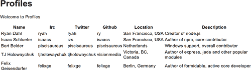
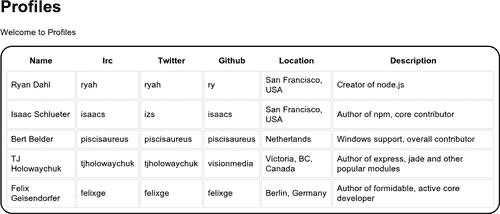
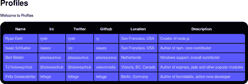
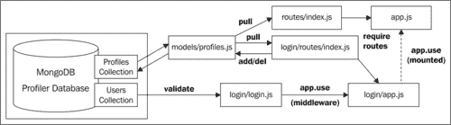
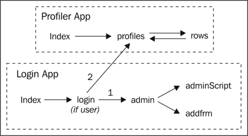
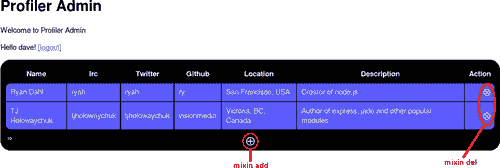
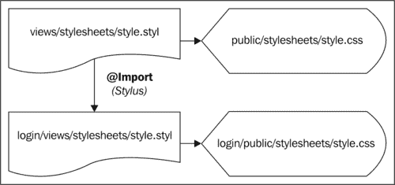

# 第六章：使用 Express 加速开发

在本章中，我们将涵盖：

+   生成 Express 脚手架

+   定义和应用环境

+   动态路由

+   Express 中的模板

+   Express 中的 CSS 引擎

+   初始化和使用会话

+   创建一个 Express Web 应用程序

# 介绍

尽管 Node 的 HTTP 模块非常出色，但 Express 重新打包和简化了其功能，为我们提供了一个流畅的接口，几乎没有摩擦的快速 Web 开发。

在本章中，我们将从生成一个普通的 Express 项目基础开始，到一个完整的 Express Web 应用程序基础，MongoDB 提供后端数据支持。

### 提示

**Express 2 到 Express 3**

在本章中，有一些有用的提示框，比如这个，演示了如何将代码从 Express 2 迁移到 Express 3。支持代码文件包含了 Express 2 和 3 的代码（3 被注释掉）。代码文件可以从[`www.packtpub.com/support`](http://www.packtpub.com/support)下载。

# 生成 Express 脚手架

Express 既可以作为一个 Node 模块，也可以作为一个命令行可执行文件。当我们从命令行运行`express`时，它会为我们生成一个项目骨架，加快准备过程。

## 准备工作

我们需要使用`-g`标志（全局安装）来安装`express`，以便从任何目录运行`express`可执行文件。

```js
sudo npm -g install express 

```

我们使用`sudo`来确保我们获得全局安装的权限。这在 Windows 下不适用。

## 如何做...

首先，我们决定我们应用的名称。让我们称之为`nca`（Node Cookbook App），然后简单地执行：

```js
express nca 

```

这将在一个名为`nca`的新目录下生成所有项目文件。在我们运行应用之前，我们必须确保所有依赖项都已安装。我们可以在`nca/package.json`中找到应用的依赖项：

```js
{
    "name": "application-name"
  , "version": "0.0.1"
  , "private": true
  , "dependencies": {
      "express": "2.5.8"
    , "jade": ">= 0.0.1"
  }
}

```

为了可移植性，重要的是在`project`文件夹中安装相关模块。为了实现这一点，我们只需在命令行中`cd`进入`nca`目录，然后输入：

```js
npm install 

```

这将在我们的`project`文件夹中创建一个新的`node_modules`目录，其中包含所有的依赖项。

## 它是如何工作的...

当我们运行`express`可执行文件时，它会创建一个适合 Express 开发的文件夹结构。在项目根目录中，我们有`app.js`和`package.json`文件。

`package.json`是由 CommonJS 组（一个 Javascript 标准社区）建立的约定，并已成为描述 Node 中模块和应用的已建立方法。

`npm install`命令从`package.json`中解析依赖项，在`node_modules`文件夹中本地安装它们。

这很重要，因为它确保了稳定性。Node 的`require`函数在搜索父目录之前会在当前工作目录中寻找`node_modules`文件夹。如果我们在父目录中升级任何模块，我们的项目将继续使用构建时的相同版本。本地安装模块允许我们将项目与其依赖项一起分发。

`app.js`文件是我们项目的样板。我们用以下命令运行我们的应用：

```js
node app.js 

```

`express`可执行文件将三个子目录添加到项目文件夹中：`public, routes`和`views`。

`public`是`app.js`传递给`express.static`方法的默认文件夹，所有静态文件都放在这里。它包含`images, javascripts`和`stylesheets`文件夹，每个文件夹都有自己明显的目的。

`routes`文件夹包含`index.js`，被`app.js`所需。为了定义我们的路由，我们将它们推送到 Node 的`exports`对象上（我们将在第九章中学到更多关于*编写自己的 Node 模块*）。使用`routes/index.js`有助于避免`app.js`中的混乱，并将服务器代码与路由代码分开。这样我们可以纯粹地专注于我们的服务器，或者纯粹地专注于我们的路由。

最后，`views`包含模板文件，这可以真正帮助加速开发。我们将在*Express 中的模板*中了解如何处理视图。

## 还有更多...

让我们花一些时间深入了解我们生成的项目。

### 解析 app.js

让我们来看一下我们生成的`app.js`文件：

```js
 var express = require('express')
  , routes = require('./routes')
var app = module.exports = express.createServer();
// Configuration
app.configure(function(){
  app.set('views', __dirname + '/views');
  app.set('view engine', 'jade');
  app.use(express.bodyParser());
  app.use(express.methodOverride());
  app.use(app.router);
  app.use(express.static(__dirname + '/public'));
});

app.configure('development', function(){
  app.use(express.errorHandler({ dumpExceptions: true, showStack: true }));
});

app.configure('production', function(){
  app.use(express.errorHandler());
});

// Routes

app.get('/', routes.index);

app.listen(3000, function(){

  console.log("Express server listening on port %d in %s mode", app.address().port, app.settings.env);

});

```

`app`变量保存了`express.createServer`的结果，这实质上是一个增强的`http.createServer`。

`configure`方法被调用了三次：一次用于全局设置，一次用于生产环境，一次用于开发环境。我们将在下一个示例中更详细地查看生产环境和开发环境。

在全局`configure`回调中，设置了默认的视图目录（`views`）和引擎（`jade`），并告诉`app`使用“express.bodyParser, express.methodOverride, app.router”和`express.static`中间件。

`bodyParser`在第二章*探索 HTTP 对象*的第一个示例的*还有更多..*部分中简要出现，以`connect.bodyParser`的形式。

Express 包含所有标准的 Connect 中间件，并兼容附加的 Connect 中间件。因此，在 Express 项目中，使用“express.bodyParser”加载`bodyParser`。bodyParser 使我们能够访问从客户端发送的任何数据（例如在 POST 请求中）。

`methodOverride`允许我们使用名为`_method`的隐藏输入元素从浏览器表单中进行伪`DELETE`和`PUT`请求。例如：

```js
<input type=hidden name='_method' value='DELETE'>

```

在超文本传输协议文档中定义了许多 HTTP 方法（参见[`www.w3.org/Protocols/rfc2616/rfc2616-sec9.html)`](http://www.w3.org/Protocols/rfc2616/rfc2616-sec9.html)）。然而，浏览器通常只支持 GET 和 POST，其他方法留给特定客户端支持。Express 通过使用隐藏输入来模拟`DELETE`请求来解决浏览器支持不足的问题，同时还支持来自支持该方法的客户端的真实 DELETE 请求。

`app.router`包含了所有定义的路由（传递给`app.get, app.post`等）。路由本身就是中间件。如果没有将`app.router`传递给`app.use`，则路由将自动附加到中间件堆栈。但是，通过手动包含，我们可以在`app.router`中间件之后放置其他中间件。

中间件通常构造如下：

```js
function (req, res, next) {
	//do stuff
	next();
}

```

`next`参数是一种回调机制，它加载任何随后的中间件。因此，当`app.router`位于`express.static`之上时，客户端访问的任何动态路由都不会不必要地触发静态服务器去寻找不存在的文件，除非这些路由调用`next`（或者可以将`next`作为“req: req.next()”的方法调用）。有关中间件的更多信息，请参阅[`www.expressjs.com/guide.html#middleware`](http://www.expressjs.com/guide.html#middleware)。

### 查看 routes/index.js

在`app.js, routes/index.js`中加载了一个`require:`

```js
, routes = require('./routes')

```

请注意，`index`没有指定，但是如果将目录传递给`require`，Node 将自动查找`index.js`。让我们来看一下：

```js
exports.index = function(req, res){
  res.render('index', { title: 'Express' })
};

```

将`index`推送到`exports`对象中，使其在`app.js`中作为`routes.index`可用，并将其传递给`app.get`如下：

```js
app.get('/', routes.index);

```

`routes.index`函数应该看起来很熟悉。它遵循了`http.createServer`回调的模式，但是特定于路由。请求（`req`）和响应（`res`）参数由 Express 增强。我们将在接下来的示例中详细了解这些内容。该函数本身只是调用`res.render`方法，该方法从`views/index.jade`加载模板，将`title`作为变量传递，然后将生成的内容输出到客户端。

## 另请参阅

+   在本章中讨论的*定义和应用环境*

+   在本章中讨论的*动态路由*

+   在本章中讨论的*Express 中的模板*

# 定义和应用环境

开发和生产代码有不同的要求。例如，在开发过程中，我们很可能希望向客户端输出详细的错误信息，以进行调试。在生产环境中，我们通过尽可能少地暴露内部信息来保护自己免受机会主义性的利用。

Express 通过`app.configure`来满足这些差异，它允许我们定义具有特定设置的环境。

## 准备工作

我们需要从上一个配方中获取我们的项目文件夹（`nca`）。

## 如何做...

让我们来看看预配置的环境：

```js
app.configure('development', function(){
  app.use(express.errorHandler({ dumpExceptions: true, showStack: true }));
});

app.configure('production', function(){
  app.use(express.errorHandler());
});

```

生成的文件为每个环境定义了定制的错误报告级别。让我们为我们的生产服务器添加缓存，这在开发中可能会成为障碍。

我们使用`express.staticCache`来实现这一点。但是，它必须在`express.static`之前调用，所以我们将`express.static`从全局`configure`中移动到开发和生产环境中，并在生产环境中加入`staticCache`，如下所示：

```js
app.configure(function(){
  app.set('views', __dirname + '/views');
  app.set('view engine', 'jade');
  app.use(express.bodyParser());
  app.use(express.methodOverride());
  app.use(app.router);
});

app.configure('development', function(){
  app.use(express.static(__dirname + '/public'));
  app.use(express.errorHandler({ dumpExceptions: true, showStack: true }));
});

app.configure('production', function(){
  app.use(express.staticCache());
  app.use(express.static(__dirname + '/public'));
  app.use(express.errorHandler({dumpExceptions: true}));
});

```

我们还为生产`errorHandler`设置了`dumpExceptions`为`true`。这将使我们能够快速识别一旦启动我们的应用程序可能出现的任何问题。

要使用一个环境，我们在执行`node`时在命令行上设置特殊的`NODE_ENV`变量：

```js
NODE_ENV=production node app.js 

```

或者在 Windows 上：

```js
set NODE_ENV=production
node app.js 

```

开发环境是默认的，因此无需使用`NODE_ENV`来设置它。

## 它是如何工作的...

Express 为我们提供了一个非常方便的方法来分离我们的工作流程。我们所要做的就是传入我们的环境名称和特定设置。

在内部，Express 将使用`process.env`来确定`NODE_ENV`变量，检查是否与任何定义的环境匹配。如果未设置`NODE_ENV`，Express 默认加载开发环境。

## 还有更多...

让我们来看看一些管理我们环境的方法。

### 设置其他环境

我们的工作流程中可能有其他阶段，可以从特定设置中受益。例如，我们可能有一个分阶段，在这个阶段，我们在开发机器上尽可能模拟生产环境，以进行测试。

例如，如果我们的生产服务器要求我们在特定端口上运行进程（比如端口 80），而我们在开发服务器上无法实现（例如如果我们没有 root 权限），我们可以添加一个分阶段环境，并在生产环境中设置一个只在生产环境中设置为`80`的`port`变量。

参见第十章，“上线”，了解如何安全地在端口 80 上运行 Node 的信息。

让我们按照以下方式在开发环境下添加分阶段环境：

```js
app.configure('development', function(){
  app.use(express.errorHandler({ dumpExceptions: true, showStack: true }));
});

//our extra staging environment
app.configure('staging', function(){
  app.use(express.errorHandler({dumpExceptions: true}));
});

```

现在我们将添加端口逻辑，如下面的代码所示：

```js
var port;
app.configure('production', function(){
  port = 80;
  app.use(express.errorHandler({dumpExceptions: true}));
});

// Routes
app.get('/', routes.index);

app.listen(port || 3000);

```

因此我们的`port`是根据环境设置的，如果`port`为空，我们默认为`3000`。

我们可以用以下方式初始化我们的生产服务器：

```js
sudo NODE_ENV=production node app.js 

```

或者对于 Windows：

```js
set NODE_ENV=production
node app.js 

```

当尝试使用`NODE_ENV`设置为`production`运行服务器时，如果收到`TypeError: Cannot read property 'port' of null`，很可能是端口 80 上已经运行了一个服务。我们需要停止这个服务以测试我们的代码。例如，如果 Apache 在我们的系统上运行，它可能是通过端口`80`进行托管。我们可以使用`sudo apachectl -k stop`（或者在 Windows 上使用`net stop apache2.2`）来停止 Apache。

### 永久更改 NODE_ENV

如果我们处于一个分阶段的过程中，我们可能不希望每次加载我们的应用程序时都要输入`NODE_ENV=staging`。同样的情况也适用于生产环境。虽然服务器启动的次数会少得多，但我们必须记得在重新启动时设置`NODE_ENV`。

我们可以在类 Unix 系统（Linux 或 Max OS X）上使用`export` shell 命令来简化操作，如下所示：

```js
export NODE_ENV=staging 

```

这只在我们的终端打开时设置`NODE_ENV`。要使其永久生效，我们将这行添加到我们的主目录的`rc`文件中。`rc`文件的名称取决于 shell。对于 bash，它位于`~/.bashrc`（其中`~`是主文件夹）。其他 shell，如`sh`和`ksh`，将是`~/.shrc, ~/.kshrc`等。

要永久设置`NODE_ENV`，我们可以使用：

```js
echo -e "export NODE_ENV=staging\n" >> ~/.bashrc 

```

其中，staging 是我们期望的环境，bash 是我们的 shell。

在 Windows 中，我们使用`set`和`setx:`

```js
set NODE_ENV=staging
setx NODE_ENV=staging 

```

`set`立即生效，但一旦命令提示符关闭就会丢失。`setx`永久应用，但直到我们打开一个新的命令提示符，所以我们两者都使用。

## 另请参阅

+   *生成 Express 脚手架*在本章中讨论

+   *部署到服务器环境*在第十章中讨论，上线

+   *制作 Express Web 应用程序*在本章中讨论

+   *初始化和使用会话*在本章中讨论

# 动态路由

在本烹饪书的第一个食谱中，*设置路由*，我们探讨了在 Node 中设置路由的各种方法。Express 提供了一个远远优越且非常强大的路由接口，我们将在本食谱中探讨。

## 准备工作

我们将使用我们的`nca`文件夹。

## 如何做...

假设我们想为一个名为 Mr Page 的虚构角色添加一个页面。我们将路由命名为`page`，因此在`app.js`的`routes`部分中，我们添加以下代码：

```js
app.get('/page', function (req, res) {
  res.send('Hello I am Mr Page');
});

```

我们还可以定义灵活的路由，并使用`req.params`来获取请求的路由，如下所示：

```js
app.get('/:page', function (req, res) {
  res.send('Welcome to the ' + req.params.page + ' page');
});

```

在开发过程中，直接将回调函数放入`app.get`是可以的，但为了使`app.js`更整洁，让我们将回调函数从`routes/index.js`中加载，如下所示：

```js
exports.index = function(req, res){
  res.render('index', { title: 'Express' })
};

exports.mrpage =  function (req, res) {
  res.send('Hello I am Mr Page');
};

exports.anypage = function (req, res) {
  res.send('Welcome to the ' + req.params.page + ' page');
};

```

然后在我们的`app.js`文件中，我们的路由变成了：

```js
// Routes
app.get('/', routes.index);
app.get('/page', routes.mrpage);
app.get('/:page', routes.anypage);

```

## 它是如何工作的...

我们使用`app.get`创建了`/page`路由。然后在`app.get`的回调中概述我们希望如何响应该路由。在我们的示例中，我们使用`res.send`（增强的`res.write`）来输出简单的文本。这是我们不灵活的动态路由。

Express 还提供了使用占位符的灵活路由功能。在主要的示例中，我们定义了一个`:page`占位符。当请求填充占位符时（例如，`/anyPageYouLike`），占位符的实现将根据其名称添加到`req.params`中。因此，在这种情况下，`req.params.page`将保存`/anyPageYouLike`。

当用户加载`localhost:3000/page`时，他们会看到**Hello I am Mr Page**，当他们访问`localhost:3000/absolutelyAnythingElse`时，他们会得到**Welcome to the absolutelyAnythingElse page**。

## 还有更多...

Express 路由还可以做哪些其他事情？

### 路由验证

我们可以使用正则表达式语法的部分来限制灵活路由到特定的字符范围，如下所示：

```js
app.get('/:page([a-zA-Z]+)', routes.anypage);

```

我们传递一个字符匹配，`[a-zA-Z]`以及一个加号（+）。这将匹配一个或多个字符。因此，我们将我们的`:page`参数限制为仅包含字母。

因此，`http://localhost:3000/moo`将给出**Welcome to the moo page**，而`http://localhost:3000/moo1`将返回`404`错误。

### 可选路由

我们还可以使用问号（?）来定义可选路由：

```js
app.get('/:page/:admin?', routes.anypageAdmin);

```

我们将把这个放在我们的`app.js`文件中，在我们定义的其他路由下面。

我们在`routes/index.js`中的`anypageAdmin`函数可能是这样的：

```js
exports.anypageAdmin = function (req, res) {
  var admin = req.params.admin
  if (admin) {
    if (['add','delete'].indexOf(admin) !== -1) {
      res.send('So you want to ' + req.params.admin +  ' ' + req.params.page + '?');
      return;
    }
    res.send(404);
  }
}

```

我们检查`:admin`占位符是否存在。如果路由满足它，我们验证它是否被允许（添加或删除），并发送一个定制的响应。如果路由不被允许，我们发送一个`404`错误。

虽然查询通配符（`?`）可能适用于许多类似的路由，但如果我们只有我们的`add`和`delete`路由，并且没有可能以后添加更多路由，我们可以以更简洁的方式实现这个功能。

在`app.js`中，我们可以放置：

```js
app.get('/:page/:admin((add|delete))', routes.anypageAdmin);

```

在`index/routes.js`中：

```js
exports.anypageAdmin = function (req, res) {
  res.send('So you want to ' + req.params.admin +  ' ' + req.params.page + '?');
}

```

### 星号通配符

我们可以使用星号（*）作为通配符来进行一般匹配。例如，让我们添加以下路由：

```js
app.get('/:page/*', routes.anypage);

```

并将`routes.anypage`更改为以下内容：

```js
exports.anypage = function (req, res) {

  var subpage = req.params[0],
    parentPage = subpage ? ' of the ' + req.params.page + ' page' : '';

  res.send('Welcome to the ' +
    (subpage || req.params.page) + ' page' + parentPage);

};

```

现在，如果我们访问`localhost:3000/foo/bar`，我们会看到**欢迎来到 foo 页面的 bar 页面**，但如果我们只访问`localhost:3000/foo`，我们会看到**欢迎来到 foo 页面**。

我们还可以稍微疯狂一点，将其应用到 Mr Page 的路由上，如下所示：

```js
app.get('/*page*', routes.mrpage);

```

现在，任何包含单词`page`的路由都将收到**Mr Page**的消息。

## 另请参阅

+   *在第一章中讨论的设置路由器*，制作 Web 服务器

+   *在本章中讨论的制作 Express Web 应用*

+   *在本章中讨论的 Express 中的模板*

# 在 Express 中使用模板

Express 框架的一个基本部分是其使用视图。视图只是保存模板代码的文件。Express 帮助我们将代码分离为操作上不同的关注点。我们在`app.js`中有服务器代码，在`routes/index.js`中有特定于路由的功能，然后我们在`views`文件夹中有我们的输出生成逻辑。模板语言提供了定义动态逻辑驱动内容的基础，模板（或视图）引擎将我们的逻辑转换为最终提供给用户的 HTML。在这个示例中，我们将使用 Express 的默认视图引擎 Jade 来处理和呈现一些数据。

### 注意

在*还有更多..*部分，我们将了解如何更改视图引擎。

可以在[`www.github.com/visionmedia/express/wiki`](https://www.github.com/visionmedia/express/wiki)找到支持的模板引擎列表。可以在[`paularmstrong.github.com/node-templates/`](http://paularmstrong.github.com/node-templates/)找到各种模板引擎的比较。

## 准备工作

对于我们的数据，我们将使用我们在第三章中创建的`profiles.js`对象。我们需要将其复制到`nca`文件夹的根目录中。

## 如何做...

让我们保持简单，并删除我们添加到`app.js`的任何路由。我们只想要我们的顶级路由。

由于 Jade 被设置为`app.configure`中的默认视图引擎，在这个示例中我们不需要在`app.js`中做其他事情。

在`routes/index.js`中，我们将删除除`index`之外的所有路由。

```js
exports.index = function(req, res){
  res.render('index', { title: 'Express'})
};

```

`res.render`方法加载`views/index.jade`中的 Jade 模板。我们将使用`index.jade`作为我们的`profiles.js`对象数据的视图，因此我们需要将其提供给我们的`index`视图。

我们通过将其传递给`res.render`的`options`对象来实现这一点：

```js
var profiles = require('../profiles.js');
exports.index = function(req, res){
  res.render('index', { title: 'Profiles', profiles: profiles})
};

```

请注意，我们还将`title`属性更改为`'Profiles'`。

现在我们只需编辑`views/index.jade`。生成的`index.jade`包含以下内容：

```js
h1= title
p Welcome to #{title}

```

我们将在页面上添加一个表格，输出`profiles.js`对象中每个人的详细信息：

```js
table#profiles
  tr
    th Name
    th Irc
    th Twitter
    th Github
    th Location
    th Description
      each profile, id in profiles
        tr(id=id)
          each val in profile
            td #{val}

```

要测试，我们启动我们的应用程序：

```js
node app.js 

```

然后导航到`http://localhost:3000`，看到类似以下内容：



## 它是如何工作的...

`res.render`从`views`文件夹中提取`index.jade`，即使第一个参数只是`index`。Express 知道`views`目录中的 Jade 文件是有意的，因为`app.js`的`app.configure`包含以下代码：

```js
  app.set('views', __dirname + '/views');
  app.set('view engine', 'jade');

```

第二个参数是一个对象，包含两个属性：`title`和`profiles`。这些对象属性在 Jade 视图中成为局部变量。我们通过使用等号（=）符号进行返回值缓冲来输出变量，或者通过使用 Jade 的插值，像这样包装它：`#{title}`。

Jade 是一种精简的模板语言。它使用去除括号的标记和基于缩进的语法，还有一个替代块扩展选项（我们使用冒号而不是缩进来表示嵌套）。它还有一组最小的语法集，用于使用井号（#）和点（.）分别定义`id`和`class`属性。

例如，以下 Jade：

```js
table#profiles
  th Name

```

将创建以下 HTML：

```js
<table id=profiles><th>Name</th></table>

```

### 提示

要了解有关 Jade 语言的更多信息，请访问其 GitHub 页面：[`www.github.com/visionmedia/jade`](https://www.github.com/visionmedia/jade)。

Jade 还处理迭代逻辑。我们使用两个`each` Jade 迭代器从我们的`profiles`对象中提取值，如下所示：

```js
  each profile, id in profiles
    tr(id=id)
      each val in profile
        td #{val}

```

这段代码遍历`profiles`对象，将每个 ID（ryan, `isaac, bert`等）加载到一个新的`id`变量中，将包含配置文件信息的每个对象加载到一个`profile`对象变量中。

在我们的第一个`each`下面，我们缩进`tr(id=id)`。与 JavaScript 不同，Jade 中的缩进是逻辑的一部分，因此正确的缩进至关重要。

这告诉 Jade，对于每个配置文件，我们要输出一个`<tr>`标签，其`id`属性设置为`profile`的 ID。在这种情况下，我们不使用井号（#）缩写来设置`id`属性，因为我们需要 Jade 来评估我们的`id`变量。`tr#id`会为每个配置文件生成`<tr id=id>`，而`tr(id=id)`会生成`<tr id=ryan>`或`isaac`或`bert`等。

在`tr`下面再次缩进，表示接下来的内容应该嵌套在`<tr>`标签内。我们再次使用`each`来遍历每个子对象的值，并在`td`下缩进，其中包含每个配置文件的值。

## 还有更多...

让我们看看 Express 还提供了哪些其他模板功能和特性。

### 使用其他模板引擎

Express 支持各种替代模板引擎，不支持的引擎可以适应 Express 而不会带来过多的麻烦。

`express`可执行文件只会生成基于 Jade 或 EJS 的项目脚手架。要生成 EJS，我们只需将`ejs`传递给`-t`标志：

```js
express -t ejs nca 

```

我们可以将现有项目转换为 EJS 作为默认视图引擎的 Express 项目（我们将首先将其复制到`nca_ejs`）。

首先，我们需要编辑`package.json`中的依赖项：

```js
{
    "name": "application-name"
  , "version": "0.0.1"
  , "private": true
  , "dependencies": {
      "express": "2.5.8"
    , "ejs": "0.7.1"
  }
}

```

我们只是删除了`jade`，并用`ejs`代替。现在我们这样做：

```js
npm install 

```

所以`npm`会将 EJS 模块放入`node_modules`文件夹中。

最后，在`app.configure`中更改我们的视图引擎如下：

```js
app.configure(function(){
  app.set('views', __dirname + '/views');
  app.set('view engine', 'ejs');
  app.use(express.bodyParser());
  app.use(express.methodOverride());
  app.use(app.router);
});

```

这种技术适用于任何 Express 支持的模板引擎。无需`require` EJS 模块，Express 会在后台处理。

### EJS 模板

由于我们已经设置了`nca_ejs`，我们可以继续在嵌入式 JavaScript 中重写我们的索引视图。

在`nca_ejs/views`中添加一个新文件`index.ejs`，并写入：

```js
<h1> <%= title %></h1>
<p> Welcome to <%= title %></p>

<table>
<tr><th>Name</th><th>Irc</th><th>Twitter</th>
<th>Github</th><th>Location</th><th>Description</th></tr>

<% Object.keys(profiles).forEach(function (id) {%>
  <tr>
   <% Object.keys(profiles[id]).forEach(function (val) { %>
   <td><%= profiles[id][val]; %></td>
   <% }); %>

  </tr>
<% }); %>
</table>

```

`<%`和`%>`表示嵌入式 JavaScript。如果 JavaScript 恰好包裹任何 HTML 代码，则 HTML 将被处理为 JavaScript 的一部分。例如，在我们的`forEach`回调中，我们有`<tr>`和`<td>`，这些都包含在每次循环的输出中。

当开放标签伴随等号（`<%=`）时，它会评估任何给定的 JavaScript 变量，并将其拉入生成的输出中。例如，在我们的第一个`<h1>`中，我们输出`title`变量。

### Jade 中的字面 JavaScript

Jade 也可以处理纯 JavaScript。让我们利用这一点，以更简洁、干燥的方式输出我们的表头：

```js
- var headers = ['Name', 'Irc', 'Twitter', 'Github', 'Location', 'Description'];
table#profiles
  tr
    each header in headers
      th= header
    each profile, id in profiles
      tr(id=id)
        each val in profile
          td #{val}

```

行的开头有一个破折号（—），告诉 Jade 我们正在使用纯 JavaScript。在这里，我们简单地创建一个名为`headers`的新数组，然后使用 Jade 的`each`迭代器输出我们的标题，使用等号（=）来评估`header`变量。

我们可以在 Jade 中创建我们的数组如下：

```js
headers = ['Name', 'Irc', 'Twitter', 'Github', 'Location', 'Description'];

```

Jade 然后将其编译为前面示例中的嵌入式 JavaScript，包括`var`声明。

### Jade 部分

**部分**被描述为迷你视图或文档片段。它们主要用于自动模板化对数组（集合）的迭代，尽管它们也可以与对象一起使用。

例如，而不是说：

```js
tr(id=id)
  each val in profile
    td #{val}

```

我们可以创建一个视图文件，我们将其称为`row.jade`，在其中写入：

```js
td= row

```

回到`index.jade`，我们将我们的`each`迭代器替换为`partial`，如下所示：

```js
    each profile, id in profiles
      tr(id=id)
        != partial('row', {collection: profile})

```

`!=`告诉 Jade 不仅要缓冲`partial`返回的内容，还要避免转义返回的 HTML。如果我们不包含感叹号，Jade 会用特殊实体代码替换 HTML 字符（例如，`<`变成`&lt;`）。

我们将`'row'`传递给`partial`，告诉 Jade 使用`row.jade`视图作为部分。我们将一个具有`collection`属性的对象作为下一个参数传递。如果我们的资料是一个简单的数组，我们可以简单地传递数组，Jade 会为数组中的每个值生成一个`td`标签。但是，`profile`变量是对象，因此将其传递给`collection`会导致 Jade 遍历值，就好像它们是一个简单的数组一样。

我们的`collection`中的每个值（Ryan `Dahl, ryah, Node.js 的创建者`等）都由视图的名称引用。因此，在我们的`row.jade`视图中，我们使用`row`变量来获取每个值。我们可以通过使用`as`属性来自定义它，如下所示：

```js
!= partial('row', {collection: profile, as: 'line'})

```

然后在`row.jade`中，我们将`row`更改为`line:`

```js
td= line

```

### 提示

**Express 2 到 Express 3**

为了简化查看系统内部并使模板引擎更容易集成到 Express 中，版本 3 将不再支持部分。在 Express 3 中，我们可以说，而不是使用`partial`调用`row.jade`文件：

```js
    each profile, id in profiles
      tr(id=id)
       each row in profile
        td= row

```

### Express 部分

部分的一个很棒的地方是我们可以在 Express 路由上使用它们在响应（`res`）对象上。这是特别了不起的，因为它允许我们无缝地将 HTML 片段发送到 AJAX 或 WebSocket 请求，同时从相同的片段（在我们的视图中）生成整个页面请求的内容。

在`index.jade`（部分版本）的末尾，我们将插入一个小的概念验证脚本：

```js
script(src='http://ajax.googleapis.com/ajax/libs/jquery/1.7.1/jquery.min.js')        
script
  setTimeout(function () {
    $.get('/', function (row) {
      $('#profiles tbody').append(row);
    });
  }, 1500);

```

这将等待一秒半，然后向我们的`index`路由发出一个 AJAX 请求。因此，让我们修改`routes/index.js`中的`index`路由：

```js
var profiles = require('../profiles.js');

exports.index = function(req, res){
  if (req.xhr) {
    res.partial('row', {collection: profiles.ryan});
  }
  res.render('index', { title: 'Profiles', profiles: profiles});
};

```

如果请求是一个`XmlHttpRequest`（AJAX），我们会根据`ryan`的资料生成一个新的表格行。

现在当我们加载`http://localhost:3000`时，经过短暂的延迟，Ryan 的资料将出现在表格底部。

### 提示

**Express 2 到 Express 3**

Express 3 不支持部分（无论在模板逻辑还是在应用程序代码中），因此我们必须以不同的方式处理。例如，我们可以发送资料的 JSON 表示，并让浏览器循环遍历以填充表格。

在撰写本文时，还没有部分的替代中间件，但在不久的将来可能会有。

### Jade 包括

包含帮助我们分离和重用模板代码的部分。让我们将我们的`profiles`表格放入自己的视图中。我们将其称为`profiles.jade`。

要从`index.jade`文件中包含`profiles.jade`，我们只需执行以下操作：

```js
h1= title
p Welcome to #{title}

include profiles

```

### layout.jade

### 提示

**Express 2 到 Express 3**

在 Express 3 中，布局也被取消，以支持块继承。因此，不再将任何渲染的视图隐式地包装到`body`变量中并在`layout.jade`中渲染，现在我们必须明确声明一个块，然后将该块插入到我们的 body 中。

生成的项目中还包括`layout.jade`视图。这是一个与 Express 逻辑交织在一起的特殊视图。任何渲染的视图都被打包到一个`body`变量中，然后传递到`layout.jade`中。因此，在我们的情况下，我们告诉`res.render`组装`index.jade`。Express 将`index.jade`转换为 HTML，然后在内部渲染`layout.jade`，将生成的 HTML 传递给`body`变量。`layout.jade`允许我们为视图添加头部和底部。要禁用整个应用程序的此功能，我们使用`app.set('view options', {layout:false})`。要防止它应用于特定的渲染，我们只需将`layout:false`传递给`res.render`的选项对象。

### 提示

**Express 2 到 Express 3**

因此，在`layout.jade`中，我们不再使用`body!=body`，而是使用以下内容：

```js
body
block content

```

在`index.jade`的顶部，我们将使用`extend`从`layout.jade`继承，然后定义`content`块，该块将加载到`layout.jade`的 body 中：

```js
extends layout
block content
  h1= title
  p Welcome to #{title}
//- the rest of our template...

```

### 提示

所有 Jade Express 代码示例都有一个名为`views-Express3`的额外文件夹，其中包含等效的模板，这些模板遵循显式块继承模式，而不是隐式布局包装。

## 另请参阅

+   *在本章中讨论的 Express 的 CSS 引擎*

+   *在本章中讨论的创建 Express web 应用程序*

+   *在本章中讨论的生成 Express 脚手架*

# 使用 Express 的 CSS 引擎

一旦我们有了我们的 HTML，我们就会想要为它设置样式。当然，我们可以使用原始的 CSS，但 Express 与一些选择的 CSS 引擎集成得很好。

Stylus 就是这样一个引擎。它是为 Express 编写的，并且作为一种语法，它遵循了 Jade 中发现的许多设计原则。

在这个教程中，我们将把 Stylus 放在聚光灯下，学习如何使用它来为我们之前教程中的`profiles`表应用样式。

## 准备工作

我们需要我们之前教程中留下的`nca`文件夹。

## 如何做...

首先，我们需要设置我们的应用程序来使用 Stylus。

如果我们要开始一个新项目，我们可以使用`express`可执行文件来生成一个基于 Stylus 的 Express 项目，如下所示：

```js
express -c stylus ourNewAppName 

```

这将生成一个项目，其中`stylus`是`package.json`中的一个依赖项，在`app.configure`中的`app.js`中有一行额外的代码：

```js
app.use(require('stylus').middleware({ src: __dirname + '/public' }));

```

然而，既然我们已经有一个项目在热板上，让我们修改我们现有的应用程序来使用 Stylus。

在`package.json`中：

```js
{
    "name": "application-name"
  , "version": "0.0.1"
  , "private": true
  , "dependencies": {
      "express": "2.5.8"
    , "jade": ">= 0.0.1"
    , "stylus": "0.27.x"
  }
}

```

然后在命令行中运行以下命令：

```js
npm install 

```

最后在`app.js`中，在`app.configure`中插入以下代码：

```js
  app.use(require('stylus').middleware({
    src: __dirname + '/views',
    dest: __dirname + '/public'
  }));

```

请注意，我们设置了不同的`src`并添加了`dest`属性到生成的代码中。

我们将把我们的 Stylus 文件放在`views/stylesheets`中。所以让我们创建这个目录，并在其中放置一个新文件，我们将其命名为`style.styl`。Express 将找到这个文件，将生成的 CSS 放在`public`目录的相应文件夹(`stylesheets`)中。

为了开始我们的 Stylus 文件，我们将从`/stylesheets/style.css`中复制当前的 CSS，如下所示：

```js
body {
  padding: 50px;
  font: 14px "Lucida Grande", Helvetica, Arial, sans-serif;
}
a {
  color: #00b7ff;
}

```

Stylus 完全兼容纯 CSS，但为了学习目的，让我们将其转换为最小缩进格式：

```js
body
  padding 50px
  font 14px "Lucida Grande", Helvetica, Arial, sans-serif;
a
  color #00B7FF

```

现在我们将为之前教程中的`#profiles`表设置样式。

我们可以使用 Stylus 的`@extend`指令为我们的`td`和`th`标签以及我们的`#profile`表应用一致的填充：

```js
.pad
  padding 0.5em
#profiles
  @extend .pad
  th
    @extend .pad
  td
    @extend .pad

```

当新的 CSS 属性被引入到浏览器中时，它们通常带有特定于供应商的前缀，直到实现被认为是成熟和稳定的。其中一个属性是`border-radius`，在 Mozilla 浏览器上是`-moz-border-radius`，在 WebKit 类型上被引用为`-webkit-border-radius`。

编写和维护这种 CSS 可能会相当复杂，所以让我们使用一个 Stylus mixin 来简化我们的生活：

```js
borderIt(rad = 0, size = 1px, type = solid, col = #000)
  border size type col
  if rad
    -webkit-border-radius rad
    -moz-border-radius rad
    border-radius rad

```

现在，我们将我们的 mixin 应用到`#profiles`表和所有的`td`元素上：

```js
#profiles
  borderIt 20px 2px
  @extend .pad
  th
    @extend .pad
  td
    @extend .pad    
    borderIt(col: #000 + 80%)

```

因此，我们的`#profiles`表现在看起来如下截图所示：



## 它是如何工作的...

作为一个模块，`stylus`可以独立于 Express 运行。然而，它也有一个方便的`middleware`方法，可以传递到`app.use`中。

当`express`可执行文件生成一个使用 Stylus 的项目时，只设置了`src`属性，这意味着 Stylus 从一个地方加载`.styl`文件，并将它们转换为`.css`文件放在同一个文件夹中。当我们设置`dest`时，我们从一个地方加载我们的 Stylus 代码，并将它保存在另一个地方。

我们的`src`是`views`，`dest`是`public`，但即使我们把我们的`styles.styl`放在`views`的子目录中，Stylus 仍然可以找到它，并将它放在`dest`文件夹的相应子目录中。

`layout.jade`文件包括一个到`/stylesheets/style.css`的`link`标签。因此，当我们在`views/stylesheets`中创建`style.styl`文件时，生成的 CSS 将被写入`public/stylesheets`。由于我们的静态服务器目录设置为`public`，对`/stylesheets/style.css`的请求将从`public/stylesheets/style.css`中提供。

我们使用了几个 Stylus 功能来创建我们的样式表。

`@extend`指令基于继承的概念。我们创建一个类，然后使用`@extend`将该类的所有特性应用到另一个元素上。我们在这个教程中使用`@extend`创建了以下 CSS：

```js
.pad,
#profiles,
#profiles th,
#profiles td { padding: 0.5em;}

```

我们的样式基础越大，`@extend`指令就越能简化维护和可读性。

通过使用 mixin，我们可以更容易地定义边框，如果需要的话，可以使用圆角。Stylus mixins 允许我们在设置参数时定义默认值。如果我们没有参数混合`borderIt`，它将根据其默认值生成一个 1 像素宽的直角实心黑色边框。

我们首先在`#profiles`表上使用`borderIt`，传入`20px`和`2px`。无需使用括号 - Stylus 会理解它是一个 mixin。我们 mixin 中的第一个参数（20px）被命名为`rad`。由于`rad`已经指定了`borderIt`，mixin 继续输出各种供应商前缀以及所需的半径。第二个参数覆盖了我们的`border-width`默认值。

当我们将`borderIt`应用于`td`元素时，我们需要括号，因为我们使用`kwarg`（关键字参数）来定义我们的选项。我们只需要设置颜色，所以我们不需要提供所有前面的参数，我们只需将所需的参数引用为属性。我们传递的颜色是`#000 + 80%`。这不是有效的 CSS，但 Stylus 理解。

## 还有更多...

让我们探索一些更多的 Stylus 功能，并找出如何使用替代的 CSS 引擎 LESS 作为 Express 中间件。

### 嵌套 mixin 和 rest 参数

让我们看看如何在其他 mixin 中重用 mixin，以及 Stylus 的 rest 参数语法（本质上是一个消耗任何后续参数的单个参数，将它们编译成一个数组）。

我们可以通过使角`<td>`元素的相关角更圆来进一步软化我们表格的边缘，使它们与外边框的圆角性质相匹配。

我们需要能够为单个角设置半径。供应商的实现在这方面有所不同。在基于 Mozilla 的浏览器中，角在半径之后定义，没有破折号，例如：

```js
-moz-border-radius-topleft: 9px

```

而 WebKit 符合规范（除了前缀）的代码如下：

```js
-webkit-border-top-left-radius

```

让我们创建另一个专门用于创建圆角 CSS 的 mixin，无论角是否相等。

```js
rndCorner(rad, sides...)
  if length(sides) is 2
    -moz-border-radius-{sides[0]}{sides[1]} rad
    -webkit-border-{sides[0]}-{sides[1]}-radius rad
    border-{sides[0]}-{sides[1]}-radius rad
  else
    -webkit-border-radius rad
    -moz-border-radius rad
    border-radius rad

```

`sides`是一个 rest 参数。它吸收了所有剩余的参数。我们需要两个边来形成一个角，例如，左上角。因此，我们使用条件语句来检查剩余参数的长度是否为 2（而不是`is`，我们可以使用`==`）。

如果我们有我们的边，我们将它们整合到各种特定于浏览器的 CSS 中。请注意，当在属性中包含变量时，我们用大括号（{}）进行转义。如果未指定边，我们将边的半径设置为所有边，就像我们的配方一样。

现在我们可以从我们的`borderIt` mixin 中调用这个 mixin，如下所示：

```js
borderIt(rad = 0, size = 1px, type = solid, col = #000)
  border size type col
  if rad { rndCorner(rad) }

```

我们不必用大括号包裹条件语句。这只是让我们可以将我们的`if`语句和 mixin 调用放在同一行上。这相当于以下代码：

```js
borderIt(rad = 0, size = 1px, type = solid, col = #000)
  border size type col
  if rad
    rndCorner(rad)

```

最后，我们将单个角应用于相关的`td`元素：

```js
tdRad = 9px
#profiles
  borderIt 20px 2px
  @extend .cell
  th
    @extend .cell    
  td
    @extend .cell    
    borderIt(col: #000 + 80%)
  tr
    &:nth-child(2)
        td:first-child
         rndCorner tdRad top left
        td:last-child
         rndCorner tdRad top right
    &:last-child
        td:first-child
         rndCorner tdRad bottom left
        td:last-child
         rndCorner tdRad bottom right

```

我们的第一个`borderIt`现在通过推理调用`rndCorner` mixin，因为它设置了半径。第二个`borderIt`不会调用`rndCorner`，这很好，因为我们希望在特定元素上自己调用它。

我们使用特殊的`&`引用符来引用父`tr`元素。我们使用 CSS 的`:nth-child(2)`来选择表格的第二行。第一行由`th`元素组成。对于`first-child`和`last-child`也是一样，我们用它们来对我们的`td`元素应用适当的角。

虽然`：nth-child`和`：last-child`伪选择器在 Internet Explorer 8 及以下版本中不起作用，`border-radius`也不会起作用，因此这是我们可以在更现代的浏览器中使用它并且仍然具有跨浏览器兼容性的少数情况之一。

### 玩转颜色

Stylus 对颜色做了一些令人惊讶的事情。它有函数允许我们调整颜色的明暗度，（去）饱和度，色调调整，甚至混合颜色。

让我们给我们的表格上色：

```js
#profiles
  borderIt 20px, 2px
  @extend .pad
  background: #000;
  color: #fff;
  th
    @extend .pad
  td
    @extend .pad    
    background blue + 35%
    borderIt(col: @background)
    color pink - green - brown + salmon - yellow + gray - salmon + pink
    color desaturate(@color, 100)
    &:hover
      color @background + 180deg
      background desaturate(@background, 40)
      border-color @background

```

我们可以引用已为元素设置的任何属性的值，我们在这段代码中始终使用`@background`属性查找变量，但在许多情况下它保存了不同的值。

首先，我们反转我们的`#profile`表，将`color`设置为白色，`background`设置为黑色。接下来，我们对我们的`td`元素应用颜色，通过添加`35%`来获得浅蓝色。我们使用`@background`属性查找将我们的`td`边框与它们的`background`颜色匹配。

然后我们可以随意混合颜色，最终将我们的`td`文本颜色设置为与原始粉色相差不远的颜色。然后，我们通过`+`将`@color`传递给去饱和，同时使其变亮。接下来，我们通过向我们的`@background`颜色添加 180 度来设置悬停文本颜色，获得互补色。我们还对我们的`background`进行了`去饱和`，并匹配了`border-color`（现在`@background`与`去饱和`的背景匹配，而当我们设置悬停颜色时，它匹配了悬停前的背景颜色）。

现在我们的表格看起来如下截图所示：



### 使用 LESS 引擎

LESS 可能是一个更熟悉和冗长的 Stylus 替代方案。我们可以通过替换来使用 LESS 与 Express：

```js
app.use(require('stylus').middleware({
    src: __dirname + '/views',
    dest: __dirname + '/public'
  }));

```

使用：

```js
  app.use(express.compiler({
    src: __dirname + '/views',
    dest: __dirname + '/public',
    enable: ['less']
}));

```

为了确保这个工作，我们还应该按照以下方式更改我们的`package.json`文件：

```js
{
    "name": "application-name"
  , "version": "0.0.1"
  , "private": true
  , "dependencies": {
      "express": "2.5.8"
    , "jade": ">= 0.0.1"
    , "less": "1.3.x"
  }

```

然后运行以下命令：

```js
npm install 

```

为了测试它，我们将用 LESS 重写我们的配方。

一些 Stylus 功能在 LESS 中没有等价物。我们将`@extend`用于继承我们的`pad`类，我们将其转换为 mixin。LESS 中也没有`if`条件，因此我们将两次声明`.borderIt` mixin，第二次使用`when`语句。

```js
body { padding: 50px;
      font: 14px "Lucida Grande", Helvetica, Arial, sans-serif; }

a { color: #00B7FF; }

 .pad() { padding: 0.5em; }

.borderIt (@rad:0, @size:1px, @type: solid, @col: #000) {
  border: @size @type @col;
}

.borderIt (@rad:0) when (@rad > 0) {
  -webkit-border-radius: @rad;
  -moz-border-radius: @rad;
  border-radius: @rad;
}

#profiles {
.borderIt(20px, 2px);
.pad();
th { .pad(); }
td { .pad();
  .borderIt(0,1px,solid,lighten(#000, 80%));
  }
}

```

我们将这保存到`views/styles.less`。Express 将其编译为`public/styles.css`，再次我们的`#profiles`表具有圆角。

## 另请参阅

+   *在本章中讨论的 Express 模板*

+   *在本章中讨论的生成 Express 脚手架*

# 初始化和使用会话

如果我们想在页面请求之间保持状态，我们使用会话。Express 提供了大部分管理会话复杂性的中间件。在这个配方中，我们将使用 Express 在浏览器和服务器之间建立一个会话，以便促进用户登录过程。

## 准备工作

让我们创建一个新的项目：

```js
express login 

```

这将创建一个名为`login`的新的 Express 骨架。

## 如何做...

在我们的`app.js`文件中，我们对`app.configure`进行以下更改：

```js
  app.set('views', __dirname + '/views');
  app.set('view engine', 'jade');
  app.use(express.bodyParser());
  app.use(express.methodOverride());
  app.use(express.cookieParser());
  app.use(express.session({secret: 'kooBkooCedoN'}));
  app.use(app.router);
  app.use(express.static(__dirname + '/public'));
});

```

会话依赖于 cookies，因此我们需要`cookieParser`和`session`中间件。

### 提示

**Express 2 到 Express 3**

在 Express 3 中，我们通过`cookieParser`而不是`session`设置秘密字符串：

```js
app.use(express.cookieParser('kooBkooCedoN'));
app.use(express.session());

```

我们将用以下路由处理完成`app.js`：

```js
app.get('/', routes.index);
app.post('/', routes.login, routes.index);
app.del('/', routes.logout, routes.index);

```

`GET`请求将正常提供页面，`POST`请求将被解释为登录尝试。这些将首先传递到一个验证路由，检查有效的用户数据。`DELETE`请求将清除`routes.logout`的会话，然后传递到`routes.index`。

现在编辑`routes/index.js`文件：

```js
var users = {'dave' : 'expressrocks'}; //fake user db:
exports.login = function (req, res, next) {
  var user = req.body.user;
  if (user) {
    Object.keys(users).forEach(function (name) {
      if (user.name === name && user.pwd === users[name]) {
        req.session.user = {
          name: user.name,
          pwd: user.pwd
        };
      }
    });
  }
  next();
};

exports.logout = function (req, res, next) {
 delete req.session.user;
 next();
}

exports.index = function (req, res) {
  res.render('index', {title: 'Express', user: req.session.user});
};

```

最后，让我们在一个文件中组合一个登录表单。我们将称之为`login.jade`：

```js
if user
 form(method='post', action='/')
   input(name="_method", type="hidden", value="DELETE")
   p Hello #{user.name}!
    a(href='javascript:', onClick='forms[0].submit()') [logout]

else
  p Please log in
  form(method='post', action='/')
    fieldset
      legend Login
      p
        label(for="user[name]") Username:
        input(name="user[name]")
      p
        label(for="user[pwd]") Password:
        input(type="password", name="user[pwd]")

      input(type="submit")

```

### 提示

**_method**

注意我们的注销表单如何使用名为`_method`的隐藏输入。将此值设置为`DELETE`会覆盖表单设置的`POST`方法。这是由`app.js`文件中`app.configure`内的`methodOverride`中间件实现的。

我们将在`index.jade`中包含这个表单：

```js
h1= title
p Welcome to #{title}

include login.jade 

```

现在，如果我们运行我们的应用程序，并导航到`http://localhost:3000`，我们将看到一个登录表单。我们输入用户名`dave`，密码`expressrocks`，现在我们看到一个问候语，并有注销选项。

## 它是如何工作的...

为了使用会话，我们必须包含一些额外的中间件。我们在`app.configure`中进行这样做。`express.parseCookie`首先出现，因为`express.session`依赖于它。

`express.session`接受一个包含`secret`属性的强制对象（或者在 Express 3 中，通过向`express.cookieParser`传递字符串参数来设置密钥）。`secret`用于生成会话哈希，因此需要是唯一的，并且对外部人员是未知的。

当我们设置我们的路由时，我们假设对`/`路径的`POST`请求是登录尝试，因此首先将它们传递给`login`路由，对`/`的`DELETE`请求首先由`logout`路由处理。

我们的`login`路由检查已发布的登录详细信息（使用`bodyParser`中间件提供给我们的`req.body`）与我们的占位符`users`对象相匹配。在真实世界的情况下，`login`可能会对用户数据库进行验证。

如果一切正常，我们将一个`user`对象添加到会话中，并将`name`和密码（pwd）放入其中。

当将用户详细信息推送到会话时，我们可以采取捷径并说：

```js
req.session.user = req.body.user; 

```

然而，这样做可能会让攻击者填充`req.session.user`对象，填充任何他们想要的内容，可能会有大量内容。虽然任何输入会话的数据都是由受信任的用户（具有登录详细信息的用户）输入的，而且`bodyParser`对 POST 数据有内置的安全限制，但总是更倾向于保守而不是方便。

`index`路由保持不变，只是我们设置了一个`user`属性，我们将`req.session.user`传递给它。

这使`login.jade`能够检查`user`变量。如果设置了，`login.jade`会显示一个问候语，并包含一个小表单，其中包含一个链接，该链接发送带有`DELETE`覆盖的 POST 请求到服务器，从而通过`app.del`触发`logout`路由。

`logout`路由只是从`req.session`中删除`user`对象，将控制传递给`index.route`（使用`next`），然后通过`res.render`将不存在的`req.session.user`推送回 Jade。

当 Jade 发现没有`user`时，它会显示登录表单，当然也会输出到预登录请求。

## 还有更多...

我们可以改进与会话的交互方式。

### 用于全站点会话管理的自定义中间件

如果我们想要将我们的登录和注销请求传递到一个路由，那么这个配方就很好。然而，随着我们的路由和视图增加，管理会话的复杂性可能会变得繁重。我们可以通过为处理会话目的创建自定义中间件来在一定程度上减轻这种情况。

为了从不同的 URL 进行测试，我们将修改我们的路由如下：

```js
app.get('/', routes.index);
app.post('/', routes.index);
app.del('/', routes.index);
app.get('/:page', routes.index);

```

我们不再使用路由来控制我们的会话逻辑，因此我们已经删除了中间路由，直接发送到`routes.index`。`:page`可能指向另一个路由，但出于简洁起见，我们将其保留为`routes.index`。

在`routes/index.js`中，我们现在可以简单地使用以下代码：

```js
exports.index = function (req, res) {
  res.render('index', {title: 'Express'});
};

```

现在让我们创建一个文件，命名为`login.js`，编写以下代码：

```js
var users = {'dave' : 'expressrocks'};

module.exports = function (req, res, next) {
  var method = req.method.toLowerCase(), //cache the method
    user = req.body.user,
    logout = (method === 'delete'),
    login = (method === 'post' && user),

    routes = req.app.routes.routes[method];

  if (!routes) { next(); return; }

  if (login || logout) {    
    routes.forEach(function (route) {
      if (!(req.url.match(route.regexp))) {
        console.log(req.url);
        req.method = 'GET';
      }
    });
  }
  if (logout) {
    delete req.session.user;
  }

  if (login) {
    Object.keys(users).forEach(function (name) {
      if (user.name === name && user.pwd === users[name]) {
        req.session.user = {
          name: user.name,
          pwd: user.pwd
        };
      }
    });
  }
  if (!req.session.user) { req.url = '/'; }  
  next();
};

```

由于我们不再使用路由，我们没有机会通过`res.render`传递`req.session.user`。但是，我们可以使用动态助手。动态助手可以访问`req`和`res`对象，在视图呈现之前调用。我们传递给动态助手对象的任何属性都会作为本地变量推送到 Jade 视图中。在`app.js`中，我们在我们的路由上方放置：

```js
app.dynamicHelpers({
  user: function (req, res) {
    return req.session.user;
  }
});

```

### 提示

**Express 2 到 Express 3**

在 Express 3 中，使用`app.locals.use`设置动态助手：

```js
app.locals.use( function (req, res) {
        res.locals.user = req.session.user;
    });

```

而是通过发送包含所需本地变量的对象，通过将它们添加到`res.locals`对象中来显式设置本地变量。

现在我们只需在`app.js`的`app.configure`回调中将`login.js`包含为中间件：

```js
app.configure(function()
  app.set('views', __dirname + '/views');
  app.set('view engine', 'jade');
  app.use(express.bodyParser());
  app.use(express.methodOverride());
  app.use(express.cookieParser());
  app.use(express.session({secret: 'kooBkooCedoN'}));
  app.use(require('./login'));
  app.use(app.router);
  app.use(express.static(__dirname + '/public'));
});

```

最后，我们将修改`login.jade`，使其不再是：

```js
form(method='post', action='/')

```

我们有：

```js
form(method='post')

```

这使表单 POST 到从中提交的任何地址。

现在所有的肌肉工作都是由`login.js`执行的。导出函数的下半部分执行与我们的配方相同的操作。由于我们没有使用 Express 路由器，我们必须手动检查方法。

在上半部分，我们访问`req.app`。在`app.js`中，`app`变量是`express.createServer`的结果。Express 允许我们在中间件和路由中访问我们的服务器，使用对服务器实例的引用`req.app`。

在我们与`req.app`的交互中，我们使用`req.app.routes.routes`，将其存储在`routes`变量中。这个属性保存了我们使用`app.get, app.post`等定义的任何路由。路由按请求方法类型存储，例如，`req.app.routes.routes.post`保存了所有`app.post`路由的数组。如果路由方法没有被定义，我们简单地调用`next`和`return`。这样 Express 可以处理未定义方法的问题。数组中的每个项目都是一个对象，包含`path, method, callbacks, keys`和`regexp`属性。我们循环遍历`request`方法的所有路由，并使用`regexp`属性来确定请求的 URL 是否有匹配项。如果没有，我们将方法重置为`GET`。我们这样做是为了透明地确保`POST`和`DELETE`请求可以通过任何 URL 进行服务，并且如果没有为它们定义`post`或`del`路由，不会返回`404 错误`。

如果缺少这段代码，登录或注销机制仍会发生，但用户将收到`未找到`消息。例如，如果我们导航到`http://localhost:3000/anypage`，并尝试登录，我们的中间件将首先捕获请求。它将确定是否满足登录条件（在请求体中有`user`的 POST 请求），并相应地处理它。如果没有为`/anypage`定义 POST 路由，我们将方法重置为 GET。稍后中间件调用`next`，将控制权传递给`app.router`，后者永远不会看到 POST 方法，因此重新加载`/:page` GET 路由。

回到`app.js`，我们有 Express 的`dynamicHelpers`方法。`dynamicHelpers`方法注册了助手，但直到视图渲染之前才调用它（这意味着动态助手在所有路由回调之后执行）。这很方便，因为它允许我们的路由在需要时进一步与`req.session.user`交互。我们将一个包含`user`属性的对象传递给`dynamicHelpers`。`user`属性的最终值直接加载到我们的视图中作为变量。以同样的方式，我们可以通过路由中的`res.render`选项对象将变量传递给视图。`user`属性包含一个回调，由 Express 进行评估。它的工作方式类似于路由或中间件回调，只是期望有一个`return`值。我们`return req.session.user`，因此与主要配方一样，`req.session.user`现在在`login.jade`中作为`user`可用。如果没有会话，我们确保将 URL 重置为`/`，以便其他路由不能用来绕过我们的授权过程。

最后，我们调用`next`，将控制权传递给下一个中间件，在我们的例子中是`app.router`。

### 闪现消息

Express 提供了一个基于会话的闪现消息的简单接口。闪现消息保存在会话对象中，仅用于一个请求，然后消失。这是一种生成请求相关信息或错误消息的简单方法。

### 提示

**Express 2 到 Express 3**

Express 3 不支持开箱即用的会话闪现消息。但是，connect-flash 作为中间件提供了这个功能。

在我们的`package.json`文件的依赖项部分，我们将添加：

```js
, "connect-flash": "0.1.0"

```

然后执行：

```js
npm install 

```

最后，我们需要引入`connect-flash`，并在`app.configure`回调中调用它，放在 cookie 和会话中间件之后：

```js
var express = require('express')
	, routes = require('./routes')
	, flash = require('connect-flash')
var app = module.exports = express.createServer();
app.configure(function(){
//prior middleware
	app.use(express.cookieParser('kooBkooCedoN'));
	app.use(express.session());
	app.use(flash());
//rest of app.configure callback

```

让我们修改上一个扩展中的`login.js`文件到我们的配方（*网站范围会话管理的自定义中间件*）。我们将修改它以便在登录详情无效时闪现错误消息。首先，我们需要修改导出函数底部的代码，位于`if (login)`条件内：

```js
if (login) {
  var valid = Object.keys(users).some(function (name) { 
    return (user.name === name && user.pwd === users[name]); 
  });
  if (valid) {
    req.session.user = {
    name: req.body.user.name,
    pwd: req.body.user.pwd
    };
  } else {
    req.flash('error','Login details invalid!');
  }
}

```

这样做是有效的，但我们可以做得更好。让我们通过将验证代码提取到一个单独的函数中来整理它：

```js
function validate(user, cb) {
  var valid = Object.keys(users).some(function (name) { 
    return (user.name === name && user.pwd === users[name]); 
  });
  cb((!valid && {msg: 'Login details invalid!'} ));

}

```

尽管`validate`中发生的一切都是同步的，但我们以异步的方式编写它（即通过回调传递值而不是返回值）。这是因为实际上，我们不会使用对象来存储用户详细信息。我们将使用远程数据库，必须异步访问。在下一个示例中，我们将把用户详细信息存储在 MongoDB 数据库中，并异步读取以验证登录请求。`validate`函数的结构考虑到了这一点。

现在我们用以下代码替换我们的中间件用户验证代码：

```js
  if (login) {
    validate(user, function (err) {
      if (err) { req.flash('error', err.msg); return; }
        req.session.user = {
          name: user.name,
          pwd: user.pwd
        };
    });   
  }
  if (!req.session.user) { req.url = '/'; }  
  next();
}; //closing bracket of module.exports

```

我们的`validate`函数使用相同的布尔方法。但是，它被隐藏了。还要注意到对`next`的各种策略性调用——无论是在从错误中提前退出时，添加用户会话，还是在最后。在回调上下文中放置这些`next`调用，为异步操作未来证明了我们的验证函数，这对于数据库交互非常重要。

我们使用`validate`函数中的`callback(err)`样式来让我们的中间件知道登录是否成功。`err`只是一个包含错误消息（msg）的对象，只有在`valid`不为真时才传递。

如果存在`err`，我们调用`req.flash`，这是内置的 Express 方法，将一个名为`flash`的对象推送到`req.session`中。一旦请求被满足，该对象将被清空所有属性。

我们需要使这个对象在`login.jade`中可用，所以我们将在`app.js`中添加另一个动态帮助程序。

```js
  app.dynamicHelpers({
    user: function (req, res) {
      return req.session.user;
    },
    flash: function(req, res) {
      return req.flash();
    }
  });

```

### 提示

**从 Express 2 到 Express 3**

要在 Express 3 中添加 flash 消息，我们只需将其添加到我们现有的`app.locals.use`回调中的`res.locals`对象中：

```js
   app.locals.use( function (req, res) {
   res.locals.user = req.session.user;
   res.locals.flash= req.flash();});

```

我们可以使用`req.session.flash`，但`req.flash()`也可以做同样的事情。

最后，在`login.jade`的顶部，我们写入：

```js
if flash.error
  hr
  b= flash.error
  hr

```

如果登录详细信息不正确，用户将在水平线之间收到粗体错误通知。

## 参见

+   *在本章中讨论创建一个 Express web 应用程序*

+   *在本章中讨论 Express 中的模板*

+   *动态路由*在本章中讨论

# 创建一个 Express web 应用程序

在这个示例中，我们将把许多以前的示例组合在一起，还加入了一些额外的 Express 功能（如应用程序挂载），以创建一个具有集成管理功能的基于 Express 的 Web 应用程序的基础。

## 准备工作

让我们从命令行开始：

```js
express profiler 

```

Profiler 是我们的新应用的名称，它将是 Node 社区成员的个人资料管理器。

我们需要编辑`package.json`，写入：

```js
{
    "name": "Profiler"
  , "version": "0.0.1"
  , "private": true
  , "dependencies": {
      "express": "2.5.8"
    , "jade": ">= 0.0.1"
    , "stylus": "0.27.x"
    , "mongoskin": "0.3.6"     
  }
}

```

我们将名称设置为`Profiler`，添加`stylus`和`mongoskin`，为`mongoskin`设置更严格的版本要求。Jade 和 Stylus 是为 Express 设计的，因此它们可能会与新版本保持兼容（尽管我们将 Stylus 限制为次要版本更新）。Mongoskin 有自己的开发流程。为了确保我们的项目不会因为可能的 API 更改而被未来版本破坏，我们将版本锁定为 0.3.6（尽管这并不意味着我们不能在以后升级）。

所以我们用以下代码获取我们的依赖项：

```js
npm install 

```

我们还需要确保 MongoDB 已安装并在我们的系统上运行，请参阅第四章的*使用 MongoDB 存储和检索数据*，了解详情。

简而言之，我们用以下命令启动 Mongo：

```js
sudo mongod --dbpath [a folder for the database] 

```

我们还将向 MongoDB 中推送一些数据以开始。让我们在`profiler`目录中创建一个新文件夹，并将其命名为`tools`。然后将我们的`profiles.js`模块从第一章中，*创建 Web 服务器*，移到其中，创建一个名为`prepopulate.js`的新文件。在其中，我们写入以下代码：

```js
var mongo = require('mongoskin'),
 db = mongo.db('localhost:27017/profiler'),
  profiles = require('./profiles'),
  users = [{name : 'dave', pwd: 'expressrocks'},
           {name : 'MrPage', pwd: 'hellomynamesmrpage'}
          ];
//make sure collection is empty before populating
db.collection('users').remove({});
db.collection('profiles').remove({});
db.collection('users').insert(users);
Object.keys(profiles).forEach(function (key) {
  db.collection('profiles').insert(profiles[key]);
});

db.close();

```

执行后，这将给我们一个名为`profiler`的数据库，其中包含`profiles`和`users`集合。

最后，我们将使用上一个示例中的整个登录应用程序。但是，我们希望它具有站点范围的会话管理和闪存消息（在代码示例中，此文件夹称为`login_flash_messages`）。因此，让我们将`login`文件夹复制到我们的新配置文件目录中，命名为`profiler/login`。

## 如何做...

### 创建数据库桥接

让我们从一些后端编码开始。我们将创建一个名为`models`的新文件夹，并在其中创建一个名为`profiles.js`的文件。这将用于管理我们与 MongoDB 配置文件集合的所有交互。在`models/profiles.js`中，我们放置：

```js
var mongo = require('mongoskin'),
    db = mongo.db('localhost:27017/profiler'),
    profs = db.collection('profiles');

exports.pull = function pull(page, cb) {
  var p = {},
    //rowsPer = 10, //realistic rowsPer
    rowsPer = 2, 
    skip, errs;   
  page = page || 1;
  skip = (page - 1) * rowsPer;

  profs.findEach({}, {limit: rowsPer, skip: skip}, function (err, doc) {
    if (err) { errs = errs || []; errs.push(err); }

    if (doc) {
      p[doc._id] = doc;
      delete p[doc._id]._id;
      return;
    }

    cb(errs, p);
  });
}

exports.del = function (profile, cb) {
  profs.removeById(profile, cb);
}

exports.add = function (profile, cb) {
  profs.insert(profile.profile, cb);
}

```

我们定义了三种方法：`pull, del`和`add`。每个方法都是异步操作数据库，并在数据返回或操作完成时执行用户回调。我们设置了一个较低的每页行数限制（`rowsPer`），以便我们可以使用我们拥有的少量记录来测试我们的分页工作（将内容分成页面）。

我们还必须修改`login/login.js`，这是我们在上一个示例中创建的，以将我们的登录应用程序连接到 MongoDB 用户集合。主模块可以保持不变。我们只需要改变验证用户的方式，`module.exports`之上的所有内容都会改变为：

```js
var mongo = require('mongoskin'),
  db = mongo.db('localhost:27017/profiler'),
  users = db.collection('users');

function validate(user, cb) {
  users.findOne({name: user.name, pwd: user.pwd}, function (err, user) {
    if (err) { throw err; }
    if (!user) {
      cb({msg: 'Invalid login details!'});
      return;
    }
    cb();
  });

}

```

### 配置 app.js 文件

现在让我们修改`app.js`。

`app.configure`应该如下所示：

```js
app.configure(function(){
  app.set('views', __dirname + '/views');
  app.set('view engine', 'jade');

  app.use(express.bodyParser());
  app.use(express.methodOverride());

  app.use(require('stylus').middleware({
    src: __dirname + '/views',
    dest: __dirname + '/public'
  }));

  app.use(express.favicon());

  app.use(app.router);
  app.use(express.static(__dirname + '/public'));

  app.use('/admin', require('./login/app'));
});

```

我们已经启动了 Stylus 引擎，并添加了一个网站图标服务器以确保一切正常。最后一行`app.use`实际上将我们的登录应用程序挂载到`/admin`路由（我们在*准备就绪*中将`login`复制到我们的配置文件目录中）。

接下来，让我们将我们唯一的路由添加到我们的主`app.j`中，如下所示：

```js
app.get('/:pagenum([0-9]+)?', routes.index); 

```

我们指定了一个可选的占位符叫做`:pagenum`，它必须由一个或多个数字组成。因此，`/, /1, /12`和`/125452`都是有效的路由，但`/alphaCharsPage`不是。

现在让我们在`login`应用程序的`app.js`中的`login/app.js`中设置一些额外的配置细节，如下所示：

```js
app.configure(function(){
  app.set('views', __dirname + '/views');
  app.set('view engine', 'jade');
  app.use(express.bodyParser());
  app.use(express.methodOverride());  
  app.use(express.cookieParser());
  app.use(express.session({secret: 'kooBkooCedoN'}));  

  app.use(require('stylus').middleware({
    src: __dirname + '/views',
    dest: __dirname + '/public'
  }));  

  app.mounted(function (parent) {
    this.helpers({masterviews: parent._locals.settings.views + '/'});
  });

  app.use(require('./login'));
  app.use(app.router);
  app.use(express.static(__dirname + '/public'));
});

```

### 提示

**Express 2 到 Express 3**

请记住，在 Express 3 中，秘密放在`express.cookieParser`中作为字符串，而不是传递给`express.session`的对象内部。

`login`应用程序将从`profiler`应用程序中拉取我们的配置文件表。我们已经配置它使用 Stylus，因为我们将应用额外的特定于管理员的 Stylus 生成的 CSS。我们还添加了一个名为`masterviews`的辅助变量。稍后将用它来定位我们应用程序的主视图目录的绝对路径。`login`应用程序需要知道这一点，以便从其父`profiler`应用程序加载视图。

接下来，我们将修改`login/app.js`文件中的路由：

```js
app.get('/:pagenum([0-9]+)?', routes.index);
app.post('/:pagenum([0-9]+)?', routes.index);
app.del('/:pagenum([0-9]+)?', routes.index);

app.get('/del', routes.delprof);
app.post('/add', routes.addprof, routes.index);

```

将可选的`:pagenum`添加到`get`方法路由中，使得可以像在主应用程序中一样导航配置文件表。将`:pagenum`添加到`post`方法路由中允许用户从他们之前导航到的页面登录（例如，如果用户的会话已过期，这允许从`http://localhost:/admin/2`提供登录表单）。同样，`del`方法路由将允许我们从任何有效页面注销。

我们还为处理管理员任务添加了`/del`和`/add`路由。

当一个 Express 应用程序被挂载到另一个 Express 应用程序中时，在子应用程序上调用`listen`方法会导致端口冲突。子应用程序不必监听，它们的父应用程序会为它们监听。

因此，我们修改`login/app.js`中的`listen`调用为：

```js
if (!module.parent) {
  app.listen(3000, function(){
    console.log("Express server listening on port %d in %s mode",   app.address().port, app.settings.env);
  });
}

```

`module`是一个内置的 Node 全局变量。parent 属性告诉我们我们的应用程序是否被另一个应用程序加载。由于我们的登录应用程序是由配置文件应用程序加载的，`app.listen`不会触发。

登录应用程序是我们管理部分的门卫，我们将能够添加和删除配置文件。

现在我们的主应用程序和挂载的应用程序都已经准备就绪，我们可以继续编辑我们的视图、样式和路由。

### 修改配置文件

让我们从`profiler`应用程序的`index.jade`视图开始。

```js
h1= title
p Welcome to #{title}
p: a(href='admin/') [ Admin Login ]
include profiles

```

由于我们包含了`profiles.jade`，让我们将其写成如下形式：

```js
masterviews = typeof(masterviews) !== 'undefined' ? masterviews : '' 
table#profiles
  tfoot
    page = (page) || 1
    s = (page > 1) ? null : 'display:none'
    td
     a#bck(href="{(+page-1)}", style=s) &laquo;
     a#fwd(href="{(+page+1)}") &raquo;
  thead
    tr
      th Name
      th Irc
      th Twitter
      th Github
      th Location
      th Description
      if typeof user !== 'undefined'
        th Action
  tbody   
    each profile, id in profiles
      tr(id=id)
        != partial(masterviews + 'row', {collection: profile})
        mixin del(id)
mixin add

mixin adminScript

```

### 提示

**Express 2 到 Express 3**

我们在`profiles.jade`中使用了一个`partial`（参见*Express 中的模板*中讨论的*Jade Partials*）。Express 3 不再支持 partials，因此我们需要手动遍历行：

```js
tbody
	each profile, id in profiles
		tr(id=id)
			each row in profile
			td= row
		mixin del(id)

```

`profiles.jade`应该保存到`profiler/views`目录中，它是基于我们之前的 recipes 中的`profiles`表。但是，我们添加了一些代码来支持与登录应用程序的无缝集成，并为分页添加了一些额外的 HTML 结构。

在`profiles.jade`的顶部，我们包含了一个安全网，以确保我们的视图在`masterviews`未定义时不会中断。对于分页，我们添加了一个`tfoot`元素来保存前进和后退链接，以及一个补充的`thead`来包装`th`元素。

我们使用一个 partial 来加载每一行，这将从`row.jade`中加载如下：

```js
td= row

```

我们还包括了一些 Jade mixin 调用。当我们来编辑`login`应用程序视图时，我们将定义这些 mixin。

让我们在`views`下创建一个新的`stylesheets`目录，并在其中放置一个名为`style.styl`的文件。

在`views/stylesheets/style.styl`中，我们编写以下代码：

```js
body
  padding 50px
  font 14px "Lucida Grande", Helvetica, Arial, sans-serif;
a
  color #00B7FF

rndCorner(rad, sides...)
  if length(sides) is 2
    -moz-border-radius-{sides[0]}{sides[1]} rad
    -webkit-border-{sides[0]}-{sides[1]}-radius rad
    border-{sides[0]}-{sides[1]}-radius rad
  else
    -webkit-border-radius rad
    -moz-border-radius rad
    border-radius rad

borderIt(rad = 0, size = 1px, type = solid, col = #000)
  border size type col
  if rad {rndCorner(rad)}

.pad
  padding 0.5em

tdRad = 9px

#profiles
  width 950px
  borderIt 20px, 2px
  @extend .pad
  background: #000;
  color: #fff;
  th
    @extend .pad
  tbody
    td
      @extend .pad    
      background blue + 35%
      borderIt(col: @background)
      color pink - green - brown + salmon - yellow + gray - salmon + pink
      color desaturate(@color, 100)
      &:hover
        color @background + 180deg
        background desaturate(@background, 40)
        border-color @background

    tr
      &:first-child
          td:first-child
           rndCorner tdRad top left
          td:last-child
           rndCorner tdRad top right
      &:last-child
          td:first-child
           rndCorner tdRad bottom left
          td:last-child
           rndCorner tdRad bottom right

  tfoot
    font-size 1.5em
    td
    a
      text-decoration none
      color #fff - 10%
      &:hover
        color #fff

```

这是来自*Express 中的 CSS 引擎*中*Playing with color*部分下的*There's more..*的相同 Stylus 表，但进行了一些修改。

由于我们将`th`元素放在`thead`下，我们可以简单地通过`:first-child`选择我们的`tbody tr`元素，而不是`:nth-child(2)`。我们还为新的`tfoot`元素添加了一些样式。

最后，我们将编写`routes/index.js`文件。

```js
var profiles = require('../models/profiles'); 

function patchMixins(req, mixins) {
  if (!req.session || !req.session.user) {
    var noop = function(){},
      dummies = {};
    mixins.forEach(function (mixin) {
      dummies[mixin + '_mixin'] = noop;
    });  
    req.app.helpers(dummies);
  }
}

exports.index = function (req, res) {
  profiles.pull(req.params.pagenum, function (err, profiles) {
    if (err) { console.log(err); }
    //output no-ops to avoid choking on non-existant admin mixins
    patchMixins(req, ['add','del','adminScript']);

    res.render('index', { title: 'Profiler', profiles: profiles,
      page: req.params.pagenum });
  });
};

```

我们的`index`路由通过我们的`models/profiles.js`模块向 MongoDB 发出调用，传递所需的页码，并检索一些要显示的 profiles。

它还调用我们的`patchMixins`函数，在我们的路由之前包含了一个在`profiles.jade`中找到的 mixin 名称数组。这些 mixin 目前还不存在。此外，只有当我们登录到`http://localhost:8080/admin`时，这些 mixin 才可用。这是有意的，这些 mixin 将提供管理控件，这些控件位于我们的`profiles`表的顶部，我们只希望它们在用户登录时出现。

但是，如果我们不在 admin mixin 的位置包含虚拟 mixin，Node 将抛出错误。

在内部，Jade mixins 在执行视图模板之前被编译为 JavaScript 函数。因此，我们创建了虚拟的`no-op`（无操作）函数来防止服务器错误。然后当我们登录时，它们将被替换为管理 mixin。

如果我们导航到`localhost:3000`，我们现在应该有一个正常运行的`profiler`应用程序。

### 修改已挂载的登录应用程序

在`login/views`中，我们目前有`index.jade, login.jade`和`layout.jade`。在`login.jade`中，我们想要添加两个`includes`，如下所示：

```js
if flash.error
  hr
  b= flash.error
  hr

if user
  form(method='post')
    input(name="_method", type="hidden", value="DELETE")
    p Hello #{user.name}!
      a(href='javascript:', onClick='forms[0].submit()') [logout]

  include admin
  include ../../views/profiles

else
  p Please log in

// rest of the login.jade...

```

我们不再重复代码，而是使用相对路径从主应用程序重用我们的`profiles.jade`视图。这意味着我们对前端站点所做的任何更改也会应用到我们的管理部分！`admin.jade`将包含 Jade mixins（在概念上类似于 Stylus mixins）。这些 mixin 有条件地包含在`profiles.jade`中（请参见前面的*修改 profiler 应用程序*部分）。

因此在`admin.jade`中：

```js
mixin del(id)
  td
    a.del(href='/admin/del?id=#{id}&p=#{page}')
      &#10754;

mixin add
  #ctrl
    a#add(href='#') &oplus;

mixin adminScript
  include adminScript

include addfrm

```

在`admin.jade`中有两个包含，一个作为 mixin 的一部分，另一个作为直接包含。

`addfrm.jade`应该如下所示：

```js
fields = ['Name', 'Irc', 'Twitter', 'Github', 'Location', 'Description'];

form#addfrm(method='post', action='/admin/add')
  fieldset
    legend Add
    each field, i in fields
      div
      label= field
      input(name="profile[#{field.toLowerCase()}]")
    .btns
      button.cancel(type='button') Cancel
      input(type='submit', value='Add')

```

`adminScript.jade`应包含以下代码：

```js
script(src='http://ajax.googleapis.com/ajax/libs/jquery/1.7.1/jquery.min.js')    
script
  document.getElementsByTagName('body')[0].id = 'js';

  $('#add').click(function (e) {
    e.preventDefault();
    $('#profiles, #ctrl').fadeOut(function () {
      $('#addfrm').fadeIn();       
    });

  $('#addfrm .cancel').click(function () {
    $('#addfrm').fadeOut(function () {
      $('#profiles, #ctrl').fadeIn();       
    });
  });

  });

```

在`login.jade`中，`admin`位于`profiles`上方，因此`#addfrm`将位于`#profiles`表的上方。但是，我们的`adminScript` mixin 隐藏了表格，在单击**添加**按钮时显示它。

我们在`login/views`下创建一个`stylesheets`文件夹，在其中创建`admin.styl`并编写以下代码：

```js
@import '../../../views/stylesheets/style.styl'

tbody
  td
    .del
      text-decoration none
      color blue + 35% + 180deg
      float right
      &:hover
        color red
#ctrl
  width 950px
  text-align center
  margin-top -2.5em
  a
    color white - 10%
    font-size 1.8em
    text-decoration none
    &:hover
      color @color + 111%

#js
  #addfrm
    display none

#addfrm
  width 250px
  label
    display block
    float left
    width 100px
    font-weight bold
  .btns
    width @width
    text-align right

```

现在我们还在主应用程序中重用 Stylus 表。`@import`声明由服务器端的 Stylus 处理（除非扩展名为`.css`）。因此，我们的主应用程序的`styles.styl`表与`admin.styl`合并，并编译为`login/public/stylesheets/admin.css`中的一个 CSS 文件。

要加载我们的`admin.css`文件，我们必须修改登录应用程序的`layout.jade`视图，如下面的代码所示：

```js
!!!
html
  head
    title= title
    link(rel='stylesheet', href='/admin/stylesheets/admin.css')
  body!= body

```

我们已将`link href`属性从`/stylesheet/style.css`更改为`/admin/stylesheets/admin.css`，确保 CSS 从我们子应用程序的静态服务器上加载。

最后，我们完成了我们的管理员路由，在`login/routes/index.js`中如下所示：

```js
var profiles = require('../../models/profiles');

exports.index = function (req, res) {
  profiles.pull(req.params.pagenum, function (err, profiles) {
    if (err) {  console.log(err); }
    res.render('index', { title: 'Profiler Admin', profiles: profiles, page: req.params.pagenum });
  });
};

exports.delprof = function (req, res) {
  profiles.del(req.query.id, function (err) {
    if (err) { console.log(err); }
      profiles.pull(req.query.p, function (err, profiles) {
        req.app.helpers({profiles: profiles});
        res.redirect(req.header('Referrer') || '/');
      });
  });

}

exports.addprof = function (req, res) {
  profiles.add(req.body, function (err) {
    if (err) { console.log(err); }
      res.redirect(req.header('Referrer') || '/');
  });

}

```

现在我们应该能够登录到`http://localhost:3000/admin`，以`Dave`的身份删除和添加配置文件，密码为`expressrocks`，或者以`Mr.Page`的身份，密码为`hellomynamesmrpage`。

### 提示

**登录安全**

在下一章中，我们将学习如何对我们的密码进行哈希处理并通过 SSL 登录。

## 它是如何工作的...

我们的应用程序包含许多组件共同工作。所以让我们从不同的角度来看一下。

### 应用程序挂载

在这个示例中，我们有两个应用程序与同一个数据库一起工作，共享视图和 Stylus 样式表。我们将登录应用程序导入到我们的新的`profiler`文件夹中，并使用`app.use`设置`/admin`作为其路由。

这是因为 Express 应用程序是中间件的组合，所以当我们挂载登录应用程序时，它只是作为中间件插件与我们的应用程序集成。中间件在请求和响应对象上工作。通过将`/admin`路由传递给`app.use`，我们限制了登录应用程序仅在该路由下的请求中工作。

#### 数据流

我们的应用程序由 MongoDB 数据库支持，我们使用`prepopulate.js`工具进行设置。数据如下所示流向和从数据库流向：



`models/profiles.js`从配置文件集合中提取和推送数据，为主应用程序和子应用程序中的`routes/index.js`文件提供接口。我们的路由集成在各自的`app.js`文件中，并与`models/profiles.js`交互，执行所需的任务。

`login.js`只是验证用户的凭据，使用用户提供的输入进行搜索。`login.js`作为一个中间件坐落在`login/app.js`中，等待响应包含用户名和密码的 POST 请求。

### 路由处理

在两个应用程序中，`index`路由提供了显示和导航配置文件表的基础。在两者中，我们调用`profiles.pull`，传入`req.params.pagenum`。`pagenum`参数加载到`req.params`上。它永远不会是除了数字之外的任何东西 - 这要归功于我们对它的限制，尽管它是可选的，因此可能不存在。

我们的`profiles.pull`接受两个参数：页码和回调。如果页码不存在，则将`page`设置为`1`。我们通过将我们的内部`rowsPer`变量乘以`page-1`（我们想要从第一页开始，因此对于第一页，我们跳过 0 行）来确定要提取的行。结果作为`skip`修饰符传递给 MongoDB，同时`rowsPer`作为`limit`属性传递。`skip`将在输出之前跳过预定数量的行，`limit`限制输出的数量；因此我们实现了分页。

`profiles.pull`回调要么出现错误，要么包含配置文件的对象。在我们的`index`路由中，我们执行最小的错误处理。Express 倾向于捕获错误并将其输出到浏览器以进行调试。`profiles`被传递给`res.render`，稍后在`profiles.jade`视图中使用。

在`login/app.js`中，定义了两个不可变的路由：`/add`和`/del`。`/del`路由是一个基本的 GET 请求，指向`routes.delprof`，它期望两个查询参数：`id`和`p. id`被传递给`profiles.del`，它调用 Mongoskin 的`removeByID`方法，有效地从集合中删除了一个配置文件。我们直接将`cb`参数传递给`removeById`回调，使`profiles.del`回调直接成为`removeById`的结果。

回到`login/routes/index.js`，只要没有发生错误，我们调用`profiles.pull`，使用`p`查询参数更新`profiles`对象到视图中使用`app.helpers`。这确保了对数据库的更改会反映给用户。最后，我们将用户重定向回他们来的地方。

`/add`路由的工作方式基本相同，只是作为 POST 请求。`req.body`作为一个对象返回，我们可以直接将这个对象插入到 MongoDB 中（因为它类似于 JSON）。

### Views

我们在视图中使用了很多`includes`，有时在应用程序之间的关系看起来如下图所示：



在我们的主应用程序中，索引视图加载 profiles 视图，并且 profiles 在`partial`语句中使用 rows 视图。

在登录应用程序中，索引视图包括登录视图。登录视图加载 profiles 视图，并在适当的条件下，还包括 admin 视图（在 profiles 之前）以提供管理层。Admin 包括`addfrm`和`adminScript`视图。在 admin 中定义的 mixins 对 profiles 可用。

`profiles.jade`视图对整个 Web 应用程序非常重要，它输出我们的数据，提供可选的管理覆盖层，并提供导航功能。让我们来看看导航部分：

```js
table#profiles
  tfoot
    page = (page) || 1
    s = (page > 1) : null ? 'display:none'
    td
     a#bck(href="#{settings.basepath}/#{(+page-1)}", style=s) &laquo;
     a#fwd(href="#{settings.basepath}/#{(+page+1)}") &raquo;

```

`page`变量是从`index`路由传递的，并且是从`req.params.pagenum`确定的。如果 page 是`0`（或 false），我们将其设置为`1`，这在用户心中是第一页。然后我们创建一个名为`s`的变量。在 Jade 中，我们不必使用`var`，Jade 会处理这些复杂性。如果我们在第一页，那么链接到前一页是不必要的，因此添加一个包含`display:none`的 style 属性（如果我们想更整洁，我们可以设置一个 CSS 类设置`display`并添加一个 class 属性）。通过传递`null`，如果`page`大于 1，我们告诉 Jade 我们根本不想设置 style 属性。

### Mixins

我们只在`login/views/admin.jade`视图中使用 Jade mixins，但它们对于管理部分和顶层站点之间的协同作用至关重要。除非用户已登录并在`/admin`路由下，否则 mixins 不会出现在`profiles.jade`中。它们只适用于特权用户。

我们使用 mixins 来补充`profiles`表与管理层。`admin.jade`中唯一不是 mixin 的部分是最终的`include` `addfrm.jade`。由于 admin 在 profiles 之前被包含，`#addfrm`位于`profiles`表上方。

`adminScript` mixin 就像其名称所示，是一个`script`块，快速地将`id`设置为`js`添加到`body`标签上。我们在`admin.styl`中使用它来隐藏我们的`#addfrm`（生成的 CSS 将是`#js #addfrm {display:none}`）。这比直接使用 JavaScript 隐藏元素更快，并且最小化了在页面加载时隐藏页面元素可能出现的不良内容闪烁效果。因此，`#addfrm`最初是不可见的。在下面的截图中，我们可以看到在管理部分的`#profiles`表中显示的可见 mixins：



点击**Add**按钮会导致`#profiles`表淡出，`#addfrm`淡入。`del` mixin 接受一个`id`参数，然后使用它为每个 profile 生成一个链接，例如`/del?id=4f3336f369cca0310e000003&p=1`。`p`变量是从`res.render`时间中传递给`index`路由的`page`属性确定的。

### Helpers

我们在登录应用程序中同时使用静态和动态 helpers。动态 helpers 位于路由中间件的最后一部分和视图渲染之间。因此，它们对发送出去的内容有最后的控制权。我们应用程序中的动态 helpers 保持不变。

静态助手在应用程序启动时设置，并且可以随时被覆盖。这些助手存储在`app._locals`中，以及其他 Express 预设（例如我们在`profiles`视图中用于`base`变量的`settings`对象）。我们在我们的登录应用程序中使用`app.mounted`来访问父应用程序对象，以从`parent._locals.settings.views`中发现父应用程序的视图目录。然后我们将其作为`masterviews`助手传递给我们登录应用程序的视图。

在`profiles.jade`中，我们这样做：

```js
masterviews = typeof(masterviews) !== 'undefined' ? masterviews : ''

```

如果在我们的子应用程序中，我们包含来自父应用程序的视图，并且该视图包含另一个父视图，或者加载一个包含父视图的部分，我们可以使用`masterviews`来确保部分是从父目录加载的。`masterviews`使`profiles.jade`能够在两个领域中运行。

### 样式

我们的 Stylus 文件也具有一定程度的互连性，如下图所示：



### 用户流程

所有这些都共同作用，为网站提供了一个管理部分。

用户可以浏览配置文件表，使用返回和前进链接，并且可以链接到表上的特定页面。

特权用户可以导航到`/admin`，输入他们的登录详细信息，并继续添加和删除记录。`/add`和`/delete`路由受中间件保护。除非用户已登录，否则他们只能访问登录应用程序的`index`路由，要求登录详细信息。

## 还有更多...

让我们看看如何监视和分析我们的 Web 应用程序。

### 基准测试

对 Node 网站进行基准测试可能非常令人满意，但总会有改进的空间。

Apache Bench（ab）与 Apache 服务器捆绑在一起，虽然 Apache 与 NodeJS 无关，但他们的 HTTP 基准测试工具是测试我们应用程序响应大量同时请求能力的绝佳工具。

我们可以使用它来测试对我们应用程序的任何更改的性能优势或劣势。让我们快速地向站点和管理部分分别抛出 1000 个请求，每次 50 个请求，如下所示：

```js
ab -n 1000 -c 50 http://localhost:3000/
ab -n 1000 -c 50 http://localhost:3000/admin 

```

里程将根据系统功能而异。然而，由于测试是在同一台机器上运行的，因此可以从测试之间的差异中得出结论。

在我们对两个部分的测试中，`/`每秒传送 120 个请求，而`/admin`每秒仅传送近 160 个请求。这是有道理的，因为`/admin`页面只会提供登录表单，而`/`路由会从 MongoDB 获取数据，对`profiles`对象执行迭代逻辑，并使用部分来显示行。

### 使用记录器

Express 带有 Connect 的记录器中间件，它可以输出我们应用程序中有用的自定义信息。在生产场景中，这些信息可能是网站维护的重要部分。

要使用记录器，我们在所有其他中间件之前包含它，如下所示：

```js
app.configure(function(){
  app.set('views', __dirname + '/views');
  app.set('view engine', 'jade');

  app.use(express.logger());

  app.use(express.bodyParser());
  app.use(express.methodOverride());
//rest of configure

```

默认情况下，记录器会输出如下所示的内容：

```js
127.0.0.1 - - [Thu, 09 Feb 2012 15:56:40 GMT] "GET / HTTP/1.1" 200 908 "-" "Mozilla/5.0 (X11; Linux x86_64) AppleWebKit/535.19 (KHTML, like Gecko) Chrome/18.0.1025.3 Safari/535.19"
127.0.0.1 - - [Thu, 09 Feb 2012 15:56:40 GMT] "GET /stylesheets/style.css HTTP/1.1" 200 1395 "http://localhost:3000/" "Mozilla/5.0 (X11; Linux x86_64) AppleWebKit/535.19 (KHTML, like Gecko) Chrome/18.0.1025.3 Safari/535.19"

```

它包含有关请求的有用信息，客户端的 IP 地址，用户代理字符串以及内容长度（在示例输出中分别为 908 和 1395）。我们可以使用这些信息来确定一系列事实（例如浏览器统计数据，地理位置统计数据等）。

在开发过程中，我们可能希望设置`logger`如下所示：

```js
app.use(express.logger('dev'));

```

这将以颜色格式输出请求信息到控制台，包括请求方法（例如 GET），请求的路由，状态码（例如 200），以及请求完成的时间。

我们还可以传递令牌。例如：

```js
app.use(express.logger(':date -- URL::url Referrer::referrer '));

```

我们甚至可以像下面的代码中所示定义自己的令牌：

```js
  express.logger.token('external-referrer',function (req, res) {
    var ref = req.header('Referrer'),
      host = req.headers.host;

      if (ref && ref.replace(/http[s]?:\/\//, '').split('/')[0] !== host) {
        return ref;
      } else {
        return '#local#';
      }
  });
  app.use(express.logger(':date -- URL::url Referrer::external-referrer'));

```

如果引荐者与我们的主机相同，我们用`#local#`掩盖它。稍后，我们可以过滤掉所有包含`#local#`的行。

默认情况下，`logger`输出到控制台。但是，我们可以将其传递给一个流以进行输出。记录器可以让我们通过 TCP、HTTP 或简单地输出到文件来流式传输日志。让我们将我们的日志写入文件：

```js
app.use(express.logger( //writing external sites to log file
  {format: ':date -- URL::url Referrer::external-referrer',
  stream: require('fs').createWriteStream('external-referrers.log')   
}));

```

这次我们给`logger`一个对象而不是一个字符串。为了通过对象设置格式，我们设置`format`属性。为了重定向输出流，我们创建一个`writeStream`到我们想要的日志文件。

### 提示

有关更多日志记录器选项，请参阅[`www.senchalabs.org/connect/middleware-logger.html.`](http://www.senchalabs.org/connect/middleware-logger.html.)

## 另请参阅

+   *本章讨论的动态路由*

+   *本章讨论的 Express 中的模板*

+   *本章讨论的 Express 中的 CSS 引擎*

+   *本章讨论的初始化和使用会话*
