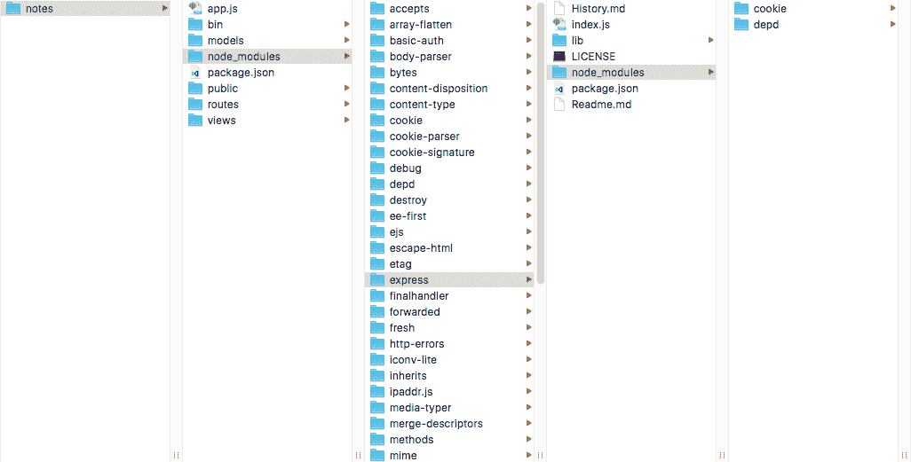
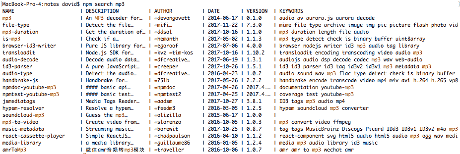

# 第三章：Node.js 模块

在编写 Node.js 应用程序之前，你必须了解 Node.js 模块和包。模块和包是将你的应用程序分解成更小部分的基本构建块。

在本章中，我们将涵盖以下主题：

+   定义一个模块

+   CommonJS 和 ES2015 模块规范

+   在 Node.js 中使用 ES2015/2016/2017 编码实践

+   在 Node.js 代码中使用 ES6 模块格式

+   理解 Node.js 如何查找模块

+   npm 包管理系统

那么，让我们开始吧。

# 定义一个模块

模块是构建 Node.js 应用程序的基本构建块。Node.js 模块封装了函数，将细节隐藏在一个保护良好的容器中，并公开一个显式声明的函数列表。

我们必须考虑两种模块格式：

+   基于 CommonJS 标准的传统 Node.js 格式自 Node.js 创建以来一直被使用。

+   随着 ES2015/2016 的引入，一个新的格式，ES6 模块，通过新的 `import` 关键字被定义。ES6 模块将在所有 JavaScript 实现中得到支持。

由于 ES6 模块现在是标准模块格式，Node.js 技术指导委员会（**TSC**）致力于为 ES6 模块提供一流的支持。

我们已经在上一章中看到了模块的实际应用。在 Node.js 中使用的每个 JavaScript 文件本身就是一个模块。现在是时候看看它们是什么以及它们是如何工作的了。我们将从 CommonJS 模块开始，然后快速引入 ES6 模块。

在第二章的 `ls.js` 示例中，我们编写了以下代码来引入 `fs` 模块，从而获得对其函数的访问权限：

```js
const fs = require('fs'); 
```

`require` 函数用于搜索指定模块，将模块定义加载到 Node.js 运行时中，并使其函数可用。在这种情况下，`fs` 对象包含了由 `fs` 模块导出的代码（和数据）。`fs` 模块是 Node.js 核心的一部分，提供了文件系统功能。

通过将 `fs` 声明为 `const`，我们获得了一点点保证，防止在编码时犯修改包含模块引用的对象的错误。

在每个 Node.js 模块中，模块内部的 `exports` 对象是导出到其他代码的接口。任何分配给 `exports` 对象字段的值都可以供其他代码使用，而其他所有内容都是隐藏的。顺便说一句，这个对象实际上是 `module.exports`。`exports` 对象是 `module.exports` 的别名。

`require` 函数和 `module.exports` 对象都来自 CommonJS 规范。ES6 模块有类似的概念，但实现方式不同。

在深入细节之前，让我们先简要地看看这个例子。思考一下 `simple.js` 模块：

```js
var count = 0;
exports.next = function() { return ++count; };
exports.hello = function() {
  return "Hello, world!";
};
```

我们有一个变量 `count`，它没有附加到 `exports` 对象上，还有一个函数 `next`，它被附加上了。现在，让我们使用它：

```js
$ node
> const s = require('./simple');
undefined
> s.hello();
'Hello, world!'
> s.next();
1
> s.next();
2
> s.next();
3
> console.log(s.count);
undefined
undefined
> 
```

模块中的 `exports` 对象是 `require('./simple')` 返回的对象。因此，每次调用 `s.next` 都会调用 `simple.js` 中的 `next` 函数。每次调用都会返回（并增加）局部变量 `count` 的值。尝试访问私有字段 `count` 会显示它无法从模块外部访问。

再次强调规则：

+   作为 `exports` 字段分配（也称为 `module.exports`）的任何内容（函数或对象）都可以供模块外部的其他代码使用

+   没有分配给 `exports` 的对象对模块外部的代码不可用，除非模块通过其他机制导出这些对象

这就是 Node.js 解决基于浏览器的 JavaScript 的全局对象问题的方法。看起来像是全局变量的变量实际上只对该变量所在的模块是全局的。这些变量对任何其他代码不可见。

既然我们已经对模块有了初步的了解，让我们更深入地研究一下。

# CommonJS 和 ES2015 模块格式

Node.js 的模块实现强烈受到 CommonJS 模块规范的影响，但并不完全相同。它们之间的差异可能只有在您需要在 Node 和其他 CommonJS 系统之间共享代码时才重要。

在 ES2015 的变化中，有一个标准模块格式，旨在任何地方使用。它有一些有趣的功能，由于它无处不在，它应该会推进 JavaScript 的发展状态。由于它与 CommonJS/Node.js 模块系统不兼容，因此在 Node.js 中采用 ES2015 模块意味着我们需要重新工作我们的实践和接受的标准。

实际上，在过渡期间，Node.js 程序员将同时处理这两种模块格式。我们的长期目标应该是全面采用 ES2015 模块。Node.js 平台计划在 Node.js 10 中引入对 ES2015 模块的支持。截至 Node.js 8.5，可以通过设置命令行标志来启用此功能。

# CommonJS/Node.js 模块格式

我们已经通过 `simple.js` 示例和我们在第二章“设置 Node.js”中检查的程序看到了这种模块格式的几个例子。所以让我们更仔细地看看。

CommonJS 模块存储在扩展名为 `.js` 的文件中。

加载 CommonJS 模块是一个同步操作。这意味着当 `require('modulename')` 函数调用返回时，模块已经被定位并完全读入内存，并准备好使用。该模块被缓存在内存中，因此后续的 `require('modulename')` 调用将立即返回，并且所有返回的都是同一个对象。

Node.js 模块提供了一个简单的封装机制来隐藏实现细节，同时暴露一个 API。模块被处理得好像它们是这样编写的：

```js
(function() { ... contents of module file ... })(); 
```

因此，模块内的所有内容都包含在一个匿名私有命名空间上下文中。这就是解决全局对象问题的方法；模块中看似全局的内容实际上都包含在这个私有上下文中。

可以通过 Node.js 插入到这个私有上下文中的两个自由变量来从 CommonJS 模块中公开对象和函数：`module` 和 `exports`：

+   `module` 对象包含一些你可能觉得有用的字段。有关详细信息，请参阅在线 Node.js 文档。

+   `exports` 对象是 `module.exports` 字段的别名。这意味着以下两行代码是等效的：

```js
exports.funcName = function(arg, arg1) { ... };
module.exports.funcName = function(arg, arg2) { .. }; 
```

如果你这样做，你的代码可能会破坏这两个别名之间的关联：

```js
exports = function(arg, arg1) { ... };
```

不要这样做，因为 `exports` 将不再等同于 `module.exports`。如果你的意图是将单个对象或函数分配为 `require` 返回的内容，请改为这样做：

```js
module.exports = function(arg, arg1) { ... };
```

一些模块确实只导出一个函数，因为模块作者就是这样设想来交付所需功能的。

Node.js 包格式源自 CommonJS 模块系统 ([`commonjs.org`](http://commonjs.org))。在开发过程中，CommonJS 团队旨在填补 JavaScript 生态系统中的空白。当时，没有标准的模块系统，这使得打包 JavaScript 应用程序变得更加复杂。Node.js 模块的 `require` 函数、`exports` 对象以及其他方面直接来自 CommonJS 的 `Modules/1.0` 规范。

# ES6 模块格式

ES6 模块是一种为所有 JavaScript 环境设计的全新模块格式。虽然 Node.js 整个生命周期中都有一个很好的模块系统，但浏览器端的 JavaScript 并没有。这使浏览器端的社区要么依赖于 `<script>` 标签，要么使用非标准化的解决方案。就这一点而言，传统的 Node.js 模块从未标准化，除了 CommonJS 努力之外。因此，ES6 模块有望为整个 JavaScript 世界带来重大改进，通过使每个人都使用相同的模块格式和机制达成共识。

副作用是，Node.js 社区需要开始关注、学习并采用 ES2015 模块格式。

Node.js 使用 `.mjs` 扩展名来引用 ES6 模块。在实现新的模块格式时，Node.js 团队确定他们无法同时支持 CommonJS 和 ES6 模块使用 `.js` 扩展名。`.mjs` 扩展名被选为解决方案，你可能会看到对这个文件扩展名的讽刺性引用，称为 *Michael Jackson Script*。

一个有趣的细节是，ES6 模块是异步加载的。这可能对 Node.js 程序员没有太大影响，但这是要求使用新的 `.mjs` 扩展名背后的部分原因。

在同一目录下创建一个名为 `simple2.mjs` 的文件，该文件是我们之前查看的 `simple.js` 示例：

```js
var count = 0;
export function next() { return ++count; }
function squared() { return Math.pow(count, 2); }
export function hello() {
    return "Hello, world!";
}
export default function() { return count; }
export const meaning = 42;
export let nocount = -1;
export { squared };
```

从模块导出的 ES6 项目使用 `export` 关键字声明。这个关键字可以放在任何顶层声明之前，例如变量、函数或类声明：

```js
 export function next() { .. }
```

这种效果类似于以下：

```js
module.exports.next = function() { .. }
```

它们的意图本质上相同：使一个函数或其他对象对模块外部的代码可用。例如，`export function next()` 是一个命名导出，意味着导出的东西有一个名字，外部代码使用这个名字来访问对象。正如我们所看到的，命名 `exports` 可以是函数或对象，它们也可以是类定义。

使用 `export default` 可以在每个模块中只做一次，并且是模块的 `default` 导出。`default` 导出是当使用模块对象本身而不是使用模块的导出之一时，外部代码访问的内容。

你也可以声明一些东西，比如 `squared` 函数，然后稍后导出它。

现在我们来看看如何使用这个 ES2015 模块。创建一个名为 `simpledemo.mjs` 的文件，内容如下：

```js
import * as simple2 from './simple2.mjs';

console.log(simple2.hello());
console.log(`${simple2.next()} ${simple2.squared()}`);
console.log(`${simple2.next()} ${simple2.squared()}`);
console.log(`${simple2.default()} ${simple2.squared()}`);
console.log(`${simple2.next()} ${simple2.squared()}`);
console.log(`${simple2.next()} ${simple2.squared()}`);
console.log(`${simple2.next()} ${simple2.squared()}`);
console.log(simple2.meaning);
```

`import` 语句做了它意味着的事情：它导入了从模块导出的对象。这个版本的 `import` 语句与传统的 Node.js `require` 语句最相似，这意味着它通过创建一个对象来访问模块导出的对象。

这就是代码的执行方式：

```js
$ node --experimental-modules simpledemo.mjs 
(node:63937) ExperimentalWarning: The ESM module loader is experimental.
Hello, world!
1 1
2 4
2 4
3 9
4 16
5 25
42
```

截至 Node.js 8.5，新的模块格式可以通过选项标志使用，如下所示。你还会看到一个警告，说明这是一个实验性功能。访问 `default` 导出是通过访问名为 `default` 的字段来完成的。访问导出的值，如 `meaning` 字段，不需要括号，因为它是一个值而不是一个函数。

现在来看看从模块中导入对象的另一种方式，创建另一个文件，命名为 `simpledemo2.mjs`，内容如下：

```js
import { 
    default as simple, hello, next 
} from './simple2.mjs';
console.log(hello());
console.log(next());
console.log(next());
console.log(simple());
console.log(next());
console.log(next());
console.log(next());
```

在这种情况下，每个导入的对象都是独立的东西，而不是附加到另一个对象上。你不需要写 `simple2.next()`，只需写 `next()`。`as` 子句是一种声明别名的方式，如果其他方式不可行，这样你就可以使用默认导出。我们之前已经使用了一个 `as` 子句，并且可以在其他需要为导出或导入的值提供别名的实例中使用它。

Node.js 模块可以从 ES2015 `.mjs` 代码中使用。创建一个名为 `ls.mjs` 的文件，内容如下：

```js
import _fs from 'fs';
const fs = _fs.promises;
import util from 'util';

(async () => {
  const files = await fs.readdir('.');
  for (let fn of files) {
    console.log(fn);
  }
})().catch(err => { console.error(err); });
```

然而，你不能将 ES2015 模块 `require` 到常规 Node.js 代码中。ES2015 模块的查找算法不同，正如我们之前提到的，ES2015 模块是异步加载的。

另一个复杂的问题是处理 `fs.promises` 子模块。我们在示例中使用了这个子模块，但它是如何使用的？  这个 `import` 语句不起作用：

```js
import { promises as fs } from 'fs';
```

这失败了，原因如下：

```js
$ node --experimental-modules ls.mjs 
(node:45186) ExperimentalWarning: The ESM module loader is experimental.
file:///Volumes/Extra/book-4th/chap03/ls.mjs:1
import { promises as fs } from 'fs';
 ^^^^^^^^
SyntaxError: The requested module 'fs' does not provide an export named 'promises'
 at ModuleJob._instantiate (internal/modules/esm/module_job.js:89:21)
```

这就留下了这个结构：

```js
import _fs from 'fs';
const fs = _fs.promises;
```

执行脚本会得到以下结果：

```js
$ node --experimental-modules ls.mjs
(node:65359) ExperimentalWarning: The ESM module loader is experimental.
(node:37671) ExperimentalWarning: The fs.promises API is experimental
ls.mjs
module1.js
module2.js
simple.js
simple2.mjs
simpledemo.mjs
simpledemo2.mjs
```

关于 ES2015 模块代码的最后一点是，`import` 和 `export` 语句必须是顶层代码。即使在像这样简单的块中放置一个 `export`：

```js
{
   export const meaning = 42;
}
```

结果导致错误：

```js
$ node --experimental-modules badexport.mjs 
(node:67984) ExperimentalWarning: The ESM module loader is experimental.
SyntaxError: Unexpected token export
 at ModuleJob.loaders.set [as moduleProvider] (internal/loader/ModuleRequest.js:32:13)
 at <anonymous>
```

尽管还有关于 ES2015 模块的更多细节，但这些是最重要的属性。

# JSON 模块

Node.js 支持使用 `require('/path/to/file-name.json')` 来导入 JSON 文件。它与以下代码等价：

```js
const fs = require('fs');
module.exports = JSON.parse(
        fs.readFileSync('/path/to/file-name.json', 'utf8'));
```

即，JSON 文件是同步读取的，文本被解析为 JSON。结果对象作为模块导出的对象可用。创建一个名为 `data.json` 的文件，包含以下内容：

```js
{ 
    "hello": "Hello, world!", 
    "meaning": 42 
}
```

现在创建一个名为 `showdata.js` 的文件，包含以下内容：

```js
const util = require('util');
const data = require('./data');
console.log(util.inspect(data));
```

它将按以下方式执行：

```js
$ node showdata.js 
{ hello: 'Hello, world!', meaning: 42 }
```

`util.inspect` 函数是一种以易于阅读的方式展示对象的有用方法。

# 在较老的 Node.js 版本上支持 ES6 模块

虽然 ES6 模块的支持作为 Node.js 8.5 的实验性功能出现，但在较早的 Node.js 实现中，有两种方式可以使用这些模块。

一种方法是使用 Babel 编译器重写 ES6 代码，使其能够在较老的 Node.js 版本上执行。例如，请参阅 [`blog.revillweb.com/using-es2015-es6-modules-with-babel-6-3ffc0870095b`](https://blog.revillweb.com/using-es2015-es6-modules-with-babel-6-3ffc0870095b)。

更好的方法是 Node.js 注册表中的 `esm` 包。只需按照以下步骤操作：

```js
$ nvm install 6
Downloading and installing node v6.14.1...
Downloading https://nodejs.org/dist/v6.14.1/node-v6.14.1-darwin-x64.tar.xz...
######################################################################## 100.0%
Computing checksum with shasum -a 256
Checksums matched!
Now using node v6.14.1 (npm v3.10.10)
$ nvm use 6
Now using node v6.14.1 (npm v3.10.10)
$ npm install esm
... npm output
$ node --require esm simpledemo.mjs 
Hello, world!
1 1
2 4
2 4
3 9
4 16
5 25
42

```

要使用此模块，只需调用一次 `require('esm')`，ES6 模块就会被集成到 Node.js 中。`--require` 标志会自动加载指定的模块。无需重写代码，我们可以通过命令行选项选择性地使用 esm 模块。

这个例子演示了将 ES6 模块集成到较老的 Node.js 版本中。要成功执行 `ls.mjs` 示例，我们必须有对 `async`/`await` 函数和箭头函数的支持。由于 Node.js 6.x 不支持这些，`ls.mjs` 示例将失败，并需要重写此类代码：

```js
$ node --version
v6.14.1
$ node -r esm ls.mjs 
/Users/David/chap03/ls.mjs:5
(async () => {
 ^

SyntaxError: Unexpected token (
 at exports.runInThisContext (vm.js:53:16)
 at Module._compile (module.js:373:25)
```

更多信息，请参阅：

[`medium.com/web-on-the-edge/es-modules-in-node-today-32cff914e4b`](https://medium.com/web-on-the-edge/es-modules-in-node-today-32cff914e4b)。这篇文章描述了 `esm` 模块的早期版本，当时命名为 `@std/esm`。

# 展示模块级别的封装

模块的一个关键属性是封装。未从模块导出的对象是模块私有的，并且不能从模块外部的代码中访问。重申一点，模块被当作如下编写来处理：

```js
(function() { ... contents of module file ... })();
```

这个 JavaScript 习惯用法定义了一个匿名私有作用域。在该作用域内声明的任何内容都无法被作用域外的代码访问。也就是说，除非某些代码使对象引用对作用域外的其他代码可用。这正是 `module.exports` 对象的作用：它是模块作者从模块中暴露对象引用的一种机制。然后其他代码可以以受控的方式访问模块内的资源。

模块内部顶级变量的外观就像它们存在于全局作用域中。实际上，它们并不是真正的全局变量，而是安全地私有于模块，并且完全不可被其他代码访问。

让我们看看一个实际演示该封装的例子。创建一个名为 `module1.js` 的文件，包含以下内容：

```js
const A = "value A";
const B = "value B";
exports.values = function() {
   return { A: A, B: B };
}
```

然后，创建一个名为 `module2.js` 的文件，包含以下内容：

```js
const util = require('util');
const A = "a different value A";
const B = "a different value B";
const m1 = require('./module1');
console.log(`A=${A} B=${B} values=${util.inspect(m1.values())}`);
console.log(`${m1.A} ${m1.B}`);
const vals = m1.values();
vals.B = "something completely different";
console.log(util.inspect(vals));
console.log(util.inspect(m1.values()));
```

然后，按照以下方式运行（你必须已经安装了 Node.js）：

```js
$ node module2.js 
A=a different value A B=a different value B values={ A: 'value A', B: 'value B' }
undefined undefined
{ A: 'value A', B: 'something completely different' }
{ A: 'value A', B: 'value B' }
```

这个人为的例子演示了 `module1.js` 中的值与 `module2.js` 中的值的封装。`module1.js` 中的 `A` 和 `B` 值不会覆盖 `module2.js` 中的 `A` 和 `B`，因为它们被封装在 `module1.js` 中。`module1.js` 中的 `values` 函数允许 `module2.js` 中的代码访问这些值；然而，`module2.js` 不能直接访问这些值。我们可以修改从 `module1.js` 接收到的 `module2.js` 对象。但这样做不会改变 `module1.js` 中的值。

# 使用 require 查找和加载 CommonJS 和 JSON 模块

我们已经讨论了几种模块类型：CommonJS、JSON、ES2015 和原生代码模块。除了 ES2015 模块之外，所有模块都是使用 `require` 函数加载的。该函数有一个非常强大且灵活的算法，用于在目录层次结构中定位模块。这个算法与 npm 包管理系统的结合，为 Node.js 平台提供了大量的功能和灵活性。

# 文件模块

我们刚刚查看的 CommonJS 和 ES2015 模块是 Node.js 文档中所描述的 **文件模块**。这样的模块包含在一个单独的文件中，其文件名以 `.js`、`.mjs`、`.json` 或 `.node` 结尾。后缀为 `.node` 的模块是从 C 或 C++ 源代码编译的，或者甚至是其他语言，如 Rust，而前者当然是用 JavaScript 或 JSON 编写的。

我们已经查看了一些使用这些模块的示例，以及 Node.js 中传统使用的 CommonJS 格式和现在支持的新 ES2015 模块之间的区别。

# 集成到 Node.js 二进制中的模块

一些模块被预编译到 Node.js 二进制文件中。这些是 Node.js 网站上文档化的核心 Node.js 模块，网址为 [`nodejs.org/api/index.html`](https://nodejs.org/api/index.html)。

它们最初是 Node.js 构建树中的源代码。构建过程将它们编译成二进制文件，以便模块始终可用。

# 目录作为模块

一个模块可以包含一个完整的目录结构，其中充满了各种东西。这里的“东西”是一个术语，指的是内部文件模块、数据文件、模板文件、文档、测试、资产等等。一旦存储在正确构建的目录结构中，Node.js 将将其视为一个满足 `require('moduleName')` 调用的模块。

这可能有点令人困惑，因为单词 *module* 被赋予了两个含义。在某些情况下，一个 *module* 是一个文件，而在其他情况下，一个 *module* 是一个包含一个或多个文件模块的目录。

在大多数情况下，一个作为模块的目录包含一个`package.json`文件。这个文件包含有关模块（称为包）的数据，Node.js 在加载模块时使用这些数据。Node.js 运行时识别这两个字段：

```js
{ name: "myAwesomeLibrary", 
  main: "./lib/awesome.js" }
```

如果这个`package.json`文件位于名为`awesomelib`的目录中，那么`require('./awesomelib')`将加载`./awesomelib/lib/awesome.js`中的文件模块。

如果没有`package.json`，那么 Node.js 将寻找`index.js`或`index.node`。在这种情况下，`require('./awesomelib')`将加载`./awesomelib/index.js`中的文件模块。

在任何情况下，目录模块可以轻松地包含其他文件模块。最初加载的模块将简单地使用`require('./anotherModule')`一次或多次来加载其他私有模块。

npm 包管理系统能够在`package.json`文件中识别更多的数据。这包括包名、作者、主页 URL、问题队列 URL、包依赖项等等。我们稍后会介绍这一点。

# 模块标识符和路径名

通常来说，模块名称是一个路径名，但去除了文件扩展名。早些时候，当我们写下`require('./simple')`时，Node.js 知道要添加`.js`到文件名并加载`simple.js`。同样，Node.js 会识别`simple.json`或`simple.node`作为合法满足`require('./simple')`的文件名。

模块标识符有三种类型：相对、绝对和顶级：

+   **相对模块标识符**：这些以`./`或`../`开头，绝对标识符以`/`开头。模块名称与 POSIX 文件系统语义相同。结果路径名相对于正在执行文件的当前位置进行解释。也就是说，以`./`开头的模块标识符将在当前目录中查找，而以`../`开头的则是在父目录中查找。

+   **绝对模块标识符**：这些以`/`开头，当然，它们在文件系统的根目录中查找，但这不是推荐的做法。

+   **顶级模块标识符**：这些不以任何这些字符串开头，只是模块名称，或者`module-name/path/to/module`。这些必须存储在`node_modules`目录中，Node.js 运行时有一个灵活的算法来定位正确的`node_modules`目录：

    +   在`module-name/path/to/module`指定的情况下，将加载的是名为`module-name`的顶级模块中的`path/to/module`模块。

    +   内置模块使用顶级模块名称指定

搜索从调用 `require()` 的文件所在的目录开始。如果该目录包含一个 `node_modules` 目录，该目录包含匹配的目录模块或文件模块，则搜索满足。如果本地 `node_modules` 目录不包含合适的模块，它将在父目录中再次尝试，并在文件系统中向上继续，直到找到合适的模块或达到根目录。

也就是说，在 `/home/david/projects/notes/foo.js` 文件中进行 `require` 调用时，将会查询以下目录：

+   `/home/david/projects/notes/node_modules`

+   `/home/david/projects/node_modules`

+   `/home/david/node_modules`

+   `/home/node_modules`

+   `/node_modules`

如果通过此搜索未找到模块，存在一些全局文件夹，其中可以找到模块。第一个是在 `NODE_PATH` 环境变量中指定的。这被解释为类似于 `PATH` 环境变量的冒号分隔的绝对路径列表。在 Windows 上，`NODE_PATH` 的元素当然由分号分隔。Node.js 将在这些目录中搜索匹配的模块。

不推荐使用 `NODE_PATH` 方法，因为如果人们不知道这个变量必须设置，可能会出现令人惊讶的行为。如果需要特定目录中位于 `NODE_PATH` 中引用的特定模块来正确运行，而变量未设置，应用程序可能会失败。正如十二要素应用程序模型所建议的，最好将所有依赖项明确声明，在 Node.js 中这意味着在 `package.json` 中列出所有依赖项，以便 `npm` 或 `yarn` 可以管理依赖项。

这个变量是在上述模块解析算法最终确定之前实现的。由于该算法，`NODE_PATH` 大部分是不必要的。

有三个其他位置可以存放模块：

+   `$HOME/.node_modules`

+   `$HOME/.node_libraries`

+   `$PREFIX/lib/node`

在这种情况下，`$HOME` 是你所期望的，即用户的主目录，而 `$PREFIX` 是 Node.js 安装的目录。

一些开始建议不要使用全局模块。其理由是重复性和可部署性的需求。如果你已经测试了一个应用程序，并且所有代码都方便地位于一个目录树中，你可以复制这个树以部署到其他机器上。但是，如果应用程序依赖于系统其他地方神奇地安装的某些文件呢？你会记得部署这些文件吗？

# 应用程序目录结构的示例

让我们看看典型 Node.js Express 应用程序的文件系统结构：



这是一个 Express 应用程序（我们将在第五章 Your First Express Application 中使用 Express，其中包含了一些安装在 `node_modules` 目录中的模块。其中之一是 Express，它有自己的 `node_modules` 目录，包含了一些模块。

为了让 `app.js` 加载 `models-sequelize/notes.js`，它使用了以下 `require` 调用：

```js
const notesModel = require('./models-sequelize/notes'); 
```

这是一个相对模块标识符，其中路径名是相对于创建引用的文件所在的目录解析的。

使用以下代码在 `models-sequelize/notes.js` 中进行反向操作：

```js
const app = require('../app'); 
```

再次强调，这是一个相对模块标识符，这次是相对于包含 `models-sequelize/notes.js` 的子目录解析的。

对顶级模块标识符的任何引用将首先查找这里显示的 `node_modules` 目录。这个目录是从 `package.json` 中列出的依赖中填充的，正如我们将在几页后看到的：

```js
const express = require('express');
const favicon = require('serve-favicon');
const logger = require('morgan');
const cookieParser = require('cookie-parser');
const bodyParser = require('body-parser');
```

所有这些都是 Express 应用程序中包含的典型模块。其中大部分在前面显示的截图中都可以清楚地看到。加载的是相应子目录中 `node_modules` 的主文件，例如，`node_modules/express/index.js`。

但是应用不能直接引用其内部 `node_modules` 目录中 Express 模块的依赖。模块搜索算法只在文件系统中向上移动；它不会进入子目录树。

向上搜索方向的一个副作用是处理冲突的依赖。

假设有两个模块（模块 A 和 B）列出了对同一模块（C）的依赖？在正常情况下，对模块 C 的两个依赖可以由该模块的同一实例处理。正如我们将在几页后看到的，npm 在 `package.json` 中的依赖列表可以使用宽松或精确的版本号引用。根据模块 C 的当前版本号，模块 A 和 B 可能或可能不会就使用哪个版本达成一致。如果它们不一致，npm 可以安排模块安装，使得模块 A 和 B 都得到它们所依赖的模块 C 的版本，而不会相互冲突。如果它们都同意使用同一模块 C 实例，则只会安装一个副本，但如果它们不一致，则 npm 将安装两个副本。这两个副本将被放置在模块搜索算法会导致每个模块找到模块 C 正确版本的位置。

让我们通过一个具体的例子来澄清刚才所说的内容。在前面显示的截图中，你可以看到 `cookie` 模块的两个实例。我们可以使用 npm 查询对这个模块的所有引用：

```js
$ npm ls cookie
notes@0.0.0 /Users/David/chap05/notes
├─┬ cookie-parser@1.3.5
│ └── cookie@0.1.3 
└─┬ express@4.13.4
  └── cookie@0.1.5
```

这表示`cookie-parser`模块依赖于`cookie`的 0.1.3 版本，而 Express 依赖于 0.1.5 版本。npm 如何避免这两个冲突版本的问题？通过将一个版本放在`express`模块内部的`node_modules`目录中。这样，当*Express*引用此模块时，它将使用其自己的`node_modules`目录中的`0.1.5`实例，而`cookie-parser`模块将使用顶级`node_modules`目录中的`0.1.3`实例。

# 使用`import`查找和加载 ES6 模块

`import`语句用于加载 ES6 模块，并且它只能在 ES6 模块内部使用。因为 ES6 模块是异步加载的，所以`require()`语句不能加载 ES6 模块。正如我们之前所说的，ES6 模块通过`.mjs`扩展名被 Node.js 识别。ECMAScript TC-39 委员会（或计划）将此文件扩展名正式注册为已识别的权威机构，以便常规工具可以识别这两种文件扩展名作为 JavaScript。

将模块指定符传递给`import`语句时，它被解释为一个 URL。目前，由于在互联网上加载模块的安全影响，Node.js 将仅接受`file:` URL。因为它是一个 URL，所以一些字符如 `:`, `?`, `#`, 或 `%` 必须进行特殊处理。例如：

```js
import './foo?search';
import './foo#hash';
```

这些是有效的模块指定符，其中`?search`和`#hash`具有在 URL 中预期的含义。只要 Node.js 只为`import`语句支持`file:` URL，我们就无法使用该功能，但我们必须记住这一点，并避免在模块 URL 中使用这些字符串。

可以安装自定义模块加载钩子，这些钩子可能需要使用这些 URL 部分来完成某些任务。

模块搜索算法与我们之前描述的`require`类似。如果指定符以`./`, `../`, 或 `/`开头，则指定符被解释为路径名。否则，它被解释为类似于`require`语句的顶级模块，有一个很大的区别。`import`语句将不会搜索全局模块。这是不被推荐的，但如果必须使用全局模块，可以通过符号链接来实现。

有关文档，请参阅 [`nodejs.org/api/esm.html`](https://nodejs.org/api/esm.html)。

# 混合 CommonJS/Node.js/ES6 模块场景

我们已经讨论了 CommonJS/Node.js 模块的格式、ES6 模块的格式以及定位和导入这两种模块的算法。最后要讨论的是那些混合情况，即我们的代码将同时使用这两种模块格式。

实际上，ES6 模块在 Node.js 平台上非常新，因此我们有一大批现有的代码是以 CommonJS/Node.js 模块的形式编写的。Node.js 市场上的许多工具都依赖于 CommonJS 格式。这意味着我们将面临 ES6 模块需要使用 CommonJS 模块，反之亦然的情况：

+   CommonJS 模块使用`require()`来加载其他 CommonJS 模块。

+   CommonJS 模块不能加载 ES6 模块——除了两种方法：

    +   动态导入，也称为`import()`，可以异步操作加载 ES6 模块。

    +   `@std/esm`包提供了一个`require()`函数，它可以异步操作加载 ES6 模块。

+   ES6 模块使用`import`加载其他 ES6 模块，具有`import`语句的完整语义。

+   ES6 模块使用`import`加载 CommonJS 模块。

因此，直接支持三种场景。第四种场景可以通过一个工作区模块得到支持。

当一个 ES6 模块加载 CommonJS 模块时，其`module.exports`对象作为模块的`default`导出暴露出来。这意味着你的代码使用以下模式：

```js
import cjsModule from 'common-js-module';
...
cjsModule.functionName();
```

这与在另一个 CommonJS 模块中使用 CommonJS 模块极为相似。你只是简单地将`require()`调用转换为`import`语句。

# 使用`import()`进行动态导入。

ES6 模块并没有涵盖完全替代 Node.js/CommonJS 模块的所有要求。其中缺失的功能之一正在通过 TC-39 委员会的动态导入特性得到解决。

动态导入的支持在 Node.js 9.7 中实现。请参阅以下文档：

[`github.com/tc39/proposal-dynamic-import`](https://github.com/tc39/proposal-dynamic-import)。

我们将在第七章“数据存储和检索”中，使用动态导入来解决动态选择要加载的模块的问题。在`require()`语句的正常使用中，可以使用一个简单的字符串字面量来指定模块名称。但也可以使用字符串字面量来计算模块名称，如下所示：

```js
// Node.js dynamically determined module loading
const moduleName = require(`../models/${process.env.MODEL_NAME}`);
```

我们在本书的早期版本中使用了这种技术，以动态选择同一模型 API 的几个实现。ES6 的`import`语句不支持任何东西，而只是一个简单的字符串字面量，因此不能像这个例子那样计算模块指定器。

使用动态导入，我们有一个`import()`函数，其中模块指定器是一个普通字符串，允许我们做出类似的动态模块选择。与同步的`require()`函数不同，`import()`是异步的，并返回一个 Promise。因此，它不是`require()`的直接替代品，因为它作为一个顶级函数并不特别有用。你将在第七章“数据存储和检索”中看到如何使用它。

它带来的最重要的特性可能是，CommonJS 模块可以使用`import()`来加载 ES6 模块。

# `import.meta`特性。

另一个新特性`import.meta`正在通过 TC-39 委员会，并为 Node.js 10.x 实现。它是一个存在于 ES6 模块作用域内的对象，提供了关于模块的一些元数据。见[`github.com/tc39/proposal-import-meta`](https://github.com/tc39/proposal-import-meta)。

一个部分实现，仅支持 `import.meta.url`，已集成到 Node.js 源代码中。其使用需要 `--harmony-import-meta` 命令行标志。`import.meta.url` 的内容是当前模块的完全限定 `file:` URL，例如 `file:///Users/david/chap10/notes/app.mjs`。

这变得重要的地方在于，ES6 模块不支持 Node.js 模块中历史上使用的 `__dirname`、`__filename` 和其他全局变量。`__dirname` 变量通常用于从软件包目录中的文件读取资源数据。对于此类情况，应从 `import.meta.url` 中解析目录名称。

# npm - Node.js 的包管理系统

如第二章所述，**设置 Node.js**，npm 是 Node.js 的包管理和分发系统。它已成为使用 Node.js 分发模块（软件包）的事实标准。从概念上讲，它与 `apt-get`（Debian）、`rpm`/`yum`（Red Hat/Fedora）、`MacPorts`（macOS）、`CPAN`（Perl）或 `PEAR`（PHP）等工具类似。它的目的是通过简单的命令行界面在互联网上发布和分发 Node.js 软件包。使用 npm，你可以快速找到满足特定目的的软件包，下载、安装它们，并管理已安装的软件包。

`npm` 应用程序扩展了 Node.js 的软件包格式，而 Node.js 的软件包格式又主要基于 CommonJS 软件包规范。它使用与 Node.js 本地支持的相同的 `package.json` 文件，但增加了额外的字段以构建额外的功能。

# npm 软件包格式

一个 npm 软件包是一个目录结构，包含一个描述软件包的 `package.json` 文件。这正是之前提到的目录模块，只不过 npm 识别的 `package.json` 标签比 Node.js 多得多。npm 的 `package.json` 的起点是 CommonJS Packages/1.0 规范。可以通过以下命令访问 npm 的 `package.json` 实现文档：

```js
$  npm help json
```

一个基本的 `package.json` 文件如下：

```js
{ "name": "packageName", 
   "version": "1.0", 
   "main": "mainModuleName", 
   "modules": { 
    "mod1": "lib/mod1", 
    "mod2": "lib/mod2" 
  } 
} 
```

文件是 JSON 格式，作为 JavaScript 程序员，你应该熟悉这种格式。

最重要的标签是 `name` 和 `version`。名称将出现在 URL 和命令中，因此请选择一个既安全又合适的名称。如果您希望将软件包发布到公共 `npm` 仓库，检查特定名称是否已在 [`npmjs.com`](http://npmjs.com) 或以下命令中使用是有帮助的：

```js
$ npm search packageName
```

`main` 标签的处理方式与我们之前在目录模块部分讨论的方式相同。它定义了在调用 `require('packageName')` 时将返回哪个文件模块。软件包可以在自身内部包含许多模块，并且它们可以在 `modules` 列表中列出。

软件包可以被打包成 tar-gzip 归档（tarball），尤其是在通过网络发送时。

包可以声明对其他包的依赖。这样，npm 可以自动安装安装的模块所需的模块。依赖项如下声明：

```js
"dependencies": { 
    "foo" : "1.0.0 - 2.x.x", 
    "bar" : ">=1.0.2 <2.1.2" 
 } 
```

`description` 和 `keyword` 字段有助于人们在 npm 仓库 ([`www.npmjs.com/`](https://www.npmjs.com/)) 中搜索时找到包。包的所有权可以在 `homepage`、`author` 或 `contributors` 字段中记录：

```js
"description": "My wonderful package that walks dogs",
"homepage": "http://npm.dogs.org/dogwalker/",
"author": "dogwhisperer@dogs.org"
```

一些 `npm` 包提供可执行程序，这些程序意味着它们应该位于用户的 `PATH` 中。这些程序使用 `bin` 标签声明。这是一个命令名称到实现该命令的脚本的映射。命令脚本使用给定的名称安装到包含 node 可执行文件的目录中：

```js
bin: { 
  'nodeload.js': './nodeload.js',
  'nl.js': './nl.js' 
},
```

`directories` 标签描述了包的目录结构。`lib` 目录会自动扫描以加载模块。还有其他目录标签用于二进制文件、手册和文档：

```js
directories: { lib: './lib', bin: './bin' }, 
```

脚本标签是在包生命周期的各种事件中运行的脚本命令。这些事件包括 `install`、`activate`、`uninstall`、`update` 等。有关脚本命令的更多信息，请使用以下命令：

```js
$ npm help scripts  
```

我们已经在展示如何设置 Babel 时使用了脚本功能。我们将在自动化构建、测试和执行过程时使用这些脚本。

这只是 npm 包格式的尝鲜；有关更多信息，请参阅文档 (`npm help json`)。

# 查找 npm 包

默认情况下，`npm` 模块通过网络从 [`npmjs.com`](http://npmjs.com) 上维护的公共包注册表中检索。如果您知道模块名称，可以通过输入以下内容简单地安装它：

```js
$ npm install moduleName  
```

但如果您不知道模块名称怎么办？您如何发现有趣的模块？网站 [`npmjs.com`](http://npmjs.com) 发布了该注册表中模块的可搜索索引。

npm 包还提供了一个命令行搜索功能，用于查询相同的索引：



当然，在找到模块后，它会按照以下方式安装：

```js
$ npm install acoustid  
```

安装模块后，您可能想查看文档，这些文档通常位于模块的网站上。`package.json` 中的 `homepage` 标签列出了该 URL。查看 `package.json` 文件的最简单方法是使用 `npm view` 命令，如下所示：

```js
$ npm view akasharender
...
{ name: 'akasharender',
  description: 'Rendering support for generating static HTML websites 
  or EPUB eBooks',
  'dist-tags': { latest: '0.6.15' },
  versions: 
    '0.0.1',
  ...
  author: 'David Herron <david@davidherron.com> 
 (http://davidherron.com)',
  repository: { type: 'git', url: 
 'git://github.com/akashacms/akasharender.git' },
  homepage: 'http://akashacms.com/akasharender/toc.html',
...
} 
```

您可以使用 `npm view` 从 `package.json` 中提取任何标签，如下所示，这可以让您仅查看 `homepage` 标签：

```js
$ npm view akasharender homepage
http://akashacms.org/akasharender/toc.html 
```

`package.json` 中的其他字段可以通过简单地给出所需的标签名称来查看。

# 其他 npm 命令

主要的 `npm` 命令有一系列子命令，用于特定的包管理操作。这些涵盖了发布包（作为包作者）的生命周期中的各个方面，以及下载、使用或删除包（作为 npm 消费者）。

您只需输入 `npm`（不带参数）即可查看这些命令的列表。如果您想了解更多关于某个命令的信息，请查看帮助信息：

```js
$ npm help <command>
The help text will be shown on your screen.
Or, see the website: http://docs.npmjs.com 
```

# 安装 npm 包

当您找到心仪的包时，`npm install`命令可以轻松地安装包，如下所示：

```js
$ npm install express
/home/david/projects/notes/
- express@4.13.4
...  
```

命名模块安装在本目录的`node_modules`中。安装的具体版本取决于命令行上列出的任何版本号，正如我们在下一节中看到的。

# 按版本号安装包

npm 中的版本号匹配功能强大且灵活。在`package.json`依赖中使用的相同类型的版本指定符也可以与`npm install`命令一起使用：

```js
$ npm install package-name@tag
$ npm install package-name@version
$ npm install package-name@version-range
```

最后两个选项正如其名。您可以指定`express@4.16.2`以定位精确版本，或`express@">4.1.0 < 5.0"`以定位 Express V4 版本的范围内。

版本匹配指定符包括以下选项：

+   **精确版本匹配**：1.2.3

+   **至少版本 N**：>1.2.3

+   **至版本 N**：<1.2.3

+   **两个版本之间**：>=1.2.3 <1.3.0

`@tag`属性是一个符号名称，例如`@latest`、`@stable`或`@canary`。包所有者将这些符号名称分配给特定的版本号，并且可以根据需要重新分配它们。例外是`@latest`，每当发布包的新版本时，它都会被更新。

对于更多文档，请运行以下命令：`npm help json`和`npm help npm-dist-tag`。

# 全局包安装

在某些情况下，您可能希望全局安装一个模块，以便可以从任何目录中使用它。例如，Grunt 或 Gulp 构建工具非常实用，如果这些工具全局安装，您可能会发现它们很有用。只需添加`-g`选项：

```js
$ npm install -g grunt-cli  
```

如果您遇到错误，并且您在类 Unix 系统（Linux/Mac）上，您可能需要使用`sudo`运行此命令：

```js
$ sudo npm install -g grunt-cli
```

对于那些安装可执行命令的包来说，全局安装尤为重要。我们很快就会讨论这个问题。

如果本地包安装到`node_modules`中，那么全局包安装会到哪里？在类 Unix 系统中，它位于`PREFIX/lib/node_modules`，在 Windows 系统中，它位于`PREFIX/node_modules`。在这种情况下，PREFIX 是指 Node.js 安装的目录。您可以像这样检查此目录的位置：

```js
$ npm config get prefix
/Users/david/.nvm/versions/node/v8.9.1
```

Node.js 中`require`函数使用的算法会自动搜索此目录以查找包，如果在其他地方找不到该包。

记住，ES6 模块不支持全局包。

# 避免全局模块安装

现在 Node.js 社区中的一些人开始对全局安装包表示不满。十二要素模型中存在一个合理的理由。也就是说，如果一个软件项目的所有依赖都明确声明，那么这个项目将更加可靠。如果需要像 Grunt 这样的构建工具，但它在`package.json`中没有明确声明，那么应用程序的用户将需要收到安装 Grunt 的指示，并且他们必须遵循这些指示。

用户作为用户，他们可能会跳过指示，未能安装依赖项，然后抱怨应用程序无法工作。当然，我们大多数人可能都这样做过一两次。

建议通过一种机制（即 `npm install` 命令）在本地安装所有内容，以避免这种潜在的问题。

# 使用 npm 维护包依赖项

如我们之前提到的，`npm install` 命令本身会安装 `package.json` 中 `dependencies` 部分列出的包。这很简单且方便。只需列出所有依赖项，就可以快速轻松地安装使用该包所需的依赖项。实际上，npm 会查找 `package.json` 中的 `dependencies` 或 `devDependencies` 字段，并会自动安装提到的包。

您可以通过编辑 `package.json` 来手动管理依赖项。或者，您可以使用 npm 帮助您编辑依赖项。您可以添加新的依赖项，如下所示：

```js
$ npm install akasharender --save  
```

作为回应，npm 将在 `package.json` 中添加一个 `dependencies` 标签：

```js
"dependencies": { 
    "akasharender": "⁰.6.15" 
} 
```

现在，当你的应用程序被安装时，`npm` 会自动安装该包以及该包列出的任何 `dependencies`。

`devDependencies` 是在开发过程中使用的模块。该字段与上面初始化的方式相同，但使用 `--save-dev` 标志。

默认情况下，当运行 `npm install` 命令时，会安装同时列在 `dependencies` 和 `devDependencies` 中的模块。当然，设置两个列表的目的是在某些情况下不安装 `devDependencies`：

```js
$ npm install --production  
```

这只会安装列在 `dependencies` 中的模块，而不会安装任何 `devDependencies` 模块。

在十二要素应用程序模型中，建议我们明确标识应用程序所需的依赖项。这样我们就可以可靠地构建我们的应用程序，因为我们已经针对我们仔细识别的特定依赖项进行了测试。通过安装针对应用程序已测试的精确依赖项，我们对应用程序的信心更大。在 Node.js 平台上，npm 给我们提供了这个依赖项部分，包括通过版本号声明兼容包版本的灵活机制。

# 自动更新 package.json 依赖项

在 npm@5（也称为 npm 版本 5）中，一个变化是不再需要在 `npm install` 命令中添加 `--save`。相反，`npm` 默认会像你运行了带有 `--save` 的命令一样操作，并自动将依赖项添加到你的 `package.json` 中。这是为了简化使用 `npm`，并且可以说现在这样做更加方便。同时，`npm` 自动修改 `package.json` 可能会非常令人惊讶且不便。可以通过使用 `--no-save` 标志来禁用此行为。此行为可以通过以下方式永久禁用：

```js
$ npm config set save false
```

`npm config` 命令支持一系列可设置的选项，用于调整 npm 的行为。请参阅 `npm help config` 获取文档，以及 `npm help 7 config` 获取选项列表。

# 通过更新包依赖项修复错误

每个软件包都存在错误。Node.js 平台的更新可能会破坏现有的软件包，同样，应用程序使用的软件包的升级也可能导致问题。您的应用程序可能会触发它使用的软件包中的错误。在这些和其他情况下，解决问题可能只需将软件包依赖项更新到较新（或较旧）的版本。

首先确定问题存在于软件包还是您的代码中。在确定问题是另一个软件包的问题后，调查软件包维护者是否已经修复了该错误。该软件包托管在 GitHub 或其他带有公共问题队列的服务上吗？寻找有关此问题的开放问题。这项调查将告诉您是否需要将软件包依赖项更新到较新版本。有时，它将告诉您回滚到较旧版本；例如，如果软件包维护者在较旧版本中引入了不存在的问题。

有时，您会发现软件包维护者没有准备好发布新版本。在这种情况下，您可以分叉他们的存储库并创建他们软件包的修补版本。

解决此问题的一种方法是将软件包版本号**锁定**到一个已知可以工作的版本。您可能知道版本 6.1.2 是您的应用程序最后一次使用的版本，而从版本 6.2.0 开始，您的应用程序会崩溃。因此，在`package.json`中：

```js
"dependencies": {
    "module1": "6.1.2"
}
```

这样就冻结了您对该特定版本号的依赖。然后，您可以自由地花时间更新您的代码，以便与该模块的后续版本兼容。一旦您的代码更新，或者上游项目更新，就相应地更改依赖项。

另一种方法是将软件包的版本托管在 npm 存储库之外的地方。这将在后面的章节中介绍。

# 安装命令的软件包

一些软件包会安装命令行程序。安装此类软件包的一个副作用是在 shell 提示符下可以输入的新命令或可以在 shell 脚本中使用的新命令。例如，我们在第二章“设置 Node.js”中简要使用过的 hexy 程序。另一个例子是广泛使用的 Grunt 或 Gulp 构建工具。

在此类软件包中，`package.json`文件指定了已安装的命令行工具。命令可以安装到以下两个位置之一：

+   **全局安装**：它安装到诸如`/usr/local`之类的目录，或者安装到 Node.js 安装的`bin`目录。`npm bin -g`命令会告诉您此目录的绝对路径名。

+   **本地安装**：将命令安装到正在安装模块的软件包中的`node_modules/.bin`目录。`npm bin`命令会告诉您此目录的绝对路径名。

要运行命令，只需在 shell 提示符下输入命令名称即可。不过，为了使这个过程变得简单，需要进行一些配置。

# 配置 PATH 变量以处理由模块安装的命令

输入完整的路径名并不是执行命令的用户友好要求。我们希望使用模块安装的命令，并希望有一个简单的过程来做到这一点。也就是说，我们必须在`PATH`变量中添加适当的值，但那是什么？

对于全局包安装，可执行文件会落在可能已经在您的`PATH`变量中的目录中，如`/usr/bin`或`/usr/local/bin`。本地包安装需要特殊处理。`node_modules/.bin`目录的完整路径对于每个项目都是不同的，显然，将每个`node_modules/.bin`目录的完整路径添加到您的`PATH`中是不可行的。

将`./node_modules/.bin`添加到`PATH`变量中（或者在 Windows 上为`.\node_modules\.bin`）效果很好。每次当您的 shell 位于 Node.js 项目的根目录时，它将自动找到本地安装的 Node.js 包中的命令。

我们如何做这取决于您使用的命令 shell 和操作系统。

在类 Unix 系统中，命令 shell 是`bash`和`csh`。您的`PATH`变量将按照以下方式之一设置：

```js
$ export PATH=./node_modules/.bin:${PATH}     # bash
$ setenv PATH ./node_modules/.bin:${PATH}     # csh
```

下一步是将命令添加到您的登录脚本中，以便变量始终设置。在`bash`中，将相应的行添加到您的`~/.bashrc`中，在`csh`中添加到您的`~/.cshrc`中。

# 在 Windows 上配置`PATH`变量

在 Windows 上，这项任务通过系统设置面板来处理：

。

# 更新您已安装的过时包

程序员编写代码，更新他们的包，除非您跟上，否则您会被甩在后面。

要找出您的已安装包是否过时，请使用以下命令：

```js
$ npm outdated 
```

报告显示了当前 npm 包、当前安装的版本以及`npm`仓库中的当前版本。更新过时的包非常简单：

```js
$ npm update express
$ npm update 
```

# 从 npm 仓库外部安装包

尽管 npm 仓库很棒，但我们不希望将我们做的所有事情都通过他们的服务推送。这对于无法让全世界看到其代码的内部开发团队来说尤其如此。虽然您可以租赁或安装私有 npm 仓库，但还有另一种方法。可以从其他位置安装包。有关详细信息，请参阅`npm help package.json`中的`dependencies`部分。一些示例包括：

+   **URL**: 您可以指定任何下载 tar 包的 URL，即`.tar.gz`文件。例如，GitHub 或 GitLab 仓库可以轻松导出 tar 包 URL。只需转到“发布”标签即可找到它们。

+   **Git URL**: 类似地，任何 Git 仓库都可以使用正确的 URL 访问。例如：

```js
$ npm install git+ssh://user@hostname:project.git#tag --save  
```

+   **GitHub 快捷方式**: 对于 GitHub 仓库，您可以仅列出仓库指定符，例如`expressjs/express`。可以使用`expressjs/express#tag-name`引用标签或提交。

+   **本地文件系统**: 您可以使用类似这样的 URL 从本地目录安装：`file:../../path/to/dir`。

# 初始化新的 npm 包

如果您想创建一个新的包，您可以手动创建`package.json`文件，或者您可以使用 npm 的帮助。`npm init`命令会引导您通过一个小对话框，以获取`package.json`文件的起始值。

一旦您完成这些问题，`package.json`文件就会被写入磁盘。

预计在发布到 npm 仓库之前，您需要相当程度地编辑该文件。一些字段有助于给查看`npmjs.com`上包列表的人留下好印象：

+   链接到主页和问题队列 URL

+   关键字，以便它可以与其他类似包链接

+   一个好的描述，有助于人们了解其目的

+   一个好的`README.md`文件，以便人们可以立即阅读一些文档

# 声明 Node.js 版本兼容性

确保您的 Node.js 软件运行在正确的 Node.js 版本上非常重要。主要原因是当平台添加新功能时。您将想要使用这些新功能，无论是 8.x 中添加的异步函数还是 10.x 中支持的 ES 模块。我们需要一种方法来声明运行我们的软件所需的 Node.js 版本。

此依赖项使用`package.json`中的`engines`标签声明：

```js
"engines": { 
    "node": ">= 8.x" 
} 
```

当然，这使用的是之前讨论过的相同版本号匹配方案。

# 发布 npm 包

npm 仓库中的所有这些包都来自像您这样的人，他们有更好的做事方式的想法。开始发布包非常容易。在线文档可以在[`docs.npmjs.com/getting-started/publishing-npm-packages`](https://docs.npmjs.com/getting-started/publishing-npm-packages)找到。

您首先使用`npm adduser`命令在 npm 仓库中注册自己。您也可以通过网站注册。接下来，使用`npm login`命令登录。

最后，当你坐在包根目录中时，使用`npm publish`命令。然后，退后一步，以免被涌动的粉丝冲撞。或者，也许不是。仓库中几乎有 600,000 个包，每天几乎有 400 个包被添加。要让你的包脱颖而出，你需要一些营销技巧，这是本书范围之外的另一个话题。

# 明确指定包依赖版本号

十二要素方法的一个特点是第二步，明确声明你的依赖。我们已经提到了这一点，但值得重申，并看到 npm 使这一任务变得容易完成。

十二要素方法的第一步是确保你的应用程序代码被提交到一个源代码仓库中。你可能已经知道了这一点，甚至有最好的意图来确保所有内容都被提交。在使用 Node.js 时，每个模块应该有自己的仓库，而不是把所有代码都放在一个仓库中。

然后，每个模块可以按照自己的时间表独立进展。一个模块的故障可以通过在`package.json`中更改版本依赖来轻松回滚。

这就带我们来到了十二要素的第二步。这一步有两个方面，其中一个是之前讨论过的包版本控制。接下来是明确声明版本号，这可以在`package.json`文件的`dependencies`和`devDependencies`部分声明。这确保了团队中的每个人都处于同一页面，针对相同模块的相同版本进行开发。当需要部署到测试、预发布或生产服务器时，部署脚本运行`npm install`或`npm update`，代码将使用已知版本的模块，这是每个人都测试过的。

声明依赖的懒惰方式是在版本字段中放置`*`。这使用 npm 仓库中的最新版本。也许这会工作，直到有一天该包的维护者引入了一个错误。你将输入`npm update`，突然你的代码就不再工作了。你将前往该包的 GitHub 网站，查看问题队列，可能会看到其他人已经报告了你遇到的问题。其中一些人会表示，他们已经锁定在之前的版本上，直到这个错误被修复。这意味着他们的`package.json`文件不是依赖于`*`的最新版本，而是依赖于错误创建之前的特定版本号。

不要做懒惰的事情，要做聪明的事情。

明确声明依赖的另一个方面是不要隐式地依赖于全局包。之前我们提到，Node.js 社区中的一些人警告不要在全局目录中安装模块。这看起来像是一个在应用程序之间共享代码的简单捷径。只需全局安装，你就不必在每个应用程序中安装代码。

但是，这不会使部署更困难吗？新团队成员会被指导安装所有特殊的文件来使应用程序运行吗？你会记得在所有目标机器上安装那个全局模块吗？

对于 Node.js 来说，这意味着在`package.json`中列出所有模块依赖项，然后安装说明就是简单地`npm install`，可能还会编辑配置文件。

# Yarn 包管理系统

尽管 npm 功能强大，但它并不是 Node.js 的唯一包管理系统。因为 Node.js 核心团队没有指定包管理系统，Node.js 社区可以自由地卷起袖子，开发他们认为最好的任何系统。我们中的绝大多数人使用 npm 是对其价值和有用性的证明。但有一个竞争对手。

Yarn（见[https://yarnpkg.com/en/](https://yarnpkg.com/en/））是 Facebook、Google 和其他几家公司的工程师之间的合作。他们宣称 Yarn 非常快，非常安全（通过使用所有内容的校验和），非常可靠（通过使用`yarn-lock.json`文件来记录精确的依赖关系）。

Yarn 不是运行自己的包仓库，而是在`npmjs.com`上的 npm 包仓库之上运行。这意味着 Node.js 社区没有被 Yarn 分叉，而是通过拥有一个改进的包管理工具而得到增强。

npm 团队在 npm@5（也称为 npm 版本 5）中回应了 Yarn，通过提高性能，并引入`package-lock.json`文件来提高可靠性。npm 团队在 npm@6 中宣布了额外的改进。

Yarn 已经变得非常流行，并且比 npm 更受欢迎。它们执行的功能极其相似，性能与 npm@5 没有太大差异。命令行选项的措辞不同。Yarn 带给 Node.js 社区的一个重要好处是，Yarn 和 npm 之间的竞争似乎正在催生 Node.js 包管理的更快进步。

为了让你开始，以下是最重要的命令：

+   `yarn add`：将包添加到当前包中使用

+   `yarn init`：初始化包的开发

+   `yarn install`：安装`package.json`文件中定义的所有依赖项

+   `yarn publish`：将包发布到包管理器

+   `yarn remove`：从当前包中移除一个未使用的包

单独运行`yarn`会执行`yarn install`行为。Yarn 中还有其他几个命令，`yarn help`会列出它们。

# 摘要

你在本章中学到了很多关于 Node.js 模块和包的知识。

具体来说，我们涵盖了 Node.js 模块和包的实现、管理已安装的模块和包，以及看到了 Node.js 如何定位模块。

现在你已经了解了模块和包，我们准备使用它们来构建应用程序，这是下一章的主题。
