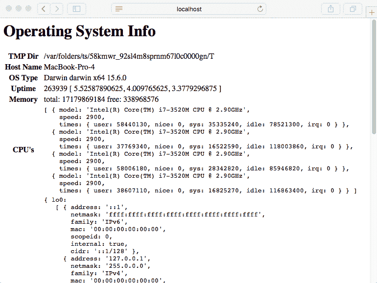
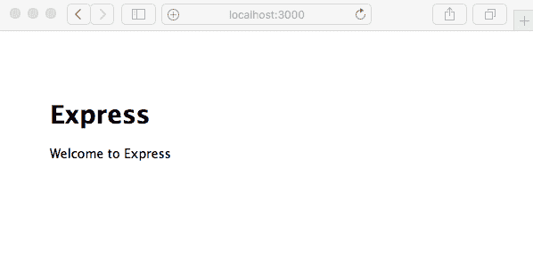
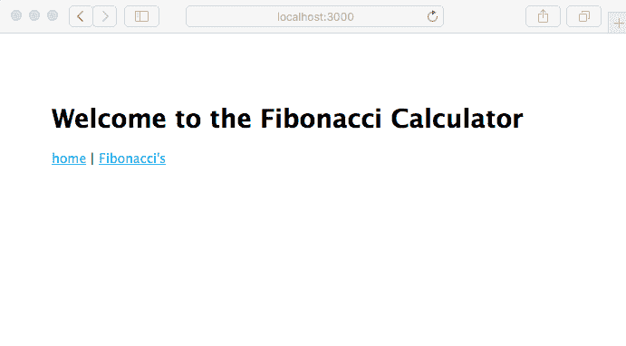
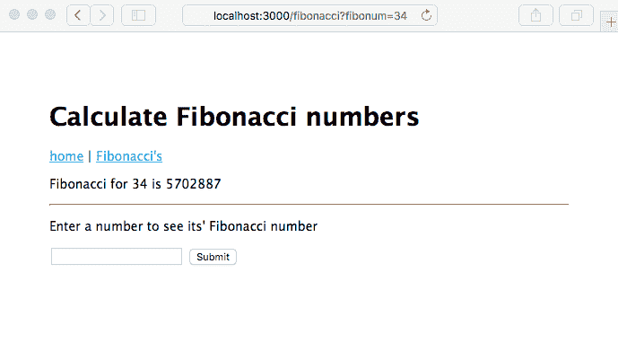
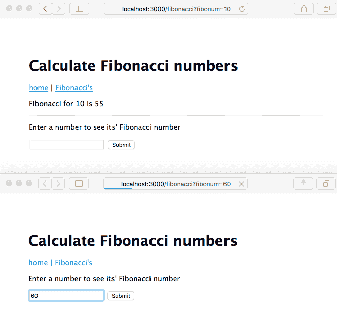

# 第四章：HTTP 服务器和客户端

现在你已经了解了 Node.js 模块，是时候通过构建一个简单的 Node.js Web 应用来应用这些知识了。在本章中，我们将保持应用简单，这样我们就可以探索 Node.js 的三个不同应用框架。在后面的章节中，我们将构建一些更复杂的应用，但在我们能够行走之前，我们必须学会爬行。

我们在本章中将涵盖以下主题：

+   事件发射器

+   监听 HTTP 事件和 HTTP 服务器对象

+   HTTP 请求路由

+   ES2015 模板字符串

+   使用无框架构建简单的 Web 应用

+   Express 应用框架

+   Express 中间件函数

+   如何处理计算密集型代码

+   HTTP 客户端对象

+   使用 Express 创建一个简单的 REST 服务

# 使用事件发射器发送和接收事件

事件发射器（EventEmitters）是 Node.js 的核心惯用法之一。如果 Node.js 的核心思想是事件驱动架构，那么从对象中发射事件是该架构的主要机制之一。事件发射器是一个在其生命周期中的不同点提供通知（事件）的对象。例如，HTTP 服务器对象会发射与服务器对象启动/关闭的每个阶段相关的事件，以及 HTTP 客户端发起 HTTP 请求时。

许多核心 Node.js 模块都是事件发射器（EventEmitters），而事件发射器是实现异步编程的一个优秀框架。事件发射器与 Web 应用开发无关，但它们是 Node.js 结构中如此重要的一部分，以至于你可能会忽略它们的实际存在。

在本章中，我们将与 HTTP 服务器和 HTTP 客户端对象一起工作。这两个对象都是`EventEmitter`类的子类，并且依赖于它来发送 HTTP 协议每个步骤的事件。

# JavaScript 类和类继承

在开始学习`EventEmitter`类之前，我们需要看看 ES2015 的另一个特性：类。JavaScript 语言始终有对象和类层次结构的概念，但与其他语言相比，并没有那么正式。ES2015 类对象建立在现有的基于原型的继承模型之上，但语法看起来非常类似于其他语言中的类定义。

例如，考虑我们在本书后面将要使用到的这个类：

```js
class Note {
    constructor(key, title, body) {
        this._key = key;
        this._title = title;
        this._body = body;
    }
    get key() { return this._key; }
    get title() { return this._title; }
    set title(newTitle) { return this._title = newTitle; }
    get body() { return this._body; }
    set body(newBody) { return this._body = newBody; }
}
```

一旦你定义了类，你就可以将类定义导出到其他模块：

```js
module.exports.Note = class Note { .. }   # in CommonJS modules
export class Note { .. }                  # in ES6 modules
```

标记有`get`或`set`关键字的函数是 getter 和 setter，使用方式如下：

```js
var aNote = new Note("key", "The Rain in Spain", "Falls mainly on the plain");
var key = aNote.key;
var title = aNote.title;
aNote.title = "The Rain in Spain, which made me want to cry with joy";
```

使用`new`创建类的实例。你可以像访问对象上的简单字段一样访问 getter 或 setter 函数。幕后，getter/setter 函数被调用。

之前的实现并不是最佳方案，因为`_title`和`_body`字段是公开可见的，没有数据隐藏或封装。我们将在稍后的章节中介绍一个更好的实现。

通过使用`instanceof`运算符来测试给定对象是否属于某个特定的类：

```js
if (anotherNote instanceof Note) {
    ... it's a Note, so act on it as a Note
}
```

最后，你使用`extends`运算符声明一个子类，这与在其他语言中做的类似：

```js
class LoveNote extends Note {
    constructor(key, title, body, heart) {
        super(key, title, body);
        this._heart = heart;
    }
    get heart() { return this._heart; }
    set heart(newHeart) { return this._heart = newHeart; }
}
```

换句话说，`LoveNote`类有`Note`类的所有字段，加上这个名为`heart`的新字段。

# EventEmitter 类

`EventEmitter`对象定义在 Node.js 的 events 模块中。直接使用`EventEmitter`类意味着执行`require('events')`。在大多数情况下，你会使用一个内部使用`EventEmitter`的现有对象，而不需要这个模块。但也有一些情况下，需求决定了需要实现一个`EventEmitter`子类。

创建一个名为`pulser.js`的文件，包含以下代码：

```js
const EventEmitter = require('events');

class Pulser extends EventEmitter {
    start() {
        setInterval(() => {
            console.log(`${new Date().toISOString()} >>>> pulse`);
            this.emit('pulse');
            console.log(`${new Date().toISOString()} <<<< pulse`);
        }, 1000);
    }
}
module.exports = Pulser;
```

这定义了一个从`EventEmitter`继承的`Pulser`类。在较老的 Node.js 版本中，这需要使用`util.inherits`，但新的类对象使得子类化变得更加简单。

另一个需要检查的是回调函数中的`this.emit`如何引用 Pulser 对象。在 ES2015 箭头函数之前，当我们的回调使用常规`function`时，`this`不会指向`Pulser`对象。相反，它会指向与`setInterval`函数相关的其他对象。因为它是箭头函数，所以箭头函数内部的`this`与外部函数中的`this`是相同的。

如果你需要使用函数而不是箭头函数，这个技巧会起作用：

```js
class Pulser extends EventEmitter {
    start() {
        var self = this;
        setInterval(function() {
            self.emit(...);
        });
    }
}
```

与其他不同之处在于将`this`赋值给`self`。函数内部`this`的值是不同的，但在每个封闭的作用域中`self`的值保持不变。现在我们有了箭头函数，这个广泛使用的技巧变得不那么必要了。

如果你想要一个简单的 EventEmitter，但有自己的类名，扩展类的主体可以是空的：

```js
class HeartBeat extends EventEmitter {}
const beatMaker = new HeartBeat();
```

`Pulser`类的目的是发送一个定时事件，每秒一次，到任何监听器。`start`方法使用`setInterval`来启动重复的回调执行，每秒调度一次，调用`emit`将`pulse`事件发送到任何监听器。

现在，让我们看看如何使用`Pulser`对象。创建一个名为`pulsed.js`的新文件，包含以下内容：

```js
const Pulser = require('./pulser');

// Instantiate a Pulser object
const pulser = new Pulser();
// Handler function
pulser.on('pulse', () => {
    console.log(`${new Date().toISOString()} pulse received`);
});
// Start it pulsing
pulser.start(); 
```

在这里，我们创建了一个`Pulser`对象并消费其`pulse`事件。调用`pulser.on('pulse')`为`pulse`事件设置连接，以便调用回调函数。然后调用`start`方法使进程开始运行。

将以下内容输入到一个文件中，并将文件命名为`pulsed.js`。当你运行它时，你应该看到以下输出：

```js
$ node pulsed.js 
2017-12-03T06:24:10.272Z >>>> pulse
2017-12-03T06:24:10.275Z pulse received
2017-12-03T06:24:10.276Z <<<< pulse
2017-12-03T06:24:11.279Z >>>> pulse
2017-12-03T06:24:11.279Z pulse received
2017-12-03T06:24:11.279Z <<<< pulse
2017-12-03T06:24:12.281Z >>>> pulse
2017-12-03T06:24:12.281Z pulse received
2017-12-03T06:24:12.282Z <<<< pulse
```

这让你对`EventEmitter`类有了点实际的知识。现在，让我们看看它的操作理论。

# EventEmitter 理论

使用`EventEmitter`类，你的代码可以发出事件，其他代码可以接收这些事件。这是连接程序中两个分离部分的一种方式，有点像量子纠缠意味着两个电子可以从任何距离相互通信。看起来很简单。

事件名称可以是您认为有意义的任何名称，并且您可以定义任意多个事件名称。事件名称通过调用 `.emit` 并提供事件名称来定义。没有正式的操作要做，也没有事件名称的注册。只需调用 `.emit` 就足以定义一个事件名称。

按照惯例，事件名称 `error` 表示错误。

一个对象使用 `.emit` 函数发送事件。事件被发送到已注册接收该对象事件的任何监听器。程序通过调用该对象的 `.on` 方法来注册接收事件，提供事件名称和事件处理函数。

没有所有事件的中央分发点。相反，`EventEmitter` 对象的每个实例管理自己的监听器集，并将事件分发给这些监听器。

通常，需要在事件中发送数据。为此，只需将数据作为参数添加到 `.emit` 调用中，如下所示：

```js
this.emit('eventName', data1, data2, ..); 
```

当程序接收到该事件时，数据作为回调函数的参数出现。您的程序可以如下监听此类事件：

```js
emitter.on('eventName', (data1, data2, ...theArgs) => { 
  // act on event 
}); 
```

事件接收者和事件发送者之间没有握手。也就是说，事件发送者只是继续其业务，并且不会收到任何关于接收到的任何事件、采取的任何行动或发生的任何错误的任何通知。

在这个例子中，我们使用了 ES2015 的另一个特性，即 `rest` 操作符，在这里显示为 `...theArgs`。`rest` 操作符将任意数量的剩余函数参数捕获到一个数组中。由于 `EventEmitter` 可以传递任意数量的参数，而 `rest` 操作符可以自动接收任意数量的参数，这是一场天作之合，或者是在 TC-39 委员会上的。

# HTTP 服务器应用程序

HTTP 服务器对象是所有 Node.js 网络应用程序的基础。该对象本身非常接近 HTTP 协议，其使用需要对该协议的了解。在大多数情况下，您可以使用像 Express 这样的应用程序框架来隐藏 HTTP 协议的细节，使程序员能够专注于业务逻辑。

我们已经在第二章 *设置 Node.js* 中看到了一个简单的 HTTP 服务器应用程序，如下所示：

```js
const http = require('http'); 
http.createServer((req, res) => { 
  res.writeHead(200, {'Content-Type': 'text/plain'}); 
  res.end('Hello, World!\n'); 
}).listen(8124, '127.0.0.1'); 
console.log('Server running at http://127.0.0.1:8124'); 
```

`http.createServer` 函数创建一个 `http.Server` 对象。因为它是一个 `EventEmitter`，所以可以用另一种方式来明确这一点：

```js
const http = require('http'); 
const server = http.createServer(); 
server.on('request',  (req, res) => { 
  res.writeHead(200, {'Content-Type': 'text/plain'}); 
  res.end('Hello, World!\n'); 
}); 
server.listen(8124, '127.0.0.1'); 
console.log('Server running at http://127.0.0.1:8124'); 
```

`request` 事件接受一个函数，该函数接收 `request` 和 `response` 对象。`request` 对象包含来自网页浏览器的数据，而 `response` 对象用于收集要发送在响应中的数据。`listen` 函数使服务器开始监听并安排为每个来自网页浏览器的请求分配一个事件。

现在，让我们看看一些更有趣的内容，这些内容根据不同的 URL 执行不同的操作。

创建一个名为 `server.js` 的新文件，包含以下代码：

```js
const http = require('http'); 
const util = require('util'); 
const url  = require('url'); 
const os   = require('os'); 

const server = http.createServer(); 
server.on('request', (req, res) => { 
    var requrl = url.parse(req.url, true); 
    if (requrl.pathname === '/') { 
        res.writeHead(200, {'Content-Type': 'text/html'}); 
        res.end( 
`<html><head><title>Hello, world!</title></head> 
<body><h1>Hello, world!</h1> 
<p><a href='/osinfo'>OS Info</a></p> 
</body></html>`); 
    } else if (requrl.pathname === "/osinfo") { 
        res.writeHead(200, {'Content-Type': 'text/html'}); 
        res.end( 
`<html><head><title>Operating System Info</title></head> 
<body><h1>Operating System Info</h1> 
<table> 
<tr><th>TMP Dir</th><td>${os.tmpdir()}</td></tr> 
<tr><th>Host Name</th><td>${os.hostname()}</td></tr> 
<tr><th>OS Type</th><td>${os.type()} ${os.platform()} ${os.arch()} ${os.release()}</td></tr> 
<tr><th>Uptime</th><td>${os.uptime()} ${util.inspect(os.loadavg())}</td></tr> 
<tr><th>Memory</th><td>total: ${os.totalmem()} free: ${os.freemem()}</td></tr> 
<tr><th>CPU's</th><td><pre>${util.inspect(os.cpus())}</pre></td></tr> 
<tr><th>Network</th><td><pre>${util.inspect(os.networkInterfaces())}</pre></td></tr> 
</table> 
</body></html>`); 
    } else { 
        res.writeHead(404, {'Content-Type': 'text/plain'}); 
        res.end("bad URL "+ req.url); 
    } 
}); 

server.listen(8124); 
console.log('listening to http://localhost:8124'); 
```

要运行它，请输入以下命令：

```js
$ node server.js
listening to http://localhost:8124
```

这个应用程序旨在类似于 PHP 的 `sysinfo` 函数。Node 的 `os` 模块被用来提供有关服务器的信息。这个示例可以很容易地扩展以收集有关服务器的其他数据：



任何 Web 应用程序的核心部分是将请求路由到请求处理程序的方法。`request` 对象附带了多个数据项，其中两个对路由请求很有用：`request.url` 和 `request.method` 字段。

在 `server.js` 中，我们通过解析（使用 `url.parse`）来确定要显示哪个页面，然后咨询 `request.url` 数据。在这种情况下，我们可以简单地比较 `pathname` 来确定要使用哪个处理程序方法。

一些 Web 应用程序关注所使用的 HTTP 动词（`GET`、`DELETE`、`POST` 等），并必须咨询 `request` 对象的 `request.method` 字段。例如，`POST` 经常用于 `FORM` 提交。

请求 URL 的 `pathname` 部分用于将请求调度到正确的处理程序。虽然这种基于简单字符串比较的路由方法适用于小型应用程序，但它很快就会变得难以控制。大型应用程序将使用模式匹配来使用请求 URL 的一部分来选择请求处理程序函数，并从 URL 中提取其他部分作为请求数据。我们将在查看 Express 的“Express 入门”部分时看到这一点。

在 npm 仓库中搜索 URL 匹配，会找到几个有潜力的包，可以用来实现请求匹配和路由。像 Express 这样的框架已经内置并测试了这种功能。

如果请求 URL 不可识别，服务器会使用 `404` 状态码发送一个错误页面。结果代码会通知浏览器请求的状态，其中 `200` 状态码表示一切正常，而 `404` 状态码表示请求的页面不存在。当然，还有许多其他的 HTTP 响应代码，每个都有其特定的含义。

# ES2015 多行和模板字符串

之前的示例展示了 ES2015 中引入的两个新特性，多行和模板字符串。这个特性旨在简化我们创建文本字符串的过程。

现有的字符串表示使用单引号和双引号。模板字符串由反引号字符分隔，该字符也称为 **重音符号**：

```js
`template string text` 
```

在 ES2015 之前，实现多行字符串的一种方法是使用以下结构：

```js
["<html><head><title>Hello, world!</title></head>", 
 "<body><h1>Hello, world!</h1>", 
 "<p><a href='/osinfo'>OS Info</a></p>", 
 "</body></html>"] 
.join('\n') 
```

是的，这正是之前这本书的版本中相同示例所使用的代码。这是我们可以用 ES2015 做的事情：

```js
`<html><head><title>Hello, world!</title></head> 
<body><h1>Hello, world!</h1> 
<p><a href='/osinfo'>OS Info</a></p> 
</body></html>`
```

这更加简洁直接。开引号位于第一行，闭引号位于最后一行，而两者之间的所有内容都是我们字符串的一部分。

模板字符串功能的真正目的是支持可以直接将值直接替换到字符串中的字符串。大多数其他编程语言都支持这种能力，现在 JavaScript 也支持了。

在 ES2015 之前，程序员可以编写如下代码：

```js
[ ... 
  "<tr><th>OS Type</th><td>{ostype} {osplat} {osarch} {osrelease}</td></tr>" 
  ... ].join('\n') 
.replace("{ostype}", os.type()) 
.replace("{osplat}", os.platform()) 
.replace("{osarch}", os.arch()) 
.replace("{osrelease}", os.release()) 
```

同样，这是从本书之前版本中的相同示例中提取的。使用模板字符串，可以写成如下所示：

```js
`...<tr><th>OS Type</th><td>${os.type()} ${os.platform()} ${os.arch()} ${os.release()}</td></tr>...` 
```

在模板字符串中，`${ .. }` 括号内的部分被解释为表达式。它可以是简单的数学表达式、变量引用，或者，如本例中所示，函数调用。

最后要提到的是缩进的问题。在常规编码中，会将长参数列表缩进到与包含函数调用相同的级别。但是，对于这些多行字符串示例，文本内容与列零对齐。这是怎么回事？

这可能会妨碍代码的可读性，因此权衡代码可读性和另一个问题：HTML 输出中的多余字符是值得的。我们用来提高代码可读性的空白将变成字符串的一部分，并将在 HTML 中输出。通过使代码与列零对齐，我们不会因为牺牲一些代码可读性而向输出添加多余的空白。

这种方法也伴随着安全风险。您已经验证了数据的安全性吗？它不会成为安全攻击的基础吗？在这种情况下，我们处理的是来自安全数据源的简单字符串和数字。因此，这段代码与 Node.js 运行时的安全性相同。那么用户提供的内 容和恶意用户可能提供的不安全内容，将某种恶意软件植入目标计算机的风险怎么办？

由于这个原因以及许多其他原因，通常更安全地使用外部模板引擎。像 Express 这样的应用程序使得这样做变得容易。

# HTTP Sniffer – 监听 HTTP 对话

HTTPServer 对象发出的事件可以用于超出立即交付 Web 应用程序的直接任务的其他目的。以下代码演示了一个有用的模块，它监听所有 HTTP 服务器事件。它可以是一个有用的调试工具，同时也展示了 HTTP 服务器对象是如何操作的。

Node.js 的 HTTP 服务器对象是一个 `EventEmitter`，HTTP Sniffer 简单地监听每个服务器事件，打印出与每个事件相关的信息。

我们接下来要做的就是：

1.  创建一个名为 `httpsniffer` 的模块，打印有关 HTTP 请求的信息。

1.  将该模块添加到我们刚刚创建的 `server.js` 脚本中。

1.  重新运行该服务器以查看 HTTP 活动的跟踪。

创建一个名为 `httpsniffer.js` 的文件，包含以下代码：

```js
const util = require('util'); 
const url  = require('url'); 

const timestamp = () => { return new Date().toISOString(); }

exports.sniffOn = function(server) { 
  server.on('request', (req, res) => { 
    console.log(`${timestamp()} e_request`); 
    console.log(`${timestamp()} ${reqToString(req)}`); 
  }); 
  server.on('close', errno => { console.log(`${timestamp()} e_close 
  ${errno}`); }); 
  server.on('checkContinue', (req, res) => { 
    console.log(`${timestamp()} e_checkContinue`); 
    console.log(`${timestamp()} ${reqToString(req)}`); 
    res.writeContinue(); 
  }); 
  server.on('upgrade', (req, socket, head) => { 
    console.log(`${timestamp()} e_upgrade`); 
    console.log(`${timestamp()} ${reqToString(req)}`);
  }); 
  server.on('clientError', () => { console.log(`${timestamp()} 
  e_clientError`); }); 
}; 

const reqToString = exports.reqToString = (req) => { 
  var ret=`req ${req.method} ${req.httpVersion} ${req.url}` +'\n'; 
  ret += JSON.stringify(url.parse(req.url, true)) +'\n'; 
  var keys = Object.keys(req.headers); 
  for (var i = 0, l = keys.length; i < l; i++) { 
    var key = keys[i]; 
    ret += `${i} ${key}: ${req.headers[key]}` +'\n'; 
  } 
  if (req.trailers) ret += util.inspect(req.trailers) +'\n'; 
  return ret; 
}; 
```

这段代码很多！但关键在于 `sniffOn` 函数。当给定一个 HTTP 服务器对象时，它使用 `.on` 函数附加监听函数，打印出关于每个发出的事件的详细信息。它为应用程序上的 HTTP 流提供了相当详细的跟踪。

为了使用它，只需在`server.js`中的`listen`函数之前插入此代码：

```js
require('./httpsniffer').sniffOn(server); 
server.listen(8124); 
console.log('listening to http://localhost:8124'); 
```

在此基础上，像之前一样运行服务器。你可以在浏览器中访问`http://localhost:8124/`，并看到以下控制台输出：

```js
$ node server.js 
listening to http://localhost:8124
2017-12-03T19:21:33.162Z request
2017-12-03T19:21:33.162Z request GET 1.1 /
{"protocol":null,"slashes":null,"auth":null,"host":null,"port":null,"hostname":null,"hash":null,"search":"","query":{},"pathname":"/","path":"/","href":"/"}
0 host: localhost:8124
1 upgrade-insecure-requests: 1
2 accept: text/html,application/xhtml+xml,application/xml;q=0.9,*/*;q=0.8
3 user-agent: Mozilla/5.0 (Macintosh; Intel Mac OS X 10_11_6) AppleWebKit/604.3.5 (KHTML, like Gecko) Version/11.0.1 Safari/604.3.5
4 accept-language: en-us
5 accept-encoding: gzip, deflate
6 connection: keep-alive
{}

2017-12-03T19:21:42.154Z request
2017-12-03T19:21:42.154Z request GET 1.1 /osinfo
{"protocol":null,"slashes":null,"auth":null,"host":null,"port":null,"hostname":null,"hash":null,"search":"","query":{},"pathname":"/osinfo","path":"/osinfo","href":"/osinfo"}
0 host: localhost:8124
1 connection: keep-alive
2 upgrade-insecure-requests: 1
3 accept: text/html,application/xhtml+xml,application/xml;q=0.9,*/*;q=0.8
4 user-agent: Mozilla/5.0 (Macintosh; Intel Mac OS X 10_11_6) AppleWebKit/604.3.5 (KHTML, like Gecko) Version/11.0.1 Safari/604.3.5
5 referer: http://localhost:8124/
6 accept-language: en-us
7 accept-encoding: gzip, deflate
{}
```

你现在有一个工具可以监视 HTTPServer 事件。这个简单的技术会打印出详细的事件数据日志。这个模式可以用于任何`EventEmitter`对象。你可以使用这个技术作为检查程序中`EventEmitter`对象实际行为的一种方式。

# 网络应用程序框架

HTTPServer 对象非常接近 HTTP 协议。虽然这和驾驶手动挡汽车一样，能让你对驾驶体验有低级别的控制，但在更高的层面上进行典型的网络应用程序编程会更好。有人用汇编语言编写网络应用程序吗？最好是抽象掉 HTTP 细节，专注于你的应用程序。

Node.js 开发者社区已经开发了许多应用程序框架，以帮助抽象 HTTP 协议细节的不同方面。其中，Express 是最受欢迎的，而且 Koa([`koajs.com/`](http://koajs.com/))也应该被考虑，因为它是由同一个团队开发的，并且完全集成了对`async`函数的支持。

ExpressJS 维基页面上列出了建立在 ExpressJS 之上或与之配合使用的框架列表。这包括模板引擎、中间件模块等。ExpressJS 维基页面位于[`github.com/expressjs/express/wiki`](https://github.com/expressjs/express/wiki)。

使用网络框架的一个原因是，它们通常提供了超过 20 年来在 Web 应用程序开发中使用的最佳实践。通常的最佳实践包括以下内容：

+   提供一个用于错误 URL（404 页面）的页面

+   筛选 URL 和表单以检测任何注入的脚本攻击

+   支持使用 cookie 来维持会话

+   记录请求以进行使用跟踪和调试

+   认证

+   处理静态文件，例如图像、CSS、JavaScript 或 HTML

+   为缓存代理提供缓存控制头

+   限制诸如页面大小或执行时间等因素

网络框架可以帮助你在任务中投入时间，而不会迷失在实现 HTTP 协议的细节中。抽象细节是程序员提高效率的传统方法。这在使用提供预包装函数的库或框架时尤其如此，这些函数会处理细节。

# 开始使用 Express

Express 可能是最受欢迎的 Node.js 网络应用程序框架。它如此受欢迎，以至于它是 MEAN Stack 缩写词的一部分。MEAN 代表 MongoDB、ExpressJS、AngularJS 和 Node.js。Express 被描述为类似于 Sinatra，指的是一个流行的 Ruby 应用程序框架，并且它不是一个有偏见的框架，这意味着框架作者不会强加他们对应用程序结构的看法。这意味着 Express 对您的代码结构没有任何严格的要求；您只需按照您认为最好的方式编写即可。

您可以访问 Express 的主页，网址为[`expressjs.com/`](http://expressjs.com/)。

很快，我们将使用 Express 实现一个简单的应用程序来计算斐波那契数，在后面的章节中，我们将使用 Express 做更多的事情。我们还将探讨如何减轻我们之前讨论的计算密集型代码的性能问题。

截至撰写本书时，Express 4.16 是当前版本，Express 5 处于 Alpha 测试阶段。根据 ExpressJS 网站，Express 4 和 Express 5 之间几乎没有区别。

让我们先安装 express-generator。虽然我们可以直接开始编写代码，但 express-generator 提供了一个空白起始应用程序。我们将使用它并进行修改。

使用以下命令进行安装：

```js
$ mkdir fibonacci
$ cd fibonacci
$ npm install express-generator@4.x  
```

这与 Express 网站上建议的安装方法不同，该方法是使用`-g`标签进行全局安装。我们还在使用显式的版本号以确保兼容性。截至撰写本书时，`express-generator@5.x`不存在。当它存在时，应该能够使用以下说明使用 5.x 版本。

之前，我们讨论了很多人现在推荐不要全局安装模块。在 Twelve-Factor 模型中，强烈建议不要安装全局依赖项，这正是我们所做的。

结果是在`./node_modules/.bin`目录中安装了一个`express`命令：

```js
$ ls node_modules/.bin/
express 
```

按照以下方式运行`express`命令：

```js
$ ./node_modules/.bin/express --help

  Usage: express [options] [dir]

  Options:

    -h, --help          output usage information
    -V, --version       output the version number
    -e, --ejs           add ejs engine support (defaults to jade)
        --hbs           add handlebars engine support
    -H, --hogan         add hogan.js engine support
    -c, --css <engine>  add stylesheet <engine> support 
 (less|stylus|compass|sass) (defaults to plain css)
        --git           add .gitignore
    -f, --force         force on non-empty directory 
```

我们可能不想每次运行`express-generator`应用程序或任何提供命令行工具的其他应用程序时都输入`./node_modules/.bin/express`，尤其是对于其他应用程序。请参考第三章中关于将此目录添加到`PATH`变量的讨论，标题为*Node.js 模块*。

现在您已经在`fibonacci`目录中安装了`express-generator`，请使用它来设置空白框架应用程序：

```js
$ ./node_modules/.bin/express --view=hbs --git . 
destination is not empty, continue? [y/N] y 

 create : . 
 create : ./package.json 
 create : ./app.js 
 create : ./.gitignore 
 create : ./public 
 create : ./routes 
 create : ./routes/index.js 
 create : ./routes/users.js 
 create : ./views 
 create : ./views/index.hbs 
 create : ./views/layout.hbs 
 create : ./views/error.hbs 
 create : ./bin 
 create : ./bin/www 
 create : ./public/javascripts 
 create : ./public/images 
 create : ./public/stylesheets 
 create : ./public/stylesheets/style.css 

 install dependencies: 
 $ cd . && npm install 

 run the app: 
 $ DEBUG=fibonacci:* npm start 

 $ npm uninstall express-generator 
 added 83 packages and removed 5 packages in 4.104s

```

这为我们创建了一大批文件，我们将在稍后进行讲解。`node_modules`目录中仍然有`express-generator`模块，现在它不再有用。我们可以简单地将其留在那里并忽略它，或者我们可以将其添加到它生成的`package.json`文件的`devDependencies`中。或者，我们可以像下面这样卸载它。

下一步是按照指示运行空白应用程序。显示的命令`npm start`依赖于提供的`package.json`文件的一部分：

```js
"scripts": { 
    "start": "node ./bin/www" 
}, 
```

`npm` 工具支持脚本，这是一种自动化各种任务的方式。本书中我们将利用这一功能来完成各种任务。当十二要素应用程序模型建议自动化所有管理任务时，`npm` 脚本功能是一个出色的机制来实现这一点。大多数 `npm` 脚本都是通过 `npm run scriptName` 命令运行的，但 `start` 命令被 `npm` 明确识别，可以像之前展示的那样运行。

步骤如下：

1.  安装依赖项 `npm install`。

1.  使用 `npm start` 命令启动应用程序。

1.  可选地修改 `package.json` 以始终以调试模式运行。

要安装依赖项并运行应用程序，请输入以下命令：

```js
$ npm install
$ DEBUG=fibonacci:* npm start

> fibonacci@0.0.0 start /Users/David/chap04/fibonacci
> node ./bin/www

 fibonacci:server Listening on port 3000 +0ms
```

以这种方式设置 `DEBUG` 变量会打开一些调试输出，其中包括关于监听端口 3000 的消息。否则，我们不会被告知这些信息。这种语法是在 Bash shell 中运行带有环境变量的命令时使用的。如果你遇到错误，尝试只运行 "`npm start`"，然后阅读下一节。

我们可以修改提供的 `npm start` 脚本，使其始终以调试模式运行应用程序。将 `scripts` 部分更改为以下内容：

```js
"scripts": { 
    "start": "DEBUG=fibonacci:* node ./bin/www" 
},
```

由于输出表明它正在监听端口 `3000`，我们将浏览器指向

在 `http://localhost:3000/` 打开浏览器并查看以下输出：



# 在 Windows cmd.exe 命令行中设置环境变量

如果你在 Windows 上，之前的示例可能会因为 DEBUG 命令未知而失败。问题在于 Windows 的 shell，即 `cmd.exe` 程序，不支持 Bash 命令行结构。

在命令行开始处添加 `VARIABLE=value` 是一些 shell 的特性，如 Linux 和 macOS 上的 Bash。它只为正在执行的命令设置该环境变量，并且是临时覆盖特定命令环境变量的非常方便的方式。

显然，如果要让 `package.json` 在不同的操作系统上可用，就需要一个解决方案。

看起来最好的解决方案是 npm 仓库中的 `cross-env` 包，请参阅：[`www.npmjs.com/package/cross-env`](https://www.npmjs.com/package/cross-env)。安装此包后，`package.json` 中的 `scripts` 部分的命令可以设置环境变量，就像在 Linux/macOS 上的 Bash 一样。使用方法如下：

```js
"scripts": { 
    "start": "cross-env DEBUG=fibonacci:* node ./bin/www" 
}, 
"dependencies": {
    ...
    "cross-env": "5.1.x"
}
```

然后命令执行如下：

```js
C:\Users\david\Documents\chap04\fibonacci>npm install
... output from installing packages
C:\Users\david\Documents\chap04\fibonacci>npm run start

> fibonacci@0.0.0 start C:\Users\david\Documents\chap04\fibonacci
> cross-env DEBUG=fibonacci:* node ./bin/www

fibonacci:server Listening on port 3000 +0ms
GET / 304 90.597 ms - -
GET /stylesheets/style.css 304 14.480 ms - -
GET /fibonacci 200 84.726 ms - 503
GET /stylesheets/style.css 304 4.465 ms - -
GET /fibonacci?fibonum=22 500 1069.049 ms - 327
GET /stylesheets/style.css 304 2.601 ms - -
```

# 漫步默认 Express 应用程序

我们有一个工作状态为空的 Express 应用程序；让我们看看为我们生成的内容。我们这样做是为了在开始编写我们的 `Fibonacci` 应用程序之前熟悉 Express。

由于我们使用了 `--view=hbs` 选项，这个应用程序被设置为使用 `Handlebars.js` 模板引擎。Handlebars 是在 Mustache 之上构建的，最初是为在浏览器中使用而设计的；更多信息请参阅其主页 [`handlebarsjs.com/`](http://handlebarsjs.com/)。这里显示的版本是为与 Express 一起使用而打包的，并在 [`github.com/pillarjs/hbs`](https://github.com/pillarjs/hbs) 上有文档。

一般而言，模板引擎使得将数据插入生成的网页成为可能。ExpressJS Wiki 列出了 Express 的模板引擎列表 [`github.com/expressjs/express/wiki#template-engines`](https://github.com/expressjs/express/wiki#template-engines)。

`views` 目录包含两个文件，`error.hbs` 和 `index.hbs`。`hbs` 扩展名用于 Handlebars 文件。另一个文件 `layout.hbs` 是默认页面布局。Handlebars 有几种配置布局模板和部分（可以在任何地方包含的代码片段）的方法。

`routes` 目录包含初始路由设置，即处理特定 URL 的代码。我们稍后会修改这些。

`public` 目录将包含应用程序不生成但直接发送到浏览器的资源。最初安装的是 CSS 文件，`public/stylesheets/style.css`。

`package.json` 文件包含我们的依赖项和其他元数据。

`bin` 目录包含我们之前看到的 `www` 脚本。这是一个 Node.js 脚本，它初始化 HTTPServer 对象，开始监听 TCP 端口，并调用我们将要讨论的最后一个文件，`app.js`。这些脚本初始化 Express，连接路由模块，并执行其他操作。

在 `www` 和 `app.js` 脚本中有很多事情在进行，所以让我们从应用程序初始化开始。让我们首先看看 `app.js` 中的几行：

```js
var express = require('express'); 
... 
var app = express(); 
... 
module.exports = app; 
```

这意味着 `app.js` 是一个导出 `express` 模块返回的对象的模块。然而，它并没有启动 HTTP 服务器对象。

现在，让我们转向 `www` 脚本。首先要注意的是，它从这一行开始：

```js
#!/usr/bin/env node
```

这是一个 Unix/Linux 技巧，用于创建命令脚本。它指示使用 `node` 命令作为脚本运行以下内容。换句话说，我们有 Node.js 代码，并指示操作系统使用 Node.js 运行时执行该代码：

```js
$ ls -l bin/www
-rwx------  1 david  staff  1595 Feb  5  1970 bin/www
```

我们还可以看到脚本是由 `express-generator` 使其可执行的。

它以如下方式调用 `app.js` 模块：

```js
var app = require('../app'); 
... 
var port = normalizePort(process.env.PORT || '3000'); 
app.set('port', port); 
... 
var server = http.createServer(app); 
... 
server.listen(port); 
server.on('error', onError); 
server.on('listening', onListening); 
```

我们可以看到端口 `3000` 的来源；它是 `normalizePort` 函数的参数。我们还可以看到设置 `PORT` 环境变量将覆盖默认端口 `3000`。最后，我们看到在这里创建了 HTTP 服务器对象，并指示它使用在 `app.js` 中创建的应用程序实例。尝试运行以下命令：

```js
$ PORT=4242 DEBUG=fibonacci:* npm start
```

应用程序现在告诉您它正在端口 `4242` 上监听，在那里您可以思考生命的意义。

接下来，将 `app` 对象传递给 `http.createServer()`。查看 Node.js 文档告诉我们这个函数接受一个 `requestListener`，它只是一个接受我们之前看到的 `request` 和 `response` 对象的函数。因此，`app` 对象就是一个这样的函数。

最后，`www` 脚本启动服务器，监听我们指定的端口。

现在让我们更详细地走一遍 `app.js`：

```js
app.set('views', path.join(__dirname, 'views')); 
app.set('view engine', 'hbs');
```

这告诉 Express 在 `views` 目录中查找模板，并使用 EJS 模板引擎。

`app.set` 函数用于设置应用程序属性。在我们浏览过程中，将很有用查看 API 文档 ([`expressjs.com/en/4x/api.html`](http://expressjs.com/en/4x/api.html))。

接下来是一系列 `app.use` 调用：

```js
app.use(logger('dev')); 
app.use(bodyParser.json()); 
app.use(bodyParser.urlencoded({ extended: false })); 
app.use(cookieParser()); 
app.use(express.static(path.join(__dirname, 'public'))); 

app.use('/', routes); 
app.use('/users', users); 
```

`app.use` 函数挂载中间件函数。这是我们很快将要讨论的 Express 行话中的一个重要部分。目前，让我们说中间件函数是在处理路由时执行的。这意味着这里命名的所有功能都在 `app.js` 中启用：

+   使用 Morgan 请求记录器启用日志记录。访问 [`www.npmjs.com/package/morgan`](https://www.npmjs.com/package/morgan) 查看其文档。

+   `body-parser` 模块处理解析 HTTP 请求体。访问 [`www.npmjs.com/package/body-parser`](https://www.npmjs.com/package/body-parser) 查看其文档。

+   `cookie-parser` 模块用于解析 HTTP 钩子。访问 [`www.npmjs.com/package/cookie-parser`](https://www.npmjs.com/package/cookie-parser) 查看其文档。

+   配置了一个静态文件网络服务器，用于在 `public` 目录中提供资产文件。

+   两个路由模块 `routes` 和 `users`，用于设置哪些函数处理哪些 URL。

# Express 中间件

让我们通过讨论 `app.js` 中的中间件函数对应用程序做了什么来完善对 `app.js` 的演练。脚本末尾有一个示例：

```js
app.use(function(req, res, next) { 
  var err = new Error('Not found'); 
  err.status = 404; 
  next(err); 
}); 
```

注释说明 *捕获 404 并转发到错误处理器*。正如你可能知道的，HTTP 404 状态码表示请求的资源未找到。我们需要告诉用户他们的请求没有得到满足，也许可以展示一群鸟从海洋中拉出鲸鱼的图片。这是这样做的第一步。在到达报告此错误的最后一步之前，你必须了解中间件是如何工作的。

我们确实有一个中间件函数就在眼前。请参阅其文档 [`expressjs.com/en/guide/writing-middleware.html`](http://expressjs.com/en/guide/writing-middleware.html)。

中间件函数接受三个参数。前两个，`request` 和 `response`，等同于我们之前看到的 Node.js HTTP 请求对象的 `request` 和 `response`。然而，Express 通过添加额外的数据和功能扩展了这些对象。最后一个，`next`，是一个回调函数，用于控制请求-响应周期何时结束，并且可以用来将错误发送到中间件管道。

进入请求首先由第一个中间件函数处理，然后是下一个，再下一个，依此类推。每次请求需要传递给中间件函数链时，都会调用`next`函数。如果`next`函数被传递一个错误对象，如这里所示，则表示正在发出错误信号。否则，控制权简单地传递给链中的下一个中间件函数。

如果没有调用`next`会发生什么？HTTP 请求将会挂起，因为没有给出响应。中间件函数在调用`response`对象上的函数时给出响应，例如`res.send`或`res.render`。

例如，考虑`app.js`的包含：

```js
app.get('/', function(req, res) { res.send('Hello World!'); }); 
```

这不会调用`next`，而是调用`res.send`。这是结束请求-响应循环的正确方法，通过向请求发送响应（`res.send`）。如果没有调用`next`或`res.send`，则请求永远不会得到响应。

因此，中间件函数执行以下四件事情之一：

+   执行自己的业务逻辑。前面展示的请求记录器中间件就是一个例子。

+   修改请求或响应对象。`body-parser`和

    `cookie-parser`这样做，寻找要添加到`request`对象中的数据。

+   调用`next`以继续到下一个中间件函数，或者发出错误信号。

+   发送响应，结束循环。

中间件执行顺序取决于它们添加到`app`对象的顺序。首先添加的将被首先执行，依此类推。

# 中间件和请求路径

我们已经看到了两种中间件函数。在第一种中，第一个参数是处理函数。在另一种中，第一个参数是包含 URL 片段的字符串，第二个参数是处理函数。

实际上发生的事情是`app.use`有一个可选的第一个参数：中间件挂载的路径。路径是与请求 URL 的模式匹配，如果 URL 与模式匹配，则触发给定的函数。甚至还有一个方法可以在 URL 中提供命名参数：

```js
app.use('/user/profile/:id', function(req, res, next) { 
    userProfiles.lookup(req.params.id, (err, profile) => { 
          if (err) return next(err); 
          // do something with the profile 
          // Such as display it to the user 
          res.send(profile.display()); 
    }); 
}); 
```

此路径规范有一个模式`：id`，值将落在`req.params.id`上。在这个例子中，我们建议一个用户配置文件服务，并且对于这个 URL，我们想要显示有关命名用户的详细信息。

使用中间件函数的另一种方式是在特定的 HTTP 请求方法上。使用`app.use`，任何请求都会被匹配，但事实上，`GET`请求应该与`POST`请求有不同的行为。你调用`app.METHOD`，其中`METHOD`与 HTTP 请求动词之一匹配。也就是说，`app.get`匹配`GET`方法，`app.post`匹配`POST`，依此类推。

最后，我们到达`router`对象。这是一种用于根据其 URL 显式路由请求的中间件。看看`routes/users.js`：

```js
var express = require('express'); 
var router = express.Router(); 
router.get('/', function(req, res, next) { 
  res.send('respond with a resource'); 
}); 
module.exports = router; 
```

我们有一个模块，其`exports`对象是一个路由器。这个路由器只有一个路由，但它可以有任意数量的你认为合适的路由。

在`app.js`中，添加方式如下：

```js
app.use('/users', users); 
```

我们讨论的所有 `app` 对象的函数都适用于 `router` 对象。如果请求匹配，路由器会接收到请求以执行其自己的处理函数链。一个重要的细节是，当请求传递给路由器实例时，请求 URL 前缀会被移除。

你会注意到 `users.js` 中的 `router.get` 匹配 `'/'`，并且这个路由器被挂载在 `'/users'` 上。实际上，那个 `router.get` 也匹配 `/users`，但由于前缀被移除，它指定了 `'/'`。这意味着路由器可以挂载在不同的路径前缀上，而无需更改路由器实现。

# 错误处理

现在，我们终于可以回到生成的 `app.js` 文件，404 错误页面未找到，以及应用程序可能想要向用户显示的任何其他错误。

一个中间件函数通过向 `next` 函数调用传递一个值来指示错误。一旦 Express 看到错误，它将跳过任何剩余的非错误路由，并且只将其传递给错误处理器。错误处理器函数的签名与我们之前看到的不同。

在我们正在检查的 `app.js` 文件中，这是我们的错误处理器：

```js
app.use(function(err, req, res, next) { 
  res.status(err.status || 500); 
  res.render('error', { 
    message: err.message, 
    error: {} 
  }); 
}); 
```

错误处理器函数接受四个参数，其中 `err` 是添加到熟悉的 `req`、`res` 和 `next` 参数中的。对于这个处理器，我们使用 `res.status` 来设置 HTTP 响应状态码，并使用 `res.render` 来使用 `views/error.hbs` 模板格式化一个 HTML 响应。`res.render` 函数接受数据，并通过模板将其渲染成 HTML。

这意味着我们应用程序中的任何错误都会在这里处理，绕过任何剩余的中间件函数。

# 使用 Express 应用程序计算斐波那契序列

斐波那契数列是整数序列：*0, 1, 1, 2, 3, 5, 8, 13, 21, 34, ...*

列表中的每一项都是该列表中前两项之和。这个序列是在 1202 年由比萨的莱昂纳多（也被称为斐波那契）发明的。计算斐波那契序列中项的一个方法是我们之前展示的递归算法。我们将创建一个使用斐波那契实现的 Express 应用程序，然后探讨几种减轻计算密集型算法性能问题的方法。

让我们从上一步创建的空白应用程序开始。我们让您将这个应用程序命名为 *Fibonacci* 有原因。我们是有远见的。

在 `app.js` 文件的最顶部部分，进行以下更改：

```js
const express = require('express');
const hbs = require('hbs');
const path = require('path');
const favicon = require('serve-favicon');
const logger = require('morgan');
const cookieParser = require('cookie-parser');
const bodyParser = require('body-parser');

const index = require('./routes/index');
const fibonacci = require('./routes/fibonacci');

const app = express();

// view engine setup
app.set('views', path.join(__dirname, 'views'));
app.set('view engine', 'hbs');
hbs.registerPartials(path.join(__dirname, 'partials'));

// uncomment after placing your favicon in /public
//app.use(favicon(path.join(__dirname, 'public', 'favicon.ico')));
app.use(logger('dev'));
app.use(bodyParser.json());
app.use(bodyParser.urlencoded({ extended: false }));
app.use(cookieParser());
app.use(express.static(path.join(__dirname, 'public')));

app.use('/', index);
app.use('/fibonacci', fibonacci);
```

这大部分是 `express-generator` 给我们的。`var` 语句已被更改为 `const`，为了那一点点额外的舒适感。我们显式地导入了 `hbs` 模块，以便进行一些配置。我们还导入了用于斐波那契的路由器模块，我们将在稍后看到。

对于 `Fibonacci` 应用程序，我们不需要支持用户，因此删除了那个路由模块。我们将在下面展示的 `fibonacci` 模块用于查询一个数字，我们将计算其斐波那契数。

在顶级目录中，创建一个名为 `math.js` 的文件，包含以下极其简单的斐波那契实现：

```js
exports.fibonacci = function(n) {
    if (n === 0) return 0;
    else if (n === 1 || n === 2) return 1;
    else return exports.fibonacci(n-1) + exports.fibonacci(n-2);
};
```

在 `views` 目录中，查看 `express-generator` 创建的名为 `layout.hbs` 的文件：

```js
<!DOCTYPE html>
<html>
  <head>
    <title>{{title}}</title>
    <link rel='stylesheet' href='/stylesheets/style.css' />
  </head>
  <body>
    {{{body}}}
  </body>
</html>
```

此文件包含我们将用于 HTML 页面的结构。根据 Handlebars 语法，我们看到 `{{title}}` 出现在 HTML 的 `title` 标签内。这意味着当我们调用 `res.render` 时，我们应该提供一个 `title` 属性。`{{{body}}}` 标签是视图模板内容所在的位置。

将 `views/index.hbs` 修改为只包含以下内容：

```js
<h1>{{title}}</h1>
{{> navbar}}
```

这充当我们应用程序的前页。它将被插入到 `layout.hbs` 中的 `{{{body}}}` 位置。标记 `{{> navbar}}` 指的是名为 `navbar` 的部分。之前，我们配置了一个名为 `partials` 的目录来保存部分。现在让我们创建一个文件，`partials/navbar.html`，包含以下内容：

```js
<div class='navbar'>
<p><a href='/'>home</a> | <a href='/fibonacci'>Fibonacci's</a></p>
</div>
```

这将作为一个包含在每一页上的导航栏。

创建一个文件，`views/fibonacci.hbs`，包含以下代码：

```js
<h1>{{title}}</h1>
{{> navbar}}
{{#if fiboval}}
  <p>Fibonacci for {{fibonum}} is {{fiboval}}</p>
  <hr/>
{{/if}}
<p>Enter a number to see its' Fibonacci number</p>
<form name='fibonacci' action='/fibonacci' method='get'>
<input type='text' name='fibonum' />
<input type='submit' value='Submit' />
</form>
```

记住 `views` 目录中的文件是模板，数据将渲染到这些模板中。它们服务于 **模型-视图-控制器**（**MVC**）模式的视图方面，因此目录名为 `views`。

在 `routes` 目录下，删除 `user.js` 模块。它是 Express 框架生成的，但我们在本应用程序中不会使用它。

在 `routes/index.js` 中，将路由函数更改为以下内容：

```js
/* GET home page. */ 
router.get('/', function(req, res, next) { 
  res.render('index', { title: "Welcome to the Fibonacci Calculator" }); 
}); 
```

传递给 `res.render` 的匿名对象包含我们提供给布局和视图模板的数据值。

然后，最后，在 `routes` 目录下，创建一个名为 `fibonacci.js` 的文件，包含以下代码：

```js
const express = require('express'); 
const router = express.Router(); 

const math = require('../math'); 
router.get('/', function(req, res, next) { 
  if (req.query.fibonum) { 
    // Calculate directly in this server 
    res.render('fibonacci', { 
      title: "Calculate Fibonacci numbers", 
      fibonum: req.query.fibonum, 
      fiboval: math.fibonacci(req.query.fibonum) 
    }); 
  } else { 
    res.render('fibonacci', { 
      title: "Calculate Fibonacci numbers", 
      fiboval: undefined 
    }); 
  } 
}); 

module.exports = router; 
```

`package.json` 已经设置好，我们可以使用 `npm start` 来运行脚本，并始终启用调试消息。现在我们准备这样做：

```js
$ npm start

> fibonacci@0.0.0 start /Users/david/chap04/fibonacci
> DEBUG=fibonacci:* node ./bin/www

fibonacci:server Listening on port 3000 +0ms 
```

如其所指，您可以通过 `http://localhost:3000/` 访问并查看我们有什么：



此页面是从 `views/index.hbs` 模板渲染的。只需点击斐波那契的链接即可转到下一页，当然这一页也是从 `views/fibonacci.hbs` 模板渲染的。在该页面上，您将能够输入一个数字，点击提交按钮，并获得答案（提示：如果您想在一个合理的时间内得到答案，请选择小于 `40` 的数字）：



让我们遍历应用程序来讨论它是如何工作的。

在 `app.js` 中有两个路由：一个是 `/` 路由，由 `routes/index.js` 处理，另一个是 `/fibonacci` 路由，由 `routes/fibonacci.js` 处理。

`res.render` 函数使用提供的数据值渲染命名模板，并将结果作为 HTTP 响应发出。对于本应用程序的首页，渲染代码（`routes/index.js`）和模板（`views/index.hbs`）并不多，所有的动作都在斐波那契页面上发生。

`views/fibonacci.hbs` 模板包含一个表单，用户可以在其中输入一个数字。因为它是一个 `GET` 表单，所以当用户点击提交按钮时，浏览器将对 `/fibonacci` URL 发出 HTTP `GET` 请求。区分 `/fibonacci` 上的一个 `GET` 请求与另一个请求的是 URL 是否包含名为 `fibonum` 的查询参数。当用户首次进入页面时，没有 `fibonum`，因此没有要计算的内容。在用户输入数字并点击提交后，就有 `fibonum` 和要计算的内容了。

Express 自动解析查询参数，使它们作为 `req.query` 可用。这意味着 `routes/fibonacci.js` 可以快速检查是否存在 `fibonum`。如果存在，它将调用 `fibonacci` 函数来计算值。

之前，我们要求您输入一个小于 `40` 的数字。现在请输入一个更大的数字，例如 `50`，但请去喝杯咖啡，因为这需要一段时间来计算。或者继续阅读下一节，我们将开始讨论计算密集型代码的使用。

# 计算密集型代码和 Node.js 事件循环

这个斐波那契示例故意设计得效率低下，以展示对您应用的重要考虑。当运行长时间计算时，Node.js 的事件循环会发生什么？为了看到效果，请打开两个浏览器窗口，每个窗口都打开到斐波那契页面。在一个窗口中，输入数字 `55` 或更大，在另一个窗口中，输入 `10`。注意第二个窗口会冻结，如果您让它运行足够长的时间，最终两个窗口都会弹出答案。发生的情况是 Node.js 的事件循环因为斐波那契算法正在运行而被阻塞，无法处理事件。

由于 Node.js 有一个单独的执行线程，处理请求依赖于请求处理程序快速返回到事件循环。通常，异步编码风格确保事件循环定期执行。

这甚至适用于从地球另一端的服务器加载数据的请求，因为异步 I/O 是非阻塞的，并且控制权会迅速返回到事件循环。我们选择的简单斐波那契函数不适合这个模型，因为它是一个长时间运行的阻塞操作。这种类型的事件处理程序阻止系统处理请求，并阻止 Node.js 做它应该做的事情，即成为一个极快的 Web 服务器。

在这种情况下，长时间响应问题很明显。响应时间迅速攀升到您可以休假去西藏，也许在响应斐波那契数字的时间内，您可能会在秘鲁转世为一只骆马！

为了更清楚地看到这一点，创建一个名为 `fibotimes.js` 的文件，包含以下代码：

```js
const math = require('./math'); 
const util = require('util'); 

for (var num = 1; num < 80; num++) {
    let now = new Date().toISOString();
    console.log(`${now} Fibonacci for ${num} = ${math.fibonacci(num)}`);
} 
```

现在运行它。您将得到以下输出：

```js
$ node fibotimes.js 
2017-12-10T23:04:42.342Z Fibonacci for 1 = 1
2017-12-10T23:04:42.345Z Fibonacci for 2 = 1
2017-12-10T23:04:42.345Z Fibonacci for 3 = 2
2017-12-10T23:04:42.345Z Fibonacci for 4 = 3
2017-12-10T23:04:42.345Z Fibonacci for 5 = 5
...
2017-12-10T23:04:42.345Z Fibonacci for 10 = 55
2017-12-10T23:04:42.345Z Fibonacci for 11 = 89
2017-12-10T23:04:42.345Z Fibonacci for 12 = 144
2017-12-10T23:04:42.345Z Fibonacci for 13 = 233
2017-12-10T23:04:42.345Z Fibonacci for 14 = 377
...
2017-12-10T23:04:44.072Z Fibonacci for 40 = 102334155
2017-12-10T23:04:45.118Z Fibonacci for 41 = 165580141
2017-12-10T23:04:46.855Z Fibonacci for 42 = 267914296
2017-12-10T23:04:49.723Z Fibonacci for 43 = 433494437
2017-12-10T23:04:54.218Z Fibonacci for 44 = 701408733
...
2017-12-10T23:06:07.531Z Fibonacci for 48 = 4807526976
2017-12-10T23:07:08.056Z Fibonacci for 49 = 7778742049
^C
```

这可以快速计算出斐波那契数列的前 40 个左右的成员，但到了第 40 个成员之后，每个结果都需要几秒钟的时间，并且从那里开始迅速下降。在依赖于快速返回事件循环的单线程系统中执行此类代码是不可行的。包含此类代码的 Web 服务会给用户带来较差的性能。

在 Node.js 中解决这个问题的两种通用方法：

+   **算法重构**：也许，就像我们选择的斐波那契函数一样，你的某个算法可能不是最优的，并且可以被重写以使其更快。或者，如果不是更快，它可以通过事件循环分派回调来分割。我们将在稍后查看这样一个方法。

+   **创建后端服务**：你能想象一个专门用于计算斐波那契数的后端服务器吗？好吧，可能不会，但实现后端服务器以从前端服务器卸载工作是非常常见的，我们将在本章末尾实现一个后端斐波那契服务器。

# 算法重构

为了证明我们手头有一个人为的问题，这里有一个更高效的 `Fibonacci` 函数：

```js
exports.fibonacciLoop = function(n) { 
    var fibos = []; 
    fibos[0] = 0; 
    fibos[1] = 1; 
    fibos[2] = 1; 
    for (var i = 3; i <= n; i++) { 
        fibos[i] = fibos[i-2] + fibos[i-1]; 
    } 
    return fibos[n]; 
} 
```

如果我们将 `math.fibonacci` 的调用替换为 `math.fibonacciLoop`，则 `fibotimes` 程序将运行得更快。即使这也不是最有效的实现；例如，一个简单的预配查找表在内存消耗上有所牺牲，但速度要快得多。

按照以下方式编辑 `fibotimes.js` 并重新运行脚本。数字会飞快地闪过，让你的头都要转晕了：

```js
for (var num = 1; num < 8000; num++) {
    let now = new Date().toISOString();
    console.log(`${now} Fibonacci for ${num} = ${math.fibonacciLoop(num)}`);
}
```

有些算法并不容易优化，计算结果仍然需要很长时间。在本节中，我们将探讨如何处理低效的算法，因此我们将坚持使用低效的斐波那契实现。

可以将计算分成几块，然后通过事件循环调度这些块的计算。将以下代码添加到 `math.js` 中：

```js
exports.fibonacciAsync = function(n, done) {
    if (n === 0) done(undefined, 0);
    else if (n === 1 || n === 2) done(undefined, 1);
    else {
        setImmediate(() => {
            exports.fibonacciAsync(n-1, (err, val1) => {
                if (err) done(err);
                else setImmediate(() => {
                    exports.fibonacciAsync(n-2, (err, val2) => {
                        if (err) done(err);
                        else done(undefined, val1+val2);
                    });
                });
            });
        });
    }
};
```

这将 `fibonacci` 函数从异步函数转换为传统的基于回调的异步函数。我们在计算的每个阶段使用 `setImmediate`，以确保事件循环定期执行，并且服务器可以轻松处理其他请求，同时进行计算。这并没有减少所需的计算量；这仍然是愚蠢且低效的斐波那契算法。我们所做的只是将计算分散到事件循环中。

在 `fibotimes.js` 中，我们可以使用以下代码：

```js
const math = require('./math');
const util = require('util');

(async () => {
   for (var num = 1; num < 8000; num++) {
       await new Promise((resolve, reject) => {
           math.fibonacciAsync(num, (err, fibo) => {
               if (err) reject(err);
               else {
                   let now = new Date().toISOString();
                   console.log(`${now} Fibonacci for ${num} = 
                   ${fibo}`);
                   resolve();
               }
           })
       })
    }
})().catch(err => { console.error(err); });
```

这个版本的 `fibotimes.js` 执行的是相同的操作，我们只需输入 `node fibotimes`。然而，使用 `fibonacciAsync` 将需要在服务器上进行更改。

因为它是一个异步函数，我们需要更改我们的路由代码。创建一个新文件，命名为 `routes/fibonacci-async1.js`，包含以下内容：

```js
const express = require('express');
const router = express.Router();

const math = require('../math');

router.get('/', function(req, res, next) {
  if (req.query.fibonum) {
    // Calculate using async-aware function, in this server
    math.fibonacciAsync(req.query.fibonum, (err, fiboval) => {
      res.render('fibonacci', {
        title: "Calculate Fibonacci numbers",
        fibonum: req.query.fibonum,
        fiboval: fiboval
      });
    });
  } else {
    res.render('fibonacci', {
      title: "Calculate Fibonacci numbers",
      fiboval: undefined
    });
  }
});

module.exports = router;
```

这与之前相同，只是为了异步斐波那契计算而重写。

在 `app.js` 中，进行以下更改以调整应用程序的连接：

```js
// const fibonacci = require('./routes/fibonacci');
const fibonacci = require('./routes/fibonacci-async1');
```

通过这个更改，服务器在计算大斐波那契数时不再冻结。当然，计算仍然需要很长时间，但至少应用程序的其他用户不会被阻塞。

您可以通过再次在应用程序中打开两个浏览器窗口来验证这一点。在一个窗口中输入 60，在另一个窗口中开始请求较小的斐波那契数。与原始的 `fibonacci` 函数不同，使用 `fibonacciAsync` 允许两个窗口都给出答案，尽管如果您真的在第一个窗口中输入了 60，您不妨去西藏度假三个月：



选择如何最佳优化您的代码以及处理您可能有的任何长时间运行的计算取决于您自己，以及您的特定算法。

# 发送 HTTP 客户端请求

减少计算密集型代码的另一种方法是将其推送到后端进程。为了探索这种策略，我们将使用 HTTP 客户端对象从后端斐波那契服务器请求计算。然而，在我们查看这一点之前，让我们首先一般性地讨论使用 HTTP 客户端对象。

Node.js 包含一个 HTTP 客户端对象，这对于发送 HTTP 请求非常有用。它能够发出任何类型的 HTTP 请求。在本节中，我们将使用 HTTP 客户端对象来发送类似于调用 **表示状态传输**（**REST**）Web 服务的 HTTP 请求。

让我们从一些受 `wget` 或 `curl` 命令启发的代码开始，这些代码用于发送 HTTP 请求并显示结果。创建一个名为 `wget.js` 的文件，包含以下代码：

```js
const http = require('http');
const url = require('url');
const util = require('util');

const argUrl = process.argv[2];
const parsedUrl = url.parse(argUrl, true);

// The options object is passed to http.request
// telling it the URL to retrieve
const options = {
  host: parsedUrl.hostname,
  port: parsedUrl.port,
  path: parsedUrl.pathname,
  method: 'GET'
};

if (parsedUrl.search) options.path += "?"+parsedUrl.search;

const req = http.request(options);
// Invoked when the request is finished
req.on('response', res => {
  console.log('STATUS: ' + res.statusCode);
  console.log('HEADERS: ' + util.inspect(res.headers));
  res.setEncoding('utf8');
  res.on('data', chunk => { console.log('BODY: ' + chunk); });
  res.on('error', err => { console.log('RESPONSE ERROR: ' + err); });
});
// Invoked on errors
req.on('error', err => { console.log('REQUEST ERROR: ' + err); });
req.end();
```

您可以按以下方式运行脚本：

```js
$ node wget.js http://example.com
STATUS: 200
HEADERS: { 'accept-ranges': 'bytes',
 'cache-control': 'max-age=604800',
 'content-type': 'text/html',
 date: 'Sun, 10 Dec 2017 23:40:44 GMT',
 etag: '"359670651"',
 expires: 'Sun, 17 Dec 2017 23:40:44 GMT',
 'last-modified': 'Fri, 09 Aug 2013 23:54:35 GMT',
 server: 'ECS (rhv/81A7)',
 vary: 'Accept-Encoding',
 'x-cache': 'HIT',
 'content-length': '1270',
 connection: 'close' }
BODY: <!doctype html>
<html>
...
```

打印输出中还有更多内容，即 `http://example.com/` 页面的 HTML。`wget.js` 的目的是发送 HTTP 请求并显示响应的详细信息。HTTP 请求是通过 `http.request` 方法发起的，如下所示：

```js
var http = require('http'); 
var options = { 
  host: 'example.com', 
  port: 80, 
  path: null, 
  method: 'GET' 
}; 
var request = http.request(options); 
request.on('response', response => {
  ...
});
```

`options` 对象描述了要发出的请求，当响应到达时，会调用 `callback` 函数。`options` 对象相当直接，其中 `host`、`port` 和 `path` 字段指定了请求的 URL。`method` 字段必须是 HTTP 动词之一（`GET`、`PUT`、`POST` 等）。您还可以为 HTTP 请求提供 `headers` 数组。例如，您可能需要提供 cookie：

```js
var options = { 
  headers: { 'Cookie': '.. cookie value' } 
}; 
```

`response` 对象本身是一个 `EventEmitter`，它发出 `data` 和 `error` 事件。当数据到达时，会调用 `data` 事件，而 `error` 事件当然是在出现错误时调用。

请求对象是一个 `WritableStream`，这对于包含数据的 HTTP 请求非常有用，例如 `PUT` 或 `POST`。这意味着 `request` 对象有一个 `write` 函数，可以将数据写入请求者。HTTP 请求中的数据格式由标准 **多用途互联网邮件扩展**（**MIME**）指定，该标准最初是为了让我们有更好的电子邮件体验。大约在 1992 年，万维网社区与 MIME 标准委员会合作，该委员会正在开发一种用于多部分、多媒体丰富的电子邮件的格式。如今，收到看起来很花哨的电子邮件已经变得司空见惯，以至于人们可能没有意识到电子邮件曾经只是纯文本。MIME 类型被开发出来以描述每份数据的格式，而万维网社区采用了这种格式用于网页。例如，HTML 表单将以 `multipart/form-data` 的内容类型进行提交。

# 从 Express 应用程序中调用 REST 后端服务

现在我们已经看到了如何进行 HTTP 客户端请求，我们可以看看如何在 Express 网络应用程序中执行 REST 查询。这实际上意味着向后端服务器发送一个 HTTP `GET` 请求，该服务器通过 URL 返回斐波那契数。为此，我们将重构 `Fibonacci` 应用程序，以创建一个从应用程序中调用的斐波那契服务器。虽然这对于计算斐波那契数来说有点过度，但它让我们能够查看在 Express 中实现多层应用程序堆栈的基本方法。

本质上，调用 REST 服务是一个异步操作。这意味着调用 REST 服务将涉及一个函数调用来发起请求，以及一个回调函数来接收响应。REST 服务通过 HTTP 访问，因此我们将使用 HTTP 客户端对象来完成此操作。

# 使用 Express 实现简单的 REST 服务器

虽然 Express 拥有强大的模板系统，使其适合向浏览器提供 HTML 网页，但它也可以用来实现简单的 REST 服务。我们之前展示的参数化 URL（`/user/profile/:id`）可以像 REST 调用的参数一样使用。Express 使得返回编码为 JSON 的数据变得容易。

现在，创建一个名为 `fiboserver.js` 的文件，包含以下代码：

```js
const math  = require('./math'); 
const express = require('express'); 
const logger = require('morgan'); 
const app = express(); 
app.use(logger('dev')); 
app.get('/fibonacci/:n', (req, res, next) => { 
    math.fibonacciAsync(Math.floor(req.params.n), (err, val) => { 
        if (err) next('FIBO SERVER ERROR ' + err); 
        else res.send({ n: req.params.n, result: val });
    }); 
}); 
app.listen(process.env.SERVERPORT); 
```

这是一个简化版的 Express 应用程序，它直接提供斐波那契计算服务。它支持的一个路由使用我们之前已经使用过的相同函数来处理斐波那契计算。

这是我们第一次看到 `res.send` 的使用。它是一种灵活的方式来发送响应，可以接受一个包含头部值的数组（用于 HTTP 响应头部），以及一个 HTTP 状态码。在这里的使用中，它会自动检测对象，将其格式化为 JSON 文本，并使用正确的 `Content-Type` 发送。

在 `package.json` 的 `scripts` 部分添加以下内容：

```js
"server": "SERVERPORT=3002 node ./fiboserver" 
```

这自动启动了我们的斐波那契服务。

注意，我们通过环境变量指定 TCP/IP 端口，并在应用程序中使用该变量。这是十二因素应用程序模型的一个方面：将配置数据放在环境中。

现在，让我们运行它：

```js
$ npm run server
> fibonacci@0.0.0 server /Users/David/chap04/fibonacci
> SERVERPORT=3002 node ./fiboserver 
```

然后，在另一个命令窗口中，我们可以使用`curl`程序向该服务发出一些请求：

```js
$ curl -f http://localhost:3002/fibonacci/10
{"n":"10","result":55}
$ curl -f http://localhost:3002/fibonacci/11
{"n":"11","result":89}
$ curl -f http://localhost:3002/fibonacci/12
{"n":"12","result":144}  
```

在服务运行的那个窗口中，我们将看到`GET`请求的日志以及每个请求处理所需的时间：

```js
$ npm run server

> fibonacci@0.0.0 server /Users/David/chap04/fibonacci
> SERVERPORT=3002 node ./fiboserver 

GET /fibonacci/10 200 0.393 ms - 22
GET /fibonacci/11 200 0.647 ms - 22
GET /fibonacci/12 200 0.772 ms - 23
```

现在，让我们创建一个简单的客户端程序，`fiboclient.js`，以编程方式调用 Fibonacci 服务：

```js
const http = require('http');
[
  "/fibonacci/30", "/fibonacci/20", "/fibonacci/10",
  "/fibonacci/9", "/fibonacci/8", "/fibonacci/7",
  "/fibonacci/6", "/fibonacci/5", "/fibonacci/4",
  "/fibonacci/3", "/fibonacci/2", "/fibonacci/1"
].forEach(path => {
    console.log(`${new Date().toISOString()} requesting ${path}`);
    var req = http.request({
      host: "localhost",
      port: process.env.SERVERPORT,
      path: path,
      method: 'GET'
    }, res => {
      res.on('data', chunk => {
          console.log(`${new Date().toISOString()} BODY: ${chunk}`);
      });
    });
    req.end();
});
```

然后，在`package.json`中，在`scripts`部分添加以下内容：

```js
"scripts": {
  "start": "node ./bin/www",
  "server": "SERVERPORT=3002 node ./fiboserver" ,
  "client": "SERVERPORT=3002 node ./fiboclient" 
}
```

然后，运行*客户端*应用程序：

```js
$ npm run client

> fibonacci@0.0.0 client /Users/David/chap04/fibonacci
> SERVERPORT=3002 node ./fiboclient

2017-12-11T00:41:14.857Z requesting /fibonacci/30
2017-12-11T00:41:14.864Z requesting /fibonacci/20
2017-12-11T00:41:14.865Z requesting /fibonacci/10
2017-12-11T00:41:14.865Z requesting /fibonacci/9
2017-12-11T00:41:14.866Z requesting /fibonacci/8
2017-12-11T00:41:14.866Z requesting /fibonacci/7
2017-12-11T00:41:14.866Z requesting /fibonacci/6
2017-12-11T00:41:14.866Z requesting /fibonacci/5
2017-12-11T00:41:14.866Z requesting /fibonacci/4
2017-12-11T00:41:14.866Z requesting /fibonacci/3
2017-12-11T00:41:14.867Z requesting /fibonacci/2
2017-12-11T00:41:14.867Z requesting /fibonacci/1
2017-12-11T00:41:14.884Z BODY: {"n":"9","result":34}
2017-12-11T00:41:14.886Z BODY: {"n":"10","result":55}
2017-12-11T00:41:14.891Z BODY: {"n":"6","result":8}
2017-12-11T00:41:14.892Z BODY: {"n":"7","result":13}
2017-12-11T00:41:14.893Z BODY: {"n":"8","result":21}
2017-12-11T00:41:14.903Z BODY: {"n":"3","result":2}
2017-12-11T00:41:14.904Z BODY: {"n":"4","result":3}
2017-12-11T00:41:14.905Z BODY: {"n":"5","result":5}
2017-12-11T00:41:14.910Z BODY: {"n":"2","result":1}
2017-12-11T00:41:14.911Z BODY: {"n":"1","result":1}
2017-12-11T00:41:14.940Z BODY: {"n":"20","result":6765}
2017-12-11T00:41:18.200Z BODY: {"n":"30","result":832040}
```

我们正在逐步将 REST 服务添加到 Web 应用程序中。到目前为止，我们已经证明了几件事情，其中之一就是能够在我们的程序中调用 REST 服务。

我们无意中展示了一个与长时间运行的计算相关的问题。你会注意到请求是从大到小进行的，但结果却以一个非常不同的顺序出现。为什么？这是因为每个请求的处理时间，以及我们正在使用的低效算法。计算时间增加得足够多，以确保较大的请求值需要足够多的处理时间来反转顺序。

发生的事情是`fiboclient.js`立即发送所有请求，然后每个请求都等待响应到达。因为服务器正在使用`fibonacciAsync`，它将同时处理所有响应。计算最快的值将首先准备好。当响应到达客户端时，匹配的响应处理程序被触发，在这种情况下，结果打印到控制台。结果将在准备好时到达，而不是提前一毫秒。

# 对 Fibonacci 应用程序进行 REST 重构

现在我们已经实现了一个基于 REST 的服务器，我们可以回到`Fibonacci`应用程序，应用我们所学的内容来改进它。我们将从`fiboclient.js`中提取一些代码并将其移植到应用程序中。创建一个新文件，`routes/fibonacci-rest.js`，并包含以下代码：

```js
const express = require('express');
const router = express.Router();
const http = require('http');
const math = require('../math');

router.get('/', function(req, res, next) {
  if (req.query.fibonum) {
    var httpreq = http.request({ 
      host: "localhost", 
      port: process.env.SERVERPORT, 
      path: "/fibonacci/"+Math.floor(req.query.fibonum), 
      method: 'GET' 
    });
    httpreq.on('response', response => {
      response.on('data', chunk => { 
        var data = JSON.parse(chunk); 
        res.render('fibonacci', { 
          title: "Calculate Fibonacci numbers", 
          fibonum: req.query.fibonum, 
          fiboval: data.result 
        }); 
      }); 
      response.on('error', err => { next(err); }); 
    });
    httpreq.on('error', err => { next(err); }); 
    httpreq.end(); 
  } else {
    res.render('fibonacci', {
      title: "Calculate Fibonacci numbers",
      fiboval: undefined
    });
  }
});

module.exports = router;
```

在`app.js`中，进行以下更改：

```js
const index = require('./routes/index');
// const fibonacci = require('./routes/fibonacci');
// const fibonacci = require('./routes/fibonacci-async1');
// const fibonacci = require('./routes/fibonacci-await');
const fibonacci = require('./routes/fibonacci-rest');
```

然后，在`package.json`中，将`scripts`条目更改为以下内容：

```js
"scripts": {
  "start": "DEBUG=fibonacci:* node ./bin/www",
  "startrest": "DEBUG=fibonacci:* SERVERPORT=3002 node ./bin/www",
  "server": "DEBUG=fibonacci:* SERVERPORT=3002 node ./fiboserver" ,
  "client": "DEBUG=fibonacci:* SERVERPORT=3002 node ./fiboclient" 
},
```

我们如何让所有三个`scripts`条目的`SERVERPORT`具有相同的值？答案是，该变量在不同的地方有不同的用途。在`startrest`中，该变量用于`routes/fibonacci-rest.js`以知道 REST 服务正在哪个端口运行。同样，在`client`中，`fiboclient.js`使用该变量用于相同的目的。最后，在`server`中，`fiboserver.js`脚本使用`SERVERPORT`变量来知道要监听哪个端口。

在`start`和`startrest`中，没有为`PORT`提供值。在这两种情况下，如果未指定，`bin/www`默认为`PORT=3000`。

在一个命令窗口中启动后端服务器，在另一个窗口中启动应用程序。像之前一样打开一个浏览器窗口，发送几个请求。你应该会看到类似以下的输出：

```js
$ npm run server

> fibonacci@0.0.0 server /Users/David/chap04/fibonacci
> DEBUG=fibonacci:* SERVERPORT=3002 node ./fiboserver

GET /fibonacci/34 200 21124.036 ms - 27
GET /fibonacci/12 200 1.578 ms - 23
GET /fibonacci/16 200 6.600 ms - 23
GET /fibonacci/20 200 33.980 ms - 24
GET /fibonacci/28 200 1257.514 ms - 26
```

应用程序的输出如下：

```js
$ npm run startrest

> fibonacci@0.0.0 startrest /Users/David/chap04/fibonacci
> DEBUG=fibonacci:* SERVERPORT=3002 node ./bin/www

 fibonacci:server Listening on port 3000 +0ms
GET /fibonacci?fibonum=34 200 21317.792 ms - 548
GET /stylesheets/style.css 304 20.952 ms - -
GET /fibonacci?fibonum=12 304 109.516 ms - -
GET /stylesheets/style.css 304 0.465 ms - -
GET /fibonacci?fibonum=16 200 83.067 ms - 544
GET /stylesheets/style.css 304 0.900 ms - -
GET /fibonacci?fibonum=20 200 221.842 ms - 545
GET /stylesheets/style.css 304 0.778 ms - -
GET /fibonacci?fibonum=28 200 1428.292 ms - 547
GET /stylesheets/style.css 304 19.083 ms - -

```

由于我们没有更改模板，屏幕将看起来与之前完全一样。

我们可能会遇到这个解决方案的另一个问题。我们低效的斐波那契算法的异步实现可能会导致斐波那契服务进程耗尽内存。在 Node.js 常见问题解答（[`github.com/nodejs/node/wiki/FAQ`](https://github.com/nodejs/node/wiki/FAQ)）中，建议使用`--max_old_space_size`标志。你可以在`package.json`中添加如下：

```js
"server": "SERVERPORT=3002 node ./fiboserver --max_old_space_size 5000",
```

然而，常见问题解答（FAQ）也提到，如果你遇到最大内存空间问题，你的应用程序可能需要进行重构。这回到了我们之前提到的几个页面，即解决性能问题的几种方法之一是应用算法重构。

为什么我们要费心开发这个 REST 服务器，而不是直接使用`fibonacciAsync`？

我们现在可以将这个重量级计算的 CPU 负载推送到一个单独的服务器。这样做将保留前端服务器的 CPU 容量，以便它可以处理网络浏览器。GPU 协处理器现在在数值计算中得到了广泛的应用，并且可以通过简单的网络 API 访问。重计算可以保持独立，你甚至可以部署一个位于负载均衡器后面的后端服务器集群，均匀地分配请求。

我们所展示的是，在 Node.js 和 Express 中，只需几行代码就可以实现简单的多层 REST 服务。

# 一些 RESTful 模块和框架

这里有一些可用的包和框架可以帮助你的基于 REST 的项目：

+   Restify ([>http://restify.com/](http://restify.com/))：这为 REST 事务的两端提供了客户端和服务器端框架。服务器端 API 与 Express 类似。

+   Loopback ([`loopback.io/`](http://loopback.io/))：这是 StrongLoop 提供的产品，目前是 Express 项目的赞助商。它提供了许多功能，当然，它是建立在 Express 之上的。

# 摘要

在本章中，你学到了很多关于 Node 的 HTTP 支持、实现 Web 应用程序和 REST 服务实现的知识。

现在我们可以继续实现一个更完整的应用程序：一个用于记笔记的应用。我们将使用笔记应用程序在接下来的几个章节中作为探索 Express 应用程序框架、数据库访问、部署到云服务或自己的服务器以及用户认证的载体。

在下一章中，我们将构建基本的基础设施。
