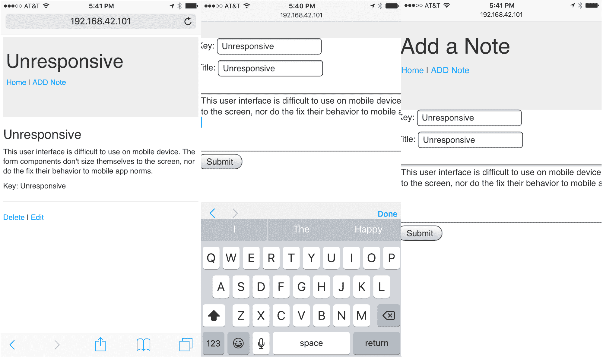
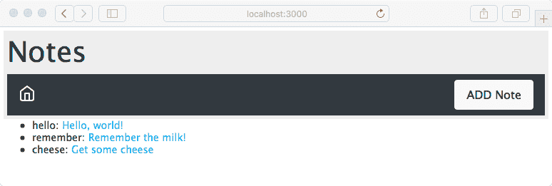
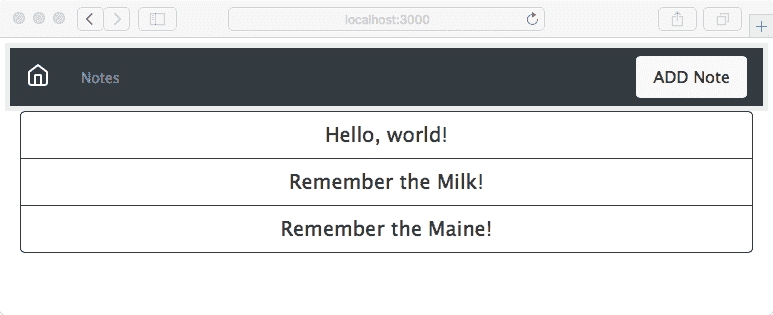
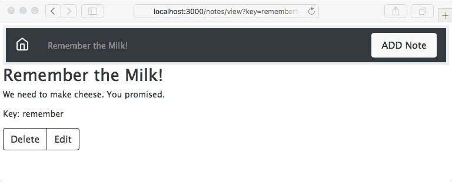
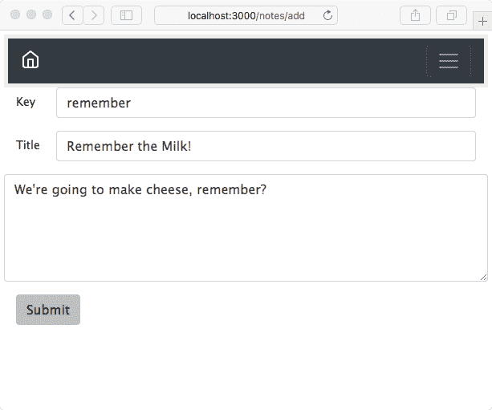

# 第六章：实施移动优先范式

既然我们的第一个 Express 应用程序已经可以使用，我们将遵循这个软件时代的精神：移动优先。无论是智能手机、平板电脑、汽车仪表盘、冰箱门还是浴室镜子，移动设备正在接管世界。

另一个问题是以移动优先的索引，这意味着搜索引擎开始优先索引网站的移动版本。到目前为止，搜索引擎主要集中在索引网站的桌面版本，但随着移动设备的日益普及，搜索引擎结果偏离了人们使用的内容。谷歌表示，如果搜索结果（由桌面版本生成）与网站的移动版本不匹配，这对移动用户来说是不公平的。有关谷歌的观点，包括使用标记的技术提示，请参阅[`webmasters.googleblog.com/2017/12/getting-your-site-ready-for-mobile.html`](http://webmasters.googleblog.com/2017/12/getting-your-site-ready-for-mobile.html)。

设计移动设备时的主要考虑因素是屏幕尺寸小、以触摸为导向的交互、没有鼠标以及用户界面期望的某些不同。对于*笔记*应用程序，我们的用户界面需求简单，没有鼠标对我们来说没有影响。

在本章中，我们不会进行太多的 Node.js 开发。相反，我们将：

+   修改模板以更好地展示移动界面

+   编辑 CSS 和 SASS 文件以自定义样式

+   了解 Bootstrap 4，这是一个流行的响应式 UI 设计框架

通过这样做，我们将涉足全栈网络工程师的含义。

# 问题 – 笔记应用程序不友好

让我们从量化问题开始。我们需要探索应用程序在移动设备上的表现如何（或不好）。这很简单：

1.  启动*笔记*应用程序。确定主机的 IP 地址。

1.  使用您的移动设备，通过 IP 地址连接到服务，浏览*笔记*应用程序，对其进行测试，注意任何困难。

另一种方法是使用您的桌面浏览器，将其调整到非常窄的尺寸。Chrome DevTools 还包含移动设备模拟器。无论哪种方式，您都可以在您的桌面上模拟智能手机的小屏幕尺寸。

要在移动屏幕上看到真正的用户界面问题，请编辑`views/noteedit.ejs`并更改此行：

```js
<br/><textarea rows=5 cols=80 name='body' >
    {{#if note }}{{note.body}}{{/if}} 
    </textarea>  
```

发生变化的是`cols=80`参数。我们希望这个`textarea`元素非常大，这样您就可以体验非响应式 Web 应用程序在移动设备上的外观。在移动设备上查看应用程序，您会看到类似于此截图中的一个屏幕：



在 iPhone 6 上查看笔记效果良好，但编辑/添加笔记的屏幕并不理想。文本输入区域太宽，以至于超出屏幕边缘。尽管与`FORM`元素的交互工作良好，但操作笨拙。总的来说，浏览*笔记*应用提供了可接受的移动用户体验，不会令人失望，也不会让我们的用户给出好评。

# 移动优先范式

移动设备屏幕较小，通常是触摸导向的，并且与桌面电脑相比，对用户体验有不同期望。

为了适应较小的屏幕，我们使用**响应式网页设计**技术。这意味着设计应用程序以适应屏幕尺寸，并确保网站能够在广泛的设备上提供最佳观看和交互体验。技术包括更改字体大小、重新排列屏幕上的元素、使用触摸时展开的折叠元素，以及调整图片或视频的大小以适应可用空间。这被称为**响应式**，因为应用程序通过这些变化对设备特性做出响应。

通过**移动优先**，我们是指首先设计应用程序以在移动设备上良好运行，然后转向更大屏幕的设备。这是关于优先考虑移动设备。

主要技术是使用样式表中的媒体查询来检测设备特性。每个媒体查询部分针对一系列设备，使用 CSS 声明适当地重新设计内容。

让我们来看一个具体的例子。Wordpress 的**Twenty Twelve**主题具有直接的响应式设计实现。它没有使用任何框架，因此你可以清楚地看到机制是如何工作的，样式表足够小，易于理解。请参考 Wordpress 仓库中的源代码：[`themes.svn.wordpress.org/twentytwelve/1.9/style.css`](https://themes.svn.wordpress.org/twentytwelve/1.9/style.css)。

样式表以一系列**重置**开始，其中样式表使用明确的默认值覆盖了一些典型的浏览器样式设置。然后，样式表的大部分内容定义了移动设备的样式。在样式表的底部是一个名为媒体查询的部分，其中对于某些尺寸的屏幕，为移动设备定义的样式被覆盖，以便在更大屏幕的设备上工作。

它通过以下两个媒体查询来实现：

```js
@media screen and (min-width: 600px) { /* Screens above 600px width */ } 
@media screen and (min-width: 960px) { /* Screens above 960px width */ }
```

样式表的第一部分配置了所有设备的页面布局。接下来，对于任何至少`600px`宽的浏览器视口，重新配置页面以在更大屏幕上显示。然后，对于任何至少`960px`宽的浏览器视口，再次重新配置。样式表有一个最后的媒体查询来覆盖打印设备。

这些宽度被称为**断点**。那些阈值视口宽度是设计自我改变的地方。你可以通过访问任何响应式网站，然后调整浏览器窗口大小来查看断点的实际效果。观察设计在特定尺寸时的跳跃。那些是那个网站作者选择的断点。

关于选择断点的最佳策略存在广泛的意见分歧。你是针对特定设备还是针对一般特征？Twenty Twelve 主题在移动设备上表现相当不错，仅使用两个 viewport-size 媒体查询。CSS-Tricks 博客发布了一个针对每个已知设备的详细媒体查询列表，可在[`css-tricks.com/snippets/css/media-queries-for-standard-devices/`](https://css-tricks.com/snippets/css/media-queries-for-standard-devices/)找到。

我们至少应该针对以下设备：

+   **小型**：这包括 iPhone 5 SE。

+   **中**：这可能指的是平板电脑或更大的智能手机。

+   **大**：这包括更大的平板电脑或较小的台式电脑。

+   **超大**：这指的是更大的台式电脑和其他大屏幕。

+   **横屏/竖屏**：你可能想在横屏模式和竖屏模式之间创建一个区别。在两种模式之间切换当然会改变视口宽度，可能超过一个断点。然而，你的应用可能需要在两种模式下有不同的行为。

理论就到这里吧；让我们回到我们的代码上来。

# 在笔记应用中使用 Twitter Bootstrap

Bootstrap 是一个以移动设备为先的框架，由 HTML5、CSS3 和 JavaScript 代码组成，提供了一套世界级的、响应式网络设计组件。它是由 Twitter 的工程师开发的，并于 2011 年 8 月发布到全球。

该框架包括将现代功能应用于旧浏览器的代码，一个响应式的 12 列网格系统，以及一个长长的组件列表（其中一些使用 JavaScript），用于构建网络应用和网站。它的目的是提供一个强大的基础，以便构建你的应用。

有关更多详细信息，请参阅[`getbootstrap.com`](http://getbootstrap.com)。

# 设置它

第一步是复制你在上一章中创建的代码。例如，如果你创建了一个名为`chap05/notes`的目录，那么从`chap05/notes`的内容中创建一个名为`chap06/notes`的目录。

现在，我们需要在*笔记*应用中添加 Bootstrap 的代码。Bootstrap 网站建议从 Bootstrap（和 jQuery）公共 CDN 加载所需的 CSS 和 JavaScript 文件。虽然这样做很简单，但我们不会这样做，原因有两个：

+   它违反了将所有依赖项本地化到应用中，而不是依赖全局依赖项的原则

+   它阻止我们生成自定义主题

相反，我们将安装一个本地的 Bootstrap 复制。安装 Bootstrap 有几种方法。例如，Bootstrap 网站提供了一个可下载的 TAR/GZIP 存档（tarball）。更好的方法是使用自动依赖管理工具。

最直接的选择是使用 npm 仓库中的 Bootstrap ([`www.npmjs.com/package/bootstrap`](https://www.npmjs.com/package/bootstrap))、popper.js ([`www.npmjs.com/package/popper.js`](https://www.npmjs.com/package/popper.js)) 和 jQuery ([`www.npmjs.com/package/jquery`](https://www.npmjs.com/package/jquery)) 包。这些包不提供 Node.js 模块，而是通过 npm 分发的前端代码。

我们使用以下命令安装包：

```js
$ npm install bootstrap@4.1.x --save
npm notice created a lockfile as package-lock.json. You should commit this file.
npm WARN bootstrap@4.1.0 requires a peer of jquery@1.9.1 - 3 but none is installed. You must install peer dependencies yourself.
npm WARN bootstrap@4.1.0 requires a peer of popper.js@¹.14.0 but none is installed. You must install peer dependencies yourself.

+ bootstrap@4.1.0
added 1 package in 1.026s

$ npm install jquery@1.9.x --save
+ jquery@1.9.1
$ npm install popper.js@1.14.x --save
+ popper.js@1.14.0
```

正如我们所看到的，当我们安装 Bootstrap 时，它会友好地告诉我们应使用 jQuery 和`popper.js`的相应版本。因此，我们尽职尽责地安装了这些版本。最重要的是查看下载了什么：

```js
$ ls node_modules/bootstrap/dist/*
... directory contents
$ ls node_modules/jquery/
... directory contents
$ ls node_modules/popper.js/dist
... directory contents
```

在这些目录中包含了用于浏览器的 CSS 和 JavaScript 文件。更重要的是，这些文件位于一个已知路径名的目录中——具体来说，就是我们刚才检查的目录。让我们看看如何配置我们的 Express 应用以在浏览器端使用这三个包。

# 将 Bootstrap 添加到应用模板中

在 Bootstrap 网站上，他们提供了一个推荐的 HTML 结构。我们将从他们的建议中提取，使用通过 CDN 提供的 Bootstrap 代码，改为使用我们刚刚安装的本地 Bootstrap、jQuery 和 Popper。请参阅[`getbootstrap.com/docs/4.0/getting-started/introduction/`](http://getbootstrap.com/docs/4.0/getting-started/introduction/)的入门页面。

我们将修改`views/layout.hbs`以匹配他们的推荐模板：

```js
<!doctype html>
<html lang="en">
  <head>
    <title>{{title}}</title>
    <meta charset="utf-8">
    <meta name="viewport" 
        content="width=device-width, initial-scale=1, shrink-to-
        fit=no">

    <link rel="stylesheet" 
    href="/assets/vendor/bootstrap/css/bootstrap.min.css">
 <link rel='stylesheet' href='/assets/stylesheets/style.css' />
  </head>
  <body>
    {{> header }}
    {{{body}}}
    <!-- jQuery first, then Popper.js, then Bootstrap JS -->
    <script src="img/jquery.min.js"></script>
 <script src="img/popper.min.js"></script>
 <script src="img/bootstrap.min.js"></script>
  </body>
</html>
```

这基本上是 Bootstrap 网站上显示的模板，结合了`views/layout.hbs`中的先前内容。我们的样式表在 Bootstrap 样式表之后加载，这给了我们覆盖任何想要更改的 Bootstrap 的机会。不同之处在于，我们不是从各自的 CDN 加载 Bootstrap、`popper.js`和 jQuery 包，而是使用`/assets/vendor/product-name`路径。

这与 Bootstrap 网站上推荐的相同，只是 URL 指向我们的网站而不是依赖于公共 CDN。

这个`/assets/vendor` URL 目前不被`Notes`应用程序识别。为了添加此支持，编辑`app.js`以添加以下行：

```js
app.use(express.static(path.join(__dirname, 'public')));
app.use('/assets/vendor/bootstrap', express.static( 
 path.join(__dirname, 'node_modules', 'bootstrap', 'dist'))); 
app.use('/assets/vendor/jquery', express.static( 
 path.join(__dirname, 'node_modules', 'jquery'))); 
app.use('/assets/vendor/popper.js', express.static( 
 path.join(__dirname, 'node_modules', 'popper.js', 'dist'))); 
```

在`public`目录下，我们需要做一些基本的整理工作。当`express-generator`设置初始项目时，它生成了`public/images`、`public/javascripts`和`public/stylesheets`目录。我们希望每个目录都在`/assets`目录下，所以这样做：

```js
$ mkdir public/assets
$ mv public/images/ public/javascripts/ public/stylesheets/ public/assets/
```

我们现在有了我们的资产文件，包括 Bootstrap、`popper.js`和 jQuery，所有这些都在`/assets`目录下的`Notes`应用程序中可用。页面布局引用了这些资产，并应提供默认的 Bootstrap 主题：

```js
$ npm start
> notes@0.0.0 start /Users/David/chap06/notes
> DEBUG=notes:* node ./bin/www

 notes:server Listening on port 3000 +0ms
GET / 200 306.660 ms - 883
GET /stylesheets/style.css 404 321.057 ms - 2439
GET /assets/stylesheets/style.css 200 160.371 ms - 165
GET /assets/vendor/bootstrap/js/bootstrap.min.js 200 157.459 ms - 50564
GET /assets/vendor/popper.js/popper.min.js 200 769.508 ms - 18070
GET /assets/vendor/jquery/jquery.min.js 200 777.988 ms - 92629
GET /assets/vendor/bootstrap/css/bootstrap.min.css 200 788.028 ms - 127343
```

屏幕上的差异很小，但这证明了 Bootstrap 的 CSS 和 JavaScript 文件正在被加载。我们已经实现了第一个主要目标——使用现代、移动友好的框架来实现移动优先的设计。

# 替代布局框架

Bootstrap 并不是唯一提供响应式布局和有用组件的 JavaScript/CSS 框架。我们在这个项目中使用 Bootstrap 是因为它的流行。这些框架值得一看：

+   Pure.css ([`purecss.io/`](https://purecss.io/)): 一个注重小代码体积的响应式 CSS 框架。

+   Picnic CSS ([`picnicss.com/`](https://picnicss.com/)): 一个强调小尺寸和美观的响应式 CSS 框架。

+   Shoelace ([`shoelace.style/`](https://shoelace.style/)): 一个强调使用未来 CSS 的 CSS 框架，这意味着它使用 CSS 标准化的前沿结构。由于大多数浏览器不支持这些功能，因此使用了 cssnext ([`cssnext.io/`](http://cssnext.io/))来提供这些功能的支持。Shoelace 使用基于 Bootstrap 网格的网格布局系统。

+   PaperCSS ([`www.getpapercss.com/`](https://www.getpapercss.com/)): 一个看起来像是手工绘制的非正式 CSS 框架。

+   Foundation ([`foundation.zurb.com/`](https://foundation.zurb.com/)): 自称为世界上最先进的响应式前端框架。

+   Base ([`getbase.org/`](http://getbase.org/)): 一个轻量级的现代 CSS 框架。

HTML5 Boilerplate ([`html5boilerplate.com/`](https://html5boilerplate.com/)) 是一个非常有用的编码 HTML 和其他资产的基础。它包含了网页中 HTML 代码的最佳实践，以及用于标准化 CSS 支持和配置文件的工具。

# Flexbox 和 CSS Grids

影响 Web 应用程序开发的其他新技术是两种新的 CSS 布局方法。CSS3 委员会已经在多个方面开展工作，包括页面布局。

在遥远的过去，我们使用嵌套 HTML 表格进行页面布局。这是一个我们不希望再次回顾的糟糕记忆。最近，我们一直在使用基于 DIV 的盒模型，有时甚至使用绝对或相对定位技术。所有这些技术都在多个方面表现不佳，有些甚至更差。

一种流行的布局技术是将水平空间划分为列，并将一定数量的列分配给页面上的每个元素。在一些框架中，我们甚至可以有嵌套的 DIV，每个 DIV 都有自己的列集。Bootstrap 3 和其他现代框架使用了这种布局技术。

两种新的 CSS 布局方法，Flexbox ([`en.wikipedia.org/wiki/CSS_flex-box_layout`](https://en.wikipedia.org/wiki/CSS_flex-box_layout)) 和 CSS Grids ([`developer.mozilla.org/en-US/docs/Web/CSS/CSS_Grid_Layout`](https://developer.mozilla.org/en-US/docs/Web/CSS/CSS_Grid_Layout))，相对于所有以前的方法都是显著的改进。我们提到这些技术，因为它们都值得注意。两者都处于采纳曲线的早期——它们已经被委员会标准化，并在最新的浏览器中得到采用，但当然，现场还有很多旧浏览器。

在 Bootstrap 4 中，Bootstrap 团队选择使用 Flexbox。因此，底层是 Flexbox CSS 结构。

# Notes 应用程序的移动优先设计

我们已经了解了响应式设计和 Bootstrap 的基础知识，并将 Bootstrap 框架集成到我们的应用程序中。现在我们准备重新设计应用程序，使其在移动设备上运行良好。

# 建立 Bootstrap 网格基础

Bootstrap 使用 12 列网格系统来控制布局，为应用程序提供一个响应式移动优先的基础，以便构建。它自动根据视口的大小或形状变化调整组件。该方法依赖于具有类别的 `<div>` 元素来描述每个 `<div>` 在布局中的作用。

基本布局模式如下：

```js
<div class="container-fluid"> 
  <div class="row"> 
    <div class="col-sm-3">Column 1 content</div> <!-- 25% -->
    <div class="col-sm-9">Column 2 content</div> <!-- 75% -->
  </div> 
  <div class="row"> 
    <div class="col-sm-3">Column 1 content</div> <!-- 25% -->
    <div class="col-sm-6">Column 2 content</div> <!-- 50% -->
    <div class="col-sm-3">Column 3 content</div> <!-- 25% -->
  </div>
</div>
```

最外层是 `.container` 或 `.container-fluid` 元素。容器提供了一种使内容居中或水平填充的方法。标记为 `.container-fluid` 的容器表现得像有 `width: 100%`，这意味着它们会扩展以填充水平空间。

`.row` 就像它的名字一样，是一个 `"row"`。技术上，行是列的包装器。容器是行的包装器，行是列的包装器，列包含显示给我们的用户的内容。明白了吗？

列通过 `.col` 类的变体进行标记。使用基本的列类 `.col`，列将等分可用空间。您可以指定一个数值列数来为每个列分配不同的宽度。Bootstrap 支持多达 12 个编号列，因此示例中的每一行都包含 12 列。

您还可以指定一个列应用的断点：

+   使用 `col-xs` 目标超小设备（智能手机，`<576px`）

+   使用 `col-sm` 目标小设备 (`>= 576px`)

+   使用 `col-md` 目标中等设备 (`>= 768px`)

+   使用 `col-lg` 目标大设备 (`>= 992px`)

+   使用 `col-xl` 目标超大设备 (`>= 1200px`)

指定一个断点，例如 `col-sm`，意味着它适用于匹配该断点的设备或更大的设备。因此，在前面显示的示例中，列定义适用于 `col-sm`、`col-md`、`col-lg` 和 `col-xl` 设备，但不适用于 `col-xs` 设备。

列数附加到类名上。这意味着在不针对断点时使用`col-#`，例如，`col-4`，或者当针对断点时使用`col-{breakpoint}-#`，例如，`col-md-4`。如果列的总数超过 12 列，超出第十二列的列将自动换行成为新的一行。可以使用`auto`代替数字列数来使列的大小适应其内容的自然宽度。

可以混合匹配以针对多个断点：

```js
<div class="container-fluid"> 
  <div class="row"> 
    <div class="col-xs-9 col-md-3 col-lg-6">Column 1 content</div> 
    <div class="col-xs-3 col-md-9 col-lg-6">Column 2 content</div> 
  </div> 
  ...
</div>
```

这声明了三种不同的布局，一个用于超小设备，另一个用于中等设备，最后一个用于大设备。这为我们提供了足够的资源来开始修改`Notes`应用。网格系统可以做更多的事情。有关详细信息，请参阅文档：[`getbootstrap.com/docs/4.0/layout/grid/`](http://getbootstrap.com/docs/4.0/layout/grid/).

# Notes 应用的响应式页面结构

我们将每个页面布局结构如下：

```js
<!DOCTYPE html> 
<html> 
<head> .. headerStuff </head> 
<body> 
.. pageHeader 
.. main content 
.. bottomOfPageStuff
</body> 
</html> 
```

因此，页面内容有两个可见的行：页眉和主要内容。在页面底部有一些不可见的东西，比如 Bootstrap 和 jQuery 的 JavaScript 文件。

在`views/layout.hbs`中不需要进行任何更改。有人可能会认为`container-fluid`包装器会在这个文件中，行和列在另一个模板中指定。相反，我们将在模板中这样做，以给我们最大的布局自由度。

# 使用图标库和提升视觉吸引力

我们周围的世界不是由文字构成的，而是由事物构成的。因此，像图标这样的图像风格应该有助于使计算机软件更易于理解。提供良好的用户体验应该会让我们的用户在应用商店中给我们更多的点赞。

在网站上可以使用几个图标库。Bootstrap 团队在[`getbootstrap.com/docs/4.1/extend/icons/`](http://getbootstrap.com/docs/4.1/extend/icons/)有一个精选列表。对于这个项目，我们将使用 Feather Icons ([`feathericons.com/`](https://feathericons.com/))及其方便的 npm 包，[`www.npmjs.com/package/feather-icons`](https://www.npmjs.com/package/feather-icons)。

在`package.json`中，将以下内容添加到依赖项中：

```js
"feather-icons": ">=4.5.x"
```

然后运行`npm install`来下载新包。然后您可以检查下载的包，并看到`./node_modules/feather-icons/dist/feather.js`包含浏览器端代码，这使得使用图标变得容易。

我们通过在`app.js`中挂载它来使该目录可用，就像我们为 Bootstrap 和 jQuery 库所做的那样。将以下代码添加到`app.js`中：

```js
app.use('/assets/vendor/feather-icons', express.static(
   path.join(__dirname, 'node_modules', 'feather-icons', 'dist'))); 
```

根据文档，我们必须将此放在`views/layout.hbs`的底部以启用`feather-icons`支持：

```js
<script src="img/feather.js"></script>
<script>
  feather.replace();
</script>
```

要使用其中一个图标，请使用`data-feather`属性指定一个图标名称，如下所示：

```js
<i data-feather="circle"></i>
```

重要的是 `data-feather` 属性，这是 Feather Icons 库用来识别要使用的 SVG 文件的属性。Feather Icons 库会完全替换找到 `data-feather` 属性的元素。因此，如果你想使图标成为一个可点击的链接，就需要用 `<a>` 标签包裹图标定义，而不是将 `data-feather` 添加到 `<a>` 标签中。下一节将展示一个示例。

# 响应式页面标题导航栏

我们之前设计的页眉部分包含一个页面标题和一个小导航栏。Bootstrap 有几种方法可以使它看起来更漂亮，甚至可以给我们一个响应式的导航栏，在小型设备上可以整洁地折叠成菜单。

在 `views/pageHeader.ejs` 中进行以下更改：

```js
<header class="page-header">
<h1>{{ title }}</h1>
<nav class="navbar navbar-expand-md navbar-dark bg-dark">
  <a class="navbar-brand" href='/'><i data-feather="home"></i></a>
  <button class="navbar-toggler" type="button" 
     data-toggle="collapse" data-target="#navbarSupportedContent"
     aria-controls="navbarSupportedContent" 
     aria-expanded="false" aria-label="Toggle navigation">
     <span class="navbar-toggler-icon"></span>
  </button>
  <div class="collapse navbar-collapse" id="navbarSupportedContent">
     <div class="navbar-nav col">
     {{#if breadcrumb}}
     <a class="nav-item nav-link" href='{{breadcrumb.url}}'>
     {{breadcrumb.title}}</a>
     {{/if}}
     </div>
     <a class="nav-item nav-link btn btn-light col-auto"
                   href='/notes/add'>ADD Note</a>
  </div>
</nav>
</header>
```

添加 `class="page-header"` 通知 Bootstrap 这是一个页面标题。在这个范围内，我们有之前提到的 `<h1>` 标题，提供页面标题，然后是一个响应式的 Bootstrap `navbar`。

默认情况下，`navbar` 是展开的——这意味着 `navbar` 内部的组件是可见的——这是因为使用了 `navbar-expand-md` 类。这个 `navbar` 使用了一个 `navbar-toggler` 按钮，它控制着 `navbar` 的响应性。默认情况下，这个按钮是隐藏的，`navbar` 的主体是可见的。如果屏幕足够小，`navbar-toggler` 将变为可见，`navbar` 的主体将不可见，并且当点击现在可见的 `navbar-toggler` 时，会下拉一个菜单，包含 `navbar` 的主体：



我们选择了 *home* 图标，因为它表示返回主页。我们的意图是在导航到 *Notes* 应用程序时，`navbar` 的中间部分将包含一个面包屑导航。

添加笔记按钮通过一点 Flexbox 魔法粘附在右侧。容器是一个 Flexbox，这意味着我们可以使用 Bootstrap 类来控制每个项目占用的空间。在这种情况下，面包屑区域是空的，但包含它的 `<div>` 是存在的，并且声明了 `class="col"`，这意味着它占用一个列单位。另一方面，添加笔记按钮声明为 `class="col-auto"`，这意味着它只占用自身所需的空间。是空的面包屑区域会扩展以填充空间，而添加笔记按钮只填充其自身的空间，因此被推到一边。

因为它是同一个应用程序，所以所有功能都正常工作；我们只是在处理展示。我们添加了一些笔记，但主页上列表的展示还有很多需要改进的地方。标题的大小很小，不太友好，因为它没有提供一个大的目标区域供指尖点击。你能解释为什么 `notekey` 值必须显示在主页上吗？

# 改进主页上的笔记列表

当前主页有一个简单的文本列表，它并不非常友好，而且在行首显示 *key* 可能对用户来说难以理解。让我们来修复这个问题。

编辑 `views/index.hbs` 并进行以下更改：

```js
<div class="container-fluid">
  <div class="row">
    <div class="col-12 btn-group-vertical" role="group">
      {{#each notelist}}
      <a class="btn btn-lg btn-block btn-outline-dark" 
          href="/notes/view?key={{ key }}">{{ title }}</a>
      {{/each}}
    </div>
  </div>
</div>
```

第一个更改是放弃使用列表，转而使用垂直按钮组。通过使文本链接看起来和表现得像按钮，我们改善了用户界面，特别是其触摸友好性。我们选择了 `btn-outline-dark` 按钮样式，因为它在用户界面中看起来很好。我们使用大按钮（`btn-lg`）来填充容器宽度（`btn-block`）。

我们消除了向用户展示 notekey 的做法。这些信息并没有为用户体验增添任何价值：


这已经开始成形，拥有一个看起来不错的首页，能够很好地处理尺寸调整，并且触摸友好。

由于页眉区域占据了相当大的空间，我们还有更多的事情要做。当我们查看中间结果时，我们总是可以自由地重新思考计划。早些时候，我们为页眉区域创建了一个设计，但反思后，这个设计看起来太大。原本的意图是在主页图标右侧插入面包屑，并保留页眉区域顶部的 `<h1>` 标题。但这占用了垂直空间，我们可以使页眉更加紧凑，并可能改善外观。

编辑 `partials/header.hbs` 并替换为以下内容：

```js
<header class="page-header">
<nav class="navbar navbar-expand-md navbar-dark bg-dark">
  <a class="navbar-brand" href='/'><i data-feather="home"></i></a>
  <button class="navbar-toggler" type="button" 
         data-toggle="collapse" data-target="#navbarSupportedContent"
         aria-controls="navbarSupportedContent"
         aria-expanded="false"
         aria-label="Toggle navigation">
     <span class="navbar-toggler-icon"></span>
  </button>
  <div class="collapse navbar-collapse" id="navbarSupportedContent">
    <span class="navbar-text col">{{ title }}</span>
    <a class="nav-item nav-link btn btn-light col-auto" href='/notes/add'>ADD Note</a>
  </div>
</nav>
</header>
```

这移除了页眉区域顶部的 `<h1>` 标签，立即使展示更加紧凑。

在 `navbar-collapse` 区域内，我们将原本打算用作面包屑的部分替换为一个简单的 `navbar-text` 组件。为了使“添加笔记”按钮紧贴右侧，我们保留了 `class="col"` 和 `class="col-auto"` 设置：



哪种页眉区域设计更好？这是一个好问题。因为美是主观的，两种设计可能同样优秀。我们所展示的是通过编辑模板文件可以多么容易地更新设计。

# 简化笔记查看体验

查看笔记本身并不差，但用户体验可以进一步改进。例如，用户不需要看到 notekey。此外，Bootstrap 提供了更美观的按钮供我们使用。

在 `views/noteview.hbs` 中进行以下更改：

```js
<div class="container-fluid">
    <div class="row"><div class="col-xs-12">
        {{#if note}}<h3>{{ note.title }}</h3>{{/if}}
        {{#if note}}<p>{{ note.body }}</p>{{/if}}
        <p>Key: {{ notekey }}</p>
    </div></div>
    {{#if notekey }}
        <div class="row"><div class="col-xs-12">
        <div class="btn-group">
            <a class="btn btn-outline-dark" 
                href="/notes/destroy?key={{notekey}}" 
                role="button">Delete</a>
            <a class="btn btn-outline-dark" 
                href="/notes/edit?key={{notekey}}" 
                role="button">Edit</a>
        </div>
        </div></div>
    {{/if}}
</div>
```

我们声明了两行，一行用于笔记，另一行用于对笔记执行操作的按钮。两者都被声明为占用所有 12 列，因此占据全部可用宽度。按钮再次包含在一个按钮组中：



我们真的需要向用户展示 notekey 吗？我们会保留它，但这对于用户体验团队来说是一个开放的问题。否则，我们已经改善了笔记阅读体验。

# 简化添加/编辑笔记表单

下一个主要明显的问题是添加和编辑笔记的表单。正如我们之前所说，很容易让文本输入区域在小屏幕上溢出。另一方面，Bootstrap 提供了广泛的支持，可以制作出在移动设备上表现良好的漂亮表单。

将`views/noteedit.hbs`中的`form`改为以下内容：

```js
<form method='POST' action='/notes/save'>
  <div class="container-fluid">
    {{#if docreate}}
      <input type='hidden' name='docreate' value="create">
    {{else}}
      <input type='hidden' name='docreate' value="update">
    {{/if}}
    <div class="form-group row align-items-center">
      <label for="notekey" class="col-1 col-form-label">Key</label>
      {{#if docreate }}
        <div class="col">
          <input type='text' class="form-control" 
                 placeholder="note key" name='notekey' value=''/> 
        </div>
      {{else}} 
        {{#if note }}
          <span class="input-group-text">{{notekey}}</span>
        {{/if}} 
        <input type='hidden' name='notekey'
               value='{{#if note }}{{notekey}}{{/if}} '/> 
      {{/if}} 
    </div> 

    <div class="form-group row">
      <label for="title" class="col-1 col-form-label">Title</label>
      <div class="col">
        <input type="text" class="form-control" 
               id='title' name='title' placeholder="note title" 
               value='{{#if note }}{{note.title}}{{/if}}'>
      </div>
    </div>

    <div class="form-group row">
      <textarea class="form-control" name='body' 
                rows="5">{{#if note }}{{note.body}}{{/if}}</textarea>
    </div>
    <button type="submit" class="btn btn-default">Submit</button>
 </div>
</form>
```

这里有很多事情在进行。我们所做的是重新组织`form`，以便 Bootstrap 可以正确地处理它。首先要注意的是，我们有几个这样的实例：

```js
<div class="form-group row"> .. </div> 
```

这些内容都在一个`container-fluid`中，这意味着我们在表单中设置了三行。

Bootstrap 使用`form-group`元素为表单添加结构，并鼓励正确使用`<label>`元素以及其他表单元素。使用`<label>`与每个`<input>`一起使用是一种良好的做法，以提高浏览器中的辅助功能行为，而不是简单地留下一些悬空文本。

每个表单元素都有`class="form-control"`。Bootstrap 使用这个类来识别控件，以便添加样式和行为。

默认情况下，Bootstrap 格式化`form-group`元素，使`label`出现在输入控件另一行。请注意，我们已将`class="col-1"`添加到标签，并将`class="col"`添加到包裹输入的`<div>`。这声明了两个列，第一个占用一列单位，另一个占用剩余部分。

`placeholder='key'`属性在空白的文本输入元素中放置示例文本。一旦用户输入内容，它就会消失，这是一种很好的提示用户输入预期内容的方式。

最后，我们将提交按钮改为了 Bootstrap 按钮。这些按钮看起来很漂亮，Bootstrap 确保它们运行得很好：



结果看起来很好，在 iPhone 上运行良好。它会自动调整大小以适应其所在的屏幕。一切表现都很正常。在这张屏幕截图中，我们将窗口调整得足够小，以至于导航栏发生了折叠。点击右侧所谓的汉堡图标（三条水平线）会导致导航栏内容弹出为菜单。

# 清理删除笔记窗口

用于验证删除笔记意愿的窗口看起来还不错，但可以进行改进。

编辑`views/notedestroy.hbs`以包含以下内容：

```js
<form method='POST' action='/notes/destroy/confirm'>
  <div class="container-fluid">
    <input type='hidden' name='notekey' value='{{#if note}}{{notekey}}{{/if}}'>
    <p class="form-text">Delete {{note.title}}?</p>
    <div class="btn-group">
      <button type="submit" value='DELETE' 
              class="btn btn-outline-dark">DELETE</button>
      <a class="btn btn-outline-dark" 
              href="/notes/view?key={{#if note}}{{notekey}}{{/if}}" 
              role="button">
         Cancel</a>
    </div>
  </div>
</form>
```

我们重新设计了所有内容，以使用 Bootstrap 表单的优点。关于删除笔记的问题用`class="form-text"`包裹，以便 Bootstrap 可以正确显示。

按钮仍然用`class="btn-group"`包裹，按钮的样式与其他屏幕上的样式完全相同，保持了应用程序中的一致外观：


存在一个问题，即导航栏中的标题文本没有使用单词`Delete`。在`routes/notes.js`中，我们可以进行以下更改：

```js
// Ask to Delete note (destroy)
router.get('/destroy', async (req, res, next) => {
  var note = await notes.read(req.query.key);
  res.render('notedestroy', {
    title: note ? `Delete ${note.title}` : "",
    notekey: req.query.key, note: note
  });
});
```

我们所做的是更改传递给模板的`title`参数。我们在`/notes/edit`路由处理程序中做了这件事，但似乎在这个处理程序中遗漏了这样做。

# 构建定制的 Bootstrap

使用 Bootstrap 的一个原因是你可以轻松构建一个定制版本。样式表使用 SASS 构建，SASS 是 CSS 预处理器之一，用于简化 CSS 开发。在 Bootstrap 的代码中，一个文件（`scss/_variables.scss`）包含了 Bootstrap 的其余 `.scss` 文件中使用的变量。更改一个变量可以自动影响 Bootstrap 的其余部分。

之前，我们使用自定义 CSS 文件 `public/stylesheets/style.css` 覆盖了几个 Bootstrap 的行为。这是一种改变几个特定内容的方法，但对于 Bootstrap 的大规模更改不起作用。严肃的 Bootstrap 定制化需要生成定制的 Bootstrap 构建。

Bootstrap 官方网站上的官方文档（[`getbootstrap.com/docs/4.1/getting-started/build-tools/`](http://getbootstrap.com/docs/4.1/getting-started/build-tools/））对于了解构建过程非常有用。

如果你已经按照之前给出的说明操作，你将有一个包含 `Notes` 应用程序源代码的目录 `chap06/notes`。在 `chap06/notes` 中创建一个名为 `theme` 的目录，我们将在其中设置自定义 Bootstrap 构建。

作为十二要素应用模型的学生，我们将使用该目录中的 `package.json`来自动化构建过程。其中不涉及任何 Node.js 代码；npm 也是自动化软件构建过程的便捷工具。

首先，从 [https://github.com/twbs/bootstrap](https://github.com/twbs/bootstrap) 下载 Bootstrap 源代码树。虽然 Bootstrap npm 包包括 SASS 源文件，但这不足以构建 Bootstrap，因此必须下载源代码树。我们做的是导航到 GitHub 仓库，点击“Releases”标签，并选择最新版本的 URL。

在包含此 `scripts` 部分的 `theme/package.json` 中：

```js
{
  "scripts": {
    "download": "wget -O - https://github.com/twbs/bootstrap/archive/v4.1.0.tar.gz | tar xvfz -",
    "postdownload": "cd bootstrap-4.1.0 && npm install"
  }
}
```

输入以下命令：

```js
$ npm run download
```

这将从 Bootstrap 仓库下载 tar-gzip（tarball）存档并立即解压。如果你使用的是 Windows，最简单的方法是在 Windows Subsystem for Linux 中运行该脚本以执行这些命令。下载并解压存档后，`postdownload` 步骤会在该目录中运行 `npm install`。Bootstrap 团队使用他们的 `package.json`，不仅用于跟踪构建 Bootstrap 所需的所有依赖项，而且还用于驱动构建过程。

Bootstrap 的 `npm install` 需要很长时间，所以请耐心等待。

这只安装了构建 Bootstrap 所需的工具。构建 Bootstrap 文档需要安装额外的基于 Ruby 的工具（Jekyll 和一些插件）。

要构建 Bootstrap，让我们将以下行添加到 `theme/package.json` 中的 `scripts` 部分：

```js
"scripts": {
...
 "build": "cd bootstrap-4.1.0 && npm run dist",
 "watch": "cd bootstrap-4.1.0 && npm run watch"
...
}
```

显然，你需要根据 Bootstrap 项目的新版本发布调整目录名称。在 Bootstrap 源代码树中，运行`npm run dist`构建 Bootstrap，而`npm run watch`设置一个自动化的过程来扫描更改的文件，并在任何文件更改时重新构建 Bootstrap。通过将这些行添加到我们的`theme/package.json`中，我们可以在终端中启动它，并且它会根据需要自动重新运行构建。

现在运行以下命令进行构建：

```js
$ npm run build
```

构建文件将放在`theme/bootstrap-4.1.0/dist`目录中。该目录的内容将与相应的 npm 包内容相匹配。

如果一直不明显的话——这些 URL 和文件或目录名中嵌入了 Bootstrap 版本号。随着新 Bootstrap 版本的发布，你必须调整路径名以匹配当前版本号。

在继续之前，让我们看看 Bootstrap 的源代码树。`scss`目录包含了将被编译成 Bootstrap CSS 文件的 SASS 源代码。要生成定制的 Bootstrap 构建，需要在那个目录中进行一些修改。

`bootstrap-4.1.0/scss/bootstrap.scss`文件包含`@import`指令以引入所有 Bootstrap 组件。`bootstrap-4.1.0/scss/_variables.scss`文件包含 Bootstrap SASS 源代码中使用的定义。编辑或覆盖这些值将改变使用结果 Bootstrap 构建的网站的外观。

例如，以下定义决定了主要颜色值：

```js
$white: #fff !default;
$gray-100: #f8f9fa !default;
...
$gray-800: #343a40 !default;
...
$blue: #007bff !default;
...
$red: #dc3545 !default;
$orange: #fd7e14 !default;
$yellow: #ffc107 !default;
$green: #28a745 !default;
...
$primary: $blue !default;
$secondary: $gray-600 !default;
$success: $green !default;
$info: $cyan !default;
$warning: $yellow !default;
$danger: $red !default;
$light: $gray-100 !default;
$dark: $gray-800 !default;
```

这些类似于 CSS 语句。`!default`属性指定这些值为默认值。任何`!default`值都可以在不编辑`_values.scss`的情况下进行覆盖。

创建一个文件，`theme/_custom.scss`，包含以下内容：

```js
$white: #fff !default;
$gray-900: #212529 !default;
$body-bg: $gray-900 !default;
$body-color: $white !default;
```

这将反转`_variables.scss`中`$body-bg`和`$body-color`设置的值。笔记应用现在将使用白色文本在深色背景上，而不是默认的白色背景和深色文本。因为这些声明没有使用`!default`，所以它们将覆盖`_variables.scss`中的值。

然后，在主题目录中复制`scss/bootstrap.scss`并对其进行修改，如下所示：

```js
@import "custom";
@import "functions";
@import "variables";
...
```

我们正在导入我们刚刚创建的`_custom.scss`文件。最后，将此行添加到`theme/package.json`的`scripts`部分：

```js
 "prebuild": "cp _custom.scss bootstrap.scss bootstrap-4.1.0/scss",
```

在此基础上，在构建 Bootstrap 之前，这两个文件将被复制到相应位置。接下来，重新构建 Bootstrap：

```js
$ npm run build

> @ prebuild /Users/David/chap06/notes/theme
> cp _custom.scss bootstrap.scss bootstrap-4.1.0/scss

> @ build /Users/David/chap06/notes/theme
> cd bootstrap-4.1.0 && npm run dist
...
```

当构建进行时，让我们修改`notes/app.js`以挂载构建目录：

```js
// app.use('/assets/vendor/bootstrap', express.static(
// path.join(__dirname, 'node_modules', 'bootstrap', 'dist'))); app.use('/assets/vendor/bootstrap', express.static( 
  path.join(__dirname, 'theme', 'bootstrap-4.1.0', 'dist'))); 
```

我们所做的是将`node_modules`中的 Bootstrap 切换到了我们在`theme`目录中刚刚构建的版本。Bootstrap 的版本号会显示在这里，因此这也必须随着新 Bootstrap 版本的采用而更新。

然后，重新加载应用程序，你会看到以下内容：


要得到完全相同的效果，你可能需要在模板中做一些更改。我们之前使用的按钮元素具有`btn-outline-dark`类，这在浅色背景上工作得很好。现在背景变暗了，这些按钮需要使用浅色。

要更改按钮，请在`views/index.hbs`中进行以下更改：

```js
<a class="btn btn-lg btn-block btn-outline-light" 
   href="/notes/view?key={{ key }}"> {{ title }} </a>
```

在`views/noteview.hbs`中做类似的更改：

```js
<a class="btn btn-outline-light" href="/notes/destroy?key={{notekey}}" 
   role="button"> Delete </a>
<a class="btn btn-outline-light" href="/notes/edit?key={{notekey}}" 
   role="button"> Edit </a>
```

这很酷，我们现在可以按任何我们想要的方式重新工作 Bootstrap 颜色方案。不要把这个展示给你的用户体验团队，因为他们会大发雷霆。我们这样做是为了证明我们可以编辑`_custom.scss`并更改 Bootstrap 主题。

# 预构建的自定义 Bootstrap 主题

如果这一切对你来说太复杂，有几个网站提供预构建的 Bootstrap 主题，或者提供简化工具来生成 Bootstrap 构建。为了熟悉这个过程，让我们从 Bootswatch 下载一个主题（[`bootswatch.com/`](https://bootswatch.com/)）。这是一个免费和开源主题的集合，也是一个用于生成自定义 Bootstrap 主题的构建系统（[`github.com/thomaspark/bootswatch/`](https://github.com/thomaspark/bootswatch/))）。

让我们使用 Bootswatch 的**Minty**主题来探索所需的更改。你可以从网站上下载主题，或者将以下内容添加到`package.json`的`scripts`部分：

```js
"dl-minty": "mkdir -p minty && npm run dl-minty-css && npm run dl-minty-min-css",
"dl-minty-css": "wget https://bootswatch.com/4/minty/bootstrap.css -O minty/bootstrap.css",
"dl-minty-min-css": "wget https://bootswatch.com/4/minty/bootstrap.min.css -O minty/bootstrap.min.css"  
```

这将下载我们选择的主题的预构建 CSS 文件。顺便提一下，Bootswatch 网站提供了`_variables.scss`和`_bootswatch.scss`文件，这些文件可以使用与我们在上一节中实现的工作流程类似的工作流程使用。与 Bootswatch 网站匹配的 GitHub 存储库具有构建自定义主题的完整构建过程。

执行下载：

```js
$ npm run dl-minty

> notes@0.0.0 dl-minty /Users/David/chap06/notes
> mkdir -p minty && npm run dl-minty-css && npm run dl-minty-min-css

> notes@0.0.0 dl-minty-css /Users/David/chap06/notes
> wget https://bootswatch.com/4/minty/bootstrap.css -O minty/bootstrap.css

> notes@0.0.0 dl-minty-min-css /Users/David/chap06/notes
> wget https://bootswatch.com/4/minty/bootstrap.min.css -O minty/bootstrap.min.css
```

在`app.js`中，我们需要将 Bootstrap 挂载更改为分别挂载 JavaScript 和 CSS 文件。使用以下内容：

```js
// app.use('/assets/vendor/bootstrap', express.static( 
// path.join(__dirname, 'node_modules', 'bootstrap', 'dist'))); 
// app.use('/assets/vendor/bootstrap', express.static( 
// path.join(__dirname, 'theme', 'bootstrap-4.0.0', 'dist'))); 
app.use('/assets/vendor/bootstrap/js', express.static( 
  path.join(__dirname, 'node_modules', 'bootstrap', 'dist', 'js'))); 
app.use('/assets/vendor/bootstrap/css', express.static( 
  path.join(__dirname, 'minty')));
```

现在我们对`/vendor/bootstrap`的挂载不再是一个，而是每个子目录都有两个挂载。只需将`/vendor/bootstrap/css`挂载点设置为包含从主题提供商下载的 CSS 文件的目录。

由于 Minty 是一个浅色主题，按钮需要使用深色样式。我们之前因为背景是深色的，所以将按钮更改为使用浅色样式。现在我们必须从`btn-outline-light`切换回`btn-outline-dark`。在`partials/header.hbs`中，颜色方案需要更改导航栏内容：

```js
<div class="collapse navbar-collapse" id="navbarSupportedContent">
 <span class="navbar-text text-dark col">{{ title }}</span>
 <a class="nav-item nav-link btn btn-dark col-auto" href='/notes/add'>ADD Note</a>
</div>
```

我们选择了`text-dark`和`btn-dark`类来与背景形成对比。

重新运行应用程序，你会看到类似以下内容：


# 摘要

使用 Bootstrap 的可能性是无限的。虽然我们覆盖了很多内容，但我们只是触及了表面，我们本可以对*笔记*应用做更多的工作。

你已经了解了 Twitter Bootstrap 框架能做什么。Bootstrap 的目标是使移动响应式开发变得简单。我们使用 Bootstrap 对 *Notes* 应用的外观和感觉进行了重大改进。我们对 Bootstrap 进行了定制，尝试生成一个自定义主题。

现在，我们想要回到编写 Node.js 代码。我们暂停在第五章，*你的第一个 Express 应用程序*，讨论了持久性问题，以便在停止和重新启动 *Notes* 应用程序时不会丢失我们的笔记。在第七章，*数据存储和检索*中，我们将深入探讨使用数据库来存储我们的数据。

为了让我们自己有一些关于 ES6 模块格式的经验，我们将相应地重写 *Notes* 应用程序。
