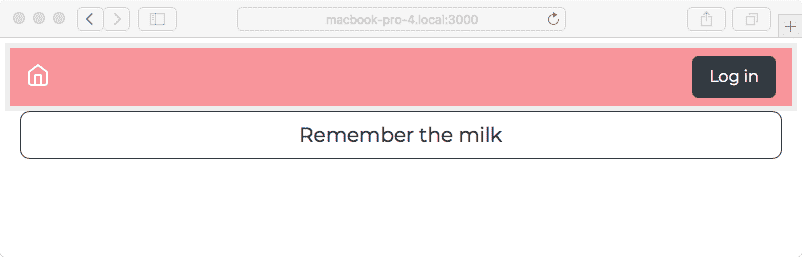
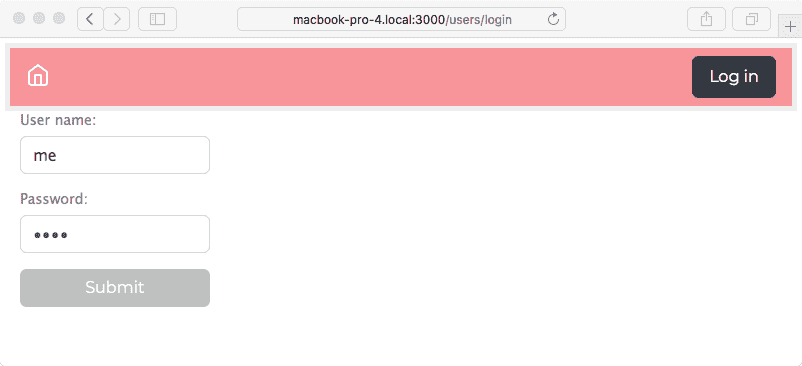
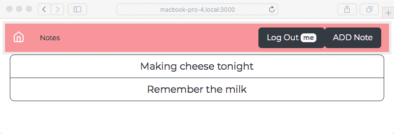
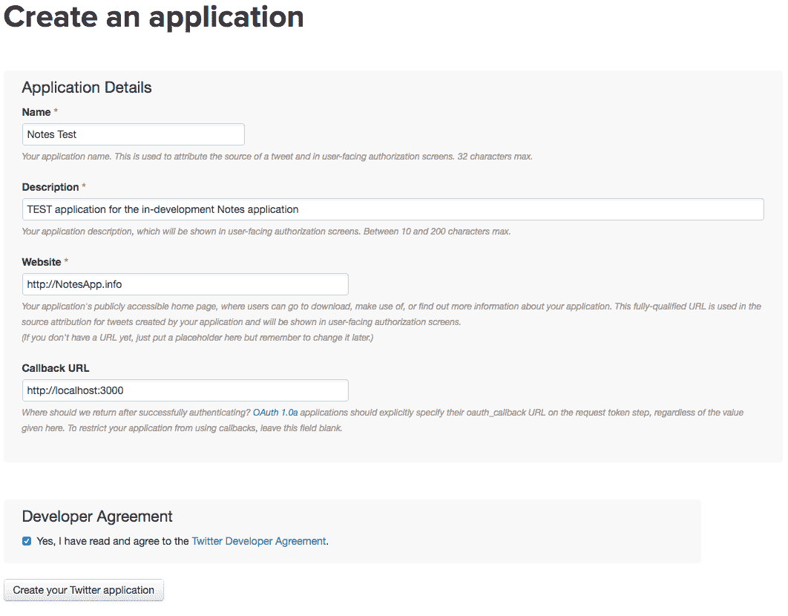
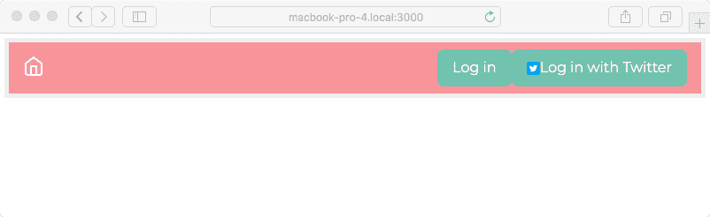
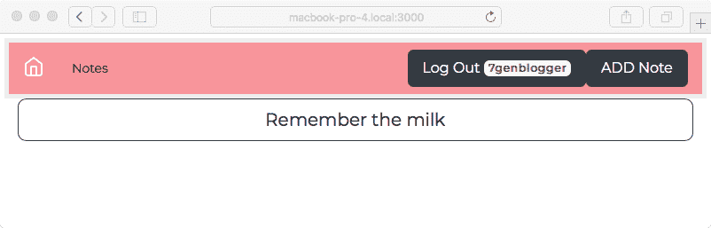
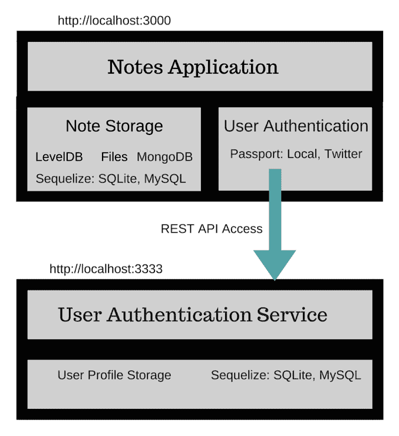

# 第八章：多用户身份验证的微服务方式

现在既然我们的笔记应用可以将其数据保存在数据库中，我们可以考虑将此应用真正化的下一阶段，即验证我们的用户。

登录网站以使用其服务是如此自然。我们每天都在做这件事，甚至信任银行和投资机构通过网站上的登录程序来保护我们的财务信息。HTTP 是一个无状态协议，Web 应用无法区分一个 HTTP 请求与另一个 HTTP 请求之间的差异。因为 HTTP 是无状态的，HTTP 请求本身并不知道驱动 Web 浏览器的用户是否已登录，用户的身份，甚至 HTTP 请求是否由人类发起。

用户身份验证的典型方法是向浏览器发送一个包含用于携带用户身份的令牌的 cookie。cookie 需要包含标识浏览器和该浏览器是否已登录的数据。然后，cookie 将与每个请求一起发送，让应用跟踪与浏览器关联的用户账户。

使用 Express，最佳做法是使用`express-session`中间件。它将数据存储为 cookie，并在每个浏览器请求中查找该数据。它易于配置，但不是用户身份验证的完整解决方案。有几个附加模块处理用户身份验证，其中一些甚至支持对第三方网站（如 Facebook 或 Twitter）进行用户身份验证。

一个包似乎在用户身份验证方面处于领先地位——Passport ([`passportjs.org/`](http://passportjs.org/))。它支持一系列服务，可以用来进行身份验证，这使得开发允许用户使用来自另一个网站（例如 Twitter）的凭证注册的网站变得容易。另一个是 express-authentication ([`www.npmjs.com/package/express-authentication`](https://www.npmjs.com/package/express-authentication))，它将自己定位为 Passport 的有见地的替代方案。

我们将使用 Passport 来验证用户，既包括本地存储的用户凭证数据库，也包括使用 OAuth2 验证 Twitter 账户。我们还将借此机会探索基于 Node.js 的 REST 微服务实现。

在本章中，我们将讨论这一阶段以下三个方面：

+   创建一个微服务来存储用户配置文件/身份验证数据。

+   使用本地存储的密码进行用户身份验证。

+   使用 OAuth2 支持通过第三方服务进行身份验证。具体来说，我们将使用 Twitter 作为第三方身份验证服务。

让我们开始吧！

首先要做的是复制前一章使用的代码。例如，如果你将那段代码保存在`chap07/notes`中，创建一个新的目录，`chap08/notes`。

# 创建用户信息微服务

我们可以通过简单地添加用户模型、一些路由和视图到现有的*Notes*应用程序来实现用户身份验证和账户管理。虽然这是可行的，但在现实世界的生产应用程序中我们会这样做吗？

考虑到用户身份信息的高价值，以及对于强大且可靠的用户身份验证的超级强烈需求。网站入侵事件经常发生，似乎最常被盗取的是用户身份。

您能否设计和构建一个具有所需安全级别的用户身份验证系统？一个可能对所有类型的入侵者都安全的系统？

就像许多其他软件开发问题一样，最好使用现有的身份验证库，最好是那些有着长期记录、重大漏洞已经得到修复的库。

另一个问题是如何在架构选择上促进安全性。漏洞总会出现，而那些有才能的恶意分子会趁机入侵。将用户信息数据库隔离起来是一个很好的想法，以限制风险。

维护一个用户信息数据库可以使您验证您的用户，展示用户资料，帮助用户相互连接等等。这些都是提供给网站用户的有用服务，但您如何限制数据落入错误之手的风险？

在本章中，我们将开发一个用户身份验证微服务。计划是最终将该服务隔离到一个受到良好保护的封闭区域。这模仿了一些网站所做的架构选择，即严格控制 API 甚至对用户信息数据库的物理访问，尽可能实施技术障碍以防止未经授权的访问。

微服务当然不是万能的，这意味着我们不应该试图将每个应用程序都强行塞入微服务的框架中。通过类比，微服务就像 Unix 哲学中的小型工具，每个工具都擅长做一件事，我们将它们混合、匹配、组合成更大的工具。这个词的另一个说法是可组合性。虽然我们可以用这种哲学构建许多有用的软件工具，但这适用于像 Photoshop 或 LibreOffice 这样的应用程序吗？虽然从单一用途的工具中构建系统非常灵活，但会失去组件紧密集成所带来的优势。

第一个问题是要不要使用面向 REST 服务的框架，在裸 Node.js 上编写 REST 应用程序，还是什么？您可以在内置的`http`模块上实现 REST 服务。使用应用程序框架的优势是框架作者已经内置了许多最佳实践、错误修复和安全措施。例如，Express 被广泛使用，非常受欢迎，可以轻松用于 REST 服务。还有其他更符合开发 REST 服务的框架，我们将使用其中之一——Restify ([`restify.com/`](http://restify.com/))。

用户身份验证服务器将需要两个模块：

+   使用 Restify，实现 REST 接口

+   使用 Sequelize 在 SQL 数据库中存储用户数据对象的模型

为了测试服务，我们将编写几个简单的脚本，用于在数据库中管理用户信息。我们不会在 *Notes* 应用程序中实现一个管理用户界面，并将依赖于这些脚本来管理用户。作为副作用，我们将有一个工具来对用户服务运行几个简单的测试。

在此服务正常运行后，我们将着手修改笔记应用程序，以便从服务中访问用户信息，同时使用 Passport 来处理身份验证。

第一步是创建一个新的目录来存放用户信息微服务。这应该是笔记应用程序的兄弟目录。如果你创建了一个名为 `chap08/notes` 的目录来存放笔记应用程序，那么创建一个名为 `chap08/users` 的目录来存放微服务。

然后运行以下命令：

```js
$ cd users
$ npm init
.. answer questions 
.. name - user-auth-server
$ npm install debug@².6.x fs-extra@⁵.x js-yaml@³.10.x \
       restify@⁶.3.x restify-clients@¹.5.x sequelize@⁴.31.x \
       sqlite3@³.1.x --save
```

这使我们准备好开始编码。我们将使用 `debug` 模块来记录消息，使用 `js-yaml` 来读取 Sequelize 配置文件，使用 `restify` 来提供其 REST 框架，以及使用 `sequelize/mysql/sqlite3` 来进行数据库访问。

# 用户信息模型

我们将使用基于 Sequelize 的模型在 SQL 数据库中存储用户信息。在这个过程中，思考一个问题：我们应该直接将数据库代码集成到 REST API 实现中吗？这样做会将用户信息微服务简化为一个模块，其中数据库查询与 REST 处理器混合。通过将 REST 服务与数据存储模型分离，我们有自由选择除了 Sequelize/SQL 之外的其他数据存储系统。此外，数据存储模型可能以其他方式被使用，而不仅仅是 REST 服务。

在 `users` 目录中创建一个名为 `users-sequelize.mjs` 的新文件，包含以下内容：

```js
import Sequelize from "sequelize";
import jsyaml from 'js-yaml';
import fs from 'fs-extra';
import util from 'util';
import DBG from 'debug';
const log = DBG('users:model-users'); 
const error = DBG('users:error'); 

var SQUser;
var sequlz;

async function connectDB() {

    if (SQUser) return SQUser.sync();

    const yamltext = await fs.readFile(process.env.SEQUELIZE_CONNECT, 
    'utf8');
    const params = await jsyaml.safeLoad(yamltext, 'utf8');

    if (!sequlz) sequlz = new Sequelize(params.dbname, params.username,
                                        params.password, 
    params.params);

    // These fields largely come from the Passport / Portable Contacts 
    schema.
    // See http://www.passportjs.org/docs/profile
    //
    // The emails and photos fields are arrays in Portable Contacts. 
    // We'd need to set up additional tables for those.
    //
    // The Portable Contacts "id" field maps to the "username" field 
    here
    if (!SQUser) SQUser = sequlz.define('User', {
        username: { type: Sequelize.STRING, unique: true },
        password: Sequelize.STRING,
        provider: Sequelize.STRING,
        familyName: Sequelize.STRING,
        givenName: Sequelize.STRING,
        middleName: Sequelize.STRING,
        emails: Sequelize.STRING(2048),
        photos: Sequelize.STRING(2048)
    });
    return SQUser.sync();
}
```

与我们基于 Sequelize 的笔记模型一样，我们使用 YAML 文件来存储连接配置。我们甚至使用了相同的环境变量，`SEQUELIZE_CONNECT`。

最好的用户身份验证数据存储服务是什么？通过使用 Sequelize，我们可以从 SQL 数据库中选择。虽然 NoSQL 数据库很流行，但使用一个来存储用户身份验证数据有什么优势？没有。一个 SQL 服务器就能很好地完成这项工作，而 Sequelize 允许我们有选择的自由。

使用相同的数据库实例来存储笔记和用户信息，并使用 Sequelize 来处理两者，这样做可能会简化整个系统。但我们选择模拟一个用于用户数据的受保护服务器。这意味着数据应该存储在独立的数据库实例中，最好是不同的服务器上。一个高度安全的应用程序部署可能会将用户信息服务放在完全独立的服务器上，可能是在一个物理上隔离的数据中心，配备精心配置的防火墙，甚至可能在大门处有武装警卫。

这里显示的用户配置文件模式是从 Passport 提供的规范化配置文件中派生出来的；有关更多信息，请参阅 [`www.passportjs.org/docs/profile`](http://www.passportjs.org/docs/profile)。Passport 将第三方服务提供的信息统一到一个对象定义中。为了简化我们的代码，我们只是使用 Passport 定义的架构：

```js
export async function create(username, password, provider, familyName, givenName, middleName, emails, photos) {
    const SQUser = await connectDB();
    return SQUser.create({
        username, password, provider,
        familyName, givenName, middleName,
        emails: JSON.stringify(emails), photos: JSON.stringify(photos)
    });
}

export async function update(username, password, provider, familyName, givenName, middleName, emails, photos) {
    const user = await find(username);
    return user ? user.updateAttributes({
        password, provider,
        familyName, givenName, middleName,
        emails: JSON.stringify(emails),
        photos: JSON.stringify(photos)
    }) : undefined;
}
```

我们的 `create` 和 `update` 函数接受用户信息，要么添加新记录，要么更新现有记录：

```js
export async function find(username) {
    const SQUser = await connectDB();
    const user = await SQUser.find({ where: { username: username } });
    const ret = user ? sanitizedUser(user) : undefined;
    return ret;
}
```

这使我们能够查找用户信息记录，并返回该数据的清理版本。

记住 Sequelize 返回一个 `Promise` 对象。因为这是在 `async` 函数内部执行的，所以 `await` 关键字将解析 Promise，导致任何错误被抛出或结果作为返回值提供。反过来，异步函数返回一个 `Promise` 给调用者。

由于我们将用户数据从 Notes 应用程序的其他部分分离出来，我们希望返回一个清理过的对象，而不是实际的 `SQUser` 对象。如果我们只是将 `SQUser` 对象发送回调用者，可能会发生信息泄露。稍后展示的 `sanitizedUser` 函数创建了一个匿名对象，其中包含我们希望暴露给其他模块的确切字段：

```js
export async function destroy(username) {
    const SQUser = await connectDB();
    const user = await SQUser.find({ where: { username: username } });
    if (!user) throw new Error('Did not find requested '+ username +' to delete');
    user.destroy();
}
```

这使我们能够支持删除用户信息。我们像处理 Notes Sequelize 模型一样执行此操作，首先找到用户对象，然后调用其 `destroy` 方法：

```js
export async function userPasswordCheck(username, password) {
    const SQUser = await connectDB();
    const user = await SQUser.find({ where: { username: username } });
    if (!user) {
        return { check: false, username: username, message: "Could not 
        find user" };
    } else if (user.username === username && user.password === 
    password) {
        return { check: true, username: user.username };
    } else {
        return { check: false, username: username, message: "Incorrect 
        password" };
    }
}
```

这使我们能够支持用户密码的检查。要处理的三种条件如下：

+   是否没有这样的用户

+   是否密码匹配

+   是否它们不匹配

我们返回的对象让调用者能够区分这些情况。`check` 字段指示是否允许此用户登录。如果 `check` 为假，则存在某些原因拒绝他们的登录请求，并且 `message` 是应该显示给用户的信息：

```js
export async function findOrCreate(profile) {
    const user = await find(profile.id);
    if (user) return user;
    return await create(profile.id, profile.password, profile.provider,
                    profile.familyName, profile.givenName, profile.middleName,
                    profile.emails, profile.photos);
}
```

这将两个操作合并到一个函数中：首先，验证指定的用户是否存在，如果不存在，则创建该用户。主要用途是在对第三方服务进行身份验证时：

```js
export async function listUsers() {
    const SQUser = await connectDB();
    const userlist = await SQUser.findAll({});
    return userlist.map(user => sanitizedUser(user));
}
```

列出现有用户。第一步是使用 `findAll` 获取用户列表，作为 `SQUser` 对象的数组。然后我们清理这个列表，以便我们不暴露任何我们不希望暴露的数据：

```js
export function sanitizedUser(user) {
    var ret = {
        id: user.username, username: user.username,
        provider: user.provider,
        familyName: user.familyName, givenName: user.givenName,
        middleName: user.middleName,
        emails: JSON.parse(user.emails),
        photos: JSON.parse(user.photos)
    };
    try {
        ret.emails = JSON.parse(user.emails);
    } catch(e) { ret.emails = []; }
    try {
        ret.photos = JSON.parse(user.photos);
    } catch(e) { ret.photos = []; }
    return ret;
}
```

这是我们的实用函数，以确保我们向调用者暴露一组精心控制的信息。通过这个服务，我们模拟了一个受保护的用户信息服务，该服务与其他应用程序隔离开来。正如我们之前所说的，这个函数返回一个匿名清理过的对象，其中我们确切知道对象中有什么。

解码我们放入数据库的 JSON 字符串非常重要。记住我们使用 `JSON.stringify` 在数据库中存储了 `emails` 和 `photos` 数据。使用 `JSON.parse` 解码这些值，就像向速溶咖啡中加入热水会产生可饮用的饮料一样。

# 用户信息的 REST 服务器

我们正在逐步将用户信息和认证集成到 Notes 应用中。下一步是将我们刚刚创建的用户数据模型包装成一个 REST 服务器。之后，我们将创建一些脚本，以便我们可以添加一些用户，执行其他管理任务，并通常验证该服务是否正常工作。最后，我们将扩展 Notes 应用以支持登录和注销。

在`package.json`文件中，将`main`标签更改为以下代码行：

```js
 "main": "user-server.mjs", 
```

然后创建一个名为`user-server.mjs`的文件，包含以下代码：

```js
import restify from 'restify';
import util from 'util';

import DBG from 'debug';
const log = DBG('users:service'); 
const error = DBG('users:error'); 

import * as usersModel from './users-sequelize';

var server = restify.createServer({
    name: "User-Auth-Service",
    version: "0.0.1"
});

server.use(restify.plugins.authorizationParser());
server.use(check);
server.use(restify.plugins.queryParser());
server.use(restify.plugins.bodyParser({
    mapParams: true
}));
```

`createServer`方法可以接受一个很长的配置选项列表。这两个选项可能对识别信息很有用。

与 Express 应用一样，`server.use`调用初始化 Express 会调用的中间件函数，但 Restify 调用的是处理函数。这些是 API 为`function (req, res, next)`的回调函数。与 Express 一样，这些是请求和响应对象，而`next`是一个函数，当它被调用时，会将执行权传递给下一个处理函数。

与 Express 不同，每个处理函数都必须调用`next`函数。为了告诉 Restify 停止通过处理函数处理，必须以`next(false)`的形式调用`next`函数。使用`error`对象调用`next`也会导致执行结束，并将错误发送回请求者。

列出的处理函数执行两项任务：授权请求和处理从 URL 和`post`请求体中解析参数。`authorizationParser`函数查找 HTTP 基本认证头。`check`函数稍后展示，并模拟 API 令牌的概念来控制访问。

更多关于 Restify 内置处理函数的信息，请参阅[`restify.com/docs/plugins-api/`](http://restify.com/docs/plugins-api/)。

将以下内容添加到`user-server.mjs`：

```js
// Create a user record
server.post('/create-user', async (req, res, next) => {
    try {
        var result = await usersModel.create(
                 req.params.username, req.params.password, 
        req.params.provider,
                 req.params.familyName, req.params.givenName, 
        req.params.middleName,
                 req.params.emails, req.params.photos);
        res.send(result);
        next(false);
    } catch(err) { res.send(500, err); next(false); }
});
```

对于 Express，`server.VERB`函数让我们可以定义特定 HTTP 动作的处理程序。此路由处理对`/create-user`的 POST 请求，正如其名，这将通过调用`usersModel.create`函数创建用户。

作为`POST`请求，参数出现在请求体中，而不是作为 URL 参数。由于`bodyParams`处理器的`mapParams`标志，HTTP 体中传递的参数被添加到`req.params`中。

我们只需用发送给我们的参数调用`usersModel.create`。完成后，`result`对象应该是一个`user`对象，我们通过`res.send`将其发送回请求者：

```js
// Update an existing user record
server.post('/update-user/:username', async (req, res, next) => {
    try {
        var result = await usersModel.update(
              req.params.username, req.params.password, 
        req.params.provider,
              req.params.familyName, req.params.givenName,  
        req.params.middleName,
              req.params.emails, req.params.photos);
        res.send(usersModel.sanitizedUser(result));
        next(false);
    } catch(err) { res.send(500, err); next(false); }
});
```

`/update-user`路由以类似的方式处理。然而，我们将`username`参数放在了 URL 上。像 Express 一样，Restify 允许你将命名参数放入 URL，如下所示。这样的命名参数也会添加到`req.params`中。

我们只需用发送给我们的参数调用`usersModel.update`。这同样会返回一个对象，我们通过`res.send`将其发送回调用者：

```js
// Find a user, if not found create one given profile information
server.post('/find-or-create', async (req, res, next) => {
    log('find-or-create '+ util.inspect(req.params));
    try {
        var result = await usersModel.findOrCreate({
            id: req.params.username, username: req.params.username,
            password: req.params.password, provider:  
            req.params.provider,
            familyName: req.params.familyName, givenName: 
            req.params.givenName,
            middleName: req.params.middleName,
            emails: req.params.emails, photos: req.params.photos
        });
        res.send(result);
        next(false);
    } catch(err) { res.send(500, err); next(false); }
});
```

这处理了我们的 `findOrCreate` 操作。我们只是将此委托给模型代码，就像之前所做的那样。

正如其名所示，我们将检查指定的用户是否已经存在，如果存在，则直接返回该用户，否则将创建新用户：

```js
// Find the user data (does not return password)
server.get('/find/:username', async (req, res, next) => {
    try {
        var user = await usersModel.find(req.params.username);
        if (!user) {
            res.send(404, new Error("Did not find "+ 
            req.params.username));
        } else {
            res.send(user);
        }
        next(false);
    } catch(err) { res.send(500, err); next(false); }
});
```

在这里，我们支持根据提供的 `username` 查找用户对象。

如果未找到用户，则返回 404 状态码，因为这表示不存在资源。否则，我们发送检索到的对象：

```js
// Delete/destroy a user record
server.del('/destroy/:username', async (req, res, next) => {
    try {
        await usersModel.destroy(req.params.username);
        res.send({}); 
        next(false); 
    } catch(err) { res.send(500, err); next(false); }
});
```

这就是我们在笔记应用中删除用户的方法。`DEL` HTTP 动词旨在用于在服务器上删除事物，因此对于此功能来说是一个自然的选择：

```js
// Check password
server.post('/passwordCheck', async (req, res, next) => {
    try {
        await usersModel.userPasswordCheck(
                        req.params.username, req.params.password);
        res.send(check);
        next(false); 
    } catch(err) { res.send(500, err); next(false); }
});
```

这是将密码仅保留在本服务器上的另一个方面。密码检查由这个服务器执行，而不是在笔记应用中执行。我们只是调用前面显示的 `usersModel.userPasswordCheck` 函数，并发送它返回的对象：

```js
// List users
server.get('/list', async (req, res, next) => {
    try {
        var userlist = await usersModel.listUsers();
        if (!userlist) userlist = [];
        res.send(userlist);
        next(false);
    } catch(err) { res.send(500, err); next(false); }
});
```

然后，最后，如果需要，我们将 Notes 应用程序用户的列表发送回请求者。如果没有用户列表可用，我们至少发送一个空数组：

```js
server.listen(process.env.PORT, "localhost", function() { 
  log(server.name +' listening at '+ server.url); 
}); 

// Mimic API Key authentication. 

var apiKeys = [ { 
    user: 'them', 
    key: 'D4ED43C0-8BD6-4FE2-B358-7C0E230D11EF' 
} ]; 

function check(req, res, next) { 
    if (req.authorization) { 
        var found = false; 
        for (let auth of apiKeys) { 
            if (auth.key  === req.authorization.basic.password 
             && auth.user === req.authorization.basic.username) { 
                found = true; 
                break; 
            } 
        } 
        if (found) next(); 
        else { 
            res.send(401, new Error("Not authenticated")); 
            next(false); 
        } 
    } else { 
        res.send(500, new Error('No Authorization Key'));
        next(false); 
    } 
} 
```

与笔记应用一样，我们监听名为 `PORT` 环境变量的端口。通过明确只监听 `localhost`，我们将限制可以访问用户认证服务器的系统范围。在实际部署中，我们可能将此服务器放在防火墙后面，并有一个严格的允许访问的主机系统列表。

最后这个函数 `check` 实现了 REST API 本身的认证。这是我们之前添加的处理程序函数。

这要求调用者在 HTTP 请求中使用基本认证头提供凭证。`authorizationParser` 处理程序寻找这些凭证，并在 `req.authorization.basic` 对象上将其提供给我们。`check` 函数只是简单地验证指定的用户和密码组合是否存在于本地数组中。

这是为了模仿将 API 密钥分配给应用程序。有几种方法可以做到这一点；这只是其中一种。

这种方法不仅限于使用 HTTP 基本认证进行认证。Restify API 允许我们查看 HTTP 请求中的任何头信息，这意味着我们可以实现我们喜欢的任何类型的网络安全机制。`check` 函数可以实现其他安全方法，只要代码正确。

由于我们最初添加了 `check` 到 `server.use` 处理程序集合中，因此它在每个请求上都会被调用。因此，每个请求到这个服务器都必须提供 `check` 所需的 HTTP 基本认证凭证。

如果你想控制 API 中每个功能的访问，这种策略是好的。对于用户认证服务来说，这可能是个好主意。世界上的一些 REST 服务将某些 API 功能对全世界开放，而其他则通过 API 令牌保护。为了实现这一点，`check` 函数不应配置在 `server.use` 处理程序中。相反，它应该添加到适当的路由处理程序中，如下所示：

```js
server.get('/request/url', authHandler, (req, res, next) => { 
  .. 
});
```

这样的`authHandler`将类似于我们的`check`函数编写。认证失败通过发送错误代码并使用`next(false)`来结束路由函数链来表示。

现在我们已经有了用户认证服务器的完整代码。它定义了几个请求 URL，并且对于每个 URL，都会调用用户模型中的相应函数。

现在我们需要一个 YAML 文件来保存数据库凭据，因此创建`sequelize-sqlite.yaml`，包含以下代码：

```js
dbname: users 
username: 
password: 
params: 
    dialect: sqlite 
    storage: users-sequelize.sqlite3 
```

由于这是 Sequelize，只需提供不同的配置文件就可以轻松切换到其他数据库引擎。记住，此配置文件的文件名必须出现在`SEQUELIZE_CONNECT`环境变量中。

最后，`package.json`应该看起来如下：

```js
{
  "name": "user-auth-server",
  "version": "0.0.1",
  "description": "",
  "main": "user-server.js",
  "scripts": {
    "start": "DEBUG=users:* PORT=3333 SEQUELIZE_CONNECT=sequelize-sqlite.yaml node --experimental-modules user-server"
  },
  "author": "",
  "license": "ISC",
  "engines": {
    "node": ">=8.9"
  },
  "dependencies": {
    "debug": "².6.9",
    "fs-extra": "⁵.x",
    "js-yaml": "³.10.x",
    "mysql": "².15.x",
    "restify": "⁶.3.x",
    "restify-clients": "¹.5.x",
    "sqlite3": "³.1.x",
    "sequelize": "⁴.31.x"
  }
}
```

我们将这个服务器配置为使用我们刚刚提供的数据库凭据监听端口`3333`，并且为服务器代码提供调试输出。

你现在可以启动用户认证服务器了：

```js
$ npm start

> user-auth-server@0.0.1 start /Users/david/chap08/users
> DEBUG=users:* PORT=3333 SEQUELIZE_CONNECT=sequelize-mysql.yaml node user-server

  users:server User-Auth-Service listening at http://127.0.0.1:3333 +0ms 
```

但我们目前还没有任何与这个服务器交互的方法。

# 测试和管理用户认证服务器的脚本

为了确保用户认证服务器工作正常，让我们编写几个脚本来测试 API。因为我们不会花时间编写笔记应用的行政后端，所以这些脚本将允许我们添加和删除允许访问笔记的用户。这些脚本将位于用户认证服务器包目录中。

Restify 包支持编写 REST 服务器。对于 REST 客户端，我们使用一个配套库，`restify-clients`，它已经从 Restify 中分离出来。

创建一个名为`users-add.js`的文件，包含以下代码：

```js
'use strict';

const util = require('util');
const restify = require('restify-clients');

var client = restify.createJsonClient({
  url: 'http://localhost:'+process.env.PORT,
  version: '*'
});

client.basicAuth('them', 'D4ED43C0-8BD6-4FE2-B358-7C0E230D11EF');

client.post('/create-user', {
    username: "me", password: "w0rd", provider: "local",
    familyName: "Einarrsdottir", givenName: "Ashildr", middleName: "",
    emails: [], photos: []
},
(err, req, res, obj) => {
    if (err) console.error(err.stack);
    else console.log('Created '+ util.inspect(obj));
});
```

这是 Restify 客户端的基本结构。我们创建`Client`对象——我们在这里有选择`JsonClient`，`StringClient`和`HttpClient`。HTTP `basicAuth`凭据很容易设置，如所示。

然后我们发起请求，在这种情况下是一个对`/create-user`的`POST`请求。因为这是一个`POST`请求，所以我们指定的对象被 Restify 格式化为`HTTP POST`正文参数。如我们之前所见，服务器已经配置了`bodyParser`处理函数，它将这些正文参数转换为`req.param`对象。

在 Restify 客户端中，就像在 Restify 服务器中一样，我们通过调用`client.METHOD`使用各种 HTTP 方法。因为这是一个`POST`请求，所以我们使用`client.post`。当请求完成时，回调函数将被调用。

在运行这些脚本之前，在一个窗口中使用以下命令启动认证服务器：

```js
$ npm start
```

现在运行以下命令来执行测试脚本：

```js
$ PORT=3333 node users-add.js 
Created { id: 1, username: 'me', password: 'w0rd', provider: 'local',
  familyName: 'Einarrsdottir', givenName: 'Ashildr',
  middleName: '',
  emails: '[]', photos: '[]',
  updatedAt: '2016-02-24T02:34:41.661Z',
  createdAt: '2016-02-24T02:34:41.661Z' }  
```

我们可以使用以下命令来检查我们的成果：

```js
$ sqlite3 users-sequelize.sqlite3 
SQLite version 3.10.2 2016-01-20 15:27:19
Enter ".help" for usage hints.
sqlite> .schema users
CREATE TABLE `Users` (`id` INTEGER PRIMARY KEY AUTOINCREMENT, `username` VARCHAR(255) UNIQUE, `password` VARCHAR(255), `provider` VARCHAR(255), `familyName` VARCHAR(255), `givenName` VARCHAR(255), `middleName` VARCHAR(255), `emails` VARCHAR(2048), `photos` VARCHAR(2048), `createdAt` DATETIME NOT NULL, `updatedAt` DATETIME NOT NULL, UNIQUE (`username`));
sqlite> select * from users;
2|me|w0rd|local|Einarrsdottir|Ashildr||[]|[]|2018-01-21 05:34:56.629 +00:00|2018-01-21 05:34:56.629 +00:00
sqlite> ^D  
```

现在让我们编写一个脚本，`users-find.js`，来查找指定的用户：

```js
'use strict';

const util = require('util');
const restify = require('restify-clients');

var client = restify.createJsonClient({
  url: 'http://localhost:'+process.env.PORT,
  version: '*'
});

client.basicAuth('them', 'D4ED43C0-8BD6-4FE2-B358-7C0E230D11EF');

client.get('/find/'+ process.argv[2], 
(err, req, res, obj) => {
    if (err) console.error(err.stack);
    else console.log('Found '+ util.inspect(obj));
});
```

这只是简单地调用`/find` URL，指定用户作为命令行参数提供的`username`。请注意，`get`操作不接收一个包含参数的对象。相反，任何参数都会添加到 URL 中。

它的运行方式如下：

```js
$ PORT=3333 node users-find.js me
Found { username: 'me', provider: 'local',
  familyName: 'Einarrsdottir', givenName: 'Ashildr',
  middleName: '',
  emails: '[]', photos: '[]' }  
```

同样，我们可以针对其他 REST 函数编写脚本。但我们需要继续进行真正的目标，即将其集成到 Notes 应用中。

# Notes 应用的登录支持

现在我们已经证明用户身份验证服务是正常工作的，我们可以设置 Notes 应用以支持用户登录。我们将使用 Passport 来支持登录/注销，并使用身份验证服务器来存储所需的数据。

在可用的包中，Passport 因其简洁性和灵活性而脱颖而出。它直接集成到 Express 中间件链中，Passport 社区已经开发了数百个所谓的策略模块，用于处理对大量第三方服务的身份验证。有关信息和文档，请参阅[`www.passportjs.org/`](http://www.passportjs.org/)。

# 访问用户身份验证 REST API

第一步是为 Notes 应用创建一个用户数据模型。而不是从数据文件或数据库中检索数据，它将使用 REST 查询我们刚刚创建的服务器。我们本可以直接创建访问数据库的用户模型代码，但由于已经讨论过的原因，我们决定将用户身份验证分离成一个独立的服务。

现在我们转向 Notes 应用，你可能将其存储为`chap08/notes`。我们将修改该应用，首先是为了访问用户身份验证 REST API，然后使用 Passport 进行授权和身份验证。

对于我们之前创建的测试/管理脚本，我们使用了`restify-clients`模块。这个包是`restify`库的配套包，其中`restify`支持 REST 协议的服务器端，而`restify-clients`支持客户端。它们的名字可能已经揭示了它们的目的。

尽管`restify-clients`库很棒，但它不支持 Promise 导向的 API，这是与`async`函数良好协作所必需的。另一个库`superagent`支持 Promise 导向的 API，在`async`函数中表现良好，并且有一个与该包配套的 Supertest，它在单元测试中非常有用。我们将在第十一章*单元测试和功能测试*中讨论单元测试时使用 Supertest。有关文档，请参阅[`www.npmjs.com/package/superagent`](https://www.npmjs.com/package/superagent)：

```js
 $ npm install superagent@³.8.x
```

创建一个新文件，`models/users-superagent.mjs`，包含以下代码：

```js
import request from 'superagent';
import util from 'util';
import url from 'url'; 
const URL = url.URL;
import DBG from 'debug';
const debug = DBG('notes:users-superagent'); 
const error = DBG('notes:error-superagent'); 

function reqURL(path) {
    const requrl = new URL(process.env.USER_SERVICE_URL);
    requrl.pathname = path;
    return requrl.toString();
}
```

`reqURL` 函数替换了我们在早期模块中编写的 `connectXYZZY` 函数。使用 `superagent`，我们不会在服务上留下一个打开的连接，而是在每次请求时打开一个新的连接。通常的做法是制定请求 URL。用户预计会在 `USER_SERVICE_URL` 环境变量中提供一个基本 URL，例如 `http://localhost:3333/`。此函数会修改该 URL，使用 Node.js 中的新 WHATWG URL 支持，以使用给定的 URL 路径：

```js
export async function create(username, password, 
            provider, familyName, givenName, middleName, 
            emails, photos) {
    var res = await request
        .post(reqURL('/create-user'))
        .send({ 
            username, password, provider, 
            familyName, givenName, middleName, emails, photos 
        })
        .set('Content-Type', 'application/json')
        .set('Acccept', 'application/json')
        .auth('them', 'D4ED43C0-8BD6-4FE2-B358-7C0E230D11EF');
    return res.body;
}

export async function update(username, password, 
            provider, familyName, givenName, middleName, 
            emails, photos) { 
    var res = await request
        .post(reqURL(`/update-user/${username}`))
        .send({ 
            username, password, provider, 
            familyName, givenName, middleName, emails, photos 
        })
        .set('Content-Type', 'application/json')
        .set('Acccept', 'application/json')
        .auth('them', 'D4ED43C0-8BD6-4FE2-B358-7C0E230D11EF');
    return res.body;
}
```

这些是我们的 `create` 和 `update` 函数。在每种情况下，它们都接受提供的数据，构建一个匿名对象，并将其 `POST` 到服务器。

`superagent` 库使用一种 API 风格，其中通过链式调用方法来构建请求。方法调用的链可以以 `.then` 或 `.end` 子句结束，这两个子句都接受一个回调函数。但省略这两个子句，它将返回一个 Promise。

在整个库中，我们将使用 `.auth` 子句来设置所需的认证密钥。

这些匿名对象与通常的有所不同。在这里，我们使用了尚未讨论的新 ES-2015 功能。而不是使用 `fieldName: fieldValue` 语法来指定对象字段，ES-2015 给我们提供了当 `fieldValue` 使用的变量名称与所需的 `fieldName` 匹配时缩短此语法的选项。换句话说，我们只需列出变量名称，字段名称将自动与变量名称匹配。

在这个情况下，我们故意选择了与服务器使用的参数名称匹配的对象字段名称的变量名称。通过这样做，我们可以为匿名对象使用这种简化的表示法，并且由于从头到尾使用一致的变量名称，我们的代码也变得更加简洁：

```js
export async function find(username) {
    var res = await request
        .get(reqURL(`/find/${username}`))
        .set('Content-Type', 'application/json')
        .set('Acccept', 'application/json')
        .auth('them', 'D4ED43C0-8BD6-4FE2-B358-7C0E230D11EF');
    return res.body;
}
```

我们的 `find` 操作使我们能够查找用户信息：

```js
export async function userPasswordCheck(username, password) { 
    var res = await request
        .post(reqURL(`/passwordCheck`))
        .send({ username, password })
        .set('Content-Type', 'application/json')
        .set('Acccept', 'application/json')
        .auth('them', 'D4ED43C0-8BD6-4FE2-B358-7C0E230D11EF');
    return res.body;
} 
```

我们正在向服务器发送检查密码的请求。

关于此方法的要点值得注意。它本可以用 URL 中的参数代替这里使用的请求体作为参数。但由于请求 URL 通常会被记录到文件中，将用户名和密码参数放在 URL 中意味着用户身份信息将被记录到文件中，并成为活动报告的一部分。这显然是一个非常糟糕的选择。将这些参数放在请求体中不仅避免了这种不良结果，而且如果使用了到服务的 HTTPS 连接，事务将被加密：

```js
export async function findOrCreate(profile) {  
    var res = await request
        .post(reqURL('/find-or-create'))
        .send({ 
            username: profile.id, password: profile.password, 
            provider: profile.provider, 
            familyName: profile.familyName, 
            givenName: profile.givenName, 
            middleName: profile.middleName, 
            emails: profile.emails, photos: profile.photos 
        })
        .set('Content-Type', 'application/json')
        .set('Acccept', 'application/json')
        .auth('them', 'D4ED43C0-8BD6-4FE2-B358-7C0E230D11EF');
    return res.body;
}
```

`findOrCreate` 函数要么在数据库中找到用户，要么创建一个新用户。`profile` 对象将来自 Passport，但请注意我们对 `profile.id` 的处理。Passport 文档说明它将在 `profile.id` 字段中提供用户名。但我们的目的是将其存储为 `username`：

```js
export async function listUsers() { 
    var res = await request
        .get(reqURL('/list'))
        .set('Content-Type', 'application/json')
        .set('Acccept', 'application/json')
        .auth('them', 'D4ED43C0-8BD6-4FE2-B358-7C0E230D11EF'); 
    return res.body;
}
```

最后，我们可以检索用户列表。

# 登录和注销路由函数

我们迄今为止构建的是一个用户数据模型，该模型通过 REST API 包装以创建我们的身份验证信息服务。然后，在笔记应用程序中，我们有一个模块从这个服务器请求用户数据。到目前为止，笔记应用程序中的任何内容都不知道这个用户模型的存在。下一步是创建用于登录/注销 URL 的路由模块，并将笔记的其余部分更改为使用用户数据。

路由模块是我们使用 `passport` 处理用户身份验证的地方。第一个任务是安装所需的模块：

```js
$ npm install passport@⁰.4.x passport-local@1.x --save
```

`passport` 模块为我们提供了身份验证算法。为了支持不同的身份验证机制，passport 作者开发了几个策略实现。身份验证机制或策略对应于支持身份验证的各种第三方服务，例如使用 OAuth2 对 Facebook、Twitter 或 GitHub 等服务进行身份验证。

`LocalStrategy` 仅使用存储在应用程序本地的数据进行身份验证，例如我们的用户身份验证信息服务。

让我们从创建路由模块 `routes/users.mjs` 开始：

```js
import path from 'path';
import util from 'util';
import express from 'express'; 
import passport from 'passport'; 
import passportLocal from 'passport-local';
const LocalStrategy = passportLocal.Strategy; 
import * as usersModel from '../models/users-superagent';
import { sessionCookieName } from '../app';

export const router = express.Router();

import DBG from 'debug';
const debug = DBG('notes:router-users'); 
const error = DBG('notes:error-users'); 
```

这引入了我们需要的 `/users` 路由器模块。这包括两个 `passport` 模块和基于 REST 的用户身份验证模型。

在 `app.mjs` 中，我们将添加 *会话* 支持，以便我们的用户可以登录和注销。这依赖于在浏览器中存储一个 cookie，cookie 名称可以在从 `app.mjs` 导出的这个变量中找到。我们将在稍后使用这个 cookie：

```js
export function initPassport(app) { 
  app.use(passport.initialize()); 
  app.use(passport.session()); 
}

export function ensureAuthenticated(req, res, next) { 
  try {
    // req.user is set by Passport in the deserialize function 
    if (req.user) next(); 
    else res.redirect('/users/login'); 
  } catch (e) { next(e); }
}
```

`initPassport` 函数将从 `app.mjs` 中调用，并将 `Passport` 中间件安装到 Express 配置中。我们将在到达 `app.mjs` 变更时讨论这一点的含义，但 `Passport` 使用会话来检测此 HTTP 请求是否经过身份验证。它检查进入应用程序的每个请求，寻找有关此浏览器是否登录的线索，并将数据附加到请求对象作为 `req.user`。

`ensureAuthenticated` 函数将由其他路由模块使用，并应插入到任何需要经过身份验证的已登录用户的路由定义中。例如，编辑或删除笔记需要用户登录，因此 `routes/notes.mjs` 中的相应路由必须使用 `ensureAuthenticated`。如果用户未登录，此函数将重定向他们到 `/users/login`，以便他们可以登录：

```js
outer.get('/login', function(req, res, next) { 
  try {
    res.render('login', { title: "Login to Notes", user: req.user, }); 
  } catch (e) { next(e); }
}); 

router.post('/login', 
  passport.authenticate('local', { 
    successRedirect: '/', // SUCCESS: Go to home page 
    failureRedirect: 'login', // FAIL: Go to /user/login 
  }) 
);

```

因为这个路由器挂载在 `/users` 上，所以所有这些路由都将添加 `/user` 前缀。`/users/login` 路由简单地显示一个请求用户名和密码的表单。当此表单提交时，我们将进入第二个路由声明，在 `/users/login` 上有一个 `POST` 请求。如果 `passport` 认为这是一个使用 `LocalStrategy` 成功的登录尝试，则浏览器将被重定向到主页。否则，它将被重定向到 `/users/login` 页面：

```js
router.get('/logout', function(req, res, next) { 
  try {
    req.session.destroy();
    req.logout(); 
    res.clearCookie(sessionCookieName);
 res.redirect('/'); 
 } catch (e) { next(e); }
});
```

当用户请求从笔记中注销时，他们将被发送到`/users/logout`。我们将为此在页眉模板中添加一个按钮。`req.logout`函数指示护照擦除他们的登录凭证，然后他们将被重定向到主页。

此函数与 Passport 文档中的内容不同。在那里，我们被告知只需调用`req.logout`。但只调用该函数有时会导致用户没有被注销。为了确保用户被注销，有必要销毁会话对象并清除 cookie。cookie 名称在`app.mjs`中定义，我们为此函数导入了`sessionCookieName`：

```js
passport.use(new LocalStrategy( 
  async (username, password, done) => { 
    try {
      var check = await usersModel.userPasswordCheck(username, 
      password);
      if (check.check) { 
        done(null, { id: check.username, username: check.username }); 
      } else { 
        done(null, false, check.message); 
      } 
    } catch (e) { done(e); }
  } 
)); 
```

这里是我们定义的`LocalStrategy`的实现。在回调函数中，我们调用`usersModel.userPasswordCheck`，它向用户身份验证服务发出 REST 调用。记住，这执行密码检查然后返回一个对象，指示他们是否已登录。

当`check.check`为`true`时，表示登录成功。对于这种情况，我们告诉护照使用包含会话对象中的`username`的对象。否则，我们有两种方式告诉护照登录尝试失败。在一种情况下，我们使用`done(null, false)`来指示登录错误，并传递我们得到的错误消息。在另一种情况下，我们将捕获一个异常，并传递那个异常。

你会注意到护照使用回调风格的 API。护照提供了一个`done`函数，当我们知道发生了什么时，我们就调用这个函数。虽然我们使用`async`函数来对后端服务进行干净的异步调用，但护照不知道如何处理返回的 Promise。因此，我们必须在函数体周围抛出`try/catch`来捕获任何抛出的异常：

```js
passport.serializeUser(function(user, done) { 
  try {
    done(null, user.username); 
  } catch (e) { done(e); }
}); 

passport.deserializeUser(async (username, done) => { 
  try {
    var user = await usersModel.find(username);
    done(null, user);
  } catch(e) { done(e); }
}); 
```

前面的函数负责对会话中的身份验证数据进行编码和解码。我们只需要附加到会话中的是`username`，就像我们在`serializeUser`中做的那样。`deserializeUser`对象在处理传入的 HTTP 请求时被调用，这是我们查找用户配置数据的地方。Passport 将此附加到请求对象。

# 登录/注销更改到 app.js

我们需要在`app.mjs`中进行一些更改，其中一些我们已经提到。我们仔细地将 Passport 模块依赖项隔离到`routes/users.mjs`。`app.mjs`中所需的更改支持`routes/users.mjs`中的代码。

现在是时候取消注释我们在第五章“你的第一个 Express 应用程序”中告诉你要注释掉的那一行了。路由模块的导入现在将如下所示：

```js
import { router as index } from './routes/index';
import { router as users, initPassport } from './routes/users';
import { router as notes } from './routes/notes'; 
```

用户路由器支持`/login`和`/logout` URL 以及使用`Passport`进行身份验证。我们需要调用`initPassport`进行一些初始化：

```js
import session from 'express-session';
import sessionFileStore from 'session-file-store';
const FileStore = sessionFileStore(session); 
export const sessionCookieName = 'notescookie.sid';
```

因为`Passport`使用会话，所以我们需要在 Express 中启用会话支持，这些模块就是这样做的。`session-file-store`模块将我们的会话数据保存到磁盘上，这样我们可以在不丢失会话的情况下终止并重新启动应用程序。也有可能使用适当的模块将会话保存到数据库中。当所有 Notes 实例都在同一台服务器计算机上运行时，文件系统会话存储是合适的。对于分布式部署情况，您需要使用运行在全网范围内的服务（如数据库）的会话存储。

我们在这里定义`sessionCookieName`，以便可以在多个地方使用。默认情况下，`express-session`使用名为`connect.sid`的 cookie 来存储会话数据。作为一个小的安全措施，当有一个已发布的默认值时，使用不同的非默认值是有用的。每次我们使用默认值时，攻击者可能知道一个基于该默认值的安全漏洞。

使用以下命令安装模块：

```js
$ npm install express-session@1.15.x session-file-store@1.2.x --save
```

Express Session 支持，包括所有各种 Session Store 实现，可以在其 GitHub 项目页面上找到文档：[`github.com/expressjs/session`](https://github.com/expressjs/session)。

在`app.mjs`中添加以下内容：

```js
app.use(session({ 
  store: new FileStore({ path: "sessions" }), 
  secret: 'keyboard mouse',
  resave: true,
  saveUninitialized: true,
  name: sessionCookieName
})); 
initPassport(app);
```

在这里我们初始化会话支持。名为`secret`的字段用于签名会话 ID cookie。会话 cookie 是一个编码的字符串，部分使用这个密钥加密。在 Express Session 文档中，他们建议使用字符串`keyboard cat`作为密钥。但在理论上，如果 Express 有一个漏洞，知道这个密钥可能会使攻击者更容易破坏你网站上会话逻辑？因此，我们选择了一个不同的字符串作为密钥，以使其略有不同，也许更加安全。

类似地，`express-session`默认使用的 cookie 名称是`connect.sid`。这里我们将 cookie 名称更改为非默认名称。

`FileStore`将把其会话数据记录存储在名为`sessions`的目录中。此目录将根据需要自动创建：

```js
app.use('/', index); 
app.use('/users', users); 
app.use('/notes', notes); 
```

前面是 Notes 应用程序中使用的三个路由。

# 在`routes/index.mjs`中修改了登录/登出更改

此路由模块处理主页。它不需要用户登录，但如果我们知道他们已经登录，我们想稍微改变一下显示：

```js
router.get('/', async (req, res, next) => {
  try {
    let keylist = await notes.keylist();
    let keyPromises = keylist.map(key => { return notes.read(key) });
    let notelist = await Promise.all(keyPromises);
    res.render('index', { 
      title: 'Notes', notelist: notelist,
      user: req.user ? req.user : undefined
    });
  } catch (e) { next(e); }
});
```

记住我们在`deserializeUser`中确保了`req.user`有用户配置数据，我们就是这样做的。我们只是检查这一点，并确保在渲染视图模板时添加这些数据。

我们将对大多数其他路由定义进行类似的更改。之后，我们将查看使用`req.user`在视图模板中显示正确按钮的更改。

# 在`routes/notes.mjs`中需要修改登录/登出更改

这里需要更改的内容更为重大，但仍然简单明了：

```js
import { ensureAuthenticated } from './users'; 
```

我们需要使用`ensureAuthenticated`函数来保护某些路由不被未登录的用户使用。注意 ES6 模块如何让我们只导入所需的函数。由于该函数位于用户路由模块中，我们需要从那里导入它：

```js
router.get('/add', ensureAuthenticated, (req, res, next) => {
    try {
        res.render('noteedit', {
            title: "Add a Note",
            docreate: true, notekey: "",
            user: req.user, note: undefined
        });
    } catch (e) { next(e); }
});
```

我们首先在路由定义中调用`usersRouter.ensureAuthenticated`。如果用户未登录，他们将被重定向到`/users/login`，多亏了那个函数。

由于我们已经确保用户已认证，我们知道`req.user`将已经包含他们的个人资料信息。然后我们可以简单地将其传递给视图模板。

对于其他路由，我们需要进行类似更改：

```js
router.post('/save', ensureAuthenticated, (req, res, next) => { 
  .. 
}); 
```

`/save`路由只需要这个更改来调用`ensureAuthenticated`以确保用户已登录：

```js
router.get('/view', (req, res, next) => {
    try {
        var note = await notes.read(req.query.key);
        res.render('noteview', {
            title: note ? note.title : "",
            notekey: req.query.key,
            user: req.user ? req.user : undefined, 
            note: note
        });
    } catch (e) { next(e); }
}); 
```

对于这个路由，我们不需要用户登录。如果我们有的话，我们需要将用户的个人资料信息发送到视图模板：

```js
router.get('/edit', ensureAuthenticated, (req, res, next) => { 
    try {
        var note = await notes.read(req.query.key);
        res.render('noteedit', {
            title: note ? ("Edit " + note.title) : "Add a Note",
            docreate: false,
            notekey: req.query.key,
            user: req.user ? req.user : undefined, 
            note: note
        });
    } catch (e) { next(e); }
}); 
router.get('/destroy', ensureAuthenticated, (req, res, next) => { 
    try {
        var note = await notes.read(req.query.key);
        res.render('notedestroy', {
            title: note ? `Delete ${note.title}` : "",
            notekey: req.query.key,
            user: req.user ? req.user : undefined, 
            note: note
        });
    } catch (e) { next(e); }
}); 
router.post('/destroy/confirm', ensureAuthenticated, (req, res, next) => { 
  .. 
}); 
```

对于这些路由，我们需要用户已登录。在大多数情况下，我们需要将`req.user`值发送到视图模板。

# 支持登录/退出的视图模板更改

到目前为止，我们已经创建了一个后端用户认证服务，一个 REST 模块来访问该服务，一个路由模块来处理与登录和退出网站相关的路由，以及`app.mjs`中的更改以使用这些模块。我们几乎准备好了，但在模板中还有许多待解决的问题。我们正在将`req.user`对象传递给每个模板，因为每个模板都必须进行更改以适应用户是否已登录。

在`partials/header.hbs`中，进行以下添加：

```js
...
    {{#if user}}
        <div class="collapse navbar-collapse"   
         id="navbarSupportedContent">
            <span class="navbar-text text-dark col">{{ title }}</span>
            <a class="btn btn-dark col-auto" href="/users/logout">
            Log Out <span class="badge badge-light">{{ user.username }}
         </span></a>
            <a class="nav-item nav-link btn btn-dark col-auto" 
         href='/notes/add'>
                                    ADD Note</a>
        </div>
    {{else}}
        <div class="collapse navbar-collapse" id="navbarLogIn">
            <a class="btn btn-primary" href="/users/login">Log in</a>
        </div>
    {{/if}}
...
```

我们在这里做的是根据用户是否登录来控制屏幕顶部的按钮显示。早期更改确保如果用户已登出，`user`变量将是`undefined`，否则它将包含用户个人资料对象。因此，只需检查这里显示的`user`变量就足以渲染不同的用户界面元素。

登出用户不会看到“添加笔记”按钮，而是看到“登录”按钮。否则，用户将看到“添加笔记”按钮和“登出”按钮。“登录”按钮将用户带到`/users/login`，而“登出”按钮将他们带到`/users/logout`。这两个操作都在`routes/users.js`中处理，并执行预期的功能。

“登出”按钮有一个 Bootstrap 徽章组件显示用户名。这添加了一个小视觉点，我们将放置已登录的用户名。正如我们稍后将会看到的，它将作为用户身份的视觉提示。

我们需要创建`views/login.hbs`：

```js
<div class="container-fluid">
  <div class="row">
    <div class="col-12 btn-group-vertical" role="group">

        <form method='POST' action='/users/login'> 
        <div class="form-group"> 
        <label for="username">User name:</label> 
        <input class="form-control" type='text' id='username' 
               name='username' value='' placeholder='User Name'/> 
        </div> 
        <div class="form-group"> 
        <label for="password">Password:</label> 
        <input class="form-control" type='password' id='password' 
               name='password' value='' placeholder='Password'/> 
        </div> 
        <button type="submit" class="btn btn-default">Submit</button> 
        </form> 

    </div>
  </div>
</div>
```

这是一个简单的表单，用 Bootstrap 的样式装饰，用于请求用户名和密码。提交后，它将创建一个`POST`请求到`/users/login`，这将调用所需的处理器来验证登录请求。该 URL 的处理程序将启动 Passport 的过程以决定用户是否已认证。

在 `views/notedestroy.hbs` 中，我们希望在用户未登录时显示一条消息。通常，会显示导致笔记被删除的表单，但如果用户未登录，我们希望解释情况：

```js
<form method='POST' action='/notes/destroy/confirm'>
<div class="container-fluid">
    {{#if user}}
    <input type='hidden' name='notekey' value='{{#if note}}{{notekey}}{{/if}}'>
    <p class="form-text">Delete {{note.title}}?</p>

    <div class="btn-group">
        <button type="submit" value='DELETE' 
                class="btn btn-outline-dark">DELETE</button>
        <a class="btn btn-outline-dark" 
            href="/notes/view?key={{#if note}}{{notekey}}{{/if}}" 
            role="button">Cancel</a>
    </div>
    {{else}}
    {{> not-logged-in }}
    {{/if}}
</div>
</form>
```

这很简单；如果用户已登录，显示表单，否则在 `partials/not-logged-in.hbs` 中显示消息。我们根据 `user` 变量确定我们的方法。

我们可以在 `partials/not-logged-in.hbs` 中放入类似的内容：

```js
<div class="jumbotron"> 
 <h1>Not Logged In</h1> 
 <p>You are required to be logged in for this action, but you are not. 
 You should not see this message. It's a bug if this message appears.   
 </p> 
 <p><a class="btn btn-primary" href="/users/login">Log in</a></p> 
</div>
```

在 `views/noteedit.hbs` 中，我们需要进行类似的更改：

```js
.. 
<div class="row"><div class="col-xs-12"> 
{{#if user}}
.. 
{{else}}
{{> not-logged-in }}
{{/if}}
</div></div> 
.. 
```

即，在底部添加一个段落，对于未登录用户，它会引入 `not-logged-in` 部分。

**Bootstrap jumbotron** 组件创建了一个漂亮且大型的文本显示，非常引人注目，并能吸引观众的注意力。然而，用户永远不应该看到这个，因为每个模板都只在用户已预先验证登录时使用。

这样的消息对于检查你代码中的错误很有用。假设我们犯了一个错误，未能正确确保这些表单只对已登录用户显示。假设我们还有其他错误，没有检查表单提交以确保它只由已登录用户发起。以这种方式修复模板是防止向不允许使用该功能的用户显示表单的又一层预防措施。

# 运行带有用户身份验证的笔记应用程序

现在我们已经准备好运行笔记应用程序并尝试登录和注销。

我们需要按照以下方式更改 `package.json` 中的 `scripts` 部分：

```js
"scripts": {
    "start": "DEBUG=notes:* SEQUELIZE_CONNECT=models/sequelize-sqlite.yaml NOTES_MODEL=sequelize USER_SERVICE_URL=http://localhost:3333 node --experimental-modules ./bin/www.mjs",
    "dl-minty": "mkdir -p minty && npm run dl-minty-css && npm run dl-
    minty-min-css",
    "dl-minty-css": "wget https://bootswatch.com/4/minty/bootstrap.css 
    -O minty/bootstrap.css",
    "dl-minty-min-css": "wget https://bootswatch.com/4/minty/bootstrap.min.css -O minty/bootstrap.min.css"
},
```

在前面的章节中，我们为运行笔记应用程序构建了许多模型和数据库的组合。这使我们只剩下一个配置，使用 Sequelize 模型为笔记，使用 SQLite3 数据库，并使用我们之前编写的新的用户身份验证服务。我们可以通过删除其他配置来简化 `scripts` 部分。所有其他笔记数据模型只需设置适当的环境变量即可使用。

`USER_SERVICE_URL` 需要与为该服务指定的端口号相匹配。

在一个窗口中，按照以下方式启动用户身份验证服务：

```js
$ cd users
$ npm start

> user-auth-server@0.0.1 start /Users/david/chap08/users
> DEBUG=users:* PORT=3333 SEQUELIZE_CONNECT=sequelize-sqlite.yaml node user-server

  users:server User-Auth-Service listening at http://127.0.0.1:3333 
 +0ms
```

然后，在另一个窗口中，启动笔记应用程序：

```js
$ cd notes
$ DEBUG=notes:* npm start

> notes@0.0.0 start /Users/david/chap08/notes
> SEQUELIZE_CONNECT=models/sequelize-sqlite.yaml NOTES_MODEL=models/notes-sequelize USERS_MODEL=models/users-rest USER_SERVICE_URL=http://localhost:3333 node ./bin/www

  notes:server Listening on port 3000 +0ms
```

你将看到以下内容：



注意到新的按钮，登录，以及缺少的“添加笔记”按钮。我们尚未登录，因此 `partials/header.hbs` 被配置为只显示登录按钮。

点击登录按钮，你将看到登录界面：



这是我们从 `views/login.hbs` 中获取的登录表单。你现在可以登录，创建一个或几个笔记，你可能会在主页上看到以下内容：



现在你有了注销和添加笔记按钮。

你会注意到注销按钮显示了用户名（我）。经过一番思考和考虑，这似乎是显示用户是否登录以及哪个用户登录的最紧凑方式。这可能会让用户体验团队抓狂，而且你不知道这个用户界面设计是否有效，除非它被用户测试过，但对我们目前的目的来说已经足够好了。

# Notes 应用程序的 Twitter 登录支持

如果你想让你的应用程序走向成功，允许用户使用第三方凭证进行注册是个好主意。互联网上的许多网站都允许你使用 Facebook、Twitter 或其他服务的账户登录。这样做可以消除潜在用户注册你服务的障碍。Passport 使得这样做变得极其简单。

支持 Twitter 需要安装**TwitterStrategy**，在 Twitter 上注册一个新的应用程序，并将几条路由添加到`routes/user.mjs`中，同时在`partials/header.hbs`中进行一些小的修改。集成其他第三方服务也需要类似的步骤。

# 在 Twitter 上注册应用程序

与其他所有第三方服务一样，Twitter 使用 OAuth 来处理身份验证，并需要使用他们的 API 编写软件时提供认证密钥。这是他们的服务，所以当然你必须遵守他们的规则。

要在 Twitter 上注册一个新应用程序，请访问[`apps.twitter.com/`](https://apps.twitter.com/)。然后点击*创建新应用*按钮。由于我们没有将 Notes 应用程序部署到常规服务器上，更重要的是，应用程序没有有效的域名，我们必须向 Twitter 提供在本地笔记本电脑上进行测试所需的配置。

每个提供 OAuth2 身份验证服务的都有用于注册新应用程序的管理后端。其共同目的是向服务描述应用程序，以便服务可以在使用认证令牌发出请求时正确识别应用程序。正常情况下，应用程序部署到常规服务器上，并通过类似`MyNotes.info`的域名进行访问。到目前为止，我们还没有这样做。

在撰写本文时，Twitter 注册过程需要以下四条信息：

+   **名称**：这是应用程序名称，可以是任何你喜欢的。如果 Twitter 的员工决定进行一些验证，那么在名称中使用测试会是个好主意。

+   **描述**：描述性短语，可以是任何你喜欢的。同样，此时将其描述为测试应用程序是很好的形式。

+   **网站**：这将是你想要的域名。在这里，帮助文本有用地建议*如果你还没有 URL，只需在这里放置占位符，但请记住稍后更改它*。

+   **回调 URL**：这是认证成功后返回的 URL。由于我们没有公共 URL 可以提供，因此我们在这里指定一个指向您的笔记本电脑的值。发现`http://localhost:3000`可以正常工作。macOS 用户有另一个选择，因为`.local`域名会自动分配给他们的笔记本电脑。一直以来，我们都可以使用类似这样的 URL 来访问`http://MacBook-Pro-2.local:3000/`上的 Notes 应用。

通过尝试使用不同的服务执行此程序发现，Facebook（和其他）服务对在笔记本电脑上托管测试应用并不宽容。至少 Twitter 希望开发者能在他们的笔记本电脑上配置测试应用。Passport 的其他基于 OAuth 的策略将与 Twitter 相似，所以我们获得的知识将转移到那些其他认证策略。

最后要注意的是认证密钥的极端敏感性。将这些密钥检查到源代码仓库或放在任何人都可以访问的地方是不恰当的。

Twitter 会不时更改注册页面，但应该看起来像以下这样：



# 实现 Twitter 策略

就像许多 Web 应用一样，我们决定允许我们的用户使用 Twitter 凭证登录。OAuth2 协议被广泛用于此目的，并且是使用另一个网站维护的凭证在网站上认证的基础。

你在`apps.twitter.com`上遵循的应用程序注册过程为你生成了一对 API 密钥，一个消费者密钥和一个消费者密钥。这些密钥是 OAuth 协议的一部分，将由你注册的任何 OAuth 服务提供，并且应该非常小心地处理这些密钥。把它们想象成你的服务用来访问基于 OAuth 的服务（如 Twitter 等）的用户名和密码。能看见这些密钥的人越多，恶意分子看到并造成麻烦的可能性就越大。任何拥有这些秘密的人都可以像你一样写入访问服务 API。

Passport 生态系统中提供了各种第三方服务的策略包。让我们安装使用`TwitterStrategy`所需的包：

```js
$ npm install passport-twitter@1.x --save
```

在`routes/users.mjs`中，让我们开始做一些更改：

```js
import passportTwitter from 'passport-twitter';
const TwitterStrategy = passportTwitter.Strategy; 
```

要引入我们刚刚安装的包，请添加以下内容：

```js
const twittercallback = process.env.TWITTER_CALLBACK_HOST
    ? process.env.TWITTER_CALLBACK_HOST
    : "http://localhost:3000";

passport.use(new TwitterStrategy({ 
  consumerKey: process.env.TWITTER_CONSUMER_KEY, 
  consumerSecret: process.env.TWITTER_CONSUMER_SECRET, 
  callbackURL: `${twittercallback}/users/auth/twitter/callback` 
}, 
async function(token, tokenSecret, profile, done) { 
  try {
    done(null, await usersModel.findOrCreate({ 
      id: profile.username, username: profile.username, password: "", 
      provider: profile.provider, familyName: profile.displayName, 
      givenName: "", middleName: "", 
      photos: profile.photos, emails: profile.emails 
    }));
  } catch(err) { done(err); }
})); 
```

这将`TwitterStrategy`注册到`passport`中，安排在用户使用 Notes 应用注册时调用用户认证服务。当用户使用 Twitter 成功认证时，将调用此`callback`函数。

我们特别定义了`usersModel.findOrCreate`函数来处理来自 Twitter 等第三方服务的用户注册。它的任务是查找配置文件对象中描述的用户，如果该用户不存在，则在 Notes 中自动创建该用户账户。

`consumerKey` 和 `consumerSecret` 值是在你注册应用程序后由 Twitter 提供的。这些密钥在 OAuth 协议中用作身份证明，以证明对 Twitter 的身份。

`TwitterStrategy` 配置中的 `callbackURL` 设置是 Twitter 基于 OAuth1 的 API 实现的遗留问题。在 OAuth1 中，回调 URL 作为 OAuth 请求的一部分传递。由于 `TwitterStrategy` 使用 Twitter 的 OAuth1 服务，我们必须在这里提供 URL。我们将在稍后看到这个 URL 在 Notes 中的实现。

`callbackURL`、`consumerKey` 和 `consumerSecret` 都是通过环境变量注入的。由于方便，人们可能会倾向于直接将这些密钥放入源代码中。但是，你的源代码分布有多广呢？在 Slack API 文档（[`api.slack.com/docs/oauth-safety`](https://api.slack.com/docs/oauth-safety)）中，我们被警告不要在电子邮件、分布式原生应用、客户端 JavaScript 或公共代码仓库中分发客户端密钥。

在 第十章，“部署 Node.js 应用程序”中，我们将这些密钥放入 Dockerfile 中。这并不完全安全，因为 Dockerfile 也将被提交到某个源代码库中。

在调试过程中发现，`TwitterStrategy` 提供的配置文件对象与 `passport` 网站上的文档不符。因此，我们将 `passport` 实际提供的对象映射为 Notes 可以使用的对象：

```js
router.get('/auth/twitter', passport.authenticate('twitter')); 
```

要开始用户使用 Twitter 登录，我们将他们发送到这个 URL。记住，这个 URL 实际上是 `/users/auth/twitter`，在模板中，我们必须使用这个 URL。当这个 URL 被调用时，passport 中间件将启动用户认证和注册过程，使用 `TwitterStrategy`。

一旦用户的浏览器访问此 URL，OAuth 舞蹈就开始了。它被称为舞蹈，因为 OAuth 协议涉及在几个网站之间精心设计的重定向。Passport 将浏览器发送到 Twitter 的正确 URL，Twitter 会询问用户是否同意使用 Twitter 进行认证，然后 Twitter 将用户重定向回你的回调 URL。在这个过程中，会在网站之间通过精心设计的舞蹈传递特定的令牌。

一旦 OAuth 舞蹈结束，浏览器将跳转到此处：

```js
router.get('/auth/twitter/callback', 
  passport.authenticate('twitter', { successRedirect: '/', 
                       failureRedirect: '/users/login' })); 
```

此路由处理回调 URL，并且它与之前配置的 `callbackURL` 设置相对应。根据它是否表示成功注册，passport 将将浏览器重定向到主页或返回到 `/users/login` 页面。

因为 `router` 被挂载在 `/user` 上，所以这个 URL 实际上是 `/user/auth/twitter/callback`。因此，在配置 `TwitterStrategy` 和提供给 Twitter 时要使用的完整 URL 是 `http://localhost:3000/user/auth/twitter/callback`。

在处理回调 URL 的过程中，Passport 将调用前面显示的回调函数。因为我们的回调使用了 `usersModel.findOrCreate` 函数，所以如果需要，用户将被自动注册。

我们几乎准备好了，但需要在 Notes 的其他地方做一些小的修改。

在 `partials/header.hbs` 中，对代码进行以下修改：

```js
...
{{else}}
<div class="collapse navbar-collapse" id="navbarLogIn">
    <span class="navbar-text text-dark col"></span>
    <a class="nav-item nav-link btn btn-dark col-auto" href="/users/login">
                                Log in</a>
    <a class="nav-item nav-link btn btn-dark col-auto" href="/users/auth/twitter">
    
         Log in with Twitter</a> 
</div>
{{/if}}
```

这添加了一个新按钮，点击后会将用户带到 `/users/auth/twitter`，这当然会启动 Twitter 身份验证过程。

使用的图像来自官方 Twitter 品牌资产页面 [`about.twitter.com/company/brand-assets`](https://about.twitter.com/company/brand-assets)。Twitter 建议使用这些品牌资产，以确保所有使用 Twitter 的服务外观一致。下载整个系列，然后选择一个你喜欢的。对于这里显示的 URL，将选定的图像放置在名为 `public/assets/vendor/twitter` 的目录中。注意，我们强制将大小调整为足够小，以便导航栏可以容纳。

经过这些修改，我们准备好尝试使用 Twitter 登录。

如前所述启动 Notes 应用程序服务器：

```js
$ npm start

> notes@0.0.0 start /Users/David/chap08/notes
> DEBUG=notes:* SEQUELIZE_CONNECT=models/sequelize-sqlite.yaml NOTES_MODEL=sequelize USER_SERVICE_URL=http://localhost:3333 node --experimental-modules ./bin/www.mjs

(node:42095) ExperimentalWarning: The ESM module loader is experimental.
 notes:server-debug Listening on port 3000 +0ms
```

然后使用浏览器访问 `http://localhost:3000`：



注意到新按钮。它看起来相当合适，多亏了使用了官方的 Twitter 品牌图像。按钮有点大，所以你可能想咨询一下设计师。显然，如果你打算支持数十个身份验证服务，就需要不同的设计。

点击此按钮会将浏览器带到 `/users/auth/twitter`，这会启动 Passport 运行 OAuth2 协议事务，以进行身份验证。然后，一旦你用 Twitter 登录，你会看到如下截图：



我们现在已登录，并注意到我们的 Notes 用户名与我们的 Twitter 用户名相同。你可以浏览应用程序，创建、编辑或删除笔记。实际上，你可以对任何你喜欢的笔记这样做，即使是别人创建的。那是因为我们没有创建任何形式的访问控制或权限系统，因此每个用户都可以完全访问每个笔记。这是一个需要添加到待办事项的功能。

通过使用多个浏览器或计算机，你可以同时以不同的用户身份登录，每个浏览器一个用户。

你可以通过我们之前做过的操作来运行多个 Notes 应用程序实例：

```js
  "scripts": { 
    "start": "SEQUELIZE_CONNECT=models/sequelize-sqlite.yaml NOTES_MODEL=models/notes-sequelize USERS_MODEL=models/users-rest USER_SERVICE_URL=http://localhost:3333 node ./bin/www", 
    "start-server1": "SEQUELIZE_CONNECT=models/sequelize-sqlite.yaml NOTES_MODEL=models/notes-sequelize USERS_MODEL=models/users-rest USER_SERVICE_URL=http://localhost:3333 PORT=3000 node ./bin/www", 
    "start-server2": "SEQUELIZE_CONNECT=models/sequelize-sqlite.yaml NOTES_MODEL=models/notes-sequelize USERS_MODEL=models/users-rest USER_SERVICE_URL=http://localhost:3333 PORT=3002 node ./bin/www", 
    "dl-minty": "mkdir -p minty && npm run dl-minty-css && npm run dl-minty-min-css",
    "dl-minty-css": "wget https://bootswatch.com/4/minty/bootstrap.css -O minty/bootstrap.css",
    "dl-minty-min-css": "wget https://bootswatch.com/4/minty/bootstrap.min.css -O minty/bootstrap.min.css"
  },
```

然后，在一个命令窗口中，运行以下命令：

```js
$ npm run start-server1

> notes@0.0.0 start-server1 /Users/David/chap08/notes
> DEBUG=notes:* SEQUELIZE_CONNECT=models/sequelize-sqlite.yaml NOTES_MODEL=sequelize USER_SERVICE_URL=http://localhost:3333 PORT=3000 node --experimental-modules ./bin/www.mjs

(node:43591) ExperimentalWarning: The ESM module loader is experimental.
 notes:server-debug Listening on port 3000 +0ms
```

在另一个命令窗口中，运行以下命令：

```js
$ npm run start-server2

> notes@0.0.0 start-server2 /Users/David/chap08/notes
> DEBUG=notes:* SEQUELIZE_CONNECT=models/sequelize-sqlite.yaml NOTES_MODEL=sequelize USER_SERVICE_URL=http://localhost:3333 PORT=3002 node --experimental-modules ./bin/www.mjs

(node:43755) ExperimentalWarning: The ESM module loader is experimental.
 notes:server-debug Listening on port 3002 +0ms
```

如前所述，这里启动了两个 Notes 服务器实例，每个实例的 `PORT` 环境变量中都有不同的值。在这种情况下，每个实例将使用相同的用户身份验证服务。正如这里所示，您将能够访问两个实例，地址分别是 `http://localhost:3000` 和 `http://localhost:3002`。同样，您也可以根据需要启动和停止服务器，查看每个服务器中的相同笔记，并看到在重启服务器后笔记仍然保留。

另一件事可以尝试的是调整 **会话存储**。我们的会话数据被存储在 `sessions` 目录中。这些只是文件系统中的文件，我们可以查看一下：

```js
$ ls -l sessions/
total 32
-rw-r--r-- 1 david wheel 139 Jan 25 19:28 -QOS7eX8ZBAfmK9CCV8Xj8v-3DVEtaLK.json
-rw-r--r-- 1 david wheel 139 Jan 25 21:30 T7VT4xt3_e9BiU49OMC6RjbJi6xB7VqG.json
-rw-r--r-- 1 david wheel 223 Jan 25 19:27 ermh-7ijiqY7XXMnA6zPzJvsvsWUghWm.json
-rw-r--r-- 1 david wheel 139 Jan 25 21:23 uKzkXKuJ8uMN_ROEfaRSmvPU7NmBc3md.json
$ cat sessions/T7VT4xt3_e9BiU49OMC6RjbJi6xB7VqG.json 
{"cookie":{"originalMaxAge":null,"expires":null,"httpOnly":true,"path":"/"},"__lastAccess":1516944652270,"passport":{"user":"7genblogger"}}
```

这是使用 Twitter 账户登录后的情况；您可以看到 Twitter 账户名称存储在会话数据中。

如果您想清除一个会话怎么办？它只是文件系统中的一个文件。删除会话文件将清除会话，并且用户的浏览器将被强制注销。

如果用户长时间不使用浏览器，会话将超时。`session-file-store` 选项之一 `ttl` 控制超时时间，默认为 3,600 秒（一小时）。会话超时后，应用程序将恢复到注销状态。

# 安全地保存秘密和密码

我们多次警告过安全处理用户标识信息的重要性。有意愿安全处理这些数据是一回事，但重要的是要贯彻到底并真正这样做。虽然我们迄今为止使用了一些良好的做法，但就现状而言，Notes 应用程序无法通过任何类型的网络安全审计：

+   用户密码在数据库中以明文形式保存

+   Twitter 等服务的身份验证令牌在源代码中以明文形式存在

+   身份验证服务 API 密钥不是一个加密安全的东西，它只是一个明文 UUID

如果您不认识“明文”这个短语，它只是意味着未加密。任何人都可以阅读用户密码或身份验证令牌的文本。最好将两者都加密，以避免信息泄露。

# Notes 应用程序堆栈

您注意到了我们之前提到的运行 Notes 应用程序堆栈吗？现在是时候向市场营销团队解释这个短语的含义了。他们可能需要在营销手册和类似材料上放置架构图。对我们这样的开发者来说，退后一步，绘制我们已创建或计划创建的图画也是很有用的。

这里是一个工程师可能会绘制的图表，向市场营销团队展示系统设计。当然，市场营销团队会雇佣一位图形艺术家来清理它：



标有“笔记应用”的框是模板和路由模块实现的面向公众的代码。根据当前配置，它可以从我们的笔记本电脑上的端口 3000 访问。它可以使用几种数据存储服务之一。它通过端口 3333（当前配置）与后端**用户身份验证服务**进行通信。

在第十章，“部署 Node.js 应用”中，我们将随着学习如何在真实服务器上部署，对这个图景进行一些扩展。

# 摘要

你在本章中覆盖了大量的内容，不仅探讨了 Express 应用中的用户身份验证，还探讨了微服务开发。

具体来说，你涵盖了 Express 中的会话管理，使用 Passport 进行用户身份验证，包括 Twitter/OAuth，使用路由中间件限制访问，创建 REST 服务使用 Restify，以及何时创建微服务。

在下一章中，我们将把*笔记*应用提升到一个新的水平——应用用户之间的半实时通信。为此，我们将编写一些浏览器端的 JavaScript 代码，并探索`Socket.io`包如何让我们在用户之间发送消息。
