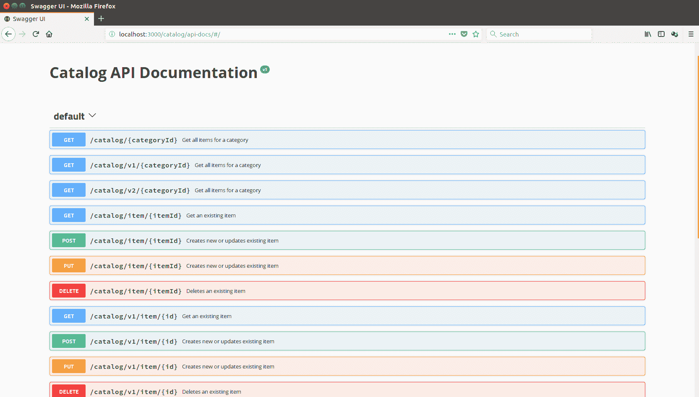

# 第十二章：REST – 你不知道的

在过去几年中，我们已经开始认为数据源为内容、移动设备服务源或云计算提供动力都是现代技术，如 RESTful Web 服务驱动的。每个人都谈论他们的无状态模型如何使应用程序易于扩展，以及它如何强调数据提供与数据消费之间的清晰解耦。如今，架构师们已经开始引入微服务概念，目的是通过将核心组件拆分为执行单一任务的小型独立部分来降低系统的复杂性。因此，企业级软件即将成为此类微服务的组合。这使得维护变得容易，并在需要引入新部分时允许更好的生命周期管理。不出所料，大多数微服务都是由 RESTful 框架提供的。这一事实可能会给人留下印象，认为 REST 是在上个十年中的某个时候发明的，但事实远非如此。实际上，REST 自上个世纪的最后十年起就已经存在了！

本章将带您了解 **表征状态转移** (**REST**) 的基础，并解释 REST 如何与 HTTP 协议相结合。您将探讨在将任何 HTTP 应用程序转换为 RESTful 服务启用应用程序时必须考虑的五个关键原则。您还将了解描述 RESTful 和基于经典 **简单对象访问协议** (**SOAP**) 的 Web 服务之间的区别。最后，您将学习如何利用现有的基础设施来造福自己。

在本章中，我们将涵盖以下主题：

+   REST 基础知识

+   使用 HTTP 的 REST

+   与经典 SOAP 基于服务相比，在描述、发现和文档化 RESTful 服务方面的基本差异

+   利用现有基础设施

# REST 基础知识

这实际上发生在 1999 年，当时通过 RFC 2616 向 **互联网工程任务组 (IETF;** [`www.ietf.org/`](http://www.ietf.org/)) 提交了一个评论请求：*超文本传输协议-HTTP/1.1*。其作者之一，罗伊·菲尔德，后来定义了一套围绕 HTTP 和 URI 标准的原则。这诞生了我们今天所知道的 REST。

这些定义在菲尔德的论文《网络软件架构的设计与架构风格》的第五章，*表征状态转移 (REST)* 中给出，该论文的标题为 *Architectural Styles and the Design of Network-Based Software Architectures*。这篇论文仍然可在 [`www.ics.uci.edu/~fielding/pubs/dissertation/rest_arch_style.htm`](http://www.ics.uci.edu/~fielding/pubs/dissertation/rest_arch_style.htm) 上找到。

让我们看看围绕 HTTP 和 URI 标准的关键原则，坚持这些原则将使您的 HTTP 应用程序成为一个支持 RESTful 服务的应用程序：

1.  一切都是资源

1.  每个资源都有一个**唯一的标识符**（**URI**）

1.  资源通过标准 HTTP 方法进行操作

1.  资源可以有多个表示形式

1.  以无状态的方式与资源进行通信

# 原则 1 – 一切都是资源

要理解这个原则，必须设想通过特定的格式来表示数据，而不是通过包含大量字节的物理文件。互联网上可用的每一份数据都有一个描述它的格式，称为内容类型；例如，JPEG 图像、MPEG 视频、HTML、XML、文本文档和二进制数据都是具有以下内容类型的资源：image/jpeg、video/mpeg、text/html、text/xml 和 application/octet-stream。

# 原则 2 – 每个资源都有一个唯一的标识符

由于互联网包含如此多的不同资源，它们都应该可以通过 URI 访问，并且应该具有唯一的标识。此外，尽管它们的消费者更有可能是软件程序而不是普通人类，但这些 URI 可以以人类可读的格式存在。

人类可读的 URI 使数据自我描述，并简化了对其的进一步开发。这有助于您将程序中的逻辑错误风险降到最低。

这里有一些此类 URI 的示例，它们在目录应用程序中表示不同的资源：

+   [`www.mycatalog.com/categories/watches`](http://www.mycatalog.com/categories/watches)

+   [`www.mycatalog.com/categories/watches?collection=2018`](http://www.mycatalog.com/categories/watches?collection=2018)

+   [`www.mycatalog.com/categories/watches/model-xyz/image`](http://www.mycatalog.com/categories/watches/model-xyz/image)

+   [`www.mycatalog.com/categories/watches/model-xyz/video`](http://www.mycatalog.com/categories/watches/model-xyz/video)

+   [`www.mycatalog.com/archives/2017/categories/watches.zip`](http://www.mycatalog.com/archives/2017/categories/watches.zip)

这些人类可读的 URI 以直接的方式揭示了不同类型的资源。在先前的示例 URI 中，数据是目录中的项目，这些项目被归类为手表。第一个链接显示了该类别的所有项目。第二个链接只显示 2018 系列中的项目。接下来是一个指向项目图片的链接，然后是一个指向示例视频的链接。最后一个链接指向一个包含前一个系列项目的 ZIP 存档的资源。每个 URI 提供的媒体类型很容易识别，假设项目的数据格式是 JSON 或 XML，因此我们可以轻松地将自描述 URL 的媒体类型映射到以下之一：

+   描述项目的 JSON 或 XML 文档

+   图片

+   视频

+   二进制存档文档

# 原则 3 – 通过标准 HTTP 方法操作资源

本地 HTTP 协议（RFC 2616）定义了八个动作，也称为 HTTP 动词：

+   `GET`

+   `POST`

+   `PUT`

+   `DELETE`

+   `HEAD`

+   `OPTIONS`

+   `TRACE`

+   `CONNECT`

其中的前四个在资源上下文中感觉自然，尤其是在定义数据操作的动作时。让我们将它们与相对 SQL 数据库进行比较，在 SQL 数据库中，数据操作的原生语言是 **CRUD**（代表 **Create, Read, Update, and Delete**），分别源自不同的 SQL 语句类型，`INSERT`，`SELECT`，`UPDATE` 和 `DELETE`。同样，如果您正确应用 REST 原则，HTTP 动词应按以下方式使用：

| **HTTP 动词** | **动作** | **HTTP 响应状态码** |
| --- | --- | --- |
| `GET` | 获取现有资源。 | `200 OK` 如果资源存在，`404 Not Found` 如果不存在，以及 `500 Internal Server Error` 对于其他错误。 |
| `PUT` | 更新资源。如果资源不存在，服务器可以决定使用提供的标识符创建它，或者返回适当的状态码。 | `200 OK` 如果成功更新，`201 Created` 如果创建了新资源，`404 Not found` 如果要更新的资源不存在，以及 `500 Internal Server Error` 对于其他意外错误。 |
| `POST` | 在服务器端生成标识符或使用客户端提供的现有标识符创建资源，或更新资源。如果此动词仅用于创建而不用于更新，则返回适当的状态码。 | `201 CREATED` 如果创建了新资源，`200 OK` 如果资源已成功更新，`409 Conflict` 如果资源已存在且不允许更新，`404 Not Found` 如果要更新的资源不存在，以及 `500 Internal Server Error` 对于其他错误。 |
| `DELETE` | 删除资源。 | `200 OK` 或 `204 No Content` 如果资源已成功删除，`404 Not Found` 如果要删除的资源不存在，以及 `500 Internal Server Error` 对于其他错误。 |

注意，资源可能通过 `POST` 或 `PUT` HTTP 动词创建，这取决于应用程序的策略。然而，如果资源必须在客户端提供的特定 URI 下创建，并且提供标识符，那么 `PUT` 是适当的操作：

```js
PUT /categories/watches/model-abc HTTP/1.1
Content-Type: text/xml
Host: www.mycatalog.com

<?xml version="1.0" encoding="utf-8"?>
<Item category="watch">
    <Brand>...</Brand>
    </Price></Price>
</Item>

HTTP/1.1 201 Created 
Content-Type: text/xml 
Location: http://www.mycatalog.com/categories/watches/model-abc

```

然而，在您的应用程序中，您可能希望将决定新创建资源暴露位置的任务留给后端 RESTful 服务，因此在新适当但未知或不存在的位置下创建它。

例如，在我们的示例中，我们可能希望服务器定义新创建项的标识符。在这种情况下，只需向 URL 发送 `POST` 动词，而不提供标识符参数。然后，服务本身负责提供新资源的唯一有效标识符，并通过响应的 `Location` 标头公开此 URL：

```js
POST /categories/watches HTTP/1.1
Content-Type: text/xml
Host: www.mycatalog.com

<?xml version="1.0" encoding="utf-8"?>
<Item category="watch">
    <Brand>...</Brand>
    </Price></Price>
</Item>

HTTP/1.1 201 Created 
Content-Type: text/xml 
Location: http://www.mycatalog.com/categories/watches/model-abc
```

# 原则 4 – 资源可以有多个表示

资源的一个关键特性是它可能以不同于存储格式的格式表示。因此，它可以以不同的表示形式请求或创建。只要指定的格式得到支持，启用 REST 的端点应该使用它。在先前的示例中，我们发布了一个手表项目的 XML 表示，但如果服务器支持 JSON 格式，以下请求也是有效的：

```js
POST /categories/watches HTTP/1.1
Content-Type: application/json
Host: www.mycatalog.com

{
  "watch": {
    "id": ""watch-abc"",
    "brand": "...",
    "price": {
      "-currency": "EUR",
      "#text": "100"
    }
  }
}
HTTP/1.1 201 Created
Content-Type: application/json
Location: http://mycatalog.com/categories/watches/watch-abc   
```

# 原则 5 – 以无状态方式与资源通信

通过 HTTP 请求进行的资源操作应始终被视为原子操作。对资源的所有修改都应在 HTTP 请求中独立进行。请求执行后，资源将处于最终状态；这隐含地意味着不支持部分资源更新。你应该始终发送资源的完整状态。

回到我们的目录示例，更新某个项目的价格字段意味着发送一个包含整个数据（JSON 或 XML 格式）的完整文档的 PUT 请求，其中包括更新的价格字段。仅发送更新的价格不是无状态的，因为它意味着应用程序知道资源有一个价格字段，即它知道其状态。

你的 RESTful 应用程序要实现无状态，另一个要求是在服务部署到生产环境后，传入的请求很可能由负载均衡器提供服务，确保可扩展性和高可用性。一旦通过负载均衡器暴露，保持应用程序状态在服务器端的想法就会受到损害。这并不意味着你不允许保持应用程序的状态。这仅仅意味着你应该以 RESTful 的方式保持它。例如，将部分状态保留在 URI 中，或使用 HTTP 头提供额外的状态相关数据。

你的 RESTful API 的无状态特性将调用者与服务器端的变更隔离开来。因此，调用者不需要在连续的请求中使用相同的服务器。这允许在服务器基础设施中轻松应用变更，例如添加或删除节点。

记住，保持你的 RESTful API 无状态是你的责任，因为 API 的消费者期望它们是无状态的。

现在你已经知道 REST 大约有 18 年的历史了，一个合理的问题可能是，“为什么它最近才变得如此流行？”好吧，我们作为开发者通常拒绝简单直接的方法，并且大多数时候，我们更喜欢花更多的时间将已经复杂的解决方案变得更加复杂和精致。

以经典的 SOAP Web 服务为例。它们的 WS-*规范如此之多，有时定义得如此宽松，以至于为了使不同供应商的不同解决方案互操作，已经引入了一个单独的规范，即 WS-Basic Profile。它定义了额外的互操作性规则，以确保基于 SOAP 的 Web 服务中的所有 WS-*规范可以协同工作。

当涉及到通过 HTTP 使用经典 Web 服务传输二进制数据时，事情变得更加复杂，因为基于 SOAP 的 Web 服务提供了不同的二进制数据传输方式。每种方式都在其他规范集中定义，例如**带有附件引用的 SOAP**（**SwaRef**）和**消息传输优化机制（MTOM**）。所有这些复杂性主要是由于最初的想法是将业务逻辑远程执行，而不是传输大量数据。

现实世界已经向我们表明，在数据传输方面，事情不应该那么复杂。这就是 REST 在整体画面中发挥作用的地方——通过引入资源的概念和操作它们的标准方法。

# REST 目标

现在我们已经涵盖了主要的 REST 原则，是时候深入了解遵循它们时可以取得什么成果了：

+   表示形式与资源的分离

+   可见性

+   可靠性

+   可扩展性

+   性能

# 表示形式与资源的分离

资源只是一组信息，根据第 4 条原则，它可以有多种表示形式；然而，其状态是原子的。指定所需的媒体类型是调用者的责任，在 HTTP 请求中使用`Accept`头，然后服务器应用程序相应地处理表示形式，返回资源的适当内容类型以及相关的 HTTP 状态码：

+   成功时返回`HTTP 200 OK`

+   如果给出不支持格式或任何其他无效请求信息，则返回`HTTP 400 Bad Request`

+   如果请求不支持的媒体类型，则返回`HTTP 406 Not Acceptable`

+   在请求处理过程中发生意外情况时，返回`HTTP 500 Internal Server Error`

假设我们在服务器端以 XML 格式存储项目资源。我们可以有一个 API，允许消费者以各种格式请求项目资源，例如`application/xml`、`application/json`、`application/zip`、`application/octet-stream`等。

API 本身将负责加载请求的资源，将其转换为请求的类型（例如，JSON 或 XML），然后使用 ZIP 进行压缩或直接将其刷新到 HTTP 响应输出。

调用者将使用`Accept` HTTP 头指定他们期望的媒体类型。因此，如果我们想以前面章节中插入的项目数据请求 XML 格式，应执行以下请求：

```js
GET /category/watches/watch-abc HTTP/1.1 
Host: my-computer-hostname 
Accept: text/xml 

HTTP/1.1 200 OK 
Content-Type: text/xml 
<?xml version="1.0" encoding="utf-8"?>
<Item category="watch">
    <Brand>...</Brand>
    </Price></Price>
</Item>
```

要以 JSON 格式请求相同的项，需要将 `Accept` 标头设置为 `application/json`：

```js
GET /categoery/watches/watch-abc HTTP/1.1 
Host: my-computer-hostname 
Accept: application/json 

HTTP/1.1 200 OK 
Content-Type: application/json 
{
  "watch": {
    "id": ""watch-abc"",
    "brand": "...",
    "price": {
      "-currency": "EUR",
      "#text": "100"
    }
  }
}
```

# 可见性

REST 被设计成可见和简单。服务的可见性意味着它的各个方面都应该具有自描述性，并遵循原则 3、4 和 5 的自然 HTTP 语言。

在外部世界的上下文中，可见性意味着监控应用程序只会对 REST 服务和调用者之间的 HTTP 通信感兴趣。由于请求和响应是无状态的且是原子的，不需要更多的信息来流应用程序的行为以及了解是否出现了错误。

记住，缓存会降低你的 RESTful 应用程序的可见性，通常应该避免，除非需要为大量调用者提供资源。在这种情况下，缓存可能是一个选项，但需要在仔细评估提供过时数据可能产生的后果后才能考虑。

# 可靠性

在讨论可靠性之前，我们需要定义在 REST 上下文中哪些 HTTP 方法是安全的，哪些是幂等的。因此，让我们首先定义什么是安全方法和幂等方法：

+   一个 HTTP 方法被认为是安全的，如果请求时它不会修改或对资源的任何状态产生任何副作用

+   一个 HTTP 方法被认为是幂等的，如果它的响应在请求次数无论多少的情况下都保持不变，幂等请求在重复时总是返回相同的请求。

下表列出了哪些 HTTP 方法是安全的，哪些是幂等的：

| **HTTP 方法** | **安全** | **幂等** |
| --- | --- | --- |
| `GET` | 是 | 是 |
| `POST` | 否 | 否 |
| `PUT` | 否 | 是 |
| `DELETE` | 否 | 是 |

消费者应该考虑操作的安全性以及幂等特性，以确保可靠的服务。

# 可扩展性和性能

到目前为止，我们强调了在 RESTful 网络应用程序中拥有无状态行为的重要性。万维网（**WWW**）是一个巨大的宇宙，包含大量数据和众多用户，他们渴望获取这些数据。万维网的演变带来了应用程序应该容易扩展以适应其负载增加的要求。具有状态的扩展应用程序很难实现，尤其是在期望零或接近零的运营中断时间的情况下。

这就是为什么保持无状态对于任何需要扩展的应用程序来说至关重要。在最佳情况下，扩展你的应用程序可能需要你为负载均衡器添加另一块硬件，或者在云环境中添加另一个实例。不同的节点之间不需要同步，因为它们根本不需要关心状态。可扩展性完全是关于在可接受的时间内为所有客户端提供服务。其主要思想是保持应用程序运行，并防止由大量传入请求引起的 **拒绝服务**（**DoS**）。

可扩展性不应与应用程序的性能混淆。性能是通过处理单个请求所需的时间来衡量的，而不是应用程序可以处理的请求数量。Node.js 的异步非阻塞架构和事件驱动设计使其成为实现可扩展且性能良好的应用程序的合理选择。

# 与 WADL 一起工作

如果您熟悉 SOAP 网络服务，您可能听说过 **Web 服务定义语言** (**WSDL**)。它是对服务接口的 XML 描述，并定义了一个调用端点的 URL。对于 SOAP 网络服务来说，有一个这样的 WSDL 定义是强制性的。

与 SOAP 网络服务类似，RESTful 服务也可以使用一种称为 WADL 的描述语言。**WADL** 代表 **Web 应用定义语言**。与用于 SOAP 网络服务的 WSDL 不同，RESTful 服务的 WADL 描述是可选的，也就是说，使用服务与其描述无关。

这里是 WADL 文件的一个示例部分，描述了我们的目录服务的 `GET` 操作：

```js
<?xml version="1.0" encoding="UTF-8"?>
<application xmlns="http://wadl.dev.java.net/2009/02" xmlns:service="http://localhost:8080/catalog/" xmlns:xsd="http://www.w3.org/2001/XMLSchema">
  <grammer>
    <include href="items.xsd" />
    <include href="error.xsd" />
  </grammer>
  <resources base="http://localhost:8080/catalog/categories">
    <resource path="{category}">
      <method name="GET">
        <request>
          <param name="category" type="xsd:string" style="template" />
        </request>
        <response status="200">
          <representation mediaType="application/xml" element="service:item" />
          <representation mediaType="application/json" />
        </response>
        <response status="404">
          <representation mediaType="application/xml" element="service:item" />
        </response>
      </method>
    </resource>
  </resources>
</application>
```

这段 WADL 文件的摘录展示了如何描述暴露资源的应用程序。简而言之，每个资源都必须是应用程序的一部分。资源通过 `base` 属性提供其位置，并在方法中描述其支持的每个 HTTP 方法。此外，可以在资源和应用程序中使用可选的 `doc` 元素，以提供关于服务和其操作的额外文档。

尽管 WADL 是可选的，但它显著减少了发现 RESTful 服务的努力。

# 使用 Swagger 记录 RESTful API

在网络上公开的公共 API 应该有良好的文档，否则开发人员很难在他们的应用程序中使用它们。虽然 WADL 定义可能被认为是文档的来源，但它们解决了一个不同的问题——服务的发现。它们为机器提供服务的元数据，而不是为人类。Swagger 项目 ([`swagger.io/`](https://swagger.io/)) 解决了 RESTful API 清晰文档的需求。它定义了一个 API 的元描述，几乎以人类可读的 JSON 格式。以下是一个示例 `swagger.json` 文件，部分描述了目录服务：

```js
{
  "swagger": "2.0",
  "info": {
    "title": "Catalog API Documentation",
    "version": "v1"
  },
  "paths": {
    "/categories/{id}" : {
      "get": {
        "operationId": "getCategoryV1",
        "summary": "Get a specific category ",
        "produces": [
          "application/json"
        ],
        "responses": {
          "200": {
            "description": "200 OK",
            "examples": 
              {"application/json": {                
                "id": 1,
                "name": "Watches",
                "itemsCount": 550
                }                
              } 
          },
          "404": {"description" : "404 Not Found"},
          "500": {"description": "500 Internal Server Error"}
        }
      }
    }
  },
  "consumes": ["application/json"]
}
```

`swagger.json` 文件非常简单：它定义了您的 API 的名称和版本，并为每个公开的操作提供了简短的描述，并与示例有效负载很好地结合在一起。但从中获得的真正好处来自于 Swagger 的另一个子项目，称为 `swagger-ui` ([`swagger.io/swagger-ui/`](https://swagger.io/swagger-ui/))，它实际上将 `swagger.json` 中的数据优雅地渲染成交互式网页，不仅提供文档，还允许与服务交互：



我们将查看并利用`swagger-ui` Node.js 模块来提供本书后面将开发的 API，并带有最新的文档。

# 充分利用现有基础设施

开发和分发 RESTful 应用程序的最好部分是所需的基础设施已经存在，可供您使用。由于 RESTful 应用程序大量使用现有网络空间，您在开发时只需遵循 REST 原则即可。此外，任何平台都有大量的库可供选择，我确实是指任何平台。这简化了 RESTful 应用程序的开发，因此您只需选择您偏好的平台并开始开发。

# 摘要

在本章中，您了解了 REST 的基础，通过查看将 Web 应用程序转变为 REST 启用应用程序的五个关键原则。我们简要比较了 RESTful 服务和经典 SOAP Web 服务，并最终探讨了 RESTful 服务的文档方式以及我们如何简化开发的服务发现。

现在您已经了解了基础知识，我们准备深入探讨 Node.js 实现 RESTful 服务的方式。在下一章中，您将学习 Node.js 的必要要素以及构建真实生活完整 Web 服务时必须使用和理解的配套工具。
