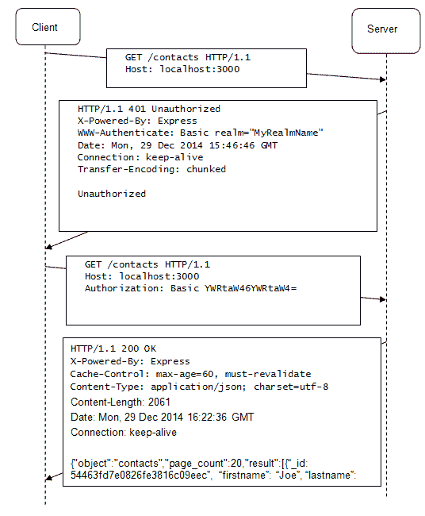
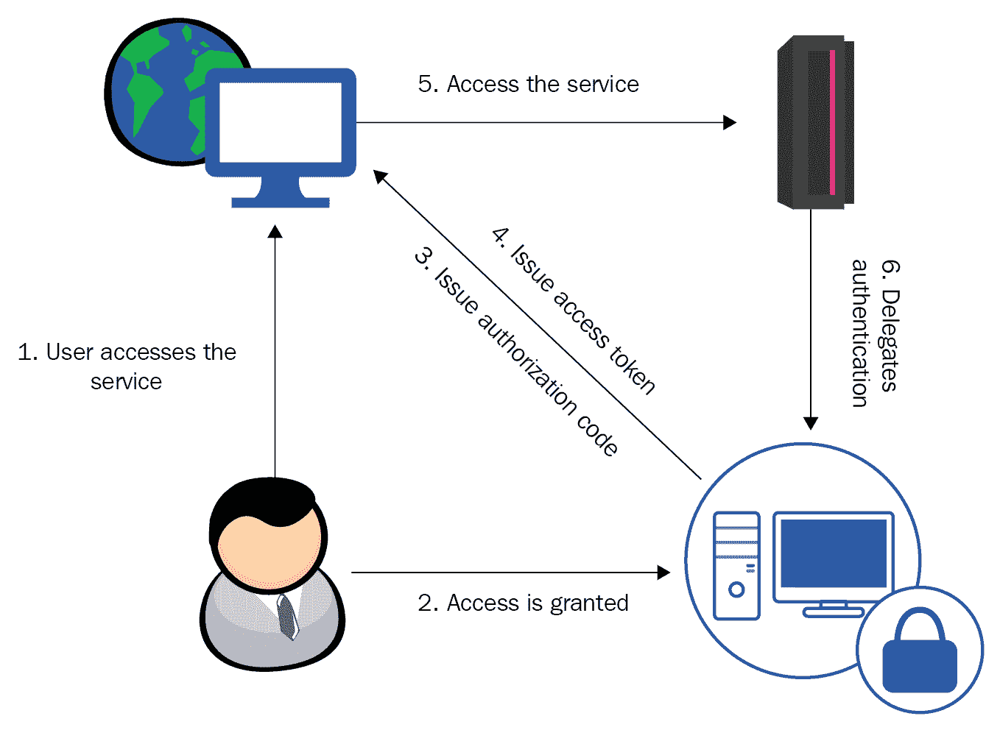
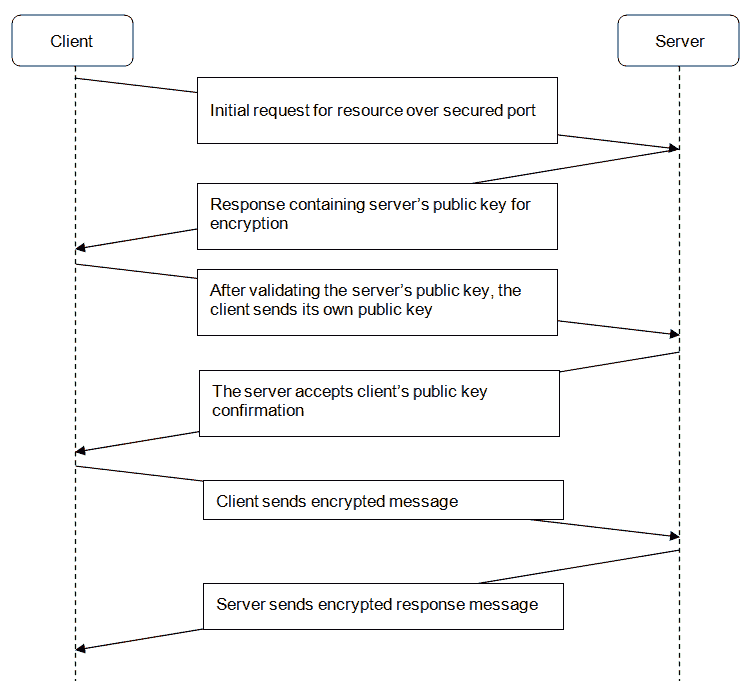

# 第十八章：保护应用安全

一旦在生产环境中部署，应用就会暴露给大量的请求。不可避免地，其中一些将是恶意的。这带来了仅授予认证用户明确访问权限的需求，也就是说，认证一定数量的消费者以访问你的服务。大多数消费者将只使用服务进行数据提供。然而，少数消费者需要能够提供新的或修改现有的目录数据。为了确保只有适当的消费者能够执行`POST`、`PUT`和`DELETE`请求，我们必须在我们的应用中引入授权的概念，这将仅授予明确选定的用户修改权限。

数据服务可能提供敏感的私人信息，例如电子邮件地址；HTTP 协议作为一个文本协议，可能不够安全。通过它传输的信息可能受到**中间人攻击**，这可能导致数据泄露。为了防止这种情况，应该使用**传输层安全（TLS**）。HTTPS 协议加密传输的数据，确保只有拥有正确解密密钥的适当消费者才能消费服务公开的数据。

在本章中，我们将探讨 Node.js 如何启用以下安全功能：

+   基本身份验证

+   基于护照的基本身份验证

+   基于护照的第三方认证

+   授权

+   传输层安全

# 认证

当一个应用认为用户的身份在经过一个受信任的存储成功验证后，就认为用户已经认证。这些受信任的存储可以是任何类型的特别维护的数据库，存储着应用的凭据（基本身份验证），或者是一个第三方服务，该服务会检查给定的身份是否与其自己的受信任存储相匹配（第三方认证）。

# 基本身份验证

HTTP 基本身份验证是现有最流行和最直接的认证机制之一。它依赖于请求中的 HTTP 头，这些头提供了用户的凭据。服务器可以选择回复一个头，强制客户端进行认证。以下图显示了在执行基本身份验证时的客户端-服务器交互：



每当向由 HTTP 基本身份验证保护的目标发送 HTTP 请求时，服务器会回复一个 HTTP `401 未授权`状态码，并且可选地，还会回复一个`WWW-Authenticate`头。这个头会强制客户端发送另一个请求，包含`Authorization`头，指定认证方法是`basic`。这个请求后面跟着一个 base64 编码的键/值对，提供用于认证的用户名和密码。可选地，服务器可以指定一个带有`realm`属性的消息给客户端。

此属性指定具有相同 `realm` 值的资源应支持相同的认证方式。在前面的图中，`realm` 消息是 `MyRealmName`。客户端通过发送包含值 `Basic YWRtaW46YWRtaW4` 的 `Authentication` 标头来进行认证，指定使用 `Basic` 认证，后跟 base64 编码的值。在图中，base64 解码的 `YWRtaW46YWRtaW4` 文本表示 `admin:admin` 文本。如果此类用户名/密码组合成功认证，HTTP 服务器将以请求项的 JSON 有效负载响应。如果认证失败，服务器将以 `401 Unauthorized` 状态码响应，但这次不包含 `WWW-Authenticate` 标头。

# Passport

现在有很多认证方法可供选择。可能最受欢迎的方法是基本认证，其中每个用户都有自己的用户名和密码，以及第三方认证，用户可以使用他们已经存在的账户来识别自己，例如个人社交服务如 LinkedIn、Facebook 和 Twitter。

选择最适合 Web API 的认证类型主要取决于其消费者。显然，一个消费 API 以获取数据的程序不太可能使用个人社交账户进行认证。这种方法更适合 API 通过前端直接由人类使用的情况。

实现一种能够轻松在不同的认证方法之间切换的解决方案是一个复杂且耗时的工作。实际上，如果不考虑应用程序的初始设计阶段，这可能几乎是不可能的。

**Passport** 是一个针对 Node.js 的认证中间件，专门为那些需要轻松在一种认证方式之间切换的场景而创建。它具有模块化架构，使得可以使用特定的认证提供者，称为 **strategy**。策略负责实现所选的认证方法。

现在有很多认证策略可供选择，例如，常规的基本认证策略或基于社交平台的策略，如 Facebook、LinkedIn 和 Twitter。有关可用策略的完整列表，请参考官方 Passport 网站，[`www.passportjs.org/`](http://www.passportjs.org/)。

# Passport 的基本认证策略

现在是时候看看如何利用 Passport 的策略了；我们将从基本的认证策略开始；既然我们已经知道了基本认证是如何工作的，这是一个逻辑上的选择。

如同往常，我们将使用 NPM 包管理器安装相关的模块。我们需要 `passport` 模块，它提供了基础功能，允许你插入不同的认证策略，以及由 `passport-http` 模块提供的具体的基本认证策略：

```js
  npm install passport
  npm install passport-http
```

接下来，我们必须实例化 Passport 中间件和基本认证策略。`BasicStrategy`将一个回调函数作为参数，该函数检查提供的用户名/密码组合是否有效。最后，Passport 的 authenticate 方法作为中间件函数提供给 express 路由，确保未经认证的请求会被拒绝，并返回适当的`401 未授权`状态：

```js
const passport = require('passport');
const BasicStrategy = require('passport-http').BasicStrategy;

passport.use(new BasicStrategy(function(username, password, done) {
  if (username == 'user' && password=='default') {
    return done(null, username);
  }
}));

router.get('/v1/', 
  passport.authenticate('basic', { session: false }), 
     function(request,    response, next) {
       catalogV1.findAllItems(response);
});
router.get('/v2/', 
  passport.authenticate('basic', { session: false }), 
     function(request,    response, next) {
       catalogV1.findAllItems(response);
});

router.get('/', 
  passport.authenticate('basic', { session: false }), 
     function(request,    response, next) {
       catalogV1.findAllItems(response);
});
```

`BasicStrategy`构造函数接受一个处理函数作为参数。它为我们提供了访问客户端提供的用户名和密码，以及 Passport 中间件的`done()`函数，该函数通知 Passport 用户是否已成功认证。通过将`user`作为参数调用`done()`函数来授予认证，或者通过传递`error`参数来撤销认证：

```js
passport.use(new BasicStrategy(
function(username, password, done) {
  AuthUser.findOne({username: username, password: password}, 
    function(error, user) {
      if (error) {
        return done(error);
      } else {
        if (!user) {
          console.log('unknown user');
          return done(error);
        } else {
          console.log(user.username + ' 
          authenticated successfully');
          return done(null, user);
        }
      }
    });  
  })
); 
```

最后，在路由中间件中使用`passort` `authenticate()`函数将其附加到特定的 HTTP 方法处理器函数。

在我们的情况下，我们指定我们不想在会话中存储任何认证细节。这是因为，当使用基本认证时，没有必要在会话中存储任何用户信息，因为每个请求都包含提供登录详情的`Authorization`头。

# Passport 的 OAuth 策略

OAuth 是一个第三方授权的开放标准，它定义了一个用于授权第三方认证提供者的委托协议。OAuth 使用特殊的令牌，一旦颁发，就代替用户凭据来识别用户。让我们更详细地看看 OAuth 工作流程，以及一个示例场景。场景中的主要参与者是一个**用户**，他与**Web 应用程序**交互，该应用程序从提供某种数据的**后端**系统中消费 RESTful 服务。Web 应用程序将它的授权委托给一个单独的**第三方授权服务器**。



1.  用户请求一个需要认证的 Web 应用程序，以与后端服务建立通信。这是初始请求，因此用户尚未认证，所以他们会被重定向到登录页面，要求他们提供相关第三方账户的凭据。

1.  在成功认证后，认证服务器向 Web 应用程序颁发一个授权码。这个授权码是颁发给客户端的客户端 ID 和提供者颁发的秘密的组合。它们应该从 Web 应用程序发送到认证服务器，并交换为有限生命周期的访问令牌。

1.  网络应用程序使用认证令牌进行认证，直到其过期。之后，它必须使用授权码请求一个新的令牌。

Passport.js 通过一个单独的策略模块隐藏了此过程的复杂性，该模块自动化 OAuth 工作流程。它在`npm`仓库中可用。

```js
npm install passport-oauth
```

创建策略的实例，并为其提供请求令牌和进行身份验证的 URL，以及它个人的消费者密钥和您选择的秘密短语。

```js
var passport = require('passport')
  , OAuthStrategy = require('passport-oauth').OAuthStrategy;

passport.use('provider', new OAuthStrategy({
    requestTokenURL: 'https://www.provider.com/oauth/request_token',
    accessTokenURL: 'https://www.provider.com/oauth/access_token',
    userAuthorizationURL: 'https://www.provider.com/oauth/authorize',
    consumerKey: '123-456-789',
    consumerSecret: 'secret'
    callbackURL: 'https://www.example.com/auth/provider/callback'
  }, function(token, tokenSecret, profile, done) {  
    //lookup the profile and authenticate   and call done
  }
));
```

Passport.js 提供了针对不同提供者的独立策略包装，例如领英或 GitHub。它们确保您的应用程序与令牌发行 URL 保持最新。一旦您决定了想要支持的提供者，您应该检查它们的具体策略。

# Passport 的第三方身份验证策略

今天，几乎每个人都至少拥有一个个人公开的社交媒体账户，例如 Twitter、Facebook 和领英。最近，网站允许他们的访客通过点击图标来通过他们的社交账户进行身份验证，从而将他们的社交服务账户绑定到服务内部自动生成的账户，这已经成为一种非常流行的做法。

这种方法对于通常永久登录至少一个账户的 Web 用户来说非常方便。如果他们当前未登录，点击图标将把他们重定向到他们的社交服务登录页面，并在成功登录后发生另一次重定向，确保用户获得他们最初请求的内容。当涉及到通过 Web API 暴露数据时，这种方法并不是一个真正的选择。

公开暴露的 API 无法预测它们将被人类还是应用程序消费。此外，API 通常不会直接由人类消费。因此，当您作为 API 作者确信公开的数据将直接可供通过前端从互联网浏览器手动请求它的最终用户时，第三方身份验证是唯一的选择。一旦他们成功登录到他们的社交账户，一个唯一的用户标识符将被存储在会话中，因此您的服务需要能够适当地处理此类会话。

要启用 Passport 和 Express 的会话支持以存储用户登录信息，您必须在初始化 Passport 和其会话中间件之前初始化 Express 会话中间件：

```js
app.use(express.session()); 
app.use(passport.initialize()); 
app.use(passport.session()); 
```

然后，指定 Passport 应将用户详细信息序列化/反序列化到或从会话中的用户。为此，Passport 提供了 `serializeUser()` 和 `deserializeUser()` 函数，它们将完整用户信息存储在会话中：

```js
passport.serializeUser(function(user, done) { done(null, user); }); passport.deserializeUser(function(obj, done) { done(null, obj); });
```

初始化 Express 和 Passport 中间件的会话处理顺序很重要。Express 会话应首先传递给应用程序，然后是 Passport 会话。

在启用会话支持后，您必须决定依赖哪种第三方身份验证策略。基本上，第三方身份验证是通过第三方提供者创建的插件或应用程序启用的，例如社交服务网站。我们将简要了解创建一个允许通过 OAuth 标准进行身份验证的领英应用程序。

通常，这是通过一对与社交媒体应用程序关联的公钥和密钥（令牌）来完成的。创建 LinkedIn 应用程序很简单——您只需登录到[`www.linkedin.com/secure/developer`](http://www.linkedin.com/secure/developer)并填写简短的应用信息表单。您将获得一个密钥和一个令牌以启用身份验证。执行以下步骤以启用 LinkedIn 身份验证：

1.  安装`linkedin-strategy`模块—`npm install linkedin-strategy`

1.  在启用会话支持后，通过`use()`函数获取 LinkedIn 策略的实例并将其初始化为 Passport 中间件：

```js
      var passport = require('passport')
        , LinkedInStrategy = require('passport-
        linkedin').Strategy;

        app.use(express.session());
        app.use(passport.initialize());
        app.use(passport.session());

      passport.serializeUser(function(user, done) {
        done(null, user);
      });

      passport.deserializeUser(function(obj, done) {
        done(null, obj);
      });

        passport.use(new LinkedInStragety({
          consumerKey: 'api-key',
          consumerSecret: 'secret-key',
          callbackURL: "http://localhost:3000/catalog/v2"
        },
          function(token, tokenSecret, profile, done) {
            process.nextTick(function () {
              return done(null, profile);
            });
          })
        ); 
```

1.  明确指定 LinkedIn 策略应作为每个单独路由的护照使用，确保会话处理已启用：

```js
      router.get('/v2/', 
        cache('minutes',1), 
        passport.authenticate('linked', { session: true}), 
        function(request, response) {
          //...
        }
      });
```

1.  提供一种方式，允许用户通过公开注销 URI 来注销，使用`request.logout`：

```js
      router.get('/logout', function(req, res){
      request.logout();
        response.redirect('/catalog');
      });

```

给定的第三方 URL 和服务数据可能会发生变化。在提供第三方身份验证时，您应始终参考服务策略。

# 授权

到目前为止，目录数据服务使用基本身份验证来保护其路由免受未知用户的影响；然而，目录应用程序应仅允许少数白名单用户修改目录中的条目。为了限制对目录的访问，我们将引入授权的概念，即一组经过身份验证的用户子集，允许他们拥有适当的权限。

当 Passport 的`done()`函数被调用以进行成功的登录认证时，它将作为参数接收一个已授权用户的`user`实例。`done()`函数将此用户模型实例添加到`request`对象中，并通过`request.user`属性提供对它的访问，在成功认证后。我们将利用该属性在成功认证后实现一个执行授权检查的函数：

```js
function authorize(user, response) {
  if ((user == null) || (user.role != 'Admin')) {
    response.writeHead(403, { 'Content-Type' : 
    'text/plain'});
    response.end('Forbidden');
    return;
  }
} 
```

HTTP 403 Forbidden 状态码很容易与 405 Not Allowed 混淆。然而，405 Not Allowed 状态码表示请求的资源不支持特定的 HTTP 动词，因此它应仅在该上下文中使用。

`authorize()`函数将关闭`response`流，返回`403 Forbidden`状态码，这表示已识别的登录用户权限不足。这会撤销对资源的访问。此函数必须在执行数据操作的每个路由中使用。

下面是一个`post`路由实现授权的示例：

```js
app.post('/v2', 
  passport.authenticate('basic', { session: false }), 
    function(request, response) {
      authorize(request.user, response);
      if (!response.closed) {
        catalogV2.saveItem(request, response);
      }
    }
); 
```

在调用`authorize()`之后，我们检查`response`对象是否仍然允许写入其输出，通过检查`response`对象的 closed 属性值。一旦调用`response`对象的 end 函数，它将返回`true`，这正是`authorize()`函数在用户缺乏管理员权限时所做的。因此，我们可以在我们的实现中依赖 closed 属性。

# 传输层安全

网上公开的信息很容易成为不同类型网络攻击的目标。通常，仅仅阻止所谓的“坏人”是不够的。有时，他们甚至懒得获取认证，可能更愿意执行**中间人攻击**（**MiM**），假装自己是消息的最终接收者，窃听传输数据的通信通道——或者更糟糕的是，在数据传输过程中篡改数据。

作为一种基于文本的协议，HTTP 以人类可读的格式传输数据，这使得它很容易成为 MiM 攻击的受害者。除非以加密格式传输，否则我们服务的所有目录数据都容易受到 MiM 攻击。在本节中，我们将从不安全的 HTTP 协议切换到安全的 HTTPS 协议。

HTTPS 由非对称加密技术保护，也称为**公钥加密**。它基于一对在数学上相关的密钥。用于加密的密钥称为**公钥**，用于解密的密钥称为**私钥**。其想法是向必须发送加密消息并使用私钥进行解密的合作伙伴自由提供加密密钥。

两个当事人，*A*和*B*之间典型的公钥加密通信场景如下：

1.  当事人*A*编写消息，使用当事人*B*的公钥对其进行加密，并发送。

1.  当事人*B*使用自己的私钥解密消息并处理它。

1.  当事人*B*编写响应消息，使用当事人*A*的公钥对其进行加密，然后发送。

1.  当事人*A*使用自己的私钥解密响应消息。

现在我们已经了解了公钥加密的工作原理，让我们通过这个图表中的 HTTPS 客户端-服务器通信示例来了解一个样本：



客户端向一个 SSL 加密的端点发送初始请求。服务器通过发送用于加密进一步传入请求的公钥来响应该请求。然后，客户端必须检查公钥的有效性并验证接收到的公钥的身份。在成功验证服务器的公钥后，客户端必须将其自己的公钥发送回服务器。最后，在密钥交换过程完成后，双方可以开始安全通信。

HTTPS 依赖于信任；因此，有一个可靠的方式来检查特定的公钥是否属于特定的服务器至关重要。公钥在 X.509 证书中进行交换，该证书具有分层结构。这种结构使客户端能够检查给定的证书是否由受信任的根证书生成。客户端应仅信任由已知**证书颁发机构**（**CA**）签发的证书。

在将我们的服务切换到使用 HTTPS 传输之前，我们需要一个公钥/私钥对。由于我们不是证书颁发机构，我们将不得不使用 OpenSSL 工具为我们生成测试密钥。

OpenSSL 可在 [`www.openssl.org/`](http://www.openssl.org/) 下载，那里提供了所有流行操作系统的源代码发行版。以下是如何安装 OpenSSL 的说明：

1.  二进制发行版可供下载，Windows 用户可以通过执行以下命令来使用打包的发行版：

```js
sudo apt-get install openssl
```

Windows 用户必须设置一个环境变量，OPENSSL_CNF，指定 `openssl.cnf` 配置文件的位置，通常位于安装存档中的共享目录中。

1.  现在让我们使用 OpenSSL 生成一个测试的键/值对：

```js
opensslreq -x509 -nodes -days 365 -newkey rsa:2048-keyoutcatalog.pem -out catalog.crt
```

OpenSSL 将提示生成证书所需的一些详细信息，例如国家代码、城市和完全合格的域名。之后，它将在 `catalog.pem` 文件中生成一个私钥，并在 `catalog.crt` 文件中生成一个有效期为一年的公钥证书。我们将使用这些新生成的文件，所以将它们复制到目录 `ssl` 中，该目录位于目录数据服务目录下。

现在我们已经拥有了修改我们的服务以使用 HTTPS 所需的一切：

1.  首先，我们需要切换并使用 HTTPS 模块而不是 HTTP，并指定我们想要用于启用 HTTPS 通信的端口：

```js
var https = require('https');
var app = express();
app.set('port', process.env.PORT || 3443); 
```

1.  然后，我们必须从 `catalog.cem` 文件中读取私钥，并从 `catalog.crt` 文件中读取证书到数组中：

```js
var options = {key : fs.readFileSync('./ssl/catalog.pem'),
                cert : fs.readFileSync('./ssl/catalog.crt')
}; 
```

1.  最后，我们在创建服务器时将包含密钥对的数组传递给 HTTPS 实例，并通过指定的端口开始监听：

```js
https.createServer(options, app).listen(app.get('port'));
```

要为基于 Express 的应用程序启用 HTTPS，你需要做的就这些。保存你的更改，并在浏览器中请求 `https://localhost:3443/catalog/v2` 来尝试一下。你将看到一个警告信息，告知你你正在连接的服务器使用的证书不是由受信任的证书颁发机构签发的。这是正常的，因为我们自己生成了证书，我们肯定不是 CA，所以只需忽略那个警告。

在将服务部署到生产环境之前，你应该始终确保你使用的是受信任的 CA 签发的服务器证书。

# 自测问题

以下是一些问题：

+   HTTP 基本认证能否抵御中间人攻击？

+   传输层安全协议的好处是什么？

# 摘要

在本章中，你学习了如何通过启用身份验证和授权手段来保护暴露的数据。这是任何公开数据服务的关键方面。此外，你还学习了如何通过在服务和其用户之间使用安全层传输协议来防止中间人攻击。作为此类服务的开发者，你应该始终考虑应用程序应支持的最合适的安全功能。

我希望这是一个有用的经历！你们获得了足够的知识和实践经验，这应该使你们在理解 RESTful API 的工作原理以及它们是如何设计和开发的方面更加自信。我强烈建议你们逐章阅读代码演变部分。你们应该能够进一步重构它，使其适应自己的编码风格。当然，其中一些部分可以进一步优化，因为它们重复出现的频率相当高。这是一个有意的决定，而不是良好的实践，因为我想要强调它们的重要性。你们应该始终努力改进代码库，使其更容易维护。

最后，我想鼓励你们始终关注你们在应用程序中使用到的 `Node.js` 模块的发展。Node.js 拥有一个渴望快速成长的非凡社区。那里总是有令人兴奋的事情发生，所以请确保不要错过。祝你好运！
