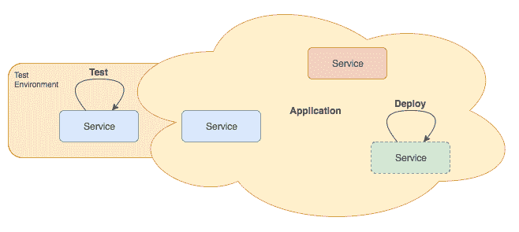

# 第十九章：微服务时代

数十年前，具体来说是在 1974 年，英特尔向世界推出了 8080，这是一款 2 兆赫时钟速度和 64KB 内存的 8 位处理器。这款处理器被用于 Altair，并开始了个人计算机的革命。

它可以预先组装出售，也可以作为爱好者的套件出售。这是第一台真正有足够力量用于计算的计算机。尽管它有一些设计上的缺陷，并且需要工程专业的知识才能使用和编程，但它开始了个人计算机向公众普及的传播。

技术迅速发展，处理器行业遵循摩尔定律，几乎每两年速度翻一番。处理器仍然是单核，效率比（每时钟周期的功耗）较低。因此，服务器通常只做一项特定的工作，称为服务，例如提供 HTTP 页面或管理**轻量级目录访问协议**（**LDAP**）目录。服务是单体，组件非常少，全部编译在一起以充分利用硬件处理器和内存。

在 90 年代，互联网仍然只为少数人可用。基于 HTML 和 HTTP 的超文本还处于婴儿期。文档很简单，浏览器根据需要开发语言和协议。在 Internet Explorer 和 Netscape 之间，市场份额的竞争非常激烈。后者引入了 JavaScript，微软将其作为 JScript 复制：

简单的单核服务器

进入新世纪后，处理器速度继续提高，内存增长到宽敞的尺寸，32 位对于分配内存地址来说已经不足。全新的 64 位架构出现，个人计算机处理器达到 100 瓦的功耗。服务器变得更加强壮，能够处理不同的服务。开发者仍然避免将服务拆分成部分。进程间通信被认为速度慢，服务保持在单个进程的线程中。

互联网开始变得广泛可用。电信公司开始提供三合一服务，包括互联网捆绑电视和电话服务。手机成为革命的一部分，智能手机时代开始了。

JSON 作为 JavaScript 语言的一个子集出现，尽管它被认为是一种与语言无关的数据格式。一些网络服务开始支持这种格式。

以下是一个运行了几个服务但仍然只有一个处理器的服务器的示例。

强大但单核的服务器

处理器的发展随后发生了转变。不再是我们所习惯的速度增加，处理器开始出现双核，然后是四核。随后是八核，似乎计算机的发展将遵循这条路径一段时间。

这也意味着在开发范式中的架构转变。依赖系统利用所有处理器是不明智的。服务开始利用这种新的布局，现在常见的是每个服务至少有一个处理器。只需看看任何网络服务器或代理，如 Apache 或 Nginx。

互联网现在广泛可用。移动访问互联网及其信息大约占所有互联网访问的一半左右。

2012 年，**互联网工程任务组**（**IETF**）开始为其第二个版本 HTTP 或 HTTP/2 的第一份草案，**万维网联盟**（**W3C**）也做了同样的事情，因为这两个标准都很旧，需要重做。幸运的是，浏览器同意合并新功能和规范，开发者不再需要在不同的浏览器边缘情况上开发和测试他们的想法。

以下是一个示例，展示了随着每个服务器拥有超过一个处理器，服务数量增加的情况：

强大的多核服务器

实时获取信息的需求正在增长。**物联网**（**IoT**）增加了连接到互联网的设备数量。现在人们在家中有几台设备，数量还将持续增长。应用程序需要能够处理这种增长。

在互联网上，HTTP 是通信的标准协议。路由器通常不会阻止它，因为它被认为是一种低流量协议（与视频流相比）。实际上，现在并非如此，但它现在被广泛使用，改变这种行为可能会引起麻烦。

现在，使用 HTTP 服务开发 API 并与 JSON 一起工作实际上非常普遍，以至于大多数在 2015 年之后发布任何版本的编程语言可能都原生支持这种数据格式。

由于处理器的发展，以及我们现在拥有的数据需求驱动的互联网，不仅能够将服务或应用程序扩展到多个可用核心，而且还要能够扩展到单个硬件机器之外，这一点非常重要。

许多开发者开始使用并遵循**面向服务架构**（**SOA**）原则。这是一个将架构重点放在服务上的原则，每个服务将自己呈现为应用程序组件，并向其他应用程序组件提供信息，通过某些标准通信协议传递消息。

# 从单体到微服务

正如我们之前所描述的，微服务架构基于一组松散耦合的服务，这些服务共同工作以实现特定的目标应用程序。在光谱的另一端，有单体应用程序。

单体应用由一组紧密耦合的组件组成。这些组件通常使用相同的语言开发，并且整个应用作为一个整体运行。第一个明显的区别可能是启动速度慢。部署也可能很慢，因为你可能需要一些依赖项才能使应用正常运行。

让我们想象一个事件应用，一个简单的应用，一个允许用户定义事件并在事件即将开始时通知他们的应用。

一个单体事件应用

让我们描述一下事件应用的功能：

+   它允许用户注册自己并将事件添加到日历中

+   在事件开始前几分钟（这就是**调度器**组件的作用），用户会收到包含事件信息的电子邮件（这就是**SMTP**组件）。

+   用户可以使用前端界面或**API**接口

想象一下前面的应用作为一个单体（右边的灰色区域）。

想象一下这四个部分都是同一个过程的一部分，即使它们可以在不同的线程中。想象一下数据库是直接跨应用访问的。听起来不错？

嗯，听起来很糟糕，可能对于小型应用来说不是这样，但对于中型应用，这将是混乱的体现。有一组开发者制作新功能或改进将会是一场噩梦，而对于新加入的开发者来说，在能够进行一些更改之前需要一段时间来掌握基础知识。

你应该遵循的第一个原则是**不要重复自己**（**DRY**）原则。避免多个组件访问数据源有助于未来的开发者。稍后，如果需要更改数据源或其结构的一部分，如果只有一个组件操作它，将会更容易。这并不总是可能的，但如果可能的话，你应该将数据源访问限制在最小范围内。

在我们的例子中，API 可能应该有访问权限，而所有其他应用都应该使用 API。

单一服务访问数据源

现在我们有两个服务：

+   API，这是唯一访问数据源的服务

+   前端，这是用户更改数据源的界面

虽然前端用于管理事件，但它使用 API 服务来操作数据源。除了只有一个服务管理数据源外，它还迫使你为外部开发者考虑 API。这是一个双赢的局面。

仍然有改进的空间。**前端**可以作为一个独立的服务，这样你可以根据用户流量扩展界面，并将其他部分放在独立的服务上。**调度器**和**SMTP**都是作为独立服务的候选者。**SMTP**应该被视为一个可重用的服务，用于你以后可能开发的其他应用。

让我们看看我们如何使用微服务方法构建相同的应用程序：

一个微服务事件应用

它看起来更复杂。好吧，架构更复杂。区别在于现在，我们有松耦合的组件，并且每个组件都易于理解和维护。总结这些变化和优势：

+   **API** 是唯一访问数据库的组件，因此它可以从 SQLite、MongoDB、MySQL 或其他任何东西改变，而不会影响其他组件

+   **SMTP** 可以从 **前端** 和 **调度器** 使用，如果你决定从使用本地服务改为使用第三方电子邮件发送 **API**，你可以轻松地进行更改

+   **SMTP** 可以作为其他应用程序的可重用服务，这意味着你可以在其他应用程序中使用它，或者在不同应用程序之间共享相同的服务

你可以将这些组件视为你应用程序的能力。它们可以被交换、升级、维护和扩展，而不会影响其他组件或你的应用程序。

使用这种方法的一个常被低估的优势是，你的应用程序对失败的抵抗能力要强得多。在单体应用程序中，任何部分都可能使你的应用程序离线。在这种微服务方法中，这个应用程序可能不会发送电子邮件，但仍然可以运行和访问。加入缓存到混合中，API 可以在瞬间重新启动。

# 微服务模式

微服务架构，就像其他架构一样，有一套易于识别的模式，构成了这种应用程序开发方法的基础。

一些这些模式可能会使初始引导变得负担，并且最终可以推迟。其他模式从一开始就是必需的，否则你将在以后迁移到完整的微服务方法时遇到困难。

以下模式并不是一个详尽的列表，但它们代表了一个坚实的基础：

服务协同工作以形成应用程序的示例

# 可分解性

微服务架构背后的主要模式是拥有松耦合的服务的能力。这些服务被分解，分成更小的部分。这种分解应该创建一组实现一组强相关功能的服务的集合。

每个服务都应该小巧但完整，这意味着它应该在给定的上下文中运行一系列函数。这些函数应该代表你需要的所有函数或需要支持该上下文的函数。这意味着如果你有一个处理会议事件的服务，所有会议事件函数都应该使用该服务完成，无论是创建事件、更改、删除还是获取特定事件的详细信息。这确保了事件实现的更改只会影响该服务。

将应用程序分解可以采用两种主要方法：

+   通过能力，当一个服务具有特定的权力或一系列权力，例如发送电子邮件，无论其内容如何

+   通过子域，当一个服务拥有应用程序领域子域或模块的完整知识

在我们之前的事件应用中，通过能力分解的服务，例如，是 SMTP 服务。通过领域分解的服务可能是 API 服务，假设应用程序只管理事件：

服务的测试和部署自主进行的例子，而不是整个应用程序

# 自主

在微服务架构中，每个服务应该是自主的。一个小团队应该能够在没有其他服务的情况下运行它，这些服务构成了你的应用程序。该团队还应该能够自主开发并修改实现，而不会影响应用程序。

开发团队应该能够：

+   测试，创建业务逻辑和单元测试以确保服务功能按预期工作

+   部署，升级功能，在此过程中无需重启其他服务

服务应该能够在不影响其他服务的情况下独立演进，保持向后兼容性，添加新功能，并在多个位置进行扩展，对架构的更改最小：

一个具有每个服务两个实例的应用程序示例，使其具有容错能力

# 可扩展

服务应该是可扩展的。至少应该能够并行运行两个实例，以实现容错和减少维护停机时间。服务还可以在以后地理上扩展，靠近客户，提高性能和应用程序响应速度。

为了使这种扩展有效，应用程序平台将需要服务发现和路由，这是一种其他服务可以用来注册自己并公开其能力的服务。其他服务可以在以后查询这个服务目录，并了解如何到达这些能力。

为了减少其他服务的复杂性，服务路由器可以将请求重定向到服务实例。例如，为了发送电子邮件，你可以有三个实例和一个中央路由器，它会以轮询方式重定向请求。如果其中任何一个实例离线，路由器将停止将其重定向，其余的应用程序也不需要关心它。

另一种方法可能是使用 DNS 方法。名称服务能够处理对子域的注册，然后，当另一个服务进行简单请求时，它将收到一个或所有地址，并将其连接，就像只有一个服务在运行一样：

应用程序服务之间通信的一个例子

# 可通信

通常，服务通过 HTTP 使用 REST 兼容的 API 进行通信。这不是你必须遵循的模式，但这是基于当今 HTTP 的普遍性自然而然产生的，使其成为显而易见的选择。

现在有很多 HTTP 服务器，这使得以最小的努力公开非 HTTP 服务变得容易。

HTTP 也是一个成熟的通信传输层。它是一个无状态的协议，为开发者和运营人员提供了许多功能，例如：

+   缓存常用且经常更新的资源

+   代理和路由请求

+   使用 TLS 加密通信

具有多个服务和通信流的复杂应用程序

# 概述

总结来说，微服务架构是一个良好、清晰的模式，有助于处理更复杂的项目。从长远来看，它通过吸引服务重用来降低与新产品相关的复杂性。它有助于将应用程序结构化为松散耦合的服务，这些服务可以由小型、不同的团队独立开发和测试。这需要初始的适当规划和更复杂的部署。

在创建您的第一个微服务之前，让我们先看看一些可能最终帮助您利用下一个大型项目的 Node.js 工具。这就是我们将在下一章中要涵盖的内容。
