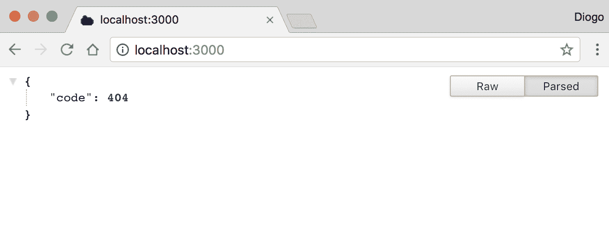
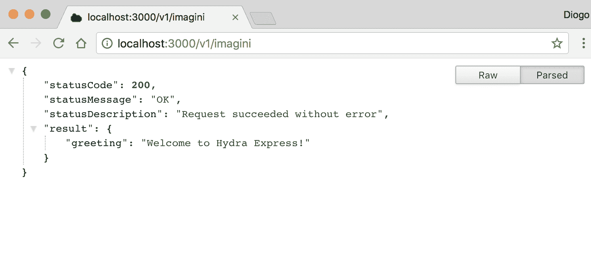
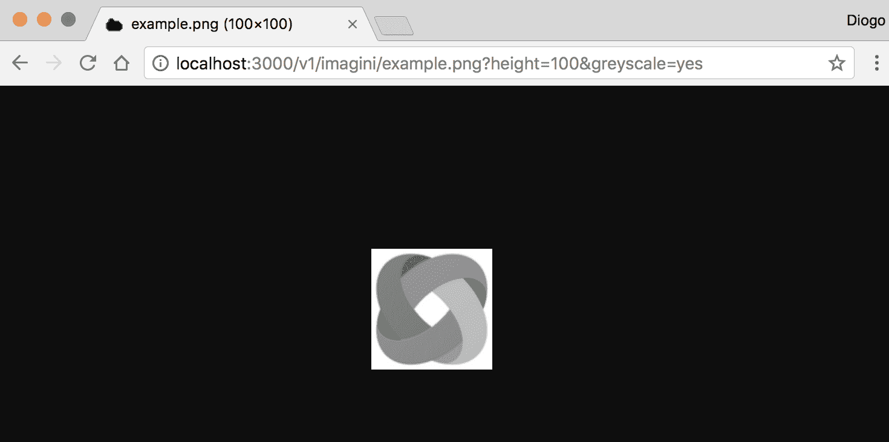
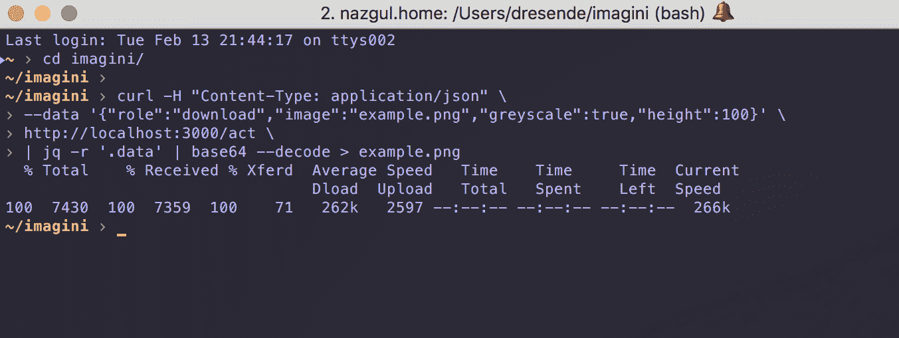
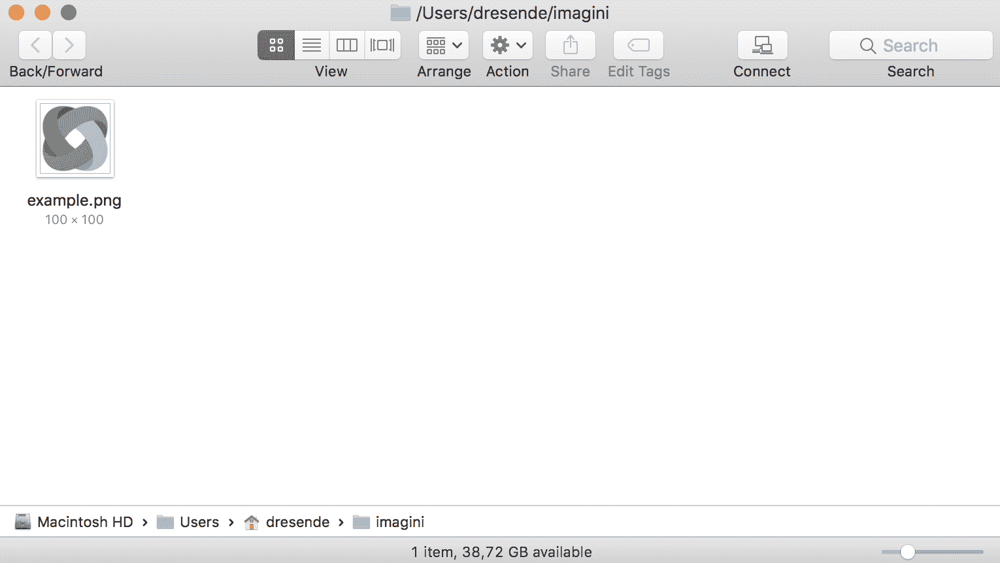

# 第二十一章：构建微服务

现在我们已经看到了使用一些工具构建微服务的示例，让我们更深入地挖掘，并使用这些工具从头开始创建一个微服务。为了实现我们的目标，我们首先将使用 Hydra，然后，我们将使用 Seneca 方法创建我们的微服务。

我们可以创建许多微服务，但其中一些比其他更有趣。更具体地说，一个可以在多个应用程序中使用的微服务显然更有用。

让我们创建一个图像处理微服务。我们将从一个简单的缩略图服务开始，然后我们将逐步发展到进行一些简单的图像转换。我们将涵盖如何：

+   使用外部模块来操作图像

+   在 Hydra 和 Seneca 中构建我们的微服务

微服务名称非常重要，因为它提供了身份。让我们将其命名为 *imagini*，这是图像的拉丁名称。

# 使用 Hydra

如您所记得，Hydra 有一个框架命令，可以帮助我们快速启动服务。让我们使用它，并准备我们的基本布局。运行 `yo fwsp-hydra` 并回答问题。您可以将大多数问题保留为默认值。根据您使用的版本，您应该得到类似以下行所示的内容：

```js
fwsp-hydra generator v0.3.1   yeoman-generator v2.0.2   yo v2.0.1
? Name of the service (`-service` will be appended automatically) imagini
? Your full name? Diogo Resende
? Your email address? dresende@thinkdigital.pt
? Your organization or username? (used to tag docker images) dresende
? Host the service runs on?
? Port the service runs on? 3000
? What does this service do? Image thumbnail and manipulation
? Does this service need auth? No
? Is this a hydra-express service? Yes
? Set up a view engine? No
? Set up logging? No
? Enable CORS on serverResponses? No
? Run npm install? No
   create imagini-service/specs/test.js
   create imagini-service/specs/helpers/chai.js
   create imagini-service/.editorconfig
   create imagini-service/.eslintrc
   create imagini-service/.gitattributes
   create imagini-service/.nvmrc
   create imagini-service/.gitignore
   create imagini-service/package.json
   create imagini-service/README.md
   create imagini-service/imagini-service.js
   create imagini-service/config/sample-config.json
   create imagini-service/config/config.json
   create imagini-service/scripts/docker.js
   create imagini-service/routes/imagini-v1-routes.js

Done!

'cd imagini-service' then 'npm install' and 'npm start'
```

好吧，让我们就这样做。让我们进入我们的服务文件夹并安装依赖项。如果您然后使用 `npm start` 启动它，并在浏览器中指向我们的服务，您应该会得到类似以下内容：



并不令人惊讶，因为 Hydra 创建了一个不同的基本路由。为了启用版本控制和让不同的服务在同一个 HTTP 后端上运行，Hydra 框架在 `/v1/imagini` 前缀下创建了一个路由。记住，我们使用 Express 集成构建了 Hydra，所以许多我们之前讨论过的术语在这里也将是相同的：



在我们将之前的代码选择并集成到 Hydra 之前，我们需要将我们的 Sharp 依赖项添加到 `package.json` 中。查找 `dependencies` 属性并添加 `sharp`。你应该得到类似以下内容：

```js
(…)
"dependencies": {
    "sharp"                : "⁰.19.0",
    "body-parser"          : "¹.18.2",
    "fwsp-config"          : "1.1.5",
    "hydra-express"        : "1.5.5",
    "fwsp-server-response" : "2.2.6"
},
(…)
```

现在，运行 `npm install` 来安装 Sharp。然后，打开位于 `routes` 文件夹下的 `imagini-v1-routes.js` 文件。基本上，它的作用是获取 Hydra 和 Express 的处理器，准备一个通用的 JSON 服务器响应（这就是 `fwsp-server-response` 模块的作用），创建一个 Express 路由器，附加 `/` 路由，然后导出它。

我们现在保持这个结构。由于我对缩进和引号有点挑剔，所以我重构了文件。我添加了我们的图像路由参数并添加了图像上传路由。我将我们之前的路由代码更改为删除 `/uploads` 路由前缀，并使用前面代码中看到的 `sendOk` 和 `sendError` 函数：

```js
/**
 * @name          imagini-v1-api
 * @description   This module packages the Imagini API.
 */
"use strict";

const fs             = require("fs");
const path           = require("path");
const sharp          = require("sharp");
const bodyparser     = require("body-parser");
const hydraExpress   = require("hydra-express");
const ServerResponse = require("fwsp-server-response");
const hydra          = hydraExpress.getHydra();
const express        = hydraExpress.getExpress();

let serverResponse = new ServerResponse();

express.response.sendError = function (err) {
    serverResponse.sendServerError(this, { result : { error : err }});
};

express.response.sendOk = function (result) {
    serverResponse.sendOk(this, { result });
};

let api = express.Router();

api.param("image", (req, res, next, image) => {
    if (!image.match(/\.(png|jpg)$/i)) {
        return res.sendError("invalid image type/extension");
    }

    req.image     = image;
    req.localpath = path.join(__dirname, "../uploads", req.image);

    return next();
});

api.post("/:image", bodyparser.raw({
    limit : "10mb",
    type  : "image/*"
}), (req, res) => {
    let fd  = fs.createWriteStream(req.localpath, {
        flags    : "w+",
        encoding : "binary"
    });

    fd.end(req.body);

    fd.on("close", () => {
        res.sendOk({ size: req.body.length });
    });
});

module.exports = api;
```

然后，我们重新启动我们的微服务，在 `imagini-service` 文件夹下创建 `uploads` 文件夹，并尝试上传一个图像。像之前一样，我使用了 `curl` 来测试它：

```js
curl -X POST -H 'Content-Type: image/png' \
 --data-binary @example.png \
 http://localhost:3000/v1/imagini/example.png
```

如预期的那样，我收到了一个包含我们的 `size` 属性的 JSON 响应：

```js
{
    "statusCode"        : 200,
    "statusMessage"     : "OK",
    "statusDescription" : "Request succeeded without error",
    "result" : {
        "size" : 55543
    }
}
```

我们可以将上传的文件放在我们的`uploads`文件夹中。我们正在接近目标；只需再添加两个路由：

```js
api.head("/:image", (req, res) => {
    fs.access(req.localpath, fs.constants.R_OK , (err) => {
        if (err) {
            return res.sendError("image not found");
        }

        return res.sendOk();
    });
});
```

我们的检查路由非常相似。我们只是将返回方法更改为使用之前定义的方法：

```js
api.get("/:image", (req, res) => {
    fs.access(req.localpath, fs.constants.R_OK , (err) => {
        if (err) {
            return res.sendError("image not found");
        }

        let image     = sharp(req.localpath);
        let width     = +req.query.width;
        let height    = +req.query.height;
        let blur      = +req.query.blur;
        let sharpen   = +req.query.sharpen;
        let greyscale = [ "y", "yes", "true", "1", 
        "on"].includes(req.query.greyscale);
        let flip      = [ "y", "yes", "true", "1", 
        "on"].includes(req.query.flip);
        let flop      = [ "y", "yes", "true", "1", 
        "on"].includes(req.query.flop);

        if (width > 0 && height > 0) {
            image.ignoreAspectRatio();
        }

        if (width > 0 || height > 0) {
            image.resize(width || null, height || null);
        }

        if (flip)        image.flip();
        if (flop)        image.flop();
        if (blur > 0)    image.blur(blur);
        if (sharpen > 0) image.sharpen(sharpen);
        if (greyscale)   image.greyscale();

        res.setHeader("Content-Type", "image/" + 
        path.extname(req.image).substr(1));

        image.pipe(res);
    });
});
```

我们的下载数据方法同样相似。对于这个路由，我们不使用 JSON 响应，而是直接返回我们的图像。这允许我们在浏览器中尝试它：



我们刚刚将我们的服务从 Express 迁移到 Hydra。变化不大，但 Hydra 提供了一个更健壮的布局，我们稍后会了解更多。让我们看看我们的第三个框架：Seneca。

# 使用 Seneca

记住，在这个框架上路由一切都是关于模式的。现在让我们保持简单，并使用一个角色属性来指示我们想要做什么（上传、检查或下载）。

默认情况下，每条消息都应该进行 JSON 编码，因此我们将图像编码为`base64`，然后在 JSON 消息中将其作为字符串传递以上传和下载。

为我们的 Seneca 服务创建一个文件夹，然后在该文件夹中创建一个名为`uploads`的子文件夹。然后，通过运行以下命令在该文件夹中安装`seneca`和`sharp`：

```js
npm install seneca sharp --save
```

然后，创建一个名为`imagini.js`的文件，内容如下：

```js
const seneca  = require("seneca");
const sharp   = require("sharp");
const path    = require("path");
const fs      = require("fs");
const service = seneca();

service.add("role:upload,image:*,data:*", function (msg, next) {
    let filename = path.join(__dirname, "uploads", msg.image);
    let data = Buffer.from(msg.data, "base64");

    fs.writeFile(filename, data, (err) => {
        if (err) return next(err);

        return next(null, { size : data.length });
    });
});

service.listen(3000);
```

这所做的就是启动一个简单的服务，有一个上传的路由。由于我们直接在对象属性上接收所有图像内容，我使用了`fs.writeFile`。这是一个更简单的方法，如果发生错误，它会给我一个错误，我们可以将其传递给路由响应。

我还使用了`Buffer.from`来转换我们的图像数据，这些数据将以`base64`格式上传。

所以，让我们就像对待其他服务一样启动它。我包含了相同的`example.png`图像，并使用`curl`进行测试。

```js
curl -H "Content-Type: application/json" \
--data '{"role":"upload","image":"example.png","data":"'"$( base64 example.png)"'"}' \
http://localhost:3000/act
```

Seneca 迅速回复如下：

```js
{"size":55543}
```

这是指图像的大小。请注意，我正在利用 bash 插值（变量替换）直接将图像文件转换为`base64`，然后传递给`curl`，然后`curl`将这个 JSON 数据块发送到我们的服务：

```js
service.add("role:check,image:*", function (msg, next) {
    let filename = path.join(__dirname, "uploads", msg.image);

    fs.access(filename, fs.constants.R_OK , (err) => {
        return next(null, { exists : !err });
    });
});
```

我们的检查路由非常相似。我们不是只回复 HTTP 404 响应代码，而是回复一个包含布尔属性`exists`的字符串化 JSON 对象，这将指示图像是否被找到。

这里，我们正在使用`curl`检查我们的图像：

```js
curl -H "Content-Type: application/json" \
    --data '{"role":"check","image":"example.png"}' \
    http://localhost:3000/act
```

我们将响应如下：

```js
{"exists":true}
```

如果你更改图像名称，它将响应`false`：

```js
service.add("role:download,image:*", function (msg, next) {
    let filename = path.join(__dirname, "uploads", msg.image);

    fs.access(filename, fs.constants.R_OK , (err) => {
        if (err) return next(err);

        let image     = sharp(filename);
        let width     = +msg.width;
        let height    = +msg.height;
        let blur      = +msg.blur;
        let sharpen   = +msg.sharpen;
        let greyscale = !!msg.greyscale;
        let flip      = !!msg.flip;
        let flop      = !!msg.flop;

        if (width > 0 && height > 0) {
            image.ignoreAspectRatio();
        }

        if (width > 0 || height > 0) {
            image.resize(width || null, height || null);
        }

        if (flip)        image.flip();
        if (flop)        image.flop();
        if (blur > 0)    image.blur(blur);
        if (sharpen > 0) image.sharpen(sharpen);
        if (greyscale)   image.greyscale();

        image.toBuffer().then((data) => {
            return next(null, { data: data.toString("base64") });
        });
    });
});
```

我们的下载数据路由有一些变化：

+   而不是查询参数，我们直接在`msg`上进行检查。一个明显的优势是我们有类型而不是只有字符串，因此我们可以直接使用布尔值和数字。

+   而不是以二进制形式返回图像，以便我们可以在浏览器中打开，我们将其转换为`base64`，并在 JSON 响应中传递。

我们需要一些工具在命令行上测试这个功能。由于我经常使用 JSON，我已经安装了`jq`。我强烈推荐你也安装它并查看教程，这将使你的生活更轻松。使用我们之前用来编码的`base64`命令，我们可以解码内容并将数据管道传输到本地文件：



然后，我们可以打开文件夹并看到图像已经存在。注意，我添加了`greyscale`和通过传递两个额外的 JSON 参数来调整图像大小：



# 插件

在塞涅卡的精神下，我们应该为我们的`imagini`服务创建一个插件。让我们将我们的代码分成两部分：

+   `imagini`插件，一个处理图像的服务

+   一个 Seneca 微服务，它公开了`imagini`插件，以及可能以后的其他插件

我们的代码有很多改进的空间，从我们不断重复的代码开始。当我们的服务仍然非常小的时候，检测重复是很重要的。

最常重复的部分是本地文件名。这实际上是在启动服务时你可能想要配置的东西，所以让我们将其改为一个函数。首先，将我们的`imagini.js`文件改为插件。清空所有内容并写入以下代码：

```js
const sharp   = require("sharp");
const path    = require("path");
const fs      = require("fs");

module.exports = function (settings = { path: "uploads" }) {
    // plugin code goes here
};
```

这是我们的插件的基础。我们正在加载所需的模块，但不加载 Seneca，因为我们的插件将直接访问服务。Seneca 本身将通过调用我们的导出函数来加载插件。遵循能够配置本地图像文件夹的想法，我们定义了一个可选的`settings`参数，它默认为一个具有`path`属性的对象，其值为`uploads`，这是我们迄今为止一直在使用的文件夹。

现在，让我们在先前的函数中添加插件的内容：

```js
const localpath = (image) => {
    return path.join(settings.path, image);
}
```

我们首先定义一个函数，将我们的图像参数转换为本地路径。实际上，我们可以将这个函数简化为单行代码：

```js
const localpath = (image) => (path.join(settings.path, image));
```

然后，让我们创建另一个函数来检查我们是否有权访问本地文件，并返回一个布尔值（如果存在或不存在）以及我们提供的文件名：

```js
const access = (filename, next) => {
    fs.access(filename, fs.constants.R_OK , (err) => {
        return next(!err, filename);
    });
};
```

我们可以用这个来检查图像，以及下载图像。这样，我们可以提高性能或甚至缓存结果，避免过多的文件系统访问。我们的图像检查路由现在可以非常简洁地编写：

```js
this.add("role:check,image:*", (msg, next) => {
    access(localpath(msg.image), (exists) => {
        return next(null, { exists : exists });
    });
});
```

注意，我们正在引用`this`对象。我们的 Seneca 服务将调用我们的插件函数，并将自身引用到`this`。我们还可以以更简洁的方式编写它：

```js
this.add("role:check,image:*", (msg, next) => {
    access(localpath(msg.image), (exists) => (next(null, { exists })));
});
```

我们的上传路由相当简单，没有变化：

```js
this.add("role:upload,image:*,data:*", (msg, next) => {
    let data = Buffer.from(msg.data, "base64");

    fs.writeFile(localpath(msg.image), data, (err) => {
        return next(err, { size : data.length });
    });
});
```

下载路由使用我们之前创建的辅助函数来避免存储我们的本地文件名。我们还对`width`和`height`的处理方式做了一些调整：

```js
this.add("role:download,image:*", (msg, next) => {
    access(localpath(msg.image), (exists, filename) => {
        if (!exists) return next(new Error("image not found"));

        let image     = sharp(filename);
        let width     = +msg.width || null;
        let height    = +msg.height || null;
        let blur      = +msg.blur;
        let sharpen   = +msg.sharpen;
        let greyscale = !!msg.greyscale;
        let flip      = !!msg.flip;
        let flop      = !!msg.flop;

        if (width && height) image.ignoreAspectRatio();
        if (width || height) image.resize(width, height);
        if (flip)            image.flip();
        if (flop)            image.flop();
        if (blur > 0)        image.blur(blur);
        if (sharpen > 0)     image.sharpen(sharpen);
        if (greyscale)       image.greyscale();

        image.toBuffer().then((data) => {
            return next(null, { data: data.toString("base64") });
        });
    });
});
```

实际上，我们使用了很多变量，我们只需检查消息参数即可。我们可以重写我们的下载函数并减少三分之一的代码：

```js
this.add("role:download,image:*", (msg, next) => {
    access(localpath(msg.image), (exists, filename) => {
        if (!exists) return next(new Error("image not found"));

        let image     = sharp(filename);
        let width     = +msg.width || null;
        let height    = +msg.height || null;

        if (width && height) image.ignoreAspectRatio();
        if (width || height) image.resize(width, height);
        if (msg.flip)        image.flip();
        if (msg.flop)        image.flop();
        if (msg.blur > 0)    image.blur(blur);
        if (msg.sharpen > 0) image.sharpen(sharpen);
        if (msg.greyscale)   image.greyscale();

        image.toBuffer().then((data) => {
            return next(null, { data: data.toString("base64") });
        });
    });
});
```

最后，你应该有一个包含以下内容的`imagini.js`文件：

```js
const sharp   = require("sharp");
const path    = require("path");
const fs      = require("fs");

module.exports = function (settings = { path: "uploads" }) {
    const localpath = (image) => (path.join(settings.path, image));
    const access    = (filename, next) => {
        fs.access(filename, fs.constants.R_OK , (err) => {
            return next(!err, filename);
        });
    };

    this.add("role:check,image:*", (msg, next) => {
        access(localpath(msg.image), (exists) => (next(null, { exists })));
    });

    this.add("role:upload,image:*,data:*", (msg, next) => {
        let data = Buffer.from(msg.data, "base64");

        fs.writeFile(localpath(msg.image), data, (err) => {
            return next(err, { size : data.length });
        });
    });

    this.add("role:download,image:*", (msg, next) => {
        access(localpath(msg.image), (exists, filename) => {
            if (!exists) return next(new Error("image not found"));

            let image     = sharp(filename);
            let width     = +msg.width || null;
            let height    = +msg.height || null;

            if (width && height) image.ignoreAspectRatio();
            if (width || height) image.resize(width, height);
            if (msg.flip)        image.flip();
            if (msg.flop)        image.flop();
            if (msg.blur > 0)    image.blur(blur);
            if (msg.sharpen > 0) image.sharpen(sharpen);
            if (msg.greyscale)   image.greyscale();

            image.toBuffer().then((data) => {
                return next(null, { data: data.toString("base64") });
            });
        });
    });
};
```

我们只需要创建我们的 Seneca 服务并使用我们的插件。这实际上非常简单。创建一个名为 `seneca.js` 的文件，并添加以下内容：

```js
const seneca  = require("seneca");
const service = seneca();

service.use("./imagini.js", { path: __dirname + "/uploads" });

service.listen(3000);
```

代码逐行执行的功能如下：

1.  加载 `seneca` 模块

1.  创建一个 Seneca `service`

1.  加载 `imagini.js` 插件并传递我们想要的路径

1.  在端口 `3000` 上启动 `service`

就这样，我们的服务现在已经成为了一个插件，可以被任何 Seneca 服务使用！你现在应该通过运行新文件而不是直接运行 `imagini.js` 来启动 `service`：

```js
node seneca
```

# 摘要

如你所见，编写服务在不同的框架之间变化不大。我们的代码非常相似，只有一些小的变化。Seneca 对消息格式和内容的要求更严格，所以我们使用 `base64` 对 JSON 消息中的图像进行编码。除此之外，一切照旧。

你可以自由选择关于服务的一切，但你需要编写大量的代码。为了方便这项任务，Hydra 可能是一个好的起点，用于一组初始插件。

对于其他工具，如 Seneca，微服务的某些方面（例如，使用 JSON 消息的通信和服务组合）已经打包。这需要以更严格的服务定义作为代价。

在下一章中，我们将讨论我们三个服务版本的安全性，以及我们如何存储状态。
