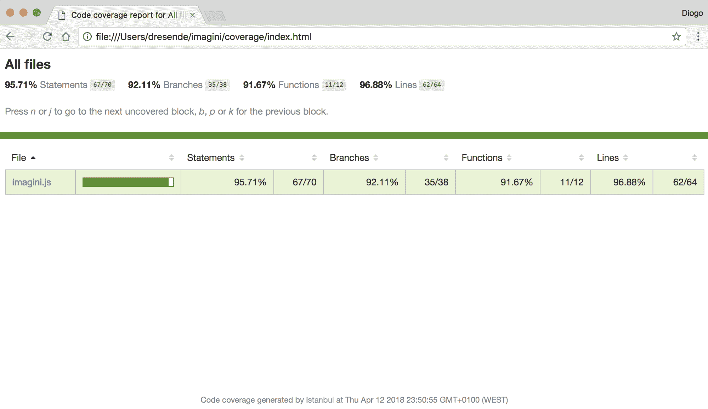

# 第二十三章：测试

当你在开发应用程序时，它最终会形成一个结构，并演变成为一个可以用于生产并出售给客户的稳定产品。一开始，一切可能看起来都很简单，许多人倾向于推迟构建合适的测试套件。

“调试是编写代码的两倍困难。”

*——布赖恩·W·克尼汉和 P. J.普劳格在《程序设计风格要素》一书中*

随着时间的推移，应用程序可能会变得足够复杂，以至于你犹豫是否开始测试。你可能会最终放弃，不再测试你的应用程序。这可能令人沮丧，尤其是如果你以前从未见过或使用过任何测试套件。

正确的测试不仅能提供一定程度的质量保证，还能提供：

+   **可预测性**：这意味着无论你的代码执行是应用程序还是只是一个模块，都将有一个预期的结果。随着你完善测试并引入不同的测试用例，你开始满足代码的所有用途，并确保其结果符合预期。

+   **功能覆盖率**：这意味着你可以衡量你的代码哪些部分被测试了，哪些没有。有许多工具可以检查你的代码并告诉你哪些部分在你的测试套件中没有使用，这有助于你为尚未覆盖的代码的特定部分创建特定的测试。

+   **安全演变**：这是一个副作用。当你的代码变得复杂时，如果你的测试套件有良好的代码覆盖率，你可以在不损害稳定性的情况下进行更改和添加功能，因为你可以持续运行测试套件并查看是否有任何东西被破坏。

正在发展中的方法包括首先为新的功能创建一个测试，然后确保测试通过。这样，你可以专注于你认为你的代码应该如何被使用（在新的测试中），然后逐步完善它（实际上开发它），以便测试不再失败并给出正确的结果。

让我们看看代码覆盖率如何在测试过程中发挥作用。最后，我们将探讨如何模拟代码的一部分。

# 集成测试

我们将创建我们的第一个集成测试。我们的每个测试都将单独运行，这意味着它们不应该依赖于任何其他测试，并且应该遵循可预测的工作流程。首先，我们需要更改`run.js`文件以运行所有测试文件。为此，我们将使用`mocha`并添加在`integration`文件夹中找到的所有文件：

```js
const fs    = require("fs");
const path  = require("path");
const mocha = require("mocha");
const suite = new mocha();

fs.readdir(path.join(__dirname, "integration"), (err, files) => {
    if (err) throw err;

    files.filter((filename) => 
    (filename.match(/\.js$/))).map((filename) => {
        suite.addFile(path.join(__dirname, "integration", filename));
    });

    suite.run((failures) => {
        process.exit(failures);
    });
});
```

然后，让我们在`test`文件夹内创建一个名为`integration`的文件夹，并创建我们的第一个测试文件，命名为`image-upload.js`。将以下内容添加到文件中：

```js
describe("Uploading image", () => {
    it("should accept only images");
});
```

如果我们现在再次运行测试，我们应该看到默认的`mocha`响应，没有测试通过，也没有测试失败：

```js
npm test
> imagini@1.0.0 test /Users/dresende/imagini
> node test/run

0 passing (2ms)
```

为了避免代码重复，让我们在`test`文件夹内创建一个`tools.js`文件，这样我们就可以导出每个测试文件都可以使用的常见任务。开箱即用，我想到的是我们的微服务位置和一个示例图像：

```js
const fs   = require("fs");
const path = require("path");

exports.service = require("../imagini.js");
exports.sample  = fs.readFileSync(path.join(__dirname, "sample.png"));
```

在`test`文件夹中创建一个`sample.png`图片。当测试需要上传图片时，它将使用这个样本。将来，我们可能会有不同类型的样本，例如大图片，以测试性能和限制。

# 使用 chai

我们还需要对我们的微服务做一些小的改动。我们需要导出它的应用，这样`chai`的 HTTP 插件就可以加载它，我们可以在不运行在单独的控制台的情况下对其进行测试。将以下内容添加到我们的微服务文件末尾：

```js
module.exports = app;
```

你应该有一个类似于以下截图的文件夹层次结构：


现在应该将我们的`image-upload.js`测试文件更改为创建我们的第一个真实测试：

```js
const chai  = require("chai");
const http  = require("chai-http");
const tools = require("../tools");

chai.use(http);

describe("Uploading image", () => {
    beforeEach((done) => {
        chai
        .request(tools.service)
        .delete("/uploads/test_image_upload.png")
        .end(() => {
            return done();
        });
    });

    it ("should accept a PNG image", function (done) {
        chai
        .request(tools.service)
        .post("/uploads/test_image_upload.png")
        .set("Content-Type", "image/png")
        .send(tools.sample)
        .end((err, res) => {
            chai.expect(res).to.have.status(200);
            chai.expect(res.body).to.have.status("ok");

            return done();
        });
    });
});
```

我们首先包括`chai`模块和我们的`tools`文件：

```js
const chai  = require("chai");
const http  = require("chai-http");
const tools = require("../tools");

chai.use(http);
```

然后，我们将我们的测试文件描述为`上传图片`：

```js
describe("Uploading image", () => {
```

我们将添加我们可以想到的不同用例，与图片上传相关。

在内部，我们使用`beforeEach`，这是一个`mocha`方法，将在文件中的每个测试之前被调用。记住，我们希望我们的测试是一致的，所以我们添加这个方法在运行每个测试之前删除我们的图片。我们不在乎图片是否存在：

```js
beforeEach((done) => {
    chai
    .request(tools.service)
    .delete("/uploads/test_image_upload.png")
    .end(() => {
        return done();
    });
});
```

看看我们如何使用`tools.service`，它指向我们的微服务。如果我们以后更改名称或使其更复杂，我们只需更改`tools`文件，一切都应该正常工作。

然后，我们添加我们的第一个`integration`文件测试——一个简单的图片上传：

```js
it("should accept a PNG image", (done) => {
    chai
    .request(tools.service)
    .post("/uploads/test_image_upload.png")
    .set("Content-Type", "image/png")
    .send(tools.sample)
    .end((err, res) => {
        chai.expect(res).to.have.status(200);
        chai.expect(res.body).to.have.status("ok");

        return done();
    });
});
```

它检查 HTTP 响应代码是否为`200`，以及响应体，这是一个 JSON 结构，其状态属性设置为`ok`。我们就完成了！

让我们再次运行我们的测试套件，看看效果如何。


# 覆盖所有代码

目前，让我们专注于为我们的代码添加覆盖率。当它仍然只是一个小型服务时，尽可能多地覆盖它很重要。如果我们开始添加测试和覆盖率，而它已经很大了，你会感到沮丧，而且很难找到覆盖所有内容的动力。

这样，你会发现一开始就覆盖它并尽可能保持覆盖率百分比很高是很有回报的，同时随着代码的演变。

让我们回到我们的图片上传测试，并添加另一个测试：

```js
it("should deny duplicated images", (done) => {
    chai
    .request(tools.service)
    .post("/uploads/test_image_upload.png")
    .set("Content-Type", "image/png")
    .send(tools.sample)
    .end((err, res) => {
        chai.expect(res).to.have.status(200);
        chai.expect(res.body).to.have.status("ok");

        chai
        .request(tools.service)
        .post("/uploads/test_image_upload.png")
        .set("Content-Type", "image/png")
        .send(tools.sample)
        .end((err, res) => {
            chai.expect(res).to.have.status(200);
            chai.expect(res.body).to.have.status("error");
            chai.expect(res.body).to.have.property("code", 
            "ER_DUP_ENTRY");

            return done();
        });
    });
});
```

这将连续上传同一张图片两次，我们应该从数据库收到一个错误，表示有重复。让我们再次运行测试：


现在，让我们打开覆盖率报告的初始页面：


注意到我们的文件不再在红色背景中。这意味着语句覆盖率达到了*50%*。让我们点击我们的文件，看看我们的图片上传方法是如何被覆盖的：


完成了！我们现在可以继续了。在我们转向另一种方法之前，提醒一下：完全覆盖并不意味着没有错误。这是你需要理解的事情。你可能有一个你未预料到的用例，因此没有为它编写代码，所以没有明显的覆盖率。

例如，`bodyparser`模块不会限制内容的类型。如果我们上传一个带有图像名称的文本文件，我们的代码将接受它并将其存储在数据库中而不会注意到。将这个用例视为你的作业，并尝试创建一个测试来覆盖这个用例，然后修复代码。

让我们转到我们在上传方法之后看到的下一个方法：第 67 行的图像检查。让我们创建一个新的集成测试文件，命名为`image-check.js`，并添加一个简单的测试：

```js
const chai = require("chai");
const http = require("chai-http");
const tools = require("../tools");

chai.use(http);

describe("Checking image", () => {
    beforeEach((done) => {
        chai
        .request(tools.service)
        .delete("/uploads/test_image_check.png")
        .end(() => {
            return done();
        });
    });

    it("should return 404 if it doesn't exist", (done) => {
        chai
        .request(tools.service)
        .head("/uploads/test_image_check.png")
        .end((err, res) => {
            chai.expect(res).to.have.status(404);

            return done();
        });
    });

    it("should return 200 if it exists", (done) => {
        chai
        .request(tools.service)
        .post("/uploads/test_image_check.png")
        .set("Content-Type", "image/png")
        .send(tools.sample)
        .end((err, res) => {
            chai.expect(res).to.have.status(200);
            chai.expect(res.body).to.have.status("ok");

            chai
            .request(tools.service)
            .head("/uploads/test_image_check.png")
            .end((err, res) => {
                chai.expect(res).to.have.status(200);

                return done();
            });
        });
    });
});
```

让我们运行测试套件：


我们可以看到我们的控制台报告正在变大。随着我们创建新的集成测试文件并为每个文件添加描述，`mocha`会写出一个漂亮的树视图，显示测试是如何运行的。在底部，我们可以看到覆盖率报告：


看着检查方法，我们看到它现在完全覆盖了。这个很简单。

我们仍然在语句覆盖的中间；图像操作的方法几乎占我们代码的一半。这意味着当我们开始覆盖它时，覆盖率将显著提高。

让我们为它创建一个`integration`测试：

```js
const chai = require("chai");
const http = require("chai-http");
const tools = require("../tools");

chai.use(http);

describe("Downloading image", () => {
    beforeEach((done) => {
        chai
        .request(tools.service)
        .delete("/uploads/test_image_download.png")
        .end(() => {
            chai
            .request(tools.service)
            .post("/uploads/test_image_download.png")
            .set("Content-Type", "image/png")
            .send(tools.sample)
            .end((err, res) => {
                chai.expect(res).to.have.status(200);
                chai.expect(res.body).to.have.status("ok");

                return done();
            });
        });
    });

    it("should return the original image size if no parameters given", 
    (done) => {
        chai
        .request(tools.service)
        .get("/uploads/test_image_download.png")
        .end((err, res) => {
            chai.expect(res).to.have.status(200);
            chai.expect(res.body).to.have.length(tools.sample.length);

            return done();
        });
    });
});
```

在每个测试之前，我们都会删除图像（如果存在）然后上传一个新的样本。然后，对于每个测试，我们将下载它并根据我们要求测试输出。

让我们尝试运行它：


嗯，这是出乎意料的。测试失败是因为我们的长度检查不匹配。这实际上是我们开始执行测试时刚刚注意到的一个很好的例子。

发生的情况是，当我们请求一个图像时，我们使用`sharp`模块根据查询参数对图像进行任何操作。在这种情况下，我们没有要求任何操作，但当我们通过`sharp`输出图像时，它实际上返回了相同大小的图像，但可能质量略低，或者它可能只是知道如何更好地编码我们的图像并从文件中删除不需要的数据。

我们不知道确切的原因，但假设我们想要原始图像，保持其未受修改的状态。我们需要更改我们的下载方法。假设如果没有定义任何查询参数，我们直接返回原始图像。让我们在我们的方法顶部添加一个条件：

```js
if (Object.keys(req.query).length === 0) {
    db.query("UPDATE images " +
             "SET date_used = UTC_TIMESTAMP " +
             "WHERE id = ?",
             [ req.image.id ]);

    res.setHeader("Content-Type", "image/" + 
    path.extname(req.image.name).substr(1));

    return res.end(req.image.data);
}
```

如果我们现在运行它，我们应该没有失败：


我们的语句覆盖率没有显著提高，因为我们实际上在方法顶部创建了一个条件并立即返回，所以我们的上一个方法仍然未经过测试：


查看 *第 78 行*，你应该看到一个新标记，一个`E`，表示该行中的条件从未执行过`else`语句，也就是我们代码的其余部分。让我们为这个集成添加一个测试并调整我们的图片大小。

我们将需要`sharp`来帮助我们检查结果是否正确。让我们将其包含在我们的文件顶部：

```js
const sharp = require("sharp");
```

然后，添加一个调整大小的测试：

```js
it("should be able to resize the image as we request", (done) => {
    chai
    .request(tools.service)
    .get("/uploads/test_image_download.png?width=200&height=100")
    .end((err, res) => {
        chai.expect(res).to.have.status(200);

        let image = sharp(res.body);

        image
        .metadata()
        .then((metadata) => {
            chai.expect(metadata).to.have.property("width", 200);
            chai.expect(metadata).to.have.property("height", 100);

            return done();
        });
    });
});
```

让我们运行我们的测试套件：


现在看起来非常好。从控制台报告中，我们可以看到一些绿色。让我们看看覆盖率报告的前页：


我们在这里也看到了绿色。超过 *80%* 的覆盖率是好的，但我们还可以更进一步。让我们看看文件：


大概已经覆盖了。我们仍然需要覆盖所有的影响。实际上，我们可以一次运行它们所有。前两个条件也有一个`E`标记，但在添加一个不调整大小的测试后应该会消失。让我们添加它：

```js
it("should be able to add image effects as we request", (done) => {
    chai
    .request(tools.service)
    .get("/uploads/test_image_download.png?
    flip=y&flop=y&greyscale=y&blur=10&sharpen=10")
    .end((err, res) => {
        chai.expect(res).to.have.status(200);

        return done();
    });
});
```

现在查看我们的报告，我们看到覆盖率几乎已经完成：


为了覆盖那些黄色的空值，我们需要仅使用`width`或`height`来调整图片大小。我们可以为这些情况添加两个测试：

```js
it("should be able to resize the image width as we request", (done) => {
    chai
    .request(tools.service)
    .get("/uploads/test_image_download.png?width=200")
    .end((err, res) => {
        chai.expect(res).to.have.status(200);

        let image = sharp(res.body);

        image
        .metadata()
        .then((metadata) => {
            chai.expect(metadata).to.have.property("width", 200);

            return done();
        });
    });
});
```

为`height`添加一个类似的测试，并运行测试套件。你不应该看到语句覆盖率上升，只有分支覆盖率：


唯一缺少的方法是统计方法。这个很简单。我们最终可以通过请求统计信息，进行如上传之类的更改，然后再次请求统计信息来比较来运行一个更具体的测试。我会把这个留给你。我们只需添加一个简单的请求测试：

```js
const chai = require("chai");
const http = require("chai-http");
const tools = require("../tools");

chai.use(http);

describe("Statistics", () => {
    it("should return an object with total, size, last_used and 
    uptime", (done) => {
        chai
        .request(tools.service)
        .get("/stats")
        .end((err, res) => {
            chai.expect(res).to.have.status(200);
            chai.expect(res.body).to.have.property("total");
            chai.expect(res.body).to.have.property("size");
            chai.expect(res.body).to.have.property("last_used");
            chai.expect(res.body).to.have.property("uptime");

            return done();
        });
    });
});
```

现在，运行我们的测试套件应该会显示所有绿色：


我们看到只有两行未被覆盖：`29.121`。第一行是我们的计时器，第二行是在统计方法上。让我们刷新我们的 HTML 报告：



这是有回报的；我们几乎有 *100%* 的覆盖率。只有一个函数没有被覆盖，那就是我们的计时器。而且，只有三个语句，它们也代表了三个分支，没有被覆盖，但这些实际上并不重要。

重要的是在整个开发过程中保持这个高覆盖率。

# 模拟我们的服务

在你的服务中，有些部分可能更难测试。其中一些，或者大多数，与错误相关的条件有关，在这些条件下，很难让外部服务，如数据库引擎返回在正常执行期间很少发生的错误。

为了能够测试，或者至少模拟这些类型的事件，我们需要模拟我们的服务。在这方面有几个选项，而在 Node.js 生态系统中，Sinon 是最常用的一个。这个框架提供了不仅仅是模拟的功能；它还提供了以下功能：

+   **间谍（Spies）**：记录哪些监控函数被调用以及传递的参数、返回值和其他属性

+   **存根（Stubs）**：是增强版的间谍，具有预编程的行为，帮助我们驱动执行进入预定的路径（允许我们模拟行为）

Sinon 还允许我们通过虚拟改变服务对时间的感知来弯曲时间，并能够测试定时器间隔调用（记得我们的间隔计时器吗？）。考虑到这一点，让我们看看我们能否使我们的微服务达到 *100%* 的测试覆盖率。

让我们先安装框架，就像我们之前对 `chai` 做的那样：

```js
npm install --save-dev sinon
```

现在，让我们添加一个针对图片删除的测试。这个方法通过其他测试进行了测试，这就是为什么我们之前不需要添加它，但现在我们想要完全测试它，让我们添加一个基本的测试文件 `image-delete.js`，内容如下：

```js
const chai = require("chai");
const sinon = require("sinon");
const http = require("chai-http");
const tools = require("../tools");

chai.use(http);

describe.only("Deleting image", () => {
    beforeEach((done) => {
        chai
        .request(tools.service)
        .delete("/uploads/test_image_delete.png")
        .end(() => {
            return done();
        });
    });

    it("should return 200 if it exists", (done) => {
        chai
        .request(tools.service)
        .post("/uploads/test_image_delete.png")
        .set("Content-Type", "image/png")
        .send(tools.sample)
        .end((err, res) => {
            chai.expect(res).to.have.status(200);
            chai.expect(res.body).to.have.status("ok");

            chai
            .request(tools.service)
            .delete("/uploads/test_image_delete.png")
            .end((err, res) => {
                chai.expect(res).to.have.status(200);

                return done();
            });
        });
    });
});
```

注意，我添加了 Sinon 依赖项在顶部，尽管我现在还没有使用它。你可以再次运行测试，但你不应该注意到任何区别。

我们需要更改数据库的行为，所以让我们导出一个对其的引用，以便在测试中访问它。在我们连接数据库之前，在我们的微服务文件中添加以下行：

```js
app.db = db;
```

现在，向该文件添加另一个测试：

```js
it("should return 500 if a database error happens", (done) => {
    chai
    .request(tools.service)
    .post("/uploads/test_image_delete.png")
    .set("Content-Type", "image/png")
    .send(tools.sample)
    .end((err, res) => {
        chai.expect(res).to.have.status(200);
        chai.expect(res.body).to.have.status("ok");

        let query = sinon.stub(tools.service.db, "query");

        query
        .withArgs("DELETE FROM images WHERE id = ?")
        .callsArgWithAsync(2, new Error("Fake"));

        query
        .callThrough();

        chai
        .request(tools.service)
        .delete("/uploads/test_image_delete.png")
        .end((err, res) => {
            chai.expect(res).to.have.status(500);

            query.restore();

            return done();
        });
    });
});
```

我们正在上传图片，但在请求删除之前，我们在 `db.query` 方法上创建了一个 `stub`。然后我们通知 Sinon，当 `stub` 被带有 `DELETE` 首个参数调用时，我们希望它异步调用第三个参数（计数从 0 开始）并返回一个假错误。对于任何其他调用，我们希望它直接通过。

然后，在删除图片之后，我们检查是否收到了 HTTP `500` 错误代码，并将 `stub` 恢复到原始功能，以确保其他测试通过。

我们能够测试这一点，因为 `mocha` 以串行方式运行测试；否则，我们需要做一些体操来确保我们不会干扰其他测试。

现在，打开之前创建的测试文件 `image-stats.js`，在顶部包含 Sinon，并添加以下测试：

```js
it("should return 500 if a database error happens", (done) => {
    let query = sinon.stub(tools.service.db, "query");

    query
    .withArgs("SELECT COUNT(*) total, SUM(size) size, MAX(date_used) 
    last_used FROM images")
    .callsArgWithAsync(1, new Error("Fake"));

    query
    .callThrough();

    chai
    .request(tools.service)
    .get("/stats")
    .end((err, res) => {
        chai.expect(res).to.have.status(500);

        query.restore();

        return done();
    });
});
```

我们现在覆盖率已经超过 97%。让我们弯曲时间并测试我们的计时器。创建一个名为 `image-delete-old.js` 的新测试文件，并添加以下内容：

```js
const chai = require("chai");
const sinon = require("sinon");
const http = require("chai-http");
const tools = require("../tools");

chai.use(http);

describe("Deleting older images", () => {
    let clock = sinon.useFakeTimers({ shouldAdvanceTime : true });

    it("should run every hour", (done) => {
        chai
        .request(tools.service)
        .get("/stats")
        .end((err, res) => {
            chai.expect(res).to.have.status(200);

            clock.tick(3600 * 1000);
            clock.restore();

            return done();
        });
    });
});
```

在这个测试中，我们用假定时器替换了全局定时器函数（`setTimeout` 和 `setInterval`）。然后我们进行了一次简单的统计调用，然后通过一个小时的时钟调用（tick call）推进时间，然后完成。

现在，运行测试并查看结果：


我们现在在函数和行上达到了 *100% 的覆盖率*。只有一个分支，缺少一个语句。这是连接错误的可能性：


我会留给你去想如何模拟它。

记住，如果你成功模拟了 `connect` 方法，你还需要处理抛出异常的情况。

# 摘要

测试使我们能够确保一定的代码质量水平。在代码简单时，从一开始就包含测试非常重要，以确保我们保持测试更新，避免回归到预期的行为。

当我们看到我们的代码具有非常高的测试覆盖率时，这感觉是非常有成就感的。这种感觉迫使你保持这个高分，并间接地维护了良好的代码质量。
