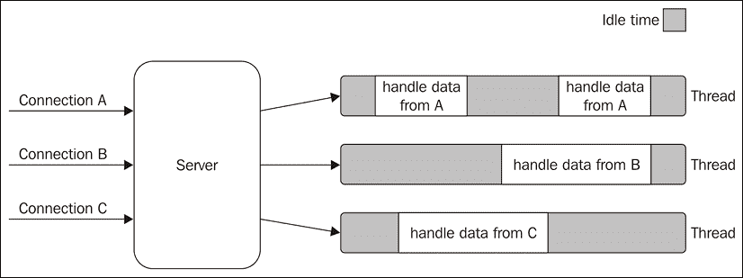
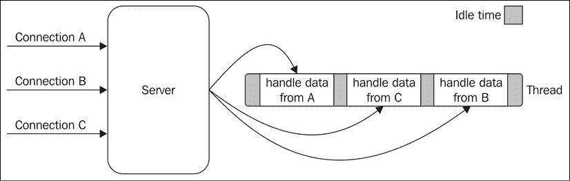
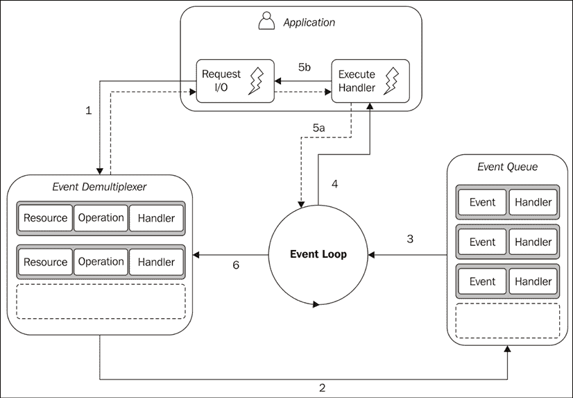
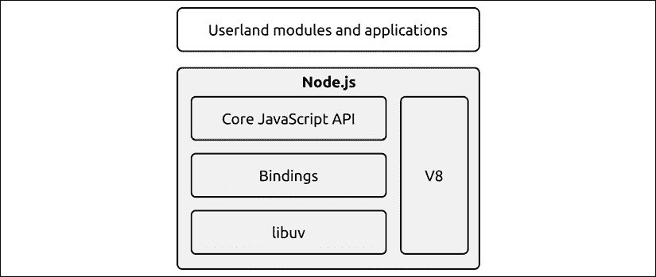

# 第一章：Node.js 平台

一些原则和设计模式实际上定义了开发者与 Node.js 平台及其生态系统的体验。其中最独特的一个可能是其异步性，它大量使用了异步构造，如回调和承诺。在本章介绍中，我们将探讨 Node.js 的异步行为从何而来。这不仅仅是了解的理论信息：了解 Node.js 在其核心是如何工作的，将为你理解我们将在本书后面章节中涵盖的更复杂主题和模式背后的推理提供一个坚实的基础。

另一个定义 Node.js 的重要方面是其哲学。实际上，接近 Node.js 远不止是学习一项新技术：它还意味着拥抱一种文化和社区。你将看到这一点如何极大地影响我们设计应用程序和组件的方式，以及它们与社区创建的组件的交互方式。

在本章中，你将了解以下内容：

+   Node.js 哲学或“Node 风格”

+   反应器模式——Node.js 异步事件驱动架构的核心机制

+   在服务器上运行 JavaScript 与在浏览器上运行 JavaScript 的区别

# Node.js 哲学

每个编程平台都有自己的哲学，一套被社区普遍接受的原则和指南，或者是一种做事的意识形态，它影响着平台的发展以及应用程序的开发和设计。其中一些原则源于技术本身，一些原则是由其生态系统所启用的，一些原则只是社区中的趋势，而其他原则则是从其他平台借鉴的意识形态的演变。在 Node.js 中，一些原则直接来自其创造者——Ryan Dahl，一些原则来自对核心做出贡献的人，或者来自社区中的魅力人物，最后，一些原则是从更大的 JavaScript 运动中继承而来的。

这些规则都不是强制的，并且它们应该始终以常识为基础应用；然而，当我们寻找设计软件时的灵感来源时，它们可以证明是非常有用的。

你可以在维基百科上找到关于软件开发哲学的详尽列表，请访问 [nodejsdp.link/dev-philosophies](http://nodejsdp.link/dev-philosophies)。

## 小型核心

Node.js 的核心——理解为 Node.js 运行时和内置模块——建立在几个原则之上。其中之一是拥有尽可能小的功能集，而将其他功能留给所谓的**用户空间**（或**userspace**），即存在于核心之外的模块生态系统。这一原则对 Node.js 文化产生了巨大影响，因为它赋予了社区在用户空间模块范围内快速实验和迭代的自由，而不是有一个缓慢发展的解决方案被构建在更严格控制和稳定的核心中。因此，将核心功能集保持到最基本，不仅便于维护，而且对整个生态系统的演变产生了积极的文化影响。

## 小型模块

Node.js 使用**模块**的概念作为构建程序代码的基本手段。它是创建应用程序和可重用库的基石。在 Node.js 中，最被推崇的原则之一是设计小型模块（和包），不仅从原始代码大小来看，更重要的是在范围上。

这一原则源于 Unix 哲学，尤其是在其两条戒律中，具体如下：

+   “小即是美。”

+   “让每个程序只做一件事，做好。”

Node.js 将这些概念提升到了全新的水平。借助其模块管理器——其中**npm**和**yarn**是最受欢迎的——Node.js 通过确保两个（或更多）依赖于同一包不同版本的包将使用它们自己的安装包，从而避免冲突，帮助解决*依赖地狱*问题。这一方面使得包可以依赖大量小型、专注的依赖项，而不会产生冲突的风险。虽然这在其他平台上可能被认为是不切实际的，甚至完全不可行，但在 Node.js 中，这种做法是常态。这使重用性达到了极端水平；实际上，有时我们可以找到只包含几行代码的单个模块的包——例如，用于匹配电子邮件的正则表达式[nodejsdp.link/email-regex](http://nodejsdp.link/email-regex)。

除了在可重用性方面的明显优势外，小型模块也是：

+   更易于理解和使用

+   更容易测试和维护

+   尺寸小，非常适合在浏览器中使用

拥有更小、更专注的模块使每个人都能共享或重用哪怕是最小的代码片段；这是在全新层面上应用的**不要重复自己**（**DRY**）原则。

## 表面积小

除了在大小和范围上较小之外，Node.js 模块的一个理想特性是向外界暴露最小的一组功能。这产生了一个更易于使用且不太可能被错误使用的 API。事实上，大多数时候，组件的用户只对非常有限和专注的一组功能感兴趣，而不需要扩展其功能或深入了解更高级的方面。

在 Node.js 中，定义模块的一个非常常见的模式是只暴露一个功能，比如一个函数或一个类，仅仅是因为它提供了一个单一、明确无误的入口点。

许多 Node.js 模块的另一个特点是它们被创建出来是为了使用，而不是扩展。通过禁止任何扩展的可能性来锁定模块的内部可能听起来不够灵活，但实际上它具有减少用例、简化实现、促进维护和提高可用性的优势。在实践中，这意味着更倾向于暴露函数而不是类，并且要小心不要向外界暴露任何内部内容。

## 简单性和务实性

你是否听说过**简单至上，傻瓜也明白**（**KISS**）原则？理查德·P·加贝尔，一位杰出的计算机科学家，提出了“越差越好”这个术语来描述这样一个模型：软件的设计选择更少、更简单的功能是一个好的设计选择。在他的文章《“越差越好”的兴起》中他说道：

> “设计必须简单，无论是在实现上还是在接口上。实现简单比接口简单更重要。简单性是设计中最重要的考虑因素。”

与设计完美、功能齐全的软件相比，设计简单的软件有多个原因：它需要更少的实施努力，它允许以更少的资源更快地发货，它更容易适应，最后，它更容易维护和理解。这些因素的积极影响鼓励社区贡献，并允许软件本身成长和改进。

在 Node.js 中，这种原则的采用也得益于 JavaScript，这是一种非常务实的语言。事实上，常见的是简单的类、函数和闭包取代复杂的类层次结构。纯面向对象的设计通常试图使用计算机系统的数学术语来复制现实世界，而不考虑现实世界本身的缺陷和复杂性。相反，事实是，我们的软件总是现实的一种近似，我们可能会通过尽早以合理的复杂性实现某些功能而取得更大的成功，而不是通过巨大的努力和大量的代码来创建几乎完美的软件。

在整本书中，您将多次看到这个原理在行动。例如，许多传统设计模式，如 Singleton 或 Decorator，可以有简单甚至有时不是万无一失的实现，您将看到简单、实用的方法（大多数时候）比纯、完美的设计更受欢迎。

接下来，我们将深入了解 Node.js 的核心，揭示其内部模式和事件驱动架构。

# Node.js 的工作原理

在本节中，您将了解 Node.js 内部的工作原理，并介绍反应器模式，这是 Node.js 异步性质的核心。我们将探讨该模式背后的主要概念，如单线程架构和非阻塞 I/O，您将看到这些如何为整个 Node.js 平台奠定基础。

## I/O 很慢

I/O（代表输入/输出）无疑是计算机基本操作中最慢的。访问 RAM 的时间量级为纳秒（10E-9 秒），而访问磁盘或网络上的数据的时间量级为毫秒（10E-3 秒）。同样适用于带宽。RAM 的传输速率始终在 GB/s 的量级，而磁盘或网络则从 MB/s 到乐观的 GB/s 不等。I/O 在 CPU 方面通常不昂贵，但它会在请求发送到设备的那一刻和操作完成的那一刻之间增加延迟。除此之外，我们还需要考虑人为因素。实际上，在许多情况下，应用程序的输入来自真实的人——例如鼠标点击——因此 I/O 的速度和频率不仅取决于技术方面，而且可能比磁盘或网络慢几个数量级。

## 阻塞 I/O

在传统的阻塞 I/O 编程中，对应 I/O 请求的功能调用将阻塞线程的执行，直到操作完成。这可能在磁盘访问的情况下只需要几毫秒，而在用户操作（如按下一个键）生成数据的情况下，可能需要几分钟甚至更长时间。下面的伪代码展示了针对套接字执行的典型阻塞线程：

```js
// blocks the thread until the data is available
data = socket.read()
// data is available
print(data) 
```

很容易注意到，使用阻塞 I/O 实现的 Web 服务器无法在同一个线程中处理多个连接。这是因为套接字上的每个 I/O 操作都会阻塞其他任何连接的处理。解决这个问题的传统方法是为每个并发连接使用单独的线程（或进程）。

这样，在 I/O 操作上阻塞的线程不会影响其他连接的可用性，因为它们是在单独的线程中处理的。

下面的示例说明了这种情况：



图 1.1：使用多个线程处理多个连接

*图 1.1*强调了每个线程空闲并等待从相关连接接收新数据的时间量。现在，如果我们还考虑到任何类型的 I/O 都可能阻塞请求——例如，在与数据库或文件系统交互时——我们很快就会意识到线程需要阻塞多少次才能等待 I/O 操作的完成。不幸的是，线程在系统资源方面并不便宜——它消耗内存并导致上下文切换——因此，对于每个连接都保持长时间运行而大部分时间不使用，意味着浪费了宝贵的内存和 CPU 周期。

## 非阻塞 I/O

除了阻塞 I/O 之外，大多数现代操作系统还支持另一种访问资源的机制，称为非阻塞 I/O。在这种操作模式下，系统调用总是立即返回，而不等待读取或写入数据。如果在调用时没有结果可用，函数将简单地返回一个预定义的常量，表示在那个时刻没有数据可以返回。

例如，在 Unix 操作系统中，`fcntl()`函数用于操作现有的文件描述符（在 Unix 中表示用于访问本地文件或网络套接字的引用），将其操作模式更改为非阻塞（使用`O_NONBLOCK`标志）。一旦资源处于非阻塞模式，如果资源没有准备好的数据可供读取，任何读取操作都会因返回代码`EAGAIN`而失败。

处理此类非阻塞 I/O 的最基本模式是在循环中主动轮询资源，直到返回一些实际数据。这被称为**忙等待**。下面的伪代码展示了如何使用非阻塞 I/O 和一个主动轮询循环从多个资源中读取数据：

```js
resources = [socketA, socketB, fileA]
while (!resources.isEmpty()) {
  for (resource of resources) {
    // try to read
    data = resource.read()
    if (data === NO_DATA_AVAILABLE) {
      // there is no data to read at the moment
      continue
    }
    if (data === RESOURCE_CLOSED) {
      // the resource was closed, remove it from the list
      resources.remove(i)
    } else {
      //some data was received, process it
      consumeData(data)
    }
  }
} 
```

如您所见，使用这种简单技术，可以在同一个线程中处理不同的资源，但这仍然不够高效。实际上，在前面的例子中，循环只会消耗宝贵的 CPU 资源来迭代大部分时间不可用的资源。轮询算法通常会导致大量的 CPU 时间浪费。

## 事件解复用

忙等待绝对不是处理非阻塞资源的理想技术，但幸运的是，大多数现代操作系统都提供了一种原生机制来高效地处理并发非阻塞资源。我们谈论的是**同步事件解复用器**（也称为**事件通知接口**）。

如果您不熟悉这个术语，在电信中，**复用**指的是将多个信号组合成一个，以便它们可以容易地通过有限容量的介质传输。

**解复用**指的是相反的操作，即信号再次被分解成其原始成分。这两个术语在其他领域（例如，视频处理）中也用于描述将不同事物组合在一起以及相反的一般操作。

我们之前提到的同步事件解复用器监视多个资源，并在对其中任何一个资源执行读取或写入操作完成后返回一个新事件（或事件集）。这里的优势当然是同步事件解复用器是同步的，因此它会阻塞，直到有新事件可以处理。以下是一个使用通用同步事件解复用器从两个不同资源读取的算法的伪代码：

```js
watchedList.add(socketA, FOR_READ)                            // (1)
watchedList.add(fileB, FOR_READ)
while (events = demultiplexer.watch(watchedList)) {           // (2)
  // event loop
  for (event of events) {                                     // (3)
    // This read will never block and will always return data
    data = event.resource.read()
    if (data === RESOURCE_CLOSED) {
      // the resource was closed, remove it from the watched list
      demultiplexer.unwatch(event.resource)
    } else {
      // some actual data was received, process it
      consumeData(data)
    }
  }
} 
```

让我们看看前面的伪代码中发生了什么：

1.  资源被添加到数据结构中，将每个资源与一个特定的操作（在我们的例子中是`read`）关联起来。

1.  解复用器被设置为监视资源组。对`demultiplexer.watch()`的调用是同步的，并且会阻塞，直到任何被监视的资源准备好进行`read`。当发生这种情况时，事件解复用器从调用中返回，并有一组新事件可供处理。

1.  事件解复用器返回的每个事件都会被处理。在这个时候，与每个事件关联的资源保证可以读取，并且在操作期间不会阻塞。当所有事件都处理完毕后，流将再次在事件解复用器上阻塞，直到有新事件可以再次处理。这被称为**事件循环**。

看到这个模式，我们现在可以在单个线程内处理多个 I/O 操作，而不使用忙等待技术。现在应该更清楚为什么我们在谈论解复用；仅使用单个线程，我们就可以处理多个资源。*图 1.2*将帮助您可视化使用同步事件解复用器和单个线程处理多个并发连接的 Web 服务器中正在发生的事情：



图 1.2：使用单个线程处理多个连接

如此所示，仅使用一个线程并不会妨碍我们并发运行多个 I/O 密集型任务的能力。任务在时间上分散，而不是在多个线程上分散。这显然具有减少线程总空闲时间的优势，这在*图 1.2*中表现得非常明显。

但这并不是选择这种 I/O 模型唯一的原因。实际上，拥有一个线程也对程序员处理并发的一般方式产生了积极影响。在整个书中，您将看到没有进程内竞态条件和多个线程同步的缺失如何使我们能够使用更简单的并发策略。

## 反应器模式

我们现在可以介绍反应器模式，它是前几节中提出的算法的特化。反应器模式背后的主要思想是每个 I/O 操作都有一个处理程序。在 Node.js 中，处理程序由一个 `callback`（或简称 `cb`）函数表示。

当事件循环产生并处理事件时，处理程序将被调用。反应器模式的结构在*图 1.3*中显示：



图 1.3：反应器模式

这就是在使用反应器模式的应用程序中发生的情况：

1.  应用程序通过向**事件分配器**提交请求来生成新的 I/O 操作。应用程序还指定了一个处理程序，当操作完成时将调用该处理程序。向**事件分配器**提交新请求是一个非阻塞调用，并且它立即将控制权返回给应用程序。

1.  当一组 I/O 操作完成时，**事件分配器**会将一组相应的事件推入**事件队列**。

1.  在这一点上，**事件循环**遍历**事件队列**中的项目。

1.  对于每个事件，都会调用相关的处理程序。

1.  当处理程序（它是应用程序代码的一部分）执行完成后，会将其控制权交还给**事件循环**（**5a**）。在处理程序执行期间，它可以请求新的异步操作（**5b**），这会导致新的项目被添加到**事件分配器**（**1**）。

1.  当**事件队列**中的所有项目都处理完毕后，**事件循环**再次在**事件分配器**上阻塞，当有新事件可用时，它将触发另一个循环。

异步行为现在变得清晰。应用程序在某个时间点表达了对访问资源的兴趣（不阻塞）并提供了处理程序，当操作完成时，处理程序将在另一个时间点被调用。

当事件分配器中没有挂起的操作，且事件队列中没有更多事件要处理时，Node.js 应用程序将退出。

我们现在可以定义 Node.js 核心的模式：

**反应器模式**

通过阻塞直到从一组观察到的资源中可用新事件来处理 I/O，然后通过将每个事件调度到相关处理程序来做出反应。

## Libuv，Node.js 的 I/O 引擎

每个操作系统都有自己的事件分配器接口：Linux 上的 `epoll`，macOS 上的 `kqueue`，以及 Windows 上的 I/O 完成端口 (IOCP) API。在此基础上，每个 I/O 操作在相同操作系统中根据资源类型的不同可能会有相当不同的行为。例如，在 Unix 操作系统中，常规文件系统文件不支持非阻塞操作，因此为了模拟非阻塞行为，有必要在事件循环之外使用单独的线程。

所有这些跨不同操作系统以及操作系统内部的不一致性都需要为事件解多路复用器构建一个更高级别的抽象。这正是 Node.js 核心团队创建了一个名为 **libuv** 的本地库的原因，目的是使 Node.js 与所有主要操作系统兼容并规范化不同类型资源的非阻塞行为。Libuv 代表了 Node.js 的底层 I/O 引擎，可能是 Node.js 构建上最重要的组件。

除了抽象化底层系统调用外，libuv 还实现了反应器模式，从而提供创建事件循环、管理事件队列、运行异步 I/O 操作和排队其他类型任务的 API。

要了解更多关于 libuv 的信息，一个很好的资源是由 Nikhil Marathe 创建的免费在线书籍，可在 [nodejsdp.link/uvbook](http://nodejsdp.link/uvbook) 获取。

## Node.js 的配方

反应器模式和 libuv 是 Node.js 的基本构建块，但我们需要三个更多组件来构建完整的平台：

+   一组绑定，负责封装和暴露 libuv 和其他底层功能到 JavaScript。

+   **V8**，最初由 Google 为 Chrome 浏览器开发的 JavaScript 引擎。这也是 Node.js 为什么如此快速和高效的原因之一。V8 因其革命性的设计、速度和高效的内存管理而受到赞誉。

+   一个核心 JavaScript 库，实现了高层的 Node.js API。

这是创建 Node.js 的配方，以下图像展示了其最终架构：



图 1.4：Node.js 内部组件

这就结束了我们对 Node.js 内部机制的探索之旅。接下来，我们将查看在 Node.js 中使用 JavaScript 时需要考虑的一些重要方面。

# Node.js 中的 JavaScript

我们刚刚分析的架构的一个重要后果是，我们在 Node.js 中使用的 JavaScript 与我们在浏览器中使用的 JavaScript 有所不同。

最明显的区别是，在 Node.js 中我们没有 DOM，也没有 `window` 或 `document`。另一方面，Node.js 可以访问底层操作系统提供的一组服务，这些服务在浏览器中不可用。实际上，浏览器必须实施一系列安全措施，以确保底层系统不会被恶意网络应用程序破坏。浏览器在操作系统资源上提供了一个更高级别的抽象，这使得控制并包含在其中运行的代码变得更容易，这也不可避免地限制了其功能。相反，在 Node.js 中，我们可以几乎访问操作系统暴露的所有服务。

在这个概述中，我们将查看在使用 Node.js 中的 JavaScript 时需要记住的一些关键事实。

## 有信心运行最新的 JavaScript

使用 JavaScript 在浏览器中的一大痛点是我们的代码可能会在各种各样的设备和浏览器上运行。处理不同的浏览器意味着要处理可能缺少语言或网络平台一些最新功能的 JavaScript 运行时。幸运的是，今天这个问题可以通过使用转译器和 polyfills 一定程度上得到缓解。尽管如此，这也带来了一组自己的缺点，并不是所有内容都可以用 polyfills 来填充。

所有这些不便之处在开发 Node.js 应用程序时都不适用。事实上，我们的 Node.js 应用程序很可能会在一个事先已知系统和 Node.js 运行时上运行。这带来了巨大的差异，因为它允许我们针对特定的 JavaScript 和 Node.js 版本进行代码编写，绝对保证在生产环境中运行时不会有任何意外。

这个因素，加上 Node.js 附带的是非常新的 V8 版本，意味着我们可以有信心地使用最新 ECMAScript 规范（简称 ES；这是 JavaScript 语言基于的标准）的大多数功能，而无需任何额外的转译步骤。

然而，请记住，如果我们正在开发一个打算供第三方使用的库，我们仍然需要考虑到我们的代码可能运行在不同的 Node.js 版本上。在这种情况下的一般模式是针对最旧的活跃 **长期支持**（**LTS**）版本，并在我们的 `package.json` 中的 `engines` 部分指定，这样包管理器就会警告用户，如果他们尝试安装一个与其 Node.js 版本不兼容的包。

您可以在 [nodejsdp.link/node-releases](http://nodejsdp.link/node-releases) 上了解更多关于 Node.js 发布周期的信息。此外，您可以在 [nodejsdp.link/package-engines](http://nodejsdp.link/package-engines) 上找到 `package.json` 的 `engines` 部分的参考。最后，您可以在 [nodejsdp.link/node-green](http://nodejsdp.link/node-green) 上了解每个 Node.js 版本支持哪些 ES 功能。

## 模块系统

从其诞生之初，Node.js 就附带了一个模块系统，即使当时 JavaScript 还没有官方支持任何形式的模块系统。原始的 Node.js 模块系统被称为 CommonJS，它使用 `require` 关键字来导入由内置模块或其他位于设备文件系统上的模块导出的函数、变量和类。

CommonJS 对于 JavaScript 世界来说是一场革命，因为它开始在客户端世界流行起来，在那里它与模块打包器（如 Webpack 或 Rollup）结合使用，以生成浏览器可以轻松执行的代码包。CommonJS 是 Node.js 的一个必要组件，它允许开发者创建与服务器端平台相当的大型且组织良好的应用程序。

现在，JavaScript 有所谓的 ES 模块语法（`import` 关键字可能更为熟悉），Node.js 只是继承了这种语法，因为其底层实现与浏览器有所不同。实际上，虽然浏览器主要处理远程模块，但至少目前 Node.js 只能处理位于本地文件系统上的模块。

我们将在下一章更详细地讨论模块。

## 完全访问操作系统服务

正如我们之前提到的，尽管 Node.js 使用 JavaScript，但它并不运行在浏览器的边界内。这使得 Node.js 能够绑定到底层操作系统提供的所有主要服务。

例如，我们可以通过 `fs` 模块访问文件系统上的任何文件（受操作系统级别的任何权限限制），或者我们可以通过 `net` 和 `dgram` 模块编写使用低级 TCP 或 UDP 套接字的程序。我们可以创建 HTTP(S) 服务器（使用 `http` 和 `https` 模块）或使用 OpenSSL 的标准加密和哈希算法（使用 `crypto` 模块）。我们还可以访问一些 V8 内部功能（使用 `v8` 模块）或在不同的 V8 上下文中运行代码（使用 `vm` 模块）。

我们还可以使用 `child_process` 模块运行其他进程或通过 `process` 全局变量检索我们自己的应用程序进程信息。特别是，从 `process` 全局变量中，我们可以获取分配给进程的环境变量列表（使用 `process.env`）或应用程序启动时传递给应用程序的命令行参数（使用 `process.argv`）。

在本书中，你将有机会使用这里描述的许多模块，但为了获得完整的参考，你可以查看官方 Node.js 文档，网址为 [nodejsdp.link/node-docs](http://nodejsdp.link/node-docs)。

## 运行原生代码

Node.js 提供的最强大功能之一无疑是创建用户模块的可能性，这些模块可以绑定到原生代码。这使得平台获得了巨大的优势，因为它允许我们重用用 C/C++ 编写的现有或新组件。Node.js 通过 N-API 接口正式提供了对实现原生模块的强大支持。

但优势是什么？首先，它允许我们几乎不费吹灰之力地重用大量现有的开源库，最重要的是，它允许公司重用其自己的 C/C++ 旧代码，而无需迁移它。

另一个重要的考虑因素是，访问诸如与硬件驱动程序或硬件端口（例如 USB 或串行端口）通信之类的低级功能仍然需要原生代码。事实上，得益于其链接到原生代码的能力，Node.js 在物联网（**IoT**）和家用机器人领域变得流行。

最后，尽管 V8 在执行 JavaScript 时非常（非常）快，但它与执行原生代码相比仍然需要付出性能代价。在日常计算中，这很少成为问题，但对于需要大量数据处理和操作的计算密集型应用程序来说，将工作委托给原生代码可能非常有意义。

我们还应该提到，如今，大多数 JavaScript **虚拟机**（**VMs**）（以及 Node.js）都支持 **WebAssembly**（**Wasm**），这是一种低级指令格式，允许我们将除 JavaScript 之外的语言（如 C++ 或 Rust）编译成 JavaScript VMs 可以“理解”的格式。这带来了我们提到的许多优势，而无需直接与原生代码接口。

你可以在项目的官方网站上了解更多关于 Wasm 的信息：[nodejsdp.link/webassembly](http://nodejsdp.link/webassembly)。

# 摘要

在本章中，你看到了 Node.js 平台是如何建立在几个重要的原则之上的，这些原则既塑造了其内部架构，也塑造了我们编写的代码。你了解到 Node.js 具有最小的核心，而拥抱“Node 方式”意味着编写更小、更简单且仅暴露必要最小功能的模块。

接下来，你发现了反应器模式，这是 Node.js 的跳动心脏，并剖析了平台运行时的内部架构，揭示了其三个支柱：V8、libuv 和核心 JavaScript 库。

最后，我们分析了在 Node.js 中使用 JavaScript 与浏览器相比的一些主要特点。

除了其内部架构带来的明显技术优势外，Node.js 因为你刚刚发现的原理以及围绕它的社区而受到广泛关注。对于许多人来说，把握这个世界的本质就像回到了起源，回到一种在规模和复杂性上都更加人性化的编程方式，这也是开发者最终爱上 Node.js 的原因。

在下一章中，我们将深入探讨 Node.js 最基本和最重要的主题之一，即它的模块系统。
