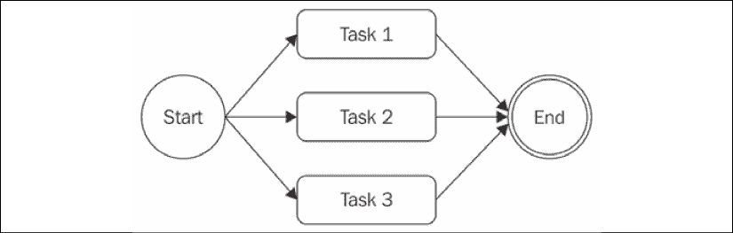
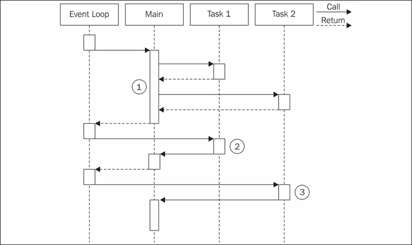
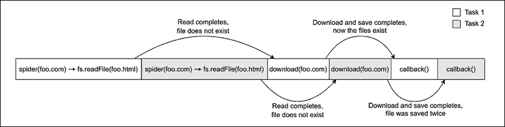
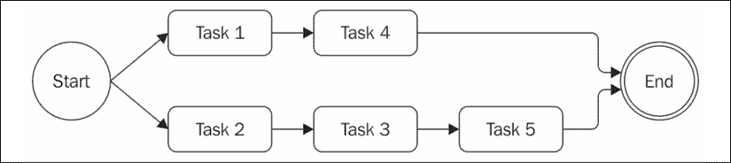

# 第四章：使用回调的异步控制流模式

从同步编程风格迁移到 Node.js 这样的平台，其中**传值调用风格**（**CPS**）和异步 API 是常态，可能会令人沮丧。异步代码可能会使预测语句执行的顺序变得困难。简单的问题，如遍历一组文件、按顺序执行任务或等待一组操作完成，都需要开发者采用新的方法和技巧，以避免编写低效且难以阅读的代码。当使用回调处理异步控制流时，最常见的错误是陷入回调地狱的陷阱，看到代码水平增长，而不是垂直增长，这种嵌套使得即使是简单的程序也难以阅读和维护。

在本章中，你将看到如何通过一些纪律和一些模式，实际上可以驯服回调并编写干净、可管理的异步代码。知道如何正确处理回调将为采用现代方法如 promises 和 async/await 铺平道路。

简而言之，在本章中，你将学习以下内容：

+   异步编程的挑战。

+   避免回调地狱和其他回调最佳实践。

+   常见的异步模式，如顺序执行、顺序迭代、并行执行和有限并行执行。

# 异步编程的困难之处

在 JavaScript 中失去对异步代码的控制无疑是容易的。闭包和匿名函数的现场定义允许开发者拥有流畅的编程体验，无需在代码库的其他点跳转。这完全符合**KISS**原则（**Keep It Simple, Stupid**）；它简单，保持了代码的流畅性，并且我们能在更短的时间内完成任务。不幸的是，牺牲诸如模块化、可重用性和可维护性等品质，迟早会导致回调嵌套的无序增长、函数尺寸的增大和代码组织不良。大多数情况下，创建现场函数作为回调并不是严格必要的，所以这更多是一个纪律问题，而不是与异步编程相关的问题。认识到我们的代码变得难以管理，或者更好的是，事先知道它可能会变得难以管理，然后采取最合适的解决方案，这是新手和专家之间的区别。

## 创建一个简单的网络爬虫

为了解释这个问题，我们将创建一个小型的网络爬虫，这是一个命令行应用程序，它接受一个网页 URL 作为输入，并将其内容下载到本地文件中。在本章展示的代码中，我们将使用几个 npm 依赖项：

+   `superagent`：一个用于简化 HTTP 调用的库 ([nodejsdp.link/superagent](http://nodejsdp.link/superagent))

+   `mkdirp`：一个用于递归创建目录的小工具 ([nodejsdp.link/mkdirp](http://nodejsdp.link/mkdirp))

此外，我们还将经常提到一个名为`./utils.js`的本地模块，它包含我们将要在应用程序中使用的一些辅助工具。为了简洁起见，我们将省略此文件的详细内容，但你可以在官方仓库中找到完整的实现，以及包含完整依赖列表的`package.json`文件，网址为[nodejsdp.link/repo](http://nodejsdp.link/repo)。

我们应用程序的核心功能包含在一个名为`spider.js`的模块中。让我们看看它的样子。首先，让我们加载所有将要使用的依赖项：

```js
import fs from 'fs'
import path from 'path'
import superagent from 'superagent'
import mkdirp from 'mkdirp'
import { urlToFilename } from './utils.js' 
```

接下来，让我们创建一个名为`spider()`的新函数，它接受要下载的 URL 和一个在下载过程完成后将被调用的回调函数：

```js
export function spider (url, cb) {
  const filename = urlToFilename(url)
  fs.access(filename, err => {                                // (1)
    if (err && err.code === 'ENOENT') {
      console.log(`Downloading ${url} into ${filename}`)
      superagent.get(url).end((err, res) => {                 // (2)
        if (err) {
          cb(err)
        } else {
          mkdirp(path.dirname(filename), err => {             // (3)
            if (err) {
              cb(err)
            } else {
              fs.writeFile(filename, res.text, err => {       // (4)
                if (err) {
                  cb(err)
                } else {
                  cb(null, filename, true)
                }
              })
            }
          })
        }
      })
    } else {
      cb(null, filename, false)
    }
  })
} 
```

这里有很多事情在进行中，所以让我们更详细地讨论每一步发生的情况：

1.  代码检查 URL 是否已经被下载，通过验证相应的文件是否尚未创建。如果`err`已定义且类型为`ENOENT`，则文件不存在，可以安全地创建它：

    ```js
    fs.access(filename, err => ... 
    ```

1.  如果找不到文件，将使用以下代码行下载 URL：

    ```js
    superagent.get(url).end((err, res) => ... 
    ```

1.  然后，我们确保将要包含文件的目录存在：

    ```js
    mkdirp(path.dirname(filename), err => ... 
    ```

1.  最后，我们将 HTTP 响应体写入文件系统：

    ```js
    fs.writeFile(filename, res.text, err => ... 
    ```

为了完成我们的网页爬虫应用程序，我们只需要提供一个 URL 作为输入来调用`spider()`函数（在我们的例子中，我们从命令行参数中读取它）。`spider()`函数是从我们之前定义的文件中导出的。现在，让我们创建一个名为`spider-cli.js`的新文件，该文件可以从命令行直接调用：

```js
import { spider } from './spider.js'
spider(process.argv[2], (err, filename, downloaded) => {
  if (err) {
    console.error(err)
  } else if (downloaded) {
    console.log(`Completed the download of "${filename}"`)
  } else {
    console.log(`"${filename}" was already downloaded`)
  }
}) 
```

现在，我们已经准备好尝试我们的网页爬虫应用程序，但首先，请确保你已经在`project`目录中有了`utils.js`模块和包含完整依赖列表的`package.json`文件。然后，通过运行以下命令安装所有依赖项：

```js
npm install 
```

现在，让我们执行`spider-cli.js`模块，使用如下命令下载网页内容：

```js
node spider-cli.js http://www.example.com 
```

我们的网页爬虫应用程序要求我们始终在提供的 URL 中包含协议（例如，`http://`）。此外，不要期望 HTML 链接会被重写或资源（如图片）会被下载，因为这只是一个简单的示例，用于演示异步编程的工作原理。

在下一节中，你将学习如何提高代码的可读性，以及通常如何使基于回调的代码尽可能干净和易于阅读。

## 回调地狱

看看我们之前定义的`spider()`函数，你可能会注意到，尽管我们实现的算法非常直接，但生成的代码有多个缩进级别，非常难以阅读。使用直接风格的阻塞 API 实现类似的函数将是直接的，而且代码很可能更容易阅读。然而，使用异步 CPS 则是另一回事，不当使用原地回调定义可能会导致极其糟糕的代码。

当闭包和原地回调定义的过度使用将代码变成难以阅读和管理的大块时，这种情况被称为“回调地狱”。这是 Node.js 和 JavaScript 中广泛认可且最严重的反模式之一。受此问题影响的代码的典型结构如下：

```js
asyncFoo(err => {
  asyncBar(err => {
    asyncFooBar(err => {
      //...
    })
  })
}) 
```

你可以看到，以这种方式编写的代码由于深层次的嵌套而呈现出金字塔形状，这也是为什么它也被俗称为“末日金字塔”。

前述代码片段中最明显的问题是它的可读性差。由于嵌套太深，几乎不可能跟踪函数的结束和开始。

另一个问题是由每个作用域中使用的变量名重叠引起的。通常，我们必须使用相似甚至相同的名称来描述变量的内容。最好的例子是每个回调接收到的错误参数。有些人经常尝试使用同一名称的不同变体来区分每个作用域中的对象，例如，`err`、`error`、`err1`、`err2`等等。其他人则更喜欢通过始终使用相同的名称来隐藏上层作用域中定义的变量，例如，`err`。这两种选择都远非完美，会导致混淆并增加引入缺陷的可能性。

此外，我们还需要记住，闭包在性能和内存消耗方面会付出一定的代价。此外，它们可能会创建不易识别的内存泄漏。实际上，我们不应该忘记，任何由活动闭包引用的上下文都会被垃圾回收保留。

对于 V8 中闭包如何工作的详细介绍，你可以参考 Google V8 工程师 Vyacheslav Egorov 撰写的一篇博客文章，你可以在这里阅读：[nodejsdp.link/v8-closures](http://nodejsdp.link/v8-closures)。

如果你看看我们定义的`spider()`函数，你会注意到它清楚地代表了一个回调地狱的情况，并且具有前面描述的所有问题。这正是我们将在本章后续部分介绍的模式和技巧要解决的问题。

# 回调最佳实践和控制流模式

现在你已经遇到了回调地狱的第一个例子，你知道你绝对应该避免什么；然而，在编写异步代码时，这并不是唯一的问题。事实上，有几个情况需要使用特定的模式和技巧来控制一系列异步任务，特别是如果我们只使用纯 JavaScript 而不借助任何外部库。例如，通过按顺序应用异步操作来迭代一个集合并不像在数组上调用`forEach()`那样简单；实际上，它需要一个类似于递归的技术。

在本节中，你不仅将学习如何避免回调地狱，还将学习如何仅使用简单和纯 JavaScript 实现一些最常见的控制流模式。

## 回调纪律

在编写异步代码时，要记住的第一条规则是在定义回调时不要滥用原地函数定义。这样做可能很有吸引力，因为它不需要额外的思考来解决模块化和重用等问题；然而，你已经看到了这可能会带来比优势更多的缺点。大多数时候，修复回调地狱问题不需要任何库、花哨的技术或范式转变；你只需要一些常识。

这些是一些基本的原则，可以帮助我们降低嵌套级别，并总体上提高我们代码的组织性：

+   尽快退出。根据上下文，使用`return`、`continue`或`break`立即退出当前语句，而不是编写（和嵌套）完整的`if...else`语句。这将有助于保持我们的代码浅层。

+   为回调创建命名函数，将它们从闭包中分离出来，并将中间结果作为参数传递。命名我们的函数也将使它们在堆栈跟踪中看起来更好。

+   模块化代码。尽可能将代码拆分为更小、可重用的函数。

现在，让我们将这些原则付诸实践。

## 应用回调纪律

为了展示上一节中提到的想法的力量，让我们将它们应用到修复我们的网络爬虫应用程序中的回调地狱。

对于第一步，我们可以通过在收到错误后立即从函数返回来重构我们的错误检查模式，移除`else`语句。这使得成为可能，因此，而不是有如下代码：

```js
if (err) {
  cb(err)
} else {
  // code to execute when there are no errors
} 
```

我们可以通过编写以下内容来改进我们代码的组织性：

```js
if (err) {
  return cb(err)
}
// code to execute when there are no errors 
```

这通常被称为**早期返回原则**。通过这个简单的技巧，我们立即降低了函数的嵌套级别。这很容易，而且不需要任何复杂的重构。

在执行上述优化时，一个常见的错误是忘记在回调调用后终止函数。对于错误处理场景，以下代码是典型的缺陷来源：

```js
if (err) {
  callback(err)
}
// code to execute when there are no errors. 
```

我们永远不应该忘记，即使我们调用了回调，函数的执行也会继续。因此，插入一个`return`指令来阻止函数其余部分的执行是很重要的。此外，请注意，函数返回的值实际上并不重要；真正的结果（或错误）是异步产生的，并通过回调传递。异步函数的返回值通常被忽略。这个特性允许我们编写如下简短的代码：

```js
return callback(...) 
```

否则，我们不得不编写稍微冗长的代码，如下所示：

```js
callback(...)
return 
```

作为对`spider()`函数的第二次优化，我们可以尝试识别可重用的代码片段。例如，将给定的字符串写入文件的功能可以很容易地分解成一个单独的函数，如下所示：

```js
function saveFile (filename, contents, cb) {
  mkdirp(path.dirname(filename), err => {
    if (err) {
      return cb(err)
    }
    fs.writeFile(filename, contents, cb)
  })
} 
```

按照同样的原则，我们可以创建一个名为`download()`的通用函数，它接受一个 URL 和一个文件名作为输入，并将 URL 下载到指定的文件中。内部，我们可以使用我们之前创建的`saveFile()`函数：

```js
function download (url, filename, cb) {
  console.log(`Downloading ${url}`)
  superagent.get(url).end((err, res) => {
    if (err) {
      return cb(err)
    }
    saveFile(filename, res.text, err => {
      if (err) {
        return cb(err)
      }
      console.log(`Downloaded and saved: ${url}`)
      cb(null, res.text)
    })
  })
} 
```

对于最后一步，我们修改了`spider()`函数，由于我们的改动，它现在看起来如下所示：

```js
export function spider (url, cb) {
  const filename = urlToFilename(url)
  fs.access(filename, err => {
    if (!err || err.code !== 'ENOENT') {   // (1)
      return cb(null, filename, false)
    }
    download(url, filename, err => {
      if (err) {
        return cb(err)
      }
      cb(null, filename, true)
    })
  })
} 
```

`spider()`函数的功能和接口保持完全相同；改变的是代码的组织方式。一个重要的细节（1）是我们反转了对文件存在性的检查，这样我们就可以应用之前讨论过的*早期返回原则*。

通过应用早期返回原则和其他回调纪律原则，我们能够极大地减少代码的嵌套，同时提高其可重用性和可测试性。实际上，我们可以考虑导出`saveFile()`和`download()`，这样我们就可以在其他模块中重用它们。这也会允许我们测试它们作为独立单元的功能性。

本节中我们进行的重构清楚地表明，大多数情况下，我们只需要一些纪律来确保我们不会滥用闭包和匿名函数。它工作得非常出色，需要最小的努力，并且不需要外部库。

现在你已经知道了如何使用回调编写干净的异步代码，我们准备探索一些最常见的异步模式，例如顺序和并行执行。

## 顺序执行

在本节中，我们将探讨异步控制流模式，并首先分析顺序执行流程。

按顺序执行一组任务意味着一次运行一个任务，一个接一个。执行顺序很重要，必须保持不变，因为列表中某个任务的执行结果可能会影响下一个任务的执行。*图 4.1*展示了这个概念：


图 4.1：三个任务的顺序执行流程示例

这个流程有几种不同的变体：

+   按顺序执行一组已知任务，不在这组任务之间传递数据。

+   使用任务的输出作为下一个任务的输入（也称为*链*、*管道*或*瀑布*）。

+   在运行异步任务的同时遍历集合。

虽然在直接风格阻塞 API 实现时很 trivial，但在使用异步 CPS 时，顺序执行通常是回调地狱问题的主要原因。

### 按顺序执行一组已知任务

我们在上一节中实现 `spider()` 函数时已经看到了顺序执行流程。通过应用一些简单的规则，我们能够将一组已知任务组织成顺序执行流程。以那段代码为指南，我们现在可以用以下模式来概括解决方案：

```js
function task1 (cb) {
  asyncOperation(() => {
    task2(cb)
  })
}
function task2 (cb) {
  asyncOperation(() => {
    task3(cb)
  })
}
function task3 (cb) {
  asyncOperation(() => {
    cb() // finally executes the callback
  })
}
task1(() => {
  // executed when task1, task2 and task3 are completed
  console.log('tasks 1, 2 and 3 executed')
}) 
```

前面的模式展示了每个任务如何在通用异步操作完成后调用下一个任务。该模式强调任务的模块化，展示了闭包并不总是处理异步代码所必需的。

### 顺序迭代

上一节中描述的模式，如果我们事先知道要执行什么任务以及要执行多少任务，则工作得非常好。这允许我们硬编码序列中下一个任务的调用，但如果我们想对集合中的每个项目执行异步操作，会发生什么？在这种情况下，我们不能再硬编码任务序列；相反，我们必须动态构建它。

#### Web spider 版本 2

为了展示顺序迭代的例子，让我们向 web spider 应用程序引入一个新功能。我们现在想要递归地下载网页中包含的所有链接。为此，我们将从页面中提取所有链接，然后依次递归地触发我们的 web spider。

第一步是修改我们的 `spider()` 函数，使其通过使用我们即将创建的 `spiderLinks()` 函数来触发页面上所有链接的递归下载。

此外，我们不再检查文件是否已存在，而是尝试读取它并开始爬取其链接。这样，我们就能恢复中断的下载。作为最后的更改，我们需要确保传播一个新的参数 `nesting`，这将帮助我们限制递归深度。代码如下：

```js
export function spider (url, nesting, cb) {
  const filename = urlToFilename(url)
  fs.readFile(filename, 'utf8', (err, fileContent) => {
    if (err) {
      if (err.code !== 'ENOENT') {
        return cb(err)
      }
      // The file doesn't exist, so let's download it
      return download(url, filename, (err, requestContent) => {
        if (err) {
          return cb(err)
        }
        spiderLinks(url, requestContent, nesting, cb)
      })
    }
    // The file already exists, let's process the links
    spiderLinks(url, fileContent, nesting, cb)
  })
} 
```

在下一节中，我们将探讨如何实现 `spiderLinks()` 函数。

#### 链接的顺序抓取

现在，我们可以创建这个新版本的 web spider 应用程序的核心，即 `spiderLinks()` 函数，它使用顺序异步迭代算法下载 HTML 页面上的所有链接。请注意我们将在以下代码块中定义的方式：

```js
function spiderLinks (currentUrl, body, nesting, cb) {
  if (nesting === 0) {
    // Remember Zalgo from chapter 3?
    return process.nextTick(cb)
  }
  const links = getPageLinks(currentUrl, body)            // (1)
  if (links.length === 0) {
    return process.nextTick(cb)
  }
  function iterate (index) {                              // (2)
    if (index === links.length) {
      return cb()
    }
    spider(links[index], nesting - 1, function (err) {    // (3)
      if (err) {
        return cb(err)
      }
      iterate(index + 1)
    })
  }
  iterate(0)                                              // (4)
} 
```

从这个新功能中需要理解的重要步骤如下：

1.  我们使用 `getPageLinks()` 函数获取页面中包含的所有链接列表。此函数仅返回指向内部目标（同一主机名）的链接。

1.  我们使用一个名为 `iterate()` 的本地函数遍历链接，该函数接受要分析的下一个链接的 `index`。在这个函数中，我们首先做的事情是检查 `index` 是否等于 `links` 数组的长度，如果是这样，我们就立即调用 `cb()` 函数，因为这表示我们已经处理了所有项目。

1.  到这一点，一切应该都准备好处理链接了。我们通过减少嵌套级别并在操作完成后调用迭代的下一步来调用 `spider()` 函数。

1.  在 `spiderLinks()` 函数的最后一步，我们通过调用 `iterate(0)` 来引导迭代。

刚才提出的算法允许我们通过执行异步操作按顺序遍历数组，在我们的例子中是 `spider()` 函数。

最后，我们可以稍微修改一下我们的 `spider-cli.js`，以便我们可以将嵌套级别作为额外的命令行界面（CLI）参数指定：

```js
import { spider } from './spider.js'
const url = process.argv[2]
const nesting = Number.parseInt(process.argv[3], 10) || 1
spider(url, nesting, err => {
  if (err) {
    console.error(err)
    process.exit(1)
  }
  console.log('Download complete')
}) 
```

我们现在可以尝试这个蜘蛛应用程序的新版本，并观察它递归地下载网页上的所有链接，一个接一个。要中断这个过程，如果有很多链接，这个过程可能会持续一段时间，请记住我们始终可以使用 Ctrl + C。如果我们决定继续，我们可以通过启动蜘蛛应用程序并使用与第一次运行相同的 URL 来实现。

既然我们的网络蜘蛛应用程序有可能触发整个网站的下载，请谨慎使用。例如，不要设置过高的嵌套级别，或者让蜘蛛运行超过几秒钟。用数千个请求压垮服务器是不礼貌的。在某些情况下，这也可能被视为非法。负责任地使用蜘蛛！

#### 模式

上一个部分中 `spiderLinks()` 函数的代码是展示如何遍历集合同时应用异步操作的一个清晰的例子。你也许还会注意到，这是一个可以适应任何其他需要异步遍历集合元素或，更一般地说，遍历任务列表的情况的模式。这个模式可以概括如下：

```js
function iterate (index) {
  if (index === tasks.length) {
    return finish()
  }
  const task = tasks[index]
  task(() => iterate(index + 1))
}
function finish () {
  // iteration completed
}
iterate(0) 
```

重要的是要注意，如果 `task()` 是一个同步操作，这些类型的算法会变得非常递归。在这种情况下，栈不会在每次循环中展开，可能会达到最大调用栈大小限制的风险。

刚才提出的模式非常强大，可以扩展或适应以解决几个常见需求。仅举一些例子：

+   我们可以异步地将数组的值映射到另一个数组。

+   我们可以将操作的结果传递给迭代中的下一个操作，以实现 `reduce` 算法的异步版本。

+   如果满足特定条件，我们可以提前退出循环（`Array.some()` 助手的异步实现）。

+   我们甚至可以遍历无限数量的元素。

我们还可以选择通过一个具有如下签名的函数进一步泛化解决方案：

```js
iterateSeries(collection, iteratorCallback, finalCallback) 
```

在这里，`collection` 是你想要迭代的实际数据集，`iteratorCallback` 是要执行每个项目的函数，而 `finalCallback` 是在所有项目处理完毕或发生错误时执行的函数。这个辅助函数的实现留给你作为练习。

**顺序迭代器模式**

通过创建一个名为 `iterator` 的函数来按顺序执行一系列任务，该函数调用集合中下一个可用的任务，并在当前任务完成后确保调用迭代的下一步。

在下一节中，我们将探讨并行执行模式，当各种任务的顺序不重要时，这种模式更方便。

## 并行执行

有一些情况下，一组异步任务的执行顺序并不重要，我们只想在所有运行的任务完成时得到通知。这种情况下，使用并行执行流程处理会更好，如图 *图 4.2* 所示：



图 4.2：三个任务并行执行的示例

如果你考虑到 Node.js 是单线程的，这可能会听起来很奇怪，但如果你记得我们在 *第一章* 中讨论的 *Node.js 平台*，你就会意识到尽管我们只有一个线程，但我们可以通过 Node.js 的非阻塞特性来实现并发。实际上，在这个情况下，使用 *并行* 这个词是不恰当的，因为它并不意味着任务是同时运行的，而是它们的执行是由一个底层的非阻塞 API 执行的，并且通过事件循环进行交错。

如你所知，当任务请求新的异步操作时，它会将控制权交还给事件循环，允许事件循环执行另一个任务。这种流程的正确词是 *并发*，但为了简单起见，我们仍然使用并行。

以下 **图** 展示了两个异步任务如何在 Node.js 程序中并行运行：



图 4.3：异步任务并行运行的示例

在 *图 4.3* 中，我们有一个执行两个异步任务的 **Main** 函数：

1.  **Main** 函数触发 **Task 1** 和 **Task 2** 的执行。由于它们触发了异步操作，它们立即将控制权交还给 **Main** 函数，然后 **Main** 函数再将控制权交还给事件循环。

1.  当 **Task 1** 的异步操作完成时，事件循环将其控制权交还给它。当 **Task 1** 完成其内部同步处理时，它通知 **Main** 函数。

1.  当由**任务 2**触发的异步操作完成时，事件循环调用其回调，将控制权交回**任务 2**。在**任务 2**结束时，**主**函数再次被通知。此时，**主**函数知道**任务 1**和**任务 2**都已完成，因此它可以继续执行或返回操作的成果给另一个回调。

简而言之，这意味着在 Node.js 中，我们只能并行执行异步操作，因为它们的并发性是由非阻塞 API 内部处理的。在 Node.js 中，同步（阻塞）操作不能并发运行，除非它们的执行与异步操作交织，或者与`setTimeout()`或`setImmediate()`交织。你将在*第十一章*，*高级技巧*中看到更多细节。

### Web 蜘蛛版本 3

我们的 Web 蜘蛛应用程序似乎是应用并行执行概念的完美候选者。到目前为止，我们的应用程序是以顺序方式执行链接页面的递归下载。我们可以通过并行下载所有链接页面来轻松提高此过程的速度。

要做到这一点，我们只需要修改`spiderLinks()`函数，确保我们一次性启动所有`spider()`任务，然后在所有任务都完成执行后调用最终回调。所以，让我们按照以下方式修改我们的`spiderLinks()`函数：

```js
function spiderLinks (currentUrl, body, nesting, cb) {
  if (nesting === 0) {
    return process.nextTick(cb)
  }
  const links = getPageLinks(currentUrl, body)
  if (links.length === 0) {
    return process.nextTick(cb)
  }
  let completed = 0
  let hasErrors = false
  function done (err) {
    if (err) {
      hasErrors = true
      return cb(err)
    }
    if (++completed === links.length && !hasErrors) {
      return cb()
    }
  }
  links.forEach(link => spider(link, nesting - 1, done))
} 
```

让我们讨论一下我们做了什么改变。如前所述，`spider()`任务现在同时启动。这可以通过简单地遍历`links`数组并启动每个任务而不等待前一个任务完成来实现：

```js
links.forEach(link => spider(link, nesting - 1, done)) 
```

然后，使我们的应用程序等待所有任务完成的技巧是向`spider()`函数提供一个特殊的回调，我们称之为`done()`。当`spider`任务完成时，`done()`函数会增加计数器。当完成的下载数量达到`links`数组的大小，最终回调将被调用：

```js
function done (err) {
  if (err) {
    hasErrors = true
    return cb(err)
  }
  if (++completed === links.length && !hasErrors) {
    return cb()
  }
} 
```

`hasErrors`变量是必要的，因为如果其中一个并行任务失败，我们希望立即调用带有给定错误的回调。此外，我们需要确保可能仍在运行的其它并行任务不会再次调用回调。

在这些更改到位后，如果我们现在尝试运行我们的蜘蛛程序对网页进行抓取，我们会注意到整体过程的速度有了巨大的提升，因为每个下载都会并行进行，无需等待前一个链接被处理。

### 模式

最后，我们可以提取出我们漂亮的并行执行流程模式。让我们用以下代码表示模式的通用版本：

```js
const tasks = [ /* ... */ ]
let completed = 0
tasks.forEach(task => {
  task(() => {
    if (++completed === tasks.length) {
      finish()
    }
  })
})
function finish () {
  // all the tasks completed
} 
```

通过一些小的修改，我们可以将模式调整为将每个任务的结果累积到一个集合中，过滤或映射数组的元素，或者在一项或给定数量的任务完成时立即调用`finish()`回调（这种情况特别称为**竞争性赛跑**）。

**无限制并行执行模式**

通过一次性启动所有异步任务，并行运行一组异步任务，然后通过计算它们的回调被调用的次数来等待所有任务完成。

当我们并行运行多个任务时，我们可能会遇到竞争条件，即对外部资源（例如文件或数据库中的记录）的访问竞争。在下一节中，我们将讨论 Node.js 中的竞争条件，并探讨一些识别和解决它们的技术。

### 使用并发任务解决竞争条件

当使用阻塞 I/O 与多个线程结合使用时，并行运行一组任务可能会引起问题。然而，你刚刚看到，在 Node.js 中，这完全是另一回事。并行运行多个异步任务实际上既简单又节省资源。

这是 Node.js 最重要优势之一，因为它使得并行化成为一种常见实践，而不是仅在绝对必要时才使用的复杂技术。

Node.js 并发模型的重要特性之一是我们处理任务同步和竞争条件的方式。在多线程编程中，这通常使用锁、互斥锁、信号量和监视器等结构来完成，这可能是并行化的最复杂方面之一，并对性能有相当大的影响。在 Node.js 中，我们通常不需要复杂的同步机制，因为所有操作都在单个线程上运行。然而，这并不意味着我们不能有竞争条件；相反，它们可能相当常见。问题的根源在于异步操作的调用和结果通知之间的延迟。

为了看到具体的例子，我们将再次参考我们的网络蜘蛛应用程序，特别是我们创建的最后一个版本，它实际上包含了一个竞争条件（你能找到吗？）。我们讨论的问题在于 `spider()` 函数，我们在开始下载相应 URL 之前检查文件是否已经存在：

```js
export function spider (url, nesting, cb) {
  const filename = urlToFilename(url)
  fs.readFile(filename, 'utf8', (err, fileContent) => {
    if (err) {
      if (err.code !== 'ENOENT') {
        return cb(err)
      }
      return download(url, filename, (err, requestContent) => {
        // ... 
```

问题在于，两个在相同 URL 上操作的 **蜘蛛** 任务可能会在其中一个任务完成下载并创建文件之前对同一文件调用 `fs.readFile()`，导致两个任务都开始下载。*图 4.4* 解释了这种情况：



图 4.4：蜘蛛()函数中的竞争条件示例

*图 4.4* 展示了在 Node.js 的单线程中 **任务 1** 和 **任务 2** 如何交错执行，以及异步操作实际上如何引入竞争条件。在我们的例子中，两个 **蜘蛛** 任务最终下载了相同的文件。

我们该如何解决这个问题？答案比你想象的要简单得多。实际上，我们只需要一个变量来互斥多个在相同 URL 上运行的 **蜘蛛** 任务。这可以通过一些代码实现，如下所示：

```js
const spidering = new Set()
function spider (url, nesting, cb) {
  if (spidering.has(url)) {
    return process.nextTick(cb)
  }
  spidering.add(url)
// ... 
```

修复不需要很多注释。如果给定的`url`已经存在于`spidering`集合中，我们立即退出函数；否则，我们将`url`添加到集合中，并继续下载。在我们的情况下，我们不需要释放锁，因为我们不感兴趣下载同一个 URL 两次，即使`spider`任务在两个完全不同的时间点执行。

竞态条件可以导致许多问题，即使我们处于单线程环境中。在某些情况下，它们可能导致数据损坏，并且由于它们的短暂性，通常很难调试。因此，在并行运行任务时，始终检查这些类型的情况是一个好的做法。

此外，运行任意数量的并行任务可能是一种危险的做法。在下一节中，你将发现为什么这可能会成为一个问题以及如何控制并行任务的数量。

## 限制并行执行

无控制地生成并行任务往往会导致过载。想象一下，如果有成千上万的文件要读取，URL 要访问，或者数据库查询要并行运行。这种情况下的一个常见问题是资源耗尽。最常见的情况是，当应用程序试图一次性打开太多文件时，利用了进程可用的所有文件描述符。

一个生成无界并行任务以处理用户请求的服务器可能会被**拒绝服务**（**DoS**）攻击所利用。这就是恶意行为者可以伪造一个或多个请求，将服务器推向消耗所有可用资源并变得无响应。限制并行任务的数量通常是一个好的做法，有助于构建健壮的应用程序。

我们的网络爬虫的第三个版本不限制并行任务的数量，因此，它在许多情况下容易崩溃。例如，如果我们尝试运行它来针对一个显著大的网站，我们可能会看到它运行几秒钟然后失败，错误代码为`ECONNREFUSED`。当我们从网络服务器并发下载太多页面时，服务器可能会决定开始拒绝来自同一 IP 的新连接。在这种情况下，我们的爬虫会直接崩溃，如果我们想继续爬取网站，我们就必须重新启动进程。我们只是处理`ECONNREFUSED`来停止进程崩溃，但我们仍然冒着分配太多并行任务的风险，可能会遇到其他问题。

在本节中，你将了解我们如何通过限制并发来使我们的爬虫更加健壮。

下面的图示显示了我们在有两个并发限制的情况下运行五个并行任务的情况：



图 4.5：限制并发到最多两个并行任务的示例

从*图 4.5*中，应该可以清楚地了解我们的算法是如何工作的：

1.  初始时，我们将生成尽可能多的任务，而不超过并发限制。

1.  然后，每次任务完成时，我们生成一个或多个任务，直到再次达到限制。

在下一节中，我们将探讨有限并行执行模式的可能实现。

### 限制并发

现在，我们将研究一种模式，它将以有限的并发性并行执行一组给定的任务：

```js
const tasks = [
  // ...
]
const concurrency = 2
let running = 0
let completed = 0
let index = 0
function next () {                                          // (1)
  while (running < concurrency && index < tasks.length) {
    const task = tasks[index++]
    task(() => {                                            // (2)
      if (++completed === tasks.length) {
        return finish()
      }
      running--
      next()
    })
    running++
  }
}
next()
function finish() {
  // all tasks finished
} 
```

这个算法可以被认为是一种顺序执行和并行执行的混合体。事实上，你可能会注意到它与这两种模式都有相似之处：

1.  我们有一个迭代函数，我们称之为`next()`，然后是一个内部循环，它尽可能多地并行生成任务，同时保持在并发限制内。

1.  下一个重要部分是我们传递给每个任务的回调，它检查我们是否完成了列表中的所有任务。如果有任务尚未运行，它将调用`next()`来生成另一组任务。

很简单，不是吗？

### 全局限制并发

我们的网页爬虫应用程序非常适合应用我们刚刚学到的关于限制任务集并发性的知识。事实上，为了避免同时爬取数千个链接的情况，我们可以通过添加一些关于并发下载数量的可预测性来限制此过程的并发性。

我们可以将这种有限并发模式的实现应用于我们的`spiderLinks()`函数，但通过这样做，我们只会限制从给定页面中找到的链接生成的任务的并发性。例如，如果我们选择并发性为两个，那么每个页面最多只能并行下载两个链接。然而，由于我们可以一次性下载多个链接，每个页面随后会生成另外两个下载，因此总的下载操作数量仍然会呈指数增长。

通常，当我们有一个预定的任务集要执行，或者当任务集随时间线性增长时，这种有限并发模式的实现工作得非常好。相反，如果一个任务可以直接生成两个或更多任务，就像我们的网页爬虫那样，这种实现不适合限制全局并发。

#### 队列来拯救

那么，我们真正想要的是限制可以并行运行的全球下载操作的数量。我们可以稍微修改前一个章节中显示的模式，但这留给你作为练习。相反，让我们讨论另一种机制，它利用**队列**来限制多个任务的并发性。让我们看看它是如何工作的。

我们现在将实现一个简单的名为`TaskQueue`的类，它将结合队列与在讨论限制并发时提出的算法。让我们创建一个新的模块名为`taskQueue.js`：

```js
export class TaskQueue {
  constructor (concurrency) {
    this.concurrency = concurrency
    this.running = 0
    this.queue = []
  }
  pushTask (task) {
    this.queue.push(task)
    process.nextTick(this.next.bind(this))
    return this
  }
  next () {
    while (this.running < this.concurrency && this.queue.length) {
      const task = this.queue.shift()
      task(() => {
        this.running--
        process.nextTick(this.next.bind(this))
      })
      this.running++
    }
  }
} 
```

这个类的构造函数只接受并发限制作为输入，但除此之外，它初始化实例变量`running`和`queue`。前者是一个计数器，用于跟踪所有正在运行的任务，而后者是作为队列使用的数组，用于存储待处理任务。

`pushTask()`方法简单地将新任务添加到队列中，然后通过异步调用`this.next()`来启动工作进程的执行。请注意，我们必须使用`bind`，否则`next`函数在`process.nextTick`调用时将丢失上下文。

`next()`方法从队列中生成一系列任务，确保它不会超过并发限制。

你可能会注意到这个方法与*限制并发*部分开头提出的模式有一些相似之处。它本质上开始尽可能多地从队列中启动任务，而不超过并发限制。当每个任务完成时，它更新正在运行的任务计数，然后通过再次异步调用`next()`来启动另一轮任务。`TaskQueue`类的有趣属性是它允许我们动态地向队列中添加新项目。另一个优点是，现在我们有一个中央实体负责限制我们任务的并发性，这可以在函数执行的各个实例之间共享。在我们的例子中，它是`spider()`函数，你将在稍后看到。

#### 精炼`TaskQueue`

`TaskQueue`的先前实现足以演示队列模式，但为了在实际项目中使用，它需要一些额外的功能。例如，我们如何知道任务中有一个失败了？我们如何知道队列中的所有工作是否已经完成？

让我们回顾一下我们在*第三章*，*回调和事件*中讨论的一些概念，并将`TaskQueue`转换为`EventEmitter`，这样我们就可以通过触发事件来传播任务失败，并在队列为空时通知任何观察者。

我们必须做的第一个改变是导入`EventEmitter`类，并让我们的`TaskQueue`扩展它：

```js
import { EventEmitter } from 'events'
export class TaskQueue extends EventEmitter {
  constructor (concurrency) {
    super()
    // ...
  }
  // ...
} 
```

在这一点上，我们可以使用`this.emit`在`TaskQueue`的`next()`方法中触发事件：

```js
next () {
  if (this.running === 0 && this.queue.length === 0) {         // (1)
    return this.emit('empty')
  }
  while (this.running < this.concurrency && this.queue.length) {
    const task = this.queue.shift()
    task((err) => {                                            // (2)
      if (err) {
        this.emit('error', err)
      }
      this.running--
      process.nextTick(this.next.bind(this))
    })
    this.running++
  }
} 
```

将这个实现与之前的实现进行比较，这里有两个新增内容：

+   每次调用`next()`函数时，我们检查没有任务正在运行，并且队列是否为空。在这种情况下，这意味着队列已经被清空，我们可以触发`empty`事件。

+   每个任务的完成回调现在可以通过传递一个错误来调用。我们检查是否实际传递了一个错误，这表明任务失败了，在这种情况下，我们通过`error`事件传播这样的错误。

注意，在出现错误的情况下，我们故意保持队列运行。我们不会停止正在进行的其他任务，也不会移除任何挂起的任务。这在基于队列的系统里是很常见的。错误是预期会发生的，而不是让系统在这些情况下崩溃，通常更好的做法是识别错误并考虑重试或恢复策略。我们将在*第十三章*，*消息和集成模式*中更详细地讨论这些概念。

#### Web 爬虫版本 4

现在我们已经有了我们的通用队列，可以在有限的并行流中执行任务，让我们直接使用它来重构我们的 web 爬虫 应用程序。

我们将使用`TaskQueue`的一个实例作为工作待办事项；我们想要爬取的每个 URL 都需要作为任务添加到队列中。起始 URL 将被添加为第一个任务，然后爬取过程中发现的每个其他 URL 也将被添加。队列将为我们管理所有调度，确保在任何给定时间正在进行的任务数量（即正在下载或从文件系统中读取的页面数量）永远不会超过为给定`TaskQueue`实例配置的并发限制。

我们已经在`spider()`函数内部定义了爬取给定 URL 的逻辑。我们可以将这视为我们的通用爬取任务。为了更清晰，最好将此函数重命名为`spiderTask`：

```js
function spiderTask (url, nesting, queue, cb) {             // (1)
  const filename = urlToFilename(url)
  fs.readFile(filename, 'utf8', (err, fileContent) => {
    if (err) {
      if (err.code !== 'ENOENT') {
        return cb(err)
      }
      return download(url, filename, (err, requestContent) => {
        if (err) {
          return cb(err)
        }
        spiderLinks(url, requestContent, nesting, queue)    // (2)
        return cb()
      })
    }
    spiderLinks(url, fileContent, nesting, queue)           // (3)
    return cb()
  })
} 
```

除了重命名函数外，你可能还注意到我们做了一些其他的小改动：

+   函数签名现在接受一个名为`queue`的新参数。这是一个`TaskQueue`的实例，我们需要将其传递过去，以便在必要时添加新任务。

+   负责添加新链接进行爬取的函数是`spiderLinks`，因此我们需要确保在下载新页面后调用此函数时传递队列实例。

+   我们还需要在从已下载的文件调用`spiderLinks`时传递队列实例。

让我们回顾一下`spiderLinks()`函数。由于这项工作已经委托给队列，这个函数现在可以大大简化，因为它不再需要跟踪任务完成情况。现在，它的任务实际上是同步的；它只需要调用新的`spider()`函数（我们将在稍后定义）来向队列推送一个新任务，每个发现的链接一个任务：

```js
function spiderLinks (currentUrl, body, nesting, queue) {
  if (nesting === 0) {
    return
  }
  const links = getPageLinks(currentUrl, body)
  if (links.length === 0) {
    return
  }
  links.forEach(link => spider(link, nesting - 1, queue))
} 
```

让我们现在回顾一下`spider()`函数，它需要作为第一个 URL 的*入口点*；它也将用于将每个新发现的 URL 添加到`queue`：

```js
const spidering = new Set()                               // (1)
export function spider (url, nesting, queue) {
  if (spidering.has(url)) {
    return
  }
  spidering.add(url)
  queue.pushTask((done) => {                              // (2)
    spiderTask(url, nesting, queue, done)
  })
} 
```

如你所见，这个函数现在有两个主要职责：

1.  它通过使用`spidering`集合来管理已访问或正在进行的 URL 的账本。

1.  它将新任务推送到`queue`。一旦执行，此任务将调用`spiderTask()`函数，实际上开始爬取给定的 URL。

最后，我们可以更新`spider-cli.js`脚本，它允许我们从命令行调用我们的爬虫：

```js
import { spider } from './spider.js'
import { TaskQueue } from './TaskQueue.js'
const url = process.argv[2]                                    // (1)
const nesting = Number.parseInt(process.argv[3], 10) || 1
const concurrency = Number.parseInt(process.argv[4], 10) || 2
const spiderQueue = new TaskQueue(concurrency)                 // (2)
spiderQueue.on('error', console.error)
spiderQueue.on('empty', () => console.log('Download complete'))
spider(url, nesting, spiderQueue)                              // (3) 
```

这个脚本现在由三个主要部分组成：

1.  CLI 参数解析。请注意，现在脚本接受一个额外的第三个参数，可以用来自定义并发级别。

1.  创建了一个`TaskQueue`对象，并将监听器附加到`error`和`empty`事件上。当发生错误时，我们只想简单地打印它。当队列为空时，这意味着我们已经完成了网站的爬取。

1.  最后，我们通过调用`spider`函数开始爬取过程。

在我们应用了这些更改之后，我们可以再次尝试运行蜘蛛模块。当我们运行以下命令：

```js
node spider-cli.js https://loige.co 1 4 
```

我们应该注意到，同时最多只能有四个下载活动。

在这个最后的例子中，我们结束了基于回调模式的探索。在下一节中，我们将通过查看一个著名的库来结束这一章，这个库提供了一个这些模式和许多其他异步工具的生产就绪实现。

# `async`库

如果你暂时回顾一下我们迄今为止分析过的每一个控制流模式，你会发现它们可以用作构建可重用和更通用解决方案的基础。例如，我们可以将无限并行执行算法封装成一个函数，该函数接受一个任务列表，并行运行它们，并在所有任务都完成时调用给定的回调。将控制流算法封装成可重用函数的方式可以导致定义异步控制流的一种更声明性和表达性的方式，这正是`async`([nodejsdp.link/async](http://nodejsdp.link/async))所做的事情。

`async`库（不要与本书后面将要讨论的`async`/`await`关键字混淆）是 Node.js 和 JavaScript 中处理异步代码的一个非常流行的解决方案。它提供了一套函数，可以极大地简化不同配置下任务的执行，并且它还提供了处理集合的异步的有用辅助工具。尽管有其他几个具有类似目标的库，但由于其历史流行度，`async`在 Node.js 中成为了事实上的标准，尤其是在使用回调定义异步任务时。

只为了给你一个关于异步模块最重要功能的印象，这里是一个它暴露的功能示例：

+   在一系列元素上执行异步函数（按顺序或有限并发地并行执行）。

+   执行一系列异步函数（瀑布），其中每个函数的输出成为下一个函数的输入。

+   提供了一个队列抽象函数，功能上等同于我们使用`TaskQueue`实用程序实现的队列。

+   提供其他有趣的异步模式，如**race**（并行执行多个异步函数，并在第一个完成时停止）。

查看关于`async`的文档([nodejsdp.link/async](http://nodejsdp.link/async))，了解更多关于该模块的信息，并查看一些示例。

一旦你理解了本章描述的异步模式的基本原理，你不应该依赖这里提供的简化实现来满足你的日常控制流需求。相反，对于生产应用，最好采用广泛使用且经过实战考验的库，如`async`，除非你的用例非常高级，需要自定义算法。

# 摘要

在本章的开头，提到 Node.js 编程可能很困难，因为它具有异步特性，尤其是对于那些习惯于在其他平台上开发的人来说。然而，在本章中，你看到了如何将异步 API 弯曲以适应你的意愿。你发现，你手中的工具确实非常灵活，并且为大多数问题提供了良好的解决方案，同时还提供了适合各种口味的编程风格。

在本章中，我们也持续重构和改进我们的网络爬虫示例。在处理异步代码时，有时可能具有挑战性，需要找到合适的用户体验，以保持代码简单和有效，因此请给自己一些时间来消化本章探讨的概念，并尝试应用它们。

我们对异步 Node.js 编程的探索才刚刚开始。在接下来的几章中，你将了解到其他广泛采用的技术，这些技术利用了承诺（promises）和 async/await。在你掌握了所有这些技术之后，你将能够为你的需求选择最佳解决方案，或者在同一项目中使用其中许多技术。

# 练习

+   **4.1 文件连接**：编写`concatFiles()`的实现，这是一个回调风格的函数，它接受文件系统中两个或更多文本文件的路径和一个目标文件：

    ```js
    function concatFiles (srcFile1, srcFile2, srcFile3, ... ,
                          dest, cb) {
      // ...
    } 
    ```

    此函数必须将每个源文件的 内容复制到目标文件中，按照提供的参数列表中的顺序，例如，给定两个文件，如果第一个文件包含*foo*，第二个文件包含*bar*，则函数应在目标文件中写入*foobar*（而不是*barfoo*）。请注意，前面的示例签名不是有效的 JavaScript 语法：你需要找到不同的方法来处理任意数量的参数。例如，你可以使用**剩余参数**语法 ([nodejsdp.link/rest-parameters](http://nodejsdp.link/rest-parameters))。

+   **4.2 递归列出文件**：编写`listNestedFiles()`，一个回调风格的函数，它接受本地文件系统中目录的路径作为输入，并异步遍历所有子目录，最终返回找到的所有文件的列表。以下是该函数签名应如下所示：

    ```js
    function listNestedFiles (dir, cb) { /* ... */ } 
    ```

    如果你能成功避免回调地狱，将获得加分。如有需要，请自由创建额外的辅助函数。

+   **4.3 递归查找**：编写`recursiveFind()`，这是一个回调风格的函数，它接受本地文件系统中目录的路径和一个关键字，如下所示：

    ```js
    function recursiveFind(dir, keyword, cb) { /* ... */ } 
    ```

    函数必须找到给定目录下所有包含给定关键词的文本文件。搜索完成后，应使用回调函数返回匹配文件的列表。如果没有找到匹配的文件，则必须使用空数组调用回调函数。作为一个示例测试用例，如果你在`myDir`目录下有`foo.txt`、`bar.txt`和`baz.txt`这三个文件，并且关键词`'batman'`包含在`foo.txt`和`baz.txt`这两个文件中，你应该能够运行以下代码：

    ```js
    recursiveFind('myDir', 'batman', console.log)
    // should print ['foo.txt', 'baz.txt'] 
    ```

    如果你能使搜索递归（它会在任何子目录中查找文本文件），那么你会得到额外的分数。如果你能够并行地在不同的文件和子目录中执行搜索，那么你会得到更多的额外分数，但请注意要控制并行任务的数量！
