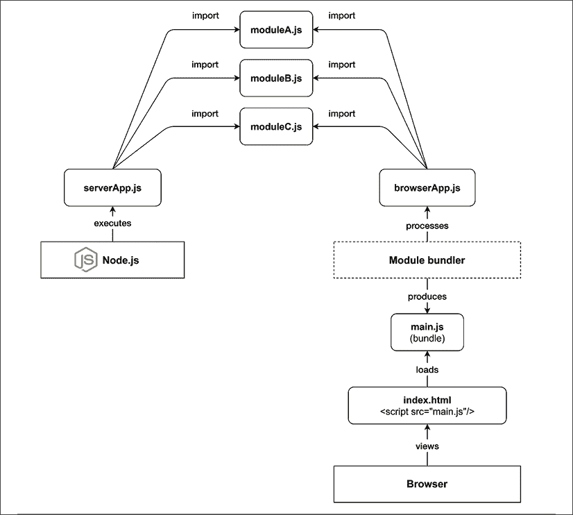
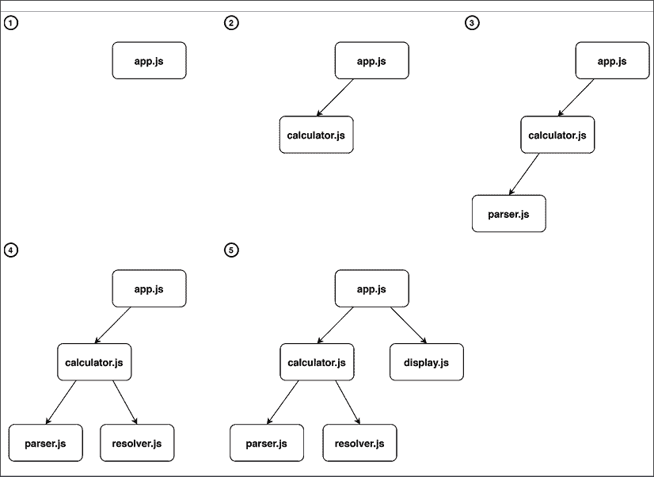
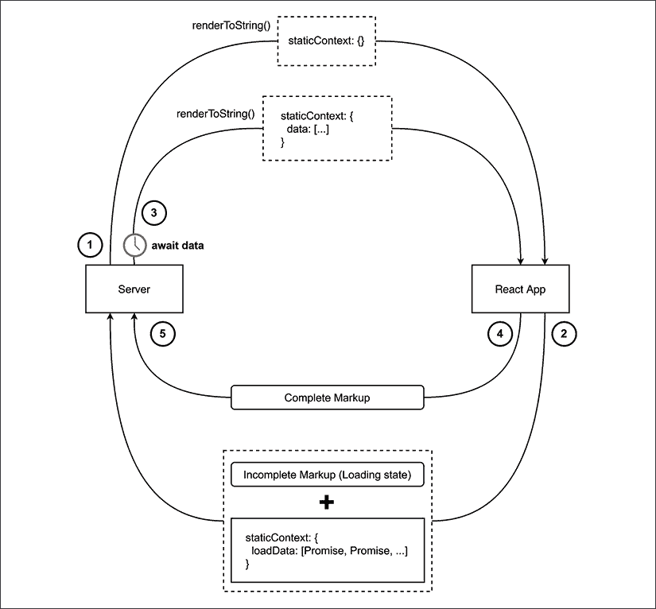
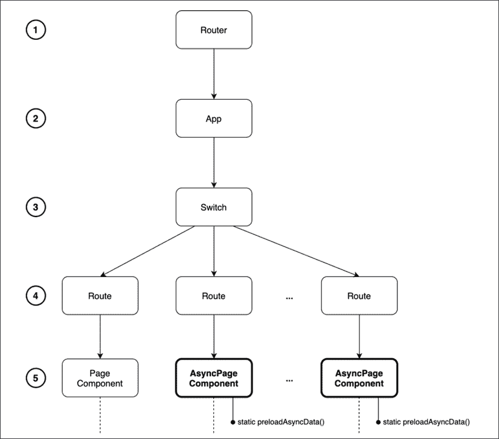

# 第十章：通用 JavaScript 用于 Web 应用程序

JavaScript 的诞生目标是赋予网络开发者直接在浏览器中执行代码并构建动态和交互式网站的能力。

自从 JavaScript 诞生以来，它已经发展了很多。如果，在最开始，JavaScript 是一个非常简单和有限制的语言，那么今天，它可以被认为是一种完整的通用语言，甚至可以用于浏览器之外构建几乎任何类型的应用程序。事实上，JavaScript 现在为前端应用程序、网络服务器、移动应用程序以及嵌入式设备（如可穿戴设备、恒温器和飞行无人机）提供动力。

语言在平台和设备上的可用性正在促进 JavaScript 开发者中的一种新趋势：能够在同一项目中简化不同环境之间的代码复用。有了 Node.js，开发者有机会构建易于在服务器（后端）和浏览器（前端）之间共享代码的 Web 应用程序。这种代码复用的追求最初与术语 **同构 JavaScript** 相关联，但今天，它更多地被认可为 **通用 JavaScript**。

在本章中，我们将探索通用 JavaScript 的奇妙之处，特别是在网络开发领域，并发现我们可以用来在服务器和浏览器之间共享代码的许多工具和技术。

我们将探讨什么是模块打包器以及为什么我们需要它。然后，我们将学习模块打包器是如何工作的，并使用最流行的之一 webpack 进行实践。接着，我们将讨论一些通用的模式，这些模式可以帮助我们在不同平台上进行代码复用。

最后，我们将学习 React 的基本功能，并使用它来构建一个具有通用渲染、通用路由和通用数据加载的完整通用 JavaScript 应用程序。

总结一下，以下是本章我们将涉及的主题列表：

+   如何在浏览器和 Node.js 之间共享代码

+   跨平台开发基础（代码分支、模块交换和其他有用的模式）

+   React 简要介绍

+   如何使用 React 和 Node.js 构建一个完整的通用 JavaScript 应用程序

请耐心等待，这将是一个令人兴奋的章节！

# 与浏览器共享代码

Node.js 的一个主要卖点是基于 JavaScript，并在 V8 上运行，V8 是一个 JavaScript 引擎，实际上为一些最受欢迎的浏览器提供动力：Google Chrome 和 Microsoft Edge。我们可能会认为共享相同的 JavaScript 引擎就足以使 Node.js 和浏览器之间的代码共享变得容易；然而，正如我们将在本章中看到的，这并不总是正确的，除非我们只想共享简单、自包含和通用的代码片段。

为客户端和服务器开发代码需要付出相当大的努力，以确保相同的代码可以在本质上不同的两个环境中正确运行。例如，在 Node.js 中，我们没有 DOM 或长期存在的视图，而在浏览器上，我们肯定没有文件系统和其他许多与底层操作系统交互的接口。

另一个争议点是对现代 JavaScript 特性的支持程度。当我们针对 Node.js 进行开发时，我们可以安全地采用现代语言特性，因为我们知道哪些 Node.js 版本运行在我们的服务器上。例如，对于我们的服务器代码，如果我们知道它将在 Node.js 版本 8（或更高版本）上运行，我们可以安全地决定采用 async/await。不幸的是，在为浏览器编写 JavaScript 代码时，我们无法拥有同样的信心。

这是因为不同的用户将使用不同版本的浏览器，它们对最新语言特性的兼容性水平也不同。一些用户可能使用支持 async/await 的现代浏览器，而其他用户可能仍在使用不支持 async/await 的旧设备和旧浏览器。

因此，在为两个平台开发时，大部分所需的工作是确保将这些差异减少到最小。这可以通过使用抽象、模式和工具来实现，这些工具使应用程序能够在构建时或动态地切换到浏览器兼容代码和 Node.js 代码。

幸运的是，随着对这个令人惊叹的新可能性的兴趣日益增长，生态系统中的许多库和框架已经开始支持这两个环境。这种演变也得到了越来越多的工具的支持，这些工具在多年的发展中得到了精炼和完善。这意味着如果我们正在 Node.js 上使用 npm 包，那么它在浏览器上也能很好地工作。然而，这通常不足以保证我们的应用程序可以在浏览器和 Node.js 上无问题地运行。正如我们将看到的，在开发跨平台代码时，始终需要进行仔细的设计。

在本节中，我们将探讨在为 Node.js 和浏览器编写代码时可能遇到的根本问题，并提出一些工具和模式，以帮助我们应对这个新而激动人心的挑战。

## 跨平台环境中的 JavaScript 模块

当我们想要在浏览器和服务器之间共享一些代码时，我们首先遇到的第一道障碍是 Node.js 使用的模块系统与浏览器上使用的异构模块系统之间的不匹配。另一个问题是，在浏览器上，我们没有 `require()` 函数或文件系统来解析模块。大多数现代浏览器支持 `import` 和 ES 模块，但同样，访问我们网站的某些用户可能还没有采用这些现代浏览器之一。

除了这些问题，我们还需要考虑服务器和浏览器在代码分发上的差异。在服务器上，模块是直接从文件系统中加载的。这通常是一个性能良好的操作，因此鼓励开发者将代码拆分成小的模块，以保持不同的逻辑单元小而有序。

在浏览器上，脚本加载模型完全不同。这个过程通常从浏览器从远程端点下载一个 HTML 页面开始。浏览器会解析 HTML 代码，可能会找到需要下载和执行的脚本文件的引用。如果我们处理的是一个大型应用程序，可能会有很多脚本需要下载，因此浏览器将不得不发出大量的 HTTP 请求，在应用程序完全初始化之前下载和解析多个脚本文件。脚本文件的数量越多，我们在浏览器上运行应用程序时需要付出的性能代价就越大，尤其是在网络较慢的情况下。尽管可以通过采用 **HTTP/2 服务器推送** ([nodejsdp.link/http2-server-push](http://nodejsdp.link/http2-server-push))、客户端缓存、预加载或类似技术来减轻一些性能损失，但根本问题仍然存在：需要接收和解析大量文件通常比处理少量优化文件要差。

解决这个问题的常见做法是为浏览器“构建”包（或 **包**）。典型的构建过程会将所有源文件合并成非常少的几个包（例如，每个页面一个 JavaScript 文件），这样浏览器就不需要为每次页面访问下载大量的脚本。构建过程不仅限于减少文件数量，实际上，它还可以执行其他有趣的优化。另一种常见的优化是 *代码压缩*，这允许我们将字符数减少到最小而不改变功能。这通常是通过删除注释、删除未使用的代码以及重命名函数和变量名来实现的。

### 模块打包器

如果我们想要编写可以在服务器和浏览器上无缝运行的大量代码，我们需要一个工具来帮助我们“打包”所有依赖项，在构建时将它们一起打包。这些工具通常被称为 **模块打包器**。让我们通过一个示例来可视化如何使用模块打包器将共享代码加载到服务器和客户端：



图 10.1：服务器和浏览器上加载共享模块（使用模块打包器）

通过查看 *图 10.1*，我们可以看到代码在服务器端和浏览器上的处理和加载方式是不同的：

+   **在服务器端**：Node.js 可以直接执行我们的 `serverApp.js`，它反过来会导入模块 `moduleA.js`、`moduleB.js` 和 `moduleC.js`。

+   **在浏览器上**：我们有`browserApp.js`，它还导入了`moduleA.js`、`moduleB.js`和`moduleC.js`。如果我们的索引文件直接包含`browserApp.js`，那么在应用程序完全初始化之前，我们需要下载总共五个文件（`index.html`、`browserApp.js`和三个依赖模块）。模块打包器允许我们通过预处理`browserApp.js`及其所有依赖项，并生成一个单一的等效打包文件`main.js`，然后由`index.html`引用并由浏览器加载，从而将文件总数减少到只有两个。

总结来说，在浏览器上，我们通常必须处理两个逻辑阶段，构建和运行时，而在服务器上，我们通常不需要构建阶段，可以直接执行源代码。

当谈到选择模块打包器时，最受欢迎的选项可能就是**webpack**([nodejsdp.link/webpack](http://nodejsdp.link/webpack))。Webpack 是目前最完整、最成熟的模块打包器之一，也是我们将在本章中使用的打包器。不过，值得一提的是，有一个相当繁荣的生态系统，其中充满了各种替代方案，每个方案都有其独特的优势。如果你对此感兴趣，以下是一些最著名的 webpack 替代方案：

+   **Parcel**([nodejsdp.link/parcel](http://nodejsdp.link/parcel))：旨在快速且无需任何配置即可“自动魔法般”地工作。

+   **Rollup**([nodejsdp.link/rollup](http://nodejsdp.link/rollup))：第一个完全支持 ESM 的模块打包器，并提供了一些优化，如摇树优化和死代码消除。

+   **Browserify**([nodejsdp.link/browserify](http://nodejsdp.link/browserify))：第一个支持 CommonJS 的模块打包器，至今仍被广泛采用。

其他流行的模块打包器包括**FuseBox**([nodejsdp.link/fusebox](http://nodejsdp.link/fusebox))、**Brunch**([nodejsdp.link/brunch](http://nodejsdp.link/brunch))和**Microbundle**([nodejsdp.link/microbundle](http://nodejsdp.link/microbundle))。

在下一节中，我们将更详细地讨论模块打包器的工作原理。

### 模块打包器的工作原理

我们可以将模块打包器定义为一个工具，它接受应用程序的源代码（以入口模块及其依赖项的形式），并生成一个或多个打包文件。打包过程不会改变应用程序的业务逻辑；它只是创建了一些优化后可在浏览器上运行的文件。从某种意义上说，我们可以将打包器视为浏览器的编译器。

在上一节中，我们看到了打包器如何帮助减少浏览器需要加载的文件总数，但事实上，打包器能做的远不止这些。例如，它可以使用 **转译器** 如 **Babel** ([nodejsdp.link/babel](http://nodejsdp.link/babel))。转译器是一个处理源代码的工具，确保现代 JavaScript 语法被转换为等效的 ECMAScript 5 语法，以便各种浏览器（包括较旧的浏览器）能够正确运行应用程序。一些模块打包器允许我们预处理和优化不仅仅是 JavaScript 代码，还包括其他资产，如图像和样式表。

在本节中，我们将提供一个简化的视图，说明模块打包器是如何工作的，以及它是如何导航给定应用程序的代码以生成一个针对浏览器优化的等效包。模块打包器的工作可以分为两个步骤，我们将它们称为**依赖解析**和**打包**。

#### 依赖解析

依赖解析步骤的目标是从主模块（也称为**入口点**）开始遍历代码库，发现所有依赖项。打包器可以这样做是通过将依赖项表示为一个无环直接图，称为**依赖图**。

让我们用一个例子来探讨这个概念：一个虚构的计算器应用程序。实现是有意不完整的，因为我们只想关注模块结构，不同的模块如何相互依赖，以及模块打包器如何构建这个应用程序的依赖图：

```js
// app.js                                                   (1)
import { calculator } from './calculator.js'
import { display } from './display.js'
display(calculator('2 + 2 / 4'))
// display.js                                               (5)
export function display () {
  // ...
}
// calculator.js                                            (2)
import { parser } from './parser.js'
import { resolver } from './resolver.js'
export function calculator (expr) {
  return resolver(parser(expr))
}
// parser.js                                                (3)
export function parser (expr) {
  // ...
}
// resolver.js                                              (4)
export function resolver (tokens) {
  // ...
} 
```

让我们看看模块打包器如何遍历这段代码，以确定依赖图：

1.  模块打包器从应用程序的入口点开始分析，即模块 `app.js`。在这个阶段，打包器将通过查看 `import` 语句来发现依赖项。打包器开始扫描入口点的代码，并找到的第一个 `import` 引用了 `calculator.js` 模块。现在，打包器暂停对 `app.js` 的分析，并立即跳转到 `calculator.js`。打包器会跟踪打开的文件：它会记住 `app.js` 的第一行已经被扫描，所以当它最终重新处理此文件时，它将从第二行继续。

1.  在 `calculator.js` 中，打包器立即找到一个对 `parser.js` 的新导入，因此 `calculator.js` 的处理被中断以跳转到 `parser.js`。

1.  在 `parser.js` 中没有 `import` 语句，因此文件被完全扫描后，打包器会回到 `calculator.js`，在那里下一个 `import` 语句引用了 `resolver.js`。再次，`calculator.js` 的分析被暂停，打包器立即跳转到 `resolver.js`。

1.  模块`resolver.js`不包含任何导入，因此控制权返回到`calculator.js`。`calculator.js`模块不包含其他导入，因此控制权返回到`app.js`。在`app.js`中，下一个导入是`display.js`，打包器直接跳入其中。

1.  `display.js`不包含任何导入。因此，控制权再次返回到`app.js`。`app.js`中不再有其他导入，因此代码已经被完全探索，依赖关系图已经完全构建。

每次模块打包器从一个文件跳转到另一个文件时，这意味着我们正在发现一个新的依赖关系并向依赖关系图中添加一个新的节点。前述步骤的视觉表示可以在*图 10.2*中找到：



图 10.2：依赖关系图解析

这种解析依赖关系的方式也适用于循环依赖。实际上，如果打包器遇到第二次相同的依赖项，该依赖项将被跳过，因为它已经在依赖图中存在。

**摇树优化**

值得注意的是，如果我们项目模块中有从未导入的实体（例如，函数、类或变量），那么这些实体不会出现在这个依赖关系图中，因此它们不会被包含在最终打包中。

更高级的模块打包器还可以跟踪从每个模块导入的实体和在依赖关系图中找到的导出实体。这允许打包器确定是否有在应用程序中从未使用过的导出功能，从而可以从最终打包中删除它们。这种优化技术称为**摇树优化**([nodejsdp.link/tree-shaking](http://nodejsdp.link/tree-shaking))。

在依赖关系解析阶段，模块打包器构建一个名为**模块映射**的数据结构。这个数据结构是一个哈希表，它以唯一的模块标识符（例如，文件路径）作为键，以模块源代码的表示作为值。在我们的例子中，模块映射的简化表示可能如下所示：

```js
{
  'app.js': (module, require) => {/* ... */},
  'calculator.js': (module, require) => {/* ... */},
  'display.js': (module, require) => {/* ... */},
  'parser.js': (module, require) => {/* ... */},
  'resolver.js': (module, require) => {/* ... */}
} 
```

模块映射中的每个模块都是一个**工厂函数**，它接受两个参数：`module`和`require`。我们将在下一节中更详细地了解这些参数是什么。现在需要理解的是，这里的每个模块都是原始源模块中代码的完整表示。例如，如果我们取`calculator.js`模块的代码，它可能表示如下：

```js
(module, require) => {
  const { parser } = require('parser.js')
  const { resolver } = require('resolver.js')
  module.exports.calculator = function (expr) {
    return resolver(parser(expr))
  }
} 
```

注意，ESM 语法已经被转换成类似于 CommonJS 模块系统的语法。记住，浏览器不支持 CommonJS，并且这些变量不是全局的，所以这里没有命名冲突的风险。在这个简化的实现中，我们决定使用与 CommonJS 完全相同的标识符（`module`、`require` 和 `module.exports`），以便使与 CommonJS 的相似性更加明显。实际上，每个模块打包器都会使用它自己独特的标识符。例如，webpack 使用 `__webpack_require__` 和 `__webpack_exports__` 这样的标识符。

#### 打包

模块映射是依赖解析阶段的最终输出。在打包阶段，模块打包器将模块映射转换为 *可执行包*：一个包含原始应用程序所有业务逻辑的单个 JavaScript 文件。

简单来说，我们已经在模块映射中有了原始应用程序代码库的表示；我们必须找到一种方法将其转换为浏览器可以正确执行的内容，并将其保存到结果包文件中。

根据我们模块映射的结构，这实际上只需要几行代码就可以完成，这些代码将模块映射包装起来：

```js
((modulesMap) => {                                       // (1)
  const require = (name) => {                            // (2)
    const module = { exports: {} }                       // (3)
    modulesMapname                    // (4)
    return module.exports                                // (5)
  }
  require('app.js')                                      // (6)
})(
  {
    'app.js': (module, require) => {/* ... */},
    'calculator.js': (module, require) => {/* ... */},
    'display.js': (module, require) => {/* ... */},
    'parser.js': (module, require) => {/* ... */},
    'resolver.js': (module, require) => {/* ... */},
  }
) 
```

这并不是很多代码，但这里发生了很多事情，所以让我们一步一步地一起来看：

1.  在这个代码片段中，我们有一个接收整个模块映射作为参数的 **立即执行函数表达式**（**IIFE**）。

1.  当函数执行时，它定义了一个 *自定义* 的 `require` 函数。这个函数接收一个模块 `name` 作为输入，并将从 `modulesMap` 中加载并执行相应的模块。

1.  在 `require` 函数中，初始化一个 `module` 对象。这个对象只有一个属性，叫做 `exports`，它是一个没有任何属性的普通对象。

1.  在这一点上，给定模块的工厂函数被调用，我们向它传递我们刚刚创建的 `module` 对象以及 `require` 函数本身的引用。请注意，这本质上是一个服务定位器模式的实现（[nodejsdp.link/service-locator-pattern](http://nodejsdp.link/service-locator-pattern)）。在这里，一旦执行，工厂函数会通过附加模块导出的功能来修改 `module` 对象。工厂函数还可以通过使用作为参数传递的 `require` 函数递归地要求其他模块。

1.  最后，`require` 函数返回 `module.exports` 对象，该对象由之前步骤中调用的工厂函数填充。

1.  最后一步是要求我们的依赖图入口点，在我们的例子中是模块 `app.js`。这一步实际上是启动整个应用程序的关键。实际上，通过加载入口点，它会依次加载并按正确顺序执行所有依赖项，然后执行自己的业务逻辑。

通过这个过程，我们实际上创建了一个自给自足的模块系统，能够加载在同一文件中正确组织的模块。换句话说，我们成功地将原本组织在多个文件中的应用程序转换成了一个所有代码都移动到单个文件中的等效应用程序。这就是生成的包文件。

注意，前面的代码已被有意简化，只是为了说明模块打包器是如何工作的。有许多边缘情况我们没有考虑。例如，如果我们要求一个在模块映射中不存在的模块会发生什么？

### 使用 webpack

既然我们已经了解了模块打包器是如何工作的，让我们构建一个既能在 Node.js 上运行也能在浏览器上运行的应用程序。在整个练习过程中，我们将学习如何编写一个简单的库，该库可以在浏览器应用程序和服务器应用程序中无需更改即可使用。我们将使用 webpack 来构建浏览器包。

为了保持简单，我们的应用程序现在将只是一个简单的 "hello world"，但不用担心，我们将在本章后面的 *创建通用 JavaScript 应用程序* 部分构建一个更真实的应用程序。

让我们先在我们的系统中安装 webpack CLI，使用以下命令：

```js
npm install --global webpack-cli 
```

现在，让我们在一个新文件夹中初始化一个新的项目，使用以下命令：

```js
npm init 
```

一旦引导项目初始化完成，由于我们想在 Node.js 中使用 ESM，我们需要将属性 `"type": "module"` 添加到我们的 `package.json` 中。

现在，我们可以运行：

```js
webpack-cli init 
```

此引导过程将在你的项目中安装 webpack，并帮助你自动生成一个 webpack 配置文件。在编写本文时，使用 webpack 4，引导过程没有意识到我们想在 Node.js 中使用 ESM，因此我们必须对生成的文件进行两个小的修改：

+   将 `webpack.config.js` 重命名为 `webpack.config.cjs`

+   修改 `package.json` 中的以下 npm 脚本：

    ```js
    "build": "webpack --config webpack.config.cjs"
    "start": "webpack-dev-server --config webpack.config.cjs" 
    ```

现在，我们已经准备好开始编写我们的应用程序。

让我们先编写我们想要在 `src/say-hello.js` 中共享的模块：

```js
import nunjucks from 'nunjucks'
const template = '<h1>Hello <i>{{ name }}</i></h1>'
export function sayHello (name) {
  return nunjucks.renderString(template, { name })
} 
```

在此代码中，我们使用了 `nunjucks` 模板库（[nodejsdp.link/nunjucks](http://nodejsdp.link/nunjucks)），该库必须使用 npm 安装。此模块导出了一个简单的 `sayHello` 函数，它接受一个 `name` 作为唯一参数，并使用它来构造一个 HTML 字符串。

现在，让我们编写将使用此模块（`src/index.js`）的浏览器应用程序：

```js
import { sayHello } from './say-hello.js'
const body = document.getElementsByTagName('body')[0]
body.innerHTML = sayHello('Browser') 
```

此代码使用 `sayHello` 函数构建一个表示 *Hello Browser* 的 HTML 片段，并将其插入到当前 HTML 页面的 `body` 部分。

如果你想要预览这个应用程序，你可以在终端中运行 `npm start`。这应该会打开你的默认浏览器，你应该能看到应用程序正在运行。

如果你想生成应用程序的静态版本，你可以运行：

```js
npm run build 
```

这将生成一个名为 `dist` 的文件夹，包含两个文件：一个 `index.html` 和我们的包文件（其名称将类似于 `main.12345678901234567890.js`）。

打包文件的名称是通过使用文件内容的哈希值生成的。这样，每次我们的源代码发生变化时，我们都会获得一个具有不同名称的新打包文件。这是一种有用的优化技术，称为**缓存破坏**，webpack 默认采用，当我们将资产部署到**内容分发网络**（**CDN**）时尤其方便。使用 CDN，通常在多个服务器上地理分布并已在多个层级中缓存的文件进行覆盖是非常昂贵的。通过每次更改生成新文件，我们可以完全避免缓存失效。

您可以使用浏览器打开`index.html`文件来查看您应用程序的预览。

如果您好奇，您可以查看生成的打包文件。您会注意到，它比上一节中展示的示例打包文件要复杂和冗长一些。然而，您应该能够识别其结构，并注意到整个`nunjucks`库以及我们的`sayHello`模块都已嵌入到打包代码中。

现在，如果我们想构建一个在 Node.js 上运行的等效应用程序，会怎样呢？例如，我们可以使用`sayHello`函数并在终端中显示结果代码：

```js
// src/server.js
import { sayHello } from './say-hello.js'
console.log(sayHello('Node.js')) 
```

就这样！

如果我们使用以下方式运行此代码：

```js
node src/server.js 
```

我们将看到以下输出：

```js
<h1>Hello <i>Node.js</i></h1> 
```

是的，在终端中显示 HTML 并不特别有用，但到目前为止，我们已经实现了使用来自浏览器和服务器端库的目标，而无需对库代码库进行任何更改。

在接下来的几节中，我们将讨论一些模式，允许我们在必要时实际更改代码，如果我们想在浏览器或 Node.js 上提供更专业的行为。

# 跨平台开发基础

在为不同的平台开发时，我们面临的最常见问题是：我们如何尽可能多地重用代码，同时为特定平台的细节提供专门的实现。现在，我们将探讨一些面对这一挑战时可以使用的原则和模式，例如代码分支和模块交换。

## 运行时代码分支

根据主机平台提供不同实现的最简单和直观的技术是动态分支我们的代码。这需要我们有一个机制在运行时识别主机平台，然后使用`if...else`语句动态切换实现。一些通用方法包括检查仅在 Node.js 上或仅在浏览器上可用的全局变量。

例如，我们可以检查`window`全局变量的存在。让我们修改我们的`say-hello.js`模块，使用这种技术根据模块是在浏览器上还是在服务器上运行提供略有不同的功能：

```js
import nunjucks from 'nunjucks'
const template = '<h1>Hello <i>{{ name }}</i></h1>'
export function sayHello (name) {
  if (typeof window !== 'undefined' && window.document) {
    // client-side code
    return nunjucks.renderString(template, { name })
  }
  // Node.js code
  return `Hello \u001b[1m${name}\u001b[0m`
} 
```

转义序列 `\u001b[1m` 是一个特殊的终端格式化指示符，用于将文本设置为粗体。序列 `\u001b[0m` 则将格式重置为正常。如果你对转义序列及其历史感兴趣，可以查看 ANSI 转义序列：[nodejsdp.link/ansi-escape-sequences](http://nodejsdp.link/ansi-escape-sequences)。

再次尝试在 Node.js 和浏览器上运行我们的应用程序，看看差异！如果你这样做，当运行 Node.js 应用程序时，你将在终端上看到 HTML 代码。相反，你将看到一个带有适当终端格式的字符串。浏览器上的前端应用程序保持不变。

### 运行时代码分支的挑战

使用运行时分支方法在 Node.js 和浏览器之间切换无疑是实现这一目的最直观和简单的方式；然而，也有一些不便之处：

+   两个平台的代码都包含在同一个模块中，因此也在最终的包中。这增加了包的大小，添加了不可达且不必要的代码。还可能存在这种情况，不可达的代码包含敏感信息，如加密密钥或不应发送到用户浏览器的 API 密钥。在这种情况下，这种方法可能会引起重大的安全担忧。

+   如果过度使用，这可能会显著降低代码的可读性，因为业务逻辑将与仅用于添加跨平台兼容性的逻辑混合。

+   使用动态分支来根据平台加载不同的模块，会导致所有模块都被添加到最终的包中，无论它们的目标平台是什么。例如，如果我们考虑以下代码片段，`clientModule` 和 `serverModule` 都将包含在用 webpack 生成的包中，除非我们明确地从构建中排除其中一个：

    ```js
    import { clientFunctionality } from 'clientModule'
    import { serverFunctionality } from 'serverModule'
    if (typeof window !== 'undefined' && window.document) {
      clientFunctionality()
    } else {
      serverFunctionality()
    } 
    ```

这种最后的不便是由于以下原因：

+   打包器没有确定的方式在构建时知道运行时变量的值（除非该变量是常量），因此，在前面的例子中，`if...else` 语句的两个分支总是包含在最终的包中，尽管很明显浏览器将始终只执行其中一个。

+   ES 模块导入始终在文件顶部声明性定义，我们没有根据当前环境过滤导入的方法。打包器不会尝试理解你是否仅条件性地使用导入功能的一个子集，它仍然会包含所有导入的代码。

这个最后特性的一个后果是，使用变量动态导入的模块不会被包含在包中。例如，从以下代码中，没有任何模块会被打包：

```js
moduleList.forEach(function(module) {
  import(module)
}) 
```

值得强调的是，webpack 克服了一些这些限制，并在某些特定情况下，能够猜测动态需求的全部可能值。例如，如果你有一段如下所示的代码片段：

```js
function getControllerModule (controllerName) {
  return import(`./controller/${controllerName}`)
} 
```

Webpack 将包括`controller`文件夹中所有可用的模块到最终的包中。

高度推荐查看官方文档，以了解所有支持的案例([nodejsdp.link/webpack-dynamic-imports](http://nodejsdp.link/webpack-dynamic-imports))。

## 构建时代码分支

在本节中，我们将了解如何使用 webpack 插件在构建时移除我们只想在服务器上运行的代码的所有部分。这使我们能够获得更轻的包文件，并避免意外暴露包含敏感信息（例如，机密信息、密码或 API 密钥）的代码，这些信息只应存在于服务器上。

Webpack 提供了对插件的支持，这允许我们扩展 webpack 的功能，并添加新的处理步骤，这些步骤可以用于生成包文件。为了执行构建时代码分支，我们可以利用一个内置插件`DefinePlugin`和一个第三方插件`terser-webpack-plugin`([nodejsdp.link/terser-webpack](http://nodejsdp.link/terser-webpack))。

`DefinePlugin`可用于用自定义代码或变量替换我们的源文件中的特定代码出现。`terser-webpack-plugin`允许我们压缩生成的代码并删除不可达的语句（**死代码消除**）。

让我们先重写我们的`say-hello.js`模块，以探索这些概念：

```js
import nunjucks from 'nunjucks'
export function sayHello (name) {
  if (typeof __BROWSER__ !== 'undefined') {
    // client-side code
    const template = '<h1>Hello <i>{{ name }}</i></h1>'
    return nunjucks.renderString(template, { name })
  }
  // Node.js code
  return `Hello \u001b[1m${name}\u001b[0m`
} 
```

注意，我们正在检查一个名为`__BROWSER__`的通用变量的存在，以启用浏览器代码。这是我们在构建时使用`DefinePlugin`替换的变量。

现在，让我们使用以下命令安装`terser-webpack-plugin`：

```js
npm install --save-dev terser-webpack-plugin 
```

最后，让我们更新我们的`webpack.config.cjs`文件：

```js
// ...
const TerserPlugin = require('terser-webpack-plugin')
module.exports = {
  mode: 'production',
  // ...
  plugins: [
    // ...
    new webpack.DefinePlugin({
      __BROWSER__: true
    })
  ],
  // ...
  optimization: {
    // ...
    minimize: true,
    minimizer: [new TerserPlugin()]
  }
} 
```

这里的第一个更改是将`mode`选项设置为`production`。此选项将启用诸如代码**压缩**（或最小化）之类的优化。优化选项定义在专门的`optimization`对象中。在这里，我们通过将`minimize`设置为`true`来启用压缩，并提供一个新的`terser-webpack-plugin`实例作为最小化器。最后，我们还添加了`webpack.DefinePlugin`并配置它将字符串`__BROWSER__`替换为值`true`。

`DefinePlugin`的配置对象中的每个值都代表一段代码，webpack 将在构建时评估该代码，然后用于替换当前匹配的代码片段。这使我们能够向包中添加外部动态值，例如，包含环境变量内容、当前时间戳或最后 git 提交的哈希值。

使用这种配置，当我们构建一个新的包时，`__BROWSER__`的每个出现都将被替换为`true`。第一个`if`语句在内部看起来像`if (true !== 'undefined')`，但 webpack 足够智能，能够理解这个表达式将始终评估为`true`，因此它将生成的代码再次转换成`if (true)`。

一旦 webpack 处理完所有代码，它将调用`terser-webpack-plugin`来最小化生成的代码。`terser-webpack-plugin`是 Terser（[nodejsdp.link/terser](http://nodejsdp.link/terser)）的一个包装器，Terser 是一个现代的 JavaScript 压缩器。Terser 能够在其最小化算法中删除死代码，因此在这个阶段，我们的代码将看起来像这样：

```js
if (true) {
  const template = '<h1>Hello <i>{{ name }}</i></h1>'
  return nunjucks.renderString(template, { name })
}
return `Hello \u001b[1m${name}\u001b[0m` 
```

Terser 将将其缩减为：

```js
const template = '<h1>Hello <i>{{ name }}</i></h1>'
return nunjucks.renderString(template, { name }) 
```

这样一来，我们就从浏览器包中移除了所有的服务器端代码。

即使构建时代码分支比运行时代码分支要好得多，因为它会产生更精简的包文件，但如果过度使用，它仍然会使我们的源代码变得复杂。事实上，如果你过度使用这种技术，你最终会得到包含太多`if`语句的代码，这将很难理解和调试。

当这种情况发生时，通常最好将所有平台特定的代码移动到专用模块中。我们将在下一节讨论这种替代方法。

## 模块交换

大多数情况下，我们在构建时已经知道哪些代码需要包含在客户端包中，哪些不应该包含。这意味着我们可以提前做出这个决定，并指示打包器在构建时替换整个模块的实现。这通常会导致更精简的包，因为我们排除了不必要的模块，并且代码的可读性更高，因为我们不需要所有由运行时和构建时分支所需的`if...else`语句。

让我们通过更新示例来了解如何采用模块交换（module swapping）的方式使用 webpack。

主要思想是我们希望有两个独立的`sayHello`功能实现：一个针对服务器优化（`say-hello.js`）和一个针对浏览器优化（`say-hello-browser.js`）。然后我们将告诉 webpack 将任何对`say-hello.js`的导入替换为`say-hello-browser.js`。现在让我们看看新的实现看起来像什么：

```js
// src/say-hello.js
import chalk from 'chalk'
export function sayHello (name) {
  return `Hello ${chalk.green(name)}`
}
// src/say-hello-browser.js
import nunjucks from 'nunjucks'
const template = '<h1>Hello <i>{{ name }}</i></h1>'
export function sayHello (name) {
  return nunjucks.renderString(template, { name })
} 
```

注意，在服务器端版本中，我们引入了一个新的依赖项，`chalk`（[nodejsdp.link/chalk](http://nodejsdp.link/chalk)），这是一个实用库，允许我们在终端中格式化文本。这是为了展示这种方法的主要优势之一。现在，由于我们已经将服务器端代码与客户端代码分离，我们可以引入新的功能和库，而不用担心这些可能会对仅包含前端代码的包产生的影响。在这个阶段，为了告诉 webpack 在构建时交换模块，我们必须在我们的`webpack.config.cjs`中将`webpack.DefinePlugin`替换为一个新的插件，如下所示：

```js
plugins: [
  // ...
  new webpack.NormalModuleReplacementPlugin(
    /src\/say-hello\.js$/,
    path.resolve(__dirname, 'src', 'say-hello-browser.js')
  )
] 
```

我们正在使用 `webpack.NormalModuleReplacementPlugin`，它接受两个参数。第一个参数是一个正则表达式，第二个参数是一个表示资源路径的字符串。在构建时，如果一个模块路径与给定的正则表达式匹配，它将被第二个参数提供的替换。

注意，这种技术不仅限于我们的内部模块，也可以用于我们的 `node_modules` 文件夹中的外部库。

多亏了 webpack 和模块替换插件，我们可以轻松处理平台之间的结构差异。我们可以专注于编写旨在提供平台特定代码的单独模块，然后我们可以在最终捆绑包中将仅适用于 Node.js 的模块与浏览器特定的模块进行交换。

## 跨平台开发的设计模式

现在我们来回顾一下在前几章中讨论的一些设计模式，看看我们如何可以利用这些模式进行跨平台开发：

+   **策略和模板**: 这两个模式在共享代码到浏览器时可能是最有用的。它们的意图实际上是为了定义算法的通用步骤，允许其部分被替换，这正是我们所需要的！在跨平台开发中，这些模式允许我们共享组件的平台无关部分，同时允许它们的平台特定部分通过不同的策略或模板方法（可以通过代码分支（运行时或构建时）或模块交换来更改）进行更改。

+   **适配器模式**: 当我们需要替换整个组件时，这个模式可能是最有用的。我们已经在 *第八章*，*结构型设计模式* 中看到了几个例子。如果你的服务器应用程序正在使用像 SQLite 这样的数据库，你可以使用适配器模式来提供一个在浏览器中工作的替代数据存储实现。例如，你可以使用 `localStorage` API ([nodejsdp.link/localstorage](http://nodejsdp.link/localstorage)) 或 `IndexedDB` API ([nodejsdp.link/indexdb](http://nodejsdp.link/indexdb))。

+   **代理**: 当代码打算在服务器上运行但在浏览器上运行时，我们通常需要服务器上使用的功能也出现在浏览器上。这就是远程代理模式有用的地方。想象一下，如果我们想从浏览器访问服务器的文件系统：我们可以在客户端创建一个 `fs` 对象，它代理对服务器上 `fs` 模块的每个调用，使用 Ajax 或 WebSocket 作为交换命令和返回值的方式。

+   **依赖注入和服务定位器**: 依赖注入和服务定位器都可以在模块注入时替换模块的实现。当我们介绍模块映射的概念时，在 *打包* 部分，我们也看到了服务定位器模式如何被模块打包器内在地使用，以将来自不同模块的所有代码收集到一个文件中。

如我们所见，我们可用的模式库非常强大，但最强大的武器仍然是开发者选择最佳方法并将其适应特定问题的能力。

现在我们已经了解了模块打包器的原理，并且学习了许多编写跨平台代码的有用模式，我们准备进入本章的第二部分，我们将学习 React 并编写我们的第一个通用 JavaScript 应用程序。

# React 简介简述

React 是由 Facebook 创建和维护的一个流行的 JavaScript 库。React 专注于提供一套全面的函数和工具，用于构建 Web 应用程序的用户视图层。React 提供了一个基于 **组件** 概念的视图抽象。一个组件可以是按钮、表单输入、简单的容器，如 HTML `div`，或者用户界面中的任何其他元素。理念是，你应该能够通过定义和组合具有特定职责的高度可重用组件来构建应用程序的用户界面。

使 React 与其他 Web 视图库不同的地方在于，它不是通过设计绑定到 DOM 上。实际上，它提供了一个称为 **虚拟 DOM** 的高级抽象（[nodejsdp.link/virtual-dom](http://nodejsdp.link/virtual-dom)），它与 Web 非常契合，但也可以用于其他上下文，例如，用于构建移动应用、模拟 3D 环境，甚至定义硬件组件之间的交互。简单来说，虚拟 DOM 可以被视为一种高效地重新渲染以树状结构组织的数据的方法。

> "一次学习，处处可用。"
> 
> ——Facebook

这是 Facebook 用来介绍 React 的口号。它故意模仿了著名的 Java 口号 *一次编写，到处运行*，明确地强调从 Java 哲学到根本转变。Java 的原始设计目标是允许开发者编写一次应用程序，并在尽可能多的平台上运行而无需更改。相反，React 哲学承认每个平台本质上都是不同的，因此鼓励开发者编写针对相关目标平台优化的不同应用程序。作为一个库，React 将其重点转移到提供 *方便* 的设计和架构原则以及工具，一旦掌握，就可以轻松用于编写特定平台的代码。

如果你对 React 在严格不限于 Web 开发领域的应用感兴趣，可以查看以下项目：**React Native**用于移动应用([nodejsdp.link/react-native](http://nodejsdp.link/react-native))、**React PIXI**用于 OpenGL 的 2D 渲染([nodejsdp.link/react-pixi](http://nodejsdp.link/react-pixi))、**react-three-fiber**用于创建 3D 场景([nodejsdp.link/react-three-fiber](http://nodejsdp.link/react-three-fiber))以及**React Hardware**([nodejsdp.link/react-hardware](http://nodejsdp.link/react-hardware))。

React 在通用 JavaScript 开发环境中之所以如此有趣，主要原因是它允许我们使用几乎相同的代码在客户端和服务器上渲染 React 组件。换句话说，使用 React，我们能够直接从 Node.js 中渲染显示页面所需的 HTML 代码。然后，当页面在浏览器上加载时，React 将执行一个称为**水合**（[nodejsdp.link/hydration](http://nodejsdp.link/hydration)）的过程，这将添加所有仅在前端存在的副作用，如点击处理程序、动画、额外的异步数据获取、动态路由等。水合将静态标记转换为完全交互式的体验。

这种方法允许我们构建**单页应用**（**SPAs**），其中第一次渲染主要在服务器上发生，但一旦页面在浏览器上加载并且用户开始点击，只需要动态刷新需要更改的页面部分，而不需要完全重新加载页面。

这种设计提供了两个主要优势：

+   **更好的搜索引擎优化（SEO）**：由于页面标记是由服务器预先渲染的，各种搜索引擎可以通过查看服务器返回的 HTML 来理解页面内容。他们不需要模拟浏览器环境并等待页面完全加载来了解给定页面的内容。

+   **更好的性能**：由于我们预先渲染了标记，因此即使在浏览器仍在下载、解析和执行页面中包含的 JavaScript 代码时，它也将已经可用并可见。这种方法可以带来更好的用户体验，因为内容看起来加载得更快，在渲染过程中浏览器“闪烁”也更少。

值得注意的是，React 虚拟 DOM 能够优化渲染更改的方式。这意味着在每次更改后，DOM 不会完全重新渲染，而是 React 使用一个智能的内存 diffing 算法，能够预先计算出应用于 DOM 的最小更改数以更新视图。这导致了一种非常高效的机制，用于快速浏览器渲染。

现在我们已经知道了 React 是什么，在下一节中，我们将编写我们的第一个 React 组件！

## Hello React

不再拖延，让我们开始使用 React 并跳到一个具体的例子。这将会是一个 "Hello World" 类型的例子，但它在我们将要转向更实际的例子之前，将帮助我们阐明 React 的主要思想。

让我们从在新的文件夹中创建一个新的 webpack 项目开始，使用以下命令：

```js
npm init -y
npm install --save-dev webpack webpack-cli
node_modules/.bin/webpack init 
```

然后，按照引导说明操作。现在，让我们安装 React：

```js
npm install --save react react-dom 
```

现在，让我们创建一个文件，`src/index.js`，并包含以下内容：

```js
import react from 'react'
import ReactDOM from 'react-dom'
const h = react.createElement                            // (1)
class Hello extends react.Component {                    // (2)
  render () {                                            // (3)
    return h('h1', null, [                               // (4)
      'Hello ',
      this.props.name || 'World'                         // (5)
    ])
  }
}
ReactDOM.render(                                         // (6)
  h(Hello, { name: 'React' }),
  document.getElementsByTagName('body')[0]
) 
```

让我们回顾一下这段代码正在发生什么：

1.  我们首先做的是为 `react.createElement` 函数创建一个方便的别名。在这个例子中，我们将多次使用这个函数来创建 React 元素。这些可以是普通的 DOM 节点（常规 HTML 标签）或 React 组件的实例。

1.  现在，我们定义我们的 `Hello` 组件，它必须扩展 `react.Component` 类。

1.  每个 React 组件都必须实现一个 `render()` 方法。这个方法定义了当组件在 DOM 上渲染时，它将在屏幕上如何显示，并且它必须返回一个 React 元素。

1.  我们使用 `react.createElement` 函数来创建一个 `h1` DOM 元素。这个方法期望有三个或更多的参数。第一个参数是标签名（作为字符串）或一个 React 组件类。第二个参数是一个对象，用于将属性（或 **props**）传递给组件（或 `null` 如果我们不需要指定任何属性）。最后，第三个参数是一个数组（或者你也可以传递多个参数），包含子元素。元素也可以是文本（文本节点），就像我们当前的例子一样。

1.  在这里，我们使用 `this.props` 来访问在运行时传递给这个组件的属性。在这个特定的情况下，我们正在寻找 `name` 属性。如果传递了这个属性，我们就用它来构造一个文本节点；否则，我们默认使用字符串 `"World"`。

1.  在这段代码的最后部分，我们使用 `ReactDOM.render()` 来初始化我们的应用程序。这个函数负责将 React 应用程序附加到现有页面上。应用程序不过是一个 React 组件的实例。在这里，我们实例化我们的 `Hello` 组件，并将字符串 `"React"` 传递给 `name` 属性。最后，作为最后一个参数，我们必须指定页面上哪个 DOM 节点将成为我们应用程序的父元素。在这种情况下，我们使用页面的 `body` 元素，但你也可以针对页面上的任何现有 DOM 元素。

现在，你可以通过运行以下命令来预览你的应用程序：

```js
npm start 
```

你现在应该在浏览器窗口中看到 "Hello React"。恭喜你，你已经构建了你的第一个 React 应用程序！

## `react.createElement` 的替代方案

重复使用 `react.createElement()` 可能会降低我们 React 组件的可读性。实际上，即使使用我们的 `h()` 别名，嵌套多个 `react.createElement()` 的调用也会使得理解我们希望组件渲染的 HTML 结构变得困难。

因此，直接使用 `react.createElement()` 并不是很常见。为了解决这个问题，React 团队提供并鼓励使用一种名为 **JSX** 的替代语法 ([nodejsdp.link/jsx](http://nodejsdp.link/jsx))。

JSX 是 JavaScript 的超集，它允许你在 JavaScript 代码中嵌入类似 HTML 的代码。JSX 使得创建 React 元素类似于编写 HTML 代码。使用 JSX，React 组件通常更易于阅读和编写。通过查看一个具体的例子，我们可以更容易地理解这里的含义，所以让我们使用 JSX 重写我们的“Hello React”应用程序：

```js
import react from 'react'
import ReactDOM from 'react-dom'
class Hello extends react.Component {
  render () {
    return **<****h1****>****Hello {this.props.name || 'World'}****</****h1****>**
  }
}
ReactDOM.render(
  **<****Hello****name****=****"React"****/>**,
  document.getElementsByTagName('body')[0]
) 
```

难道不是更易于阅读吗？

不幸的是，由于 JSX 不是标准的 JavaScript 功能，采用 JSX 需要我们将 JSX 代码“编译”成标准的等效 JavaScript 代码。在通用 JavaScript 应用程序的环境中，我们既需要在客户端代码中，也需要在服务器端代码中这样做，因此，为了简化，我们不会在本章的其余部分使用 JSX。

有些相对较新的 JSX 替代方案依赖于标准的 JavaScript 标签模板字面量（你可以在 [nodejsdp.link/template-literals](http://nodejsdp.link/template-literals) 了解更多关于 JavaScript 标签模板字面量的信息）。使用模板字面量似乎是在易于阅读和编写的代码与无需执行中间编译过程之间的一种良好折衷。提供此功能的两个最有前途的库是 `htm` ([nodejsdp.link/htm](http://nodejsdp.link/htm)) 和 `esx` ([nodejsdp.link/esx](http://nodejsdp.link/esx))。

在本章的其余部分，我们将使用 `htm`，所以让我们再次重写我们的“Hello React”示例，这次使用 `htm`：

```js
import react from 'react'
import ReactDOM from 'react-dom'
**import** **htm** **from****'htm'**
**const** **html = htm.bind(react.createElement)**          // (1)
class Hello extends react.Component {
  render () {                                       // (2)
    return **html`****<****h1****>**
      **Hello** **${****this****.props.name ||** **'World'****}**
    **</****h1****>****`**
  }
}
ReactDOM.render(
  **html`****<****${Hello}****name****=****"React"****/>****`,**                   // (3)
  document.getElementsByTagName('body')[0]
) 
```

这段代码看起来相当易于阅读，但让我们快速澄清我们在这里是如何使用 `htm` 的：

1.  我们必须做的第一件事是创建模板标签函数 `html`。这个函数允许我们使用模板字面量来生成 React 元素。在运行时，这个模板标签函数将根据需要为我们调用 `react.createElement()`。

1.  在这里，我们使用带有 `html` 标签函数的标签模板字面量来创建一个 `h1` 标签。请注意，由于这是一个标准的标签模板字面量，我们可以使用常规的占位符语法 (`${expression}`) 将动态表达式插入到字符串中。记住，模板字面量和标签模板字面量使用反引号（`` ` ``）而不是单引号（`'`）来界定模板字符串。

1.  同样，我们可以使用占位符语法来创建 React 组件的实例 (`<${ComponentClass}>`)。请注意，如果一个组件实例包含子元素，我们可以使用特殊的 `</>` 标签来表示组件的结束（例如，`<${Component}><child/></>`）。最后，我们可以像正常的 HTML 属性一样传递属性给组件。

到目前为止，我们应该能够理解一个简单的"Hello World" React 组件的基本结构。在下一节中，我们将向您展示如何在 React 组件中管理状态，这对于大多数实际应用来说是一个重要的概念。

## 有状态组件

在前面的例子中，我们看到了如何构建一个*无状态*的 React 组件。通过无状态，我们指的是组件只接收外部的输入（在我们的例子中，它是接收一个`name`属性），并且它不需要计算或管理任何内部信息来能够将其渲染到 DOM 中。

虽然无状态组件很好，但有时你必须管理某种状态。React 允许我们这样做，所以让我们通过一个例子来学习如何操作。

让我们构建一个 React 应用程序，显示在 GitHub 上最近更新的项目列表。

我们可以将从 GitHub 异步获取数据并在专用组件上显示的所有逻辑封装起来：`RecentGithubProjects`组件。该组件可以通过`query`属性进行配置，允许我们在 GitHub 上过滤项目。`query`属性将接收一个关键字，如"javascript"或"react"，这个值将用于构造对 GitHub 的 API 调用。

让我们最后看看`RecentGithubProjects`组件的代码：

```js
// src/RecentGithubProjects.js
import react from 'react'
import htm from 'htm'
const html = htm.bind(react.createElement)
function createRequestUri (query) {
  return `https://api.github.com/search/repositories?q=${
    encodeURIComponent(query)
  }&sort=updated`
}
export class RecentGithubProjects extends react.Component {
  constructor (props) {                                    // (1)
    super(props)                                           // (2)
    this.state = {                                         // (3)
      loading: true,
      projects: []
    }
  }
  async loadData () {                                      // (4)
    this.setState({ loading: true, projects: [] })
    const response = await fetch(
      createRequestUri(this.props.query),
      { mode: 'cors' }
    )
    const responseBody = await response.json()
    this.setState({
      projects: responseBody.items,
      loading: false
    })
  }
  componentDidMount () {                                   // (5)
    this.loadData()
  }
  componentDidUpdate (prevProps) {                         // (6)
    if (this.props.query !== prevProps.query) {
      this.loadData()
    }
  }
  render () {                                              // (7)
    if (this.state.loading) {
      return 'Loading ...'
    }
                                                           // (8)
    return html`<ul>
      ${this.state.projects.map(project => html`
        <li key=${project.id}>
          <a href=${project.html_url}>${project.full_name}</a>:
          ${' '}${project.description}
        </li>
      `)}
    </ul>`
  }
} 
```

在这个组件中，有一些新的 React 概念，所以让我们在这里讨论主要细节：

1.  在这个新组件中，我们重写了默认构造函数。构造函数接受传递给组件的属性作为参数。

1.  我们必须做的第一件事是调用原始构造函数并传播属性，以便组件可以由 React 正确初始化。

1.  现在，我们可以定义初始组件状态。我们的最终状态将是一个 GitHub 项目列表，但它们不会立即可用，因为我们需要动态地加载它们。因此，我们将初始状态定义为表示我们正在加载数据的布尔标志，并将项目列表定义为空数组。

1.  函数`loadData()`负责发起 API 请求，获取必要的数据，并使用`this.setState()`更新内部状态。请注意，`this.setState()`被调用了两次：在我们发出 HTTP 请求之前（以激活加载状态）和请求完成时（取消加载标志并填充项目列表）。当状态改变时，React 会自动重新渲染组件。

1.  在这里，我们引入了另一个新概念：`componentDidMount`生命周期函数。这个函数在组件成功实例化并附加（或*挂载*）到 DOM 后，由 React 自动调用。这是第一次加载数据的完美位置。

1.  `componentDidUpdate` 函数是另一个 React 生命周期函数，每次组件更新时都会自动调用（例如，如果向组件传递了新的属性）。在这里，我们检查 `query` 属性是否自上次更新以来已更改。如果是这样，那么我们需要重新加载项目列表。

1.  最后，让我们看看 `render()` 函数中会发生什么。需要注意的是，在这里我们必须处理组件的两个不同状态：加载状态和我们有可显示的项目列表的状态。由于 React 会在状态或属性改变时调用 `render()` 函数，所以这里只需要一个 `if` 语句就足够了。这种技术通常被称为 **条件渲染**。

1.  在这一最终步骤中，我们使用 `Array.map()` 渲染一个元素列表，为通过 GitHub API 获取的每个项目创建一个列表元素。请注意，每个列表元素都接收一个 `key` 属性的值。`key` 属性是一个特殊的属性，在渲染元素数组时推荐使用。每个元素都应该提供一个唯一的 `key`。这个属性有助于虚拟 DOM 优化每次渲染过程（如果你对 React 在这种情况下的具体操作感兴趣，可以查看[nodejsdp.link/react-reconciliation](http://nodejsdp.link/react-reconciliation)）。

你可能已经注意到，我们在获取数据时没有处理潜在的错误。在 React 中，我们可以以几种方式来做这件事。最优雅的解决方案可能是实现一个 `ErrorBoundary` 组件([nodejsdp.link/error-boundary](http://nodejsdp.link/error-boundary))，但我们将把这个留给你作为练习。

现在我们来编写主应用程序组件。在这里，我们想要显示一个导航菜单，用户可以通过选择不同的查询（“JavaScript”、“Node.js”和“React”）来过滤不同的 GitHub 项目类型：

```js
// src/App.js
import react from 'react'
import htm from 'htm'
import { RecentGithubProjects } from './RecentGithubProjects.js'
const html = htm.bind(react.createElement)
export class App extends react.Component {
  constructor (props) {
    super(props)
    this.state = {
      query: 'javascript',
      label: 'JavaScript'
    }
    this.setQuery = this.setQuery.bind(this)
  }
  setQuery (e) {
    e.preventDefault()
    const label = e.currentTarget.text
    this.setState({ label, query: label.toLowerCase() })
  }
  render () {
    return html`<div>
      <nav>
        <a href="#" onClick=${this.setQuery}>JavaScript</a>
        ${' '}
        <a href="#" onClick=${this.setQuery}>Node.js</a>
        ${' '}
        <a href="#" onClick=${this.setQuery}>React</a>
      </nav>
      <h1>Recently updated ${this.state.label} projects</h1>
      <${RecentGithubProjects} query=${this.state.query}/>
    </div>`
  }
} 
```

此组件使用其内部状态来跟踪当前选定的查询。最初，“javascript”查询被设置并传递给 `RecentGithubProjects` 组件。然后，每次导航菜单中的关键字被点击时，我们都会使用新的选定关键字更新状态。当这种情况发生时，`render()` 方法将自动被调用，并将新的 `query` 属性值传递给 `RecentGithubProjects`。反过来，`RecentGithubProjects` 将被标记为 *已更新*，并且它将内部重新加载并最终更新新查询的项目列表。

一个值得强调的有趣细节是，在构造函数中，我们明确地将 `setQuery()` 函数绑定到当前组件实例上。我们这样做的原因是因为这个函数被直接用作点击事件的处理器。在这种情况下，没有绑定的话，`this` 的引用将是 `undefined`，并且无法从处理器中调用 `this.setState()`。

到目前为止，我们只需要将`App`组件附加到 DOM 上，就可以运行我们的应用程序。让我们这样做：

```js
// src/index.js
import react from 'react'
import ReactDOM from 'react-dom'
import htm from 'htm'
import { App } from './App.js'
const html = htm.bind(react.createElement)
ReactDOM.render(
  html`<${App}/>`,
  document.getElementsByTagName('body')[0]
) 
```

最后，让我们用`npm start`运行应用程序，并在浏览器上测试它。

注意，由于我们在应用程序中使用了 async/await，webpack 生成的默认配置可能不会立即工作。如果你有任何问题，请将你的配置文件与本书提供的代码示例中的配置文件进行比较([nodejsdp.link/wpconf](http://nodejsdp.link/wpconf))。

尝试刷新页面并点击导航菜单上的各种关键词。几秒钟后，你应该会看到项目列表正在刷新。

到目前为止，React 的工作原理、如何组合组件以及如何利用状态和属性应该对你来说已经很清晰了。希望这个简单的练习也能帮助你找到你想要贡献的开源 JavaScript 项目！

我们已经覆盖了足够的内容，使我们能够构建我们的第一个通用 React 应用程序。但如果你想精通 React，我们建议你阅读官方的 React 文档([nodejsdp.link/react-docs](http://nodejsdp.link/react-docs))，以获得对库的更全面了解。

我们终于准备好将我们关于 webpack 和 React 的知识应用到创建一个简单但完整的通用 JavaScript 应用程序上了。

# 创建一个通用 JavaScript 应用程序

现在我们已经了解了基础知识，让我们开始构建一个更完整的通用 JavaScript 应用程序。我们将构建一个简单的“图书库”应用程序，我们可以列出不同的作者并查看他们的传记以及一些他们的杰作。尽管这将是一个非常简单的应用程序，但它将使我们能够涵盖更高级的主题，如**通用路由**、**通用渲染**和**通用数据获取**。想法是你可以稍后使用这个应用程序作为真实项目的脚手架，并在其上构建你的下一个通用 JavaScript 应用程序。

在这个实验中，我们将使用以下技术：

+   **React** ([nodejsdp.link/react](http://nodejsdp.link/react))，我们刚刚介绍过的

+   **React Router** ([nodejsdp.link/react-router](http://nodejsdp.link/react-router))，React 的配套路由层

+   **Fastify** ([nodejsdp.link/fastify](http://nodejsdp.link/fastify))，一个快速且易于使用的 Node.js 构建 Web 服务器的框架

+   **Webpack**作为模块打包器

由于实际原因，我们为这次练习选择了非常具体的一组技术，但我们将会尽可能关注设计原则和模式，而不是技术本身。随着你学习这些模式，你应该能够使用所获得的知识结合任何其他技术组合，并实现类似的结果。

为了保持简单，我们只会使用 webpack 来处理前端代码，并将后端代码保持不变，利用原生 Node.js 对 ESM 的支持。

在撰写本文时，webpack 在解释 ESM 导入的语义与 Node.js 的做法之间存在一些细微的差异，尤其是在导入使用 CommonJS 语法的模块时。因此，我们建议使用`esm` ([nodejsdp.link/esm](http://nodejsdp.link/esm))库运行本章余下的示例，这是一个 Node.js 库，它将以最小化这些差异的方式预处理 ESM 导入。一旦你在项目中安装了`esm`模块，你可以使用以下方式运行带有`esm`的脚本：

```js
node –r esm script.js 
```

## 仅前端应用

在本节中，我们将专注于仅在前端构建我们的应用，使用 webpack 作为开发 Web 服务器。在下一节中，我们将扩展和更新这个基本应用，将其转换为全通用 JavaScript 应用。

这次，我们将使用自定义的 webpack 配置，所以让我们首先创建一个新的文件夹，并将代码库中提供的`package.json`和`webpack.config.cjs`文件复制到该文件夹中，然后使用以下命令安装所有必要的依赖项：

```js
npm install 
```

我们将使用的数据存储在一个 JavaScript 文件中（作为数据库的简单替代），所以请确保你也把`data/authors.js`文件复制到你的项目中。此文件包含以下格式的示例数据：

```js
export const authors = [
  {
    id: 'author\'s unique id',
    name: 'author\'s name',
    bio: 'author\'s biography',
    books: [ // author's books
      {
        id: 'book unique id',
        title: 'book title',
        year: 1914 // book publishing year
      },
      // ... more books
    ]
  },
  // ... more authors
] 
```

当然，如果你想添加你喜欢的作者和书籍，可以随意更改此文件中的数据！

现在我们已经设置了所有配置，让我们快速讨论我们希望我们的应用看起来像什么。


图 10.3：应用原型

*图 10.3* 显示，我们的应用将有两种不同类型的页面：一个索引页面，其中我们列出数据存储中所有可用的作者，然后是一个用于可视化特定作者详细信息的页面，我们将看到他们的传记以及一些他们的书籍。

这两种类型的页面将只有标题是共同的。这将允许我们在任何时候返回到索引页面。

我们将在服务器的根路径（`/`）上公开索引页面，而我们将使用路径`/author/:authorId`来访问作者页面。

最后，我们还将有一个`404`页面。

在文件结构方面，我们将按照以下方式组织我们的项目：

```js
src
├── data
│   └── **authors.js**              – data file
└── frontend
    ├── **App.js**                  – application component
    ├── components
    │   ├── **Header.js**           – header component
    │   └── pages
    │       ├── **Author.js**       – author page
    │       ├── **AuthorsIndex.js** – index page
    │       └── **FourOhFour.js**   – 404 page
    └── **index.js**                – project entry point 
```

首先，让我们编写`index.js`模块，它将作为加载我们的前端应用并将其附加到 DOM 的入口点：

```js
import react from 'react'
import reactDOM from 'react-dom'
import htm from 'htm'
import { BrowserRouter } from 'react-router-dom'
import { App } from './App.js'
const html = htm.bind(react.createElement)
reactDOM.render(
  html`<${BrowserRouter}><${App}/></>`,
  document.getElementById('root')
) 
```

这段代码相当简单，因为我们主要导入 `App` 组件并将其附加到具有 ID 为 `root` 的 DOM 元素中。唯一引人注目的是，我们将应用程序包裹在一个 `BrowserRouter` 组件中。这个组件来自 `react-router-dom` 库，并为我们的应用程序提供了客户端路由功能。我们接下来将要编写的某些组件将展示如何充分利用这些路由功能以及如何使用链接将不同的页面连接在一起。稍后，我们将重新访问这个路由配置，使其也适用于服务器端。

现在，让我们专注于 `App.js` 的源代码：

```js
import react from 'react'
import htm from 'htm'
import { Switch, Route } from 'react-router-dom'
import { AuthorsIndex } from './components/pages/AuthorsIndex.js'
import { Author } from './components/pages/Author.js'
import { FourOhFour } from './components/pages/FourOhFour.js'
const html = htm.bind(react.createElement)
export class App extends react.Component {
  render () {
    return html`
      <${Switch}>
        <${Route}
          path="/"
          exact=${true}
          component=${AuthorsIndex}
        />
        <${Route}
          path="/author/:authorId"
          component=${Author}
        />
        <${Route}
          path="*"
          component=${FourOhFour}
        />
      </>
    `
  }
} 
```

如您从这段代码中可以看出，`App` 组件负责加载所有页面组件并为它们配置路由。

在这里，我们使用来自 `react-router-dom` 的 `Switch` 组件。这个组件允许我们定义 `Route` 组件。每个 `Route` 组件都需要一个与它关联的 `path` 和 `component` 属性。在渲染时，`Switch` 将检查当前 URL 与路由定义的路径进行对比，并将渲染与第一个匹配的 `Route` 组件关联的组件。

就像在 JavaScript 的 `switch` 语句中，`case` 语句的顺序很重要一样，这里，`Route` 组件的顺序也很重要。我们的最后一个路由是一个 *通配路由*，如果前面的任何路由都不匹配，它总是会匹配。

还要注意，我们为第一个 `Route` 设置了 `exact` 属性。这是必需的，因为 `react-router-dom` 将基于前缀进行匹配，所以一个普通的 `/` 将匹配任何 URL。通过指定 `exact: true`，我们告诉路由器只有当路径正好是 `/` 时才匹配这个路径（而不是如果它只是以 `/` 开头）。

现在我们快速看一下我们的 `Header` 组件：

```js
import react from 'react'
import htm from 'htm'
import { Link } from 'react-router-dom'
const html = htm.bind(react.createElement)
export class Header extends react.Component {
  render () {
    return html`<header>
      <h1>
        <${Link} to="/">My library</>
      </h1>
    </header>`
  }
} 
```

这是一个非常简单的组件，它只渲染一个包含 "我的图书馆" 的 `h1` 标题。这里值得讨论的唯一细节是，标题被来自 `react-router-dom` 库的 `Link` 组件包裹。这个组件负责渲染一个可点击的链接，它可以与应用程序路由器交互，动态切换到新的路由，而无需刷新整个页面。

现在，我们必须逐个编写我们的页面组件。让我们从 `AuthorsIndex` 组件开始：

```js
import react from 'react'
import htm from 'htm'
import { Link } from 'react-router-dom'
import { Header } from '../Header.js'
import { authors } from '../../../data/authors.js'
const html = htm.bind(react.createElement)
export class AuthorsIndex extends react.Component {
  render () {
    return html`<div>
      <${Header}/>
      <div>${authors.map((author) =>
        html`<div key=${author.id}>
          <p>
            <${Link} to="${`/author/${author.id}`}">
              ${author.name}
            </>
          </p>
        </div>`)}
      </div>
    </div>`
  }
} 
```

另一个非常简单的组件。在这里，我们根据数据文件中可用的作者列表动态渲染一些标记。请注意，我们再次使用来自 `react-router-dom` 的 `Link` 组件来创建指向作者页面的动态链接。

现在，让我们看一下 `Author` 组件的代码：

```js
import react from 'react'
import htm from 'htm'
import { FourOhFour } from './FourOhFour.js'
import { Header } from '../Header.js'
import { authors } from '../../../data/authors.js'
const html = htm.bind(react.createElement)
export class Author extends react.Component {
  render () {
    const author = authors.find(
      author => author.id === this.props.match.params.authorId
    )
    if (!author) {
      return html`<${FourOhFour} error="Author not found"/>`
    }
    return html`<div>
      <${Header}/>
      <h2>${author.name}</h2>
      <p>${author.bio}</p>
      <h3>Books</h3>
      <ul>
        ${author.books.map((book) =>
          html`<li key=${book.id}>${book.title} (${book.year})</li>`
        )}
      </ul>
    </div>`
  }
} 
```

这个组件中包含了一点点逻辑。在`render()`方法中，我们过滤`authors`数据集以找到当前作者。请注意，我们正在使用`props.match.params.authorId`来获取当前作者 ID。`match`属性将在渲染时由路由器传递给组件，如果当前路径有动态参数，嵌套的`params`对象将被填充。

在`render()`方法中执行任何复杂计算的结果通常会被缓存（[nodejsdp.link/memoization](http://nodejsdp.link/memoization)），这可以防止在输入没有改变的情况下再次运行复杂的计算。在我们的例子中，这种优化可能的目标是调用`authors.find()`。我们将这个练习留给你。如果你想了解更多关于这种技术的信息，请查看[nodejsdp.link/react-memoization](http://nodejsdp.link/react-memoization)。

有可能我们收到的是一个与我们的数据集中任何作者都不匹配的 ID，所以在这种情况下，`author`将是`undefined`。这显然是一个`404`错误，所以我们不是渲染作者数据，而是将渲染逻辑委托给`FourOhFour`组件，该组件负责渲染`404`错误页面。

最后，让我们看看`FourOhFour`组件的源代码：

```js
import react from 'react'
import htm from 'htm'
import { Link } from 'react-router-dom'
import { Header } from '../Header.js'
const html = htm.bind(react.createElement)
export class FourOhFour extends react.Component {
  render () {
    return html`<div>
      <${Header}/>
      <div>
        <h2>404</h2>
        <h3>${this.props.error || 'Page not found'}</h3>
        <${Link} to="/">Go back to the home page</>
      </div>
    </div>`
  }
} 
```

这个组件负责渲染`404`页面。请注意，我们通过`error`属性使错误消息可配置，并且我们使用来自`react-router-dom`库的`Link`，允许用户在到达这个错误页面时返回主页。

这段代码相当多，但我们终于准备好运行我们的纯前端 React 应用程序了：只需在控制台中输入`npm start`，你应该会在浏览器中看到应用程序正在运行。相当基础，但如果一切正确，它应该按预期工作，并允许我们查看我们最喜欢的作者及其杰作。

值得使用浏览器开发者工具打开应用程序，这样我们就可以验证我们的动态路由是否正确工作，也就是说，一旦加载了第一个页面，转到其他页面时不会刷新页面。

为了更好地理解与 React 应用程序交互时会发生什么，您可以在 Chrome（[nodejsdp.link/react-dev-tools-chrome](http://nodejsdp.link/react-dev-tools-chrome)）或 Firefox（[nodejsdp.link/react-dev-tools-firefox](http://nodejsdp.link/react-dev-tools-firefox)）上安装并使用 React 开发者工具浏览器扩展。

## 服务器端渲染

我们的应用程序运行得很好，这是一个好消息。然而，应用程序仅在客户端运行，这意味着如果我们尝试`curl`其中一个页面，我们会看到类似以下的内容：

```js
<!DOCTYPE html>
<html>
  <head>
    <meta charset="UTF-8">
    <title>My library</title>
  </head>
  <body>
  <div id="root"></div>
  <script type="text/javascript" src="img/main.js"></script></body>
</html> 
```

完全没有内容！只有一个空的容器（根`div`），这是我们的应用程序在运行时挂载的地方。

在本节中，我们将修改我们的应用程序，使其能够从服务器渲染内容。

让我们从将`fastify`和`esm`添加到我们的项目中开始：

```js
npm install --save fastify fastify-static esm 
```

现在，我们可以在`src/server.js`中创建我们的服务器应用程序：

```js
import { resolve, dirname } from 'path'
import { fileURLToPath } from 'url'
import react from 'react'
import reactServer from 'react-dom/server.js'
import htm from 'htm'
import fastify from 'fastify'
import fastifyStatic from 'fastify-static'
import { StaticRouter } from 'react-router-dom'
import { App } from './frontend/App.js'
const __dirname = dirname(fileURLToPath(import.meta.url))
const html = htm.bind(react.createElement)
// (1)
const template = ({ content }) => `<!DOCTYPE html>
<html>
  <head>
    <meta charset="UTF-8">
    <title>My library</title>
  </head>
  <body>
    <div id="root">${content}</div>
    <script type="text/javascript" src="img/main.js"></script>
  </body>
</html>`
const server = fastify({ logger: true })                   // (2)
server.register(fastifyStatic, {                           // (3)
  root: resolve(__dirname, '..', 'public'),
  prefix: '/public/'
})
server.get('*', async (req, reply) => {                    // (4)
  const location = req.raw.originalUrl
                                                           // (5)
  const serverApp = html`
    <${StaticRouter} location=${location}>
      <${App}/>
    </>
  `
  const content = reactServer.renderToString(serverApp)    // (6)
  const responseHtml = template({ content })
  reply.code(200).type('text/html').send(responseHtml)
})
const port = Number.parseInt(process.env.PORT) || 3000     // (7)
const address = process.env.ADDRESS || '127.0.0.1'
server.listen(port, address, function (err) {
  if (err) {
    console.error(err)
    process.exit(1)
  }
}) 
```

这里的代码很多，所以让我们一步一步地讨论这里介绍的主要概念：

1.  由于我们不会使用 webpack 开发服务器，我们需要从我们的服务器返回页面的完整 HTML 代码。在这里，我们使用一个函数和模板字面量定义了所有页面的 HTML 模板。我们将把我们的服务器渲染的 React 应用程序的结果作为`content`传递给这个模板，以获取返回给客户端的最终 HTML。

1.  在这里，我们创建了一个 Fastify 服务器实例并启用了日志记录。

1.  如您从我们的模板代码中注意到的，我们的 Web 应用程序将加载`/public/main.js`脚本。这个文件是由 webpack 生成的前端包。在这里，我们让 Fastify 服务器实例使用`fastify-static`插件从`public`文件夹提供所有静态资产。

1.  在这一行中，我们为服务器上的每个`GET`请求定义了一个通配符路由。我们之所以要做通配符路由，是因为实际的路由逻辑已经包含在 React 应用程序中。当我们渲染 React 应用程序时，它将根据当前 URL 显示正确的页面组件。

1.  在服务器端，我们必须使用`react-router-dom`中的`StaticRouter`的一个实例，并用它包裹我们的应用程序组件。`StaticRouter`是 React Router 的一个版本，可以用于服务器端渲染。这个路由器，而不是从浏览器窗口中获取当前 URL，允许我们通过`location`属性直接从服务器传递当前 URL。

1.  在这里，我们可以最终使用 React 的`renderToString()`函数生成我们的`serverApp`组件的 HTML 代码。生成的 HTML 与客户端应用程序在给定 URL 上生成的 HTML 相同。在接下来的几行中，我们使用`template()`函数将这段代码包裹在我们的页面布局中，最后将结果发送给客户端。

1.  在代码的最后几行中，我们告诉我们的 Fastify `server`实例在给定的地址和端口上监听，默认为`localhost:3000`。

现在，我们可以运行`npm run build`来创建前端包，最后我们可以运行我们的服务器，如下所示：

```js
node -r esm src/server.js 
```

让我们在`http://localhost:3000/`上打开我们的浏览器，看看我们的应用程序是否仍然按预期工作。一切正常，对吧？太好了！现在，让我们尝试使用`curl`我们的主页，看看服务器生成的代码是否有所不同：

```js
curl http://localhost:3000/ 
```

这次，我们应该看到的是：

```js
<!DOCTYPE html>
<html>
  <head>
    <meta charset="UTF-8">
    <title>My library</title>
  </head>
  <body>
    <div id="root"><div><header><h1><a href="/">My library</a></h1></header><div><h2>Authors</h2><div><div><a href="/author/joyce"><p>James Joyce</p></a></div><div><a href="/author/h-g-wells"><p>Herbert George Wells</p></a></div><div><a href="/author/orwell"><p>George Orwell</p></a></div></div></div></div></div>
    <script type="text/javascript" src="img/main.js"></script>
  </body>
</html> 
```

太好了！这次，我们的根容器不再是空的：我们直接从服务器渲染作者列表。你也应该尝试一些作者页面，看看它们是否也能正确工作。任务完成！嗯，几乎是这样...如果我们尝试渲染一个不存在的页面会发生什么？让我们看看：

```js
curl -i http://localhost:3000/blah 
```

这将打印：

```js
HTTP/1.1 200 OK
content-type: text/html
content-length: 367
Date: Sun, 05 Apr 2020 18:38:47 GMT
Connection: keep-alive
<!DOCTYPE html>
<html>
  <head>
    <meta charset="UTF-8">
    <title>My library</title>
  </head>
  <body>
    <div id="root"><div><header><h1><a href="/">My library</a></h1></header><div><h2>404</h2><h3>Page not found</h3><a href="/">Go back to the home page</a></div></div></div>
    <script type="text/javascript" src="img/main.js"></script>
  </body>
</html> 
```

乍一看，这似乎是正确的，因为我们正在渲染我们的`404`页面，但实际上我们返回了一个`200`状态码…这不太好！

实际上，我们只需稍作努力就可以解决这个问题，所以让我们来做。

React 的 `StaticRouter` 允许我们传递一个通用的 `context` 属性，该属性可用于在 React 应用程序和服务器之间交换信息。我们可以利用这个实用工具来允许我们的 404 页面将一些信息注入到这个共享上下文中，这样在服务器端，我们就知道是否应该返回 `200` 或 `404` 状态码。

让我们先更新服务器端的通配符路由：

```js
server.get('*', async (req, reply) => {
  const location = req.raw.originalUrl
  **const** **staticContext = {}**
  const serverApp = html`
    <${StaticRouter}
      location=${location}
      **context****=****${staticContext}**
    >
      <${App}/>
    </>
  `
  const content = reactServer.renderToString(serverApp)
  const responseHtml = template({ content })
  **let** **code =** **200**
  **if** **(staticContext.statusCode) {**
    **code = staticContext.statusCode**
  **}**
  reply.code(**code**).type('text/html').send(responseHtml)
}) 
```

上一个版本中的更改以粗体突出显示。正如您所看到的，我们创建了一个名为 `staticContext` 的空对象，并将其传递给路由实例的 `context` 属性。稍后，在服务器端渲染完成后，我们检查在渲染过程中是否填充了 `staticContext.statusCode`。如果是，它现在将包含我们必须返回给客户端的状态码，以及渲染的 HTML 代码。

现在让我们更改 `FourOhFour` 组件以实际填充此值。为此，我们只需在返回要渲染的元素之前更新 `render()` 函数，如下所示：

```js
if (this.props.staticContext) {
  this.props.staticContext.statusCode = 404
} 
```

注意，传递给 `StaticRouter` 的 `context` 属性仅传递给使用 `staticContext` 属性的直接子组件 `Route` 组件。因此，如果我们重新构建前端包并重新启动我们的服务器，这次，我们将看到 `http://localhost:3000/blah` 的正确 `404` 状态码，但它不会适用于匹配作者页面（如 `http://localhost:3000/author/blah`）的 URL。

为了使这可行，我们还需要将 `staticContext` 从 `Author` 组件传播到 `FourOhFour` 组件。为此，在 `Author` 组件的 `render()` 方法中，我们必须应用以下更改：

```js
if (!author) {
  return html`<${FourOhFour}
    **staticContext****=****${****this****.****props****.****staticContext}**
    error="Author not found"
  />`
}
// ... 
```

现在，服务器将正确地返回 `404` 状态码，即使在不存在作者的作者页面上也是如此。

太好了——我们现在有一个完全功能化的使用服务器端渲染的 React 应用程序！但别急着庆祝，我们还有一些工作要做...

## 异步数据检索

现在，想象一下，如果我们被要求为都柏林三一学院的图书馆建立网站，这是世界上最著名的图书馆之一。它有大约 300 年的历史和大约 700 万本书。好的，现在让我们想象我们必须允许用户浏览这个庞大的书籍收藏。是的，所有 700 万本...一个简单的数据文件在这里并不是一个好主意！

更好的方法是有专门的 API 来检索有关书籍的数据，并使用它来动态获取渲染给定页面所需的最小数据量。随着用户在网站的各种页面之间导航，将获取更多数据。

这种方法适用于大多数 Web 应用程序，因此让我们尝试将相同的原理应用到我们的演示应用程序中。我们将使用一个具有两个端点的 API：

+   `/api/authors`，获取作者列表

+   `/api/author/:authorId`，获取特定作者的信息

为了这个演示应用程序，我们将保持事情非常简单。我们只想展示一旦我们引入异步数据获取，我们的应用程序将如何改变，所以我们不会去麻烦使用真实的数据库来支持我们的 API，或者引入更高级的功能，如分页、过滤或搜索。

由于利用我们现有的数据文件构建这样的 API 服务器是一个相当简单的练习（在本书的上下文中，这并不增加多少价值），我们将跳过 API 实现的详细说明。您可以从本书的代码仓库中获取 API 服务器的源代码（[nodejsdp.link/authors-api-server](http://nodejsdp.link/authors-api-server)）。

这个简单的 API 服务器独立于我们的后端服务器运行，因此它使用另一个端口（或者甚至可能在另一个域名上）。为了允许浏览器向不同的端口或域名发出异步 HTTP 请求，我们需要我们的 API 服务器支持 **跨源资源共享** 或 **CORS** ([nodejsdp.link/cors](http://nodejsdp.link/cors))，这是一种允许安全跨源请求的机制。幸运的是，使用 Fastify 启用 CORS 与安装 `fastify-cors` ([nodejsdp.link/fastify-cors](http://nodejsdp.link/fastify-cors)) 插件一样简单。

我们还需要一个在浏览器和 Node.js 上都能无缝工作的 HTTP 客户端。一个不错的选择是 `superagent` ([nodejsdp.link/superagent](http://nodejsdp.link/superagent))。

让我们安装新的依赖项：

```js
npm install --save fastify-cors superagent 
```

现在我们已经准备好运行我们的 API 服务器：

```js
node -r esm src/api.js 
```

让我们尝试使用 `curl` 发送一些请求，例如：

```js
curl -i http://localhost:3001/api/authors
curl -i http://localhost:3001/api/author/joyce
curl -i http://localhost:3001/api/author/invalid 
```

如果一切按预期进行，我们现在可以更新我们的 React 组件，使用这些新的 API 端点而不是直接从 `authors` 数据集中读取。让我们先从更新 `AuthorsIndex` 组件开始：

```js
import react from 'react'
import htm from 'htm'
import { Link } from 'react-router-dom'
**import** **superagent** **from****'superagent'**
import { Header } from '../Header.js'
const html = htm.bind(react.createElement)
export class AuthorsIndex extends react.Component {
  **constructor** **(props) {**
    **super****(props)**
    **this****.state = {**
      **authors****: [],**
      **loading****:** **true**
    **}**
  **}**
  **async** **componentDidMount () {**
    **const** **{ body } =** **await** **superagent.get(****'http://localhost:3001/api/authors'****)**
    **this****.setState({** **loading****:** **false****,** **authors****: body })**
  **}**
  render () {
    **if** **(****this****.state.loading) {**
      **return** **html`****<****${Header}****/><****div****>****Loading ...****</****div****>****`**
    **}**
    return html`<div>
      <${Header}/>
      <div>${**this****.****state****.**authors.map((author) =>
        html`<div key=${author.id}>
          <p>
            <${Link} to="${`/author/${author.id}`}">
              ${author.name}
            </>
          </p>
        </div>`)}
      </div>
    </div>`
  }
} 
```

与上一个版本相比，主要的变化以粗体突出显示。基本上，我们将我们的 React 组件转换成了一个有状态的组件。在构建时，我们将状态初始化为一个空的作者数组，并将 `loading` 标志设置为 `true`。然后，我们使用 `componentDidMount` 生命周期方法通过新的 API 端点加载数据。最后，我们更新了 `render()` 方法，在数据异步加载时显示一个加载消息。

现在，我们必须更新我们的 `Author` 组件：

```js
import react from 'react'
import htm from 'htm'
**import** **superagent** **from****'superagent'**
import { FourOhFour } from './FourOhFour.js'
import { Header } from '../Header.js'
const html = htm.bind(react.createElement)
export class Author extends react.Component {
  **constructor** **(props) {**
    **super****(props)**
    **this****.state = {**
      **author****:** **null****,**
      **loading****:** **true**
    **}**
  **}**
  **async** **loadData () {**
    **let** **author =** **null**
    **this****.setState({** **loading****:** **false****, author })**
    **try** **{**
      **const** **{ body } =** **await** **superagent.get(**
        **`http://localhost:3001/api/author/****${**
          **this****.****props****.****match****.****params****.****authorId**
        **}****`****)**
      **author = body**
    **}** **catch** **(e) {}**
    **this****.setState({** **loading****:** **false****, author })**
  **}**
  **componentDidMount () {**
    **this****.loadData()**
  **}**
  **componentDidUpdate (prevProps) {**
    **if** **(prevProps.match.params.authorId !==**
      **this****.props.match.params.authorId) {**
      **this****.loadData()**
    **}**
  **}**
  render () {
    **if** **(****this****.state.loading) {**
      **return** **html`****<****${Header}****/><****div****>****Loading ...****</****div****>****`**
    **}**
    if (!**this****.state.**author) {
      return html`<${FourOhFour}
        staticContext=${this.props.staticContext}
        error="Author not found"
      />`
    }
    return html`<div>
      <${Header}/>
      <h2>${**this****.****state****.**author.name}</h2>
      <p>${**this****.****state****.**author.bio}</p>
      <h3>Books</h3>
      <ul>
        ${**this****.****state****.**author.books.map((book) =>
          html`<li key=${book.id}>
            ${book.title} (${book.year})
          </li>`
        )}
      </ul>
    </div>`
  }
} 
```

这里的更改与我们之前应用于上一个组件的更改非常相似。在这个组件中，我们也把数据加载操作泛化为`loadData()`方法。我们这样做是因为这个组件不仅实现了`componentDidMount()`，还实现了`componentDidUpdate()`生命周期方法。这是必要的，因为如果我们最终将新属性传递给同一个组件实例，我们希望组件能够正确更新。这种情况可能会发生，例如，如果我们有一个指向另一个作者页面的链接，这可能会在我们实现应用程序中的“相关作者”功能时发生。

到目前为止，我们已经准备好尝试这个代码的新版本了。让我们使用`npm run build`重新生成前端包，然后启动我们的后端服务器和 API 服务器，然后将浏览器指向`http://localhost:3000/`。

如果你浏览各个页面，一切应该像预期的那样工作。你也可能会注意到，当你浏览页面时，页面内容会交互式地加载。

但我们的服务器端渲染会发生什么呢？如果我们尝试在我们的主页上使用`curl`，我们应该看到以下 HTML 标记被返回：

```js
<!DOCTYPE html>
<html>
  <head>
    <meta charset="UTF-8">
    <title>My library</title>
  </head>
  <body>
    <div id="root"><div><header><h1><a href="/">My library</a></h1></header>**<div>Loading ...</div>**</div></div>
    <script type="text/javascript" src="img/main.js"></script>
  </body>
</html> 
```

你注意到内容已经没有了，只剩下一个相当无用的“加载中…”指示器吗？这并不好。而且，这并不是唯一的问题。如果你尝试在一个无效的作者页面上使用`curl`，你会注意到你会得到相同的 HTML 标记，带有加载指示器和没有内容，并且返回的状态码是`200`而不是`404`！

我们在服务器端渲染的标记中看不到任何实际内容，因为`componentDidMount`生命周期方法仅在浏览器中执行，而在服务器端渲染时被 React 忽略。

此外，服务器端渲染是一个同步操作，所以即使我们将加载代码移动到其他地方，我们仍然无法在服务器渲染时执行任何异步数据加载。

在本章的下一节中，我们将探讨一种可以帮助我们实现完全通用渲染和数据加载的模式。

## 通用数据检索

服务器端渲染是一个同步操作，这使得有效地预加载所有必要数据变得很棘手。能够避免我们在上一节末尾强调的问题并不像你想象的那样简单直接。

问题的根源在于我们把路由逻辑保留在 React 应用程序中，所以，在服务器上，在我们调用`renderToString()`之前，我们无法知道我们将要渲染哪个页面。这就是为什么服务器无法确定我们是否需要为特定页面预加载数据。

在 React 中，通用数据检索仍然是一个相当模糊的领域，不同的框架或库为促进 React 服务器端渲染而提出了不同的解决方案来解决这个问题。

截至目前，我们认为值得讨论的两种模式是**双次渲染**和**异步页面**。这两种技术以不同的方式确定需要预加载哪些数据。在两种情况下，一旦数据在服务器上完全加载，生成的 HTML 页面将提供一个内联`script`块，将所有数据注入全局作用域（`window`对象），这样当应用程序在浏览器上运行时，已经在服务器上加载的数据就不需要从客户端重新加载。

### 双次渲染

双次渲染的想法是使用 React 路由静态上下文作为在 React 和服务器之间交换信息的向量。*图 10.4*展示了它是如何工作的：



图 10.4：双次渲染示意图

双次渲染的步骤如下：

1.  服务器调用`renderToString()`，将客户端接收到的 URL 和一个空的静态上下文对象传递给 React 应用程序。

1.  React 应用程序将执行路由过程并选择需要为给定 URL 渲染的组件。每个需要异步加载数据的组件都需要实现一些额外的逻辑，以便允许这些数据在服务器上也被预加载。这可以通过将表示数据加载操作结果的 promise 附加到路由静态上下文中来完成。这样，在渲染过程结束时，服务器将收到一个不完整的标记（表示当前的加载状态），而静态上下文将包含表示数据加载操作的一系列 promise。

1.  在这个阶段，服务器可以查看静态上下文并等待所有 promise 解决，以确保所有数据都已完全预加载。在这个过程中，服务器构建一个新的静态上下文，其中包含 promise 返回的结果。这个新的静态上下文用于第二轮渲染。这就是为什么这种技术被称为双次渲染。

1.  现在，球再次回到了 React 的一侧。路由过程应该选择在第一次渲染过程中使用的相同组件，因为 URL 没有改变。这次，需要预加载数据的组件应该看到这些数据已经在静态上下文中可用，并且它们可以直接渲染视图。这一步产生了一个完整的静态标记，服务器现在可以使用它。

1.  在这个阶段，服务器已经拥有了完整的标记，并使用它来渲染最终的 HTML 页面。服务器还可以在`script`标签中包含所有预加载的数据，这样在浏览器上，数据将已经可用，因此在访问应用程序的第一页时，无需再次加载它。

这种技术非常强大，并且具有一些有趣的优势。例如，它允许你以非常灵活的方式组织你的 React 组件树。你可以拥有多个请求异步数据的组件，并且它们可以放置在组件树的任何级别。

在更高级的使用案例中，你也可以有在多个渲染过程中加载数据的情况。例如，在第二次渲染过程中，树中的新组件可能会被渲染，并且这个组件可能也需要异步加载数据，以便它可以将新的承诺添加到静态上下文中。为了支持这种特殊情况，服务器将不得不继续渲染循环，直到静态上下文中没有更多的承诺为止。这种两次渲染技术的特定变体被称为 **多遍渲染**。

这种技术的最大缺点是每次调用 `renderToString()` 都不便宜，在实际应用中，这种技术可能会迫使服务器进行多次渲染过程，从而使整个过程非常缓慢。

这可能会导致整个应用程序的性能严重下降，这可能会极大地影响用户体验。

在下一节中，我们将讨论一个更简单但可能更高效的替代方案。

### 异步页面

我们将要描述的技术，我们将称之为“异步页面”，基于一个更受限的 React 应用程序结构。

理念是将应用程序组件树的顶层结构以非常具体的方式进行组织。让我们先看看一种可能的结构，然后这将更容易讨论这种特定方法如何帮助我们进行异步数据加载。



图 10.5：异步页面组件树结构

在 *图 10.5* 中，我们展示了允许我们应用异步页面技术的结构。让我们详细讨论组件树中每一层的范围：

1.  应用程序的根始终是一个 `Router` 组件（服务器上的 `StaticRouter` 和客户端上的 `BrowserRouter`）。

1.  应用程序组件是 `Router` 组件的唯一子组件。

1.  应用程序组件的唯一子组件是来自 `react-router-dom` 包的 `Switch` 组件。

1.  `Switch` 组件有一个或多个作为子组件的 `Route` 组件。这些用于定义所有可能的路由以及每个路由应该渲染哪个组件。

1.  这是最具趣味性的层次，因为我们实际上引入了“页面组件”的概念。这个想法是页面组件负责整个页面的外观和感觉。页面组件可以包含任意子组件树，用于渲染当前视图；例如，页眉、主体和页脚。我们可以有两种类型的页面组件：常规页面组件，它们的行为类似于任何其他 React 组件，以及`AsyncPage`组件。异步页面是特殊的*有状态*组件，需要在服务器端和客户端渲染页面之前预加载数据。它们实现了一个名为`preloadAsyncData()`的特殊静态方法，该方法包含预加载数据所需的逻辑。

你可以看到，第 1 到 4 层负责路由逻辑，而第 5 层负责数据加载和实际渲染当前页面。没有其他嵌套层用于额外的路由和数据加载。

从技术上讲，在第 5 层之后可能有额外的路由和数据加载层，但它们不会普遍可用，因为它们将在页面渲染后仅在客户端解决。

现在我们已经讨论了这种更严格的结构，让我们看看它如何有助于避免多次渲染遍历并实现通用数据检索。

这里是想法：如果我们把我们的路由定义在一个专门的文件中，作为一个路径和组件的数组，我们就可以轻松地在服务器端重用这个文件，并在 React 渲染阶段之前确定我们将实际渲染哪个页面组件。

然后，我们可以查看这个页面组件是否是`AsyncPage`。如果是，这意味着我们必须在渲染之前在服务器端预加载数据。我们可以通过从给定组件调用`preloadAsyncData()`方法来完成此操作。

一旦数据被预加载，我们就可以将其添加到静态上下文中，并渲染整个应用程序。在渲染阶段，`AsyncPage`组件将看到其数据已经预加载并可在静态上下文中使用，它将能够立即渲染，跳过加载状态。

一旦渲染完成，服务器可以在`script`标签中添加相同的预加载数据，这样在浏览器端，用户就不必等待再次加载数据。

Next.js 框架([nodejsdp.link/nextjs](http://nodejsdp.link/nextjs))是一个流行的通用 JavaScript 应用程序框架，它采用了与这里描述的类似的技术，因此它是这种模式在野外的良好示例。

### 实现异步页面

现在我们知道了如何解决我们的数据获取问题，让我们在我们的应用程序中实现异步页面技术。

我们的组件树已经以符合这种技术预期的方式进行了结构化。我们的页面是`AuthorsIndex`组件、`Author`组件和`FourOhFour`组件。前两个需要全局数据加载，因此我们必须将它们转换为异步页面。

让我们从将路由定义扩展到专门的文件`src/frontend/routes.js`开始更新我们的应用程序：

```js
import { AuthorsIndex } from './components/pages/AuthorsIndex.js'
import { Author } from './components/pages/Author.js'
import { FourOhFour } from './components/pages/FourOhFour.js'
export const routes = [
  {
    path: '/',
    exact: true,
    component: AuthorsIndex
  },
  {
    path: '/author/:authorId',
    component: Author
  },
  {
    path: '*',
    component: FourOhFour
  }
] 
```

我们希望这个配置文件成为应用程序各个部分中路由配置的真相来源，因此让我们重构前端`App`组件，使其也能使用这个文件：

```js
// src/frontend/App.js
import react from 'react'
import htm from 'htm'
import { Switch, Route } from 'react-router-dom'
import { routes } from './routes.js'
const html = htm.bind(react.createElement)
export class App extends react.Component {
  render () {
    return html`<${Switch}>
      **${routes****.map(routeConfig =>**
        **html`****<****${Route}**
          **key****=****${****routeConfig.****path}**
          **...****${routeConfig}**
        **/>****`**
      **)****}**
    </>`
  }
} 
```

如您所见，这里唯一的改变是，我们不再在行内定义各种`Route`组件，而是从`routes`配置数组动态构建它们。`routes.js`文件中的任何更改都将自动反映在应用程序中。

在这一点上，我们可以更新`src/server.js`中的服务器端逻辑。

我们想要做的第一件事是从`react-router-dom`包中导入一个实用函数，该函数允许我们查看给定的 URL 是否与给定的 React 路由路径定义匹配。我们还需要从新的`routes.js`模块中导入`routes`数组。

```js
// ...
import { StaticRouter**, matchPath** } from 'react-router-dom'
**import** **{ routes }** **from****'./frontend/routes.js'**
// ... 
```

现在，让我们更新我们的服务器端 HTML 模板生成函数，以便能够在我们的页面中嵌入预加载的数据：

```js
// ...
const template = ({ content**, serverData** }) => `<!DOCTYPE html>
<html>
  <head>
    <meta charset="UTF-8">
    <title>My library</title>
  </head>
  <body>
    <div id="root">${content}</div>
    **${serverData ?** **`<script type="text/javascript">**
**window.__STATIC_CONTEXT__=****${****JSON****.stringify(****serverData****)****}**
    **</script>`** **:** **''****}**
    <script type="text/javascript" src="img/main.js"></script>
  </body>
</html>`
// ... 
```

如您所见，我们的模板现在接受一个名为`serverData`的新参数。如果将此参数传递给`template`函数，它将渲染一个`script`标签，将此数据注入名为`window.__STATIC_CONTEXT__`的全局变量中。

现在，让我们进入重点部分；让我们重写服务器端渲染逻辑：

```js
// ...
server.get('*', async (req, reply) => {
  const location = req.raw.originalUrl
  let component                                            // (1)
  let match
  for (const route of routes) {
    component = route.component
    match = matchPath(location, route)
    if (match) {
      break
    }
  }
  let staticData                                           // (2)
  let staticError
  let hasStaticContext = false
  if (typeof component.preloadAsyncData === 'function') {
    hasStaticContext = true
    try {
      const data = await component.preloadAsyncData({ match })
      staticData = data
    } catch (err) {
      staticError = err
    }
  }
  const staticContext = {
    [location]: {
      data: staticData,
      err: staticError
    }
  }
                                                           // (3)
  const serverApp = html`
    <${StaticRouter}
      location=${location}
      context=${staticContext}
    >
      <${App}/>
    </>
  `
  const content = reactServer.renderToString(serverApp)
  const serverData = hasStaticContext ? staticContext : null
  const responseHtml = template({ content, serverData })
  const code = staticContext.statusCode
    ? staticContext.statusCode
    : 200
  reply.code(code).type('text/html').send(responseHtml)
// ... 
```

这里有很多更改。让我们逐一讨论主要块：

1.  第一个更改的目的是检测当前 URL 将渲染哪个页面。我们遍历定义的`routes`，并使用`matchPath`实用函数来验证`location`是否与当前`route`定义匹配。如果匹配，我们停止循环并在`component`变量中记录将渲染的组件。我们可以确信这里会匹配一个组件，因为我们的最后一个路由（`404`页面）总是会匹配。`match`变量将包含有关匹配的信息。例如，如果路由包含一些参数，`match`将包含匹配每个参数的路径片段。例如，对于 URL `/author/joyce`，`match`将具有属性`params`等于`{ authorId: 'joyce' }`。这就是页面组件在渲染时将从路由接收到的相同属性。

1.  在第二个更改块中，我们检查所选组件是否为`AsyncPage`。我们通过检查组件是否有一个名为`preloadAsyncData`的静态方法来完成此操作。如果是这种情况，我们通过传递一个包含`match`对象作为参数的对象来调用该函数（这样，我们可以传播可能需要的任何参数，例如`authorId`）。这个函数应该返回一个承诺。如果承诺解决，我们已成功预加载数据。如果它拒绝，我们确保记录错误。最后，我们创建`staticContext`对象。此对象将预加载数据（或拒绝错误）映射到当前位置。我们保留位置作为键的原因是确保如果由于任何原因，浏览器渲染了另一个页面（因为程序错误或用户操作，例如在页面完全加载之前在浏览器中点击后退按钮），我们不会使用与当前浏览器页面不相关的预加载数据。

1.  在最后一个更改块中，我们调用`renderToString()`函数以获取应用的渲染 HTML。请注意，由于我们传递了一个包含预加载数据的静态上下文，我们期望应用能够完全渲染页面而不会返回加载状态视图。当然，这并不是神奇发生的。我们需要在我们的 React 组件中添加一些逻辑来检查必要的数据是否已经在静态上下文中可用。一旦我们有了生成的 HTML，我们使用我们的`template()`函数来生成完整的页面标记，并将其返回给浏览器。我们还确保尊重状态码。例如，如果我们最终渲染了`FourOhFour`组件，我们将在静态上下文中更改`statusCode`属性，因此如果这种情况发生，我们使用该值作为最终状态码；否则，我们默认为`200`。

服务器端渲染到此结束。

现在，是时候在我们的 React 应用中创建异步页面抽象了。由于我们将有两个不同的异步页面，一个很好的代码重用方法是创建一个基类，并使用我们已经在*第九章*，*行为设计模式*中讨论过的模板模式。让我们在`src/frontend/components/pages/AsyncPage.js`中定义这个类：

```js
import react from 'react'
export class AsyncPage extends react.Component {
  static async preloadAsyncData (props) {                   // (1)
    throw new Error('Must be implemented by sub class')
  }
  render () {
    throw new Error('Must be implemented by sub class')
  }
  constructor (props) {                                     // (2)
    super(props)
    const location = props.match.url
    this.hasData = false
    let staticData
    let staticError
    const staticContext = typeof window !== 'undefined'
      ? window.__STATIC_CONTEXT__ // client-side
      : this.props.staticContext  // server-side
    if (staticContext && staticContext[location]) {
      const { data, err } = staticContext[location]
      staticData = data
      staticError = err
      this.hasStaticData = true
      typeof window !== 'undefined' &&
        delete staticContext[location]
    }
    this.state = {
      ...staticData,
      staticError,
      loading: !this.hasStaticData
    }
  }
  async componentDidMount () {                              // (3)
    if (!this.hasStaticData) {
      let staticData
      let staticError
      try {
        const data = await this.constructor.preloadAsyncData(
          this.props
        )
        staticData = data
      } catch (err) {
        staticError = err
      }
      this.setState({
        ...staticData,
        loading: false,
        staticError
      })
    }
  }
} 
```

本类提供构建一个能够处理三种可能场景的有状态组件的辅助代码：

+   我们在服务器上渲染，并且已经预加载数据（无需加载数据）。

+   我们在客户端渲染，并且数据已经通过`__STATIC_CONTEXT__`变量在页面中可用（无需加载数据）。

+   我们在客户端进行渲染，但数据不可用（例如，如果这个页面不是由服务器渲染的，而是用户在第一次加载后导航到的页面）。在这种情况下，数据必须在组件挂载时从客户端动态加载。

让我们一起回顾一下这个实现的要点：

1.  这个组件类不应该直接实例化，而只能在实现异步页面时扩展。当这个类被扩展时，异步页面组件将需要实现 `static async preloadAsyncData(props)` 和 `render()` 方法。

1.  在构造函数中，我们必须初始化组件状态。这里有两种可能的结果：数据已经可用（因此我们可以将其设置在状态中）或数据不可用（因此我们需要将状态设置为“加载中”，并让组件在页面挂载后加载数据）。如果我们正在浏览器中，并从静态上下文加载数据，我们还要确保从上下文中删除这些数据。这将使用户在导航过程中返回此页面时看到新鲜的数据。

1.  React 只在浏览器中执行 `componentDidMount()` 方法。在这里，我们处理数据未预先加载的情况，并在运行时动态加载它。

现在我们有了这个有用的抽象，我们可以重写我们的 `AuthorsIndex` 和 `Author` 组件，并将它们转换为异步页面。让我们从 `AuthorsIndex` 开始：

```js
import react from 'react'
import htm from 'htm'
import { Link } from 'react-router-dom'
import superagent from 'superagent'
**import** **{ AsyncPage }** **from****'./AsyncPage.js'**
import { Header } from '../Header.js'
const html = htm.bind(react.createElement)
export class AuthorsIndex extends **AsyncPage** {
  **static****async** **preloadAsyncData (props) {**
    **const** **{ body } =** **await** **superagent.get(**
      **'http://localhost:3001/api/authors'**
    **)**
    **return** **{** **authors****: body }**
  **}**
  render () {
    // unchanged...
  }
} 
```

如你所见，我们的 `AuthorsIndex` 组件现在扩展了 `AsyncPage`。由于 `AsyncPage` 模板将在其构造函数中处理所有状态管理，我们在这里不再需要构造函数；我们只需要在 `preloadAsyncData()` 方法中指定加载数据的业务逻辑。

如果你将这个实现与之前的版本进行比较，你可能会注意到这个方法的逻辑几乎与我们在之前的 `componentDidMount()` 中所拥有的相同。`componentDidMount()` 方法已经被从这里移除，因为我们从 `AsyncPage` 继承的那个就足够了。`componentDidMount()` 的上一个版本和 `preloadAsyncData()` 之间的唯一区别是，在 `preloadAsyncData()` 中，我们不会直接设置内部状态；我们只需要返回数据。`AsyncPage` 中的底层代码将根据需要为我们更新状态。

让我们现在重写 `Author` 组件：

```js
import react from 'react'
import htm from 'htm'
import superagent from 'superagent'
**import** **{ AsyncPage }** **from****'./AsyncPage.js'**
import { FourOhFour } from './FourOhFour.js'
import { Header } from '../Header.js'
const html = htm.bind(react.createElement)
export class Author extends **AsyncPage** {
  **static****async** **preloadAsyncData (props) {**
    **const** **{ body } =** **await** **superagent.get(**
      **`http://localhost:3001/api/author/****${**
         **props.****match****.****params****.****authorId**
      **}****`**
    **)**
    **return** **{** **author****: body }**
  **}**
  render () {
    // unchanged...
  }
} 
```

这里的更改与我们对 `AuthorsIndex` 组件所做的更改完全一致。我们只是将数据加载逻辑移动到 `preloadAsyncData()` 中，并让底层的抽象为我们管理状态转换。

现在，我们可以在 `src/frontend/index.js` 文件中应用最后的微小优化。我们可以将 `reactDOM.render()` 函数调用与 `reactDOM.hydrate()` 交换。由于我们将从服务器端和客户端生成完全相同的标记，这将使 React 在第一次浏览器加载时初始化更快。

我们终于准备好尝试所有这些变化了。确保重新构建前端包并重新启动服务器。查看应用和服务器生成的代码；它应该包含每个页面的预加载数据。此外，对于每个`404`页面，包括缺失作者的页面，都应该正确报告`404`错误。

太好了！我们终于成功地构建了一个能够高效地在客户端和服务器之间共享代码、逻辑和数据的应用程序：一个真正的通用 JavaScript 应用程序！

# 摘要

在本章中，我们探索了创新且快速发展的通用 JavaScript 世界。通用 JavaScript 在 Web 开发领域开辟了许多新的机会，它可以帮助你构建快速加载、可访问且针对搜索引擎优化的单页应用程序。

在本章中，我们专注于介绍这个主题的所有基础知识。我们从探索模块打包器开始，讨论为什么我们需要它们以及它们是如何工作的。我们学习了如何使用 webpack，然后介绍了 React 并讨论了一些其功能。我们学习了如何构建面向组件的用户界面，然后从头开始构建一个应用程序来探索通用渲染、通用路由和通用数据检索。

尽管我们讨论了许多主题，但我们只是触及了这个广泛主题的皮毛，但如果你对了解更多内容感兴趣，你应该已经获得了继续独自探索这个世界的所有必要知识。鉴于这个领域仍在快速发展，工具和库在接下来的几年里可能会发生很大变化，但所有基本概念都应该保持不变，所以不要害怕继续探索和实验。成为这个主题的专家现在只是利用所获得的知识来构建一个第一个真实世界的应用，该应用具有真实、以业务为导向的使用案例。

还值得强调的是，在这里获得的知识可能对跨越网络开发边界的项目有用，比如移动应用开发。如果你对这个主题感兴趣，React Native 可能是一个好的起点。

在下一章中，我们将采用问题-解决方案的方法来探索一些更高级的主题。你准备好了吗？

# 练习

+   **10.1 风格问题**：我们的小型库应用看起来非常简陋。通过添加一些风格和图片，它可以看起来好得多。你为什么不尝试改善应用的外观呢？如果你遇到困难或需要一些灵感，你可以在 GitHub 上查看我们这个练习的版本（[nodejsdp.link/univ](http://nodejsdp.link/univ)）。

+   **10.2 正确的数据管理**：正如我们所说，将大量数据保存在文件中并不是一个好主意。你为什么不尝试将所有数据移动到你所选择的真正数据库后端呢？在这个阶段，你也可能想要将这个应用程序提升到下一个层次，并编写一些脚本从像 Open Library 档案（[nodejsdp.link/open-libary-api](http://nodejsdp.link/open-libary-api)）这样的大规模书籍集合中导入数据。

+   **10.3 分页和搜索**：既然你已经拥有了一个更大的数据库，可能现在是时候添加一些重要功能，比如搜索和分页。

+   **10.4 一个通用的…博客**！：从头开始构建一个新的通用 JavaScript 应用程序，实现一个博客。然后，尝试使用像 Next.js ([nodejsdp.link/nextjs](http://nodejsdp.link/nextjs)) 或 Gatsby ([nodejsdp.link/gatsby](http://nodejsdp.link/gatsby)) 这样的框架来完成同样的练习。
