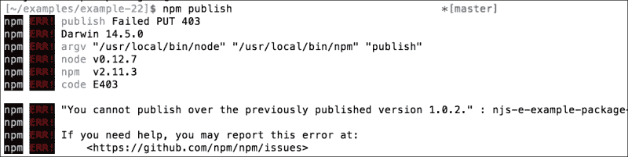

# 第八章：创建和部署包

现在我们已经拥有了创建 Node.js 应用程序和服务器所需的所有组件，我们现在将更多地关注分享我们的模块并为生态系统做出贡献。

所有 npm 上的包都是由社区中的某个人上传、维护和贡献的，所以让我们看看我们如何自己做同样的事情。

# 创建 npm 包

我们可以从以下步骤开始：

首先我们需要创建一个用户：

```js
[~]$ npm add user 
Username: <username>
Password:
Email: (this IS public) <email>

```

一旦我们有了一个用户，我们就为 npm 打开了大门。

现在，让我们创建一个包：

```js
[~/examples/example-22]$ npm init
{
 "name": "njs-e-example-package",
 "version": "1.0.0",
 "description": "",
 "main": "index.js",
 "scripts": {
 "test": "echo \"Error: no test specified\" && exit 1"
 },
 "author": "",
 "license": "ISC"
}

```

要发布这个包，我们只需要运行`npm publish`：

```js
[~/examples/example-22]$ npm publish
+ njs-e-example-package@1.0.0

```

您可以看到我们已经成功发布了我们的包，您可以查看我发布的包：

[`www.npmjs.com/package/njs-e-example-package`](https://www.npmjs.com/package/njs-e-example-package)

为了发布它，您将不得不给您的包取一个别的名字；否则，我们将会有冲突。

现在我们可以运行以下命令：

```js
[~/examples/example-21]$ npm install njs-e-example-package
njs-e-example-package@1.0.0 node_modules/njs-e-example-package

```

然后我们就会有这个包！这不是很酷吗？

如果我们再次尝试发布，将会出现错误，因为版本`1.0.2`已经发布，如下截图所示：



要增加我们的包版本，我们只需要执行：

```js
[~/examples/example-22]$ npm version patch
v1.0.1

```

现在我们可以再次发布：

```js
[~/examples/example-22]$ npm publish
+ njs-e-example-package@1.0.1

```

您可以转到 npm 上的包页面，您会看到版本号和发布计数已经更新。

Node.js 中的版本控制遵循`semver`模式，由主要、次要和补丁版本组成。当增加补丁版本时，这意味着 API 保持不变，但在幕后修复了一些东西。如果增加了次要版本，这意味着发生了不破坏 API 的更改，例如添加了一个方法。如果更新了主要版本，这意味着发生了破坏 API 的更改；例如删除了一个方法或方法签名发生了变化。

有时，项目中有一些你不希望被其他人推出去的东西。这可能是原始源代码、一些证书，或者一些开发密钥。就像使用`git`一样，我们有一个叫做`.npmignore`的忽略文件。

默认情况下，如果没有`.npmignore`但有`.gitignore`，npm 将忽略`.gitignore`文件匹配的内容。如果您不喜欢这种行为，那么您可以创建一个空的`.npmignore`文件。

`.npmignore`文件遵循与`.gitignore`相同的规则，规则如下：

+   空行或以`#`开头的行将被忽略

+   标准的 glob 模式有效

+   您可以用斜杠`/`结束模式以指定目录

+   您可以通过在模式前加上感叹号`!`来否定一个模式

例如，如果我们有一个包含密钥的证书目录：

```js
[~/examples/example-22]$ mkdir certificates
[~/examples/example-22]$ touch certifticates/key.key

```

我们可能不希望这被发布，所以在我们的忽略文件中我们将有：

```js
certificates/

```

我们也不希望有任何我们搁置的`key`文件，所以我们也添加了这个：

```js
*.key

```

现在，让我们发布：

```js
[~/examples/example-22]$ npm version patch
v1.0.2
[~/examples/example-22]$ npm publish
+ njs-e-example-package@1.0.2

```

现在，让我们安装我们的包：

```js
[~/examples/example-23]$ npm install njs-e-example-package@1.0.2

```

现在，当我们列出目录中的内容时，我们不会看到所有的证书都被传播出去：

```js
[~/examples/example-23]$ ls node_modules/njs-e-example-package
package.json

```

这很好，但是如果我们想保护整个包而不仅仅是一些证书呢？

我们只需要在`package.json`文件中将`private`设置为`true`，这样当我们运行`npm publish`时，它将阻止 npm 发布模块：

我们的`package.json`应该看起来像这样：

```js
{
  "name": "example-23",
  "version": "1.0.0",
  "description": "",
  "main": "index.js",
  "scripts": {
    "test": "echo \"Error: no test specified\" && exit 1"
  },
  "author": "",
  "license": "UNLICENSED",
  "dependencies": {
    "njs-e-example-package": "¹.0.2"
  },
  "private": true
}
```

现在，当我们运行`npm publish`时：

```js
[~/examples/example-23]$ npm publish
npm ERR! This package has been marked as private

```

太棒了，这正是我们想要看到的。

# 总结

看起来我们离准备好所有关于 Node.js 的事情都越来越近了。我们现在知道如何设置、调试、开发和分发我们的软件。

在下一章中，我们将介绍我们需要了解的另一个概念：单元测试。

为 Bentham Chang 准备，Safari ID 为 bentham@gmail.com 用户编号：2843974 © 2015 Safari Books Online，LLC。此下载文件仅供个人使用，并受到服务条款的约束。任何其他用途均需版权所有者的事先书面同意。未经授权的使用、复制和/或分发严格禁止并违反适用法律。保留所有权利。
