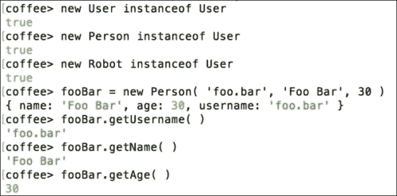

# 第十章：使用不仅仅是 JavaScript

在整本书中，我们只使用了 JavaScript。嗯，它不就是叫 Node.js 吗？

但这并不意味着我们不能使用其他语言。只要它编译成 JavaScript，我们就可以使用，只要它编译成 JavaScript，我们就可以使用。

这里有一个常见语言的大列表可用：[`github.com/jashkenas/coffeescript/wiki/list-of-languages-that-compile-to-JS`](https://github.com/jashkenas/coffeescript/wiki/list-of-languages-that-compile-to-JS)。

如果您错过了强类型语言，或者只是想要稍微不同的语法，那么肯定会有一个选项适合您。

一些常见的语言包括`CoffeeScript`和`TypeScript`，它们与 Node.js 一起工作得很好，因为它们都编译成 JavaScript。在本章中，我们将介绍`CoffeeScript`的用法。`TypeScript`的用法类似；然而，语法遵循与 C#和 Java 类似的路径。

# CoffeeScript

安装和开始使用其他语言非常简单。让我们来看看 CoffeeScript：

我们需要全局安装 CoffeeScript，这样我们就可以使用类似`node`的命令：

```js
[~] npm install -g coffee-script

```

现在我们可以运行`coffee`：

```js
[~] coffee
>

```

语法与 JavaScript 非常相似：

```js
[~] coffee
> 1 + 1
2
> console.log( 'Hello' )
Hello

```

我们使用`.coffee`而不是`.js`扩展名。

首先，我们将创建一个 CoffeeScript 文件：

```js
/* index.coffee */
console.log( 'Hello CoffeeScript!' )
```

然后要运行它，我们只需要使用`coffee`命令，类似于`node`命令：

```js
[~/examples/example-25] coffee index.coffee
Hello CoffeScript!

```

要将我们的`.coffee`文件编译成`.js`，我们可以使用`-c`。编译后，我们可以直接在 Node.js 中运行它们：

```js
[~/examples/example-25] coffee -c index.coffee
[~/examples/example-25] node index.js
Hello CoffeeScript!

```

如果我们有一堆 CoffeeScript 想要一次性编译成 JavaScript，我们可以使用`coffee -c -o ./lib` .`/src`。这将获取`./src`中的所有`.coffee`文件，将它们编译成`.js`，然后输出到`./lib`。

您需要为其他用户编译所有文件，以便他们可以在他们的 JavaScript 代码旁边使用我们的 CoffeeScript 代码。另一种选择是将 CoffeeScript 作为依赖项并将注册文件`require`到您的应用程序中，如下所示：

```js
/* index.js */
require( 'coffee-script/register' );
require( './other.coffee' );
```

如果您不希望编译您的 CoffeeScript，或者您正在使用需要 JavaScript 文件的工具，如 Gulp 或 Grunt，您可能需要这样做。

### 提示

要查看 JavaScript 和 CoffeeScript 之间的等价物，您可以使用该网站[`js2.coffee/`](http://js2.coffee/)，它提供了一种简单的比较两者的方法。

CoffeeScript 基本上就是 JavaScript；然而，它的目标是可读性和简单性。简单性也意味着它试图限制 JavaScript 的不好的部分，并暴露出好的部分。

对于初学者（和专家）来说，使用 CoffeeScript 通常是很好的，因为它使用英语而不是计算机语言。例如，我们可以使用英语单词`is`而不是`===`（三个等号）来检查两个值是否相等。因此，`x === y`变成了`x is y`，这意味着在阅读时不需要翻译。

除了`is`之外，还有其他关键字，如`isnt`，`not`，`or`，`and`，`yes`和`no`。

使用这些关键字而不是符号操作符可以为读者和程序员提供清晰度。CoffeeScript 的格式与 Python 类似，函数和代码块的声明方式；缩进表示块的结束和开始。

# 代码块和函数

在 JavaScript 中，您通常会使用大括号将块组合在一起，如下例所示：

```js
if ( true ) 
{
  console.log( 'It was true!' ) 
}
```

在 CoffeeScript 中，您将省略所有大括号，实际上所有括号都被省略了：

```js
if true 
  console.log( 'It was true!' )
```

在声明函数时也是如此，注意我们使用的是*箭头*而不是关键字`function`。参数列表只在需要命名参数时才需要：

```js
func = ->
  console.log( 'I executed' )
```

CoffeeScript 尝试尽可能多地假设，同时仍然给程序员足够的控制。

您可能还注意到，当声明函数时，我没有使用`var`关键字。这是因为它是隐式声明的，您可以通过将上述代码编译成 JavaScript 来看到。

```js
var func;
func = function()
{
  return console.log('I executed');
};
```

你可以看到在这个编译后的代码中，函数中的最后一个语句是返回值，这意味着我们不需要声明返回值，只需假设最后一个值被返回。这使得创建单行函数非常简单，例如：

```js
add = ( a, b ) -> a + b 
```

与 JavaScript 不同，你可以为函数提供默认参数，这可以与 C#进行比较；然而，它不仅限于常量，因为它本质上执行函数内的语句：

```js
keys = { }
func = ( key, date = new Date ) ->
  keys[ key ] = date
```

你可以通过编译上面的函数来看到这一点：

```js
var func, keys;
keys = {};
func = function(key, date) 
{
  if (date == null)
  {
    date = new Date();
  }
  return keys[key] = date;
};
```

基本上，CoffeeScript 所做的就是检查值是否为`null`或`undefined`。

# 存在运算符

你可以使用存在运算符来检查一个值是否为`null`或`undefined`，该运算符用于检查值是否*存在*。通过在变量后使用问号符号来表示；如果值存在则语句为真，否则为假。

在表达式中使用这个：

```js
date = null 
if not date?
  date = new Date( )
console.log( date )
```

你也可以将其作为简写运算符使用，例如：

```js
date ?= new Date( )
console.log( date ) 
```

上面两个代码示例的行为完全相同，实际上编译后会得到相同的代码：

```js
var date;
date = null;
if (date == null) 
{
  date = new Date();
}
```

你也可以使用存在运算符来确保在访问其属性之前存在一个值。例如，如果你想从日期中获取时间，或者如果日期不存在则获取`-1`：

```js
getTime = ( date = null ) -> date?.getTime( ) ? -1 
```

给`date`赋予`null`值表明我们不介意是否传递了值：

当一个对象不存在且使用了运算符时，返回的值是`undefined`，这意味着我们可以再次使用相同的运算符来返回一个默认值。

# 对象和数组

除了 CoffeeScript 试图做出的所有假设，它确实试图消除 JavaScript 中所有不必要的语法。另一个例子是在定义数组和对象时，使用新行声明一个新项。例如，通常你会这样定义一个数组：

```js
array = [
  1,
  2,
  3
]
```

这仍然有效；然而，在 CoffeeScript 中你可以省略分隔每个项的逗号：

```js
array = [
  1
  2
  3
]
```

你也可以将这两种风格混合在一起：

```js
array = [
  'a', 'b', 'c'
  1, 2, 3
  true, false
]
```

你也可以对对象做同样的操作，比如：

```js
object = {
  foo: 1
  bar: 2
}
```

对于对象，你甚至可以省略花括号，使用缩进来显示对象中的差异：

```js
object = 
  foo: 1
  bar: 2
  foobar: 
    another: 3
    key: 4
```

在 CoffeeScript 中循环数组，你只需要使用`for…in`循环，例如：

```js
for value, index in array
  console.log( value, index ) 
  continue if typeof value is 'string'
  console.log( 'Value was not a string' )
```

如果你不想使用项目的索引，你可以简单地不要求它：

```js
for value in array
  console.log( value )
```

与 JavaScript 循环一样，你可以使用`break`和`continue`来控制流程。

在 CoffeeScript 中循环对象可以使用`for…of`循环，这与 JavaScript 提供的`for…of`循环有些不同：

```js
for key, value of object 
  console.log( key, value ) 
```

与`for…in`循环一样，如果你不想要值，可以排除它：

```js
for key of object 
  console.log( key )
```

对于两种类型的循环，命名是无关紧要的：

```js
for key, value of object 
    # Note that this will let dates and arrays through ( etc )
    continue unless value instanceof Object 
    for nestedKey, nestedValue of value
      console.log(nestedKey, nestedValue )
```

# 类

与 JavaScript 不同，CoffeeScript 提供了一种自然的方式来声明类和继承。

要在 JavaScript 中定义一个类，你需要先声明一个函数：

```js
function User( username ) {
  this.username = username;
}
```

然后你会声明`prototype`方法：

```js
User.prototype.getUsername = function( ) {
  return this.username;
}
```

如果你有一个`static`方法，你可以在函数上定义它，而不是在原型上：

```js
User.createUser = function( username ) {
  return new User( username );
}
```

在 CoffeeScript 中，你可以使用`class`关键字并给类命名。然后你可以声明构造函数、静态方法和实例（原型）方法：

```js
class User
  @createUser: ( username ) ->
    return new User( username )

  constructor: ( username ) ->
    this.username = username
  getUsername: ->
    return this.username
```

通常，你会将所有的`static`方法放在构造函数上面，这样它们就与实例方法分开了。这避免了混淆，你可能已经注意到我用`@`前缀声明了静态方法`createUser`，这是在 CoffeeScript 中定义静态方法的方式。然而，你也可以使用传统的 JavaScript 方法`User.createUser = ->`，两种方式都可以在这里工作。

当实例被创建或*构造*时运行的代码被称为构造函数。这与许多其他语言使用的术语相同，所以应该很熟悉。构造函数本质上就是一个函数。

所有实例方法的声明方式与对象的属性类似。

随着类的出现，还有另一个符号，即`@`符号。当在实例上使用时，您可以使用它来引用`this`关键字。例如，`getUsername`方法可以编写为：

```js
getUsername: ->
  return @username
```

或者，如果我们想要删除返回语句并将其变成一行：

```js
getUsername: -> @username 
```

`@`符号也可以在参数列表中使用，以声明我们希望将实例属性设置为传递的值。例如，如果我们有一个`setUsername`方法，我们可以这样做：

```js
setUsername: ( username ) ->
  @username = username
```

或者我们可以这样做：

```js
setUsername: ( @username ) ->
```

这两种方法将编译为相同的 JavaScript 代码。

考虑到我们可以在参数列表中使用`@`符号，我们可以重构我们的构造函数为：

```js
constructor: ( @username ) ->
```

使用 CoffeeScript 类的另一个优势是我们可以定义继承。要做到这一点，我们所需要做的就是使用`extends`关键字，这与其他语言类似。

在这些示例中，我们希望有两个*类*，`Person`和`Robot`，它们扩展了基本的`User`类。

对于我们的人，我们希望能够为他们提供一个名字和年龄，以及`User`类所需的用户名。

首先，我们需要声明我们的类：

```js
class Person extends User
```

然后声明我们的`constructor`。在我们的`constructor`中，我们将调用`super`函数，这将执行父类`User`的构造函数，并且我们希望将用户名传递给它，如下所示：

```js
  constructor: ( username, @name, @age ) ->
    super( username )
```

然后我们添加两个方法，`getName`和`getAge`：

```js
  getName: -> @name
  getAge: -> @age
```

接下来，我们将对`Robot`做同样的事情，只是这次我们只需要一个`username`和`@usage`：

```js
class Robot extends User
  constructor: ( username, @usage ) –>
    super( username )
  getUsage: -> @usage 
```

现在我们可以创建我们的类的实例并进行比较，如下所示：



# 总结

CoffeeScript 试图对您的代码进行*良好*的假设。这有助于消除 JavaScript 开发人员遇到的一些问题。例如，`==`和`===`之间的区别。

您可以在[`coffeescript.org/`](http://coffeescript.org/)了解有关 CoffeeScript 特定语法的更多信息。

在本章中，我们已经介绍了利用另一种语言。这可以帮助初学者减轻对 JavaScript 风格或语法的困扰。对于习惯于更多语言特性的人来说，这是一个很大的优势，因为它有助于消除人们通常遇到的陷阱。

为 Bentham Chang 准备，Safari ID 为 bentham@gmail.com 用户编号：2843974 © 2015 Safari Books Online，LLC。此下载文件仅供个人使用，并受到服务条款的约束。任何其他用途均需版权所有者的事先书面同意。未经授权的使用、复制和/或分发严格禁止并违反适用法律。保留所有权利。
