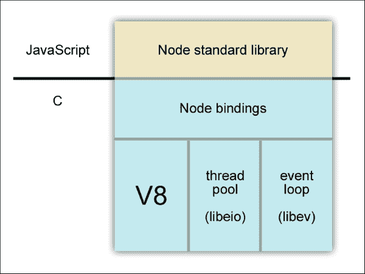
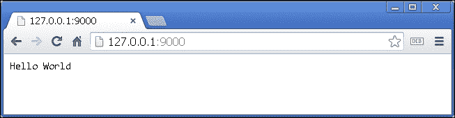
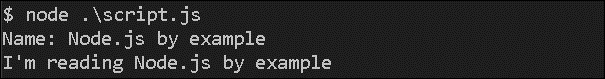
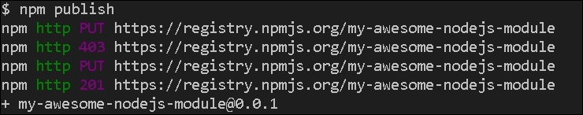
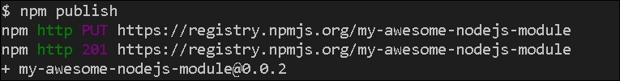
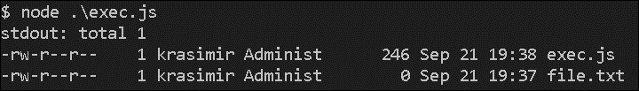

# 第一章：Node.js 基础知识

Node.js 是当今最流行的 JavaScript 驱动技术之一。它是由 Ryan Dahl 于 2009 年创建的，自那时起，该框架已经发展成为一个完善的生态系统。它的包管理器中充满了有用的模块，全世界的开发人员已经开始在他们的生产环境中使用 Node.js。在本章中，我们将学习以下内容：

+   Node.js 构建模块

+   环境的主要功能

+   Node.js 的包管理

# 理解 Node.js 架构

在过去，Ryan 对开发网络应用程序很感兴趣。他发现大多数高性能服务器遵循类似的概念。它们的架构类似于事件循环，并且它们使用非阻塞的输入/输出操作。这些操作允许其他处理活动在进行中的任务完成之前继续进行。如果我们想处理成千上万个同时的请求，这些特征是非常重要的。

大多数用 Java 或 C 编写的服务器使用多线程。它们在新线程中处理每个请求。Ryan 决定尝试一些不同的东西——单线程架构。换句话说，服务器收到的所有请求都由单个线程处理。这可能听起来像一个不可扩展的解决方案，但 Node.js 绝对是可扩展的。我们只需运行不同的 Node.js 进程，并使用一个负载均衡器来在它们之间分发请求。

Ryan 需要一个基于事件循环的快速工作的东西。正如他在其中一次演讲中指出的，像谷歌、苹果和微软这样的大公司投入了大量时间开发高性能的 JavaScript 引擎。它们每年都变得越来越快。在那里，事件循环架构得到了实现。JavaScript 近年来变得非常流行。社区和成千上万的开发人员准备贡献，让 Ryan 考虑使用 JavaScript。这是 Node.js 架构的图表：



总的来说，Node.js 由三部分组成：

+   V8 是谷歌的 JavaScript 引擎，用于 Chrome 浏览器（[`developers.google.com/v8/`](https://developers.google.com/v8/)）

+   线程池是处理文件输入/输出操作的部分。所有阻塞系统调用都在这里执行（[`software.schmorp.de/pkg/libeio.html`](http://software.schmorp.de/pkg/libeio.html)）

+   事件循环库（[`software.schmorp.de/pkg/libev.html`](http://software.schmorp.de/pkg/libev.html)）

在这三个模块之上，我们有几个绑定，它们公开了低级接口。Node.js 的其余部分都是用 JavaScript 编写的。几乎所有我们在文档中看到的内置模块的 API 都是用 JavaScript 编写的。

# 安装 Node.js

安装 Node.js 的一种快速简便的方法是访问[`nodejs.org/download/`](https://nodejs.org/download/)并下载适合您操作系统的安装程序。对于 OS X 和 Windows 用户，安装程序提供了一个漂亮、易于使用的界面。对于使用 Linux 作为操作系统的开发人员，Node.js 可以在 APT 软件包管理器中找到。以下命令将设置 Node.js 和**Node Package Manager**（**NPM**）：

```js
sudo apt-get update
sudo apt-get install nodejs
sudo apt-get install npm

```

## 运行 Node.js 服务器

Node.js 是一个命令行工具。安装后，`node`命令将在我们的终端上可用。`node`命令接受几个参数，但最重要的是包含我们的 JavaScript 的文件。让我们创建一个名为`server.js`的文件，并将以下代码放入其中：

```js
var http = require('http');
http.createServer(function (req, res) {
   res.writeHead(200, {'Content-Type': 'text/plain'});
   res.end('Hello World\n');
}).listen(9000, '127.0.0.1');
console.log('Server running at http://127.0.0.1:9000/');
```

### 提示

**下载示例代码**

您可以从[`www.packtpub.com`](http://www.packtpub.com)的帐户中下载您购买的所有 Packt Publishing 图书的示例代码文件。如果您在其他地方购买了这本书，您可以访问[`www.packtpub.com/support`](http://www.packtpub.com/support)并注册，文件将直接通过电子邮件发送给您。

如果你在控制台中运行`node ./server.js`，你将拥有 Node.js 服务器在运行。它在本地（`127.0.0.1`）的端口`9000`上监听传入的请求。前面代码的第一行需要内置的`http`模块。在 Node.js 中，我们有`require`全局函数，它提供了使用外部模块的机制。我们将看到如何定义我们自己的模块。之后，脚本继续使用`http`模块上的`createServer`和`listen`方法。在这种情况下，模块的 API 被设计成我们可以像在 jQuery 中那样链接这两种方法。

第一个（`createServer`）接受一个函数，也称为回调，每当有新的请求到达服务器时就会调用它。第二个使服务器监听。

在浏览器中得到的结果如下：



# 定义和使用模块

作为一种语言，JavaScript 没有定义真正的类的机制。事实上，JavaScript 中的一切都是对象。我们通常从一个对象继承属性和函数到另一个对象。幸运的是，Node.js 采用了**CommonJS**定义的概念——这是一个为 JavaScript 指定生态系统的项目。

我们将逻辑封装在模块中。每个模块都在自己的文件中定义。让我们用一个简单的例子来说明一切是如何工作的。假设我们有一个代表这本书的模块，并将其保存在一个名为`book.js`的文件中：

```js
// book.js
exports.name = 'Node.js by example';
exports.read = function() {
   console.log('I am reading ' + exports.name);
}
```

我们定义了一个公共属性和一个公共函数。现在，我们将使用`require`来访问它们：

```js
// script.js
var book = require('./book.js');
console.log('Name: ' + book.name);
book.read();
```

现在我们将创建另一个名为`script.js`的文件。为了测试我们的代码，我们将运行`node ./script.js`。终端中的结果如下：



除了`exports`，我们还有`module.exports`可用。两者之间有区别。看看下面的伪代码。它说明了 Node.js 如何构建我们的模块：

```js
var module = { exports: {} };
var exports = module.exports;
// our code
return module.exports;
```

因此，最终返回`module.exports`，这就是`require`产生的。我们应该小心，因为如果在某个时刻我们直接应用一个值到`exports`或`module.exports`，我们可能得不到我们需要的东西。就像在下面的片段末尾，我们将一个函数设置为一个值，这个函数暴露给外部世界：

```js
exports.name = 'Node.js by example';
exports.read = function() {
   console.log('Iam reading ' + exports.name);
}
module.exports = function() {  ... }
```

在这种情况下，我们无法访问`.name`和`.read`。如果我们再次尝试执行`node ./script.js`，我们将得到以下输出：


为了避免这种问题，我们应该坚持两种选项之一——`exports`或`module.exports`——但要确保我们没有两者都有。

我们还应该记住，默认情况下，`require`会缓存返回的对象。因此，如果我们需要两个不同的实例，我们应该导出一个函数。这是一个提供 API 方法来评价书籍并且不正常工作的`book`类的版本：

```js
// book.js
var ratePoints = 0;
exports.rate = function(points) {
   ratePoints = points;
}
exports.getPoints = function() {
   return ratePoints;
}
```

让我们创建两个实例，并用不同的`points`值对书籍进行评分：

```js
// script.js
var bookA = require('./book.js');
var bookB = require('./book.js');
bookA.rate(10);
bookB.rate(20);
console.log(bookA.getPoints(), bookB.getPoints());
```

逻辑上的响应应该是`10 20`，但我们得到了`20 20`。这就是为什么导出一个每次产生不同对象的函数是一个常见的做法：

```js
// book.js
module.exports = function() {
   var ratePoints = 0;
   return {
      rate: function(points) {
         ratePoints = points;
      },
      getPoints: function() {
         return ratePoints;
      }
   }
}
```

现在，我们还应该有`require('./book.js')()`，因为`require`返回的是一个函数，而不再是一个对象。

# 管理和分发包

一旦我们理解了`require`和`exports`的概念，我们应该开始考虑将我们的逻辑分组到构建块中。在 Node.js 世界中，这些块被称为**模块**（或**包**）。Node.js 受欢迎的原因之一就是其包管理。

Node.js 通常带有两个可执行文件—`node`和`npm`。NPM 是一个命令行工具，用于下载和上传 Node.js 包。官方网站[`npmjs.org/`](https://npmjs.org/)充当中央注册表。当我们通过`npm`命令创建一个包时，我们将其存储在那里，以便其他开发人员可以使用它。

## 创建模块

每个模块都应该存在于自己的目录中，该目录还包含一个名为`package.json`的元数据文件。在这个文件中，我们至少设置了两个属性—`name`和`version`：

```js
{
   "name": "my-awesome-nodejs-module",
   "version": "0.0.1"
}
```

我们可以在同一个目录中放置任何我们喜欢的代码。一旦我们将模块发布到 NPM 注册表并有人安装它，他/她将得到相同的文件。例如，让我们添加一个`index.js`文件，这样我们的包中就有两个文件了：

```js
// index.js
console.log('Hello, this is my awesome Node.js module!');
```

我们的模块只做一件事—在控制台上显示一个简单的消息。现在，要上传模块，我们需要导航到包含`package.json`文件的目录，并执行`npm publish`。这是我们应该看到的结果：



我们准备好了。现在我们的小模块已经列在 Node.js 包管理器的网站上，每个人都可以下载它。

## 使用模块

总的来说，有三种使用已创建的模块的方法。所有三种方法都涉及包管理器：

+   我们可以手动安装特定的模块。假设我们有一个名为`project`的文件夹。我们打开文件夹并运行以下命令：

```js
npm install my-awesome-nodejs-module

```

管理器会自动下载模块的最新版本，并将其放在一个名为`node_modules`的文件夹中。如果我们想要使用它，就不需要引用确切的路径。默认情况下，Node.js 在需要时会检查`node_modules`文件夹。因此，只需`require('my-awesome-nodejs-module')`就足够了。

+   全局安装模块是一种常见的做法，特别是当涉及到使用 Node.js 制作命令行工具时。它已经成为一种易于使用的技术来开发这样的工具。我们创建的小模块并不是作为一个命令行程序，但我们仍然可以通过运行以下代码全局安装它：

```js
npm install my-awesome-nodejs-module -g

```

注意最后的`-g`标志。这是告诉管理器我们希望这个模块是全局的方式。当进程完成时，我们就没有了`node_modules`目录。`my-awesome-nodejs-module`文件夹存储在系统的另一个位置。为了能够使用它，我们必须在`package.json`中添加另一个属性，但我们将在下一节中更多地讨论这个问题。

+   解决依赖关系是 Node.js 包管理器的关键特性之一。每个模块可以有任意多的依赖关系。这些依赖关系只是已上传到注册表的其他 Node.js 模块。我们所要做的就是在`package.json`文件中列出所需的包：

```js
{
    "name": "another-module", 
    "version": "0.0.1", 
    "dependencies": {
        "my-awesome-nodejs-module": "0.0.1"   
    }
}
```

现在我们不需要明确指定模块，只需执行`npm install`来安装我们的依赖。管理器会读取`package.json`文件，并再次将我们的模块保存在`node_modules`目录中。使用这种技术是很好的，因为我们可以一次添加多个依赖并一次性安装它们。这也使得我们的模块可传输和自我记录。无需向其他程序员解释我们的模块由什么组成。

## 更新我们的模块

让我们将我们的模块转换成一个命令行工具。一旦我们这样做，用户就可以在他们的终端中使用`my-awesome-nodejs-module`命令。我们需要在`package.json`文件中做两个更改：

```js
{
   "name": "my-awesome-nodejs-module",
   "version": "0.0.2",
   "bin": "index.js"
}
```

添加了一个新的`bin`属性。它指向我们应用程序的入口点。我们有一个非常简单的例子，只有一个文件—`index.js`。

我们必须进行的另一个更改是更新`version`属性。在 Node.js 中，模块的版本起着重要作用。如果回顾一下，我们会发现在`package.json`文件中描述依赖关系时，我们指出了确切的版本。这确保了在将来，我们将获得具有相同 API 的相同模块。`version`属性中的每个数字都有意义。包管理器使用**语义化版本 2.0.0**（[`semver.org/`](http://semver.org/)）。其格式为*MAJOR.MINOR.PATCH*。因此，作为开发人员，我们应该递增以下内容：

+   如果我们进行不兼容的 API 更改，则为 MAJOR 号

+   如果我们以向后兼容的方式添加新功能/特性，则为 MINOR 号

+   如果我们有错误修复，则为 PATCH 号

有时，我们可能会看到版本号如`2.12.*`。这意味着开发人员有兴趣使用确切的 MAJOR 和 MINOR 版本，但他/她同意将来可能会有错误修复。也可以使用值如`>=1.2.7`来匹配任何等于或大于的版本，例如`1.2.7`，`1.2.8`或`2.5.3`。

我们更新了`package.json`文件。下一步是将更改发送到注册表。这可以在包含 JSON 文件的目录中再次使用`npm publish`来完成。结果将是类似的。我们将在屏幕上看到新的**0.0.2**版本号：



在此之后，我们可以运行`npm install my-awesome-nodejs-module -g`，新版本的模块将安装在我们的机器上。不同之处在于现在我们有`my-awesome-nodejs-module`命令可用，如果运行它，它会显示在`index.js`文件中编写的消息：


# 介绍内置模块

Node.js 被认为是一种可以用来编写后端应用程序的技术。因此，我们需要执行各种任务。幸运的是，我们可以使用一堆有用的内置模块。

## 使用 HTTP 模块创建服务器

我们已经使用了 HTTP 模块。这可能是 Web 开发中最重要的模块，因为它启动一个在特定端口上监听的服务器：

```js
var http = require('http');
http.createServer(function (req, res) {
   res.writeHead(200, {'Content-Type': 'text/plain'});
   res.end('Hello World\n');
}).listen(9000, '127.0.0.1');
console.log('Server running at http://127.0.0.1:9000/');
```

我们有一个`createServer`方法，返回一个新的 web 服务器对象。在大多数情况下，我们运行`listen`方法。如果需要，有`close`，它可以停止服务器接受新连接。我们传递的回调函数总是接受`request`（`req`）和`response`（`res`）对象。我们可以使用第一个来检索有关传入请求的信息，例如`GET`或`POST`参数。

## 读取和写入文件

负责读写过程的模块称为`fs`（它源自**文件系统**）。以下是一个简单的例子，说明如何将数据写入文件：

```js
var fs = require('fs');
fs.writeFile('data.txt', 'Hello world!', function (err) {
   if(err) { throw err; }
   console.log('It is saved!');
});
```

大多数 API 函数都有同步版本。前面的脚本可以用`writeFileSync`编写，如下所示：

```js
fs.writeFileSync('data.txt', 'Hello world!');
```

然而，在此模块中使用函数的同步版本会阻塞事件循环。这意味着在操作文件系统时，我们的 JavaScript 代码会被暂停。因此，在 Node 中，尽可能使用方法的异步版本是最佳实践。

文件的读取几乎是相同的。我们应该以以下方式使用`readFile`方法：

```js
fs.readFile('data.txt', function(err, data) {
   if (err) throw err;
   console.log(data.toString());
});
```

## 使用事件

观察者设计模式在 JavaScript 世界中被广泛使用。这是我们系统中的对象订阅其他对象发生的变化。Node.js 有一个内置模块来管理事件。这里是一个简单的例子：

```js
var events = require('events');
var eventEmitter = new events.EventEmitter();
var somethingHappen = function() {
   console.log('Something happen!');
}
eventEmitter
.on('something-happen', somethingHappen)
.emit('something-happen');
```

`eventEmitter`对象是我们订阅的对象。我们使用`on`方法来实现这一点。`emit`函数触发事件，执行`somethingHappen`处理程序。

`events`模块提供了必要的功能，但我们需要在自己的类中使用它。让我们从上一节的书籍想法中获取并使其与事件一起工作。一旦有人对书进行评分，我们将以以下方式分派事件：

```js
// book.js
var util = require("util");
var events = require("events");
var Class = function() { };
util.inherits(Class, events.EventEmitter);
Class.prototype.ratePoints = 0;
Class.prototype.rate = function(points) {
   ratePoints = points;
   this.emit('rated');
};
Class.prototype.getPoints = function() {
   return ratePoints;
}
module.exports = Class;
```

我们想要继承`EventEmitter`对象的行为。在 Node.js 中实现这一点的最简单方法是使用实用程序模块（`util`）及其`inherits`方法。定义的类可以像这样使用：

```js
var BookClass = require('./book.js');
var book = new BookClass();
book.on('rated', function() {
   console.log('Rated with ' + book.getPoints());
});
book.rate(10);
```

我们再次使用`on`方法订阅`rated`事件。`book`类在我们设置了分数后显示了这条消息。然后终端显示了**Rated with 10**文本。

## 管理子进程

Node.js 有一些我们无法做到的事情。我们需要使用外部程序来完成相同的任务。好消息是，我们可以在 Node.js 脚本中执行 shell 命令。例如，假设我们想要列出当前目录中的文件。文件系统 API 确实提供了相应的方法，但如果我们能够获得`ls`命令的输出就更好了：

```js
// exec.js
var exec = require('child_process').exec;
exec('ls -l', function(error, stdout, stderr) {
    console.log('stdout: ' + stdout);
    console.log('stderr: ' + stderr);
    if (error !== null) {
        console.log('exec error: ' + error);
    }
});
```

我们使用的模块叫做`child_process`。它的`exec`方法接受所需的命令作为字符串和一个回调。`stdout`项是命令的输出。如果我们想处理错误（如果有的话），我们可以使用`error`对象或`stderr`缓冲区数据。前面的代码产生了以下截图：



除了`exec`方法，我们还有`spawn`。它有点不同，但非常有趣。想象一下，我们有一个命令不仅完成了它的工作，还输出了结果。例如，`git push`可能需要几秒钟，可能会不断向控制台发送消息。在这种情况下，`spawn`是一个很好的选择，因为我们可以访问一个流：

```js
var spawn = require('child_process').spawn;
var command = spawn('git', ['push', 'origin', 'master']);
command.stdout.on('data', function (data) {
   console.log('stdout: ' + data);
});
command.stderr.on('data', function (data) {
   console.log('stderr: ' + data);
});
command.on('close', function (code) {
   console.log('child process exited with code ' + code);
});
```

这里，`stdout`和`stderr`都是流。它们会分发事件，如果我们订阅了这些事件，我们将得到命令的确切输出。在前面的例子中，我们运行了`git push origin master`并将完整的命令响应发送到控制台。

# 摘要

现在很多公司都在使用 Node.js。这证明它已经足够成熟，可以在生产环境中使用。在本章中，我们了解了这项技术的基本原理。我们涵盖了一些常用的情况。在下一章中，我们将从我们示例应用程序的基本架构开始。这不是一个简单的应用程序。我们将构建我们自己的社交网络。
