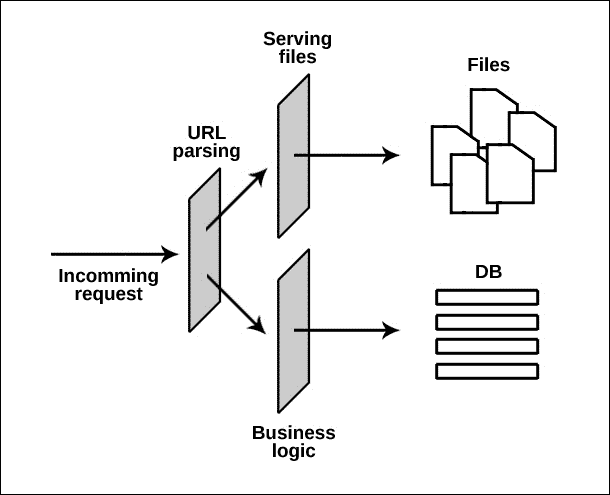
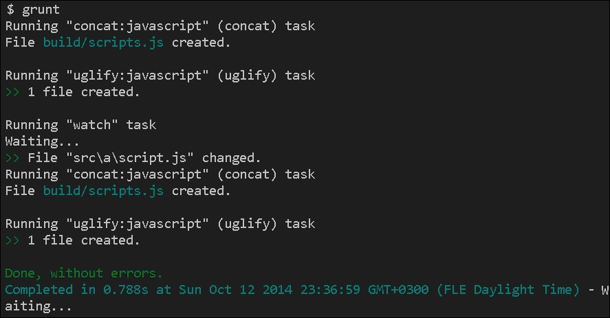
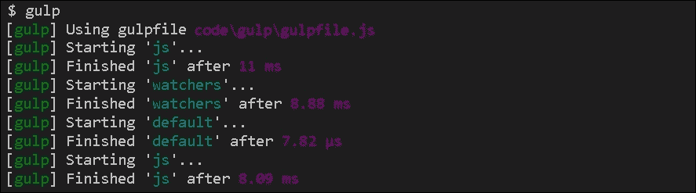
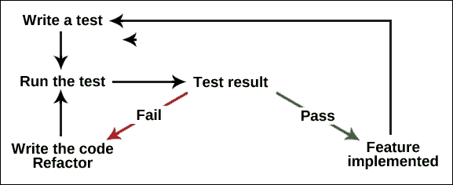
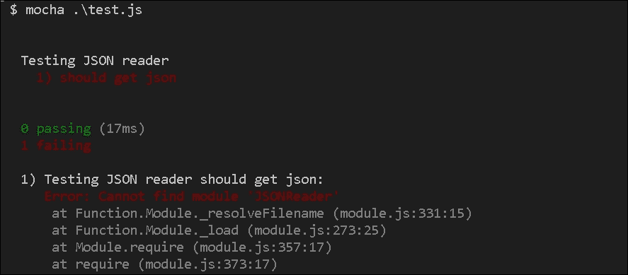
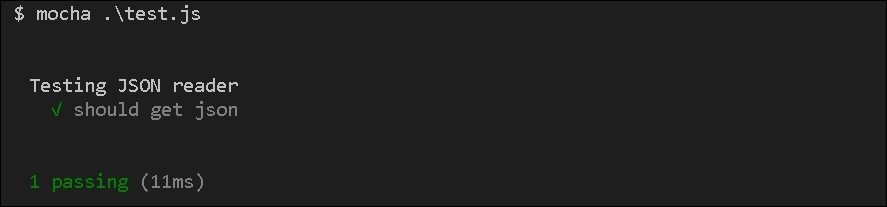
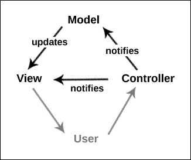

# 第二章：设计项目

软件开发是一个复杂的过程。我们不能只是开始编写一些代码，然后期望能够达到我们的目标。我们需要计划和定义我们应用程序的基础。换句话说，在你开始实际编写脚本之前，你必须设计项目结构。在本章中，我们将涵盖以下内容：

+   Node.js 应用程序的基本层

+   使用任务运行器和构建系统

+   测试驱动开发

+   模型-视图-控制器模式

+   REST API 概念

# 介绍应用程序的基本层

如果我们计划建造一座房子，我们可能会想要从一个非常好的基础开始。如果建筑的基础不牢固，我们就不能建造第一层和第二层。

然而，对于软件来说，情况有些不同。我们可以在没有良好基础的情况下开始开发代码。我们称之为**蛮力驱动开发**。在这种情况下，我们会一次又一次地生产功能，而实际上并不关心我们代码的质量。结果可能在开始时有效，但从长远来看，它会消耗更多的时间，可能还有金钱。众所周知，软件只是放置在彼此之上的构建块。如果我们程序的下层设计不好，那么整个解决方案都会因此而受到影响。

让我们考虑一下我们的项目——我们想用 Node.js 构建的社交网络。我们从一个简单的代码开始，就像这样：

```js
var http = require('http');
http.createServer(function (req, res) {
   res.writeHead(200, {'Content-Type': 'text/plain'});
   res.end('Hello World\n');
}).listen(1337, '127.0.0.1');
console.log('Server running at http://127.0.0.1:1337/');
```

你可能注意到的第一件事是，你向用户提供了文本，但你可能想要提供文件内容。Node.js 类似于 PHP。然而，有一个根本的区别。PHP 需要一个接受请求并将其传递给 PHP 解释器的服务器。然后，PHP 代码被处理，响应再次由服务器传递给用户。在 Node.js 世界中，我们没有一个单独的外部服务器。Node.js 本身扮演着这个角色。开发人员需要处理传入的请求，并决定如何处理它们。

如果我们拿上面的代码并假设我们有一个包含基本 HTML 布局的`page.html`和一个包含 CSS 样式的`styles.css`文件，我们的下一步将是这样的（查看书中代码示例的`planning`文件夹）：

```js
var http = require('http');
var fs = require('fs');
http.createServer(function (req, res) {
   var content = '';
   var type = '';
   if(req.url === '/') {
      content = fs.readFileSync('./page.html');
      type = 'text/html';
   } else if(req.url === '/styles.css') {
      content = fs.readFileSync('./styles.css');
      type = 'text/css';
   }
   res.writeHead(200, {'Content-Type': type});
   res.end(content + '\n');
}).listen(1337, '127.0.0.1');
console.log('Server running at http://127.0.0.1:1337/');
```

我们将检查传入请求的 URL。如果我们只是打开`http://127.0.0.1:1337/`，我们将收到`page.html`的代码作为响应。如果`page.html`文件中有一个请求`style.css`的`<link>`标签，浏览器也会为此发出请求。URL 不同，但它再次被`if`子句捕获，然后提供适当的内容。

现在这样做还可以，但我们可能需要提供不是两个而是许多文件。我们不想描述所有这些文件。因此，这个过程应该被优化。每个 Node.js 服务器的第一层通常处理路由。它解析请求的 URL 并决定要做什么。如果我们需要传递静态文件，那么我们最终会将处理逻辑放在一个外部模块中，该模块找到文件，读取它们，并以适当的内容类型发送响应。这可以成为我们架构的第二层。

除了交付文件，我们还需要编写一些后端逻辑。这将是第三层。同样，根据 URL，我们将执行与业务逻辑相关的一些操作，如下所示：

```js
var http = require('http');
var fs = require('fs');
http.createServer(function (req, res) {
   var content = '';
   var type = '';
   if(req.url === '/') {
      content = fs.readFileSync('./page.html');
      type = 'text/html';
   } else if(req.url === '/styles.css') {
      content = fs.readFileSync('./styles.css');
      type = 'text/css';
   } else if(req.url === '/api/user/new') {
         // Do actions like
      // reading POST parameters
      // storing the user into the database
      content = '{"success": true}';
      type = 'application/json';
   }
   res.writeHead(200, {'Content-Type': type});
   res.end(content + '\n');
}).listen(1337, '127.0.0.1');
console.log('Server running at http://127.0.0.1:1337/');
```

请注意我们返回了 JSON 数据。因此，我们的 Node.js 服务器现在充当 API。我们将在本章末讨论这一点。

下面的图表显示了我们刚刚谈到的三个层次：



这些将是我们应用程序的主要层。在接下来的章节中，我们将对它们进行处理。但在那之前，让我们看看在达到那一点之前我们还需要做什么其他工作。

# 任务运行器和构建系统

除了运行 Node.js 服务器的实践之外，还有其他与 Web 开发任务相关的最佳实践可以考虑。我们正在构建一个 Web 应用程序。因此，我们有客户端 JavaScript 和 CSS 需要以最佳方式交付。换句话说，为了提高网站的性能，我们需要将所有 JavaScript 合并到一个文件中并进行压缩。对 CSS 样式表也是如此。如果这样做，浏览器将减少对服务器的请求。

Node.js 是一个常见的命令行实用工具，除非你想要运行 Web 服务器。有许多可用于打包和优化资产的模块。很棒的是有任务运行器和构建系统可以帮助你管理这些过程。

## 介绍 Grunt

Grunt 是基于 Node.js 的最流行的任务运行器之一。它可以在包管理器注册表中找到，并且可以通过以下命令安装：

```js
npm install -g grunt-cli

```

一旦我们在终端中运行了这个命令，我们就会得到一个全局的`grunt`命令供我们使用。我们需要在项目的根目录中创建一个`Gruntfile.js`文件，这是我们定义任务的地方。通过任务，我们指的是诸如文件合并和文件压缩等我们想要对特定文件执行的操作。以下是一个简单的`Gruntfile.js`：

```js
module.exports = function(grunt) {
   grunt.initConfig({
      concat: {
         javascript: {
            src: 'src/**/*.js',
            dest: 'build/scripts.js'
         }
      }
   });
   grunt.loadNpmTasks('grunt-contrib-concat');
   grunt.registerTask('default', ['concat']);
}
```

在本书的第一章中，我们看到了如何定义 Node.js 模块。Grunt 所需的配置只是一个简单的模块。我们导出一个函数，该函数接受一个包含运行器所有公共 API 函数的`grunt`对象。在`initConfig`块中，我们放置我们的操作，而使用`registerTask`，我们组合操作和任务。至少应该有一个任务使用名称`default`进行定义。这是如果我们在终端中不传递额外参数时 Grunt 运行的内容。

在前面的例子中还有一个最后使用的函数——`loadNpmTasks`。Grunt 的真正强大之处在于我们有数百个可用的插件。`grunt`命令是一个接口，你可以用它来控制这些插件完成真正的工作。由于它们都在 Node.js 包管理器中注册，我们需要在`package.json`文件中包含它们。对于前面的代码，我们需要以下内容：

```js
{
   "name": "GruntjsTest",
   "version": "0.0.1",
   "description": "GruntjsTest",
   "dependencies": {},
   "devDependencies": {
      "grunt-contrib-concat": "0.3.0"
   }
}
```

让我们继续向我们的 Grunt 设置添加另外两个功能。一旦我们将 JavaScript 合并，我们可能会希望有编译文件的缩小版本；`grunt-contrib-uglify`就是完成这项工作的模块：

```js
module.exports = function(grunt) {
   grunt.initConfig({
      concat: {
         javascript: {
            src: 'src/**/*.js',
            dest: 'build/scripts.js'
         }
      },
      uglify: {
         javascript: {
            files: {
               'build/scripts.min.js': '<%= concat.javascript.dest %>'
            }
         }
      }
   });
   grunt.loadNpmTasks('grunt-contrib-concat');
   grunt.loadNpmTasks('grunt-contrib-uglify');
   grunt.registerTask('default', ['concat', 'uglify']);
}
```

我们应该提到`uglify`任务应该在`concat`之后运行，因为它们彼此依赖。还有一个快捷方式——`<%= concat.javascript.dest %>`。我们使用这样的表达式来简化`Gruntfile.js`文件的维护。

我们有 Grunt 任务来处理我们的 JavaScript。但是，如果我们每次进行更改都必须返回控制台并运行`grunt`，那将会很烦人。这就是为什么存在`grunt-contrib-watch`的原因。这是一个模块，它会监视文件更改并运行我们的任务。以下是更新后的`Gruntfile.js`：

```js
module.exports = function(grunt) {
   grunt.initConfig({
      concat: {
         javascript: {
            src: 'src/**/*.js',
            dest: 'build/scripts.js'
         }
      },
      uglify: {
         javascript: {
            files: {
               'build/scripts.min.js': '<%= concat.javascript.dest %>'
            }
         }
      },
      watch: {
         javascript: {
            files: ['<%= concat.javascript.src %>'],
            tasks: ['concat', 'uglify']
         }
      }
   });
   grunt.loadNpmTasks('grunt-contrib-concat');
   grunt.loadNpmTasks('grunt-contrib-uglify');
   grunt.loadNpmTasks('grunt-contrib-watch');
   grunt.registerTask('default', ['concat', 'uglify', 'watch']);
}
```

为了让脚本工作，我们还需要运行`npm install grunt-contrib-watch grunt-contrib-uglify –save`。这个命令将安装模块并更新`package.json`文件。

下面的截图显示了当我们调用`grunt`命令时终端中的结果：



现在我们可以看到我们的任务是如何运行的，监视任务也开始了。一旦我们保存了一个被监视的文件的更改，合并和压缩操作都会再次触发。

# 发现 Gulp

Gulp 是一个自动化常见任务的构建系统。与 Grunt 一样，我们可以组合我们的资产管道。但是，两者之间有一些区别：

+   我们仍然有一个配置文件，但它被称为`gulpfile.js`。

+   Gulp 是基于流的工具。它在工作时不会在磁盘上存储任何东西。Grunt 需要创建临时文件以便将数据从一个任务传递到另一个任务，但是 Gulp 将数据保存在内存中。

+   Gulp 遵循**代码优于配置**的原则。在`gulpfile.js`文件中，我们像编写常规的 Node.js 脚本一样编写我们的任务。我们将在一分钟内看到这个演示。

要使用 Gulp，我们必须先安装它。以下命令将全局设置该工具：

```js
npm install -g gulp

```

我们将使用一些插件——`gulp-concat`、`gulp-uglify`和`gulp-rename`。将它们添加到我们的`package.json`文件中后，运行`npm install`以安装它们。

下一步是在项目的根目录中创建一个新的`gulpfile.js`文件，并运行`gulp`命令。让我们保留上一节中的相同任务，并将它们转换为 Gulp：

```js
var gulp = require('gulp');
var concat = require('gulp-concat');
var uglify = require('gulp-uglify');
var rename = require('gulp-rename');

gulp.task('js', function() {
   gulp.src('./src/**/*.js')
   .pipe(concat('scripts.js'))
   .pipe(gulp.dest('./build/'))
   .pipe(rename({suffix: '.min'}))
   .pipe(uglify())
   .pipe(gulp.dest('./build/'))
});
gulp.task('watchers', function() {
   gulp.watch('src/**/*.js', ['js']);
});
gulp.task('default', ['js', 'watchers']);
```

文件顶部有几个`require`调用。我们初始化了 Gulp 的公共 API（`gulp`对象）和我们想要执行的操作所需的插件。我们需要将所有这些模块添加到我们的`package.json`文件中。在那之后，我们使用(`task_name`, `callback_function`)语法定义了三个任务：

+   `js`：这是获取我们的 JavaScript 文件的任务，将它们传输到连接文件的插件，并保存结果。然后我们将数据发送到`uglify`模块，对我们的代码进行最小化处理，最后保存一个带有`.min`后缀的新文件。

+   `watchers`：通过这个任务，我们可以监视我们的 JavaScript 文件的更改并运行`js`任务。

+   `default`：默认情况下，Gulp 运行我们文件的这部分。我们可以通过在终端中的`gulp`调用中添加一个参数来指定任务。

上述脚本的结果应该如下截图所示。再次，我们可以看到自动化是如何发生的。监视部分也存在。



# 测试驱动开发

测试驱动开发是一种软件开发过程，其中自动化测试驱动新产品或功能的开发周期。从长远来看，它加快了开发速度，并倾向于产生更好的代码。如今，许多框架都有帮助您创建自动化测试的工具。因此，作为开发人员，我们需要在编写任何新代码之前首先编写和运行测试。我们始终检查我们工作的结果是什么。在 Web 开发中，我们通常打开浏览器并与我们的应用程序进行交互，以查看我们的代码行为如何。因此，我们的大部分时间都花在测试上。好消息是我们可以优化这个过程。我们可以编写代码来代替我们的工作。有时，依赖手动测试并不是最佳选择，因为它需要时间。以下是进行测试的几个好处：

+   测试提高了我们应用程序的稳定性

+   自动化测试节省了时间，可以用来改进或重构系统的代码

+   测试驱动开发倾向于随着时间的推移产生更好的代码，因为它让我们考虑更好的结构和模块化方法

+   持续测试帮助我们在现有应用程序上开发新功能，因为如果我们引入破坏旧功能的代码，自动化测试将失败

+   测试可以用作文档，特别是对于刚加入团队的开发人员

在过程开始时，我们希望我们的测试失败。之后，我们逐步实现所需的逻辑，直到测试通过。以下图表显示了这个过程：



开发人员经常使用帮助他们编写测试的工具。我们将使用一个名为**Mocha**的测试框架。它适用于 Node.js 和浏览器，并且在自动化测试方面是最受欢迎的解决方案之一。让我们安装 Mocha 并看看 TDD 是如何工作的。我们将运行以下命令：

```js
npm install mocha -g

```

正如我们在书中已经做了几次，我们将全局安装包。为了这个例子，我们假设我们的应用程序需要一个模块来读取外部的 JSON 文件。让我们创建一个空文件夹，并将以下内容放入`test.js`文件中：

```js
var assert = require('assert');
describe('Testing JSON reader', function() {
   it('should get json', function(done) {
      var reader = require('./JSONReader');
      assert.equal(typeof reader, 'object');
      assert.equal(typeof reader.read, 'function');
      done();
   });
});
```

`describe`和`it`函数是 Mocha 特定的函数。它们是全局的，我们可以随时使用。`assert`模块是一个原生的 Node.js 模块，我们可以用它来进行检查。一些流行的测试框架有自己的断言方法。Mocha 没有，但它可以很好地与`Chai`或`Expect.js`等库一起使用。

我们使用`describe`来形成一系列测试，使用`it`来定义逻辑块。我们假设当前目录中有一个`JSONReader.js`文件，当需要其中的模块时，我们有一个公共的`read`方法可用。现在，让我们用`mocha .\test.js`来运行我们的测试。结果如下：



当然，我们的测试失败是因为没有这样的文件。如果我们创建文件并将以下代码放入其中，我们的测试将通过：

```js
// JSONReader.js
module.exports = {
   read: function() {
      // get JSON
      return {};
   }
}
```

`JSONReader`模块通过`read`公共方法导出一个对象。我们将再次运行`mocha .\test.js`。然而，这一次，测试中列出的所有要求都得到了满足。现在，终端应该是这样的：



假设我们的`JSONReader`模块变得越来越大。新的方法出现了，不同的开发人员在同一个文件上工作。我们的测试仍然会检查模块是否存在，以及是否有`read`函数。这很重要，因为在项目开始的某个地方，程序员已经使用了`JSONReader`模块，并期望它有可用的`read`函数。

在我们的测试中，我们只添加了一些断言。然而，在现实世界中，会有更多的`describe`和`it`块。测试覆盖的案例越多，越好。很多时候，公司在发布新产品版本之前会依赖他们的测试套件。如果有一个测试失败了，他们就不发布任何东西。在书的接下来的几章中，我们经常会写测试。

# 模型-视图-控制器模式

开始一个新项目或实现一个新功能总是困难的。我们不知道如何组织我们的代码，要写哪些模块，它们将如何通信。在这种情况下，我们经常信任众所周知的实践——设计模式。设计模式是常见问题的可重用解决方案。例如，**模型-视图-控制器**模式已被证明是 Web 开发中最有效的模式之一，因为它清晰地分离了数据、逻辑和表示层。我们将以这种模式的变体为基础构建我们的社交网络。传统的部分及其职责如下：



+   **模型**：**模型**是存储数据或状态的部分。一旦有变化，它就会触发**视图**的更新。

+   **视图**：**视图**通常是用户可以看到的部分。它是数据或**模型**状态的直接表示。

+   **控制器**：用户通过**控制器**（有时通过**视图**）进行交互。它可以向**模型**发送命令以更新其状态。在某些情况下，它还可以通知**视图**，以便用户可以看到**模型**的另一个表示。

然而，在 Web 开发中（特别是在浏览器中运行的代码），**View**和**Controller**共享相同的功能。很多时候，两者之间没有严格的区分。在本书中，控制器也将处理 UI 元素。让我们从 Node.js 环境开始。为了简化示例，我们将把我们的代码放在一个名为`server.js`的文件中。我们的应用程序只会做一件事——更新存储在内存中的变量的值。

在我们的上下文中，**View**将生成 HTML 标记。稍后，该标记将被发送到浏览器，如下所示：

```js
var view = {
   render: function() {
      var html = '';
      html += '<!DOCTYPE html>';
      html += '<html>';
      html += '<head><title>Node.js byexample</title></head>';
      html += '<body>';
      html += '<h1>Status ' + (model.status ? 'on' : 'off') + '</h1>';
      html += '<a href="/on">switch on</a><br />';
      html += '<a href="/off">switch off</a>';
      html += '</body>';
      html += '</html>';
      res.writeHead(200, {'Content-Type': 'text/html'});
      res.end(html + '\n');
   }
};
```

在这段代码中，有一个 JavaScript 对象文字，只有一个`render`方法。为了构建`h1`标记的正确内容，我们将使用模型及其`status`变量。还有两个链接。第一个将`model.status`更改为`true`，第二个将其更改为`false`。

`Model`对象相当小。与**View**一样，它只有一个方法：

```js
var model = {
   status: false,
   update: function(s) {
      this.status = s;
      view.render();
   }
};
```

请注意，**Model**触发了视图的渲染。在这里重要的一点是，模型不应该知道其数据在视图层的表示。它所要做的就是向视图发送信号，通知它已更新。

我们模式的最后一部分是**Controller**。我们可以将其视为脚本的入口点。如果我们正在构建一个 Node.js 服务器，这是接受`request`和`response`对象的函数：

```js
var http = require('http'), res;
var controller = function(request, response) {
   res = response;
   if(request.url === '/on') {
      model.update(true);
   } else if(request.url === '/off') {
      model.update(false);
   } else {
      view.render();
   }   
}
http.createServer(controller).listen(1337, '127.0.0.1');
console.log('Server running at http://127.0.0.1:1337/');
```

我们在全局变量中缓存了`response`参数，以便我们可以从其他函数中访问它。

这类似于本章开头发生的情况，我们在那里使用`request.url`属性来控制应用程序的流程。当用户访问`/on`或`/off` URL 时，前面的代码会改变模型的状态。如果没有，它只是触发视图的`render`函数。

模型-视图-控制器模式很适合 Node.js。正如我们所看到的，它可以很容易地实现。由于它非常受欢迎，有使用这个概念的模块甚至框架。在接下来的几章中，我们将看到这种模式在大型应用程序中的运作方式。

# 介绍 REST API 概念

**REST**代表**表述性状态转移**。根据定义，它是 Web 的一种架构原则。在实践中，它是一组简化客户端-服务器通信的规则。许多公司提供 REST API，因为它们简单且高度可扩展。

为了更好地理解 REST 的确切含义，让我们举一个简单的例子。我们有一个在线商店，我们想要管理系统中的用户。我们在各种控制器中实现了后端逻辑。我们希望通过 HTTP 请求触发那里的功能。换句话说，我们需要这些控制器的应用程序接口。我们首先规划要访问服务器的 URL。如果我们遵循 REST 架构，那么我们可能会有以下路由：

+   `GET`请求到`/users`返回系统中所有用户的列表

+   `POST`请求到`/users`创建新用户

+   `PUT`请求到`/users/24`编辑具有唯一标识号`24`的用户的数据

+   `DELETE`请求到`/users/24`删除具有唯一标识号`24`的用户的个人资料

有一个定义的资源——**user**。URL 是使 REST 简单的关键。`GET`请求用于检索数据，`POST`用于存储，`PUT`用于编辑，`DELETE`用于删除记录。

我们小型社交网络的一些部分将基于 REST 架构。我们将有处理四种类型请求并执行必要操作的控制器。然而，在我们达到本书的那一部分之前，让我们编写一个简单的 Node.js 服务器，接受`GET`、`POST`、`PUT`和`DELETE`请求。以下代码放入一个名为`server.js`的文件中：

```js
var http = require('http');
var url = require('url');
var controller = function(req, res) {
   var message = '';
   switch(req.method) {
      case 'GET': message = "Thats GET message"; break;
      case 'POST': message = "That's POST message"; break;
      case 'PUT': message = "That's PUT message"; break;
      case 'DELETE': message = "That's DELETE message"; break;
   }
   res.writeHead(200, {'Content-Type': 'text/html'});
   res.end(message + '\n');   
}
http.createServer(controller).listen(1337, '127.0.0.1');
console.log('Server running at http://127.0.0.1:1337/');
```

`req`对象有一个`method`属性。它告诉我们请求的类型。我们可以使用`node .\server.js`运行前面的服务器，并发送不同类型的请求。为了测试它，我们将使用流行的`curl`命令：


让我们尝试一个更复杂的`PUT`请求。以下示例使用 cURL。这是一个帮助您运行请求的命令行工具。在我们的情况下，我们将向服务器执行一个`PUT`请求：


我们使用`-X`选项更改了请求方法。除此之外，我们传递了一个名为`book`的变量，其值为`Node.js by example`。然而，我们的服务器没有处理参数的代码。我们将在`server.js`中添加以下函数：

```js
var qs = require('querystring');
var processRequest = function(req, callback) {
   var body = '';
   req.on('data', function (data) {
      body += data;
   });
   req.on('end', function () {
      callback(qs.parse(body));
   });
}
```

该代码接受`req`对象和回调函数，因为收集数据是一个异步操作。`body`变量填充了传入的数据，一旦收集到所有块，我们通过传递请求的解析主体来触发回调。以下是更新后的控制器：

```js
var controller = function(req, res) {
   var message = '';
   switch(req.method) {
      case 'GET': message = "That's GET message"; break;
      case 'POST': message = "That's POST message"; break;
      case 'PUT': 
         processRequest(req, function(data) {
            message = "That's PUT message. You are editing " + data.book + " book."; 
            res.writeHead(200, {'Content-Type': 'text/html'});
            res.end(message + "\n");   
         });
         return;
      break;
      case 'DELETE': message = "That's DELETE message"; break;
   }
   res.writeHead(200, {'Content-Type': 'text/html'});
   res.end(message + '\n');   
}
```

请注意，我们在`PUT` catch 语句中调用了`return`。我们这样做是为了应用程序流在那里停止并等待请求被处理。这是终端中的结果：


# 摘要

软件开发是一项复杂的任务。像每个复杂的过程一样，它需要规划。它需要一个良好的基础和一个精心设计的架构。在本章中，我们看到了规划一个大型 Node.js 应用程序的几个不同方面。在下一章中，我们将学习如何管理我们的资产。
