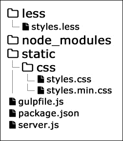

# 第三章：管理资产

第一章和第二章是 Node.js 应用程序开发的基本构建块和结构的良好介绍。我们了解了技术的基本知识，并揭示了重要的模式，如模型-视图-控制器。我们谈论了测试驱动开发和 REST API。在本章中，我们将创建我们社交网络的基础。应用程序资产的适当交付和管理是系统的重要组成部分。在大多数情况下，它决定了我们的工作流程。在本章中，我们将讨论以下主题：

+   使用 Node.js 提供文件

+   CSS 预处理

+   打包客户端 JavaScript

+   交付 HTML 模板

# 使用 Node.js 提供文件

Node.js 与通常的 Linux-Apache-MySQL-PHP 设置不同。我们必须编写处理传入请求的服务器。当用户需要从我们的后端获取图像时，Node.js 不会自动提供。我们社交网络的第一个文件将是`server.js`，内容如下：

```js
var http = require('http');
var fs = require('fs');
   var path = require('path');

var files = {};
var port = 9000;
var host = '127.0.0.1';

var assets = function(req, res) {
  // ...
};

var app = http.createServer(assets).listen(port, host);
console.log("Listening on " + host + ":" + port);
```

我们需要三个本地模块，用于驱动服务器和交付资产。前面代码的最后两行运行服务器并在控制台打印消息。

目前，我们应用程序的入口点是`assets`函数。此方法的主要目的是从硬盘读取文件并提供给用户。我们将使用`req.url`来获取当前请求路径。当 Web 浏览器访问我们的服务器并在浏览器中请求`http://localhost:9000/static/css/styles.css`时，`req.url`将等于`/static/css/styles.css`。从这一点开始，我们有一些任务要处理：

+   检查文件是否存在，如果不存在，则向用户发送适当的消息（HTTP 错误代码）

+   读取文件并找出其扩展名

+   以正确的内容类型将文件内容发送到浏览器

最后一点很重要。以错误或缺少的内容类型提供文件可能会导致问题。浏览器可能无法正确识别和处理资源。

为了使流程顺利，我们将为提到的每个任务创建一个单独的函数。最短的函数是向用户发送错误消息的函数：

```js
var sendError = function(message, code) {
  if(code === undefined) {
     code = 404;
  }
  res.writeHead(code, {'Content-Type': 'text/html'});
  res.end(message);
}
```

默认情况下，`code`变量的值为`404`，表示“未找到”。然而，有不同类型的错误，如客户端错误（4XX）和服务器错误（5XX）。最好留下更改错误代码的选项。

假设我们有文件的内容和扩展名。我们需要一个函数来识别正确的内容类型并将资源提供给客户端。为了简单起见，我们将执行文件扩展名的简单字符串检查。以下代码正是如此：

```js
var serve = function(file) {
  var contentType;
  switch(file.ext.toLowerCase()) {
    case "css": contentType = "text/css"; break;
    case "html": contentType = "text/html"; break;
    case "js": contentType = "application/javascript"; break;
    case "ico": contentType = "image/ico"; break;
    case "json": contentType = "application/json"; break;
    case "jpg": contentType = "image/jpeg"; break;
    case "jpeg": contentType = "image/jpeg"; break;
    case "png": contentType = "image/png"; break;
    default: contentType = "text/plain";
  }
  res.writeHead(200, {'Content-Type': contentType});
  res.end(file.content);
}
```

`serve`方法接受一个带有两个属性的`file`对象——`ext`和`content`。在接下来的几章中，我们可能会向列表中添加更多文件类型。但是，目前，提供 JavaScript、CSS、HTML、JPG 和 PNG 图像就足够了。

我们必须覆盖的最后一个任务是实际读取文件。Node.js 有一个内置模块来读取文件，称为`fs`。我们将使用其异步方法。使用同步函数，JavaScript 引擎可能会被阻塞，直到特定操作完全执行。在这种情况下，即读取文件。在异步编程中，我们允许程序执行其余的代码。在这种情况下，我们通常传递一个回调函数——当操作结束时将执行的函数：

```js
var readFile = function(filePath) {
  if(files[filePath]) {
        serve(files[filePath]);
    } else {
      fs.readFile(filePath, function(err, data) {
        if(err) {
          sendError('Error reading ' + filePath + '.');
          return;
        }
        files[filePath] = {
          ext: filePath.split(".").pop(),
          content: data
        };
        serve(files[filePath]);
      });
    }
}
```

该函数接受路径并打开文件。如果文件丢失或读取时出现问题，它会向用户发送错误。一开始，我们定义了一个`files`变量，它是一个空对象。每次我们读取一个文件，我们都将其内容存储在那里，这样下次读取时，我们就不必再次访问磁盘。每个 I/O 操作，比如读取文件，都需要时间。通过使用这种简单的缓存逻辑，我们提高了应用程序的性能。如果一切正常，我们调用`serve`方法。

以下是如何组合所有前面的片段：

```js
var http = require('http');
var fs = require('fs');
var path = require('path');
var files = {};
var port = 9000;

var assets = function(req, res) {
  var sendError = function(message, code) { ... }
  var serve = function(file) { ... }
  var readFile = function(filePath) { ... }

  readFile(path.normalize(__dirname + req.url));
}

var app = http.createServer(assets).listen(port, '127.0.0.1');
console.log("Listening on 127.0.0.1:" + port);
```

发送到服务器的每个 HTTP 请求都由`assets`处理程序处理。我们从当前目录开始组成文件的路径。`path.normalize`参数确保我们的字符串在不同的操作系统上看起来都很好。例如，它不包含多个斜杠。

# CSS 预处理

CSS 预处理器是接受源代码并生成 CSS 的工具。很多时候，输入与 CSS 语言的语法类似。然而，预处理的主要思想是添加社区所需但缺失的功能。在过去几年里，CSS 预处理已成为热门话题。它带来了许多好处，并且这个概念已经被社区热烈接受。有两种主要的 CSS 预处理器——**Less** ([`lesscss.org/`](http://lesscss.org/)) 和 **Sass** ([`sass-lang.com/`](http://sass-lang.com/))。Sass 基于 Ruby 语言，需要更多的工作才能在 Node.js 项目中运行。因此，在本书中，我们将使用 Less。

在上一章中，我们谈到了构建系统和任务运行器。CSS 预处理和我们稍后将讨论的其他一些任务应该自动发生。Gulp 似乎是一个不错的选择。让我们继续添加一个`package.json`文件，我们将在其中描述所有我们需要的与 Gulp 相关的模块：

```js
{
  "name": "nodejs-by-example",
  "version": "0.0.1",
  "description": "Node.js by example",
  "scripts": {
    "start": "node server.js"
  },
  "dependencies": {
    "gulp": "3.8.8",
    "gulp-less": "1.3.6",
    "gulp-rename": "~1.2.0",
    "gulp-minify-css": "~0.3.11"
  }
}
```

设置`"start": "node server.js"`将允许我们输入`npm start`并运行我们的服务器。我们将开始的依赖关系如下：

+   Gulp 本身

+   `gulp-less`：这是一个包装了 Less 预处理器的插件

+   `gulp-rename`：这会更改生成文件的名称

+   `gulp-minify-css`：这会压缩我们的 CSS

因此，除了`server.js`，我们现在还有`package.json`。我们运行`npm install`，包管理器会添加一个包含模块的`node_modules`目录。让我们在另一个名为`gulpfile.js`的文件中定义我们的 Gulp 任务：

```js
var path = require('path');
var gulp = require('gulp');
var less = require('gulp-less');
var rename = require("gulp-rename");
var minifyCSS = require('gulp-minify-css');

gulp.task('css', function() {
  gulp.src('./less/styles.less')
  .pipe(less({
    paths: [ path.join(__dirname, 'less', 'includes') ]
  }))
  .pipe(gulp.dest('./static/css'))
  .pipe(minifyCSS({keepBreaks:true}))
  .pipe(rename({suffix: '.min'}))
  .pipe(gulp.dest('./static/css'));
});

gulp.task('watchers', function() {
  gulp.watch('less/**/*.less', ['css']);
});

gulp.task('default', ['css', 'watchers']);
```

我们从两个任务开始——`css`和`watchers`。第一个任务期望我们有一个`less`目录和一个`styles.less`文件。这将是我们所有 CSS 样式的入口点。从 Gulp 任务中可以看到，我们将文件的内容传输到预处理器，并将结果导出到`static/css`目录。由于 Gulp 中的一切都是流，我们可以继续压缩 CSS，将文件重命名为`styles.min.css`，并将其导出到相同的文件夹。

我们不希望每次更改文件时都要自己运行构建过程。因此，我们为`less`文件夹中的文件注册`watchers`。`watcher`是一个监视特定文件的过程，一旦这些文件被更改，就会通知系统的其余部分。

在这一步结束时，我们的项目看起来是这样的：



# 打包客户端 JavaScript

与 CSS 一样，我们的目标应该是只向客户端浏览器提供一个 JavaScript 文件。我们不希望强迫用户发出多个请求，因为这样效率较低，意味着网页浏览器需要更长的时间来处理和显示页面的内容。如今，应用程序的客户端部分相当复杂。与复杂系统一样，我们将逻辑分成不同的模块。通常，不同的模块意味着不同的文件。幸运的是，Node.js 充满了可以用来打包 JavaScript 的工具。让我们看看两种最流行的工具。

## 使用 Gulp 进行合并

作为构建系统，Gulp 有几个模块来连接文件。我们感兴趣的是一个叫做`gulp-concat`的模块。让我们把它添加到`package.json`文件中：

```js
"dependencies": {
  "gulp": "3.8.8",
  "gulp-less": "1.3.6",
  "gulp-rename": "1.2.0",
  "gulp-minify-css": "0.3.11",
  "gulp-concat": "2.4.1"
}
```

下一步是编写一个使用它的任务。同样，我们将使用`src`和`dest` Gulp 方法，在它们之间是连接：

```js
var concat = require('gulp-concat');

gulp.task('js', function() {
  gulp.src('./js/*.js')
  .pipe(concat('scripts.js'))
  .pipe(gulp.dest('./static/js'))
});
```

需要提到的是，文件将按字母顺序添加到最终文件中。因此，每当有一些代码依赖时，我们都应该小心。如果是这种情况，我们应该以这样的方式命名文件，使它们的名称以唯一数字开头——01、02、03 等等。

我们接下来要做的逻辑任务是压缩我们的 JavaScript。和 Less 编译一样，我们希望提供尽可能小的文件。帮助我们实现这一目标的模块是`gulp-uglify`。同样，我们应该把它添加到`package.json`文件中（`"gulp-uglify": "1.0.1"`）。之后，对我们新创建的任务进行一点调整就可以压缩 JavaScript 了：

```js
var concat = require('gulp-concat');
var uglify = require('gulp-uglify');

gulp.task('js', function() {
  gulp.src('./js/*.js')
  .pipe(concat('scripts.js'))
  .pipe(gulp.dest('./static/js'))
  .pipe(uglify())
  .pipe(rename({suffix: '.min'}))
  .pipe(gulp.dest('./static/js'))
});
```

请注意，我们再次使用了`gulp-rename`插件。这是必要的，因为我们想生成一个不同的文件。

## 使用 RequireJS 在浏览器中进行模块化

在构建软件时，思考的最重要的概念之一是将我们的系统分割成模块。Node.js 有一个很好的内置系统来编写模块。我们在第一章中提到过，*Node.js 基础*。我们将我们的代码封装在一个单独的文件中，并使用`module.exports`或`exports`来创建公共 API。稍后，通过`require`函数，我们访问创建的功能。

然而，对于客户端 JavaScript，我们没有这样的内置系统。我们需要使用一个额外的库来允许我们定义模块。有几种可能的解决方案。我们将首先看一下的是 RequireJS（[`requirejs.org/`](http://requirejs.org/)）。我们将从官方网站下载这个库（版本 2.1.16），并像这样包含在我们的页面中：

```js
<script data-main="scripts/main" src="img/require.js">
</script>
```

这里的关键属性是`data-main`。它告诉 RequireJS 我们应用的入口点。事实上，我们应该在项目文件夹中有`scripts/main.js`文件才能让前面的行起作用。在`main.js`中，我们可以使用`require`全局函数：

```js
// scripts/main.js
require(["modules/ajax", "modules/router"], function(ajax, router) {
    // ... our logic
});
```

假设我们的`main.js`代码依赖于另外两个模块——Ajax 包装器和路由器。我们在一个数组中描述这些依赖关系，并提供一个回调，稍后用两个参数执行。这些参数实际上是对必要模块的引用。

使用另一个全局函数`define`可以定义模块。这是 Ajax 包装器的样子：

```js
// modules/ajax.js
define(function () {
    // the Ajax request implementation
    ...
    // public API
    return {
        request: function() { ... }
    }
});
```

默认情况下，RequireJS 在后台异步解析依赖项。换句话说，它为每个所需模块执行 HTTP 请求。在某些情况下，这可能会导致性能问题，因为每个请求都需要时间。幸运的是，RequireJS 有一个解决这个问题的工具（优化器）。它可以将所有模块捆绑成一个单独的文件。这个工具也适用于 Node.js，并且随`requirejs`包一起分发：

```js
npm install -g requirejs

```

安装成功后，我们将在终端中有`r.js`命令。基本调用如下：

```js
// in code_requirejs folder
r.js -o build.js
```

和 Grunt 和 Gulp 一样，我们有一个文件指导 RequireJS 如何工作。以下是涵盖我们示例的片段：

```js
// build.js
({
    baseUrl: ".",
    paths: {},
    name: "main",
    out: "main-built.js"
})
```

`name`属性是入口点，`out`是结果文件。很好的是我们有`paths`属性可用。这是一个我们可以直接描述模块的地方；例如，`jquery: "some/other/jquery"`。在我们的代码中，我们不必写文件的完整路径。只需简单的`require(['jquery'], ...)`就足够了。

默认情况下，`r.js`命令的输出是经过压缩的。如果我们在终端中添加一个`optimize=none`参数到命令中，我们将得到以下结果：

```js
// main-built.js
define('modules/ajax',[],function () {
    ...
});

define('modules/router',[],function () {
    ...
});

require(['modules/ajax', 'modules/router'], function(ajax, router) {
    ...
});
define("main", function(){});
```

`main-built.js`文件包含了主模块及其依赖项。

## 从 Node.js 移动到使用 Browserify 的浏览器

RequireJS 确实解决了模块化的问题。然而，它让我们写更多的代码。此外，我们应该始终按照严格的格式描述我们的依赖关系。让我们看看我们在上一节中使用的代码：

```js
require(['modules/ajax', 'modules/router'], function(ajax, router) {
    ...
});
```

确实，如果我们使用以下代码会更好：

```js
var ajax = require('modules/ajax');
var router = require('modules/router');
```

现在代码简单多了。这是我们在 Node.js 环境中获取模块的方式。如果我们能在浏览器中使用相同的方法就好了。

Browserify ([`browserify.org/`](http://browserify.org/))是一个将 Node.js 的`require`模块带到浏览器中的模块。让我们首先使用以下代码安装它：

```js
npm install -g browserify

```

同样，为了说明这个工具是如何工作的，我们将创建`main.js`，`ajax.js`和`router.js`文件。这一次，我们不打算使用`define`这样的全局函数。相反，我们将使用通常的 Node.js `module.exports`：

```js
// main.js
var ajax = require('./modules/ajax');
var router = require('./modules/router');

// modules/ajax.js
module.exports = function() {};

// modules/router.js
module.exports = function() {};
```

默认情况下，Browserify 作为一个命令行工具。我们需要提供一个入口点和一个输出文件：

```js
browserify ./main.js -o main-built.js
```

编译文件中的结果如下：

```js
// main-built.js
(function e(t,n,r){function s(o,u){if(!n[o]){if(!t[o]){var  a=typeof require=="function"&&require;if(!u&&a)return  a(o,!0);if(i)return i(o,!0);var f=new Error("Cannot find module  '"+o+"'");throw f.code="MODULE_NOT_FOUND",f}var  l=n[o]={exports:{}};t[o][0].call(l.exports,function(e){var  n=t[o][1][e];return s(n?n:e)},l,l.exports,e,t,n,r)}return  n[o].exports}var i=typeof require=="function"&&require;for(var  o=0;o<r.length;o++)s(r[o]);return  s})({1:[function(require,module,exports){
var ajax = require('./modules/ajax');
var router = require('./modules/router');
},{"./modules/ajax":2,"./modules/router":3}],2:[function(require,module,exports){
module.exports = function() {};
},{}],3:[function(require,module,exports){
module.exports=require(2)
},{".../modules/ajax.js":2}]},{},[1]);
```

请注意，编译文件除了模块之外，还包含`require`函数的定义和实现。这确实只是一小段代码，使 Browserify 成为浏览器中传递模块化 JavaScript 的最受欢迎的方式之一。这是我们接下来几章要使用的方法。

我们已经开始了一个 Gulp 设置。让我们在那里添加 Browserify。我们已经对 JavaScript 进行了合并。让我们用 Browserify 替换它。我们将在`package.json`文件中添加模块，如下所示：

```js
"dependencies": {
  "gulp": "3.8.8",
  "gulp-less": "1.3.6",
  "gulp-rename": "1.2.0",
  "gulp-minify-css": "0.3.11",
  "gulp-concat": "2.4.1",
  "gulp-uglify": "1.0.1",
  "gulp-browserify": "0.5.0"
}
```

运行`npm install`后，我们将安装并准备好使用插件。我们需要做两个更改，用`browserify`替换`concat`，并指出应用程序的主文件：

```js
var browserify = require('gulp-browserify');
var uglify = require('gulp-uglify');

gulp.task('js', function() {
  gulp.src('./js/app.js')
  .pipe(browserify())
  .pipe(gulp.dest('./static/js'))
  .pipe(uglify())
  .pipe(rename({suffix: '.min'}))
  .pipe(gulp.dest('./static/js'))
});
```

现在，`src`方法只接受一个文件。这是我们的入口点。这是 Browserify 开始解析依赖关系的地方。其余部分都是一样的。我们仍然使用`uglify`进行最小化和`rename`来更改文件的名称。

# 传递 HTML 模板

在前面的章节中，您看到了如何为浏览器打包 CSS 和 JavaScript。在本章的最后，我们将探讨各种传递 HTML 的方式。在客户端应用程序的上下文中，模板仍然包含 HTML。然而，我们需要一种动态的方式来渲染并填充它们的数据。

## 在脚本标记中定义模板

Ember.js 框架采用了直接将 HTML 模板添加到页面中的概念，使用流行的**handlebars** ([`handlebarsjs.com/`](http://handlebarsjs.com/))模板引擎。然而，由于我们不想搞乱已经存在的标记，我们将它们放在`<script>`标记中。这样做的好处是，如果我们设置`type`属性的自定义值，浏览器就不会处理其中的代码。这里有一个演示：

```js
<script type="text/x-handlebars" id="my-template">
   <p>Hello, <strong> </strong>!</p>
</script>
```

由于标签有一个`id`属性，我们可以通过以下方式轻松地获取它的内容：

```js
var template = document.querySelector('#my-template').innerHTML;
```

这种技术的好处是模板在页面上，我们可以立即访问它。此外，模板只在被 JavaScript 处理后显示所需的内容。因此，如果浏览器中未启用 JavaScript，我们不希望显示未经处理的原始模板。这个概念的一个主要问题是，我们将用大量代码淹没我们的 HTML 页面。如果我们有一个大型应用程序，那么用户将不得不下载所有模板，即使他/她只使用其中的一部分。

## 外部加载模板

将模板定义为外部文件并使用 Ajax 请求加载到页面上也是一种常见做法。以下伪代码使用 jQuery 的`get`方法来完成这项工作：

```js
$.get('/templates/template.html', function(html) {
    // ...
});
```

我们有清晰的标记，但用户必须进行额外的 HTTP 请求才能获取模板。这种方法使代码更复杂，因为过程是异步的。它还使处理和渲染内容比前一种方法更慢。

## 在 JavaScript 中编写 HTML

随着移动应用程序的兴起，许多大公司已经开始开发自己的框架。由于这些公司有足够的资源，他们通常会产生一些有趣的东西。例如，Facebook 创建了一个名为**React** ([`facebook.github.io/react/`](http://facebook.github.io/react/))的框架。它直接在 JavaScript 中定义其模板，如下所示：

```js
<script type="text/jsx">
  var HelloMessage = React.createClass({
     render: function() {
      // Note: the following line is invalid JavaScript,
         // and only works using React parser.
      return <div>Hello {this.props.name}</div>;
     }
  });
</script>
```

来自 Facebook 的开发人员采用了本节中提到的第一种技术。他们将一些代码放在`<script>`标签中。为了使事情正常运行，他们有自己的解析器。它处理脚本并将其转换为有效的 JavaScript。

有一些解决方案没有以 HTML 形式的模板。有些工具使用 JSON 或 YAML 编写的模板。例如，**AbsurdJS** ([`absurdjs.com/`](http://absurdjs.com/))可以将其模板保存在 JavaScript 类定义中，如下所示：

```js
body: {
  'section.content#home': {
    nav: [
      { 'a[href="#" class="link"]': 'A' },
      { 'a[href="#" class="link"]': 'B' },
      { 'a[href="#" class="link"]': 'C' }
    ]
  },
  footer: {
    p: 'Text in the Footer'
  }
}
```

## 预编译模板

将模板传递到客户端的另一种流行方式是使用预编译。这是我们将在项目中使用的方法。预编译是将 HTML 模板转换为 JavaScript 对象的过程，该对象已准备好在我们的代码中使用。这种方法有几个好处，其中一些如下：

+   我们不必考虑访问 HTML 模板

+   标记仍然与 JavaScript 代码分开

+   我们不浪费时间去获取和处理 HTML

不同的客户端框架有不同的工具来预编译模板。我们将在以后详细介绍这一点，但我们将在我们的社交网络应用程序中使用的工具称为 Ractive.js ([`www.ractivejs.org/`](http://www.ractivejs.org/))。这是一个最初由 TheGuardian 的人员开发的客户端框架，用于制作新闻应用程序。它跨浏览器，在移动设备上表现良好。

为了将我们的 HTML 转换为 Ractive 预编译模板，我们需要在`package.json`文件中添加两个新模块：

```js
"ractive": "0.6.1",
"gulp-tap": "0.1.3"
```

`gulp-tap`插件允许我们处理发送到 Gulp 管道的每个文件。以下是我们必须添加到`gulpfile.js`文件的新任务：

```js
var Ractive = require('ractive');
var tap = require('gulp-tap');

gulp.task('templates', function() {
  gulp.src('./tpl/**/*.html')
  .pipe(tap(function(file, t) {
    var precompiled = Ractive.parse(file.contents.toString());
    precompiled = JSON.stringify(precompiled);
    file.contents = new Buffer('module.exports = ' + precompiled);
  }))
  .pipe(rename(function(path) {
    path.extname = '.js';
  }))
  .pipe(gulp.dest('./tpl'))
});

gulp.task('default', ['css', 'templates', 'js', 'watchers']);
```

`Ractive.parse`返回预编译模板。由于它是一个 JavaScript 对象，我们使用`JSON.stringify`将其转换为字符串。我们使用 Browserify 来控制我们的客户端模块化，因此在模板代码前面附加了`module.exports`。最后，我们使用`gulp-rename`生成一个 JavaScript 文件。

假设我们有一个包含以下内容的`/tpl/template.html`文件：

```js
<section>
  <h1>Hello {{name}}</h1>
</section>
```

当我们运行`gulp`命令时，我们将收到包含相应标记的 JavaScript 的`/tpl/template.js`文件：

```js
module.exports =  {"v":1,"t":[{"t":7,"e":"section","f":[{"t":7,"e":"h1","f":["Hello ",{"t":2,"r":"name"}]}]}]}
```

现在可能看起来很奇怪，但在接下来的几章中，您将看到如何使用这样的模板。

# 摘要

资产是 Web 应用程序的重要组成部分。通常，公司对这一部分不够重视，这导致加载时间变慢，Web 托管成本增加，特别是当您的网站变得更受欢迎时。在本章中，我们看到找到正确的设置并以最有效的方式交付图像、CSS、JavaScript 和 HTML 是很重要的。

在下一章中，我们将开始在我们的社交网络上大量工作。我们将探索模型-视图-控制器模式的世界。
