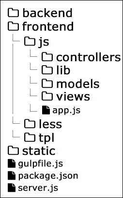

# 第四章：开发模型-视图-控制器层

在上一章中，我们学习了如何准备应用程序所需的资源。现在是时候继续前进，开始编写我们社交网络的基本层。在本章中，我们将使用模型-视图-控制器模式，并准备我们的代码基础以实现我们应用程序的未来。以下是本章将讨论的内容：

+   将代码从上一章转换为更好的文件结构

+   实现在后端和前端环境中都能工作的路由器

+   简要介绍 Ractive.js——这是我们将在项目的客户端部分使用的框架

+   开发应用程序的主文件

+   实现控制器、视图和模型类

# 发展当前的设置

编写软件是困难的。通常，这是一个变化的过程。为了发展和扩展我们的系统，我们必须对代码进行更改。我们将从上一章的代码中提取一些新的文件和文件夹。我们将稍微改变架构，以便在开发之后适应。

## 目录结构

将逻辑分为前端和后端是一种常见的做法。我们将遵循相同的方法。以下是新的文件结构：



`backend`目录将包含在 Node.js 环境中使用的文件。正如我们所看到的，我们将之前在主目录中的文件移动到`frontend`文件夹中。这些文件产生了放置在`static`目录中的资源。我们仍然有必要的`gulpfile.js`，`package.json`和`server.js`文件，其中包含了 Node.js 服务器的代码。

## 形成主服务器处理程序

到目前为止，我们的服务器只有一个请求处理程序——`assets`。以下是我们在上一章中启动服务器的方式：

```js
var app = http.createServer(assets).listen(port, '127.0.0.1');
```

除了提供资源，我们还必须添加另外两个处理程序，如下所示：

+   **API 处理程序**：我们应用程序的客户端部分将通过 REST API 与后端通信。我们在第二章中介绍了这个概念，*项目架构*。

+   **页面处理程序**：如果发送到服务器的请求不是用于资源或 API 资源，我们将提供一个 HTML 页面，这是普通用户将看到的页面。

将所有内容保存在一个文件中并不是一个好主意。因此，第一步是将`assets`函数提取到自己的模块中：

```js
// backend/Assets.js
module.exports = function(req, res) {
...
}

// server.js
var Assets = require('./backend/Assets');
```

我们将采用类似的方法创建一个`backend/API.js`文件。它将负责 REST API。我们将使用 JSON 作为数据传输的格式。我们可以使用的最简单的代码如下：

```js
// backend/API.js
module.exports = function(req, res) {
  res.writeHead(200, {'Content-Type': 'application/json'});
  res.end('{}' + '\n');
}
```

设置正确的`Content-Type`值很重要。如果缺少或者值错误，那么接收响应的浏览器可能无法正确处理结果。最后，我们返回一个最小的空 JSON 字符串。

最后，我们将添加`backend/Default.js`。这是将在浏览器中生成用户将看到的 HTML 页面的文件：

```js
// backend/Default.js
var fs = require('fs');
var html = fs.readFileSync(__dirname + '/tpl/page.html').toString('utf8');
module.exports = function(req, res) {
  res.writeHead(200, {'Content-Type': 'text/html'});
  res.end(html + '\n');
}
```

`Default.js`的内容看起来与`API.js`类似。我们将再次设置`Content-Type`值，并使用`response`对象的`end()`方法。然而，在这里，我们从外部文件中加载 HTML Unicode 字符串，该文件存储在`backend/tpl/page.html`中。文件的读取是同步的，并且只在开始时发生一次。以下是`page.html`的代码：

```js
<!doctype html>
<html lang="en">
<head>
  <meta charset="utf-8">
  <title>Node.js by example</title>
  <meta http-equiv="Content-Type" content="text/html;  charset=utf-8" />
  <meta name="description" content="Node.js by examples">
  <meta name="author" content="Packt">
  <link rel="stylesheet" href="/static/css/styles.css">
</head>
<body>
  <script src="img/ractive.js"></script>
  <script src="img/app.js"></script>
</body>
</html>
```

这是一个基本的 HTML5 样板代码，包含头部、主体标签、CSS 和 JavaScript 导入。我们的应用程序只需要以下两个 JavaScript 文件才能运行：

+   `ractive.js`：这是我们将在客户端使用的框架。关于这个更多的内容将在接下来的几节中讨论。

+   `app.js`：这是我们的客户端 JavaScript。如前一章所述，它是由 Gulp 设置生成的。

在提到后端处理程序之后，我们准备好开始编写将在浏览器中运行的代码。

# 实现路由器

几乎每个 Web 应用程序都需要一个路由器，它是一个作为前门的组件，接受传入的查询。它分析请求的参数，并决定我们系统的哪个模块将提供结果。

我们在后端（通过 Node.js）和前端（由 Web 浏览器解释）中使用 JavaScript 语言。在本节中，我们将编写一个在应用程序的两侧都能工作的路由器。让我们开始检查 Node.js 部分需要什么：

```js
// frontend/js/lib/Router.js
module.exports = function() {
  return {
    routes: [],
    add: function(path, handler) {
      // ...
    },
    check: function(fragment, params) {
      // ...
    }
  }
};
```

`Router.js`导出两种方法。第一个方法通过接受路径和处理程序函数来注册路由，如果当前 URL 与路径匹配，则将调用该处理程序。`check`函数只是执行实际检查。

这是`add`方法的样子：

```js
add: function(path, handler) {
  if(typeof path === 'function') {
    handler = path;
    path = '';
  }
  this.routes.push({
    path: path,
    handler: handler
  });
  return this;
}
```

我们可以跳过`path`参数，只注册一个匹配每个路由的函数。在某些情况下，支持这种行为是很好的，我们想定义一个默认路由。

`check`函数稍微复杂一些。它不仅涵盖简单的字符串匹配，还应该支持动态参数。我们将使用`:id`来表示这些动态参数。例如：

+   `/home`：这匹配`http://localhost/home`

+   `/user/feed`：这匹配`http://localhost/user/feed`

+   /user/:id/profile：这匹配`http://localhost/user/45/profile`

+   `/user/:id/:action`：这匹配`http://localhost/user/45/update`

为了实现这个功能，我们将以以下方式使用正则表达式：

```js
check: function(f, params) {
  var fragment, vars;
  if(typeof f !== 'undefined') {
    fragment = f.replace(/^\//, '');
  } else {
    fragment = this.getFragment(); 
  }
  for(var i=0; i<this.routes.length; i++) {
    var match, path = this.routes[i].path;
    path = path.replace(/^\//, '');
    vars = path.match(/:[^\s/]+/g);
    var r = new RegExp('^' + path.replace(/:[^\s/]+/g,  '([\\w-]+)'));
    match = fragment.match(r);
    if(match) {
      match.shift();
      var matchObj = {};
      if(vars) {
        for(var j=0; j<vars.length; j++) {
          var v = vars[j];
          matchObj[v.substr(1, v.length)] = match[j];
        }
      }
      this.routes[i].handler.apply({},  (params || []).concat([matchObj]));
      return this;
    }
  }
  return false;
}
```

让我们逐行浏览该函数。该方法的参数是`f`和`parameters`。片段实际上是一个路径。这是我们要检查的 URL。在`add`方法中，我们添加了一个处理程序，一旦匹配，就会触发。如果我们能够向该方法发送额外的变量，那将是很好的。`parameters`参数涵盖了这个功能。我们可以发送一个数组，稍后将其转换为处理程序的参数。

该函数继续检查片段是否已定义。在 Node.js 环境中，我们必须发送 URL。但是，由于我们将在浏览器中使用相同的代码，我们定义了一个`getFragment`辅助方法：

```js
getFragment: function() {
  var fragment = '';
  fragment = this.clearSlashes(decodeURI(window.location.pathname  + location.search));
  fragment = fragment.replace(/\?(.*)$/, '');
  fragment = this.root !== '/' ? fragment.replace(this.root, '') : fragment;
  return this.clearSlashes(fragment);
}
```

这个辅助程序的主要思想是通过使用全局的`window.location`对象来获取浏览器的当前 URL。您可能会注意到另一个`clearSlashes`函数。它确切地做了它的名字所暗示的。它从字符串的开头和结尾删除不必要的斜杠：

```js
clearSlashes: function(path) {
  return path.toString().replace(/\/$/, '').replace(/^\//, '');
}
```

让我们回到`check`函数。我们将继续循环遍历已注册的路由。对于每个路由，我们执行以下操作：

+   我们通过提取动态部分（如果有）来准备一个正则表达式；例如，`users/:id/:action`被转换为`test/([\w-]+)/([\w-]+)`。我们将在本书中稍后使用这个。

+   我们检查正则表达式是否与片段匹配。如果匹配，则我们组成一个参数数组并调用路由的处理程序。

有趣的是，如果我们传递我们自己的路径（片段），我们可以在 Node.js 和浏览器环境中使用相同的 JavaScript。

应用程序的客户端将需要另外两种方法。到目前为止，我们已经注册了路由并检查这些规则是否特定匹配 URL。这对于后端可能有效，但在前端，我们需要不断监视当前浏览器位置。这就是为什么我们将添加以下功能：

```js
listen: function() {
  var self = this;
  var current = self.getFragment();
  var fn = function() {
    if(current !== self.getFragment()) {
      current = self.getFragment();
      self.check(current);
    }
  }
  clearInterval(this.interval);
  this.interval = setInterval(fn, 50);
  return this;
}
```

通过使用`setInterval`，我们将再次运行`fn`闭包。它检查当前 URL 是否已更改，如果是，则触发`check`方法，这已经解释过了。

该类的最后一个添加是`navigate`函数：

```js
navigate: function(path) {
  path = path ? path : '';
  history.pushState(null, null, this.root + this.clearSlashes(path));
  return this;
}
```

我们可能希望在代码中更改当前页面。路由是一个很好的工具。一旦我们更改浏览器的 URL，该类就会自动调用正确的处理程序。上述代码使用了 HTML5 历史 API（[`diveintohtml5.info/history.html`](http://diveintohtml5.info/history.html)）。`pushState`方法会更改浏览器地址栏的字符串。

通过添加`navigate`方法，我们完成了我们的路由器，它是一个可以在后端和前端使用的模块。在继续介绍模型-视图-控制器组件之前，我们将简要介绍 Ractive.js—我们将用作用户界面开发的驱动力的框架。

# 介绍 Ractive.js

Ractive.js 是由著名新闻机构 TheGuardian 开发的框架（[`www.theguardian.com/`](http://www.theguardian.com/)）。它简化了 DOM 交互，并提供了诸如双向数据绑定和自定义组件创建等功能。我们现在不打算涵盖框架的所有功能。新功能将在后面的章节中介绍。

在像我们这样的复杂 Web 应用程序中，将不同的逻辑部分拆分成组件非常重要。幸运的是，Ractive.js 为此提供了一个接口。以下是典型组件的外观：

```js
var Component = Ractive.extend({
  template: '<div><h1>{{title}}</h1></div>',
  data: {
    title: 'Hello world'
  }
});
var instance = new Component();
instance.render(document.'body);
```

`template`属性包含 HTML 标记或（在我们的情况下）预编译模板。数据对象可以在我们的模板中访问。Ractive.js 使用**mustache**（[`mustache.github.io/`](http://mustache.github.io/)）作为模板语言。我们可以添加另一个名为`el`的属性，并直接选择组件在初始化后将呈现的位置。然而，还有另一种方式—`render`方法。该方法接受一个 DOM 元素。在上述代码中，这只是页面的 body。

与浏览器中的 DOM 树类似，我们需要组件的嵌套。框架通过引入自定义标签定义来很好地处理了这一点，如下例所示：

```js
var SubComponent = Ractive.extend({
    template: '<small>Hello there!</small>'
});
var Component = Ractive.extend({
  template: '\
    <div>\
        <h1>{{title}}</h1>\
        <my-subcomponent />\
    </div>\
  ',
  data: {
    title: 'Hello world'
  },
  components: {
    'my-subcomponent': SubComponent
  }
});
var instance = new Component();
instance.render(document.querySelector('body'));
```

每个组件可能都有一个哈希映射对象（`components`），用于定义我们的自定义标签。我们可以嵌套任意多个组件。上述代码生成的 HTML 如下所示：

```js
<div>
  <h1>Hello world</h1>
  <small>Hello there!</small>
</div>
```

在不同的 Ractive.js 组件之间建立通信的几种方式。最方便的一种方式是触发和监听事件。让我们来看一下以下代码片段：

```js
var Component = Ractive.extend({
  template: '<div><h1>{{title}}</h1></div>',
  notifyTheOutsideWorld: function() {
    this.fire('custom-event');
  }
});
var instance = new Component();
instance.on('custom-event', function() {
  this.set('title', 'Hey!');
  instance.render(document.querySelector('body'));
});
instance.notifyTheOutsideWorld();
```

我们提出了一些新概念。首先，我们定义了一个公共函数—`notifyTheOutsideWorld`。Ractive.js 允许您注册自定义方法。使用`on`方法，我们订阅了特定事件，并使用`fire`来分发事件。

在上面的示例中，我们使用了另一个到目前为止尚未解释的方法。`set`函数修改了组件的数据对象。我们将经常使用这个函数。

关于 Ractive.js，我们在本章中要提到的最后一件事是它观察组件数据属性变化的功能。下面的代码演示了对`title`属性的观察：

```js
var Component = Ractive.extend({
  template: '<div><h1>{{title}}</h1></div>'
});
var instance = new Component();
instance.observe('title', function(value) {
    alert(value);
});
instance.set('title', 'Hello!');
```

上面的示例显示了一个带有`Hello!`文本的`alert`窗口。让我们继续定义主应用程序文件的过程，换句话说，我们的社交网络的客户端入口点。

# 构建应用程序的入口点

在构建 Gulp 设置时，我们为 JavaScript 捆绑创建了一个任务。Browserify 需要一个入口点来解析依赖关系。我们设置为`frontend/js/app.js`。同样，对于后端，我们将围绕路由构建我们的逻辑。以下代码设置了两个路由，并提供了一个辅助函数来在页面上呈现 Ractive.js 组件：

```js
// frontend/js/app.js
var Router = require('./lib/Router')();
var Home = require('./controllers/Home');
var currentPage;
var body;

var showPage = function(newPage) {
  if(currentPage) { currentPage.teardown(); }
  currentPage = newPage;
  body.innerHTML = '';
  currentPage.render(body);
}

window.onload = function() {

  body = document.querySelector('body');

  Router
  .add('home', function() {
    var p = new Home();
    showPage(p);
  })
  .add(function() {
    Router.navigate('home');
  })
  .listen()
  .check();

}
```

我们需要在顶部引入`Router`变量。除此之外，我们还需要获取负责主页的控制器。我们将在下一节中详细了解这一点。现在，我们只会说它是一个 Ractive.js 组件。

我们不希望在页面资源完全加载之前运行任何 JavaScript。因此，我们将在`window.onload`处理程序中包装我们的引导代码。Ractive.js 组件的持有者将是`body`标签，我们将创建对它的引用。我们定义了一个名为`showPage`的辅助函数。它的工作是呈现当前页面并确保最后添加的页面被正确移除。`teardown`方法是框架的内置函数。它取消呈现组件并删除所有事件处理程序。

在本章中，我们将只有一个页面-主页。我们将使用我们为后端创建的路由器并注册一个`/home`路由。我们传递给`add`函数的第二个处理程序基本上是在没有匹配路由的情况下调用的。我们所做的是立即将用户转发到`/home` URL。最后，我们触发了路由器的监听并触发了初始检查。

在下一节中，我们将定义我们的第一个控制器-将控制我们的主页的组件。

# 定义控制器

在我们的上下文中，控制器的作用将是编排页面。换句话说，它们将充当管理子组件之间发生的过程的页面包装器。`controllers/Home.js`文件的内容如下：

```js
module.exports = Ractive.extend({
  template: require('../../tpl/home'),
  components: {
    navigation: require('../views/Navigation'),
    appfooter: require('../views/Footer')
  },
  onrender: function() {
    console.log('Home page rendered');
  }
});
```

在您查看模板和组件的属性之前，我们必须对`onrender`说几句话。Ractive.js 组件提供了一个接口，用于定义在组件生命周期的每个阶段内部发生的处理程序。例如，我们几乎每次在组件呈现在页面上后都需要执行一些操作。还有`onconstruct`，`onteardown`或`onupdate`。这无疑是实现业务逻辑的一种好方法。所有这些属性都在框架的官方文档中列出，网址为[`docs.ractivejs.org/latest/options`](http://docs.ractivejs.org/latest/options)。

我们在向您介绍 Ractive.js 时已经提到了`template`属性。但是，在下面的代码中，我们没有一个字符串作为值。我们需要另一个 JavaScript 文件-预编译的 HTML 模板。预编译是由构建系统 Gulp 完成的，如下所示：

```js
// gulpfile.js
gulp.task('templates', function() {
  gulp.src('./frontend/tpl/**/*.html')
  .pipe(tap(function(file, t) {
    var precompiled = Ractive.parse(file.contents.toString());
    precompiled = JSON.stringify(precompiled);
    file.contents = new Buffer('module.exports = ' + precompiled);
  }))
  .pipe(rename(function(path) {
    path.extname = '.js';
  }))
  .pipe(gulp.dest('./frontend/tpl'))
});
```

我们将从`frontend/tpl`目录获取所有 HTML 文件，并将它们转换为 Ractive.js 和 Browserify 理解的 JavaScript 文件。最后，Gulp 在同一目录中创建一个具有相同名称但扩展名不同的文件。例如，我们的主页模板可以如下所示：

```js
// frontend/tpl/home.html
<header>
  <navigation />
  <div class="hero">
    <h1>Node.js by example</h1>
  </div>
</header>
<appfooter />
```

当我们在终端中运行`gulp`时，我们将得到`frontend/tpl/home.js`，其内容如下：

```js
module.exports =  {"v":1,"t":[{"t":7,"e":"footer","f":["Version:  ",{"t":2,"r":"version"}]}]}
```

我们不必完全理解这些属性的含义。将 JavaScript 文件转换为 HTML 是框架预留的工作。

如果您检查前面代码中的模板和组件定义，您会注意到有两个子组件，`navigation`和`appfooter`。让我们看看如何创建它们。

# 管理我们的视图

再次，视图是 Ractive.js 组件。它们有自己的模板。事实上，`Home.js`模块也可以被称为视图。浏览器中的模型-视图-控制器模式经常会发生变化，并且不遵循精确的定义。这在我们的应用程序中是这样的，因为我们使用的框架有一些规则，并且提供了一些特定的功能，这些功能与典型的 MVC 不一致。当然，这并没有什么问题。只要我们分开责任，我们的架构就会很好。

`navigation`视图相当简单。它只定义了需要呈现的模板：

```js
// views/navigation.js
module.exports = Ractive.extend({
  template: require('../../tpl/navigation')
});
```

为了使事情更有趣并引入模型的定义，我们将在页脚中显示一个版本号。这个数字将来自于在`models/Version.js`中创建的模型。以下是`views/Footer.js`文件的代码：

```js
var FooterModel = require('../models/Version');

module.exports = Ractive.extend({
  template: require('../../tpl/footer'),
  onrender: function() {
    var model = new FooterModel();
    model.bindComponent(this).fetch();
  }
});
```

在解释`bindComponent`到底发生了什么之前，让我们来看看`tpl/footer.html`中有什么：

```js
<footer>
  Version: {{version}}
</footer>
```

我们有一个动态变量，`version`。如果我们不使用模型，我们必须在组件的`data`属性中定义它，或者使用`this.set('data', value)`。然而，`FooterModel`模块将使我们的生活更轻松，并更新与其绑定的组件的变量。这就是为什么我们将这个模块传递给`bindComponent`的原因。正如我们将在下一节中看到的，`fetch`方法将模型的数据与后端的数据同步。

# 创建一个模型

我们可能会有几个模型，它们都将共享相同的方法。通常，模型向服务器发出 HTTP 请求并获取数据。所以，这是我们需要抽象的东西。幸运的是，Ractive.js 使您能够扩展组件。这是`models/Version.js`文件的代码：

```js
var Base = require('./Base');
module.exports = Base.extend({
  data: {
    url: '/api/version'
  }
});
```

我们有`models/Base.js`，这个文件将包含这些通用函数。它将是一个基类，我们稍后会继承它。

```js
var ajax = require('../lib/Ajax');
module.exports = Ractive.extend({
  data: {
    value: null,
    url: ''
  },
  fetch: function() {
    var self = this;
    ajax.request({
      url: self.get('url'),
      json: true
    })
    .done(function(result) {
      self.set('value', result);
    })
    .fail(function(xhr) {
      self.fire('Error fetching ' + self.get('url'))
    });
    return this;
  },
  bindComponent: function(component) {
    if(component) {
      this.observe('value', function(v) {
        for(var key in v) {
         component.set(key, v[key]);
           }
      }, { init: false });
    }
    return this;
  }
});
```

我们定义了两个方法——`fetch`和`bindComponent`。第一个使用一个辅助的 Ajax 包装器。我们现在不打算深入讨论这个细节。它类似于 jQuery 的`.ajax`方法，并实现了 promise 接口模式。实际的源代码可以在随本书提供的文件中找到。

扩展`Base`模块的组件应该提供一个 URL。这是模型将发出请求的终点。在我们的情况下，这是`/api/version`。我们的后端将在这个 URL 上提供内容。

如果你回头检查我们对以`/api`开头的 URL 所做的事情，你会发现结果只是一个空对象。让我们改变这一点，覆盖`/api/version`路由的实现。我们将更新`backend/API.js`如下：

```js
var response = function(result, res) {
  res.writeHead(200, {'Content-Type': 'application/json'});
  res.end(JSON.stringify(result) + '\n');
}
var Router = require('../frontend/js/lib/router')();
Router
.add('api/version', function(req, res) {
  response({
    version: '0.1'
  }, res);
})
.add(function(req, res) {
  response({
    success: true
  }, res);
});

module.exports = function(req, res) {
  Router.check(req.url, [req, res]);
}
```

我们使用相同的路由器将 URL 映射到特定的响应。所以，在这个改变之后，我们的模型将获取`0.1`作为值。

最后，让我们揭示`bindComponent`函数中发生的魔法：

```js
bindComponent: function(component) {
  if(component) {
    this.observe('value', function(v) {
      for(var key in v) component.set(key, v[key]);
    }, { init: false });
  }
  return this;
}
```

我们观察本地`data`属性值的变化。在成功的`fetch`方法调用后进行更新。新值传递给处理程序，我们只是将变量传递给组件。这只是几行代码，但它们成功地带来了一个很好的抽象。在实际的模型定义中，我们只需要指定 URL。`Base`模块会处理其余部分。

# 总结

在本章中，我们构建了我们应用程序的基础。我们还创建了我们系统的基础——路由器。控制器现在很好地绑定到路由，并且视图在页面上呈现，当模型的值发生变化时，显示会自动更新。我们还引入了一个简单的模型，它从后端的 API 获取数据。

在下一章中，我们将实现一个真正有效的功能——我们将管理我们系统的用户。
