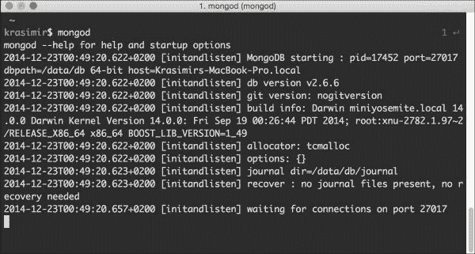

# 第五章： 管理用户

在第四章中，*开发模型-视图-控制器层*，我们使用了模型-视图-控制器模式并编写了我们社交网络的基础。我们将应用程序分成了后端和前端目录。第一个文件夹中的代码用于提供资产并生成主页。除此之外，我们还建立了后端 API 的基础。项目的客户端由 Ractive.js 框架驱动。这是我们存储控制器、模型和视图的地方。有了这些元素，我们将继续管理用户。在本书的这一部分，我们将涵盖以下主题：

+   使用 MongoDB 数据库

+   注册新用户

+   使用会话进行用户认证

+   管理用户的个人资料

# 使用 MongoDB 数据库

现在，几乎每个网络应用程序都会从数据库中存储和检索数据。其中一个与 Node.js 兼容性很好的最流行的数据库是 MongoDB ([`www.mongodb.org/`](http://www.mongodb.org/))。这就是我们要使用的。MongoDB 的主要特点是它是一个具有不同数据格式和查询语言的 NoSQL 数据库。

## 安装 MongoDB

与其他流行软件一样，MongoDB 适用于所有操作系统。如果您是 Windows 用户，可以从官方页面[`www.mongodb.org/downloads`](http://www.mongodb.org/downloads)下载安装程序。对于 Linux 或 OS X 开发人员，MongoDB 可以通过大多数流行的软件包管理系统获得。我们不会详细介绍安装过程，但您可以在[`docs.mongodb.org/manual/installation/`](http://docs.mongodb.org/manual/installation/)找到详细的说明。

## 运行 MongoDB

安装成功后，我们将有一个`mongod`命令可用。通过在终端中运行它，我们启动一个默认监听端口`27017`的 MongoDB 服务器。我们的 Node.js 后端将连接到这个端口并执行数据库查询。以下是在执行`mongod`命令后我们控制台的样子：



## 连接到数据库服务器

Node.js 的一个好处是存在成千上万的模块。由于社区不断增长，我们几乎可以为遇到的每个任务找到一个模块。我们已经使用了几个 Gulp 插件。现在，我们将在`package.json`文件中添加官方的 MongoDB 驱动程序：

```js
"dependencies": {
  "mongodb": "1.4.25",
  ..
}
```

我们必须运行`npm install`将模块安装到`node_modules`目录中。一旦过程完成，我们可以使用以下代码连接到服务器：

```js
var MongoClient = require('mongodb').MongoClient;
MongoClient.connect('mongodb://127.0.0.1:27017/nodejs-by-example',  function(err, db) {
  // ...
});
```

在这段代码中，`nodejs-by-example`是我们的数据库名称。调用的回调函数使我们能够访问驱动程序的 API。我们可以使用`db`对象来操作数据库中的集合，换句话说，创建、更新、检索或删除文档。以下是一个示例：

```js
var collection = db.collection('users');
collection.insert({
  name: 'John',
  email: 'john@test.com'
}, function(err, result) {
  // ...
});
```

现在我们知道如何管理系统中的数据了。让我们继续到下一节并扩展我们的客户端代码。

# 扩展上一章的代码

向已有的代码库添加新功能意味着重构和扩展已经编写的代码。为了开发用户管理，我们需要更新`models/Base.js`文件。到目前为止，我们有一个简单的`Version`模型，我们将需要一个新的`User`模型。我们需要改进我们的导航和路由，以便用户有页面来创建、编辑和管理他们的账户。

本章附带的代码有很多 CSS 样式的添加。我们不会讨论它们，因为我们更想专注于 JavaScript 部分。它们为应用程序提供了稍微更好的外观。如果您对最终的 CSS 是如何生成感兴趣，请查看本书的代码包。

## 更新我们的基础模型类

到目前为止，`models/Base.js`只有两种方法。第一个方法`fetch`执行一个带有给定 URL 的`GET`请求。在第二章中，*项目架构*，我们谈到了 REST API；为了完全支持这种架构，我们必须添加用于创建、更新和删除记录的方法。实际上，所有这些方法都将接近我们已经拥有的方法。这是`create`函数：

```js
create: function(callback) {
  var self = this;
  ajax.request({
    url: self.get('url'),
    method: 'POST',
    data: this.get('value'),
    json: true
  })
  .done(function(result) {
    if(callback) {
      callback(null, result);
    }
  })
  .fail(function(xhr) {
    if(callback) {
      callback(JSON.parse(xhr.responseText));
    }
  });
  return this;
}
```

我们运行模型的方法，该方法从其`value`属性获取数据并执行`POST`请求。最后，我们触发一个回调。如果出现问题，我们将错误作为第一个参数发送。如果没有问题，那么第一个参数（表示错误状态）为`null`，第二个参数包含服务器的响应。

我们将遵循相同的方法来更新和删除代码：

```js
save: function(callback) {
  var self = this;
  ajax.request({
    url: self.get('url'),
    method: 'PUT',
    data: this.get('value'),
    json: true
  })
  .done(function(result) { // ...  })
  .fail(function(xhr) { // ... });
  return this;
},
del: function(callback) {
  var self = this;
  ajax.request({
    url: self.get('url'),
    method: 'DELETE',
    json: true
  })
  .done(function(result) { ...  })
  .fail(function(xhr) { ... });
  return this;
}
```

不同之处在于`request`方法。对于`save`操作，我们使用`PUT`，而要删除数据，我们使用`DELETE`。请注意，在删除过程中，我们不必发送模型的数据，因为我们只是执行一个简单的操作，从数据库中删除特定的数据对象，而不是进行像`create`和`save`请求中所见的更复杂的更改。

## 更新页面导航和路由

来自第四章的代码，*开发模型-视图-控制器层*，在其导航中只包含两个链接。我们需要为其添加更多内容——链接到注册、登录和注销，以及个人资料管理访问。`frontend/tpl/navigation.html`模板片段如下所示：

```js
<nav>
  <ul>
    <li><a on-click="goto:home">Home</a></li>
    {{#if !isLogged }}
      <li><a on-click="goto:register">Register</a></li>
      <li><a on-click="goto:login">Login</a></li>
    {{else}}
      <li class="right"><a on-click="goto:logout">Logout</a></li>
      <li class="right"><a on-click="goto:profile">Profile</a></li>
    {{/if}}
  </ul>
</nav>
```

除了新的`<a>`标签，我们还进行了以下两个有趣的添加：

+   有一个`{{#if}}`表达式。在我们的 Ractive.js 组件中，我们需要注册一个`isLogged`变量。它将通过隐藏和显示适当的按钮来控制导航的状态。当用户未登录时，我们将显示**注册**和**登录**按钮。否则，我们的应用程序将显示**注销**和**个人资料**链接。关于`isLogged`变量的更多信息将在本章末讨论，当我们涵盖会话支持时。

+   我们有`on-click`属性。请注意，这些属性不是有效的 HTML，但它们被 Ractive.js 解释为产生期望的结果。导航中的每个链接都将分派一个带有特定参数的`goto`事件，并且当用户触发链接时，这将发生。

在应用程序的主文件（`frontend/js/app.js`）中，我们有一个`showPage`函数。该方法可以访问当前页面，是监听`goto`事件的理想位置。这也是一个很好的选择，因为在同一个文件中，我们有一个对路由器的引用。因此，我们能够更改当前站点的页面。对这个函数进行一点改变，我们就完成了页面的切换：

```js
var showPage = function(newPage) {
  if(currentPage) currentPage.teardown();
  currentPage = newPage;
  body.innerHTML = '';
  currentPage.render(body);
  currentPage.on('navigation.goto', function(e, route) {
    Router.navigate(route);
  });
}
```

在下一节中，我们将继续编写代码，以在我们的系统中注册新用户。

# 注册新用户

为了处理用户的注册，我们需要更新前端和后端代码。应用程序的客户端部分将收集数据，后端将其存储在数据库中。

## 更新前端

我们更新了导航，现在，如果用户点击**注册**链接，应用程序将将他们转发到`/register`路由。我们必须调整我们的路由器，并以以下方式注册处理程序：

```js
var Register = require('./controllers/Register');
Router
.add('register', function() {
  var p = new Register();
  showPage(p);
})
```

与主页一样，我们将创建一个位于`frontend/js/controllers/Register.js`中的新控制器，如下所示：

```js
module.exports = Ractive.extend({
  template: require('../../tpl/register'),
  components: {
    navigation: require('../views/Navigation'),
    appfooter: require('../views/Footer')
  },
  onrender: function() {
    var self = this;
    this.observe('firstName',  userModel.setter('value.firstName'));
    this.observe('lastName', userModel.setter('value.lastName'));
    this.observe('email', userModel.setter('value.email'));
    this.observe('password', userModel.setter('value.password'));
    this.on('register', function() {
      userModel.create(function(error, result) {
        if(error) {
          self.set('error', error.error);
        } else {
          self.set('error', false);
          self.set('success', 'Registration successful.  Click <a href="/login">here</a> to login.');
        }
      });
    });
  }
});
```

该控制器附加的模板包含一个带有几个字段的表单——名字、姓氏、电子邮件和密码：

```js
<header>
  <navigation></navigation>
</header>
<div class="hero">
  <h1>Register</h1>
</div>
<form>
  {{#if error && error != ''}}
    <div class="error">{{error}}</div>
  {{/if}}
  {{#if success && success != ''}}
    <div class="success">{{{success}}}</div>
  {{else}}
    <label for="first-name">First name</label>
    <input type="text" id="first-name" value="{{firstName}}"/>
    <label for="last-name">Last name</label>
    <input type="text" id="last-name" value="{{lastName}}" />
    <label for="email">Email</label>
    <input type="text" id="email" value="{{email}}" />
    <label for="password">Password</label>
    <input type="password" id="password" value="{{password}}" />
    <input type="button" value="register" on-click="register" />
  {{/if}}
</form>
<appfooter />
```

值得一提的是，我们有错误和成功消息的占位符。它们受`{{#if}}`表达式保护，并且默认情况下是隐藏的。如果我们在控制器中为`error`或`success`变量设置值，这些隐藏的`div`元素将变为可见。为了获取输入字段的值，我们将使用 Ractive.js 绑定。通过设置`value="{{firstName}}"`，我们将创建一个新变量，该变量将在我们的控制器中可用。我们甚至可以监听此变量的更改，如下所示：

```js
this.observe('firstName', function(value) {
   userModel.set('value.firstName', value);
});
```

输入字段中的数据应发送到与后端通信的`model`类。由于我们有几个表单字段，创建一个辅助程序可以节省一些代码：

```js
this.observe('firstName', userModel.setter('value.firstName'));
```

`setter`方法返回了我们在前面代码中使用的相同闭包：

```js
// frontend/js/models/Base.js
setter: function(key) {
  var self = this;
  return function(v) {
    self.set(key, v);
  }
}
```

如果我们回头检查`controllers/Register.js`，我们将看到注册表单中的所有字段。在此表单中，我们有一个按钮触发`register`事件。控制器订阅了该事件，并触发模型的`create`函数。根据结果，我们要么显示错误消息，要么显示注册成功消息。

在前面的代码中，我们使用了一个`userModel`对象。这是`User`类的一个实例，它扩展了`models/Base.js`文件中的内容。以下是存储在`frontend/js/models/User.js`中的代码：

```js
var Base = require('./Base');
module.exports = Base.extend({
  data: {
    url: '/api/user'
  }
});
```

我们扩展了基本模型。因此，我们自动获得了`create`和`setter`函数。对于注册过程，我们不需要任何其他自定义方法。但是，为了登录和退出，我们将添加更多函数。

我们的系统的几个部分将需要这个模型。因此，我们将创建其全局`userModel`实例。这样做的合适位置是`frontend/js/app.js`文件。`window.onload`事件的监听器是这样的代码的良好宿主：

```js
window.onload = function() {
  ...
  userModel = new UserModel();
  ...
};
```

请注意，我们在变量定义前面漏掉了`var`关键字。这是我们使`userModel`在全局范围内可用的方法。

## 更新后端 API

我们的客户端代码向后端发出`POST`请求，携带新用户的数据。为了闭环，我们必须在后端 API 中处理请求，并将信息记录在数据库中。让我们首先在`backend/API.js`中添加一些辅助函数和变量：

```js
var MongoClient = require('mongodb').MongoClient;
var database;
var getDatabaseConnection = function(callback) {
  if(database) {
    callback(database);
    return;
  } else {
    MongoClient.connect('mongodb://127.0.0.1:27017/nodejs-by-example',  function(err, db) {
      if(err) {
        throw err;
      };
      database = db;
      callback(database);
    });
  }
};
```

在本章的开头，我们学习了如何向 MongoDB 数据库发出查询。我们需要访问驱动程序的 API。有一段代码我们会经常使用。因此，将其包装在一个辅助方法中是一个好主意。`getDatabaseConnection`函数正是可以用来实现这一点的函数。它只在第一次执行时连接到数据库。之后的每次调用都会返回缓存的`database`对象。

Node.js 请求处理的另一个常见任务是获取`POST`数据。`GET`参数可在每个路由处理程序中的`request`对象中使用。但是，对于`POST`数据，我们需要一个特殊的辅助程序：

```js
var querystring = require('querystring');
var processPOSTRequest = function(req, callback) {
  var body = '';
  req.on('data', function (data) {
    body += data;
  });
  req.on('end', function () {
    callback(querystring.parse(body));
  });
};
```

我们使用`request`对象作为流，并订阅其`data`事件。一旦我们接收到所有信息，我们就使用`querystring.parse`将其格式化为可用的哈希映射（`POST`参数的键/值）对象，并触发回调。

最后，我们将添加一个电子邮件验证函数。我们在注册和更新用户资料时会用到它。实际的验证是通过正则表达式完成的：

```js
var validEmail = function(value) {
  var re = /^(([^<>()[\]\\.,;:\s@\"]+(\.[^<>()[\]\\.,;:\s@\"]+)*)|(\".+\"))@( (\[[0-9]{1,3}\.[0-9]{1,3}\.[0-9]{1,3}\.[0-9]{1,3}\])|(([a-zA-Z\-0- 9]+\.)+[a-zA-Z]{2,}))$/;
  return re.test(value);
};
```

现在让我们继续编写代码，接受`POST`请求并在数据库中注册新用户。到目前为止，我们只向 API 添加了两个路由—`/api/version`和默认路由。我们将再添加一个`/api/user`，如下所示：

```js
Router.add('api/user', function(req, res) {
  switch(req.method) {
    case 'GET':
      // ...
    break;
    case 'PUT':
      // ...
    break;
    case 'POST':
      processPOSTRequest(req, function(data) {
        if(!data.firstName || data.firstName === '') {
          error('Please fill your first name.', res);
        } else if(!data.lastName || data.lastName === '') {
          error('Please fill your last name.', res);
        } else if(!data.email || data.email === '' ||  !validEmail(data.email)) {
          error('Invalid or missing email.', res);
        } else if(!data.password || data.password === '') {
          error('Please fill your password.', res);
        } else {
          getDatabaseConnection(function(db) {
            var collection = db.collection('users');
            data.password = sha1(data.password);
            collection.insert(data, function(err, docs) {
              response({
                success: 'OK'
              }, res);
            });
          });
        }
      });
    break;
    case 'DELETE':
      // ...
    break;
  };
});
```

同一路由将承载不同的操作。为了区分它们，我们将依赖`request`方法，正如 REST API 概念中所描述的那样。

在`POST`情况下，我们将首先使用`processPOSTRequest`助手获取数据。之后，我们将运行一系列检查，以确保发送的数据是正确的。如果不正确，我们将用适当的错误消息进行响应。如果一切正常，我们将使用另一个`getDatabaseConnection`助手，在数据库中创建一个新记录。将用户密码以明文形式存储并不是一个好的做法。因此，在将它们发送到 MongoDB 之前，我们将使用`sha1`模块对它们进行加密。这是一个在 Node.js 包管理器注册表中可用的模块。在`backend/API.js`的顶部，我们将添加以下内容：

```js
var sha1 = require('sha1');
```

为了使这一行起作用，我们必须更新`package.json`文件，并在控制台中运行`npm install`。

在下一节中，我们将实现`GET`、`PUT`和`DELETE`情况。除此之外，我们还将向您介绍一个新的登录路由。

# 用户身份验证与会话

我们实现了在系统中注册新用户的功能。下一步是对这些用户进行身份验证。让我们首先提供一个输入用户名和密码的界面。我们需要在`frontend/js/app.js`中添加一个新的路由处理程序：

```js
Router
.add('login', function() {
    var p = new Login();
    showPage(p);
})
```

到目前为止，所有其他页面都使用了相同的思路。我们将初始化一个新的控制器并将其传递给`showPage`助手。这里使用的模板如下：

```js
// frontend/tpl/login.html
<header>
  <navigation></navigation>
</header>
<div class="hero">
  <h1>Login</h1>
</div>
<form>
  {{#if error && error != ''}}
    <div class="error">{{error}}</div>
  {{/if}}
  {{#if success && success != ''}}
    <div class="success">{{{success}}}</div>
  {{else}}
    <label for="email">Email</label>
    <input type="text" id="email" value="{{email}}" />
    <label for="password">Password</label>
    <input type="password" id="password" value="{{password}}" />
    <input type="button" value="login" on-click="login" />
  {{/if}}
</form>
<appfooter />
```

在注册过程中，我们使用了类似的占位符来显示错误和成功消息。同样，我们有一个 HTML 表单。但是这次，表单包含了用户名和密码的输入字段。我们还将绑定两个变量，并确保按钮分派`login`事件。这是我们控制器的代码：

```js
// frontend/js/controllers/Login.js
module.exports = Ractive.extend({
  template: require('../../tpl/login'),
  components: {
    navigation: require('../views/Navigation'),
    appfooter: require('../views/Footer')
  },
  onrender: function() {
    var self = this;
    this.observe('email', userModel.setter('email'));
    this.observe('password', userModel.setter('password'));
    this.on('login', function() {
      userModel.login(function(error, result) {
        if(error) {
          self.set('error', error.error);
        } else {
          self.set('error', false);
          // redirecting the user to the home page
          window.location.href = '/';
        }
      });
    });
  }
});
```

通过使用相同的`setter`函数，我们存储了填入我们模型的值。有一个`userModel.login`方法，类似于`userModel.create`。它触发一个带有给定数据的`POST`请求到服务器。在这种情况下，数据是用户名和密码。这次，我们不会使用基本模型中的函数。我们将在`/frontend/js/models/User.js`文件中注册一个新的模型：

```js
var ajax = require('../lib/Ajax');
var Base = require('./Base');
module.exports = Base.extend({
  data: {
    url: '/api/user'
  },
  login: function(callback) {
    var self = this;
    ajax.request({
      url: this.get('url') + '/login',
      method: 'POST',
      data: {
        email: this.get('email'),
        password: this.get('password')
      },
      json: true
    })
    .done(function(result) {
      callback(null, result);
    })
    .fail(function(xhr) {
      callback(JSON.parse(xhr.responseText));
    });
  }
});
```

再次，我们使用 Ajax 助手将信息发送到后端 API。请求发送到`/api/user/login` URL。目前，我们不会处理这样的路由。以下代码放在`/backend/API.js`中，就在`/api/user`处理程序的上面：

```js
.add('api/user/login', function(req, res) {
  processPOSTRequest(req, function(data) {
    if(!data.email || data.email === '' ||  !validEmail(data.email)) {
      error('Invalid or missing email.', res);
    } else if(!data.password || data.password === '') {
      error('Please enter your password.', res);
    } else {
      getDatabaseConnection(function(db) {
        var collection = db.collection('users');
        collection.find({ 
          email: data.email,
          password: sha1(data.password)
        }).toArray(function(err, result) {
          if(result.length === 0) {
            error('Wrong email or password', res);
          } else {
            var user = result[0];
            delete user._id;
            delete user.password;
            req.session.user = user;
            response({
              success: 'OK',
              user: user
            }, res);
          }
        });
      });
    }
  });
})
```

`processPOSTRequest`函数传递了前端发送的`POST`数据。我们将保持相同的电子邮件和密码验证机制。如果一切正常，我们将检查提供的凭据是否与数据库中的某些帐户匹配。正确的电子邮件和密码的结果是包含用户详细信息的对象。将 ID 和用户密码返回给用户并不是一个好主意。因此，我们将它们从返回的用户对象中删除。到目前为止，还有一件事我们还没有谈论：

```js
req.session.user = user;
```

这就是我们存储会话的方式。默认情况下，我们没有可用的`session`对象。有一个模块提供了这个功能。它被称为`cookie-session`。我们必须将其添加到`package.json`并在终端中运行`npm install`命令。安装成功后，我们必须调整`server.js`文件：

```js
Router
.add('static', Assets)
.add('api', API)
.add(Default);

var session = require('cookie-session');
var checkSession = function(req, res) {
  session({
    keys: ['nodejs-by-example']
  })(req, res, function() {
    process(req, res);
  });
}
var process = function(req, res) {
  Router.check(req.url, [req, res]);
}
var app = http.createServer(checkSession).listen(port,  '127.0.0.1');
console.log("Listening on 127.0.0.1:" + port);
```

在将应用程序的流程传递给路由之前，我们运行`checkSession`函数。该方法使用新添加的模块，并通过附加`session`对象来修补`request`对象。所有 API 方法都可以访问当前用户的会话。这意味着我们可以通过简单地检查用户是否经过身份验证来保护对后端的每个请求。

你可能还记得，在本章的开头，我们创建了一个全局的`userModel`对象。它的初始化发生在`window.onload`处理程序中，这实际上是我们前端的引导点。我们可以在显示 UI 之前向后端询问当前用户是否已登录。这将帮助我们显示适当的导航按钮。因此，这是`frontend/js/app.js`的更改方式：

```js
window.onload = function() {
  userModel = new UserModel();
  userModel.fetch(function(error, result) {
    // ... router setting
  });
}
```

`userModel`函数扩展了基本模型，其中`fetch`方法将服务器的响应放入模型的`value`属性中。从前端获取数据意味着发出`GET`请求，在这种情况下，是对`/api/user` URL 的`GET`请求。让我们看看`backend/API.js`如何处理这个查询：

```js
.add('api/user', function(req, res) {
  switch(req.method) {
    case 'GET':
      if(req.session && req.session.user) {
        response(req.session.user, res);
      } else {
        response({}, res);
      }
    break;
    …
```

如果用户已登录，我们返回存储在`session`对象中的内容。如果没有，后端将返回一个空对象。对于客户端来说，这意味着`userModel`对象的`value`属性可能根据当前用户的状态有信息，也可能没有。因此，在`frontend/js/models/User.js`文件中添加一个新的`isLogin`方法是有意义的：

```js
isLogged: function() {
  return this.get('value.firstName') &&  this.get('value.lastName');
}
```

添加了前面的函数后，我们可以在客户端代码的任何地方使用`userModel.isLogged()`调用，从而知道用户是否已登录。这将起作用，因为我们在应用程序的最开始执行了数据获取。例如，导航(`frontend/js/views/Navigation.js`)需要这些信息以便显示正确的链接：

```js
module.exports = Ractive.extend({
  template: require('../../tpl/navigation'),
  onconstruct: function() {
    this.data.isLogged = userModel.isLogged();
  }
});
```

# 管理用户的个人资料

本章的前几节给了我们足够的知识来更新数据库中保存的信息。同样，我们需要在前端创建一个包含 HTML 表单的页面。这里的区别在于，表单的输入字段应该默认填充当前用户的数据。因此，让我们从为`/profile` URL 添加路由处理程序开始：

```js
Route
.add('profile', function() {
  if(userModel.isLogged()) {
    var p = new Profile();
    showPage(p);
  } else {
    Router.navigate('login');
  }      
})
```

如果用户未登录，没有理由允许访问此页面。在调用`showPage`助手之前进行简单的身份验证检查，如果需要，将用户转发到登录页面。

我们需要为`Profile`控制器准备的模板与我们用于注册的模板相同。我们只需要更改两件事情——我们需要删除`email`字段，并将按钮的标签从**注册**更改为**更新**。删除`email`字段并不是绝对必要的，但防止用户更改并将其保留为注册时输入的内容是一个好的做法。控制器的样子如下：

```js
module.exports = Ractive.extend({
  template: require('../../tpl/profile'),
  components: {
    navigation: require('../views/Navigation'),
    appfooter: require('../views/Footer')
  },
  onrender: function() {
    var self = this;
    this.set(userModel.get('value'));
    this.on('updateProfile', function() {
      userModel.set('value.firstName', this.get('firstName'));
      userModel.set('value.lastName', this.get('lastName'));
      if(this.get('password') != '') {
        userModel.set('value.password', this.get('password'));
      }
      userModel.save(function(error, result) {
        if(error) {
          self.set('error', error.error);
        } else {
          self.set('error', false);
          self.set('success', 'Profile updated successfully.');
        }
      });
    });
  }
});
```

`updateProfile`事件是页面上按钮触发的事件。我们使用表单中的值更新`model`字段。只有用户在字段中输入了内容，密码才会更改。否则，后端将保留旧值。

我们将调用`userModel.save`，它执行对 API 的`PUT`请求。以下是我们在`backend/API.js`中处理请求的方式：

```js
.add('api/user', function(req, res) {
  switch(req.method) {
    case 'PUT':
      processPOSTRequest(req, function(data) {
        if(!data.firstName || data.firstName === '') {
          error('Please fill your first name.', res);
        } else if(!data.lastName || data.lastName === '') {
          error('Please fill your last name.', res);
        } else {
          getDatabaseConnection(function(db) {
            var collection = db.collection('users');
            if(data.password) {
              data.password = sha1(data.password);
            }
            collection.update(
              { email: req.session.user.email },
              { $set: data }, 
              function(err, result) {
                if(err) {
                  err('Error updating the data.');
                } else {
                  if(data.password) delete data.password;
                  for(var key in data) {
                    req.session.user[key] = data[key];
                  }
                  response({
                    success: 'OK'
                  }, res);
                }
              }
            );
          });
        }
      });
    break;
```

通常的字段验证又出现了。我们将检查用户是否已输入了名字和姓氏。只有在有相应数据时才会更新密码。重要的是要注意，我们需要用户的电子邮件来更新个人资料。这是我们在 MongoDB 数据库中引用确切记录的方式。由于我们将电子邮件存储在用户的会话中，因此很容易从那里获取。如果一切顺利，我们将更新`session`对象中的信息。这是必要的，因为前端从那里获取用户的详细信息，如果我们忘记进行这个更改，我们的 UI 将显示旧数据。

# 摘要

在本章中，我们取得了很大的进展。我们构建了社交网络的核心功能之一——用户管理。我们学会了如何将数据存储在 MongoDB 数据库中，并使用会话对用户进行身份验证。

在下一章中，我们将实现好友管理的功能。任何社交网络的用户都会熟悉这个功能。在下一章的结束时，用户将能够使用我们的应用程序添加好友。
