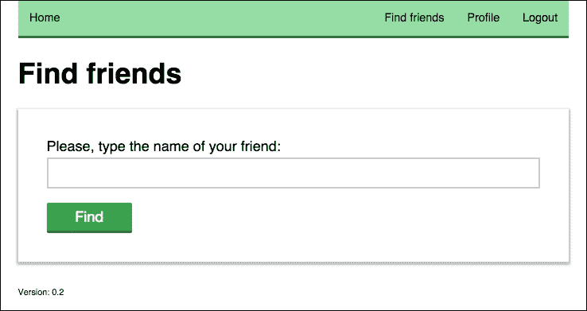
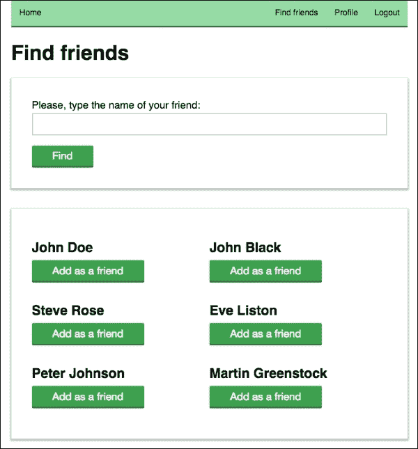
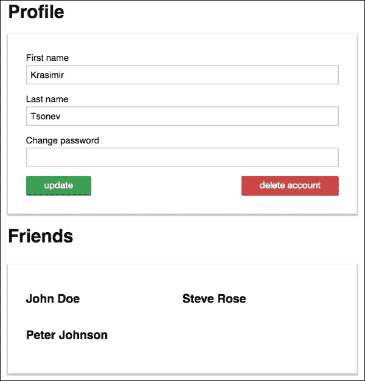

# 第六章：添加友谊功能

在第五章*管理用户*中，我们实现了用户注册和登录系统。现在我们在数据库中有用户信息，我们可以继续社交网络中最重要的特征之一——友谊。在本章中，我们将添加以下逻辑：

+   查找朋友

+   标记用户为朋友

+   在**个人资料**页面上显示已连接的用户

# 查找朋友

查找朋友的过程涉及对我们当前代码库的一系列更改。以下各节将指导我们完成搜索和显示朋友资料。我们将对我们的 REST API 进行一些改进，并定义一个新的控制器和模型。

## 添加搜索页面

到目前为止，我们已经有了注册、登录和个人资料管理页面。我们将在导航栏中添加一个新链接——`查找朋友`。为了做到这一点，我们必须按照以下方式更新`frontend/tpl/navigation.html`文件：

```js
<li class="right"><a on-click="goto:logout">Logout</a></li>
<li class="right"><a on-click="goto:profile">Profile</a></li>
<li class="right"><a on-click="goto:find-friends">Find  friends</a></li>
```

我们在最后添加的链接将把用户转发到一个新的路由。与其他页面一样，我们的路由器将捕获 URL 更改并触发处理程序。以下是`app.js`文件的小更新：

```js
Router
.add('find-friends', function() {
  if(userModel.isLogged()) {
    var p = new FindFriends();
    showPage(p);
  } else {
    Router.navigate('login');
  }
})
```

如果用户未经身份验证，则不应该能够添加新的朋友。我们将在前端应用一个简单的检查，但我们也将保护 API 调用。必须创建一个新的`FindFriends`控制器。该控制器的作用是显示一个带有输入字段和按钮的表单。用户提交表单后，我们查询数据库，然后显示与输入字符串匹配的用户。以下是控制器的开始部分：

```js
// frontend/js/controllers/FindFriends.js
module.exports = Ractive.extend({
  template: require('../../tpl/find-friends'),
  components: {
    navigation: require('../views/Navigation'),
    appfooter: require('../views/Footer')
  },
  data: {
    loading: false,
    message: '',
    searchFor: '',
    foundFriends: null
  },
  onrender: function() {
    // ...
  }
});
```

我们保留了相同的`Navigation`和`Footer`组件。有几个变量及其默认值。`loading`关键字将用作指示我们正在向 API 发出请求的标志。查找符合某些条件的朋友可能是一个复杂的操作。因此，向用户显示我们正在处理他/她的查询将是一个很好的做法。`message`属性将用于显示一切正常的确认或报告错误。最后两个变量保留数据。`searchFor`变量将承载用户输入的字符串，`foundFriends`将承载后端返回的用户。

让我们检查一下我们需要的 HTML 标记。`frontend/tpl/find-friends.html`文件包含以下内容：

```js
<header>
  <navigation></navigation>
</header>
<div class="hero">
  <h1>Find friends</h1>
</div>
<form onsubmit="return false;">
  {{#if loading}}
    <p>Loading. Please wait.</p>
  {{else}}
    <label for="friend-name">
      Please, type the name of your friend:
    </label>
    <input type="text" id="friend-name" value="{{friendName}}"/>
    <input type="button" value="Find" on-click="find" />
  {{/if}}
</form>
{{#if foundFriends !== null}}
  <div class="friends-list">
    {{#each foundFriends}}
      <div class="friend-list-item">
        <h2>{{firstName}} {{lastName}}</h2>
        <input type="button" value="Add as a friend"
         on-click="add:{{id}}"/>
      </div>
    {{/each}}
  </div>
{{/if}}
{{#if message !== ''}}
  <div class="friends-list">
    <p>{{{message}}}</p>
  </div>
{{/if}}
<appfooter />
```

`header`和`navigation`部分保持不变。顶部有一个很好放置的标题，后面是我们提到的表单。如果`loading`标志的值为`true`，我们将显示**加载中，请稍候**消息。如果我们没有在查询后端的过程中，那么我们会显示输入字段和按钮。以下截图展示了这在实践中的样子：



模板的下一部分呈现了后端发送的用户。它显示他们的姓名和一个**添加为朋友**按钮。我们将在接下来的页面中看到这个视图的截图。

HTML 标记的最后部分是用于条件显示消息。如果我们为`message`变量设置了一个值，那么 Ractive.js 将显示`div`元素并使我们的文本可见。

## 编写模型

我们有一个用户界面，可以接受用户的输入。现在，我们需要与后端通信，并检索与表单字段值匹配的用户。在我们的系统中，我们通过模型向 API 发出请求。

因此，让我们创建一个新的`frontend/js/models/Friends.js`模型：

```js
var ajax = require('../lib/Ajax');
var Base = require('./Base');

module.exports = Base.extend({
  data: {
    url: '/api/friends'
  },
  find: function(searchFor, callback) {
    ajax.request({
      url: this.get('url') + '/find',
      method: 'POST',
      data: {
        searchFor: searchFor
      },
      json: true
    })
    .done(function(result) {
      callback(null, result);
    })
    .fail(function(xhr) {
      callback(JSON.parse(xhr.responseText));
    });
  }
});
```

`friendship`功能的端点将是`/api/friends`。要在用户中进行搜索，我们在 URL 后面添加`/find`。我们将使用`POST`请求和`searchFor`变量的值进行搜索。处理结果的代码再次使用`lib/Ajax`模块，如果一切正常，它将触发指定的回调。

让我们更新调用新创建的模型及其`find`函数的控制器。在`controllers/FindFriends.js`文件的顶部，我们将添加一个`require`语句：

```js
var Friends = require('../models/Friends');
```

然后，在控制器的`render`处理程序中，我们将放置以下片段：

```js
onrender: function() {

  var model = new Friends();
  var self = this;

  this.on('find', function(e) {
    self.set('loading', true);
    self.set('message', '');
    var searchFor = this.get('friendName');
    model.find(searchFor, function(err, res) {

      if(res.friends && res.friends.length > 0) {
        self.set('foundFriends', res.friends);
      } else {
        self.set('foundFriends', null);
        self.set('message', 'Sorry, there is no friends matching <strong>' + searchFor + '<strong>');
      }
      self.set('loading', false);
    });
  });

}
```

`find`事件由表单中的按钮触发。一旦我们注册了按钮的点击，我们显示`loading`字符串并清除任何先前显示的消息。我们获取输入字段的值，并要求模型匹配用户。如果有任何潜在的朋友，我们通过为`foundFriends`变量设置一个值来呈现它们。如果没有，我们会显示一条消息，说明没有符合条件的用户。一旦我们完成了 API 方法的实现，屏幕将如下所示：



## 从数据库中获取朋友

我们需要在`backend/API.js`中进行的更改是添加一些新路由。但是，在继续查询用户之前，我们将添加一个辅助函数来获取当前用户的配置文件。我们将保留当前用户的姓名和电子邮件在一个`session`变量中，但这还不够，因为我们想显示更多的用户信息。因此，以下函数从数据库中获取完整的配置文件：

```js
var getCurrentUser = function(callback, req, res) {
  getDatabaseConnection(function(db) {
    var collection = db.collection('users');
    collection.find({ 
      email: req.session.user.email
    }).toArray(function(err, result) {
      if(result.length === 0) {
        error('No such user', res);
      } else {
        callback(result[0]);
      }
    });
  });
};
```

我们使用用户的电子邮件作为请求的标准。包含配置文件数据的对象作为回调的参数返回。

由于我们已经拥有关于当前用户的所有信息，我们可以继续实现用户搜索。应该回答这类查询的路由如下：

```js
Router
.add('api/friends/find', function(req, res) {
  if(req.session && req.session.user) {
    if(req.method === 'POST') {      
      processPOSTRequest(req, function(data) {
        getDatabaseConnection(function(db) {
          getCurrentUser(function(user) {
            findFriends(db, data.searchFor, user.friends || []);
          }, req, res);          
        });
      });
    } else {
      error('This method accepts only POST requests.', res);
    }
  } else {
    error('You must be logged in to use this method.', res);
  }
})
```

第一个`if`子句确保此路由仅对已注册并已登录的用户可访问。此方法仅接受`POST`请求。其余部分获取`searchFor`变量并调用`findFriends`函数，可以实现如下：

```js
var findFriends = function(db, searchFor, currentFriends) {
  var collection = db.collection('users');
  var regExp = new RegExp(searchFor, 'gi');
  var excludeEmails = [req.session.user.email];
  currentFriends.forEach(function(value, index, arr) {
    arr[index] = ObjectId(value);
  });
  collection.find({
    $and: [
      {
        $or: [
          { firstName: regExp },
          { lastName: regExp }
        ]
      },
      { email: { $nin: excludeEmails } },
      { _id: { $nin: currentFriends } }
    ]
  }).toArray(function(err, result) {
    var foundFriends = [];
    for(var i=0; i<result.length; i++) {
      foundFriends.push({
        id: result[i]._id,
        firstName: result[i].firstName,
        lastName: result[i].lastName
      });
    };
    response({
      friends: foundFriends
    }, res);
  });
}
```

我们系统中的用户将他们的名字分成两个变量——`firstName`和`lastName`。当用户在搜索表单字段中输入时，我们无法确定用户可能指的是哪一个。因此，我们将在数据库中搜索这两个属性。我们还将使用正则表达式来确保我们的搜索不区分大小写。

MongoDB 数据库提供了执行复杂查询的语法。在我们的情况下，我们想获取以下内容：

+   其名字的第一个或最后一个与客户端发送的条件匹配的用户。

+   与当前用户已添加的朋友不同的用户。

+   与当前用户不同的用户。我们不希望向用户提供与他们自己的配置文件的友谊。

`$nin`变量表示*值不在提供的数组中*。我们将排除当前用户的电子邮件地址。值得一提的一个小细节是，MongoDB 将用户的 ID 存储在 12 字节的 BSON 类型中。它们不是明文。因此，在发送查询之前，我们需要使用`ObjectID`函数。该方法可以通过相同的`mongodb`模块访问——`var ObjectId = require('mongodb').ObjectID`。

当数据库驱动程序返回满足我们条件的记录时，我们会过滤信息并用适当的 JSON 文件进行响应。我们不会发送用户的整个配置文件，因为我们不会使用所有数据。姓名和 ID 就足够了。

将该新路由添加到 API 将使朋友搜索起作用。现在，让我们添加逻辑，将配置文件附加到当前用户。

# 将用户标记为朋友

如果我们检查新页面的 HTML 模板，我们会发现每个呈现的用户都有一个按钮，可以触发`add`事件。让我们在我们的控制器中处理这个，并在我们的模型中运行一个类似于查找朋友的过程的函数：

```js
this.on('add', function(e, id) {
  this.set('loading', true);
  model.add(id, function(err, res) {
    self.set('foundFriends', null);
    if(err) {
      self.set('message', 'Operation failed.');
    } else if(res.success === 'OK') {
      self.set('message', 'Operation successful.');
    }
    self.set('loading', false);
  });
});
```

我们使用相同的技术来处理`loading`标志。我们将在下面的代码中介绍的模型方法接受用户的`id`值，并报告链接是否成功。我们需要清除`foundFriends`数组。否则，当前用户可能会点击同一个个人资料两次。另一个选项是只删除被点击的项目，但这涉及更多的代码。

在`models/Friends.js`中的添加如下：

```js
add: function(id, callback) {
  ajax.request({
    url: this.get('url') + '/add',
    method: 'POST',
    data: {
      id: id
    },
    json: true
  })
  .done(function(result) {
    callback(null, result);
  })
  .fail(function(xhr) {
    callback(JSON.parse(xhr.responseText));
  });
}
```

`add`和`find`方法之间的唯一区别在于，在第一个方法中，我们发送了`searchFor`，而在第二个方法中，我们发送了`id`参数。错误处理和结果响应是相同的。当然，端点也经过了调整。

我们展示个人资料，用户点击其中一些，我们的模型向后端发送`POST`请求。现在是时候实现标记用户为朋友的 API 路由了。为此，我们将通过添加一个名为`friends`的新数组来更新当前用户的个人资料，其中包含对朋友个人资料的引用：

```js
.add('api/friends/add', function(req, res) {
  if(req.session && req.session.user) {
    if(req.method === 'POST') {
      var friendId;
      var updateUserData = function(db, friendId) {
        var collection = db.collection('users');
        collection.update(
          { email: req.session.user.email },
          { $push: { friends: friendId } }, 
          done
        );
      };
      var done = function(err, result) {
        if(err) {
          error('Error updating the data.', res);
        } else {                
          response({
            success: 'OK'
          }, res);
        }
      };
      processPOSTRequest(req, function(data) {
        getDatabaseConnection(function(db) {
          updateUserData(db, data.id);
        });
      });
    } else {
      error('This method accepts only POST requests.', res);
    }
  } else {
    error('You must be logged in to use this method.', res);
  }
})
```

前面的方法再次受到保护。我们需要一个经过身份验证的用户和进行`POST`请求。在获取朋友的 ID 之后，我们使用`$push`运算符来创建（如果不存在）并填充`friends`数组。`done`函数的唯一工作是向浏览器发送响应。

本章的下一步是在用户的**个人资料**页面上显示添加的朋友。

# 在个人资料页面显示链接的用户

同样，我们将从更新我们的模板开始。在上一章中，我们创建了`frontend/tpl/profile.html`。它包含一个我们用于个人资料更新的表单。让我们在它之后添加以下代码：

```js
{{#if friends.length > 0}}
  <div class="hero">
    <h1>Friends</h1>
  </div>
  <div class="friends-list">
    {{#each friends:index}}
      <div class="friend-list-item">
        <h2>{{friends[index].firstName}}  {{friends[index].lastName}}</h2>
      </div>
    {{/each}}
  </div>
{{/if}}
```

如果 Ractive 组件有一个`friends`属性，那么我们将渲染一个用户列表。页面将显示用户的名称，看起来像下一个截图：



渲染页面的控制器也应该更新。我们应该使用在前几节中开发的相同的`models/Friends`模型。这就是为什么我们需要在顶部添加`var Friends = require('../models/Friends');`。另外三行代码将使记录的获取工作。我们将在控制器的`onrender`处理程序中添加它们，如下所示：

```js
// controllers/Profile.js
onrender: function() {

  ...

  var friends = new Friends();
  friends.fetch(function(err, result) {
    self.set('friends', result.friends);
  });
}
```

我们在控制器中还需要做的另一个小的添加是定义`friends`变量的默认值，如下所示：

```js
  data: {
    friends: []
  },
  onrender: function() {
  ...
  }
```

这一次，我们不打算更新模型。我们将使用默认的`fetch`方法，向`/api/friends`端点发送`GET`请求。唯一需要做的是在`backend/API.js`文件中进行添加。我们需要一个路由来找到当前用户的朋友并返回它们：

```js
.add('api/friends', function(req, res) {
  if(req.session && req.session.user) {
    getCurrentUser(function(user) {
      if(!user.friends || user.friends.length === 0) {
        return response({ friends: [] }, res);
      }
      user.friends.forEach(function(value, index, arr) {
        arr[index] = ObjectId(value);
      });
      getDatabaseConnection(function(db) {
        var collection = db.collection('users');
        collection.find({ 
          _id: { $in: user.friends }
        }).toArray(function(err, result) {
          result.forEach(function(value, index, arr) {
            arr[index].id = value.id;
            delete arr[index].password;
            delete arr[index].email;
            delete arr[index]._id;
          });
          response({
            friends: result
          }, res);
        });
      });
    }, req, res);
  } else {
    error('You must be logged in to use this method.', res);
  }
})
```

这是我们使用`getCurrentUser`辅助函数的第二个地方。我们没有用户的个人资料。因此，我们需要向 MongoDB 服务器发出一个额外的请求。在这种情况下，`$in`运算符对我们有帮助。再次，在将它们与查询一起发送之前，我们需要将 ID 转换为适当的格式。最后，在向浏览器响应之前，我们删除敏感信息，如 ID、密码和电子邮件。前端将收到一个包含当前登录用户的所有朋友的漂亮数组。

# 总结

在本章中，我们使得用户之间创建链接成为可能。我们加强了对前端控制器和模型的了解。我们通过一些复杂的数据库查询扩展了项目的 API，添加了一些新的方法。

在下一章中，我们将学习如何使用 Node.js 上传内容。与其他流行的社交网络一样，发布的信息将显示为用户的动态。
