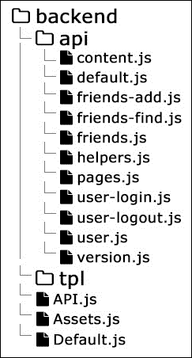

# 第八章：创建页面和事件

第七章，*发布内容*，涵盖了发布内容。我们为用户提供了一个界面，可以将文本和图像发送到我们的数据库。稍后，这些资源将显示为主页上的消息源。在本章中，我们将学习如何创建页面和附加到这些页面的事件。以下是我们将要遵循的计划：

+   重构 API

+   添加创建页面的表单

+   在数据库中创建记录

+   显示当前添加的页面

+   显示特定页面

+   在页面上发布评论

+   显示评论

+   管理附加到特定页面的事件

# 重构 API

如果您检查上一章结束时得到的文件，您会发现`backend/API.js`文件非常大。随着工作的进行，它将变得越来越难处理。我们将重构系统的这一部分。

我们有一堆辅助方法，它们在整个路由处理程序中都被使用。诸如`response`、`error`和`getDatabaseConnection`之类的函数可以放在一个外部模块中。我们将在`backend`目录下创建一个新的`api`文件夹。新创建的`helpers.js`文件将承载所有这些实用函数：

```js
// backend/api/helpers.js
var MongoClient = require('mongodb').MongoClient;
var querystring = require('querystring');
var database;

var response = function(result, res) { ... };
var error = function(message, res) { ... };
var getDatabaseConnection = function(callback) { ... };
var processPOSTRequest = function(req, callback) { ... };
var validEmail = function(value) { ... };
var getCurrentUser = function(callback, req, res) { ... };

module.exports = {
  response: response,
  error: error,
  getDatabaseConnection: getDatabaseConnection,
  processPOSTRequest: processPOSTRequest,
  validEmail: validEmail,
  getCurrentUser: getCurrentUser
};
```

我们将跳过函数的实现，以免用已经看到的代码膨胀本章。我们还复制了一些方法使用的变量。

我们重构的下一步是将所有路由处理程序提取到它们自己的方法中。到目前为止，文件的结构如下：

```js
var Router = require('../frontend/js/lib/router')();
Router
.add('api/version', function(req, res) { ... })
.add('api/user/login', function(req, res) { ... })
```

整个结构是一堆路由定义及其相应的处理程序。我们经常有一个`switch`语句来检查请求的类型。实际上，每个函数(`req`，`res`)都可以由一个独立的模块表示。再次强调，我们不会粘贴所有创建的文件的内容，但我们会谈论最终结果。重构后，我们将有以下结构：



`API.js`中的行数显著减少。现在，我们只有路由的定义及其处理程序：

```js
var Router = require('../frontend/js/lib/router')();
Router
.add('api/version', require('./api/version'))
.add('api/user/login', require('./api/user-login'))
.add('api/user/logout', require('./api/user-logout'))
.add('api/user', require('./api/user'))
.add('api/friends/find', require('./api/friends-find'))
.add('api/friends/add', require('./api/friends-add'))
.add('api/friends', require('./api/friends'))
.add('api/content', require('./api/content'))
.add('api/pages/:id', require('./api/pages'))
.add('api/pages', require('./api/pages'))
.add(require('./api/default'));
module.exports = function(req, res) {
  Router.check(req.url, [req, res]);
}
```

新文件导出的函数仍然是相同的。您唯一需要考虑的是辅助函数。您必须在所有新模块中提供它们。例如，`friends.js`文件包含以下内容：

```js
var ObjectId = require('mongodb').ObjectID;
var helpers = require('./helpers');
var response = helpers.response;
var error = helpers.error;
var getDatabaseConnection = helpers.getDatabaseConnection;
var getCurrentUser = helpers.getCurrentUser;

module.exports = function(req, res) {
  ...
}
```

查看本章附带的文件以获取完整的源代码。

# 添加创建页面的表单

我们社交网络中的每个用户都应该能够浏览和创建页面。这是一个全新的功能。因此，我们需要一个新的路由和控制器。

1.  让我们从更新`frontend/js/app.js`开始，如下所示：

```js
.add('pages', function() {
  if(userModel.isLogged()) {
    var p = new Pages();
    showPage(p);
  } else {
    Router.navigate('login');
  }    
})
.add(function() {
  Router.navigate('home');
})
```

1.  就在默认处理程序的上方，我们将注册一个路由，创建一个名为`Pages`的新控制器的实例。我们将确保访问者在看到页面之前已登录。在同一文件中，顶部我们将添加`var Pages = require('./controllers/Pages');`。

1.  让我们深入研究`controllers/Page.js`文件，看看如何引导控制器：

```js
module.exports = Ractive.extend({
  template: require('../../tpl/pages'),
  components: {
    navigation: require('../views/Navigation'),
    appfooter: require('../views/Footer')
  },
  data: { },
  onrender: function() { }
});
```

1.  `onrender`函数仍然是空的，但我们将在接下来的几节中填充它。支持此页面的模板位于`frontend/tpl/pages.html`中：

```js
<header>
  <navigation></navigation>
</header>
<div class="hero">
  <form enctype="multipart/form-data" method="post">
    <h3>Add a new page</h3>
    {{#if error && error != ''}}
      <div class="error">{{error}}</div>
    {{/if}}
    {{#if success && success != ''}}
      <div class="success">{{{success}}}</div>
    {{/if}}
    <label>Title</label>
    <textarea value="{{title}}"></textarea>
    <label>Description</label>
    <textarea value="{{description}}"></textarea>
    <input type="button" value="Create" on-click="create" />
  </form>
</div>
<appfooter />
```

代码看起来类似于上一章中创建 UI 以添加内容时使用的代码。我们有成功和错误消息的占位符。有两个变量，`title`和`description`，以及一个分派`create`事件的按钮。

# 在数据库中创建记录

让我们继续处理用户按下**创建**按钮的情况。用户执行此操作后，我们必须获取文本区域的内容并向后端提交请求。因此，我们需要一个新的模型。让我们称之为`Pages.js`并将其保存在`models`目录下：

```js
// frontend/js/models/Pages.js
var ajax = require('../lib/Ajax');
var Base = require('./Base');
module.exports = Base.extend({
  data: {
    url: '/api/pages'
  },
  create: function(formData, callback) {
    var self = this;
    ajax.request({
      url: this.get('url'),
      method: 'POST',
      formData: formData,
      json: true
    })
    .done(function(result) {
      callback(null, result);
    })
    .fail(function(xhr) {
      callback(JSON.parse(xhr.responseText));
    });
  }
});
```

我们已经在上一章中讨论了`FormData`接口。我们将要使用的 API 端点是`/api/pages`。这是我们将发送`POST`请求的 URL。

现在我们已经显示了表单，并且模型已准备好进行后端通信，我们可以继续在控制器中编写代码。`onrender`处理程序是监听`create`事件的正确位置：

```js
onrender: function() {
  var model = new PagesModel();
  var self = this;
  this.on('create', function() {
    var formData = new FormData();
    formData.append('title', this.get('title'));
    formData.append('description', this.get('description'));
    model.create(formData, function(error, result) {
      if(error) {
        self.set('error', error.error);
      } else {
        self.set('title', '');
        self.set('description', '');
        self.set('error', false);
        self.set('success', 'The page was created successfully.
      }
    });
  });
}
```

模型的初始化在顶部。在获取用户填写的数据之后，我们将调用模型的`create`方法，并在之后处理响应。如果出现问题，我们的应用程序会显示错误消息。

这一部分的最后一步是更新 API，以便我们可以将数据保留在我们的数据库中。仍然没有与`/api/pages`匹配的路由。因此，让我们添加一个：

```js
// backend/API.js
.add('api/pages', require('./api/pages'))
.add(require('./api/default'));
```

我们重构了 API，以便处理请求的代码转到新的`/backend/api/pages.js`文件。在前几行中，有我们的辅助方法的快捷方式：

```js
var ObjectId = require('mongodb').ObjectID;
var helpers = require('./helpers');
var response = helpers.response;
var error = helpers.error;
var getDatabaseConnection = helpers.getDatabaseConnection;
var getCurrentUser = helpers.getCurrentUser;
```

这是在新的`pages`集合中创建新记录的代码。它可能看起来有点长，但其中的大部分内容已经在第七章中涵盖了，*发布内容*：

```js
module.exports = function(req, res) {
  var user;
  if(req.session && req.session.user) {
    user = req.session.user;
  } else {
    error('You must be logged in in order to use this  method.', res);
    return;
  }
  switch(req.method) {
    case 'GET': break;
    case 'POST':
      var formidable = require('formidable');
      var form = new formidable.IncomingForm();
      form.parse(req, function(err, formData, files) {
        var data = {
          title: formData.title,
          description: formData.description
        };
        if(!data.title || data.title === '') {
          error('Please add some title.', res);
        } else if(!data.description || data.description === '') {
          error('Please add some description.', res);
        } else {
          var done = function() {
            response({
              success: 'OK'
            }, res);
          }
          getDatabaseConnection(function(db) {
            getCurrentUser(function(user) {
              var collection = db.collection('pages');
              data.userId = user._id.toString();
              data.userName = user.firstName + ' ' + user.lastName;
              data.date = new Date();
              collection.insert(data, done);
            }, req, res);
          });
        }
      });
    break;
  };
}
```

创建和浏览页面是仅供已登录用户使用的功能。导出函数的前几行检查当前访问者是否有有效的会话。前端发送一个不带文件的`POST`请求，但我们仍然需要`formidable`模块，因为它具有良好的编程接口并且易于使用。每个页面都应该有标题和描述，我们将检查它们是否存在。如果一切正常，我们将使用众所周知的`getDatabaseConnection`函数在数据库中创建新记录。

# 显示当前添加的页面

很高兴我们开始将创建的页面保存在数据库中。但是，向用户显示页面，以便他们可以访问并添加评论也将是很好的。为了做到这一点，我们必须修改我们的 API，以便返回页面信息。如果您查看前面的代码，您会发现有一个留空的`GET`情况。以下代码获取所有页面，按日期排序，并将它们发送到浏览器：

```js
case 'GET':
  getDatabaseConnection(function(db) {
    var collection = db.collection('pages');
    collection.find({ 
      $query: { },
      $orderby: {
        date: -1
      }
    }).toArray(function(err, result) {
      result.forEach(function(value, index, arr) {
        arr[index].id = value._id;
        delete arr[index].userId;
      });
      response({
        pages: result
      }, res);
    });
  });
break;
```

在将 JSON 对象发送到前端之前，我们将删除创建者的 ID。用户的名称已经存在，将这些 ID 仅保留在后端是一个很好的做法。

快速重启后，当我们访问`/api/pages`时，Node.js 服务器将返回创建的页面。让我们继续前进，并更新我们应用程序客户端的`controllers/Pages.js`文件。在`onrender`处理程序中，我们将追加以下代码：

```js
var getPages = function() {
  model.fetch(function(err, result) {
    if(!err) {
      self.set('pages', result.pages);
    } else {
      self.set('error', err.error);
    }
  });
};
getPages();
```

我们将新添加的逻辑封装在一个函数中，因为当创建新页面时，我们必须经历相同的事情。模型完成了大部分工作。我们将简单地将对象数组分配给`pages`变量。此变量在组件的模板—`frontend/tpl/pages.html`—中使用如下：

```js
{{#each pages:index}}
  <div class="content-item">
    <h2>{{pages[index].title}}</h2>
    <p><small>Created by {{pages[index].userName}}</small></p>
    <p>{{pages[index].description}}</p>
    <p><a href="/pages/{{pages[index].id}}" class="button">Visit the page</a></p>
  </div>
{{/each}}
```

在下一节中，您将学习如何仅显示特定页面。我们在此代码中添加的链接将用户转发到新地址。此链接是一个包含仅一个页面信息的 URL。

# 展示特定页面

再次，要显示特定页面，我们需要更新我们的 API。我们有返回所有页面的代码，但如果要返回其中一个页面，则没有解决方案。我们肯定会使用页面的 ID。因此，这里是一个可以添加到`backend/API.js`的新路由：

```js
.add('api/pages/:id', require('./api/pages'))
.add('api/pages', require('./api/pages'))
```

您应该记住路由的顺序很重要。包含页面 ID 的路由应该在显示页面列表的路由之上。否则，应用程序将不断列出新的 URL，但我们将保持相同的处理程序。如果地址中有任何动态部分，我们的路由器会向函数发送一个额外的参数。因此，在`backend/api/pages.js`中，我们将`module.exports = function(req, res)`更改为`module.exports = function(req, res, params)`。在同一个文件中，我们将从数据库中获取所有页面。在这种情况下，我们希望修改代码，使得函数只返回与 URL 中传递的 ID 匹配的一条记录。到目前为止，我们的 MongoDB 查询看起来是这样的：

```js
collection.find({ 
  $query: { },
  $orderby: {
    date: -1
  }
}
```

在实践中，我们没有标准。现在，让我们将前面的代码更改为以下内容：

```js
var query;
if(params && params.id) {
  query = { _id: ObjectId(params.id) };
} else {
  query = {};
}
collection.find({ 
  $query: query,
  $orderby: {
    date: -1
  }
}
```

通过定义一个`query`变量，我们使得这个 API 方法的响应是有条件的。它取决于 URL 中 ID 的存在。如果有任何这样的 ID，它仍然返回一个对象数组，但里面只有一个项目。

在前端，我们可以使用相同的方法，或者换句话说，相同的控制器来处理两种情况——显示所有页面和仅显示一个页面。我们注册一个新的路由处理程序，将用户转发到相同的`Pages`控制器，如下所示：

```js
// frontend/js/app.js
.add('pages/:id', function(params) {
  if(userModel.isLogged()) {
    var p = new Pages({ 
      data: {
        pageId: params.id
      }
    });
    showPage(p);
  } else {
    Router.navigate('login');
  }
})
```

这一次，在控制器初始化期间传递了配置。在`data`属性中设置值会创建稍后在组件及其模板中可用的变量。在我们的情况下，`pageId`将通过`this.get('pageId')`访问。如果变量不存在，那么我们处于显示所有页面的模式。以下行显示单个页面的标题和描述：

```js
// controllers/Page.js
onrender: function() {
  var model = new PagesModel();
  var self = this;

  var pageId = this.get('pageId');
  if(pageId) {
    model.getPage(pageId, function(err, result) {
      if(!err && result.pages.length > 0) {
        var page = result.pages[0];
        self.set('pageTitle', page.title);
        self.set('pageDescription', page.description);
      } else {
        self.set('pageTitle', 'Missing page.');
      }
    });
    return;
  }

  …
```

到目前为止，我们使用的模型执行`POST`和`GET`请求，但在这种情况下我们不能使用它们。它们是为其他功能保留的。我们需要另一种接受页面 ID 的方法。这就是为什么我们将添加一个新的`getPage`函数：

```js
// models/Pages.js
getPage: function(pageId, callback) {
  var self = this;
  ajax.request({
    url: this.get('url') + '/' + pageId,
    method: 'GET',
    json: true
  })
  .done(function(result) {
    callback(null, result);
  })
  .fail(function(xhr) {
    callback(JSON.parse(xhr.responseText));
  });
}
```

我们没有任何数据要发送。我们只有一个不同的终端 URL。页面的 ID 附加在`/api/pages`字符串的末尾。这一部分始于后端的更改，以便我们知道 API 返回一个元素的数组。其余部分是设置`pageTitle`和`pageDescription`。

在模板中，我们使用相同的模式。您可以检查`pageId`是否存在，这就足以判断我们是否需要显示一个页面还是多个页面：

```js
{{#if pageId}}
  <div class="hero">
    <h1>{{pageTitle}}</h1>
    <p>{{pageDescription}}</p>
  </div>
  <hr />
{{else}}
  <div class="hero">
    <form enctype="multipart/form-data" method="post">
      ...
    </form>
  </div>
  {{#each pages:index}}
    ...
  {{/each}}
{{/if}}
```

在更改`frontend/tpl/pages.html`之后，我们为每个页面都有了一个唯一的 URL。然而，一个具有静态标题和描述的页面对于用户来说并不是很有趣。让我们添加一个评论部分。

# 发布评论到页面

在发送和处理 HTTP 请求的部分之前，我们必须提供一个用户界面来创建评论。我们将在`frontend/tpl/pages.html`中的页面标题和描述下方添加一个表单：

```js
<form enctype="multipart/form-data" method="post">
  <h3>Add a comment for this page</h3>
  {{#if error && error != ''}}
    <div class="error">{{error}}</div>
  {{/if}}
  {{#if success && success != ''}}
    <div class="success">{{{success}}}</div>
  {{/if}}
  <label for="text">Text</label>
  <textarea value="{{text}}"></textarea>
  <input type="button" value="Post" on-click="add-comment" />
</form>
```

点击按钮后触发的事件是`add-comment`。`Pages`控制器应该处理它并向后端发送请求。

如果你停下来思考一下评论的外观，你会注意到它们与用户在用户动态中看到的常规用户帖子相似。因此，我们将把评论保存为常规帖子，而不是在`pages`集合中创建新的集合或存储复杂的数据结构。对于客户端的代码来说，这意味着`ContentModel`类的一个更多的用例：

```js
// controllers/Pages.js
this.on('add-comment', function() {
  var contentModel = new ContentModel();
  var formData = new FormData();
  formData.append('text', this.get('text'));
  formData.append('pageId', pageId);
  contentModel.create(formData, function(error, result) {
    self.set('text', '');
    if(error) {
      self.set('error', error.error);
    } else {
      self.set('error', false);
      self.set('success', 'The post is saved successfully.');
    }
  });
});
```

模型的使用方式是相同的，除了一个事情——我们发送了一个额外的`pageId`变量。我们需要一些东西来区分在主页上发布的帖子和作为评论发布的帖子。API 仍然不会保存`pageId`。因此，我们必须在`backend/api/content.js`中进行一点更新，如下所示：

```js
form.parse(req, function(err, formData, files) {
  var data = {
    text: formData.text
  };
  if(formData.pageId) {
    data.pageId = formData.pageId;
  }
  …
```

当用户发表评论时，数据库中的记录将包含`pageId`属性。这足以使评论远离主页。另外，从另一个角度来看，这足以仅显示特定页面的评论。

# 显示评论

我们应该更新返回页面作为对象的 API 方法。除了标题和描述，我们还必须呈现一个新的`comments`属性。让我们打开`backend/api/pages.js`并创建一个函数来获取评论：

```js
var getComments = function(pageId, callback) {
  var collection = db.collection('content');
  collection.find({ 
    $query: {
      pageId: pageId
    },
    $orderby: {
      date: -1
    }
  }).toArray(function(err, result) {
    result.forEach(function(value, index, arr) {
      delete arr[index].userId;
      delete arr[index]._id;
    });
    callback(result);
  });
}
```

在前述方法中的关键时刻是形成 MongoDB 查询。这是我们过滤帖子并仅获取与传递的 ID 匹配的页面所做的地方。以下是对`GET`请求的更新代码：

```js
getDatabaseConnection(function(db) {
  var query;
  if(params && params.id) {
    query = { _id: ObjectId(params.id) };
  } else {
    query = {};
  }
  var collection = db.collection('pages');
  var getComments = function(pageId, callback) { ... }
  collection.find({ 
    $query: query,
    $orderby: {
      date: -1
    }
  }).toArray(function(err, result) {
    result.forEach(function(value, index, arr) {
      arr[index].id = value._id;
      delete arr[index]._id;
      delete arr[index].userId;
    });
    if(params.id && result.length > 0) {
      getComments(params.id, function(comments) {
        result[0].comments = comments;
        response({
          pages: result
        }, res);
      });
    } else {
      response({
        pages: result
      }, res);
    }
  });
});
```

有两种类型的响应。第一种是当我们在 URL 中添加了 ID 时使用，换句话说，当我们显示有关页面的信息时。在这种情况下，我们还必须获取评论。在另一种情况下，我们不需要评论，因为我们将仅显示列表。检查`params.id`是否存在足以决定发送哪种类型的响应。

一旦后端开始返回评论，我们将编写代码在浏览器中显示它们。在`frontend/js/controllers/Pages.js`中，我们将设置页面的标题和描述。我们可以直接将`comments`数组传递给模板，并循环遍历帖子，如下所示：

```js
var showPage = function() {
  model.getPage(pageId, function(err, result) {
    if(!err && result.pages.length > 0) {
      var page = result.pages[0];
      self.set('pageTitle', page.title);
      self.set('pageDescription', page.description);
      self.set('comments', page.comments);
    } else {
      self.set('pageTitle', 'Missing page.');
    }
  });
}
showPage();
```

我们将`model.getPage`的调用包装在一个函数中，以便我们可以在添加新评论后再次触发它。

这是模板中需要显示帖子下方的小更新：

```js
{{#each comments:index}}
  <div class="content-item">
    <h2>{{comments[index].userName}}</h2>
    <p>{{comments[index].text}}</p>
  </div>
{{/each}}
```

# 管理附加到特定页面的事件

本章我们将添加的最后一个功能是与一些创建的页面相关联的事件。到目前为止，我们有评论，实际上是保存在`content`集合中的普通帖子。我们将扩展实现并创建另一种类型的帖子。这些帖子仍然具有`pageId`属性，以便它们与动态源的帖子不同。但是，我们将引入一个`eventDate`变量。

在前端，我们需要一个新的 URL。我们应该保持包含页面 ID 的相同模式。这很重要，因为我们希望在正确的位置显示事件，而不希望将它们与页面列表混在一起。以下是新的路由注册：

```js
// frontend/js/app.js
.add('pages/:id/:events', function(params) {
  if(userModel.isLogged()) {
    var p = new Pages({ 
      data: {
        pageId: params.id,
        showEvents: true
      }
    });
    showPage(p);
  } else {
    Router.navigate('login');
  }
})
```

`Pages`控制器的模板肯定需要更改。我们需要支持两种视图。第一个显示一个表单和评论，第二个显示一个表单和事件列表。 `showEvents`变量将告诉我们要呈现哪种变体：

```js
// frontend/tpl/pages.html
{{#if showEvents}}
  <form enctype="multipart/form-data" method="post">
    <a href="/pages/{{pageId}}" class="button m-right right">View comments</a>
    <h3>Add new event</h3>
    ...
  </form>
  {{#each events:index}} … {{/each}}
{{else}}
  <form enctype="multipart/form-data" method="post">
    <a href="/pages/{{pageId}}/events" class="button right">View events</a>
    <h3>Add a comment for this page</h3>
    ...
  </form>
  {{#each comments:index}} … {{/each}}
{{/if}}
```

为了在视图之间切换，我们添加了两个额外的链接。当我们检查评论时，我们将看到**查看事件**，当我们跳转到事件时，我们将看到**查看评论**。

`controllers/Pages.js`文件也需要进行实质性更新。最重要的是，我们需要添加一个来自模板的`add-event`事件处理程序。当用户在新事件表单中按下按钮时触发它。它看起来像这样：

```js
this.on('add-event', function() {
  var contentModel = new ContentModel();
  var formData = new FormData();
  formData.append('text', this.get('text'));
  formData.append('eventDate', this.get('date'));
  formData.append('pageId', pageId);
  contentModel.create(formData, function(error, result) {
    ...
  });
});
```

这类似于添加评论，但是对于额外的`eventDate`属性。它也应该被设置为去`content`集合的对象的属性：

```js
// backend/api/content.js
if(formData.pageId) {
  data.pageId = formData.pageId;
}
if(formData.eventDate) {
  data.eventDate = formData.eventDate;
}
```

同一前端控制器的另一个更改是关于在模板中显示事件（帖子）列表。当我们获取页面的标题和描述时，我们知道我们将收到一个`comments`属性。后端将在一分钟内更新，但我们将假设我们还将有一个`events`属性。因此，我们将简单地将数组发送到模板：

```js
self.set('events', page.events);
```

在后端，我们已经从属于当前页面的`content`集合中获取了记录。问题在于记录现在是评论和事件的混合体。我们在上一节中添加的`getComments`函数可以更改为`getPageItems`，其实现基本上如下所示：

```js
var getPageItems = function(pageId, callback) {
  var collection = db.collection('content');
  collection.find({ 
    $query: {
      pageId: pageId
    },
    $orderby: {
      date: -1
    }
  }).toArray(function(err, result) {
    var comments = [];
    var events = [];
    result.forEach(function(value, index, arr) {
      delete value.userId;
      delete value._id;
      if(value.eventDate) {
        events.push(value);
      } else {
        comments.push(value);                
      }
    });
    events.sort(function(a, b) {
      return a.eventDate > b.eventDate;
    });
    callback(comments, events);
  });
}
```

我们形成了两个不同的`events`和`comments`数组。根据`eventDate`的存在，我们将用记录填充它们。在执行回调之前，我们将按日期对事件进行排序，先显示较早的事件。我们要做的最后一件事是使用`getPageItem`：

```js
getPageItems(params.id, function(comments, events) {
  result[0].comments = comments;
  result[0].events = events;
  …
}
```

# 总结

在本章中，我们扩展了我们的社交网络。现在每个客户都能够创建自己的页面，在那里留下评论或创建与页面相关的活动。我们的架构中添加了许多新组件。我们成功地重用了前几章的代码，这对于保持我们的代码库较小是很好的。

在第九章*标记、分享和点赞*中，我们将讨论帖子的标记、点赞和分享。
