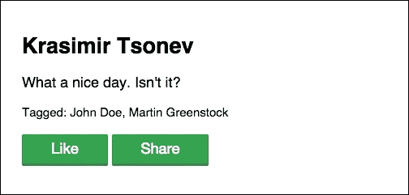

# 第九章，“标记、分享和喜欢”

第八章，“创建页面和事件”，是关于创建页面并将事件附加到它们上面。我们还使得评论的发布成为可能。在本书的这一部分，我们将添加三个新功能。几乎每个社交网络都包含一种喜欢帖子的方式。这是一种很好的方式来对你感兴趣的帖子进行排名。分享是另一个流行的过程，包括发布已经存在的帖子。有时，我们想把帖子转发给我们的一些朋友。在这些情况下，我们会**标记**人。这三个功能将在本章中实现。以下是将指导我们完成开发过程的各个部分：

+   选择朋友并将他们的 ID 发送到后端

+   存储标记的用户并在用户的动态中显示它们

+   分享帖子

+   喜欢帖子并计算喜欢的数量

+   显示喜欢的数量

# 选择朋友并将他们的 ID 发送到后端

我们将从不仅随机用户的标记开始，还包括当前用户的朋友。我们想要构建的功能将放置在主页上。创建新帖子的表单将包含一个复选框列表。非常第一步将是从 API 中获取朋友。在第六章，“添加友谊功能”中，我们已经做到了。我们有一个`models/Friends.js`文件，查询 Node.js 服务器并返回用户列表。所以，让我们使用它。在`controllers/Home.js`的顶部，我们将添加以下内容：

```js
var Friends = require('../models/Friends');
```

稍后，在`onrender`处理程序中，我们将使用所需的模块。API 的结果将以以下方式设置为本地`friends`变量的值：

```js
var friends = new Friends();
friends.fetch(function(err, result) {
  if (err) { throw err; }
  self.set('friends', result.friends);
});
```

控制器在其数据结构中有用户的朋友，我们可以更新模板。我们将通过记录进行循环，并以以下方式为每个用户显示复选框：

```js
// frontend/tpl/home.html
{{#if friends.length > 0}}
<p>Tag friends:
{{#each friends:index}}
  <label>
    <input type="checkbox" name="{{taggedFriends}}"  value="{{friends[index].id}}" />
    {{friends[index].firstName}} 
    {{friends[index].lastName}}
  </label>
{{/each}}
</p>
{{/if}}
```

Ractive.js 框架很好地处理复选框组。在我们的情况下，JavaScript 组件将接收一个名为`taggedFriends`的变量。它将是一个选定用户的数组，或者如果用户没有选择任何内容，则为空数组。预期的输出是用户的朋友列表，以复选框和标签的形式呈现。

一旦 Gulp 编译了模板的新版本并且我们点击浏览器的刷新按钮，我们将在屏幕上看到我们的朋友。我们将选择其中一些，填写帖子的内容，然后按下**发布**按钮。应用程序向 API 发送请求，但没有标记的朋友。需要进行一次更改来修复这个问题。在`controllers/Home.js`文件中，我们必须使用`taggedFriends`变量的值，如下所示：

```js
formData.append('text', this.get('text'));
formData.append('taggedFriends', JSON.stringify(this.get('taggedFriends')));
model.create(formData, function(error, result) {
  ...
});
```

FormData API 只接受 Blob、文件或字符串值。我们不能发送一个字符串数组。因此，我们将使用`JSON.stringify`将`taggedFriends`序列化为字符串。在下一节中，我们将使用`JSON.parse`将字符串转换为对象。`JSON`接口在浏览器和 Node.js 环境中都可用。

# 存储标记的用户并在用户的动态中显示它们

现在，除了文本和文件，我们还发送一个用户 ID 列表——应该在帖子中标记的用户。如前所述，它们以字符串的形式传递到服务器。我们需要使用`JSON.parse`将它们转换为常规数组。以下行是`backend/api/content.js`模块的一部分：

```js
var form = new formidable.IncomingForm();
form.multiples = true;
form.parse(req, function(err, formData, files) {
  var data = {
    text: formData.text
  };
  if(formData.pageId) {
    data.pageId = formData.pageId;
  }
  if(formData.eventDate) {
    data.eventDate = formData.eventDate;
  }
  if(formData.taggedFriends) {
    data.taggedFriends = JSON.parse(formData.taggedFriends);
  }
  ...
```

`content.js`模块是`formidable`提供的前端发送的数据的地方。在此代码片段的末尾，我们从先前序列化的字符串中重构了数组。

我们可以轻松地进行这种改变并存储`data`对象。实际上，在客户端，我们将接收包含`taggedFriends`属性的帖子。然而，我们对显示朋友的名称而不是他们的 ID 感兴趣。如果前端控制器具有 ID 并且需要名称，那么它应该执行另一个 HTTP 请求到 API。这可能会导致大量的 API 查询，特别是如果我们显示了许多消息。为了防止这种情况，我们将在后端获取帖子时获取标记的人的名称。这种方法有自己的缺点，但与前面提到的变体相比仍然更好。

让我们创建一个包装所需逻辑的函数，并在保存信息到数据库之前使用它：

```js
// backend/api/content.js
var getFriendsProfiles = function(db, ids, callback) {
  if(ids && ids.length > 0) {
    var collection = db.collection('users');
    ids.forEach(function(value, index, arr) {
      arr[index] = ObjectId(value);
    });
    collection.find({ 
      _id: { $in: ids }
    }).toArray(function(err, friends) {
      var result = [];
      friends.forEach(function(friend) {
        result.push(friend.firstName + ' ' + friend.lastName);
      });
      callback(result);
    });  
  } else {
    callback([]);
  }
}
```

我们为 MongoDB 查询准备了用户的 ID。在这种情况下，需要`$in`运算符，因为我们希望获取与`ids`数组中的任何项目匹配的 ID 的记录。当 MongoDB 驱动程序返回数据时，我们创建另一个包含朋友名称的数组。`GetFriendsProfiles`将在接下来的几页中使用，我们将更新帖子的动态获取。

实际的数据存储仍然是相同的。唯一的区别是`data`对象现在包含`taggedFriends`属性：

```js
getDatabaseConnection(function(db) {
  getCurrentUser(function(user) {
    var collection = db.collection('content');
    data.userId = user._id.toString();
    data.userName = user.firstName + ' ' + user.lastName;
    data.date = new Date();
    processFiles(user._id, function(file) {
      if(file) {
        data.file = file;
      }
      collection.insert(data, done);
    });
  }, req, res);
});
```

如果我们创建一个新帖子并检查数据库中的记录，我们会看到类似于这样的东西：

```js
{
  "text": "What a nice day. Isn't it?",
  "taggedFriends": [
    "54b235be6fd75df10c278b63",
    "5499ded286c27ff13a36b253"
  ],
  "userId": "5499ded286c27ff13a36b253",
  "userName": "Krasimir Tsonev",
  "date": ISODate("2015-02-08T20:54:18.137Z")
}
```

现在，让我们更新数据库记录的获取。我们有我们朋友的 ID，但我们需要他们的名称。因此，在同一个`content.js`文件中，我们将放置以下代码：

```js
var numberOfPosts = result.length;
var friendsFetched = function() {
  numberOfPosts -= 1;
  if(numberOfPosts === 0) {
    response({
      posts: result
    }, res);
  }
}
result.forEach(function(value, index, arr) {
  arr[index].id = ObjectId(value._id);
  arr[index].ownPost = user._id.toString() ===  ObjectId(arr[index].userId).toString();
  arr[index].numberOfLikes = arr[index].likes ?  arr[index].likes.length : 0;
  delete arr[index].userId;
  delete arr[index]._id;
  getFriendsProfiles(db, arr[index].taggedFriends,  function(friends) {
    arr[index].taggedFriends = friends;
    friendsFetched();
  });
});
```

我们在`results`数组中有来自数据库的项目。遍历帖子仍然是相同的，但在`forEach`调用之后不发送响应。对于列表中的每个帖子，我们需要向 MongoDB 数据库发送请求并获取朋友的名称。因此，我们将初始化`numberOfPosts`变量，并且每次朋友名称的请求完成时，我们将减少该值。一旦它减少到 0，我们就知道最后一个帖子已经处理完毕。之后，我们将向浏览器发送响应。

这是`frontend/tpl/home.html`文件的一个小更新，将使`taggedFriends`数组可见：

```js
{{#each posts:index}}
  <div class="content-item">
    <h2>{{posts[index].userName}}</h2>
    {{posts[index].text}}
    {{#if posts[index].taggedFriends.length > 0}}
      <p>
        <small>
          Tagged: {{posts[index].taggedFriends.join(', ')}}
        </small>
      </p>
    {{/if}}
    {{#if posts[index].file}}
    
    {{/if}}
  </div>
{{/each}}
```

除了所有者、文本和图片（如果有的话），我们还检查是否有任何标记的人。如果有任何标记的人，那么我们将使用给定的分隔符连接`taggedFriends`数组的所有元素。结果看起来像下面的截图：


## 分享帖子

我们应用的分享功能将为当前用户提供重新发布已创建帖子的选项。我们应该确保用户不分享自己的记录。因此，让我们从那里开始。API 返回帖子并知道谁创建了它们。它还知道哪个用户正在发出请求。以下代码创建了一个名为`ownPost`的新属性：

```js
// backend/api/content.js
getCurrentUser(function(user) {
  ...
  getDatabaseConnection(function(db) {
    var collection = db.collection('content');
    collection.find({ 
      ...
    }).toArray(function(err, result) {
      result.forEach(function(value, index, arr) {
        arr[index].id = ObjectId(value._id);
        arr[index].ownPost = user._id.toString() ===  ObjectId(arr[index].userId).toString();
        delete arr[index].userId;
        delete arr[index]._id;
      });
      response({ posts: result }, res);
    });
  });
}, req, res);
```

这是准备帖子并将其发送到浏览器的逻辑。`getCurrentUser`属性返回当前发出请求的用户。`user._id`变量正是我们需要的。这个 ID 实际上分配给了每个帖子的`userId`属性。因此，我们将简单地比较它们，并确定是否允许分享。如果`ownPost`变量等于`true`，那么用户就不应该能够分享帖子。

在上一节中，我们添加了一个新的标记朋友的标记以显示标记的朋友。它们下方的空间似乎是放置**分享**按钮的好地方：

```js
{{#if posts[index].taggedFriends.length > 0}}
  <p>
    <small>
      Tagged: {{posts[index].taggedFriends.join(', ')}}
    </small>
  </p>
{{/if}}
{{#if !posts[index].ownPost}}
<p><input type="button" value="Share"  on-click="share:{{posts[index].id}}" /></p>
{{/if}}
```

在这里，新的`ownPost`属性开始发挥作用。如果帖子不是由当前用户发布的，那么我们将显示一个按钮，用于触发`share`事件。Ractive.js 为我们提供了发送数据的机会。在我们的情况下，这是帖子的 ID。

主页的控制器应该监听这个事件。`controllers/Home.js`的快速更新添加了监听器，如下所示：

```js
this.on('share', function(e, id) {
  var formData = new FormData();
  formData.append('postId', id);
  model.sharePost(formData, getPosts);
});
```

`model`对象是`ContentModel`类的一个实例。分享是一个新功能。因此，我们需要向不同的 API 端点发送查询。新的`sharePost`方法如下所示：

```js
// frontend/js/models/Content.js
sharePost: function(formData, callback) {
  var self = this;
  ajax.request({
    url: this.get('url') + '/share',
    method: 'POST',
    formData: formData,
    json: true
  })
  .done(function(result) {
    callback(null, result);
  })
  .fail(function(xhr) {
    callback(JSON.parse(xhr.responseText));
  });
}
```

我们在上一章中多次使用了与前面相似的代码。它向特定 URL 的后端发送一个`POST`请求。在这里，URL 是`/api/content/share`。还要提到的是，`formData`包含我们想要分享的帖子的 ID。

让我们继续，在 API 中进行必要的更改。我们已经定义了将承载此功能的 URL——`/api/content/share`。需要在`backend/API.js`中添加一个新路由，如下所示：

```js
.add('api/content/share', require('./api/content-share'))
```

下一步涉及创建`content-share`控制器。像每个其他控制器一样，我们将从要求助手开始。我们将跳过这部分，直接转到处理`POST`请求：

```js
// backend/api/content-share.js
case 'POST':
  var formidable = require('formidable');
  var form = new formidable.IncomingForm();
  form.parse(req, function(err, formData, files) {
    if(!formData.postId) {
      error('Please provide ID of a post.', res);
    } else {
      var done = function() {
        response({
          success: 'OK'
        }, res);
      };
      // ...
    }
  });
break;
```

上述方法期望一个`postId`变量。如果没有这样的变量，那么我们将以错误响应。代码的其余部分再次涉及`formidable`模块的使用和定义`done`函数以发送成功操作的响应。以下是更有趣的部分：

```js
getDatabaseConnection(function(db) {
  getCurrentUser(function(user) {
    var collection = db.collection('content');
    collection
    .find({ _id: ObjectId(formData.postId) })
    .toArray(function(err, result) {
      if(result.length === 0) {
        error('There is no post with that ID.', res);
      } else {
        var post = result[0];
        delete post._id;
        post.via = post.userName;
        post.userId = user ._id.toString();
        post.userName = user.firstName + ' ' + user.lastName;
        post.date = new Date();
        post.taggedFriends = [];
        collection.insert(post, done);
      }
    });
  }, req, res);
```

在找到应该分享的帖子后，我们将准备一个将保存为新记录的对象。我们需要对原始帖子执行一些操作：

```js
var post = result[0];
delete post._id;
post.via = post.userName;
post.userId = user ._id.toString();
post.userName = user.firstName + ' ' + user.lastName;
post.date = new Date();
post.taggedFriends = [];
collection.insert(post, done);
```

我们确实不需要`_id`属性。MongoDB 将创建一个新的。第三行定义了一个`via`属性。我们将在一分钟内讨论这个问题，但简而言之，它用于显示帖子的原始作者。`via`后面的行设置了新记录的所有者。日期也被更改了，由于这是一个新帖子，我们清除了`taggedFriends`数组。

共享的帖子现在在数据库中，并显示在用户的动态中。让我们使用`via`属性，并以以下方式显示帖子的原始创建者：

```js
// frontend/tpl/home.html
{{#each posts:index}}
<div class="content-item">
  <h2>{{posts[index].userName}}</h2>
  <p>{{posts[index].text}}</p>
  {{#if posts[index].via}}
  <small>via {{posts[index].via}}</small>
  {{/if}}
  …
```

我们将检查变量是否可用，如果是，那么我们将在帖子文本下面添加一小段文字。结果将如下所示：


# 喜欢帖子并计算喜欢的数量

我们的社交网络用户应该能够看到一个**喜欢**按钮。点击它，他们将向 API 发送一个请求，我们的任务是计算这些点击。当然，每个用户只允许点击一次。与上一节一样，我们将从更新用户界面开始。让我们以以下方式在**分享**旁边添加另一个按钮：

```js
// frontend/tpl/home.html
<input type="button" value="Like"  on-click="like:{{posts[index].id}}" />
{{#if !posts[index].ownPost}}
<input type="button" value="Share"  on-click="share:{{posts[index].id}}" />
{{/if}}
```

新按钮分派了一个`like`事件，我们将再次传递帖子的 ID。这实际上类似于`share`事件。此外，喜欢的动作将使用与后端相同类型的通信。因此，重构我们的代码并仅使用一个函数来处理这两个功能是有意义的。在上一节中，我们在`models/Content.js`文件中添加了`sharePost`方法。让我们以以下方式将其更改为`usePost`：

```js
usePost: function(url, formData, callback) {
  var self = this;
  ajax.request({
    url: this.get('url') + '/' + url,
    method: 'POST',
    formData: formData,
    json: true
  })
  .done(function(result) {
    callback(null, result);
  })
  .fail(function(xhr) {
    callback(JSON.parse(xhr.responseText));
  });
}
```

因为唯一不同的是 URL，我们将其定义为参数。`formData`接口仍然包含帖子的 ID。以下是我们控制器的更新代码：

```js
// controllers/Home.js
this.on('share', function(e, id) {
  var formData = new FormData();
  formData.append('postId', id);
  model.usePost('share', formData, getPosts);
});
this.on('like', function(e, id) {
  var formData = new FormData();
  formData.append('postId', id);
  model.usePost('like', formData, getPosts);
});
```

我们跳过了定义另一个方法，并使模型的实现更加灵活。我们可能需要添加一个新操作，最后的微调将派上用场。

根据 API 的更改，我们遵循了相同的工作流程。需要响应`/api/content/like`的新路由，可以创建如下：

```js
// backend/API.js
add('api/content/like', require('./api/content-like'))
```

`content-like` 控制器仍然不存在。我们将创建一个新的 `backend/api/content-like.js` 文件，其中将包含与喜欢相关的逻辑。像保护未经授权用户的方法和使用 `formidable` 获取 `POST` 数据这样的常规操作都存在。这次，我们不会使用集合的 `insert` 方法。相反，我们将使用 `update`。我们将构建一个稍微复杂一些的 MongoDB 查询，并更新一个名为 `likes` 的新属性。

`update` 方法接受四个参数。第一个是条件。符合我们条件的记录将被更新。第二个包含了我们想要更新的指令。第三个参数包含了额外的选项，最后一个是一个回调函数，一旦操作结束就会被调用。这是我们的查询的样子：

```js
getDatabaseConnection(function(db) {
  getCurrentUser(function(user) {
    var collection = db.collection('content');
    var userName = user.firstName + ' ' + user.lastName;
    collection.update(
      {
        $and: [
          { _id: ObjectId(formData.postId) },
          { "likes.user": { $nin: [userName] } }
        ]
      },
      { 
        $push: { 
          likes: { user: userName }
        }
      },
      {w:1}, 
      function(err) {
        done();
      }
    );
  }, req, res);
});
```

代码确实有点长，但它完成了它的工作。让我们逐行来看一下。第一个参数，我们的条件，确保我们将要更新正确的帖子。因为我们使用了 `$and` 运算符，数组中的第二个对象也应该是有效的。你可能注意到在 `$and` 下面几行，`$push` 运算符向一个名为 `likes` 的数组中添加了一个新对象。每个对象都有一个包含点击**喜欢**按钮的用户的名字的 `name` 属性。所以，在我们的 `"likes.user": { $nin: [userName] }` 条件中，这意味着只有当 `userName` 不在 `likes` 数组的一些元素中时，记录才会被更新。这可能看起来有点复杂，但它确实是一种强大的运算符组合。如果没有这个，我们可能最终会对数据库进行多次查询。

`{w: 1}` 选项总是在传递回调时改变其值。

记录更新后，我们将简单地调用 `done` 方法并向用户发送响应。

通过对 API 的更改，我们成功完成了这个功能。现在帖子在浏览器中的样子如下：



# 显示喜欢的次数

我们将喜欢的内容保存在一个数组中。很容易对其中的元素进行计数，找出一篇帖子被喜欢的次数。我们将进行两个小改动，使这成为可能。第一个是在 API 中，那是我们准备帖子对象的地方：

```js
// backend/api/content.js
result.forEach(function(value, index, arr) {
  arr[index].id = ObjectId(value._id);
  arr[index].ownPost = user._id.toString() ===  ObjectId(arr[index].userId).toString();
  arr[index].numberOfLikes = arr[index].likes ?  arr[index].likes.length : 0;
  delete arr[index].userId;
  delete arr[index]._id;
});
```

一个新的 `numberOfLikes` 属性被附加上。记录一开始没有 `likes` 属性。所以，在使用之前我们必须检查它是否存在。如果我们有 `numberOfLikes` 变量，我们可以将前端**喜欢**按钮的标签更新为以下代码：

```js
<input type="button" value="Like ({{posts[index].numberOfLikes}})" on-click="like:{{posts[index].id}}" />
```

每个帖子创建后都没有喜欢。所以，按钮的标签是**喜欢（0）**，但第一次点击后，它会变成**喜欢（1）**。以下截图展示了这在实践中的样子：


# 总结

本章讨论了当今社交网络中最常用的一些功能——标记、分享和喜欢。我们更新了应用程序的两侧，并验证了我们在之前章节中的知识。

下一章将讨论实时通信。我们将为用户构建一个聊天窗口，他们将能够向其他人发送实时消息。
