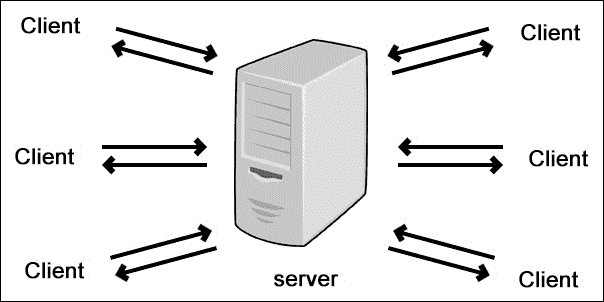
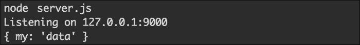
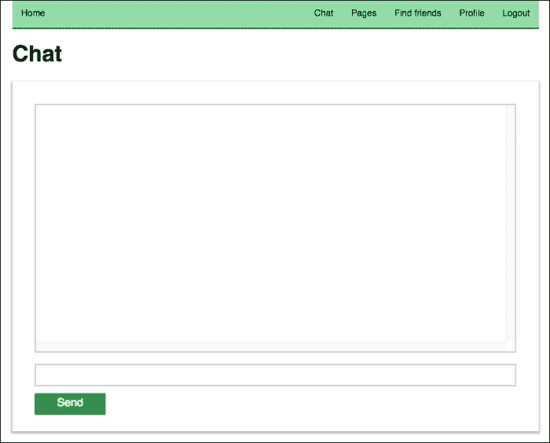
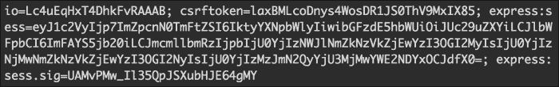
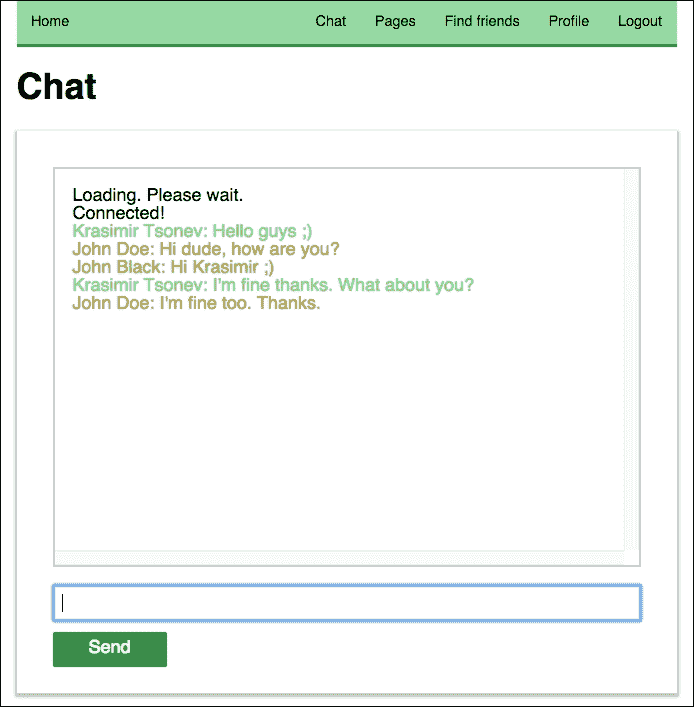

# 第十章：添加实时聊天

在前两章中，我们通过添加新功能来扩展了我们的社交网络，以创建页面和分享帖子。在本章中，我们将讨论系统中用户之间的实时通信。我们将使用的技术称为 WebSockets。本书的这一部分计划如下：

+   了解 WebSockets

+   将 Socket.IO 引入项目

+   准备聊天区域的用户界面

+   在客户端和服务器之间交换消息

+   仅向用户的朋友发送消息

+   自定义聊天输出

# 了解 WebSockets

WebSockets 是一种在服务器和浏览器之间打开双向交互通道的技术。通过使用这种类型的通信，我们能够在没有初始请求的情况下交换消息。双方只需向对方发送事件。WebSockets 的其他好处包括较低的带宽需求和延迟。

有几种从服务器传输数据到客户端以及反之的方式。让我们检查最流行的几种方式，并看看为什么 WebSockets 被认为是实时 Web 应用的最佳选择：

+   **经典的 HTTP 通信**：客户端请求服务器的资源。服务器确定响应内容并发送。在实时应用的情况下，这并不是很实用，因为我们必须手动请求更多的数据。

+   **Ajax 轮询**：它类似于经典的 HTTP 请求，不同之处在于我们的代码会不断向服务器发送请求，例如，每隔半秒一次。这并不是一个好主意，因为我们的服务器将收到大量的请求。

+   **Ajax 长轮询**：我们再次有一个执行 HTTP 请求的客户端，但这次服务器延迟结果并不立即响应。它会等到有新信息可用时才回应请求。

+   **HTML5 服务器发送事件（EventSource）**：在这种通信类型中，我们有一个从服务器到客户端的通道，服务器会自动向浏览器发送数据。当我们需要单向数据流时，通常会使用这种技术。

+   **WebSockets**：如前所述，如果我们使用 WebSockets，我们将拥有双向数据流。客户端和服务器双方都可以在不询问对方的情况下发送消息。

服务器发送事件在某些情况下可能有效，但对于实时聊天，我们绝对需要 WebSockets，因为我们希望用户能够互相发送消息。我们将实现的解决方案如下截图所示：



每个用户都将连接到服务器并开始发送消息。我们的后端将负责将消息分发给其他用户。

使用原始 WebSockets API 可能并不那么容易。在下一节中，我们将介绍一个非常有用的 Node.js 模块来处理 WebSockets。

# 将 Socket.IO 引入项目

Socket.IO（[`socket.io/`](http://socket.io/)）是建立在 WebSockets 技术之上的实时引擎。它是一个使 Web 开发变得简单和直接的层。像现在的每一样新事物一样，WebSockets 也有自己的问题。并非每个浏览器都支持这项技术。我们可能会遇到协议问题和缺少心跳、超时或断开支持等事件。幸运的是，Socket.IO 解决了这些问题。它甚至为不支持 WebSockets 的浏览器提供了备用方案，并采用长轮询等技术。

在后端进行更改之前，我们需要安装该模块。该引擎与每个其他 Node.js 模块一样分发；它可以通过包管理器获得。因此，我们必须以以下方式将 Socket.IO 添加到`package.json`文件中：

```js
{
  "name": "nodejs-by-example",
  "version": "0.0.2",
  "description": "Node.js by example",
  "scripts": {
    "start": "node server.js"
  },
  "dependencies": {
    "socket.io": "1.3.3"
    ...
    ...
  }
}
```

在进行这些更改之后，我们将运行`npm install`并获取`node_modules/socket.io`文件夹。安装了该模块后，我们可以开始更新我们的社交网络。让我们在后端目录中添加一个`Chat.js`文件，其中包含以下代码：

```js
module.exports = function(app) {
  var io = require('socket.io')(app);
  io.on('connection', function (socket) {
    socket.emit('news', { hello: 'world' });
    socket.on('my other event', function (data) {
      console.log(data);
    });
  });
}
```

新模块导出一个接受 HTTP 服务器的函数。在`server.js`中，我们可以使用`http.createServer`来初始化它，如下所示：

```js
var app = http.createServer(checkSession).listen(port, '127.0.0.1');
console.log("Listening on 127.0.0.1:" + port);

var Chat = require('./backend/Chat');
Chat(app);
```

Socket.IO 完全建立在事件触发和监听的概念上。`io`变量代表我们的通信中心。每当新用户连接到我们的服务器时，我们都会收到一个连接事件，并且被调用的处理程序会接收一个`socket`对象，我们将使用它来处理从浏览器到和从浏览器的消息。

在上面的例子中，我们发送（`emit`）了一个带有`news`名称的事件，其中包含一些简单的数据。之后，我们开始监听来自客户端的其他事件。

现在，即使我们重新启动服务器，我们也不会收到任何 socket 连接。这是因为我们没有更改前端代码。为了使 Socket.IO 在客户端工作，我们需要在页面中包含`/socket.io/socket.io.js`文件。我们应用程序的布局存储在`backend/tpl/page.html`中，在修改后，它看起来像这样：

```js
<!doctype html>
<html lang="en">
<head>
  <meta charset="utf-8">
  <title>Node.js by example</title>
  <meta http-equiv="Content-Type" content="text/html;  charset=utf-8" />
  <meta name="description" content="Node.js by examples">
  <meta name="author" content="Packt">
  <link rel="stylesheet" href="/static/css/styles.css">
</head>
<body>
  <div class="container"></div>
  <script src="img/socket.io.js"></script>
  <script src="img/ractive.js"></script>
  <script src="img/app.js"></script>
</body>
</html>
```

`socket.io.js`文件在我们的代码库中不存在。它是 Socket.IO 模块的一部分。引擎会自动注册一个路由，并确保它提供文件。

我们 WebSockets 实现测试的最后一步是连接到服务器。为了简单起见，让我们在`frontend/js/app.js`文件中添加几行代码：

```js
window.onload = function() {

  ...

  var socket = io('http://localhost:9000');
  socket.on('news', function (data) {
    console.log(data);
    socket.emit('my other event', { my: 'data' });
  });

};
```

我们将把我们的代码放在`onload`处理程序中，因为我们希望确保所有外部 JavaScript 文件都已完全加载。然后，我们将初始化到`http://localhost:9000`的连接，这是 Node.js 服务器运行的相同主机和端口。代码的其余部分只做一件事——监听`news`事件，并响应其他事件消息。如果我们在浏览器中运行服务器并加载`http://localhost:9000`，我们将在终端中得到以下结果：



我们得到`{ my: 'data' }`作为输出，因为在`backend/Chat.js`文件中有`console.log(data)`。

# 准备聊天区域的 UI

因为实时聊天是我们社交网络的重要部分，我们将为其创建一个单独的页面。就像我们在之前的章节中所做的那样，我们将在主导航中添加一个新链接，如下所示：

```js
<nav>
  <ul>
    <li><a on-click="goto:home">Home</a></li>
    {{#if !isLogged }}
      <li><a on-click="goto:register">Register</a></li>
      <li><a on-click="goto:login">Login</a></li>
    {{else}}
      <li class="right"><a on-click="goto:logout">Logout</a></li>
      <li class="right"><a  
        on-click="goto:profile">Profile</a></li>
      <li class="right"><a on-click="goto:find-friends">Find  friends</a></li>
      <li class="right"><a on-click="goto:pages">Pages</a></li>
      <li class="right"><a on-click="goto:chat">Chat</a></li>
    {{/if}}
  </ul>
</nav>
```

列表中的最新链接将把用户转到`http://localhost:9000/chat`的 URL，用户将在那里看到聊天的界面。

让我们通过调整`frontend/js/app.js`文件来处理`/chat`路由。让我们对路由进行另一个添加，如下所示：

```js
Router
...
...
.add('chat', function() {
  if(userModel.isLogged()) {
    var p = new Chat();
    showPage(p);
  } else {
    Router.navigate('login');
  }    
})
.add(function() {
  Router.navigate('home');
})
.listen()
.check();
```

在同一个文件中，我们将需要`frontend/js/controllers/Chat.js`模块。它将包含客户端的聊天逻辑。我们将从一些简单的东西开始——一个基本的 Ractive.js 组件，可以实现如下：

```js
// frontend/js/controllers/Chat.js
module.exports = Ractive.extend({
  template: require('../../tpl/chat'),
  components: {
    navigation: require('../views/Navigation'),
    appfooter: require('../views/Footer')
  },
  data: {
    output: ''
  },
  onrender: function() {

  }
});
```

像我们应用程序中的每个其他控制器一样，`Chat.js`有一个关联的模板，其中包含一个空的`<div>`元素来显示聊天消息，一个文本字段和一个发送数据到服务器的按钮：

```js
// front/tpl/chat.html
<header>
  <navigation></navigation>
</header>
<div class="hero">
  <h1>Chat</h1>
</div>
<form>
  <div class="chat-output">{{output}}</div>
  <input type="text" value="{{text}}" />
  <a href="#" on-click="send" class="button">Send</a>
</form>
<appfooter />
```

值得一提的是，如果要更新`chat-output`元素的内容，需要更改`output`变量的值。按钮还会触发一个`send`事件，我们将在下一节中捕获这个事件。在编译资产之后，如果您转到聊天的 URL，您将看到以下屏幕：



# 在客户端和服务器之间交换消息

我们准备编写一些可工作的 Socket.IO 代码。到目前为止，我们放置了一些代码片段，只是证明了套接字连接的工作。例如，添加到`frontend/js/app.js`的代码应该移动到`frontend/js/controllers/Chat.js`，这是负责聊天页面的控制器。因为它充当了这个实时功能的基础，我们将从那里开始。让我们向组件添加一些本地变量，如下所示：

```js
data: {
  messages: ['Loading. Please wait.'],
  output: '',
  socketConnected: false
}
```

这些变量具有默认值，并且可以在组件模板中使用。第一个变量`messages`将保存来自聊天用户的所有消息，包括当前用户。`output`变量用于在屏幕上填充消息容器。最后一个`socketConnected`控制文本字段和按钮的可见性。如果设置为`false`，则控件将被隐藏。在与服务器初始化连接或由于某种原因断开连接之前，最好隐藏聊天输入文本字段，直到与服务器的连接初始化。否则，我们可能会因某种原因断开连接。更新后的模板如下所示：

```js
// frontend/tpl/chat.html
<header>
  <navigation></navigation>
</header>
<div class="hero">
  <h1>Chat</h1>
</div>
<form>
  <div class="chat-output"  data-component="output">{{{output}}}</div>
  {{#if socketConnected}}
    <input type="text" value="{{text}}" />
    <a href="#" on-click="send" class="button">Send</a>
  {{/if}}
</form>
<appfooter />
```

差异在于包裹字段和按钮的`{{if}}`运算符。在本章末尾，我们将对消息进行着色，并需要传递 HTML 标签。我们将使用`{{{output}}}`而不是`{{output}}`，以便框架正确显示它们（通过关闭自动转义）。

让我们回到前端控制器。我们提到的代码放在`app.js`中移动到这里。这是与套接字服务器的实际连接。我们将以以下方式扩展它：

```js
var self = this;
var socket = io('http://localhost:9000');
socket.on('connect', function() {
  self.push('messages', 'Connected!');
  self.set('socketConnected', true);
  self.find('input[type="text"]').focus();
});
socket.on('disconnect', function() {
  self.set('socketConnected', false);
  self.push('messages', 'Disconnected!');
});
socket.on('server-talking', function(data) {
  self.push('messages', data.text);
});
```

收到`connect`事件后，我们将`Connected!`字符串添加到`messages`数组中。因此，在收到**加载中，请稍候。**消息后，用户将看到一条确认消息，告知他/她应用程序已经建立了成功的套接字连接。通过将`socketConnected`设置为`true`，我们显示输入控件，并为用户提供发送聊天消息的选项。此处理程序中的最后一件事是强制浏览器聚焦在输入字段上，这是一个很好的细节，可以节省用户的鼠标点击。

`socket`对象可能会分派另一个事件 - `disconnect`。在这种情况下，我们可以采取两种行动 - 隐藏输入控件，并通过在浏览器中显示`Disconnected!`字符串来通知用户。

我们监听的最后一个事件是`server-talking`。这是我们自己的事件 - 后端代码将分派的消息。一开始，`data`对象将只包含一个`text`属性，这将是聊天消息。我们将简单地将其附加到`messages`数组的其余元素中。

我们之前谈到的行监听来自后端的事件。让我们编写一些代码，将信息从客户端发送到服务器：

```js
var send = function() {
  socket.emit('client-talking', { text: self.get('text')});
  self.set('text', '');
}
this.on('send', send);
```

当用户单击按钮时，将调用`send`函数。我们使用相同的`socket`对象及其`emit`方法将文本传输到服务器。我们还清除输入字段的内容，以便用户可以开始撰写新消息。每次按按钮可能很烦人。以下代码在用户按下*Enter*键时触发`send`函数：

```js
this.find('form').addEventListener('keypress', function(e) {
  if(e.keyCode === 13 && e.target.nodeName === 'INPUT') {
    e.preventDefault();
    send();
  }
});
```

`this.find`方法返回一个有效的 DOM 元素。我们将`keypress`监听器附加到`form`元素，因为`input`变量并不总是可见。由于事件冒泡，我们能够在上层元素中捕获事件。还值得一提的是，在某些浏览器中，需要不同的代码来监听 DOM 事件。

我们必须处理的最后一件事是在屏幕上显示`messages`数组的内容。如果您检查到目前为止我们编写的代码，您会发现我们没有更新`output`变量。以下是一个新的组件方法，将处理这个问题：

```js
updateOutput: function() {
  this.set('output', this.get('messages').join('<br />'));
  var outputEl = this.find('[data-component="output"]');
  outputEl.scrollTop = outputEl.scrollHeight;
}
```

我们使用`join`方法而不是循环遍历数组的所有元素。它将数组的所有元素连接成一个由给定参数分隔的字符串。在我们的情况下，我们需要在每条消息后面换行。一旦我们开始接收更多数据，我们将需要将`<div>`元素滚动到底部，以便用户看到最新的消息。函数的另外两行将容器的滚动条定位在底部。

`updateOutput`函数应该在新消息到达时被调用。Ractive.js 的观察对于这种情况非常完美：

```js
this.observe('messages', this.updateOutput);
```

只需要一行代码将`messages`数组的更新连接到`updateOutput`方法。添加了这个之后，每次对消息数组进行`push`操作都会强制渲染`chat-output`元素。

组件的代码如下：

```js
module.exports = Ractive.extend({
  template: require('../../tpl/chat'),
  components: {
    navigation: require('../views/Navigation'),
    appfooter: require('../views/Footer')
  },
  data: {
    messages: ['Loading. Please wait.'],
    output: '',
    socketConnected: false
  },
  onrender: function() {

    var self = this;
    var socket = io('http://localhost:9000');
    socket.on('connect', function() {
      self.push('messages', 'Connected!');
      self.set('socketConnected', true);
      self.find('input[type="text"]').focus();
    });
    socket.on('disconnect', function() {
      self.set('socketConnected', false);
      self.push('messages', 'Disconnected!');
    });
    socket.on('server-talking', function(data) {
      self.push('messages', data.text);
    });

    var send = function() {
      socket.emit('client-talking', { text: self.get('text')});
      self.set('text', '');
    }

    this.on('send', send);
    this.observe('messages', this.updateOutput);

    this.find('form').addEventListener('keypress', function(e) {
      if(e.keyCode === 13 && e.target.nodeName === 'INPUT') {
        e.preventDefault();
        send();
      }
    });

  },
  updateOutput: function() {
    this.set('output', this.get('messages').join('<br />'));
    var outputEl = this.find('[data-component="output"]');
    outputEl.scrollTop = outputEl.scrollHeight;
  }
});
```

前端已准备好通过套接字发送和接收消息。但是，后端仍然包含我们开始时的初始示例代码。对`Chat`模块进行小小的更新将使其能够向用户发送消息：

```js
// backend/Code.js
module.exports = function(app) {
  var io = require('socket.io')(app);
  io.on('connection', function (socket) {
    socket.on('client-talking', function (data) {
      io.sockets.emit('server-talking', { text: data.text });
    });
  });
}
```

我们仍在监听`connection`事件。在处理程序中收到的`socket`对象代表与用户的连接。之后，我们将开始监听`client-talking`事件，该事件由前端在用户在字段中输入内容或按下按钮或*Enter*键时触发。一旦接收到数据，我们就会将其广播给系统中的所有用户。`io.sockets.emit`变量向当前使用服务器的所有客户端发送消息。

# 仅向用户的朋友发送消息

我们后端的最后一个更改是将接收到的聊天消息分发给我们社交网络中的所有用户。当然，这实际上并不太实用，因为我们可能会与彼此不认识的人交换文本。我们必须相应地更改我们的代码，以便只向我们朋友列表中的用户发送消息。

使用 Socket.IO 时，我们无法像在后端 API 中那样默认访问`request`和`response`对象。这将使得解决问题变得更有趣，因为我们无法识别发送消息的用户。幸运的是，Socket.IO 让我们可以访问活动会话。它是以原始格式存在的。因此，我们需要解析它并提取用户的个人资料数据。为此，我们将使用`cookie` Node.js 模块。让我们以以下方式将其添加到`package.json`文件中：

```js
"dependencies": {
  "cookie": "0.1.2",
  "socket.io": "1.3.3",
  ...
  ...
}
```

在终端中进行另一个`npm install`后，我们将能够`require`该模块。在第八章中，*创建页面和事件*，我们重构了我们的 API 并创建了`backend/api/helpers.js`文件，其中包含实用函数。我们将使用仅使用`session`对象的方式添加另一个类似于`getCurrentUser`的文件，如下所示：

```js
var getCurrentUserBySessionObj = function(callback, obj) {
  getDatabaseConnection(function(db) {
    var collection = db.collection('users');
    collection.find({ 
      email: obj.user.email
    }).toArray(function(err, result) {
      if(result.length === 0) {
        callback({ error: 'No user found.' });
      } else {
        callback(null, result[0]);
      }
    });
  });
};
```

如果我们比较这两种方法，我们会发现有两个不同之处。第一个不同之处是我们没有收到通常的请求和响应对象；我们只收到一个回调和一个`session`对象。第二个变化是即使出现错误，结果也总是发送到回调中。

有了`getCurrentUserBySessionObj`函数，我们可以修改`backend/Chat.js`，使其只向当前用户的朋友发送消息。让我们首先初始化所需的辅助程序。我们将在文件顶部添加以下行：

```js
var helpers = require('./api/helpers');
var getCurrentUserBySessionObj =  helpers.getCurrentUserBySessionObj;
var cookie = require('cookie');
```

我们已经讨论过`cookie`模块。在 Socket.IO 引擎中可用的会话数据可以通过`socket.request.headers.cookie`访问。如果我们在控制台中打印该值，将会得到以下截图中的内容：



前面的输出是一个 Base64 编码的字符串，我们肯定不能直接使用它。幸运的是，Node.js 有接口可以轻松解码这样的值。以下是一个提取所需 JSON 对象的简短函数：

```js
var decode = function(string) {
  var body = new Buffer(string, 'base64').toString('utf8');
  return JSON.parse(body);
};
```

我们从 cookie 中传递了字符串，并接收了稍后将在`getCurrentUserBySessionObj`中使用的普通`user`对象。

因此，我们有机制来找出当前用户是谁以及他/她的朋友是谁。我们所要做的就是缓存可用的套接字连接和相关用户。我们将引入一个新的全局（对于模块来说）`users`变量。它将作为一个哈希映射，其中键将是用户的 ID，值将包含套接字和朋友。为了向正确的用户广播消息，我们可以总结以下方法的逻辑：

```js
var broadcastMessage = function(userId, message) {
  var user = users[userId];
  if(user && user.friends && user.friends.length > 0) {
    user.socket.emit('server-talking', { text: message });
    for(var i=0; i<user.friends.length; i++) {
      var friend = users[user.friends[i]];
      if(friend && friend.socket) {
        friend.socket.emit('server-talking', { text: message });
      }
    }
  }
};
```

这段代码提供了一个接受用户 ID 和文本消息的函数。我们首先检查是否缓存了套接字引用。如果是，我们将确保用户有朋友。如果这也是有效的，我们将开始分发消息。第一个`emit`项是给用户自己，以便他/她接收自己的消息。其余的代码循环遍历朋友并将文本发送给所有人。

当然，我们必须更新接受套接字连接的代码。以下是相同代码的新版本：

```js
module.exports = function(app) {
  var io = require('socket.io')(app);
  io.on('connection', function (socket) {
    var sessionData = cookie.parse(socket.request.headers.cookie);
    sessionData = decode(sessionData['express:sess']);
    if(sessionData && sessionData.user) {
      getCurrentUserBySessionObj(function(err, user) {
        var userId = user._id.toString();
        users[userId] = {
          socket: socket,
          friends: user.friends
        };
        socket.on('client-talking', function (data) {
          broadcastMessage(userId, data.text);
        });
        socket.on('disconnect', function() {
          users[userId] = null;
        });
      }, sessionData);
    }

  });
}
```

现在我们将获取 cookie 值并确定当前用户。`socket`对象和用户的朋友已被缓存。然后，我们将继续监听`client-talking`事件，但现在，我们将通过`broadcastMessage`函数发送消息。在最后做了一个小但非常重要的添加；我们监听`disconnect`事件并移除缓存的数据。这是为了防止向断开连接的用户发送数据。

# 自定义聊天输出

能够向正确的人发送消息是很好的，但聊天仍然有点混乱，因为屏幕上出现的每条文本消息都是相同的颜色，我们不知道哪个朋友发送的。在本节中，我们将进行两项改进——我们将在消息前附加用户的名称并给文本着色。

让我们从颜色开始，并在`backend/api/helpers.js`文件中添加一个新的辅助方法：

```js
var getRandomColor = function() {
  var letters = '0123456789ABCDEF'.split('');
  var color = '#';
  for(var i = 0; i < 6; i++ ) {
    color += letters[Math.floor(Math.random() * 16)];
  }
  return color;
}
```

以下函数生成一个有效的 RGB 颜色，可以在 CSS 中使用。你选择用户颜色的时机是在缓存`socket`对象时：

```js
...
var getRandomColor = helpers.getRandomColor;

module.exports = function(app) {
  var io = require('socket.io')(app);
  io.on('connection', function (socket) {
    var sessionData = cookie.parse(socket.request.headers.cookie);
    sessionData = decode(sessionData['express:sess']);
    if(sessionData && sessionData.user) {
      getCurrentUserBySessionObj(function(err, user) {
        var userId = user._id.toString();
        users[userId] = {
          socket: socket,
          friends: user.friends,
          color: getRandomColor()
        };
        socket.on('client-talking', function (data) {
          broadcastMessage(user, data.text);
        });
        socket.on('disconnect', function() {
          users[userId] = null;
        });
      }, sessionData);
    }

  });
}
```

因此，除了`socket`对象和`friends`，我们还存储了一个随机选择的颜色。还有一个小的更新。我们不再将用户的 ID 传递给`broadcastMessage`函数。我们发送整个对象，因为我们需要获取用户的名字和姓氏。

以下是更新后的`broadcastMessage`辅助方法：

```js
var broadcastMessage = function(userProfile, message) {
  var user = users[userProfile._id.toString()];
  var userName = userProfile.firstName + ' ' +  userProfile.lastName;
  if(user && user.friends && user.friends.length > 0) {
    user.socket.emit('server-talking', {
      text: message,
      user: userName,
      color: user.color
    });
    for(var i=0; i<user.friends.length; i++) {
      var friend = users[user.friends[i]];
      if(friend && friend.socket) {
        friend.socket.emit('server-talking', { 
          text: message,
          user: userName,
          color: user.color
        });
      }
    }
  }
};
```

现在，发送到客户端的`data`对象包含两个额外的属性——当前用户的名称和他/她随机选择的颜色。

后端已经完成了它的工作。现在我们要做的就是调整前端控制器，以便它使用名称和颜色，如下所示：

```js
// frontend/js/controllers/Chat.js
socket.on('server-talking', function(data) {
  var message = '<span style="color:' + data.color + '">';
  message += data.user + ': ' + data.text;
  message += '</span>';
  self.push('messages', message);
});
```

我们不再只发送文本，而是将消息包装在`<span>`标签中。它应用了文本颜色。此外，消息以用户的名称开头。

我们工作的最终结果如下截图所示：



# 总结

Socket.IO 是最流行的用于开发实时应用程序的 Node.js 工具之一。在本章中，我们成功地使用它构建了一个交互式聊天。我们网络中的用户不仅能够发布出现在其动态中的内容，还能够与其他用户实时交换消息。WebSockets 技术使这一切成为可能。

下一章专门讲解测试。我们将了解一些流行的模块，这些模块将帮助我们编写测试。
