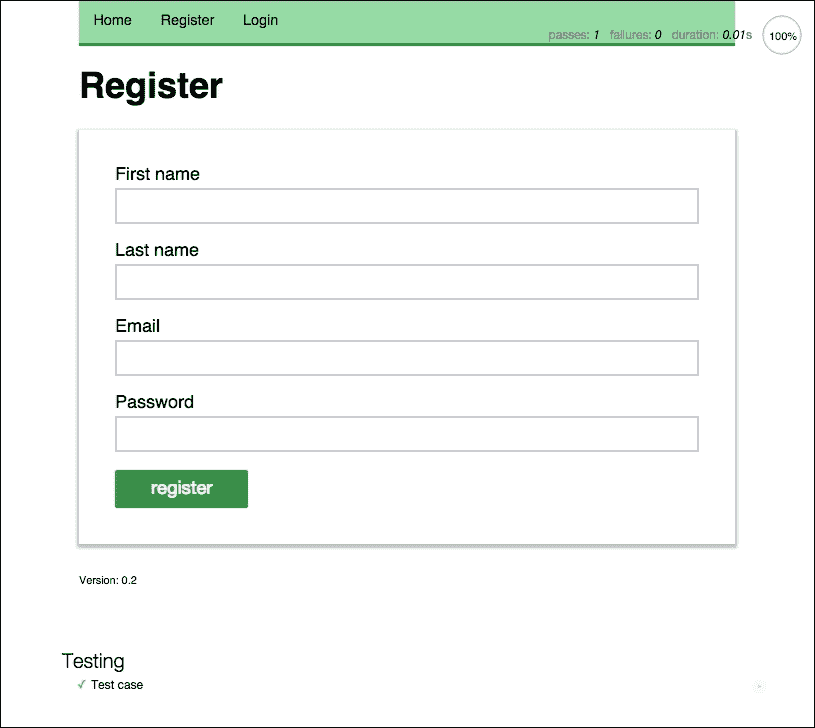
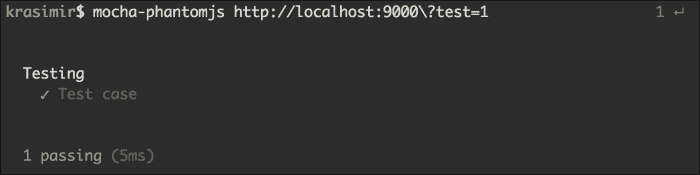
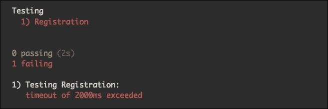
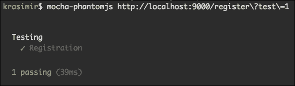
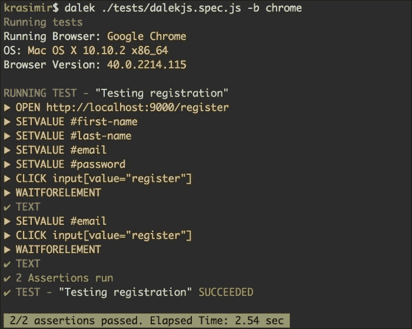

# 第十一章：测试用户界面

在第十章 *添加实时聊天*中，我们通过添加实时聊天功能扩展了我们的社交网络。我们使用了 WebSockets 和 Socket.IO 来实现系统中用户之间的通信。本书的最后一章专门讨论用户界面测试。我们将探讨两种流行的工具来运行无头浏览器测试。本章涵盖以下主题：

+   介绍基本的测试工具集

+   准备我们的项目来运行测试

+   使用 PhantomJS 运行我们的测试

+   测试用户的注册

+   使用 DalekJS 进行测试

# 介绍基本的测试工具集

在编写测试之前，我们将花一些时间讨论测试工具集。我们需要一些工具来定义和运行我们的测试。

## 测试框架

在 JavaScript 的上下文中，测试框架是一组函数，帮助你将测试组织成逻辑组。有一些框架函数，比如`suite`、`describe`、`test`或`it`，定义了我们的测试套件的结构。以下是一个简短的例子：

```js
describe('Testing database communication', function () {
  it('should connect to the database', function(done) {
    // the actual testing goes here
  });
  it('should execute a query', function(done) {
    // the actual testing goes here
  });
});
```

我们使用`describe`函数将更详细的测试（`it`）包装成一个组。以这种方式组织组有助于我们保持专注，同时也非常信息丰富。

JavaScript 社区中一些流行的测试框架包括**QUnit**、**Jasmine**和**Mocha**。

## 断言库

我们通常在测试时运行一个断言。我们经常比较变量的值，以检查它们是否与我们最初编写程序逻辑时的预期值匹配。一些测试框架带有自己的断言库，一些则没有。

以下一行展示了这样一个库的简单用法：

```js
expect(10).to.be.a('number')
```

重要的是要提到 API 是这样设计的，以便我们通过阅读测试来理解上下文。

Node.js 甚至有自己内置的名为`assert`的库。其他选项包括**Chai**、**Expect**和**Should.js**。

## 运行器

运行器是一个工具，我们用它在特定的上下文中执行测试，这个上下文很常见是特定的浏览器，但也可能是不同的操作系统或定制的环境。我们可能需要也可能不需要运行器。在这一特定章节中，我们将使用 DalekJS 作为测试运行器。

# 准备我们的项目来运行测试

现在我们知道了运行测试所需的工具。下一步是准备我们的项目来放置这样的测试。通常在开发过程中，我们通过访问页面并与其交互来测试我们的应用程序。我们知道这些操作的结果，并验证一切是否正常。我们希望用自动化测试做同样的事情。但是，不是我们一遍又一遍地重复相同的步骤，而是会有一个脚本。

为了使这些脚本起作用，我们必须将它们放在正确的上下文中。换句话说，它们应该在我们的应用程序的上下文中执行。

在前一节中，我们提到了 Chai（一个断言库）和 Mocha（一个测试框架）。它们很好地配合在一起。因此，我们将把它们添加到我们的依赖列表中，如下所示：

```js
// package.json
…
"dependencies": {
    "chai": "2.0.0",
    "mocha": "2.1.0",
    ...
}
…
```

快速运行`npm install`将在`node_modules`目录中设置模块。Chai 和 Mocha 被分发为 Node.js 模块，但我们也可以在浏览器环境中使用它们。`node_modules`中新创建的文件夹包含编译版本。例如，要在浏览器中运行 Mocha，我们必须在我们的页面中包含`node_modules/mocha/mocha.js`。

我们的社交网络是一个单页面应用程序。我们有一个主 HTML 模板，由后端提供，位于`backend/tpl/page.html`中。Node.js 服务器读取此文件并将其发送到浏览器。其余部分由 JavaScript 代码处理。以下是`page.html`的样子：

```js
<!doctype html>
<html lang="en">
<head>
  <meta charset="utf-8">
  <title>Node.js by example</title>
  <meta http-equiv="Content-Type" content="text/html;  charset=utf-8" />
  <meta name="description" content="Node.js by example">
  <meta name="author" content="Packt">
  <link rel="stylesheet" href="/static/css/styles.css">
</head>
<body>
  <div class="container"></div>
  <script src="img/socket.io.js"></script>
  <script src="img/ractive.js"></script>
  <script src="img/app.js"></script>
</body>
</html>
```

该文件包含运行应用程序所需的所有外部资源。但是，现在我们需要添加一些标签；其中一些如下：

+   `/node_modules/mocha/mocha.css`文件包含了测试结果正确显示的样式。这是 Mocha 报告者的一部分。

+   `/node_modules/mocha/mocha.js`文件是测试框架。

+   `/node_modules/chai/chai.js`文件是断言库。

+   `/tests/spec.js`是一个包含实际测试的文件。它目前还不存在。我们将创建一个`tests`目录，并在其中创建一个`spec.js`文件。

+   一个空的`div`标签充当测试结果的占位符，几行 JavaScript 代码引导 Mocha 框架。

我们不能把所有这些新元素都添加到当前的`page.html`文件中，因为系统的用户会看到它们。我们将把它们放在另一个文件中，并调整后端，以便在特定条件下提供它。让我们创建`backend/tpl/pageTest.html`：

```js
<!doctype html>
<html lang="en">
<head>
  ...
  <link rel="stylesheet" href="/static/css/styles.css">
  <link rel="stylesheet" href="/node_modules/mocha/mocha.css" />
</head>
<body>
  <div class="container"></div>
  <script src="img/socket.io.js"></script>
  <script src="img/ractive.js"></script>
  <script src="img/app.js"></script>

  <div id="mocha"></div>
  <script src="img/mocha.js"></script>
  <script src="img/chai.js"></script>
  <script>
    mocha.ui('bdd');
    mocha.reporter('html');
    expect = chai.expect;
  </script>
  <script src="img/spec.js"></script>
  <script>
    if (window.mochaPhantomJS) { 
      mochaPhantomJS.run();
   }
    else {
     mocha.run();
   }
  </script>

</body>
</html>
```

一旦`mocha.js`和`chai.js`被注入到页面中，我们将配置框架。我们的用户界面将遵循行为驱动开发，报告者将是`html`。Mocha 有几种类型的报告者，由于我们想在浏览器中显示结果，所以我们使用了这个。我们定义了一个`expect`全局对象，起到了断言工具的作用。

在接下来的部分中，这些行将会派上用场，我们将使用 PhantomJS 运行我们的测试。这些行基本上会检查是否有`window.mochaPhantomJS`对象，如果有的话，它将被用来代替默认的`mocha`。

到目前为止，一切都很顺利。我们有工具可以帮助我们运行和编写测试，还有一个包含必要代码的页面。下一步是调整后端，以便使用新的`pageTest.html`文件：

```js
// backend/Default.js
var fs = require('fs');
var url = require('url');

var html = fs.readFileSync(__dirname +  '/tpl/page.html').toString('utf8');
var htmlWithTests = fs.readFileSync(__dirname +  '/tpl/pageTest.html').toString('utf8');

module.exports = function(req, res) {
  res.writeHead(200, {'Content-Type': 'text/html'});
  var urlParts = url.parse(req.url, true);
  var parameters = urlParts.query;
  if(typeof parameters.test !== 'undefined') {
    res.end(htmlWithTests + '\n');
  } else {
    res.end(html + '\n');
  }
}
```

我们需要更改的文件是`Default.js`。这是我们应用程序中`Default.js`文件路由的处理程序。新添加的`htmlWithTests`变量包含了新的 HTML 标记。我们使用`url`模块来查找来自客户端的`GET`变量。如果有`test`参数，那么我们将加载包含布局和测试的页面。否则，就是原始的 HTML。

在最后一次更改之后，我们可以运行服务器并打开`http://localhost:9000/register?test=1`。然而，我们会收到一堆错误消息，抱怨有一些文件丢失。这是因为`server.js`文件不识别以`node_modules`或`tests`开头的 URL。这些目录中存在的文件是静态资源。因此，我们可以使用已经定义的`Assets`模块，如下所示：

```js
// server.js
…
Router
.add('static', Assets)
.add('node_modules', Assets)
.add('tests', Assets)
.add('api', API)
.add(Default);
```

最后，还有一个文件需要创建——`tests/spec.js`：

```js
describe("Testing", function () {
  it("Test case", function (done) {
    expect(1).to.be.equal(1);
    done();
  });
});
```

这段代码是一个测试的最简单结构。我们有一个组和一个测试。关键时刻是在测试结束时运行`done()`。

我们知道这个测试通过了。浏览器中的结果如下截图所示：



值得一提的是，加载的页面仍然是相同的，除了右上角和页脚下方的元素。这些新标签是由 Mocha 框架生成的。这就是`html`报告者显示我们测试结果的方式。

# 使用 PhantomJS 运行我们的测试

前面几节的结果是在浏览器中运行的自动化测试。然而，这通常是不够的。我们可能需要将测试集成到部署流程中，而在浏览器中进行测试并不总是一个选择。幸运的是，有一种称为**无头浏览器**的浏览器类型。它是一个没有用户界面的功能性浏览器。我们仍然可以访问页面，点击链接或填写表单，但所有这些操作都是由代码控制的。这对于我们和自动化测试来说是完美的。

有几种流行的无头浏览器。Selenium ([`github.com/seleniumhq/selenium`](https://github.com/seleniumhq/selenium))就是其中之一。它有很好的文档和庞大的社区。另一个是 PhantomJS。它与 Node.js 兼容良好。所以我们将使用它。

我们已经在测试环境中添加了几个组件。要直接使用 PhantomJS，需要一些补充配置。为了避免额外的复杂性，我们将安装`mocha-phantomjs`模块。它的目的是简化无头浏览器的使用，特别是与 Mocha 框架的结合。以下命令将在我们的终端中将`mocha-phantomjs`设置为全局命令：

```js
npm install mocha-phantomjs -g

```

自 3.4 版本以来，`mocha-phantomjs`模块使用 PhantomJS 作为对等依赖，这意味着我们不必手动安装浏览器。

安装成功后，我们准备运行测试。我们在控制台中要输入的命令是`mocha-phantomjs http://localhost:9000\?test=1`。有反斜杠是因为如果不是这样的话，终端可能无法正确解释这行。

结果显示在以下截图中：



这基本上与我们在浏览器中得到的结果相同。好处是现在这个过程发生在终端中。

# 测试用户注册

让我们使用前几节中构建的设置并编写一个实际的测试。假设我们要确保我们的注册页面可以正常工作。以下是我们想要用我们的测试捕获的两个过程：

+   填写表单并确保应用程序显示错误消息

+   填写表单并看到成功消息

我们将使用 PhantomJS 作为我们的无头（虚拟）浏览器。因此，我们所要做的就是加载我们的注册页面并模拟用户交互，比如在字段中输入并按下按钮。

## 模拟用户交互

我们将解决几个问题。第一个问题是实际模拟用户操作。从 JavaScript 的角度来看，这些操作被转换为由特定 DOM 元素分派的事件。以下辅助方法将成为`tests/spec.js`文件的一部分：

```js
describe("Testing", function () {

  var trigger = function(element, event, eventGroup, keyCode) {
    var e = window.document.createEvent(eventGroup || 'MouseEvents');
    if(keyCode) {
      e.keyCode = e.which = keyCode;
    }
    e.initEvent(event, true, true);
    return element.dispatchEvent(e);
  }

  it("Registration", function (done) {
    // ... our test here
  });

});
```

`trigger`函数接受一个元素、事件的名称、事件组和一个键码。前两个参数是必需的。第三个参数的默认值为`MouseEvents`，最后一个参数是可选的。我们将使用该方法来触发`change`和`click`事件。

## 填写并提交注册表单

让我们从填写注册表单的输入字段开始。值得一提的是，我们将要编写的代码在浏览器中运行，因此我们可以访问`document.querySelector`，例如。以下行在名字字段中输入一个字符串：

```js
var firstName = document.querySelector('#first-name');
firstName.value = 'First name';
trigger(firstName, 'change');
```

向`firstName`元素发送一个字符串会更新用户界面。然而，我们的客户端框架 Ractive.js 并不知道这个变化。分派`change`事件可以解决这个问题。

我们将使用相同的模式向姓氏、电子邮件和密码字段添加值：

```js
var lastName = document.querySelector('#last-name');
lastName.value = 'Last name';
trigger(lastName, 'change');

var email = document.querySelector('#email');
email.value = 'wrong email';
trigger(email, 'change');

var password = document.querySelector('#password');
password.value = 'password';
trigger(password, 'change');
```

电子邮件输入字段的值是无效的。这是故意的。我们希望捕获后端返回错误的情况。要完成操作，我们必须点击**注册**按钮：

```js
trigger(document.querySelector('input[value="register"]'),  'click');
```

如果我们现在运行测试，将会看到以下截图：



测试基本上因超时而失败。这是因为我们没有调用`done`函数。然而，即使这样，我们也没有任何断言。

现在，事情变得有趣起来。在浏览器中发生的过程是异步的。这意味着我们不能简单地在点击按钮后运行我们的断言。我们应该等一会儿。在这种情况下，使用`setTimeout`是不可接受的。正确的方法是调整应用程序的代码，以便它通知外部世界特定的工作已经完成。在我们的情况下，这是提交注册表单。更准确地说，我们必须更新`s/controllers/Register.js`：

```js
module.exports = Ractive.extend({
  template: require('../../tpl/register'),
  components: {
    navigation: require('../views/Navigation'),
    appfooter: require('../views/Footer')
  },
  onrender: function() {
    ...
    this.on('register', function() {
      userModel.create(function(error, result) {
        ...
        self.fire('form-submitted');
      });
    });
  }
});
```

添加的是`self.fire('form-submitted')`。一旦模型返回响应并且我们处理它，我们就会分派一个事件。对于访问网站的用户，这一行无效。但是对于我们的测试套件来说，这是一种找出后端响应并且用户界面已更新的方法。这时我们需要进行断言。

## 调整代码的执行顺序

事件的分派很好，但并不能完全解决问题。我们需要到达`Register`控制器并订阅`form-submitted`消息。在我们的测试中，我们可以访问全局范围（`window`对象）。让我们将其用作桥梁，并为当前使用的控制器提供一个快捷方式，如下所示：

```js
// frontend/js/app.js
var showPage = function(newPage) {
  if(currentPage) currentPage.teardown();
  currentPage = newPage;
  body.innerHTML = '';
  currentPage.render(body);
  currentPage.on('navigation.goto', function(e, route) {
    Router.navigate(route);
  });
  window.currentPage = currentPage;
  if(typeof window.onAppReady !== 'undefined') {
    window.onAppReady();
  }
}
```

在`app.js`文件中，我们切换了应用程序的页面。这是我们调整的完美位置，因为在这一点上，我们知道哪个控制器被呈现。

在继续实际测试之前，您应该做的最后一件事是确保您的社交网络已完全初始化，并且有一个正在呈现的视图。这再次需要访问全局`window`对象。我们的测试将在`window.onAppReady`属性中存储一个函数，并且当 PhantomJS 打开页面时，应用程序将运行它。请注意，将对象或变量附加到全局范围并不被认为是一种良好的做法。但是，为了使我们的测试工作，我们需要这样的小技巧。在编译文件进行生产发布时，我们可以随时跳过这一点。

在`backend/tpl/pageTest.html`中，我们有以下代码：

```js
<script src="img/socket.io.js"></script>
<script src="img/ractive.js"></script>
<script src="img/app.js"></script>
<div id="mocha"></div>
<script src="img/mocha.js"></script>
<script src="img/chai.js"></script>
<script>
  mocha.ui('bdd');
  mocha.reporter('html');
  expect = chai.expect;
</script>
<script src="img/spec.js"></script>
<script>
  if (window.mochaPhantomJS) { mochaPhantomJS.run(); }
  else { mocha.run(); }
</script>
```

如果我们继续使用这些行，我们的测试将失败，因为在执行断言时没有呈现任何 UI。相反，我们应该使用新的`onAppReady`属性以以下方式延迟调用`run`方法：

```js
<div id="mocha"></div>
<script src="img/mocha.js"></script>
<script src="img/chai.js"></script>
<script>
  mocha.ui('bdd');
  mocha.reporter('html');
  expect = chai.expect;
</script>
<script src="img/spec.js"></script>
<script>
  window.onAppReady = function() {
    if (window.mochaPhantomJS) { mochaPhantomJS.run(); }
    else { mocha.run(); }
  }
</script>
<script src="img/socket.io.js"></script>
<script src="img/ractive.js"></script>
<script src="img/app.js"></script>
```

因此，我们包括了 Mocha 和 Chai。我们配置了测试框架，添加了一个在调用`onAppReady`时执行的函数，然后运行了实际应用程序。

## 监听`form-submitted`事件

我们需要编写的最后一行代码是订阅`form-submitted`事件，当表单提交并且后端处理结果时，控制器会分发此事件。我们的 API 应该首先响应错误，因为我们设置了错误的电子邮件值（`email.value = 'wrong email'`）。以下是我们如何捕获错误消息：

```js
var password = document.querySelector('#password');
password.value = 'password';
trigger(password, 'change');

window.currentPage.on('form-submitted', function() {
  var error = document.querySelector('.error');
  expect(!!error).to.be.equal(true);
  done();
});

trigger(document.querySelector('input[value="register"]'),  'click');
```

`!!error`项目将错误变量转换为布尔值。我们将检查错误元素的存在。如果存在，那么测试通过。控制台中的结果如下：



我们验证了错误报告。让我们通过确保当所有字段都正确填写时成功消息出现来结束这个循环：

```js
var submitted = 0;
window.currentPage.on('form-submitted', function() {
  if(submitted === 0) {
    submitted++;
    var error = document.querySelector('.error');
    expect(!!error).to.be.equal(true);
    var email = document.querySelector('#email');
    var validEmail = 'test' + (new Date()).getTime() +  '@test.com';
    email.value = validEmail;
    trigger(email, 'change');
    trigger(document.querySelector('input[value="register"]'),  'click');
  } else {    
    var success = document.querySelector('.success');
    expect(!!success).to.be.equal(true);
    done();
  }
});
```

`form-submitted`事件将被分派两次。因此，我们将使用额外的`submitted`变量来区分这两个调用。在第一种情况下，我们将检查`.error`，而在第二种情况下，我们将检查`.success`。运行`mocha-phantomjs`命令后，我们将得到与之前相同的结果，但这次我们确信整个注册过程都是有效的。请注意，我们附加了一个动态生成的时间戳，以便每次都获得不同的电子邮件。

# 使用 DalekJS 进行测试

DalekJS 是一个完全用 JavaScript 编写的开源 UI 测试工具。它充当测试运行器。它有自己的 API 来执行用户界面交互。DalekJS 的一个非常有趣的特性是它可以与不同的浏览器一起工作。它能够在 PhantomJS 和流行的浏览器（如 Chrome、Safari、Firefox 和 Internet Explorer）中运行测试。它使用**WebDriver JSON-Wire**协议与这些浏览器进行通信，并基本上控制它们的操作。

## 安装 DalekJS

首先，我们需要安装 DalekJS 的命令行工具。它作为一个 Node.js 包进行分发。因此，以下命令将下载必要的文件：

```js
npm install dalek-cli -g

```

当进程完成时，我们可以在终端中运行`dalek`命令。下一步是在我们的依赖项中添加`dalekjs`模块。这是召唤该工具 API 的包。因此，在`package.json`文件中需要两行：

```js
{
  ...
  "dependencies": {
    "dalekjs": "0.0.9",
    "dalek-browser-chrome": "0.0.11"
    ...
  }
}
```

我们提到 DalekJS 可以与 Chrome、Safari 和 Firefox 等真实浏览器一起工作。有专门的包来处理所有这些浏览器。例如，如果我们想在 Chrome 浏览器中进行测试，我们必须安装`dalek-browser-chrome`作为依赖项。

## 使用 DalekJS API

DalekJS 的工作方式类似于`mocha-phantomjs`模块。我们在文件中编写我们的测试，然后简单地将该文件传递给我们的终端中的命令。让我们创建一个名为`tests/dalekjs.spec.js`的新文件，并将以下代码放入其中：

```js
module.exports = {
  'Testing registration': function (test) {
    test
    .open('http://localhost:9000/register')
    .setValue('#first-name', 'First name')
    .setValue('#last-name', 'Last name')
    .setValue('#email', 'wrong email')
    .setValue('#password', 'password')
    .click('input[value="register"]')
    .waitForElement('.error')
    .assert.text('.error').to.contain('Invalid or missing email')
    .setValue('#email', 'test' + (new Date()).getTime() +  '@test.com')
    .click('input[value="register"]')
    .waitForElement('.success')
    .assert.text('.success').to.contain('Registration successful')
    .done();
  }
};
```

该工具要求我们导出一个对象，其键是我们的测试用例。我们只有一个名为`Testing registration`的案例。我们传递一个接收`test`参数的函数，这使我们可以访问 DalekJS API。

该模块的 API 设计得非常易于理解。我们打开一个特定的 URL 并为输入字段设置值。就像在之前的测试中，我们将输入一个错误的电子邮件值，然后点击**提交**按钮。在这里，`.waitForElement`方法非常方便，因为操作是异步的。一旦我们检测到`.error`元素的存在，我们将继续写入正确的电子邮件值并再次提交表单。

要运行测试，我们必须在控制台中键入`dalek ./tests/dalekjs.spec.js -b chrome`。DalekJS 将打开一个真正的 Chrome 窗口，执行测试并在终端中报告以下内容：



使用 DalekJS，我们不需要调整我们应用的代码。没有额外的断言库或测试框架。所有这些都包含在一个易于使用和安装的单个模块中。

从另一个角度来看，DalekJS 可能对每个项目都不是有用的。例如，当我们需要与应用程序的代码交互或需要一些未在提供的 API 中列出的东西时，它可能就不那么有用了。

# 摘要

在本章中，我们看到了如何测试我们的用户界面。我们成功解决了一些问题，并使用了诸如 Mocha、Chai 和 DalekJS 之类的工具。测试我们的代码很重要，但通常还不够。应该存在模拟用户交互并证明我们的软件正常工作的测试。
