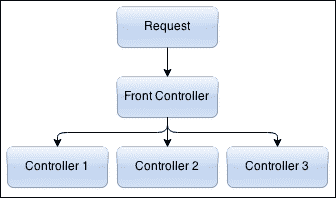
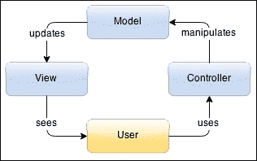
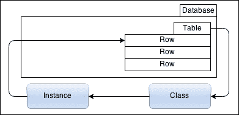
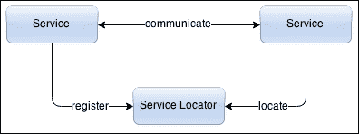
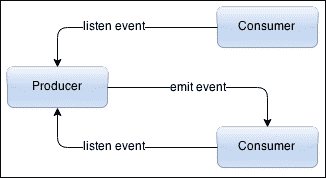
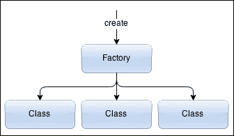
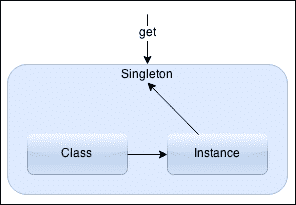
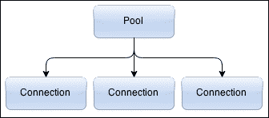
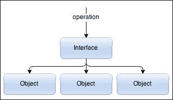

# 第二章：开发模式

开发真的很棒。它给了你创造新事物的自由感。这对几乎每种语言都是真实的——以自己的方式创建东西的自由。这意味着有好的方法和不那么好的方法来完成相同的任务。在他们的生涯中，开发人员将面临不同的问题，这些问题有相似的解决方案，并且会采用模式。对于一些问题，他们会知道他们正在使用的模式；对于其他问题，他们可能会使用甚至不知道的模式。

有些模式直接提高性能，而其他模式则间接提高性能，因为它们是能够扩展的架构模式。创建高性能应用程序涉及了解每一行运行的代码，这意味着了解应用程序中使用的模式。有时，它们是无意的。在其他时候，它们是强制性的，因为特定模式的好处。模式无处不在，从对象的创建到对象之间的交互以及应用程序的一流服务。

同样，不同的语言和平台有特定的模式。这是因为编译器或解释器处理某些代码片段比其他更好。有时，这是因为它是设计和针对最常见情况的最佳性能。在其他时候，这仅仅是因为语言如何处理某些实体，比如函数、变量类型或某些循环。因此，了解解释器如何处理某些代码模式是很重要的。

# 什么是模式？

模式不是库或类。它们是概念——可重用的解决常见编程问题的解决方案，经过测试和优化以适用于特定用例。由于它们只是旨在解决特定问题的概念，因此它们必须在您的语言中实现。每种模式都有其优点和缺点，选择错误的模式可能会给您带来很大的麻烦。

模式可以加快开发过程，因为它们提供了经过充分测试和验证的开发范例。重用模式有助于防止问题，并提高熟悉它们的开发人员之间的代码可读性。

模式在高性能应用程序中非常重要。有时，为了实现一些灵活性，模式会在代码中引入新的间接层，这可能会降低性能。您应该选择何时引入模式，并知道引入模式会对您的性能指标造成何种影响。

了解好的模式是非常重要的，以避免相反的—反模式。反模式是一种对重复问题的解决方案，既无效又适得其反。反模式不是特定的模式，而更像是常见的错误。它们被大多数成熟的开发人员/社区视为不应该使用的策略。以下是一些最常见和频繁出现的反模式：

+   **重复自己**：不要重复过多的代码部分。放松一下，看看整体情况，然后重构它。一些开发人员倾向于将这种重构视为应用程序的复杂性，但实际上它可以使您的应用程序更简单。如果您认为自己无法理解重构的简单性，请不要忘记在代码中添加一些介绍性注释。

+   **金榔头还是银子弹**：特别是在 Node.js 生态系统中，多亏了 NPM，那里有成千上万的模块可供使用。不要重复造轮子。花时间使用最常见的模块来满足您的需求，避免重新创建它们。

+   **异常编码**：您的代码应该处理所有类型的常见错误。如果应用程序经过良好规划，这种意外复杂性应该可以避免，因为它不会为应用程序带来任何新的东西。避免为每种类型的错误编写代码，处理最常见的错误，并默认为最一般的错误。这并不意味着您不应该在后端记录错误。这样做是为了以后分析，但要避免处理所有类型的错误。这会减少您的代码维护。

+   **偶然编程**：不要通过试错来编程。这种方法的成功纯粹是运气和概率的问题。这是您真正应该避免的事情。偶然编程可能会使您的代码在某些情况下工作，但在未经计划的情况下会出现错误行为。

# Node.js 模式

由于 Node.js 平台的结构和 API 模型，某些模式更倾向或更自然。最明显的是事件驱动和事件流模式。它们并不是强制性的，但在核心 API 中非常根深蒂固，您在应用程序的某些部分被迫使用它，因此最好了解它们如何单独工作，如何共同工作以及如何从中受益。

使用核心 API，您可以访问文件系统，例如，使用单个方法和回调来读取文件；或者您可以请求读取流，然后检查数据和结束事件，或将流传输到其他位置。当您不想查看文件，只想将其提供给客户端时，这非常有用。这种架构旨在为`http`和`net`等核心模块工作。同样，当监听客户端连接时，您将不得不监听连接事件（除非在创建套接字时定义了连接监听器），然后为每个连接监听数据和结束事件。记住不要忽略错误事件，因为如果不监听，它们会触发异常，并强制您的应用程序停止。事件是 Node.js 平台的核心特性：

+   流也存在，并且有人可能认为它们是两种不同的东西，但实际上它们并不是。每个流都是事件发射器的扩展。在最基本的形式中，流是从某种缓冲区发出数据事件的过程。事件、流和缓冲区共同构成了一个非常好的事件驱动架构的例子——这种模式非常适合 JavaScript 语言。

+   不同类型的流可能会相互连接，特别是在共享公共数据和结束事件时。非常常见的是使用`fs`流并将其传输到`http`流。这种可用性使开发人员能够避免在应用程序中进行不必要的内存分配，只需将任务传递给平台。

+   事件使应用程序组件之间实现了松散耦合，使其能够在组件发出事件和监听事件之间没有严格的连接的情况下进行更改和演变。不足之处是，有一些边缘情况需要注意，例如因为我们没有监听而丢失了发出的事件，或者因为忘记停止监听不再存在的事件而导致内存泄漏。

+   缓冲区是您在处理可能因为字符串编码而破坏的数据时应该使用的对象。它们被平台用于读取文件和将数据写入套接字。对于缓冲区，有许多字符串操作函数可供使用。

# 模式类型

你的应用程序不仅仅使用核心 API。在一个复杂的应用程序中，你将会使用许多其他模块，有些是你自己制作的，有些是你简单地下载的。模式存在于你的应用程序的各个地方。当你使用一个模块并且需要创建一个不同的接口时，你将会使用适配器模式，这是一种结构模式。如果你需要扩展刚刚下载的模块以添加一些功能方法，你可以使用装饰器模式，另一种结构模式。当下载的模块可能需要一些复杂的信息来初始化时，你可能会想要使用工厂模式，这是一种创建模式。如果你的应用程序发展并且这种初始化需要更多的灵活性，你将会使用建造者模式，另一种创建模式。如果你的应用程序访问关系数据，你可能需要使用活动记录模式。如果你使用某种软件框架，你可能会使用 MVC 模式。

许多开发人员并没有注意到他们正在使用一些这些模式。了解它们，特别是了解某些模式在某些情境中存在的问题是很重要的。为了能够分析和测试这些模式，它们被分类为几种类型。让我们看看一些这些类型和每种类型中一些最常见的模式。

## 架构模式

架构模式是通常在软件框架内实现的模式。这些模式解决了大多数应用程序中发现的常见问题。它们通过创建某种层来解决常见的更广泛的问题，避免了代码重复。这张图片是对前端控制器的描述：



+   **前端控制器**模式，在 Web 应用程序中最常见，是一个唯一的控制器处理所有传入的请求的情况。这是通过有一个单一的入口点来实现的，该入口点加载常见的库，如数据访问和会话管理，然后为每个请求加载特定的控制器。这是一个非常常见的做法，因为另一种选择——为不同的操作有多个入口点——会大大增加和重复代码，使应用程序更加复杂和难以管理和维护。

在大多数框架中，这种模式允许你的应用程序通过不重复不必要的代码来增长不同的模块。它有一个中心点，可以处理许多常见的任务，如数据库访问、会话管理、访问日志和错误日志、通用访问、授权和会计等。

这种模式在任何良好结构的应用程序中都是必不可少的，因为它通过强制应用程序的一个公共部分首先运行并执行你需要的每个检查，大大减少了重复的代码。它还可以增加安全性；如果发现任何漏洞，封闭一个单一的入口点比多个入口点更容易。使用一个中心点，你的应用程序可以使用各种性能方法来提供更好的响应感，也可以增加整体性能。下面的图片是对 MVC 的描述



+   **模型-视图-控制器**（**MVC**）模式是一种将应用程序组件分为三个部分的模式：模型、视图和控制器（因此得名）。模型是你的数据结构，或者你的信息逻辑。例如，这可以是关系数据库中的一个或多个表。视图是一种视觉表示，通常是用户界面。它可以是图形的或基于文本的。它是你的模型的一种表示方式，用户可以看到并操作。控制器是实际上负责操作你的模型的部分，有时直接更新视图，根据用户在视图中的操作。

这种模式有许多变体，你应该选择最适合你的任务和语言的那种。其中一些变体是**Model-View-ViewModel**（**MVVM**）和**Model-View-Adapter**（**MVA**），它们试图将视图与模型解耦，使模型不一定要意识到视图的存在。这样就可以拥有同一模型的多个视图。

这种模式的主要目的是清晰地将用户所见（视图或设计）与编程逻辑（模型）分开。这对于设计师能够更改视图而不影响逻辑非常重要。同时，开发人员可以修复逻辑而不破坏设计。如果你认为自己至少是一名中级开发人员，那么这种模式是必不可少的。因为它不仅仅是一种模式，更被认为是一种必要的实践。



+   **Active Record**模式是一个用于访问关系数据库的抽象层，它提供了一个简单的数据对象。操作这个对象可以触发数据库的更改，而开发人员不需要知道应用背后的数据库类型。通常，数据库中的表或视图被映射到一个类，实例被映射到行。通常，外键由引用实例处理。逻辑可以赋予数据对象常见的应用任务，例如，根据两个不同的表列（如名字和姓氏）计算全名。所有这些都为业务逻辑提供了更好的方法，使得你可以拥有你的数据以及在顶部扩展它以匹配应用的预期行为的额外层。这种模式通常用于扩展功能到新水平的**对象关系映射**（**ORM**）库中。其中一个例子是可能在应用的两个或更多不同位置引用数据库中的同一行，并且（不知情地）拥有相同的引用数据对象。

这种模式主要因为两个方面受到批评。首先是应用和数据之间存在一个抽象层，这可能会大幅降低性能，并在数据密集型应用中增加内存泄漏。另一个方面是可测试性；数据对象和数据库之间的紧密耦合使得很难为适当的测试使用真实数据库。



+   **服务定位器**模式是通过使用一个称为服务定位器的中央注册表来抽象访问服务的概念，这个注册表允许服务注册并了解彼此的访问方法。尽管这种模式涉及在应用程序的组件之间添加一个额外的层，但它可以为应用程序提供适应性和可扩展性。

这种方法有一些优势，最重要的是适应工作负载的可能性。服务定位器可以控制对注册服务的访问，如果你在多台服务器上有同一服务的多个实例，这个定位器可以轮流访问每一个实例，从而可以添加更多实例并处理更多负载。另一个重要的优势是可以注销服务并注册新的具有更好性能或错误修复的服务，从而使你可以保持零停机时间。

然而，并非一切都是好消息；有一些不利之处需要权衡。服务定位器可能成为单点故障的潜在来源，这是没有人想要的。安全性也很重要，服务注册必须谨慎处理，以防止外部人员劫持注册表。此外，由于服务与服务定位器和应用程序解耦，它们就像黑匣子一样，可能更难处理错误并从中恢复。



+   事件驱动模式是一种促进事件的生产和消费的模式。这种架构强制编程逻辑对事件做出反应。事件是状态变化，例如，当建立网络连接时，数据到达，或文件句柄关闭时。需要通知事件的对象（称为消费者）在适当的事件发射器对象（生产者）中注册（监听）事件。当该对象检测到与其相关的状态变化时，它会通知（发出）事件给消费者。

事件可以包含数据信息。例如，如果文件阅读器对象是一个事件发射器，它可能会在相应文件被打开时通知消费者，当它从文件中获取数据时（无论是否完整），当文件关闭时（没有更多数据），以及最终发生任何错误时（无访问权限或文件系统是两个例子）。数据事件最终可能会获取文件本身，错误事件应该获取相关的错误。

围绕这种模式构建应用程序通常使它们更具响应性，因为这些系统是针对不可预测和异步环境设计的，这种环境存在于使用网络或文件系统的任何系统中。这种架构非常松散耦合，因为事件几乎可以是任何东西，任何地方，使得这种模式具有可扩展性和可分发性。

具有这种模式的框架通常允许开发人员创建自己的产品，即事件发射器，具有自定义事件和数据，扩展核心功能，并使整个应用程序成为事件驱动。

## 创建模式

创建模式是开发人员在创建新数据或对象时使用的模式。这些模式使您的应用程序具有灵活性，可以选择何时实例化新对象或重用当前对象。在这种类型的模式中，您可以找到一些如下所述的模式：



+   工厂方法模式用于将应用程序与特定类抽象化。它用于创建新对象。在这种模式中，调用一个方法，返回一个新的（或重用的）对象，并且创建的逻辑（如果需要）由另一个子类处理。当需要创建新对象的组件可能没有所有必要的信息（例如数据库信息）时，这种模式特别有用。另一个用例是当这个对象在组件之间被重复使用时，创建对象所需的代码可能太复杂，可能需要重复许多代码片段。再次，数据库连接或另一个数据信息服务访问是这种模式的一个很好的案例。

+   延迟初始化模式是指延迟创建对象或计算复杂表达式。这也被称为延迟加载。当您在调用某个工厂函数后保存一个实例，以便在再次调用该函数时可以返回该实例时，通常会出现这种模式。这是获取单例的另一种方式。

+   **单例**模式用于应用程序需要单个对象实例以实现高效运行的情况。这种模式通常在类本身中创建，其中类的开发者创建一个方法来创建一个新实例，如果先前已创建实例，则返回该实例。它也可以出现在工厂模式中，应用程序可能有一个用于创建数据库连接池的库，并且希望所有模块使用相同的池而不是创建新的。这对于 Web 应用程序尤为重要，因为您希望避免每次请求时连接到数据库。例如，在 Active Record 模式中也会使用，当多个组件需要相同的行时，而不是返回不同的对象，返回相同的对象。

+   **建造者**模式是负责创建其他类的新实例的类。这类似于工厂方法模式，更灵活但也更复杂。开发人员通常从工厂模式开始，然后演变为这种模式。这在抽象一个具有多种构造组合的类时特别有用，例如构造数据库查询时。

建造者背后的类通常很复杂，建造者有时通过暴露更简单的方法来解决这种复杂性，并随着需求的到来而不断发展。这是一个很好的模式，可以级联或链接方法以创建更流畅的接口。



+   在**对象池**模式中，一组对象（称为池）被其他组件准备好供使用。这种模式通常与连接池和可能涉及重要初始化时间的其他操作相关联。通常，这些池以较低的值（减少的池大小）初始化，并根据需求增长到更高或限制值。

这种模式经常用于数据库连接中，因为创建连接可能很昂贵，考虑到连接和认证。始终保持一些连接活动会大大减少初始化时间并提高性能。

## 结构型模式

另一种类型的模式是结构型模式。在这种类型中，有助于组件之间的关系和通信的模式。这些通常用于将第三方模块连接在一起作为一个公共接口。此类型的示例描述如下：


+   **适配器**模式是最常见的模式，用于连接两个不兼容的组件，通过一个公共接口连接。一个区分这种模式与类似模式的规则是，连接两个组件的适配器不应具有任何逻辑，只允许两个接口连接到一个新的公共接口。

这种模式出现在你有两个接口并且需要重构其中一个接口，接口将改变方法。虽然你不必重构另一个接口，但你需要一个适配器来保持应用程序运行。



+   **组合**模式用于当一组对象或单个对象应该以相同的方式对待和访问时。当组件不知道何时访问一组对象或单个对象时，应该使用这种模式。当意图处理两种变化的代码复杂性不大时，这种模式特别有用。这种模式在 jQuery 和其他将一组元素与单个元素视为相同的库中经常出现。

行为模式

当你用一个更容易使用和理解的接口包装一个复杂的库时，就会使用外观模式。有时候库变得非常灵活，有许多不同的选项，当你创建一个不那么灵活但更简单的接口到一个复杂的库时就会使用这种模式。

+   装饰器模式

+   中介者模式创建了一个抽象层，称为中介者，它处理与多个类的通信。随着应用程序变得复杂，需要一个中介者来降低类之间通信的复杂性。这个中介者封装了与所有类的通信，通过保持对象不直接相互交互来减少依赖性和降低耦合。如果你的应用程序是模块化的，不同的模块可以在运行时加载，这可以被称为你的内部 API。

这种模式出现在一对重复或复杂任务很常见的情况下，你决定最好有一个接口来完成它。这不是一个适配器模式，因为它不是一个接口改变；它是一个简化的接口。例如，如果你有一个理解和使用 SMTP 的类。你需要发送一封电子邮件，而且更喜欢有一个单一的方法来发送消息，而不是原始类的一系列复杂方法。

结构模式

+   外观模式

## 代理模式通常用于简化更复杂的任务，它是一个对象充当代理来访问某些东西的模式。它可以是另一个对象、一个文件、一个文件夹或一些数据库信息。例如，这种模式被用来为其他东西添加安全层，因为它可以限制应用程序访问特定资源的方式和时间。这种模式的一个例子是对服务的 REST 接口。

代理模式

中介者模式

+   当向对象添加功能而不影响同一类的其他对象的行为时使用装饰器模式。这实际上是原型继承的基础，这是 JavaScript 的一个基本原则。通过将对象包装在另一个类中，保存对它的引用，并将新功能添加到新类中来实现。当你想要使用的模块没有你想要的所有功能时，你会使用这个模式，并决定包装它并提供额外的方法。这是适配器模式的扩展或下一步。通常你会发现一个几乎符合你需求的模块，但后来你意识到有一两个缺失的功能，所以你不是去寻找另一个模块（也许是因为你已经习惯了它），而是装饰第一个模块。

+   模板方法模式被几个框架使用。通常是一个方法，它接受一组选项并编译您的信息的一部分，留下一些可修改部分的占位符。例如，这被用作预编译图形用户界面视图的一种方式，留下一些占位符，比如国际化文本，以及最终一些代码逻辑以便以后运行。当模板的某个部分不变时，这种模式非常有效，减少了每次需要时从模板编译的时间。这也是**控制反转**的典型例子，模板可以调用应用程序的部分，而不是应用程序调用模板的方法。

+   观察者模式维护了一个被称为观察者的依赖列表，并通过调用每个依赖提供的方法来通知它们的变化。这通常被称为事件系统，并且在事件驱动架构中被使用，比如 Node.js。这种模式在异步编程中非常有效和有用。另一方面，如果使用不当，当事件监听器没有正确注销并且观察者保持对其的强引用时，可能会导致内存泄漏，从而阻止垃圾回收对其进行处理（过期监听器问题）。这种模式被 Node.js 平台大量使用，如果您想创建一个高性能的应用程序，那么您必须接受并理解它。

# 事件驱动架构

在 Node.js 中开发与其他语言并无不同。您有一些更多或更少本地的模式，被广泛采用并得到充分支持。一个非常常见的模式是**事件驱动架构**。这种模式促进了事件的产生和消费。这意味着您的代码应该对事件做出反应，而不是不断尝试检测变化。通常，许多监听器可以消费一个事件。有一些变化，比如有一种停止事件传播的方法，或者只允许第一个监听器消费事件，但通常所有监听器都能消费他们正在监听的所有事件。

当您需要在代码的*一对多*模块内部进行通信时，这种模式非常有效，因为它给您提供了非常松散的耦合。这在**面向服务的架构**（**SOA**）中特别有趣，因为它确保您的应用程序组件（您的服务）保持松散耦合，并且可以随着时间的推移进行升级而不影响其他服务。想象一下，您有一个附加了许多服务的应用程序，还有一个名为**Sessions**的服务，负责管理用户会话，创建它们和销毁它们。当会话发生变化时，该服务可能会产生事件。这样，其他服务可以监听事件并相应地采取行动。这意味着只想知道会话何时创建的服务，例如，只需监听创建事件，而另一个只需要知道何时销毁的服务只需监听特定事件。其他服务可以添加而不必改变太多您的应用程序。这对于在某种程度上创建服务之间的边界也是有益的，例如，当您不想信任第三方服务时。

有一些相关的模式——这种模式的变体。一个广泛使用的模式是发布-订阅模式。一个广泛使用且非常相似的模式是发布-订阅模式。你有消息而不是事件；你有订阅者而不是监听器；你有发布者而不是事件发射器。这种模式的主要优势通常是实现为使用网络层工作，因此可以被服务用于通过互联网相互通信。然而，与 Node.js 核心事件相比，这种模式实际上并不那么简单，可能会变得相当复杂，因为它允许消息过滤，订阅者可以根据消息属性决定他们想要接收什么样的消息。

通常，这种模式涉及第三个元素，负责接受发布者的消息并将其传递给订阅者。这个元素可能会扩展并允许更分布式的架构。另一方面，由于解耦了发布者和订阅者，发布者可能会失去知道谁订阅了哪些频道的能力。此外，要注意消息传递，因为网络层可能会引入许多复杂性并减慢你的工作流程。这不是你想依赖的东西。

事件驱动的架构允许你创建一个应用程序，其中信息的流动由事件决定。这很棒，但有两件事情你不应该忘记：

1.  在你的流程期望事件发生时，要小心不要创建一种死锁，而事件却从未触发，或者你注册监听的时间太晚了。通常情况下，这对你的应用程序并不致命，因为你并没有被阻塞在等待事件，但你的应用程序将处于一个中间状态，无法摆脱，并且可能会泄漏内存。从用户的角度来看，你的应用程序是失败的。

1.  始终要优雅地处理错误；不要忽视它们。核心模块如`http`和`net`在你没有正确处理错误事件时会抛出异常。这意味着将触发未捕获的异常，你的应用程序将会严重停止。你不会忽略未捕获的异常，对吧？

总的来说，这是一个非常适合 Node.js 平台的通用模式，当你需要在应用程序的几个部分之间进行通信时非常方便。此外，JavaScript 本身通过支持匿名函数（称为闭包）很好地处理了这种模式。

## 流

你可能已经注意到，在 Node.js 中，事件和流有一定的关联。这并非偶然；它有助于构建一个简单易懂且易于适应的工作流程。流使用事件通知消费者有可供消费的数据以及数据何时到达末尾。

从流的角度来看，可以将其视为 Unix 管道（[`en.wikipedia.org/wiki/Pipeline_(Unix)`](https://en.wikipedia.org/wiki/Pipeline_(Unix)））。目标是像在命令之间传输数据一样有用，以读取数据、处理数据、转换数据，然后输出数据。流是一个快速且易于使用的接口，用于创建可读、可写、双工和转换流。让我们来看看不同类型的流，如下所示：

+   **readable**：例如，这是一个文件解析器，读取某种格式（如 CSV），并为每一行发出数据事件。这个流可以被传输到其他类型的流中。可读流可以处于流动模式，这意味着数据在源头可用时被传输，以及暂停模式，其中数据必须在需要时手动获取（如果可用的话）。

+   **可写**：向文件写入或响应客户端是此类型流的示例。其他示例包括数据压缩流（`zlib`）和加密流（`crypto`）。此流将数据写入目的地并通知其进度。它还可以处理所谓的回压，即当数据被写入流中但在另一侧未被处理时，强制流将数据保留在内存中。

+   **双工**：这既是可读流又是可写流，因为它处理源和目的地。此类型的示例包括套接字以及压缩和加密流，具体取决于目标。

+   **转换**：此流是双工流的扩展，在源和目的地之间执行某种数据转换。压缩数据是此类型的一个很好的示例，但在不同格式之间转换数据也是如此。

## 缓冲区

在 Node.js 平台中，另一个重要的组成部分是缓冲区。由于 JavaScript 字符串是以 Unicode 编码的，二进制数据可能在处理过程中被破坏。缓冲区是处理二进制数据的替代方法。作为奖励，您可以获得多种不同大小的读写数字的方法，无论是大端还是小端。

由于二进制兼容性，核心模块在流数据事件中使用缓冲区。将文件流式传输到客户端或从客户端接收文件并将其写入磁盘就像管道流一样简单。它们之间可以直接传递缓冲区，因此它们可以直接工作。

# 优化

使用模式可以改进您的应用程序，因为您使用了经过充分验证和经过充分测试的概念，这有助于开发人员更好地理解并最终改进您的代码。但是改进您的代码并不止于此。还有一种模式，它因语言而异，我们称之为优化。

优化是一种模式，不是特定于任何问题，而是特定于代码结构。其思想是改变代码以使其更有效或使用更少的内存或其他类型的资源来完成相同的事情。优化的目标不是使代码更简单或更易读。它可能更大，但仍然可读。不要为了优化而优化，降低代码的可读性。

由于 Node.js 使用 V8 引擎作为语言处理器，我们必须在代码中使用 V8 特定的优化。一些优化跨版本有效，而其他一些则不太有效，优化的努力可能是徒劳的。这是因为 V8 不断改进，Node.js 平台在每次发布时都会发布新版本，因此昨天因为 V8 在某些方面性能不佳而好的优化，可能在 V8 解决了该性能问题后，明天就不值得了。现在让我们来看看一些值得注意的优化。

## 隐藏类型

JavaScript 具有动态类型。这意味着变量具有动态类型，因此它可以从数字变为字符串，反之亦然。这个特性在编译时很难优化，V8 有一个称为**隐藏类型**的功能，它在相同类型的对象之间共享优化。例如，当您使用`new`关键字创建对象时，如果对象的每个实例在其原型中没有发生更改，它们都共享相同的隐藏类型，并且将使用相同的优化代码：

```js
function Person(first_name, last_name) {
  this.first_name = first_name;
  this.last_name  = last_name;
}

var john = new Person("John", "Doe");
var jane = new Person("Jane", "Doe");

// john and jane share the same type

jane.age = 18; // jane no longer has the same type as john!
```

对于复杂对象可能无法实现这一点，但对于简单对象，您可以通过在构造函数中设置属性，然后封闭对象以避免更多的更改来强制执行它。

## 数字

再次，由于 JavaScript 具有动态类型，数字可以改变类型。编译器将尝试推断类型，一旦知道类型，它将标记变量为该类型，以便能够与其他变量执行操作。在此之后改变类型是可能的，但代价高昂，因此最好避免改变数字类型。更具体地说，避免进出 31 位有符号整数：

```js
var number = 32; // 31-bit signed integer
number /= 10; // double precision floating point
```

## 数组

数组的长度可以是可变的。为了处理这个问题，编译器为每种特定类型的数组都有一些内部类型，并且在这些类型之间切换是不可取的。数组应该具有连续的键，从零开始。避免删除中间的元素并访问您之前未初始化的元素。与数字类似，您应该保持数组元素的相同类型。此外，如果您知道数组的大小，应该在构造函数中指出：

```js
var a = new Array();
a[0] = 32;
a[1] = 3.2; // internal conversion
a[2] = false; // another conversion
```

在这个特定的例子中，最好在创建之前初始化所有元素，以便编译器在创建之前知道隐藏的类型，而不是推断两次。

```js
var a = [ 32, 3.2, false ]; // much faster
```

## 函数

函数继承自对象，因此隐藏类型在这里也适用。多态函数会大大降低性能。如果您希望获得最佳性能，请为您需要的每个构造函数创建一个单独的函数：

```js
function add(a, b) {
    return a + b;
}

add(2, 3); // looks like monomorphic
add("john", "doe"); // it's now polymorphic
```

同样，一些对`arguments`的使用会降低性能。避免重新分配它们（例如，当未定义时）。而是使用另一个变量。您应该只使用`arguments`来检查参数长度并查看有效的索引：

```js
function add(a, b) {
    if (arguments.length == 1) b = 0; // penalty
}
```

## for-in 循环

在运行时评估代码时会有一些性能损失，另一个特性循环，为了获得最佳性能，应该避免使用普通的`for`循环。性能损失来自编译器无法优化的边缘情况。始终使用`Object.keys`来获取对象中的键列表，然后迭代该列表：

```js
var keys = Object.keys(obj);
for (var i = 0; i < keys.length; i++) {
    // obj[keys[i]]
}
```

## 无限循环

您永远不应该创建无限循环（`while (true) {}`或`for (;;) {}`）。这对性能代码来说是一个更重要的规则。无限循环很难优化，最好重构您的代码并审查您的逻辑。

## try-catch 块

try-catch 块在捕获异常方面很重要，但在异步架构中，它们可能不那么重要。编译器很难优化 try-catch 内部的范围，因此您应该尽量将尽可能多的代码移出语句。

## Eval

Eval 是另一个可以避免的特性，因为带有`eval`调用的任何函数作用域都将使函数无法优化。除非真的需要，否则永远不要使用这个特性，如果需要，就把它放在尽可能小的函数中。

### 提示

**下载示例代码**

您可以从您在[`www.packtpub.com`](http://www.packtpub.com)账户中下载示例代码文件，用于您购买的所有 Packt Publishing 图书。如果您在其他地方购买了这本书，您可以访问[`www.packtpub.com/support`](http://www.packtpub.com/support)并注册，文件将直接通过电子邮件发送给您。

# 总结

开发应该是一种很棒的体验。高性能的应用程序需要对它们的设计和开发进行一些限制。了解大多数常见模式有助于为您的应用程序选择明智的路径，并避免未来的一些性能损失。然而，模式并不是全部，对 Node.js 平台背后的东西有很好的理解真的有助于您在性能方面达到更高的水平。

即使选择了良好的模式并在开发中尽力使用本章中描述的一些优化技巧，应用程序在某些情况下可能表现不佳。除非需要，否则不要进行优化。遵循模式和技巧，但在测试应用程序性能并意识到需要优化之前不要过分考虑。

为 Bentham Chang 准备，Safari ID bentham@gmail.com 用户编号：2843974 ©2015 Safari Books Online，LLC。此下载文件仅供个人使用，并受到服务条款的约束。任何其他使用都需要版权所有者的事先书面同意。未经授权的使用、复制和/或分发严格禁止并违反适用法律。保留所有权利。
