# 第三章：垃圾收集

在编写应用程序时，管理可用内存是乏味且困难的。当应用程序变得复杂时，很容易开始泄漏内存。许多编程语言都具有自动内存管理，通过**垃圾收集器**（**GC**）帮助开发人员忘记这种管理。GC 只是这种内存管理的一部分，但它是最重要的部分，负责定期查看已处理的引用对象并释放与其关联的内存。

GC 最常用的技术是监视引用计数。这意味着对于每个对象，GC 都保存引用它的其他对象的数量（计数）。当一个对象没有引用时，它可以被收集，这意味着它可以被处理并且其内存被释放。

在 V8 中，Node.js 引擎中，这种引用计数并不是不断检查的。相反，它会定期扫描，这个任务被称为一个循环。通常，这个循环不是原子的，这意味着程序在运行此循环时会暂停执行。此外，为了保持这种引用计数，GC 需要内存。这意味着除了程序使用的内存之外，程序还需要内存开销。此外，由于语言是动态的，对象可以改变类型，因此内存有时并不以最有效的方式使用。回顾前一章关于更有效地使用内存的开发模式。

# 自动内存管理

GC 极大地简化了语言的使用，使开发人员有更多的时间专注于应用程序的其他方面。此外，它可以减少一种称为内存泄漏的错误，尽管不能完全消除，这种错误会困扰长时间运行的应用程序和服务。然而，与其定期任务相关的性能惩罚。这可能会被注意到，也可能不会，这取决于在短时间内使用和处理多少内存。

通过将内存管理移出开发人员，Node.js 消除或大大减少了一些类型的错误：

+   悬空指针错误：当内存被释放但仍然有一个或多个指针引用该内存块时发生。如果重新分配内存，这些指针可能会导致不可预测的行为，如果用于更改程序其他部分的块。在这种情况下，应用程序中有两个以上的位置更改相同的内存块。这是一个特别难以找到的错误。

+   双重释放错误：当内存被释放一次，然后再次被释放时发生。在此期间，它可能已被重新分配并被应用程序的另一部分使用，破坏了对重复使用的块的访问。这类似于前一个内存，其中两个位置管理相同的块，但在这种情况下，一个位置试图使用它，另一个位置只会擦除数据。

+   内存泄漏：当对象在被释放之前被取消引用时发生。当程序分配内存，使用它，然后在显式释放之前取消对该内存的引用时，就会发生这种情况。如果这种行为反复发生，特别是在长时间运行的服务上，这种类型的错误可能导致内存耗尽。

+   缓冲区溢出：当尝试写入的信息超过任务分配的空间时发生。例如，当程序在需要比分配的内存块更多的空间时分配内存块的某个地方，但未能检测并重新分配所需的空间时，这种情况很常见。这种错误可能会使应用程序或服务停止。

另一方面，将内存管理移出开发人员的控制会大大减少对内存使用和管理方式的控制。当 GC 查看正在使用的内存并决定何时释放未引用的对象时，会消耗资源，在应用程序执行期间创建不可预测的暂停。此外，GC 开始执行其工作的时间可能是不可预测的，并且超出您的控制范围，这可能会在您的程序需要资源时引入不可预测的性能惩罚。

这是 Node.js 的情况，但由于它使用 V8，在`--expose_gc`标志下暴露了一个`gc()`方法，您可以手动强制使用它。您无法决定它何时运行，但如果您认为这样做是最好的，可以强制它更频繁地运行。您还可以调整一些 GC 的行为。要了解更多信息，请运行`--v8-options`节点。

没有办法阻止其使用，因此您只能使其更频繁地运行，可能减少其占用空间。GC 的成本与引用对象的数量成正比，因此如果在大大减少引用对象后使用此方法，您可以使应用程序保持精简，并在以后减少 GC 的惩罚。

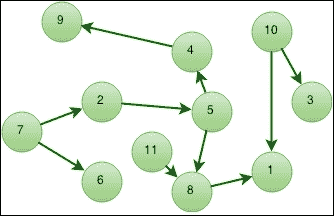

图 1：GC 内存图

## 内存组织

将内存视为通常是基本元素（数字和字符串）和对象（哈希表）的网格。它可以被表示为相互连接的点的图。内存可以用来保存对象信息或引用其他对象。您可以将这种相互连接视为叶子节点是保存信息的元素，其他节点是对其他节点的引用（在图 1 中，节点 1、3、6 和 9 是叶子节点）。

在使用 V8 时，有一些术语可能对您更好地理解 V8 检查器或 Chrome 开发者工具有用。对象本身使用的内存称为**浅大小**。它用于存储其直接值，通常只有字符串和数组可以具有显着的大小。

还有一个距离列，它是从根节点到节点本身的最小图距离。根节点是从那里引用开始指向其他节点的节点。在图 2 中，它将是节点 2，因为没有箭头指向 2，图上的一切都从节点 2 开始。在检查器中，您会看到**Profiles**中的另一个术语称为**保留大小**。这是一旦对象被删除将被释放的大小。它至少是对象本身的大小加上引用对象的大小，这些引用对象也将立即被释放，因为它们也将被取消引用。令人困惑？让我们看一个例子：

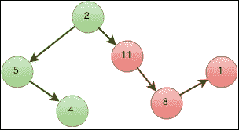

图 2：清扫前的 GC 标记节点

在前面的图中，您可以看到节点 2 是图中的根节点，因为没有节点引用（指向）它。该节点引用节点 5 和节点 11。如果对节点 11 的引用被移除，那么从节点 2（以及图的左侧的其余部分）到节点 8 和 1 就没有路径了。这些节点是节点 11 的保留大小的一部分，因为它们在没有节点 11 的情况下是无用的。当节点 11 被移除时，它们也将被移除。

## 内存泄漏

内存泄漏是可用内存持续丢失，当程序反复未能释放不再使用的内存时发生。Node.js 应用程序可能间接受到这个问题的影响，因为 GC。通常不是 GC 的错，而是由于一些对象销毁没有在应该发生时发生，当您使用事件驱动的架构时，这并不难。

泄漏问题困扰着每个开发者，一旦他们的应用程序达到中等规模。一旦你的程序开始与其他程序或客户端等外部元素有更多的交互，或者当你的程序复杂度增加时，就会开始出现内存泄漏。当你的应用程序中有一个不再有用的对象没有被取消引用时，就会发生这种情况。如果垃圾回收器发现该对象仍然被其他对象引用，即使它对你的应用程序不再有用，它仍将保留在堆中，并将被移动到一个称为“旧空间”的地方。

通常，对象的生存周期很长（自应用程序开始以来）或者很短（为特定客户端提供服务）。V8 GC 被设计用来利用这两种最常见的对象类型。GC 周期通常会清理这些短寿命对象，如果它认为这些对象仍然有用（也就是说，当它经历了一两个 GC 周期后），它会将它们移动到一个更大的区域，开始积累垃圾。当这个区域变大时，GC 周期的持续时间也会变长，你会开始注意到应用程序会出现一秒钟甚至几秒钟的停顿。如果发生这种情况，这意味着你已经迟了分析你的应用程序。

对于像 V8 的默认 1GB 限制这样的大内存限制，如果你不监控你的应用程序，当你的应用程序开始停顿一秒钟时，你可能会注意到泄漏，之后，它还会再过几秒钟才会因为内存限制而停止。对于大对象集合，GC 周期变得非常消耗 CPU，所以你应该真正监控 GC 内存管理，并尽可能避免更大的内存使用。

## 事件发射器

由于 Node.js 使用事件发射器，现在你脑海中应该有一个问题。由于 GC 只能清除未被引用的对象，这意味着在你将事件监听器附加到事件发射器后，事件发射器将不会被收集：

```js
var net    = require("net");
var server = net.createServer();

server.on("connection", function (socket) {
  socket.pipe(socket);
});
server.listen(7, "0.0.0.0");
```

前面的代码只是一个回声服务器的示例。在这个例子中，GC 永远不会收集`server`，在这种情况下这是好事，因为这是程序的主要对象。在其他情况下，你可能会遇到这样的情况，你的发射器不会被清除，因为有对监听器的引用。最重要的是，事件回调是函数——JavaScript 中的扩展对象——也不会被清除。

仔细看一下前面的例子。想象一下，对于每个客户端（套接字），你有更复杂的代码和一些私有协议。为了简化，你使用适配器模式创建一个抽象来访问每个客户端。这个抽象可以是一个事件发射器，作为一种手段来将其与应用程序的其他部分解耦。当你的客户端保持连接时，任何没有明确取消事件监听的事件监听器都不会被垃圾回收，即使它们不应该再存在（即使你将它们设置为 null 也是如此）。如果你的连接卡住了，而且没有超时（例如移动连接），你将会收集一大堆僵尸连接一段时间。

## 引用对象

GC 的主要目标是识别被丢弃的内存。这指的是你的应用程序不再使用的内存块，通常是因为你的代码不再引用它们。一旦识别出来，这些内存可以被重用或释放给操作系统：

```js
function foo() {
  var bar = { x: 1 }, baz = bar.x;

  return bar; // baz is unreferenced but bar isn't
}
```

在前面的例子中，尽管`bar`和`baz`都是函数的局部变量（因为 JavaScript 函数作用域），`baz`在`return`后会被取消引用，但`bar`不会，直到你完全取消引用它。这可能看起来很明显，但如果你的应用程序增长，并且你开始使用你不知道内部工作方式的外部模块，你可能会得到比预期更多的悬空引用：

```js
function foo() {
  var bar = { x: 1 };

  doSomething(bar);

  return bar;
}
```

现在想象一下，您调用`foo`函数并忽略返回的对象。您可能会认为它会变得未引用，但由于`doSomething`可能已经做了一些事情，这并没有保证。它可能已经保持了对`bar`的引用。

```js
function foo() {
  var bar = { x: 1 };

  doSomething(bar);

  bar = null;
}
```

现在想象一下，您不需要返回`bar`变量，因此在不再需要它之后将其置空，销毁引用。这样就更好了，对吗？不！如果`doSomething`函数保持对`bar`的引用，那么在`doSomething`之外，您无法完全取消引用它。

更糟糕的是，函数可以通过在`bar`中创建一个引用自身的属性来创建循环引用。但 GC 足够聪明，可以判断应用程序的其他部分何时不再使用对象。这取决于您的代码有多复杂。请记住，如果存在疑问（即仍然在某处被引用并且仍然可以使用），GC 将不会扫描该对象。

在其工作的每个周期中，GC 会在所谓的停止-世界中暂停 V8 执行，确切地知道内存中所有对象的位置和存在的引用。如果引用太多，GC 将只处理对象堆的一部分，最小化暂停的影响。下图显示了 V8 如何扫描内存对象，标记未引用的对象（第一行，红色），从列表中清除它们（第二行），然后通过删除对象之间的空白来压缩列表（第三行）。

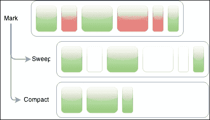

以前的 V8 GC 代有两种用于清理旧空间的算法：标记-扫描和标记-压缩。在这两种算法中，GC 遍历堆栈并标记可达（引用）的对象。之后，它可以使用标记-扫描来释放未被引用的对象的内存，或者使用标记-压缩来重新分配和压缩所使用的内存。这两种算法都在页面级别上工作。这两种算法的问题在于它们会在中等大小的应用程序中引入显著的暂停。

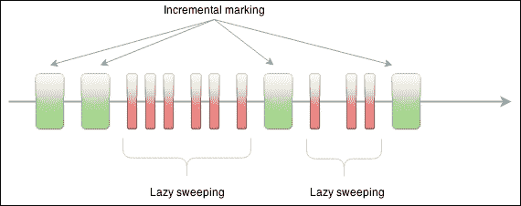

2012 年，谷歌推出了一项改进，显著减少了垃圾收集周期中的暂停。它引入了增量标记以避免遍历可能巨大的区域。相反，GC 只需通过区域的一部分进行标记，使暂停时间更短。GC 不再产生大的暂停，而是产生更多但更小的暂停。但改进并不止于此。标记后，GC 进行所谓的**懒惰扫描**。由于 GC 确切地知道哪些对象被引用，哪些没有（因为之前的标记步骤），它现在可以释放未引用对象的内存（扫描）。但它不需要立即这样做。相反，它只在需要时进行扫描。在扫描完所有对象后，GC 再次开始新的标记周期。

只要程序保持精简和简单，GC 就会很快。不要创建一个庞大的怪物，然后寻找提高 V8 内存限制的方法。在 64 位机器上，您可以将 1GB 限制几乎翻倍，但这并不是解决方案。您真的应该拆分应用程序。即使如此，如果您考虑更改限制，您要寻找的是`--max-stack-size`（以字节为单位）这个选项。

## 对象表示

在 V8 中，有三种原始类型：数字、布尔值和字符串。数字有两种形式：SMall Integers（SMI），它们是 31 位有符号整数，或者在诸如双精度（大数字）或具有扩展属性的数字的情况下是普通对象。字符串也有两种形式：一种在堆内，另一种在堆外，堆内有一个包装对象作为指针指向它。

还有其他对象，比如数组，它们是带有魔术长度属性的对象，以及本机对象，它们不在堆本身中（它们像某些字符串一样被包装），因此不受 GC 管理或扫描。

## 对象堆

GC 将对象存储在对象堆中。堆分为两个主要区域：新空间和旧空间，分别用于新对象和旧对象。新空间是对象创建的地方，旧空间是对象在一个或多个 GC 周期后移动到的地方。由于 GC 不是持续工作的，因此在周期之间，对象可以被创建，也可以在几分钟后被销毁（和取消引用）。这是最常见的对象行为，因此 GC 通常会有效地扫描它们。其他对象的生存周期更长，因此它们将在周期中存活，因为它们一直被引用和使用。这就是内存泄漏可能出现的地方。

这两个空间的设计目标不同。新空间比旧空间小，旨在快速、有意义，并且可以被 GC 快速分析。旧空间更大，包含在周期后移动到那里的对象。这个旧空间可以增长到非常大的大小，从几兆字节到一千兆字节。这种设计利用了大多数对象寿命短的常见行为，因此只存在于较小且更快的新空间中。

每个空间由页面组成，页面是连续的内存块，用于存储对象。每个页面顶部有一些头部和一个位图，告诉 GC 页面的哪些部分被对象使用。

对象之间的分离和从一个空间到另一个空间的移动引入了一些问题。一个问题显而易见，即重新分配。另一个问题是需要知道新空间中对对象的引用是否只存在于旧空间中。这是一种可能的情况，应该阻止对象被清理，但这会迫使 GC 扫描旧空间以弄清楚，从而破坏了这种架构的速度。为了避免这种情况，GC 维护了从旧空间到新空间的引用列表。这是另一个内存开销，但扫描这个列表更快。通常很小，因为这种引用相对罕见。

新空间很小，创建新对象很便宜，因为只是在已经保留的内存中增加指针。当这个新空间满了时，将触发一个次要周期来收集任何死对象并回收空间，避免使用更多空间。如果一个对象经历了两个次要周期，它将被移动到旧空间。

在旧空间中，对象在主要周期中进行扫描，这个周期比新空间中的次要周期频率低。当达到该空间的一定内存量或经过更长时间后，可以触发这个主要周期。这个周期的频率较低，可能会导致应用程序停顿更长时间。

## 堆快照

V8 允许您获取堆快照，以分析对象之间的内存分配。它允许您查看代码使用的对象，每个对象的使用数量以及应用程序如何在一段时间内使用它们，如果您请求堆快照转储。有几种收集堆快照的方法，我们将看一些。

让我们创建一个小的泄漏程序，并使用`node-inspector`模块进行分析。打开一个终端并全局安装 node inspector（`-g`），这样您就可以在机器的任何地方使用它。在下面的例子中，我们使用`sudo`，因为全局模块通常驻留在受限制的区域中：

```js
$ sudo npm install -g node-inspector

```

检查器需要编译一些模块，因此您需要一个编译器。如果安装正确，您将看到已安装的依赖项列表，现在可以启动它。一旦它运行起来，您就无需在更改和重新启动程序时重新启动它。只需现在不带参数启动它，并将其留在终端选项卡中：

```js
$ node-inspector

```

您应该看到类似以下控制台输出。您可以看到我正在使用版本`0.10.0`，但您可能会得到不同的版本。在这个例子中，实际上使用相同的版本并不是很重要。根据您使用的版本，输出可能会有所不同。在这种情况下，它与以下内容类似：

```js
$ node-inspector
Node Inspector v0.10.0
Visit http://127.0.0.1:8080/debug?ws=127.0.0.1:8080&port=5858 to start debugging.

```

打开您的网络浏览器，转到输出中指示的页面。现在让我们创建一个名为`leaky`的程序。这个程序的目的是故意泄漏内存。创建一个文件夹，并在其中安装 V8 分析器：

```js
$ mkdir leaky
$ cd leaky
$ npm install v8-profiler

```

请注意，这个模块也可能需要一个编译器。现在，在同一个文件夹中，创建一个名为`leaky.js`的文件，内容如下：

```js
require("v8-profiler");
var leakObject   = null;
function MemoryLeak() {
  var originalObject = leakObject;

  leakObject = {
    longString : new Array(1000000).join("*"),
    someMethod : function () {
      console.log(originalObject);
    }
  };
};

setInterval(MemoryLeak, 1000);
```

这个程序可能会让人困惑，但是想法是让 GC 无法看到我们强制它不回收对象，从而泄漏内存。如果您仔细观察，您会发现`leakObject`被重新定义为一个在调用时输出它的函数，但它引用的方式使 GC 不知道我们可怕的目标。请注意，运行此程序时，您将很快耗尽内存，可能每秒耗费 100 兆字节。以调试模式运行此程序：

```js
$ node --debug leaky.js

```

现在转到您刚刚打开的网页，单击**刷新**，转到页面上的**Profiles**选项卡，选择**Take Heap Snapshot**，然后单击**Take Snapshot**按钮，如下所示：

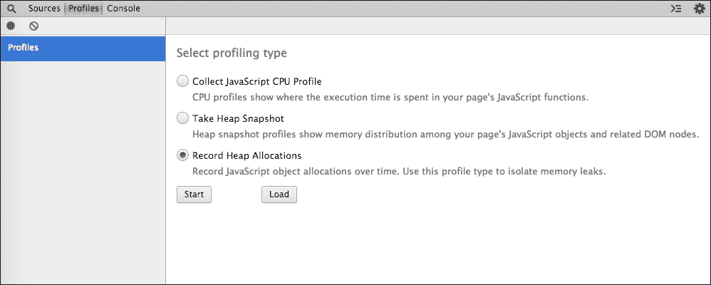

等一分钟，然后再次点击该按钮。您会看到快照出现在左侧边栏，并且您会注意到它们的大小不一样。它们在增长，而且 GC 正在泄漏我们的无意义程序。如果您选择最后一个快照并选择与第一个快照进行比较，您很容易注意到这一点。

您会看到大小和新对象的变化。正增量意味着创建的对象比销毁的对象多。

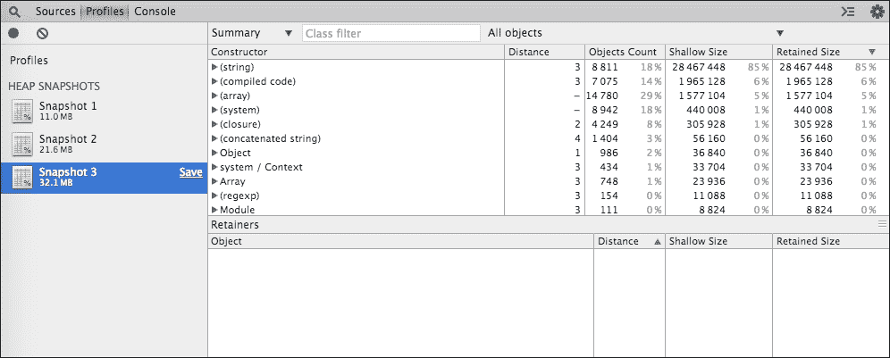

您可以在上面的截图中看到检查器显示快照时的样子。有一个构造函数或基本对象的列表。在这种情况下，由于我们正在比较**快照 3**和**快照 1**，所以有显示创建和删除的对象数量以及分配和释放的内存量的列。

检测内存泄漏的另一个有用方法是记录随时间的对象分配。使用这个检查器，重新启动程序，转到**Profiles**，选择**Record Heap Allocations**，然后点击**Start**，如此截图所示：

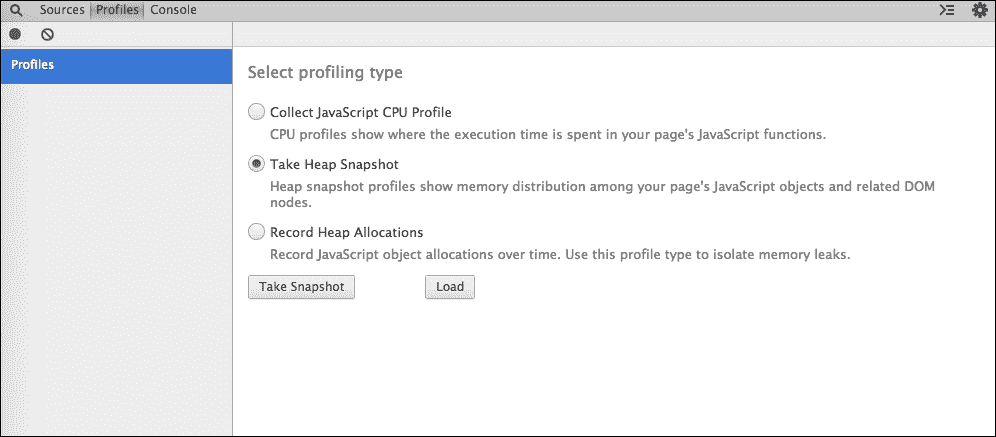

检查器将开始记录。当您单击左上角的红色圆圈时，它将停止。您将看到一个不断增长的时间线和每个次要周期的分配条形图。如果等一会儿，您会看到主要周期和对象重新分配（从新区到旧区）。

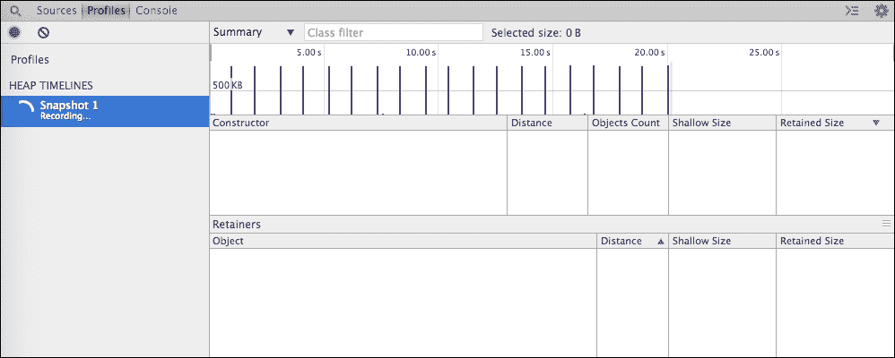

停止后，您可以通过单击起点并将其拖动到终点来选择一段时间。您将只看到该时期的分配情况，而不是所有对象。您可以保存快照以供以后分析或比较。在这个特定的例子中，您可以看到内存如何每秒快速消耗。

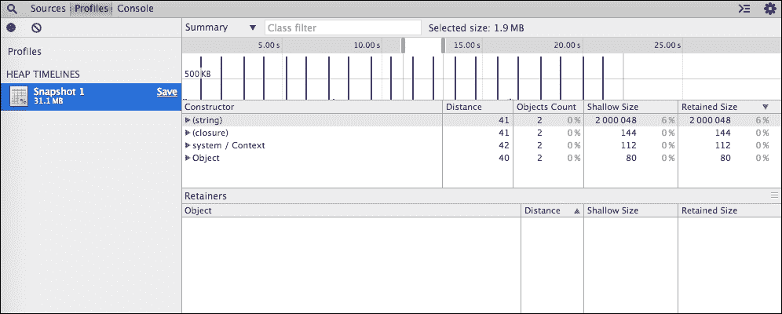

您可以单击并展开对象列表以查看每个对象。如果您正在寻找特定对象，可以使用顶部的过滤器。在这个例子中，您可以打开（字符串）组，您会看到我们在程序中创建的像`********…`这样的几个实例。

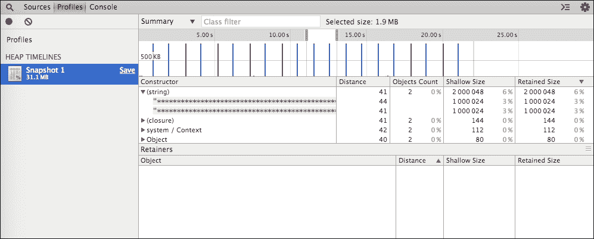

使用`v8-profiler`不仅可以与`node-inspector`一起进行调试。例如，您可以对代码进行快照并进行分析，也许与以前的快照进行比较，或者将其序列化并保存以供以后分析。

例如，考虑前面的程序示例，我们可以定期检查我们的堆栈中有多少个节点：

```js
var profiler   = require("v8-profiler");
var leakObject = null;

function MemoryLeak() {
  var originalObject = leakObject;
  leakObject = {
    longString : new Array(1000000).join("*"),
    someMethod : function () {
      console.log(originalObject);
    }
  };
};

setInterval(MemoryLeak, 1000);
setInterval(function () {
  console.log("mem. nodes: %d", profiler.takeSnapshot().nodesCount);
}, 1000);
```

如果您运行这个新版本，您可能会得到类似以下的输出。这证明了对象在 GC 周期中存活并泄漏内存：

```js
$ node --debug leaky.js
Debugger listening on port 5858
mem. nodes: 37293
mem. nodes: 37645
mem. nodes: 37951
mem. nodes: 37991
mem. nodes: 38004
mem. nodes: 38012

```

这只是一个例子。如果你监视你的应用程序，而它在空闲时内存不断增长，这是需要进一步分析的原因。第一类公民（对于来自其他面向对象语言的人来说，所谓的类）将出现在应用程序快照的构造函数列表中。

有其他模块可以用来分析和监控你的 Node.js 程序的内存和垃圾回收器。`heapdump`模块是另一个简单的模块，可以帮助你定期将堆快照转储到磁盘上。请记住，这些快照是同步的，所以如果堆很大，你的程序会暂停一会儿。

要使用它，只需像之前安装其他模块一样安装它：

```js
$ npm install heapdump

```

然后改变你的程序来使用它。这是一个每分钟将快照保存到磁盘的程序示例。这不是一个真实或好的用例，但也许每小时拍摄一次快照，并使用某种一次性脚本来避免填满你的磁盘可能不是一个坏主意：

```js
var heapdump = require("heapdump");

setInterval(function () {
  heapdump.writeSnapshot("" + Date.now() + ".heapsnapshot");
}, 60000);
```

文件的名称是 Unix 毫秒日期，所以你会始终知道它是何时被拍摄的。运行它，等待至少一个快照被写入磁盘。在这种情况下，你不需要在节点中启用`debug`（`--debug`）。

你保持`node-inspector`在终端上运行了吗？如果没有，请运行它。然后像之前一样，去它的网页，刷新页面。

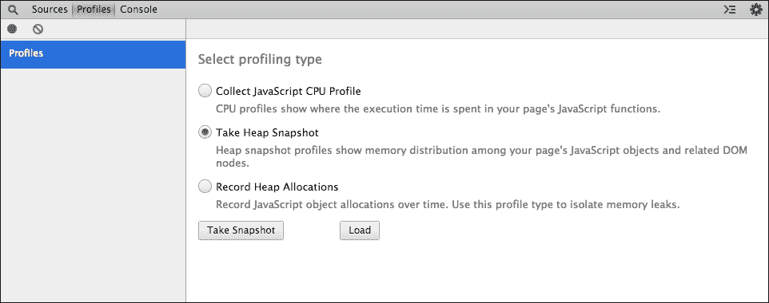

现在，不要选择**Take Snapshot**，只需点击**Load**按钮，然后选择来自磁盘的快照。这是另一种方法——离线方法——通常更有用，因为你通常不会以调试模式运行你的代码，并且在 v8-inspector 中实时查看它。此外，当你的程序停止时，`node-inspector`会重新启动界面，所以你需要在重新启动`node-inspector`之前保存你的快照。

如果你知道有内存泄漏，并且能够通过压力来重现它，你可以使用这种方法，也许在执行程序时添加一点变化，通过激活每个动作的 GC 跟踪行。然后你可以看到 GC 何时在清扫或标记。以下是一个例子，如果你监视 GC 动作，你会看到的：

```js
$ node --trace_gc leaky.js
[26503]        8 ms: Scavenge 1.9 (37.5) -> 1.8 (37.5) MB, 0.8 ms 
[26503]        9 ms: Scavenge 1.9 (37.5) -> 1.9 (38.5) MB, 0.9 ms 
[26503]       53 ms: Scavenge 3.6 (39.5) -> 3.2 (39.5) MB, 0.7 ms 
[26503]      116 ms: Scavenge 5.1 (40.5) -> 4.1 (41.5) MB, 1.9 ms 
[26503]      155 ms: Scavenge 5.9 (41.5) -> 4.4 (41.5) MB, 1.1 ms 
[26503]     1227 ms: Scavenge 14.3 (50.1) -> 14.5 (50.1) MB, 0.8 ms (+ 1.6 ms in 1 steps since last GC) [allocation failure].
[26503]     1235 ms: Mark-sweep 14.6 (50.1) -> 5.4 (43.5) MB, 6.7 ms (+ 1.6 ms in 1 steps since start of marking, biggest step 1.6 ms) [HeapSnapshotGenerator::GenerateSnapshot] [GC in old space requested].

```

为了清晰起见，前面的输出部分被截断了。数字*26503*是本例程序的进程 ID。你可以看到动作发生的时间以及每条跟踪线的末尾花费的时间。你还可以看到每个周期的动作（`Scavenge`和`Mark-sweep`）以及内存的演变。

对于运行中的应用程序，启用`--trace-gc`（如前面的命令）是不可行的，你应该考虑一个适合你的架构的方法。其中一个选项是使用`heapdump`，每小时安排一个快照，并保存最后的 10 或 20 个快照。使用这种方法时，你至少应该查看最后一个快照，并将其与上一个快照进行比较，以了解你的应用程序随时间的演变。你可能会发现慢速内存泄漏或非常快速的内存泄漏。对于快速的内存泄漏，你应该能够记录堆分配并迅速停止泄漏。对于慢速的内存泄漏，很难发现它，只有在非常长的时间内才能比较变化并找到问题。

还有另一个有用的模块可以帮助你发现泄漏，它叫做`memwatch`。这个模块会寻找堆大小的变化，当它发现堆大小不断增长时，它会发出一个泄漏事件（讽刺）。它还有一个带有 GC 周期信息的漂亮的统计事件。

让我们把我们最初的程序改成使用这个模块，而不是任何分析器或检查器。是的，它不需要它们，甚至不需要你启用节点调试。首先，让我们安装它：

```js
$ npm install memwatch-next

```

现在让我们把我们的程序改成类似于这样的东西：

```js
var memwatch   = require("memwatch-next");
var leakObject = null;

function MemoryLeak() {
  var originalObject = leakObject;

  leakObject = {
    longString : new Array(1000000).join("*"),
    someMethod : function () {
      console.log(originalObject);
    }
  };
};

setInterval(MemoryLeak, 1000);

memwatch.on("leak", function (info) {
console.log("GC leak detected: %d bytes growth", info.growth);
});

memwatch.on("stats", function (stats) {
  console.log("GC stats: %d cycles, %s bytes", stats.num_full_gc, stats.current_base);
});
```

现在只需运行程序。让它运行几秒钟，你会看到类似于这个例子输出：

```js
$ node leaky.js
GC stats: 1 cycles, 13228416 bytes
GC stats: 2 cycles, 7509080 bytes
GC stats: 3 cycles, 7508408 bytes
GC stats: 4 cycles, 17317456 bytes
GC stats: 5 cycles, 23199080 bytes
GC stats: 6 cycles, 32201264 bytes
GC stats: 7 cycles, 45582232 bytes
GC leak detected: 40142200 bytes growth

```

你会注意到 GC 周期经常发生。这是因为我们程序的行为。GC 会适应快速的堆变化，并更频繁地触发周期。如果你将内存泄漏调用周期更改为 5 秒或更长时间，你将不得不等待更长时间才能看到周期和泄漏。

`memwatch`模块通过在 GC 扫描和压缩后检查堆变化来工作，因此它不会仅仅因为你的应用程序使用内存就触发泄漏，而是因为你使用了内存而没有处理它。

该模块的另一个非常有用的功能是帮助你比较堆快照。你可以通过显式告诉模块你想要一个`heapdiff`来实现这一点。此时，模块会对堆进行快照，等待你再次对堆进行快照，并进行比较。之后，它会给你一个对象，显示之前和之后的总数以及每个快照的变化：

```js
var memwatch   = require("memwatch-next");
var heapdiff   = new memwatch.HeapDiff();
var leakObject = null;

function MemoryLeak() {
  var originalObject = leakObject;

  leakObject = {
    longString : new Array(1000000).join("*"),
    someMethod : function () {
      console.log(originalObject);
    }
  };
};

setInterval(MemoryLeak, 1000);

setTimeout(function () {
  console.log(heapdiff.end());
}, 10000);
```

运行程序。之后，你会得到类似以下的输出：

```js
$ node leaky.js
{ before: { nodes: 19524, size_bytes: 3131984, size: '2.99 mb' },
  after: { nodes: 21311, size_bytes: 12246992, size: '11.68 mb' },
  change:
   { size_bytes: 9115008,
     size: '8.69 mb',
     freed_nodes: 2201,
     allocated_nodes: 3988,
     details:
      [ [Object],
        [Object],
        [Object],
        [Object],
        …
        [Object],
        [Object],
        [Object] ] } }
```

如果你看`change.details`数组，你会注意到你有一个在堆之间发生变化的构造函数列表。如果在快照之间发生泄漏，它将在其中的某个项目中。在我们的情况下，它是字符串构造函数，因为我们正在泄漏字符串变量。

无论是否使用这些模块，你都应该监控内存使用和增长。快速的内存泄漏会耗尽你的资源，让你的客户感到不满。对于高负载的应用程序，你应该创建压力测试，以便在应用程序投入生产之前能够检测到泄漏。

## 第三方管理

在将应用程序划分为较小组件的精神下，有时将一些对象和操作移动到外部服务可能是一个更好的主意，这些服务有时针对特定的工作负载和对象格式进行了优化。在开始操作大型对象结构之前，先探索一些这样的服务器：

+   Memcached 用于键/值，Redis 用于列表、集合和哈希表

+   如果你想在数据上运行 JavaScript，可以使用 MongoDB，如果你需要一些有趣的功能，比如数据超时或分层元素（文档内的文档），可以使用 ElasticSearch

+   如果你需要一些复杂的 map/reduce 代码，可以使用 HBase，如果你需要该代码的轻量级版本，可以使用 Hypertable

+   如果你需要图形数据库，可以使用 OrientDB，如果需要存储大型二进制数据，可以使用 Riak

你的应用程序通常在内存中运行，所以如果它失败并停止，使用的内存就会丢失，你宝贵的数据也可能会丢失。使用外部服务来处理数据（有时还可以操作数据）可以大大减少你的内存占用。此外，这些服务通常允许你并发访问，使你能够将数据操作工作分配给应用程序或工具的多个实例。

# 总结

现在您已经看到垃圾收集器的任务并不那么容易，但它确实非常擅长自动管理内存。您可以在很大程度上帮助它，特别是如果您正在编写性能优化的应用程序。防止 GC 老年代空间增长是必要的，以避免长时间的 GC 周期。否则，它可能会暂停您的应用程序，有时甚至会强制您的服务重新启动。每次创建新变量时，都会分配内存并接近新的 GC 周期。即使了解了内存是如何管理的，有时您仍需要检查内存使用行为。最干净的方法是通过收集内存堆的快照，并使用 V8 检查器或其他类似的软件进行分析。界面是不言自明的，如果您按浅层大小、保留大小或引用计数对对象列表进行排序，泄漏将会简单地显示出来。但在创建具有巨大内存占用的应用程序之前，先看看数据库，无论是关系型还是非关系型，这将帮助您存储和操作数据，避免使用语言自己来做。请记住，JavaScript 并不是为了创建计算密集型任务而设计的。如果您仍然需要执行更多的密集任务，您可能需要对代码进行仪器化分析和改进，以便实现最佳性能。

在下一章中，我们将看到什么是性能分析，做性能分析的好处是什么，一些可用的分析工具，以及如何理解结果并升级您的代码。

为 Bentham Chang 准备，Safari ID 为 bentham@gmail.com 用户编号：2843974 © 2015 Safari Books Online，LLC。此下载文件仅供个人使用，并受到服务条款的约束。任何其他用途均需获得版权所有者的事先书面同意。未经授权的使用、复制和/或分发严格禁止，并违反适用法律。保留所有权利。
