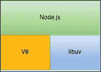
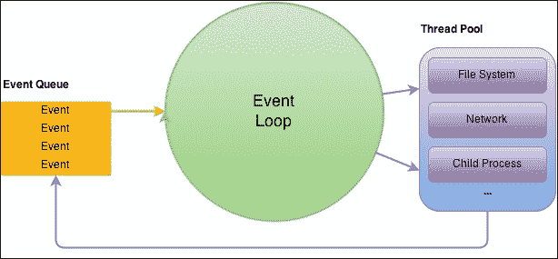
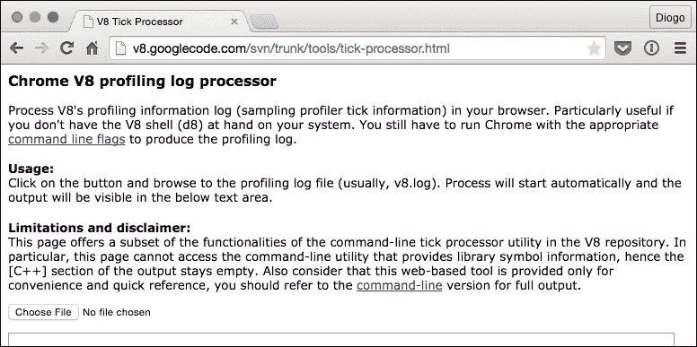
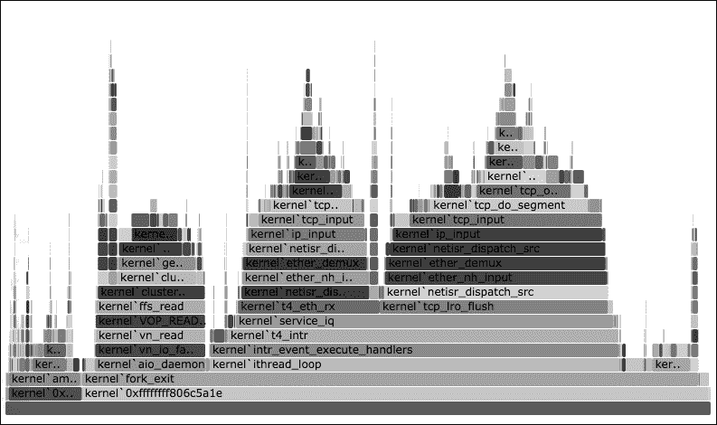
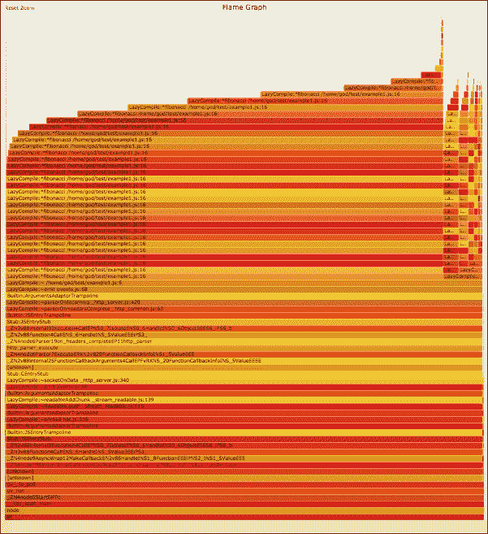
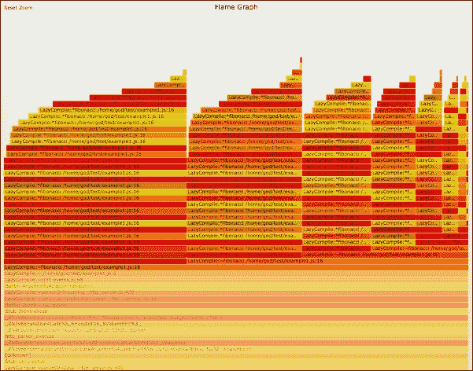
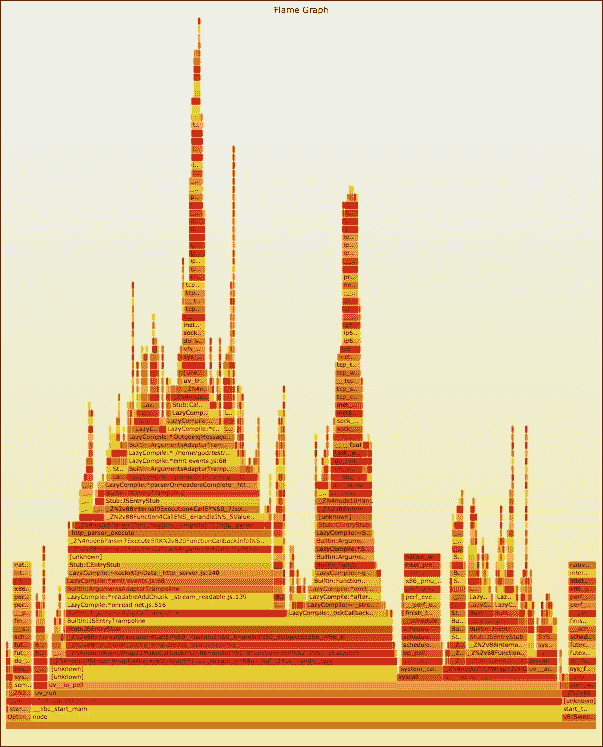

# 第四章：CPU 性能分析

性能分析可能很无聊，但它是一种很好的软件分析形式，你可以在其中测量资源使用情况。这种使用是随时间测量的，有时是在特定的工作负载下。资源可以指应用程序正在使用的任何东西，无论是内存、磁盘、网络还是处理器。更具体地说，CPU 性能分析允许你分析你的函数如何以及多少使用处理器。你还可以分析相反的情况——处理器的非使用，或者空闲时间。

Node.js 并不主要用于连续的 CPU 密集型任务，有时，为了进行性能分析，重要的是要识别占用处理器的密集任务的方法，并阻止其他任务表现更好。你可能会发现持续占用处理器的大型调用堆栈，或者重复和递归任务没有如你所期望的那样结束。有几种技术，比如分割和调度任务，而不是连续运行它们，因为它们会阻塞事件循环。

为什么这些任务如此可怕，你可能会问。答案很简单；Node.js 围绕着一个事件循环运行，这意味着当你的代码结束特定任务时，循环重新启动并且待处理的事件被分发。如果你的代码没有结束，应用程序的其余部分将被保持在待机状态，直到任务完成。你需要能够将一个大任务分解成较小的任务，以使你的应用程序表现良好。

应用程序的主要目标应该是尽可能地使用最少的资源，因此尽可能地使用最少的处理器时间将是理想的。这相当于在主线程中大部分时间处于空闲状态。这时调用堆栈是可能的最小。从基本的 Node.js 角度来看，应该是零级。

在对处理器进行性能分析时，我们通常以一定频率对调用堆栈进行采样，并分析堆栈在采样期间的变化（增加或减少）。如果你使用操作系统的分析器，你会发现堆栈中有比你预期的更多的项目，因为你会得到 Node.js 和 V8 的内部调用。

在本章中，将涵盖以下主题：

+   I/O 库

+   斐波那契

+   火焰图

+   性能分析替代方案

# I/O 库

Node.js 用于在多个平台环境中执行异步 I/O 操作的库是**libuv**。这是一个开源库。实际上，它被平台用来提供类似于 Luvit 和 Lua 等其他语言的功能。**Libuv**是一个跨平台库，它使用每个平台的最佳方法来实现最佳的 I/O 性能，并且仍然暴露一个通用的 API。

这个库负责网络任务（TCP 和 UDP 套接字）、DNS 请求、文件系统操作等等。它是访问文件、列出目录内容、监听套接字连接和执行子进程的库。下面的图片显示了 Node.js 如何在相同级别上使用 V8 和 libuv：



你可以看到 libuv 不依赖于 V8 来进行 I/O 交互。它是一个带有自己线程池的 C 库。这个线程池被设计得非常快速，并且尽量避免频繁创建和销毁任务线程，因为它们非常昂贵。该库处理从网络到文件系统的许多 I/O 任务。它负责 Node.js 暴露`fs`、`net`、`dns`等许多 API。在事件循环期间，你的代码可以请求 I/O 数据。这些数据被处理，当准备就绪（也就是说，你的请求全部或部分准备好了），它会触发一个事件，希望在下一个事件循环中处理。下面的图片描述了线程池的工作原理。你的代码在事件循环中运行（绿色），libuv 在单独的线程中运行（蓝色），并触发事件到你的代码（橙色），这些事件在每个周期之前被触发：



这意味着如果你请求一个文件的内容并开始执行大量的密集操作，它不会影响文件操作，因为它是在你的范围之外完成的。因此，尽管 Node.js 是单线程的，但有一些操作是在单独的线程（来自一个池）中完成的。这对我们在对代码进行性能分析时进行区分 Node.js 瓶颈、libuv（I/O）瓶颈和系统瓶颈非常重要。

## 斐波那契

让我们深入一个例子。带着一点怀疑的态度来看待它。这实际上是一个非常常见且备受批评的例子，涉及到斐波那契数列。让我们创建一个简单的 HTTP 服务器文件，名为`fib.js`，它将根据特定长度的斐波那契数列的数字之和来回答每个请求。这里没有依赖，只是纯粹的 Node.js。此外，我们将使用`ab`命令（Apache Benchmark）向我们的服务器发出一些请求。如果你有一个基于 Debian 的机器，你只需要安装`apache2-utils`就可以使用这个命令了：

```js
var http   = require("http");
var server = http.createServer();

server.on("request", function (req, res) {
  var f = fibonacci(40);

  return res.end("" + f);
});

server.listen(3000);

function fibonacci(n) {
  return (n < 2 ? n : fibonacci(n - 1) + fibonacci(n - 2));
}
```

你可以看到，`fibonacci`函数是递归的（应该是的），每次有新的请求进来时都会被调用。看到它表现不太好应该不会让人感到意外。让我们开始并告诉 V8 我们想要一个配置文件日志：

```js
$ node --prof fib.js

```

现在让我们用只有 10 个请求和两个并发连接的方式进行基准测试。以下输出已经被截断以便更清楚地理解：

```js
$ ab –n 10 –c 2 http://localhost:3000/
This is ApacheBench, Version 2.3 <$Revision: 1604373 $>
(...)
Concurrency Level:      2
Time taken for tests:   18.851 seconds
Complete requests:      10
Failed requests:        0
(...)
Requests per second:    0.52 [#/sec] (mean)
Time per request:       3822.383 [ms] (mean)
(...)

```

你可以看到每个请求花费了 2 秒的时间（每秒半个请求）。这看起来不太好，对吧？让我们停止服务器。你应该会在同一个文件夹中看到一个`isolate*.log`文件。你可以用 V8 Tick Processor 打开它。有一个在线版本（[`v8.googlecode.com/svn/trunk/tools/tick-processor.html`](http://v8.googlecode.com/svn/trunk/tools/tick-processor.html)），如果你想要的话；或者如果你像我一样有 node 源码，你可以在`deps/v8/tools/tick-processor.html`中找到它。



点击**选择文件**，选择你的日志。该工具将进行处理，返回类似以下的输出。再次强调，一些输出已被删除：

```js
Statistical profiling result from null, (...).

(...)

 [JavaScript]:
   ticks  total  nonlib   name 
  14267   89.1%  100.0%  LazyCompile: *fibonacci fib.js:15:19
      1    0.0%    0.0%  Stub: reinitialize

(...)

 [Bottom up (heavy) profile]:
(...)
   ticks parent  name
  14267   89.1%  LazyCompile: *fibonacci fib.js:15:19
  14267  100.0%    LazyCompile: *fibonacci fib.js:15:19
  14267  100.0%      LazyCompile: *fibonacci fib.js:15:19
  14267  100.0%        LazyCompile: *fibonacci fib.js:15:19
  14267  100.0%          LazyCompile: *fibonacci fib.js:15:19
```

我们的`fibonacci`函数真的一直在使用我们的处理器。你可以在`Bottom up (heavy) profile`部分看到递归模式。你可以看到不同的级别（缩进）是因为函数的递归性。

### 提示

请注意，在运行自己的测试时，应该限制服务器运行的时间只在基准测试的时间内（就像这个例子中一样）。如果让服务器运行的时间超过这个时间，你的函数的使用将会与空闲时间混合在一起。

在我们的例子中，将代码拆分并不容易，甚至不是更好的选择，因为操作非常简单（只是两个数字相加）。在其他用例中，你可能可以通过修改代码来优化一些操作，例如使用第二章中展示的一些技术，*开发模式*。

在这种情况下提高性能的另一种方法是使用一种称为**memoizing**的技术。它的作用是包装一个函数并根据参数缓存其返回值。这意味着对于特定的参数集，函数只会被调用一次，然后返回值将被缓存并重复使用。当然，并非所有情况都适用。让我们在服务器上尝试一下：

```js
var http   = require("http");
var server = http.createServer();

fibonacci = memoize(fibonacci);

server.on("request", function (req, res) {
  var f = fibonacci(40);

  return res.end("" + f);
});

server.listen(3000);

function fibonacci(n) {
  return (n < 2 ? n : fibonacci(n - 1) + fibonacci(n - 2));
}

function memoize(f) {
  var cache = {};

  return function memoized(n) {
    return cache[n] || (cache[n] = f[n]);
  };
}
```

有一些模块可以帮助你实现这个结果。在我们的例子中，我们添加了一个`memoizing`函数，并实际上用自身重写了这个函数—`memoized`。这很重要，因为函数会递归调用自身，所以真的需要被重写。

这将缓存对它的每次调用，所以只有第一次的`fibonacci(40)`调用不会使用缓存。此外，由于函数调用自身使用*n-1*和*n-2*，一半的调用将被缓存，所以第一次调用甚至会更快。运行`ab`测试将得到非常不同的结果：

```js
$ ab -n 10 -c 2 http://localhost:3000/
This is ApacheBench, Version 2.3 <$Revision: 1604373 $>
(...)
Concurrency Level:      2
Time taken for tests:   0.038 seconds
Complete requests:      10
Failed requests:        0
(...)
Requests per second:    263.86 [#/sec] (mean)
Time per request:       7.580 [ms] (mean)
(...)

```

这在每秒超过 250 个请求时要好得多。这显然是一个糟糕的基准，因为如果您将请求的数量增加到几千个，数字会更好（几千个）。如果您使用 V8 Tick Processor，您会注意到函数调用不再存在：

```js
(...)
[JavaScript]:
ticks  total  nonlib   name
 1    0.1%   12.5%  Stub: ToBooleanStub(Null,SpecObject)
 1    0.1%   12.5%  LoadMegamorphic: args_count: 0
 1    0.1%   12.5%  LazyCompile: ~httpSocketSetup _http_common...
 1    0.1%   12.5%  LazyCompile: ~exec native regexp.js:98:20
 1    0.1%   12.5%  LazyCompile: ~UseSparseVariant native array...
 1    0.1%   12.5%  LazyCompile: ADD native runtime.js:99:13
(...)

```

这显然是一个糟糕而非常简单的例子。每个应用程序都是不同的，分析它将涉及更多了解它。使用开发平台有助于集中您对主题的知识，并有助于您随着时间的推移更容易地改进。



## 火焰图

火焰图是一种用于对应用程序进行概要分析并快速、更精确地找出最常用函数的可视化技术。这些图形取代或补充了以前的日志文本输出，因为它们提供了一种更愉快和简单的概要分析方式。

火焰图由几个堆叠的块组成，每个块代表一个函数调用。它通常水平显示使用时间（不一定按顺序）。当一个函数被另一个函数调用时，第一个函数显示在前一个函数的顶部。使用这个规则，您可以想象出顶部的块肯定会比底部的块小（水平）。这创建了一个在视觉上类似火焰的图形。此外，这些块通常使用暖色（如红色和橙色），因此图形看起来真的像火焰。

这些可以用于不同的目标，比如查看内存使用和泄漏。例如，您可以创建一个火焰图来查看 CPU 的使用情况（繁忙的 CPU 是一直在工作的，空闲的 CPU 是什么都不做的）。另一个很好的用途是查看应用程序何时处于空闲状态，I/O 与 CPU 和内存相比非常慢，这在应用程序阻塞（停止）等待来自磁盘或网络的文件时是正常的。这称为 CPU 外。这在冷色（蓝色和绿色）中更容易看到。两个 CPU 火焰图的混合也可以让您更好地了解应用程序的行为。

在 Node.js 上创建火焰图并不容易，这取决于您的系统。由于 V8 支持`perf_events`（[`codereview.chromium.org/70013002`](https://codereview.chromium.org/70013002)），我发现在 Linux 上使用`perf`命令和`perf_events`要容易得多，但您也可以选择其他方法，比如 DTrace（[`www.brendangregg.com/flamegraphs.html`](http://www.brendangregg.com/flamegraphs.html)）。让我们现在尝试一下。获取一个 Ubuntu 机器（或虚拟机）并安装一些依赖项。请注意，其中一些依赖于您当前的内核版本：

```js
$ sudo apt-get update
$ sudo apt-get install linux-tools-common linux-tools-`uname –r`

```

现在让我们运行我们的 node 服务器，告诉 V8 我们想要`perf_events`输出。这次，让我们在后台运行它，以便更容易看到其 PID，并在之后运行`perf`：

```js
$ node –-perf-basic-prof fib.js &
[1] 30462

```

我们需要的 PID 是`30462`。然后让我们运行`perf`来收集大约一分钟的事件。该命令在完成之前不会返回（监听一分钟的事件），因此您需要打开另一个控制台来运行基准测试命令：

```js
$ perf record -F 99 -p 30462 -g -- sleep 60
# on another console..
$ ab –n 1000 http://localhost:3000/

```

我们告诉 perf 以`99` Hz 的频率记录`30462`进程的事件，启用调用图（`-g`），并持续`60`秒。之后，此命令应该结束。第一个版本的代码非常慢，需要超过 60 秒才能完成，因此用户可以在一分钟后停止它。第二个版本要快得多，不需要这样做。

您可以查看目录并注意到有一个`perf.data`文件。现在我们需要告诉`perf`读取此文件并显示跟踪输出。我们将使用它并将其转换为火焰图。为此，我们将使用 Brendan Gregg 创建的堆栈跟踪可视化器。此输出将转换为 SVG 文件。然后您可以在您喜欢的浏览器中打开它。首先让我们获取此堆栈输出：

```js
$ perf script > stack01.trace

```

现在让我们下载堆栈跟踪可视化工具，并使用它来转换这个文件。你需要使用`git`来获取这个命令：

```js
$ git clone --depth 1 http://github.com/brendangregg/FlameGraph
$ ./FlameGraph/stackcollapse-perf.pl < stack01.trace | ./FlameGraph/flamegraph.pl > stack01.svg

```

现在你应该有一个`stack01.svg`文件，你可以与之交互。你可以点击水平块来放大到该级别，或者点击最低的块来重置放大。对于你的服务器的第一个版本，你应该得到类似于这个图表：



你可以清楚地看到推动火焰变高的递归模式。有一个初始的大火焰，旁边还有其他火焰。如果你点击第二个火焰的底部，你会看到类似于以下的内容：



现在你可以清楚地看到你的处理器被这个低效和递归的函数耗尽了。在检查火焰图时，看看底部的线条。它会显示我们在日志处理器的初始输出中看到的信息，比如使用百分比。

如果我们使用第二个服务器版本，如果我们想要看到有用的东西，我们需要增加基准负载。尝试使用以下步骤为第二个服务器版本创建火焰图：

```js
$ node –-perf-basic-prof fib.js &
[1] 30611
$ perf record -F 99 -p 30611 -g -- sleep 60
# on another console..
$ ab –n 10000 http://localhost:3000/
$ perf script > stack02.trace
$ ./FlameGraph/stackcollapse-perf.pl < stack02.trace | ./FlameGraph/flamegraph.pl > stack02.svg

```

现在在浏览器中打开这个新的 SVG 文件，看看火焰是不是更细了。这意味着虽然堆栈大小可能很大，但堆栈大小的持续时间很短。类似于这样的情况更正常：



在图表的底部，你总是会看到`node`或`main`，因为 Node.js 大部分时间都在主线程上。在 node 或 main 的上面，你会看到其他线条。每一条堆叠的线条代表下面一行的调用。当你到达火焰的顶部时，你会开始看到实际的 JavaScript 代码。你会发现很多调用与 Node.js 的内部函数相关，涉及事件和`libuv`任务。

### 提示

作为一个经验法则，一个有着巨大而宽阔火焰的火焰图意味着 CPU 使用过多。一个有着高但较细火焰的火焰图意味着 CPU 使用较低。

## 性能分析的替代方案

根据操作系统，还有其他用于分析应用程序处理器使用情况的替代方案。如果你使用的是支持的系统，可以尝试使用 DTrace。我不建议在 Linux 系统上立即使用它。此外，如果你没有使用基于 Illumos 的系统，至少对于 Node.js 来说，你可能会忘记它。Linux 有更多的调用堆栈调试工具，你可以使用它们来记录堆栈，然后生成火焰图。

Node.js 有性能分析模块，甚至有调用堆栈跟踪模块，但我建议你避免在语言级别上调试它们，而是选择操作系统级别。这样做速度更快，对你的代码干扰更小，通常可以更全面地了解你尝试分析的行为或不良行为。记住，系统不仅仅是你的应用程序，可能还有其他因素在你的性能范围之外影响着你的性能。

你可以使用火焰图来分析其他类型的数据。例如，你可以跟踪设备 I/O 调用或系统调用。你可以将跟踪结果过滤到特定的函数调用，以查看函数何时以及多长时间被使用。你可以跟踪内存分配，而不是收集分配调用，你可以收集分配大小（以字节为单位）。这种类型的图表有很多用途，因为它对于直观分析你的应用程序行为非常方便。

# 总结

在当今的环境中，能够对应用程序进行性能分析以识别瓶颈是非常重要的，特别是在处理器和内存级别。系统是复杂的，分为几个层次，因此使用调用堆栈来分析处理器使用情况可能非常困难，如果没有一些工具和可视化技术，比如火焰图。总的来说，你应该在进行性能分析之前专注于你的代码质量。

正如您在我们的示例中看到的，对于我们的服务器来说，一个简单而有效的解决方案是缓存结果。缓存是一种非常重要的技术，通常在平衡资源使用方面至关重要。通常情况下，您有可用的内存，最好将结果缓存一小段时间，而不是每次都处理它，特别是当结果是不可变的时候。

接下来，我们将看看您应该如何使用和存储数据，以及何时以及多长时间应该对其进行缓存。我们将研究一些缓存方法论的利弊，这样您就可以更好地选择自己的路径，使您的应用程序成为可能的最高性能应用程序。

为 Bentham Chang 准备，Safari ID 为 bentham@gmail.com 用户编号：2843974 © 2015 Safari Books Online，LLC。此下载文件仅供个人使用，并受到服务条款的约束。任何其他用途均需版权所有者的事先书面同意。未经授权的使用、复制和/或分发严格禁止，并违反适用法律。保留所有权利。
