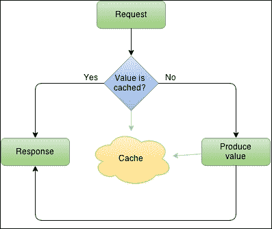
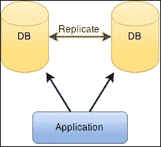
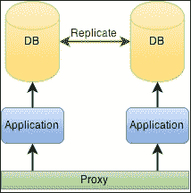

# 第五章：数据和缓存

数据是您应用程序中最重要的资产之一。实际上，它应该是基本资产。您可以在任何地方运行应用程序，但没有数据，它是没有意义的。通过数据，我指的是您的应用程序操作的信息，无论是由最终用户生成还是不生成。如果您的应用程序没有数据库无法运行，那么该数据库包含了您必须保留的重要数据。

应用程序数据非常重要。在 Web 应用程序中，用户使用互联网访问数据，并且他们的数据存储在服务器端，这增加了重要性。随着用户群体的增长和数据总量的增加，计划数据存储方式以及其使用方式变得更加重要。

不要忘记制定备份计划。您不希望丢失数据并且无法回滚，即使回滚意味着时间倒退一周。您的用户可能会接受丢失一些数据（1 周），但绝对不会接受全部丢失。

让我们通过查看一些重要主题来了解数据存储：

+   过多的 I/O

+   数据库管理系统

+   缓存数据和异步缓存

+   数据集群

+   访问数据

# 数据存储

存储数据的方式有很多种。这取决于您拥有的数据类型以及它可能变得有多大。如果您只需要存储简单的键/值对，您可以使用您选择的格式的文件（例如 INI 或 JSON 文件）。如果这些键/值对增长到成千上万，您可能不希望将其保留在那里。您需要考虑您的数据，并选择从您的角度来看最佳的存储方式。

如果您有其他应用程序，您可以尝试为所有或其中一些应用程序选择相同的数据存储。这实际上不是一个坏决定。选择第二好的工具，并尝试仅使用一两个工具来处理一些应用程序，大大提高了您对该子集的了解的机会，而不是为每个应用程序使用最好的工具，最终拥有许多工具，对每个工具的了解很少。

## 过多的 I/O

在使用自定义解决方案时，我们需要仔细规划如何存储和访问我们的数据，特别是何时以及多少次。您的主机有磁盘吞吐量限制，您不希望达到该限制。此外，您肯定不希望每次需要数据时都从磁盘读取。这在本地测试期间可能有效，但如果您的应用程序面向数千用户，它将崩溃，您可能会开始收到`EBUSY`或`EMFILE`错误。

其中一种策略是避免过多的 I/O，只需在开始时读取数据，将其在内存中操作，然后不时地将数据刷新到磁盘上。数据可以以各种格式存储，**JSON**目前是最著名和最常用的格式。这有一个缺点，即强制您的应用程序实现一个单一通道来读取和写入文件，否则您迟早会得到损坏的数据。

与其创建自定义数据存储，不如使用数据库或其他数据模型服务器。将数据存储留给专业人员，专注于您的应用程序。这样做的一些优势如下：

+   数据存储不需要维护。

+   数据库服务器针对高性能场景进行了优化

+   数据库服务器通常支持多台机器持有数据，允许您的应用程序按需扩展大小

这一切取决于您选择的系统。最好在开始之前花时间选择一个好的系统。我会专注于可扩展性和一致性。速度是无法衡量的，它因应用程序和用例而异。

# 数据库管理系统

如果你选择了**数据库管理系统**（**DBMS**），非常重要的是你要对它感到舒适。不要将你不熟悉的服务器投入生产，因为你肯定会后悔的。在生产中使用 DBMS 时，你需要对以下内容感到舒适：

+   **管理**：非常重要的是，你能够将你的应用场景复制到一个新的主机上，而不用太多考虑。你应该知道如何初始化你的存储并管理访问。寻找可视化界面（如桌面和 Web），避免仅通过控制台进行管理；在控制台上会更容易出错，因为对于复杂的任务来说更难。可视化界面通常具有自动化工具，可以帮助你避免语法错误。

+   **安全性**：要小心默认权限，特别是本地主机权限，因为它们通常被设置为宽松，可以完全控制数据。你不想丢失数据，对吧？

+   **备份**：非常重要的是你要有一个定期和自动化的计划，并且知道如何回滚到备份。你应该在另一个主机上进行试验。你不想回滚后发现你的备份已损坏。安装一个 cron 作业（可以是本地或远程），定期导出并进行测试。我个人更喜欢有一个或两个可用的备份，而不是有 10 个不可用的备份。

+   **结构**：知道如何组织和关联你的数据以获得更好的存储和更快的访问是必不可少的。你绝对不想以后再做改变。

你选择的数据结构与你的 DBMS 和应用程序的性能直接相关。绘制你的数据草图，看看你的数据实体是如何相互关联的。在你的数据库中拥有几个表是非常普遍的。毕竟，这是你首先使用数据库的原因之一。

你通常没有考虑到的是，你可能有一个单独的表，也许是一个历史表或类似的表，随着时间的推移，它将占据超过 90％的数据库空间。优化该表并决定是否有不需要的列或者可以移动到另一个表是至关重要的。以后你会感谢我的！

即使优化了该表，你也无法阻止它的增长。你真的需要有一个终身历史记录吗，还是可以将数据每月或每年导出到另一种格式，并从数据库中清除？拥有一个可以增长甚至扩展到多个服务器的数据库是好的，但这并不意味着性能。

就这个问题而言，分析一下你可能最看重的是什么。是完整性吗？你需要额外的安全性吗？你是否计划将数据库分布到不同的服务器上，就像 MongoDB 一样？你更喜欢一个经过验证稳定的成熟服务器，还是选择一个新技术？就像我之前说的，尝试第二个最佳选择。你可能会更频繁地使用它，避免使用很多不同的技术，这样会更难维护。

你的数据现在应该已经被结构化了。例如，如果你正在创建一个日历应用程序，你可能有用户、日历和事件等实体。在创建基本结构之后，你可能会意识到你需要更多的结构来关联日历和用户（也许是访问权限），以及用户和事件（也许是参与者）。经过几次开发迭代后，你可能会有更多的结构。

你的结构会增长，你的表会开始增加更多的列。你会意识到，在这种情况下，你的瓶颈表是保存事件的表。希望你能及时优化它，删除一些很少使用的列，并将其移动到另一个表中。当没有空间可以减少时，你必须考虑其他选项。

## 缓存数据

当某个信息被频繁请求且其值不会改变时，例如历史值时，缓存变得相关。如果这些值在数据库中需要一些复杂性和操作，那么缓存是提高性能的好方法。即使它们不是历史值并且可能会改变，有时缓存也不是那么糟糕，至少可以持续几分钟。

在复杂系统中，你可能会发现缓存是应用程序和数据库之间的第二层抽象。在这种情况下，双向更新会发生；也就是说，数据被获取到缓存中，当被某个用户操作更改时，缓存数据会被更新，然后数据库也会被更新。这比清除缓存并强制向数据库发出新请求来获取我们已经知道的数据要快。你可能会在基本应用程序中发现这一点，例如在会话数据中。

一些数据库可以执行这种缓存，但其他数据库不行，你不能依赖它们来执行。此外，在其他情况下，它们无法缓存，因为你需要操作数据。在某些情况下，你需要将缓存地址到另一个应用程序或另一个键/值服务，你可以用它来保存值并在一段时间内使用。Redis 可以用作缓存服务。它支持一些不错的功能，比如复杂结构、事务和生存时间键。

你的缓存逻辑应该类似于这样：



这种逻辑可以以多种方式使用。你可以在内存中使用缓存，获取最快的缓存以适用于小数据集。如果你知道你的缓存数据可能超出可用内存，你可以使用文件。例如，如果你生成图像或文档缩略图，你可以对它们进行缓存，而且，存储它们的最佳位置可能是磁盘。

你可以使用处理数据存储并允许你专注于应用程序逻辑的服务。一些最受欢迎和简单的服务包括 memcached 和 Redis。它们各自都有优缺点。在这两种情况下，它们都需要零设置即可开始使用。

## 异步缓存

编写 Node.js 应用程序会迫使你以异步方式思考。这意味着你将面临一些挑战，其中一些你可能甚至还不知道。其中一个特别痛苦的挑战就是异步缓存。无论你是使用外部服务还是简单的内部函数，异步部分都在你这一边，它是负责给你带来不愉快的部分。

问题不会轻易显现出来；你可能只有在负载变高并且看到很多缓存函数命中时才能发现它。这不容易描述，所以让我们看一个假的缓存示例，我们可能在每个应用程序中的某个地方都会做到：

```js
var users = {};

function getUser(id, next) {
  if (users.hasOwnProperty(id)) {
    return next(null, users[id]);
  }

  userdb.findOne({ id: id }, function (err, user) {
    if (err) return next(err);

    users[id] = user;
    return next(null, user);
  });
}
```

这是非常不完整的，但你可以理解。每当你想要一个用户时，你调用`getUser`。这个函数会从某个地方获取它（`users.findOne`可能是来自 ORM），然后返回它。然后它会将它存储在哈希表中，如果你再次请求它，它将直接返回该用户。没有生存时间或适当的错误处理，但这不会解决下一个问题。

我们假设获取用户非常快，对吧？想象一下它需要一些时间，也许几秒钟。接下来，想象一下这个函数被经常使用。如果由于网络中的某些故障，获取用户需要 10 秒钟，而在这段时间内，你调用了这个函数 100 次，会发生什么？

没有缓存值，100 次调用中的每一次都会尝试访问数据库，因为它们忽略了第一次调用实际上会缓存该值，其余的 99 次调用可以使用它。如果问题出在用户获取上，调用会累积并使应用程序崩溃。这是因为获取用户不是瞬时的，所以对同一用户的后续调用应该排队，直到用户被获取为止。

它可能是以下代码的样子。再次强调，这是一个简化版本：

```js
var users = {};

function getUser(id, next) {
  if (users.hasOwnProperty(id)) {
    if (users[id].hasOwnProperty("data")) {
      // already have a value
      return next(null, users[id].data);
    }
    // not yet, queue the callback
    return users[id].queue.push(next);
  }

  // first time
  users[id] = {
    queue: [ next ]
  };

  userdb.findOne({ id: id }, function (err, user) {
    if (err) return next(err);

    users[id].data = user;

    users[id].queue.map(function (cb) {
      cb(null, user);
    });

    delete users[id].queue;
  });
}
```

花时间去理解它。正如你所看到的，它并不是范式有缺陷；而是方式。通常，开发人员接受培训，但并没有为 Node.js（以及其他相关事项）强加给你的异步平台做好准备。

多年来，将数据库抽象成**对象关系映射**（**ORM**）是一个好的做法（现在仍然是）。抽象创建了一个新的层，允许你更改数据库类型（多多少少）并仍然让你的应用程序正常工作。对于更成熟的应用程序来说，这实际上并不那么简单，因为要避免服务器的某些特定性以提高性能可能会非常困难。除了这个小优势之外，它可能会降低访问速度，从而使你的应用程序变慢一点。然而，它还有其他优势，特别是在专业市场上，因为你可以直接将你的业务模型和实体应用到你的代码中。

对于历史数据或一般的大型数据集，ORM 并不是最佳选择。许多 ORM 为你提供了对每个项目的额外控制权，但这是有代价的（速度和内存）。对于大型数据集，你会得到额外的控制权（以及大量的速度和内存成本）。你会发现，不仅是层使得你的应用变慢；通常数据库也不准备好在表中存储大型数据集（大型意味着千兆字节）。

你可能会寻找其他可以给你中间级别缓存的服务，如果使用正确，可以通过帮助你访问最常用的特定数据来提高性能。像**ØMQ**和**RabbitMQ**（都是消息队列服务）这样的服务可能会引起你的兴趣。它们可以充当数据存储服务器的代理，创造一个你拥有一个大型和统一的存储服务器的想法。这些服务旨在提供高性能，这是它们设计的用例之一。

添加像代理一样的服务会给你的应用环境增加另一层。在小型场景和小型数据集中，它们可能会过度。但在更大的数据集中，即使在单个存储服务器上，它们可以帮助维持恒定的吞吐量，同时数据集增长。

## 数据集群

需要将服务分布在不同的主机上。在你的应用数据集不断增长的过程中，你会看到你的主机在呼喊资源，平均负载逐渐消耗你的每一个处理器。从那一刻开始，你需要添加一个主机来保持速度稳定，并允许数据集继续增长一点。

从使用一个主机转变为使用两个主机可能会很复杂，迫使你控制数据库服务器或其他类型的数据集群。许多数据库服务支持集群或某种形式的复制。下面的图片是一个数据库在服务器上的复制示例，允许应用程序访问任何数据库实例。



在多主复制模式下，数据集通常存储（并复制）在两个或更多个主机上，允许数据从任何一个主机更新。这将数据复制到所有主机，称为**成员**。由于没有分区，每个成员都负责处理客户端请求。

这些是一些优势：

+   无单点故障。每个成员都是主节点，所以每个人都可能失败。

+   主机可以在地理上分布，使你的应用程序也可以分布在你的客户附近。

以下是一些缺点：

+   如果是在异步模式下，通常不是一致的，因为在数据复制到另一个主机之前，网络可能会让你失望。

+   如果是在某种同步模式下，它会引入延迟，因为你的服务器在数据复制之前不会回复给你，而且再一次，你的网络可能会让你失望。

并没有银弹，对于一个真正高性能的应用程序，您绝对需要深入研究您的数据。您可能需要将其分割到不同类型的服务器上，利用它们独特的特性。如前所述，消息队列服务器可能是您数据的最佳选择之一。

复制不能让您正确扩展。您的数据在每台服务器上都是完整的。对于大型数据集来说，这是一种浪费空间的做法，因为所有服务器除了一台之外的概率非常小。而且你有备份，对吧？

### 提示

还有更好的选择，比如集群，其中您的数据被分区，每个块都在至少两台主机上复制。通常由您决定。这类似于磁盘上的 RAID5，但没有*写洞*现象（[`www.raid-recovery-guide.com/raid5-write-hole.aspx`](http://www.raid-recovery-guide.com/raid5-write-hole.aspx)）。

## 访问数据

您的应用程序需要为这些情景做好准备。在前面的图表中显示了其中一种可能性。您的应用程序了解复制成员并尝试随机使用它们或按照特定规则使用它们。由您的应用程序或数据库模块来识别故障并正确处理。下图描述了您还可以复制应用程序实例并引入代理来中介访问应用程序。



另一个可能的情景是将您的应用程序实例绑定到每个复制主机，甚至是本地主机。这样，您的应用程序可以在本地工作。然而，这带来了两个需要解决的问题：

+   拥有反向代理可以根据用户的地理位置或应用程序实例负载为每个用户分配一个应用程序实例。

+   您的应用程序需要能够在这种情况下工作（无状态），除非您的代理确保每个客户端始终访问相同的实例

如果您的应用程序只需要存储在数据库中的数据，这些是可能的情景。如果它依赖于文件系统，除非您在主机之间进行了某种同步，否则有些情况不适用。我想到了 GlusterFS。如果您不需要文件系统，并且对某种对象/大块存储感到满意，Ceph 甚至 MongoDB 都是不错的选择。如果您想要一个高度可扩展的数据存储服务器，您可能只需开始查看 Cassandra 并忘记其他选择。从头开始准备您的应用程序以便与之一起工作，您将不会后悔。

# 摘要

数据是您的应用程序的关键部分，规划如何构建数据结构非常重要。更重要的是，您要计划应用程序的增长和数据升级。不要忘记为数据的最常用部分进行缓存，更重要的是，不要忘记备份。复制和集群不是备份的一种形式。您需要一个正确的备份计划，以避免将来的停机时间。不要忘记重视您的数据。

在下一章中，我们将继续讨论应用程序性能的主题，看看测试为什么重要，以及您应该如何进行基准测试和仔细阅读结果（带有一些保留）。您的应用程序几乎已经准备好高性能了。但在投入生产之前，请确保对其进行彻底测试。

为 Bentham Chang 准备，Safari ID bentham@gmail.com 用户编号：2843974 © 2015 Safari Books Online，LLC。此下载文件仅供个人使用，并受到服务条款的约束。任何其他用途均需版权所有者的事先书面同意。未经授权的使用、复制和/或分发严格禁止并违反适用法律。保留所有权利。
