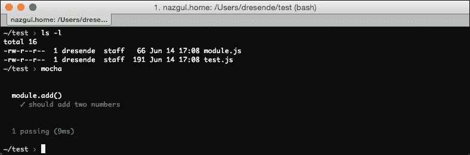
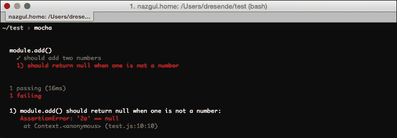
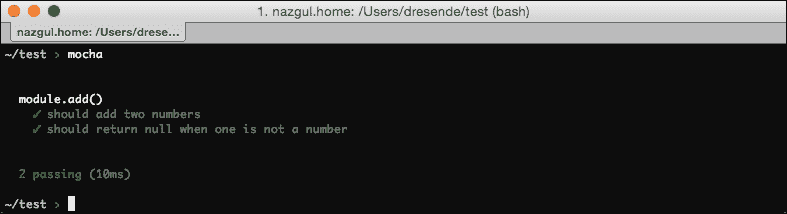
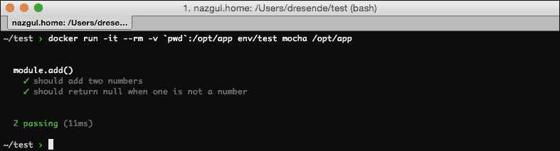
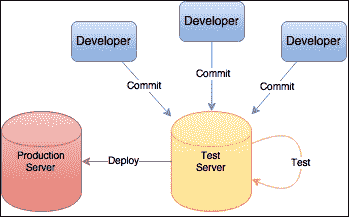
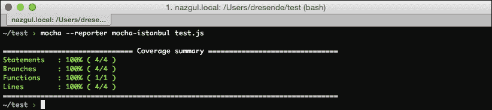
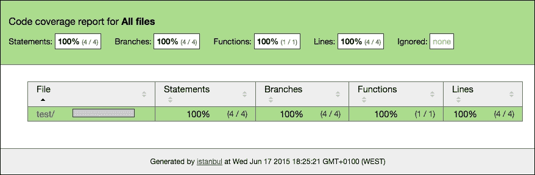
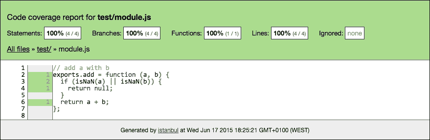
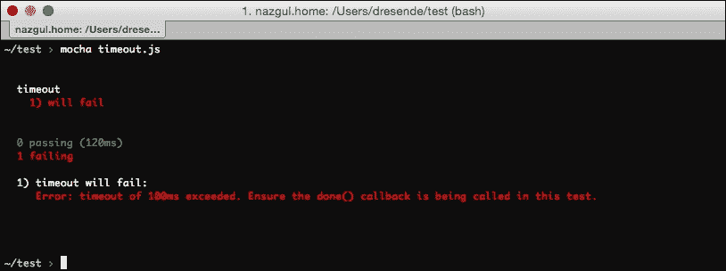

# 第六章：测试、基准测试和分析

测试您的应用程序与其开发一样重要。测试是分析应用程序模块和整个应用程序的过程，以查看它是否表现如您所期望的。它允许您的业务定义用例并检查它们是否都得到满足。

有许多测试技术。其中最著名的之一是**测试驱动开发**（**TDD**）。这种技术包括使用尽可能小的开发周期。在每个周期之间，进行测试并在开发之前添加新的测试和用例。这样，您的应用程序版本可以持续测试，并且可以快速发现任何有问题的版本。如果您使用版本控制系统，比如 Git，那么很容易找到失败测试的罪魁祸首并加以修复。

从头开始执行测试的一个重要方面是，您可以在发现它们时不断添加用例和测试用例。例如，如果有人报告了一个错误，并且您为此创建了一个特定的用例，您可以确保该错误不会再次出现，或者它不会在测试中可见。在社区驱动的项目中，很常见看到这种用例（成员发现错误并为其添加测试用例）。如果您能复制它，您可以创建一个测试用例。

根据您的测试平台，您可以对应用程序进行基准测试。通常，测试平台每个测试有一个默认的超时时间，长达 1 或 2 秒。您可以减少这个值以确保功能的性能。您也可以通过为更长的用例提供更多时间来做相反的操作。

具有此超时功能的平台可以让您进行一致的测试。记住在一个常见的平台上进行测试，比如一个通用的工作环境。不要为一个超快的服务器定义测试基准，然后期望它们在一个 20 年前的计算机上通过。

# 测试基础

测试可以以多种方式定义。最常见的方法是单元测试。这是一种方法，通过该方法可以逐个检查应用程序的部分，以确认它们是否符合规范。这种方法鼓励您的应用程序部分作为独立和可替换的黑匣子。

您需要真实的数据来正确测试您的应用程序。您还需要不切实际的数据。这两者对于确认它在正确数据和混乱数据下的行为是否符合预期都是至关重要的。这确保了误导或恶意用户不会破坏您的应用程序。

您可能想知道我所说的不切实际的数据是什么意思。您的应用程序是否处理日期字段中的文本或复选框中的数字？缺少的数据呢？您可能认为它可以，但是如果有更多的开发人员在上面工作，您可能希望确保在将来的某个地方它不会停止正确地行为。最常见的错误类型是在一个地方进行更改后在完全不同的地方出现。

单元测试的目标应该是完全隔离您应用程序的每个模块，并能够独立测试它们。如果一个模块需要应用程序的其他部分正常工作，您可以使用 Sinon（例如[`sinonjs.org/`](http://sinonjs.org/)）来伪造数据或模拟依赖关系。

一些测试的好处如下：

+   在开发周期的早期发现错误。由于您可以在每次更改代码时测试代码，因此应该更早地发现错误。更早地修复错误的成本，有时甚至在投入生产之前，大大降低了总体成本。

+   它迫使开发人员考虑 I/O 数据和错误，因为应用程序架构师必须考虑并正确描述每个用例。功能和用例是根据一个或多个测试用例开发的。

+   它使您能够更改或重构模块，同时确保预期行为保持不变，因为有了测试用例。

+   它有助于模块集成测试，因为每个模块都经过测试并具有预期行为。

只有在测试被正确定义并且您的测试覆盖了整个应用程序（所有功能和对象）时，才能实现所有这些好处。通过正确的测试覆盖，您还可以为新功能或边缘情况添加特定的用例。

为每个模块分离测试是相当困难的。例如，如果您的模块之一需要数据库才能工作，那么您的测试用例将需要给予它数据库访问权限。这不好，因为您的单元测试实际上将是集成测试，如果失败，您将无法确定问题是模块还是数据库的问题。

## 测试环境

拥有一致的测试环境也很重要。更重要的是，环境应该与生产环境相同或几乎相同。这意味着相同的应用程序（当然），但也是相同的操作系统版本、相同的数据库服务器版本等等。

例如，对于 Node.js 测试，请确保您的测试环境具有相同的 Node.js 版本。您可以尝试不同的版本，但最重要的是在生产中使用的版本。相同的原则也适用于操作系统版本、数据库服务版本、依赖项版本等等。

## Docker 工具

拥有相同的环境可能不容易，但有解决方案——Linux 容器。如果您还没有尝试过 Docker，那您就错过了。这个解决方案是免费的，是一个涉及容器的工具，使它们可用。

与 Vagrant 等工具相比的主要区别在于，它不需要虚拟机来创建环境。Docker 类似于 OpenVZ（[`openvz.org/Main_Page`](https://openvz.org/Main_Page)），但有一个区别；您可以创建一个环境（容器）并共享给其他人使用。如果您喜欢 NPM，您会发现这很相似。您有版本和依赖关系，最常用的环境已经在线上供您下载和使用。

您可以在容器中创建一个测试环境，然后将容器分发给其他开发人员。这也适用于生产。您的开发人员可以在他们的笔记本电脑上获得生产数据库的快照和完整的生产环境。通过这种方式，可以进行更改和测试，就好像它们被应用于生产环境一样。这比在生产环境中尝试并不得不回滚要好。这样，您将更少地回滚。这是持续集成的原则。

让我们为我们的 Node.js 应用程序创建一个非常简单的环境。安装 Docker，打开终端，运行以下代码：

```js
$ docker pull node:0.12.4
Pulling repository node
4797dc6f7a9c: Download complete
...
6abd33745acb: Download complete
Status: Downloaded newer image for node:0.12.4

```

请记住，我们想要一个特定的版本，这就是为什么在这种情况下我们强制使用`0.12.4`。我认为操作系统不重要，因为我们的应用程序不会有外部依赖项或节点模块。这个命令只会下载图像模板，还没有创建任何环境；我们马上就会做。您会注意到它需要几百兆字节。不用担心；这可能是您唯一需要的空间，因为您的环境几乎总是依赖于这个图像。如果您想查看已下载的图像，请运行以下命令：

```js
$ docker images
REPOSITORY     TAG       IMAGE ID        CREATED      VIRTUAL SIZE
node           0         4797dc6f7a9c    3 days ago   711.8 MB
node           0.12      4797dc6f7a9c    3 days ago   711.8 MB
node           latest    4797dc6f7a9c    3 days ago   711.8 MB
node           0.12.4    4797dc6f7a9c    3 days ago   711.8 MB

```

嗯，那里有很多空间，不是吗？如果你仔细看，你会注意到只有一个图像（`IMAGE ID`是相同的）。发生的事情是，`0.12.4`实际上是写这本书时的最新版本，并且最新标签也已分配给我们的图像。此外，该版本是`0.12`的最后一个版本，也是 0 的最后一个版本。

这意味着我们可以使用这些标签中的任何一个来引用我们的图像，但我们不希望这样，因为可能会出现新版本，我们的图像将开始使用这些新版本构建。

我们可以看到哪些容器正在运行，或者之前创建过但不再运行。我们可以简单地看到正在运行的内容，但我发现看到死掉的容器更有用，因为它们可能使用了不必要的空间。现在没有容器了。我们可以简单地测试镜像以查看它是否工作：

```js
$ docker run -it node:0.12.4 bash
root@daa77af1b150:/# node -v
v0.12.4
root@daa77af1b150:/# npm -v
2.11.1
root@daa77af1b150:/# exit

```

我们刚刚使用我们的镜像在交互模式下运行了一个基本环境，使用了`tty`(`-t`)中的`bash`，而不是在后台运行(`-d`)。您可以看到我们的环境中有 node 和`npm`。如果我们查看存在的容器，我们会看到类似于这样的东西：

```js
$ docker ps -a
CONTAINER ID     IMAGE      COMMAND     CREATED ...
1a56bbeb3d36     node:0     "bash"      47 seconds ago ...

```

我们的容器有唯一标识符`1a56bbeb3d36`，正在使用`0`节点镜像，并且正在运行`bash`命令。好吧，它实际上已经不再运行了。您可以通过运行这行来删除它：

```js
$ docker rm 1a56bbeb3d36

```

注意`ps`命令中的`Exited (0) ..`行吗？是的，命令的退出代码是可以访问的。如果您使用`exit` `123`退出`bash`，您将在容器外看到它。这对于启动测试命令而不是`bash`，然后仅根据退出代码检查所有测试是否通过非常有用。您还可以记录输出，并在失败时保存以供分析。

## 测试工具

现在我们有了一种复制环境进行测试的方法，我们需要一个合适的测试工具——您可以用它来定义您的用例和测试用例。有许多很棒的工具，Node.js 有专门用于测试的工具。其中一些真的很棒。

如果您没有头绪，我建议尝试一下 mocha ([`mochajs.org/`](http://mochajs.org/))。它可以在 NPM 上安装，并且您应该全局安装它：

```js
sudo npm install -g mocha

```

通过这种方式，您可以在计算机上的所有应用程序中使用 mocha，而无需一遍又一遍地安装它，因为它实际上是一个开发/测试依赖项，而不是一个真正的应用程序依赖项。全局安装它还将在您的路径中安装`mocha`命令。

让我们创建一个非常简单的名为`module`.js 的模块，其中包含一个简单地添加两个数字的函数：

```js
// add a with b
exports.add = function (a, b) {
  return a + b;
};
```

现在，让我们创建一个测试用例。为此，我们将创建另一个名为`test.js`的文件：

```js
var assert = require("assert");
var m      = require("./module");

describe("module.add()", function () {
  it("should add two numbers", function () {
    assert.equal(m.add(2, 3), 5);
  });
});
```

正如您所看到的，这个文件加载了我们的模块(`m`)，并断言`m.add`应该添加两个数字。为了检查它，我们通过检查模块在我们传递`2`和`3`时是否返回`5`来添加一个测试用例。现在，在您拥有这两个文件的文件夹中打开一个终端，并且只需运行`mocha`而不带任何参数，就像这样：



不错，是吧？还有其他形式的输出称为**报告者**，例如进度、列表或点矩阵。如果您只想要简单的输出，尝试列表或进度。如果您想要每个测试的详细信息，请使用规范报告者。它显示在前面的截图中。

让我们向我们的函数添加另一个测试。将测试文件更改为如下所示：

```js
var assert = require("assert");
var m      = require("./module");

describe("module.add()", function () {
  it("should add two numbers", function () {
    assert.equal(m.add(2, 3), 5);
  });

  it("should return null when one is not a number", function () {
    assert.equal(m.add(2, "a"), null);
  });
});
```

如果您再次运行`mocha`，您的测试用例将导致`test`套件失败，就像这个截图中显示的那样：



让我们更改我们的模块以正确地行事，就像我们在新测试中所述的那样。您可以随意更改它；我只是举个例子：

```js
// add a with b
exports.add = function (a, b) {
  if (isNaN(a) || isNaN(b)) {
    return null;
  }
  return a + b;
};
```

再次运行，我们的测试应该通过，就像下面的截图中显示的那样：



现在，我们可以在我们的环境中测试这个，而不是直接测试它。这确保了我们的应用程序在一个干净的环境中工作，并且不是因为您的本地环境的某些原因而通过。为此，我们可以使用我们之前的 node 镜像。让我们创建一个简单的测试环境。为此，我们需要在我们的测试文件夹中创建一个名为`Dockerfile`的文件：

```js
FROM node:0.12.4

RUN npm install -g mocha

VOLUME /opt/app/

```

这描述了我们的环境。文件描述如下：

+   使用 node 镜像版本`0.12.4`

+   安装`mocha`依赖

+   在`/opt/app`上创建可链接的卷

现在，让我们构建我们的环境并称之为`env/test`。我们实际上是在基于另一个镜像创建一个新的镜像。我们可以在运行环境时指定一个可链接的卷作为文件夹。这样，你可以为所有你的应用程序使用这个镜像。为了构建我们的环境，我们运行这个命令：

```js
$ Sending build context to Docker daemon 11.26 kB
Sending build context to Docker daemon
Step 0 : FROM node:0.12.4
 ---> 4797dc6f7a9c
Step 1 : RUN npm install -g mocha
 ---> Running in 286c8bb64a2b
...
Removing intermediate container 26fd9bb79ed5
Successfully built e36af32c961c

```

现在我们有一个可以使用的镜像。让我们通过使用`mocha`运行我们的测试来尝试这个镜像。



查看 Docker 的在线文档，了解命令行的详细信息。我们正在运行我们的镜像，其中`/opt/app`（-v）卷是我们当前的文件夹（包含我们的 Node.js 文件）。我们的测试环境以交互模式运行（-it），并且在最后丢弃结果镜像（--rm）。

如果有一个中央代码存储库，最好在提交之前进行测试，以避免常见错误。这也可以避免破坏性的变更。通常会出现修复或改进某些内容的变更，同时破坏其他内容的情况。有了始终干净的测试环境，开发人员可以确保测试正确运行。这个环境可以类似于下图中的环境：



## 持续集成

持续集成（CI）是一种实践，应用程序的所有开发人员不断将他们的更改集成到一个中央存储库中。这是极限编程（XP）中使用的一种实践。它可以更快地引入新功能，并通过减少代码合并时间来避免代码冲突。

如果应用程序有一个良好的测试套件，开发人员可以在本地测试变更，模拟生产和测试环境，并且只有通过了测试才提交。这些测试不应该取代服务器上的测试。如果测试套件执行速度快，甚至可以作为提交合并的保证，但通常不建议这样做，因为有些提交实际上无法通过。通常，所有提交都会被接受，然后才会进行测试。测试结果应该至少在开发人员圈子内公开，作为一种强制他们注意他们的提交、代码结构和提交描述的方式。

CI 有四个最佳实践：

+   拥有一个代码存储库并使用版本控制系统

+   每次提交都应该经过检查，以确保它通过了所有的测试。

+   将测试环境与生产环境分开

+   自动化部署

实现这种工作流程的一种方法是使用 git。因为它允许你为提交和合并定义钩子，你可以在中央存储库中添加一个钩子来测试每个新的提交。如果提交通过，它可能有资格通过到生产环境。

一种策略是将最新通过所有测试的提交与生产环境合并。这可以是每次提交通过或在特定时间。对于简单的应用程序，这种方法是可以接受的。但如果你有一个庞大的用户群体，这可能会带来真正的风险。确保你的测试基础真的很好，并且至少查看和阅读提交的变更日志。有一些你应该知道的风险，如下：

+   你的测试基础可能无法覆盖所有代码。这意味着你的代码中有一些部分没有经过测试，这会对其行为产生不确定性。在这种情况下，你应该尽可能覆盖你的代码。

+   你的测试基础可能无法覆盖所有用例。如果你的所有用例都没有在测试中描述，它们将不会在你的代码中进行测试。它们可能会被正确处理，但仍然存在不确定性。因此，你应该描述所有的用例。

+   有些测试用例很难描述甚至重现。你应该努力避免这些类型的测试，并确保你可以完全依赖测试。否则，你需要有人在应用程序变更上线之前进行测试。

另外，能够针对生产数据库进行应用测试也很重要，也许是最新的备份或者具有复制的数据库，可以在不影响生产环境的情况下使用。

数据大小总是影响你的应用程序的性能。如果你只是测试你的模块来检查简单的用例，你并没有测试负载，但你应该。有时，你的生产数据可能有你一开始没有预料到的关系。你可能认为你的代码不允许这些关系出现，但你可能是错的。

例如，考虑一个层次结构，你为某个元素定义了一个父元素。假设这个后代也可以是另一个元素的父元素。如果一个第三代后代是一个祖先的父元素呢？这会创建一个循环，你可能不希望出现，但你必须处理。即使你的应用程序一开始不允许出现这种循环，也要考虑获取所需的代码来保护自己免受它的影响。

### 代码覆盖率

通过测试覆盖所有代码对于确保你真正测试了所有东西，或者至少测试了所有编码的东西是很重要的。这并不是一件容易的事。你的代码中的条件和循环会创建许多不同的情况和运行路径，你的一些代码可能只在非常特定的情况下触发。这种情况需要以某种方式进行测试。

代码覆盖率是一个指标，用来表示你的代码有多少被你的测试套件覆盖。更高的指标表示你的应用程序更“测试覆盖”，通常可以表示低错误概率。这个指标通常以百分比值给出，50%的覆盖率意味着你的代码有一半被测试套件覆盖。

有一些工具可以帮助你找到这个值，否则将无法计算它。在 Node.js 环境中，这些工具通常做的是创建你的代码的副本，然后改变每一行有意义的代码，以便计算执行通过该行的次数。有意义的行是真正的代码行，而不是注释或空行。

也有在线服务可以做到这一点。根据你的应用程序许可证或预算，你可能更喜欢在本地准备你的测试环境。这通常并不像看起来那么简单。你必须创建一种仪器化你的代码的方法（最好在副本上完成），并在收集覆盖度指标的同时运行你的测试，然后生成一个报告。

有几种 Node.js 工具可以尝试。没有魔法工具，你应该看看哪个最适合你和你的应用程序。一个可能的工具是`istanbul`。让我们在我们的小测试示例上试一试。你会发现这有点棘手，对于一个真正的应用程序，你必须自动化这个过程。让我们从安装依赖开始：

```js
sudo npm install –g istanbul mocha-istanbul

```

`mocha-istanbul`依赖项可以在本地安装。`istanbul` Node.js 模块应该是全局的，因为它有一个我们可以使用的命令。现在我们可以仪器化我们的代码。让我们创建一个仪器化的副本：

```js
istanbul instrument module.js > instrumented.js

```

我们现在必须更改我们的测试套件以使用我们的仪器版本：

```js
var assert = require("assert");
var m      = require("./instrumented");

describe("module.add()", function () {
  it("should add two numbers", function () {
    assert.equal(m.add(2, 3), 5);
  });

  it("should return null when one is not a number", function () {
    assert.equal(m.add(2, "a"), null);
  });
});
```

最后，我们只需要使用`istanbul`报告者运行我们的测试套件。要做到这一点，使用`reporter`参数运行`mocha`：

```js
mocha –reporter mocha-istanbul test.js

```

不再显示测试的描述，而是显示一个报告，显示代码中有多少行和函数被测试套件覆盖。以下是一个输出的例子：



之后，你应该有一个名为`html-report`的文件夹，里面有一个`index.html`页面。在浏览器中打开它以分析你的测试覆盖率。你应该看到一个类似以下截图的页面：



你会看到`test`文件夹，里面有我们的原始模块。点击它，你会看到一个覆盖率报告。对于每一行代码（注意，带有闭合括号的行将被忽略），你会看到一个相关联的数字。这个数字对应着在测试过程中执行通过该行的次数。在我们的案例中，它是**1**和**2**列，带有绿色背景。很容易理解，因为我们只有两个测试。



## 基准测试

基准测试是运行一组工具或测试来测量特定性能指标的过程，以便将它们与其他工具或过去的测试进行比较。应用程序最常见的基准测试与两个类似的指标有关：时间（操作的时间）和操作（一段时间内的操作次数）。

为了保持应用程序的性能，你需要不断地进行基准测试。一个明显的方法是使用测试套件，你可以添加专门用于基准测试的特定测试。在检查常见用例之后，你可以有特定的测试，确保某些操作继续运行一段特定的时间。

认真对待基准测试，但不要为此失眠！大多数情况下，当你开始应用程序开发时，你没有统计数据可以进行比较，也不知道要定义哪些基准测试。

首先从基准测试简单的列表开始，比如历史列表，并确保它们不超过 100 毫秒。当创建一个更复杂的界面时，确保它的渲染也表现良好。如果人们不得不等待超过半秒钟来完成一个简单的任务，或者超过一两秒来完成一个更复杂的任务，他们往往会感到压力。

这些基准测试通常使用生产数据的副本，或者如果数据太大，则使用其子集，以确保你正在针对大量数据进行基准测试，而不是在测试环境中（比如你的个人笔记本电脑）上的一小组数据。你也可以对生产数据进行测试，但我不建议这样做。

例如，使用我们之前的测试框架，`mocha`确保每个测试运行时间不超过两秒。你可以为特定测试更改这个默认超时时间。让我们尝试一下，使用一个名为`timeout.js`的新测试文件：

```js
describe("timeout", function () {
  this.timeout(100); // milliseconds

  it("will fail", function (done) {
    // we should call done() but we don't to cause timeout
  });
});
```

我们正在创建一个异步测试。这是因为我们在测试函数中引用了`done`，以便在测试结束时调用它。在这种情况下，我们没有明确调用它，以强制它失败。让我们试一下，如下所示：



在性能重要的特定测试中使用超时是一个好的做法。通常的超时对于大多数常见的测试可能是可以的，但确保你分析一些特定的测试，并确保它们在一定的时间范围内执行。

超时可能是性能限制，或者只是一个标记，告诉你当你的应用程序变得太复杂或者测试数据变得太大以至于无法保持性能时。这时，基于前一章的内容，你需要审视你的环境并分析下一步的行动。

像 mocha 这样的测试套件还可以为你提供其他有趣的信息，补充你的测试，并帮助你更好地了解应用程序的行为，比如：

+   报告测试持续时间，即使对于不是基准测试的测试，这将使你首先进行测试并查看指标，然后定义一个良好的超时标记。

+   呈现测试报告。它们可以用于质量保证报告，并且可以保存以供以后分析或比较。

特别是对于 Node.js 应用程序，`mocha`可以为你提供：

+   内存泄漏检测，通过查看测试前后的全局变量

+   检测未捕获的异常，指示引起异常的测试

+   无缝的异步支持

+   Node.js 调试器支持

+   浏览器支持

## 分析测试

拥有一个测试套件非常重要。最重要的好处是能够对应用程序进行全面测试，或者至少尽可能多地进行测试。创建初始测试环境可能是一个挑战，但随着应用程序的不断开发，它会得到回报。

进行适当的测试可以确保您：

+   不要在引入新功能时重新引入旧的错误。即使不触及源代码，只是进行数据库更改，也可能发生这种情况。

+   可以通过首先定义测试用例来定义用例（参见[`en.wikipedia.org/wiki/Test-driven_development`](https://en.wikipedia.org/wiki/Test-driven_development)）。

+   可以进行更改，并轻松检查应用程序是否保持预期的行为。

+   可以检查测试覆盖率，并查看其随时间的变化。

+   可以为新发现的错误创建特定的测试，并确保它们不会再次出现。

+   确保基准测试在特定指标下运行。

拥有一个适当的测试套件就像每次进行更改时都有一个质量保证人员测试您的应用程序一样。此外，您的质量保证人员不会像您的测试套件那样精确或快速。

如果您的应用程序不仅仅是您一个人在开发，确保您强制执行测试通过成功和高达 90%的测试覆盖率。如果您自动化了覆盖率测试，您可以将覆盖率指标作为合并新功能与生产的条件。

确保您的测试在开发组圈子中是公开的，让每个人都能看到其他人的工作。这激励人们更好地工作，因为他们的声誉是公开的，至少在团队内部是这样。

当有更多的人关注测试时，开发人员可以分享经验，并在遇到测试失败时寻求帮助。这减少了解决问题所需的时间，并激励开发人员始终保持测试套件的运行。保持测试历史清除失败应该是一个不断的目标。

# 总结

一个良好的、高性能的应用程序取决于其性能。完整的测试套件确保您在开发中也能表现良好，并且可以快速引入改变——这些改变可以提高性能。测试套件应该有专门的测试用于基准分析，具有严格的时间限制。开发人员应该了解这些测试，并努力保持测试通过，而不必解除这些限制。

将测试套件用作生产的度量标准。确保如果您的测试套件覆盖了应用程序源代码至少 90%并通过了所有基准测试，那么您就可以合并新的更改。为这些测试使用单独的服务器，并且不要将测试与生产混合在一起。保持生产服务器精简和快速，并且只有在确定它将保持这种状态时才进行更改。

在下一章中，我们将看看瓶颈——降低性能的限制，以及您无法对其做任何事情的情况。您必须努力为它们做好准备，并在可能的情况下尽量减轻其后果。网络、服务器和客户端是引入瓶颈的一些因素。有些你可以控制和最小化，但其他的……你只能为它们做好准备。

为 Bentham Chang 准备，Safari ID bentham@gmail.com 用户编号：2843974 © 2015 Safari Books Online，LLC。此下载文件仅供个人使用，并受到服务条款的约束。任何其他使用都需要版权所有者的事先书面同意。未经授权的使用、复制和/或分发严格禁止，并违反适用法律。保留所有权利。
