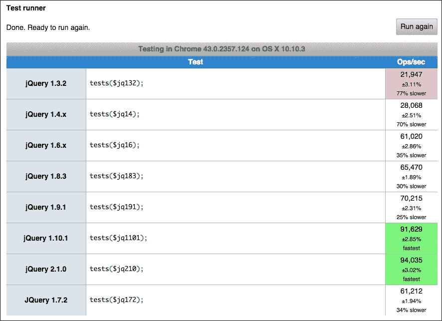

# 第七章：瓶颈

正如我们在前面的章节中看到的，许多因素影响性能。甚至开发过程也会影响你如何监控性能下降。你使用的模式可能在小规模上没有什么区别，但部署后，你会后悔你所做的每一个错误决定。

主机也是一个重要的性能因素。你的处理器对于你特定的任务的表现有多好是很重要的。你有多少可用内存会影响你的数据有多少会驻留在一个快速的位置或者移动到一个较慢的位置，比如本地磁盘。

缓存你的数据也非常重要。使用某种中间存储加速数据访问的技术，给人一种更快速的感觉，创造了一个快速应用程序的重要幻觉。虽然这可能看起来不对，因为它看起来像是一个幻觉，但如果你想要将性能提升到极限，这实际上是非常重要的。

所有这些都很重要，但有一些限制是你无法突破的，或者至少有一些你应该了解以便绕过并选择更好的设计模式。其中一些限制超出了你的范围，你无法调整或控制它们。其他一些可以在有预算和/或时间的情况下最小化，并且想要选择这条道路。我建议你这样做，因为了解你的应用程序的周围环境将使你更全面地了解它的工作方式以及如何改进它。

# 主机限制

你托管应用程序的地方——服务器——有限制。主机上有两种类型的限制：硬件和软件。硬件限制可能很容易发现。你的应用程序可能会消耗所有内存并需要使用磁盘继续工作。通过升级主机的内存，无论是物理的还是虚拟的，似乎是正确的选择。

对于 Node.js 应用程序，你还有一个由 V8 强加的软件内存限制，所以在升级内存时不要忘记这一点。在 32 位环境中，限制大约为 3.5GB，我假设你在 64 位环境中升级内存。在这种情况下，你的应用程序默认会以 1GB 的 V8 限制运行。然后你需要以类似以下命令的方式启动你的应用程序来以更高的限制运行：

```js
$ node --max_old_space_size 4000 application

```

这将以 4GB 内存限制运行`application.js`。这实际上是不推荐的。你可能选择了一个不适合任务的设计模式，你应该尝试将你的应用拆分成更小的服务。

当你无法控制你的生产环境时，可能会有其他限制，比如无法安装软件依赖项或升级库以修复安全或性能问题。如果你无法从头到尾控制环境，你就无法挑战其极限。

操作系统和数据库服务器通常都预设了适度使用的数值。这通常对于普通用户来说是可以的，但对于高级用户来说绝对不够。

一个简单的例子是每个进程的最大打开文件描述符数。套接字是一个文件描述符，如果你使用默认的 1024 限制，这意味着最多你可能会有 1000 个打开的客户端连接。我很慷慨；我说的是一个 Linux 机器。如果你看看 OS X，情况会更糟。

类似于这个限制，特别是看看 Linux，你可以查看其他明显影响你的应用程序的限制。查看手册，看看你可能想要调整的选项。以下是你可能在 Linux 系统中找到的限制和默认值的示例：

```js
$ ulimit -a
core file size          (blocks, -c) 0
data seg size           (kbytes, -d) unlimited
scheduling priority             (-e) 0
file size               (blocks, -f) unlimited
pending signals                 (-i) 31692
max locked memory       (kbytes, -l) 64
max memory size         (kbytes, -m) unlimited
open files                      (-n) 1024
pipe size            (512 bytes, -p) 8
POSIX message queues     (bytes, -q) 819200
real-time priority              (-r) 0
stack size              (kbytes, -s) 8192
cpu time               (seconds, -t) unlimited
max user processes              (-u) 31692
virtual memory          (kbytes, -v) unlimited
file locks                      (-x) unlimited

```

还有其他方法和选项可以为你的应用程序进行更改和优化。我说的是内核参数。你可以查看它们并使用`sysctl`命令进行更改。

你可以调整诸如文件系统、网络时间和路由、虚拟内存行为以及内核本身，如处理器调度和对挂起任务的反应等领域。

这里有一个小列表，只显示了一小部分选项：

```js
$ sysctl -a | tail
vm.overcommit_ratio = 50
vm.page-cluster = 3
vm.panic_on_oom = 0
vm.percpu_pagelist_fraction = 0
vm.scan_unevictable_pages = 0
vm.stat_interval = 1
vm.swappiness = 60
vm.user_reserve_kbytes = 131072
vm.vfs_cache_pressure = 100
vm.zone_reclaim_mode = 0

```

如前所述，不仅操作系统可能对你的用例进行糟糕的优化。服务通常带有一个简单的默认配置，不针对性能而设计。

MySQL 数据库服务器可能有一些奇怪的配置参数，比如`innodb_flush_log_at_trx_commit`，默认为`1`。这意味着每个事务都会触发一次刷新到磁盘（保存事务）。如果你每秒有 100 个事务，那么你的磁盘将会发热，并通过发出 100 次刷新来降低性能。

相反，你可能希望确保此配置为`2`，这意味着磁盘刷新最多每秒执行一次。这个配置不能确保 ACID（[`en.wikipedia.org/wiki/ACID`](https://en.wikipedia.org/wiki/ACID)）合规性，但我想你以后会感谢我的。性能是有代价的，在这种情况下，需要不间断的电源供应。

另一个你必须注意的配置是操作系统和应用程序中涉及的所有服务使用的内存。例如，以 MySQL 服务器为例，你必须确保它不会消耗所有内存，留一些给其他服务。这可以避免交换并确保其正常运行。

## 网络限制

网络现在是访问应用程序的事实上的传输方法。随着物联网变得更加现实，甚至常见的桌面应用程序，如办公生产工具，也在转移到云端。你可能从未开发过传统的桌面应用程序。

云应用程序相对于传统应用程序给你很多优势，比如以下：

+   更容易的部署。由于应用程序位于一个或多个中心点，修复错误或向所有用户添加功能更加简单。

+   许可证执行。由于应用程序没有安装在用户的计算机上，你可以阻止其使用或控制服务质量。

+   适当的环境。因为你控制主机，你可以确保它有适当的处理器、足够的内存和磁盘空间来正常运行。

所有这些都是非常好的优点，但缺点呢？对于每个优势，通常都有一个劣势。它不是好或坏，只取决于你的偏好。以前的列表，我们可以列举出相应的对应项：

+   部署必须小心进行，因为服务器包含敏感数据，也是使用你的应用程序的唯一途径。你接受 Gmail 离线 15 分钟吗？为了保证正确的部署，你需要适当的基础设施，数据重复以确保你可以从网络池中移除服务器，更新它们，然后重新部署它们。

+   强制许可证意味着你保持服务在线，不接受停机。同样，你可能需要在用户使用应用程序时确保一个计费系统。这与常见的桌面应用程序相反，你只需支付一次，然后忘记它。

+   适应多个环境的应用程序。支持所有主要浏览器供应商并不容易。随之而来的是用户的假设，即你的应用程序必须有一个移动友好的替代方案，通常在桌面版本中不存在。

有很多市场提供（免费和付费）可以将你的 Web 应用程序“转换”为桌面应用程序，如果你更喜欢不将你的应用程序转移到云端的优势。

现在应用程序更喜欢驻留在云端。它们的优势通常超过了桌面应用程序的优势，并且在优势中提到了一个重要的事情——许可证。云端给了你“作为服务”的机会，这通常在传统应用程序中是没有的。

随着云计算的发展，会带来大量的辛苦和麻烦。您需要注册自己的域名，支付专用或共享主机的费用，并部署您的应用程序。如果您正在开发一个大型应用程序并希望信守承诺，您需要更多：硬件、具有良好服务质量的网络连接、支持团队、备份计划等等。

无论您选择什么，都应该意识到存在一些限制。您可能知道它们，但这从未反映出来。您有诸如以下的限制：

+   响应速度。当用户使用应用程序界面进行交互时，可能会感觉很慢，因为用户在使用界面时，界面正在从云端下载。如果您在用户的计算机上缓存界面，可以改善这种响应速度。缓存意味着有时用户可能会看到旧界面，但这可能并不像获得快速用户体验那样关键。有关此方面的标准，请参阅 HTML 标准的离线 Web 应用程序部分。

+   数据访问，当用户与更加数据密集的界面进行交互时。有时，界面的缓慢与服务器从数据库中收集数据并通过网络发送有关。您也可以使用缓存，但您可能需要更加小心，因为界面缓存和数据缓存是两回事。人们可以容忍旧界面一两个小时，但不能容忍旧数据。

### 注意

安全性至关重要。为您的用户提供 HTTPS 访问，以便他们可以放心其隐私。

除了这些限制之外，还有安全问题会影响性能。例如，就隐私而言，您必须选择 HTTPS，这意味着需要一个良好的证书和良好的服务器配置，以避免使用较差的密码。这反过来意味着一些用户可能无法访问该应用程序，服务器和客户端之间的数据交换会变得稍慢一些。

如果您想确保从服务器传输到最终用户的数据不会被篡改，这是一个要求。然而，这其实还不够，因为用户还必须拥有最新的浏览器和良好的配置。最近发现了许多 SSL 漏洞，可以通过更新浏览器来避免。

网络并不是为了安全而设计的；它是基于每个人都怀有良好意图的假设而设计的，这显然是错误的。当用户使用公共热点（来自咖啡店、商场或机场）访问您的应用程序时，他们容易受到隐私问题的影响。攻击者可以嗅探网络流量，并尝试找到密码或附加到一个开放的会话中，并能够冒充用户。

获得安全连接很重要，但可能会降低性能，也可能降低每台服务器可以处理的用户数量。这可能是安全的代价。认为 HTTPS 总是更慢的吗？试试[`www.httpvshttps.com/`](http://www.httpvshttps.com/)。

另外，不要忘记您的数据库。确保您没有使用默认密码，并且只允许应用程序访问（不要向互联网上的所有人开放访问）。

安全性并不仅止于此。由于您的应用程序是一个已知的网络位置，您可能会成为攻击的受害者。也许您认为将服务器放在防火墙后，并将流量重定向到用户所需的端口（如 HTTP 和 HTTPS）就足够了，但不要忘记**拒绝服务**（**DoS**）攻击。一个拥有攻击网络的攻击者可以通过迫使应用程序忙于处理攻击而使其无法访问和使用，从而使真实用户无法访问和使用应用程序。这会给他们一种性能不佳的感觉，这是您无法避免的。

例如，GitHub 在 2015 年 3 月遭受了来自中国的攻击。持续了几天。他们无法避免，只能试图转移流量来减轻影响。一些人受到了严重影响。随着你的应用程序变得越来越大，可能会有更多的攻击者对你的信息感兴趣，或者只是想拒绝访问。

## 客户端限制

客户端也有限制。他们可能使用你不了解或不能确定的操作系统。这也适用于浏览器、安装的应用程序，甚至位置。

### 注意

永远不要相信浏览器发送的用户代理。也不要从中推断任何信息。它可以伪造成任何东西。一台笔记本电脑可以非常容易地模拟上个世纪的诺基亚手机——不需要任何黑客技术！

这是每个开发者必须遵守的规则：永远不要相信客户端。我并不是以一种贬义的方式说这个，但你必须确信你所拥有的信息。例如，你的界面在表单中有验证，并且在提交之前你确信它们验证正确，对吗？错！永远不要相信客户端。

此外，永远不要相信客户端和你之间的链接。在服务器端再次验证信息。如果可能的话，使用 Node.js，在双方使用相同的代码进行验证，并避免重复的代码。例如，你可以使用一些代码在 Web 视图中验证一个表单，这些代码也可以在服务器上使用。不要忘记！Node.js 是 JavaScript。如果它是一个复杂的代码或模块，你可能需要查看 browserify（[`browserify.org/`](http://browserify.org/)）。

表单验证应该在双方进行，以给人一种性能感知，并实际上避免常见错误。你不应该在客户端验证所有东西，但至少要检查货币字段是否实际上是数字而不是文本，并确认所有必填字段是否有适当的值。这样可以减少向服务器提交的往返次数，以及服务器回复错误的次数。

除了应用程序的限制之外，还有一些你无法控制的外部限制。用户总是会责怪你，也许大部分时间并不是你的应用程序的错。你准备好应对来自蜂窝网络的客户端的间歇性连接了吗？我不是指 3G，因为这可能足够稳定。我指的是 GPRS 连接。

你是否有一个适用于没有超过 300 像素宽屏幕并且行为类似于我高中时期的 TI-83 的手机应用程序？你是否期望每个人都会使用具有巨大屏幕和比你的上网本更多处理器性能的最新手机？这里就是性能感知的地方。

一个庞大的应用程序可能会使一部性能较弱的手机崩溃，只是因为渲染界面。一个廉价的处理器将很难渲染所有元素并运行你的应用程序中的所有 JavaScript。它将很难在小屏幕上进行渲染。因此，最好为这种类型的屏幕拥有完全不同的界面，并且只是对较小的差异使用自适应界面。

用户接受不同的界面，因为他们实际上是以不同的方式与应用程序进行交互。他们可能在手机上使用手指，在平板电脑或笔记本电脑上使用鼠标或几根手指。此外，眼睛和屏幕之间的距离也不同，因此分辨率也不同。

因此，为了达到最佳性能，你应该提供一个更简单的界面。删除用户可能不需要的混乱信息，例如在手机上。只保留重要的操作。如果可能的话，缓存界面以获得更好的性能感知。看到一个旋转的圆圈要比看到一个没有进度信息的空白屏幕要好。

如今，网络给了你选择。你可以使用不同类型的设备和不同的系统和网络浏览器。这对用户来说是好事，但对开发者来说是可怕的。这是一种碎片化，迫使应用程序只针对少数目标进行开发，而不是全部市场。

你需要专注于应用程序的主要目标，并为其开发最佳界面。然后你可以将注意力转移到其他环境，比如手机和手表上的小屏幕。不要开发一个可以在所有屏幕上运行但在任何屏幕上都不是最佳的应用程序。

几年前，应用程序被复制到所有屏幕上，这实际上是愚蠢的。人们使用不同的设备来实现不同的目标。例如，人们不会想在手机上创建任务列表，但可能会想要查看并标记为完成。这意味着你可以建立一个更小的应用程序来满足用户的需求，避免过多的信息和减慢交互和降低体验的风险。

## 浏览器限制

浏览器供应商正在合并努力，使开发者的生活更轻松。几年前，为多个浏览器开发 Web 应用程序是一件苦差事。你通常会专注于其中一个或两个。如果你专注于更多，你的代码会变得更加复杂，性能会受到影响。通常，随着时间的推移和新的浏览器版本，应用程序会变得更慢。

现在，只在一个浏览器中开发应用程序更安全。大多数应用程序，如果不是全部——取决于你用于 DOM 的抽象（jQuery 是最好的例子）——都会在其他浏览器上正常运行。然后你可以进行一些改进，你的应用程序将在每个浏览器上顺畅运行。

保持这些抽象层的最新状态是重要的，以避免过时和更慢的代码。浏览器往往会更频繁地发布版本，并带来新的开发者接口，这些抽象可以利用。



上面的截图是一个`jsperf`测试一些版本的 jQuery。这些版本实际上并不是最新的，但这并不重要。你可以看到，新版本的性能更好——并不总是如此，但通常是如此。你可以看到，在这个例子中，最旧版本的性能比最新版本差了 77%。

## 性能变量

性能应该被视为一系列选择和变量，你应该根据自己的需求进行调整。以下是一些你应该考虑的变量：

+   选择最好或次好的平台。记住最好的可能不一定适合你。

+   明确定义你的数据结构并明智选择你的数据库服务器。放眼未来，计划如何应对快速数据增长。

+   规划你的应用程序模块，不要忘记对每个模块进行测试。创建一个可以复制的开发环境，以便新开发者可以更快地开始编程。

+   选择一个目标环境并开始开发。不要为每个设备和浏览器开始开发。

# 总结

你的应用程序的性能不受你的代码和数据库选择的限制。有一些限制你必须意识到，以便为你的应用程序选择最佳路径。这些只是影响性能的应用程序的外部元素，但也有其他因素。

最重要的规则——你不应该忘记的是规划你的步骤。不要在没有好好考虑的情况下进行开发。一个糟糕的选择会在以后修复时让你的生活变得更加困难。花一个小时思考要比花一周修复要好。这实际上是你自己发展表现的一部分。

为 Bentham Chang 准备，Safari ID 为 bentham@gmail.com 用户编号：2843974 © 2015 Safari Books Online，LLC。此下载文件仅供个人使用，并受到服务条款的约束。任何其他用途均需版权所有者的事先书面同意。未经授权的使用、复制和/或分发严格禁止并违反适用法律。保留所有权利。
