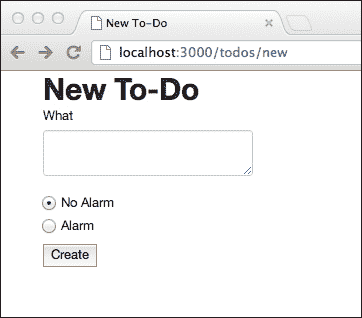
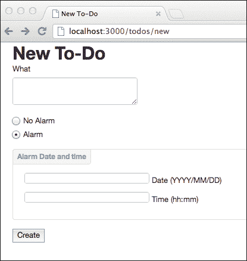
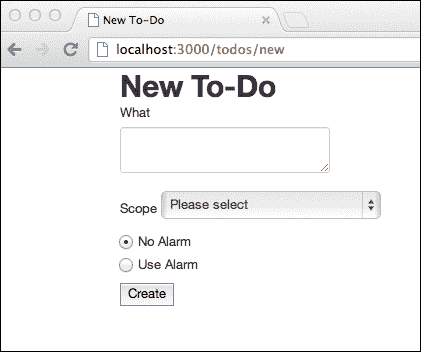
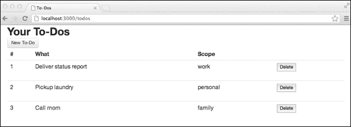

# 第六章：测试交互

到目前为止，我们已经测试了在表单上填写文本字段，但还有其他更复杂的输入字段，您可以指示 Zombie 浏览器填写。

例如，您可能想要选择单选按钮元素，或从下拉列表框中选择一个项目，或者您可能想要从日期输入字段中选择特定日期。

与表单字段和其他元素交互时，您的应用程序可能会操纵文档，例如显示或隐藏某些元素。在本章结束时，您将了解如何使用 Zombie.js 验证使用 JavaScript 操纵文档的效果。

本章涵盖的主题有：

+   如何触发其他表单对象的更改

+   如何测试 DOM 操作

# 操作单选按钮

要测试单选按钮的使用，我们需要在应用程序的表单中添加一些单选按钮。我们将在待办事项创建表单中引入一个单选按钮，以指示是否应该安排闹钟。根据所选值，应该出现一个字段，允许我们设置待办事项的闹钟日期和时间。

1.  首先，我们需要更改`templates/todos/new.html`中的待办事项创建模板：

```js
<h1>New To-Do</h1>
<form id="new-todo-form" action="/todos" method="POST">

  <p>
    <label for="what">What</label>
    <textarea name="what" id="what" required></textarea>
  </p>

  <p>

    <label class="radio" for="alarm-false">
      <input type="radio" name="alarm" value="false" id="alarm-false" checked="checked" /> No Alarm
    </label>

    <label class="radio" for="alarm-true">
      <input type="radio" name="alarm" value="true" id="alarm-true" /> Use Alarm
    </label>

  </p>

  <div id="alarm-date-time" style="display:none">
    <label class="date" for="alarm-date">
      <input type="text" name="alarm-date" id="alarm-date" /> Date (YYYY/MM/DD)
    </label>
    <label class="time" for="alarm-time">
      <input type="text" name="alarm-time" id="alarm-time" /> Time (hh:mm)
    </label>
  </div>

  <input type="submit" value="Create" />
</form>
```

1.  这将向用户呈现待办事项创建表单中的一对新单选按钮：

1.  现在我们还需要引入一些样式。在`public/css/todo.css`下创建一个自定义样式表：

```js
#alarm-date-time {
  position: relative;
  margin: 15px 0;
  padding: 39px 19px 14px;
  border: 1px solid #DDD;
  -webkit-border-radius: 4px;
  -moz-border-radius: 4px;
  border-radius: 4px;
  width: auto;
}

#alarm-date-time::after {
  content: "Alarm Date and time";
  position: absolute;
  top: -1px;
  left: -1px;
  padding: 3px 7px;
  font-size: 12px;
  font-weight: bold;
  background-color: whiteSmoke;
  border: 1px solid #DDD;
  color: #9DA0A4;
  -webkit-border-radius: 4px 0 4px 0;
  -moz-border-radius: 4px 0 4px 0;
  border-radius: 4px 0 4px 0;
}
```

1.  我们需要在`templates/layout.html`中的布局文件中引用以前的 CSS 文件：

```js
<html>
  <head>
    <meta http-equiv="Content-Type" content="text/html; charset=utf-8" />
    <title id="title"></title>
    <link href="/css/bootstrap.min.css" rel="stylesheet" >
 <link href="/css/todo.css" rel="stylesheet" >
  </head>
  <body>

    <section role="main" class="container">

      <div id="messages"></div>

      <div id="main-body"></div>

    </section>

    <script src="img/jquery.min.js"></script> 
    <script src="img/jquery-ui-1.8.23.custom.min.js"></script> 
    <script src="img/bootstrap.min.js"></script>
    <script src="img/todos.js"></script>
  </body>
</html>
```

1.  接下来，当用户选择**闹钟**单选按钮时，我们需要使日期和时间表单字段出现。为此，我们需要在`public/js/todos.js`文件中引入一个事件监听器：

```js
$(function() {
  $('#todo-list').sortable({
    update: function() {
      var order = [];
      $('.todo').each(function(idx, row) {
        order.push($(row).find('.pos').text());
      });

      $.post('/todos/sort', {order: order.join(',')}, function() {
        $('.todo').each(function(idx, row) {
          $(row).find('.pos').text(idx + 1);
        });
      });

    }
  });

 function hideOrShowDateTime() {
 var ringAlarm = $('input[name=alarm]:checked',
 '#new-todo-form').val() === 'true';

 if (ringAlarm) {
 $('#alarm-date-time').slideDown();
 } else {
 $('#alarm-date-time').slideUp();
 }
 }

 $('#new-todo-form input[name=alarm]').change(hideOrShowDateTime);
 hideOrShowDateTime();

});
```

这个新的事件监听器将监听单选按钮的更改，然后相应地隐藏或显示闹钟日期和时间字段，当“闹钟”设置打开时，结果如下：



1.  我们还需要更改表单提交的路由监听器，以适应这些新字段：

```js
this.post('/', [loggedIn, function() {

  var req  = this.req,
      res  = this.res,
      todo = this.req.body
  ;

  if (! todo.what) {
    res.writeHead(200, {'Content-Type': 'text/html'});
    return res.end(layout(templates['new'], 'New To-Do',
      {error: 'Please fill in the To-Do description'}));
  }

 todo.alarm = todo.alarm === 'true';
 todo.alarm_date = Date.parse(todo['alarm-date'] + ' ' + todo['alarm-time']);
 delete todo['alarm-date'];
 delete todo['alarm-time'];

  todo.created_at = Date.now();

  insert(req.session.user.email, todo, function(err) {

    if (err) {
      res.writeHead(500);
      return res.end(err.stack);
    }

    res.writeHead(303, {Location: '/todos'});
    res.end();
  });

}]);
```

这段新代码处理了表单字段中提交的闹钟日期和闹钟时间，并将它们解析为时间戳。然后，包含在`todo`变量中的待办事项被转换为一个看起来像这样的文档：

```js
{ what: 'Deliver books to library',
  alarm: true,
  alarm_date: 1351608900000,
  created_at: 1350915191244 }
```

# 测试用户交互

为了测试这些新的表单字段及其组合行为，我们将使用`test/todos.js`中的测试文件，并增加`Todo creation form`范围：

1.  首先，我们测试这些单选按钮是否存在，并且默认情况下闹钟是否关闭：

```js
it('should not present the alarm date form fields when no alarm is selected',
  login(function(browser, done) {
     browser.visit('http://localhost:3000/todos/new', function(err) {
       if (err) throw err;

       browser.choose('No Alarm', function(err) {
         if (err) throw err;

         assert.equal(browser.query('#alarm-date-time').style.display, 'none');
         done();
       });
     });
  })
);
```

在这里，我们正在验证“闹钟”字段实际上有两个单选按钮，一个具有`false`值，另一个具有`true`值。然后我们还验证第一个是否被选中。

1.  我们还需要验证新的日期和时间表单字段的动画是否有效；包裹闹钟日期和时间输入字段的`div`元素在用户选择不使用闹钟时应该隐藏。当用户选择“使用闹钟”单选按钮时，`div`元素应该变为可见：

```js
it('should present the alarm date form fields when alarm', 
  login(function(browser, done) {
    browser.visit('http://localhost:3000/todos/new', function(err) {
      if (err) throw err;

      var container = browser.query('#alarm-date-time');

      browser.choose('No Alarm', function(err) {
        if (err) throw err;

        assert.equal(container.style.display, 'none');

        browser.choose('Use Alarm', function(err) {
          if (err) throw err;

          assert.equal(container.style.display, '');

          browser.choose('No Alarm', function(err) {
            if (err) throw err;

            assert.equal(container.style.display, 'none');

            done();
          });
        });
      });
    });
  })
);
```

在这里，我们打开和关闭使用闹钟设置，并验证容器`div`的样式相应更改。在 Zombie 中，所有用户交互函数（如`browser.choose()`，`browser.fill()`等）都允许您将回调函数作为最后一个参数传递。一旦浏览器事件循环空闲，将调用此函数，这意味着只有在任何动画之后才会调用您的函数。这真的很有用，因为您的测试代码不必显式等待动画完成。您可以确保在调用回调函数后 DOM 被操作。

### 注意

使用这种技术，您还可以测试任何用户交互。通过提供一个回调函数，当 Zombie 完成所有操作时调用该函数，您可以测试这些操作对文档的影响。

在我们的案例中，我们测试了成功更改`div`元素的样式属性，但您也可以使用这种技术测试其他交互。例如，正如我们将在下一章中看到的那样，我们可以测试内容是否根据某些用户操作而改变。

# 选择值

如果表单中有选择框，您还可以指示 Zombie 为您选择列表项。让我们更改我们的待办事项创建表单，以包括描述项目范围的额外选择框 - 项目是否与工作、家庭有关，或者是否是个人任务。

首先，我们需要在`templates/todos/new.html`中的待办事项创建表单中引入这个额外的字段，就在`What`文本区域字段之后：

```js
  <label for="scope">
    Scope
    <select name="scope" id="scope">
      <option value="" selected="selected">Please select</option>
      <option value="work">Work</option>
      <option value="personal">Personal</option>
      <option value="family">Family</option>
    </select>
  </label>
```

这将呈现包含额外的**Scope**标签和选择框的以下表单：



现在我们需要有一个测试来验证该表单是否包含`select`元素和`option`项。为此，让我们继续扩展`test/todos.js`文件，在`Todo creation form`描述范围内：

```js
it('should present the scope select box',
  login(function(browser, done) {
    browser.visit('http://localhost:3000/todos/new', function(err) {
      if (err) throw err;

      var select = browser.queryAll('form select[name=scope]');
      assert.equal(select.length, 1);

      var options = browser.queryAll('form select[name=scope] option');
      assert.equal(options.length, 4);

      options = options.map(function(option) {
        return [option.value, option.textContent];
      });

      var expectedOptions = [
        [null, 'Please select'],
        ['work', 'Work'],
        ['personal', 'Personal'],
        ['family', 'Family']
      ];

      assert.deepEqual(options, expectedOptions);

      done();

    });
  })
);
```

在这里，我们正在测试`select`元素是否存在，它是否有四个`option`项，以及每个项是否具有预期的值和文本。

现在我们需要更改待办事项列表以呈现这个新的范围字段。为此，我们需要在`templates/todos/index.html`文件中引入它：

```js
<h1>Your To-Dos</h1>

<a class="btn" href="/todos/new">New To-Do</a>

<table class="table">
  <thead>
    <tr>
      <th>#</th>
      <th>What</th>
 <th>Scope</th>
      <th></th>
    </tr>
  </thead>
  <tbody id="todo-list">
    <tr class="todo">
      <td class="pos"></td>
      <td class="what"></td>
 <td class="scope"></td>
      <td class="remove">
        <form action="/todos/delete" method="POST">
          <input type="hidden" name="pos" value="" />
          <input type="submit" name="Delete" value="Delete" />
        </form>
      </td>
    </tr>
  </tbody>
</table>
```

当在`routes/todos.js`文件的`GET /`路由监听器中呈现待办事项列表时，我们还需要填写值：

```js
this.get('/', [loggedIn, function() {

  var res = this.res;

  db.get(this.req.session.user.email, function(err, todos) {

    if (err && err.status_code !== 404) {
      res.writeHead(500);
      return res.end(err.stack);
    }

    if (! todos) todos = {todos: []};
    todos = todos.todos;

    todos.forEach(function(todo, idx) {
      if (todo) todo.pos = idx + 1;
    });

    var map = Plates.Map();
    map.className('todo').to('todo');
    map.className('pos').to('pos');
    map.className('what').to('what');
 map.className('scope').to('scope');
    map.where('name').is('pos').use('pos').as('value');

    var main = Plates.bind(templates.index, {todo: todos}, map);
    res.writeHead(200, {'Content-Type': 'text/html'});
    res.end(layout(main, 'To-Dos'));

  });
```

这将导致待办事项列表如下截图所示，其中呈现了每个待办事项的`scope`属性：



现在我们需要测试待办事项创建是否成功捕获了范围值。为此，我们将稍微更改名为`should allow to create a todo`的测试：

```js
it('should allow to create a todo', login(function(browser, done) {
  browser.visit('http://localhost:3000/todos/new', function(err) {
    if (err) throw err;

    browser
      .fill('What', 'Laundry')
 .select('scope', 'Personal')
      .pressButton('Create', function(err) {
        if (err) throw err;

        assert.equal(browser.location.pathname, '/todos',
          'should be redirected to /todos after creation');

        var list = browser.queryAll('#todo-list tr.todo');
        assert.equal(list.length, 1, 'To-do list length should be 1');
        var todo = list[0];
        assert.equal(browser.text('td.pos', todo), 1);
        assert.equal(browser.text('td.what', todo), 'Laundry');
 assert.equal(browser.text('td.scope', todo), 'personal');

        done();

      });
  });
}));
```

# 总结

Zombie 允许您操纵任何表单对象，包括文本字段、文本区域、选择框、复选框和单选按钮。

Zombie 不仅允许测试服务器响应，还允许模拟用户交互。如果您的应用程序在触发用户事件时动态更改文档（例如选择选项或单击元素），您可以使用 Zombie 和浏览器查询来验证行为是否符合预期。

即使存在用户触发的动画（例如淡入），Zombie 也不会在这些动画完成之前调用回调函数。

在下一章中，我们将分析如何使用 Zombie.js 来测试执行 AJAX 调用的用户交互。
