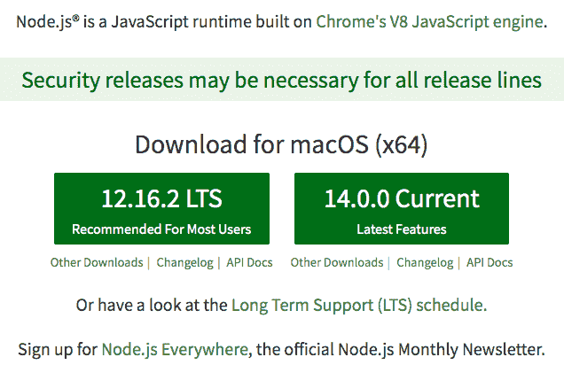
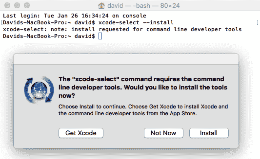
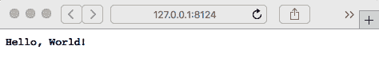

设置 Node.js

在开始使用 Node.js 之前，您必须设置好开发环境。虽然设置非常简单，但有许多考虑因素，包括是否使用包管理系统安装 Node.js，满足安装本地代码 Node.js 包的要求，以及决定使用什么编辑器最好与 Node.js 一起使用。在接下来的章节中，我们将使用这个环境进行开发和非生产部署。

在本章中，我们将涵盖以下主题：

+   如何在 Linux、macOS 或 Windows 上从源代码和预打包的二进制文件安装 Node.js

+   如何安装**node 包管理器**（**npm**）和其他一些流行的工具

+   Node.js 模块系统

+   Node.js 和 ECMAScript 委员会的 JavaScript 语言改进

# 第四章：系统要求

Node.js 可以在类似 POSIX 的操作系统、各种 UNIX 衍生系统（例如 Solaris）和 UNIX 兼容的操作系统（如 Linux、macOS 等），以及 Microsoft Windows 上运行。它可以在各种大小的计算机上运行，包括像树莓派这样的微型 ARM 设备，树莓派是一个用于 DIY 软件/硬件项目的微型嵌入式计算机。

Node.js 现在可以通过包管理系统获得，无需从源代码编译和安装。

由于许多 Node.js 包是用 C 或 C++编写的，您必须有 C 编译器（如 GCC）、Python 2.7（或更高版本）和`node-gyp`包。由于 Python 2 将在 2019 年底停止维护，Node.js 社区正在为 Python 3 兼容性重写其工具。如果您计划在网络编码中使用加密，还需要 OpenSSL 加密库。现代 UNIX 衍生系统几乎肯定会自带这些内容，Node.js 的配置脚本（在从源代码安装时使用）将检测它们的存在。如果您需要安装它，Python 可以在[`python.org`](http://python.org)获取，OpenSSL 可以在[`openssl.org`](http://openssl.org)获取。

现在我们已经了解了运行 Node.js 的要求，让我们学习如何安装它。

# 使用包管理器安装 Node.js

安装 Node.js 的首选方法是使用包管理器中提供的版本，比如`apt-get`或 MacPorts。包管理器通过输入简单的命令，如`apt-get update`，来帮助您在计算机上维护软件的当前版本，并确保更新依赖包，从而让您的生活更加轻松。让我们首先来看一下如何从包管理系统进行安装。

有关从包管理器安装的官方说明，请访问[`nodejs.org/en/download/package-manager/.`](https://nodejs.org/en/download/package-manager/)

## 在 macOS 上使用 MacPorts 安装 Node.js

MacPorts 项目（[`www.macports.org/`](http://www.macports.org/)）多年来一直在为 macOS 打包大量开源软件包，他们已经打包了 Node.js。它默认管理的命令安装在`/opt/local/bin`上。安装 MacPorts 后，安装 Node.js 非常简单，可以在 MacPorts 安装命令的目录中找到 Node.js 二进制文件：

```

If you have followed the directions for setting up MacPorts, the MacPorts directory is already in your PATH environment variable. Running the `node`, `npm`, or `npx` commands is then simple. This proves Node.js has been installed and the installed version matched what you asked for.

MacPorts isn't the only tool for managing open source software packages on macOS.

## Installing Node.js on macOS with Homebrew

Homebrew is another open source software package manager for macOS, which some say is the perfect replacement for MacPorts. It is available through their home page at [`brew.sh/`](http://brew.sh/). After installing Homebrew using the instructions on their website and ensuring that it is correctly set up, use the following code:

```

然后，像这样安装：

```

Like MacPorts, Homebrew installs commands on a public directory, which defaults to `/usr/local/bin`. If you have followed the Homebrew instructions to add that directory to your `PATH` variable, run the Node.js command as follows:

```

这证明 Node.js 已经安装，并且安装的版本与您要求的版本相匹配。

当然，macOS 只是我们可能使用的众多操作系统之一。

## 从包管理系统在 Linux、*BSD 或 Windows 上安装 Node.js

Node.js 现在可以通过大多数包管理系统获得。Node.js 网站上的说明目前列出了 Node.js 的打包版本，适用于长列表的 Linux，以及 FreeBSD，OpenBSD，NetBSD，macOS，甚至 Windows。访问[`nodejs.org/en/download/package-manager/`](https://nodejs.org/en/download/package-manager/)获取更多信息。

例如，在 Debian 和其他基于 Debian 的 Linux 发行版（如 Ubuntu）上，使用以下命令：

```

This adds the NodeSource APT repository to the system, updates the package data, and prepares the system so that you can install Node.js packages. It also instructs us on how to install Node.js and the required compiler and developer tools.

To download other Node.js versions (this example shows version 14.x), modify the URL to suit you:

```

命令将安装在`/usr/bin`中，我们可以测试下载的版本是否符合我们的要求。

由于一种名为**Windows 子系统 Linux**（**WSL**）的新工具，Windows 正开始成为 Unix/Linux 极客可以工作的地方。

### 在 WSL 中安装 Node.js

**WSL**允许您在 Windows 上安装 Ubuntu、openSUSE 或 SUSE Linux Enterprise。所有这三个都可以通过内置到 Windows 10 中的商店获得。您可能需要更新 Windows 设备才能进行安装。为了获得最佳体验，请安装 WSL2，这是 WSL 的一次重大改进，提供了 Windows 和 Linux 之间更好的集成。

安装完成后，Linux 特定的说明将在 Linux 子系统中安装 Node.js。

要安装 WSL，请参阅[`msdn.microsoft.com/en-us/commandline/wsl/install-win10`](https://msdn.microsoft.com/en-us/commandline/wsl/install-win10)。

要了解并安装 WSL2，请参阅[`docs.microsoft.com/en-us/windows/wsl/wsl2-index`](https://docs.microsoft.com/en-us/windows/wsl/wsl2-index)。

在 Windows 上，该过程可能需要提升的权限。

### 在 Windows 上打开具有管理员特权的 PowerShell

在 Windows 上安装工具时，您将运行一些命令需要在具有提升权限的 PowerShell 窗口中执行。我们提到这一点是因为在启用 WSL 的过程中，需要在 PowerShell 窗口中运行一个命令。

该过程很简单：

1.  在“开始”菜单中，在应用程序的搜索框中输入`PowerShell`。生成的菜单将列出 PowerShell。

1.  右键单击 PowerShell 条目。

1.  弹出的上下文菜单将有一个名为“以管理员身份运行”的条目。点击它。

生成的命令窗口将具有管理员特权，并且标题栏将显示管理员：Windows PowerShell。

在某些情况下，您将无法使用软件包管理系统中的 Node.js。

## 从 nodejs.org 安装 Node.js 发行版

[`nodejs.org/en/`](https://nodejs.org/en/)网站提供了 Windows、macOS、Linux 和 Solaris 的内置二进制文件。我们只需转到该网站，单击安装按钮，然后运行安装程序。对于具有软件包管理器的系统，例如我们刚刚讨论的系统，最好使用软件包管理系统。这是因为您会发现更容易保持最新版本。但是，由于以下原因，这并不适用于所有人：

+   有些人更喜欢安装二进制文件，而不是使用软件包管理器。

+   他们选择的系统没有软件包管理系统。

+   他们的软件包管理系统中的 Node.js 实现已经过时。

只需转到 Node.js 网站，您将看到以下屏幕截图中的内容。该页面会尽力确定您的操作系统并提供适当的下载。如果您需要其他内容，请单击标题中的 DOWNLOADS 链接以获取所有可能的下载：



对于 macOS，安装程序是一个`PKG`文件，提供了典型的安装过程。对于 Windows，安装程序只需按照典型的安装向导过程进行。

安装程序完成后，您将拥有命令行工具，例如`node`和`npm`，您可以使用它们来运行 Node.js 程序。在 Windows 上，您将获得一个预配置为与 Node.js 良好配合工作的 Windows 命令外壳版本。

正如您刚刚了解的，我们大多数人将完全满意于安装预构建的软件包。但是，有时我们必须从源代码安装 Node.js。

# 在类似 POSIX 的系统上从源代码安装

安装预打包的 Node.js 发行版是首选的安装方法。但是，在一些情况下，从源代码安装 Node.js 是可取的：

+   它可以让您根据需要优化编译器设置。

+   它可以让您交叉编译，比如为嵌入式 ARM 系统。

+   您可能需要保留多个 Node.js 版本进行测试。

+   您可能正在处理 Node.js 本身。

现在您已经有了一个高层次的视图，让我们通过一些构建脚本来动手。一般的过程遵循您可能已经用其他开源软件包执行过的`configure`、`make`和`make install`例程。如果没有，不用担心，我们会指导您完成这个过程。

官方安装说明在源分发的`README.md`中，位于[`github.com/nodejs/node/blob/master/README.md`](https://github.com/nodejs/node/blob/master/README.md)。

## 安装先决条件

有三个先决条件：C 编译器、Python 和 OpenSSL 库。Node.js 编译过程会检查它们的存在，如果 C 编译器或 Python 不存在，将会失败。这些命令将检查它们的存在：

```

Go to [`github.com/nodejs/node/blob/master/BUILDING.md`](https://github.com/nodejs/node/blob/master/BUILDING.md) for details on the requirements.

The specific method for installing these depends on your OS.

The Node.js build tools are in the process of being updated to support Python 3.x. Python 2.x is in an end-of-life process, slated for the end of 2019, so it is therefore recommended that you update to Python 3.x.

Before we can compile the Node.js source, we must have the correct tools installed and on macOS, there are a couple of special considerations.

## Installing developer tools on macOS

Developer tools (such as GCC) are an optional installation on macOS. Fortunately, they're easy to acquire.

You start with Xcode, which is available for free through the Macintosh app store. Simply search for `Xcode` and click on the Get button. Once you have Xcode installed, open a Terminal window and type the following:

```

这将安装 Xcode 命令行工具：



有关更多信息，请访问[`osxdaily.com/2014/02/12/install-command-line-tools-mac-os-x/`](http://osxdaily.com/2014/02/12/install-command-line-tools-mac-os-x/)。

现在我们已经安装了所需的工具，我们可以继续编译 Node.js 源代码。

## 为所有类 POSIX 系统从源代码安装

从源代码编译 Node.js 遵循以下熟悉的过程：

1.  从[`nodejs.org/download.`](http://nodejs.org/download)下载源代码。

1.  使用`./configure`配置源代码进行构建。

1.  运行`make`，然后运行`make install`。

源代码包可以通过浏览器下载，或者按照以下步骤进行替换您喜欢的版本：

```

Now, we configure the source so that it can be built. This is just like with many other open source packages and there is a long list of options to customize the build:

```

要使安装到您的`home`目录中，以这种方式运行它：

```

If you're going to install multiple Node.js versions side by side, it's useful to put the version number in the path like this. That way, each version will sit in a separate directory. It will then be a simple matter of switching between Node.js versions by changing the `PATH` variable appropriately:

```

安装多个 Node.js 版本的更简单方法是使用`nvm`脚本，稍后将进行描述。

如果你想在系统范围的目录中安装 Node.js，只需省略`--prefix`选项，它将默认安装在`/usr/local`中。

过一会儿，它会停止，并且很可能已经成功地配置了源树，以便在您选择的目录中进行安装。如果这不成功，打印出的错误消息将描述需要修复的内容。一旦配置脚本满意，您就可以继续下一步。

配置脚本满意后，您可以编译软件：

```

If you are installing on a system-wide directory, perform the last step this way instead:

```

安装完成后，您应该确保将安装目录添加到您的`PATH`变量中，如下所示：

```

Alternatively, for `csh` users, use this syntax to make an exported environment variable:

```

安装完成后，它会创建一个目录结构，如下所示：

```

Now that we've learned how to install Node.js from the source on UNIX-like systems, we get to do the same on Windows.

## Installing from the source on Windows

The `BUILDING.md` document referenced previously has instructions. You can use the build tools from Visual Studio or the full Visual Studio 2017 or 2019 product: 

*   Visual Studio 2019: [`www.visualstudio.com/downloads/`](https://www.visualstudio.com/downloads/)
*   The build tools: [`visualstudio.microsoft.com/downloads/#build-tools-for-visual-studio-2019`](https://visualstudio.microsoft.com/downloads/#build-tools-for-visual-studio-2019)

Three additional tools are required:

*   Git for Windows: [`git-scm.com/download/win`](http://git-scm.com/download/win)  
*   Python: [`www.python.org/`](https://www.python.org/)
*   OpenSSL: [`www.openssl.org/source/`](https://www.openssl.org/source/) and [`wiki.openssl.org/index.php/Binaries`](https://wiki.openssl.org/index.php/Binaries)
*   The **Netwide Assembler** (**NASM**) for OpenSSL: [`www.nasm.us/`](https://www.nasm.us/)

Then, run the included `.\vcbuild` script to perform the build. 

We've learned how to install one Node.js instance, so let's now take it to the next level by installing multiple instances.

# Installing multiple Node.js instances with nvm

Normally, you wouldn't install multiple versions of Node.js—doing so adds complexity to your system. But if you are hacking on Node.js itself or testing your software against different Node.js releases, you may want to have multiple Node.js installations. The method to do so is a simple variation on what we've already discussed.

Earlier, while discussing building Node.js from the source, we noted that you can install multiple Node.js instances in separate directories. It's only necessary to build from the source if you need a customized Node.js build but most folks would be satisfied with pre-built Node.js binaries. They, too, can be installed on separate directories.

Switching between Node.js versions is simply a matter of changing the `PATH` variable (on POSIX systems), as in the following code, using the directory where you installed Node.js:

```

在一段时间后，维护这个变得有点乏味。对于每个发布，您都必须在 Node.js 安装中设置 Node.js、npm 和任何第三方模块。此外，显示更改`PATH`的命令并不是最佳的。富有创造力的程序员已经创建了几个版本管理器，以简化管理多个 Node.js/npm 版本，并提供智能更改`PATH`的命令：

+   Node 版本管理器：[`github.com/tj/n`](https://github.com/tj/n)

+   Node 版本管理器：[`github.com/creationix/nvm`](https://github.com/creationix/nvm)

两者都维护多个同时版本的 Node.js，并且让你可以轻松切换版本。安装说明可以在它们各自的网站上找到。

例如，使用`nvm`，您可以运行这样的命令：

```

In this example, we first listed the available versions. Then, we demonstrated how to switch between Node.js versions, verifying the version changed each time. We also installed and used a new version using `nvm`. Finally, we showed the directory where nvm installs Node.js packages versus Node.js versions that are installed using MacPorts or Homebrew.

This demonstrates that you can have Node.js installed system-wide, keep multiple private Node.js versions managed by `nvm`, and switch between them as needed. When new Node.js versions are released, they are simple to install with `nvm`, even if the official package manager for your OS hasn't yet updated its packages.

## Installing nvm on Windows

Unfortunately, `nvm` doesn't support Windows. Fortunately, a couple of Windows-specific clones of the `nvm` concept exist:

*   Node.js version management utility for Windows: [`github.com/coreybutler/nvm-windows`](https://github.com/coreybutler/nvm-windows)
*   Natural Node.js and npm version manager for Windows: [`github.com/marcelklehr/nodist`](https://github.com/marcelklehr/nodist)

Another route is to use WSL. Because in WSL you're interacting with a Linux command line, you can use `nvm` itself. But let's stay focused on what you can do in Windows.

Many of the examples in this book were tested using the `nvm-windows` application. There are slight behavior differences but it acts largely the same as `nvm` for Linux and macOS. The biggest change is the version number specifier in the `nvm use` and `nvm install` commands.

With `nvm` for Linux and macOS, you can type a simple version number, such as `nvm use 8`, and it will automatically substitute the latest release of the named Node.js version. With `nvm-windows`, the same command acts as if you typed `nvm use 8.0.0`. In other words, with `nvm-windows`, you must use the exact version number. Fortunately, the list of supported versions is easily available using the `nvm list available` command.

Using a tool such as `nvm` simplifies the process of testing a Node.js application against multiple Node.js versions.

Now that we can install Node.js, we need to make sure we are installing any Node.js module that we want to use. This requires having build tools installed on our computer.

# Requirements for installing native code modules

While we won't discuss native code module development in this book, we do need to make sure that they can be built. Some modules in the npm repository are native code and they must be compiled with a C or C++ compiler to build the corresponding `.node` files (the `.node` extension is used for binary native code modules).

The module will often describe itself as a wrapper for some other library. For example, the `libxslt` and `libxmljs` modules are wrappers around the C/C++ libraries of the same name. The module includes the C/C++ source code and when installed, a script is automatically run to do the compilation with `node-gyp`.

The `node-gyp` tool is a cross-platform command-line tool written in Node.js for compiling native add-on modules for Node.js. We've mentioned native code modules several times and it is this tool that compiles them for use with Node.js.

You can easily see this in action by running these commands:

```

这是在临时目录中完成的，所以之后可以删除它。如果您的系统没有安装编译本地代码模块的工具，您将看到错误消息。否则，您将看到`node-gyp`的执行输出，然后是许多明显与编译 C/C++文件相关的文本行。

`node-gyp`工具具有与从源代码编译 Node.js 相似的先决条件，即 C/C++编译器、Python 环境和其他构建工具，如 Git。对于 Unix、macOS 和 Linux 系统，这些都很容易获得。对于 Windows，您应该安装以下内容：

+   Visual Studio 构建工具：[`www.visualstudio.com/downloads/#build-tools-for-visual-studio-2017`](https://www.visualstudio.com/downloads/#build-tools-for-visual-studio-2017)

+   Windows 的 Git：[`git-scm.com/download/win`](http://git-scm.com/download/win)

+   Windows 的 Python：[`www.python.org/`](https://www.python.org/)

通常，您不需要担心安装`node-gyp`。这是因为它作为 npm 的一部分在后台安装。这样做是为了让 npm 可以自动构建本地代码模块。

它的 GitHub 存储库包含文档；转到[`github.com/nodejs/node-gyp`](https://github.com/nodejs/node-gyp)。

阅读`node-gyp`存储库中的文档将让您更清楚地了解之前讨论的编译先决条件和开发本地代码模块。

这是一个非显式依赖的示例。最好明确声明软件包依赖的所有内容。在 Node.js 中，依赖关系在`package.json`中声明，以便包管理器（`npm`或`yarn`）可以下载和设置所有内容。但是这些编译器工具是由操作系统包管理系统设置的，这是`npm`或`yarn`无法控制的。因此，我们无法明确声明这些依赖关系。

我们刚刚了解到 Node.js 不仅支持用 JavaScript 编写的模块，还支持其他编程语言。我们还学会了如何支持这些模块的安装。接下来，我们将了解 Node.js 版本号。

# 选择要使用的 Node.js 版本和版本策略

在上一节中，我们提到了许多不同的 Node.js 版本号，您可能会对要使用哪个版本感到困惑。本书针对的是 Node.js 版本 14.x，并且预计我们将涵盖的所有内容都与 Node.js 10.x 和任何后续版本兼容。

从 Node.js 4.x 开始，Node.js 团队采用了双轨道方法。偶数版本（4.x、6.x、8.x 等）被称为**长期支持**（**LTS**），而奇数版本（5.x、7.x、9.x 等）是当前新功能开发的地方。虽然开发分支保持稳定，但 LTS 版本被定位为用于生产使用，并将在几年内接收更新。

在撰写本文时，Node.js 12.x 是当前的 LTS 版本；Node.js 14.x 已发布，最终将成为 LTS 版本。

每个新的 Node.js 发布的主要影响，除了通常的性能改进和错误修复之外，还包括引入最新的 V8 JavaScript 引擎发布。反过来，这意味着引入更多的 ES2015/2016/2017 功能，因为 V8 团队正在实现它们。在 Node.js 8.x 中，`async/await`函数到达，在 Node.js 10.x 中，支持标准的 ES6 模块格式到达。在 Node.js 14.x 中，该模块格式将得到完全支持。

一个实际的考虑是新的 Node.js 发布是否会破坏您的代码。新的语言功能总是在 V8 赶上 ECMAScript 的过程中添加，Node.js 团队有时会对 Node.js API 进行重大更改。如果您在一个 Node.js 版本上进行了测试，它是否会在较早的版本上工作？Node.js 的更改是否会破坏我们的一些假设？

npm 的作用是确保我们的软件包在正确的 Node.js 版本上执行。这意味着我们可以在`package.json`文件中指定软件包的兼容 Node.js 版本（我们将在第三章，*探索 Node.js 模块*中探讨）。

我们可以在`package.json`中添加条目如下：

```

This means exactly what it implies—that the given package is compatible with Node.js version 8.x or later.

Of course, your development environment(s) could have several Node.js versions installed. You'll need the version your software is declared to support, plus any later versions you wish to evaluate.

We have just learned how the Node.js community manages releases and version numbers. Our next step is to discuss which editor to use.

# Choosing editors and debuggers for Node.js

Since Node.js code is JavaScript, any JavaScript-aware editor will be useful. Unlike some other languages that are so complex that an IDE with code completion is a necessity, a simple programming editor is perfectly sufficient for Node.js development.

Two editors are worth shouting out because they are written in Node.js: Atom and Microsoft Visual Studio Code. 

Atom ([`atom.io/`](https://atom.io/)) describes itself as a hackable editor for the 21st century. It is extendable by writing Node.js modules using the Atom API and the configuration files are easily editable. In other words, it's hackable in the same way plenty of other editors have been—going back to Emacs, meaning you write a software module to add capabilities to the editor. The Electron framework was invented in order to build Atom and it is is a super-easy way of building desktop applications using Node.js.

Microsoft Visual Studio Code ([`code.visualstudio.com/`](https://code.visualstudio.com/)) is a hackable editor (well, the home page says extensible and customizable, which means the same thing) that is also open source and implemented in Electron. However, it's not a hollow me-too editor, copying Atom while adding nothing of its own. Instead, Visual Studio Code is a solid programmer's editor in its own right, bringing interesting functionality to the table.

As for debuggers, there are several interesting choices. Starting with Node.js 6.3, the `inspector` protocol has made it possible to use the Google Chrome debugger. Visual Studio Code has a built-in debugger that also uses the `inspector` protocol.

For a full list of debugging options and tools, see [`nodejs.org/en/docs/guides/debugging-getting-started/`](https://nodejs.org/en/docs/guides/debugging-getting-started/).

Another task related to the editor is adding extensions to help with the editing experience. Most programmer-oriented editors allow you to extend the behavior and assist with writing the code. A trivial example is syntax coloring for JavaScript, CSS, HTML, and so on. Code completion extensions are where the editor helps you write the code. Some extensions scan code for common errors; often these extensions use the word *lint*. Some extensions help to run unit test frameworks. Since there are so many editors available, we cannot provide specific suggestions.  

For some, the choice of programming editor is a serious matter defended with fervor, so we carefully recommend that you use whatever editor you prefer, as long as it helps you edit JavaScript code. Next, we will learn about the Node.js commands and a little about running Node.js scripts.

# Running and testing commands

Now that you've installed Node.js, we want to do two things—verify that the installation was successful and familiarize ourselves with the Node.js command-line tools and running simple scripts with Node.js. We'll also touch again on `async` functions and look at a simple example HTTP server. We'll finish off with the `npm` and `npx` command-line tools.

## Using Node.js's command-line tools

The basic installation of Node.js includes two commands: `node` and `npm`. We've already seen the `node` command in action. It's used either for running command-line scripts or server processes. The other, `npm`, is a package manager for Node.js.

The easiest way to verify that your Node.js installation works is also the best way to get help with Node.js. Type the following command:

```

输出很多，但不要过于仔细研究。关键是`node --help`提供了很多有用的信息。

请注意，Node.js 和 V8 都有选项（在上一个命令行中未显示）。请记住 Node.js 是建立在 V8 之上的；它有自己的选项宇宙，主要关注字节码编译、垃圾回收和堆算法的细节。输入`node --v8-options`以查看这些选项的完整列表。

在命令行上，您可以指定选项、单个脚本文件和该脚本的参数列表。我们将在下一节*使用 Node.js 运行简单脚本*中进一步讨论脚本参数。

在没有参数的情况下运行 Node.js 会将您放在一个交互式 JavaScript shell 中：

```

Any code you can write in a Node.js script can be written here. The command interpreter gives a good terminal-oriented user experience and is useful for interactively playing with your code. You do play with your code, don't you? Good!

## Running a simple script with Node.js

Now, let's look at how to run scripts with Node.js. It's quite simple; let's start by referring to the help message shown previously. The command-line pattern is just a script filename and some script arguments, which should be familiar to anyone who has written scripts in other languages.

Creating and editing Node.js scripts can be done with any text editor that deals with plain text files, such as VI/VIM, Emacs, Notepad++, Atom, Visual Studio Code, Jedit, BB Edit, TextMate, or Komodo. It's helpful if it's a programmer-oriented editor, if only for the syntax coloring.

For this and other examples in this book, it doesn't truly matter where you put the files. However, for the sake of neatness, you can start by making a directory named `node-web-dev` in the `home` directory of your computer and inside that, creating one directory per chapter (for example, `chap02` and `chap03`).

First, create a text file named `ls.js` with the following content:

```

接下来，通过输入以下命令来运行它：

```

This is a pale and cheap imitation of the Unix `ls` command (as if you couldn't figure that out from the name!). The `readdir` function is a close analog to the Unix `readdir` system call used to list the files in a directory. On Unix/Linux systems, we can run the following command to learn more:

```

当然，`man`命令让你阅读手册页，第`3`节涵盖了 C 库。

在函数体内，我们读取目录并打印其内容。使用`require('fs').promises`给我们提供了一个返回 Promise 的`fs`模块（文件系统函数）的版本；因此，在异步函数中它可以很好地工作。同样，ES2015 的`for..of`循环构造让我们能够以一种适合在`async`函数中工作的方式循环遍历数组中的条目。

默认情况下，`fs`模块函数使用最初为 Node.js 创建的回调范式。因此，大多数 Node.js 模块使用回调范式。在`async`函数中，如果函数返回 Promise，那么更方便使用`await`关键字。`util`模块提供了一个函数，`util.promisify`，它为旧式的面向回调的函数生成一个包装函数，因此它返回一个 Promise。

这个脚本是硬编码为列出当前目录中的文件。真正的`ls`命令需要一个目录名，所以让我们稍微修改一下脚本。

命令行参数会落入一个名为`process.argv`的全局数组中。因此，我们可以修改`ls.js`，将其复制为`ls2.js`（如下所示）来看看这个数组是如何工作的：

```

You can run it as follows:

```

我们只是检查了命令行参数是否存在，`if (process.argv[2])`。如果存在，我们会覆盖`dir`变量的值，`dir = process.argv[2]`，然后将其用作`readdir`的参数：

```

If you give it a non-existent directory pathname, an error will be thrown and printed using the `catch` clause. 

### Writing inline async arrow functions

There is a different way to write these examples that some feel is more concise. These examples were written as a regular function—with the `function` keyword—but with the `async` keyword in front. One of the features that came with ES2015 is the arrow function, which lets us streamline the code a little bit.

Combined with the `async` keyword, an async arrow function looks like this:

```

你可以在任何地方使用这个；例如，该函数可以被分配给一个变量，或者它可以作为回调传递给另一个函数。当与`async`关键字一起使用时，箭头函数的主体具有所有`async`函数的行为。

为了这些示例的目的，可以将异步箭头函数包装为立即执行：

```

The final parenthesis causes the inline function to immediately be invoked.

Then, because `async` functions return a Promise, it is necessary to add a `.catch` block to catch errors. With all that, the example looks as follows:

```

也许这种风格或者之前的风格更可取。然而，你会发现这两种风格都在使用中，了解这两种风格的工作方式是必要的。

在脚本的顶层调用异步函数时，有必要捕获任何错误并报告它们。未能捕获和报告错误可能导致难以解决的神秘问题。在这个示例的原始版本中，错误是通过`try/catch`块明确捕获的。在这个版本中，我们使用`.catch`块捕获错误。

在我们拥有异步函数之前，我们有 Promise 对象，而在那之前，我们有回调范式。所有三种范式在 Node.js 中仍在使用，这意味着你需要理解每一种。

## 转换为异步函数和 Promise 范式

在上一节中，我们讨论了`util.promisify`及其将面向回调的函数转换为返回 Promise 的能力。后者与异步函数很好地配合，因此，最好让函数返回一个 Promise。

更准确地说，`util.promisify`应该给出一个使用错误优先回调范式的函数。这些函数的最后一个参数是一个回调函数，其第一个参数被解释为错误指示器，因此有了错误优先回调这个短语。`util.promisify`返回的是另一个返回 Promise 的函数。

Promise 的作用与错误优先回调相同。如果指示了错误，则 Promise 解析为拒绝状态，而如果指示了成功，则 Promise 解析为成功状态。正如我们在这些示例中看到的那样，Promise 在`async`函数中处理得非常好。

Node.js 生态系统拥有大量使用错误优先回调的函数。社区已经开始了一个转换过程，其中函数将返回一个 Promise，并可能还会接受一个错误优先回调以实现 API 兼容性。

Node.js 10 中的一个新功能就是这样的转换的一个例子。在`fs`模块中有一个名为`fs.promises`的子模块，具有相同的 API，但产生 Promise 对象。我们使用该 API 编写了前面的示例。

另一个选择是第三方模块`fs-extra`。该模块具有超出标准`fs`模块的扩展 API。一方面，如果没有提供回调函数，它的函数会返回一个 Promise，否则会调用回调函数。此外，它还包括几个有用的函数。

在本书的其余部分，我们经常使用`fs-extra`，因为它具有额外的功能。有关该模块的文档，请访问[`www.npmjs.com/package/fs-extra`](https://www.npmjs.com/package/fs-extra)。

`util`模块还有另一个函数`util.callbackify`，它的功能与其名称暗示的一样——它将返回 Promise 的函数转换为使用回调函数的函数。

现在我们已经看到如何运行一个简单的脚本，让我们来看一个简单的 HTTP 服务器。

## 使用 Node.js 启动服务器

你将运行许多服务器进程的脚本；我们稍后将运行许多这样的脚本。由于我们仍在尝试验证安装并让你熟悉使用 Node.js，我们想要运行一个简单的 HTTP 服务器。让我们借用 Node.js 首页上的简单服务器脚本([`nodejs.org`](http://nodejs.org))。

创建一个名为`app.js`的文件，其中包含以下内容：

```

Run it as follows:

```

这是你可以用 Node.js 构建的最简单的网络服务器。如果你对它的工作原理感兴趣，请翻到第四章，*HTTP 服务器和客户端*，第五章，*你的第一个 Express 应用程序*，和第六章，*实现移动优先范式*。但现在，只需在浏览器中键入`http://127.0.0.1:8124`，就可以看到 Hello, World!的消息：



一个值得思考的问题是为什么这个脚本在`ls.js`退出时没有退出。在两种情况下，脚本的执行都到达了文件的末尾；Node.js 进程在`app.js`中没有退出，而在`ls.js`中退出了。

这是因为存在活动事件监听器。Node.js 始终启动一个事件循环，在`app.js`中，`listen`函数创建了一个实现 HTTP 协议的事件`listener`。这个`listener`事件会一直保持`app.js`运行，直到你做一些事情，比如在终端窗口中按下*Ctrl* + *C*。在`ls.js`中，没有任何内容来创建一个长时间运行的`listener`事件，所以当`ls.js`到达脚本的末尾时，`node`进程将退出。

要使用 Node.js 执行更复杂的任务，我们必须使用第三方模块。npm 存储库是去的地方。

## 使用 npm，Node.js 包管理器

Node.js 作为一个具有一些有趣的异步 I/O 库的 JavaScript 解释器，本身就是一个相当基本的系统。使 Node.js 有趣的事情之一是不断增长的用于 Node.js 的第三方模块生态系统。

在这个生态系统的中心是 npm 模块存储库。虽然 Node.js 模块可以作为源代码下载并手动组装以供 Node.js 程序使用，但这样做很麻烦，而且很难实现可重复的构建过程。npm 为我们提供了一个更简单的方法；npm 是 Node.js 的事实标准包管理器，它极大地简化了下载和使用这些模块。我们将在下一章详细讨论 npm。

你们中的敏锐者可能已经注意到，npm 已经通过之前讨论的所有安装方法安装了。过去，npm 是单独安装的，但今天它与 Node.js 捆绑在一起。

现在我们已经安装了`npm`，让我们快速试一下。**hexy**程序是一个用于打印文件的十六进制转储的实用程序。这是一个非常 70 年代的事情，但它仍然非常有用。它现在正好符合我们的目的，因为它可以让我们快速安装和尝试：

```

Adding the `-g` flag makes the module available globally, irrespective of the present working directory of your command shell. A global install is most useful when the module provides a command-line interface. When a package provides a command-line script, `npm` sets that up. For a global install, the command is installed correctly for use by all users of the computer.

Depending on how Node.js is installed for you, it may need to be run with `sudo`:

```

安装完成后，您可以以以下方式运行新安装的程序：

```

The `hexy` command was installed as a global command, making it easy to run.

Again, we'll be doing a deep dive into npm in the next chapter. The `hexy` utility is both a Node.js library and a script for printing out these old-style hex dumps.

In the open source world, a perceived need often leads to creating an open source project. The folks who launched the Yarn project saw needs that weren't being addressed by npm and created an alternative package manager tool. They claim a number of advantages over npm, primarily in the area of performance. To learn more about Yarn, go to [`yarnpkg.com/`](https://yarnpkg.com/).

For every example in this book that uses npm, there is a close equivalent command that uses Yarn.

For npm-packaged command-line tools, there is another, simpler way to use the tool.

## Using npx to execute Node.js packaged binaries

Some packages in the npm repository are command-line tools, such as the `hexy` program we looked at earlier. Having to first install such a program before using it is a small hurdle. The sharp-eyed among you will have noticed that `npx` is installed alongside the `node` and `npm` commands when installing Node.js. This tool is meant to simplify running command-line tools from the npm repository by removing the need to first install the package.

The previous example could have been run this way:

```

在底层，`npx`使用`npm`将包下载到缓存目录，除非包已经安装在当前项目目录中。因为包然后在缓存目录中，所以只下载一次。

这个工具有很多有趣的选项；要了解更多，请访问[`www.npmjs.com/package/npx`](https://www.npmjs.com/package/npx)。

在本节中，我们已经学到了有关 Node.js 提供的命令行工具，以及运行简单脚本和 HTTP 服务器的知识。接下来，我们将学习 JavaScript 语言的进步如何影响 Node.js 平台。

# 用 ECMAScript 2015、2016、2017 和以后推进 Node.js

2015 年，ECMAScript 委员会发布了 JavaScript 语言的一个期待已久的重大更新。更新为 JavaScript 带来了许多新功能，如 Promises、箭头函数和类对象。这个语言更新为改进奠定了基础，因为它应该大大提高我们编写清晰、易懂的 JavaScript 代码的能力。

浏览器制造商正在添加这些非常需要的功能，这意味着 V8 引擎也在添加这些功能。这些功能正在以 Node.js 的方式进入，从 4.x 版本开始。

要了解 Node.js 中 ES2015/2016/2017 等的当前状态，请访问[`nodejs.org/en/docs/es6/`](https://nodejs.org/en/docs/es6/)。

默认情况下，Node.js 启用 V8 认为稳定的 ES2015、2016 和 2017 功能。其他功能可以通过命令行选项启用。几乎完整的功能可以通过`--es_staging`选项启用。网站文档提供了更多信息。

Node green 网站([`node.green/`](http://node.green/))有一张表格列出了 Node.js 版本中许多功能的状态。

ES2019 语言规范发布在[`www.ecma-international.org/publications/standards/Ecma-262.htm`](https://www.ecma-international.org/publications/standards/Ecma-262.htm)。

TC-39 委员会在 GitHub 上进行工作，网址为[`github.com/tc39`](https://github.com/tc39)。

ES2015（以及之后）的功能对 JavaScript 语言有很大的改进。其中一个功能，`Promise`类，应该意味着 Node.js 编程中常见习语的根本性重新思考。在 ES2017 中，一对新关键字，`async`和`await`，简化了在 Node.js 中编写异步代码，这应该鼓励 Node.js 社区进一步重新思考平台的常见习语。

JavaScript 有很多新功能，但让我们快速浏览其中两个我们将大量使用的功能。

第一个是称为箭头函数的轻量级函数语法：

```

This is more than the syntactic sugar of replacing the `function` keyword with the fat arrow. Arrow functions are lighter weight as well as being easier to read. The lighter weight comes at the cost of changing the value of `this` inside the arrow function. In regular functions, `this` has a unique value inside the function. In an arrow function, `this` has the same value as the scope containing the arrow function. This means that, when using an arrow function, we don't have to jump through hoops to bring `this` into the callback function because `this` is the same at both levels of the code.

The next feature is the `Promise` class, which is used for deferred and asynchronous computations. Deferred code execution to implement asynchronous behavior is a key paradigm for Node.js and it requires two idiomatic conventions:

*   The last argument to an asynchronous function is a callback function, which is called when an asynchronous execution is to be performed.
*   The first argument to the callback function is an error indicator.

While convenient, these conventions have resulted in multilayer code pyramids that can be difficult to understand and maintain:

```

您不需要理解代码；这只是实践中发生的概述，因为我们使用回调。根据特定任务所需的步骤数量，代码金字塔可能会变得非常深。Promise 将让我们解开代码金字塔，并提高可靠性，因为错误处理更直接，可以轻松捕获所有错误。

`Promise`类的创建如下：

```

Rather than passing in a callback function, the caller receives a `Promise` object. When properly utilized, the preceding pyramid can be coded as follows:

```

这是因为`Promise`类支持链接，如果`then`函数返回一个`Promise`对象。

`async/await`功能实现了`Promise`类的承诺，简化了异步编码。这个功能在`async`函数中变得活跃：

```

An `async` arrow function is as follows: 

```

为了看到`async`函数范式给我们带来了多大的改进，让我们将之前的示例重新编码如下：

```

Again, we don't need to understand the code but just look at its shape. Isn't this a breath of fresh air compared to the nested structure we started with?

The `await` keyword is used with a Promise. It automatically waits for the Promise to resolve. If the Promise resolves successfully, then the value is returned and if it resolves with an error, then that error is thrown. Both handling results and throwing errors are handled in the usual manner.

This example also shows another ES2015 feature: destructuring. The fields of an object can be extracted using the following code:

```

这演示了一个具有三个字段的对象，但只提取了两个字段。

为了继续探索 JavaScript 的进步，让我们来看看 Babel。

## 使用 Babel 使用实验性 JavaScript 功能

Babel 转译器是使用尖端 JavaScript 功能或尝试新 JavaScript 功能的主要工具。由于您可能从未见过**转译器**这个词，它的意思是将源代码从一种语言重写为另一种语言。它类似于**编译器**，Babel 将计算机源代码转换为另一种形式，但是 Babel 生成的是 JavaScript，而不是直接可执行代码。也就是说，它将 JavaScript 代码转换为 JavaScript 代码，这可能看起来没有用，直到您意识到 Babel 的输出可以针对旧的 JavaScript 版本。

更简单地说，Babel 可以配置为将具有 ES2015、ES2016、ES2017（等等）功能的代码重写为符合 ES5 版本 JavaScript 的代码。由于 ES5 JavaScript 与几乎所有旧计算机上的网络浏览器兼容，开发人员可以使用现代 JavaScript 编写其前端代码，然后使用 Babel 将其转换为在旧浏览器上执行。

要了解更多关于 Babel 的信息，请访问[`babeljs.io`](https://%20babeljs.io)。

Node Green 网站明确表示 Node.js 支持几乎所有的 ES2015、2016 和 2017 功能。因此，实际上，我们不再需要为 Node.js 项目使用 Babel。您可能需要支持旧版本的 Node.js，可以使用 Babel 来实现。

对于网络浏览器来说，一组 ECMAScript 功能和我们可以在浏览器端代码中可靠使用这些功能之间存在着更长的时间延迟。并不是网络浏览器制造商在采用新功能方面速度慢，因为谷歌、Mozilla 和微软团队都积极采用最新功能。不幸的是，苹果的 Safari 团队似乎在采用新功能方面较慢。然而，更慢的是新浏览器在现场计算机中的渗透。

因此，现代 JavaScript 程序员需要熟悉 Babel。

我们还没有准备好展示这些功能的示例代码，但我们可以继续记录 Babel 工具的设置。有关设置文档的更多信息，请访问[`babeljs.io/docs/setup/`](http://babeljs.io/docs/setup/)并单击 CLI 按钮。

为了简要介绍 Babel，我们将使用它来转译我们之前看到的脚本，以在 Node.js 6.x 上运行。在这些脚本中，我们使用了异步函数，这是 Node.js 6.x 不支持的功能。

在包含`ls.js`和`ls2.js`的目录中，输入以下命令：

```

This installs the Babel software, along with a couple of transformation plugins. Babel has a plugin system so that you can enable the transformations required by your project. Our primary goal in this example is converting the `async` functions shown earlier into Generator functions. Generators are a new sort of function introduced with ES2015 that form the foundation for the implementation of `async` functions.

Because Node.js 6.x does not have either the `fs.promises` function or `util.promisify`, we need to make some substitutions to create a file named `ls2-old-school.js`:

```

我们有之前看过的相同示例，但有一些更改。`fs_readdir`函数创建一个 Promise 对象，然后调用`fs.readdir`，确保根据我们得到的结果要么`reject`要么`resolve`Promise。这基本上是`util.promisify`函数所做的。

因为`fs_readdir`返回一个 Promise，所以`await`关键字可以做正确的事情，并等待请求成功或失败。这段代码应该在支持`async`函数的 Node.js 版本上运行。但我们感兴趣的是，也是我们添加`fs_readdir`函数的原因是它在旧的 Node.js 版本上是如何工作的。

`fs_readdir`中使用的模式是在`async`函数上下文中使用基于回调的函数所需的。

接下来，创建一个名为`.babelrc`的文件，其中包含以下内容：

```

This file instructs Babel to use the named transformation plugins that we installed earlier. As the name implies, it will transform the `async` functions to `generator` functions.

Because we installed `babel-cli`, a `babel` command is installed, such that we can type the following:

```

要转译您的代码，请运行以下命令：

```

This command transpiles the named file, producing a new file. The new file is as follows:

```

这段代码并不是为了人类易读。相反，它意味着你编辑原始源文件，然后将其转换为目标 JavaScript 引擎。要注意的主要事情是转译后的代码使用了生成器函数（`function*`表示生成器函数）代替`async`函数，使用`yield`关键字代替`await`关键字。生成器函数是什么，以及`yield`关键字的确切作用并不重要；唯一需要注意的是`yield`大致相当于`await`，而`_asyncToGenerator`函数实现了类似于 async 函数的功能。否则，转译后的代码相当清晰，看起来与原始代码相似。

转译后的脚本运行如下：

```

换句话说，它在旧的 Node.js 版本上运行与`async`版本相同。使用类似的过程，您可以转译使用现代 ES2015（等等）构造编写的代码，以便在旧的 Web 浏览器中运行。

在本节中，我们了解了 JavaScript 语言的进展，特别是 async 函数，然后学习了如何使用 Babel 在旧的 Node.js 版本或旧的 Web 浏览器上使用这些功能。

# 摘要

在本章中，您学到了使用 Node.js 的命令行工具安装 Node.js 并运行 Node.js 服务器。我们也匆匆忽略了很多细节，这些细节将在本书的后面进行详细介绍，所以请耐心等待。

具体来说，我们涵盖了下载和编译 Node.js 源代码，安装 Node.js（无论是在家目录中用于开发还是在系统目录中用于部署），以及安装 npm，这是与 Node.js 一起使用的事实上的标准包管理器。我们还看到了如何运行 Node.js 脚本或 Node.js 服务器。然后我们看了 ES2015、2016 和 2017 的新功能。最后，我们看了如何使用 Babel 在您的代码中实现这些功能。

现在我们已经看到如何设置开发环境，我们准备开始使用 Node.js 实现应用程序。第一步是学习 Node.js 应用程序和模块的基本构建模块，即更仔细地查看 Node.js 模块，它们是如何使用的，以及如何使用 npm 来管理应用程序的依赖关系。我们将在下一章中涵盖所有这些内容。
