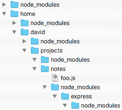
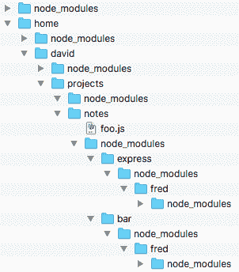
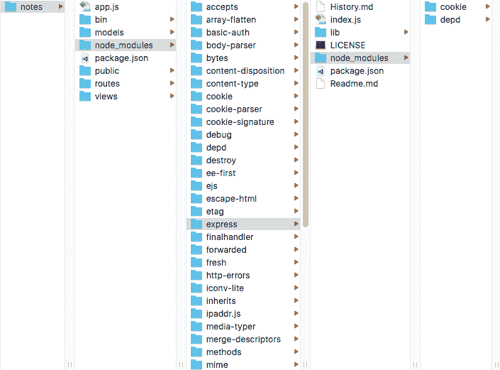
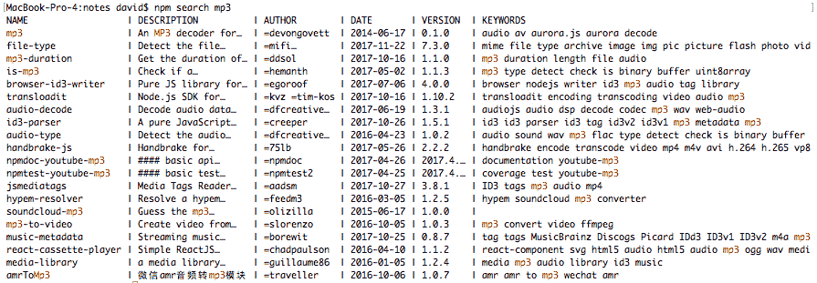
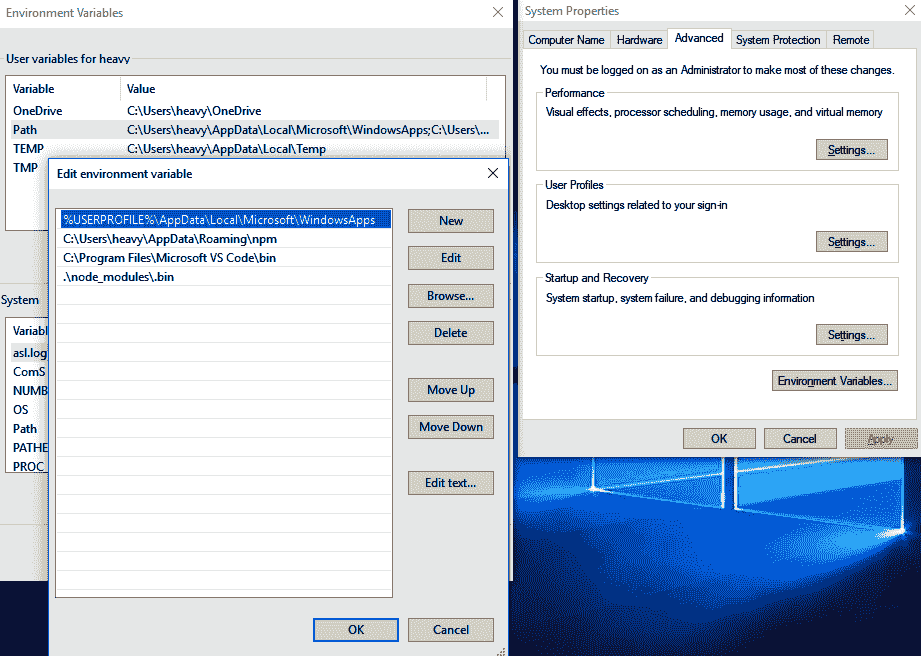

探索 Node.js 模块

模块和包是将应用程序拆分为较小部分的基本构建模块。模块封装了一些功能，主要是 JavaScript 函数，同时隐藏实现细节并为模块公开 API。模块可以由第三方分发并安装供我们的模块使用。已安装的模块称为包。

npm 包存储库是一个庞大的模块库，供所有 Node.js 开发人员使用。在该库中有数十万个包，可以加速您的应用程序开发。

由于模块和包是应用程序的构建模块，了解它们的工作原理对于您在 Node.js 中取得成功至关重要。在本章结束时，您将对 CommonJS 和 ES6 模块有扎实的基础，了解如何在应用程序中构建模块，如何管理第三方包的依赖关系，以及如何发布自己的包。

在本章中，我们将涵盖以下主题：

+   所有类型的 Node.js 模块的定义以及如何构建简单和复杂的模块

+   使用 CommonJS 和 ES2015/ES6 模块以及何时使用每种模块

+   了解 Node.js 如何找到模块和已安装的包，以便更好地构建您的应用程序

+   使用 npm 包管理系统（以及 Yarn）来管理应用程序的依赖关系，发布包，并记录项目的管理脚本

所以，让我们开始吧。

# 第五章：定义 Node.js 模块

模块是构建 Node.js 应用程序的基本构建模块。Node.js 模块封装了函数，将细节隐藏在一个受保护的容器内，并公开明确定义的 API。

当 Node.js 创建时，当然还不存在 ES6 模块系统。因此，Ryan Dahl 基于 CommonJS 标准创建了 Node.js 模块系统。到目前为止，我们看到的示例都是按照该格式编写的模块。随着 ES2015/ES2016，为所有 JavaScript 实现创建了一个新的模块格式。这种新的模块格式被前端工程师用于其浏览器 JavaScript 代码，也被 Node.js 工程师和其他 JavaScript 实现使用。

由于 ES6 模块现在是标准模块格式，Node.js **技术指导委员会**（**TSC**）承诺支持 ES6 模块与 CommonJS 格式的一流支持。从 Node.js 14.x 开始，Node.js TSC 兑现了这一承诺。

在 Node.js 平台上应用程序中使用的每个源文件都是一个*模块*。在接下来的几节中，我们将检查不同类型的模块，从 CommonJS 模块格式开始。

在本书中，我们将传统的 Node.js 模块标识为 CommonJS 模块，新的模块格式标识为 ES6 模块。

要开始探索 Node.js 模块，当然要从头开始。

## 检查传统的 Node.js 模块格式

我们已经在上一章中看到了 CommonJS 模块的实际应用。现在是时候看看它们是什么以及它们是如何工作的了。

在第二章中的`ls.js`示例中，*设置 Node.js*，我们编写了以下代码来引入`fs`模块，从而可以访问其函数：

```

The `require` function is given a *module identifier,* and it searches for the module named by that identifier. If found, it loads the module definition into the Node.js runtime and making its functions available. In this case, the `fs` object contains the code (and data) exported by the `fs` module. The `fs` module is part of the Node.js core and provides filesystem functions.

By declaring `fs` as `const`, we have a little bit of assurance against making coding mistakes. We could mistakenly assign a value to `fs`, and then the program would fail, but as a `const` we know the reference to the `fs` module will not be changed.

The file, `ls.js`, is itself a module because every source file we use on Node.js is a module. In this case, it does not export anything but is instead a script that consumes other modules.

What does it mean to say the `fs` object contains the code exported by the `fs` module? In a CommonJS module, there is an object, `module`, provided by Node.js, with which the module's author describes the module. Within this object is a field, `module.exports`, containing the functions and data exported by the module. The return value of the `require` function is the object. The object is the interface provided by the module to other modules. Anything added to the `module.exports` object is available to other pieces of code, and everything else is hidden. As a convenience, the `module.exports` object is also available as `exports`. 

The `module` object contains several fields that you might find useful. Refer to the online Node.js documentation for details.

Because `exports` is an alias of `module.exports`, the following two lines of code are equivalent:

```

您可以选择使用`module.exports`还是`exports`。但是，绝对不要做以下类似的事情：

```

Any assignment to `exports` will break the alias, and it will no longer be equivalent to `module.exports`. Assignments to `exports.something` are okay, but assigning to `exports` will cause failure. If your intent is to assign a single object or function to be returned by `require`, do this instead:

```

有些模块导出单个函数，因为这是模块作者设想提供所需功能的方式。

当我们说`ls.js`没有导出任何内容时，我们的意思是`ls.js`没有将任何内容分配给`module.exports`。

为了给我们一个简单的例子，让我们创建一个简单的模块，名为`simple.js`：

```

We have one variable, `count`, which is not attached to the `exports` object, and a function, `next`, which is attached. Because `count` is not attached to `exports`, it is private to the module. 

Any module can have private implementation details that are not exported and are therefore not available to any other code.

Now, let's use the module we just wrote:

```

模块中的`exports`对象是由`require('./simple')`返回的对象。因此，每次调用`s.next`都会调用`simple.js`中的`next`函数。每次返回（并递增）局部变量`count`的值。试图访问私有字段`count`会显示它在模块外部不可用。

这就是 Node.js 解决基于浏览器的 JavaScript 的全局对象问题的方式。看起来像全局变量的变量只对包含该变量的模块是全局的。这些变量对任何其他代码都不可见。

Node.js 包格式源自 CommonJS 模块系统（[`commonjs.org`](http://commonjs.org)）。在开发时，CommonJS 团队的目标是填补 JavaScript 生态系统中的空白。当时，没有标准的模块系统，使得打包 JavaScript 应用程序变得更加棘手。`require`函数、`exports`对象和 Node.js 模块的其他方面直接来自 CommonJS `Modules/1.0`规范。

`module`对象是由 Node.js 注入的全局模块对象。它还注入了另外两个变量：`__dirname`和`__filename`。这些对于帮助模块中的代码知道其在文件系统中的位置非常有用。主要用于使用相对于模块位置的路径加载其他文件。

例如，可以将像 CSS 或图像文件这样的资源存储在相对于模块的目录中。然后应用框架可以通过 HTTP 服务器提供这些文件。在 Express 中，我们可以使用以下代码片段来实现：

```

This says that HTTP requests on the `/assets/vendor/jquery` URL are to be handled by the static handler in Express, from the contents of a directory relative to the directory containing the module. Don't worry about the details because we'll discuss this more carefully in a later chapter. Just notice that `__dirname` is useful to calculate a filename relative to the location of the module source code.

To see it in action, create a file named `dirname.js` containing the following:

```

这让我们看到我们收到的值：

```

Simple enough, but as we'll see later these values are not directly available in ES6 modules.

Now that we've got a taste for CommonJS modules, let's take a look at ES2015 modules.

## Examining the ES6/ES2015 module format

ES6 modules are a new module format designed for all JavaScript environments. While Node.js has always had a good module system, browser-side JavaScript has not. That meant the browser-side community had to use non-standardized solutions. The CommonJS module format was one of those non-standard solutions, which was borrowed for use in Node.js. Therefore, ES6 modules are a big improvement for the entire JavaScript world, by getting everyone on the same page with a common module format and mechanisms.

An issue we have to deal with is the file extension to use for ES6 modules. Node.js needs to know whether to parse using the CommonJS or ES6 module syntax. To distinguish between them, Node.js uses the file extension `.mjs` to denote ES6 modules, and `.js` to denote CommonJS modules. However, that's not the entire story since Node.js can be configured to recognize the `.js` files as ES6 modules. We'll give the exact particulars later in this chapter.

The ES6 and CommonJS modules are conceptually similar. Both support exporting data and functions from a module, and both support hiding implementation inside a module. But they are very different in many practical ways.

Let's start with defining an ES6 module. Create a file named `simple2.mjs` in the same directory as the `simple.js` example that we looked at earlier:

```

这与`simple.js`类似，但添加了一些内容以演示更多功能。与以前一样，`count`是一个未导出的私有变量，`next`是一个导出的函数，用于递增`count`。

`export`关键字声明了从 ES6 模块中导出的内容。在这种情况下，我们有几个导出的函数和两个导出的变量。`export`关键字可以放在任何顶层声明的前面，比如变量、函数或类声明：

```

The effect of this is similar to the following:

```

两者的目的本质上是相同的：使函数或其他对象可供模块外部的代码使用。但是，我们不是显式地创建一个对象`module.exports`，而是简单地声明要导出的内容。例如`export function next()`这样的语句是一个命名导出，意味着导出的函数（就像这里）或对象有一个名称，模块外部的代码使用该名称来访问对象。正如我们在这里看到的，命名导出可以是函数或对象，也可以是类定义。

模块的*默认导出*是使用`export default`定义的，每个模块只能导出一次。默认导出是模块外部代码在使用模块对象本身时访问的内容，而不是使用模块中的导出之一。

你也可以先声明一些东西，比如`squared`函数，然后再导出它。

现在让我们看看如何使用 ES2015 模块。创建一个名为`simpledemo.mjs`的文件，内容如下：

```

The `import` statement does what it says: it imports objects exported from a module. Because it uses the `import * as foo` syntax, it imports everything from the module, attaching everything to an object, in this case named `simple2`. This version of the `import` statement is most similar to a traditional Node.js `require` statement because it creates an object with fields containing the objects exported from the module.

This is how the code executes:

```

过去，ES6 模块格式是隐藏在一个选项标志`--experimental-module`后面的，但是从 Node.js 13.2 开始，不再需要该标志。访问`default`导出是通过访问名为`default`的字段来实现的。访问导出的值，比如`meaning`字段，是不需要括号的，因为它是一个值而不是一个函数。

现在来看一种从模块中导入对象的不同方法，创建另一个文件，名为`simpledemo2.mjs`，内容如下：

```

In this case, the import is treated similarly to an ES2015 destructuring assignment. With this style of import, we specify exactly what is to be imported, rather than importing everything. Furthermore, instead of attaching the imported things to a common object, and therefore executing `simple2.next()`, the imported things are executed using their simple name, as in `next()`.

The import for `default as simple` is the way to declare an alias of an imported thing. In this case, it is necessary so that the default export has a name other than *default*. 

Node.js modules can be used from the ES2015 `.mjs` code. Create a file named `ls.mjs` containing the following:

```

这是第二章中`ls.js`示例的重新实现，*设置 Node.js*。在这两种情况下，我们都使用了`fs`包的`promises`子模块。要使用`import`语句，我们访问`fs`模块中的`promises`导出，并使用`as`子句将`fs.promises`重命名为`fs`。这样我们就可以使用异步函数而不是处理回调。

否则，我们有一个`async`函数`listFiles`，它执行文件系统操作以从目录中读取文件名。因为`listFiles`是`async`，它返回一个 Promise，我们必须使用`.catch`子句捕获任何错误。

执行脚本会得到以下结果：

```

The last thing to note about ES2015 module code is that the `import` and `export` statements must be top-level code. Try putting an `export` inside a simple block like this:

```

这个无辜的代码导致了一个错误：

```

While there are a few more details about the ES2015 modules, these are their most important attributes.

Remember that the objects injected into CommonJS modules are not available to ES6 modules. The `__dirname` and `__filename` objects are the most important, since there are many cases where we compute a filename relative to the currently executing module. Let us explore how to handle that issue.

### Injected objects in ES6 modules

Just as for CommonJS modules, certain objects are injected into ES6 modules. Furthermore, ES6 modules do not receive the `__dirname`, and `__filename` objects or other objects that are injected into CommonJS modules.

The `import.meta` meta-property is the only value injected into ES6 modules. In Node.js it contains a single field, `url`. This is the URL from which the currently executing module was loaded.

Using `import.meta.url`, we can compute `__dirname` and `__filename`.

### Computing the missing __dirname variable in ES6 modules

If we make a duplicate of `dirname.js` as `dirname.mjs`, so it will be interpreted as an ES6 module, we get the following:

```

由于`__dirname`和`__filename`不是 JavaScript 规范的一部分，它们在 ES6 模块中不可用。输入`import.meta.url`对象，我们可以计算`__dirname`和`__filename`。要看它的运行情况，创建一个包含以下内容的`dirname-fixed.mjs`文件：

```

We are importing a couple of useful functions from the `url` and `path` core packages. While we could take the `import.meta.url` object and do our own computations, these functions already exist. The computation is to extract the pathname portion of the module URL, to compute `__filename`, and then use `dirname` to compute `__dirname`.

```

我们看到模块的`file://` URL，以及使用内置核心函数计算的`__dirname`和`__filename`的值。

我们已经讨论了 CommonJS 和 ES6 模块格式，现在是时候讨论在应用程序中同时使用它们了。

## 同时使用 CommonJS 和 ES6 模块

Node.js 支持 JavaScript 代码的两种模块格式：最初为 Node.js 开发的 CommonJS 格式，以及新的 ES6 模块格式。这两种格式在概念上是相似的，但在实际上有许多不同之处。因此，我们将面临在同一个应用程序中同时使用两种格式的情况，并需要知道如何进行操作。

首先是文件扩展名的问题，以及识别要使用哪种模块格式。以下情况下使用 ES6 模块格式：

+   文件名以`.mjs`结尾的文件。

+   如果`package.json`有一个名为`type`且值为`module`的字段，则以`.js`结尾的文件。

+   如果`node`二进制文件使用`--input-type=module`标志执行，则通过`--eval`或`--print`参数传递的任何代码，或者通过 STDIN（标准输入）传入的代码，都将被解释为 ES6 模块代码。

这是相当直截了当的。ES6 模块在以`.mjs`扩展名命名的文件中，除非你在`package.json`中声明包默认使用 ES6 模块，这样以`.js`扩展名命名的文件也会被解释为 ES6 模块。

以下情况下使用 CommonJS 模块格式：

+   文件名以`.cjs`结尾的文件。

+   如果`package.json`不包含`type`字段，或者包含一个值为`commonjs`的`type`字段，则文件名将以`.js`结尾。

+   如果`node`二进制文件使用`--input-type`标志或`--type-type=commonjs`标志执行，则通过`--eval`或`--print`参数传递的任何代码，或者通过 STDIN（标准输入）传入的代码，都将被解释为 CommonJS 模块代码。

再次，这是直截了当的，Node.js 默认使用 CommonJS 模块来处理`.js`文件。如果包明确声明为默认使用 CommonJS 模块，则 Node.js 将把`.js`文件解释为 CommonJS。

Node.js 团队强烈建议包作者在`package.json`中包含一个`type`字段，即使类型是`commonjs`。

考虑一个具有这个声明的`package.json`：

```

This, of course, informs Node.js that the package defaults to ES6 modules. Therefore, this command interprets the module as an ES6 module:

```

这个命令将执行相同的操作，即使没有`package.json`条目：

```

If instead, the `type` field had the `commonjs`, or the `--input-type` flag specified as `commonjs`, or if both those were completely missing, then `my-module.js` would be interpreted as a CommonJS module.

These rules also apply to the `import` statement, the `import()` function, and the `require()` function. We will cover those commands in more depth in a later section. In the meantime, let's learn how the `import()` function partly resolves the inability to use ES6 modules in a CommonJS module. 

### Using ES6 modules from CommonJS using import()

The `import` statement in ES6 modules is a statement, and not a function like `require()`. This means that `import` can only be given a static string, and you cannot compute the module identifier to import. Another limitation is that `import` only works in ES6 modules, and therefore a CommonJS module cannot load an ES6 module. Or, can it?

Since the `import()` function is available in both CommonJS and ES6 modules, that means we should be able to use it to import ES6 modules in a CommonJS module. 

To see how this works, create a file named `simple-dynamic-import.js` containing the following:

```

这是一个使用我们之前创建的 ES6 模块的 CommonJS 模块。它只是调用了一些函数，除了它在我们之前说过的只有 ES6 模块中才能使用`import`之外，没有什么激动人心的地方。让我们看看这个模块的运行情况：

```

This is a CommonJS module successfully executing code contained in an ES6 module simply by using `import()`.

Notice that `import()` was called not in the global scope of the module, but inside an async function. As we saw earlier, the ES6 module keyword statements like `export` and `import` must be called in the global scope. However, `import()` is an asynchronous function, limiting our ability to use it in the global scope.

The `import` statement is itself an asynchronous process, and by extension the `import()` function is asynchronous, while the Node.js `require()` function is synchronous. 

In this case, we executed `import()` inside an `async` function using the `await` keyword. Therefore, even if `import()` were used in the global scope, it would be tricky getting a global-scope variable to hold the reference to that module. To see, why let's rewrite that example as `simple-dynamic-import-fail.js`:

```

这是相同的代码，但在全局范围内运行。在全局范围内，我们不能使用`await`关键字，所以我们应该期望`simple2`将包含一个挂起的 Promise。运行脚本会导致失败：

```

We see that `simple2` does indeed contain a pending Promise, meaning that `import()` has not yet finished. Since `simple2` does not contain a reference to the module, attempts to call the exported function fail.

The best we could do in the global scope is to attach the `.then` and `.catch` handlers to the `import()` function call. That would wait until the Promise transitions to either a success or failure state, but the loaded module would be inside the callback function. We'll see this example later in the chapter.

Let's now see how modules hide implementation details.

## Hiding implementation details with encapsulation in CommonJS and ES6 modules

We've already seen a couple of examples of how modules hide implementation details with the `simple.js` example and the programs we examined in Chapter 2, *Setting up Node.js*. Let's take a closer look.

Node.js modules provide a simple encapsulation mechanism to hide implementation details while exposing an API. To review, in CommonJS modules the exposed API is assigned to the `module.exports` object, while in ES6 modules the exposed API is declared with the `export` keyword. Everything else inside a module is not available to code outside the module.

In practice, CommonJS modules are treated as if they were written as follows:

```

因此，模块内的一切都包含在一个匿名的私有命名空间上下文中。这就解决了全局对象问题：模块中看起来全局的一切实际上都包含在一个私有上下文中。这也解释了注入的变量实际上是如何注入到模块中的。它们是创建模块的函数的参数。

另一个优势是代码安全性。因为模块中的私有代码被隐藏在私有命名空间中，所以模块外部的代码或数据无法访问私有代码。

让我们来看一个封装的实际演示。创建一个名为`module1.js`的文件，其中包含以下内容：

```

Then, create a file named `module2.js`, containing the following:

```

使用这两个模块，我们可以看到每个模块都是其自己受保护的泡泡。

然后按照以下方式运行它：

```

This artificial example demonstrates encapsulation of the values in `module1.js` from those in `module2.js`. The `A` and `B` values in `module1.js` don't overwrite `A` and `B` in `module2.js` because they're encapsulated within `module1.js`. The `values` function in `module1.js` does allow code in `module2.js` access to the values; however, `module2.js` cannot directly access those values. We can modify the object `module2.js` received from `module1.js`. But doing so does not change the values within `module1.js`.

In Node.js modules can also be data, not just code.

## Using JSON modules

Node.js supports using `require('./path/to/file-name.json')` to import a JSON file in a CommonJS module. It is equivalent to the following code:

```

也就是说，JSON 文件是同步读取的，文本被解析为 JSON。生成的对象作为模块导出的对象可用。创建一个名为`data.json`的文件，其中包含以下内容：

```

Now create a file named `showdata.js` containing the following:

```

它将执行如下：

```

The `console.log` function outputs information to the Terminal. When it receives an object, it prints out the object content like this. And this demonstrates that `require` correctly read the JSON file since the resulting object matched the JSON.

In an ES6 module, this is done with the `import` statement and requires a special flag. Create a file named `showdata-es6.mjs` containing the following:

```

到目前为止，这相当于该脚本的 CommonJS 版本，但使用`import`而不是`require`。

```

Currently using `import` to load a JSON file is an experimental feature. Enabling the feature requires these command-line arguments, causing this warning to be printed. We also see that instead of `data` being an anonymous object, it is an object with the type `Module`.

Now let's look at how to use ES6 modules on some older Node.js releases.

## Supporting ES6 modules on older Node.js versions

Initially, ES6 module support was an experimental feature in Node.js 8.5 and became a fully supported feature in Node.js 14\. With the right tools, we can use it on earlier Node.js implementations. 

For an example of using Babel to transpile ES6 code for older Node.js versions, see [`blog.revillweb.com/using-es2015-es6-modules-with-babel-6-3ffc0870095b`](https://blog.revillweb.com/using-es2015-es6-modules-with-babel-6-3ffc0870095b).

The better method of using ES6 modules on Node.js 6.x is the `esm` package. Simply do the following:

```

有两种方法可以使用这个模块：

+   在 CommonJS 模块中，调用`require('esm')`。

+   在命令行中使用`--require esm`，如下所示。

在这两种情况下，效果是一样的，即加载`esm`模块。这个模块只需要加载一次，我们不必调用它的任何方法。相反，`esm`将 ES6 模块支持改装到 Node.js 运行时中，并且与 6.x 版本及更高版本兼容。

因此，我们可以使用这个模块来改装 ES6 模块支持；它不改装其他功能，比如`async`函数。成功执行`ls.mjs`示例需要对`async`函数和箭头函数的支持。由于 Node.js 6.x 不支持任何一个，`ls.mjs`示例将能够正确加载，但仍将失败，因为它使用了其他不受支持的功能。

```

It is, of course, possible to use Babel in such cases to convert the full set of ES2015+ features to run on older Node.js releases.

For more information about esm, see: 
[`medium.com/web-on-the-edge/es-modules-in-node-today-32cff914e4b`](https://medium.com/web-on-the-edge/es-modules-in-node-today-32cff914e4b). The article describes an older release of the `esm` module, at the time named `@std/esm`.

Th current documentation for the esm package is available at: [`www.npmjs.com/package/esm`](https://www.npmjs.com/package/esm).

In this section, we've learned about how to define a Node.js module and various ways to use both CommonJS and ES6 modules. But we've left out some very important things: what is the module identifier and all the ways to locate and use modules. In the next section, we cover these topics.

# Finding and loading modules using require and import

In the course of learning about modules for Node.js, we've used the `require` and `import` features without going into detail about how modules are found and all the options available. The algorithm for finding Node.js modules is very flexible. It supports finding modules that are siblings of the currently executing module, or have been installed local to the current project, or have been installed globally.

For both `require` and `import`, the command takes a *module identifier*. The algorithm Node.js uses is in charge of resolving the module identifier into a file containing the module, so that Node.js can load the module.

The official documentation for this is in the Node.js documentation, at [`nodejs.org/api/modules.html`](https://nodejs.org/api/modules.html). [The official documentation for ES6 modules also discusses how the algorithm differs, at](https://nodejs.org/api/modules.html)[`nodejs.org/api/esm.html`](https://nodejs.org/api/esm.html)[.](https://nodejs.org/api/modules.html)

Understanding the module resolution algorithm is one key to success with Node.js. This algorithm determines how best to structure the code in a Node.js application. While debugging problems with loading the correct version of a given package, we need to know how Node.js finds packages.

First, we must consider several types of modules, starting with the simple file modules we've already used.

## Understanding File modules

The CommonJS and ES6 modules we've just looked at are what the Node.js documentation describes as a **file module**. Such modules are contained within a single file, whose filename ends with `.js`, `.cjs`, `.mjs`, `.json`, or `.node`. The latter are compiled from C or C++ source code, or even other languages such as Rust, while the former are, of course, written in JavaScript or JSON. 

The *module identifier* of a file module must start with `./` or `../`. This signals Node.js that the module identifier refers to a local file. As should already be clear, this module identifier refers to a pathname relative to the currently executing module.

It is also possible to use an absolute pathname as the module identifier. In a CommonJS module, such an identifier might be `/path/to/some/directory/my-module.js`. In an ES6 module, since the module identifier is actually a URL, then we must use a `file://` URL like `file:///path/to/some/directory/my-module.mjs`. There are not many cases where we would use an absolute module identifier, but the capability does exist.

One difference between CommonJS and ES6 modules is the ability to use extensionless module identifiers. The CommonJS module loader allows us to do this, which you should save as `extensionless.js`:

```

这使用了一个无扩展名的模块标识符来加载我们已经讨论过的模块`simple.js`：

```

And we can run it with the `node` command using an extension-less module identifier.

But if we specify an extension-less identifier for an ES6 module:

```

我们收到了错误消息，清楚地表明 Node.js 无法解析文件名。同样，在 ES6 模块中，给`import`语句的文件名必须带有文件扩展名。

接下来，让我们讨论 ES6 模块标识符的另一个副作用。

### ES6 的 import 语句采用 URL

ES6 `import`语句中的模块标识符是一个 URL。有几个重要的考虑因素。

由于 Node.js 只支持`file://`URL，我们不允许从 Web 服务器检索模块。这涉及明显的安全问题，如果模块可以从`http://`URL 加载，企业安全团队将会感到焦虑。

引用具有绝对路径名的文件必须使用`file:///path/to/file.ext`语法，如前面所述。这与`require`不同，我们将使用`/path/to/file.ext`。

由于`?`和`#`在 URL 中具有特殊意义，它们对`import`语句也具有特殊意义，如下例所示：

```

This loads the module named `module-name.mjs` with a query string containing `query=1`. By default, this is ignored by the Node.js module loader, but there is an experimental loader hook feature by which you can do something with the module identifier URL.

The next type of module to consider is those baked into Node.js, the core modules.

## Understanding the Node.js core modules

Some modules are pre-compiled into the Node.js binary. These are the core Node.js modules documented on the Node.js website at [`nodejs.org/api/index.html`](https://nodejs.org/api/index.html).

They start out as source code within the Node.js build tree. The build process compiles them into the binary so that the modules are always available.

We've already seen how the core modules are used. In a CommonJS module, we might use the following:

```

在 ES6 模块中的等效代码如下：

```

In both cases, we're loading the `http` and `fs` core modules that would then be used by other code in the module.

Moving on, we will next talk about more complex module structures.

## Using a directory as a module

We commonly organize stuff into a directory structure. The stuff here is a technical term referring to internal file modules, data files, template files, documentation, tests, assets, and more. Node.js allows us to create an entry-point module into such a directory structure.

For example, with a module identifier like `./some-library` that refers to a directory, then there must be a file named `index.js`, `index.cjs`, `index.mjs`, or `index.node` in the directory. In such a case, the module loader loads the appropriate `index` module even though the module identifier did not reference a full pathname. The pathname is computed by appending the file it finds in the directory.

One common use for this is that the `index` module provides an API for a library stored in the directory and that other modules in the directory contain what's meant to be private implement details.

This may be a little confusing because the word *module* is being overloaded with two meanings. In some cases, a module is a file, and in other cases, a module is a directory containing one or more file modules.

While overloading the word *module* this way might be a little confusing, it's going to get even more so as we consider the packages we install from other sources.

## Comparing installed packages and modules

Every programming platform supports the distribution of libraries or packages that are meant to be used in a wide array of applications. For example, where the Perl community has CPAN, the Node.js community has the `npm` registry. A Node.js *installed package* is the same as we just described as a *folder as a module*, in that the package format is simply a directory containing a `package.json` file along with the code and other files comprising the package.

There is the same risk of confusion caused by overloading the word *module* since an installed package is typically the same as the *directories as modules* concept just described. Therefore, it's useful to refer to an installed package with the word *package*.

The `package.json` file describes the package. A minimal set of fields are defined by Node.js, specifically as follows:

```

`name`字段给出了包的名称。如果存在`main`字段，它将命名要在加载包时使用的 JavaScript 文件，而不是`index.js`。像 npm 和 Yarn 这样的包管理应用程序支持`package.json`中的更多字段，它们用来管理依赖关系、版本和其他一切。

如果没有`package.json`，那么 Node.js 将寻找`index.js`或`index.node`。在这种情况下，`require('some-library')`将加载`/path/to/some-library/index.js`中的文件模块。

安装的包保存在一个名为`node_modules`的目录中。当 JavaScript 源代码有`require('some-library')`或`import 'some-library'`时，Node.js 会在一个或多个`node_modules`目录中搜索以找到命名的包。

请注意，在这种情况下，模块标识符只是包名。这与我们之前学习的文件和目录模块标识符不同，因为这两者都是路径名。在这种情况下，模块标识符有点抽象，这是因为 Node.js 有一个算法来在嵌套的`node_modules`目录中找到包。

要理解这是如何工作的，我们需要深入了解算法。

## 在文件系统中找到安装的包

Node.js 包系统如此灵活的关键之一是用于搜索包的算法。

对于给定的`require`、`import()`或`import`语句，Node.js 会在包含该语句的目录中向上搜索文件系统。它正在寻找一个名为`node_modules`的目录，其中包含满足模块标识符的模块。

例如，对于名为`/home/david/projects/notes/foo.js`的源文件和请求模块标识符`bar.js`的`require`或`import`语句，Node.js 尝试以下选项：



正如刚才所说，搜索从`foo.js`所在的文件系统级别开始。Node.js 会查找名为`bar.js`的文件模块，或者包含模块的名为`bar.js`的目录，如*使用目录作为模块*中所述。Node.js 将在`foo.js`旁边的`node_modules`目录以及该文件上方的每个目录中检查这个包。但是，它不会进入任何目录，比如`express`或`express/node_modules`。遍历只会向文件系统上方移动，而不会向下移动。

虽然一些第三方包的名称以`.js`结尾，但绝大多数不是。因此，我们通常会使用`require('bar')`。通常，第三方安装的包是作为一个包含`package.json`文件和一些 JavaScript 文件的目录交付的。因此，在典型情况下，包模块标识符将是`bar`，Node.js 将在一个`node_modules`目录中找到一个名为`bar`的目录，并从该目录访问包。

在文件系统中向上搜索的这种行为意味着 Node.js 支持包的嵌套安装。一个 Node.js 包可能依赖于其他模块，这些模块将有自己的`node_modules`目录；也就是说，`bar`包可能依赖于`fred`包。包管理应用程序可能会将`fred`安装为`/home/david/projects/notes/node_modules/bar/node_modules/fred`：



在这种情况下，当`bar`包中的 JavaScript 文件使用`require('fred')`时，它的模块搜索从`/home/david/projects/notes/node_modules/bar/node_modules`开始，在那里它会找到`fred`包。但是，如果包管理器检测到`notes`中使用的其他包也使用`fred`包，包管理器将把它安装为`/home/david/projects/notes/node_modules/fred`。

因为搜索算法会在文件系统中向上查找，它会在任一位置找到`fred`。

最后要注意的是，这种`node_modules`目录的嵌套可以任意深。虽然包管理应用程序尝试在一个平面层次结构中安装包，但可能需要将它们深度嵌套。

这样做的一个原因是为了能够使用两个或更多版本的同一个包。

### 处理同一安装包的多个版本

Node.js 包标识符解析算法允许我们安装两个或更多版本的同一个包。回到假设的*notes*项目，注意`fred`包不仅为`bar`包安装，也为`express`包安装。

查看算法，我们知道`bar`软件包和`express`软件包中的`require('fred')`将分别满足于本地安装的相应`fred`软件包。

通常，软件包管理应用程序将检测`fred`软件包的两个实例并仅安装一个。但是，假设`bar`软件包需要`fred`版本 1.2，而`express`软件包需要`fred`版本 2.1。

在这种情况下，软件包管理应用程序将检测不兼容性，并安装两个版本的`fred`软件包，如下所示：

+   在`/home/david/projects/notes/node_modules/bar/node_modules`中，它将安装`fred`版本 1.2。

+   在`/home/david/projects/notes/node_modules/express/node_modules`中，它将安装`fred`版本 2.1。

当`express`软件包执行`require('fred')`或`import 'fred'`时，它将满足于`/home/david/projects/notes/node_modules/express/node_modules/fred`中的软件包。同样，`bar`软件包将满足于`/home/david/projects/notes/node_modules/bar/node_modules/fred`中的软件包。在这两种情况下，`bar`和`express`软件包都有`fred`软件包的正确版本可用。它们都不知道已安装另一个版本的`fred`。

`node_modules`目录用于应用程序所需的软件包。Node.js 还支持在全局位置安装软件包，以便它们可以被多个应用程序使用。

## 搜索全局安装的软件包

我们已经看到，使用 npm 可以执行*全局安装*软件包。例如，如果全局安装了`hexy`或`babel`等命令行工具，那么很方便。在这种情况下，软件包将安装在项目目录之外的另一个文件夹中。Node.js 有两种策略来查找全局安装的软件包。

与`PATH`变量类似，`NODE_PATH`环境变量可用于列出额外的目录，以便在其中搜索软件包。在类 Unix 操作系统上，`NODE_PATH`是一个由冒号分隔的目录列表，在 Windows 上是用分号分隔的。在这两种情况下，它类似于`PATH`变量的解释，这意味着`NODE_PATH`有一个目录名称列表，用于查找已安装的模块。

不建议使用`NODE_PATH`方法，因为如果人们不知道必须设置这个变量，可能会发生令人惊讶的行为。如果需要特定目录中的特定模块以正确运行，并且未设置该变量，应用程序可能会失败。最佳做法是明确声明所有依赖关系，对于 Node.js 来说，这意味着在`package.json`文件中列出所有依赖项，以便`npm`或`yarn`可以管理依赖项。

在刚刚描述的模块解析算法之前，已经实现了这个变量。由于该算法，`NODE_PATH`基本上是不必要的。

有三个额外的位置可以存放模块：

+   `$HOME/.node_modules`

+   `$HOME/.node_libraries`

+   `$PREFIX/lib/node`

在这种情况下，`$HOME`是您期望的（用户的主目录），而`$PREFIX`是安装 Node.js 的目录。

有人建议不要使用全局软件包。理由是希望实现可重复性和可部署性。如果您已经测试了一个应用程序，并且所有代码都方便地位于一个目录树中，您可以将该目录树复制到其他机器上进行部署。但是，如果应用程序依赖于系统其他位置神奇安装的某些其他文件，该怎么办？您会记得部署这些文件吗？应用程序的作者可能会编写文档，说明在运行*npm install*之前*安装这个*，然后*安装那个*，以及*安装其他东西*，但是应用程序的用户是否会正确地遵循所有这些步骤？

最好的安装说明是简单地运行*npm install*或*yarn install*。为了使其工作，所有依赖项必须在`package.json`中列出。

在继续之前，让我们回顾一下不同类型的模块标识符。

## 审查模块标识符和路径名

这是分布在几个部分的许多细节。因此，当使用`require`、`import()`或`import`语句时，快速回顾一下模块标识符是如何解释的是很有用的：

+   **相对模块标识符**：这些以 `./` 或 `../` 开头，绝对标识符以 `/` 开头。模块名称与 POSIX 文件系统语义相同。结果路径名是相对于正在执行的文件的位置进行解释的。也就是说，以 `./` 开头的模块标识符在当前目录中查找，而以 `../` 开头的模块标识符在父目录中查找。

+   **绝对模块标识符**：这些以 `/` （或 `file://` 用于 ES6 模块）开头，当然，会在文件系统的根目录中查找。这不是推荐的做法。

+   **顶级模块标识符**：这些不以这些字符串开头，只是模块名称。这些必须存储在`node_modules`目录中，Node.js 运行时有一个非常灵活的算法来定位正确的`node_modules`目录。

+   **核心模块**：这些与*顶级模块标识符*相同，即没有前缀，但核心模块已经预先嵌入到 Node.js 二进制文件中。

在所有情况下，除了核心模块，模块标识符都会解析为包含实际模块的文件，并由 Node.js 加载。因此，Node.js 所做的是计算模块标识符和实际文件名之间的映射关系。

不需要使用包管理器应用程序。Node.js 模块解析算法不依赖于包管理器，如 npm 或 Yarn，来设置`node_modules`目录。这些目录并没有什么神奇之处，可以使用其他方法构建包含已安装包的`node_modules`目录。但最简单的机制是使用包管理器应用程序。

一些包提供了我们可以称之为主包的子包，让我们看看如何使用它们。

## 使用深度导入模块标识符

除了像 `require('bar')` 这样的简单模块标识符外，Node.js 还允许我们直接访问包中包含的模块。使用不同的模块标识符，以模块名称开头，添加所谓的*深度导入*路径。举个具体的例子，让我们看一下 `mime` 模块（[`www.npmjs.com/package/mime`](https://www.npmjs.com/package/mime)），它处理将文件名映射到相应的 MIME 类型。

在正常情况下，你使用 `require('mime')` 来使用该包。然而，该包的作者开发了一个精简版本，省略了许多特定供应商的 MIME 类型。对于该版本，你使用 `require('mime/lite')`。当然，在 ES6 模块中，你会相应地使用 `import 'mime'` 和 `import 'mime/lite'`。

`mime/lite`是深度导入模块标识符的一个例子。

使用这样的模块标识符，Node.js 首先定位包含主要包的`node_modules`目录。在这种情况下，就是 `mime` 包。默认情况下，深度导入模块只是相对于包目录的路径名，例如，`/path/to/node_modules/mime/lite`。根据我们已经检查过的规则，它将被满足为一个名为 `lite.js` 的文件，或者一个名为 `lite` 的目录，其中包含一个名为 `index.js` 或 `index.mjs` 的文件。

但是可以覆盖默认行为，使深度导入标识符指向模块中的不同文件。

### 覆盖深度导入模块标识符

使用该包的代码所使用的深度导入模块标识符不必是包源内部使用的路径名。我们可以在 `package.json` 中放置声明，描述每个深度导入标识符的实际路径名。例如，具有内部模块命名为 `./src/cjs-module.js` 和 `./src/es6-module.mjs` 的包可以在 `package.json` 中使用此声明进行重新映射：

```

With this, code using such a package can load the inner module using `require('module-name/cjsmodule')` or `import 'module-name/es6module'`. Notice that the filenames do not have to match what's exported.

In a `package.json` file using this `exports` feature, a request for an inner module not listed in `exports` will fail. Supposing the package has a `./src/hidden-module.js` file, calling `require('module-name/src/hidden-module.js')` will fail.

All these modules and packages are meant to be used in the context of a Node.js project. Let's take a brief look at a typical project.

## Studying an example project directory structure

A typical Node.js project is a directory containing a `package.json` file declaring the characteristics of the package, especially its dependencies. That, of course, describes a directory module, meaning that each module is its own project. At the end of the day, we create applications, for example, an Express application, and these applications depend on one or more (possibly thousands of) packages that are to be installed:



This is an Express application (we'll start using Express in Chapter 5, *Your First Express Application*) containing a few modules installed in the `node_modules` directory. A typical Express application uses `app.js` as the main module for the application, and has code and asset files distributed in the `public`, `routes`, and `views` directories. Of course, the project dependencies are installed in the `node_modules` directory.

But let's focus on the content of the `node_modules` directory versus the actual project files. In this screenshot, we've selected the `express` package. Notice it has a `package.json` file and there is an `index.js` file. Between those two files, Node.js will recognize the `express` directory as a module, and calling `require('express')` or `import 'express'` will be satisfied by this directory.

The `express` directory has its own `node_modules` directory, in which are installed two packages. The question is, why are those packages installed in `express/node_modules` rather than as a sibling of the `express` package?

Earlier we discussed what happens if two modules (modules A and B) list a dependency on different versions of the same module (C). In such a case, the package manager application will install two versions of C, one as `A/node_modules/C` and the other as `B/node_modules/C`. The two copies of C are thus located such that the module search algorithm will cause module A and module B to have the correct version of module C.

That's the situation we see with `express/node_modules/cookie`. To verify this, we can use an `npm` command to query for all references to the module:

```

这表示 `cookie-parser` 模块依赖于 `cookie` 的 0.1.3 版本，而 Express 依赖于 0.1.5 版本。

现在我们可以认识到模块是什么，以及它们如何在文件系统中找到，让我们讨论何时可以使用每种方法来加载模块。

## 使用 require、import 和 import() 加载模块

显然，CommonJS 模块中使用 `require`，ES6 模块中使用 `import`，但有一些细节需要讨论。我们已经讨论了 CommonJS 和 ES6 模块之间的格式和文件名差异，所以让我们在这里专注于加载模块。

`require` 函数仅在 CommonJS 模块中可用，用于加载 CommonJS 模块。该模块是同步加载的，也就是说当 `require` 函数返回时，模块已完全加载。

默认情况下，CommonJS 模块无法加载 ES6 模块。但正如我们在 `simple-dynamic-import.js` 示例中看到的，CommonJS 模块可以使用 `import()` 加载 ES6 模块。由于 `import()` 函数是一个异步操作，它返回一个 Promise，因此我们不能将结果模块用作顶级对象。但我们可以在函数内部使用它：

```

And at the top-level of a Node.js script, the best we can do is the following:

```

这与 `simple-dynamic-import.js` 示例相同，但我们明确处理了 `import()` 返回的 Promise，而不是使用异步函数。虽然我们可以将 `simple2` 赋给全局变量，但使用该变量的其他代码必须适应赋值可能尚未完成的可能性。

`import()` 提供的模块对象包含在 ES6 模块中使用 `export` 语句导出的字段和函数。正如我们在这里看到的，默认导出具有 `default` 名称。

换句话说，在 CommonJS 模块中使用 ES6 模块是可能的，只要我们等待模块完成加载后再使用它。

`import` 语句用于加载 ES6 模块，仅在 ES6 模块内部有效。您传递给 `import` 语句的模块说明符被解释为 URL。

ES6 模块可以有多个命名导出。在我们之前使用的 `simple2.mjs` 中，这些是函数 `next`、`squared` 和 `hello`，以及值 `meaning` 和 `nocount`。ES6 模块可以有单个默认导出，就像我们在 `simple2.mjs` 中看到的那样。

通过 `simpledemo2.mjs`，我们看到可以只从模块中导入所需的内容：

```

In this case, we use the exports as just the name, without referring to the module: `simple()`, `hello()`, and `next()`.

It is possible to import just the default export:

```

在这种情况下，我们可以调用函数为 `simple()`。我们还可以使用所谓的命名空间导入；这类似于我们导入 CommonJS 模块的方式：

```

In this case, each property exported from the module is a property of the named object in the `import` statement. 

An ES6 module can also use `import` to load a CommonJS module. Loading the `simple.js` module we used earlier is accomplished as follows:

```

这类似于 ES6 模块所示的 *默认导出* 方法，我们可以将 CommonJS 模块内的 `module.exports` 对象视为默认导出。实际上，`import` 可以重写为以下形式：

```

This demonstrates that the CommonJS `module.exports` object is surfaced as `default` when imported.

We've learned a lot about using modules in Node.js. This included the different types of modules, and how to find them in the file system. Our next step is to learn about package management applications and the npm package repository.

# Using npm – the Node.js package management system

As described in Chapter 2, *Setting **up **Node.js*, npm is a package management and distribution system for Node.js. It has become the de facto standard for distributing modules (packages) for use with Node.js. Conceptually, it's similar to tools such as `apt-get` (Debian), `rpm`/`yum` (Red Hat/Fedora), MacPorts/Homebrew (macOS), CPAN (Perl), or PEAR (PHP). Its purpose is to publish and distributing Node.js packages over the internet using a simple command-line interface. In recent years, it has also become widely used for distributing front-end libraries like jQuery and Bootstrap that are not Node.js modules. With npm, you can quickly find packages to serve specific purposes, download them, install them, and manage packages you've already installed.

The `npm` application extends on the package format for Node.js, which in turn is largely based on the CommonJS package specification. It uses the same `package.json` file that's supported natively by Node.js, but with additional fields for additional functionality.

## The npm package format

An npm package is a directory structure with a `package.json` file describing the package. This is exactly what was referred to earlier as a directory module, except that npm recognizes many more `package.json` tags than Node.js does. The starting point for npm's `package.json` file is the CommonJS Packages/1.0 specification. The documentation for the npm `package.json` implementation is accessed using the following command:

```

一个基本的 `package.json` 文件如下：

```

Npm recognizes many more fields than this, and we'll go over some of them in the coming sections. The file is in JSON format, which, as a JavaScript programmer, you should be familiar with.

There is a lot to cover concerning the npm `package.json` format, and we'll do so over the following sections.

## Accessing npm helpful documentation

The main `npm` command has a long list of subcommands for specific package management operations. These cover every aspect of the life cycle of publishing packages (as a package author), and downloading, using, or removing packages (as an npm consumer).

You can view the list of these commands just by typing `npm` (with no arguments). If you see one you want to learn more about, view the help information:

```

帮助文本将显示在您的屏幕上。

npm 网站上也提供了帮助信息：[`docs.npmjs.com/cli-documentation/`](https://docs.npmjs.com/cli-documentation/)。

在查找和安装 Node.js 包之前，我们必须初始化项目目录。

## 使用 npm init 初始化 Node.js 包或项目

npm 工具使得初始化 Node.js 项目目录变得容易。这样的目录包含至少一个 `package.json` 文件和一个或多个 Node.js JavaScript 文件。

因此，所有 Node.js 项目目录都是模块，根据我们之前学到的定义。然而，在许多情况下，Node.js 项目并不打算导出任何功能，而是一个应用程序。这样的项目可能需要其他 Node.js 包，并且这些包将在`package.json`文件中声明，以便使用 npm 轻松安装。Node.js 项目的另一个常见用例是一个旨在供其他 Node.js 包或应用程序使用的功能包。这些包也包括一个`package.json`文件和一个或多个 Node.js JavaScript 文件，但在这种情况下，它们是导出函数的 Node.js 模块，可以使用`require`、`import()`或`import`加载。

这意味着初始化 Node.js 项目目录的关键是创建`package.json`文件。

`package.json`文件可以手动创建 - 毕竟它只是一个 JSON 文件 - npm 工具提供了一个方便的方法：

```

In a blank directory, run `npm init`, answer the questions, and as quick as that you have the starting point for a Node.js project.

This is, of course, a starting point, and as you write the code for your project it will often be necessary to use other packages.

## Finding npm packages

By default, `npm` packages are retrieved over the internet from the public package registry maintained on [`npmjs.com`](http://npmjs.com). If you know the module name, it can be installed simply by typing the following:

```

但是如果您不知道模块名称怎么办？如何发现有趣的模块？网站[`npmjs.com`](http://npmjs.com)发布了一个可搜索的模块注册表索引。npm 包还具有命令行搜索功能，可以查询相同的索引：



当然，在找到一个模块后，它会被安装如下：

```

The npm repository uses a few `package.json` fields to aid in finding packages.

### The package.json fields that help finding packages

For a package to be easily found in the npm repository requires a good package name, package description, and keywords. The npm search function scans those package attributes and presents them in search results.

The relevant `package.json` fields are as follows:

```

`npm view`命令向我们显示了给定包的`package.json`文件中的信息，并且使用`--json`标志，我们可以看到原始的 JSON 数据。

`name`标签当然是包名，它在 URL 和命令名称中使用，因此选择一个对两者都安全的名称。如果您希望在公共`npm`存储库中发布一个包，最好通过在[`npmjs.com`](https://npmjs.com)上搜索或使用`npm search`命令来检查特定名称是否已被使用。

`description`标签是一个简短的描述，旨在作为包的简要描述。

在 npm 搜索结果中显示的是名称和描述标签。

`keywords`标签是我们列出包的属性的地方。npm 网站包含列出使用特定关键字的所有包的页面。当搜索包时，这些关键字索引非常有用，因为它们将相关的包列在一个地方，因此在发布包时，着陆在正确的关键字页面上是很有用的。

另一个来源是`README.md`文件的内容。这个文件应该被添加到包中，以提供基本的包文档。这个文件显示在`npmjs.com`上的包页面上，因此对于这个文件来说，说服潜在用户实际使用它是很重要的。正如文件名所示，这是一个 Markdown 文件。

一旦找到要使用的包，您必须安装它才能使用该包。

## 安装 npm 包

`npm install`命令使得在找到梦寐以求的包后安装变得容易，如下所示：

```

The named module is installed in `node_modules` in the current directory. During the installation process, the package is set up. This includes installing any packages it depends on and running the `preinstall` and `postinstall` scripts. Of course, installing the dependent packages also involves the same installation process of installing dependencies and executing pre-install and post-install scripts. 

Some packages in the npm repository have a package *scope* prepended to the package name. The package name in such cases is presented as `@scope-name/package-name`, or, for example, `@akashacms/plugins-footnotes`. In such a package, the `name` field in `package.json` contains the full package name with its `@scope`.

We'll discuss dependencies and scripts later. In the meantime, we notice that a version number was printed in the output, so let's discuss package version numbers.

## Installing a package by version number

Version number matching in npm is powerful and flexible. With it, we can target a specific release of a given package or any version number range. By default, npm installs the latest version of the named package, as we did in the previous section. Whether you take the default or specify a version number, npm will determine what to install.

The package version is declared in the `package.json` file, so let's look at the relevant fields:

```

`version`字段显然声明了当前包的版本。`dist-tags`字段列出了包维护者可以使用的符号标签，以帮助用户选择正确的版本。这个字段由`npm dist-tag`命令维护。

`npm install`命令支持这些变体：

```

The last two are what they sound like. You can specify `express@4.16.2` to target a precise version, or `express@">4.1.0 < 5.0"` to target a range of Express V4 versions. We might use that specific expression because Express 5.0 might include breaking changes.

The version match specifiers include the following choices:

*   **Exact version match**: 1.2.3
*   **At least version N**: >1.2.3
*   **Up to version N**: <1.2.3
*   **Between two releases**: >=1.2.3 <1.3.0

The `@tag` attribute is a symbolic name such as `@latest`, `@stable`, or `@canary`. The package owner assigns these symbolic names to specific version numbers and can reassign them as desired. The exception is `@latest`, which is updated whenever a new release of the package is published.

For more documentation, run these commands: `npm help json` and `npm help npm-dist-tag`.

In selecting the correct package to use, sometimes we want to use packages that are not in the npm repository.

## Installing packages from outside the npm repository

As awesome as the npm repository is, we don't want to push everything we do through their service. This is especially true for internal development teams who cannot publish their code for all the world to see. Fortunately, Node.js packages can be installed from other locations. Details about this are in `npm help package.json` in the `dependencies` section. Some examples are as follows:

*   **URL**: You can specify any URL that downloads a tarball, that is, a `.tar.gz` file. For example, GitHub or GitLab repositories can easily export a tarball URL. Simply go to the Releases tab to find them.
*   **Git URL**: Similarly, any Git repository can be accessed with the right URL, for example:

```

+   **GitHub 快捷方式**：对于 GitHub 存储库，您可以只列出存储库标识符，例如`expressjs/express`。可以使用`expressjs/express#tag-name`引用标签或提交。

+   **GitLab、BitBucket 和 GitHub URL 快捷方式**：除了 GitHub 快捷方式外，npm 还支持特定 Git 服务的特殊 URL 格式，如`github:user/repo`、`bitbucket:user/repo`和`gitlab:user/repo`。

+   **本地文件系统**：您可以使用 URL 从本地目录安装，格式为：`file:../../path/to/dir`。

有时，我们需要安装一个包，以供多个项目使用，而不需要每个项目都安装该包。

## 全局包安装

在某些情况下，您可能希望全局安装一个模块，以便可以从任何目录中使用它。例如，Grunt 或 Babel 构建工具非常有用，您可能会发现如果这些工具全局安装会很有用。只需添加`-g`选项：

```

If you get an error, and you're on a Unix-like system (Linux/Mac), you may need to run this with `sudo`:

```

当然，这种变体会以提升的权限运行`npm install`。

npm 网站提供了更多信息的指南，网址为[`docs.npmjs.com/resolving-eacces-permissions-errors-when-installing-packages-globally`](https://docs.npmjs.com/resolving-eacces-permissions-errors-when-installing-packages-globally)。

如果本地软件包安装到`node_modules`中，全局软件包安装会在哪里？在类 Unix 系统上，它会安装到`PREFIX/lib/node_modules`中，在 Windows 上，它会安装到`PREFIX/node_modules`中。在这种情况下，`PREFIX`表示安装 Node.js 的目录。您可以按以下方式检查目录的位置：

```

The algorithm used by Node.js for the `require` function automatically searches the directory for packages if the package is not found elsewhere.

ES6 modules do not support global packages.

Many believe it is not a good idea to install packages globally, which we will look at next.

### Avoiding global module installation

Some in the Node.js community now frown on installing packages globally. One rationale is that a software project is more reliable if all its dependencies are explicitly declared. If a build tool such as Grunt is required but is not explicitly declared in `package.json`, the users of the application would have to receive instructions to install Grunt, and they would have to follow those instructions. 

Users being users, they might skip over the instructions, fail to install the dependency, and then complain the application doesn't work. Surely, most of us have done that once or twice.

It's recommended to avoid this potential problem by installing everything locally via one mechanism—the `npm install` command.

There are two strategies we use to avoid using globally installed Node.js packages. For the packages that install commands, we can configure the `PATH` variable, or use `npx` to run the command. In some cases, a package is used only during development and can be declared as such in `package.json`.

## Maintaining package dependencies with npm

The `npm install` command by itself, with no package name specified, installs the packages listed in the `dependencies` section of `package.json`. Likewise, the `npm update` command compares the installed packages against the dependencies and against what's available in the npm repository and updates any package that is out of date in regards to the repository. 

These two commands make it easy and convenient to set up a project, and to keep it up to date as dependencies are updated. The package author simply lists all the dependencies, and npm installs or updates the dependencies required for using the package. What happens is npm looks in `package.json` for the `dependencies` or `devDependencies` fields, and it works out what to do from there.

You can manage the dependencies manually by editing `package.json`. Or you can use npm to assist you with editing the dependencies. You can add a new dependency like so:

```

使用`--save`标志，npm 将在`package.json`中添加一个`dependencies`标签：

```

With the added dependency, when your application is installed, `npm` will now install the package along with any other `dependencies` listed in `package.json` file.

The `devDependencies` lists modules used during development and testing. The field is initialized the same as the preceding one, but with the `--save-dev` flag. The `devDependencies` can be used to avoid some cases where one might instead perform a global package install.

By default, when `npm install` is run, modules listed in both `dependencies` and `devDependencies` are installed. Of course, the purpose of having two dependency lists is to control when each set of dependencies is installed.

```

这将安装“生产”版本，这意味着只安装`dependencies`中列出的模块，而不安装`devDependencies`中的任何模块。例如，如果我们在开发中使用像 Babel 这样的构建工具，该工具就不应该在生产环境中安装。

虽然我们可以在`package.json`中手动维护依赖关系，但 npm 可以为我们处理这些。

### 自动更新 package.json 的依赖关系

使用 npm@5（也称为 npm 版本 5），一个变化是不再需要向`npm install`命令添加`--save`。相反，`npm`默认会像您使用了`--save`命令一样操作，并会自动将依赖项添加到`package.json`中。这旨在简化使用`npm`，可以说`npm`现在更方便了。与此同时，`npm`自动修改`package.json`对您来说可能会非常令人惊讶和不便。可以使用`--no-save`标志来禁用此行为，或者可以使用以下方法永久禁用：

```

The `npm config` command supports a long list of settable options for tuning the behavior of npm. See `npm help config` for the documentation and `npm help 7 config` for the list of options.

Now let's talk about the one big use for package dependencies: to fix or avoid bugs.

### Fixing bugs by updating package dependencies

Bugs exist in every piece of software. An update to the Node.js platform may break an existing package, as might an upgrade to packages used by the application. Your application may trigger a bug in a package it uses. In these and other cases, fixing the problem might be as simple as updating a package dependency to a later (or earlier) version.

First, identify whether the problem exists in the package or in your code. After determining it's a problem in another package, investigate whether the package maintainers have already fixed the bug. Is the package hosted on GitHub or another service with a public issue queue? Look for an open issue on this problem. That investigation will tell you whether to update the package dependency to a later version. Sometimes, it will tell you to revert to an earlier version; for example, if the package maintainer introduced a bug that doesn't exist in an earlier version.

Sometimes, you will find that the package maintainers are unprepared to issue a new release. In such a case, you can fork their repository and create a patched version of their package. In such a case, your package might use a Github URL referencing your patched package.

One approach to fixing this problem is **pinning** the package version number to one that's known to work. You might know that version 6.1.2 was the last release against which your application functioned and that starting with version 6.2.0 your application breaks. Hence, in `package.json`:

```

这将冻结您对特定版本号的依赖。然后，您可以自由地花时间更新您的代码以适应模块的后续版本。一旦您的代码更新了，或者上游项目更新了，就相应地更改依赖关系。

在`package.json`中列出依赖项时，很容易变懒，但这会导致麻烦。

## 明确指定软件包依赖版本号

正如我们在本章中已经说过多次的那样，明确声明您的依赖关系是一件好事。我们已经提到过这一点，但值得重申并看看 npm 如何简化这一点。

第一步是确保您的应用程序代码已经检入源代码存储库。您可能已经知道这一点，并且甚至打算确保所有内容都已检入。对于 Node.js，每个模块应该有自己的存储库，而不是将每一个代码片段都放在一个存储库中。

然后，每个模块可以按照自己的时间表进行进展。一个模块的故障很容易通过在`package.json`中更改版本依赖来撤消。

下一步是明确声明每个模块的所有依赖关系。目标是简化和自动化设置每个模块的过程。理想情况下，在 Node.js 平台上，模块设置就像运行`npm install`一样简单。

任何额外所需的步骤都可能被遗忘或执行不正确。自动设置过程消除了几种潜在的错误。

通过`package.json`的`dependencies`和`devDependencies`部分，我们不仅可以明确声明依赖关系，还可以指定版本号。

懒惰地声明依赖关系的方法是在版本字段中放入`*`。这将使用 npm 存储库中的最新版本。这似乎有效，直到有一天，该软件包的维护者引入了一个 bug。你会输入`npm update`，突然间你的代码就无法工作了。你会跳转到软件包的 GitHub 网站，查看问题队列，可能会看到其他人已经报告了你所看到的问题。其中一些人会说他们已经固定在之前的版本上，直到这个 bug 被修复。这意味着他们的`package.json`文件不依赖于最新版本的`*`，而是依赖于在 bug 产生之前的特定版本号。

不要做懒惰的事情，做明智的事情。

明确声明依赖关系的另一个方面是不隐式依赖全局软件包。之前，我们说过 Node.js 社区中有些人警告不要在全局目录中安装模块。这可能看起来像在应用程序之间共享代码的一种简便方法。只需全局安装，你就不必在每个应用程序中安装代码。

但是，这会让部署变得更加困难吗？新的团队成员会被指示安装这里和那里的所有特殊文件来使应用程序运行吗？你会记得在所有目标机器上安装那个全局模块吗？

对于 Node.js 来说，这意味着列出`package.json`中的所有模块依赖项，然后安装指令就是简单的`npm install`，然后可能是编辑配置文件。

尽管 npm 存储库中的大多数软件包都是带有 API 的库，但有些是我们可以从命令行运行的工具。

## 安装命令的软件包

有些软件包安装命令行程序。安装这些软件包的一个副作用是，你可以在 shell 提示符下输入新的命令，或者在 shell 脚本中使用。一个例子是我们在第二章中简要使用过的`hexy`程序，*设置 Node.js*。另一个例子是广泛使用的 Grunt 或 Babel 构建工具。

明确声明所有依赖关系在`package.json`中的建议适用于命令行工具以及任何其他软件包。因此，这些软件包通常会被本地安装。这需要特别注意正确设置`PATH`环境变量。正如你可能已经知道的那样，`PATH`变量在类 Unix 系统和 Windows 上都用于列出命令行 shell 搜索命令的目录。

命令可以安装到两个地方之一：

+   **全局安装**：它安装到一个目录，比如`/usr/local`，或者 Node.js 安装的`bin`目录。`npm bin -g`命令告诉你这个目录的绝对路径名。在这种情况下，你不太可能需要修改 PATH 环境变量。

+   **本地安装**：安装到正在安装模块的`package`中的`node_modules/.bin`，`npm bin`命令告诉你该目录的绝对路径名。因为该目录不方便运行命令，所以改变 PATH 变量是有用的。

要运行命令，只需在 shell 提示符下输入命令名称。如果命令安装的目录恰好在 PATH 变量中，这样就能正确运行。让我们看看如何配置 PATH 变量以处理本地安装的命令。

### 配置 PATH 变量以处理本地安装的命令

假设我们已经安装了`hexy`命令，如下所示：

```

As a local install, this creates a command as `node_modules/.bin/hexy`. We can attempt to use it as follows:

```

但这会出错，因为命令不在`PATH`中列出的目录中。解决方法是使用完整路径名或相对路径名：

```

But obviously typing the full or partial pathname is not a user-friendly way to execute the command. We want to use the commands installed by modules, and we want a simple process for doing so. This means, we must add an appropriate value in the `PATH` variable, but what is it?

For global package installations, the executable lands in a directory that is probably already in your `PATH` variable, like `/usr/bin` or `/usr/local/bin`. Local package installations require special handling. The full path for the `node_modules/.bin` directory varies for each project, and obviously it won't work to add the full path for every `node_modules/.bin` directory to your `PATH`.

Adding `./node_modules/.bin` to the `PATH` variable (or, on Windows, `.\node_modules\.bin`) works great. Any time your shell is in the root of a Node.js project, it will automatically find locally installed commands from Node.js packages.

How we do this depends on the command shell you use and your operating system.

On a Unix-like system, the command shells are `bash` and `csh`. Your `PATH` variable would be set up in one of these ways:

```

下一步是将命令添加到你的登录脚本中，这样变量就会一直设置。在`bash`上，添加相应的行到`~/.bashrc`，在`csh`上，添加到`~/.cshrc`。

一旦完成了这一步，命令行工具就能正确执行。

### 在 Windows 上配置 PATH 变量

在 Windows 上，这个任务是通过系统范围的设置面板来处理的：



在 Windows 设置屏幕中搜索`PATH`，可以找到`系统属性`面板的这个窗格。点击`环境变量`按钮，然后选择`Path`变量，最后点击`编辑`按钮。在这个屏幕上，点击`新建`按钮添加一个条目到这个变量中，并输入`.\node_modules\.bin`如图所示。你必须重新启动任何打开的命令行窗口。一旦你这样做了，效果就会如前所示。

尽管修改 PATH 变量很容易，但我们不希望在所有情况下都这样做。

### 避免修改 PATH 变量

如果你不想始终将这些变量添加到你的`PATH`中怎么办？`npm-path`模块可能会引起你的兴趣。这是一个小程序，可以计算出适合你的 shell 和操作系统的正确`PATH`变量。查看[`www.npmjs.com/package/npm-path`](https://www.npmjs.com/package/npm-path)上的包。

另一个选择是使用`npx`命令来执行这些命令。这个工具会自动安装在`npm`命令旁边。这个命令要么执行来自本地安装包的命令，要么在全局缓存中静默安装命令：

```

Using `npx` is this easy.

Of course, once you've installed some packages, they'll go out of date and need to be updated.

## Updating packages you've installed when they're outdated

The coder codes, updating their package, leaving you in the dust unless you keep up.

To find out whether your installed packages are out of date, use the following command:

```

报告显示了当前的 npm 包、当前安装的版本，以及`npm`仓库中的当前版本。更新过时的包非常简单：

```

Specifying a package name updates just the named package. Otherwise, it updates every package that would be printed by `npm outdated`.

Npm handles more than package management, it has a decent built-in task automation system.

## Automating tasks with scripts in package.json

The `npm` command handles not just installing packages, it can also be used to automate running tasks related to the project. In `package.json`, we can add a field, `scripts`, containing one or more command strings. Originally scripts were meant to handle tasks related to installing an application, such as compiling native code, but they can be used for much more. For example, you might have a deployment task using `rsync` to copy files to a server. In `package.json`, you can add this:

```

重要的是，我们可以添加任何我们喜欢的脚本，`scripts`条目记录了要运行的命令：

```

Once it has been recorded in `scripts`, running the command is this easy.

There is a long list of "lifecycle events" for which npm has defined script names. These include the following:

*   `install`, for when the package is installed
*   `uninstall`, for when it is uninstalled
*   `test`, for running a test suite
*   `start` and `stop`, for controlling a server defined by the package

Package authors are free to define any other script they like. 

For the full list of predefined script names, see the documentation: [`docs.npmjs.com/misc/scripts`](https://docs.npmjs.com/misc/scripts)

Npm also defines a pattern for scripts that run before or after another script, namely to prepend `pre` or `post` to the script name. Therefore the `pretest` script runs before the `test` script, and the `posttest` script runs afterward.

A practical example is to run a test script in a `prepublish` script to ensure the package is tested before publishing it to the npm repository:

```

有了这个组合，如果测试作者输入`npm publish`，`prepublish`脚本将导致`test`脚本运行，然后使用`mocha`运行测试套件。

自动化所有管理任务是一个众所周知的最佳实践，即使只是为了你永远不会忘记如何运行这些任务。为每个这样的任务创建`scripts`条目不仅可以防止你忘记如何做事，还可以为他人记录管理任务。

接下来，让我们谈谈如何确保执行包的 Node.js 平台支持所需的功能。

## 声明 Node.js 版本兼容性

重要的是，你的 Node.js 软件必须在正确的 Node.js 版本上运行。主要原因是你的包运行时需要的 Node.js 平台功能必须可用。因此，包的作者必须知道哪些 Node.js 版本与包兼容，然后在`package.json`中描述这种兼容性。

这个依赖在`package.json`中使用`engines`标签声明：

```

版本字符串类似于我们可以在`dependencies`和`devDependencies`中使用的。在这种情况下，我们定义了该包与 Node.js 8.x、9.x 和 10.x 兼容。

现在我们知道如何构建一个包，让我们谈谈发布包。

## 发布 npm 包

npm 仓库中的所有这些包都来自像你一样有更好的做事方式的人。发布包非常容易入门。

关于发布包的在线文档可以在[`docs.npmjs.com/getting-started/publishing-npm-packages`](https://docs.npmjs.com/getting-started/publishing-npm-packages)找到。

还要考虑这个：[`xkcd.com/927/`](https://xkcd.com/927/)。

首先使用`npm adduser`命令在 npm 仓库中注册。你也可以在网站上注册。接下来，使用`npm login`命令登录。

最后，在包的根目录中使用`npm publish`命令。然后，退后一步，以免被涌入的粉丝踩到，或者可能不会。仓库中有数以亿计的包，每天都有数百个包被添加。要使你的包脱颖而出，你需要一些营销技巧，这是本书范围之外的另一个话题。

建议你的第一个包是一个作用域包，例如`@my-user-name/my-great-package`。

在本节中，我们学到了很多关于使用 npm 来管理和发布包。但是 npm 并不是管理 Node.js 包的唯一选择。

# Yarn 包管理系统

尽管 npm 非常强大，但它并不是 Node.js 的唯一包管理系统。因为 Node.js 核心团队并没有规定一个包管理系统，Node.js 社区可以自由地开发他们认为最好的任何系统。我们绝大多数人使用 npm 是对其价值和有用性的证明。但是，还有一个重要的竞争对手。

Yarn（参见[`yarnpkg.com/en/`](https://yarnpkg.com/en/)）是 Facebook、Google 和其他几家公司的工程师合作开发的。他们宣称 Yarn 是超快、超安全（通过使用所有内容的校验和）和超可靠（通过使用`yarn-lock.json`文件记录精确的依赖关系）。

Yarn 不是运行自己的包存储库，而是在`npmjs.com`的 npm 包存储库上运行。这意味着 Node.js 社区并没有被 Yarn 分叉，而是通过一个改进的包管理工具得到了增强。

npm 团队在 npm@5（也称为 npm 版本 5）中对 Yarn 做出了回应，通过提高性能和引入`package-lock.json`文件来提高可靠性。npm 团队在 npm@6 中实施了额外的改进。

Yarn 已经变得非常流行，并且被广泛推荐用于 npm。它们执行非常相似的功能，性能与 npm@5 并没有太大的不同。命令行选项的表述方式也有所不同。我们讨论过的 npm 的一切功能 Yarn 也都支持，尽管命令语法略有不同。Yarn 给 Node.js 社区带来的一个重要好处是，Yarn 和 npm 之间的竞争似乎正在促使 Node.js 包管理的更快进步。

为了让你开始，这些是最重要的命令：

+   `yarn add`：将一个包添加到当前包中使用

+   `yarn init`：初始化一个包的开发

+   `yarn install`：安装`package.json`文件中定义的所有依赖项

+   `yarn publish`：将包发布到包管理器

+   `yarn remove`：从当前包中移除一个未使用的包

运行`yarn`本身就会执行`yarn install`的行为。Yarn 还有其他几个命令，`yarn help`会列出它们所有。

# 总结

在本章中，你学到了很多关于 Node.js 的模块和包。具体来说，我们涵盖了为 Node.js 实现模块和包，我们可以使用的不同模块结构，CommonJS 和 ES6 模块之间的区别，管理已安装的模块和包，Node.js 如何定位模块，不同类型的模块和包，如何以及为什么声明对特定包版本的依赖关系，如何找到第三方包，以及我们如何使用 npm 或 Yarn 来管理我们使用的包并发布我们自己的包。

现在你已经学习了关于模块和包，我们准备使用它们来构建应用程序，在下一章中我们将看到。
