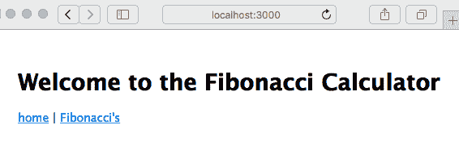

HTTP 服务器和客户端

现在你已经了解了 Node.js 模块，是时候将这些知识应用到构建一个简单的 Node.js web 应用程序中了。本书的目标是学习使用 Node.js 进行 web 应用程序开发。在这个过程中的下一步是对`HTTPServer`和`HTTPClient`对象有一个基本的了解。为了做到这一点，我们将创建一个简单的应用程序，使我们能够探索 Node.js 中一个流行的应用程序框架——Express。在后面的章节中，我们将在应用程序上做更复杂的工作，但在我们能够行走之前，我们必须学会爬行。

本章的目标是开始了解如何在 Node.js 平台上创建应用程序。我们将创建一些小型的应用程序，这意味着我们将编写代码并讨论它的作用。除了学习一些具体的技术之外，我们还希望熟悉初始化工作目录、创建应用程序的 Node.js 代码、安装应用程序所需的依赖项以及运行/测试应用程序的过程。

Node.js 运行时包括诸如`EventEmitter`、`HTTPServer`和`HTTPClient`等对象，它们为我们构建应用程序提供了基础。即使我们很少直接使用这些对象，了解它们的工作原理也是有用的，在本章中，我们将涵盖使用这些特定对象的一些练习。

我们将首先直接使用`HTTPServer`对象构建一个简单的应用程序。然后，我们将使用 Express 来创建一个计算斐波那契数的应用程序。因为这可能是计算密集型的，我们将利用这一点来探讨为什么在 Node.js 中不阻塞事件队列是重要的，以及对这样做的应用程序会发生什么。这将给我们一个借口来开发一个简单的后台 REST 服务器，一个用于在服务器上发出请求的 HTTP 客户端，以及一个多层 web 应用程序的实现。

在今天的世界中，微服务应用架构实现了后台 REST 服务器，这就是我们在本章中要做的事情。

在本章中，我们将涵盖以下主题：

+   使用`EventEmitter`模式发送和接收事件

+   通过构建一个简单的应用程序来理解 HTTP 服务器应用程序

+   Web 应用程序框架

+   使用 Express 框架构建一个简单的应用程序

+   在 Express 应用程序中处理计算密集型计算和 Node.js 事件循环。

+   发出 HTTP 客户端请求

+   使用 Express 创建一个简单的 REST 服务

通过学习这些主题，你将了解设计基于 HTTP 的 web 服务的几个方面。目标是让你了解如何创建或消费一个 HTTP 服务，并对 Express 框架有一个介绍。在本章结束时，你将对这两个工具有一个基本的了解。

这是很多内容，但这将为本书的其余部分奠定一个良好的基础。

# 第六章：使用 EventEmitter 发送和接收事件

`EventEmitter`是 Node.js 的核心习语之一。如果 Node.js 的核心思想是事件驱动的架构，那么从对象中发出事件是该架构的主要机制之一。`EventEmitter`是一个在其生命周期的不同阶段提供通知（事件）的对象。例如，一个`HTTPServer`对象会发出与服务器对象的启动/关闭以及处理来自 HTTP 客户端的 HTTP 请求的每个阶段相关的事件。

许多核心的 Node.js 模块都是`EventEmitter`对象，而`EventEmitter`对象是实现异步编程的一个很好的基础。`EventEmitter`对象在 Node.js 中非常常见，以至于你可能会忽略它们的存在。然而，因为它们随处可见，我们需要了解它们是什么，以及在必要时如何使用它们。

在本章中，我们将使用`HTTPServer`和`HTTPClient`对象。两者都是`EventEmitter`类的子类，并依赖于它来发送 HTTP 协议每个步骤的事件。在本节中，我们将首先学习使用 JavaScript 类，然后创建一个`EventEmitter`子类，以便我们可以学习`EventEmitter`。

## JavaScript 类和类继承

在开始`EventEmitter`类之前，我们需要看一下 ES2015 的另一个特性：类。JavaScript 一直有对象和类层次结构的概念，但没有其他语言那样正式。ES2015 类对象建立在现有的基于原型的继承模型之上，但其语法看起来很像其他语言中的类定义。

例如，考虑以下类，我们将在本书的后面使用：

```

This should look familiar to anyone who's implemented a class definition in other languages. The class has a name—`Note`. There is also a constructor method and attributes for each instance of the class.

Once you've defined the class, you can export the class definition to other modules:

```

使用`get`或`set`关键字标记的函数是 getter 和 setter，用法如下：

```

New instances of a class are created with `new`. You access a getter or setter function as if it is a simple field on the object. Behind the scenes, the getter/setter function is invoked.

The preceding implementation is not the best because the `_title` and `_body` fields are publicly visible and there is no data-hiding or encapsulation. There is a technique to better hide the field data, which we'll go over in Chapter 5, *Your First Express Application*.

You can test whether a given object is of a certain class by using the `instanceof` operator:

```

最后，您可以使用`extends`运算符声明一个子类，类似于其他语言中的操作：

```

In other words, the `LoveNote` class has all the fields of `Note`, plus a new field named `heart`.

This was a brief introduction to JavaScript classes. By the end of this book, you'll have had lots of practice with this feature. The `EventEmitter` class gives us a practical use for classes and class inheritance.

## The EventEmitter class

The `EventEmitter` object is defined in the `events` module of Node.js. Using the `EventEmitter` class directly means performing `require('events')`. In most cases, we don't do this. Instead, our typical use of `EventEmitter` objects is via an existing object that uses `EventEmitter` internally. However, there are some cases where needs dictate implementing an `EventEmitter` subclass.

Create a file named `pulser.mjs`, containing the following code:

```

这是一个定义了名为`Pulser`的类的 ES6 模块。该类继承自`EventEmitter`并提供了一些自己的方法。

另一件要检查的事情是回调函数中的`this.emit`如何引用`Pulser`对象实例。这个实现依赖于 ES2015 箭头函数。在箭头函数之前，我们的回调使用了一个常规的`function`，而`this`不会引用`Pulser`对象实例。相反，`this`会引用与`setInterval`函数相关的其他对象。箭头函数的一个特性是，箭头函数内部的`this`与周围上下文中的`this`具有相同的值。这意味着，在这种情况下，`this`确实引用`Pulser`对象实例。

在我们必须使用`function`而不是箭头函数时，我们必须将`this`分配给另一个变量，如下所示：

```

What's different is the assignment of `this` to `self`. The value of `this` inside the function is different—it is related to the `setInterval` function—but the value of `self` remains the same in every enclosed scope. You'll see this trick used widely, so remember this in case you come across this pattern in code that you're maintaining.

If you want to use a simple `EventEmitter` object but with your own class name, the body of the extended class can be empty:

```

`Pulser`类的目的是每秒向任何监听器发送一个定时事件。`start`方法使用`setInterval`来启动重复的回调执行，计划每秒调用`emit`将`pulse`事件发送给任何监听器。

现在，让我们看看如何使用`Pulser`对象。创建一个名为`pulsed.mjs`的新文件，其中包含以下代码：

```

Here, we create a `Pulser` object and consume its `pulse` events. Calling `pulser.on('pulse')` sets up an event listener for the `pulse` events to invoke the callback function. It then calls the `start` method to get the process going.

When it is run, you should see the following output:

```

对于每个接收到的`pulse`事件，都会打印一个`pulse received`消息。

这为您提供了一些关于`EventEmitter`类的实际知识。现在让我们看一下它的操作理论。

## EventEmitter 理论

使用`EventEmitter`类，您的代码会发出其他代码可以接收的事件。这是一种连接程序中两个分离部分的方式，有点像量子纠缠的方式，两个电子可以在任何距离上相互通信。看起来很简单。

事件名称可以是任何对您有意义的内容，您可以定义尽可能多的事件名称。事件名称是通过使用事件名称调用`.emit`来定义的。无需进行任何正式操作，也不需要注册事件名称。只需调用`.emit`就足以定义事件名称。

按照惯例，`error`事件名称表示错误。

一个对象使用`.emit`函数发送事件。事件被发送到任何已注册接收对象事件的监听器。程序通过调用该对象的`.on`方法注册接收事件，给出事件名称和事件处理程序函数。

所有事件没有一个中央分发点。相反，每个`EventEmitter`对象实例管理其自己的监听器集，并将其事件分发给这些监听器。

通常，需要在事件中发送数据。要这样做，只需将数据作为参数添加到`.emit`调用中，如下所示：

```

When the program receives the event, the data appears as arguments to the callback function. Your program listens to this event, as follows:

```

事件接收器和事件发送器之间没有握手。也就是说，事件发送器只是继续它的业务，不会收到任何关于接收到的事件、采取的任何行动或发生的任何错误的通知。

在这个例子中，我们使用了 ES2015 的另一个特性——`rest`运算符——在这里以`...theArgs`的形式使用。`rest`运算符将任意数量的剩余函数参数捕获到一个数组中。由于`EventEmitter`可以传递任意数量的参数，而`rest`运算符可以自动接收任意数量的参数，它们是天作之合，或者至少是在 TC-39 委员会中。

我们现在已经学会了如何使用 JavaScript 类以及如何使用`EventEmitter`类。接下来要做的是检查`HTTPServer`对象如何使用`EventEmitter`。

# 理解 HTTP 服务器应用程序

`HTTPServer`对象是所有 Node.js Web 应用程序的基础。这个对象本身非常接近 HTTP 协议，使用它需要对这个协议有所了解。幸运的是，在大多数情况下，您可以使用应用程序框架，比如 Express，来隐藏 HTTP 协议的细节。作为应用程序开发者，我们希望专注于业务逻辑。

我们已经在第二章中看到了一个简单的 HTTP 服务器应用程序，*设置 Node.js。*因为`HTTPServer`是一个`EventEmitter`对象，所以可以以另一种方式编写示例，以明确这一事实，通过分别添加事件监听器：

```

Here, we created an HTTP `server` object, then attached a listener to the `request` event, and then told the server to listen to connections from `localhost` (`127.0.0.1`) on port `8124`. The `listen` function causes the server to start listening and arranges to dispatch an event for every request arriving from a web browser.

The `request` event is fired any time an HTTP request arrives on the server. It takes a function that receives the `request` and `response` objects. The `request` object has data from the web browser, while the `response` object is used to gather data to be sent in the response. 

Now, let's look at a server application that performs different actions based on the URL.

Create a new file named `server.mjs`, containing the following code:

```

`request`事件是由`HTTPServer`每次从 Web 浏览器接收到请求时发出的。在这种情况下，我们希望根据请求 URL 的不同而有不同的响应，请求 URL 以`req.url`的形式到达。这个值是一个包含来自 HTTP 请求的 URL 的字符串。由于 URL 有许多属性，我们需要解析 URL 以便正确匹配两个路径中的一个的路径名：`/`和`/osinfo`。

使用 URL 类解析 URL 需要一个**基本 URL**，我们在`listenOn`变量中提供了这个 URL。请注意，我们在其他地方多次重用了这个变量，使用一个字符串来配置应用程序的多个部分。

根据路径，要么调用`homePage`函数，要么调用`osInfo`函数。

这被称为**请求路由**，我们在其中查看传入请求的属性，比如请求路径，并将请求路由到处理程序函数。

在处理程序函数中，`req`和`res`参数对应于`request`和`response`对象。`req`包含有关传入请求的数据，我们使用`res`发送响应。`writeHead`函数设置返回状态（`200`表示成功，而`404`表示页面未找到），`end`函数发送响应。

如果请求的 URL 没有被识别，服务器将使用`404`结果代码发送回一个错误页面。结果代码通知浏览器有关请求状态，其中`200`代码表示一切正常，`404`代码表示请求的页面不存在。当然，还有许多其他 HTTP 响应代码，每个代码都有自己的含义。

这两个对象都附加了许多其他函数，但这已经足够让我们开始了。

要运行它，请输入以下命令：

```

Then, if we paste the URL into a web browser, we see something like this:


This application is meant to be similar to PHP's `sysinfo` function. Node.js's `os` module is consulted to provide information about the computer. This example can easily be extended to gather other pieces of data.

A central part of any web application is the method of routing requests to request handlers. The `request` object has several pieces of data attached to it, two of which are useful for routing requests: the `request.url` and `request.method` fields.

In `server.mjs`, we consult the `request.url` data to determine which page to show after parsing using the URL object. Our needs are modest in this server, and a simple comparison of the `pathname` field is enough. Larger applications will use pattern matching to use part of the request URL to select the request handler function and other parts to extract request data out of the URL. We'll see this in action when we look at Express later in the *Getting started with Express* section.

Some web applications care about the HTTP verb that is used (`GET`, `DELETE`, `POST`, and so on) and so we must consult the `request.method` field of the `request` object. For example, `POST` is frequently used for any `FORM` submissions.

That gives us a taste of developing servers with Node.js. Along the way, we breezed past one big ES2015 feature—template strings. The template strings feature simplifies substituting values into strings. Let's see how that works.

## ES2015 multiline and template strings

The previous example showed two of the new features introduced with ES2015: multiline and template strings. These features are meant to simplify our lives when creating text strings.

The existing JavaScript string representations use single quotes and double quotes. Template strings are delimited with the backtick character, which is also known as the **grave accent**:

```

在 ES2015 之前，实现多行字符串的一种方法是使用以下结构：

```

This is an array of strings that uses the `join` function to smash them together into one string. Yes, this is the code used in the same example in previous versions of this book. This is what we can do with ES2015:

```

这更加简洁和直接。开头引号在第一行，结束引号在最后一行，中间的所有内容都是我们的字符串的一部分。

模板字符串功能的真正目的是支持将值直接替换到字符串中。许多其他编程语言支持这种能力，现在 JavaScript 也支持了。

在 ES2015 之前，程序员会这样编写他们的代码：

```

Similar to the previous snippet, this relied on the `replace` function to insert values into the string. Again, this is extracted from the same example that was used in previous versions of this book. With template strings, this can be written as follows:

```

在模板字符串中，`${..}`括号中的部分被解释为表达式。这可以是一个简单的数学表达式、一个变量引用，或者在这种情况下，一个函数调用。

使用模板字符串插入数据存在安全风险。您是否验证了数据的安全性？它会成为安全攻击的基础吗？与始终如一的数据来自不受信任的来源，如用户输入，必须为数据要插入的目标上下文正确编码。在这个例子中，我们应该使用一个函数来将这些数据编码为 HTML，也许。但是对于这种情况，数据是简单的字符串和数字形式，并来自已知的安全数据源——内置的`os`模块，因此我们知道这个应用程序是安全的。

出于这个原因和许多其他原因，通常更安全使用外部模板引擎。诸如 Express 之类的应用程序可以轻松实现这一点。

现在我们有一个简单的基于 HTTP 的 Web 应用程序。为了更多地了解 HTTP 事件，让我们为监听所有 HTTP 事件的模块添加一个。

# HTTP Sniffer - 监听 HTTP 对话

`HTTPServer`对象发出的事件可以用于除了传递 Web 应用程序的直接任务之外的其他目的。以下代码演示了一个有用的模块，它监听所有`HTTPServer`事件。这可能是一个有用的调试工具，还演示了`HTTPServer`对象的操作方式。

Node.js 的`HTTPServer`对象是一个`EventEmitter`对象，而 HTTP Sniffer 只是监听每个服务器事件，打印出与每个事件相关的信息。

创建一个名为`httpsniffer.mjs`的文件，其中包含以下代码：

```

The key here is the `sniffOn` function. When given an `HTTPServer` object, it attaches listener functions to each `HTTPServer` event to print relevant data. This gives us a fairly detailed trace of the HTTP traffic on an application.

In order to use it, make two simple modifications to `server.mjs`. To the top, add the following `import` statement:

```

然后，按照以下方式更改服务器设置：

```

Here, we're importing the `sniffOn` function and then using it to attach listener methods to the `server` object.

With this in place, run the server as we did earlier. You can visit `http://localhost:8124/` in your browser and see the following console output:

```

现在您有一个用于窥探`HTTPServer`事件的工具。这种简单的技术打印出事件数据的详细日志。这种模式可以用于任何`EventEmitter`对象。您可以使用这种技术来检查程序中`EventEmitter`对象的实际行为。

在我们继续使用 Express 之前，我们需要讨论为什么要使用应用程序框架。

# Web 应用程序框架

`HTTPServer`对象与 HTTP 协议非常接近。虽然这在某种程度上很强大，就像驾驶手动挡汽车可以让您对驾驶体验进行低级控制一样，但典型的 Web 应用程序编程最好在更高的级别上完成。有人使用汇编语言来编写 Web 应用程序吗？最好将 HTTP 细节抽象出来，集中精力放在应用程序上。

Node.js 开发者社区已经开发了相当多的应用程序框架，以帮助抽象 HTTP 协议细节的不同方面。在这些框架中，Express 是最受欢迎的，而 Koa（[`koajs.com/`](http://koajs.com/)）应该被考虑，因为它完全集成了对异步函数的支持。

Express.js 维基上列出了建立在 Express.js 之上或与其一起使用的框架和工具。这包括模板引擎、中间件模块等。Express.js 维基位于[`github.com/expressjs/express/wiki`](https://github.com/expressjs/express/wiki)。

使用 Web 框架的一个原因是它们通常具有在 Web 应用程序开发中使用了 20 多年的最佳实践的经过充分测试的实现。通常的最佳实践包括以下内容：

+   提供一个用于错误 URL 的页面（`404`页面）

+   筛选 URL 和表单以防注入脚本攻击

+   支持使用 cookie 来维护会话

+   记录请求以进行使用跟踪和调试

+   认证

+   处理静态文件，如图像、CSS、JavaScript 或 HTML

+   提供缓存控制头以供缓存代理使用

+   限制页面大小或执行时间等事项

Web 框架帮助您将时间投入到任务中，而不会迷失在实现 HTTP 协议的细节中。抽象化细节是程序员提高效率的一种历史悠久的方式。当使用提供预打包函数来处理细节的库或框架时，这一点尤其正确。

考虑到这一点，让我们转向使用 Express 实现的一个简单应用程序。

# 开始使用 Express

Express 可能是最受欢迎的 Node.js Web 应用程序框架。Express 被描述为类似于 Sinatra，这是一个流行的 Ruby 应用程序框架。它也被认为不是一种武断的框架，这意味着框架作者不会对应用程序的结构施加自己的意见。这意味着 Express 对代码的结构并不严格；您只需按照您认为最好的方式编写即可。

您可以访问 Express 的主页[`expressjs.com/`](http://expressjs.com/)。

截至撰写本书时，Express 4.17 是当前版本，Express 5 正在进行 alpha 测试。根据 Express.js 网站，Express 4 和 Express 5 之间几乎没有什么区别。

让我们首先安装`express-generator`。虽然我们可以直接开始编写一些代码，但`express-generator`提供了一个空白的起始应用程序，我们将使用它并进行修改。

使用以下命令安装`express-generator`：

```

This is different from the suggested installation method on the Express website, which says to use the `-g` tag for a global installation. We're also using an explicit version number to ensure compatibility. As of the time of writing, `express-generator@5.x` does not exist, but it should exist sometime in the future. The instructions here are written for Express 4.x, and by explicitly naming the version, we're ensuring that we're all on the same page.

Earlier, we discussed how many people now recommend against installing modules globally. Maybe they would consider `express-generator` as an exception to that rule, or maybe not. In any case, we're not following the recommendation on the Express website, and toward the end of this section, we'll have to uninstall `express-generator`.

The result of this is that an `express` command is installed in the `./node_modules/.bin` directory:

```

运行`express`命令，如下所示：

```

We probably don't want to type `./node_modules/.bin/express` every time we run the `express-generator` application, or, for that matter, any of the other applications that provide command-line utilities. Refer back to the discussion we had in Chapter 3, *Exploring Node.js Modules*, about adding this directory to the `PATH` variable. Alternatively, the `npx` command, also described in Chapter 3, *Exploring Node.js Modules*, is useful for this.

For example, try using the following instead of installing `express-generator`:

```

这样执行完全相同，无需安装`express-generator`，并且（我们马上会看到）在使用命令结束时记得卸载它。

现在，您已经在`fibonacci`目录中安装了`express-generator`，使用它来设置空白框架应用程序：

```

This creates a bunch of files for us, which we'll walk through in a minute. We asked it to initialize the use of the Handlebars template engine and to initialize a `git` repository. 

The `node_modules` directory still has the `express-generator` module, which is no longer useful. We can just leave it there and ignore it, or we can add it to `devDependencies` of the `package.json` file that it generated. Most likely, we will want to uninstall it:

```

这将卸载`express-generator`工具。接下来要做的是按照我们被告知的方式运行空白应用程序。`npm start`命令依赖于提供的`package.json`文件的一个部分：

```

It's cool that the Express team showed us how to run the server by initializing the `scripts` section in `package.json`. The `start` script is one of the scripts that correspond to the `npm` sub-commands. The instructions we were given, therefore, say to run `npm start`.

The steps are as follows:

1.  Install the dependencies with `npm install`.
2.  Start the application by using `npm start`.
3.  Optionally, modify `package.json` to always run with debugging.

To install the dependencies and run the application, type the following commands:

```

以这种方式设置`DEBUG`变量会打开调试输出，其中包括有关监听端口`3000`的消息。否则，我们不会得到这些信息。这种语法是在 Bash shell 中使用环境变量运行命令的方式。如果在运行`npm start`时出错，请参考下一节。

我们可以修改提供的`npm start`脚本，始终使用启用调试的应用程序。将`scripts`部分更改为以下内容：

```

Since the output says it is listening on port `3000`, we direct our browser to
`http://localhost:3000/` and see the following output:


Cool, we have some running code. Before we start changing the code, we need to discuss how to set environment variables in Windows.

## Setting environment variables in the Windows cmd.exe command line

If you're using Windows, the previous example may have failed, displaying an error that says `DEBUG` is not a known command. The problem is that the Windows shell, the `cmd.exe` program, does not support the Bash command-line structure.

Adding `VARIABLE=value` to the beginning of a command line is specific to some shells, such as Bash, on Linux and macOS. It sets that environment variable only for the command line that is being executed and is a very convenient way to temporarily override environment variables for a specific command.

Clearly, a solution is required if you want to be able to use your `package.json` file across different operating systems.

The best solution appears to be using the `cross-env` package in the `npm` repository; refer to [`www.npmjs.com/package/cross-env`](https://www.npmjs.com/package/cross-env) for more information.

With this package installed, commands in the `scripts` section in `package.json` can set environment variables just as in Bash on Linux/macOS. The use of this package looks as follows:

```

然后，执行以下命令：

```

We now have a simple way to ensure the scripts in `package.json` are cross-platform. Our next step is a quick walkthrough of the generated application.

## Walking through the default Express application

We now have a working, blank Express application; let's look at what was generated for us. We do this to familiarize ourselves with Express before diving in to start coding our **Fibonacci** application.

Because we used the `--view=hbs` option, this application is set up to use the Handlebars.js template engine. 

For more information about Handlebars.js, refer to its home page at [`handlebarsjs.com/`](http://handlebarsjs.com/). The version shown here has been packaged for use with Express and is documented at [`github.com/pillarjs/hbs`](https://github.com/pillarjs/hbs). 

Generally speaking, a template engine makes it possible to insert data into generated web pages. The Express.js wiki has a list of template engines for Express ([`github.com/expressjs/express/wiki#template-engines`](https://github.com/expressjs/express/wiki#template-engines)).

Notice that the JavaScript files are generated as CommonJS modules. The `views` directory contains two files—`error.hbs` and `index.hbs`. The `hbs` extension is used for Handlebars files. Another file, `layout.hbs`, is the default page layout. Handlebars has several ways to configure layout templates and even partials (snippets of code that can be included anywhere).

The `routes` directory contains the initial routing setup—that is, code to handle specific URLs. We'll modify this later.

The `public` directory contains assets that the application doesn't generate but are simply sent to the browser. What's initially installed is a CSS file, `public/stylesheets/style.css`. The `package.json` file contains our dependencies and other metadata.

The `bin` directory contains the `www` script that we saw earlier. This is a Node.js script that initializes the `HTTPServer` objects, starts listening on a TCP port, and calls the last file that we'll discuss, `app.js`. These scripts initialize Express and hook up the routing modules, as well as other things.

There's a lot going on in the `www` and `app.js` scripts, so let's start with the application initialization. Let's first take a look at a couple of lines in `app.js`:

```

这意味着`app.js`是一个 CommonJS 模块，它导出了由`express`模块生成的应用程序对象。我们在`app.js`中的任务是配置该应用程序对象。但是，这个任务不包括启动`HTTPServer`对象。

现在，让我们转向`bin/www`脚本。在这个脚本中启动了 HTTP 服务器。首先要注意的是它以以下行开始：

```

This is a Unix/Linux technique to make a command script. It says to run the following as a script using the `node` command. In other words, we have Node.js code and we're instructing the operating system to execute that code using the Node.js runtime:

```

我们还可以看到该脚本是通过`express-generator`可执行的。

它调用`app.js`模块，如下所示：

```

Namely, it loads the module in `app.js`, gives it a port number to use, creates the `HTTPServer` object, and starts it up.

We can see where port `3000` comes from; it's a parameter to the `normalizePort` function. We can also see that setting the `PORT` environment variable will override the default port `3000`. Finally, we can see that the `HTTPServer` object is created here and is told to use the application instance created in `app.js`. Try running the following command:

```

通过为`PORT`指定环境变量，我们可以告诉应用程序监听端口`4242`，您可以在那里思考生活的意义。

接下来将`app`对象传递给`http.createServer()`。查看 Node.js 文档告诉我们，这个函数接受`requestListener`，它只是一个接受我们之前看到的`request`和`response`对象的函数。因此，`app`对象是相同类型的函数。

最后，`bin/www`脚本启动了服务器监听进程，监听我们指定的端口。

现在让我们更详细地了解`app.js`：

```

This tells Express to look for templates in the `views` directory and to use the Handlebars templating engine.

The `app.set` function is used to set the application properties. It'll be useful to browse the API documentation as we go through ([`expressjs.com/en/4x/api.html`](http://expressjs.com/en/4x/api.html)).

Next is a series of `app.use` calls:

```

`app.use`函数挂载中间件函数。这是 Express 术语中的重要部分，我们很快会讨论。目前，让我们说中间件函数在处理请求时被执行。这意味着`app.js`中启用了这里列出的所有功能：

+   使用`morgan`请求记录器启用日志记录。请参考[`www.npmjs.com/package/morgan`](https://www.npmjs.com/package/morgan)获取其文档。

+   `body-parser`模块处理解析 HTTP 请求主体。请参考[`www.npmjs.com/package/body-parser`](https://www.npmjs.com/package/body-parser)获取其文档。

+   `cookie-parser`模块用于解析 HTTP cookie。请参考[`www.npmjs.com/package/cookie-parser`](https://www.npmjs.com/package/cookie-parser)获取其文档。

+   配置静态文件 Web 服务器以提供`public`目录中的资产文件。请参考[`expressjs.com/en/starter/static-files.html`](http://expressjs.com/en/starter/static-files.html)获取其文档。

+   两个路由模块——`routes`和`users`——设置哪些函数处理哪些 URL。

静态文件 Web 服务器安排通过 HTTP 请求提供命名目录中的文件。使用此配置，`public/stylesheets/style.css`文件可在`http://HOST/stylesheets/style.css`上访问。

我们不应该感到受限于以这种方式设置 Express 应用程序。这是 Express 团队的建议，但我们并不受限于以另一种方式设置它。例如，在本书的后面部分，我们将完全将其重写为 ES6 模块，而不是坚持使用 CommonJS 模块。一个明显的遗漏是未捕获异常和未处理的 Promise 拒绝的处理程序。我们稍后会在本书中讨论这两者。

接下来，我们将讨论 Express 的**中间件**函数。

## 理解 Express 中间件

让我们通过讨论 Express 中间件函数为我们的应用程序做了什么来完成对`app.js`的漫游。中间件函数参与处理请求并将结果发送给 HTTP 客户端。它们可以访问`request`和`response`对象，并且预期处理它们的数据，也许向这些对象添加数据。例如，cookie 解析中间件解析 HTTP cookie 头，以记录浏览器发送的 cookie 在`request`对象中。

我们在脚本的最后有一个例子：

```

The comment says `catch 404 and forward it to the error handler`. As you probably know, an HTTP `404` status means the requested resource was not found. We need to tell the user that their request wasn't satisfied, and maybe show them something such as a picture of a flock of birds pulling a whale out of the ocean. This is the first step in doing this. Before getting to the last step of reporting this error, you need to learn how middleware works.

The name *middleware* implies software that executes in the middle of a chain of processing steps.

Refer to the documentation about middleware at [`expressjs.com/en/guide/writing-middleware.html`](http://expressjs.com/en/guide/writing-middleware.html).

Middleware functions take three arguments. The first two—`request` and `response`—are equivalent to the `request` and `response` objects of the Node.js HTTP request object. Express expands these objects with additional data and capabilities. The last argument, `next`, is a callback function that controls when the request-response cycle ends, and it can be used to send errors down the middleware pipeline.

As an aside, one critique of Express is that it was written prior to the existence of Promises and async functions. Therefore, its design is fully enmeshed with the callback function pattern. We can still use async functions, but integrating with Express requires using the callback functions it provides.

The overall architecture is set up so that incoming requests are handled by zero or more middleware functions, followed by a router function, which sends the response. The middleware functions call `next`, and in a normal case, provide no arguments by calling `next()`. If there is an error, the middleware function indicates the error by calling `next(err)`, as shown here.

For each middleware function that executes, there is, in theory, several other middleware functions that have already been executed, and potentially several other functions still to be run. It is required to call `next` to pass control to the next middleware function.

What happens if `next` is not called? There is one case where we must not call `next`. In all other cases, if `next` is not called, the HTTP request will hang because no response will be given. 

What is the one case where we must not call `next`? Consider the following hypothetical router function:

```

这不调用`next`，而是调用`res.send`。对于`response`对象上的某些函数，如`res.send`或`res.render`，会发送 HTTP 响应。这是通过发送响应(`res.send`)来结束请求-响应循环的正确方法。如果既不调用`next`也不调用`res.send`，则请求永远不会得到响应，请求的客户端将挂起。

因此，中间件函数执行以下四种操作中的一种：

+   执行自己的业务逻辑。前面显示的请求记录中间件就是一个例子。

+   修改`request`或`response`对象。`body-parser`和

`cookie-parser`执行此操作，查找要添加到`request`对象的数据。

+   调用`next`以继续下一个中间件函数，或者以其他方式发出错误信号。

+   发送响应，结束循环。

中间件执行的顺序取决于它们添加到`app`对象的顺序。添加的第一个函数首先执行，依此类推。

接下来要理解的是请求处理程序以及它们与中间件函数的区别。

## 中间件和请求处理程序的对比

到目前为止，我们已经看到了两种中间件函数。在一种中，第一个参数是处理程序函数。在另一种中，第一个参数是包含 URL 片段的字符串，第二个参数是处理程序函数。

实际上，`app.use`有一个可选的第一个参数：中间件挂载的路径。该路径是对请求 URL 的模式匹配，并且如果 URL 匹配模式，则触发给定的函数。甚至有一种方法可以在 URL 中提供命名参数：

```

This path specification has a pattern, `id`, and the value will land in `req.params.id`. In an Express route, this `:id` pattern marks a **route parameter**. The pattern will match a URL segment, and the matching URL content will land and be available through the `req.params` object. In this example, we're suggesting a user profile service and that for this URL, we want to display information about the named user.

As Express scans the available functions to execute, it will try to match this pattern against the request URL. If they match, then the router function is invoked.

It is also possible to match based on the HTTP request method, such as `GET` or `PUT`. Instead of `app.use`, we would write `app.METHOD`—for example, `app.get` or `app.put`. The preceding example would, therefore, be more likely to appear as follows:

```

`GET`的所需行为是检索数据，而`PUT`的行为是存储数据。然而，如上所述的示例，当处理程序函数仅对`GET`动词正确时，它将匹配任一 HTTP 方法。但是，使用`app.get`，如本例中的情况，确保应用程序正确匹配所需的 HTTP 方法。

最后，我们来到了`Router`对象。这是一种专门用于根据其 URL 路由请求的中间件。看一下`routes/users.js`：

```

We have a module that creates a `router` object, then adds one or more `router` functions. It makes the `Router` object available through `module.exports` so that `app.js` can use it. This router has only one route, but `router` objects can have any number of routes that you think is appropriate.

This one route matches a `GET` request on the `/` URL. That's fine until you notice that in `routes/index.js`, there is a similar `router` function that also matches `GET` requests on the `/` URL.

Back in `app.js`, `usersRouter` is added, as follows:

```

这将`router`对象及其零个或多个路由函数挂载到`/users` URL 上。当 Express 寻找匹配的路由函数时，首先扫描附加到`app`对象的函数，对于任何路由器对象，它也会扫描其函数。然后调用与请求匹配的任何路由函数。

回到`/` URL 的问题，`router`实际上*挂载在*`/users` URL 上是很重要的。这是因为它考虑匹配的实际 URL 是挂载点(`/users`)与`router`函数中的 URL 连接起来的。

效果是为了匹配附加到`router`对象的`router`函数，请求 URL 的挂载前缀被剥离。因此，使用该挂载点，`/users/login`的传入 URL 将被剥离为`/login`，以便找到匹配的`router`函数。

由于并非一切都按计划进行，我们的应用程序必须能够处理错误指示并向用户显示错误消息。

## 错误处理

现在，我们终于可以回到生成的`app.js`文件，`404 Error page not found`错误，以及应用程序可能向用户显示的任何其他错误。

中间件函数通过将值传递给`next`函数调用来指示错误，即通过调用`next(err)`。一旦 Express 看到错误，它将跳过任何剩余的非错误路由，并仅将错误传递给错误处理程序。错误处理程序函数的签名与我们之前看到的不同。

在我们正在检查的`app.js`中，以下是我们的错误处理程序，由`express-generator`提供：

```

Error handler functions take four parameters, with `err` added to the familiar `req`, `res`, and `next` functions.

Remember that `res` is the response object, and we use it to set up the HTTP response sent to the browser; even though there is an error, we still send a response.

Using `res.status` sets the HTTP response status code. In the simple application that we examined earlier, we used `res.writeHead` to set not only the status code but also the **Multipurpose Internet Mail Extensions** (**MIME**) type of the response.

The `res.render` function takes data and renders it through a template. In this case, we're using the template named `error`. This corresponds to the `views/error.hbs` file, which looks as follows:

```

在 Handlebars 模板中，`{{value}}`标记意味着将表达式或变量的值替换到模板中。此模板引用的`message`和`error`是通过设置`res.locals`提供的，如下所示。

要查看错误处理程序的操作，请将以下内容添加到`routes/index.js`：

```

This is a route handler, and going by what we've said, it simply generates an error indication. In a real route handler, the code would make some kind of query, gathering up data to show to the user, and it would indicate an error only if something happened along the way. However, we want to see the error handler in action.

By calling `next(err)`, as mentioned, Express will call the error handler function, causing an error response to pop up in the browser:


Indeed, at the `/error` URL, we get the Fake error message, which matches the error data sent by the route handler function.

In this section, we've created for ourselves a foundation for how Express works. Let's now turn to an Express application that actually performs a function.

# Creating an Express application to compute Fibonacci numbers

As we discussed in Chapter 1, *About Node.js* we'll be using an inefficient algorithm to calculate Fibonacci numbers to explore how to mitigate performance problems, and along the way, we'll learn how to build a simple REST service to offload computation to the backend server.

The Fibonacci numbers are the following integer sequence:

*0, 1, 1, 2, 3, 5, 8, 13, 21, 34, ... *

Each Fibonacci number is the sum of the previous two numbers in the sequence. This sequence was discovered in 1202 by Leonardo of Pisa, who was also known as Fibonacci. One method to calculate entries in the Fibonacci sequence is using the recursive algorithm, which we discussed in Chapter 1, *About Node.js*. We will create an Express application that uses the Fibonacci implementation and along the way, we will get a better understanding of Express applications, as well as explore several methods to mitigate performance problems in computationally intensive algorithms.

Let's start with the blank application we created in the previous step. We named that application `Fibonacci` for a reason—we were thinking ahead!

In `app.js`, make the following changes to the top portion of the file:

```

这大部分是`express-generator`给我们的。`var`语句已更改为`const`，以获得更多的舒适度。我们明确导入了`hbs`模块，以便进行一些配置。我们还导入了一个`Fibonacci`的路由模块，我们马上就会看到。

对于`Fibonacci`应用程序，我们不需要支持用户，因此已删除了路由模块。我们将在接下来展示的`routes/fibonacci.js`模块用于查询我们将计算斐波那契数的数字。

在顶级目录中，创建一个名为`math.js`的文件，其中包含以下极其简单的斐波那契实现：

```

In the `views` directory, look at the file named `layout.hbs`, which was created by `express-generator`:

```

该文件包含我们将用于 HTML 页面的结构。根据 Handlebars 语法，我们可以看到`{{title}}`出现在 HTML`title`标记中。这意味着当我们调用`res.render`时，我们应该提供一个`title`属性。`{{{body}}}`标记是`view`模板内容的落脚点。

将`views/index.hbs`更改为只包含以下内容：

```

This serves as the front page of our application. It will be inserted in place of `{{{body}}}` in `views/layout.hbs`. The marker, `{{> navbar}}`, refers to a partially named `navbar` object. Earlier, we configured a directory named `partials` to hold partials. Now, let's create a file, `partials/navbar.html`, containing the following:

```

这将作为包含在每个页面上的导航栏。

创建一个名为`views/fibonacci.hbs`的文件，其中包含以下代码：

```

If `fiboval` is set, this renders a message that for a given number (`fibonum`), we have calculated the corresponding Fibonacci number. There is also an HTML form that we can use to enter a `fibonum` value.

Because it is a `GET` form, when the user clicks on the Submit button, the browser will issue an HTTP `GET` method to the `/fibonacci` URL. What distinguishes one `GET` method on `/fibonacci` from another is whether the URL contains a query parameter named `fibonum`. When the user first enters the page, there is no `fibonum` number and so there is nothing to calculate. After the user has entered a number and clicked on Submit, there is a `fibonum` number and so something to calculate.

Remember that the files in `views` are templates into which data is rendered. They serve the **v****iew**aspect of the **Model-View-Controller** (**MVC**) paradigm, hence the directory name.

In `routes/index.js`, change the `router` function to the following:

```

传递给`res.render`的匿名对象包含我们提供给布局和视图模板的数据值。我们现在传递了一个新的欢迎消息。

最后，在`routes`目录中，创建一个名为`fibonacci.js`的文件，其中包含以下代码：

```

This route handler says it matches the `/` route. However, there is a route handler in `index.js` that matches the same route. We haven't made a mistake, however. The `router` object created by this module becomes `fibonacciRouter` when it lands in `app.js`. Refer back to `app.js` and you will see that `fibonacciRouter` is mounted on `/fibonacci`. The rule is that the actual URL path matched by a router function is the path that the router is mounted on plus the path given for the router function. In this case, that is `/fibonacci` plus `/`, and for a URL, that equates to `/fibonacci`. 

The handler checks for the existence of `req.query.fibonum`. Express automatically parses the HTTP request URL and any query parameters will land in `req.query`. Therefore, this will trigger a URL such as `/fibonacci?fibonum=5`.

If this value is present, then we call `res.render('fibonacci')` with data including `fibonum`, the number for which we want its Fibonacci number, and `fiboval`, the corresponding Fibonacci number. Otherwise, we pass `undefined` for `fiboval`. If you refer back to the template, if `fiboval` is not set, then the user only sees the form to enter a `fibonum` number. Otherwise, if `fiboval` is set, both `fibonum` and `fiboval` are displayed.

The `package.json` file is already set up, so we can use `npm start` to run the script and always have debugging messages enabled. Now, we're ready to do this:

```

正如这个示例所暗示的，您可以访问`http://localhost:3000/`，看看我们有什么：



这个页面是从`views/index.hbs`模板中渲染出来的。只需点击斐波那契的链接，就可以进入下一个页面，当然，这个页面是从`views/fibonacci.hbs`模板中渲染出来的。在那个页面上，您可以输入一个数字，点击提交按钮，然后得到一个答案（提示-如果您希望在合理的时间内得到答案，请选择一个小于`40`的数字）：


我们要求您输入一个小于`40`的数字。继续输入一个更大的数字，比如`50`，但是请喝杯咖啡，因为这将需要一段时间来计算。或者，继续阅读下一节，我们将开始讨论使用计算密集型代码。

## 计算密集型代码和 Node.js 事件循环

这个斐波那契的例子故意效率低下，以演示应用程序的一个重要考虑因素。当长时间计算运行时，Node.js 事件循环会发生什么？为了看到效果，打开两个浏览器窗口，每个窗口查看斐波那契页面。在一个窗口中，输入数字`55`或更大，而在另一个窗口中，输入`10`。注意第二个窗口会冻结，如果您让它运行足够长的时间，答案最终会在两个窗口中弹出。Node.js 事件循环中发生的情况是，由于斐波那契算法正在运行并且从不让出事件循环，事件循环被阻塞无法处理事件。

由于 Node.js 具有单个执行线程，处理请求取决于请求处理程序快速返回到事件循环。通常，异步编码风格确保事件循环定期执行。

即使是从地球的另一端加载数据的请求，也是如此，因为异步请求是非阻塞的，并且控制很快返回到事件循环。我们选择的天真的斐波那契函数不符合这个模型，因为它是一个长时间运行的阻塞操作。这种类型的事件处理程序会阻止系统处理请求，并阻止 Node.js 做它应该做的事情-即成为一个速度极快的 Web 服务器。

在这种情况下，长响应时间的问题是显而易见的。计算斐波那契数的响应时间迅速上升到您可以去西藏度假，成为喇嘛，也许在这段时间内转世为秘鲁的羊驼！然而，也有可能创建一个长响应时间的问题，而不像这个问题那么明显。在大型 Web 服务中的无数异步操作中，哪一个既是阻塞的又需要很长时间来计算结果？像这样的任何阻塞操作都会对服务器吞吐量产生负面影响。

为了更清楚地看到这一点，创建一个名为`fibotimes.js`的文件，其中包含以下代码：

```

Now, run it. You will get the following output:

```

这个方法可以快速计算斐波那契数列的前 40 个成员，但是在第 40 个成员之后，每个结果开始花费几秒钟的时间，并且很快就会变得更糟。在依赖快速返回到事件循环的单线程系统上执行这种代码是不可行的。包含这种代码的 Web 服务会给用户带来糟糕的性能。

在 Node.js 中有两种一般的方法来解决这个问题：

+   **算法重构**：也许，就像我们选择的斐波那契函数一样，你的某个算法是次优的，可以重写为更快的。或者，如果不更快，它可以被拆分成通过事件循环分派的回调。我们马上就会看到其中一种方法。

+   **创建后端服务**：你能想象一个专门用于计算斐波那契数的后端服务器吗？好吧，也许不行，但实现后端服务器以卸载前端服务器的工作是非常常见的，我们将在本章末实现一个后端斐波那契服务器。

考虑到这一点，让我们来看看这些可能性。

### 算法重构

为了证明我们手头上有一个人为的问题，这里有一个更有效的斐波那契函数：

```

If we substitute a call to `math.fibonacciLoop` in place of `math.fibonacci`, the `fibotimes` program runs much faster. Even this isn't the most efficient implementation; for example, a simple, prewired lookup table is much faster at the cost of some memory.

Edit `fibotimes.js` as follows and rerun the script. The numbers will fly by so fast that your head will spin:

```

有时，你的性能问题会很容易优化，但有时则不会。

这里的讨论不是关于优化数学库，而是关于处理影响 Node.js 服务器事件吞吐量的低效算法。因此，我们将坚持使用低效的斐波那契实现。

可以将计算分成块，然后通过事件循环分派这些块的计算。将以下代码添加到`math.js`中： 

```

This converts the `fibonacci` function from a synchronous function into a traditional callback-oriented asynchronous function. We're using `setImmediate` at each stage of the calculation to ensure that the event loop executes regularly and that the server can easily handle other requests while churning away on a calculation. It does nothing to reduce the computation required; this is still the inefficient Fibonacci algorithm. All we've done is spread the computation through the event loop.

In `fibotimes.js`, we can use the following:

```

我们又回到了一个低效的算法，但是其中的计算是通过事件循环分布的。运行这个`fibotimes.js`版本会展示它的低效性。为了在服务器中展示它，我们需要做一些改变。

因为它是一个异步函数，我们需要更改我们的路由器代码。创建一个名为`routes/fibonacci-async1.js`的新文件，其中包含以下代码：

```

This is the same code as earlier, just rewritten for an asynchronous Fibonacci calculation. The Fibonacci number is returned via a callback function, and even though we have the beginnings of a callback pyramid, it is still manageable.

In `app.js`, make the following change to the application wiring:

```

有了这个改变，服务器在计算一个大的斐波那契数时不再冻结。当然，计算仍然需要很长时间，但至少应用程序的其他用户不会被阻塞。

您可以通过再次在应用程序中打开两个浏览器窗口来验证这一点。在一个窗口中输入`60`，在另一个窗口中开始请求较小的斐波那契数。与原始的`fibonacci`函数不同，使用`fibonacciAsync`允许两个窗口都给出答案，尽管如果您确实在第一个窗口中输入了`60`，那么您可能会去西藏度个三个月的假期：


优化代码和处理可能存在的长时间运行的计算是由你和你的具体算法来选择的。

我们创建了一个简单的 Express 应用程序，并演示了一个影响性能的缺陷。我们还讨论了算法重构，这只剩下我们讨论如何实现后端服务了。但首先，我们需要学习如何创建和访问 REST 服务。

# 进行 HTTPClient 请求

另一种缓解计算密集型代码的方法是将计算推送到后端进程。为了探索这种策略，我们将使用`HTTPClient`对象从后端斐波那契服务器请求计算。然而，在讨论这个之前，让我们先一般性地讨论一下使用`HTTPClient`对象。

Node.js 包括一个`HTTPClient`对象，用于进行 HTTP 请求非常有用。它具有发出任何类型的 HTTP 请求的能力。在本节中，我们将使用`HTTPClient`对象来进行类似调用 REST web 服务的 HTTP 请求。

让我们从受`wget`或`curl`命令启发的一些代码开始，以便进行 HTTP 请求并显示结果。创建一个名为`wget.js`的文件，其中包含以下代码：

```

We invoke an HTTP request by using `http.request`, passing in an `options` object describing the request. In this case, we're making a `GET` request to the server described in a URL we provide on the command line. When the response arrives, the `response` event is fired and we can print out the response. Likewise, an `error` event is fired on errors, and we can print out the error.

This corresponds to the HTTP protocol, where the client sends a request and receives a response.

You can run the script as follows:

```

是的，`example.com`是一个真实的网站——有一天去访问它。在打印输出中还有更多内容，即`http://example.com/`页面的 HTML。我们所做的是演示如何使用`http.request`函数调用 HTTP 请求。

`options`对象非常简单，`host`、`port`和`path`字段指定了请求的 URL。`method`字段必须是 HTTP 动词之一（`GET`、`PUT`、`POST`等）。你还可以为 HTTP 请求中的头部提供一个`headers`数组。例如，你可能需要提供一个 cookie：

```

The `response` object is itself an `EventEmitter` object that emits the `data` and `error` events. The `data` event is called as data arrives and the `error` event is, of course, called on errors.

The `request` object is a `WritableStream` object, which is useful for HTTP requests containing data, such as `PUT` or `POST`. This means the `request` object has a `write` function, which writes data to the requester. The data format in an HTTP request is specified by the standard MIME type, which was originally created to give us a better email service. Around 1992, the **World Wide Web** (**WWW**) community worked with the MIME standard committee, who were developing a format for multi-part, multi-media-rich electronic mail. Receiving fancy-looking email is so commonplace today that you might not be aware that email used to come in plaintext. MIME types were developed to describe the format of each piece of data, and the WWW community adopted this for use on the web. HTML forms will post with a content type of `multipart/form-data`, for example.

The next step in offloading some computation to a backend service is to implement the REST service and to make HTTP client requests to that service.

# Calling a REST backend service from an Express application

Now that we've seen how to make HTTP client requests, we can look at how to make a REST query within an Express web application. What that effectively means is making an HTTP `GET` request to a backend server, which responds to the Fibonacci number represented by the URL. To do so, we'll refactor the Fibonacci application to make a Fibonacci server that is called from the application. While this is overkill for calculating Fibonacci numbers, it lets us see the basics of implementing a multi-tier application stack in Express.

Inherently, calling a REST service is an asynchronous operation. That means calling the REST service will involve a function call to initiate the request and a callback function to receive the response. REST services are accessed over HTTP, so we'll use the `HTTPClien`t object to do so. We'll start this little experiment by writing a REST server and exercising it by making calls to the service. Then, we'll refactor the Fibonacci service to call that server.

## Implementing a simple REST server with Express

While Express can also be used to implement a simple REST service, the parameterized URLs we showed earlier (`/user/profile/:id`) can act like parameters to a REST call. Express makes it easy to return data encoded in JSON format.

Now, create a file named `fiboserver.js`, containing the following code:

```

这是一个简化的 Express 应用程序，直接提供 Fibonacci 计算服务。它支持的一个路由使用了我们已经使用过的相同函数来处理 Fibonacci 计算。

这是我们第一次看到`res.send`的使用。这是一种灵活的发送响应的方式，可以接受一个头部值的数组（用于 HTTP 响应头）和一个 HTTP 状态码。在这里使用时，它会自动检测对象，将其格式化为 JSON 文本，并使用正确的`Content-Type`参数发送它。

在`package.json`中，将以下内容添加到`scripts`部分：

```

This automates launching our Fibonacci service.

Note that we're specifying the TCP/IP port via an environment variable and using that variable in the application. Some suggest that putting configuration data in the environment variable is the best practice.

Now, let's run it:

```

然后，在一个单独的命令窗口中，我们可以使用`curl`程序对这个服务发出一些请求：

```

Over in the window where the service is running, we'll see a log of `GET` requests and how long each request took to process:

```

这很简单——使用`curl`，我们可以发出 HTTP `GET`请求。现在，让我们创建一个简单的客户端程序`fiboclient.js`，以编程方式调用 Fibonacci 服务：

```

This is our good friend `http.request` with a suitable `options` object. We're executing it in a loop, so pay attention to the order that the requests are made versus the order the responses arrive.

Then, in `package.json`, add the following to the `scripts` section:

```

然后，运行`client`应用程序：

```

We're building our way toward adding the REST service to the web application. At this point, we've proved several things, one of which is the ability to call a REST service in our program.

We also inadvertently demonstrated an issue with long-running calculations. You'll notice that the requests were made from the largest to the smallest, but the results appeared in a very different order. Why? This is because of the processing time required for each request, and the inefficient algorithm we're using. The computation time increases enough to ensure that larger request values have enough processing time to reverse the order.

What happens is that `fiboclient.js` sends all of its requests right away, and then each one waits for the response to arrive. Because the server is using `fibonacciAsync`, it will work on calculating all the responses simultaneously. The values that are quickest to calculate are the ones that will be ready first. As the responses arrive in the client, the matching response handler fires, and in this case, the result prints to the console. The results will arrive when they're ready, and not a millisecond sooner.

We now have enough on our hands to offload Fibonacci calculation to a backend service.

## Refactoring the Fibonacci application to call the REST service

Now that we've implemented a REST-based server, we can return to the Fibonacci application, applying what we've learned to improve it. We will lift some of the code from `fiboclient.js` and transplant it into the application to do this. Create a new file, `routes/fibonacci-rest.js`, with the following code:

```

这是 Fibonacci 路由处理程序的一个新变体，这次调用 REST 后端服务。我们将`fiboclient.js`中的`http.request`调用移植过来，并将来自`client`对象的事件与 Express 路由处理程序集成。在正常的执行路径中，`HTTPClient`发出一个`response`事件，包含一个`response`对象。当该对象发出一个`data`事件时，我们就有了结果。结果是 JSON 文本，我们可以解析然后作为响应返回给浏览器。

在`app.js`中，进行以下更改：

```

This, of course, reconfigures it to use the new route handler. Then, in `package.json`, change the `scripts` entry to the following:

```

我们如何为所有三个`scripts`条目设置相同的`SERVERPORT`值？答案是该变量在不同的地方使用方式不同。在`startrest`中，该变量用于`routes/fibonacci-rest.js`中，以知道 REST 服务运行在哪个端口。同样，在`client`中，`fiboclient.js`使用该变量来达到相同的目的。最后，在`server`中，`fiboserver.js`脚本使用`SERVERPORT`变量来知道要监听哪个端口。

在`start`和`startrest`中，没有为`PORT`指定值。在这两种情况下，如果没有指定值，`bin/www`默认为`PORT=3000`。

在命令窗口中，启动后端服务器，在另一个窗口中，启动应用程序。像之前一样，打开一个浏览器窗口，并发出一些请求。你应该会看到类似以下的输出：

```

The output looks like this for the application:

```

因为我们没有改变模板，所以屏幕看起来和之前一样。

我们可能会在这个解决方案中遇到另一个问题。我们低效的 Fibonacci 算法的异步实现可能会导致 Fibonacci 服务进程耗尽内存。在 Node.js 的 FAQ 中，[`github.com/nodejs/node/wiki/FAQ`](https://github.com/nodejs/node/wiki/FAQ)，建议使用`--max_old_space_size`标志。你可以将这个标志添加到`package.json`中，如下所示：

```

然而，FAQ 中还说，如果你遇到最大内存空间问题，你的应用程序可能需要重构。这回到了我们之前提到的一点，解决性能问题有几种方法，其中之一是对应用程序进行算法重构。

为什么要费力开发这个 REST 服务器，而不直接使用`fibonacciAsync`呢？

主要优势是将这种繁重计算的 CPU 负载推送到一个单独的服务器上。这样做可以保留前端服务器的 CPU 容量，以便它可以处理 Web 浏览器。 GPU 协处理器现在广泛用于数值计算，并且可以通过简单的网络 API 访问。重计算可以保持分离，甚至可以部署一个位于负载均衡器后面的后端服务器集群，均匀分发请求。这样的决策一直在不断地制定，以创建多层系统。

我们所展示的是，在几行 Node.js 和 Express 代码中实现简单的多层 REST 服务是可能的。整个练习让我们有机会思考在 Node.js 中实现计算密集型代码的价值，以及将一个较大的服务拆分成多个服务的价值。

当然，Express 并不是唯一可以帮助我们创建 REST 服务的框架。

## 一些 RESTful 模块和框架

以下是一些可用的包和框架，可以帮助您的基于 REST 的项目：

+   **Restify** ([>http://restify.com/](http://restify.com/))：这为 REST 事务的两端提供了客户端和服务器端框架。服务器端 API 类似于 Express。

+   **Loopback** ([`loopback.io/`](http://loopback.io/))：这是 StrongLoop 提供的一个产品。它提供了许多功能，并且当然是建立在 Express 之上的。

在这一部分，我们在创建后端 REST 服务方面取得了很大的成就。

# 总结

在本章中，您学到了很多关于 Node.js 的`EventEmitter`模式、`HTTPClient`和服务器对象，至少有两种创建 HTTP 服务的方法，如何实现 Web 应用程序，甚至如何创建一个 REST 客户端和 REST 服务集成到面向客户的 Web 应用程序中。在这个过程中，我们再次探讨了阻塞操作的风险，保持事件循环运行的重要性，以及在多个服务之间分发工作的几种方法。

现在，我们可以继续实现一个更完整的应用程序：一个用于记笔记的应用程序。在接下来的几章中，我们将使用`Notes`应用程序作为一个工具来探索 Express 应用程序框架、数据库访问、部署到云服务或您自己的服务器、用户身份验证、用户之间的半实时通信，甚至加强应用程序对多种攻击的防御。最终，我们将得到一个可以部署到云基础设施的应用程序。

这本书还有很多内容要涵盖，下一章将从创建一个基本的 Express 应用程序开始。
