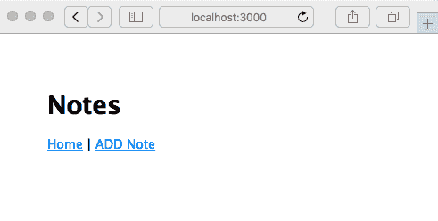
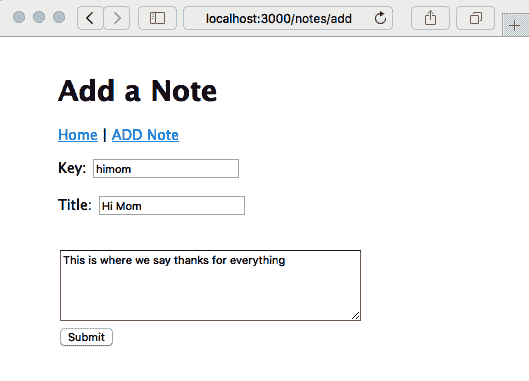
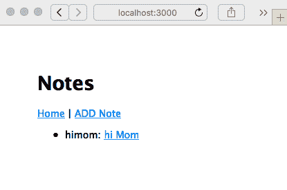
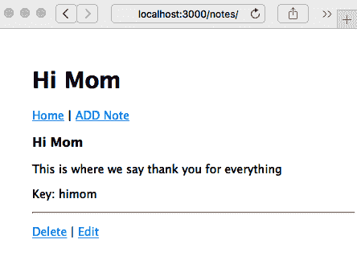
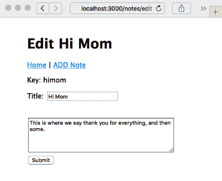
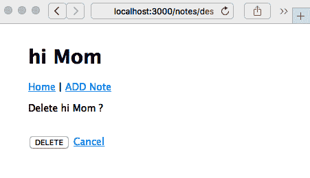
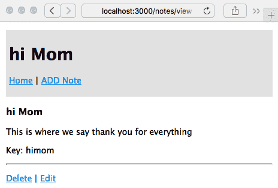
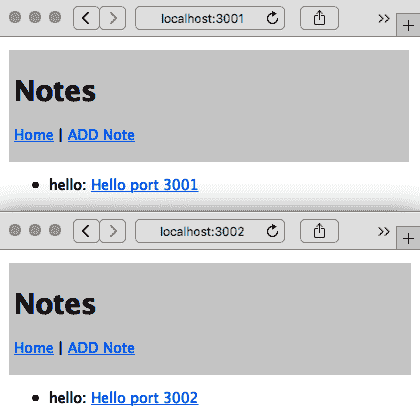

您的第一个 Express 应用程序

现在我们已经开始为 Node.js 构建 Express 应用程序，让我们开始开发一个执行有用功能的应用程序。我们将构建的应用程序将保留一个笔记列表，并最终会有用户可以互发消息。在本书的过程中，我们将使用它来探索一些真实 Express Web 应用程序的方面。

在本章中，我们将从应用程序的基本结构、初始 UI 和数据模型开始。我们还将为添加持久数据存储和我们将在后续章节中涵盖的所有其他功能奠定基础。

本章涵盖的主题包括以下内容：

+   在 Express 路由器函数中使用 Promises 和 async 函数

+   JavaScript 类定义和 JavaScript 类中的数据隐藏

+   使用 MVC 范例的 Express 应用程序架构

+   构建 Express 应用程序

+   实现 CRUD 范例

+   Express 应用程序主题和 Handlebars 模板

首先，我们将讨论如何将 Express 路由器回调与 async 函数集成。

# 第八章：在 Express 路由器函数中探索 Promises 和 async 函数的主题

在我们开始开发应用程序之前，我们需要深入了解如何在 Express 中使用`Promise`类和 async 函数，因为 Express 是在这些功能存在之前发明的，因此它不直接与它们集成。虽然我们应该尽可能使用 async 函数，但我们必须了解如何在某些情况下正确使用它们，比如在 Express 应用程序中。

Express 处理异步执行的规则如下：

+   同步错误由 Express 捕获，并导致应用程序转到错误处理程序。

+   异步错误必须通过调用`next(err)`来报告。

+   成功执行的中间件函数告诉 Express 通过调用`next()`来调用下一个中间件。

+   返回 HTTP 请求结果的路由器函数不调用`next()`。

在本节中，我们将讨论三种使用 Promises 和 async 函数的方法，以符合这些规则。

Promise 和 async 函数都用于延迟和异步计算，并且可以使深度嵌套的回调函数成为过去的事情：

+   `Promise`类表示尚未完成但预计将来完成的操作。我们已经使用过 Promises，所以我们知道当承诺的结果（或错误）可用时，`.then`或`.catch`函数会异步调用。

+   在异步函数内部，`await`关键字可用于自动等待 Promise 解析。它返回 Promise 的结果，否则在下一行代码的自然位置抛出错误，同时也适应异步执行。

异步函数的魔力在于我们可以编写看起来像同步代码的异步代码。它仍然是异步代码——意味着它与 Node.js 事件循环正确工作——但是结果和错误不再落在回调函数内部，而是自然地作为异常抛出，结果自然地落在下一行代码上。

因为这是 JavaScript 中的一个新功能，所以我们必须正确地整合几种传统的异步编码实践。您可能会遇到一些其他用于管理异步代码的库，包括以下内容：

+   `async`库是一组用于各种异步模式的函数。它最初完全围绕回调函数范式实现，但当前版本可以处理 async 函数，并且作为 ES6 包可用。有关更多信息，请参阅[`www.npmjs.com/package/async`](https://www.npmjs.com/package/async)。

+   在 Promise 标准化之前，至少有两种实现可用：Bluebird ([`bluebirdjs.com/`](http://bluebirdjs.com/))和 Q ([`www.npmjs.com/package/q`](https://www.npmjs.com/package/q))。如今，我们专注于使用标准内置的`Promise`对象，但这两个包都提供了额外的功能。更有可能的是，我们会遇到使用这些库的旧代码。

这些和其他工具的开发是为了更容易编写异步代码并解决**末日金字塔**问题。这是根据代码在几层嵌套后采取的形状而命名的。任何以回调函数编写的多阶段过程都可能迅速升级为嵌套多层的代码。考虑以下例子：

```

We don't need to worry about the specific functions, but we should instead recognize that one callback tends to lead to another. Before you know it, you've landed in the middle of a deeply nested structure like this. Rewriting this as an async function will make it much clearer. To get there, we need to examine how Promises are used to manage asynchronous results, as well as get a deeper understanding of async functions.

A Promise is either in an unresolved or resolved state. This means that we create a Promise using `new Promise`, and initially, it is in the unresolved state. The `Promise` object transitions to the resolved state, where either its `resolve` or `reject` functions are called. If the `resolve` function is called, the Promise is in a successful state, and if instead its `reject` function is called, the Promise is in a failed state.

More precisely, Promise objects can be in one of three states:

*   **Pending**: This is the initial state, which is neither fulfilled nor rejected.
*   **Fulfilled**: This is the final state, where it executes successfully and produces a result.
*   **Rejected**: This is the final state, where execution fails.

We generate a Promise in the following way:

```

这样的函数创建了`Promise`对象，给它一个回调函数，在其中是您的异步操作。`resolve`和`reject`函数被传递到该函数中，并在 Promise 解析为成功或失败状态时调用。`new Promise`的典型用法是这样的结构：

```

This is the pattern that we use when *promisifying* an asynchronous function that uses callbacks. The asynchronous code executes, and in the callback, we invoke either `resolve` or `reject`, as appropriate. We can usually use the `util.promisify` Node.js function to do this for us, but it's very useful to know how to construct this as needed.

Your caller then uses the function, as follows:

```

`Promise`对象足够灵活，传递给`.then`处理程序的函数可以返回一些东西，比如另一个 Promise，并且可以将`.then`调用链接在一起。在`.then`处理程序中返回的值（如果有的话）将成为一个新的`Promise`对象，通过这种方式，您可以构建一个`.then`和`.catch`调用链来管理一系列异步操作。

使用`Promise`对象，一系列异步操作被称为**Promise 链**，由链接的`.then`处理程序组成，我们将在下一节中看到。

## 在 Express 路由函数中的 Promise 和错误处理

重要的是要正确处理所有错误并将其报告给 Express。对于同步代码，Express 将正确捕获抛出的异常并将其发送到错误处理程序。看下面的例子：

```

Express catches that exception and does the right thing, meaning it invokes the error handler, but it does not see a thrown exception in asynchronous code. Consider the following error example:

```

这是一个错误指示器落在回调函数中不方便的地方的例子。异常在一个完全不同的堆栈帧中抛出，而不是由 Express 调用的堆栈帧。即使我们安排返回一个 Promise，就像异步函数的情况一样，Express 也不处理 Promise。在这个例子中，错误被丢失；调用者永远不会收到响应，也没有人知道为什么。

重要的是要可靠地捕获任何错误，并用结果或错误回应调用者。为了更好地理解这一点，让我们重新编写一下“末日金字塔”示例：

```

This is rewritten using a Promise chain, rather than nested callbacks. What had been a deeply nested pyramid of callback functions is now arguably a little cleaner thanks to Promises.

The `Promise` class automatically captures all the errors and searches down the chain of operations attached to the Promise to find and invoke the first `.catch` function. So long as no errors occur, each `.then` function in the chain is executed in turn. 

One advantage of this is that error reporting and handling is much easier. With the callback paradigm, the nature of the callback pyramid makes error reporting trickier, and it's easy to miss adding the correct error handling to every possible branch of the pyramid. Another advantage is that the structure is flatter and, therefore, easier to read.

To integrate this style with Express, notice the following:

*   The final step in the Promise chain uses `res.render` or a similar function to return a response to the caller.
*   The final `catch` function reports any errors to Express using `next(err)`.

If instead we simply returned the Promise and it was in the `rejected` state, Express would not handle that failed rejection and the error would be lost.

Having looked at integrating asynchronous callbacks and Promise chains with Express, let's look at integrating async functions.

## Integrating async functions with Express router functions

There are two problems that need to be addressed that are related to asynchronous coding in JavaScript. The first is the pyramid of doom, an unwieldily nested callback structure. The second is the inconvenience of where results and errors are delivered in an asynchronous callback.

To explain, let's reiterate the example that Ryan Dahl gives as the primary Node.js idiom:

```

这里的目标是避免使用长时间操作阻塞事件循环。使用回调函数推迟处理结果或错误是一个很好的解决方案，也是 Node.js 的基本习惯用法。回调函数的实现导致了这个金字塔形的问题。Promise 帮助扁平化代码，使其不再呈现金字塔形状。它们还捕获错误，确保将其传递到有用的位置。在这两种情况下，错误和结果都被埋在一个匿名函数中，并没有传递到下一行代码。

生成器和迭代协议是一个中间的架构步骤，当与 Promise 结合时，会导致异步函数。我们在本书中不会使用这两者，但值得了解。

有关迭代协议的文档，请参阅[`developer.mozilla.org/en-US/docs/Web/JavaScript/Reference/Iteration_protocols`](https://developer.mozilla.org/en-US/docs/Web/JavaScript/Reference/Iteration_protocols)。

有关生成器函数的文档，请参阅[`developer.mozilla.org/en-US/docs/Web/JavaScript/Reference/Global_Objects/Generator`](https://developer.mozilla.org/en-US/docs/Web/JavaScript/Reference/Global_Objects/Generator)。

我们已经使用了异步函数，并了解了它们如何让我们编写看起来整洁的异步代码。例如，`db.query`作为异步函数的示例如下：

```

This is much cleaner, with results and errors landing where we want them to.

However, to discuss integration with Express, let's return to the pyramid of doom example from earlier, rewriting it as an async function:

```

除了`try/catch`，这个例子与之前的形式相比非常干净，无论是作为回调金字塔还是 Promise 链。所有样板代码都被抹去，程序员的意图清晰地展现出来。没有东西丢失在回调函数中。相反，一切都方便地落在下一行代码中。

`await`关键字寻找一个 Promise。因此，`doSomething`和其他函数都应该返回一个 Promise，而`await`管理其解析。这些函数中的每一个都可以是一个异步函数，因此自动返回一个 Promise，或者可以显式创建一个 Promise 来管理异步函数调用。生成器函数也涉及其中，但我们不需要知道它是如何工作的。我们只需要知道`await`管理异步执行和 Promise 的解析。

更重要的是，带有`await`关键字的每个语句都是异步执行的。这是`await`的一个副作用——管理异步执行以确保异步结果或错误被正确传递。然而，Express 无法捕获异步错误，需要我们使用`next()`通知它异步结果。

`try/catch`结构是为了与 Express 集成而需要的。基于刚才给出的原因，我们必须显式捕获异步传递的错误，并使用`next(err)`通知 Express。

在本节中，我们讨论了三种通知 Express 有关异步传递错误的方法。接下来要讨论的是一些架构选择，以便结构化代码。

# 在 MVC 范式中架构 Express 应用程序

Express 不会强制规定你应该如何构建应用程序的**模型**、**视图**和**控制器**（**MVC**）模块的结构，或者是否应该完全遵循任何 MVC 范式。MVC 模式被广泛使用，涉及三个主要的架构组件。**控制器**接受用户的输入或请求，将其转换为发送给模型的命令。**模型**包含应用程序操作的数据、逻辑和规则。**视图**用于向用户呈现结果。

正如我们在上一章中学到的，Express 生成器创建的空应用程序提供了 MVC 模型的两个方面：

+   `views`目录包含模板文件，控制显示部分，对应于视图。

+   `routes`目录包含实现应用程序识别的 URL 并协调生成每个 URL 响应所需的数据操作的代码。这对应于控制器。

由于路由器函数还调用函数来使用模板生成结果，我们不能严格地说路由器函数是控制器，`views`模板是视图。然而，这足够接近 MVC 模型，使其成为一个有用的类比。

这让我们面临一个问题，那就是在哪里放置模型代码。由于相同的数据操作可以被多个路由器函数使用，显然路由器函数应该使用一个独立的模块（或模块）来包含模型代码。这也将确保关注点的清晰分离，例如，以便轻松进行每个单元的测试。

我们将使用的方法是创建一个`models`目录，作为`views`和`routes`目录的同级目录。`models`目录将包含处理数据存储和其他我们可能称之为**业务逻辑**的代码的模块。`models`目录中模块的 API 将提供创建、读取、更新或删除数据项的函数——一个**C****reate,** **R****ead,** **Update, and D****elete**/**Destroy **(**CRUD**)模型——以及视图代码执行其任务所需的其他函数。

CRUD 模型包括持久数据存储的四个基本操作。`Notes`应用程序被构建为一个 CRUD 应用程序，以演示实现这些操作的过程。

我们将使用`create`、`read`、`update`和`destroy`函数来实现每个基本操作。

我们使用`destroy`动词，而不是`delete`，因为`delete`是 JavaScript 中的保留字。

考虑到这个架构决定，让我们继续创建`Notes`应用程序。

# 创建 Notes 应用程序

由于我们正在启动一个新的应用程序，我们可以使用 Express 生成器给我们一个起点。虽然不一定要使用这个工具，因为我们完全可以自己编写代码。然而，优点在于它给了我们一个完全成熟的起点：

```

As in the previous chapter, we will use `cross-env` to ensure that the scripts run cross-platform. Start by changing `package.json` to have the following `scripts` section:

```

提供的脚本使用`bin/www`，但很快，我们将重新构造生成的代码，将所有内容放入一个名为`app.mjs`的单个 ES6 脚本中。

然后，安装`cross-env`，如下所示：

```

With `cross-env`, the scripts are executable on either Unix-like systems or Windows.

If you wish, you can run `npm start` and view the blank application in your browser. Instead, let's rewrite this starting-point code using ES6 modules, and also combine the contents of `bin/www` with `app.mjs`.

## Rewriting the generated router module as an ES6 module

Let's start with the `routes` directory. Since we won't have a `Users` concept right now, delete `users.js`. We need to convert the JavaScript files into ES6 format, and we can recall that the simplest way for a module to be recognized as an ES6 module is to use the `.mjs` extension. Therefore, rename `index.js` to `index.mjs`, rewriting it as follows:

```

我们稍后会完成这个，但我们所做的是重新构造我们得到的代码。我们可以导入 Express 包，然后导出`router`对象。添加路由函数当然是以相同的方式进行的，无论是 CommonJS 还是 ES6 模块。我们将路由回调设置为异步函数，因为它将使用异步代码。

我们需要遵循相同的模式来创建任何其他路由模块。

将其转换为 ES6 模块后，下一步是将`bin/www`和`app.js`的代码合并到一个名为`app.mjs`的 ES6 模块中。

## 创建 Notes 应用程序连接 - app.mjs

由于`express-generator`工具给了我们一个略显混乱的应用程序结构，没有使用 ES6 模块，让我们适当地重新构思它给我们的代码。首先，`app.mjs`包含了应用程序的“连接”，意味着它配置了构成应用程序的对象和函数，而不包含任何自己的函数。另一个代码`appsupport.mjs`包含了在生成的`app.js`和`bin/www`模块中出现的回调函数。

在`app.mjs`中，从这里开始：

```

The generated `app.js` code had a series of `require` statements. We have rewritten them to use corresponding `import` statements. We also added code to calculate the `__filename` and `__dirname` variables, but presented a little differently. To support this, add a new module, `approotdir.mjs`, containing the following:

```

在第三章的`dirname-fixed.mjs`示例中，我们从`path`和`url`核心模块中导入了特定的函数。我们使用了那段代码，然后将`__dirname`的值导出为`approotdir`。Notes 应用程序的其他部分只需要应用程序的根目录的路径名，以便计算所需的路径名。

回到`app.mjs`，你会看到路由模块被导入为`indexRouter`和`notesRouter`。目前，`notesRouter`被注释掉了，但我们将在后面的部分中处理它。

现在，让我们初始化`express`应用程序对象：

```

This should look familiar to the `app.js` code we used in the previous chapter. Instead of inline functions, however, they're pushed into `appsupport.mjs`.

The `app` and `port` objects are exported in case some other code in the application needs those values.

This section of code creates and configures the Express application instance. To make it a complete running server, we need the following code:

```

这段代码将 Express 应用程序包装在 HTTP 服务器中，并让它监听 HTTP 请求。`server`对象也被导出，以便其他代码可以访问它。

将`app.mjs`与生成的`app.js`和`bin/www`代码进行比较，你会发现我们已经覆盖了这两个模块中的所有内容，除了内联函数。这些内联函数可以写在`app.mjs`的末尾，但我们选择创建第二个模块来保存它们。

创建`appsupport.mjs`来保存内联函数，从以下开始：

```

This function handles safely converting a port number string that we might be given into a numerical value that can be used in the application. The `isNaN` test is used to handle cases where instead of a TCP port number, we want to use a **named pipe**. Look carefully at the other functions and you'll see that they all accommodate either a numerical port number or a string described as a pipe:

```

前面的代码处理了来自 HTTP 服务器对象的错误。其中一些错误将简单地导致服务器退出：

```

The preceding code prints a user-friendly message saying where the server is listening for HTTP connections. Because this function needs to reference the server object, we have imported it:

```

这些以前是实现 Express 应用程序的错误处理的内联函数。

这些更改的结果是`app.mjs`现在没有分散注意力的代码，而是专注于连接构成应用程序的不同部分。由于 Express 没有固定的意见，它并不在乎我们像这样重构代码。我们可以以任何对我们有意义并且正确调用 Express API 的方式来构建代码结构。

由于这个应用程序是关于存储数据的，让我们接下来谈谈数据存储模块。

## 实现 Notes 数据存储模型

请记住，我们之前决定将数据模型和数据存储代码放入一个名为`models`的目录中，以配合`views`和`routes`目录。这三个目录将分别存储 MVC 范例的三个方面。

这个想法是集中存储数据的实现细节。数据存储模块将提供一个 API 来存储和操作应用程序数据，在本书的过程中，我们将对这个 API 进行多次实现。要在不同的存储引擎之间切换，只需要进行配置更改。应用程序的其余部分将使用相同的 API 方法，无论使用的是哪种存储引擎。

首先，让我们定义一对类来描述数据模型。在`models/Notes.mjs`中创建一个名为`models/Notes.mjs`的文件，并在其中包含以下代码：

```

This defines two classes—`Note` and `AbstractNotesStore`—whose purpose is as follows:

*   The `Note` class describes a single note that our application will manage.
*   The `AbstractNotesStore` class describes methods for managing some note instances.

In the `Note` class, `key` is how we look for the specific note, and `title` and `body` are the content of the note. It uses an important data hiding technique, which we'll discuss in a minute.

The `AbstractNotesStore` class documents the methods that we'll use for accessing notes from a data storage system. Since we want the `Notes` application to implement the CRUD paradigm, we have the `create`, `read`, `update`, and `destroy` methods, plus a couple more to assist in searching for notes. What we have here is an empty class that serves to document the API, and we will use this as the base class for several storage modules that we'll implement later.

The `close` method is meant to be used when we're done with a datastore. Some datastores keep an open connection to a server, such as a database server, and the `close` method should be used to close that connection.

This is defined with `async` functions because we'll store data in the filesystem or in databases. In either case, we need an asynchronous API.

Before implementing our first data storage model, let's talk about data hiding in JavaScript classes.

### Data hiding in ES-2015 class definitions

In many programming languages, class definitions let us designate some data fields as private and others as public. This is so that programmers can hide implementation details. However, writing code on the Node.js platform is all about JavaScript, and JavaScript, in general, is very lax about everything. So, by default, fields in an instance of a JavaScript class are open to any code to access or modify.

One concern arises if you have several modules all adding fields or functions to the same object. How do you guarantee that one module won't step on fields added by another module? By default, in JavaScript, there is no such guarantee.

Another concern is hiding implementation details so that the class can be changed while knowing that internal changes won't break other code. By default, JavaScript fields are open to all other code, and there's no guarantee other code won't access fields that are meant to be private.

The technique used in the `Note` class gates access to the fields through getter and setter functions. These in turn set or get values stored in the instance of the class. By default, those values are visible to any code, and so these values could be modified in ways that are incompatible with the class. The best practice when designing classes is to localize all manipulation of class instance data to the member functions. However, JavaScript makes the fields visible to the world, making it difficult to follow this best practice. The pattern used in the `Note` class is the closest we can get in JavaScript to data hiding in a class instance.

The technique we use is to name the fields using instances of the `Symbol` class. `Symbol`, another ES-2015 feature, is an opaque object with some interesting attributes that make it attractive for use as keys for private fields in objects. Consider the following code:

```

创建`Symbol`实例是通过`Symbol('symbol-name')`完成的。生成的`Symbol`实例是一个唯一标识符，即使再次调用`Symbol('symbol-name')`，唯一性也得到保留。每个`Symbol`实例都是唯一的，即使是由相同的字符串形成的。在这个例子中，`b`和`b1`变量都是通过调用`Symbol('b')`形成的，但它们并不相等。

让我们看看如何使用`Symbol`实例来附加字段到一个对象上：

```

We've created a little object, then used those `Symbol` instances as field keys to store data in the object. Notice that when we dump the object's contents, the two fields both register as `Symbol(b)`, but they are two separate fields.

With the `Note` class, we have used the `Symbol` instances to provide a small measure of data hiding. The actual values of the `Symbol` instances are hidden inside `Notes.mjs`. This means the only code that can directly access the fields is the code running inside `Notes.mjs`:

```

定义了`Note`类之后，我们可以创建一个`Note`实例，然后转储它并查看结果字段。这些字段的键确实是`Symbol`实例。这些`Symbol`实例被隐藏在模块内部。这些字段本身对模块外部的代码是可见的。正如我们在这里看到的，企图用`note[Symbol('key')] = 'new key'`来破坏实例并不会覆盖字段，而是会添加第二个字段。

定义了我们的数据类型，让我们从一个简单的内存数据存储开始实现应用程序。

## 实现内存中的笔记数据存储

最终，我们将创建一个`Notes`数据存储模块，将笔记持久化到长期存储中。但是为了让我们开始，让我们实现一个内存数据存储，这样我们就可以继续实现应用程序。因为我们设计了一个抽象基类，我们可以很容易地为各种存储服务创建新的实现。

在`models`目录中创建一个名为`notes-memory.mjs`的文件，其中包含以下代码：

```

This should be fairly self-explanatory. The notes are stored in a private array, named `notes`. The operations, in this case, are defined in terms of adding or removing items in that array. The `key` object for each `Note` instance is used as the index to the `notes` array, which in turn holds the `Note` instance. This is simple, fast, and easy to implement. It does not support any long-term data persistence, and any data stored in this model will disappear when the server is killed.

We need to initialize an instance of `NotesStore` so that it can be used in the application. Let's add the following to `app.mjs`, somewhere near the top:

```

这将创建一个类的实例并将其导出为`NotesStore`。只要我们有一个单一的`NotesStore`实例，这将起作用，但是在第七章中，*数据存储和检索*，我们将改变这一点，以支持动态选择`NotesStore`实例。

我们现在准备开始实现应用程序的网页和相关代码，从主页开始。

## 笔记主页

我们将修改起始应用程序以支持创建、编辑、更新、查看和删除笔记。让我们从更改主页开始，显示一个笔记列表，并在顶部导航栏中添加一个链接到添加笔记页面，这样我们就可以随时添加新的笔记。

`app.mjs`中不需要更改，因为主页是在这个路由模块中控制的。

```

In `app.mjs`, we configured the Handlebars template engine to use the `partials` directory to hold partial files. Therefore, make sure you create that directory.

To implement the home page, update `routes/index.mjs` to the following:

```

我们之前展示了这个概要，并且已经定义了`Notes`数据存储模型，我们可以填写这个函数。

这使用了我们之前设计的`AbstractNotesStore` API。`keylist`方法返回当前应用程序存储的笔记的键值列表。然后，它使用`read`方法检索每个笔记，并将该列表传递给一个模板，该模板呈现主页。这个模板将呈现一个笔记列表。

如何检索所有的笔记？我们可以编写一个简单的`for`循环，如下所示：

```

This has the advantage of being simple to read since it's a simple `for` loop. The problem is that this loop reads the notes one at a time. It's possible that reading the notes in parallel is more efficient since there's an opportunity to interweave the processing.

The `Promise.all` function executes an array of Promises in parallel, rather than one at a time. The `keyPromises` variable ends up being an array of Promises, each of which is executing `notes.read` to retrieve a single note.

The `map` function in the arrays converts (or maps) the values of an input array to produce an output array with different values. The output array has the same length as the input array, and the entries are a one-to-one mapping of the input value to an output value. In this case, we map the keys in `keylist` to a Promise that's waiting on a function that is reading each note. Then, `Promise.all` waits for all the Promises to resolve into either success or failure states.

The output array, `notelist`, will be filled with the notes once all the Promises succeed. If any Promises fail, they are rejected—in other words, an exception will be thrown instead. 

The `notelist` array is then passed into the `view` template that we're about to write.

But first, we need a page layout template. Create a file, `views/layout.hbs`, containing the following:

```

这是由`express-generator`生成的文件，还添加了一个用于页面标题的`header`部分。

请记住，在斐波那契应用程序中，我们使用了一个*partial*来存储导航的 HTML 片段。部分是 HTML 模板片段，可以在一个或多个模板中重用。在这种情况下，`header`部分将出现在每个页面上，并作为应用程序中的通用导航栏。创建`partials/header.hbs`，包含以下内容：

```

This simply looks for a variable, `title`, which should have the page title. It also outputs a navigation bar containing a pair of links—one to the home page and another to `/notes/add`, where the user will be able to add a new note.

Now, let's rewrite `views/index.hbs` to this:

```

这只是简单地遍历笔记数据数组并格式化一个简单的列表。每个项目都链接到`/notes/view` URL，并带有一个`key`参数。我们还没有编写处理该 URL 的代码，但显然会显示笔记。另一个需要注意的是，如果`notelist`为空，将不会生成列表的 HTML。

当然，还有很多东西可以放进去。例如，通过在这里添加适当的`script`标签，可以很容易地为每个页面添加 jQuery 支持。

我们现在已经写了足够的内容来运行应用程序，让我们查看主页：

```

If we visit `http://localhost:3000`, we will see the following page:



Because there aren't any notes (yet), there's nothing to show. Clicking on the Home link just refreshes the page. Clicking on the ADD Note link throws an error because we haven't (yet) implemented that code. This shows that the provided error handler in `app.mjs` is performing as expected.

Having implemented the home page, we need to implement the various pages of the application. We will start with the page for creating new notes, and then we will implement the rest of the CRUD support.

## Adding a new note – create

If we click on the ADD Note link, we get an error because the application doesn't have a route configured for the `/notes/add` URL; we need to add one. To do that, we need a controller module for the notes that defines all the pages for managing notes in the application.

In `app.mjs`, uncomment the two lines dealing with `notesRouter`:

```

我们最终会在`app.mjs`中得到这个。我们导入两个路由，然后将它们添加到应用程序配置中。

创建一个名为`routes/notes.mjs`的文件来保存`notesRouter`，并以以下内容开始：

```

This handles the `/notes/add` URL corresponding to the link in `partials/header.hbs`. It simply renders a template, `noteedit`, using the provided data.

In the `views` directory, add the corresponding template, named `noteedit.hbs`, containing the following:

```

这个模板支持创建新笔记和更新现有笔记。我们将通过`docreate`标志重用这个模板来支持这两种情况。

请注意，在这种情况下，传递给模板的`note`和`notekey`对象是空的。模板检测到这种情况，并确保输入区域为空。此外，还传递了一个标志`docreate`，以便表单记录它是用于创建还是更新笔记。在这一点上，我们正在添加一个新的笔记，所以没有`note`对象存在。模板代码被防御性地编写，以避免抛出错误。

创建 HTML 表单时，必须小心使用包含值的元素中的空格。考虑一个情况，`<textarea>`元素被格式化如下：

```

By normal coding practices, this looks alright, right? It's nicely indented, with the code arranged for easy reading. The problem is that extra whitespace ends up being included in the `body` value when the form is submitted to the server. That extra whitespace is added because of the nicely indented code. To avoid that extra whitespace, we need to use the angle brackets in the HTML elements that are directly adjacent to the Handlebars code to insert the value. Similar care must be taken with the elements with the `value=` attributes, ensuring no extra whitespace is within the `value` string.

This template is a form that will post its data to the `/notes/save` URL. If you were to run the application now, it would give you an error message because no route is configured for that URL.

To support the `/notes/save` URL, add it to `routes/notes.mjs`:

```

因为这个 URL 也将用于创建和更新笔记，所以我们检查`docreate`标志来调用适当的模型操作。

`notes.create`和`notes.update`都是异步函数，这意味着我们必须使用`await`。

这是一个 HTTP `POST` 处理程序。由于`bodyParser`中间件，表单数据被添加到`req.body`对象中。附加到`req.body`的字段直接对应于 HTML 表单中的元素。

在这里，以及大多数其他路由函数中，我们使用了我们之前讨论过的`try/catch`结构，以确保错误被捕获并正确转发给 Express。这与前面的`/notes/add`路由函数的区别在于路由器是否使用异步回调函数。在这种情况下，它是一个异步函数，而对于`/notes/add`，它不是异步的。Express 知道如何处理非异步回调中的错误，但不知道如何处理异步回调函数中的错误。

现在，我们可以再次运行应用程序并使用“添加笔记”表单：



然而，点击提交按钮后，我们收到了一个错误消息。这是因为还没有任何东西来实现`/notes/view` URL。

您可以修改`Location`框中的 URL 以重新访问`http://localhost:3000`，然后在主页上看到类似以下截图的内容：



笔记实际上已经存在；我们只需要实现`/notes/view`。让我们继续进行。

## 查看笔记-读取

现在我们已经了解了如何创建笔记，我们需要继续阅读它们。这意味着为`/notes/view` URL 实现控制器逻辑和视图模板。

将以下`router`函数添加到`routes/notes.mjs`中：

```

Because this route is mounted on a router handling, `/notes`, this route handles `/notes/view`.

The handler simply calls `notes.read` to read the note. If successful, the note is rendered with the `noteview` template. If something goes wrong, we'll instead display an error to the user through Express.

Add the `noteview.hbs` template to the `views` directory, referenced by the following code:

```

这很简单；我们从`note`对象中取出数据，并使用 HTML 显示它。底部有两个链接——一个是到`/notes/destroy`用于删除笔记，另一个是到`/notes/edit`用于编辑它。

这两个对应的代码目前都不存在，但这并不妨碍我们继续执行应用程序：



正如预期的那样，使用这段代码，应用程序会正确重定向到`/notes/view`，我们可以看到我们的成果。同样，预期之中，点击删除或编辑链接都会给我们一个错误，因为代码还没有被实现。

接下来我们将创建处理编辑链接的代码，稍后再创建处理删除链接的代码。

## 编辑现有的笔记 - 更新

现在我们已经看过了`create`和`read`操作，让我们看看如何更新或编辑一个笔记。

在`routes/notes.mjs`中添加以下路由函数：

```

This handles the `/notes/edit` URL.

We're reusing the `noteedit.hbs` template because it can be used for both the `create` and `update`/`edit` operations. Notice that we pass `false` for `docreate`, informing the template that it is to be used for editing.

In this case, we first retrieve the `note` object and then pass it through to the template. This way, the template is set up for editing, rather than note creation. When the user clicks on the Submit button, we end up in the same `/notes/save` route handler shown in the preceding screenshot. It already does the right thing—calling the `notes.update` method in the model, rather than `notes.create`.

Because that's all we need to do, we can go ahead and rerun the application:



Click on the Submit button here and you will be redirected to the `/notes/view` screen, where you will then be able to read the newly edited note. Back at the `/notes/view` screen, we've just taken care of the Edit link, but the Delete link still produces an error.

Therefore, we next need to implement a page for deleting notes.

## Deleting notes – destroy

Now, let's look at how to implement the `/notes/destroy` URL to delete notes.

 Add the following router function to `routes/notes.mjs`:

```

销毁一个笔记是一个重要的步骤，因为如果用户犯了错误，就没有垃圾桶可以从中恢复。因此，我们需要询问用户是否确定要删除笔记。在这种情况下，我们检索笔记，然后呈现以下页面，显示一个问题以确保他们确定要删除笔记。

在`views`目录中添加一个`notedestroy.hbs`模板：

```

This is a simple form that asks the user to confirm by clicking on the button. The Cancel link just sends them back to the `/notes/view` page. Clicking on the Submit button generates a `POST` request on the `/notes/destroy/confirm` URL.

This URL needs a request handler. Add the following code to `routes/notes.mjs`:

```

这调用模型中的`notes.destroy`函数。如果成功，浏览器将重定向到主页。如果不成功，会向用户显示错误消息。重新运行应用程序，我们现在可以看到它在运行中的样子：



现在应用程序中的一切都在运行，您可以点击任何按钮或链接，并保留所有想要的笔记。

我们已经实现了一个简单的笔记管理应用程序。现在让我们看看如何改变外观，因为在下一章中，我们将实现一个移动优先的用户界面。

# 为您的 Express 应用程序设置主题

Express 团队在确保 Express 应用程序一开始看起来不错方面做得相当不错。我们的`Notes`应用程序不会赢得任何设计奖，但至少它不丑陋。现在基本应用程序正在运行，有很多方法可以改进它。让我们快速看看如何为 Express 应用程序设置主题。在第六章*实现移动优先范式*中，我们将深入探讨这一点，重点关注解决移动市场这一重要目标。

如果您正在使用推荐的方法`npm start`运行`Notes`应用程序，控制台窗口中将打印出一条不错的活动日志。其中之一是以下内容：

```

This is due to the following line of code, which we put into `layout.hbs`:

```

这个文件是由 Express 生成器在一开始为我们自动生成的，并且被放在`public`目录中。`public`目录由 Express 静态文件服务器管理，使用`app.mjs`中的以下行：

```

Therefore, the CSS stylesheet is at `public/stylesheets/style.css`, so let's open it and take a look:

```

一个显眼的问题是应用程序内容在屏幕顶部和左侧有很多空白。原因是`body`标签有`padding: 50px`样式。更改它很快。

由于 Express 静态文件服务器中没有缓存，我们可以简单地编辑 CSS 文件并重新加载页面，CSS 也将被重新加载。

让我们做一些调整：

```

This changes the padding and also adds a gray box around the header area.

As a result, we'll have the following:



We're not going to win any design awards with this either, but there's the beginning of some branding and theming possibilities. More importantly, it proves that we can make edits to the theming.

Generally speaking, through the way that we've structured the page templates, applying a site-wide theme is just a matter of adding appropriate code to `layout.hbs`, along with appropriate stylesheets and other assets.

In Chapter 6, *Implementing the Mobile-First Paradigm*, we will look at a simple method to add these frontend libraries to your application.

Before closing out this chapter, we want to think ahead to scaling the application to handle multiple users.

# Scaling up – running multiple Notes instances

Now that we've got ourselves a running application, you'll have played around a bit and created, read, updated, and deleted many notes.

Suppose for a moment that this isn't a toy application, but one that is interesting enough to draw millions of users a day. Serving a high load typically means adding servers, load balancers, and many other things. A core part of this is to have multiple instances of the application running at the same time to spread the load.

Let's see what happens when you run multiple instances of the `Notes` application at the same time.

The first thing is to make sure the instances are on different ports. In `app.mjs`, you'll see that setting the `PORT` environment variable controls the port being used. If the `PORT` variable is not set, it defaults to `http://localhost:3000`, or what we've been using all along.

Let's open up `package.json` and add the following lines to the `scripts` section:

```

`server1`脚本在`PORT 3001`上运行，而`server2`脚本在`PORT 3002`上运行。在一个地方记录所有这些是不是很好？

然后，在一个命令窗口中，运行以下命令：

```

In another command window, run the following:

```

这给了我们两个`Notes`应用程序的实例。使用两个浏览器窗口访问`http://localhost:3001`和`http://localhost:3002`。输入一些笔记，你可能会看到类似这样的东西：



编辑和添加一些笔记后，您的两个浏览器窗口可能看起来像前面的截图。这两个实例不共享相同的数据池；每个实例都在自己的进程和内存空间中运行。您在一个上添加一个笔记，在另一个屏幕上不会显示。

另外，由于模型代码不会将数据持久化存储在任何地方，笔记也不会被保存。你可能已经写了有史以来最伟大的 Node.js 编程书，但一旦应用服务器重新启动，它就消失了。

通常情况下，你会运行多个应用实例以提高性能。这就是老生常谈的“增加服务器”的把戏。为了使其生效，数据当然必须共享，并且每个实例必须访问相同的数据源。通常情况下，这涉及到数据库，当涉及到用户身份信息时，甚至可能需要武装警卫。

所有这些意味着数据库、更多的数据模型、单元测试、安全实施、部署策略等等。等一下——我们很快就会涉及到所有这些！

# 总结

在本章中，我们走了很长的路。

我们首先看了一下回调地狱，以及 Promise 对象和 async 函数如何帮助我们驯服异步代码。因为我们正在编写一个 Express 应用，我们看了如何在 Express 中使用 async 函数。我们将在本书中始终使用这些技术。

我们迅速转向使用 Express 编写真实应用的基础。目前，我们的应用程序将数据保存在内存中，但它具有成为支持实时协作评论的笔记应用的基本功能。

在下一章中，我们将初步涉足响应式、移动友好的网页设计领域。由于移动计算设备的日益普及，有必要先考虑移动设备，而不是桌面电脑用户。为了每天能够触达数百万用户，"Notes"应用用户在使用智能手机时需要良好的用户体验。

在接下来的章节中，我们将继续扩展"Notes"应用的功能，首先是数据库存储模型。但首先，在下一章中，我们有一个重要的任务——使用 Bootstrap 实现移动优先的用户界面。
