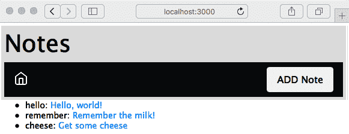
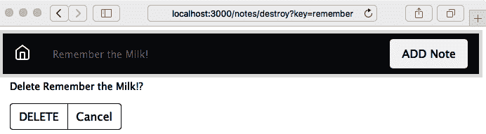

实施移动优先范式

现在我们的第一个 Express 应用程序可用，我们应该按照这个软件开发时代的口头禅行事：以移动设备为先。无论是智能手机、平板电脑、汽车仪表盘、冰箱门还是浴室镜子，移动设备正在占领世界。

在为移动设备设计时，主要考虑因素是小屏幕尺寸、触摸导向的交互、没有鼠标以及略有不同的**用户界面**（**UI**）期望。在 1997-8 年，当流媒体视频首次开发时，视频制作人员必须学会如何为视口大小与无花果（一种美国零食）大小相当的视频体验设计。今天，应用程序设计师必须应对与一张扑克牌大小相当的应用程序窗口。

对于*Notes*应用程序，我们的 UI 需求是简单的，而且没有鼠标对我们没有任何影响。

在本章中，我们不会进行太多的 Node.js 开发。相反，我们将进行以下操作：

+   修改 Notes 应用程序模板以获得更好的移动呈现效果。

+   编辑 Bootstrap SASS 文件以自定义应用程序主题。

+   安装第三方 Bootstrap 主题。

+   了解 Bootstrap 4.5，这是一个流行的响应式 UI 设计框架。

截至撰写本文时，Bootstrap v5 刚刚进入 alpha 阶段。这使得现在采用它为时尚早，但我们可能希望将来这样做。根据迁移指南，Bootstrap 的大部分内容在第 5 版中将保持不变，或者非常相似。然而，第 5 版中最大的变化是不再需要 jQuery。因为我们在第九章中相当频繁地使用 jQuery，这是一个重要的考虑因素，*使用 Socket.IO 进行动态客户端/服务器交互*。

通过完成前面列表中的任务，我们将初步了解成为全栈 Web 工程师意味着什么。本章的目标是获得应用程序开发的一个重要部分，即 UI 的介绍，以及 Web UI 开发的主要工具包之一。

与其仅仅因为它是流行的事物而进行移动优先开发，不如首先尝试理解正在解决的问题。

# 第九章：了解问题-Notes 应用程序不适合移动设备

让我们首先量化问题。我们需要探索应用在移动设备上的表现如何（或者不好）。这很容易做到：

1.  启动*Notes*应用程序。确定主机系统的 IP 地址。

1.  使用您的移动设备，使用 IP 地址连接到服务，并浏览*Notes*应用程序，对其进行测试并记录任何困难。

另一种方法是使用您的桌面浏览器，将其调整为非常窄。Chrome DevTools 还包括移动设备模拟器。无论哪种方式，您都可以在桌面上模拟智能手机的小屏幕尺寸。

要在移动屏幕上看到真正的 UI 问题，请编辑`views/noteedit.hbs`并进行以下更改：

```

What's changed is that we've added the `cols=80` parameter to set its width to be fixed at 80 columns. We want this `textarea` element to be overly large so that you can experience how a non-responsive web app appears on a mobile device. View the application on a mobile device and you'll see something like one of the screens in this screenshot:


Viewing a note works well on an iPhone 6, but the screen for editing/adding a note is not good. The text entry area is so wide that it runs off the side of the screen. Even though interaction with `FORM` elements works well, it's clumsy. In general, browsing the *Notes* application gives an acceptable mobile user experience that doesn't suck, but won't make our users leave rave reviews.

In other words, we have an example of a screen that works well on the developers' laptop but is horrid on the target platform. By following the mobile-first paradigm, the developer is expected to constantly check the behavior in a mobile web browser, or else the mobile view in the Chrome developer tool, and to design accordingly.

This gives us an idea of the sort of problem that responsive web design aims to correct. Before implementing a mobile-first design in our *Notes* app, let's discuss some of the theory behind responsive web design.

# Learning the mobile-first paradigm theory

Mobile devices have a smaller screen, are generally touch-oriented, and have different user experience expectations than a desktop computer.

To accommodate smaller screens, we use **responsive web design** techniques. This means designing the application to accommodate the screen size and ensuring websites provide optimal viewing and interaction across a wide range of devices. Techniques include changing font sizes, rearranging elements on the screen, using collapsible elements that open when touched, and resizing images or videos to fit available space. This is called **responsive** because the application responds to device characteristics by making these changes.

By *mobile-first*, we mean that you design the application to work well on a mobile device first, and then move on to devices with larger screens. It's about prioritizing mobile devices first.

The primary technique is using media queries in stylesheets to detect device characteristics. Each media query section targets a range of devices, using a CSS declaration to appropriately restyle content.

Let's consult a concrete example. The **Twenty Twelve** theme for WordPress has a straightforward responsive design implementation. It's not built with any framework, so you can see clearly how the mechanism works, and the stylesheet is small enough to be easily digestible. We're not going to use this code anywhere; instead, it is intended as a useful example of implementing a responsive design.

You can refer to the source code for the Twenty Twelve theme in the WordPress repository at [`themes.svn.wordpress.org/twentytwelve/1.9/style.css`](https://themes.svn.wordpress.org/twentytwelve/1.9/style.css).

The stylesheet starts with a number of **resets**, where the stylesheet overrides some typical browser style settings with clear defaults. Then, the bulk of the stylesheet defines styling for mobile devices. Toward the bottom of the stylesheet is a section labeled Media queries where, for certain sized screens, the styles defined for mobile devices are overridden to work on devices with larger screens.

It does this with the following two media queries:

```

样式表的第一部分配置了所有设备的页面布局。接下来，对于任何至少宽度为`600px`的浏览器视口，重新配置页面以在较大屏幕上显示。然后，对于任何至少宽度为`960px`的浏览器视口，再次重新配置。样式表有一个最终的媒体查询来覆盖打印设备。

这些宽度被称为**断点**。这些阈值视口宽度是设计自身改变的点。您可以通过访问任何响应式网站，然后调整浏览器窗口大小来查看断点的作用。观察设计在特定尺寸处的跳跃。这些是该网站作者选择的断点。

关于选择断点的最佳策略有很多不同的意见。您是要针对特定设备还是要针对一般特征？Twenty Twelve 主题仅使用两个视口大小媒体查询在移动设备上表现得相当不错。CSS-Tricks 博客发布了一个针对每个已知设备的具体媒体查询的广泛列表，可在[`css-tricks.com/snippets/css/media-queries-for-standard-devices/`](https://css-tricks.com/snippets/css/media-queries-for-standard-devices/)上找到。

我们至少应该针对这些设备：

+   **小**：这包括 iPhone 5 SE。

+   **中等**：这可以指平板电脑或更大的智能手机。

+   **大**：这包括更大的平板电脑或更小的台式电脑。

+   **特大**：这指的是更大的台式电脑和其他大屏幕。

+   **横向/纵向**：您可能希望区分横向模式和纵向模式。在两者之间切换当然会改变视口宽度，可能会将其推过断点。但是，您的应用程序可能需要在这两种模式下表现不同。

这就足够让我们开始响应式网页设计的理论。在我们的*Notes*应用程序中，我们将致力于使用触摸友好的 UI 组件，并使用 Bootstrap 根据屏幕尺寸调整用户体验。让我们开始吧。

# 在 Notes 应用程序中使用 Twitter Bootstrap

Bootstrap 是一个移动优先的框架，包括 HTML5、CSS3 和 JavaScript 代码，提供了一套世界级的响应式网页设计组件。它是由 Twitter 的工程师开发的，然后于 2011 年 8 月发布到世界上。

该框架包括将现代功能应用于旧浏览器的代码，响应式的 12 列网格系统，以及用于构建 Web 应用程序和网站的大量组件（其中一些使用 JavaScript）。它旨在为您的应用程序提供坚实的基础。

有关 Bootstrap 的更多详细信息，请参考[`getbootstrap.com`](http://getbootstrap.com)。

通过这个对 Bootstrap 的介绍，让我们继续设置它。

## 设置 Bootstrap

第一步是复制您在上一章中创建的代码。例如，如果您创建了一个名为`chap05/notes`的目录，那么从`chap05/notes`的内容中创建一个名为`chap06/notes`的目录。

现在，我们需要开始在*Notes*应用程序中添加 Bootstrap 的代码。Bootstrap 网站建议从 Bootstrap（和 jQuery）公共 CDN 加载所需的 CSS 和 JavaScript 文件。虽然这很容易做到，但我们不会这样做，有两个原因：

+   这违反了将所有依赖项保持本地化到应用程序并且不依赖全局依赖项的原则。

+   这使我们的应用程序依赖于 CDN 是否正常运行。

+   这会阻止我们生成自定义主题。

相反，我们将安装 Bootstrap 的本地副本。有几种方法可以在本地安装 Bootstrap。例如，Bootstrap 网站提供可下载的 TAR/GZIP 存档（tarball）。更好的方法是使用自动化依赖管理工具，幸运的是，npm 存储库中有我们需要的所有包。

最直接的选择是在 npm 存储库中使用 Bootstrap ([`www.npmjs.com/package/bootstrap`](https://www.npmjs.com/package/bootstrap))、Popper.js ([`www.npmjs.com/package/popper.js`](https://www.npmjs.com/package/popper.js))和 jQuery ([`www.npmjs.com/package/jquery`](https://www.npmjs.com/package/jquery))包。这些包不提供 Node.js 模块，而是通过 npm 分发的前端代码。许多前端库都是通过 npm 存储库分发的。

我们使用以下命令安装包：

```

As we can see here, when we install Bootstrap, it helpfully tells us the corresponding versions of jQuery and Popper.js to use. But according to the Bootstrap website, we are to use a different version of jQuery than what's shown here. Instead, we are to use jQuery 3.5.x instead of 1.9.1, because 3.5.x has many security issues fixed.

On the npm page for the Popper.js package ([`www.npmjs.com/package/popper.js`](https://www.npmjs.com/package/popper.js)), we are told this package is deprecated, and that Popper.js v2 is available from the `@popperjs/core` npm package. However, the Bootstrap project tells us to use this version of Popper.js, so that's what we'll stick with.

The Bootstrap *Getting Started* documentation explicitly says to use jQuery 3.5.1 and Popper 1.16.0, as of the time time of writing, as you can see at [`getbootstrap.com/docs/4.5/getting-started/introduction/`](https://getbootstrap.com/docs/4.5/getting-started/introduction/).

What's most important is to see what got downloaded:

```

在每个目录中都有用于在浏览器中使用的 CSS 和 JavaScript 文件。更重要的是，这些文件位于已知路径名的特定目录中，具体来说，就是我们刚刚检查过的目录。

让我们看看如何在浏览器端配置我们的 Notes 应用程序来使用这三个包，并在页面布局模板中设置 Bootstrap 支持。

## 将 Bootstrap 添加到 Notes 应用程序

在这一部分，我们将首先在页面布局模板中加载 Bootstrap CSS 和 JavaScript，然后确保 Bootstrap、jQuery 和 Popper 包可供使用。我们已经确保这些库安装在`node_modules`中，因此我们需要确保 Notes 知道将这些文件作为静态资产提供给 Web 浏览器。

在 Bootstrap 网站上，他们为页面提供了推荐的 HTML 结构。我们将从他们的建议中插入，以使用刚刚安装的 Bootstrap、jQuery 和 Popper 的本地副本。

请参阅[`getbootstrap.com/docs/4.5/getting-started/introduction/`](https://getbootstrap.com/docs/4.5/getting-started/introduction/)的*入门*页面。

我们将修改`views/layout.hbs`以匹配 Bootstrap 推荐的模板，通过进行粗体文本中显示的更改：

```

This is largely the template shown on the Bootstrap site, incorporated into the previous content of `views/layout.hbs`. Our own stylesheet is loaded following the Bootstrap stylesheet, giving us the opportunity to override anything in Bootstrap we want to change. What's different is that instead of loading Bootstrap, Popper.js, and jQuery packages from their respective CDNs, we use the path `/assets/vendor/product-name` instead.

This is the same as recommended on the Bootstrap website except the URLs point to our own site rather than relying on the public CDN. The pathname prefix, `/assets/vendor`, is routinely used to hold code provided by a third party.

This `/assets/vendor` URL is not currently recognized by the *Notes* application. To add this support, edit `app.mjs` to add these lines:

```

我们再次使用`express.static`中间件来为访问*Notes*应用程序的浏览器提供资产文件。每个路径名都是 npm 安装的 Bootstrap、jQuery 和 Popper 库的位置。

Popper.js 库有一个特殊的考虑。在`popper.js/dist`目录中，团队以 ES6 模块语法分发了一个库。此时，我们不能相信所有浏览器都支持 ES6 模块。在`popper.js/dist/umd`中是一个适用于所有浏览器的 Popper.js 库的版本。因此，我们已经适当地设置了目录。

在`public`目录中，我们需要做一些整理。当`express-generator`设置初始项目时，它生成了`public/images`、`public/javascripts`和`public/stylesheets`目录。因此，每个的 URL 都以`/images`、`/javascripts`和`/stylesheets`开头。给这些文件一个以`/assets`目录开头的 URL 更清晰。要实现这个改变，首先要移动文件如下：

```

We now have our asset files, including Bootstrap, Popper.js, and jQuery, all available to the *Notes* application under the `/assets` directory. Referring back to `views/layout.hbs`, notice that we said to change the URL for our stylesheet to `/assets/stylesheets/style.css`, which matches this change.

We can now try this out by running the application:

```

屏幕上的差异很小，但这是 CSS 和 JavaScript 文件被加载的必要证明。我们已经实现了第一个主要目标——使用现代的、移动友好的框架来实现移动优先设计。

在修改应用程序的外观之前，让我们谈谈其他可用的框架。

## 替代布局框架

Bootstrap 并不是唯一提供响应式布局和有用组件的 JavaScript/CSS 框架。当然，所有其他框架都有自己的特点。一如既往，每个项目团队都可以选择他们使用的技术，当然，市场也在不断变化，新的库不断出现。我们在这个项目中使用 Bootstrap 是因为它很受欢迎。这些其他框架也值得一看：

+   Pure.css ([`purecss.io/`](https://purecss.io/))：一个强调小代码占用空间的响应式 CSS 框架。

+   Picnic CSS ([`picnicss.com/`](https://picnicss.com/))：一个强调小尺寸和美观的响应式 CSS 框架。

+   Bulma ([`bulma.io/`](https://bulma.io/))：一个自称非常易于使用的响应式 CSS 框架。

+   Shoelace ([`shoelace.style/`](https://shoelace.style/))：一个强调使用未来 CSS 的 CSS 框架，意味着它使用 CSS 标准化的最前沿的 CSS 构造。由于大多数浏览器不支持这些功能，使用 cssnext ([`cssnext.io/`](http://cssnext.io/)) 来进行支持。Shoelace 使用基于 Bootstrap 网格的网格布局系统。

+   PaperCSS ([`www.getpapercss.com/`](https://www.getpapercss.com/))：一个看起来像手绘的非正式 CSS 框架。

+   Foundation ([`foundation.zurb.com/`](https://foundation.zurb.com/))：自称为世界上最先进的响应式前端框架。

+   Base（[`getbase.org/`](http://getbase.org/)）：一个轻量级的现代 CSS 框架。

HTML5 Boilerplate（[`html5boilerplate.com/`](https://html5boilerplate.com/)）是编写 HTML 和其他资产的极其有用的基础。它包含了网页 HTML 代码的当前最佳实践，以及用于规范化 CSS 支持和多个 Web 服务器的配置文件。

浏览器技术也在迅速改进，布局技术是其中之一。Flexbox 和 CSS Grid 布局系统在使 HTML 内容布局比以前的技术更容易方面是一个重大进步。

# Flexbox 和 CSS Grids

这两种新的 CSS 布局方法正在影响 Web 应用程序开发。CSS3 委员会一直在多个方面进行工作，包括页面布局。

在遥远的过去，我们使用嵌套的 HTML 表格进行页面布局。这是一个不愉快的回忆，我们不必再次回顾。最近，我们一直在使用使用`<div>`元素的盒模型，甚至有时使用绝对或相对定位技术。所有这些技术在多种方面都不够理想，有些更甚于其他。

一个流行的布局技术是将水平空间分成列，并为页面上的每个元素分配一定数量的列。使用一些框架，我们甚至可以有嵌套的`<div>`元素，每个都有自己的列集。Bootstrap 3 和其他现代框架使用了这种布局技术。

两种新的 CSS 布局方法，Flexbox（[`en.wikipedia.org/wiki/CSS_flex-box_layout`](https://en.wikipedia.org/wiki/CSS_flex-box_layout)）和 CSS Grids（[`developer.mozilla.org/en-US/docs/Web/CSS/CSS_Grid_Layout`](https://developer.mozilla.org/en-US/docs/Web/CSS/CSS_Grid_Layout)），是对以往所有方法的重大改进。我们提到这些技术是因为它们都值得关注。

在 Bootstrap 4 中，Bootstrap 团队选择了 Flexbox。因此，在底层是 Flexbox CSS 构造。

在设置了 Bootstrap 并学习了一些响应式 Web 设计的背景之后，让我们立即开始在*Notes*中实现响应式设计。

# Notes 应用的移动优先设计

当我们为 Bootstrap 等添加了 CSS 和 JavaScript 时，那只是开始。为了实现响应式的移动友好设计，我们需要修改每个模板以使用 Bootstrap 组件。Bootstrap 的功能在 4.x 版本中分为四个领域：

+   **布局**：声明来控制 HTML 元素的布局，支持基于设备尺寸的不同布局

+   **内容**：用于规范化 HTML 元素、排版、图片、表格等外观

+   **组件**：包括导航栏、按钮、菜单、弹出窗口、表单、轮播图等全面的 UI 元素，使应用程序的实现变得更加容易

+   **实用工具**：用于调整 HTML 元素的呈现和布局的附加工具

Bootstrap 文档中充满了我们可以称之为*配方*的内容，用于实现特定 Bootstrap 组件或效果的 HTML 元素结构。实现的关键在于，通过向每个 HTML 组件添加正确的 HTML 类声明来触发 Bootstrap 效果。

让我们从使用 Bootstrap 进行页面布局开始。

## 奠定 Bootstrap 网格基础

Bootstrap 使用 12 列网格系统来控制布局，为应用程序提供了一个响应式的移动优先基础。当正确设置时，使用 Bootstrap 组件的布局可以自动重新排列组件，以适应从超小屏幕到大型台式电脑的不同尺寸屏幕。该方法依赖于带有类的`<div>`元素来描述布局中每个`<div>`的作用。

Bootstrap 中的基本布局模式如下：

```

This is a generic Bootstrap layout example, not anything we're putting into the *Notes* app. Notice how each layer of the layout relies on different class declarations. This fits Bootstrap's pattern of declaring behavior by using classes.

In this case, we're showing a typical page layout of a container, containing two rows, with two columns on the first row and three columns on the second. The outermost layer uses the `.container` or `.container-fluid` elements. Containers provide a means to center or horizontally pad the content. Containers marked as `.container-fluid` act as if they have `width: 100%`, meaning they expand to fill the horizontal space.

A `.row` is what it sounds like, a `"row"` of a structure that's somewhat like a table. Technically, a row is a wrapper for columns. Containers are wrappers for rows, and rows are wrappers for columns, and columns contain the content displayed to our users. 

Columns are marked with variations of the `.col` class. With the basic column class, `.col`, the columns are divided equally into the available space. You can specify a numerical column count to assign different widths to each column. Bootstrap supports up to 12 numbered columns, hence each row in the example adds up to 12 columns. 

You can also specify a breakpoint to which the column applies: 

*   Using `col-xs` targets extra-small devices (smartphones, `<576px`).
*   Using `col-sm` targets small devices (`>= 576px`).
*   Using `col-md` targets medium devices (`>= 768px`).
*   Using `col-lg` targets large devices (`>= 992px`).
*   Using `col-xl` targets extra-large devices (`>= 1200px`).

Specifying a breakpoint, for example, `col-sm`, means that the declaration applies to devices matching that breakpoint or larger. Hence, in the example shown earlier, the column definitions were applied to `col-sm`, `col-md`, `col-lg`, and `col-xl` devices, but not to `col-xs` devices.

The column count is appended to the class name. That means using `col-#` when not targeting a breakpoint, for example, `col-4`, or `col-{breakpoint}-#` when targeting a breakpoint, for example, `col-md-4`, to target a space four columns wide on medium devices. If the columns add up to more than 12, the columns beyond the twelfth column wrap around to become a new row. The word `auto` can be used instead of a numerical column count to size the column to the natural width of its contents.

It's possible to mix and match to target multiple breakpoints:

```

这声明了三种不同的布局，一种用于超小设备，另一种用于中等设备，最后一种用于大型设备。

网格系统可以做更多。详情请参阅[`getbootstrap.com/docs/4.5/layout/overview/`](https://getbootstrap.com/docs/4.5/layout/overview/)中的文档。

这个介绍给了我们足够的知识来开始修改*Notes*应用程序。我们下一个任务是更好地理解应用程序页面的结构。

## *Notes*应用程序的响应式页面结构

我们可以对*Notes*进行整个用户体验分析，或者让设计师参与，并为*Notes*应用程序的每个屏幕设计完美的页面设计。但是当前*Notes*应用程序的设计是开发人员编写的功能性而不是丑陋的页面设计的结果。让我们从讨论我们拥有的页面设计结构的逻辑开始。考虑以下结构：

```

This is the general structure of the pages in *Notes*. The page content has two visible rows: the header and the main content. At the bottom of the page are invisible things such as the JavaScript files for Bootstrap and jQuery.

As it currently stands, the header contains a title for each page as well as navigation links so the user can browse the application. The content area is what changes from page to page, and is either about viewing content or editing content. The point is that for every page we have two sections for which to handle layout.

The question is whether `views/layout.hbs` should have any visible page layout. This template is used for the layout of every page in the application. The content of those pages is different enough that it seems `layout.hbs` cannot have any visible elements.

That's the decision we'll stick with for now. The next thing to set up is an icon library we can use for graphical buttons.

## Using icon libraries and improving visual appeal

The world around us isn't constructed of words, but instead things. Hence, pictorial elements and styles, such as icons, can help computer software to be more comprehensible. Creating a good user experience should make our users reward us with more likes in the app store. 

There are several icon libraries that can be used on a website. The Bootstrap team has a curated list at [`getbootstrap.com/docs/4.5/extend/icons/`](https://getbootstrap.com/docs/4.5/extend/icons/). For this project, we'll use Feather Icons ([`feathericons.com/`](https://feathericons.com/)). It is a conveniently available npm package at [`www.npmjs.com/package/feather-icons`](https://www.npmjs.com/package/feather-icons).

To install the package, run this command:

```

然后您可以检查已下载的包，看到`./node_modules/feather-icons/dist/feather.js`包含了浏览器端的代码，使得使用图标变得容易。

我们通过在`app.mjs`中挂载它来使该目录可用，就像我们为 Bootstrap 和 jQuery 库所做的那样。将此代码添加到`app.mjs`中：

```

Going by the documentation, we must put this at the bottom of `views/layout.hbs` to enable `feather-icons` support:

```

这会加载浏览器端的库，然后调用该库来使用图标。

要使用其中一个图标，使用`data-feather`属性指定其中一个图标名称，就像这样：

```

As suggested by the icon name, this will display a circle. The Feather Icons library looks for elements with the `data-feather` attribute, which the Feather Icons library uses to identify the SVG file to use. The Feather Icons library completely replaces the element where it finds the `data-feather` attribute. Therefore, if you want the icon to be a clickable link, it's necessary to wrap the icon definition with an `<a>` tag, rather than adding `data-feather` to the `<a>` tag.

Let's now redesign the page header to be a navigation bar, and use one of the Feather icons.

## Responsive page header navigation bar

The header section we designed before contains a page title and a little navigation bar. Bootstrap has several ways to spiff this up, and even give us a responsive navigation bar that neatly collapses to a menu on small devices.

In `views/header.hbs`, make this change:

```

添加`class="page-header"`告诉 Bootstrap 这是页面标题。在其中，我们有与之前一样的`<h1>`标题，提供页面标题，然后是一个响应式的 Bootstrap `navbar`。

默认情况下，`navbar`是展开的——这意味着`navbar`内部的组件是可见的——因为有`navbar-expand-md`类。这个`navbar`使用一个`navbar-toggler`按钮来控制`navbar`的响应性。默认情况下，这个按钮是隐藏的，`navbar`的主体是可见的。如果屏幕足够小，`navbar-toggler`会切换为可见状态，`navbar`的主体变为不可见，当点击现在可见的`navbar-toggler`时，会弹出一个包含`navbar`主体的菜单：



我们选择了 Feather Icons 的*home*图标，因为该链接指向*主页*。打算`navbar`的中间部分将包含一个面包屑路径，当我们在*Notes*应用程序中导航时。

添加笔记按钮与右侧粘合，使用一些 Flexbox 魔法。容器是 Flexbox，这意味着我们可以使用 Bootstrap 类来控制每个项目所占用的空间。面包屑区域是主页图标和添加笔记按钮之间的空白区域。在这种情况下是空的，但是包含它的`<div>`元素已经声明为`class="col"`，这意味着它占据一个列单位。另一方面，添加笔记按钮声明为`class="col-auto"`，这意味着它只占据自己所需的空间。因此，空的面包屑区域将扩展以填充可用空间，而添加笔记按钮只填充自己的空间，因此被推到一边。

因为它是同一个应用程序，所有功能都能正常工作；我们只是在处理演示。我们已经添加了一些笔记，但是在首页上的列表呈现还有很多需要改进的地方。标题的小尺寸不太适合触摸操作，因为它没有为手指提供一个大的目标区域。你能解释为什么`notekey`值必须显示在主页上吗？考虑到这一点，让我们继续修复首页。

## 在首页改进笔记列表

当前的主页有一些简单的文本列表，不太适合触摸操作，并且在行首显示*key*可能会让用户感到困惑。让我们来修复这个问题。

按照以下方式编辑`views/index.hbs`，修改的行用粗体显示：

```

The first change is to switch away from using a list and to use a vertical button group. The button group is a Bootstrap component that's what it sounds like, a group of buttons. By making the text links look and behave like buttons, we're improving the UI, especially its touch-friendliness. We chose the `btn-outline-dark` button style because it looks good in the UI. We use large buttons (`btn-lg`) that fill the width of the container (`btn-block`).

We eliminated showing the `notekey` value to the user. This information doesn't add anything to the user experience. Running the application, we get the following:


This is beginning to take shape, with a decent-looking home page that handles resizing very nicely and is touch-friendly. The buttons have been enlarged nicely to be large enough for big fingers to easily tap.

There's still something more to do with this since the header area is taking up a fair amount of space. We should always feel free to rethink a plan as we look at intermediate results. Earlier, we created a design for the header area, but on reflection, that design looks to be too large. The intention had been to insert a breadcrumb trail just to the right of the home icon, and to leave the `<h1>` title at the top of the header area. But this takes up too much vertical space, so we can tighten up the header and possibly improve the appearance.

Edit `partials/header.hbs` with the following line in bold:

```

这会移除页眉区域顶部的`<h1>`标签，立即收紧演示。

在`navbar-collapse`区域内，我们用一个简单的`navbar-text`组件替换了原本意为面包屑的内容，其中包含页面标题。为了保持“添加笔记”按钮固定在右侧，我们保持了`class="col"`和`class="col-auto"`的设置：


哪种页眉设计更好？这是一个很好的问题。因为美在于观者的眼中，两种设计可能同样好。我们展示的是通过编辑模板文件轻松更新设计的便利性。

现在让我们来处理查看笔记的页面。

## 清理笔记查看体验

查看笔记并不坏，但用户体验可以得到改善。例如，用户不需要看到`notekey`，这意味着我们可以从显示中删除它。此外，Bootstrap 有更漂亮的按钮可以使用。

在`views/noteview.hbs`中进行以下更改：

```

We have declared two rows, one for the note, and another for buttons for actions related to the note. Both are declared to consume all 12 columns, and therefore take up the full available width. The buttons are again contained within a button group, but this time a horizontal group rather than vertical.

Running the application, we get the following:


Do we really need to show the `notekey` to the user? We'll leave it there, but that's an open question for the user experience team. Otherwise, we've improved the note-reading experience.

Next on our list is the page for adding and editing notes.

## Cleaning up the add/edit note form

The next major glaring problem is the form for adding and editing notes. As we said earlier, it's easy to get the text input area to overflow a small screen. Fortunately, Bootstrap has extensive support for making nice-looking forms that work well on mobile devices.

Change the `form` in `views/noteedit.hbs` to this:

```

这里有很多事情要做。我们重新组织了`form`，以便 Bootstrap 可以对其进行正确处理。首先要注意的是我们有几个这样的实例：

```

The entire form is contained within a `container-fluid`, meaning that it will automatically stretch to fit the screen. The form has three of these rows with the `form-group` class. 

Bootstrap uses `form-group` elements to add structure to forms and to encourage proper use of `<label>` elements, along with other form elements. It's good practice to use a `<label>` element with every `<input>` element to improve assistive behavior in the browser, rather than simply leaving some dangling text. 

For horizontal layout, notice that for each `row` there is a `<label>` with a `col-1` class, and the `<input>` element is contained within a `<div>` that has a `col` class. The effect is that the `<label>` has a controlled width and that the labels all have the same width, while the `<input>` elements take up the rest of the horizontal space.

Every form element has `class="form-control"`. Bootstrap uses this to identify the controls so it can add styling and behavior.

The `placeholder='key'` attribute puts sample text in an otherwise empty text input element. It disappears as soon as the user types something and is an excellent way to prompt the user with what's expected.

Finally, we changed the Submit button to be a Bootstrap button. These look nice, and Bootstrap makes sure that they work great:


The result looks good and works well on the iPhone. It automatically sizes itself to whatever screen it's on. Everything behaves nicely. In the preceding screenshot, we've resized the window small enough to cause the navbar to collapse. Clicking on the so-called hamburger icon on the right (the three horizontal lines) causes the navbar contents to pop up as a menu.

We have learned how to improve forms using Bootstrap. We have a similar task in the form to confirm deleting notes.

## Cleaning up the delete-note window

The window used to verify the user's choice to delete a note doesn't look bad, but it can be improved.

Edit `views/notedestroy.hbs` to contain the following:

```

我们重新设计了它，以使用类似的 Bootstrap 表单标记。关于删除笔记的问题被包裹在`class="form-text"`中，以便 Bootstrap 可以正确显示它。

按钮与以前一样包裹在`class="btn-group"`中。按钮的样式与其他屏幕上完全相同，使应用程序在整体外观上保持一致：



存在一个问题，即导航栏中的标题文本没有使用单词`Delete`。在`routes/notes.mjs`中，我们可以进行这个更改：

```

What we've done is to change the `title` parameter passed to the template. We'd done this in the `/notes/edit` route handler and seemingly missed doing so in this handler.

That handles rewriting the *Notes* application to use Bootstrap. Having a complete Bootstrap-based UI, let's look at what it takes to customize the Bootstrap look and feel.

# Customizing a Bootstrap build

One reason to use Bootstrap is that you can easily build a customized version. The primary reason to customize a Bootstrap build is to adjust the theme from the default. While we can use `stylesheet.css` to adjust the presentation, it's much more effective to adjust theming the Bootstrap way. That means changing the SASS variables and recompiling Bootstrap to generate a new `bootstrap.css` file.

Bootstrap stylesheets are built using the build process described in the `package.json` file. Therefore, customizing a Bootstrap build means first downloading the Bootstrap source tree, making modifications, then using the `npm run dist` command to build the distribution. By the end of this section, you'll know how to do all that.

The Bootstrap uses SASS, which is one of the CSS preprocessors used to simplify CSS development. In Bootstrap's code, one file (`scss/_variables.scss`) contains variables used throughout the rest of Bootstrap's `.scss` files. Change one variable and it automatically affects the rest of Bootstrap.

The official documentation on the Bootstrap website ([`getbootstrap.com/docs/4.5/getting-started/build-tools/`](https://getbootstrap.com/docs/4.5/getting-started/build-tools/)) is useful for reference on the build process.

If you've followed the directions given earlier, you have a directory, `chap06/notes`, containing the *Notes* application source code. Create a directory named `chap06/notes/theme`, within which we'll set up a custom Bootstrap build process. 

In order to have a clear record of the steps involved, we'll use a `package.json` file in that directory to automate the build process. There isn't any Node.js code involved; npm is also a convenient tool to automate the software build processes.

To start, we need a script for downloading the Bootstrap source tree from [`github.com/twbs/bootstrap`](https://github.com/twbs/bootstrap). While the `bootstrap` npm package includes SASS source files, it isn't sufficient to build Bootstrap, and therefore we must download the source tree. What we do is navigate to the GitHub repository, click on the Releases tab, and select the URL for the most recent release. But instead of downloading it manually, let's automate the process.

With `theme/package.json` can contain this `scripts` section:

```

这将自动下载并解压 Bootstrap 源代码分发包，然后`postdownload`步骤将运行`npm install`来安装 Bootstrap 项目声明的依赖项。这样就可以设置好源代码树，准备修改和构建。

输入以下命令：

```

This executes the steps to download and unpack the Bootstrap source tree. The scripts we gave will work for a Unix-like system, but if you are on Windows it will be easiest to run this in the Windows Subsystem for Linux.

This much only installs the tools necessary to build Bootstrap. The documentation on the Bootstrap website also discusses installing *Bundler* from the Ruby Gems repository, but that tool only seems to be required to bundle the built distribution. We do not need that tool, so skip that step. 

To build Bootstrap, let's add the following lines to the `scripts` section in our `theme/package.json` file:

```

显然，当发布新的 Bootstrap 版本时，您需要调整这些目录名称。

在 Bootstrap 源代码树中，运行`npm run dist`将使用 Bootstrap`package.json`文件中记录的过程构建 Bootstrap。同样，`npm run watch`设置了一个自动化过程，用于扫描更改的文件并在更改任何文件时重新构建 Bootstrap。运行`npm run clean`将删除 Bootstrap 源代码树。通过将这些行添加到我们的`theme/package.json`文件中，我们可以在终端中启动这个过程，现在我们可以根据需要重新运行构建，而不必绞尽脑汁，努力记住该做什么。

为了避免将 Bootstrap 源代码检入到 Git 存储库中，添加一个`theme/.gitignore`文件：

```

This will tell Git to not commit the Bootstrap source tree to the source repository. There's no need to commit third-party sources to your source tree since we have recorded in the `package.json` file the steps required to download the sources.

Now run a build with this command:

```

构建文件位于`theme/bootstrap-4.5.0/dist`目录中。该目录的内容将与 Bootstrap 的 npm 包的内容相匹配。

在继续之前，让我们看看 Bootstrap 源代码树。`scss`目录包含了将被编译成 Bootstrap CSS 文件的 SASS 源代码。要生成一个定制的 Bootstrap 构建，需要在该目录中进行一些修改。

`bootstrap-4.5.0/scss/bootstrap.scss`文件包含`@import`指令，以引入所有 Bootstrap 组件。文件`bootstrap-4.5.0/scss/_variables.scss`包含了在其余 Bootstrap SASS 源代码中使用的定义。编辑或覆盖这些值将改变使用生成的 Bootstrap 构建的网站的外观。

例如，这些定义确定了主要的颜色值：

```

These are similar to normal CSS statements. The `!default` attribute designates these values as the default. Any `!default` values can be overridden without editing `_values.scss`.

To create a custom theme we could change `_variables.scss`, then rerun the build. But what if Bootstrap makes a considerable change to `_variables.scss` that we miss? It's better to instead create a second file that overrides values in `_variables.scss`.

With that in mind, create a file, `theme/_custom.scss`, containing the following:

```

这会颠倒`_variables.scss`中`$body-bg`和`$body-color`设置的值。Notes 应用现在将使用黑色背景上的白色文本，而不是默认的白色背景和黑色文本。因为这些声明没有使用`!default`，它们将覆盖`_variables.scss`中的值。

然后，在`theme`目录中复制`scss/bootstrap.scss`并进行修改：

```

This adds an `@import` header for the `_custom.scss` file we just created. That way, Bootstrap will load our definitions during the build process.

Finally, add this line to the `scripts` section of `theme/package.json`:

```

使用这些脚本，在构建 Bootstrap 之前，这两个文件将被复制到指定位置，之后，构建后的文件将被复制到名为`dist`的目录中。`prebuild`步骤让我们可以将`_custom.scss`和`bootstrap.scss`的副本提交到我们的源代码库中，同时可以随时删除 Bootstrap 源。同样，`postbuild`步骤让我们可以将构建的自定义主题提交到源代码库中。

接下来，重新构建 Bootstrap：

```

While that's building, let's modify `notes/app.mjs` to mount the build directory:

```

我们所做的是从`node_modules`中的 Bootstrap 配置切换到我们刚在`theme`目录中构建的内容。

然后重新加载应用程序，您将看到颜色的变化。

要获得这个确切的演示，需要进行两个更改。我们之前使用的按钮元素具有`btn-outline-dark`类，这在浅色背景上效果很好。因为背景现在是黑色，这些按钮需要使用浅色着色。

要更改按钮，在`views/index.hbs`中进行以下更改：

```

Make a similar change in `views/noteview.hbs`:

```

很酷，我们现在可以按自己的意愿重新设计 Bootstrap 的颜色方案。不要向您的用户体验团队展示这一点，因为他们会大发雷霆。我们这样做是为了证明我们可以编辑`_custom.scss`并改变 Bootstrap 主题。

接下来要探索的是使用预先构建的第三方 Bootstrap 主题。

## 使用第三方自定义 Bootstrap 主题

如果所有这些对您来说太复杂了，一些网站提供了预先构建的 Bootstrap 主题，或者简化的工具来生成 Bootstrap 构建。让我们先尝试从 Bootswatch（[`bootswatch.com/`](https://bootswatch.com/)）下载一个主题。这既是一个免费开源主题的集合，也是一个用于生成自定义 Bootstrap 主题的构建系统（[`github.com/thomaspark/bootswatch/`](https://github.com/thomaspark/bootswatch/)）。

让我们使用 Bootswatch 的**Minty**主题来探索所需的更改。您可以从网站下载主题，或者将以下内容添加到`package.json`的`scripts`部分：

```

This will download the prebuilt CSS files for our chosen theme. In passing, notice that the Bootswatch website offers `_variables.scss` and `_bootswatch.scss` files, which should be usable with a workflow similar to what we implemented in the previous section. The GitHub repository matching the Bootswatch website has a complete build procedure for building custom themes.

Perform the download with the following command:

```

在`app.mjs`中，我们需要更改 Bootstrap 挂载点，分别挂载 JavaScript 和 CSS 文件。使用以下内容：

```

Instead of one mount for `/vendor/bootstrap`, we now have two mounts for each of the subdirectories. While the Bootswatch team provides `bootstrap.css` and `bootstrap.min.css`, they do not provide the JavaScript source. Therefore, we use the `/vendor/bootstrap/css` mount point to access the CSS files you downloaded from the theme provider, and the `/vendor/bootstrap/js` mount point to access the JavaScript files in the Bootstrap npm package.

Because Minty is a light-colored theme, the buttons now need to use the dark style. We had earlier changed the buttons to use a light style because of the dark background. We must now switch from `btn-outline-light` back to `btn-outline-dark`. In `partials/header.hbs`, the color scheme requires a change in the `navbar` content:

```

我们选择了`text-dark`和`btn-dark`类来提供一些与背景的对比。

重新运行应用程序，您将看到类似于这样的东西：


有了这个，我们已经完成了对基于 Bootstrap 的应用程序外观和感觉的定制探索。我们现在可以结束本章了。

# 总结

使用 Bootstrap 的可能性是无穷的。虽然我们涵盖了很多内容，但我们只是触及了表面，我们可以在*Notes*应用程序中做更多的事情。但由于本书的重点不是 UI，而是后端 Node.js 代码，我们故意限制了自己，使应用程序在移动设备上能够正常工作。

通过使用 Twitter Bootstrap 框架来实现简单的响应式网站设计，您了解了 Bootstrap 框架的功能。即使我们所做的小改动也改善了*Notes*应用程序的外观和感觉。我们还创建了一个定制的 Bootstrap 主题，并使用了第三方主题，来探索如何轻松地使 Bootstrap 构建看起来独特。

现在，我们想要回到编写 Node.js 代码。我们在第五章中停下，*你的第一个 Express 应用程序*，遇到了持久性的问题，*Notes*应用程序可以在不丢失笔记的情况下停止和重新启动。在第七章中，*数据存储和检索*，我们将深入使用几种数据库引擎来存储我们的数据。
