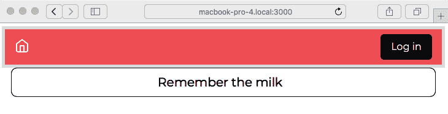
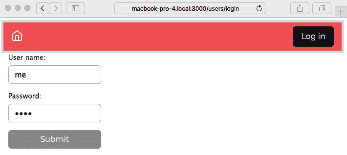
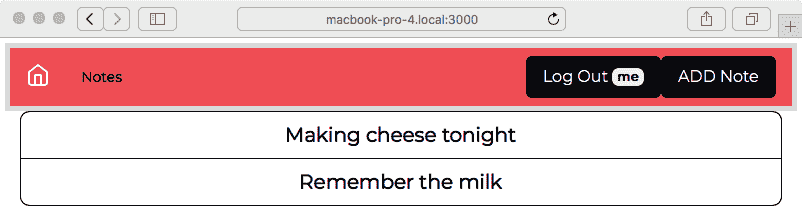
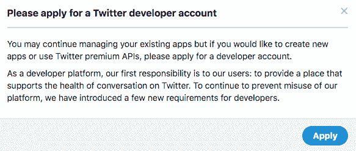
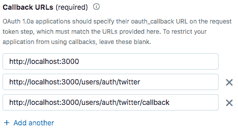
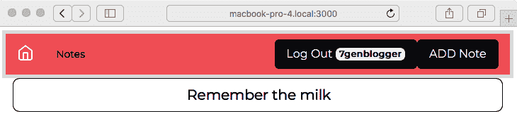
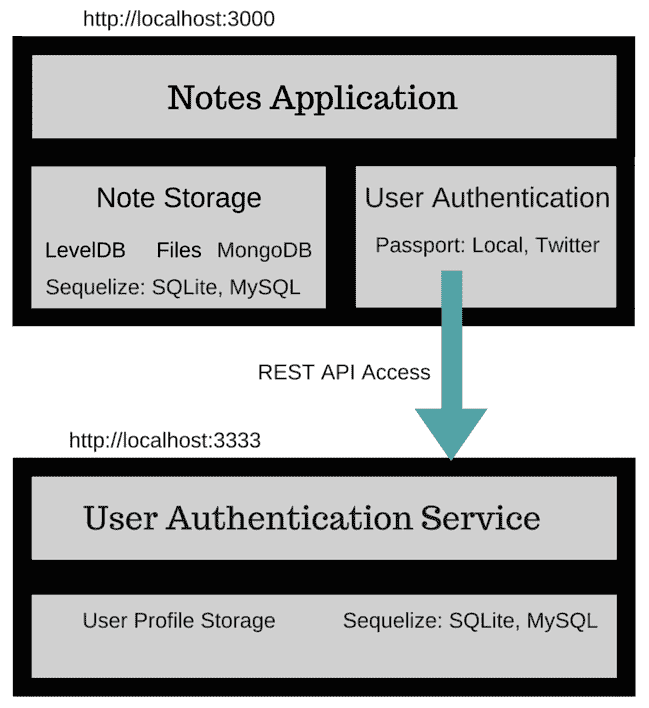

通过微服务对用户进行身份验证

现在我们的 Notes 应用程序可以将数据保存在数据库中，我们可以考虑下一步，即使这成为一个真正的应用程序的下一阶段，即对用户进行身份验证。

登录网站并使用其服务是非常自然的。我们每天都这样做，甚至信任银行和投资机构通过网站上的登录程序来保护我们的财务信息。超文本传输协议（HTTP）是一种无状态协议，网页应用程序无法通过 HTTP 请求比较多了解用户的信息。因为 HTTP 是无状态的，HTTP 请求本身并不知道用户的身份，也不知道驱动网络浏览器的用户是否已登录，甚至不知道 HTTP 请求是否由人发起。

用户身份验证的典型方法是向浏览器发送包含令牌的 cookie，以携带用户的身份，并指示该浏览器是否已登录。

使用 Express，最好的方法是使用`express-session`中间件，它可以处理带有 cookie 的会话管理。它易于配置，但不是用户身份验证的完整解决方案，因为它不处理用户登录/注销。

在用户身份验证方面，似乎领先的包是 Passport（[`passportjs.org/`](http://passportjs.org/)）。除了对本地用户信息进行身份验证外，它还支持对长列表的第三方服务进行身份验证。有了这个，可以开发一个网站，让用户使用来自另一个网站（例如 Twitter）的凭据进行注册。

我们将使用 Passport 来对用户进行身份验证，无论是存储在本地数据库中还是 Twitter 账户中。我们还将利用这个机会来探索基于 REST 的微服务，使用 Node.js。

原因是通过将用户信息存储在高度保护的飞地中，可以增加安全性的机会更大。许多应用团队将用户信息存储在一个受到严格控制的 API 和甚至物理访问用户信息数据库的严格控制区域中，尽可能多地实施技术屏障以防止未经批准的访问。我们不会走得那么远，但在本书结束时，用户信息服务将部署在自己的 Docker 容器中。

在本章中，我们将讨论以下三个方面：

+   创建一个微服务来存储用户资料/身份验证数据。

+   使用本地存储的密码对用户进行身份验证。

+   使用 OAuth2 支持通过第三方服务进行身份验证。具体来说，我们将使用 Twitter 作为第三方身份验证服务。

让我们开始吧！

首先要做的是复制上一章节使用的代码。例如，如果你将该代码保存在`chap07/notes`目录中，那么创建一个新目录`chap08/notes`。

# 第十一章：创建用户信息微服务

我们可以通过简单地向现有的*Notes*应用程序添加用户模型、一些路由和视图来实现用户身份验证和账户。虽然这很容易，但在真实的生产应用程序中是否会这样做呢？

考虑到用户身份信息的高价值和对强大可靠用户身份验证的极大需求。网站入侵经常发生，而似乎最经常被盗窃的是用户身份。因此，我们之前宣布了开发用户信息微服务的意图，但首先我们必须讨论这样做的技术原因。

当然，微服务并不是万能药，这意味着我们不应该试图将每个应用程序都强行塞进微服务的框架中。类比一下，微服务与 Unix 哲学中的小工具相契合，每个工具都做一件事情很好，然后我们将它们混合/匹配/组合成更大的工具。这个概念的另一个词是可组合性。虽然我们可以用这种哲学构建许多有用的软件工具，但它适用于诸如 Photoshop 或 LibreOffice 之类的应用程序吗？

这就是为什么微服务在应用团队中如此受欢迎的原因。如果使用得当，微服务架构更加灵活。正如我们之前提到的，我们的目标是实现高度安全的微服务部署。

决定已经做出，还有两个关于安全性影响的决定需要做。它们如下：

+   我们要创建自己的 REST 应用程序框架吗？

+   我们要创建自己的用户登录/身份验证框架吗？

在许多情况下，最好使用一个声誉良好的现有库，其中维护者已经解决了许多 bug，就像我们在上一章中使用 Sequelize **ORM** (**Object-Relational Mapping**)库一样，因为它很成熟。我们已经为 Notes 项目的这个阶段确定了两个库。

我们已经提到使用 Passport 来支持用户登录，以及对 Twitter 用户进行身份验证。

对于 REST 支持，我们本可以继续使用 Express，但我们将使用 Restify ([`restify.com/`](http://restify.com/))，这是一个流行的面向 REST 的应用程序框架。

为了测试服务，我们将编写一个命令行工具，用于管理数据库中的用户信息。我们不会在 Notes 应用程序中实现管理用户界面，而是依靠这个工具来管理用户。作为一个副作用，我们将拥有一个用于测试用户服务的工具。

一旦这项服务正常运行，我们将开始修改 Notes 应用程序，以从服务中访问用户信息，同时使用 Passport 来处理身份验证。

第一步是创建一个新目录来保存用户信息微服务。这应该是 Notes 应用程序的同级目录。如果您创建了一个名为`chap08/notes`的目录来保存 Notes 应用程序，那么请创建一个名为`chap08/users`的目录来保存微服务。

然后，在`chap08/users`目录中，运行以下命令：

```

This gets us ready to start coding. We'll use the `debug` module for logging messages, `js-yaml` to read the Sequelize configuration file, `restify` for its REST framework, and `sequelize/sqlite3` for database access.

In the sections to come, we will develop a database model to store user information, and then create a REST service to manage that data. To test the service, we'll create a command-line tool that uses the REST API.

## Developing the user information model

We'll be storing the user information using a Sequelize-based model in a SQL database. We went through that process in the previous chapter, but we'll do it a little differently this time. Rather than go for the ultimate flexibility of using any kind of database, we'll stick with Sequelize since the user information model is very simple and a SQL database is perfectly adequate.

The project will contain two modules. In this section, we'll create `users-sequelize.mjs`, which will define the SQUser schema and a couple of utility functions. In the next section, we'll start on `user-server.mjs`, which contains the REST server implementation. 

First, let's ponder an architectural preference. Just how much should we separate between the data model code interfacing with the database from the REST server code? In the previous chapter, we went for a clean abstraction with several implementations of the database storage layer. For a simple server such as this, the REST request handler functions could contain all database calls, with no abstraction layer. Which is the best approach? We don't have a hard rule to follow. For this server, we will have database code more tightly integrated to the router functions, with a few shared functions.

Create a new file named `users-sequelize.mjs` in `users` containing the following code:

```

与我们基于 Sequelize 的 Notes 模型一样，我们将使用**YAML Ain't Markup Language** (**YAML**)文件来存储连接配置。我们甚至使用相同的环境变量`SEQUELIZE_CONNECT`，以及相同的覆盖配置字段的方法。这种方法类似，通过`connectDB`函数设置连接并初始化 SQUsers 表。

通过这种方法，我们可以使用`SEQUELIZE_CONNECT`变量中的基本配置文件，然后使用其他环境变量来覆盖其字段。当我们开始部署 Docker 容器时，这将非常有用。

这里显示的用户配置文件模式是从 Passport 提供的规范化配置文件派生出来的，有关更多信息，请参阅[`www.passportjs.org/docs/profile`](http://www.passportjs.org/docs/profile)。

Passport 项目通过将多个第三方服务提供的用户信息协调为单个对象定义来开发了这个对象。为了简化我们的代码，我们只是使用了 Passport 定义的模式。

有几个函数需要创建，这些函数将成为管理用户数据的 API。让我们将它们添加到`users-sequelize.mjs`的底部，从以下代码开始：

```

In Restify, the route handler functions supply the same sort of `request` and `response` objects we've already seen. We'll go over the configuration of the REST server in the next section. Suffice to say that REST parameters arrive in the request handlers as the `req.params` object, as shown in the preceding code block. This function simplifies the gathering of those parameters into a simple object that happens to match the SQUser schema, as shown in the following code block:

```

当我们从数据库中获取 SQUser 对象时，Sequelize 显然会给我们一个具有许多额外字段和 Sequelize 使用的函数的 Sequelize 对象。我们不希望将这些数据发送给我们的调用者。此外，我们认为不提供*密码*数据超出此服务器的边界将增加安全性。这个函数从 SQUser 实例中产生一个简单的、经过消毒的匿名 JavaScript 对象。我们本可以定义一个完整的 JavaScript 类，但那有什么用呢？这个匿名的 JavaScript 类对于这个简单的服务器来说已经足够了，如下面的代码块所示：

```

The pair of functions shown in the preceding code block provides some database operations that are used several times in the `user-server.mjs` module. 

In `findOneUser`, we are looking up a single SQUser, and then returning a sanitized copy. In `createUser`, we gather the user parameters from the request object, create the SQUser object in the database, and then retrieve that newly created object to return it to the caller.

If you refer back to the `connectDB` function, there is a `SEQUELIZE_CONNECT` environment variable for the configuration file. Let's create one for SQLite3 that we can name `sequelize-sqlite.yaml`, as follows:

```

这就像我们在上一章中使用的配置文件一样。

这是我们在服务的数据库端所需要的。现在让我们继续创建 REST 服务。

## 为用户信息创建一个 REST 服务器

用户信息服务是一个用于处理用户信息数据和身份验证的 REST 服务器。我们的目标当然是将其与 Notes 应用程序集成，但在一个真实的项目中，这样的用户信息服务可以与多个 Web 应用程序集成。REST 服务将提供我们在开发 Notes 中用户登录/注销支持时发现有用的功能，我们稍后将在本章中展示。

在`package.json`文件中，将`main`标签更改为以下代码行：

```

This declares that the module we're about to create, `user-server.mjs`, is the main package of this project.

Make sure the scripts section contains the following script:

```

显然，这是我们启动服务器的方式。它使用上一节的配置文件，并指定我们将在端口`5858`上监听。

然后，创建一个名为`user-server.mjs`的文件，其中包含以下代码：

```

We're using Restify, rather than Express, to develop this server. Obviously, the Restify API has similarities with Express, since both point to the Ruby framework Sinatra for inspiration. We'll see even more similarities when we talk about the route handler functions.

What we have here is the core setup of the REST server. We created the server object and added a few things that, in Express, were called *middleware*, but what Restify simply refers to as *handlers*. A Restify handler function serves the same purpose as an Express middleware function. Both frameworks let you define a function chain to implement the features of your service. One calls it a *middleware* function and the other calls it a *handler* function, but they're almost identical in form and function.

We also have a collection of listener functions that print a startup message and handle uncaught errors. You do remember that it's important to catch the uncaught errors?

An interesting thing is that, since REST services are often versioned, Restify has built-in support for handling version numbers. Restify supports **semantic versioning** (**SemVer**) version matching in the `Accept-Version` HTTP header. 

In the *handlers* that were installed, they obviously have to do with authorization and parsing parameters from the **Uniform Resource Locator** (**URL**) query string and from the HTTP body. The handlers with names starting with `restify.plugins` are maintained by the Restify team, and documented on their website.

That leaves the handler simply named *check*. This handler is in `user-server.mjs` and provides a simple mechanism of token-based authentication for REST clients.

Add the following code to the bottom of `user-server.mjs`:

```

这个处理程序对每个请求都执行，并紧随`restify.plugins.authorizationParser`。它查找授权数据，特别是 HTTP 基本授权，是否已在 HTTP 请求中提供。然后它循环遍历`apiKeys`数组中的键列表，如果基本授权参数匹配，则接受调用者。

这不应被视为最佳实践的示例，因为 HTTP 基本认证被广泛认为极不安全，还有其他问题。但它演示了基本概念，并且还表明通过类似的处理程序轻松实现基于令牌的授权。

这也向我们展示了 Restify 处理程序函数的函数签名，即与 Express 中间件使用的相同签名，`request`和`result`对象以及`next`回调。

Restify 和 Express 在`next`回调的使用上有很大的区别。在 Express 中，记住中间件函数调用`next`，除非该中间件函数是处理链上的最后一个函数，例如，如果函数已经调用了`res.send`（或等效的）来向调用者发送响应。在 Restify 中，每个处理程序函数都调用`next`。如果处理程序函数知道它应该是处理程序链上的最后一个函数，那么它使用`next(false)`；否则，它调用`next()`。如果处理程序函数需要指示错误，它调用`next(err)`，其中`err`是一个对象，`instanceof Error`为`true`。

考虑以下假设的处理程序函数：

```

This shows the following three cases: 

1.  Errors are indicated with `next(new Error('Error description'))`.
2.  Completion is indicated with `next(false)`. 
3.  The continuation of processing is indicated with `next()`. 

We have created the starting point for a user information data model and the matching REST service. The next thing we need is a tool to test and administer the server.

What we want to do in the following sections is two things. First, we'll create the REST handler functions to implement the REST API. At the same time, we'll create a command-line tool that will use the REST API and let us both test the server and add or delete users.

### Creating a command-line tool to test and administer the user authentication server

To give ourselves assurance that the user authentication server works, let's write a tool with which to exercise the server that can also be used for administration. In a typical project, we'd create not only a customer-facing web user interface, but also an administrator-facing web application to administer the service. Instead of doing that here, we'll create a command-line tool.

The tool will be built with Commander, a popular framework for developing command-line tools in Node.js. With Commander, we can easily build a **command-line interface** (**CLI**) tool supporting the `program verb --option optionValue parameter` pattern.

For documentation on Commander, see [`www.npmjs.com/package/commander`](https://www.npmjs.com/package/commander).

Any command-line tool looks at the `process.argv` array to know what to do. This array contains strings parsed from what was given on the command line. The concept for all this goes way back to the earliest history of Unix and the C programming language. 

For documentation on the `process.argv` array, refer to [`nodejs.org/api/process.html#process_process_argv`](https://nodejs.org/api/process.html#process_process_argv).

By using Commander, we have a simpler path of dealing with the command line. It uses a declarative approach to handling command-line parameters. This means we use Commander functions to declare the options and sub-commands to be used by this program, and then we ask Commander to parse the command line the user supplies. Commander then calls the functions we declare based on the content of the command line.

Create a file named `cli.mjs` containing the following code:

```

这只是命令行工具的起点。对于大多数 REST 处理程序函数，我们还将在此工具中实现一个子命令。我们将在后续章节中处理该代码。现在，让我们专注于命令行工具的设置方式。

Commander 项目建议我们将默认导入命名为`program`，如前面的代码块所示。如前所述，我们通过在此对象上调用方法来声明命令行选项和子命令。

为了正确解析命令行，`cli.mjs`中的最后一行代码必须如下所示：

```

The `process.argv` variable is, of course, the command-line arguments split out into an array. Commander, then, is processing those arguments based on the options' declarations.

For the REST client, we use the `restify-clients` package. As the name implies, this is a companion package to Restify and is maintained by the Restify team.

At the top of this script, we declare a few variables to hold connection parameters. The goal is to create a connection URL to access the REST service. The `connect_url` variable is initialized with the default value, which is port `5858` on the localhost. 

The function named `client` looks at the information Commander parses from the command line, as well as a number of environment variables. From that data, it deduces any modification to the `connect_url` variable. The result is that we can connect to this service on any server from our laptop to a faraway cloud-hosted server.

We've also hardcoded the access token and the use of Basic Auth. Put on the backlog a high-priority task to change to a stricter form of authentication.

Where do the values of `program.port`, `program.host`, and `program.url` come from? We declared those variables—that's where they came from.

Consider the following line of code:

```

这声明了一个选项，要么是`-p`要么是`--port`，Commander 将从命令行中解析出来。请注意，我们所做的只是写一个文本字符串，从中 Commander 就知道它必须解析这些选项。这不是很容易吗？

当它看到这些选项之一时，`<port>`声明告诉 Commander 这个选项需要一个参数。它会从命令行中解析出该参数，然后将其分配给`program.port`。

因此，`program.port`、`program.host`和`program.url`都是以类似的方式声明的。当 Commander 看到这些选项时，它会创建相应的变量，然后我们的`client`函数将获取这些数据并适当地修改`connect_url`。

这些声明的一个副作用是 Commander 可以自动生成帮助文本。我们将能够输入以下代码来实现结果：

```

The text comes directly from the descriptive text we put in the declarations. Likewise, each of the sub-commands also takes a `--help` option to print out corresponding help text.

With all that out of the way, let's start creating these commands and REST functions.

### Creating a user in the user information database

We have the starting point for the REST server, and the starting point for a command-line tool to administer the server. Let's start creating the functions—and, of course, the best place to start is to create an SQUser object.

In `user-server.mjs`, add the following route handler:

```

这个函数处理了`/create-user` URL 上的`POST`请求。这应该看起来非常类似于 Express 路由处理程序函数，除了使用`next`回调。回顾一下关于这一点的讨论。就像我们在 Notes 应用程序中所做的那样，我们将处理程序回调声明为异步函数，然后使用`try`/`catch`结构来捕获所有错误并将它们报告为错误。

处理程序以`connectDB`开始，以确保数据库设置正确。然后，如果你回顾`createUser`函数，你会看到它从请求参数中收集用户数据，然后使用`SQUser.create`在数据库中创建一个条目。我们将在这里收到经过处理的用户对象，并简单地将其返回给调用者。

让我们还向`user-server.mjs`中添加以下代码： 

```

This is a variation on creating an SQUser. While implementing login support in the Notes application, there was a scenario in which we had an authenticated user that may or may not already have an SQUser object in the database. In this case, we look to see whether the user already exists and, if not, then we create that user.

Let's turn now to `cli.mjs` and implement the sub-commands to handle these two REST functions, as follows:

```

通过使用`program.command`，我们声明了一个子命令——在这种情况下是`add`。`<username>`声明表示这个子命令需要一个参数。Commander 将会在`action`方法中传递`username`参数的值。

`program.command`声明的结构首先声明子命令的语法。`description`方法提供用户友好的文档。`option`方法调用是针对这个子命令的选项，而不是全局选项。最后，`action`方法是我们提供的回调函数，当 Commander 在命令行中看到这个子命令时将被调用。

在`program.command`字符串中声明的任何参数最终都会成为回调函数的参数。

这个子命令的选项值都会落在`cmdObj`对象中。相比之下，全局选项的值会附加到`program`对象上。

有了这个理解，我们可以看到这个子命令从命令行收集信息，然后使用`client`函数连接到服务器。它调用`/create-user` URL，传递从命令行收集的数据。收到响应后，它将打印出错误或结果对象。

现在让我们添加对应于`/find-or-create` URL 的子命令，如下所示：

```

This is very similar, except for calling `/find-or-create`.

We have enough here to run the server and try the following two commands:

```

我们在一个命令窗口中运行这个命令来启动服务器。在另一个命令窗口中，我们可以运行以下命令：

```

Over in the server window, it will print a trace of the actions taken in response to this. But it's what we expect: the values we gave on the command line are in the database, as shown in the following code block:

```

同样，我们成功地使用了`find-or-create`命令。

这使我们能够创建 SQUser 对象。接下来，让我们看看如何从数据库中读取。

### 从用户信息服务中读取用户数据

我们想要支持的下一件事是在用户信息服务中查找用户。不是一个通用的搜索功能，而是需要为给定的用户名检索一个 SQUser 对象。我们已经有了这个目的的实用函数；现在只需要连接一个 REST 端点。

在`user-server.mjs`中，添加以下函数：

```

And, as expected, that was easy enough. For the `/find` URL, we need to supply the username in the URL. The code simply looks up the SQUser object using the existing utility function.

A related function retrieves the SQUser objects for all users. Add the following code to `user-server.mjs`:

```

我们从上一章知道，`findAll`操作会检索所有匹配的对象，并且传递一个空的查询选择器，比如这样，会导致`findAll`匹配每个 SQUser 对象。因此，这执行了我们描述的任务，检索所有用户的信息。

然后，在`cli.mjs`中，我们添加以下子命令声明：

```

This is similarly easy. We pass the username provided on our command line in the `/find` URL and then print out the result. Likewise, for the `list-users` sub-command, we simply call `/list` on the server and print out the result.

After restarting the server, we can test the commands, as follows:

```

而且，结果正如我们所预期的那样。

我们需要的下一个操作是更新 SQUser 对象。

### 在用户信息服务中更新用户信息

要添加的下一个功能是更新用户信息。为此，我们可以使用 Sequelize 的`update`函数，并将其简单地公开为 REST 操作。

为此，在`user-server.mjs`中添加以下代码：

```

The caller is to provide the same set of user information parameters, which will be picked up by the `userParams` function. We then use the `update` function, as expected, and then retrieve the modified SQUser object, sanitize it, and send it as the result.

To match that function, add the following code to `cli.mjs`:

```

预期的是，这个子命令必须使用相同的用户信息参数集。然后，它将这些参数捆绑到一个对象中，将其发布到 REST 服务器上的`/update-user`端点。

然后，为了测试结果，我们运行以下命令：

```

And, indeed, we managed to change Snuffy's email address.

The next operation is to delete an SQUser object.

### Deleting a user record from the user information service

Our next operation will complete the **create, read, update, and delete** (**CRUD**) operations by letting us delete a user.

Add the following code to `user-server.mjs`:

```

这很简单。我们首先查找用户以确保它存在，然后在 SQUser 对象上调用`destroy`函数。不需要任何结果，所以我们发送一个空对象。

为了运行这个函数，将以下代码添加到`cli.mjs`中：

```

This is simply to send a `DELETE` request to the server on the `/destroy` URL. 

And then, to test it, run the following command:

```

首先，我们删除了 Snuffy 的用户记录，得到了一个预期的空响应。然后，我们尝试检索他的记录，预期地出现了错误。

虽然我们已经完成了 CRUD 操作，但还有最后一个任务要完成。

### 在用户信息服务中检查用户的密码

我们怎么能够有一个用户登录/注销服务而不能检查他们的密码呢？问题是：密码检查应该发生在哪里？似乎，不用深入研究，最好在用户信息服务内部执行此操作。我们之前描述过这个决定，可能更安全的做法是永远不要将用户密码暴露到用户信息服务之外。因此，密码检查应该发生在该服务中，以便密码不会流出服务范围。

让我们从`user-server.mjs`中的以下函数开始：

```

This lets us support the checking of user passwords. There are three conditions to check, as follows:

*   Whether there is no such user
*   Whether the passwords matched
*   Whether the passwords did not match

The code neatly determines all three conditions and returns an object indicating, via the `check` field, whether the user is authenticated. The caller is to send `username` and `password` parameters that will be checked.

To check it out, let's add the following code to `cli.mjs`:

```

并且，预期的是，调用此操作的代码很简单。我们从命令行获取`username`和`password`参数，将它们发送到服务器，然后打印结果。

为了验证它是否有效，运行以下命令：

```

Indeed, the correct password gives us a `true` indicator, while the wrong password gives us `false`.

We've done a lot in this section by implementing a user information service. We successfully created a REST service while thinking about architectural choices around correctly handling sensitive user data. We were also able to verify that the REST service is functioning using an ad hoc testing tool. With this command-line tool, we can easily try any combination of parameters, and we can easily extend it if the need arises to add more REST operations.

Now, we need to start on the real goal of the chapter: changing the Notes user interface to support login/logout. We will see how to do this in the following sections.

# Providing login support for the Notes application

Now that we have proved that the user authentication service is working, we can set up the Notes application to support user logins. We'll be using Passport to support login/logout, and the authentication server to store the required data.

Among the available packages, Passport stands out for simplicity and flexibility. It integrates directly with the Express middleware chain, and the Passport community has developed hundreds of so-called strategy modules to handle authentication against a long list of third-party services.

Refer to [`www.passportjs.org/`](http://www.passportjs.org/) for information and documentation.

Let's start this by adding a module for accessing the user information REST server we just created.

## Accessing the user authentication REST API

The first step is to create a user data model for the Notes application. Rather than retrieving data from data files or a database, it will use REST to query the server we just created. Recall that we created this REST service in the theory of walling off the service since it contains sensitive user information.

Earlier, we suggested duplicating Chapter 7, *Data Storage and Retrieval*, code for Notes in the `chap08/notes` directory and creating the user information server as `chap08/users`.

Earlier in this chapter, we used the `restify-clients` module to access the REST service. That package is a companion to the Restify library; the `restify` package supports the server side of the REST protocol and `restify-clients` supports the client side. 

However nice the `restify-clients` library is, it doesn't support a Promise-oriented API, as is required to play well with `async` functions. Another library, SuperAgent, does support a Promise-oriented API and plays well in `async` functions, and there is a companion to that package, SuperTest, that's useful in unit testing. We'll use SuperTest in Chapter 13, *Unit Testing and Functional Testing* when we talk about unit testing.

For documentation, refer to [`www.npmjs.com/package/superagent`](https://www.npmjs.com/package/superagent) and [`visionmedia.github.io/superagent/`](http://visionmedia.github.io/superagent/).

To install the package (again, in the Notes application directory), run the following command:

```

然后，创建一个新文件`models/users-superagent.mjs`，其中包含以下代码：

```

The `reqURL` function is similar in purpose to the `connectDB` functions that we wrote in earlier modules. Remember that we used `connectDB` in earlier modules to open a database connection that will be kept open for a long time. With SuperAgent, we don't leave a connection open to the service. Instead, we open a new server connection on each request. For every request, we will formulate the request URL. The base URL, such as `http://localhost:3333/`, is to be provided in the `USER_SERVICE_URL` environment variable. The `reqURL` function modifies that URL, using the new **Web Hypertext Application Technology Working Group** (**WHATWG**) URL support in Node.js, to use a given URL path.

We also added the authentication ID and code required for the server. Obviously, when the backlog task comes up to use a better token authentication system, this will have to change.

To handle creating and updating user records, run the following code:

```

这些是我们的`create`和`update`函数。在每种情况下，它们接受提供的数据，构造一个匿名对象，并将其`POST`到服务器。该函数应提供与 SQUser 模式对应的值。它将提供的数据捆绑在`send`方法中，设置各种参数，然后设置基本身份验证令牌。

SuperAgent 库使用一种称为*方法链*的 API 风格。编码者将方法调用链接在一起以构建请求。方法调用链可以以`.then`或`.end`子句结束，其中任何一个都接受一个回调函数。但是如果两者都不加，它将返回一个 Promise，当然，Promise 让我们可以直接从异步函数中使用它。

每个函数末尾的`res.body`值包含了 REST 服务器返回的值。在整个库中，我们将使用`.auth`子句来设置所需的身份验证密钥。

这些匿名对象与普通对象有些不同。我们在这里使用了一个新的**ECMAScript 2015** (**ES-2015**)特性，到目前为止我们还没有讨论过。与使用`fieldName: fieldValue`表示对象字段不同，ES-2015 给了我们一个选项，当用于`fieldValue`的变量名与所需的`fieldName`匹配时，可以缩短这个表示法。换句话说，我们只需列出变量名，字段名将自动匹配变量名。

在这种情况下，我们故意选择了参数的变量名，以匹配服务器使用的参数名称与对象字段名称。这样做，我们可以使用匿名对象的缩写表示法，通过始终使用一致的变量名，使我们的代码更清晰。

现在，添加以下函数以支持检索用户记录：

```

This is following the same pattern as before. The `set` methods are, of course, used for setting HTTP headers in the REST call. This means having at least a passing knowledge of the HTTP protocol.

The `Content-Type` header says the data sent to the server is in **JavaScript Object Notation** (**JSON**) format. The `Accept` header says that this REST client can handle JSON data. JSON is, of course, easiest for a JavaScript program—such as what we're writing—to utilize.

Let's now create the function for checking passwords, as follows:

```

这种方法值得注意的一点是，它可以在 URL 中获取参数，而不是在请求体中获取，就像这里所做的那样。但是，由于请求 URL 经常被记录到文件中，将用户名和密码参数放在 URL 中意味着用户身份信息将被记录到文件中并成为活动报告的一部分。这显然是一个非常糟糕的选择。将这些参数放在请求体中不仅避免了这种糟糕的结果，而且如果使用了与服务的 HTTPS 连接，交易将被加密。

然后，让我们创建我们的 `find-or-create` 函数，如下所示：

```

The `/find-or-create` function either discovers the user in the database or creates a new user. The `profile` object will come from Passport, but take careful note of what we do with `profile.id`. The Passport documentation says it will provide the username in the `profile.id` field, but we want to store it as `username` instead.

Let's now create a function to retrieve the list of users, as follows:

```

和以前一样，这非常简单。

有了这个模块，我们可以与用户信息服务进行接口，现在我们可以继续修改 Notes 用户界面。

## 在 Notes 应用程序中整合登录和注销路由函数

到目前为止，我们构建了一个用户数据模型，用一个 REST API 包装该模型来创建我们的身份验证信息服务。然后，在 Notes 应用程序中，我们有一个模块从这个服务器请求用户数据。到目前为止，Notes 应用程序中没有任何内容知道这个用户模型的存在。下一步是创建一个用于登录/注销 URL 的路由模块，并更改 Notes 的其余部分以使用用户数据。

路由模块是我们使用 `passport` 处理用户身份验证的地方。第一项任务是安装所需的模块，如下所示：

```

The `passport` module gives us the authentication algorithms. To support different authentication mechanisms, the passport authors have developed several *strategy* implementations—the authentication mechanisms, or strategies, corresponding to the various third-party services that support authentication, such as using OAuth to authenticate against services such as Facebook, Twitter, or GitHub.

Passport also requires that we install Express Session support. Use the following command to install the modules:

```

Express 会话支持，包括所有各种会话存储实现，都在其 GitHub 项目页面上有文档，网址为 [`github.com/expressjs/session`](https://github.com/expressjs/session)。

`passport-local` 包中实现的策略仅使用存储在应用程序本地的数据进行身份验证，例如我们的用户身份验证信息服务。稍后，我们将添加一个策略模块来验证使用 Twitter 的 OAuth。

让我们从创建路由模块 `routes/users.mjs` 开始，如下所示：

```

This brings in the modules we need for the `/users` router. This includes the two `passport` modules and the REST-based user authentication model. 

In `app.mjs`, we will be adding *session* support so our users can log in and log out. That relies on storing a cookie in the browser, and the cookie name is found in this variable exported from `app.mjs`. We'll be using that cookie in a moment.

Add the following functions to the end of `routes/users.mjs`:

```

`initPassport` 函数将从 `app.mjs` 被调用，并在 Express 配置中安装 Passport 中间件。我们将在后面讨论这个的影响，当我们到达 `app.mjs` 的变化时，但 Passport 使用会话来检测这个 HTTP 请求是否经过身份验证。它查看每个进入应用程序的请求，寻找关于这个浏览器是否已登录的线索，并将数据附加到请求对象作为 `req.user`。

`ensureAuthenticated` 函数将被其他路由模块使用，并插入到任何需要经过身份验证的已登录用户的路由定义中。例如，编辑或删除笔记需要用户已登录，因此 `routes/notes.mjs` 中的相应路由必须使用 `ensureAuthenticated`。如果用户未登录，此函数将重定向他们到 `/users/login`，以便他们可以登录。

在 `routes/users.mjs` 中添加以下路由处理程序：

```

Because this router is mounted on `/users`, all these routes will have `/user` prepended. The `/users/login` route simply shows a form requesting a username and password. When this form is submitted, we land in the second route declaration, with a `POST` on `/users/login`. If `passport` deems this a successful login attempt using `LocalStrategy`, then the browser is redirected to the home page. Otherwise, it is redirected back to the `/users/login` page.

Add the following route for handling logout:

```

当用户请求注销 Notes 时，他们将被发送到 `/users/logout`。我们将在页眉模板中添加一个按钮来实现这个目的。`req.logout` 函数指示 Passport 擦除他们的登录凭据，然后将他们重定向到主页。

这个函数与 Passport 文档中的内容有所偏差。在那里，我们被告知只需调用 `req.logout`，但有时仅调用该函数会导致用户未注销。有必要销毁会话对象，并清除 cookie，以确保用户已注销。cookie 名称在 `app.mjs` 中定义，我们为这个函数导入了 `sessionCookieName`。

添加 `LocalStrategy` 到 Passport，如下所示：

```

Here is where we define our implementation of `LocalStrategy`. In the callback function, we call `usersModel.userPasswordCheck`, which makes a REST call to the user authentication service. Remember that this performs the password check and then returns an object indicating whether the user is logged in.

A successful login is indicated when `check.check` is `true`. In this case, we tell Passport to use an object containing `username` in the session object. Otherwise, we have two ways to tell Passport that the login attempt was unsuccessful. In one case, we use `done(null, false)` to indicate an error logging in, and pass along the error message we were given. In the other case, we'll have captured an exception, and pass along that exception.

You'll notice that Passport uses a callback-style API. Passport provides a `done` function, and we are to call that function when we know what's what. While we use an `async` function to make a clean asynchronous call to the backend service, Passport doesn't know how to grok the Promise that would be returned. Therefore, we have to throw a `try/catch` around the function body to catch any thrown exception.

Add the following functions to manipulate data stored in the session cookie:

```

前面的函数负责对会话的身份验证数据进行编码和解码。我们只需要将`username`附加到会话中，就像我们在`serializeUser`中所做的那样。`deserializeUser`对象在处理传入的 HTTP 请求时被调用，这是我们查找用户配置文件数据的地方。Passport 会将其附加到请求对象上。

### 对 app.mjs 进行登录/注销更改

在`app.mjs`中需要进行一些更改，其中一些我们已经提到过。我们已经将 Passport 模块的依赖项仔细隔离到`routes/users.mjs`中。`app.mjs`中需要的更改支持`routes/users.mjs`中的代码。

添加导入以从用户路由模块中引入函数，如下所示：

```

The User router supports the `/login` and `/logout` URLs, as well as using Passport for authentication. We need to call `initPassport` for a little bit of initialization.

And now, let's import modules for session handling, as follows:

```

因为 Passport 使用会话，我们需要在 Express 中启用会话支持，这些模块也这样做。`session-file-store`模块将我们的会话数据保存到磁盘上，这样我们可以在不丢失会话的情况下终止和重新启动应用程序。还可以使用适当的模块将会话保存到数据库中。文件系统会话存储仅在所有 Notes 实例运行在同一台服务器计算机上时才适用。对于分布式部署情况，您需要使用在整个网络服务上运行的会话存储，例如数据库。

我们在这里定义`sessionCookieName`，以便它可以在多个地方使用。默认情况下，`express-session`使用名为`connect.sid`的 cookie 来存储会话数据。作为一种小的安全措施，当有一个已发布的默认值时，使用不同的非默认值是有用的。每当我们使用默认值时，可能会有攻击者知道安全漏洞，这取决于该默认值。

将以下代码添加到`app.mjs`中：

```

Here, we initialize the session support. The field named `secret` is used to sign the session ID cookie. The session cookie is an encoded string that is encrypted in part using this secret. In the Express Session documentation, they suggest the `keyboard cat` string for the secret. But, in theory, what if Express has a vulnerability, such that knowing this secret can make it easier to break the session logic on your site? Hence, we chose a different string for the secret, just to be a little different and—perhaps—a little more secure.

Similarly, the default cookie name used by `express-session` is `connect.sid`. Here's where we change the cookie name to a non-default name.

`FileStore` will store its session data records in a directory named `sessions`. This directory will be auto-created as needed.

In case you see errors on Windows that are related to the files used by `session-file-store`, there are several alternate session store packages that can be used.  The attraction of the `session-file-store` is that it has no dependency on a service like a database server.  Two other session stores have a similar advantage, `LokiStore`, and `MemoryStore`. Both are configured similarly to the `session-file-store package`. For example, to use `MemoryStore`, first use npm to install the `memorystore` package, then use these  lines of code in `app.mjs`:

```

这是相同的初始化，但是使用`MemoryStore`而不是`FileStore`。

要了解有关会话存储实现的更多信息，请参阅：[`expressjs.com/en/resources/middleware/session.html#compatible-session-stores`](http://expressjs.com/en/resources/middleware/session.html#compatible-session-stores)

挂载用户路由，如下所示：

```

These are the three routers that are used in the Notes application. 

### Login/logout changes in routes/index.mjs

This router module handles the home page. It does not require the user to be logged in, but we want to change the display a little if they are logged in. To do so, run the following code:

```

记住，我们确保`req.user`拥有用户配置文件数据，这是在`deserializeUser`中完成的。我们只需检查这一点，并确保在渲染视图模板时添加该数据。

我们将对大多数其他路由定义进行类似的更改。之后，我们将讨论视图模板的更改，在其中我们使用`req.user`来在每个页面上显示正确的按钮。

### 在`routes/notes.mjs`中需要进行登录/注销更改

这里需要的更改更为重要，但仍然很简单，如下面的代码片段所示：

```

We need to use the `ensureAuthenticated` function to protect certain routes from being used by users who are not logged in. Notice how ES6 modules let us import just the function(s) we require. Since that function is in the User router module, we need to import it from there.

Modify the `/add` route handler, as shown in the following code block:

```

我们将在整个模块中进行类似的更改，添加对`ensureAuthenticated`的调用，并使用`req.user`来检查用户是否已登录。目标是让几个路由确保路由仅对已登录用户可用，并且在这些路由和其他路由中将`user`对象传递给模板。

我们添加的第一件事是在路由定义中调用`usersRouter.ensureAuthenticated`。如果用户未登录，他们将由于该函数而被重定向到`/users/login`。

因为我们已确保用户已经通过身份验证，所以我们知道`req.user`已经有了他们的配置文件信息。然后我们可以简单地将其传递给视图模板。

对于其他路由，我们需要进行类似的更改。

修改`/save`路由处理程序如下：

```

The `/save` route only requires this change to call `ensureAuthenticated` in order to ensure that the user is logged in.

Modify the `/view` route handler, as follows:

```

对于这个路由，我们不需要用户已登录。如果有的话，我们需要用户的配置文件信息发送到视图模板。

修改`/edit`和`/destroy`路由处理程序如下：

```

Remember that throughout this module, we have made the following two changes to router functions:

1.  We protected some routes using `ensureAuthenticated` to ensure that the route is available only to logged-in users.
2.  We passed the `user` object to the template.

For the routes using `ensureAuthenticated`, it is guaranteed that `req.user` will contain the `user` object.  In other cases, such as with the `/view` router function, `req.user` may or may not have a value, and in case it does not, we make sure to pass `undefined`. In all such cases, the templates need to change in order to use the `user` object to detect whether the user is logged in, and whether to show HTML appropriate for a logged-in user.

### Viewing template changes supporting login/logout

So far, we've created a backend user authentication service, a REST module to access that service, a router module to handle routes related to logging in and out of the website, and changes in `app.mjs` to use those modules. We're almost ready, but we've got a number of changes left that need to be made to the templates. We're passing the `req.user` object to every template because each one must be changed to accommodate whether the user is logged in. 

This means that we can test whether the user is logged in simply by testing for the presence of a `user` variable.

In `partials/header.hbs`, make the following additions:

```

我们在这里做的是控制屏幕顶部显示哪些按钮，这取决于用户是否已登录。较早的更改确保了如果用户已注销，则`user`变量将为`undefined`；否则，它将具有用户配置文件对象。因此，只需检查`user`变量即可，如前面的代码块所示，以渲染不同的用户界面元素。

未登录的用户不会看到“添加笔记”按钮，并会看到一个登录按钮。否则，用户会看到“添加笔记”按钮和一个注销按钮。登录按钮将用户带到`/users/login`，而注销按钮将他们带到`/users/logout`。这两个按钮都在`routes/users.js`中处理，并执行预期的功能。

注销按钮具有 Bootstrap 徽章组件显示用户名。这为已登录的用户名提供了一个小的视觉标识。稍后我们将看到，它将作为用户身份的视觉提示。

因为`nav`现在支持登录/注销按钮，我们已经更改了`navbar-toggler`按钮，以便它控制具有`id="navbarLogIn"`的`<div>`。

我们需要创建`views/login.hbs`，如下所示：

```

This is a simple form decorated with Bootstrap goodness to ask for the username and password. When submitted, it creates a `POST` request to `/users/login`, which invokes the desired handler to verify the login request. The handler for that URL will start the Passport process to decide whether the user is authenticated.

In `views/notedestroy.hbs`, we want to display a message if the user is not logged in. Normally, the form to cause the note to be deleted is displayed, but if the user is not logged in, we want to explain the situation, as illustrated in the following code block:

```

这很简单 - 如果用户已登录，则显示表单；否则，在`partials/not-logged-in.hbs`中显示消息。我们根据`user`变量确定要显示其中哪一个。

我们可以在`partials/not-logged-in.hbs`中插入以下代码块中显示的代码：

```

As the text says, this will probably never be shown to users. However, it is useful to put something such as this in place since it may show up during development, depending on the bugs you create.

In `views/noteedit.hbs`, we require a similar change, as follows:

```

也就是说，在底部我们添加了一个段落，对于未登录的用户，引入了`not-logged-in`部分。

**Bootstrap jumbotron**组件可以创建一个漂亮而大的文本显示，非常引人注目。然而，用户不应该看到这一点，因为这些模板只在我们预先验证用户已登录时使用。

这样的消息对于检查代码中的错误非常有用。假设我们疏忽了，并且未能确保这些表单仅显示给已登录用户。假设我们有其他错误，未检查表单提交以确保它仅由已登录用户请求。以这种方式修复模板是另一层防止向未被允许使用该功能的用户显示表单的预防措施。

我们现在已经对用户界面进行了所有更改，并准备测试登录/注销功能。

## 使用用户身份验证运行 Notes 应用程序

我们已经创建了用户信息 REST 服务，创建了一个模块来从 Notes 访问该服务，修改了路由模块以正确访问用户信息服务，并更改了其他支持登录/注销所需的内容。

必要的最后一个任务是修改`package.json`的脚本部分，如下所示：

```

In the previous chapters, we built up quite a few combinations of models and databases for running the Notes application. Since we don't need those, we can strip most of them out from `package.json`. This leaves us with one, configured to use the Sequelize model for Notes, using the SQLite3 database, and to use the new user authentication service that we wrote earlier. All the other Notes data models are still available, just by setting the environment variables appropriately.

`USER_SERVICE_URL` needs to match the port number that we designated for that service.

In one window, start the user authentication service, as follows:

```

然后，在另一个窗口中，按照以下方式启动 Notes 应用程序：

```

You'll be greeted with the following message:



Notice the new button, Log in, and the lack of an ADD Note button. We're not logged in, and so `partials/header.hbs` is rigged to show only the Log in button.

Click on the Log in button, and you will see the login screen, as shown in the following screenshot:



This is our login form from `views/login.hbs`. You can now log in, create a note or three, and you might end up with the following messages on the home page:



You now have both Log Out and ADD Note buttons. You'll notice that the Log Out button has the username (me) shown. After some thought and consideration, this seemed the most compact way to show whether the user is logged in, and which user is logged in. This might drive the user experience team nuts, and you won't know whether this user interface design works until it's tested with users, but it's good enough for our purpose at the moment.

In this section, we've learned how to set up a basic login/logout functionality using locally stored user information. This is fairly good, but many web applications find it useful to allow folks to log in using their Twitter or other social media accounts for authentication. In the next section, we'll learn about that by setting up Twitter authentication.

# Providing Twitter login support for the Notes application

If you want your application to hit the big time, it's a great idea to ease the registration process by using third-party authentication. Websites all over the internet allow you to log in using accounts from other services such as Facebook or Twitter. Doing so removes hurdles to prospective users signing up for your service. Passport makes it extremely easy to do this.

Authenticating users with Twitter requires installation of `TwitterStrategy` from the `passport-twitter` package, registering a new application with Twitter, adding a couple of routes to `routes/user.mjs`, and making a small change in `partials/header.hbs`. Integrating other third-party services requires similar steps.

## Registering an application with Twitter

Twitter, as with every other third-party service, uses OAuth to handle authentication. OAuth is a standard protocol through which an application or a person can authenticate with one website by using credentials they have on another website. We use this all the time on the internet. For example, we might use an online graphics application such as [draw.io](http://draw.io) or Canva by logging in with a Google account, and then the service can save files to our Google Drive. 

Any application author must register with any sites you seek to use for authentication. Since we wish to allow Twitter users to log in to Notes using Twitter credentials, we have to register our Notes application with Twitter. Twitter then gives us a pair of authentication keys that will validate the Notes application with Twitter. Any application, whether it is a popular site such as Canva, or a new site such as Joe's Ascendant Horoscopes, must be registered with any desired OAuth authentication providers. The application author must then be diligent about keeping the registration active and properly storing the authentication keys.

The authentication keys are like a username/password pair. Anyone who gets a hold of those keys could use the service as if they were you, and potentially wreak havoc on your reputation or business.

Our task in this section is to register a new application with Twitter, fulfilling whatever requirements Twitter has.

To register a new application with Twitter, go to [`developer.twitter.com/en/apps`](https://developer.twitter.com/en/apps). 

As you go through this process, you may be shown the following message:



Recall that in recent years, concerns began to arise regarding the misuse of third-party authentication, the potential to steal user information, and the negative results that have occurred thanks to user data being stolen from social networks. As a result, social networks have increased scrutiny over developers using their APIs. It is necessary to sign up for a Twitter developer account, which is an easy process that does not cost anything.

As we go through this, realize that the Notes application needs a minimal amount of data. The ethical approach to this is to request only the level of access required for your application, and nothing more.

Once you're registered, you can log in to `developer.twitter.com/apps` and see a dashboard listing the active applications you've registered. At this point, you probably do not have any registered applications. At the top is a button marked *Create an App*. Click on that button to start the process of submitting a request to register a new application.

Every service offering OAuth authentication has an administrative backend similar to `developer.twitter.com/apps`. The purpose is so that certified application developers can administer the registered applications and authorization tokens. Each such service has its own policies for validating that those requesting authorization tokens have a legitimate purpose and will not abuse the service. The authorization token is one of the mechanisms to verify that API requests come from approved applications. Another mechanism is the URL from which API requests are made. 

In the normal case, an application will be deployed to a regular server, and is accessed through a domain name such as `MyNotes.xyz`. In our case, we are developing a test application on our laptop, and do not have a public IP address, nor is there a domain name associated with our laptop. Not all social networks allow interactions from an application on an untrusted computer—such as a developer's laptop—to make API requests; however, Twitter does.

At the time of writing, there are several pieces of information requested by the Twitter sign-up process, listed as follows:

*   **Name**: This is the application name, and it can be anything you like. It would be a good form to use "`Test`" in the name, in case Twitter's staff decide to do some checking.
*   **Description**: Descriptive phrase—and again, it can be anything you like. The description is shown to users during the login process. It's good form to describe this as a test application.

*   **Website**: This would be your desired domain name. Here, the help text helpfully suggests *If you don't have a URL yet, just put a placeholder here but remember to change it later*.
*   **Allow this application to be used to sign in with Twitter**: Check this, as it is what we want.
*   **Callback URL**: This is the URL to return to following successful authentication. Since we don't have a public URL to supply, this is where we specify a value referring to your laptop. It's been found that `http://localhost:3000` works just fine. macOS users have another option because of the `.local` domain name that is automatically assigned to their laptop. 
*   **Tell us how this app will be used**: This statement will be used by Twitter to evaluate your request. For the purpose of this project, explain that it is a sample app from a book. It is best to be clear and honest about your intention.

The sign-up process is painless. However, at several points, Twitter reiterated the sensitivity of the information provided through the Twitter API. The last step before granting approval warned that Twitter prohibits the use of its API for various unethical purposes.

The last thing to notice is the extremely sensitive nature of the authentication keys. It's bad form to check these into a source code repository or otherwise put them in a place where anybody can access the key. We'll tackle this issue in Chapter 14, *Security in Node.js Applications*.

The Twitter developers' site has documentation describing best practices for storing authentication tokens. Visit [`developer.twitter.com/en/docs/basics/authentication/guides/authentication-best-practices`](https://developer.twitter.com/en/docs/basics/authentication/guides/authentication-best-practices).

### Storing authentication tokens

The Twitter recommendation is to store configuration values in a `.env` file. The contents of this file are to somehow become environment variables, which we can then access using `process.env`, as we've done before. Fortunately, there is a third-party Node.js package to do just this, called `dotenv`.

Learn about the `dotenv` package at [`www.npmjs.com/package/dotenv.`](https://www.npmjs.com/package/dotenv)

First, install the package, as follows:

```

文档表示我们应该加载`dotenv`包，然后在应用程序启动阶段非常早的时候调用`dotenv.config()`，并且我们必须在访问任何环境变量之前这样做。然而，仔细阅读文档后，似乎最好将以下代码添加到`app.mjs`中：

```

With this approach, we do not have to explicitly call the `dotenv.config` function. The primary advantage is avoiding issues with referencing environment variables from multiple modules.

The next step is to create a file, `.env`, in the `notes` directory. The syntax of this file is very simple, as shown in the following code block:

```

这正是我们期望的语法，因为它与 shell 脚本的语法相同。在这个文件中，我们需要定义两个变量，`TWITTER_CONSUMER_KEY`和`TWITTER_CONSUMER_SECRET`。我们将在下一节中编写的代码中使用这些变量。由于我们正在将配置值放在`package.json`的`scripts`部分中，因此可以将这些环境变量添加到`.env`中。

下一步是避免将此文件提交到 Git 等源代码控制系统中。为了确保这不会发生，您应该已经在`notes`目录中有一个`.gitignore`文件，并确保其内容类似于以下内容：

```

These values mostly refer to database files we generated in the previous chapter. In the end, we've added the `.env` file, and because of this, Git will not commit this file to the repository.

This means that when deploying the application to a server, you'll have to arrange to add this file to the deployment without it being committed to a source repository. 

With an approved Twitter application, and with our authentication tokens recorded in a configuration file, we can move on to adding the required code to Notes.

## Implementing TwitterStrategy

As with many web applications, we have decided to allow our users to log in using Twitter credentials. The OAuth protocol is widely used for this purpose and is the basis for authentication on one website using credentials maintained by another website.

The application registration process you just followed at `developer.twitter.com` generated for you a pair of API keys: a consumer key, and a consumer secret. These keys are part of the OAuth protocol and will be supplied by any OAuth service you register with, and the keys should be treated with the utmost care. Think of them as the username and password your service uses to access the OAuth-based service (Twitter et al.). The more people who can see these keys, the more likely it becomes that a miscreant can see them and then cause trouble. Anybody with those secrets can access the service API as if they are you.

Let's install the package required to use `TwitterStrategy`, as follows:

```

在`routes/users.mjs`中，让我们开始做一些更改，如下所示：

```

This imports the package, and then makes its `Strategy` variable available as `TwitterStrategy`.

Let's now install the `TwitterStrategy`, as follows:

```

这注册了一个`TwitterStrategy`实例到`passport`，安排在用户注册 Notes 应用程序时调用用户认证服务。当用户成功使用 Twitter 进行身份验证时，将调用此`callback`函数。

如果包含 Twitter 令牌的环境变量没有设置，那么这段代码就不会执行。显然，没有设置 Twitter 认证的密钥是错误的，所以我们通过不执行代码来避免错误。

为了帮助其他代码知道 Twitter 支持是否已启用，我们导出了一个标志变量-`twitterLogin`。

我们专门定义了`usersModel.findOrCreate`函数来处理来自 Twitter 等第三方服务的用户注册。它的任务是查找在配置文件对象中描述的用户，并且如果该用户不存在，则在 Notes 中创建该用户帐户。

`consumerKey`和`consumerSecret`的值是在注册应用程序后由 Twitter 提供的。这些密钥在 OAuth 协议中用作向 Twitter 证明身份的凭证。

`TwitterStrategy`配置中的`callbackURL`设置是 Twitter 的基于 OAuth1 的 API 实现的遗留物。在 OAuth1 中，回调 URL 是作为 OAuth 请求的一部分传递的。由于`TwitterStrategy`使用了 Twitter 的 OAuth1 服务，我们必须在这里提供 URL。我们马上会看到这个 URL 在 Notes 中是如何实现的。

`callbackURL`、`consumerKey`和`consumerSecret`设置都是使用环境变量注入的。之前，我们讨论了不将`consumerKey`和`consumerSecret`的值提交到源代码库是最佳实践，因此我们设置了`dotenv`包和一个`.env`文件来保存这些配置值。在第十章，*将 Node.js 应用程序部署到 Linux 服务器*中，我们将看到这些密钥可以在 Dockerfile 中声明为环境变量。

添加以下路由声明：

```

To start the user logging in with Twitter, we'll send them to this URL. Remember that this URL is really `/users/auth/twitter` and, in the templates, we'll have to use that URL. When this is called, the passport middleware starts the user authentication and registration process using `TwitterStrategy`.

Once the user's browser visits this URL, the OAuth dance begins. It's called a dance because the OAuth protocol involves carefully designed redirects between several websites. Passport sends the browser over to the correct URL at Twitter, where Twitter asks the user whether they agree to authenticate using Twitter, and then Twitter redirects the user back to your callback URL. Along the way, specific tokens are passed back and forth in a very carefully designed dance between websites.

Once the OAuth dance concludes, the browser lands at the URL designated in the following router declaration:

```

这个路由处理回调 URL，并且它对应于之前配置的`callbackURL`设置。根据它是否指示成功注册，Passport 将重定向浏览器到首页或者回到`/users/login`页面。

因为`router`被挂载在`/user`上，所以这个 URL 实际上是`/user/auth/twitter/callback`。因此，在配置`TwitterStrategy`时要使用完整的 URL，并提供给 Twitter 的是`http://localhost:3000/user/auth/twitter/callback`。

在处理回调 URL 的过程中，Passport 将调用之前显示的回调函数。因为我们的回调使用了`usersModel.findOrCreate`函数，如果需要，用户将自动注册。

我们几乎准备好了，但是我们需要在 Notes 的其他地方做一些小的更改。

在`partials/header.hbs`中，对代码进行以下更改：

```

This adds a new button that, when clicked, takes the user to `/users/auth/twitter`, which—of course—kicks off the Twitter authentication process. The button is enabled only if Twitter support is enabled, as determined by the `twitterLogin` variable. This means that the router functions must be modified to pass in this variable.

This button includes a little image we downloaded from the official Twitter brand assets page at [`about.twitter.com/company/brand-assets`](https://about.twitter.com/company/brand-assets). Twitter recommends using these branding assets for a consistent look across all services using Twitter. Download the whole set, and then pick the one you like.

For the URL shown here, the corresponding project directory is named `public/assets/vendor/twitter`. Notice that we force the size to be small enough for the navigation bar.

In `routes/index.mjs`, make the following change:

```

这导入了变量，然后在传递给`res.render`的数据中，我们添加了这个变量。这将确保该值传递到`partials/header.hbs`。

在`routes/notes.mjs`中，我们需要在几个路由函数中进行类似的更改：

```

This is the same change, importing the variable and passing it to `res.render`.

With these changes, we're ready to try logging in with Twitter.

Start the user information server as shown previously, and then start the Notes application server, as shown in the following code block:

```

然后，使用浏览器访问`http://localhost:3000`，如下所示：


注意新按钮。它看起来差不多，多亏了使用了官方的 Twitter 品牌形象。按钮有点大，所以也许你想咨询一位设计师。显然，如果你要支持数十种认证服务，就需要不同的设计。

在略去 Twitter 令牌环境变量的情况下运行它，Twitter 登录按钮不应该出现。

单击此按钮将浏览器带到`/users/auth/twitter`，这意味着启动 Passport 运行 OAuth 协议交易以进行身份验证。但是，您可能会收到一个错误消息，指出回调 URL 未经此客户端应用程序批准。批准的回调 URL 可以在您的应用程序设置中进行调整。如果是这种情况，就需要在`developer.twitter.com`上调整应用程序配置。错误消息明确表示 Twitter 看到了一个未经批准的 URL。

在应用程序页面上，在 App Details 选项卡上，点击编辑按钮。然后，向下滚动到 Callback URLs 部分，并添加以下条目：



正如它所解释的，此框列出了允许用于 Twitter OAuth 身份验证的 URL。目前，我们正在使用端口`3000`在笔记本电脑上托管应用程序。如果您从其他基本 URL 访问它，例如`http://MacBook-Pro-4.local`，那么除了该基本 URL 外还应该使用它。

一旦正确配置了回调 URL，单击“使用 Twitter 登录”按钮将带您到正常的 Twitter OAuth 身份验证页面。只需点击批准，您将被重定向回 Notes 应用程序。

然后，一旦您使用 Twitter 登录，您将看到类似以下截图：



我们现在已经登录，并且会注意到我们的 Notes 用户名与我们的 Twitter 用户名相同。您可以浏览应用程序并创建、编辑或删除笔记。实际上，您可以对任何您喜欢的笔记进行操作，甚至是其他人创建的笔记。这是因为我们没有创建任何访问控制或权限系统，因此每个用户都可以完全访问每个笔记。这是一个需要放入待办事项的功能。

通过使用多个浏览器或计算机，您可以同时以不同用户身份登录，每个浏览器一个用户。

您可以通过执行我们之前所做的操作来运行 Notes 应用程序的多个实例，如下所示：

```

Then, in one command window, run the following command:

```

在另一个命令窗口中，运行以下命令：

```

As previously, this starts two instances of the Notes server, each with a different value in the `PORT` environment variable. In this case, each instance will use the same user authentication service. As shown here, you'll be able to visit the two instances at `http://localhost:3000` and `http://localhost:3002`. As before, you'll be able to start and stop the servers as you wish, see the same notes in each, and see that the notes are retained after restarting the server.

Another thing to try is to fiddle with the **session store**. Our session data is being stored in the `sessions` directory. These are just files in the filesystem, and we can take a look with normal tools such as `ls`, as shown in the following code block:

```

这是使用 Twitter 账户登录后。您可以看到 Twitter 账户名称存储在会话数据中。

如果您想要清除会话怎么办？这只是文件系统中的一个文件。删除会话文件会擦除会话，用户的浏览器将被强制注销。

如果用户长时间不活动，会话将超时。`session-file-store`选项之一，`ttl`，控制超时时间，默认为 3,600 秒（一小时）。会话超时后，应用程序将恢复到已注销状态。

在这一部分，我们已经完成了设置支持使用 Twitter 身份验证服务进行登录的完整流程。我们创建了 Twitter 开发者账户，并在 Twitter 的后端创建了一个应用程序。然后，我们实现了与 Twitter 的 OAuth 支持集成所需的工作流程。为了支持这一点，我们集成了存储用户授权信息的服务。

我们的下一个任务非常重要：保持用户密码加密。

# 保持秘密和密码安全

我们已经多次警告过安全处理用户识别信息的重要性。安全处理这些数据的意图是一回事，但实际上这样做非常重要。尽管我们迄今为止使用了一些良好的做法，但就目前而言，Notes 应用程序无法经受任何安全审计，原因如下：

+   用户密码以明文形式保存在数据库中。

+   Twitter 等的身份验证令牌以明文形式保存。

+   身份验证服务 API 密钥不是加密安全的任何东西；它只是一个明文的**通用唯一标识符**（**UUID**）。

如果您不认识短语*明文*，它只是表示未加密。任何人都可以阅读用户密码或身份验证令牌的文本。最好将两者都加密以避免信息泄漏。

请记住这个问题，因为我们将在第十四章中重新讨论这些以及其他安全问题。

在我们离开这一章之前，让我们解决其中的第一个问题：以明文形式存储密码。我们之前已经提到用户信息安全非常重要。因此，我们应该从一开始就注意到这一点。

`bcrypt` Node.js 包使得安全存储密码变得容易。有了它，我们可以立即加密密码，永远不会存储未加密的密码。

有关`bcrypt`文档，请参阅[`www.npmjs.com/package/bcrypt`](https://www.npmjs.com/package/bcrypt)。

在`notes`和`users`目录中安装`bcrypt`，执行以下命令：

```

The `bcrypt` documentation says that the correct version of this package must be used precisely for the Node.js version in use. Therefore, you should adjust the version number appropriately to the Node.js version you are using.

The strategy of storing an encrypted password dates back to the earliest days of Unix. The creators of the Unix operating system devised a means for storing an encrypted value in `/etc/passwd`, which was thought sufficiently safe that the password file could be left readable to the entire world.

Let's start with the user information service.

## Adding password encryption to the user information service

Because of our command-line tool, we can easily test end-to-end password encryption. After verifying that it works, we can implement encryption in the Notes application.

In `cli.mjs`, add the following code near the top:

```

这引入了`bcrypt`包，然后我们配置了一个常量，该常量控制解密密码所需的 CPU 时间。`bcrypt`文档指向了一篇讨论为什么`bcrypt`算法非常适合存储加密密码的博客文章。论点归结为解密所需的 CPU 时间。针对密码数据库的暴力攻击更加困难，因此如果使用强加密加密密码，测试所有密码组合所需的 CPU 时间更长，因此成功的可能性更小。

我们分配给`saltRounds`的值决定了 CPU 时间的要求。文档进一步解释了这一点。

接下来，添加以下函数：

```

This takes a plain text password and runs it through the encryption algorithm. What's returned is the hash for the password.

Next, in the commands for `add`, `find-or-create`*,* and `update`, we make this same change, as follows:

```

也就是说，在每个地方，我们将回调函数设置为异步函数，以便我们可以使用`await`。然后，我们调用`hashpass`函数来加密密码。

这样，我们立即加密密码，并且用户信息服务器将存储加密密码。

因此，在`user-server.mjs`中，`password-check`处理程序必须重写以适应检查加密密码。

在`user-server.mjs`的顶部，添加以下导入：

```

Of course, we need to bring in the module here to use its decryption function. This module will no longer store a plain text password, but instead, it will now store encrypted passwords. Therefore, it does not need to generate encrypted passwords, but the `bcrypt` package also has a function to compare a plain text password against the encrypted one in the database, which we will use.

Next, scroll down to the `password-check` handler and modify it, like so:

```

`bcrypt.compare`函数比较明文密码，这些密码将作为`req.params.password`到达，与我们存储的加密密码进行比较。为了处理加密，我们需要重构检查，但我们正在测试相同的三个条件。更重要的是，对于这些条件返回相同的对象。

要测试它，像之前一样启动用户信息服务器，如下所示：

```

In another window, we can create a new user, as follows:

```

我们之前已经完成了这两个步骤。不同之处在于我们接下来要做什么。

让我们检查数据库，看看存储了什么，如下所示：

```

Indeed, the password field no longer has a plain text password, but what is—surely—encrypted text.

Next, we should check that the `password-check` command behaves as expected: 

```

我们之前进行了相同的测试，但这次是针对加密密码。

我们已经验证了对密码进行 REST 调用将起作用。我们的下一步是在 Notes 应用程序中实现相同的更改。

## 在 Notes 应用程序中实现加密密码支持

由于我们已经证明了如何实现加密密码检查，我们所需要做的就是在 Notes 服务器中复制一些代码。

在`users-superagent.mjs`中，添加以下代码到顶部：

```

As before, this imports the `bcrypt` package and configures the complexity that will be used, and we have the same encryption function because we will use it from multiple places.

Next, we must change the functions that interface with the backend server, as follows:

```

在适当的地方，我们必须加密密码。不需要其他更改。

因为`password-check`后端执行相同的检查，返回相同的对象，所以前端代码不需要更改。

为了测试，启动用户信息服务器和 Notes 服务器。然后，使用应用程序检查使用基于 Twitter 的用户和本地用户的登录和退出。

我们已经学会了如何使用加密来安全存储用户密码。如果有人窃取了我们的用户数据库，由于这里的选择，破解密码将需要更长的时间。

我们几乎完成了本章。剩下的任务只是简单地回顾我们创建的应用程序架构。

# 运行 Notes 应用程序堆栈

您是否注意到之前我们说要运行 Notes 应用程序堆栈？现在是时候向营销团队解释这个短语的含义了。他们可能希望在营销宣传册或网站上放置架构图。对于像我们这样的开发人员来说，退一步并绘制我们已经创建或计划创建的图片也是有用的。

以下是工程师可能绘制的图表，以展示给营销团队系统设计（当然，营销团队将聘请图形艺术家对其进行整理）：



在上图中标有“Notes 应用程序”的方框是由模板和路由器模块实现的面向公众的代码。按照当前配置，它可以在我们的笔记本电脑上的端口`3000`上可见。它可以使用多个数据存储服务之一。它通过端口`5858`（或前图所示的端口`3333`）与“用户身份验证服务”后端通信。

在第十章中，*将 Node.js 应用程序部署到 Linux 服务器*，当我们学习如何在真实服务器上部署时，我们将扩展这个图片。

# 总结

在本章中，您涵盖了很多内容，不仅涉及 Express 应用程序中的用户身份验证，还涉及微服务开发。

具体来说，您涵盖了 Express 中的会话管理，使用 Passport 进行用户身份验证（包括 Twitter/OAuth），使用路由器中间件限制访问，使用 Restify 创建 REST 服务，以及何时创建微服务。我们甚至使用了加密算法来确保我们只存储加密密码。

了解如何处理登录/注销，特别是来自第三方服务的 OAuth 登录，对于 Web 应用程序开发人员来说是一项必不可少的技能。现在您已经学会了这一点，您将能够为自己的应用程序做同样的事情。

在下一章中，我们将通过半实时通信将 Notes 应用程序提升到一个新水平。为此，我们将编写一些浏览器端 JavaScript，并探索 Socket.io 包如何让我们在用户之间发送消息。
