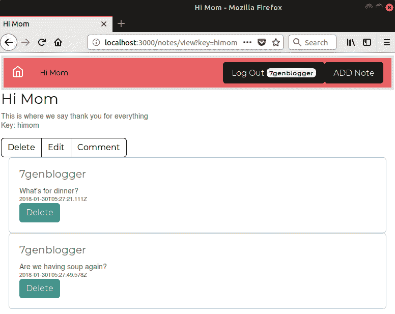

使用 Socket.IO 进行动态客户端/服务器交互

Web 的原始设计模型类似于 20 世纪 70 年代主机的工作方式。旧式的哑终端，如 IBM 3270，和 Web 浏览器都遵循请求-响应范式。用户发送请求，远程计算机发送响应。这种请求-响应范式在 Node.js HTTP 服务器 API 中是明显的，如下面的代码所示：

```

The paradigm couldn't be more explicit than this. The `request` and the `response` are right there.

It wasn't until JavaScript improved that we had a quite different paradigm. The new paradigm is interactive communication driven by browser-side JavaScript. This change in the web application model is called, by some, the real-time web. In some cases, websites keep an open connection to the web browser, send notifications, or update the page as it changes.

For some deep background on this, read about the Comet application architecture introduced by Alex Russell in his blog in 2006 ([`infrequently.org/2006/03/comet-low-latency-data-for-the-browser/`](http://infrequently.org/2006/03/comet-low-latency-data-for-the-browser/)). That blog post called for a platform very similar to Node.js, years before Node.js existed.

In this chapter, we'll explore interactive dynamically updated content, as well as inter-user messaging, in the Notes application. To do this, we'll lean on the Socket.IO library ([`socket.io/`](http://socket.io/)). This library simplifies two-way communication between the browser and server and can support a variety of protocols with fallback to old-school web browsers. It keeps a connection open continuously between browser and server, and it follows the `EventEmitter` model, allowing us to send events back and forth.

We'll be covering the following topics:

*   An introduction to the Socket.IO library
*   Integrating Socket.IO with an Express application, and with Passport
*   Real-time communications in modern web browsers
*   Using Socket.IO events:
    *   To update application content as it changes
    *   To send messages between users
*   User experience for real-time communication
*   Using Modal windows to support a user experience that eliminates page reloads

These sorts of techniques are widely used in many kinds of websites. This includes online chat with support personnel, dynamically updated pricing on auction sites, and dynamically updated social network sites.

To get started, let's talk about what Socket.IO is and what it does.

# 第十二章：Introducing Socket.IO

The aim of Socket.IO is to make real-time apps possible in every browser and mobile device*. *It supports several transport protocols, choosing the best one for the specific browser.

Look up the technical definition for the phrase *real-time* and you'll see the real-time web is not truly real-time. The actual meaning of *real-time* involves software with strict time boundaries that must respond to events within a specified time constraint. It is typically used in embedded systems to respond to button presses, for applications as diverse as junk food dispensers and medical devices in intensive care units. Eat too much junk food and you could end up in intensive care, and you'll be served by real-time software in both cases. Try and remember the distinction between different meanings for this phrase.

The proponents of the so-called real-time web should be calling it the pseudo-real-time-web, but that's not as catchy a phrase.

What does it mean that Socket.IO uses the best protocol for the specific browser? If you were to implement your application with WebSockets, it would be limited to the modern browsers supporting that protocol. Because Socket.IO falls back on so many alternative protocols (WebSockets, Flash, XHR, and JSONP), it supports a wider range of web browsers.

As the application author, you don't have to worry about the specific protocol Socket.IO uses with a given browser. Instead, you can implement the business logic and the library takes care of the details for you.

The Socket.IO package includes both a server-side package and a client library. After an easy configuration, the two will communicate back and forth over a socket. The API between the server side and client side is very similar. Because a Socket.IO application runs code in both browser and server, in this chapter we will be writing code for both.

The model that Socket.IO provides is similar to the `EventEmitter` object. The programmer uses the `.on` method to listen for events and the `.emit` method to send them. But with Socket.IO, an event is sent not just using its event name, but is targeted to a combination of two spaces maintained by Socket.IO – the *namespace* and the *room*. Further, the events are sent between the browser and the server rather than being limited to the Node.js process.

Information about Socket.IO is available at [`socket.io/`](https://socket.io/).

On the server side, we wrap the HTTP Server object using the Socket.IO library, giving us the Socket.IO Server object. The Server object lets us create two kinds of communication spaces, *namespaces,* and *rooms*. With it we can send messages, using the `emit` method, either globally or into one of those spaces. We can also listen for messages, using the `on` method, either globally or from a namespace or room.

On the client side, we load the library from the Socket.IO server. Then, client code running in the browser opens one or more communication channels to the server, and the client can connect to namespaces or rooms.

This high-level overview should help to understand the following work. Our next step is to integrate Socket.IO into the initialization of the Notes application.

# Initializing Socket.IO with Express

Socket.IO works by wrapping itself around an HTTP Server object. Think back to Chapter 4, *HTTP Servers and Clients*, where we wrote a module that hooked into HTTP Server methods so that we could spy on HTTP transactions. The HTTP Sniffer attaches a listener to every HTTP event to print out the events. But what if you used that idea to do real work? Socket.IO uses a similar concept, listening to HTTP requests and responding to specific ones by using the Socket.IO protocol to communicate with client code in the browser.

To get started, let's first make a duplicate of the code from the previous chapter. If you created a directory named `chap08` for that code, create a new directory named `chap09` and copy the source tree there.

We won't make changes to the user authentication microservice, but we will use it for user authentication, of course.

In the Notes source directory, install these new modules:

```

我们将在一些实时交互中结合使用`passport`模块进行用户身份验证，该模块在第八章 *使用微服务对用户进行身份验证*中使用。

在`app.mjs`的开头，将此添加到`import`语句中：

```

This code brings in the required modules. The `socket.io` package supplies the core event-passing service. The `passport.socketio` module integrates Socket.IO with PassportJS-based user authentication. We will be reorganizing `app.mjs` so that session management will be shared between Socket.IO, Express, and Passport. 

The first change is to move the declaration of some session-related values to the top of the module, as we've done here:

```

这样做的是创建一对全局范围的变量来保存与会话配置相关的对象。在设置 Express 会话支持时，我们一直在使用这些值作为常量。现在我们需要将这些值与 Socket.IO 和 Express 会话管理器共享。当我们初始化 Express 和 Socket.IO 会话处理程序时，有一个初始化对象接受初始化参数。在每个对象中，我们将传入相同的值作为`secret`和`sessionStore`字段，以确保它们保持一致。

下一个更改是将与设置服务器对象相关的一些代码从`app.mjs`的底部移到靠近顶部，如下所示：

```

In addition to moving some code from the bottom of `app.mjs`, we've added the initialization for Socket.IO. This is where the Socket.IO library wraps itself around the HTTP server object. Additionally, we're integrating it with the Passport library so that Socket.IO knows which sessions are authenticated.

The creation of the `app` and `server` objects is the same as before. All that's changed is the location in `app.mjs` where that occurred. What's new is the `io` object, which is our entry point into the Socket.IO API, and it is used for all Socket.IO operations. This precise object must be made available to other modules wishing to use Socket.IO operations since this object was created by wrapping the HTTP server object. Hence, the `io` object is exported so that other modules can import it.

By invoking `socketio(server)`, we have given Socket.IO access to the HTTP server. It listens for incoming requests on the URLs through which Socket.IO does its work. That's invisible to us, and we don't have to think about what's happening under the covers.

According to the Socket.IO internals, it looks like Socket.IO uses the `/socket.io` URL. That means our applications must avoid using this URL. See [`socket.io/docs/internals/`](https://socket.io/docs/internals/).

The `io.use` function installs functions in Socket.IO that are similar to Express middleware, which the Socket.IO documentation even calls middleware. In this case, the middleware function is returned by calling `passportSocketIO.authorize`, and is how we integrate Passport authentication into Socket.IO.

Because we are sharing session management between Express and Socket.IO, we must make the following change:

```

这与我们在第八章 *使用微服务对用户进行身份验证*中添加的 Express 会话支持的配置相同，但修改为使用我们之前设置的配置变量。这样做，Express 和 Socket.IO 会话处理都是从相同的信息集中管理的。

我们已经完成了在 Express 应用程序中设置 Socket.IO 的基本设置。首先，我们将 Socket.IO 库连接到 HTTP 服务器，以便它可以处理 Socket.IO 服务的请求。然后我们将其与 Passport 会话管理集成。

现在让我们学习如何使用 Socket.IO 在 Notes 中添加实时更新。

# Notes 主页的实时更新

我们正在努力实现的目标是，当笔记被编辑、删除或创建时，Notes 主页会自动更新笔记列表。到目前为止，我们已经重构了应用程序启动，以便在 Notes 应用程序中初始化 Socket.IO。但是行为还没有改变。

我们将在创建、更新或删除笔记时发送事件。Notes 应用程序的任何感兴趣的部分都可以监听这些事件并做出适当的反应。例如，Notes 主页路由模块可以监听事件，然后向浏览器发送更新。Web 浏览器中的代码将监听来自服务器的事件，并在响应时重新编写主页。同样，当笔记被修改时，监听器可以向 Web 浏览器发送包含新笔记内容的消息，或者如果笔记被删除，监听器可以发送消息，以便 Web 浏览器重定向到主页。

这些更改是必需的：

+   重构 Notes Store 实现以发送创建、更新和删除事件

+   重构模板以支持每个页面上的 Bootstrap 和自定义 Socket.IO 客户端

+   重构主页和笔记查看路由模块，以侦听 Socket.IO 事件并向浏览器发送更新

我们将在接下来的几节中处理这个问题，所以让我们开始吧。

## 重构 NotesStore 类以发出事件

为了在笔记更改、删除或创建时自动更新用户界面，`NotesStore`必须发送事件以通知感兴趣的各方这些更改。我们将使用我们的老朋友`EventEmitter`类来管理必须发送的事件的监听器。

请记住，我们创建了一个名为`AbstractNotesStore`的类，每个存储模块都包含`AbstractNotesStore`的子类。因此，我们可以在`AbstractNotesStore`中添加监听器支持，使其自动可用于实现。

在`models/Notes.mjs`中，进行以下更改：

```

We imported the `EventEmitter` class, made `AbstractNotesStore` a subclass of `EventEmitter`, and then added some methods to emit events. As a result, every `NotesStore` implementation now has an `on` and `emit` method, plus these three helper methods.

This is only the first step since nothing is emitting any events. We have to rewrite the create, update, and destroy methods in `NotesStore` implementations to call these methods so the events are emitted. 

In the interest of space, we'll show the modifications to one of the `NotesStore` implementations, and leave the rest as an exercise for you.

Modify these functions in `models/notes-sequelize.mjs` as shown in the following code:

```

这些更改并未改变这些方法的原始合同，因为它们仍然创建、更新和销毁笔记。其他`NotesStore`实现需要类似的更改。新的是现在这些方法会为可能感兴趣的任何代码发出适当的事件。

还有一个需要处理的任务是初始化，这必须发生在`NotesStore`初始化之后。请记住，设置`NotesStore`是异步的。因此，在`NotesStore`初始化之后调用`.on`函数注册事件监听器必须发生在`NotesStore`初始化之后。

在`routes/index.mjs`和`routes/notes.mjs`中，添加以下函数：

```

This function is meant to be in place of such initialization.

Then, in `app.mjs`, make this change:

```

这导入了两个`init`函数，为它们提供了唯一的名称，然后在`NotesStore`设置完成后调用它们。目前，这两个函数什么也不做，但很快会改变。重要的是这两个`init`函数将在`NotesStore`完全初始化后被调用。

我们的`NotesStore`在创建、更新或销毁笔记时发送事件。现在让我们使用这些事件适当地更新用户界面。

## Notes 主页的实时更改

Notes 模型现在在创建、更新或销毁笔记时发送事件。为了让这些事件有用，它们必须显示给我们的用户。使事件对我们的用户可见意味着应用程序的控制器和视图部分必须消耗这些事件。

在`routes/index.mjs`的顶部，将其添加到导入列表中：

```

Remember that this is the initialized Socket.IO object we use to send messages to and from connected browsers. We will use it to send messages to the Notes home page.

Then refactor the `router` function:

```

这将原本是`router`函数主体的内容提取到一个单独的函数中。我们不仅需要在主页的`router`函数中使用这个函数，还需要在为主页发出 Socket.IO 消息时使用它。

我们确实改变了返回值。最初，它包含一个 Note 对象数组，现在它包含一个包含`key`和`title`数据的匿名对象数组。我们之所以这样做，是因为将 Note 对象数组提供给 Socket.IO 会导致发送到浏览器的是一组空对象，而发送匿名对象则可以正常工作。

然后，在底部添加这个：

```

The primary purpose of this section is to listen to the create/update/destroy events, so we can update the browser. For each, the current list of Notes is gathered, then sent to the browser.

As we said, the Socket.IO package uses a model similar to the `EventEmitter` class. The `emit` method sends an event, and the policy of event names and event data is the same as with `EventEmitter`.

Calling `io.of('/namespace')` creates a `Namespace` object for the named namespace. Namespaces are named in a pattern that looks like a pathname in Unix-like filesystems.

Calling `io.of('/namespace').on('connect'...)` has the effect of letting server-side code know when a browser connects to the named namespace. In this case, we are using the `/home` namespace for the Notes home page. This has the side-effect of keeping the namespace active after it is created. Remember that `init` is called during the initialization of the server. Therefore, we will have created the `/home` namespace long before any web browser tries to access that namespace by visiting the Notes application home page.

Calling `io.emit(...)` sends a broadcast message. Broadcast messages are sent to every browser connected to the application server. That can be useful in some situations, but in most situations, we want to avoid sending too many messages. To limit network data consumption, it's best to target each event to the browsers that need the event.

Calling `io.of('/namespace').emit(...)` targets the event to browsers connected to the named namespace. When the client-side code connects to the server, it connects with one or more namespaces. Hence, in this case, we target the `notetitles` event to browsers attached to the `/home` namespace, which we'll see later is the Notes home page.

Calling `io.of('/namespace').to('room')` accesses what Socket.IO calls a `room`. Before a browser receives events in a room, it must *join* the room. Rooms and namespaces are similar, but different, things. We'll use rooms later.

The next task accomplished in the `init` function is to create the event listeners for the `notecreated`, `noteupdate`, and `notedestroy` events. The handler function for each emits a Socket.IO event, `notetitles`, containing the list of note keys and titles.

As Notes are created, updated, and destroyed, we are now sending an event to the home page that is intended to refresh the page to match the change. The home page template, `views/index.hbs`, must be refactored to receive that event and rewrite the page to match.

### Changing the home page and layout templates

Socket.IO runs on both the client and the server, with the two communicating back and forth over the HTTP connection. So far, we've seen the server side of using Socket.IO to send events. The next step is to install a Socket.IO client on the Notes home page.

Generally speaking, every application page is likely to need a different Socket.IO client, since each page has different requirements. This means we must change how JavaScript code is loaded in Notes pages. 

Initially, we simply put JavaScript code required by Bootstrap and FeatherJS at the bottom of `layout.hbs`. That worked because every page required the same set of JavaScript modules, but now we've identified the need for different JavaScript code on each page. Because the custom Socket.IO clients for each page use jQuery for DOM manipulation, they must be loaded after jQuery is loaded. Therefore, we need to change `layout.hbs` to not load the JavaScript. Instead, every template will now be required to load the JavaScript code it needs. We'll supply a shared code snippet for loading the Bootstrap, Popper, jQuery, and FeatherJS libraries but beyond that, each template is responsible for loading any additional required JavaScript.

Create a file, `partials/footerjs.hbs`, containing the following code:

```

这段代码原本位于`views/layout.hbs`的底部，这是我们刚提到的共享代码片段。这意味着它将用于每个页面模板，并在自定义 JavaScript 之后使用。

现在我们需要修改`views/layout.hbs`如下：

```

That is, we'll leave `layout.hbs` pretty much as it was, except for removing the JavaScript tags from the bottom. Those tags are now in `footerjs.hbs`. 

We'll now need to modify every template (`error.hbs`, `index.hbs`, `login.hbs`, `notedestroy.hbs`, `noteedit.hbs`, and `noteview.hbs`) to, at the minimum, load the `footerjs` partial.

```

有了这个，每个模板都明确地在页面底部加载了 Bootstrap 和 FeatherJS 的 JavaScript 代码。它们以前是在`layout.hbs`的页面底部加载的。这给我们带来的好处是可以在加载 Bootstrap 和 jQuery 之后加载 Socket.IO 客户端代码。

我们已经更改了每个模板以使用新的加载 JavaScript 的策略。现在让我们来处理主页上的 Socket.IO 客户端。

### 向 Notes 主页添加 Socket.IO 客户端

请记住我们的任务是在主页添加一个 Socket.IO 客户端，以便主页接收有关创建、更新或删除笔记的通知。

在`views/index.hbs`中，在`footerjs`部分之后添加以下内容：

```

This is what we meant when we said that each page will have its own Socket.IO client implementation. This is the client for the home page, but the client for the Notes view page will be different. This Socket.IO client connects to the `/home` namespace, then for `notetitles` events, it redraws the list of Notes on the home page.

The first `<script>` tag is where we load the Socket.IO client library, from `/socket.io/socket.io.js`. You'll notice that we never set up any Express route to handle the `/socket.io` URL. Instead, the Socket.IO library did that for us. Remember that the Socket.IO library handles every request starting with `/socket.io`, and this is one of such request it handles. The second `<script>` tag is where the page-specific client code lives.

Having client code within a `$(document).ready(function() { .. })` block is typical when using jQuery. This, as the code implies, waits until the web page is fully loaded, and then calls the supplied function. That way, our client code is not only held within a private namespace; it executes only when the page is fully set up.

On the client side, calling `io()` or `io('/namespace')` creates a `socket` object. This object is what's used to send messages to the server or to receive messages from the server.

In this case, the client connects a `socket` object to the `/home` namespace, which is the only namespace defined so far. We then listen for the `notetitles` events, which is what's being sent from the server. Upon receiving that event, some jQuery DOM manipulation erases the current list of Notes and renders a new list on the screen. The same markup is used in both places.

Additionally, for this script to function, this change is required elsewhere in the template:

```

您会注意到脚本中引用了`$("#notetitles")`来清除现有的笔记标题列表，然后添加一个新列表。显然，这需要在这个`<div>`上有一个`id="notetitles"`属性。

我们在`routes/index.mjs`中的代码监听了来自 Notes 模型的各种事件，并相应地向浏览器发送了一个`notetitles`事件。浏览器代码获取笔记信息列表并重新绘制屏幕。

您可能会注意到我们的浏览器端 JavaScript 没有使用 ES-2015/2016/2017 功能。当然，如果我们这样做，代码会更清晰。我们如何知道我们的访问者是否使用足够现代的浏览器来支持这些语言特性呢？我们可以使用 Babel 将 ES-2015/2016/2017 代码转译为能够在任何浏览器上运行的 ES5 代码。然而，在浏览器中仍然编写 ES5 代码是一种务实的折衷。

### 使用实时主页更新运行 Notes

我们现在已经实现了足够的功能来运行应用程序并看到一些实时操作。

像之前一样，在一个窗口中启动用户信息微服务：

```

Then, in another window, start the Notes application:

```

然后，在浏览器窗口中，转到`http://localhost:3000`并登录 Notes 应用程序。要查看实时效果，请打开多个浏览器窗口。如果您可以从多台计算机上使用 Notes，则也可以这样做。

在一个浏览器窗口中，创建和删除便签，同时保留其他浏览器窗口查看主页。创建一个便签，它应该立即显示在其他浏览器窗口的主页上。删除一个便签，它也应该立即消失。

您可能要尝试的一个场景需要三个浏览器窗口。在一个窗口中，创建一个新的便签，然后保留显示新创建的便签的浏览器窗口。在另一个窗口中，显示 Notes 主页。在第三个窗口中，显示新创建的便签。现在，删除这个新创建的便签。其中两个窗口被正确更新，现在显示主页。第三个窗口，我们只是在查看便签，仍然显示该便签，即使它已经不存在。

我们很快就会解决这个问题，但首先，我们需要讨论如何调试您的 Socket.IO 客户端代码。

## 关于在 Socket.IO 代码中启用调试跟踪的说明

检查 Socket.IO 正在做什么是有用的，如果您遇到问题。幸运的是，Socket.IO 包使用与 Express 相同的 Debug 包，我们可以通过设置`DEBUG`环境变量来打开调试跟踪。它甚至在客户端使用相同的语法`localStorage.debug`变量，我们也可以在浏览器中启用调试跟踪。

在服务器端，这是一个有用的`DEBUG`环境变量设置：

```

This enables debug tracing for the Notes application and the Socket.IO package.

Enabling this in a browser is a little different since there are no environment variables. Simply open up the JavaScript console in your browser and enter this command:

```

立即，您将开始看到来自 Socket.IO 的不断交谈的消息。您将了解到的一件事是，即使应用程序处于空闲状态，Socket.IO 也在来回通信。

还有其他几个要使用的`DEBUG`字符串。例如，Socket.IO 依赖于 Engine.IO 包来进行传输。如果您想要对该包进行调试跟踪，将`engine*`添加到`DEBUG`字符串中。在测试本章节时，所示的字符串最有帮助。

现在我们已经了解了调试跟踪，我们可以处理将`/notes/view`页面更改为对正在查看的便签做出反应的问题。

## 查看便签时的实时操作

现在我们可以看到 Notes 应用程序的一部分实时更改，这很酷。让我们转到`/notes/view`页面看看我们能做些什么。我想到的是这个功能：

+   如果其他人编辑便签，则更新便签。

+   如果其他人删除了便签，将查看者重定向到主页。

+   允许用户在便签上留下评论。

对于前两个功能，我们可以依赖于来自 Notes 模型的现有事件。因此，我们可以在本节中实现这两个功能。第三个功能将需要一个消息传递子系统，因此我们将在本章的后面进行讨论。

为了实现这一点，我们可以为每个便签创建一个 Socket.IO 命名空间，例如`/notes/${notekey}`。然后，当浏览器查看便签时，添加到`noteview.hbs`模板的客户端代码将连接到该命名空间。然而，这引发了如何创建这些命名空间的问题。相反，所选的实现是有一个命名空间`/notes`，并为每个便签创建一个房间。

在`routes/notes.mjs`中，确保像这样导入`io`对象：

```

This, of course, makes the `io` object available to code in this module. We're also importing a function from `index.mjs` that is not currently exported. We will need to cause the home page to be updated, and therefore in `index.mjs`, make this change:

```

这只是添加了`export`关键字，以便我们可以从其他地方访问该函数。

然后，将`init`函数更改为以下内容：

```

First, we handle `connect` events on the `/notes` namespace. In the handler, we're looking for a `query` object containing the `key` for a Note. Therefore, in the client code, when calling `io('/notes')` to connect with the server, we'll have to arrange to send that `key` value. It's easy to do, and we'll learn how in a little while.

Calling `socket.join(roomName)` does what is suggested—it causes this connection to join the named room. Therefore, this connection will be addressed as being in the `/notes` namespace, and in a room whose name is the `key` for a given Note.

The next thing is to add listeners for the `noteupdated` and `notedestroyed` messages. In both, we are using this pattern:

```

这就是我们如何使用 Socket.IO 向连接到给定命名空间和房间的任何浏览器发送消息。

对于`noteupdated`，我们只需发送新的笔记数据。我们再次不得不将笔记对象转换为匿名 JavaScript 对象，因为否则浏览器中会收到一个空对象。客户端代码将不得不使用 jQuery 操作来更新页面，我们很快就会看到。

对于`notedestroyed`，我们只需发送`key`。由于客户端代码将通过将浏览器重定向到主页来做出响应，我们根本不需要发送任何内容。

在这两者中，我们还调用`emitNoteTitles`来确保主页在被查看时得到更新。

### 为实时操作更改笔记视图模板

就像我们在主页模板中所做的那样，这些事件中包含的数据必须对用户可见。我们不仅需要向模板`views/noteview.hbs`中添加客户端代码；我们还需要对模板进行一些小的更改：

```

In this section of the template, we add a pair of IDs to two elements. This enables the JavaScript code to target the correct elements.

Add this client code to `noteview.hbs`:

```

在此脚本中，我们首先连接到`/notes`命名空间，然后为`noteupdated`和`notedestroyed`事件创建监听器。

连接到`/notes`命名空间时，我们传递了一个额外的参数。这个函数的可选第二个参数是一个选项对象，在这种情况下，我们传递了`query`选项。`query`对象在形式上与`URL`类的`query`对象相同。这意味着命名空间就像是一个 URL，比如`/notes?key=${notekey}`。根据 Socket.IO 文档，我们可以传递一个完整的 URL，如果连接是这样创建的，它也可以工作：

```

While we could set up the URL query string this way, it's cleaner to do it the other way.

We need to call out a technique being used. These code snippets are written in a Handlebars template, and therefore the syntax `{{ expression }}` is executed on the server, with the result of that expression to be substituted into the template. Therefore, the `{{ expression }}` construct accesses server-side data. Specifically, `query: { key: '{{ notekey }}' }` is a data structure on the client side, but the `{{ notekey }}` portion is evaluated on the server. The client side does not see `{{ notekey }}`, it sees the value `notekey` had on the server.

For the `noteupdated` event, we take the new note content and display it on the screen. For this to work, we had to add `id=` attributes to certain HTML elements so we could use jQuery selectors to manipulate the correct elements.

Additionally in `partials/header.hbs`, we needed to make this change as well:

```

我们还需要在页面顶部更新标题，这个`id`属性有助于定位正确的元素。

对于`notedestroyed`事件，我们只需将浏览器窗口重定向回主页。正在查看的笔记已被删除，用户继续查看不再存在的笔记是没有意义的。

### 在查看笔记时运行带有伪实时更新的笔记

此时，您现在可以重新运行笔记应用程序并尝试新的实时更新功能。

到目前为止，您已经多次测试了笔记，并知道该怎么做。首先启动用户认证服务器和笔记应用程序。确保数据库中至少有一条笔记；如果需要，添加一条。然后，打开多个浏览器窗口，一个查看主页，两个查看同一条笔记。在查看笔记的窗口中，编辑笔记进行更改，确保更改标题。文本更改应该在主页和查看笔记的页面上都有变化。

然后删除笔记并观察它从主页消失，而且查看笔记的浏览器窗口现在位于主页上。

在本节中，我们处理了很多事情，现在笔记应用程序具有动态更新功能。为此，我们创建了一个基于事件的通知系统，然后在浏览器和服务器中使用 Socket.IO 来往返通信数据。

我们已经实现了我们设定的大部分目标。通过重构笔记存储实现以发送事件，我们能够向浏览器中的 Socket.IO 客户端发送事件。这反过来又用于自动更新笔记主页和`/notes/view`页面。

剩下的功能是让用户能够在笔记上写评论。在下一节中，我们将通过添加一个全新的数据库表来处理消息。

# 笔记的用户间聊天和评论

这很酷！现在我们在编辑、删除或创建笔记时可以实时更新笔记。现在让我们把它提升到下一个级别，并实现类似于用户之间聊天的功能。

早些时候，我们列举了在`/notes/view`页面上可以使用 Socket.IO 做的三件事。我们已经实现了当笔记更改时的实时更新和当笔记被删除时重定向到主页；剩下的任务是允许用户对笔记进行评论。

我们可以将我们的笔记应用程序概念转变，并将其发展成一个社交网络。在大多数这样的网络中，用户发布东西（笔记、图片、视频等），其他用户对这些东西进行评论。如果做得好，这些基本元素可以发展成一个庞大的人群共享笔记的社区。虽然笔记应用程序有点像一个玩具，但它离一个基本的社交网络并不太远。我们现在将要做的评论是朝着这个方向迈出的一小步。

在每个笔记页面上，我们将有一个区域来显示来自笔记用户的消息。每条消息将显示用户名、时间戳和他们的消息。我们还需要一种方法让用户发布消息，并允许用户删除消息。

所有这些操作都将在不刷新屏幕的情况下执行。相反，网页内运行的代码将发送命令到/从服务器，并动态采取行动。通过这样做，我们将学习关于 Bootstrap 模态对话框，以及更多关于发送和接收 Socket.IO 消息的知识。让我们开始吧。

## 存储消息的数据模型

我们需要首先实现一个用于存储消息的数据模型。所需的基本字段是唯一 ID、发送消息的人的用户名、与消息相关的命名空间和房间、消息，最后是消息发送的时间戳。当接收或删除消息时，必须从数据模型中发出事件，以便我们可以在网页上做正确的事情。我们将消息与房间和命名空间组合关联起来，因为在 Socket.IO 中，该组合已被证明是一种很好的方式来定位笔记应用程序中的特定页面。

这个数据模型实现将被写入 Sequelize。如果您喜欢其他存储解决方案，您可以尽管在其他数据存储系统上重新实现相同的 API。

创建一个新文件`models/messages-sequelize.mjs`，其中包含以下内容：

```

This sets up the modules being used and also initializes the `EventEmitter` interface. We're also exporting the `EventEmitter` as `emitter` so other modules can be notified about messages as they're created or deleted.

Now add this code for handling the database connection:

```

`connectDB`的结构与我们在`notes-sequelize.mjs`中所做的类似。我们使用相同的`connectSequlz`函数与相同的数据库连接，并且如果数据库已经连接，我们会立即返回。

通过`SQMessage.init`，我们在数据库中定义了我们的消息模式。我们有一个相当简单且相当自解释的数据库模式。为了发出关于消息的事件，我们使用了`Sequelize`的一个特性，在特定时间调用。

`id`字段不会由调用者提供；相反，它将自动生成。因为它是一个`autoIncrement`字段，每添加一条消息，数据库将为其分配一个新的`id`编号。在 MySQL 中的等效操作是在列定义上的`AUTO_INCREMENT`属性。

`namespace`和`room`字段一起定义了每条消息属于笔记中的哪个页面。请记住，在使用 Socket.IO 发出事件时，我们可以将事件定位到这两个空间中的一个或两个，因此我们将使用这些值将每条消息定位到特定页面。

到目前为止，我们为笔记主页定义了一个命名空间`/home`，为查看单个笔记定义了另一个命名空间`/notes`。理论上，笔记应用程序可以扩展到在其他区域显示消息。例如，`/private-message`命名空间可以用于私人消息。因此，模式被定义为具有`namespace`和`room`字段，以便在将来的笔记应用程序的任何部分中使用消息。

对于我们当前的目的，消息将被存储在`namespace`等于`/home`，`room`等于给定笔记的`key`的情况下。

我们将使用`timestamp`按发送顺序呈现消息。`from`字段是发送者的用户名。

为了发送有关已创建和已销毁消息的通知，让我们尝试一些不同的方法。如果我们遵循之前使用的模式，我们即将创建的函数将具有带有相应消息的`emitter.emit`调用。但 Sequelize 提供了一种不同的方法。

使用`Sequelize`，我们可以创建所谓的钩子方法。钩子也可以被称为**生命周期事件**，它们是我们可以声明的一系列函数。当 Sequelize 管理的对象存在某些触发状态时，将调用钩子方法。在这种情况下，我们的代码需要知道何时创建消息，以及何时删除消息。

钩子声明如选项对象所示。`schema`选项对象中的名为`hooks`的字段定义了钩子函数。对于我们想要使用的每个钩子，添加一个包含钩子函数的适当命名字段。对于我们的需求，我们需要声明`hooks.afterCreate`和`hooks.afterDestroy`。对于每个钩子，我们声明一个函数，该函数接受刚刚创建或销毁的`SQMessage`对象的实例。然后，使用该对象，我们调用`emitter.emit`，使用`newmessage`或`destroymessage`事件名称。

继续添加这个函数：

```

The `sanitizedMessage` function performs the same function as `sanitizedUser`. In both cases, we are receiving a Sequelize object from the database, and we want to return a simple object to the caller. These functions produce that simplified object.

Next, we have several functions to store new messages, retrieve messages, and delete messages. 

The first is this function:

```

当用户发布新评论/消息时将调用此函数。我们将其存储在数据库中，并且钩子发出一个事件，表示消息已创建。

请记住，`id`字段是在存储新消息时自动创建的。因此，在调用`SQMessage.create`时不提供它。

这个函数和下一个函数本来可以包含`emitter.emit`调用来发送`newmessage`或`destroymessage`事件。相反，这些事件是在我们之前创建的钩子函数中发送的。问题是是否将`emitter.emit`放在钩子函数中，还是放在这里。

这里使用的原理是，通过使用钩子，我们可以确保始终发出消息。

然后，添加这个函数：

```

This is to be called when a user requests that a message should be deleted. With Sequelize, we must first find the message and then delete it by calling its `destroy` method.

Add this function:

```

这个函数检索最近的消息，立即使用情况是在渲染`/notes/view`页面时使用。

虽然我们当前的实现是用于查看笔记，但它是通用的，适用于任何 Socket.IO 命名空间和房间。这是为了可能的未来扩展，正如我们之前解释的那样。它找到与给定命名空间和房间组合关联的最近的 20 条消息，然后将一个经过清理的列表返回给调用者。

在`findAll`中，我们指定一个`order`属性。这类似于 SQL 中的`ORDER BY`短语。`order`属性接受一个或多个描述符的数组，声明 Sequelize 应该如何对结果进行排序。在这种情况下，有一个描述符，表示按照时间戳字段降序排序。这将导致最近的消息首先显示。

我们创建了一个简单的模块来存储消息。我们没有实现完整的**创建、读取、更新和删除**（**CRUD**）操作，因为对于这个任务并不需要。我们即将创建的用户界面只允许用户添加新消息、删除现有消息和查看当前消息。

让我们继续创建用户界面。

## 为 Notes 路由器添加消息支持

现在我们可以将消息存储到数据库中，让我们将其集成到 Notes 路由器模块中。

将消息集成到`/notes/view`页面将需要在`notesview.hbs`模板中添加一些新的 HTML 和 JavaScript，并在`routes/notes.mjs`中的`init`函数中添加一些新的 Socket.IO 通信端点。在本节中，让我们处理这些通信端点，然后在下一节中让我们讨论如何在用户界面中设置它。

在`routes/notes.mjs`中，将这个添加到`import`语句中：

```

This imports the functions we just created so we can use them. And we also set up `debug` and `error` functions for tracing.

Add these event handlers to the `init` function in `routes/notes.mjs`:

```

这些接收来自`models/messages-sequelize.mjs`的新消息或已销毁消息的通知，然后将通知转发到浏览器。请记住，消息对象包含命名空间和房间，因此这让我们能够将此通知发送到任何 Socket.IO 通信通道。

为什么我们不直接在`models/messages-sequelize.mjs`中进行 Socket.IO 调用呢？显然，将 Socket.IO 调用放在`messages-sequelize.mjs`中会更有效率，需要更少的代码行，因此减少了错误的机会。但是我们正在保持模型、视图和控制器之间的分离，这是我们在第五章中讨论过的。此外，我们能够自信地预测将来不会有其他用途的消息吗？这种架构允许我们将多个监听器方法连接到这些消息事件，以实现多种目的。

在用户界面中，我们将不得不实现相应的监听器来接收这些消息，然后采取适当的用户界面操作。

在`init`函数中的`connect`监听器中，添加这两个新的事件监听器：

```

This is the existing function to listen for connections from `/notes/view` pages, but with two new Socket.IO event handler functions. Remember that in the existing client code in `notesview.hbs`, it connects to the `/notes` namespace and supplies the note `key` as the room to join. In this section, we build on that by also setting up listeners for `create-message` and `delete-message` events when a note `key` has been supplied.

As the event names imply, the `create-message` event is sent by the client side when there is a new message, and the `delete-message` event is sent to delete a given message. The corresponding data model functions are called to perform those functions.

For the `create-message` event, there is an additional feature being used. This uses what Socket.IO calls an acknowledgment function.

So far, we've used the Socket.IO `emit` method with an event name and a data object. We can also include a `callback` function as an optional third parameter. The receiver of the message will receive the function and can call the function, and any data passed to the function is sent to the `callback` function. The interesting thing is this works across the browser-server boundary.

This means our client code will do this:

```

第三个参数中的函数成为`create-message`事件处理程序函数中的`fn`参数。然后，提供给`fn`调用的任何内容都将作为`result`参数传递到此函数中。不管是浏览器通过连接到服务器提供该函数，还是在服务器上调用该函数，Socket.IO 都会负责将响应数据传输回浏览器代码并在那里调用确认函数。最后要注意的是，我们在错误报告方面有些懒惰。因此，将一个任务放在待办事项中，以改进向用户报告错误。

下一个任务是在浏览器中实现代码，使所有这些对用户可见。

## 更改消息的注释视图模板

我们需要再次深入`views/noteview.hbs`进行更多的更改，以便我们可以查看、创建和删除消息。这一次，我们将添加大量的代码，包括使用 Bootstrap 模态弹出窗口来获取消息，我们刚刚讨论的 Socket.IO 消息，以及 jQuery 操作，使所有内容显示在屏幕上。

我们希望`/notes/view`页面不会导致不必要的页面重新加载。相反，我们希望用户通过弹出窗口收集消息文本来添加评论，然后新消息将被添加到页面上，而不会导致页面重新加载。同样，如果另一个用户向 Note 添加消息，我们希望消息能够在不重新加载页面的情况下显示出来。同样，我们希望删除消息而不会导致页面重新加载，并且希望消息被删除后，其他查看 Note 的用户也不会导致页面重新加载。

当然，这将涉及浏览器和服务器之间来回传递多个 Socket.IO 消息，以及一些 jQuery DOM 操作。我们可以在不重新加载页面的情况下完成这两个操作，这通常会提高用户体验。

让我们首先实现用户界面来创建新消息。

### 在 Note 视图页面上撰写消息

`/notes/view`页面的下一个任务是让用户添加消息。他们将点击一个按钮，弹出窗口让他们输入文本，然后他们将在弹出窗口中点击一个按钮，弹出窗口将被关闭，消息将显示出来。此外，消息将显示给 Note 的其他查看者。

Bootstrap 框架包括对模态窗口的支持。它们与桌面应用程序中的模态对话框具有类似的作用。模态窗口出现在应用程序现有窗口的上方，同时阻止与网页或应用程序其他部分的交互。它们用于向用户提问等目的。典型的交互是点击按钮，然后应用程序弹出一个包含一些 UI 元素的模态窗口，用户与模态交互，然后关闭它。在使用计算机时，您肯定已经与成千上万个模态窗口进行了交互。

让我们首先添加一个按钮，用户将请求添加评论。在当前设计中，笔记文本下方有一排两个按钮。在`views/noteview.hbs`中，让我们添加第三个按钮：

```

This is directly out of the documentation for the Bootstrap Modal component. The `btn-outline-dark` style matches the other buttons in this row, and between the `data-toggle` and the `data-target` attributes, Bootstrap knows which Modal window to pop up.

Let's insert the definition for the matching Modal window in `views/noteview.hbs`:

```

这是直接来自 Bootstrap 模态组件的文档，以及一个简单的表单来收集消息。

请注意，这里有`<div class="modal-dialog">`，在其中有`<div class="model-content">`。这两者一起形成了对话框窗口内显示的内容。内容分为`<div class="modal-header">`用于对话框的顶部行，以及`<div class="modal-body">`用于主要内容。

最外层元素的`id`值，`id="notes-comment-modal"`，与按钮中声明的目标匹配，`data-target="#notes-comment-modal"`。另一个连接是`aria-labelledby`，它与`<h5 class="modal-title">`元素的`id`匹配。

`<form id="submit-comment">`很简单，因为我们不会使用它通过 HTTP 连接提交任何内容到常规 URL。因此，它没有`action`和`method`属性。否则，这是一个正常的日常 Bootstrap`form`，带有`fieldset`和各种表单元素。

下一步是添加客户端 JavaScript 代码使其功能正常。单击按钮时，我们希望运行一些客户端代码，该代码将发送与我们添加到`routes/notes.mjs`匹配的`create-message`事件。

在`views/noteview.hbs`中，我们有一个包含客户端代码的`$(document).ready`部分。在该函数中，添加一个仅在`user`对象存在时存在的部分，如下所示：

```

That is, we want a section of jQuery code that's active only when there is a `user` object, meaning that this Note is being shown to a logged-in user.

Within that section, add this event handler:

```

这与我们刚刚创建的表单中的按钮相匹配。通常在`type="submit"`按钮的事件处理程序中，我们会使用`event.preventDefault`来防止正常结果，即重新加载页面。但在这种情况下不需要。

该函数从表单元素中收集各种值，并发送`create-message`事件。如果我们回顾服务器端代码，`create-message`调用`postMessage`，将消息保存到数据库，然后发送`newmessage`事件，该事件传递到浏览器。

因此，我们将需要一个`newmessage`事件处理程序，我们将在下一节中介绍。与此同时，您应该能够运行 Notes 应用程序，添加一些消息，并查看它们是否已添加到数据库中。

请注意，这有一个第三个参数，一个函数，当调用时会导致模态被关闭，并清除输入的任何消息。这是我们之前提到的确认函数，在服务器上调用，并且 Socket.IO 安排在客户端调用它。

### 在 Note 视图页面上显示任何现有消息

现在我们可以添加消息了，让我们学习如何显示消息。请记住，我们已经定义了 SQMessage 模式，并且我们已经定义了一个函数`recentMessages`来检索最近的消息。

在呈现 Note 页面时，我们有两种可能的方法来显示现有消息。一种选择是当页面最初显示时，发送一个事件请求最近的消息，并在接收到消息后在客户端呈现这些消息。另一种选择是在服务器上呈现消息。我们选择了第二种选择，即服务器端呈现。

在`routes/notes.mjs`中，修改`/view`路由器函数如下：

```

That's simple enough: we retrieve the recent messages, then supply them to the `noteview.hbs` template. When we retrieve the messages, we supply the `/notes` namespace and a room name of the note `key`. It is now up to the template to render the messages.

In the `noteview.hbs` template, just below the *delete*, edit, and *comment* buttons, add this code:

```

如果有一个`messages`对象，这些步骤会遍历数组，并为每个条目设置一个 Bootstrap `card`组件来显示消息。消息显示在`<div id="noteMessages">`中，我们稍后会在 DOM 操作中进行定位。每条消息的标记直接来自 Bootstrap 文档，稍作修改。

在每种情况下，`card`组件都有一个`id`属性，我们可以用它来与数据库中的特定消息关联。`button`组件将用于删除消息，并携带数据属性来标识将要删除的消息。

通过这样，我们可以查看一个笔记，并查看已附加的任何消息。我们没有选择消息的排序，但请记住，在`models/messages-sequelize.mjs`中，数据库查询按照时间顺序相反的顺序排列消息。

无论如何，我们的目标是使消息能够自动添加，而无需重新加载页面。为此，我们需要一个`newmessage`事件的处理程序，这是上一节遗留下来的任务。

在`submitNewComment`按钮的处理程序下面，添加以下内容：

```

This is a handler for the Socket.IO `newmessage` event. What we have done is taken the same markup as is in the template, substituted values into it, and used jQuery to prepend the text to the top of the `noteMessages` area.

Remember that we decided against using any ES6 goodness because a template string would sure be handy in this case. Therefore, we have fallen back on an older technique, the JavaScript `String.replace` method.

There is a common question, how do we replace multiple occurrences of a target string in JavaScript? You'll notice that the target `%id%` appears twice. The best answer is to use `replace(/pattern/g, newText)`; in other words, you pass a regular expression and specify the `g` modifier to make it a global action. To those of us who grew up using `/bin/ed` and for whom `/usr/bin/vi` was a major advance, we're nodding in recognition that this is the JavaScript equivalent to `s/pattern/newText/g`.

With this event handler, the message will now appear automatically when it is added by the user. Further, for another window simply viewing the Note the new message will appear automatically.

Because we use the jQuery `prepend` method, the message appears at the top. If you want it to appear at the bottom, then use `append`. And in `models/messages-sequelize.mjs`, you can remove the `DESC` attribute in `recentMessages` to change the ordering.

The last thing to notice is the markup includes a button with the `id="message-del-button"`. This button is meant to be used to delete a message, and in the next section, we'll implement that feature.

### Deleting messages on the Notes view page

To make the `message-del-button` button active, we need to listen to click events on the button. 

Below the `newmessage` event handler, add this button click handler:

```

`socket`对象已经存在，并且是与此笔记的 Socket.IO 连接。我们向房间发送一个`delete-message`事件，其中包含按钮上存储的数据属性的值。

正如我们已经看到的，在服务器上，`delete-message`事件调用`destroyMessage`函数。该函数从数据库中删除消息，并发出一个`destroymessage`事件。`routes/notes.mjs`中接收到该事件，并将消息转发到浏览器。因此，我们需要在浏览器中添加一个事件监听器来接收`destroymessage`事件：

```

回头看看，每条消息显示`card`都有一个符合这里显示模式的`id`参数。因此，jQuery 的`remove`函数负责从显示中删除消息。

### 运行笔记并传递消息

这是很多代码，但现在我们有能力撰写消息，在屏幕上显示它们，并删除它们，而无需重新加载页面。

您可以像我们之前那样运行应用程序，首先在一个命令行窗口中启动用户认证服务器，然后在另一个命令行窗口中启动笔记应用程序：



它显示了笔记上的任何现有消息。

输入消息时，模态框看起来像这样：


尝试在多个浏览器窗口中查看相同的笔记或不同的笔记。这样，您可以验证笔记只显示在相应的笔记窗口上。

# 总结

在本章中，我们走了很长的路，但也许 Facebook 不必担心我们将笔记应用程序转换为社交网络的初步尝试。尽管如此，我们为应用程序添加了一些有趣的新功能，这使我们有机会探索一些真正酷的伪实时通信技术，用于浏览器会话之间的交流。

我们了解了如何使用 Socket.IO 进行伪实时的网络体验。正如我们所学到的，它是一个用于服务器端代码和在浏览器中运行的客户端代码之间动态交互的框架。它遵循一个事件驱动模型，用于在两者之间发送事件。我们的代码使用这个框架，既用于向浏览器发送服务器上发生的事件的通知，也用于希望编写评论的用户。

我们了解了从服务器端代码的一个部分发送到另一个部分的事件的价值。这使我们能够根据服务器上发生的更改进行客户端更新。这使用了`EventEmitter`类和监听器方法，将事件和数据传递到浏览器。

在浏览器中，我们使用 jQuery DOM 操作来响应这些动态发送的消息来改变用户界面。通过使用 Socket.IO 和正常的 DOM 操作，我们能够刷新页面内容，同时避免重新加载页面。

我们还学习了关于模态窗口，利用这种技术来创建评论。当然，还有很多其他事情可以做，比如不同的体验来创建、删除或编辑笔记。

为了支持所有这些，我们添加了另一种数据，*消息*，以及一个由新的 Sequelize 模式管理的相应数据库表。它用于表示我们的用户可以在笔记上发表的评论，但也足够通用，可以用于其他用途。

正如我们所看到的，Socket.IO 为我们提供了丰富的事件基础，可以在服务器和客户端之间传递事件，为用户构建多用户、多通道的通信体验。

在下一章中，我们将探讨 Node.js 应用程序在真实服务器上的部署。在我们的笔记本上运行代码很酷，但要取得成功，应用程序需要得到适当的部署。
